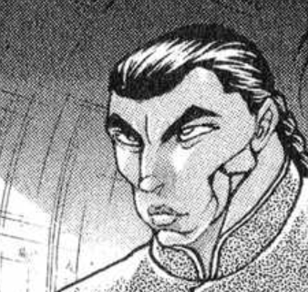
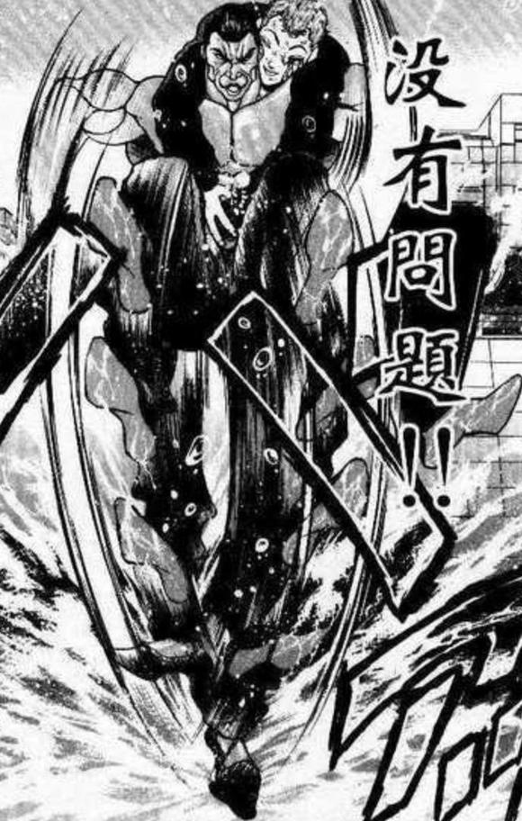
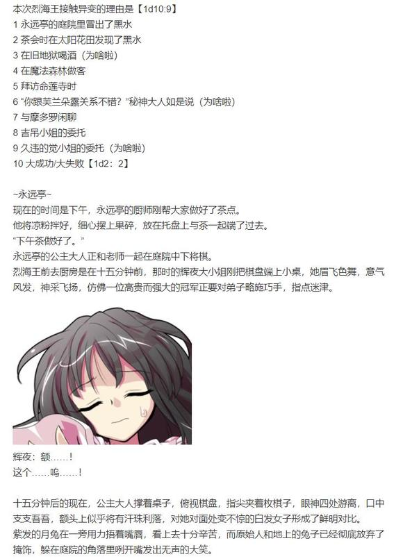
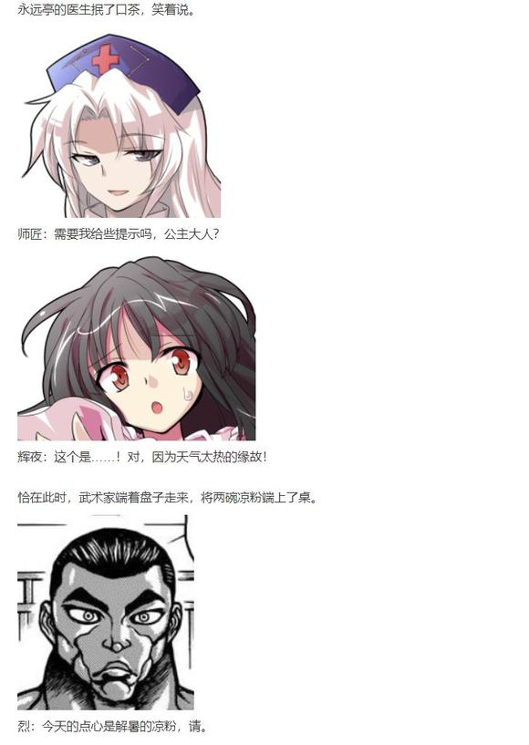
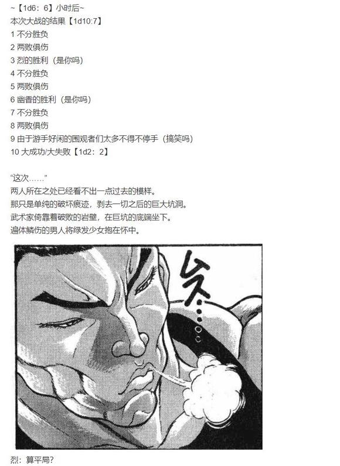
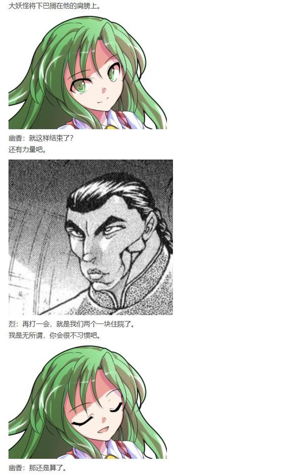
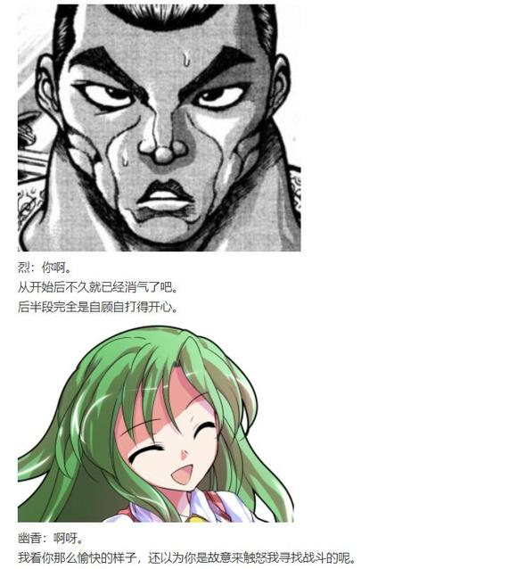
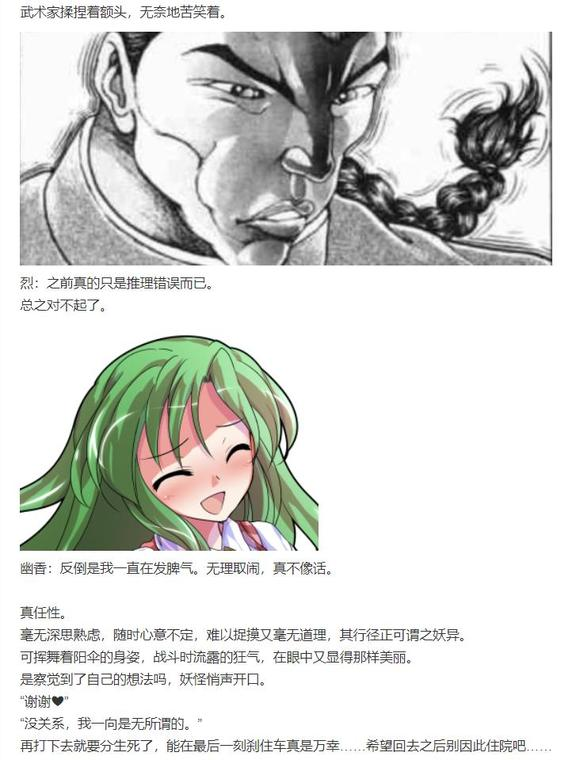
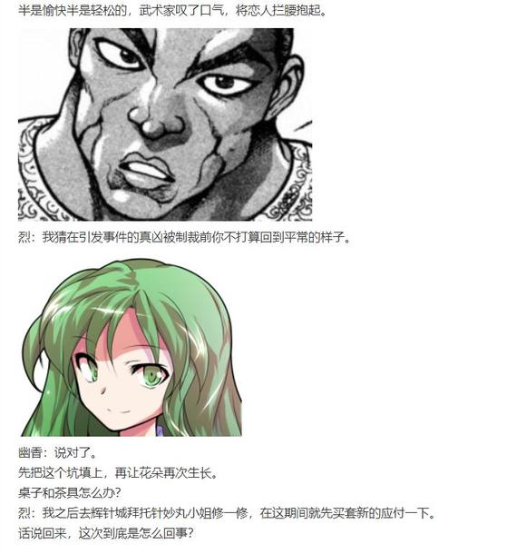
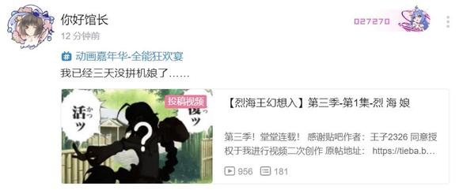

~开始前的提醒~

正如我之前所说，这次异变的故事并不长——全新登场的角色只有一位，也不似凭依华时那样有着故事背后的故事。

因此这次我打算回到刚开始时的篇幅量，简短的骰下然后隔个2·3天左右更一次，这个样子。

那么下一层开始更新

林间小道上堆着灰白的雪。

树木的枝条平整地向四周伸出，每一根都光秃秃的，看不见一星半点的叶或芽，只有不断落下，又不停积累的雪花。

小路上的行人抬起脚尖，靴子在雪地中又留下一个不深不浅的足迹。她回头望去，一路行来的足迹几乎都被落雪掩盖了，仅剩不远处的几个脚印作为行人曾经过的痕迹。

她又将目光投向头顶，自枝条的缝隙间瞧着不甚明亮的天。

干枯的树枝将天空划分为不规则的碎片，让她想起了暴雨夜一闪而过的雷电。

“抬头看。将颜色更换一下，不觉得很像雷雨夜的天空吗？”

抛出疑问后，她模仿着同伴的口气，在心中以那一本正经的严肃口吻作答：我觉得不像。

前方的男人停下脚步，抬起头来。他很是细致地观察了一阵，这才作答。

“我觉得不像。”

“我就知道。”

无意义的问答缓解了季冬时节的萧瑟，她抖落披风上的雪花，继续前进，超过了依然在沉思的男人。

赶超同伴时，她发觉对方的冬衣与围巾上不见一丝灰白。

“哎？雪呢？”

男人回过神来，依旧以那副古井无波的语气答道。

“我用魔力挡住了。”

七彩色的神明大人握起拳头发出抗议。

千亦：千亦：这不是犯规吗！

烈：……啊？

武术家单调地应了一声，以最简单的音节表露着自己的疑惑。

天空般的少女一边点着手指，一边数落着友人。

千亦：毫无生活情趣啊你。

既然选择了在雪天徒步前进就应该像普通人一样步行，用魔力挡住雪花不就跟直接飞行没区别了吗。

烈：千亦小姐，我一开始就建议直接飞过去。

千亦：千亦：那样还有什么意思。

今天是难得的假期，我好不容易休息一天出来玩可要尽兴才是——我还没仔细看过幻想乡的冬天呢。

而我已经看过很多次了……脑中浮现出某位魔法使的说教，武术家将实话吞了回去，决定尽快想个法子转移话题。

烈：你喜欢深冬的森林吗。

集市之神双手抱胸，放慢了脚步，与友人并肩而行。

千亦：妖怪之山上在冬季也很热闹，而森林这边则是一片萧杀景象。

地理位置荒凉，冬季又少见人烟，这样的地方很难举办集市。从商业角度只能说不合适，就个人喜好而言也说不上喜欢。

“呼……好冷。”

话说到一半，神明大人呼了口气，热气在化作一片转瞬即逝的白霜。

烈：我少有这样的体会，因为我冬天来这里基本都是找魔理沙喝茶。

千亦：噫-！

别提那个小偷！

烈：这么讨厌她吗，真少见。

千亦：上次在红魔馆举办集市的时候，她居然明目张胆地过来偷东西。

那到底是什么啊，幻想乡的特色吗？光明正大地拿起商品嘿嘿一笑骑着扫帚就跑我都惊呆了，旁边的摊主们还都一脸淡然地说什么“是魔理沙啊……”“黑白老鼠又来了。”“下次一定要给她点好看~”。何等冷漠！

千亦小姐越说越气，武术家绞尽脑汁也不知该如何说明。

烈：就，嗯。

她已经偷了很久了，大家都习惯了。

千亦：这种犯罪行为是能习惯的吗我好不容易准备的集市差点就被贼人破坏了要是再多抢点商品我就要卧床不起了。

武术家估算着距离，这条小路偏离魔法使的住处，而靠近森林西侧的溪流。

以现在的步速再走十多分钟就能到湖了，而深冬的湖面大抵是结着冰的。

千亦小姐十有八九会建议从冰面上走过去，那就还有二十多分钟……

烈：其实是因为这位魔法使才不喜欢森林的？

千亦：听上去活像无能者的迁怒。

我只是不喜欢冬季森林的气氛而已。

烈：春夏季的森林与这时的样子也着实不同。

可那时的森林阴暗潮湿，目光所及之处全是蘑菇，空气中弥漫着瘴气，恐怕你也喜欢不到哪去。

千亦：魔法使们为什么会选择这样的地方定居……

武术家耸了耸肩。

烈：就像你偏爱能便利召开集市的场所一样，魔法使们也喜欢实验材料丰富的地方。

我一向觉得这地方在夏天的特征最明显，可摩多罗女士却说魔法森林是“冬”的特质。

“摩多罗女士又是谁啊？”

“是我很敬重的一位神明。”

这样啊……千亦小姐点点头，转而解答着友人的疑问。

千亦：你的着眼点在于地区本身的特点，而那位神明做出如此评论的理由，则是祂关注着季节的特征。

师走之月，腊月，一年的日数将要告终，天寒地冻，万物休息。它是生命力潜伏的时段，选择无烟火气又比之以往萧条的森林作为冬的特质，是很合理的。

烈：……

武术家闻言一脸震惊，千亦小姐皱起眉头。

千亦：我说了什么很奇怪的话吗？

烈：千亦小姐居然说出了一番很有道理的见解……

千亦：就算一度落魄过我也是真正的古老的神明大人给我收起你那不知从何而来的偏见。

烈：是我思虑浅薄。

毕竟我……

千亦：你要是再提下级天狗的段子我就真的真的生气了。

他其实想说自己只是个武术家，但又一次想起某位金发小女孩的说教后，这男人决定赶紧再转移一次话题。

离走到湖心的洋馆还有十几分钟，他决定找一个能讲上一段时间的，可以勾起同伴好奇心的，且不至于说着说着就让她像现在这样气愤地鼓着脸的话题……

烈海王眨了眨眼，眼前白雪皑皑的冬景与他脑中夏季生机盎然的森林重叠，令他想起了一段往事。

烈：我们刚刚说到夏季的森林对吧。

千亦：森林这个话题还没过去吗？！

像是想起了什么有趣的事，武术家的脸上扬起笑意。

烈：这次是其他的事情。

你来幻想乡是今年春末的事，所以你错过了去年夏中的骚动。

那时的森林可是遭殃了。

不，不只是森林。那个夏天，幻想乡的不少地方都被折腾了一把……

少女那天蓝色的眼瞳亮了起来，这位今年新到来的神明被过去的事件勾起了好奇心。

千亦：是怎样棘手的麻烦，让强者众多的幻想乡也深受困扰？

又是神明或妖怪所引起的骚动吗？

也就是你们平时常说的，异变？

烈：该说一如既往，还是不同寻常。

正如千亦小姐所言，那又是一起神明和妖怪引发的骚乱。

武术家逐渐沉浸在了回忆之中，他不急不慢地讲述起了去年的故事。

自己曾亲身经历的那个夏天。

污秽，地狱，贪欲，流水，财富，还有异变中永远不会缺席的元素，只能以乱七八糟来形容的战斗……

烈：来说说黑水异变的故事吧。

武术家脑中的日历一页页向前翻去。

让撕下的页码飘回，让标志着月份的数字倒退，直至时光倒流至一年半前。

那是动物灵异变结束后的不久，幻想乡炎热的夏天……

烈海王来到幻想乡的第【834+30+1d30：1=865】天。

~时间回到烈海王来到幻想乡的第865天~

时值盛夏。

距离动物灵的异变只过去了一个月有余，曾前往畜 生 界的人们还未将那离奇地狱的景象彻底驱出脑海。

平日相见时，他们还不时说起那 畜 生 世界的见闻：如动物般生活的人类灵魂，如人类般行动的动物灵魂，高科技都市中的远古埴轮，爱着灵魂的神，支配灵魂的畜生，还有在这弱肉强食的世界中，由所有灵魂共同建造的混乱中的秩序……

找遍地上的每一寸土地都发现不了如此荒唐的地方，其情景与地狱之称呼在负面意义上正是相得益彰。

“以后可不会再去那里了。”，参与事件的每个人都这样想。

可人类终究无法理解畜生，正如他们想不到畜 生 界的纷争会将幻想乡卷入一般，他们也没有想到，因畜生之欲而引发的事件还未结束。

远离地表的暗无天日之底，无尽贪婪的兽类正发出渴望的笑。

该说是意料之外，还是一如既往？这个夏季的喧闹还未结束。

动物灵异变的一个月后，怪异的黑水自地上涌出。

有关于能源，地狱，流水和贪婪的异变，开始了。

~自机介绍~

踏水如飞的武术家

类型 以技术破解弹幕的技巧型

操作难度 ★★★☆☆

辉夜：你——！

鈴仙：噗。

公主大人憤怒地指著廚師，武術家一臉的莫名其妙，月兔終於憋不住笑出了聲。

烈：我方才見輝夜小姐神色自得，想必是局勢一片大好，為何現在……

師匠：哈哈哈哈！

長發飄飄的公主大人端著涼粉起身，以空閑的手指向了座位。

輝夜：我不玩了。

烈海王，你來下。

烈：啊？我不会下将棋啊——

“嘟~噜噜噜噜噜~”

“嘟~噜噜噜噜噜~”

烈海王腰间的通讯器恰在此时响起。

师匠做了个手势，他心领神会地将眼珠状的通讯器拿到手中，屏幕上显示着这通讯器原主的名字。

烈：下午好，觉小姐。

通讯器的另一端是地灵殿的主人，地底的读心侦探。

古明地觉单刀直入地发出邀请。

觉：下午好，烈海王。

地下发生了奇怪的事件，你有兴趣来帮忙吗？

这邀请对现在的烈海王宛如雪中送炭，他宁愿去厨房忙活几个小时也不想和自己的女朋友下棋。

烈：没有问题。

稍等我将今天的晚餐做好就动身前往地灵殿。

读心侦探确认时间后结束了通讯，武术家一脸的兴高采烈。

师匠：要你去调查事件，又不是一定要战斗，别摆着那么一幅兴奋的脸。

去吧去吧。

烈海王赶忙走出庭院，临行前他看见黑发少女指着座位，说：“优昙华，你来下。”

铃仙：哎？！

我吗？！

皮克：哈哈哈哈！

帝：哈哈哈哈哈哈哈！

希望今晚回来时铃仙姐的自尊心还能完好无损……心中默默为将与月之头脑进行智力游戏比拼的月兔献上祈祷，烈海王前往旧地狱了。

路上有事发生吗【1d100：2】大失败（70以上好事，30以下坏事）

烈海王大失败！

大失败是什么【1d10：3】

1 吉吊小姐：该还人情了

2 摩多罗：就先让你来试试……

3 黑水在太阳花田喷发，幽香暴怒了（为啥啦）

4 吉吊小姐：该还人情了

5 摩多罗：说到特训……

6 被当做异变罪魁祸首的正邪（为啥啦）

7 吉吊小姐：该还人情了

8 恰在此时，黑水在烈海王的脚下爆发！

9 刚好将带着任务外出的船长撞晕了（为啥啦）

10 大成功/大失败【1d2：2】

前往旧地狱的方法有许多，烈海王本次的目的地是他平时最惯用的洞窟，也即妖怪之山的幻想风穴。

不知道这次又是什么样的事件，说不定会与怨灵有关……这样想着的同时，武术家的腰间的通讯器又一次响起。

烈：？

武术家疑惑地看着屏幕，他清楚对方的习惯，她可极少用这样的手法联络自己。

烈：喂，幽——

地狱妖精微微颤抖的声音在通讯器的另一头响起。

克劳恩皮丝：肌肉疯子朋友大人！快来花田！

快点！幽香她生气了啊啊啊啊！！！

烈：你坚持住我马上到！

武术家用最快速度给做侦探的朋友发了条短讯。

烈：急，安抚女友，明日再来。

觉小姐很快给出了回应。

觉：现在还不是急切的事件，明天再来也没问题。

加油，祝顺利生还。

烈：哦哦哦哦哦哦哦！

烈海王如流星般飞向了太阳花田。

~【1d7：4】分钟后~

~太阳花田~

烈：嘶——！

还未来得及着陆，武术家就已经感受到了那股触目惊心的杀气，宛如实质的压力在花田的中心扩散开来，让躲在向日葵后的妖精们瑟瑟发抖——不时能看见有倒霉蛋翻着白眼倒下，又被神志清醒的同伴们抬走。

他紧张地吞了口吐沫，一步步向中心走去，耳中逐渐听到了熟悉的对话声。

“幽、幽香，冷静，冷静一点，大家都理解你的，那真是太糟糕了，但是别露出这样可怕的眼神……”

“你在说什么呢，克劳恩皮丝。我很冷静啊❤”

烈：（我的妈呀。）

烈海王在一众妖精无声的鼓励中走向花田中央，他小心翼翼地绕开最后一朵阻碍视线的向日葵，鼓起勇气开口。

烈：幽香，怎么了——

身穿白衬衣红马甲与红色格子长裤的大妖怪正将阳伞扛在肩头。

她绿色的长发随风飘荡，眼瞳中的赤红变为了宛如春天般的碧色。

听见了恋人的声音后，幽香转过头来，向他温柔地笑着。

幽香：是烈啊。

不用紧张，只是刚刚遇到了点不愉快的事情而已。

烈：（完全是决战状态了啊啊啊啊啊！到底遇见了什么事情！！！！！）

南无三，何等可怖的场面！杀气与压力的双重作用下，生机勃勃的花田仿佛随时都将化作无间炼狱！

要进行平时的快速思考？做不到！就算是幻想乡的名侦探也做不到！这时的烈海王仅能在最短时间内找出现在环境中可能拥有的提示！

凭借超人的洞察力，武术家瞬间扫视了案发现场！

提示之一，是克劳恩皮丝用火把指着的衣服，那是幽香平日所穿的服装，如今染上了一片漆黑，像是被泼上了一桶黑水。

提示之二，是平时开茶会用的小圆桌……哦哦……天啊……圆桌的中央开出了一个大洞！像是被某物从下方冲破了一样！

提示之三，是粘稠的黑水，这黑水自地面的坑洞为中心四散，染黑了幽香常用的茶具。

提示之四，是搭在椅子上的，似乎刚用过不久的湿漉漉的毛巾。

快想想，烈海王！侦探在心中对自己大喊，要让她平静下来才行！！

烈的察觉【1d100：29】（大失败无加成，50以上成功）

武术家抿了下嘴唇，以尽量平静的语气开口。

烈：我完全理解了。

幽香，你……

幽香：我怎么了？

烈：你由于料理事故做出了可怕的黑色液体！

大妖怪身后的妖精双手捂脸，那无声呐喊的表情宛如世界名画。

一定是错觉。

他的直觉告诉自己，刚刚的推理是正确的。

幽香：然后呢？

烈：然后，你在收拾残局的时候不小心把茶具弄脏了。

恼羞成怒的你一拳砸向桌面，将平时我们用的桌子打坏了，不仅如此，还一拳洞穿了地面！

大妖怪点着头，发出自心而生的感慨。

幽香：哦~~

原来如此啊~~

烈：这一连串动作最后导致迷之液体洒在了身上，于是不得不去换了身衣服。

由于失败作黏在头发上洗不掉就索性切换成了战斗模式，我说的没错吧！

真是完美的推理，烈海王在心中赞叹着。

这一刻，这个瞬间，无疑就是名侦探烈海王职业生涯中，那恒光亮丽的最高峰了。

只是。

为什么。

亲爱的幽香小姐，所表现出的怒气与战意，不仅没有减弱，反而成倍增长了……？

风见幽香笑眯眯地举起阳伞，伞尖闪烁着熟悉的光。

那语调令人联想起春日的暖阳，轻柔，温柔，宛如恋人之间的低语——

“完全错了你这笨蛋。”

烈：我就知道哦哦哦哦哦哦！

克劳恩皮丝：快——跑——啊——！！！！

地狱妖精的喊声宛如号角，向日葵后的妖精们扛着同伴举着同伴拖着同伴用尽全身魔力飞散而逃。

一秒钟后，整个幻想乡的人们都看到了花田中央升起的璀璨光芒。

幽香：喝茶的时候桌子底下突然喷出了古怪的黑水，之后就是你看到的那样了。

烈：你竟然会中招？！

幽香：就算是我也有无防备的时候。

你在永远亭用餐时也不会防备来自桌底下的袭击吧。

烈海王晃着脑袋。

烈：我说的不是这个。

我的意思是，这种古怪的事件你应该早在我们所有人之前就察觉到征兆并详细了解了……

幽香：我只知道自己知道的事情。

还是说，你一直都以为我什么都知道吗？

烈：嗯，对。

武术家一本正经地点头，大妖怪哑然失笑。

烈与幽香今晚的行动【1d10：5】

1 觉小姐的委托说不定与此有关

2 幽香：先调查黑水吧

3肯定知道点什么的秘神大人或者师匠（为啥啦）

4 觉小姐的委托说不定与此有关

5 幽香：现在就开始调查，目标地底

6 就靠幽香的情报网（为啥啦）

7 觉小姐的委托说不定与此有关

8 说到地底就是鬼族

9 把调查事件的家伙全部打一顿搜集情报（喂！）

10 大成功/大失败【1d2：2】

~十几分钟后~

方才战斗造出的巨坑总算被填平。

烈海王擦了把汗，在一旁瞧着一朵又一朵向日葵从土地中长出，又在数秒内依次盛开。

不到半小时的功夫，太阳花田的核心区域看上去又和以前一模一样了。

烈：让花盛开在这时真方便。

那现在——

幽香：现在我们去地底，把这次异变的黑幕找出来。

烈：现在吗。

姑且不提天色已晚我们刚刚打完一场的现在就去调查吗。

幽香：当做睡前的消遣刚刚好。

还是说你已经筋疲力尽了？那我一个人去也行哦。

武术家伸出手臂，面色如常。

烈：只是不习惯在深夜出门而已。

我一向是无所谓的。

两人挽着手离开了花田，仅看背影活像是在夜空下散步的情侣。

忽略目标不谈，实际上也是如此。

烈与幽香前往地底了

——————

由于大失败在调查前打了一场长达6小时的高强度战斗，本日战斗时烈海王的Atk将会视情况降低。

且每次调查骰都有概率因怪异原因行动不能，打道回府。

——————

~十几分钟后~

~魔法森林~

咕嘟，咕嘟，咕嘟。

液体涌出的模样令他想起了幼时曾见过的泉水。

这声音粘稠又低沉，不似泉声轻响，倒像血液流淌。

可两人心中却未感到一丝违和，因为这从地下不断涌出的液体并非清泉，而是散发着异味的黑水。

放眼望去，森林草木之间尽是一股股喷起的黑泉，不祥的液体泼洒在绿叶上，滴落在蘑菇顶，那异味与森林中的瘴气混合，简直让人误认为进入了哪里的魔境。

烈：魔法森林怎么成了这幅样子？

之前花田喷出的不会也是……

幽香：就是这个。

武术家皱起了眉头。

烈：我明白你为什么会那么生气了。

我的天啊，这也太……

魔理沙明早起来会惨叫吧。

幽香：魔理沙反而会很开心吧，又见到了奇奇怪怪的东西。

说不定会兴高采烈地收集一大瓶拿去做实验呢。

烈的察觉【1d60：32+40=72】（65以上认出，75以上搜集些样品）

武术家蹲下身子，用手指沾了点黑水观察起来。

他隐约觉得自己在哪里闻过这种刺鼻的味道，这液体的模样也很似曾相识。

既视感，没错，他一定在哪见过这种东西，远在来到幻想乡之前，日常生活中偶尔都会闻到的味道——

烈：！

这是石油啊！

幽香：石油？

烈：这刺鼻的气味和加油站在加油站能闻到的很像。

怪了，为什么幻想乡的地下会喷出石油来？

他看向恋人，希望经验丰富的对方能给予些许提示。

幽香歪着脑袋，难得露出了疑惑的表情。

幽香：石油是什么？

烈的化工学【1d100：12】

烈：就是那个……黑色的燃料。

深埋在地底的能源。

幽香：哦？

烈：很珍贵的。

幽香：嗯？

烈：……

武术家憋不出话了。

幽香：你也只知道个名字吧~

烈：我以前上课也没学化工啊……

从森林这边真能去地底？

绿发少女用伞尖拨开挡路的灌木，一个深不见底的洞窟轮廓在两人面前显露。

幽香：除了你平时走的幻想风穴外，前往旧地狱的通路还有很多。

这个应当是第五大的。

武术家先一步踏入洞窟，在深不见底的洞穴中下落。

他聆听着两旁呼啸的风声，心想，这般宽广的道路都只排到第五，平时常走的风穴不知又在第几位。

幻想乡究竟有多少与地底联通的路？

如果这黑水都是从一个源头涌出的，那岂不是说，所有黑水喷出的地区都是与旧地狱相连的……？

他抬头望去，幽香撑着阳伞缓缓下落，绿色的长发在空中舞动着，却由于缺失光照看不清晰。

如果是平日那副长裙的打扮，或许就会换个姿态下落了……他在心中不着边际地想着，突然发觉这样的动作过于失礼，赶忙又将头低下。

“你好像感觉很可惜。”

“是你的错觉。”

“真的？”

“……咳。”

他发觉无论如何回应最后尴尬的都是自己，赶紧提起魔力，在对方的笑声中加速落下。

这时的旧地狱【1d10:9】

1 山女小姐·小伞恶作剧中

2 勇仪与来访自机交手中

3 芙兰朵露特训中（好快）

4 一个人调查的觉小姐

5 一片平和

6 炫富的贫穷神姐妹（好快）

7 一个人调查的觉小姐

8 勇仪与来访自机交手中

9 船长行动中（好快）

10 大成功/大失败【1d2：1】

说真的为什么这么快啊【1d10:1】

1 责任感很强的觉小姐提出了委托

2 凭借以前被封印时的情报网

3 因贫穷神姐妹行为而决定说教的圣（为啥啦）

4 责任感很强的觉小姐提出了委托

5 紫苑：我感觉有点怪怪的

6 黑水恰好在讲经时爆发（为啥啦）

7 责任感很强的觉小姐提出了委托

8 另有计划的摩多罗

9 黑水恰好在神子来做客时爆发（为啥啦）

10 大成功/大失败【1d2：2】

~地灵虹洞~

BGM：昏暗的风穴

烈海王沿着魔法森林的洞穴下落至尽头，他所见到的并非是想象中的温泉街入口，而是阴暗又潮湿的地下洞穴。

滴答滴答，水滴从顶端的钟乳石尖落下，在地上留下了一层不浅的积水。

武术家用精巧的技术在水面上行走，他能看到光芒自洞顶的缝隙间隐约透下，此处离地表的直线距离似乎还不算远……

“真讨厌，湿漉漉的。”

后到的大妖怪索性飘在了空中。

幽香：黑水和普通的积水混在了一起，该穿靴子出来的。

烈：用你的能力让花在水面上盛开，然后踩着花过去？

幽香：花是用来观赏的。

烈：那就这样往前飞一阵，这里离温泉街距离应该不远……？

话音未落，武者挑起眉头。

他听见洞穴深处传来了某人的说话声，那声音似乎在哪里听过……

“输了——”

“好好，看来你是帮不上忙呢。”

“是地利的缘故！村纱在这种有水的地方优势太大了！”

“一开始说着让‘你知道地底也会下雨’就袭击过来的妖怪是谁啊？再说才这点积水也就一两法水炮而已，是真格实力的差距啦实力。”

“村纱坏心眼！我也想要那个黑水。”

“所以说我是因为正经的委托才过来的才不是来玩的！！”

声音越来越近，谈话的两人在洞窟的拐角处显露身形。

其中一位是以单足站立，不断蹦跳着的蓝发少女，武术家在过去的某起事件中与她见过一面，她是命莲寺的唐伞妖怪，喜欢吓人的多多良小伞。

与小伞交谈的另一人是位黑发绿瞳的少女。她身穿白青相间的水手服，胸前打着红色领带。她现在的打扮与平时不太一样：武术家记得她平日戴着顶水手帽，今日却换成了海军帽，双手也戴上了白手套，背后更披上了一件镶金边的黑色大衣。她平时会将一枚巨大的船锚背在身后，这时却拽着铁链将其竖在身侧，看上去像是刚结束了场战斗一样。

幽香：命莲寺的妖怪怎么跑来地底了？

小伞：呀！那是花田的风见幽香！

烈海王想起了她的名字。

烈：我记得你是命莲寺的村纱水蜜小姐？

村纱的好感度【1d100：86】（怎么说也算是熟人了保底10）

村纱：这不是！常来庙里的烈师傅吗，在这种地方遇见还真稀奇。

还有花田的幽香小姐，您好啊。

会选择这种地方作为决斗场所，该说真不愧是两位吗~

幽香：晚上好，不是决斗而是约会。

刚刚似乎听到你们说了“黑水”？

花田的妖怪眯起眼睛微笑着。

“咿呀！”喜欢吓人的小伞小姐惨叫一声躲到了船长身后。

烈：幽香。

还是就由我来交涉吧？你现在的状态比较……

幽香：比较什么？

村纱：压迫力太大了幽香小姐~

就像血战一场后依旧怒气未消的样子，简直能闻见血的味道。

小伞可顶不住这样的威势呀。

幽香：哎呀，失礼了。

那就由烈和你交流情报吧。

那边的妖怪似乎对我有些误会，我去欺负她一下❤

小伞：直接说要欺负人了这个妖怪——！

救命啊——！

唐伞妖怪撒腿就跑，喜欢欺负人的幽香小姐瞬间出现在她的身前，开始了和善的交流。

村纱按了下帽子，移开目光。

村纱：那个人完全是故意的吧。

烈：她性格是这样……比较……喜欢开玩笑。

船长小姐坏笑着用手肘戳向武术家，被习惯性的消力消去。

村纱：烈师傅下次来寺里给小伞多带份点心呗。

烈：咳咳，没有问题！我给你也多带份。

该叫村纱小姐？还是像大家一样称呼你船长。

村纱：小姐什么的好奇怪！叫船长就行了。

说来你们也是来调查黑水的？

啊，大妖怪那模样该不会……

烈：那黑水造成了极惨烈的后果，我们现在都非常想找到引发这次异变的黑幕。

船长是否知道些什么？

船长将船锚甩到背后。

村纱：实话实说，我也不是很清楚。

我们的地盘上还没出现过黑水喷发，这次是地下的老大派猫来下的委托。

说是地下出现了奇怪的黑水，想找个水性好的帮手在今晚先探探底子。

古明地觉和她的火车宠物的模样出现在了武术家的脑海中。

烈：哎，这本来是我今天该做的！

觉小姐今天下午先是找的我——这个我们边走边说吧。

船长以前来过地底？

村纱：你以为为什么圣大人派我来？这地方我可比寺里还熟呢！

喂小伞，我们要出发了。

两人看向洞穴的角落，大妖怪正用手指戳着蓝发少女的脸。

小伞：啊呜啊呜啊呜啊呜。

幽香：真可爱~

那就再见了，小伞妖怪~

小伞：再见幽香小姐！

唐伞妖怪颤颤巍巍地跳走了，心情舒爽的妖怪发出了愉快的笑声。

这人性格真的有够恶劣的，两人不约而同地同时想。

现在的温泉街【1d10：10】

1 大晚上的没人调查也没人闹事，勇仪饮酒中

2 灵梦突入

3 烈师傅由于高温蒸汽头昏了（你搞笑吧）

4 大晚上的没人调查也没人闹事，勇仪饮酒中

5 魔理沙突入

6 贫穷神姐妹挖石油中（好快）

7 大晚上的没人调查也没人闹事，勇仪饮酒中

8 温泉大会！温泉大会！

9 大擂台！大擂台！（搞毛啊）

10 大成功/大失败【1d2:1】

大成功！

大成功是什么啊【1d10:1】

1 觉小姐神机妙算……其实是从妹妹那里听到了有趣的情报

2 秘神大人：人这么齐全刚刚好

3 阿空的大活跃（为啥啦）

4 觉小姐神机妙算……其实是从妹妹那里听到了有趣的情报

5 芙兰朵露中场休息中

6 阿燐的大活跃（真的假的）

7 觉小姐神机妙算……其实是从妹妹那里听到了有趣的情报

8 勇仪的详细说明

9 喝到一半被黑水淋了一身的勇仪（为啥啦）

10 大成功/大失败【1d2：1】

~十几分钟后~

~旧地狱温泉街~

沿着陌生的通道向下深入，不知不觉却看到了熟悉的街道。

位于地底的旧都，在黑暗中闪烁灯火的被遗忘之城。幻想风穴下方是旧地狱的商业街，自地灵虹洞走入的众人则抵达了妖怪们的温泉。

“旧地狱的温泉吗——好怀念。”

船长愉悦地笑着，发出感慨。

烈：船长以前经常来这？

村纱：过去我常在这里恶作剧啊。

把饮泉用的长勺捅漏之类的，把浴桶的桶底捅漏之类的……

把大浴场底部捅漏之类的。

烈：虽然能想到勇仪在旁边哈哈大笑的样子，但最后一个已经不是恶作剧而是恶性事故了吧。

幽香：反正到最后都是以打一架收场，这里的住民会在乎吗。

只有那种与地底格格不入的，性格一本正经的妖怪才会困扰吧。

就像前面那位一样。

滚轮碾过石子，发出细碎的响声。

在路旁众鬼畏惧的眼神下，火车妖怪推着轮椅穿过街道，走向了露天温泉旁的众人。

轮椅上坐着位粉色短发的少女，她抬眼扫视着三位来客——在看到长发的大妖怪时明显僵了一下——缓和表情后才准备开口。

觉：——

这里过一个对读心的抵触

幽香【1d100：86】（保底40）

村纱【1d100：23=40】（保底40）

幽香：和觉妖怪交涉的任务就交给你了。

我不喜欢被读心的感觉。

做出如上发言后，大妖怪飞退至几百米后，留下面色尴尬的武术家和无精打采的觉。

阿燐：（太失礼了吧这个人！觉大人，她好过分！！）

烈：（失礼了……）

觉：我们也打不过她呀。

没关系，大家都是这样的，我可以理解。

船长也没关系吗？

村纱：我没想什么奇怪的事情所以没关系~

觉：趁大家不注意用船锚给温泉浴场捅个洞，我觉得这算是很奇怪的事情了。

不会让你这么做的。

村纱小姐用双手抱着自己，原地跳了起来，那模样令武术家想起了被惊吓的猫。

村纱：心里毛毛的——！这能力——！

觉：“不会连我接下来想说什么都知道吧。”是的，就是这样。

读心妖怪看向远方，无所事事的大妖怪正让花朵在泉水中生长。

白雾笼罩，幽光照耀，朵朵莲花绽放在温泉的水面上，咋一眼看过去宛如古卷中记载的仙境……只是原本泡在水里的鬼们各个脸色发青，让这画面显得违和了些许。

觉小姐决定当做什么都没看见。

觉：我要先感谢你愿意下来协助，也祝贺烈海王没有住院就解决了问题。

我想知道的是你和幽香小姐来到这里的缘由，还有她为什么会以那副模样出现。

烈的说明【1d100：15】

觉：啊糟了。

不该连续抛出两个问题，这已经超出他的语言能力范围了。

烈：哦哦哦哦哦哦哦哦哦！

由于不知道该如何快速说明这一连串事故的前因后果，武术家打起了车轮拳！

幽香：哈哈哈哈哈哈！

阿燐：****朋友还更失礼啊喂！

村纱：啊哈哈哈哈！

这就是那个吗！永远亭的名物，手舞足蹈的武术家，这还是第一次亲眼看见啊！

手足乱舞的男人口中吐出混淆不清的声音，妖怪们或是大笑，或是苦恼，而温泉水里的恶鬼们则脸色铁青地看着身旁冒出的莲花。

真可谓是地狱般的图景，话虽如此这也的确是过去的地狱。若说地底的混沌既是安泰，那今夜的旧地狱应当也是一片平和。

~【1d15：15】分钟后~

幽香：好了给我停。

幽香将一个花弹扔进恋人嘴里，终结了长达十五分钟的混乱言语。

烈：唔唔。

村纱早在十分钟前就已经笑得跌进了温泉里，泡了会水再出来的幽灵似乎状态绝佳。明明整个人掉进水里了却一点湿掉的样子都没有，或许这就是船幽灵的优势。

村纱：要笑死了。

结果到底说了什么啊？

觉：靠着零零碎碎的读心大概明白了。

黑水恰好在糟糕的时机爆发，这可真是……

我今天请船长过来本来是想先去地下探探情况的。

你和幽香小姐呢？“打算找出引发黑水异变的黑幕因此请让我们同行”。好的。

觉小姐用手指敲打着轮椅的把手，思考了一阵，看向了幽香。

觉：幽香小姐，今天可能会让你失望了。

我之前得到了暧昧的情报。

如果属实的话，这次的事件就无法用单纯的暴力解决。

幽香：能力特殊的妖怪？还是地底深处的怪异环境？

觉：不好说，我无法确信自己的理解就一定正确。今夜就先到地底看看情况。

各位没有与我一样的读心能力，或许会对我的话语感到些许疑惑。

烈：觉小姐似乎已经把握了部分状况？

觉：的确如此。

跟据我得到的情报，这次的事件意外棘手呢……

——————

武术家停下脚步。

故事尚未讲完，路途已经结束，两人走出了白雪皑皑的森林，来到了溪流下游的雾之湖。

白雾之下的湖面结着一层坚冰，这倒为赶路的人提供了一层方便：只需控制好身体重心，就能在湖面上稳步前行。

烈海王准备招呼同伴前进，一扭头却发现神明大人正死死瞪着他。

烈：怎，怎么了？

千亦：那个“觉小姐”到底知道了什么？你们这几个乱七八糟的家伙下到地底又做了什么？归根到底为什么幻想乡的地下会有石油？引发石油异变的又是哪里的哪个妖怪？

故事才开了个头就“下次再说”哪有你这样的啊？

烈：这个讲起来估计还要段时间。

你今天不是来红魔馆参加活动的吗，还是正事要紧吧？

千亦：来参加冬日美食节的话就算边听边吃也没问题。

好了今天我请客你快点继续。

烈：难得见你这么豪气，看来今年下半年挣了不少。

我想想，之后……

咯啦！

恰在此时，坚冰破碎的声音响起。

一艘木船破开了层层坚冰，豪气地顺着溪流而下。身穿水手服的少女站在船头，向岸边的熟人打了声招呼。

村纱：烈师傅也来啦！

这位生面孔又是谁啊？

烈：这位是山上的集市之神，天弓千亦。

前阵子的卡牌异变就是她引发的。

千亦小姐双手叉腰，似乎因这介绍感到很骄傲的样子。

村纱：是神明大人啊，失敬失敬。

我正好接了红魔馆的单子运水产，顺路载你们一块过去？

千亦：那就多谢你了。

水产是指山上的鱼吗？

村纱：是三途河的，那里的牛鬼会卖幻想乡找不到的稀有鱼。

这次下单的量蛮多，靠红魔馆的女仆一个人是运不完了，索性找我来一口气运完了事。

武术家琢磨了几秒，好像明白了什么。

烈：你这一船鱼够吗？

船长耸了耸肩。

村纱：实话实说我觉得够呛。

但她就算吃得完也未必付得起吧？

千亦：你们在说什么？

烈：是刚刚和你说的那次事件的后续。

我们说到哪来着？对了，我们到地底遇见了觉小姐……

（本日的更新结束，下一次更新在后天或大后天，骰子结束后一块发）

（以下是我的废话）

刚欲异闻的故事开了个头，既然故事不长索性就分开几次更新吧，这样一来我也轻松一些~

于是乎本次异变就在这样怪异的氛围中开始了。

由于是发生在过去的异变，因此这次用了烈海王讲故事的方式叙述，正好千亦小姐很适合捧哏且肯定不会在黑水异变登场就让她来当这次听故事的人。

——然后这异变到底是怎么回事。

开始骰到觉的时候我还很高兴想着好久没有写觉小姐了这次就朝着觉的高光回发展。

结果刚一出门就大失败幽香砸进来了啊！！！

哎呦喂完蛋，本来就不多的紧迫感这次几乎又为0了。

下地狱后又遇见了船长，啊，我还想着命莲寺的妖怪们应该好感度都不高的顺理成章打一场结果86。

再下一层又遇见了觉，觉又大成功了，这boss的底子都露的差不多了不说参与打架的都组了个四人小队，这还怎么办啊。

不会又和凭依华一样多人殴打吧（悲）

刚开始就打了6小时架的烈师傅真不容易。

顺便一提出来打酱油的小伞总是幻视成其他贴子的样子，固有印象太恐怖了（笑）

那么本次的更新到此结束，下一次的更新在后天或大后天，骰子结束后一块发。

思考了一下明晚更也没问题 那就明晚八点继续吧

由望远镜海皇 @望远镜300   制作的视频第三季第一集更新啦！

本集的内容是鵺战斗回，大家感兴趣的话就来看看吧）

木船两侧冰屑飞溅，湖心的洋馆离他们越发近了。

船头的武术家将思绪沉浸在回忆之中，继续讲述着去年夏天的故事。

烈：我们说到哪来着？对了，在地底遇见了觉小姐。

她向我们告知了有关这次异变的情报……

觉：让我们先从这次的敌人说起吧。

那是恋恋在某次闲聊时与我说起的事情。

——————

~一段时间前~

~旧地狱~

旧地狱街道的一角，某件幽静的酒吧中，背负龟壳，生有龙角的女子正一人独酌。

这间酒吧是她不久前托友人关系购买的私人产业。

这里没有服务员也没有调酒师，只有摆放着一瓶瓶美酒的酒柜，和一个设施齐全的吧台。

对于忙于应付工作，天天勾心斗角的她而言，这样寂静而无需与人交流的场所是个度假的好去处。

“吉吊小姐~”

可无人的酒吧中却传来了熟悉的招呼声。侧目看去，头戴钢盔的觉妖怪正坐在吧台上晃荡着双腿。

恋：这间酒吧怎么没有人呀？

吉吊：我想在这种地方也找不到值得信赖的员工。

我并不惊讶您会找到这里，【但我想您应当先从吧台上下来。】

恋恋从吧台上跳下，跑去冰柜里翻了半天，拿出了一瓶冰番茄汁。

恋：鲜红似血的颜色，是大瓶装的血腥玛丽！

吨吨吨吨吨。

鬼杰组的组长用单手撑着脸，瞧着一口气干掉小半瓶番茄汁的女孩。

吉吊：味道如何？

恋：好……酸……

为什么我要喝这个啊？

吉吊：如果连您自己都无法掌控自身的想法，恋小姐，那其他人也无法回答您自己的疑问。

“咕嘟咕嘟咕嘟。”

她给友人倒了杯冰水，恋恋捧起杯子一饮而尽。

恋：吉吊小姐今天休假吗？

吉吊：我是来工作的。

您应当知道前段时间发生的事件，也就是幻想乡所谓的动物灵异变吧。

恋：是大家在河边和动物的灵体大打出手的那一次~

不知道是出于什么原因，我在三途河看了好一阵呢。

吉吊：畜 生 界的平衡被我计策中引来的助力摆平了，由此而出现的与某位怪人的恩怨也在前日了结。

连我都以为此事可称之为暂告一段落，却不想有只阴险的畜生趁机打起了小算盘。

鬼杰组的组长轻笑着给自己倒了杯酒，那笑容足以令见到的每一个人浑身发寒。

觉妖怪不知从哪找出一盒牛奶，坐在吉吊身旁用吸管一点点吸着。

恋：嗦嗦……畜生们不都很阴险的。

吉吊小姐也很狡猾呀。

吉吊：如您所言，这对畜生而言是种夸奖。

但该说是做派不同，还是说行事风格的问题……我对那位组长是看不过眼。

若说马是只知力量的庸才，那她就是贪婪无比的蠢货。

恋：听起来是什么都想要的家伙。

吉吊小姐冷笑着将酒杯一放。

吉吊：毫无满足可言的贪婪者，背信弃义的卑鄙之兽。

天马去了三途河佯攻引开注意力，我在畜生界的入口引导战力入网，而刚欲同盟的盟主去哪了？待到骚乱结束后我才来得及处理这一问题，结果不出意料之外，我们冷静又聪慧的组长小姐从混乱的旋涡中抽身而出——她留下部下当做棋子，自己第一个逃跑了！

立于安宁之处冷眼旁观，观望局势坐收渔翁之利，真是明智的决策！

恋：总是喜欢利用他人的吉吊小姐这次却被那位组长利用了~

你要报复她吧！

吉吊：您说得对，我一定要报复她。

觉妖怪跳了起来，兴奋地挥舞着双手。

恋：那我们把她找出来，塞进阿空的炉子里当柴烧吧！

