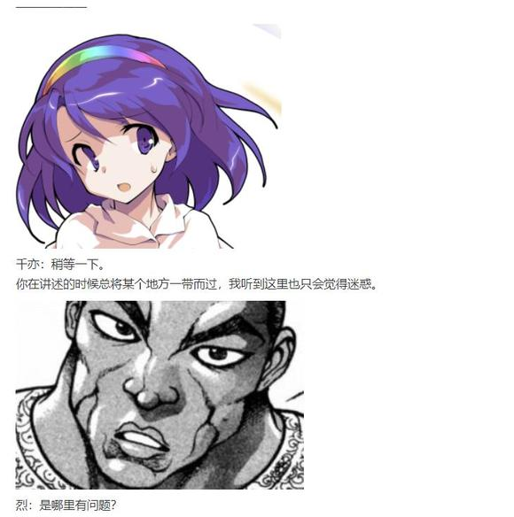

这可爱的孩子时不时会说出残忍无情的话语，可言行中却无一丝恶意。

吉吊尤其钟爱友人的这一特点，这无垢的恶意令她感受到了一丝与地狱风格不同的亲切。

像是什么都没在想，又像是心中早有打算，难以捉摸的离奇为妖怪的言行带来了恐惧。她想这很好，若失去了这份异常，那她的友人反倒成了个无趣的人，就像她的姐姐一样……想到这里，吉吊的脸上扬起笑意。

吉吊：感谢您的好意，但我偏爱更委婉的方式，而现在的我们也法将腥臭血液中的恶兽揪出。

我刚刚想到了一个主意。

您想知道这位组长是只什么样的野兽吗？

恋：没什么兴趣。

黑道组长面色不变。

吉吊：我想您的姐姐会很想知道的。

恋：哦哦，有道理！

可以当故事说给姐姐听~

吉吊：您的姐姐听到这句话也会很开心吧。

那就来聊聊我的老对手，刚欲同盟的盟主。

和畜生界的大多数灵魂一样，她卑鄙又狡诈，善于利用他人。若说与你所见过的动物灵们有何处不同，那就是她虽偏爱坐收渔利，却又惯于独自行动，她的部下们也都是帮各行其是的家伙。

绿发的觉妖怪将钢盔翻了过来，顶在鼻尖上，正努力以单脚站立的姿势维持平衡。

恋：啊！

脆弱的平衡仅过了半秒钟就维持不住了，少女一屁股坐倒在椅子上，吉吊伸手接住钢盔，一边讲述着情报一边将其扣回友人的脑袋上。

吉吊：而她的另一个特殊之处，就在于那份永无止境的贪婪。

什么都想要，什么都想吃掉，这贪欲也是她能力的正体——无论实体还是灵体，有机物还是无机物，她能够吞噬眼前的一切，并在这过程中理解被吞噬的事物，将其转化为自己的力量。

恋：什么都能吃的话，不就连弹幕也能吃掉了？

吉吊：任何能力都是有限度的，若仅是如此还算简单。

真正棘手之处在于她的正体。

我之前说过她很贪婪，那是因为她是由纯粹的贪欲所构成的生物，只要有足够的欲望就能再一次复活。

恋：打不死的对手！

吉吊：说对了。

她的正面破坏力是比不上马的，可这份特性配合那性格尤为令人厌恶。

恋恋用玻璃杯底咣当咣当敲着吧台。

恋：太犯规了啦。

吉吊小姐是怎么对付她的？

吉吊：实话实说，无论我还是马都没有完全击败她的办法。

因而我只得退而求其次……

让她朝着我所期望的方向转变，如此一来在交涉时就能少浪费些时间。

恋：啊咧咧？

吉吊小姐什么时候还能让人的性格变化了？

吉吊：她的复活是依靠欲望达成的——只要清楚这一点就很简单了，不是吗？

我就再附赠一个情报吧，也就是我本日调查的结果。

这位组长小姐如今潜入了旧地狱的最深处，污秽粘稠的欲望之池中。

吸收了黑水的她，想必会变得比以前更加狂躁吧。

那么，我小小的报复就到此结束。

恋：这就结束了啊。

好温柔的报复。

吉吊：相信您的姐姐会积极阻止她的，就当做我顺便帮个忙吧。

出于个人恩怨，这次的情报不收费。

哦，还有最后一点忘记与您说明。

这位刚欲同盟的盟主叫做……

—————

觉：饕餮尤魔。

她是畜生界动物灵组织刚欲同盟的首脑，也是潜入地底最深处的旧血池地狱，引发本次黑水异变的罪魁祸首。

烈：又是畜生界？

在埴轮引发的骚乱结束后，他们还有什么必要来幻想乡？

觉：唉……别用一般的常理去套地狱的灵魂啊。

它们一向都是引发事端的一方。

幽香：打不死的对手，真有趣~

——就来试试看她的极限在哪里吧。

烈：冷静，先冷静下来幽香！

先想想其他的，吉吊小姐那番话想表达的是……

觉：我有些推测，但无法确信。

因为就如你现在所想的一般，恋恋听到的也只是吉吊八千慧的一面之词。

是否真能吸收所有的攻击？她所暗示的是否就是唯一的解决办法？最重要的是，占据血池地狱的她是否就没有任何交涉空间了？

觉：这些疑问如不亲自前去查看，就无法解明。

这也是我请船长来的原因。

在旧血池地狱的环境中，她是位值得信赖的好帮手。

“呃，你要去那个地方啊。”

船长皱起眉头，一脸嫌弃。

村纱：这么说所谓黑水的正体是……

也太恶心了这。

武术家疑惑地发问：“黑水不是石油吗？”

“我一时半会很难与你说明，等之后你亲眼看见那地方就明白了。”

烈：好吧。

说来那个血池地狱，是在灼热地狱的下方？

我以为那火海已经是最下层了。

不知因两人的对话而想到了什么，幽香用伞尖一下下戳着温泉街的地面。

幽香：灼热地狱之下是有另一层地狱的。

但我也没有亲身去过。

烈：你也？

幽香：即使在恶贯满盈的旧地狱，那也是数一数二的恶劣场所。

欲望横溢的污秽血池，连鬼也不想接近那里吧。

读心侦探将推轮椅的工作交付给了船长，乐得休息的宠物先一步回了地灵殿。

大妖怪撑起阳伞，挽着恋人走向旧地狱的深处，村纱和觉慢悠悠地跟上。

以格外悠哉的氛围，一行人缓步前行，像郊游一样前往了地狱之下的另一层地狱。

——————

千亦：灼热地狱又是哪里？是在旧地狱街道的下方吗？

听上去不是什么好地方。

虽说偶尔会去地下用餐，但千亦的活动范围仅限于妖怪们的商业街那一带。

她是没去过旧地狱的深层的，而一般而言也不会有人想去那种地方。

健谈的船长搭上了话头。

村纱：那是个极度炎热的地狱。

从旧地狱的街道出发，自底部深入，就能见到山上的神明们建造的核融合炉——住在山上的你应该也知道那东西吧？

“我与守矢神社谈生意时听她们谈起过，说是划时代的清洁能源。”

千亦小姐点点头，船长了然地继续讲述着。

“就是听上去很厉害的那东西。核融合炉的下方是火海一般的旧灼热地狱，再往下则是我们那天的目的地。听古明地觉说明情况后，我们首先前往的就是核融合炉……”

——————

~旧地狱~

~核融合炉~

现在的核融合炉【1d10：3】

1 大晚上的理所当然没人

2 灵梦调查中

3 芙兰朵露进击（为啥啦）

4 大晚上的理所当然没人

5 魔理沙调查中

6 打了一下午的烈在高温环境虚脱了（你搞笑吧）

7 大晚上的理所当然没人

8 神奈子调查中

9 奇怪的长着角的家伙（为啥啦）

10 大成功/大失败【1d2：2】

旧地狱究竟有多深？

在旧地狱街道处的妖怪们就已经几乎见不到地上的光芒了，而街道之下还有火海般的灼热地狱，在灼热地狱的更下方则才到本次的目的地……古人传言地狱共有十八层，而幻想乡下方被废弃的就有2层之多，剩余的地狱是也同样被废弃在别处了？还是存在于那腥风血雨下的地狱异界？

我们不得而知。

武术家会发出如上的感慨，是因为他们飞行了十来分钟都还未抵达真正的旧地狱，而仅仅到达了守矢神社建造的核聚变炉。

守矢神社的核融合炉建造在灼热地狱上方的黑暗地域，自炉心下方向上升起的光亮就是此处唯一的光源。

它是个巨大的八棱柱建筑物，外侧浸泡于冷却水中，四周环绕着一圈粗壮的御柱，不知是否是山上的神明留下的保险。八棱柱的每一面都篆刻有八卦符文，这些暗含神秘寓意的卦象在黑暗之中闪烁着冷色调的荧光，那近未来风格的外表令武术家想起了前不久见到的埴轮都市。

村纱：哇，怎么搞的？

船长扫了眼地形，发出半厌恶半惊讶的叹声。

这惊叹来源于冷却水中混杂的污浊，自地底涌出的黑水果不其然也流淌在了这个地方。冷却水的颜色因石油变得粘稠，融合炉的外侧也沾上了不少油污，那刺鼻的气味足以令每个爱洁的人皱起眉头。

觉：阿空明天上班时会很烦躁吧。

“太危险了”，为什么？

武术家脸色一片煞白。

烈：觉小姐，这可都是石油！

核融合炉心周围撒满了液体燃料，这里温度本来就高，一旦有人不小心制造了火源……

觉：“核事故就要发生了。”

别担心，那是不可能的。

我不太清楚“石油”和“核聚变”指的是什么，可这个设施的能量源是阿空哦。

烈：啊……对啊。

武术家这才发觉，他又一次将外界的常识带入了幻想乡。

拥有太阳之力的地狱鸦此时正在地灵殿香甜地睡着，哪怕炉子全部烧着了也难以引发什么大乱。

幽香：就算那只鸟全力爆发也能压下去，不要杞人忧天。

比起这个……

更奇怪的，是那边吧？

大妖怪举起伞尖，一脸莫名。

烈海王顺着她的指引看去，在核融合炉的顶端有团小小的七彩旋风正不住轮转。

仿佛是察觉到了众人的视线，这多彩的转轮在空中一抖，化作蝙蝠飘了过来。

烈：啊？

“总之先说声恭喜，你的力量我已经充分体会到了。”

“而很遗憾，这还不足以将那只野兽完全破坏。”

仿佛是嫌现在的场面还不够混乱一样，芙兰朵露背后打开了一扇小小的“门”。

后户之国的秘神大人从门扉中飞出，她坐在一把古朴的石椅上，脸上和平时一样带着那副令人捉摸不透的微笑。

摩多罗：也就是说，只是胜利了，却没能解决问题。

我有给过你劝告，芙兰朵露·斯卡雷特。

这是预料之中的结果，你连最简单的门都没挑战完，就兴致冲冲地跑去最深处了。

芙兰朵露：桀桀桀桀。

那些敌人都太弱了，应付水的特训对我而言也没有任何必要。

只要在承受不住水之前，将敌人破坏掉就行！

摩多罗：这样急于求成的后果，就是如今在底层复活的野兽。

天色也晚了，今天就先到此为止吧。

你们能明白吗？

烈&amp;船长：完全没明白。

摩多罗：我想也是。

花田的妖怪，你又如何？

幽香：我不在乎异变能不能解决呢。

我只要找到让黑水涌出的黑幕就好❤

芙兰朵露：这仿佛要撕碎一切的眼神，真棒啊！

被我破坏的那家伙就在火海的下层，去吧去吧，说不定还能找到她的残骸哦。

摩多罗：很好，我乐于见到更多的人去拖延时间。

最后是你，地灵殿的觉妖怪。

有读到什么感兴趣的情报吗？

束手无策的话就回上层去吧。

觉：……

地灵殿的侦探用手指点着第三只眼，似乎在思索着什么。

于是，这里过一个觉的推理

【1d50：24+50=74】（读心侦探+30，模糊的情报补正+20,由于先前的大成功，70以上就可以想出有可行性办法）

觉：您会带着芙兰朵露·斯卡雷特出现在这里，就说明我依据情报进行的推理并没有错。

饕餮可以凭借吸收欲望的能力复活，反过来说，她也会受到所吸收的欲望影响。

“饕餮的性格与所吸收的欲望有关”，那解决问题的方案就有很多了。

觉：现在这里已经聚集了这样多的人手，战斗力十分充足。

我想安排得当的话，即使不劳烦您出手也没有问题。

摩多罗：自信满满啊。

那就将你的办法说来听听吧。

觉：在此之前，我需要确认一件事情。

各位，请问你们介意以多打少吗？

烈：我呜——

幽香一把捂住了恋人的嘴。

幽香：他无所谓。

我也是完全不在意的。

村纱：干架帮把手的话我没问题~

芙兰朵露：哪有那个必要！

那种敌人，我想要破坏多少次都做得到！

觉：你也很讨厌那里的环境吧？

与其再一次被水弄得黏糊糊的战斗，不如就让我们搭好舞台后，由你来清爽地完全破坏掉……你怎么想呢？

芙兰朵露：哼，那就先听听你的作战计划。

觉妖怪的神色缓和下来。

在众人或是迷惑或是不在意的表情中，古明地觉缓缓开口。

觉：刚欲同盟的首脑，饕餮尤魔，是拥有吸收攻击，无限复活能力的棘手敌人。

而拥有破坏能力的芙兰朵露·斯卡雷特，在某种意义上就是她最大的克星。

只要制造出可以令芙兰朵露·斯卡雷特全力攻击的破绽，将其一举击溃，就能达成我们的目的了……你明白了吗，烈海王？

烈：如果说饕餮的性格与复活时吸收的欲望有关。

那这个作战计划的目的就是让“性格恶劣“的饕餮在地下消失，转而吸收别处的欲望复活成拥有理智的饕餮？

这样一来就有了交涉的可能。

可是——

摩多罗：没有可是。

我已经派笨蛋们确认过情况了。

现在的饕餮几乎不存在交流的可能性，因此才会有本次的作战。

觉：话虽如此，我还是想先尝试最基本的交涉，无论如何也无法沟通才使用暴力手段。

芙兰朵露，请问你所见的饕餮，是什么样的敌人？

“嗯……”

芙兰朵露小姐闭目沉思了几秒，答道。

芙兰朵露：她很普通啊。

说是怎么样都破坏不掉，我还难得提起了兴致。

那家伙哈哈大笑地扑上来，结果才打了几下就碎了。

隠岐奈，那家伙又复活了？

为什么还没彻底粉碎干净，就让我上来了？

幽香：是因為提前到達活動界限了吧。

身為吸血鬼的你總是懼怕流水的，偏偏戰鬥場地又是血池地獄那種地方。

「呵呵。」 椅子上的秘神大人不置可否地笑著。

摩多羅：正如風見幽香所說。

芙蘭朵露，我早已建議過你應當多鍛煉對水的耐受能力再前往地底。

可惜你太急躁了……在第一次粉碎野獸的同時，你對流水的耐受也已經抵達極限，如此就沒有繼續下去的必要了。

芙蘭朵露：……口胡！ 你思慮太多口牙！

我究極破壞神芙蘭朵露，怎會輸給區區流水的！

覺：（不用讀心也能看出來這孩子一副「現在想來還真是……」的表情。）

村紗：（行不行啊這吸血鬼。）

（我的老本行就是玩水呀，莫非我對付她很有優勢？）

芙蘭朵露握緊五指，做出捏東西的動作，滿臉冷汗的武術家立即上前開始安撫。

烈：芙蘭朵露小姐，我們所有人都相信你的實力，我尤其相信這點。

摩多羅女士的判斷是十分穩妥的，是為了以防萬一。

和饕餮戰鬥什麽時候都行，可在地下因水而受傷的話……

芙蘭朵露：因 水 而 受 傷 的 話 ？

烈的口才【1d100:59】（30以下友誼戰）

現場的氣氛凝重到了極點，芙蘭朵露眼看一言不合就要大發神威了口牙！

烈海王憑借其豐富的經驗察覺到了，這是即將開戰的信號！在這裏惹到她不開心了，那在場的全員都逃不過一場彈幕戰……首當其沖的就是身為對方摯友的他本人！

下午已經和女朋友打了六個小時，再打上一場就只能回去躺著了。因此武術家全力開動著腦筋，在這千鈞一發之際說道——

烈：豈不是有損神威嗎。

芙蘭朵露：神，神威？！

烈：神的威严。

这是，不由侵犯的。

摩多罗女士想必也是考虑到了这点，才建议你在胜利后暂做休息吧。

吸血鬼愉快地在半空中转起了圈，活像一团七彩色的陀螺。

芙兰朵露：说，说得也是~！

威严是很重要的呢，威严！

看在这份诚意的份上，本破坏神就助你们一臂之力吧~

摩多罗：~

幽香：~

秘神大人和大妖怪忍笑忍得很辛苦的样子。觉和船长无声地鼓起了掌。

于是到这里为止，几乎所有问题都得到了解决。

己方的战斗力，不管怎么看都充足到了极点。

事到如今真的还有设计作战计划的必要吗，就算拥有再强的吸收能力，大家一起并肩子上应当也能将其打倒……武术家思索着相当失礼的想法，先一步飞向通往更深处的通道。

旧地狱深处的火海，就在眼前了。

~一行人前往灼热地狱了~

现在的灼热地狱【1d10：9】

1 大晚上的当然没人了

2 阿空在加班

3 饕餮决定看看情况（为啥啦）

4 大晚上的当然没人了

5 神奈子突入中

6 船长被热昏了（船长——）

7 大晚上的当然没人了

8 贫穷神姐妹突入中

9 打了一下午的烈撑不住了（为啥啦）

10 大成功/大失败【1d2：1】

~旧灼热地狱~

核融合炉是建立在黑暗地域的大型建筑，位于其下方的灼热地狱却是无比光亮的区域。

这光亮并非是妖怪们的杰作，而是自然的伟力：旧灼热地狱正如其名，是一片极为炎热的火焰之海。

火焰、熔岩、岩浆，赤红色的烈火自灼热地狱的底层不住喷发。火焰之海几乎望不到尽头，沿着一个方向飞行许久，才终于能抵达作为其边界的岩壁。而那岩壁也被高热灼烧的通红，一丝丝裂缝分布其上，缝隙中涌动着危险的红光，哪怕只是丢去一块小石子，烈焰也将自岩壁中喷出，将误入地狱的不幸者烧得连灰烬都不剩。

芙兰朵露：这地方没什么水~

在湿漉漉的旧地狱里是难得能让我大展身手的一层。

与欢快的吸血鬼相比，船幽灵则一脸煞白。

船长：要命要命要命！

太热了太热了！！

我说，觉小姐，虽然说接了委托我是会帮忙到底但在这种地方战斗真的敬谢不恭，我们快点去下面的血池好吗？！

读心侦探正用手绢擦着额头上的汗珠。

觉：太热了……说的是呢……

旧灼热地狱现在应当没有值得在意的事情，大家就一鼓作气用最大出力冲向下一层吧。

咦？

烈：……

本应当第一个附和的武术家……

总在这种时候展示毅力的侦探……

我们值得信赖的武斗派烈海王……

却在大家讨论起环境的时候，少见地陷入了沉默。

烈：……

细心观察，便可发觉武者如今的异状。

双眼不似平时那样精神。

面色反常的发红。

满头大汗，衣衫也被汗水浸透。

飞行时的动作并不自然，腕部与腿部似乎在不经意间抽动。

觉：你，该不会……！

——————

~慧音老师的3分钟小课堂~

同学们下午好，我是慧音老师~

今天要向大家介绍一个生活小常识。

在密闭高温环境下大量失水，有极大可能引发某种以中枢神经及心血管功能障碍为表现的急性病症。

这种疾病大致可分为轻、中、重三级，是高温环境下常见的病症。

其俗称，叫做中暑。

说到此处，好学的妖精就要问了。

“这里可是幻想乡！妖怪们怎么会中暑呢！”

让我们来听听幻想乡医学权威，八意永琳医生的讲解。

“一般情况下，妖怪们是不会中暑的。”

“比起身体的疾病，精神方面的病症对于妖怪这种生物的威胁要更大。”

“高温环境所带来的物理性破坏，以及高温与某些特定种族的妖怪生存所需的概念相冲突，这是妖怪们常见的困扰。”

“而在幻想乡，除了人类以外，恐怕只有少数妖兽，与修行中的魔法使会中暑吧。”

“很奇怪吗？其实不然。人类与魔法使，尽管外表相似，但生命的本质却截然不同。”

“两者间的转化，也即魔法使的修行，是极为漫长的过程。”

“就像魔法森林的魔理沙与命莲寺的圣白莲，只要稍一对比就能明白其差别所在了吧？”

“在转化完全成功之前，魔法使们也是有可能受到疾病困扰的。”

谢谢永琳大夫的讲解~

可不要因此而瞧不起魔法使哦？

说到底仍在在修行中的他们，也只能算是外行魔法使而已。

惹到了真正的魔法使，可是很恐怖的。

夏季天气炎热，大家也要记得常补水预防中暑~

那么今天的一分钟科普就到此结束。

——————

烈：我没……

大妖怪将额头贴了过去，试了试温度。

她将头抬起，以极为笃定的语气得出了结论。

幽香：他中暑了。

摩多罗的愉快【1d100：71】

摩多罗：哈哈哈哈哈哈哈哈哈！

啊……烈……你中暑了……

哈哈哈哈哈！

石椅上的秘神大人畅快地笑着，活像是位刚观赏完漫才表演的评委。

烈：我……我居然会……！

幽香：恐怕是长时间战斗后体力不支又没有意识到的缘故。

下意识觉得自己不会被这点火焰难倒。

结果就是这幅模样。

芙兰朵露：好逊啊，烈~

怎么搞的，刚见面的时候你都不至于这样呀~

武术家极力想证明自己还有继续作战的实力，他提起一口浊气，准备一鼓作气冲向下方——

烈：怎会如此？！

不料中暑程度却远超他自己的想象，四肢无力的烈海王不得寸进，以极为震惊的表情倒在了恋人的臂弯中。

村纱：哇哦，我没带照相机可太可惜了。

一轮看见这场面一定会很开心的。

幽香：就像你们见到的一样，我要带这个笨蛋去看医生了。

殴打饕餮就等明后天再说吧。

觉：“我无所谓。”但我们不是这样呢。

如果烈海王和幽香都撤离，也就无法按照原计划强攻了。

今天就到此为止吧？

大家都辛苦了，我们明后天有空再继续吧~

完全无视了很想说些什么的武术家，满脸写着“你该休息了”的觉妖怪以不容置疑的态度推进着对话。

村纱：那我上去泡会温泉就回寺里了~

芙兰朵露：真可怜呢，烈。

是不是最近懈怠了呀？

隠岐奈，给我开扇门。

没见后户之神有什么动作，炎热的地狱中凭空出现了四扇门扉。

隠岐奈：红魔馆、永远亭、旧地狱的温泉街、地灵殿，回你们各自应去的地方吧。

中暑……哈哈哈！这可真是。

烈：不要取笑……

在场的所有人都忍不住笑了。

大妖怪以双手抱着恋人先一步离去，秘神紧随其后进了同一扇门。

芙兰朵露眼珠子转了转，没回红魔馆，反倒跟着他们进了永远亭的门。

今夜的调查就在一片欢快的笑声中结束了。

~永远亭~

天色已晚，永远亭的月兔打扫完庭院，将扫除用具放进了杂物间。

阿烈怎么还没回来？看来今天的委托很棘手的样子。

今天又发生了什么离奇的事件呢~就在铃仙这样想着的时候，她突然感觉自己背后一热。

铃仙：？？？

这是什么感觉，哎哎？！

一扇小门在月兔的背后打开，从中走出的是以双手拖着武术家的幽香，和坐在漂浮石椅上看热闹的秘神——这时铃仙惊讶地转过身来，因此最后的芙兰朵露从相反的方向飞出。

芙兰朵露：我来永远亭玩啦！

铃仙的震惊【1d100：38】

铃仙做了个请的手势，示意众人与她前往会客室。

铃仙：各位请往这边走。

我就知道，他都出去这么久了一定会发生奇怪的事的。

阿……烈先生这是怎么了？遇到了超强的敌人被打倒了吗？

烈：没有什么大不了的！

只是体力不支——

摩多罗：他中暑了。

紫发少女的微笑僵在了脸上。

铃仙：是，是比喻对吗？

那个中暑指的是，遇到了操控温度的强大敌人后不慎败北……？

烈：我想关于中暑的故事已经说得够多了，我们跳过这些说下一段情节可以吗？

船长和千亦一人捧着一小盒章鱼烧，齐齐摇头。

村纱：不要呀，我想听那天晚上你回去后大家的反应。

千亦：我也想！

话说去年夏天在旧地狱中暑今年春末又在虹龙洞昏迷，真的就完全不吸取教训啊你这个人？

烈：有一有二决不能有第三次！

这也是我痛下决心，决意开发新招式的理由。

因环境不适而失去了战斗能力，这作为格斗家而言可是失格了。

唉……阿燐小姐，劳烦给我也来一份章鱼烧。

阿燐：稍等~

火车妖怪利索地给铁板上的丸子翻着面。

从岸边到湖心用不了多少时间，故事讲到这里，船长早已将货物卸下，开始和偶遇的两人一并逛起摊来。

红魔馆的吸血鬼一时兴起，张罗着在这个冬天举办了一次美食节。千亦小姐这次休假刚好刚上了活动，便兴致勃勃地拉着友人前来游玩，某位原本准备参展的武术家只得遗憾作罢，给自己放了一天假。

放眼望去，洋馆宽敞的庭院被各位参赛者的摊位挤得满满当当，其中大多是如阿燐现在用的路边摊推车，也有少数极具个人风格的定制店铺——比如只有一张桌子的琪露诺刨冰店，和干脆搭了间小屋营业的守矢便当屋。

前者的生意极为惨淡，至今为止只有几个妖精跑来光顾过。在发觉自己挣不到几个钱后，冰妖精索性把牌子一摆，跑去其他铺子吃东西了。

“你的章鱼烧好了~”

集市之神抢先一步付了账，武术家接过小吃，找了张椅子坐下，又继续说起了黑水异变的故事。

烈：好吧我们继续。

在黑水异变的第二天——

千亦：别这样，说说第一天晚上的后续吧！

村纱：别害羞嘛~反正也不止一个人见过了~

烈海王为自己没略去这段故事而深感后悔，但亲身经历者之一就在一旁，他又有什么隐瞒的法子呢？

就当做是磨练内心的考验……在心中这样安慰着自己，武术家继续讲起了那天的故事。

——————

中暑的武术家正在永远亭接受治疗。

而与此同时，在比旧灼热地狱更深的地方……

饕餮的察觉【1d70：55+30=85】（刚欲异闻组长+30,75以上采取芙兰朵露对策）

~？？？~

“挖第一桶是为了金钱——”

银色的巨勺插入粘稠的液体。

“挖第二桶是为了国家——”

野兽稍一用力，又一勺满满当当的“石油”被她挖出。

“挖第三桶是为了憎恨——咕咚。”

她将巨勺抬起，只一口就将黑水尽数吞下。

石油滑过食道，流入胃袋。她感受着那独特的触感，意犹未尽地舔着嘴唇。

多棒啊。

充满了营养。

有机物的尸体之中，尽是深邃的诅咒。

全都是她的。

全都是属于她的。

有关于石油的喜悦、便利、诅咒、憎恶、欲望，全部——

“呵呵呵……”

沉浸于吸收的喜悦中，野兽同时也在思考。

前不久来到地底的“那个”。

那是什么？

毫无理智的野兽。

无法交流的狂徒。

虽说有着幼童的外形，但其实质根本就是破坏这一概念的化身。

正因经验丰富才能察觉，那玩意的本质甚至比土偶们的神明还要恐怖——她所知晓的动物灵中，没有人会是她的一合之敌。

在正常情况下，呢。

“得想点办法了。”

她将勺子插在一旁，开始思索对策。

那玩意将自己破坏了一次，自以为大获全胜就高笑着飞走了。

若只是这样骗过去了就再好不过，但她实在不认为那种东西会主动跑来血池之底。

有人把她当成了针对自己的刺客，基本上可以这样考虑。

以这个方向去思索，就说明那玩意背后的人认为这就是打倒她最好的方法……

“那就很简单。”

从战斗时的表现就能看出，恐怕那玩意的弱点是水，或者说流动的液体。

该想想办法提前出击吗？

不，绝不。

她是绝对不会离开这里的。

她是绝对不会离开这里的。

她是绝对不会离开这里的。

都是她的，都是她的，所有的石油，所有的一切，绝不会让人从这里夺走哪怕一滴血液，绝不会绝不会绝不容忍——！

“就这么办吧，吸血鬼小丫头。”

“在你下次来到血池地狱的瞬间，就让你彻底和这个世界说再见。”

“呵呵呵呵……哈哈哈哈哈！”

于无尽污秽的地狱之底，贪婪的野兽高声大笑。

~永远亭~

“啊嚏！”

金发吸血鬼打了个喷嚏。

她揉了揉鼻子，皱起了眉头。

芙兰朵露：有人在诅咒我。

烈：谁敢诅咒你啊芙兰朵露小姐嘶——！

月之头脑沉着脸，伸手将一个大冰袋放在了弟子的头上。

师匠：你 给 我 静 坐。

帝：他在梦世界打过符卡战 ♪

他在宇宙中与妖精对决 ♪

在静海上大战仙灵♪地狱里和畜生决斗♪

哦哦，我们的武术家烈海王♪

今日因中暑而倒下了♪

辉夜：哈哈哈哈哈哈哈哈哈！

在兔妖怪宛如葬礼司仪般肃穆的讲述中，公主大人大笑着鼓掌，将永远亭欢快的气氛推向了又一个新的高峰。

皮克：嗷嗷嗷嗷嗷嗷啊？

（烈，你还怕热啊？）

烈：这是高强度战斗6小时后体力不支的缘故！

铃仙：不可以找借口，中暑了就是中暑了！

月兔的正论如利箭般刺入武者的心中，让他沉重地低下了脑袋。

幽香：也不要太责怪他了。

是由于我太任性的缘故呢。

师匠：有自知之明的话就收收性子。

到别人家里来还杀气十足，这幅姿态是在挑衅吗？

武术家的脸开始发绿了。

本着最后一丝怜悯之心，秘神大人开口转移了众人的注意力。

摩多罗：你们察觉到了吗？

那在地上各处涌出的黑水。

铃仙：今晚在庭院里发现了一些，我刚刚就在清扫黑水呢。

引发这异变的，就是那个畜生界的饕餮？

秘神大人面不改色。

摩多罗：就是她。

血池地狱一旦暴走会非常麻烦的，我采取行动正是为了避免这一点。

明天下去的时候，状况或许会有所变化。

而既然你们也积极调查着，那就交给你和地底的觉妖怪负责了。

烈的察觉【1d60：35+40=75】（75以上成功）

烈：（情况会变？）

（今天开展调查时，我们都没能抵达灼热地狱下的最深层。）

（要说真正见到那位“饕餮”的，也就只有芙兰朵露小姐一个人……）

设身处地思索了片刻后，武术家得出了结论。

烈：我明白了。

饕餮已经见识过了芙兰朵露小姐的破坏力，在她不知何时还会再度来袭的处境下，就应当会想办法采取对策。

芙兰朵露：我？

呼哈哈哈哈！我可是无敌的芙兰朵露，这幻想乡有谁能奈何得了我？！

师匠：只要知道弱点，想做出对策就是很简单的事情。

一个最简单的方法，事先收集足够的液体，在你出现的一瞬间就用流水淹没整片区域，这样你要如何应付？

芙兰朵露：……啊。

幽香：也可以用空余时间收集太阳的光辉，在战斗时出其不意用阳光的照射决胜负。

就算使用雾化或变成蝙蝠，吸血鬼也是逃不过阳光的。

摩多罗：击破弱点后，贪婪的野兽就能安心地全力发动能力。

以最快速度将芙兰朵露吞噬，如此一来她或许能得到破坏一切的能力，最糟最恶的敌人就诞生了~

三人你一言我一语补充着细节，被围在中间的吸血鬼越听越觉得后怕。

芙兰朵露：……！

那也太卑鄙了！

铃仙：（简直是欺负小孩子……）

烈：（活像是给小孩讲鬼故事的坏长辈。）

别担心，芙兰朵露小姐。

我们这边也准备对策就没问题了，比如说……

烈的对策【1d10:7】

1 拜托船长做防水对策吧

2 想办法转移决战场地

3 月都科技多功能潜水服（为啥啦）

4 拜托船长做防水对策吧

5 明天和觉商量商量再说

6 叫咲夜小姐来帮忙吧（别叫人了）

7 拜托船长做防水对策吧

8 靠我的口才！

9 干脆多叫几个人大家一起上（别叫人了！！）

10 大成功/大失败【1d2：1】

烈：命莲寺的村纱船长。

作为船幽灵的妖怪，控制水流应当是她的拿手好戏。

明天先拜托船长帮你做个防水处理，再去旧灼热地狱战斗吧。

芙兰朵露：喏……阳光该怎么办？

幽香：把我的阳伞借你吧？

芙兰朵露：有伞就没问题了。

明天就去把那家伙清爽地破坏掉！

记得来接我呀~

吸血鬼将红茶喝完，钻进一扇发光的门中，回红魔馆去了。

师匠从柜子里拿出几粒药丸，放在武术家面前的小桌上。

师匠：你这次又在打什么主意。

想从旧地狱得到什么吗？

摩多罗：只是例行维护安定而已，不过这次又是出乎意料的展开。

仅看解决速度应当这样比较快，那也可以接受。

多谢招待，我也该回后户之国去了。

需要我为你开扇门吗，四季的花之主？

幽香：不需要，我不习惯那种移动方式。

对了，临走之前还有句话要说。

烈……

秘神和大妖怪脸上带着如出一辙的微笑，她们同时说道——

“明天可别再中暑了。”

武术家剧烈地咳嗽起来，他刚吞下几粒药丸，这时大抵是被咔着了。

烈：咳咳，咳咳咳！

师匠：回去，都给我回去！

~摩多罗与幽香离去了~

永远亭总算安静了下来，公主大人放下茶杯，不失时机地补上了最后一句。

辉夜：啧啧啧。

真是身娇体弱，究竟谁才是永远亭的公主啊？

烈：——

烈海王无力地瘫在了椅子上，面色灰白，仿若轻轻一碰就将散作雪白的灰。

师匠：你啊，在这次事件解决后就给我恢复耐力训练。

离成为真正的魔法使还差得远，那就先把人类的身体磨炼精进。

烈：没问题，永琳！

永远亭的众人七嘴八舌地商讨起了新的训练计划。

不久之后，竹林中仅剩的灯火熄灭，一切又再度回归平静。

~第二天~

武术家起了个大早，决心一定要在今天解决这糟糕的异变。

他与幽香定好在旧地狱汇合，随后先跑去红魔馆接了芙兰朵露。

门番说昨夜才得知妹妹偷偷跑出去了打了好几架的蕾米莉亚小姐表情极为精彩，姐妹俩差点又打了一场——说这话的时候她正在修补破损的外墙，烈海王以为“差点”两个字大抵是可以去掉的。

所幸芙兰朵露没向他人分享有关中暑的细节，因此现在已有着一方强者形象，实际也有着一方强者实力的武术家轻松取得了恶魔的同意，带着吸血鬼出门玩……出门解决异变去了。

芙兰朵露：嘻嘻，今日便要将那饕餮轰杀至渣！

烈：在那之前我们得先找船长帮你做个防水处理。

这个点她应该在命莲寺吧？

~烈海王和芙兰朵露前往命莲寺了~

~十几分钟后~

现在的命莲寺【1d10:10】

1 “淹了旧地狱吧。”“圣大人冷静啊。”

2 一轮师傅扫水中

3 刚好赶上了黑水喷发（为啥啦）

4 “淹了旧地狱吧。”“圣大人冷静啊。”

5 一轮师傅扫水中

6 黑水即将喷发……被圣一掌压回去了（为啥啦）

7 “淹了旧地狱吧。”“圣大人冷静啊。”

8 一轮师傅扫水中

9 自机突入对战（为啥啦）

10 大成功/大失败【1d2：1】

~命莲寺~

武术家和吸血鬼刚到寺庙门口，就被这不同寻常的喧闹声吓了一跳。

白日的命莲寺一向寂静肃穆，可今日寺庙门口却充满了言语带来的嘈杂，但见长长的阶梯上方，一位僧侣头戴斗笠，手持佛珠，面色严肃，其两侧站着寺里的妖怪弟子，一位是昨日刚见过的船长，一位是蓝色头发的僧人，似乎正全力以赴说服着她。

一轮：水淹地狱什么的太激进了吧！

星：山上的神明大人那边的交涉，还有旧地狱方面的事后交涉都会很麻烦的，圣大人三思呀。

而在三人身后，一大票妖魔鬼怪正各施手段，鼓动主持快做决定。

鵺：岂有此理，干吧，白莲！

受到如此挑衅，怎有忍让之理！

白莲：……

两方各持意见，激烈辩驳，位于正中的白莲师傅紧锁眉头，沉默不语，若有位画家来到此处，或许都能借此激发灵感，画出一幅和风的《天使与魔鬼》了。

村纱：哎呦喂。

船长这时正坐在命莲寺的阶梯上，嘴里叼着根草，她远远瞅见了来访的两人，向他们做了个手势。

芙兰朵露：好热闹呀。

你们今天开宴会吗？

村纱：是那样就好了呢。

昨天，那个一脸要杀人的大妖怪，是黑水把她惹毛了的缘故吧？

烈海王向门内看去，他隐约瞧见庙里的地板上有些黑色的污垢。

烈：的确如此。

该不会……？

村纱愁苦地点着脑袋，活像是位被告知要往地狱运货的船长。

村纱：就是那个“该不会”。

我昨晚回去刚跟大家伙说了旧地狱的事……没提你中暑那段。

结果今早圣大人讲经才讲到一半，黑水就从地下喷出来了。

芙兰朵露：难道说？

村纱：还就是那个“难道说”。

圣大人反应快呀，当下先把我们推一边去了，结果自己结结实实淋了一身。

好了，五分钟前她决定积极参与解决本次异变，现在的计划是派我先去捅了三途河底，淹了旧灼热地狱，再去旧血池地狱一口气把那位饕餮干掉，大家伙正劝着她呢。

“虽说我在那地方战斗力是最强的……但旧血池地狱真的很恶心，我不想自己去那地方……和之前计划好的一样大家一起去不好吗，这是职权骚扰啊职权骚扰。”

现在的村纱小姐离中年危机的船长只差一根烟斗，武术家赶忙前去发起劝说。

烈：白莲师傅，您要冷静呀！

白莲：方才是一时怒火攻心了。

现在派村纱去淹没旧地狱，也不会让事态变得更好，反而有可能引发大家的误会。

这次的大成功是【1d10:7】

1 “我亲自去一趟。”“圣大人冷静啊！”

2 得到了圣言祝福的船长

3 心血来潮改装的地狱快艇！（这啥啊）

4 “我亲自去一趟。”“圣大人冷静啊！”

5 活用石油开发了新的符卡……来自贫穷神姐妹的创意

6 搜集了喷出的石油后，将其作为改装摩托的资金了（为啥啊）

7 “我亲自去一趟。”“圣大人冷静啊！”

8 其实以前被封印时见过饕餮

9 超度黑水的圣言（这啥啊）

10 大成功/大失败【1d2：1】

顾不得挤兑武术家，一轮师傅安心地拍拍胸脯。

一轮：圣大人说得对。

这里就请交给我一轮——

白莲：村纱今日就在寺中歇息，大家也回去做各自的日课吧。

我亲自下去一趟。

星：嗷啊！

由于受到了过大的冲击，命莲寺的副手发出了一声怪叫。

一轮：（真的生气了啊！！！）

（比大家偷酒喝的时候还要生气！比圣德太子过来找场子的时候还要生气！！比鵺伪装成佛像恶作剧的时候还要生气！！！）

村纱：圣，圣大人呀。

您看，旧血池地狱那种全是流水的环境，大家或多或少都会受到些限制。

我的战斗能力在那里更强，这里还是先交给我……

白莲：诸位不必再说，我心意已决。

身为本次异变的受害者之一，我有责任教诲那名为饕餮的野兽。

南无三！若能令她习得仁义八行，生出菩提之心，也算是功德一件。

烈先生是来找村纱同行的么？那便由我代她去吧。

烈：哦，哦哦，好的。

芙兰朵露：可我们是来做防水措施的！

饕餮那家伙说不定做了针对我的陷阱。

命莲寺的主持手持佛珠，温暖地笑着。

白莲：请别担心，芙兰朵露小姐。

我不会让一滴流水碰到你的。

芙兰朵露：好耶！

圣白莲 加入了 队伍！

白莲：我们出发吧？

武术家面色古怪地点点头，带着两人前往旧地狱了。

命莲寺的妖怪们站了好一会，才从白莲的威压中缓过神来。

鵺：白莲、红魔馆的疯子、还有那个脑子有问题的烈海王，他们是打算三个人一块过去打吗？

那个叫饕餮的究竟是什么来头？几个胆子啊？

村纱：还得加上地灵殿的觉，以及花田的风见幽香。

一轮：哇——

同时招惹了这么多人，好有自信的家伙。

莫非是那种吗，三头六臂，五大三粗的巨大怪物。

村纱：别扯啦~

你们想想，连圣大人都生气了，这异变还是快点结束为好。

这要再过几天，指不定全幻想乡的势力每个都出一个人，大家结伴去旧血池地狱讨伐饕餮了。

到时候别说能力是吸收一切了，就算是无敌也得被硬生生砸烂啊。

船长真心诚意地将双手合十，为这位未曾谋面的敌人默默祈祷。

（本日的更新结束，下一次的更新在周六或周日，骰子结束后发）

（以下是我的废话）

事情怎会发展到如此地步。

我的妈呀，饕餮啊——

这应该是第一个还没开打就已经宣告失败的boss了（悲）

这阵容到底是有多豪华啊！

当年去月之都那次也是辅助战力全明星真格打得还得靠自机，好家伙这回主战力都已经豪华到极点了，就一个黑水异变你们至于吗，何德何能啊。

果然这次异变的危害还是太大了吗。

比起什么气候变化啊什么大家玩完全凭依啊，日子过得好好的突然被恶臭黑水喷了一身似乎更能激起居民们的怒气。

可可可可快点打吧，这都已经凑够五人的饕餮讨伐队了，真的别再来了（悲）

然后烈师傅你怎么中暑了，我还以为这选项用不上了没想到真就中一个制造节目效果啊。

呜呜饕餮，呜呜……

于是乎，不出意外的话，下一话应该能将黑水异变完结。

至于完结之后就等之后再说。

那么本次的更新结束，下一次的更新在周六或周日，骰子结束后一块发。

大概今晚八点左右更新

临时有点事 更新延迟到八点十五分

那么开始更新

烈、芙兰朵露与白莲前往旧地狱了。

路上有意外发生吗【1d100：66】（20以下居然还能发生意外）

一路平安无事。

~【1d60：34】分钟后~

~旧地狱温泉街~

幽香：是白莲啊，好久不见。

那黑水也在你的寺庙中喷发了？

白莲：您今天是长发的姿态啊。

如您所说，我想随机喷出的黑水会给大家带来许多困扰。

还是尽快解决为妙。

觉：哎……

你心里想的是……不，还是算了，僧侣也是人嘛。

地底的侦探闭上眼，决定不再深究他人的隐私。

烈：觉小姐，你昨天制定的那个作战计划，今天还能用吗？

觉：我想以现在的战斗力，我们已经不需要考虑什么作战计划了……

昨天的时候我是这样想的。

首先拜托幽香小姐与饕餮战斗，将其削弱到一定程度后就请村纱小姐制造喷泉。

芙兰朵露：你是想把那家伙喷上去？

做不到吧，两层之间的距离没短到那个地步，正常飞行都需要段时间的。

觉：因此我打算拜托幽香小姐在下方用魔炮增加火力。

用双重突袭将她打到极高处后，再让烈海王用超人术将她一口气拖到旧灼热地狱。

如此一来饕餮与血池地狱的联系就彻底断绝，只要拜托芙兰朵露小姐全力以赴将其破坏掉就好。

白莲：要将她完全破坏掉？

再怎么说，因为这点小事杀生还是……

觉：根据我所得到的情报，名为饕餮的妖怪是可以依靠欲望而无限复活的不死身。

而您也知道，旧血池地狱中的内容物是被深深诅咒的污秽之血……

按照推测，吸收了太多血池中的欲望的饕餮，已经变得狂暴而无法交流，放任这样的野兽一直变强，对于所有人都没有好处。

因此才要拜托芙兰朵露小姐把她彻底粉碎，如此一来，饕餮就不得不在其他地方复活。

觉：这是最终的解决方案，在此之前我更希望通过交涉手段缓和问题。

尽管希望不大，也总要试试也行。

白莲：原来如此。

这才是本次作战的真正目的啊。

明明是要解决异变的罪魁祸首，武术家却总觉得众人聚在一起活像是一群恶棍要欺负小孩一样。

他在心中暗自希望饕餮是位人高马大的强者，如此一来也还能好受许多。

觉：而现在的战斗力已经过剩了。

将计划微调一下吧，首先是烈海王与我下去，如果交涉破裂，就由我们创造战斗的机会。之后的主攻交给幽香小姐和白莲，最后由芙兰朵露小姐收尾，这样可以接受吗？

幽香：我已经迫不及待了。

芙兰朵露：问题解决，大家一起下去揍她吧！

武术家深感良心忐忑不安，但以他一人之力终究是无法阻挡几位怒气冲天的队友。

他暗自决定，之后见面时尽最大努力劝说对方，以避免惨剧的发生。

~饕餮讨伐队前往旧血池地狱了~

