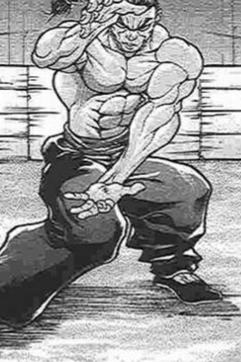

烈：削弱和吸收？

那血液会吸收他人的力量吗？

白莲：就是这样。

坠入血池地狱的大罪之人，会在其中体会着无限的虚弱感，一遍遍重复着永无希望的挣扎，直至最后连存在本身都被血液吸取，化作无尽血海中微不足道的一滴。

被诅咒的血就是这样可怕的东西，因此血池地狱是连鬼族都厌恶的地方。

白莲：这次异变的性质可说是恶劣至极，决不能再让血池地狱的暴走继续下去。

就让我们在今天将其彻底解决吧。

幽香：我就说嘛，那感觉绝对做不得假。

你明白我和白莲为什么生气了吗？

烈：我不明白。

之前喷上来的黑水明明是石油啊？

芙兰朵露：烈的眼神不好呢~

烈：？？？

白莲：也难怪烈先生会有如此误解。

仅看外表，黑水的迷惑性是很强的。

我将能够看透真相的真言传授与你吧，如此只需说上一句，血池地狱的真相就会暴露在你的面前了。

僧侣口中说起玄奥的经文。

白莲：……记住了吗？

烈：没有问题。

那我与觉小姐就先下去尝试交涉了。

幽香：我们会在上方的分界处等待。

别太慢哦，我已经等不及了~

觉：总要尝试交涉。

说不定交涉成功就不用战斗了，说不定……

暂时告别了几乎已经迫不及待的队友们，两位侦探加速向深处飞去

~几分钟后~

~？？？~

BGM: 大地之底，刚欲之海

两层地狱之间的距离意外得近。

是不是快到了？在这样的想法出现不久后，两人脚下就传来了怪异的触感。

他们已经到了。

觉：这是……

像是又穿过了一道无形的界限，黑暗的世界中逐渐浮现出微弱的光亮。

这光亮尚不足以令两人看清全貌，但已能令他们理解自身所处的究竟是何等荒诞的地方。

烈：放眼望去全是黑水。

这里是石油之海？

这层昏暗地狱不似武者想象一般如血般赤红。它瞧上去反而像是童话故事中老巫婆的混沌之釜：似曾相识的异味扑鼻而来，眼前所见尽是粘稠无光的黑水，不时有大团的液块向上方浮动，要说他记忆中与之最为相似的事物，恐怕是以前魔理沙做过的蘑菇锅。

觉：看来这就是黑水的源头。

可这里应当是旧血池地狱才对，为什么……！

此时，两人同时感到心头一惊。

实力者的危机预感正急切地发出警告，宛如被极度危险的凶兽盯上一样，穷凶极恶的突击就将在此时到来——

烈：谁——？

武术家二话不说摆出了战斗的架势，但那危机感却如出现时一般迅速消散了。

活像是凶兽临时更改了注意，将咆哮转成了一声懒洋洋的哈欠声。

“搞错了。”

“亏我特意做好了准备，这次不是那家伙啊。”

觉：请问你是？

“那是我的台词。”

“居然会来这种地方，你们不是普通人吧。”

“和我同类吗？看上去不像啊，呵呵呵……”

伴随着诡异的笑声，引发骚乱的真凶自黑暗中走出。

她是位身材矮小的少女，身披红色披肩，穿浅蓝色的露肩连衣裙，裙上绣有白色的图腾，乃是古代青铜器上常见的饕餮纹饰。

她有着一头蓬松卷曲的白发，赤瞳中透露出危险的凶光，其头颅两侧长有一对红色的卷曲角，末端分别系着蓝色的大蝴蝶结。她的耳朵尖尖的，佩着金属制的耳环，口中的牙齿不似常人般平整，而是如肉食凶兽一样尖锐。

这打扮古怪的女孩将一把几乎赶得上自己身长的银勺抗在肩头，眯着眼睛，向两位不速之客阴森地笑着。

？？？：啊，这个发型。

你莫非是……

烈海王吧。

烈：正是本人。

我这般有名了？

觉：“在畜生界的时候，我部下的大鹫好像被你们折腾的很惨。”

“听说你和白发的笨蛋打倒了埴安神袿姬，向维护了畜生界秩序的你们表示谢意。”

果然，你就是饕餮尤魔。

饕餮：连我心中想到的话都知道。

你这家伙是能读心的妖怪吗？真讨人厌！

没错，我就是刚欲同盟之长，饕餮尤魔。

白发女子掂着勺子，用勺柄指向了武术家。

饕餮：鬼杰组的吉吊，对你评价很高。

以那家伙的标准，你是一定要排除在计划外，最好不要扯上一点关系的类型。

呵呵呵。

烈：这算是评价高吗？！

我明显被讨厌了吧？！

觉：“那家伙把所有人都当成蠢货哦。”因此这是对她而言的高评价啊。

“你又是谁啊？”我是旧地狱的管理者，地灵殿的古明地觉。

从血池地狱喷出的黑水让地上的大家深受困扰，我们是因此事来与你交涉的。

白发幼女呵呵笑着，这似乎是她的习惯，亦或某种口癖。

饕餮：呵呵呵，还知道报上名字啊？

一直在读心也太失礼了吧。

我呢，讨厌不讲礼仪的家伙。

说什么交涉……你们不就是来抢石油的吗。

饕餮将勺子插入石油之海，舀出一大勺黑水，在两人眼前喝了起来。

烈：（哇……）

——————

千亦：等下，等下等下。

就是说，那些黑水，所谓的石油……

其实全都是血吗？！

烈：我和觉小姐刚看见时也极为震惊。

虽然那“石油”外表看上去是黑的，但只是失去活性的伪装罢了。

其本质就是腥臭粘稠，被诅咒了不知多久的污血。

没有足够实力的人恐怕在接触的瞬间就会被溶解，同化，连我也感受到了力量被一点点吸收……那感觉实在很糟糕。

千亦：呕。

集市之神望了眼喝了一半的热饮，感觉杯里的咖啡一点都不香了。

船长：所以才说我不想去旧血池地狱啊！

不光气味恶心，本质污秽，碰一下还会被吸取力量，待久了甚至会被融化，以前被封印在地底的时候我们都一直绕着那地方走。

千亦：你们真在那种地方战斗了？

武术家一脸无奈，像是想起了不堪回首的记忆。

烈：我真尽了最大努力了……

——————

~被废弃的旧血池地狱~

武术家与觉妖怪被眼前的景象深深震惊了。

而与此相反，饕餮却依然像开始那样笑着。

烈：你看到了吗。

这里的“石油”实际上都是血啊！

饕餮：呵呵呵，真是愚蠢。

我当然知道这石油就是血液。

充满了憎恶的有机物，全部都能用作燃料！

想想就笑得合不拢嘴！

烈与觉的劝说【1d100：8】（狂躁的饕餮抵消加成，75以上有和解可能）

读心侦探脸色煞白。

觉：连这样凄惨的景象都无法说服你吗。

我都快要昏过去了。

那，只能用比这更可怕的后果说服你了……

饕餮：？

烈：饕餮小姐，听我说。

不要在这里战斗为好。

请你冷静下来，我们不是来抢石油的，只是希望你能别再刺激这地狱暴走。

这并不是为了躲避战斗的违心之言，我们是真心诚意地为你着想，才会这样说的！

饕餮掏了掏耳朵。

饕餮：尽说些听不懂的话。

什么叫做“为我着想？”

觉：是非常，非常恐怖的事情。

烈：如果在这里坚持战斗的话，会有非常，非常可怕的事情在等着你。

那是比血池地狱还要可怕，比死还要可怕的事！

饕餮滴溜溜转着勺子，一步步向两人走近。

饕餮：那我也告诉你们一件好事吧。

同样的，也有比死还要更可怕的事情在等着你们。

那就是作为有机物的一分子——

饕餮：尽情痛苦挣扎着，化作石油的两滴吧！

觉：唉，太遗憾了。

交涉决裂，按计划开始战斗。

“主攻就交给我。”那就由我来辅助吧。

烈：既然说到这份上都不打算和解，那就让我们堂……在这里打上一场吧！

永远亭，烈海王，请指教！

凶兽挥舞巨勺砸下，武术家以钢拳迎击。

无尽污秽的血池之底，与贪婪之兽的战斗开始了！

~战斗~

BGM：贪欲之兽的记忆

（本战视为重要战斗，常规技能自动取合适配置）

（由于饕餮知名度较高，无需判定即可发动神秘杀手的效果）

烈海王

Atk：289（147）

Hp：23

技能

烈 海 王：超越海皇，仍为海王。AtkX1.9，Hp+1。不会陷入异常状态，不会受到驻足，束缚等判定影响，面对所有技能都可以进行【1d100】的破解判定，55以上成功

完全消力：普通攻击以及近战系、弹幕系技能所造成的的最终伤害/2（仅对Atk260以下的对手起效）自身所收到的普通攻击伤害-1，近战系、弹幕系技能伤害-2（仅对Atk261以上的对手起效）

神秘杀手EX：与古代日本出身的且在历史上留名的知名妖怪或神明战斗时，Atk+10，破解判定所需成功值-5

被废弃的血池地狱：可利用场地中的无尽血液增强符卡。本场战斗中异红符给予伤害+3，消耗为0，CT+1。

古明地觉的支援：可使用新的符卡，依靠读心能力的辅助，使破解判定所需成功值-5。

心花【Camera-Shy Rose】（CT2）:一场战斗中只能使用一次，本回合无视减伤效果，给予对手【1+1d3】点伤害，自身回避一次普通攻击。

“和恋恋一样，我也喜欢心形的弹幕。”

异红符【巨阙】（CT3）：（近战系）本回合Hp-1，Atk+80，给予伤害+4

Flower star（CT4）：（弹幕系）对对手造成必中的【2+1d6】点伤害。

假腿【The World】:一天只能使用一次，使用假腿中的力量进行一次超快速移动。本回合战斗自动胜利且造成的伤害必中（对战斗力低于160的对手使用的情况下直接判定战斗结束，胜者烈海王）/【回避】一次致命攻击（对于无法回避/破解/防御的必杀技无效）

想起【恐怖催眠术】：将对手暂时打倒的场合发动，？？？

“正所谓，不得已而为之呢。”

贫穷神的加护：自动发动，一天只能使用一次，令对手的大成功转变为大失败

必杀技

纯粹武道（CT5）：怀抱纯粹的武术，心存无色的执着。3T内Atk+70，对对手造成的伤害+3。3T内可对所有攻击进行【1d100】的破解判定，近战系、技巧系技能30以上成功，其余技能40以上成功，必杀技60以上成功

超人【烈海王】（CT6）： Atk+675，给予伤害X4，其后2T内Atk+25，回避概率翻倍

武符【梦幻斗舞】（CT7）：无法回避/破解/防御，本回合自身无敌，给予伤害X2，进行一次【1d100】的反击判定，30以上可对对手的攻击进行反击

秘术【天文密葬法】（CT8）：制造虚假的月亮，削弱妖怪的力量，3T内战斗环节中，妖怪对手的Atk变为与自身最终结算后相同，自身的战斗骰变为【2d100】但同时无法使用破解，无法回避/破解/防御，给予伤害X2/引导宇宙的力量，发出轨道诡异的大量弹幕轰击 无法回避/破解/防御 Atk+900，给予伤害X6

饕餮尤魔

Atk：265

Hp：15/？？？

技能

战无不胜的刚欲同盟盟主：不会陷入异常状态，拥有对时停等特殊攻击的耐性，无法对没有灵魂的对手造成伤害。

被废弃的血池地狱：每回合开始时，令对手Atk-4，Hp-2，这个效果依照特殊攻击计算。

贪婪的大胃王效果增强，自身所有招式效果增强。

自身Hp被一回合击空的场合，？？？

贪婪的大胃王：在血池地狱战斗时，效果增幅如下。

每回合结束时自身Hp仍未归0的场合，令Hp恢复至全满。

对手使用技能/普通攻击造成伤害的场合，可将自身受伤降低为1点，或受到全额伤害，令自身Atk+7。以此效果提高的Atk最高至295点，当对方战斗骰差值大于80点，或一次性受到伤害高于7点时，无法使用降低伤害的效果。

对手使用必杀技造成伤害的场合，可将自身受到的最终伤害减半，并在伤害结算后回复所受到的原本伤害的1/3。

每次对对手造成伤害的场合，自身Hp回复给予伤害的1/2。

贪婪狂兽的陷阱：芙兰朵露·斯卡雷特登场时发动，？？？

采取【深渊之底的赤血】（CT1）：（弹幕系）一场战斗中仅能使用一次，将血池地狱的污血凝为圆珠，滴落至对手身上消磨体力。

3T内自身给予伤害+2，Atk+10，血池地狱场地效果增强至每回合Atk-5，Hp-3。被破解的场合仅自身增幅效果消失。

“你*&amp;^%#手脚放干净点！恶不恶心啊！”某位隔壁组织的组长如此骂到。

蒸馏【简陋粗暴的蒸馏装置】（CT3）：（近战系）一场战斗中仅能使用一次，吸收鲜血的精华强化自身，将其杂质作为弹幕甩出攻击对手。本回合Atk+50，自身受到伤害-3。

刚欲【不应存在于此世的暴食】（CT4）：（弹幕系）一场战斗中仅能使用一次，张开血盆大口吸收身旁的一切事物。本回合自身无敌，给予对手必中的【3+1d4】点伤害。

“若以被彻底消灭作为失败的标准，那她就永远战无不胜。”另一个组织的头目如此说。

必杀技

采血【盖亚的血液】（CT5）一场战斗中仅能使用一次，令血珠漂浮在空中限制对手的行动。

本回合对手无法进行普通攻击，自身Atk+70，给予伤害+3。

精炼【被诅咒之血的追忆】（CT6）一场战斗中仅能使用一次，带着古老罪人们的记忆，巨大的血球从天而降。Atk+690，给予伤害X4.

【刚欲兽神饕餮的晚餐】（CT7）：？？？

【肚子空空的贪婪怪兽】（CT8）：？？？

T1

饕餮：呵呵呵……

既然知晓了这血池地狱的秘密，你们就和我一起待在这里吧。

我知道哟，你们幻想乡的战斗方式。

叫做弹幕决斗，是吧。

烈：不错。

莫非来自畜生界的饕餮小姐，准备在规则内与我们战斗？

饕餮小小的身子抖动起来，狡黠地笑着。

饕餮：之前说过吧，我一向是尊重礼节的。

昨天和那个吸血鬼小丫头战斗时，我就完全理解你们所谓的弹幕决斗是什么了。

她一把将大勺插入血池中。

饕餮：不就是在战斗时大声喊出招式名字吗！多此一举的规则！

烈：还有适当的手下留情，但大体就是这样！

觉：（虽说两人理解都有点问题但找不到反驳的理由！）

饕餮：接 招 ！

符卡宣言 采取【深渊之底的赤血】！

白发的野兽将大勺一甩，血液凝为圆珠漂浮在空中。

来自血池地狱的吸力在同时增强，这污秽的地狱似乎与眼前的野兽产生了共鸣，它的活性在一点点恢复至许久之前的模样！

烈的Atk：289-5=284

烈的Hp：23-3=20

饕餮：看不出来，你也是个用血液战斗的？

烈：只是簡單的暗器技術。

我的主要作戰方式，還是依靠武術的近身戰！

烈的攻擊【284+1d100：32=316】

饕餮的攻擊【265+1d100：61=326】

突進的障礙已被掃除，武者單足立於血海之上，以上踢作為起手的第一招！

饕餮：呵呵呵。

你很坦誠啊。

不過，似乎還未從之前的經歷吸取教訓的樣子……

白發女孩不閃不避立於原地，武術家心中升起了不祥的預感。

饕餮：我是剛欲同盟之長，不是勁牙組那些喜歡硬碰硬的笨蛋。

既然知道了你的戰鬥特點，我當然不會讓你接近啦。

回到地上去吧，烈海王！

就在這個瞬間，兩人腳下的血海開始暴動！赤色的濁流沖天而起，破壞了武者的立足之地，饕餮根本沒想與他們正面作戰，她要將兩人一並送去灼熱地獄，利用上升氣流將他們吹回地表！

烈的受傷【1d10:9】

1 回避

2 小傷害-1

3 小傷害-1

4 中傷害-1

5 中傷害-1

6 大傷害-1

7 大傷害-1

8 特大傷害-1

9 特大傷害-1

10 大成功/大失敗【1d2：1】

Hp：20-4+1=17

覺：好強的沖擊力！

烈：覺小姐，小心了。

在被沖向空中的瞬間，烈海王便做出了反應。他眼疾手快地拉住覺的袖子，依靠先前的血霧在空中製造了屏障。如此一來饕餮的偷襲便被減緩威力，可他自己也受到了血汙的沖擊。

交手僅一個回合，烈海王便失去了大量體力！

饕餮：我可是好心想送你們回去啊，呵呵呵……

T2

烈的Atk：284-5=279

烈的Hp：17-3=14

烈：我已经搞不清楚你现在的状态了。

我们提出交涉时你选择开战，在战斗开始后又想将我们击退。

你究竟是清醒的，还是狂乱的？

饕餮：想不明白？

看来，你们完全不理解我啊。

觉：即使拥有读心能力，我也无法理解一个初次见面的对手。

来到此处的你究竟想做什么，饕餮尤魔？

饕餮以大勺指向了血海。

饕餮：这是我的。

烈：？

饕餮：这些，全都，都是我的。

想从这里夺走任何一滴的人都要干掉，无法在一开始就击倒的敌人很麻烦，就用另外的方式请他们退场。

我要一人独占这里所有的血和诅咒——

饕餮：依靠这份无与伦比的力量。

令刚欲同盟脱颖于畜生界，实现全世界的支配！

烈：支配全世界？

说来说去不还是畜生界那一套吗！

觉：从听到支配全世界这五个字开始可以判断为无法交流了，唉……哎？！

在两人不敢置信的目光中，饕餮一个猛子扎入了恶臭无比的血海。

饕餮：呵呵呵！既然你们都想不开，那就在葬身于这血海中吧。

接招——！

她二话不说便潜入了血池深处，数只血液化成的妖爪自海面上伸出，向两人发起了又一轮的突袭！

烈海王的脸色不怎么好看，他还是第一次遇见这样难以下手的敌人。

烈：……就，就由我来潜入血池追她。

觉妖怪伸手抹掉脸上的汗珠。

觉：烈海王，这里先交给我吧。

符卡宣言 心花【Camera-Shy Rose】。

觉妖怪以魔力制造出了大量粉色心形弹幕。

这些闪烁的爱心一圈圈围绕在两人周遭，远远看去宛如一朵即将绽放的蔷薇花，让武术家的脸色显得更怪了。

烈：（粉红色……）

给予伤害【1+1d3：1=2】点

觉：很可爱不是吗~

“看”到了，在那里！

粉发女孩抬手一指，弹幕构成的蔷薇花即刻盛开，心弹们依次冲向血池，将潜伏在赤海中的饕餮炸了出来。

饕餮的Hp：15-2=13

饕餮的Atk：265+7=272

饕餮：被发现了？

是读心能力吗！

古明地觉大口大口喘着粗气。

觉：（打击感好怪？）

正是……呼……

这里的怨念太沉重了……由你来！

烈的攻击【279+1d100：59=338】

饕餮的攻击【272+1d100：52=324】

被锁定的饕餮先一步发起攻击，她将大勺舞得虎虎生风，一跃跳至两人头顶，将银勺连带着污血一并砸下。

对手的力量被血池削弱后，想要取胜便是轻而易举——若是抱有这样的想法，才是大错特错！

烈：太慢了！

武者的左臂如闪电般探出，一举擒住了银勺的握柄。

饕餮的突进反让自身暴露出破绽，烈海王的右拳长驱直入，在接触对手的瞬间便让暗劲爆发，将凶兽一举震向远方！

饕餮的受伤【1d10:5】

1 回避

2 小伤害

3 小伤害

4 中伤害

5 中伤害

6 大伤害

7 大伤害

8 特大伤害

9 特大伤害

10 大成功/大失败【1d2：1】

饕餮的Hp：13-2=11

饕餮的Atk：272+7=279

这一合是武者取得优势，可他的眉头却皱了起来。

烈：这手感？

烈海王凝神盯着自己的右拳。

他对自己的力量操控有着绝对的自信。

纵使体质特异，那也该是着实击中的一拳……有着肌肉、劲气、魔力的回馈，也即击中目标的“手感”。

可现在的他却什么都没感受到。

被闪避了？躲了过去？没有这种可能，击中对方的事实是的确存在的。

那么……

烈：没有效果？

觉小姐，你呢？

觉：我也一样。

方才的弹幕攻击明明是打中了，却丝毫没有“成功”的感觉。

简直像是……

“简直像是被吃掉了一样！”

扑通！数秒前被打落的饕餮从血池中探出头来。

她阴险而又自信地笑着，似乎丝毫不将两人放在眼中。

而感知敏锐的武术家察觉到，那敌人的气息相比战斗开始时变强了！

饕餮：你们是想这么说吧？

恭喜，答对了~

我能吸收所有的攻击！

烈：就连接近战的攻击也被吃了？

饕餮：接近战也好远程战也好，实体也好能量也好，我什么都能吃掉！

再告诉你们一件好事吧~

她咧开大嘴，施展那极强的吸力，如鲸吞海吸般将血池地狱的内容物吸入腹中。

饕餮的Hp：复原至15点。

觉：完全恢复？！

饕餮：呵呵呵，所以我才说血池地狱是个好地方啊！

明白了吗，两位？

向我挑战简直是愚蠢到家了，因为你们的战斗对我而言，就仅仅是进食而已。

你们的攻击会让我变得更强，这取之不尽的欲望就是我的“体力”。

饕餮：我是战无不胜的刚欲同盟盟主，因为我只会打一定能胜利的战斗。

而现在的我，就是真正意义上的无敌！

T3

烈的Atk：279-5=274

烈的Hp：14-3=11

饕餮：呵呵呵……而你们又如何？

就在这短短数秒之间，力量又进一步被削弱了吧。

没问题吗烈海王？你还是半个人类，肉体是不是已经开始溶解了？

撑得住吗觉妖怪？血池的怨念和恶意可远胜于地上，看你那眼神，该不会快被血腥味熏昏晕了吧？

觉：唔……

刚欲同盟的盟主将长勺插下，一片片血液凝固为宽广的浮岛自血海中飞起。

立于空中的饕餮回转兵器，空中的平台瞬时爆散，化作污秽的暴雨袭向两人。

饕餮：无谋、愚昧、莽撞！

给了你们一次逃命的机会还不走，所谓自寻死路即是如此，别指望我会放过你们。

已经来了血池地狱，那就乖乖被我吃掉吧！

蒸馏【简陋粗暴的蒸馏装置】！

烈的破解【1d100：57】成功。

烈：自寻死路？我看未必。

饕餮尤魔，你的确表现出了很强的战斗力。

但如果你真有自己夸耀的这般强大，反而就有些无法解决的问题了……

觉：什么攻击都能吸收，就算被击倒也能复活。

如果你能够永远立于不败之地，为什么之前畜生界骚动时，你却第一个逃跑了？

饕餮：！

那是——

血雨即将砸落在两人体表，武术家却显得毫不慌张。

“破！”刹那间，武者解下衣衫，将手中外衣如鞭般挥舞。饕餮喷出的杂质被劲风尽数吹去，漫天血雨竟连一滴都未能击中！

烈的攻击【274+1d100：36=310】

饕餮的攻击【279+1d100：1=280】

觉：她要回避。

在你的右上方位，距离约15米。

饕餮：你又在读我的心……！

烈：喝啊！

饕餮以银勺护身，旋转着飞向空中躲避，而得到提示的武者却比她更快一步。

饕餮的受伤【1d10：7】

1 回避

2 小伤害

3 小伤害

4 中伤害

5 中伤害

6 大伤害

7 大伤害

8 特大伤害

9 特大伤害

10 大成功/大失败【1d2：1】

Hp：15-3=12

Atk：279+7=286

迎接饕餮的是一记回旋踢。白发凶兽连忙以大勺护身，却依旧被穿透防御的劲力重重打向下方，在血池中激起一道冲天巨浪！

饕餮的Hp恢复至15点。

武者这次依然没有击中的手感。他面色却不见焦急之色，只是立于空中，继续言说。

烈：你没参与畜生界的骚乱，是因为磨弓小姐的埴轮部队与你的相性太差？

姑且就这样解释吧。

可在造型神与埴轮兵团出现之前，畜生界应当没有你的“天敌”。

饕餮从血海中探出脑袋，觉妖怪接上了搭档的话头。

觉：这可很奇怪呀，饕餮尤魔。

你的贪欲这么强，别说畜生界，甚至想将世界收入囊中。

为什么这样强大的你在动物灵异变前，却没能将骊驹早鬼与吉吊八千慧吞食，成为畜生界的霸主？

饕餮：……你们想说什么？

烈：很简单的推理，饕餮小姐。

到目前为止，你的攻击都是依靠血海进行，我却没见到多少你自己的本事。

我只能如此猜想，那就是在畜生界的时候，其余两位组长无法奈何你的不死之身，而你也同样对她们做不了什么——原本的饕餮尤魔，根本就不是什么绝对的强者！

无敌？恐怕那指的不是你本身，而是你所依靠的这血池地狱吧！

T4

采取符 效果结束

烈的Atk：274-4=270

烈的Hp：11-2=9

“呵呵呵呵……哈哈哈哈哈！”

血池中的饕餮大笑起来。

饕餮：笑得我背都开始痒了。

还挺聪明啊，你们。

要是以前的时候，我都想邀请你们加入刚欲同盟了。

饕餮：就给如此努力的你们一点嘉奖。

没错，正解，说得对！

在拥有这血池地狱之前，我还不像现在这样强大。

你们的推理是正确的……

粉发少女将两手摆在头边，装作饕餮的样子，模仿着对方说话的语调。

觉：“可你们的推理又有什么意义？”

“现在的我已经和血池地狱融为一体，你们要打倒的也不是过去的那个饕餮了。”

饕餮：啧，还不把你那眼闭上！

也该明白了吧你们，那推理对于现在的情况是完全无意义的。

费尽心思分析敌人，结果不过是无用功。

她立于血海之上，咆哮着张开巨口。

饕餮：妖怪？人类？终究都是我的食粮！

刚欲【不应存在于此世的暴食】！

不再以地狱的污血玩闹，饕餮尤魔在此刻展现了属于自己的力量。

磅礴的吸引力自她的口中发出，血池地狱之底凭空刮起了天灾般的狂风。赤色的海洋因此而疯狂，血浪被吸力拽向空中，又在狂风吹拂下化为了最为尖锐的武器，自四面八方奔向饕餮的巨口！

正如饕餮所言，她眼前的一切都是食粮，她的敌人只能做出最绝望的选择：要么被这无处不在的尖刀刺到千疮百孔，要么被饕餮本人吞入口中。

烈的破解【1d100：73】

“毫无意义？我不这样认为。”

武者的声音自呼啸的风声中传来，那话语中的平淡一如既往。

“我见过劲牙组组长战斗的场面，也和鬼杰组组长分出过胜负。她们都是有着相当实力的强者，不愧是在畜生界也能建立组织的豪杰。”

“你在常态大抵是能与他们分庭抗礼吧，那我对于你的攻击就能有把握。”

他的声音突然近了……仿佛就在自己身前！

饕餮：什么！

烈：因为无法真正击败那两人的你——

不会是我烈海王的对手！

下个瞬间，武者自狂风中冲出。

他无需做出任何选择，区区这种程度的吸力根本奈他不何。烈海王抬手一招，赤海中的血液便升腾而起，凝为比以往任何时候都要巨大的兵器，握于他的手中。血池地狱的环境不光只对饕餮有利，他同样也能以此增加自己的实力！

烈：要将一切都吞食？那就看看你能否将这也吃掉了。

符卡宣言 异红符【巨阙】！

烈的攻击【270+80+1d100：43=393】

饕餮的攻击【286+1d100：9=295】

饕餮的受伤【1d10：3】

1 回避

2 小伤害+4+3

3 小伤害+4+3

4 中伤害+4+3

5 中伤害+4+3

6 大伤害+4+3

7 大伤害+4+3

8 特大伤害+4+3

9 特大伤害+4+3

10 大成功/大失败【1d2：1】

（差值大于80点，无法转化为抵挡伤害）

饕餮的Hp：15-1-4-3=7

饕餮的Atk：286+7=293

饕餮：你用拳头我就将拳吃掉……

用兵器我就将手臂一起吃掉！

贪婪的凶兽毫无畏惧，她一口咬向了赤色的巨剑，妄图以能力将其瞬间吸收，转而击杀对手！

烈：如典籍中所言的那般。

你太过贪婪了，饕餮。

这份贪婪造就了你的强大，也是你今日败北的原因。

饕餮发现他了亮出空闲的左手。

那手中有朵亮丽的鲜花。

烈：接招，flowe star！

给予伤害【2+1d6：5=7】

饕餮的Hp：7-7=0

饕餮的Atk：抵达295极限。

凶兽的煞气在此刻膨胀至极限。

而与此同时，花弹也在最近距离下击中了这位贪婪无比的对手。

像是气球被戳破了一样，饕餮尤魔的身形在受到最后一击的瞬间……

消散了。

烈：……

武术家看着左手，若有所思。

至此为止，他依旧没有体会到击中的手感。

一次也没有。

远方，一脸疲惫的觉妖怪飞了过来。

觉：成功了吗？

“呵呵呵，失败了哦。”

烈：！

觉：！

这熟悉的声音就来自于他们的脚下，来自血海中浮现的一张口唇。

转眼间，污秽的血液中凝结出幼女的容貌，液态的诅咒自海中涌起，在两人面前形成了毫发无伤的凶兽——那是以方前显现的最强状态再次复活的饕餮尤魔！

饕餮尤魔

Atk：295（265）

Hp：13/？？？

被废弃的血池地狱：自身在一回合内Hp归0的场合，保留增长后的Atk，并以最大Hp-2的状态复活。

这个效果将一直持续至最大Hp降为1点。

饕餮：看你们那自以为大获全胜的样子，真滑稽……

刚刚吃得还不够呢，现在肚子依旧很饿啊。

欲望和能量我都吃，不如就让你们再喂我点吧？

饕餮邪笑着从血池中站起，向两人扑去！

武术家突然轻松下来，耸了耸肩。

烈：不，作战成功。

一直小心谨慎的你终于懈怠了，饕餮小姐。

饕餮：你说什么……？

野兽的直觉令饕餮警醒，她反射性看向了危险感受的来源，那个看上去不怎么强的觉妖怪正在微笑——

觉：想起【恐怖催眠术】。

想起【恐怖催眠术】：将饕餮Hp击空一次的场合发动，本回合令其丧失特殊攻击耐性，陷入短时间的催眠状态。

饕餮：！

令被封印在最深处的记忆苏醒的技巧，起效速度极快，纯粹逼迫对手回想精神创伤，那就是古明地觉惯用的恶性催眠术。

古怪的光芒在饕餮眼前亮起，她的脑中瞬时间便被无数画面的破片填满。若是早有防备的状况下，觉的催眠术无法起到如此立竿见影的效果，可两人此次作战的真正目的，就是令在复活时自以为完全掌握局势的饕餮感到松懈，露出破绽！

究竟是想起了什么？白发少女的身体僵住了一瞬。凭借自身丰富的战斗经验，她将精神聚集在五感之上，以尽全力把握这一秒间的局势变化。

在自回忆中挣脱前的一刻，她听见武术家说——

“【The World】，时间停止吧。”

————【The World】—————

血池中伸出的鬼手僵在了原地，被战斗震起的血珠凝固在了空中。

饕餮的眼中带着惊讶，觉的脸上写满了疲惫，一切都静止在了灰白色的世界中，只有武者一人能够自由行动。

没有浪费一点时间，他在时间停止的同时就开始运转起超人术法。

“一秒经过。”

将对手以双手举起，全力冲向高空。

“五秒经过。”

流星般的光芒在黑暗中闪烁，脚下的血池越发遥远。

“七秒经过。”

还未抵达尽头，还需要拼命冲刺！

在第八秒钟的结束时，他终于带着饕餮穿过了那无形的界限。

四周开始出现怪异舞动的纹路，那是即将开始摇曳的烈火。

“九秒经过。”

找到了！

他冲向一片熔浆中隐约显现的平台，将饕餮尤魔端正地在落脚处放下。

烈：然后时间开始流动！

———— 时停结束 ————

饕餮：什么！？

饕餮震惊地发出了叫喊，像是观影时被粗心的工作人员唐突跳到了下一段，四周的风景毫无征兆地发生了巨变。血液之海竟然消失不见了，取而代之的是不断升腾的熔岩，和一个个在半空中飘浮着的岩石平台。

她知道这是什么地方……

饕餮：旧灼热地狱？！

烈：是的。

我将你搬运到了血池地狱上方——我想隔着这样遥远的距离，你无论如何也无法吸收那血海中的力量了。

武术家叹了口气，一踩石台，跳向远方。

烈：唉。

饕餮小姐，还望谅解，我是想要与你战斗到最后的。

只是比起战斗，有些事情要更加恐怖，更加可怕……我已经警告过你了。

饕餮：……搞什么？

你逃跑了？

饕餮随口吃了团火焰回复体力，对这人的表现感到一头雾水。

就在此时。

三股极为强大的气势，从更高处的石台上同时爆发！

饕餮抬眼望去，她所见到的是一位绿色长发的女子，一位头戴头颅的僧人，以及昨日曾来侵扰的那只吸血鬼！

饕餮：这次来了三个人？！

白莲：你好，饕餮尤魔。

我是圣白莲。

幽香：你好，饕餮尤魔。

我是风见幽香。

芙兰朵露：你好，饕餮尤魔。

我是芙兰朵露·斯卡雷特！

三人同时合掌行礼！依旧十分疑惑的饕餮反射性做出问候，礼节很重要！

饕餮：你们好，我是刚欲同盟盟主，饕餮尤魔。

你们也是来抢石油的？

白莲：你误会了。

我是来退治你的！

幽香：我是来撕碎你的！

芙兰朵露：我是来彻底破坏你的！

饕餮恼怒地挥舞起勺子。

饕餮：说来说去还都不是来战斗的！

好吧！没有血池也没关系，就在这里把你们全部吃掉！

吸血鬼笑眯眯地坐在平台边缘。

白发恶兽咆哮着飞起，两位凶人无言降下！于灼热地狱的烈火之中，饕餮退治之战再度开启！

~战斗继续~

饕餮尤魔

Atk：280（265）

Hp：13/1

技能

战无不胜的刚欲同盟盟主：不会陷入异常状态，拥有对时停等特殊攻击的耐性，无法对没有灵魂的对手造成伤害。

贪婪的大胃王：每回合结束时自身Hp仍未归0的场合，令Hp恢复1/3。

对手使用技能/普通攻击造成伤害的场合，可将自身受伤降低为2点，或受到全额伤害，令自身Atk+4。以此效果提高的Atk最高至290点，当对方战斗骰差值大于60点，或一次性受到伤害高于6点时，无法使用降低伤害的效果。

对手使用必杀技造成伤害的场合，可在伤害结算前回复受到伤害的【1d2】/3。

每次通过普通攻击对对手造成伤害的场合，自身Hp回复给予伤害的1/2。

自身所有Hp被击破的场合，将强制脱离战斗，吸收他处的欲望重生。

贪婪狂兽的陷阱：进行一次【1d100】的突袭判定，30以上3T内芙兰朵露无法参与战斗，75以上芙兰朵露本战无力化，90以上摩多罗带着芙兰朵露退场。

侦探们的秘策：脱离血池地狱，战斗场地变化为灼热地狱，符卡发生变化，Atk降低至280。

必杀技

熔炼【狂怒的奔流】（CT5）一场战斗中仅能使用一次，令熔岩固化限制对手的行动。

本回合自身Atk+75，给予伤害+3，可进行一次【1d100】的追击判定，50以上成功，成功时进行一次追击。

融合【灼热烈火的追忆】（CT6）一场战斗中仅能使用一次，带着被烧灼的灵魂们的怨念，巨大的火球从天而降。Atk+690，给予伤害X4.

【刚欲兽神饕餮的晚餐】（CT7）：Atk+800，给予伤害X5，本回合胜利的场合，对手Hp在8点以上时，将其Hp吸取至1，对手Hp在7点以下时，吞食其所剩的所有体力。

今天的晚餐就是你。

【肚子空空的贪婪怪兽】：Hp归1时发动，3T内自身无敌，本回合Atk+900，给予伤害X6，本回合胜利的场合将对手吞噬。

全部吃掉吧！

T5

饕餮：呵呵呵……来了三个又有什么用。

吸血鬼小丫头，算得上威胁的也只有你一个而已！

丝毫不在意两人的追击，饕餮穿过弹雨，一举扑向了在高处旁观的吸血鬼。

芙兰朵露：哈哈哈哈。

饕餮尤魔，现在的你还有什么手段，还有什么办法能奈何我芙兰朵露·斯卡雷特了！

不！他X的你便是做不到了，你这声威吓在我听来也只是无力地哀嚎呀！

饕餮：这什么奇怪的说话方式？

你这样傲慢真是帮了大忙了。

阴笑着的饕餮并未施展吸力。

恰恰相反，她为这位金发小姐所准备的陷阱是……

喷吐。

芙兰朵露：什么？

无穷无尽的血水自饕餮口中喷出，那是她事先就在胃袋中储存好的杀招，即使是灼热无比的地狱也无法瞬间将海量的流水蒸发。

无穷的胃袋也能够当做容量无限的储存间，想要将血池地狱整个搬空在一夜之内是决计做不到的……可若只是吞下淹没一片区域的水量，那对饕餮而言就是轻而易举！

饕餮：呵呵呵……

芙兰朵露·斯卡雷特，你太小看这人世了。

正如现在的你也想不到，自己会在火海之中被血水淹没啊！

她转头向着两位凶人攻去，即使这突袭无法彻底将芙兰朵露击杀，那也足以令她失去参与本场战斗的能力。

如此一来，就没有人能在真正意义上将她击败。

离开血池地狱的饕餮的确变弱了……

饕餮：现在的我或许没法击败你们，但你们也无法将我击倒！

正因如此，我才是战无不胜的刚欲同盟盟主！

命莲寺的僧侣单手接住大勺，念了声佛号。

白莲：我想你也太过于心急。

还是先看看眼前的现实吧？

【星之护法剑】！

饕餮：？

就在这时，一道蓝色的光华破出血海。

那光芒是无数破片轮转结成的护身法阵，立于光芒中央的吸血鬼哈哈大笑，毫发无伤。

她眯起一只眼睛，伸手指向了大张着嘴的饕餮。

芙兰朵露：呼呼，看你在意的样子我就想笑。

饕餮：——啊？

幽香：闹剧结束了？

那我们开始吧！

饕餮的謹慎【1d100：99】大成功（50以上摩多羅出手

在這裏超謹慎的大成功是什麽啊【1d10:10】

1 Atk+10（有什麽意義嗎）

2 每回合開始前過一個說服骰，75以上就成功！

3 每回合結束時過一個逃脫骰，80以上就能回血池地獄！

4 Atk+10（有什麽意義嗎）

5 每回合開始前過一個說服骰，75以上就成功！

6 你們都被利用了！一定是有人要害我！（真的嗎）

7 Atk+10（有什麽意義嗎）

8 每回合開始前過一個說服骰，75以上就成功！

9 就在這時對摩多羅絕地反擊（饕餮！！）

10 大成功/大失敗【1d2：1】

双重大成功！

饕餮：——

這是陷阱。

現在的饕餮吸收了血池地獄中的無盡欲望。

她已經喪失了過去引以為傲的靈活判斷力，淪為了貪婪而不知進退的狂獸。

盡管如此。

野獸獨有的危機預感，不會因此而消退半分！

饕餮察覺到了，她今天所遇到的一切……

饕餮：（全都是陷阱！）

偵探二人組的戰鬥是為了將自己逼出血池。

吸血鬼小丫頭堂而皇之地出現，是為了逼出自己的底牌。

這個瘋子是將自己擊敗的打手，最後則是由芙蘭朵露給予最終一擊！

幽香：準備好了嗎，白蓮？

白蓮：交給我吧，幽香。

魔人經卷，展開。

聖僧手中的經書無聲展開。

琉璃色的咒文自卷筒中浮現，魔人經卷飄蕩在白蓮身側，以魔力製造出了一個花紋玄奧的法陣。

饕餮：（不對！）

（只是來搶奪石油的敵手可不會有這樣重的殺意！）

（那眼神仿佛是我拆了他們的家一樣……還有人！一定還有幕後黑手！！）

幽香：魔炮蓄力开始。

大妖怪以伞尖点向法阵。

魔法阵的中央浮现出明亮的光华。

芙兰朵露兴奋地拍起了手，武术家和刚刚飞上来的觉妖怪被这恐怖的场面惊得一骇，齐齐掩面。

芙兰朵露：好呀！要开始啦！

烈&amp;觉：我的天啊……

饕餮：（再这样下去对我没有丝毫好处！）

（逃回血池地狱，或是干脆先撤离到地上，不管什么都好总之要先从这里撤离——）

“以多打少，真是太卑鄙了。”

饕餮：还来？！

饕餮当机立断决定跑路，可她却在身后感知到了一股出奇强大的气息。

那是位身穿狩衣，坐于石椅之上的神明！

摩多罗：饕餮，敌人虽强，你也没有逃跑的必要

我最看不得这种欺凌弱小的行径，就让我给予你更多的力量吧。

后户的秘神轻轻拍手，白发凶兽的身上发出了耀眼的光芒、

饕餮：噢噢……

力量……在膨胀？！

火海中的熔岩被无形的力量吸起，灼热的洪流奔向饕餮的口中！

饕餮：噢噢……

火海的恐惧、赠恶、愤怒、怨恨。

仿佛一切都涌入了我的体内……糟了！！！

烈：摩多罗女士？！为啥啊？！

摩多罗飘向武术家的身旁。

摩多罗：你不觉得力量持平的战斗才算公平吗？

何况灼热地狱是仅次于血池地狱的凶地。

怨灵们的执念，罪人们的愤怒，于此被烧灼万年的痛苦，吸收了这一切的饕餮就无法做出“撤退”的决策。

这样一来，事件就解决了。

秘神的这一步棋出乎了所有人的预料。

但主战的两人却并未与她清算，因为最要优先解决的是眼前的敌人。

“多重干涉法阵设立。”

“超阔魔炮充能完毕。”

一分二，二分四……白莲设置的法阵于眨眼间增值，化作了足以将火焰光辉掩盖的巨型法阵群！每一个法阵中都闪烁着丝毫不差的微光，每一道花纹都将化作魔炮发射的炮口！

饕餮：我……啊……！！！

理智告诉她，在此时强行战斗绝不算明智。

而体内奔涌的力量却鼓动着饕餮冲向前去，将两人一齐吞下腹中！

幽香&amp;白莲：极 大 魔 法 ！

“且慢！”

少女的大喝吸引了他们的注意力。

在毁灭的光芒即将到来之前，饕餮尤魔将银勺一摆——

饕餮：撒 由 那 拉 ！

饕餮将大勺砸向自己的腹部，白发的凶兽被这一击打得四分五裂！

就在所有人那莫名的表情中，贪婪的灵魂化作无形的光芒——

饕餮尤魔爆发四散！

“啊？！”

~饕餮 消散~

~战斗结束~

~胜者 幽香&amp;白莲&amp;芙兰朵露~

幽香：她自杀了？

白莲：甚至都没战斗？

烈：这到底是……

这到底是怎么回事？

“呵呵呵……”

轮椅上的觉小姐打了个哆嗦，这阴魂不散的笑声她今日已经听了太多次。

那笑声来自无边火海中的一角……

来自在火焰中缓慢成型的饕餮尤魔！

——————

双重大成功是什么【1d10:9】

1 饕餮尤魔·灼热地狱形态，战斗力大幅度增强！（但还是没啥意义）

2 饕餮的激情燃烧口才骰

3 我回血池地狱了！（你搞笑吧！）

4 饕餮尤魔·灼热地狱形态，战斗力大幅度增强！（但还是没啥意义）

5 饕餮的激情燃烧口才骰

6 大家……都是我的朋友啊（这是什么玩意）

7 饕餮尤魔·灼热地狱形态，战斗力大幅度增强！（但还是没啥意义）

8 饕餮的激情燃烧口才骰

9 以死为生，当场自尽，新的饕餮出现了！（为啥啊！）

10 大成功/大失败【1d2：1】

——————

饕餮：这可真是。

完全破碎了啊，要修复过来得花上几分钟呢。

噢噢……脑袋清醒多了。

真可怕啊，血池地狱，我在不知不觉中也变化了吗。

烈火生成了她的双臂，幼女满不在乎地拍了拍手。

饕餮：如你们所见，饕餮尤魔已经爆发四散了！

现在的我是吸收了灼热地狱的欲望暂时复活的饕餮，没有以前时那么冷静，但还是可以交流的。

那么，诸位……

饕餮：非常抱歉，真的十分抱歉！

如果之前有什么冒犯之处，本人饕餮尤魔为表歉意，在方才便以自爆谢罪！

也就是说，你们所仇视的我已经消灭了。

她耸动着肩膀，阴森笑着。

饕餮：我们也该好好聊几句了吧？

毕竟无论你我，都同为被利用的笨蛋啊。

在场的所有人都看向了秘神。

石椅上的摩多罗一手摸着下巴，若有所思。

摩多罗：在旧灼热地狱复活了……

能够说出这样一番话来，应当也恢复了理智。

很好，这样一来也算达成了目的。

恭喜各位，我们本次的作战圆满成功了。

妖怪与僧人你看看我，我看看你。

罪魁祸首数秒前自爆而后大声谢罪，满脸都写着“黑幕是我”的家伙又在自言自语。

如此一来实在是没有继续战斗的必要。

不如说，两人心中此时充斥着的压根就不是愤怒，而是莫名的疲劳感……

幽香：就听听你想说什么。

饕餮：各位，我们本来就没有敌对的理由吧？

想要征服全世界……这样的话我不会说了。

先前想要无视地上的人独占石油，是因为不知道你们这里也有厉害的家伙。

现在还是协作更合适呢，我们从石油资源的再分配开始协商如何？

幽香：没有兴趣。

白莲：那种东西我们不需要。

摩多罗：你能这样想就方便了。

我是幻想乡的贤者，后户的秘神，摩多罗隠岐奈。

关于血池地狱资源分配相关的谈判，只需找我即可。

芙兰朵露：烈，怎么突然不打了？

他们现在到底在说什么啊？

烈：我不明白……

饕餮把勺抗在肩膀上，用手挠着一团乱的头发。

饕餮：啊……啊？啊？

那合同的事我之后跟你慢慢谈……

你们几位明明不想要石油，又是因为什么下来的？

觉：是因为黑水啊。

你的到来激起了血池地狱的活性化，让不受管控的血液喷到了地上。

那黑水恰好喷到了这两位身上，因此我们才会前来退治你。

饕餮：啊？

烈：如果放任狂乱状态的你一直待在血池地狱——

饕餮尤魔二话不说就打断了武者的发言。

饕餮：我明白，我明白了。

请听我说。

本人饕餮尤魔的目的，是独占血池地狱的所有石油，让黑水喷到地上对我没好处。

因为血池活性化引发地上泄露……我不否认之前的我在血池地狱会造成这种后果。

可在那么宽广的地表喷出的黑水刚刚好喷到了你们两人身上，你们不觉得这也太巧了吗？

白莲：你的意思是……

饕餮用勺指向了摩多罗。

饕餮：你们都是因为黑水上来的，那这位秘神又是怎么回事？

你在刚刚的战斗中突然出现，差点就让我完全暴走了。

站在吸血鬼小丫头背后的那个人也是你吧！

摩多罗：你说训练芙兰朵露的人？

那的确是我。

饕餮：呵呵呵，看吧。

我就说你们被利用了。

很明显，最想击倒我的是这位摩多罗啊。

吸血鬼是她派过来的，而谁知道那引你们下来的黑水，是否也是她的计策？

烈：（不妙！）

（如果是摩多罗女士的话……）

觉：“如果是她真的很有可能”，我也这么想。

幽香用阳伞敲了敲平台，面色不善。

幽香：隠岐奈，你想说些什么吗？

白莲：摩多罗隐岐奈，如果您是清白无辜的，也还请告知我们一声。

摩多罗的回应【1d10：2】

1 先解说本次异变的危机之处

2 爽朗的笑脸“如果我说就是本人呢？”

3 后户之国·go（喂！）

4 先解说本次异变的危机之处

5 爽朗的笑脸“如果我说就是本人呢？”

6 结果好一切都好，至于是谁暂且不提（喂！！）

7 先解说本次异变的危机之处

8 爽朗的笑脸“如果我说就是本人呢？”

9 久违的弹幕游戏，你们所有人一起来吧（喂！！！）

10 大成功/大失败【1d2：2】

BGM：秘神摩多罗　～ Hidden Star in All Seasons.

“哼～哼～哼。”

椅子上的秘神拍拍小鼓，露出爽朗的笑容。

摩多罗：如果我说引发黑水爆发的，就是本人呢？

烈：摩多罗女士啊啊啊啊啊！！

白莲：那我想您需要好好反省下自己的作风了！

幽香：好，隠岐奈。

给我坐在那里不要动。

饕餮：呵呵呵……结果一切都是你做的。

是可忍孰不可忍！还请让我助两位一臂之力，让她知道什么叫因果报应吧！！

芙兰朵露小姐兴奋地挥起了棒子。

芙兰朵露：好~~~！终~于开战啦！

饕餮、幽香和白莲一队！我要和隠岐奈一队！

觉妖怪，还有烈，你们去哪？

觉小姐摆了摆手。

觉：问题已经解决了就没有战斗的必要了。

我要回地灵殿去了，各位随意吧。

