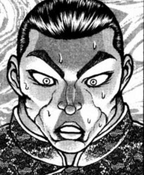
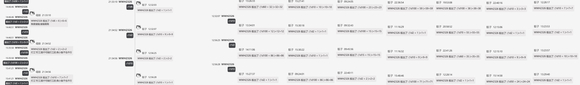

摩多羅：哼哼~那麽古明地覺退出了。

烈海王，你呢？

幽香：烈，你要來哪邊？

烈：——

武術家滿面大汗，看向他的左手邊。

那裏站著自己親愛的戀人和相識已久，亦師亦友的僧人。

他僵硬地轉過脖子，看向了右手邊。

坐在椅子上是從幼時就守護著他的神明大人，和相交莫逆的吸血鬼。

烈：——

所謂所有男人都無法回答的究極抉擇，武術家過去曾有耳聞。

但他萬萬沒有想到，有朝一日他面臨比那還有更加艱難，更加可怕的選擇！

向哪邊走都是絕路，選擇任何一方都只能迎來地獄！

他寧願去和惡鬼再廝殺上一天一夜，也不想站在這裏做選擇題……看著這四個人對烈海王來說比面對十億個純化妖精還更恐怖……更可怕呀！！

烈：……饕餮小姐。

可以将你的勺子借我一下吗？

饕餮的好感度【1d100：75】（总之算打赢了保底25，50以上成功）

饕餮：只借一下的话倒是可以。

你要做什么？

武者接过大勺，双腿站直，气沉丹田，双手倒握银勺，发出一声大喝。

烈：霸！

使尽全身力气，勺头向脑门一砸！

“当！”

但听一声巨响过后，武者两眼一闭，安详倒地——他硬生生把自己敲昏过去了。

饕餮：我的勺啊！！

僧人发出声小小的惊呼。

白莲：烈先生……

芙兰朵露：好硬的勺子！

觉妖怪眨了眨眼，把武术家搬到了自己的轮椅上。

觉：……那我上去的时候顺便带他去冰敷一下。

各位就，随意吧？

读心侦探用全速带着助手飞向了上层。

一秒之后，灼热地狱大混战开始了。

大乱斗的结局【1d10：4】

1 发展成了旧地狱大乱斗

2 在摩多罗控制下以平局收场

3 秘神大人！（好强）

4 发展成了旧地狱大乱斗

5 在摩多罗控制下以平局收场

6 醒来后的烈海王全力劝架（好强）

7 发展成了旧地狱大乱斗

8 在摩多罗控制下以平局收场

9 幽香&amp;白莲&amp;饕餮（好强）

10 大成功/大失败【1d2：1】

BGM：Gun's &amp; Roses (Paradise Lunch)

灼热地狱是个十分宽广的火海。

别说作为战斗的舞台，哪怕是派出专门的队伍过来探险，想必也要花上相当久的时间吧。

然而，对于参与这场战斗的这5人而言。

区区灼热地狱，实在是过于狭小了。

而另一方面，旧地狱也不只有这几位强者存在。

于是——

~旧灼热地狱~

“见之！　闻之！　语之！”

极寒刺骨的冰霜自开启的门中涌出，被命莲寺的僧侣靠魔力屏障挡住。

而被屏障分成2股的寒流则一往无前地冲向了他们的后方……冲向了交战中的贫穷神姐妹和地狱鸦。

一道吹在了阿空的头上，另一道将紫苑小姐冻成了冰坨子。

紫苑：啊，冷冷冷冷，好冷……

阿空：又有新的入侵者？！

别想跑，接招！！！

女苑：什么素质啊？！

姐姐我们上！！！

紫苑：女苑，可不可以，先把姐姐从冰块里拽出来……

~核融合炉~

神奈子：明白了吗？

我们的核聚变是清洁能源，守矢神社是不需要石油的。

灵梦：你早说啊。

魔理沙：嗨，又和以前一样白打了一场。

“我先前存储的黑水可还有剩！尝尝血池地狱的滋味吧！”

交谈中的三人面前，数位强者从灼热地狱冲出！

其中一人自口中喷出无尽血海，其中一部分被敌人们五花八门的招式蒸发，而更多的则顺着重力下落，淋了措手不及的三人满头满脸！

灵梦：……

魔理沙：……

神奈子：……

她们不约而同地低下头抽了抽鼻子，看了眼身上的污秽。

三人同时抬起头。

神奈子：我也好久没动真格了的。

魔理沙：上吧灵梦，干掉她。

灵梦：啊啊，现在是妖怪退治的时间了。

~旧地狱~

~温泉街~

烈：啊……

武术家悠悠醒转。

他一摸脑门，头上顶着块湿毛巾。

武术家把毛巾摘下，胡乱擦了把脸，一抬头发现有位绿头发女孩正睁大眼睛瞧着自己。

烈：！

是恋小姐啊，吓我一跳。

觉妖怪拍起了手，她的姐姐正坐在街边的长凳上。

恋：你醒啦~

这里是温泉街。

姐姐用轮椅推着你上来了。

烈：真不好意思，多谢觉小姐救我一命。

哎呦，我可得歇歇……我泡会温泉再上去吧。

觉小姐，现在情况怎么样？

古明地觉将目光偏向一侧。

觉：怎么样呢……

我想你马上就能知道了，大概。

烈：？

远方传来一阵熟悉的骚动声。

烈海王抬眼一看，两位鬼王拎着酒瓶带着一大帮伙计正往街这头赶。

萃香：吨吨吨吨~

开始啦开始啦~小的们跟我上！

路人鬼：好呀！久违的大混战来啦！

烈：什么情况？！

勇仪：呦，烈也在啊！

快来快来，这么有意思的仗赶不上就太可惜了——

这可是几年来规模最大参战人员质量最高的大乱斗！！

武术家倒吸一口冷气。

烈：不会吧——

他望向街道上方的高空。

在空中大打出手的人数比印象中直接翻了一倍，而参战者还在以现在进行时不断增长。

打到现在已经分不清战友和敌人了，所有人都在向四面八方无差别发射弹幕！

“极大魔法【多重超阔魔神炮】！”

”QED【495年的波纹】！“

“【刚欲兽神饕餮的晚餐】！”

”【无秩序的弹幕地狱】！“

还有更多，还有更多！

还有地狱鸦的核爆火球，完全爆发的贫穷神负能量光束，山神的巨大御柱，魔法使的魔炮，巫女的阴阳玉——说到此时鬼王又化作巨人般的模样，二话不说朝里面轰了一拳！

烈：哦哦哦哦哦哦哦！快停下！！

秘术【天文密葬法】！！

勇仪：嘿呀，不准偷跑，我也来！

四天王奥义【三步必杀】！！

武术家与鬼王飞身而起，盲目的觉妖怪兴奋地站了起来。

恋恋：好耶，玩弹幕游戏啦~

【Subterranean Rose】！

于是又三位强者加入了大混战，一时间旧地狱上空五彩斑斓，各样弹幕轮番登场，强者们的气势不要钱似的爆发，让实力稍微差点的观众当场就昏了过去，上空一团人大打出手，下方噼里啪啦倒了一地，好不热闹！

觉：……

觉妖怪彻底放弃了劝架的打算，她坐回轮椅上，找了个相对安全的观战地点，用魔力挡开了飞溅的弹幕。

觉从怀中掏出一个小本，又从衣袋里拿出支笔来。

她打开笔记的最新一页，思索了几秒，如是写到。

觉：……凶兽的邪恶计划被我们解决了。

可以想象，不久之后又要开一场盛大的宴会吧。

她忽略了惨叫的声响，欣赏着空中美丽的弹幕，微笑着说。

觉：于是，在旧地狱常见的大混战中，黑水异变就此画上了句号。

可喜可贺，可喜可贺~

——————

武术家吃的不快，只在说完一段后，才用竹签挑起个丸子送入口中。

在这个故事讲完的时候，他才刚好把最后一个章鱼烧吃掉。

今日的雪还未停。

晶莹的碎片从空中飘落向人们，洒在衣衫上，落在发丝中。

这时小吃已经冷了，他嚼着最后一个丸子，感到有点可惜。

他咽下事物，心想，可总不能让千亦小姐再请份吃食，那就说不过去了。

烈：大混战结束后摩多罗女士向两人道了歉，说之后会“考虑的细致些”。

我们在旧地狱开了一场盛大的宴会，即作为黑水异变结束的庆祝，也作为新成员饕餮尤魔的欢迎会。

之后，血池地狱由饕餮和摩多罗女士共同管理，黑水再也没溢出过。

去年夏季的这场骚动，就这样结束了。

船长：啊啊~

我到现在都感觉可惜，那天没能亲身到现场。

千亦小姐作何感想啊？

千亦：哇咧……

集市之神半张着嘴，愣了好一阵，才说道。

千亦：真是……

乱七八糟的故事啊！

武术家和船幽灵同时笑了起来。

村纱：这不说嘛。

从头到尾都乱七八糟的！

千亦：本来我都开始同情那位“饕餮”了，结果故事到了后面却朝着意想外的方向狂奔！

主动自爆后复活揪出黑幕好王道啊她才是主人公吧！用大勺子敲晕自己亏你想得出来哦！结果到了最后不还是参加进大乱斗里了那这到底有什么意义嘛！

烈：哈哈哈哈！

无话可说啊。

千亦把三人吃完后残余的包装盒搜集到了一起，起身丢进了一旁的垃圾桶。

千亦：嗯……还是觉得有点在意。

为什么那个摩多罗在饕餮自爆后就说达成目的了？

是因为她开始了交涉吗。

烈：摩多罗女士的目的并不是故意整蛊人。

血池地狱是个相当恶劣的地方，吸收了那里的欲望后，饕餮丧失了平日的理性，而被无尽的贪欲占据了身体——她甚至当真想统治世界了。

只要饕餮仍占据血池地狱，就没有任何交流的可能性。

烈：在灼热地狱复活后，饕餮尽管仍是吸取了地下的欲望，但怎么说也比血池地狱的她要好得多。

这样的饕餮能够通过言语交流，双方达成协定后让她以合理的手段管理血池地狱，也就不需要再担心黑水暴走了。

千亦：原先是想靠芙兰朵露的破坏能力将她彻底粉碎，但主动在别处重生后也就没那个必要了啊……

我还是有点在意的地方，不过今天就听到这里吧！

她用手指点了点嘴唇，从长椅上站起。

似乎是察觉到了友人的困扰，集市之神没再刨根问底。

她向来不咄咄逼人，这让武者感到轻松许多。

船长：我看见一轮她们咯~

我去找大家玩去了，两位再见！

船长打了声招呼就飞走了，武术家走到友人身旁。

烈：千亦小姐还想吃什么？

下一顿我请吧。

千亦：别这样，说好了今天我请客不是吗？

我现在更好奇自助区那块啦。

那位到现在还在吃的客人，该不会是……

两人走入人群，在一片喧哗中看向了自助区坚持至今的三位选手。

幽幽子：食材都很新鲜，可制作时还是有点求快了。

考虑到这次的供给压力也不能够以平日的标准苛求，咲夜还是和以前一样优秀呢~

咲夜：谢谢您，幽幽子小姐。

您二位评价如何？

“嗝……”

虹龙洞的矿工嘴里叼着根鱿鱼须，咣当一声倒在了地上。

百百世：嗝……很好吃……我吃不下了……

我用龙珠付账……嗝！

那家伙怎么回事……怎么比我还能吃……

西行寺幽幽子撤离了战场！不屈的斗士姬虫百百世也倒下了！！

现在仍在场中坚持着的强者只有一位——是那位端坐于碟山盘海中高举大勺要求再来一份的白发女孩！

饕餮：呵呵呵，味道很棒啊！

再来一份！难得见到这样好的手艺，考不考虑来我们刚欲同盟工作啊？

芙兰朵露：不~行！

咲夜是我家的女仆，不会让给你的。

要是再说这样的话就把你破坏掉。

女仆长点头表示赞许。

咲夜：十分抱歉，今早紧急订购的食材也已经消耗一空。

您刚刚吃掉的就是最后一份了。

饕餮：这就没了？太可惜了。

我用石油付账！

千亦：哇……

这就是外界所言的石油王吗，好羡慕……

烈：你不必急着羡慕，看。

银发女仆一脸遗憾。

咲夜：不好意思，大小姐说您的石油太脏了，她不想要。

您可以用其他的方式付款吗？

饕餮：哎？

千亦：噗！

“你们这收畜生界货币吗？可不可以先打个欠条？”

“大小姐说不行，今天之内就要付款。”

芙兰朵露邪笑着拿出了棒子。

眼看又一起争端将起，凑热闹的两人赶忙离开现场。

他们穿过了红魔馆的大门，在湖心岛的边缘处漫步。

千亦：什么嘛。

当石油不再值钱的时候，石油王也不是什么厉害的家伙了。

烈：在黑水异变结束后，大家都知道了石油的正体。

那是血池地狱中被深深诅咒的污血……这样一来，谁还想要石油呢。

烈海王哈了口气。

他已将故事讲完了，可那并非是关于黑水异变的全貌。

还有些细枝末节被他留在了脑海中。

没和任何人说过的，只有他与某位当事人知晓的细节……

—————

~黑水异变结束的几天后~

~后户之国~

这里是有着无限门扉的神秘空间，究极秘神的独有国度。

烈海王带了些消暑的小吃前来探望某位神明。

他将为两位舞者准备好的份单独拿出，瞧着她们兴高采烈地跑开，又将吃食放在桌上，自己则端正地在椅子上坐下。

金发的神明坐在桌子的另一头，她常用的那张椅子上。她慢条斯理地拿过袋子，拆开包装，并向武者抛出了一个问题。

“你知道石油是什么吗？”

武术家立即做出回答。

烈：我先前回去找永琳补习了相关的知识。

石油是烷烃、环烷烃、芳香烃的混合物……

摩多罗拆开包装，拿出一碗杨枝甘露和一份木糠冻饼。

摩多罗：哦，抹茶味的，我喜欢这个。

我没问你外界的定义，我问的是“这里”的石油。

烈：如果说这次异变里的石油……

那就是血池地狱里的血啊。

摩多罗：没错，血。

石油是被诅咒的血液，是由生物形成的产物。

摩多罗：那是生命的恐惧、悲欢、憎恶、怨恨……也就是，生命死后依旧残留着的欲望。

这一切形成了这种液体的真身。

生前的欲望可称之为执念，死后残留的欲望是什么？

烈：遗恨，或者说怨念吧。

她吃了一块点心，而后再度开口。

摩多罗：说对了。

你已经亲自下过血池地狱，现在能理解这次的异变我会亲自采取行动了么？

烈的推理【1d60：5+40=45】（50以上理解）

你推出什么了啊【1d10:6】

1 石油……会吃人

2 大家都用石油会污染环境的

3 果然是摩多罗女士想要恶作剧（为啥啦）

4 石油……会吃人

5 大家都用石油会污染环境的

6 果然是摩多罗女士想要独吞石油（为啥啦）

7 石油……会吃人

8 大家都用石油会污染环境的

9 摩多罗女士打算靠石油赚钱（为啥啦）

10 大成功/大失败【1d2：2】

烈：摩多罗女士，我不会向外说的。

果然……是因为您想独自吞下石油吧！

因为对竞争对手饕餮无可奈何，才策划了这样一起事件来分一杯羹！

秘神大人用单手撑着脸，似笑非笑地望着桌对面的男人，一言不发。

烈：对不起是我想太多了。

摩多罗：我有时候真不知道该说你聪明还是傻。

言归正传，你在血池地狱中感受到的是什么？

武术家的脸色严肃起来。

烈：怨念，以及极强的异样感。

不是将力量压制，而是像饕餮小姐那样，将落入血池中的事物吞食，融化，最终变成血海的一部分。不光是肉体或魔力，甚至连精神力或欲望一类无形之物也会被那地方吸收。

甚至可以这样说，血池地狱本身就是一个仅凭怨念行动的无智饕餮。

连现在的我都会被其压制相当的实力，稍弱些的人过去是会丧命的……那实在是个危险过头的地方。

摩多罗：呵呵，那地方在过去很长一段时间内还不至于这样。

就连鬼神们也知晓血池地狱的危险，可它们也没什么好办法管理此处。

因此在撤离旧地狱时，他们只是在那地方加了个盖子——在上方加把烈火，阻拦不幸者的误入，这就算是“封印”了。

烈：旧灼热地狱本身就算一重封印了？！

摩多罗：他们还能怎么办？

谁都知道这法子治标不治本，血池地狱迟早有一天会失控，会暴走，被深深诅咒的血液会从地底喷出，彻底吞没地上的一切吧——

而在那之前就用这种治标不治本的法子撑着，希望这封印能起到效果。

于是暂时失活的血液就成了你所见的黑水，也就是石油。

秘神大人将饼吃完了，她打开另一碗甜品，舀出一勺汁液。

烈：这么说……我见到的那血海就是恢复活性的地狱。

是因为我用了白莲师傅的真言？

摩多罗：那是让你看破真相的咒法，最多影响一小片区域，还不至于波及整个血池。

令血池地狱快速活化的，当然是饕餮尤魔。

血液是欲望的凝结，遇到贪婪的家伙，就会因回想起生前而骚动。

同样的，也只有性质相同的贪婪之徒，才能有效活用这份力量。

摩多罗倾斜小勺，让橙黄色的汁液滴落至碗中激起一片涟漪。

摩多罗：你方才也说过，饕餮与血池，这两者的性质是极为相似的。

饕餮的到来让沉寂已久的血池开始了活化。

以她的能力，如果认真治理，倒也不至于令血池暴走……

烈：可吞噬了过多血液的饕餮自身却暴走了。

她只想着用石油支配地表，却也不顾及血池地狱本身，这样一来得不到治理，又被激活的血池大暴走就只会加速……

明明正说着有关血的话题，摩多罗却毫不顾忌地享用着食物。

摩多罗：轰！放任不管的话过不了多久，被诅咒的腐水就会涌到地上。

那可就不只是把地板或家私弄脏那么简单了，想想看把普通的人类、妖精或是小妖怪扔进血池会发生什么？

不用详细描述，我知道你想象得到。所以我才说这次的异变性质恶劣，必须速战速决。

武术家点了点头。

烈：我完全理解了。

因此第一个发觉异状的您这次才会先一步出手。

借助黑水喷发引来注意力，让大家与饕餮战斗，消耗她力量的同时拖延暴走的时限，最后让训练成功的芙兰朵露小姐将其一击必杀，最终再和恢复理智的饕餮交涉以达成目的。

之后血池地狱是由您和饕餮共同管理吗？

摩多罗：将它放在我的手下，就能用我的力量将其隐匿起来。

如此一来，有着双重管理机制的血池地狱安全性就大大增强，暴走就不会发生了。

摩多罗：可惜由于意料之外的参与者过多了，这次没能按照预想的发展。

但解决时间反而快了许多，对我而言这结局也很好。

武术家一脸的欲言又止。

摩多罗：怎么了那副表情，看上去真有趣。

还有什么想问的？

烈：就是，摩多罗女士。

我不明白为什么你要让黑水喷到幽香和白莲师傅那里去……

如果按照原本的计划，让我和灵梦她们去解决不是会更好吗。

花田与命莲寺喷水的原因【1d10:9】

1 血池地狱暴走速度太快了

2 想着人越多越好就没精确控制区域

3 紫的恶作剧（为啥啦）

4 血池地狱暴走速度太快了

5 想着人越多越好就没精确控制区域

6 饕餮测试血池力量时的副作用（为啥啦）

7 血池地狱暴走速度太快了

8 想着人越多越好就没精确控制区域

9 因为会很有趣（为啥啦）

10 大成功/大失败【1d2：2】

“这个啊……”

摩多罗喝完了最后一口甜品，放下小碗，笑着说。

摩多罗：因为那很有趣啊。

烈：……啊？

摩多罗：风见幽香大部分时候都是一副笑容，仿佛一切都在掌握中。

圣白莲也与她差不多，虽偶有急躁，但也总端着副平静的姿态。

她们看上去有着应付一切突发状况的自信。

所以我就想，当她们真正遇到了意料之外的事情时，会露出怎样的表情呢？

武术家想起了他在前两日时看到的两幅黑脸。

烈：恐怕是……相当有冲击力的表情？

摩多罗：黑水的喷发只是有点异味，不会造成什么真正的伤害，用来做个小小的恶作剧不是正合适吗。

只是我实在没想到她们的脾气这么急躁，居然因此亲自冲到地底下去了。

哈哈哈，很有趣吧！

秘神大人在椅子上哈哈大笑，活像个恶作剧成功的孩子。

烈：您真就毫不在乎地在她们面前直说了啊？！

摩多罗：既然被察觉到了就大大方方承认嘛，又不是什么大不了的事。

大家玩上一场弹幕游戏，相互熟悉，怨气和怒意也能消解，最后一起开场宴会，事情不就这样解决了？

这才是我们的幻想乡，要有气量一些~

武术家以手掩面，发出一声无奈的叹息。

烈：唉……

摩多罗女士……摩多罗大人哎……

您有时候真的像个孩子一样。

摩多罗：生活最重要的就是开心。

做正事之余，也要给自己找些愉快的消遣。

就结果来看，一切不都很好。

她一脸神秘地向武术家招了招手。

摩多罗：我用天狗的小道具把她们中招的瞬间拍下来了。

要不要一起看？

烈的犹豫【1d100:12】

烈的好奇心【1d100:39】

武术家犹豫了半秒，被发自内心的好奇所战胜了。

烈：还请让我也看一眼吧！

武术家走到秘神伸后，侧头看去。

她手中的两张照片刚好拍下了黑水喷发的一瞬间。

看到那景象的烈海王坚持了几秒，终于忍不住了。

两人愉快的笑声在后户之国中飘扬……

——————

烈：（这可不能说出去……就算在觉小姐面前也不能想起来这事的。）

他将思绪从回忆中收回，看向身旁的友人。

天弓千亦站在湖边，张望着空中飞舞的妖精，与飘飘扬扬的雪。

她愉快的笑着。

烈：千亦小姐很开心啊。

千亦：难得放一天假，今天吃到了美味的料理，也听到了有趣的故事，我很高兴。

那个故事让我想起了我刚来幻想乡的时候。

烈：我想那还不至于那么乱。

千亦：在我的眼中，那也是混乱又有趣的冒险啊。

这样想的时候，就会有种莫名的亲切感……

她伸出手去，接下一片雪花。

千亦：我感觉自己逐渐适应起这个没有常识的地方。

感觉自己也成为了幻想乡的一份子了。

烈：可在我们的眼中，千亦小姐。

当你发起异变的时候，你就已经是这地方的新成员了。

他们愉快地笑着，又再度走向洋馆，想看看那里的妖怪们又闹出了什么新的乱子。

饕餮：住手，吸血鬼小丫头！明天我就把钱还你！

芙兰朵露：没钱就把命留下吧，哈哈哈哈哈！

凶兽与破坏神正在洋馆上空大打出手，观众们不时发出喝彩声。

两人走入人群之中，一并观赏起这场弹幕决斗。

化作了这群古怪的妖怪神明人类中，同样古怪的一部分。

~黑水异变 结束~

持续时间：2天

成就：战无不胜的刚欲同盟盟主 达成

更加熟悉畜生界了

（本日的更新结束，下次更新的时间未定，骰子之后发）

（以下是我的废话）

哈，哈，哈

黑水异变就，到这里，结束了

真的这都什么乱七八糟的

这都什么乱七八糟的啊啊！！！

速通已经有很多次了速通到连一场完整对战都没打完的还真的是第一次！

我都没想到饕餮小姐能抓住区区一个机制骰的机会靠双重大成功中梗翻盘成功自己解决了自己这个问题然后一转大混战，你好强啊！这就是畜生界的计策吗！！

最后那场大混战以摩多罗&amp;芙兰对幽香&amp;白莲&amp;饕餮开始，以根本分不清敌人的大混战结束，因为上来的时候双方都惹了不少人，还有鬼族这种图一乐进去打得。

所以才说是大混战，恐怕笑得最开心的是摩多罗吧。

烈师傅则一转成为被迫害的了，太惨了。

哎呦喂摩多罗，她真的干出来了啊。

明明也是在干正事，明明确实是为了大家好，这个人怎么就能做到一边找乐子一边办公呢。

我一开始想说这次很有损形象但我转念一想，啊上一次她在后户之国玩泳装轮椅竞技赛来着，好像也没什么形象了。

真的是，彻彻底底的搞笑回，至少我自己在写的时候完全都是在笑了。

于是乎，异变回结束了，之后或许还有彩蛋，看看我有没有空。至于之后的更新……看看这几天有没有灵感，有的话写一个小活动，没有的话就在彩蛋更完后结束啦！

那么本次的更新结束，下一次的更新时间未定，骰子之后发。

~彩蛋~

~秋后算账~

饕餮：血池地狱的事项也和秘神商谈完毕，清闲下来了呢。

得回大本营拉几个家伙来搬运石油了。

顺便久违地看看部下们的情况吧，呵呵呵……

~半天之后~

~畜生界~

饕餮：虽说埴轮兵团近期安分下来了。

为了避免不必要的麻烦，还是走偏僻点的道吧。

我可不想在路上遇到白痴或是恶棍。

“你要去哪啊？”

或许是因为在悠闲的幻想乡待了太久，被突然提问的白发少女习惯性答了一句。

饕餮：没什么，随便逛逛——

“用这条一人用密道吗？”

饕餮：？！

谎话才刚刚出口，饕餮尤魔反应过来了。

问话的这个声音，其主人，不正是隔壁组织的那个筋肉白痴吗……！

早鬼：呦，饕餮盟主。

我一直奇怪前阵子你跑哪里去了，后来还是从吉吊那混账那里知道的……

原来在我们和埴安神袿姬对抗的时候，你跑到幻想乡地下喝石油去了啊。

嘎巴，嘎巴。

劲牙组组长活动着指关节，发出清脆的响声。

早鬼：看那样子你吃的很饱啊。

味道怎么样？深埋于地下的鲜血，是不是非常美味啊？

饕餮：呵呵呵。

骊驹早鬼，你被吉吊八千慧利用了——

早鬼：没关系，我不在乎。

我现在，只想暴揍一顿某个临阵脱逃的叛徒！

接招，饕餮尤魔！！！

~畜生界~

~鬼杰组总部~

“安排好了吗？”

水獭灵：当然了，吉吊大人。

按您之前吩咐好的那样，那片区域的陷阱已全部都布设完毕了。

“很好，你回去吧。”

水獭灵飘出房门。鬼杰组的组长拉开窗帘，观赏着远方飘起的烟尘，仿佛在脑海中听见了某个小个子敌人恼怒的叫喊声。

吉吊：瞧您那慌张的样子，怎么现在一点都不冷静了。

是您自己选择了临阵脱逃，那我们当然也会想点办法报复。

欢迎回到畜生界，饕餮盟主。

~彩蛋环节结束~

附上本次的骰子

于是，这两天下来果然是没什么灵感）

刚欲异闻篇就在这里结束了，这个贴子下一次更新就不知道是什么时候咯。

至于新作的话我有在考虑，不过还是得休息一段时间，再补充一段时间才能写新的东西了。

要写新东西的话会在贴子里说的。

那么最后，今天是除夕夜，提前祝大家新年快乐~

由望远镜海皇 @望远镜300  制作的视频第三季第二集更新啦！

本期的内容是娘化回的后篇，感兴趣的话就来看看吧。

～关于新作～

于是乎，于是乎。

自刚欲异闻篇完结后也过了一个月 差不多到了要开新作的时候了。

这一次打算尝试写点新的东西。

题材也好形式也好都和以前不一样，简而言之一句话来说的话......

这一次我想尝试写小说。

一方面是由于同人写得多了就总会尝试想写一下原创的故事，另一方面也是因为贴吧这边这段时间吞噬太过严重，已经到了无法正常发送内容的地步。

现实生活是很重要的，在网上写点东西终究只是个人爱好，而我想之后的自己很难有像以前一样坐在电脑前把一层内容反复发出来，和贴子斗智斗勇的时间——发内容的时间几乎赶得上写内容的时间了，这不得不说挺折磨的(悲)

而另外一个方面，也就是我之前说过的，我想要写一个原创故事。

这个其实算是我个人的一个小小的愿望吧)

说来不怕大家笑话，我从小就爱做白日梦，打小就想当个作家。

当然我很清楚自己是成不了什么作家的，但这不妨碍我做梦。

我很喜欢讲故事，我想试试能不能给大家讲个我自己的故事，哪怕写出来是个烂俗的，无趣的段落也好，那总归是我自己所创作的东西——反正写作也不花钱，那就和以前写贴子一样写写试试吧！

于是乎，这次我想尝试写小说啦。

新作会是一个俗套的超能力青春校园恋爱格斗喜剧，如果大家感兴趣的话，就来看看吧！

(由于现在在外面书还没开呢，等之后回来会在贴子里附上链接。)

我在网站上开了新书，现在正在等过审（悲）

希望两天内能够过审，过了之后会来贴子里说的）

由koki海皇制作的交流回第三期更新啦

本期的内容是香霖堂天子回 感兴趣的话就来看看吧

~新书开了~

新书过审了~

新书的名字是《苍穹都市的超能力者》，差不多就是传统王道的超能力战斗故事

封面在这里

地址是https://book.qidian.com/info/1033253483/

小说的话一次要更新3~4k字左右，一天更一次没有存稿会比较艰难，因此我尽量做到2天左右更新一次吧）

感兴趣的话就来看看吧！谢谢大家。

由koki海皇制作的交流回视频第三集下更新啦。本期的内容是天子回的后半，感兴趣的话就来看一下吧！

~备份~

前天账号被封啦，今天才刚解封。

武藏的贴子被单独删了，还在申诉中）

其实烈幻入这个贴子是有热心吧友做过备份的，在dmzj有一个很完整的漫画版，考虑到第二季贴子的状况，我更建议想补的吧友去看这个版本。

其余的贴子也有朋友在做备份，等做好了我会一块讲的，在这里感谢花时间与精力来做备份的朋友。

考虑到贴吧的现状，有一天真的会彻底找不回来也不是没可能，到了那时可能还是看备份会好些吧）

那么碎碎念到此结束。

烈幻入两周年啦！

感谢望远镜海皇 @望远镜300  制作的两周年高清重制版幽香回纪念视频～

由于我这两天正好现实生活有事再加上贴吧近期吞贴够呛，这次贴子里就没有更新了(悲)

这个贴子是在大家的支持与鼓励下才能顺利完结的，谢谢大家～

