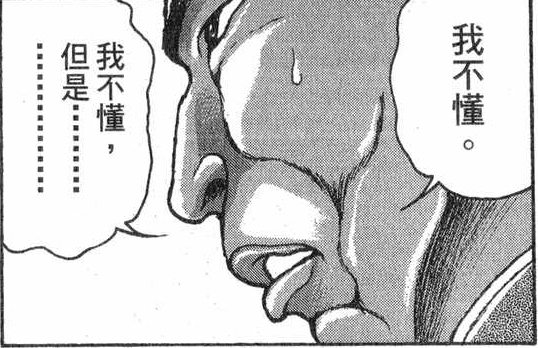
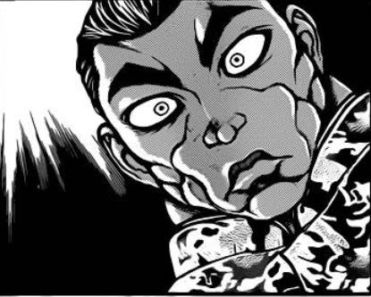
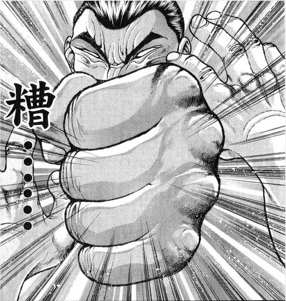
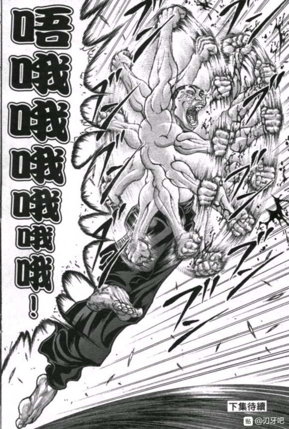

第二季 堂堂连载！

第一季链接：https://tieb a.baidu.co m/p/ 6710222599

【简介】

这个贴子是，所谓的安科贴子

简单来说，就是角色的大多数行动全部交由骰子决定的贴子

由作为贴主的我为角色的行动给出多个选项，然后投骰子决定故事的走向

由于有着【大成功】/【大失败】的存在，角色突然退场或者故事刚开始boss就被干掉了都是有可能的展开

原本应该使用AA画的，但由于我个人的喜好而使用了立绘以及漫画截图

【人物崩坏注意】

贴主本人是东方初心者，在相关的世界观设定/人物性格/对话等方面，不可避免的会出现错误

换句话说就是人物崩坏注意，还请大家多多包涵

【骰子系统】

这个贴子的灵感来源于《迪亚哥布兰多似乎正在挑战Grandorder的样子》这个安科贴，因此本贴的很多系统也参考了原贴

骰子方面的话，【1d100】的时候1-5为大失败、96-100为大成功

为了避免过于随机的展开，我会在一些骰子中给予+30、+50之类的基础值补正

换句话说就是【1d70+30】这样的骰子，此时只会出现大成功而不会出现大失败，当然相应的判定成功值也会提高

当然，肯定会有吧友好奇，你如何保证你是真的投了骰子而不是自己在编故事呢？

……

我用热狗发誓，所有的选项全都交给骰子了！

还请大家相信我不想失去热狗的心！

于是、烈海王的幻想乡生活在此继续

（稍微准备一下图片，九点钟开始更新天子安价回）

~这是发生在烈来到幻想乡的第【286+1d10:4=290】天的事~

烈为什么要前去香霖堂？【1d10:4】

1 普通的去买东西

2 其实是有想要鉴定的物品

3 魔理沙的拜托（为啥啦）

4 普通的去买东西

5 其实是有想要鉴定的物品

6 其实是霖之助的邀请（为啥啦）

7 普通的去买东西

8 其实是有想要鉴定的物品

9 是因为咲夜小姐的宣传

10 大成功/大失败【1d2：1】

烈要买什么东西？【1d10:6】

1 辉夜想玩GBA

2 假腿的保养器材

3 皮克的新衣（为啥啊）

4 因幡帝的陷阱工具

5 假腿的保养器材

6 铃仙想要新的枪（为啥啊）

7 师匠的医疗器材（原来是采购的？）

8 假腿的保养器材

9 幽香的新茶具

10 大成功/大失败【1d2：2】

~永远亭~

烈海王结束了晨练，正在准备今日的早饭

这个时候，狂气的月兔敲了敲厨房的门

烈：铃仙前辈，早饭马上就好了，稍等一会啊

铃仙：虽说有点饿了，但我不是来催早饭的

烈先生你今天有空吗？

烈：我倒是没什么事情……

有什么需要我帮忙的吗？

铃仙：实际上，我想买一把新的枪！

烈的震惊【1d100：43】

烈：为啥啊？

前辈你手里那两把月之都出品的喇叭枪已经很够用了吧

我记得那玩意上次把纯化妖精们打的鬼哭狼嚎

铃仙买新枪的理由是？【1d10:2】

1 纯粹的个人爱好

2 火力不足恐惧症

3 其实以前的枪坏了（那你去修啊）

4 纯粹的个人爱好

5 火力不足恐惧症

6 其实是想要尝试一下三枪流（那是什么）

7 纯粹的个人爱好

8 火力不足恐惧症

9 其实是帮帝买的（为啥啊）

10 大成功/大失败【1d2：2】

铃仙：只是单纯为了安心感啦~

我稍微有点火力不足恐惧症，具体来说就是身边没有【2+1d10：7=9】把以上的武器就会感到坐立不安

以前的时候只要【1+1d7：7=8】把武器就够了的，但之前的救援行动过后不知为何症状变强了一点

烈：那确实是变强了一点……

说起来在幻想乡中买枪，是要去找荷取小姐她们吗？

铃仙：河童的武器我已经有了

这一次的话想试试外界的武器，应该可以在香霖堂买到

烈对外界武器的不屑【1d100：53】

烈：铃仙前辈，恕我直言

外界的武器根本就比不过经过锻炼的肉体

普通的枪械，连打伤奥利巴都不太可能做到

到时候我帮你看看有没有火箭筒之类的武器吧……

铃仙：那就拜托你了~

我帮你把饭端过去吧

永远亭的苦劳二人组端着今日的早餐离开了厨房

吃完早饭之后，烈海王前往香霖堂了

有人同行吗？【1d100：43】（75以上有）

今天的烈海王依旧是独自一人

路上有事发生吗？【1d100：86】（75以上有）

具体的事件是【1d10：3】

1 半路上遇到了魔理沙

2 香霖堂的店主今日不在

3 把天子认成了小偷（为啥啦）

4 半路上遇到了莉格露

5 香霖堂的店主今日不在

6 迷路到了奇怪的地方（现在还能迷路吗？）

7 铃仙突然改主意打算同行了

8 香霖堂的店主今日不在

9 香霖堂被砸了（为啥啦）

10 大成功/大失败【1d2：2】

~香霖堂~

从人类村落到魔法森林的路上，有一座奇妙的道具屋

它的主体是一个覆有瓦片的入母屋造店面与一个土藏造仓库，二者之间由走廊相连，店面的牌匾上写有【香霖堂】三个大字，那便是这家店铺的名字

道具店的墙壁上贴满了古早的广告海报，而建筑内外都存放有大量货物：大到道路标识牌、自行车，小到录音机、CRT电视，杂物中包含了大量属于上个世纪的，洋溢着昭和气息的老物件

这里除了几个熟客外平日鲜少有人问津

但不知为何，今天有一个鬼鬼祟祟的蓝发少女正站在店铺门口，好奇的观望着这间奇怪的建筑

烈：？

这个探头探脑的身影怎么跟魔理沙这么像……而且还都戴着帽子……

我上一次看到那副姿态时，她想偷师匠的药来着……

这时，蓝发少女将手伸向了香霖堂的窗户

烈：果然，她是来盗窃的小偷！

香霖堂遭了贼了！

烈要做什么？【1d10:4】

1 这里就用我烈海王的口才

2 大声告警，提醒店主

3 战斗！（别作死啊）

4 这里就用我烈海王的口才

5 大声告警，提醒店主

6 这里就用我烈海王的推理（为啥啊）

7 这里就用我烈海王的口才

8 大声告警，提醒店主

9 去找外援吧（为啥啦）

10 大成功/大失败【1d2：2】

烈：这位小姐，还请您稍等一下！

听到烈海王的话语后，疑似小偷的人影转过了头

她外表看上去像是十几岁的红瞳少女，留有一头蓝色的长直发，头戴黑色的小礼帽，其上佩有桃子和桃树叶

少女颈部扎着红色的蝴蝶领结，身穿粉红色的短袖上衣与奇妙的双层裙子，其外层镶嵌着七彩虹色的饰品，内层则是如天空一般的蓝色

她脚踏棕色的长筒靴长筒靴，手持可以洞察气质的绯想之剑

？？？：不知名的地上人哟，找我这高贵的天人有何要事啊？

烈的口才【1d100：92】（75以上好感度+5，50以下好感度-5）

烈：原来您是居住于天界之人，怪不得一眼望去便显得如此与众不同

我是永远亭的武者 烈海王

我刚刚见您站在屋前却并未走入，不由得心生疑虑，便前来确认一下情况

如今看来，大概是我多虑了

比那名居天子的好感度【1d95：66+5=71】（口才+5）

天子：吼吼，难得遇见一个头脑聪慧的地上人

也难怪你心生迷惑，定然是被我超脱凡俗的身姿所迷倒了吧

听好了，我是居于天界的高贵人类，比那名居天子！

烈：天子小姐你好

请问你为何要去戳香霖堂的窗户呢？

我想普通人看到这幅景象后，都会对你带有误解的

天子的理由是【1d10:4】

1 测试窗纸的强度

2 敲门之后没有回应

3 只是单纯的很无聊而已（你是顽童吗）

4 测试窗纸的强度

5 敲门之后没有回应

6 确实打算偷东西来着（为啥啦）

7 测试窗纸的强度

8 敲门之后没有回应

9 发泄被处罚的不满（好过分）

10 大成功/大失败【1d2：2】

天子：我是在测试窗户纸的强度哦

烈的迷惑【1d100：64】

烈：我不懂......

我想窗纸是连小孩子都可以轻易戳破的东西，莫非香霖堂的窗户纸上施加了强化魔法吗？

“不不，窗户纸可是比玻璃还要坚硬的事物”

“窗户纸作为结界而言，有着将人类危险的行为防范于未然的神秘能力。只是，窗纸的坚硬程度与房屋中住户的力量成正比——废弃居所的窗纸连婴儿都能轻易弄破，但神所居住的神社的窗纸，却连成年人的力量也对其无可奈何”

出言解释的博学者，是从屋内走出的白发半妖，知足不辱的旧道具店 森近霖之助

烈：您是之前支援魔理沙的那位……

原来如此，这里是您的店铺啊

天子：哦，懂得还挺多啊？

你这店里的窗纸坚硬度如何？

霖之助：不巧的是，连天狗的报纸都能轻易将其打破

我可不是什么擅长战斗的人物

想打弹幕战的话，您还是去找魔理沙或者灵梦吧

烈：（那玩意别说打个窗户纸，拿来砸房子都没什么问题吧？）

霖之助：那么，虽然这话说的有些晚了——

我的名字是森近霖之助

欢迎光临旧道具店香霖堂，两位有什么吩咐？

银发半妖带着初次来访的两位客人走进了道具屋之中

首先开口的是【1d2：2】

1 烈

2 天子

天子为什么会来香霖堂？【1d10：9】

1 普通的过来买东西

2 今早刚被天界放逐下来，正好落在香霖堂门口

3 其实是来打听都市传说的（为啥啊）

4 普通的过来买东西

5 今早刚被天界放逐下来，正好落在香霖堂门口

6 听说香霖堂的店主是超强的实力者（你听谁说的）

7 普通的过来买东西

8 今早刚被天界放逐下来，正好落在香霖堂门口

9 其实是盯上了草薙之剑（为啥啊）

10 大成功/大失败【1d2：2】

天子：之前跟魔理沙聊天的时候，她提起过你的店铺呢

那是一个很有意思的故事，你帮她修好了放魔炮的八卦炉，并得到了她家门口的废铁堆

其中恰好有一把肮脏而古旧的金属剑——

为什么呢，听着魔理沙的描述，我总感觉其外形与记载中的【草薙之剑】一模一样啊！

霖之助的震惊【1d100：52】

霖之助：这都是好几年之前的事情了……

那时候我甚至还没开始写日记

没想到魔理沙居然到现在还记得啊

天子：子曰 人而无信，不知其可也

这种利用信息差做出的不平等交易，可算不上有信誉

烈的理解【1d90：77+10=87】（50以上理解）

烈：原来如此，魔理沙在几年前却是做了这么一单亏本生意

本以为是废铁的物件却是蒙尘的神器，想必她知道真相后一定会暴跳如雷的

——话说回来，天子小姐您还读过论语吗？

天子：我可是家学渊博的天上人

老古董们天天什么事也不干就逼着我念书，就算再不想学也全都记住了

烈的情商【1d90：55+10=65】（50以下称赞学习认真）

烈：（看上去满不着调的，其实意外的是个好学生？）

那您是想把这剑买回来？

天子：当然

如此巧合的事情都能被我撞见，正说明此物与我有缘

单凭你们这些地上人可配不上这把神器——老老实实交给我吧！

霖之助的行动是【1d10:2】

1 开出一个超高的价钱

2 还给魔理沙

3 这里就用我霖之助的口才蒙混过关（有用吗？）

4 开出一个超高的价钱

5 还给魔理沙

6 呼叫外援（谁会来啊）

7 开出一个超高的价钱

8 还给魔理沙

9 逃跑了！（为啥啦）

10 大成功/大失败【1d2：1】

霖之助：哎呀呀，这么多年前的旧账都被翻出来了

就像你所说的一样，这不是什么公平的交易

不过，我也只是替魔理沙暂为保管而已

烈：您是怕魔理沙惹出祸端？

霖之助：正是如此

【草薙之剑】可是非常厉害而危险的东西，如果一直让当时的魔理沙拿着，谁知道她会惹出什么事情？

我想当时由我代为保管，姑且算是正确的决定

天子：话说的倒是好听，你只是一直在欺骗她吧？

霖之助摇了摇手指

霖之助：一味的去骗魔理沙的话，以后被她发现了可是十分恐怖的

所以我每次都有跟她说哦，“我可从没跟你客气过”

如今魔理沙也已经变为成熟的魔法使了——前段时间不还去谈恋爱了吗

我想现在将剑交还给她，应当是没有问题了

银发的店主脸上露出了狡猾的笑容

霖之助：如此物归原主，便相安无事

天子小姐，您看如何啊？

天子的行动是【1d10:3】

1 坚持要买下来（你有钱吗？）

2 那就看看其他的物品吧

3 抢劫啦！（别丢人啊！）

4 坚持要买下来（你有钱吗？）

5 那就看看其他的物品吧

6 之后去跟魔理沙谈条件

7 坚持要买下来（你有钱吗？）

8 那就看看其他的物品吧

9 真无聊，我走了

10 大成功/大失败【1d2：1】

天子：有缘者分文不取,无缘者千金不卖

与魔理沙这个有缘无分的笨蛋相比，我才是真正的有缘者——这剑本来就该是我的！

烈：天子小姐，你这是抢劫！

天子：这叫抢吗？

地上的所有东西本来就都是属于我的，我现在拿回我的东西正是理所当然，就连圣贤看了都说不出什么话来！

烈：圣贤怕是被你气到说不出话了！

霖之助要做什么？【1d10:4】

1 先把烈海王的生意谈完再说

2 靠我霖之助的口才

3 战斗！（你认真的？）

4 先把烈海王的生意谈完再说

5 靠我霖之助的口才

6 开一个超高的价钱

7 先把烈海王的生意谈完再说

8 靠我霖之助的口才

9 呼叫魔理沙（为啥啦）

10 大成功/大失败【1d2：1】

霖之助：那请稍等我先把这位顾客的生意谈完，之后再慢慢跟您商量剑的事情

霖之助的好感度【1d100：13】

霖之助：您是永远亭的武术家烈海王吧

魔理沙与宇佐见君都跟我说起过你……是一位以迫害少女为乐，自身感情关系混乱，口才极差情商极低且大脑如同黑曜石一样的武者

烈的震惊【1d100:24】

烈：我无所谓

毕竟魔理沙小姐与堇子小姐跟我的关系都不太好，会得出这样的结论也是情理之中

霖之助：就我个人而言是不太想与这样的人扯上关系的——

不过，毕竟是难得的顾客

请问您想要买点什么？目前推荐的是来自外界的商品，智能手机、VR风镜或者是最新款的游戏机都有存货哦

烈：其实我是来帮职场的前辈买枪械的，最好是来自外界的那种

天子：哈？那些破烂别说是天界，在幻想乡中都没啥用吧？

烈：我也这么觉得……但毕竟是前辈的请求嘛

霖之助的解释：天子【1d60：56+40=96大成功】（霖之助的口才+40，90以上相信）

烈：【1d100：68】（霖之助的口才+40，外界的常识-40,90以上相信）

霖之助说明大成功！

大成功是什么？【1d10:7】

1 天子：草薙之剑我不要了！我要这个！

2 天子决定买下芝加哥打字机

3 天子：您竟然是如此学识渊博的人物！（被邀请去天界了）

4 天子：草薙之剑我不要了！我要这个！

5 天子决定买下芝加哥打字机

6 其实这玩意真的是这么用的（为啥啦？！！！）

7 天子：草薙之剑我不要了！我要这个！

8 天子决定买下芝加哥打字机

9 天子深感羞愧，为自身的鲁莽而道歉了（为啥啦）

10 大成功/大失败【1d2：2】

天子：居然是这么有趣的东西！

草薙之剑你就自己留着吧，相应的把这个交给我！

烈：天子小姐你等一下啊！

我怎么看都觉得这只是普通的冲锋枪而已！而且芝加哥是个地名来的！

天子：啧啧，你的眼力怎能跟我相比

听完这位店主的说明之后我就已经完全理解了，这是可以被称之为神器的东西

如果在其中填入神的语言，其威力定然是无人能挡的！

烈：（她完全被忽悠瘸了！）

霖之助：这可令我有些为难……毕竟，这把枪是烈海王想要购买的商品

站在我的角度，只要能将商品售卖出去就万事大吉

您二位不妨先商量一下，再给我答复如何？

两人的答复是【1d10:3】

1 天子：我帮你个忙怎么样？

2 烈：我再买把新的武器

3 烈：我就要这把枪（你是皮克吗）

4 天子：我帮你个忙怎么样？

5 烈：我再买把新的武器

6 天子打算强抢（别给天界丢人啦！）

7 天子：我帮你个忙怎么样？

8 烈：我再买把新的武器

9 天子：我帮你找新的武器

10 大成功/大失败【1d2：1】

烈：——不行

虽说我觉得这就是把普通的冲锋枪……但这毕竟是铃仙前辈的委托

已经说好了给她买把新的枪械，我可不能言而无信！

天子要怎么做？【1d10:3】

1 价高者得之！开始拍卖啦！

2 这里就用我天子的口才

3 这里就用我天子的武力（为啥啊）

4 价高者得之！开始拍卖啦！

5 这里就用我天子的口才

6 我不要了（你搞什么啊）

7 价高者得之！开始拍卖啦！

8 这里就用我天子的口才

9 我给你找新的武器！

10 大成功/大失败【1d2：1】

天子：那么我们就用最传统的方式解决问题吧

符卡决斗！胜者拥有商品的购买权，这样如何？

烈的战意【1d70：28+30=58】（50以上迎战）

最后的救场骰子 霖之助想劝架吗？【1d100：10】（75以上想）

霖之助：两位是想要打符卡战吗？

那还请别在店内打闹，就在香霖堂外的空地战斗吧

烈：正合我意

从第一次去天界的时候开始，我就一直很想跟天人打上一架了！

真是感谢您的成全——

永远亭 烈海王 请指教！

天子：以天制大地，以地除要枢，照映出人类绯色之内心

空中的天气、大地的安定、人的气质，均在我手掌之上

将自身的技术磨炼至极致的你的天气，就让我见识一下吧！

战斗！

BGM：有顶天变　～ Wonderful Heaven

烈海王

Atk：245（129）

Hp：19（18）

技能

烈 海 王：超越海皇，仍为海王。AtkX1.9，Hp+1。不会陷入异常状态，不会受到驻足，束缚等判定影响，面对所有技能都可以进行【1d100】的破解判定，60以上成功

完全消力： 普通攻击以及近战系、弹幕系技能所造成的的最终伤害/2（仅对Atk260以下的对手起效）自身所收到的普通攻击伤害-1，近战系、弹幕系技能伤害-2（仅对Atk261以上的对手起效）

红符【巨阙】（CT3）：（近战系）以超人术力与宇宙魔力凝结自身血液铸为无坚不摧的巨剑，本回合Hp-2，Atk+80，给予伤害+4

Flowerstar（CT4）：（弹幕系）对对手放出带有神秘力量的星形花弹，造成必中的【2+1d6】点伤害。

假腿【TheWorld】:一天一次，使用假腿中的力量进行一次超快速移动。本回合战斗自动胜利且造成的伤害必中/本回合Hp不会归0。（对战斗力低于160的对手使用的情况下直接判定战斗结束，胜者烈海王）/回避一次致命伤

急救拳：一场战斗中只能使用一次，Hp归0后回复1点Hp

必杀技

纯粹武道（CT5）：怀抱纯粹的武术，心存无色的执着。3T内Atk+70，对对手造成的伤害+3。3T内可对所有攻击进行【1d100】的破解判定，普通攻击与近战系、技巧系技能30以上成功，其余技能40以上成功，必杀技60以上成功

超人烈海王（CT6）：Atk+650，给予伤害X4，之后2T回避概率翻倍

秘术 【天文密葬法】（CT8）：制造虚假的月亮，削弱妖怪的力量，3T内战斗环节中，妖怪对手的Atk变为与自身最终结算后相同，无法回避/破解/防御，给予伤害X2/引导宇宙的力量，发出轨道诡异的大量弹幕轰击 无法回避/破解/防御 Atk+850，给予伤害X5

比那名居天子

Atk：290

Hp：18

技能

天人：不会受到异常状态的影响，对特殊攻击手段拥有耐性。不会受到普通攻击与近战系技能的伤害，其余技能造成的伤害-3（仅对Atk260以下的对手起效）/普通攻击或近战系技能仅能对其造成小伤害与中伤害，其余技能造成的伤害-2（仅对Atk261以上的对手起效）

剑技【气焰万丈之剑】（CT3）：（近战系）利用绯想之剑来回挥舞，将对手大卸八块的打击技，Atk+60，给予伤害X2

桃符【固若金汤的仙桃】（CT4）：（自身加持系）服用来自天界的仙桃，本回合自身受到的伤害/2

要石【要石浮游炮】（CT4）：（弹幕系）用要石发出高热激光攻击，对对手造成必中的【3d3】点伤害

要石【天地开辟之挤压】（CT5）：（近战系）瞬间飞至高空后，抱着巨大化的要石压向对手，本回合自身无敌，Atk+100，给予伤害+7

必杀技

地震【先忧后乐之剑】（CT6）将剑刺入地面，产生地震从而给予对手伤害。Atk+700，给予伤害X4

天地【俯瞰世界的遥远的大地啊】（CT7）无法回避/破解/防御 将天子所在的地面无限抬升，直至最后飞入云霄，直入宇宙。本回合对手需进行一次勇气判定，低于50时无法行动。Atk+800，给予伤害X5

【全人类的绯想天】（CT8）无法回避/破解/防御 将周围的气质凝缩在绯想之剑上，并向下方一口气放出的超大功率攻击。Atk+900，给予伤害X6

T1

烈的攻击【245+1d100：23=268】

差值大于100自动失败

天子：忘记提醒你了——你所认识的巫女和魔法使，统统都是我的手下败将

单靠这点力量可别想跟我交手啊！

烈的受伤【1d10：9】

1 回避

2 小伤害-1

3 小伤害-1

4 中伤害-1

5 中伤害-1

6 大伤害-1

7 大伤害-1

8 特大伤害-1

9 特大伤害-1

10 大成功/大失败【1d2：1】

Hp：19-4+1=16

烈：真是强大的力量……肉身坚硬无比，配剑又出奇锋利

不愧是天人，真是超乎了我的想象

霖之助：顺便一提，她并不是传统意义上的天人哦

称呼她为不良天人更为贴切一些

天子：天上那些老古板们有什么好学的？

空有一身力量却毫无一丝情感，和这样的人待在一起简直无聊透顶

T2

烈的攻击【245+1d100：38=283】

天子的攻击【290+1d100：38=328】

烈的受伤【1d10:8】

1 回避

2 小伤害-1

3 小伤害-1

4 中伤害-1

5 中伤害-1

6 大伤害-1

7 大伤害-1

8 特大伤害-1

9 特大伤害-1

10 大成功/大失败【1d2：2】

Hp：16-3+1=14

烈海王拉近距离，对着天人击出一拳

而蓝发的少女并未拔剑，用相同的姿态以拳相迎

那是毫无技术可言的，只凭借肉体力量而用出的攻击——

然而，烈海王的攻势却被其无情的打破了！

天子：蚍蜉撼大树,可笑不自量

所谓的技术，在绝对的实力差之下毫无意义！

烈：我现在倒是真能理解郭海皇当时是什么心情了……

天子小姐，您这话我前段时间我早已听人说过了

天子：那么你的回复是？

烈：对我来说，没什么所谓！

谁打赢了谁说的对！

T3

天子：以战斗胜负论之，岂不正是强词夺理？

符卡宣言 剑技【气焰万丈之剑】！

烈的破解【1d100：13】失败

烈：天子小姐也莫要偷换概念

道理的正确与否要看辩论者的思路，而实力的强大与否当然要通过战斗证明

符卡宣言 红符【巨阙】！

Hp：14-2=12

天人手持绯想之剑，毫无章法的向着面前的武者乱砍一气

武人则以自身的鲜血铸为巨剑，于乱击之中招架自如

烈的攻击【245+80+1d100：33=358】

天子的攻击【290+60+1d100：44=394】

烈的受伤【1d10:3】

1 回避

2 小伤害X2-1

3 小伤害X2-1

4 中伤害X2-1

5 中伤害X2-1

6 大伤害X2-1

7 大伤害X2-1

8 特大伤害X2-1

9 特大伤害X2-1

10 大成功/大失败【1d2：1】

Hp：12-1X2+1=11

天子：你不是住在永远亭那边的吗，为什么还会恶魔的技巧？

烈：芙兰朵露小姐是我的朋友，这招是她教我的

T4

天子：恶魔的妹妹啊~说起来我还没见过那家伙呢

符卡宣言 桃符【固若金汤的仙桃】

符卡宣言 要石【要石浮游炮】

烈的破解 要石【1d100：28】失败

蓝发的少女啃了口头上的桃子，并操作身旁的要石对烈海王放出了激光

烈的受伤【3d3：6-2=4】

Hp：11-4=7

烈：居然还能放出激光？真是神奇的石头

接招 flower star！

天子的受伤【2+1d6：6=8/2-3=1】

Hp：18-1=17

天子：这个花弹……你还认识那个住在花田的妖怪？

看不出来你还真是交友广泛啊

烈的攻击【245+1d100：14=259】

差值大于100自动失败

烈的受伤【1d10:2】

1 回避

2 小伤害-1

3 小伤害-1

4 中伤害-1

5 中伤害-1

6 大伤害-1

7 大伤害-1

8 特大伤害-1

9 特大伤害-1

10 大成功/大失败【1d2：1】

Hp：7-1+1=7

烈：逐渐适应了你的攻击方式了——这样的话消力也可以起效！

天子：你这什么诡异的技术

这是地上人最近新开发的术式吗？

霖之助：看不出有发动魔法的迹象，大概是纯粹的肉体技术吧

T5

天子：这招你可消不掉咯

符卡宣言 要石【天地开辟之挤压】

吃——要——石——吧——！

天人少女腾空而起，飞向了遥远的云霄之上

几秒钟后，她便举着一块巨大无比的要石砸向了地上的武者！

烈：怀抱武术，心存执着！

纯粹武道发动

烈的破解【1d100：17】失败

天子的攻击完全称不上什么技巧，仅仅是把一座小山砸了下来

如此简单粗暴的攻击，却连烈海王也没有任何破解的思路！

天子的攻击【290+100+1d100：20=410】

烈的攻击【245+70+1d100：100=415】

由于要石【天地开辟之挤压】的效果，天子本回合不会受到伤害

然而，武人却只是面色如常的面对着这从天而降的巨石

烈：这可真是久违了……

上一次打岩已经是许久之前

不知现在的我，能做到什么程度？

烈海王缓缓吐出一口浊气

然后，他向着天上的巨石发起了攻击！

天子：？！

有一手啊，烈海王！

真没想到，你居然硬凭自己的臂力让我的要石停下了！

霖之助：他想做的可没那么简单

仔细看清楚了，你手中的要石现在是什么形状？

比那名居天子闻言望向了手下的巨石

那本应陡峭成峰的底部如今已然被武者打磨成了光滑的平面

不知不觉间，巨大的山峰在烈海王手中变为了圆滑的石球——要石的体积正以肉眼可见的速度变小，而武者的手臂转眼之间，便已经可以触及眼前的少女了！

天子立刻放弃了本次的攻击，赶忙后撤

而烈海王也并未追击，只是专注着打磨着眼前的巨石

最终，那庞大的要石荡然无存

留在两人中间的，只有块一人高的石球而已

烈：我感觉这次做的比之前要好上一些

天子小姐，请问这石头您还要吗？我想拿回家当装饰

天子：啊这……

本来就是块破石头，你想要就拿走吧

烈：多谢你了

接下来，继续我们的战斗吧！

T6

天子：先天下之忧而忧，后天下之乐而乐

你能理解古人的心境吗？

符卡宣言 剑技【气焰万丈之剑】

符卡宣言 地震【先忧后乐之剑】！

天子将剑插入了地面之中，大地便听从她的意愿而开始震动

那是自古以来就无人可挡的真正天灾，在大自然的力量面前，区区个人的力量显得如此渺小而无力！

蓝发少女站在浮空的要石之上，静看武者能否做出回应

烈的破解 剑技【1d100：7】失败

地震【1d100：94】成功

而正如她所期待的一般

烈海王在这地动山摇的环境中稳如泰山，却是丝毫不为其所动！

烈：不以物喜，不以己悲。居庙堂之高则忧其民，处江湖之远则忧其君。

范仲淹的思想境界远非常人所能及，至少对于前面两句，我自认是做不到的

毕竟无论道理说得多么好听——真到了胜负的紧要关头，我也还是想要赢得胜利！

符卡宣言 红符【巨阙】

符卡宣言 超人【烈海王】！

Hp：7-2=5

习自圣白莲的法术让他在极短的时间内拥有了超脱凡俗的伟力

他再度挥剑，在这惊天动地的震动中向着天人发起了冲锋！

烈的攻击【245+70+80+650+1d100:42=1087】

天子的攻击【290+60+1d100:63=413】

天子的受伤【1d10：5】

1 回避

2 小伤害X4+4

3 小伤害X4+4

4 小伤害X4+4

5 小伤害X4+4

6 中伤害X4+4

7 中伤害X4+4

8 中伤害X4+4

9 中伤害X4+4

10 大成功/大失败【1d2：1】

Hp：17-1X4-4=9

天子：有两下子啊

难得打的这么痛快，我可要认真点了！

烈：求之不得！

T7

天子：让我们去往充满梦想的云霄之上吧！

符卡宣言 天地【俯瞰世界的遥远的大地啊】！

天子再次将利剑插向了脚下的大地

两人所在的地面以急速腾空而起

他们暂时脱离了重力的束缚，从而飞向了遥远的宇宙中——

仅仅是几秒钟之后，烈海王与天子便从魔法森林前的空地来到了天空之上！

霖之助：这可得用望远镜来观战了

顺便倒壶茶吧

~绯想天~

烈的勇气【1d70：4+30=34】（50以下无法攻击）

烈：哦哦哦哦哦哦哦哦哦！

在之前的救援行动中，他与同伴们去过太空

在更早前的约会中，他也和师匠一起去过天界

但是

这次不一样

在此前的经历中，他从未体验过由陆地直上天空的感受！

天子：哈哈哈哈！烈海王，你还恐高啊！

他想要出言辩解，却在这湛蓝的天空之上感到头晕目眩，而几无余力

天子早已发动了攻击——这个时候，应该如何是好呢？

已经彻底无法思考的烈海王，选择遵守自己的本能

烈：哦哦哦噢噢噢哦哦！

他挥起了车轮拳！

天子的攻击【290+800+1d100：69=1159】

差值大于100自动成功

烈的受伤【1d10：10】

1 小伤害X3-1（无法回避）

2 小伤害X3-1（无法回避）

3 小伤害X5-1

4 中伤害X5-1

5 中伤害X5-1

6 大伤害X5-1

7 大伤害X5-1

8 特大伤害X5-1

9 特大伤害X5-1

10 大成功/大失败【1d2：1】

烈海王大成功！

烈的反击【1d10:9】（此时烈的Atk大于260）

1 回避

2 小伤害

3 小伤害

4 小伤害

5 小伤害

6 中伤害

7 中伤害

8 中伤害

9 中伤害

10 大成功/大失败【1d2：2】

Hp：9-2=7

烈海王就这么挥舞着车轮拳冲向了天子

然而——

射向他的激光，被其无意之间所击飞了

挥向他的利剑，被其自然而然的格挡了

在比那名居天子惊愕的目光中，烈就这么一路冲锋向前，并结结实实的一拳打了过来！

天子：你怎么做到的？！

烈：我什么也没有做——

是武术守护了我

是四千年守护了我！

T8

天子：我不得不称赞一句，你的武术练到了得意忘形的境界

接下来，我要真真正正的全力以赴了

做好准备了吗？！

烈：早在看到你的第一眼开始就已经做好了！

来吧——

Flower star！

符卡宣言 秘术【天文密葬法】

天子：那我就上了！

符卡宣言 桃符【固若金汤的仙桃】

符卡宣言 要石【要石浮游炮】

天子的受伤【2+1d6：4=6/2-2=1】（烈的Atk大于260）

Hp：7-1=6

烈的破解 要石【1d100：40】失败

烈的受伤【3d3：6】

烈海王要使用【1d2：2】

1 急救拳

2 假腿（躲一次致命伤害）

在最后的攻击启动前，天子首先对烈释放了一轮要石炮

而在其即将击中武人的前一瞬间

烈：【The World】！时间停止吧！

许久未用的假腿如今终于发挥了它的效果

烈海王并未趁机攻击他的对手——

他借此机会躲过了一次致命的攻击后，便站在原地等待着，直到时间开始流动

天子：哟？这是恶魔仆人的力量吧？

你这家伙到底学了几家的功夫？

烈：多乎哉？不多也！

现在就给你看看我学的最好的一招

你尝尝天文密葬法的厉害吧！

天人并非妖怪，虚假的月光对其无用

因此烈海王召唤出了来自宇宙的神秘力量

它们汇聚为无限的弹幕，沿着诡异的轨迹轰向了眼前的少女！

天子：你也给我见识一下绯想之剑的强大吧！

符卡宣言 【全人类的有顶天】！

BGM：幼小的有顶天

天子手中那把琉璃色的的绯想之剑，如今汇聚了几乎所有能感受到的人类之气质

憎恶嫉妒，怨恨离苦，数不尽数的负面情绪环绕在这利剑的周围，几乎将天子染成了恶意的化身

然而，在这巨大气团的中央，作为光剑核心的却只是一种简单的气质

那是属于比那名居天子这个存在本身的，极为单纯的——

不 服 输！

烈的攻击【245+850+1d100：40=1135】

天子的攻击【290+900+1d100：47=1237】

烈的受伤【1d10：2】

1 小伤害X3-1（无法回避）

2 小伤害X3-1（无法回避）

3 小伤害X6-1

4 中伤害X6-1

5 中伤害X6-1

6 大伤害X6-1

7 大伤害X6-1

8 特大伤害X6-1

9 特大伤害X6-1

10 大成功/大失败【1d2：2】

Hp：5-1X3+1=3

赤色的巨大气质之剑，与奥妙的弹幕之雨在有顶天的上空正面相迎

在两人全力击出的攻击相撞之时

无与伦比的爆炸与冲击便出现在了有顶天之上

最终——

天人的气质之剑战胜了学自月之头脑的秘术

烈海王被爆炸的冲击高高抛起，而后摔在了浮空的大地之上

天子：咳咳，咳咳

你怎么样？还能打吗？

武者从地上爬了起来

烈：我没有问题

你还能打吗？

天子：开什么玩笑

给我看好了，这就是天人的毅力！

T9

天子：符卡宣言 剑技【气焰万丈之剑】！

烈的破解【1d100：61】成功

烈：这招我已经看过两次了

要是再想不出破解的办法，恐怕郭海皇都会过来骂我的！

符卡宣言 红符【巨阙】！

Hp：3-2=1

烈的攻击【245+80+1d100：97=422】

差值大于100自动成功

天子的受伤【1d10：6】

1 回避

2 小伤害+4

3 小伤害+4

4 小伤害+4

5 小伤害+4

6 中伤害+4

7 中伤害+4

8 中伤害+4

9 中伤害+4

10 大成功/大失败【1d2：2】

Hp：6-2-4=0

最后的最后，武者终于看破了少女的剑技

他拖着最后的一丝余力穿过剑雨，用赤色的巨阙剑砍向了那遥不可及的天人少女

这是伤敌依伤己的搏命招数

因此就算是天人的体魄，也难挡其锋

蓝发的少女一屁股坐在了地上

天子：呼……呼……

可恶啊……

不得不承认，现在是你比较强！

而武人则把剑重新收回了体内

烈：——对，我赢了！

我 赢 了 ！！！

哈哈哈哈哈哈！

哈哈哈哈哈哈哈哈哈！

天子：笑什么笑啊你这家伙！

真是的……输啦输啦！就算全力以赴最后也是输啦！

哈哈哈哈哈哈哈哈！

哈哈哈哈哈哈哈哈哈哈！

筋疲力尽的两人在口中说着不明所以的话语

最后，他们同时发出了畅快的欢笑

战斗结束

胜者 烈海王！

