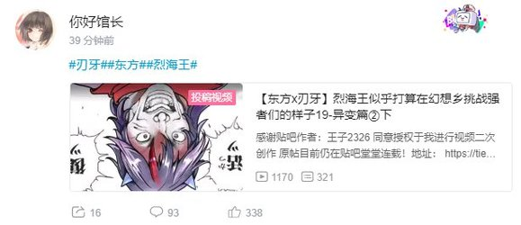

~香霖堂~

银发的半妖带着一脸微妙的神情看着他面前这刚刚飞下来的二位顾客

霖之助：嗯……

您二位还要买东西吗？

烈：当然

我今天就是来买枪的——

话说我今天是来买枪的啊？

天子：知者不惑，仁者不忧，勇者不惧

你这幅一脸迷惑的样子就是最典型的无智之表现

烈：是天子小姐你先开打的啊？！

天子：你这家伙打的比我更开心吧？！

霖之助：芝加哥打字机一把，共【100X1d100：10000】元

烈：好贵，这已经比得上一辆摩托车的价格了......

天子：你不要？你不要给我啊！

霖之助：本店不接受砍价哦

想要以物易物的话也没问题

烈的现金【5000+100X1d100：8600=13600】（买枪费用+5000）

烈：还好这次铃仙前辈多给了5000……

不然就凭我手头这点还真是不够

天子：切

烈：这个时候反而不引经据典了？！

天子：君子上达，小人下达

我身为高贵的天人可不屑于讲低级的道理

烈：低级的道理总好过没有道理吧？

霖之助：多么多谢惠顾~

天子小姐还想买其他的东西吗？本店还有许多商品哦

天子的兴致【1d100：62】（50以上看看店）

天子：那我就勉为其难看看你这还有什么宝贝

以后你可以写个牌子放在门口哦，就说比那名居天子曾到此一游！

霖之助：我可不想挨五指山，还是算了吧

天子想买的商品是【1d10：5】

1 智能手机

2 PS3

3 妖怪天文仪（为啥啊）

4 智能手机

5 暖桌（你需要吗？）

6 烈的打岩（为啥啦）

7 智能手机

8 照相机

9 果然还是草薙之剑（有完没完啊？）

10 大成功/大失败【1d2：1】

天子：这个叫暖桌的玩意看上去不错啊

冬去春来的时候正需要在屋里摆个取暖的东西

我就买这个了！

暖炉的价格【100X1d100：35=3500】元

天子的零花钱【100X1d100：94=9400】元

霖之助：暖炉的价格是3500元

您有地上的货币吗？

天子：上次帮灵梦建神社的时候赚了不少

花到现在还剩下9400元，买个暖炉是绰绰有余咯

买到了心仪的商品后，扛着暖炉的天人与举着打岩的武者离开了小道具店

而霖之助望着店铺门口那一片狼藉的景象，不由得感到一丝头疼

霖之助：这可真是……

刚刚光顾着做生意，都忘记叫他俩整理战场了

之后让魔理沙来帮忙吧

~回永远亭的路上~

烈：话说回来，天子小姐

为何你这样的天人会来到地上啊？是闲暇时期过来玩的吗？

天子：天界的一帮老顽固简直是脑子有病

就因为我吃了几个宴会用的仙丹而已，就把我放逐到了地上

你不觉得很冤枉吗？

烈：——我想天人们的脾气已经是非常之好了

那你现在住哪啊？

天子现在的住所是【1d10：7】

1 辉针城

2 自由人

3 博丽神社

4 辉针城

5 自由人

6 太阳花田（为啥啦）

7 辉针城

8 自由人

9 永远亭（为啥啦）

10 大成功/大失败【1d2：1】

天子：刚刚来到地上的时候，意外的发现了小人族

我想着这不正是与我相配的高贵且聪慧的拍档吗！就顺便住在那座倒转的辉针城中了

烈：（正邪小姐这两天怕是要头疼了……）

我就住在竹林中的永远亭

天子小姐，想打架或者吃饭随时来找我就好

天子：给我擦干脖子等好了

下一次我可不会输了！

告别了新认识的朋友，烈海王踏上了回家的路

~永远亭~

月兔，地上兔与原始人正在打赌

因幡帝：开盘啦开盘啦

今天是深受重伤还是遇见了奇怪的家伙？

皮克：你那还算是人？

（两个鸡腿，我猜是深受重伤）

铃仙：三根萝卜，我押遇见了奇怪的家伙

这时，浑身是血的烈海王背着打岩带着枪回来了

烈：铃仙前辈，我把枪买回来了！

今天正好打了块不错的石头，把它放在院子里吧

铃仙：这是什么鬼展开啊？！

因幡帝：——下一次是不是该加个其它选项？

皮克：嗷嗷嗷嗷嗷哦啊啊啊

（总之先把师匠叫过来吧）

~医疗室~

烈的说明【1d100：35】

烈：为了争夺这把枪的购买权，我与比那名居天子展开了激战

途中做出了一块不错的打岩，被四千年守护之后，凭借最后的力量战胜了天人！

顺便一提她现在正住在辉针城

辉夜：哦

师匠：公主大人，你听懂了？

辉夜：我已经习惯了——

个鬼啊！给我好好说话！！

话说你居然能打过那个不良天人？开玩笑吧？！

【1d30:13】分钟后

师匠：这一次完全就是被打到只剩一口气了

真亏你能赢啊

辉夜：第七回合的反击堪称离谱

他打过的扯淡战斗已经很多了，但我觉得这一次是最离谱的

铃仙：用这样的身躯把石头背回来反而更怪吧……

总之多谢烈先生你的帮忙了！

这把枪真的能打出言弹吗？

烈：做不到的

无论怎么看都是普通的冲锋枪而已

皮克：嗷嗷嗷嗷嗷啊

（这玩意连我的皮都打不烂）

因幡帝：反正你平常也用不着这些

天天在房间里放些军刀啊手雷啊之类的东西，到底有什么意义？

铃仙：这就是所谓的安全感呢~

师匠：言归正传，如果说运气也是实力的一部分，那烈的实力现在在幻想乡里倒是真能算强者了——还是顶尖的那种

辉夜：怎么可能

把这架再打一遍，他要是能赢，我当场把这块石头吃下去

师匠：哎呀呀……

烈，今天都伤成这样了你也别做饭了

让优昙华来准备晚餐吧

今天的烈海王难得休了一晚上假

烈：铃仙前辈的手艺尝起来也不错啊

铃仙：哼哼~你以为以前都是谁来做饭的？

月之头脑与月之公主正在一旁的角落里窃窃私语

师匠：我本来还想着这回之后跑过去偷偷帮他出气的......

结果他直接打赢了？！那我岂不是没机会了吗？

辉夜：谁让你天天教他保命的招数

有个时停腿了还嫌不够非得再教急救术和消力，现在硬生生把弟子教成了滚刀肉

你现在感觉如何啊？

师匠：下次还是接着教天文密葬法吧......

~第290天结束~

成就：非想非非想天之女达成！

堂堂正正的战胜了有顶天的大小姐比那名居天子！

Atk+5

现在的Atk: 254（134）

成就：幻想乡的实力者达成！

已经成为了大家所公认的实力者

可以对Atk 235以下的对手进行秒杀判定了！

（本日的更新结束，下一次的更新在周一）

（以下是我的废话）

那么本次天子的安价回到此结束了

话说这已经是第四次安价了，连续四次好感没有一个拉胯的，为什么会这么离谱？！

我原本以为会是香霖高好感天子低好感的展开，结果居然反了（悲）

香霖堂里的zun言zun语很难模仿，所以这次的香霖胡扯环节大家图一乐就好，一如既往是我瞎掰的

天子喜欢引经据典这个更麻烦......我从来没想到我会去翻老爹的《论语》看......

部分典故用的不太恰当，毕竟我文言文这块真的不行，还请大家谅解（悲）

话说回来这场战斗为啥会赢啊？！

我明明是把天子设置成那种除了连续大成功基本没戏的敌人哎

怎么从第五回合开始就秀的不行啊？！

血剑是算在普通攻击轮里面的所以不吃那个-2伤害，所以这一次是mvp

相对来说花弹就遇到克星了（笑）

这一次天子的卡我是强化了防御面，所以攻击面就相对削了一些

这在本贴中已经是跟幽香和四季同级的强者咯......之后的卡该怎么写啊，我还得慢慢思考一下（悲）

那么本日的更新到此结束，之后晚上的时候扔两个彩蛋

骰子下一层发

附上本次的骰子

顺便一提，刚刚复盘的时候发现天子战我漏了好多东西（悲）

1T特大伤害看成了大伤害

6T的纯粹武道+3漏算了，7T大成功反击无伤害加成所以没得+3

8T烈的减伤又漏算了

不过看了一下由于有个急救拳没用所以并不影响最终结果，谢天谢地

下一次，我一定会好好检查的（悲）

~彩蛋~

~草薙之剑~

~香霖堂~

魔理沙：我这伤刚好没几天就要过来帮你干活

香霖你还有没有良心啊？

霖之助：别这么说嘛

我可是特意为你准备了报酬哦

看好了，这就是传说中的神器 草薙之剑

银发的半妖拿出了一把破破烂烂的金属剑

魔理沙的眼力【1d100：38】（75以上认出来）

魔理沙：哇，又拿这种破烂货糊弄我？！

这玩意明明是我当年从垃圾堆里捡的！

霖之助：啧啧啧，不要我收回去了？

魔理沙：要啊，为什么不要？

金发的小女孩接过了剑

霖之助：小心保管好哦

说不定哪天就会用到了

魔理沙：可拉倒吧，这玩意哪有八卦炉好用

口渴了口渴了，赶紧给我来杯酒

魔法使毫不客气的在店里找了个位置坐下了，半妖则习以为常的转身拿酒去了

虽说这回香霖说了真话，但魔理沙反而不信了——

这也无可奈何呢

~暖桌~

~辉针城~

天子：这就是最新的尖端科技成果 暖桌！

天子把今天的战利品摆在了小人族与天邪鬼的面前

针妙丸：哦哦，看上去很舒服的样子！

正邪：这实用的东西连个充能口都没有啊

你买回来当摆设的？你可真是把钱花在了刀刃上哦

天子：针妙丸，我就觉得你这朋友真是特别会说话

天天夸的我都不好意思了

针妙丸：这个......嗯，正邪她平常说话就这样

话说这个桌子该怎么用啊？

暖桌的能源是【1d10:1】

1 香霖改成了魔力驱动

2 普通的电力驱动

3 这里就用我的万宝槌（还能用吗？）

4 香霖改成了魔力驱动

5 普通的电力驱动

6 这里就用我的绯想之剑（有用吗？）

7 香霖改成了魔力驱动

8 普通的电力驱动

9 殴打到它运作为止（为啥啦）

10 大成功/大失败【1d2：2】

天子随手扔了团魔力球，魔改版的被炉便开始运作了

【1d20：12】分钟后

三只被炉蜗牛正懒散的剥着橘子

正邪：别说，这玩意还真挺没用的

针妙丸：不想出门了~

天子：地上真好啊~

彩蛋到此结束了

下次的更新是交流回

这回想给出场次数较少的角色们多点戏份，所以尝试着分出一个交流回的名额给低好感角色，看看效果如何

（剩下两个名额跟以前一样是高好感角色们中骰的）

再之后按理来说应该是异变了，但是这次我打算在异变之前插一段漫画的剧情

所以会先过一个长度较短的活动，再开始下一次的异变

这个活动应该没什么战斗机会，相对来说推理方面的剧情会多一些

到时候要不要给烈安排个队友呢......还是一如既往的骰1d100决定呢......总之到时候再说吧

那么今天就到这里，下一次的更新在星期一

由吧友 @望远镜300  制作的视频第19期更新啦！

本期的更新内容是万宝锤异变的下篇，大家感兴趣的话就去看一下吧！

顺便一提，明天如果无意外应该还是早上九点更新交流回

那么我就去接着投骰子了

从本次交流回开始，我打算将低好感角色也加入进去

毕竟总是跟高好感的角色们互动未免太过无聊了

总次数仍然是三回不变，现在是一次低好感角色+两次高好感角色这样子

那么，首先是本次的低好感角色交流（没正式见面的角色如琪露诺、大妖精等不算入内）

1 蓬莱山辉夜 17

2 藤原妹红 42

3 小碎骨 16

4 今泉影狼 5

5 橙海王 55

6 帕秋莉·诺蕾姬 26

7 云居一轮 44

8 秦心 38

9 九十九姐妹 34

10 堀川雷鼓 39

11 茨木华扇 54

12 霍青娥 32

13 雾雨魔理沙 18

14 宇佐见堇子 36

15 物部布都 42

16 灵乌路空 1

17 克劳恩皮丝 42

18 封兽鵺 29

19 多多良小伞 31

20 森近霖之助 13

【1d20：6】 帕秋莉·诺蕾姬

本次的高好感角色（没正式见面的角色如蕾米莉亚斯卡雷特不算入内，本次安价遇到的天子不算入内）

1 师匠 99

2 铃仙 84

3 因幡帝 81

4 皮克 100

5 神子 69

6 圣白莲 78

7 红美铃 80

8 芙兰朵露 96

9 风见幽香 96

10十六夜咲夜 71

11 伊吹萃香 66

12 星熊勇仪 94

13 八云紫 81

14 鬼人正邪91

15 少名针妙丸95

16 西行寺幽幽子69

17 魂魄妖梦82

18 博丽灵梦89

19 火焰猫燐 62

20 古明地恋 87

21 河城荷取 72

22 二岩猯藏 65

23 古明地觉 75

24 东风谷早苗 68

25 稀神探女 83

26 八坂神奈子 68

27 射命丸文 89

28 纯狐 75

29 赫卡提亚 99

30 四季映姬 71

【1d30：1】八意永琳

第二位

1 铃仙 84

2 因幡帝 81

3 皮克 100

4 神子 69

5 圣白莲 78

6 红美铃 80

7 芙兰朵露 96

8 风见幽香 96

9十六夜咲夜 71

10 伊吹萃香 66

11 星熊勇仪 94

12 八云紫 81

13 鬼人正邪91

14 少名针妙丸95

15 西行寺幽幽子69

16 魂魄妖梦82

17 博丽灵梦89

18 火焰猫燐 62

19 古明地恋 87

20 河城荷取 72

21 二岩猯藏 65

22 古明地觉 75

23 东风谷早苗 68

24 稀神探女 83

25 八坂神奈子 68

26 射命丸文 89

27 纯狐 75

28 赫卡提亚 99

29 四季映姬 71

【1d29：21】二岩猯藏

【1d6：2】个小时后，本日的第一位病号来到了永远亭

具体的成员为【1d10:10】

1 帕秋莉+魔理沙

2 独自一人的帕秋莉

3 帕秋莉+咲夜

4 帕秋莉+爱丽丝

5 独自一人的帕秋莉

6 帕秋莉+蕾米莉亚（为啥啦）

7 帕秋莉+小恶魔

8 独自一人的帕秋莉

9 帕秋莉+芙兰朵露（为啥啦）

10 大成功/大失败【1d2：1】

帕秋莉大成功！

大成功是什么？【1d10:4】

1 安定的魔女三人组

2 帕秋莉+红美铃+咲夜

3 帕秋莉+小恶魔+大小姐

4 安定的魔女三人组

5 帕秋莉+大小姐+二小姐

6 赫卡提亚也来了！（哈？！）

7 安定的魔女三人组

8 幽幽子也来了！（为啥啦？！）

9 红魔馆全家桶（你们搞啥啊）

10 大成功/大失败【1d2：1】

永远亭今日的第一位客人是前来看病的帕秋莉

顺便一提，一同前来的还有爱丽丝和魔理沙

帕秋莉：都说了我只是日常看病而已，根本不需要你们陪同的……

魔理沙：别这么说嘛~

哪能让你自己一个人走过来？

这个时候陪在你的身旁就是我的义务哦

帕秋莉：魔理沙……

正当两人气氛正好的时候

爱丽丝：与其在这里说些好听的话，倒不如想想办法帮她改善一下体质吧？

就算是普通人，天天宅在地下不出门也会生病

更何况她这样以前就落下过病根的魔法使了

帕秋莉：——我作为一个魔法使在图书馆里做研究不是很正常的事情吗？！

你以为人人都是像你一样能靠手指操纵超大人偶的体力派啊？

爱丽丝：哦呦，这可真是弱不禁风的大小姐

上一次凭臂力把魔理沙砸成脑震荡的不知道又是哪里来的奇怪家伙了

叫什么来着，不动的大健身房对吧？

魔理沙：我求求你俩先消停消停，起码先把病看完了再吵吧？

喂，来个人挂号可以吗？

本日的接待处护士是【1d10:8】

1 皮克

2 铃仙

3 烈海王（你是主治医师吧）

4 皮克

5 铃仙

6 因幡帝（你还知道干活？）

7 皮克

8 铃仙

9 辉夜（你睡醒了？）

10 大成功/大失败【1d2：1】

铃仙：咦？

魔理沙你看上去没什么皮外伤啊？

这一次是内脏的问题？

魔理沙的怒气【1d100：91】

魔理沙：这里足足三个人你硬是放着旁边两个的不管跑过来问我？！

你这兔子也跟烈海王一样傻了？！啊？！

铃仙：这个……

毕竟你每次住院基本都和她们有关……

帕秋莉：这一次要看病的人是我

麻烦帮忙挂个号吧

铃仙：好的好的

皮克——过来带路——

原始人带着三位魔女走向了医务室

魔理沙：皮克啊

这鬼地方怕是就你一个人还有点良心了

爱丽丝：其他几个人先不论，那个肌肉侦探人也不算坏吧

帕秋莉：人不坏跟不讨人厌是两回事

我可是不想跟他有任何交集……

皮克推开了医务室的大门

然后，三人就看到了正披着白大衣坐在桌前的烈海王

帕秋莉默默关上了门

皮克：？

皮克把门又推开了

烈的察觉【1d70：30+30=60】（50以上察觉魔理沙没事）

烈：魔理沙，帕秋莉小姐，爱丽丝小姐，早上好

今天师匠去度假了因此由我来坐诊

帕秋莉的抵触【1d70：14+30=44】（烈医生+30,50以上打算回家）

帕秋莉：噫……虽然我不喜欢八意永琳那人，但是你看上去更不靠谱啊……

保险起见我先问一句，你这医术没问题吧？

烈：还请您放心，虽然我的医术远不及师匠，但治点常见病还是可以的

请问帕秋莉小姐是哪里不舒服啊？

帕秋莉的病是【1d10:1】

1 一如既往的哮喘

2 厌食症

3 胃疼（你也来？）

4 一如既往的哮喘

5 贫血

6 恋爱焦虑症（为啥啊？）

7 一如既往的哮喘

8 脊椎病

9 我抑郁了（哈？）

10 大成功/大失败【1d2：1】

爱丽丝：还是老毛病，一如既往的哮喘

魔理沙：只要一剧烈活动她就会呼吸困难

这两天严重到平时说话时也偶尔会犯了

帕秋莉：倒不如说魔法使基本都有喘息……

像你们两个健康到爆的才是少数派啊

烈要怎么做？【1d10:1】

1 先问问具体病情吧

2 去健身吧！

3 总之先问问师匠吧（你争点气好吗）

4 先问问具体病情吧

5 吃药膳吧！

6 您这是心病（为啥啦）

7 先问问具体病情吧

8 推荐购买辅助医疗装置（那是什么）

9 您先住个院吧（为啥啦）

10 大成功/大失败【1d2：1】

烈：我们中医讲究一个望闻问切和对症下药

帕秋莉小姐不妨先讲讲，您这病是怎么来的？

帕秋莉：我的哮喘和贫血都是天生的

在成为魔法使之后虽说已经不用担心寿命问题了，但病却一直没好

烈：嗯……

魔理沙，她犯病时的表现如何呢？

魔理沙：战斗的时候连符卡名都唱不完就喘开了

但唱歌的时候反而从来不犯病

帕秋莉：唱歌的时候已经顾不上哮喘啦！

烈：那么最后一个问题

帕秋莉小姐的身体素质一直都很差吗？

爱丽丝：从我认识她开始就一直是这样了

不过殴打女友的时候却完全看不出来，真奇妙啊

烈的诊断方案是【1d10:4】

1 用锻炼去克服它！

2 开点药先压一压吧（过一个医术）

3 吃药膳吧！

4 用锻炼去克服它！

5 开点药先压一压吧（过一个医术）

6 果然还是心理问题（为啥啦）

7 用锻炼去克服它！

8 开点药先压一压吧（过一个医术）

9 呼叫师匠（你都学了什么）

10 大成功/大失败【1d2：1】

烈：帕秋莉小姐，从您的过往病情来看，我想单纯开点药压制是没什么效果的

您有没有考虑过去锻炼呢？

帕秋莉：哈？

说什么呢你这肌肉庸医，你看我现在这个状况像是能锻炼的样子吗？！

我现在连说话都费劲……

呼……呼……

魔理沙：虽说我也赞成让她多锻炼锻炼，但现在需要的是药物啊！

你要是不知道该怎么治就赶紧去找永琳！

烈：请相信我，这方面我是相当有经验的

魔理沙你仔细思考一下

——帕秋莉小姐的身体是真的很虚弱吗？

魔理沙的怀疑【1d70：34+30=64】（刚刚被砸住院+30,50以上怀疑）

魔理沙：说起来她揍我的时候倒是从来没哮喘过……

爱丽丝：之前演唱会的时候也是，一长段唱下来连换气都不需要呢

烈：真正身体虚弱的人，就像中毒后的刃牙一样

即使拥有一身实力，也难以发挥出十之一二

而帕秋莉小姐的哮喘则明显不同——她是选择性发作的！

无论是打架、吵架还是唱歌都不会触发哮喘，相反日常生活中却是常常发作

这明显有问题！

帕秋莉的相信【1d100：79】（75以上相信）

帕秋莉：这么一说还真是……

难道说这是心理问题所导致的？

烈：会说出这样的话，就说明帕秋莉小姐你并不了解人体

我之前去打拳击的时候曾经听阿里先生讲过，人的身体是会回应自身的意志的

他的儿子小阿里就曾经利用这一点，在短时间内通过锻炼完美的治好了自身的伤势！

皮克：嗷嗷嗷嗷哦哦啊哦啊

（人体是很奇妙的，之前我的胃被打破了，但一想到之后还要认识新朋友，我在地上滚了几下胃就好了）

铃仙：我也曾在极度疯狂的情况下一拳把纯化过的地狱妖精打成重伤

魔理沙：怎么听都是你们这帮人有问题吧？！

烈：锻炼治疗法已经被我们格斗家所充分实践过，并取得了非常理想的成果

帕秋莉小姐要不要尝试一下呢？

帕秋莉：额……

你说的锻炼具体是指什么啊？

事先说好，我可不想去做长跑那种过分的运动

爱丽丝：是的是的

我们都清楚，身娇体弱的帕秋莉小姐平日最喜欢的运动是扛着小山大的绿宝石举重

帕秋莉：其实我最近觉得拳击也是不错的运动

要来试试吗~

爱丽丝：被打哭了可别怪我哦~

魔理沙：你们两个先听听医生怎么说，不要在这里使用暴力！

（你给她整点安全的锻炼！再这么下去到最后会受伤的只有我而已！）

烈的察觉【1d70：30+30=60】（50以上察觉）

烈：（明白明白，你赶紧先把人稳定住）

帕秋莉小姐不用担心，毕竟你现在要治的是哮喘而非外伤，我们可以采用温和一些的锻炼方式

烈的锻炼方法是【1d10：1】

1 来唱歌吧！

2 与辉夜小姐一起锻炼吧

3 来学习武术吧（为啥啦）

4 来唱歌吧！

5 与辉夜小姐一起锻炼吧

6 跟皮克聊天吧（动物疗法？）

7 来唱歌吧！

8 与辉夜小姐一起锻炼吧

9 霸！（这啥啊）

10 大成功/大失败【1d2：2】

烈：先尝试一下唱歌如何？

长时间的歌唱会让身体忘记“哮喘”这回事，同时这也符合您的兴趣

辉夜：好主意，来唱动画主题曲吧！

辉夜大小姐不知从哪里掏出来了三个麦克风

帕秋莉：丝毫不加掩饰的百分百私心发言出现了？！

辉夜：魔理沙和爱丽丝也一起！

这都是为了帕秋莉哦！

爱丽丝：我也要上场吗？！

魔理沙：只要不唱上次那破歌其他都行……

唱歌锻炼持续了【1d6：5】个小时

原本只是三位魔女的歌唱训练，但不知为何，以辉夜为首的众人纷纷表示“K歌真有意思”而兴高采烈的加入了其中

于是最终变成了（仅师匠一人缺席的）小规模永远亭演唱会

顺便一提，充当观众角色的是正在捣年糕的兔子们

魔理沙：已经是完全不输给长跑的高强度运动了

话说为什么中途开始唱假面骑士和奥特曼的主题曲了？

爱丽丝：甚至还有魔神Z和恶魔人

而且为什么词微妙的出现了变化？永琳人是什么鬼歌曲啊？！

辉夜：我这里还有CD哦~

要一起来看本篇吗~

锻炼的效果是【1d50：20+50=70】（大成功两人陪唱+50自动缓解症状，75以上相当有效）

帕秋莉：呼……呼……

唱完真的好累……

烈：但这不是很有效吗

这五个小时中您的哮喘一次都没犯过

帕秋莉：咦？

还真是，为什么啊？

铃仙：人体，很奇妙吧？

烈：我再给您开点常用药

之后如果再犯哮喘的时候可以找几个人一块唱唱歌，应该会有效果

持之以恒坚持锻炼下去，有朝一日一定能克服疾病的！

学习到了新的锻炼方法后，三位魔女离开了永远亭

进行了一次还算正常（？）的会话

帕秋莉的好感度上升了【1d10：2】点

现在的好感度：26+2=28

帕秋莉：真没想到他居然还会看病……虽说这方法挺奇怪的

该说是月之头脑的教学力太强了吗？居然能把肌肉男教成医生，真厉害啊

~第316天结束~

师匠：我回来了~

今日情况如何啊？

辉夜：我们K了5个小时的歌

烈：唱歌真开心啊！

师匠：......

只有我被排挤了？！

因幡帝：师匠，没人能想到会变成这样啦......

（歇一会十点十分继续）

第二位 八意永琳

这件事发生在烈海王来到幻想乡的第【290+1d30：17=307】天

具体的事件为【1d10:9】

1 师匠的战斗补习！

2 恋爱相谈

3 果然还是要约会（还约啊？）

4 师匠的战斗补习！

5 恋爱相谈

6 师匠的语文补习（有用吗？）

7 师匠的战斗补习！

8 恋爱相谈

9 师匠的小白鼠（好恐怖啊）

10 大成功/大失败【1d2：1】

~永远亭~

“嘭”

这天一大早，铃仙就推开了烈海王的房门

烈：？

铃仙前辈，有什么事吗？

铃仙：我算了一下时间今天该我卖药了因此就先走一步去人里了

这一次打算认真工作会带上斗笠挨家挨户上门推销的因此不用帮我准备午饭

还有就是烈先生我劝你也赶紧找个理由离开永远亭起码今天白天别在这待着！快！

月兔飞快的说出了一连串的话语，之后就赶紧背着药包跑路了

烈：？？？

为啥啊？

【1d10：2】分钟后，因幡帝骑着皮克跑到了烈的房间门口

因幡帝：铃仙那个怂货居然跑了，这样下去说不定师匠会来找我的！

我跟皮克先撤了，你也赶紧找个理由出门吧！

皮克：你那还算是人！

（快跑啊！）

兔子骑着原始人跑出了永远亭

