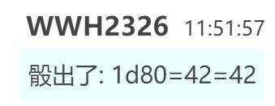

师匠：哎？今天是要做正事——

烈：难得师匠这么想出门我一定会奉陪到底的！这一次就由我来挑选地点！

烈海王满头大汗的抓起了师匠的胳膊，并拖着她出门了

师匠：这么强硬？！

话说不要抓我胳膊！

烈：那么要牵手吗？

师匠的抵触【1d50：36+50=86】（75以下同意，月之头脑+50）

师匠：要等到五十年之后才能牵手

现在牵袖子就好……

烈：（说真的这也太怪了吧？！）

于是，逃过一劫的武术家牵着贤者的袖子走出了永远亭

几分钟之后

辉夜：永琳~因幡~

人都到哪去了？

永远亭的公主看着空空如也的亭子，陷入了短暂的迷惑之中

本次约会的地点是【1d10：8】

1 夜樱飘落的旧地狱

2 樱花盛开的冥界

3 神秘莫测的梦境世界

4 去太阳花田……（你疯啦？）

5 去月之都……（你认真的？）

6 风景优美的妖怪之山

7 一如既往的天界约会

8 久违的外界

9 安定的人间之里

10 大成功/大失败【1d2：2】

烈：永琳，我想问一下

你上次去外界是多久之前的事情了？

永琳：自从我与公主大人来到地上之后，我们便一直居住在永远亭之中

而永远亭的历史开始转动，又是几年之前才刚刚发生的事情

因此，我没有办法给你准确的时间呢——

只能说是，很久很久以前了吧

烈：这次约会，要去外界试试吗？

永琳：哎呀呀，我们的烈海王开始怀念家乡了？

烈：老实说我确实很想回去看看

不过这一次的主要原因是，我想让永琳看看我曾生活的世界

意下如何？要换其他地方我也无所谓

永琳：难得你主动提出了要求，这一次就先听你的吧~

想要前往的具体地点是？

烈的选择是【1d10:1】

1 地下斗技场

2 神心会本部

3 白林寺

4 地下斗技场

5 繁华的涩谷街头

6 刃牙的家（为啥啦）

7 地下斗技场

8 神心会本部

9 白林寺

10 大成功/大失败【1d2：1】

烈：果然还是地下竞技场吧，就在东京巨蛋的下方

稍等我先去拜托一下八云女士——

永琳：没有这个必要

烈，你学习过量子论吗？

月之头脑发动了她的术式

一个刹那间，两人便自幻想乡中消失了

永琳的传送【1d50：30+50=80】（月之头脑+50,75以上直接到场）

~地下竞技场~

这里是位于东京巨蛋之下的后乐园，只属于斗士们的圣地，货真价实的所谓都市传说——由德川家代代相传的，作为其家族事业而出现在现代的奇迹：地下竞技场

八边形的沙地中满是斗士们的指甲与牙齿，其四周竖立着以四圣兽冠名的四扇大门

而在场地周围观战的，则是兴奋到极点的观众们

能够在竞技场中战斗的斗士，必然是在某一方面达到了巅峰的选手

能够在竞技场的观战的观众们，也是经过主办方精挑细选的，绝对的格斗狂热者

混在其中的早苗看到了突然出现的烈与永琳，便挥手向他们打了个招呼

今日斗技场的战斗是【1d10:9】

1 涉川VS巨鲸

2 愚地VS猛剑

3 还在打垫脚石（别啊）

4 涉川VS巨鲸

5 愚地VS猛剑

6 刃牙VS粟米

7 涉川VS巨鲸

8 愚地VS猛剑

9 还在入场式中途呢（为啥啊）

10 大成功/大失败【1d2：2】

该说是时机不好？还是说正是时候？

烈与永琳出现在斗技场时，恰好撞见了双方选手的入场仪式

烈：哦，这是要打团体战了！

话说永琳你刚刚用的是什么技术啊？

永琳：答案是量子跃迁

只要是概率不为零的事件就都有可能发生，这就是利用量子论而实现的超快速移动

我有个弟子十分擅长这项技术呢

烈的物理学【1d100：48】

烈：听起来真厉害，不愧是师匠

我刚刚听了一下解说，今天的团体战似乎是地下竞技场的斗士们对决大相扑

永琳：斗士……

就是你以前的朋友们？

烈：对的！

武术家兴奋的向恋人介绍着他的朋友们

天下无双的武神 愚地独步

合气道达人 武圣 涉川刚气

背负侠客行的流氓 花山薰

独臂空手道大师 愚地克巳

以及那个地上最强的高中生 范马刃牙

烈：那位新加入的力士我从前并没有遇见过，但想必也是极强的武者

居然有胆量向这群人挑战，大相扑真是相当有骨气的集团啊！

永琳：真是的，一到这种场合平时那温和有礼的形象就完全丢掉了

这么想参战的话，直接下场打一架不好吗？

烈：不行啊……无论怎么说也不能在外界用花弹或者天文密葬法

况且我们现在在外人的眼中，也只是形态模糊的黑影吧

斗技场中央的六名斗士与六名力士正面对面的注视着

之后，他们转身离开了场地，回去做开战前的最后准备了

~东京的街头~

这里是世界上最繁华的城市之一，东京

车水马龙的街道上挤满了神色匆匆的行人，五光十色的画面在楼房外广告牌上不断流动着

如果说幻想乡是所谓幻想与梦的倒影，那么这里就是现实与真实的集合

没有一丝神明的气息，却充满了人类的味道

永琳：虽说之前在公主大人的动画片里看到过……

这还真是与从前大不相同了

烈：外界的科技发展是很迅速的

虽然现在还不可能与月之都想比，但再过上几百上千年，说不定人类也能做到同样的事情吧？

永琳：所以，你到底想让我看什么呢？

烈的想法是【1d10:10】

1 我想要了解永琳

2 我想让永琳了解人类

3 其实我只是思乡了而已（你搞什么啊）

4 我想要了解永琳

5 我想让永琳了解人类

6 只是觉得竞技场太吵了（那你为什么要来啊）

7 我想要了解永琳

8 我想让永琳了解人类

9 其实是想去看电影（为啥啦？！）

10 大成功/大失败【1d2：1】

烈海王大成功！

大成功是什么？【1d10:7】

1 得到了相互的理解

2 永琳没有那么固执了

3 学会了自由来去外界的方法（为啥啦）

4 得到了相互的理解

5 永琳没有那么固执了

6 竞技场中突然开打了勇次郎对粟米的大战（草）

7 得到了相互的理解

8 永琳没有那么固执了

9 超级浪漫的电影院约会！

10 大成功/大失败【1d2：1】

烈：为什么有些时候那么的温柔，有些时候却又十分冷酷

为什么明明知道许多事情，却从不愿意对我们说出口

我，想要了解永琳平时都在想些什么

永琳：？

那么为什么不直接来问我？

烈：因为这种想法是不合理的

无论是办正事还是平日的恋爱，我总是无法理解你的思考与行动——

但设身处地的想一想，永琳有时也无法理解我的举动吧？

永琳：倒不如说有几个人能明白你在想什么啊？

今天来外界的竞技场约会这件事本来就已经很离谱了哦？

要不是想着“难得他主动提出邀请”我才不会来的！

烈：所以我才会想着带你来到这里

并不是想说什么“人类的进步”这种高深的话题

我只是想让你看看，我曾经生活过的世界

并肩前行的两人停下了脚步

烈：从前的我是白林寺的中华武者，是在地下竞技场战斗的斗士，同时也是生活在都市之中的现代人

而现在的我是永远亭的厨师，是解决异变的侦探，同时也是月之头脑的弟子与恋人

我或许永远都没有办法理解你，但我无所谓——

因为我至少可以让你理解，我的存在！

永琳：——真是个笨蛋

你把我当成什么不可名状的邪神了吗？

心存疑惑的话，就直接过来问我啊！

烈：我想要理解永琳，但永琳却对过去的我并不了解，这当然是不公平的！

所以我才会想把你带过来，因为只有到了外界，我才能够光明正大的说：

你已经知晓了有关于烈海王的一切

这就是他的全部了！

这个男人怀抱着自己莫名其妙的坚持，向着面前的恋人认真的说出了自己心中的想法

而一直感到迷惑的月之头脑，在此刻却终于理解了烈的心

永琳：烈……

你一直都想要靠近我吗？

烈：然而作为弟子，我的实力却远远赶不上师匠

作为恋人，我又无法牵起你的双手

永琳：所以就选择了你最不擅长的言语？

烈：是的

我想只有当永琳了解了我之后，我才能拥有向你提问的资格！

八意永琳理解了

眼前的男人十分迷茫

即使居住在同一个屋檐之下，他与自己之间却仍旧相隔了那么遥远的距离

虽然触手可及，却又咫尺天涯

于是——

武者在这巨大沟壑的另一侧为她建造了一座桥梁

他将过去的人生，铺成了跨越悬崖的道路

这样的话自己也要做出应对

这样的话自己就没有理由站在原地不动了

永琳：那就告诉我你的困惑吧

我会一五一十的，全部告诉你答案的！

于是

月之头脑对着她别扭而顽固的弟子露出了笑容

于是

八意永琳第一次牵住了烈海王的手

谈话持续了【1d6：5】个小时

谈话的主要内容是【1d10:5】

1 师匠的恋爱观

2 师匠的职责

3 师匠的迷茫（为啥啦）

4 师匠的恋爱观

5 师匠的职责

6 师匠的牢骚（为啥啦）

7 师匠的恋爱观

8 师匠的职责

9 烈的人际关系（为啥啦）

10 大成功/大失败【1d2：1】

永琳向烈诉说着自己的职责

由于自己的过失，月之公主犯下了大罪过

而为了保护她一同降落于地上的八意永琳，也自然而然的成了月之都的特级罪人

在最初的岁月中，公主担心着月面的追兵，因此让永远亭的历史从此不再流转

之后，地上的兔子突破了月之头脑的结界，成为了永远亭的一员

再之后，逃离月球的兔子也来到了永远亭之中

永琳：——直到几年之前，我为了彻底保护公主而制造了虚假的月亮

本想着这样一来就终于可以一劳永逸了，没想到愤怒的巫女却打上了门来

之后，永远亭的历史终于开始流转了

（由于大成功的效果，烈海王此时完全理解了）

烈：永琳

在那么长久的时光之中，你们就这么担心受怕的过着只有两人的生活吗？

永琳：公主大人那是总是担心月之使者还会派来追兵

那时，又有谁知道月之都会变成现在的局面？

烈的愤怒【1d70：54+30=84】（绀珠传特典+30）

烈：——那为什么你还要这样勉强自己？！

永琳的懵逼【1d100：18】

永琳：所有事情可全都在我的计划之中哦

除了上次八云紫的酒和这次的赫卡提亚以外

烈：我从不质疑你的智慧与能力

但为何你不将这些事情告诉我们？

只要是你的要求，那铃仙前辈和我都会毫不犹豫的去做

但是一头雾水的做事和了解真相后的行动，终究是不同的！

永琳：我只是觉得没有必要

这样只会给你们平添压力吧？

烈：我无所谓！

永琳：这可真让我头疼……

以后让你们出任务之前都要先把背景知识说明清楚，这样子可是很麻烦的！

话虽如此，月之头脑的脸上却露出了愉快的笑容

她牵着恋人的手，如同转瞬即逝的倒影一般，就这样消失在了东京的街道之中......

~第307天结束~

师匠：事先说好，这一次是特例！

下一次想牵手无论如何都要等到五十年之后了！并且要打赢我才可以的！

烈：没有问题！

与月之头脑达成了相互理解

除特殊情况外，永琳不会再欺瞒烈海王了

在大部分情况下，永琳可以理解烈的说明了

第三位 二岩猯藏

这件事情发生在烈海王来到幻想乡的第【290+1d30：18=308】天

具体的事件是【1d10:5】

1 大狸子的恶作剧

2 撞破了大狸子的诈骗

3 只是普通的聊天

4 大狸子的恶作剧

5 在路上遇到了奇怪的人类

6 稗田阿求的委托

7 大狸子的恶作剧

8 只是普通的聊天

9 鵺的报复

10 大成功/大失败【1d2：2】

~人间之里~

这天早上，烈海王在人里买完菜之后看到了一位奇怪的女性

她身穿绿色的和风服饰与黑白格子围巾，留有一头棕色的长发，其上装饰着一片树叶，脸上带着平光眼镜

值得一提的是，女子的五官似乎与从前见过的某人十分相似

烈：她身上的妖气好重！

这可不是什么小妖怪或者妖精，起码都是跟鵺大师一个等级的实力者！

烈要怎么做？【1d10:8】

1 靠我烈海王的跟踪技术！

2 光明正大的上去搭话（过话术）

3 去找灵梦吧！（为啥啦）

4 靠我烈海王的跟踪技术！

5 靠我烈海王的直觉

6 先下手为强！（这里是人里啊！）

7 靠我烈海王的跟踪技术！

8 光明正大的上去搭话（过话术）

9 靠我烈海王的推理

10 大成功/大失败【1d2：1】

烈海王快步走到女子身前

烈的话术【1d100：9】

烈：哦哦哦哦哦哦哦哦哦！

由于过于紧张的缘故，烈海王在“初次见面”的女士面前挥起了车轮拳

猯藏的懵逼【1d100：90】

猯藏：哈？

你这是要退治老朽吗？

还是说这是全新的搭讪方式？

烈的冷静持续了【1d10：8】分钟

两人走进了路边的一家酒馆，随便找了张桌子坐了下来

烈：真不好意思，我有时候一想说话就会犯老毛病

猯藏：老朽以前倒也听说过……

但真正见到还真是觉得相当震撼，明明之前是那么聪明的人类

烈的察觉【1d70：12+30=42】（50以上察觉）

烈：您这话说的像是以前就认识我了一样

但我们不是初次见面吗？

猯藏：咦？还没认出来啊？

这样的话……

猯藏的坦诚【1d100：95】（50以上披露真身，50以下恶作剧）

猯藏：一直瞒着你也没啥意思，反正你回过头一想就能明白的

老朽是狸猫妖怪的首领 二岩猯藏啦

烈的震惊【1d100：25】

烈：难怪，能把变化术施展的如此之强的妖怪也只有您跟鵺大师了

特地变成人类的样子是为了避免惊吓到普通的居民吗？

猯藏：毕竟妖怪是不应该正大光明的在人里行动的~

顺便一提灵梦也知道老朽经常来哦，所以不必担心这一点

烈：猯藏女士，那您今天也是来买东西的？

这种事情应该可以让您那些狸猫手下代办吧

猯藏今天的行动目的是【1d10：1】

1 与文文的情报战

2 找阿求写书

3 普通的闲逛

4 与文文的情报战

5 找阿求写书

6 本居小铃失踪案（好快？！）

7 与文文的情报战

8 普通的闲逛

9 其实是在跟鵺玩捉迷藏（你好闲啊）

10 大成功/大失败【1d2：2】

猯藏：这个时间点灵梦应该已经知道了，告诉你倒也无所谓

我最近正忙活着跟天狗打情报战

烈：天狗是指……射命丸小姐？

猯藏：就是那家伙

你听听她是怎么写的：“妖狸之类于妖怪之中是下品下生之至者，而无缘无故卷入人类村事端，其无法无天如此”

要说妖魔外道又有哪个妖怪不是？

非要端着一副高高在上的样子专门来找我们妖怪狸猫的茬，遭了这么重的谣言中伤，这可怎么了得哪

烈的情商【1d90：16+10=26】

烈：但我听射命丸小姐说她的报道一向都是客观而真实的……

是否有一些妖怪狸猫确实品行不端？

猯藏：老 朽 觉 得 没 有

烈：好的好的我明白了

那您这是在忙活着办新报纸？跟射命丸小姐抢生意？

狸猫妖怪的脸上露出了狡猾的笑容

猯藏：老朽才不会去做自己不擅长的事情

流言就用流言来应对，既然天狗说妖怪狸不行，那老朽自然可以传播天狗报纸弄虚作假的流言

你就看好了吧，不久之后，人里的居民们就不会去买她的破报纸咯

烈：哦哦，是用狸猫下属们传播谣言吗？

猯藏：这么做的话第二天灵梦可就找上门来了

老朽用的是方便快捷的付丧神

让隐藏在村落中的付丧神偷偷传播流言，这样一来谁也找不到狸猫的头上咯

烈的疑惑【1d100：17】

烈：猯藏女士，前段时间万宝槌异变刚结束的时候，我记得您还跟几位大妖怪一同在报纸上推广爱护道具的活动来着

结果这才过了半年您就全忘光了……被正邪小姐报复的话，我可不管哦

猯藏：咋还有这事，老朽还真忘了

这样的话就【1d10:10】

1 联系辉针城回收付丧神

2 换一个情报战的方法吧

3 我无所谓（为啥啦）

4 联系辉针城回收付丧神

5 换一个情报战的方法吧

6 跟天狗干一架吧！（为啥啦）

7 联系辉针城回收付丧神

8 换一个情报战的方法吧

9 去拜托圣吧（为啥啦）

10 大成功/大失败【1d2：2】

大狸子大失败！

大失败是什么？【1d10:2】

1 正邪：就是你在这搞事？

2 付丧神作战一败涂地

3 灵梦找上门来啦

4 正邪：就是你在这搞事？

5 付丧神作战一败涂地

6 被天狗堵门啦！（为啥啦）

7 正邪：就是你在这搞事？

8 付丧神作战一败涂地

9 圣白莲的全力说教

10 大成功/大失败【1d2：2】

还没等猯藏想出办法来，一只妖怪狸猫就偷偷跳上了桌面，向她传递着最新的情报

猯藏：啥，灵梦从神社跑出来之后把所有的付丧神全部一锅端了？！

这家伙怎么偏偏今天这么敬业啊？

烈：那看来您是不必担心正邪小姐的报复了……

猯藏：在此之前老朽需要头疼的是情报战啊

又要想新的战术了……你有啥好点子不？

烈的建议是【1d10：10】

1 靠我烈海王的流言洗白狸猫

2 去拜托萃香小姐吧

3 你们也去办报纸吧（为啥啦）

4 靠我烈海王的流言洗白狸猫

5 去拜托圣吧（为啥啦）

6 直接去找射命丸小姐决斗吧（为啥啦）

7 靠我烈海王的流言洗白狸猫

8 散播天狗的黑料吧

9 让狸猫妖怪去助人为乐吧（做不到的）

10 大成功/大失败【1d2：2】

烈海王大失败！

大失败是什么？【1d10:3】

1 烈的反向流言

2 正邪又来了

3 文文：我已经听到了

4 烈的反向流言

5 正邪又来了

6 圣白莲的超全力说教

7 烈的反向流言

8 正邪又来了

9 灵梦：就是你们两个在这搞鬼？

10 大成功/大失败【1d2：1】

烈：我想我们可以双管齐下

一方面由我来散播与狸猫有关的正向故事，另一方面您也可以去拜托白莲师傅等强者帮狸猫们说说话

这样一来狸猫的黑锅应该就能洗清了

文文：原来如此，真是不错的主意

猯藏：！

你什么时候来的？！

文文：从某个狸猫哀嚎着“付丧神全灭了——”的时候开始呢

这样一来你们最后的手段也被我知晓了

老老实实认栽吧！

狸猫妖怪一脸无奈的趴在了桌上

猯藏：老朽今天怎么就这么倒霉啊……

烈：话说射命丸小姐，为什么你要在报纸上抹黑狸猫啊？

我感觉猯藏女士的反击也算是情有可原的

文文的理由是【1d10:3】

1 争夺影响力

2 “我的话句句属实”

3 只是单纯讨厌狸猫而已

4 争夺影响力

5 “我的话句句属实”

6 其实是鵺的委托（为啥啦）

7 争夺影响力

8 “我的话句句属实”

9 其实只是闲得无聊而已（为啥啦）

10 大成功/大失败【1d2：1】

文文：真要说的话也没什么特别的理由

单纯只是我讨厌狸猫而已啦，哎嘿❤

猯藏：——好的屑记者我们到村子外面去稍微解决一下问题

武术小哥麻烦你先付下账啊老朽下次请你喝酒

文文：一言不合就恼羞成怒，不愧是最下层的狸猫妖怪

这次我就打到你心服口服！

狸猫与天狗离开了路边的酒馆

烈：哦哦，是大妖怪之间的战斗！这可太难得了

老板麻烦结账！

~第308天结束~

进行了一次乱七八糟的谈话

二岩猯藏的好感度上升了【1d5：4】点

现在的好感度：65+4=69

猯藏：这人倒是挺好的

但为啥老朽每次遇到他都这么倒霉呢？

~第320天~

~永远亭~

烈：师匠，为啥我最近用天文密葬法战斗的时候总是失败？

我觉得我在这方面的修习并没有退步啊

师匠：我早就跟你讲过，你所掌握的只是初步运用

一旦遇到真正的实力者当然会吃瘪啦——

你现在连营造天体密室或者影响星球自转周期都做不到，这怎么行呢

烈：师匠，那听上去已经不是符卡的等级了！

学上一千年都不可能做到吧？！

师匠：你的话大概需要【1d100：14】年吧

烈：我是超级天才吗？！

师匠：当然了

倒不如说，我的秘术是只有天才才能学会的技术哦

言归正传，想要稳胜风见幽香那档的实力者，不继续学习是不可能做到的

不想在拼大招的时候被毙掉就老老实实过来学习吧~

烈：这一次要学多久啊？

师匠：进一步活用于战斗中需要【3+1d6：2=5】个星期左右

接下来的一个多月就给我天天过来补习，不许请假！

（本日的更新结束，下一次的更新在周四或者周五）

（本日的更新结束，下一次的更新在周四或者周五）

（以下是我的废话）

那么本次的交流回终于结束了

原本想着低好感角色应该能写出不一样的感觉，结果到最后不知为何变成了情景喜剧

为啥金发小女孩一出现气氛就完全变成熟悉的感觉了？！

还好这次平安无事（合掌）

话说师匠这已经是你的第三次约会了！怎么老是你啊！！！！！！

是因为师匠排在第一所以很容易中吗？！

说真的本次交流回是我写起来最费劲的一次......

幽香交流回那次非常顺利，虽然被骰子疯狂殴打但总体思路是很通畅的

但永琳这已经是第三次了，简直卡到我物理哀嚎的程度（悲）好歹算是完事了

下一次别出永琳了，求求你了（泣）

大狸子次次出场都拉胯，你搞啥啊

那么本次的剧情就到这里结束了，骰子下一层发

和之前说过的一样，下一次的更新会是一个小事件，之后再接异变

让我们来看看在人间之里发生的，与某个普通少女有关的，平淡无奇的失踪案吧

附上本次的骰子

顺便骰一下爱丽丝的好感度【1d80:42】（魔理沙的女友-20）

爱丽丝：话说那个武术家......

是魔理沙的朋友吧

魔理沙：为什么你会有这种错觉？！

帕秋莉：明明就是事实呢

补一下被吞的楼层

随便一提，最近我想回复吧友们私信的时候尝尝提示

“由于对方隐私设置不接收消息，您的消息发送失败”

因此并不是我没看私信......大概是吧友们的设置问题？

补1896

~小白鼠~

说起来约会结束后，师匠的实验环节该怎么办啊？【1d10:2】

1 今天心情好就算了吧

2 优昙华~

3 探女~（为啥啦？）

4 今天心情好就算了吧

5 烈~（为啥啦）

6 帝~

7 今天心情好就算了吧

8 皮克~

9 纯狐~（哈！？）

10 大成功/大失败【1d2：1】

~永远亭~

铃仙：今天的药卖完了

还好我察觉的早逃过一劫！

师匠：优昙华~你回来啦~

吃完晚饭之后来一趟医务室吧

本来想着在早上做实验的，不过偶尔熬个夜也不算什么大事

铃仙：（谁来救救我啊！）

铃仙的祈祷【1d100：73】（75以上起效）

月兔在心中开始了真诚的祈祷

铃仙：（感觉得到！马上就有人来救我了！）

然而，事与愿违，在铃仙的祈祷成功之前，她就已经被面带微笑的师匠拉入医务室了

~迷途竹林~

纯狐：刚刚似乎听到了铃仙的呼救声？

嗯……应该是我的错觉吧

烈：铃仙前辈她会变成什么样啊？

帝：倒是不会死……

我记得上次铃仙似乎短暂巨大化了一段时间

皮克：你那还算是人？

（上次做完实验后我整整一周都变成雌性了，那可真是恐怖的回忆）

三人默默在胸口为月兔画了个十字

实验的结果是【1d10:5】

1 体质变强了！Atk+5

2 没啥变化

3 铃仙学会了消力（为啥啦）

4 体质变强了！Hp+2

5 没啥变化

6 铃仙变成男性了！（一周内）

7 假面骑士铃仙！（这啥啊）

8 没啥变化

9 宇宙超人优昙华！

10 大成功/大失败【1d2：1】

铃仙：师匠，这次好像没什么变化啊？而且也不疼不痒的

师匠：因为我昨晚实验的是催眠术啊~

拍到了很多有意思的照片呢

铃仙的察觉【1d100;88】（75以上察觉到）

铃仙：等等等等等等等等！

师匠，至少把照片全部还给我！电子档案也是！

师匠：真可惜……

月兔接过了她昨晚的照片，翻了几张之后就立刻面红耳赤的跑回屋子了

辉夜：明明只是让她穿了非常健全的女仆装和护士服而已，这有什么脸红的必要吗？

~来听我的歌吧~

蕾米莉亚：帕琪最近似乎天天都在大图书馆里唱歌？

咲夜：似乎是永远亭推荐的新疗法……

目前看来效果不错啊

帕秋莉今天的歌是【1d10：10】

1 恋の魔球

2 Fly Me To The Moon

3 红日

4 魔理沙偷走了重要的东西（为啥啦）

5 ゲッターロボ!

6 水手

7 -Star Divine- フィナーレ

8 Alive A life

9 野狼disco（为啥啦）

10 大成功/大失败【1d2：1】

帕秋莉唱歌大成功！

大成功是什么？【1d10:7】

1 幻想乡人气歌姬

2 哮喘被根治了

3 学会了用唱歌施法的技术（为啥啦）

4 幻想乡人气歌姬

5 哮喘被根治了

6 超人气偶像组合 Bloody Six（啥啊这是）

7 幻想乡人气歌姬

8 哮喘被根治了

9 成为了堀莉兹姆利巴的主唱（为啥啦）

10 大成功/大失败【1d2：2】

芙兰朵露：帕琪~

我把你的歌偷偷录下来委托河童去贩卖了，结果反响很好哦！

帕秋莉：你都做了些什么啊！？

红美铃：最近这几天有很多村民拿着闪闪发光的棒子来红魔馆门口听歌嘞

帕秋莉：咲夜！把他们赶出去！

咲夜：帕秋莉大人……

人家都交了门票钱的，而且大家都很有礼貌

我觉得没这个必要吧？

蕾米莉亚：作为幻想乡的一流势力，我们也终于拥有属于自己的偶像了！

干得好啊帕琪，赚来的钱就交给你当研究经费吧！

帕秋莉：——偶尔当个偶像也没什么不好嘛

摘自本周《文文。新闻》的广告环节

——帕秋莉的个人演唱会——

帕秋莉·诺蕾姬：幻想乡歌坛冉冉升起的新星！

动画插入曲和传统幻想风自然是不在话下，这位歌姬甚至连上世纪的中文老歌都会唱！

其演唱会在每周的第【1d7：1】天，红魔馆的门口举办，不会游泳的爱好者们可以请求湖中的人鱼帮忙渡湖，或者加把劲飞过去

大部分时候都是帕秋莉小姐的个人秀，不过偶尔也会有其他人加入合唱——包括但不限于两位金发的魔女以及红魔馆的其他居民，运气好的时候甚至能在舞台上看到伟大的蕾米莉亚小姐，有时间的话请一定要前去观赏哦！

门票费：1d100:87=87 一人

（彩蛋剧情结束）

