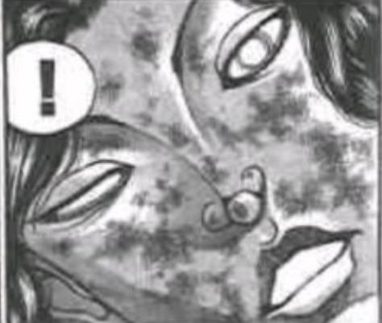
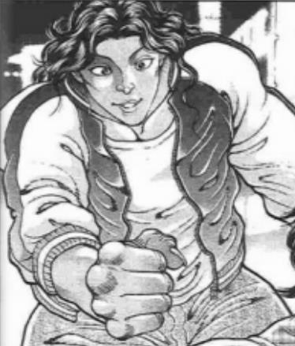
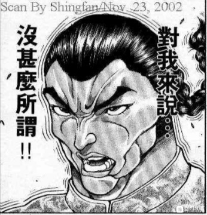

——丢两个彩蛋（第一个其实也是补丁）——

~全力以赴与全力以赴~

~辉针城~

三只被炉蜗牛正懒洋洋的看着电视机，烈海王在一旁给苹果削着皮

烈：天子小姐，你上次真的全力以赴了吗？

天子：当然啊

我从第【1d6：6】回合就开始认真打了，毕竟我连地震都用上了

烈的震惊【1d100:39】

烈：我就说有点不对劲……

你前五个回合不会一直在玩吧？

针妙丸：不是啦~

天子的意思是，前五个回合都是正常切磋所以没有一开场就用符卡

天子：烈海王满打满算就4张符卡，算上那个奇怪的武道架势也才5张，我觉得我用的卡已经蛮多了

从战斗开始就一路炸过去得是多较真的家伙啊？

我也就之前发起异变的时候才打过这样的符卡战

烈：异变的场合姑且不提，之前鵺大师和辉夜小姐就是这么打的……

正邪：你跟原始人联手对战强女子，人家多用几张卡有什么对？

鵺那次就纯粹是被你气疯了，用骰子来比喻就是大成功（注：反话）的遭遇战

烈：原来如此……

等会，那岂不是说鵺大师从开场就全力全开到最后也还是输了？

她是怎么打的啊？

正邪：哇，都过了这么久了你还要骂？！

我愿称你为虚假的天邪鬼

天邪鬼敬佩的鼓起了掌

武术家把削好的苹果切块后放在了桌上

虽说多了一位新住户，但今日的辉针城仍然一如既往的和平……

~大相扑~

~守矢神社~

烈：早苗小姐，我来借录像带了！

早苗的迷惑【1d100：70】

早苗：录像带？

什么录像带？

我们守矢神社可不卖那些奇怪的东西，你想看的话去找堇子帮你带过来吧

烈：不是

就是之前大相扑对战斗士们的战斗录像啊

早苗有录像吗？【1d10：8】（1或者10有）

早苗：我没录啊！

你当时不是跟我说让我别打扰你们约会吗，我就专心看比赛去了

烈的遗憾【1d100：70】

烈：真遗憾……

我还想看看克巳如今是怎样战斗的

那这场比赛最后结果如何啊？

战斗的结果是【1d10:9】（注：由于半圆还没画完因此选项我瞎写了）

1 地下竞技场大获全胜

2 克巳垫了（别啊）

3 勇伯乱入

4 地下竞技场大获全胜

5 boy垫了（哈？）

6 是……是武藏！

7 地下竞技场大获全胜

8 侠 客 行

9 奥利巴的复仇战

10 大成功/大失败【1d2：1】

早苗：前面几场比赛毫无悬念，大相扑一败涂地

但到了最后一场的时候，治好了肋骨的奥利巴先生突然从场外乱入，只花了【1d100:38】秒钟就让那个横岗毙了！

之后上演的是奥利巴与二代野见宿祢的世纪之战！那可真是太精彩了！

奥利巴的骨头再次被力士捏碎了，就在他即将败北的紧要关头，黑五角大楼的囚犯们拖着他的爱人玛利亚小姐来到了观众席上！

烈：什么？！

早苗：玛利亚小姐往地上吐了口吐沫， Mr.Unchain便当场复活了！

哇，即使是看了这么多场战斗的我也不得不发出惊叹——

他居然硬是把那位宿祢打成了倒三角形！

在奇迹般的赢得战斗之后，奥利巴先生什么也没说

他微笑着抱起了爱人，在众人的欢呼中离开了竞技场……

烈：我为啥要去约会啊？！！！！！！！！

我想看！我想看啊！

早苗：嗯……要不试试我的奇迹？

【1d24：4】小时后，早苗的成功用奇迹的力量重现了奥利巴一战

于是，武术家与巫女看起了重放

顺便一提，守矢二神在后面同样看的很开心

（彩蛋剧情结束）

应该是今晚七点半左右更新

~这件事发生在烈海王来到幻想乡的第【320+1d15:11=331】天~

人间之里最近出了一件不大不小的事情

某个书店老板的女儿突然失踪了

这在人里并不多么罕见——毕竟被妖怪袭击的人偶尔也会有——

但是她的失踪却显得过于离奇，因为此事事先没有任何征兆

无论是巫女还是魔法使都暂时对此一头雾水，那书店也不得不暂时关门

于是，关于一个小小少女眼中的幻想乡的故事开始了

烈海王是如何得知此事的？【1d10：5】（这个骰子决定了本次的同行者）

1 古明地觉的侦探委托

2 幽香的茶话会

3 与莉格露的闲聊

4 魔理沙的委托（为啥啦）

5 与皮克的闲聊（为啥啦）

6 社畜酒会

7 古明地觉的侦探委托

8 读报纸（孤独传说继续）

9 古明地觉的侦探委托

10 大成功/大失败【1d2：1】

草，皮克你是怎么知道的？【1d10:7】

1 其实是铃奈庵的老客户了

2 其实是阿求的朋友

3 皮克是妖魔书收集家（为啥啦）

4 其实是铃奈庵的老客户了

5 其实是阿求的朋友

6 皮克以前救过小铃一命（为啥啦？！）

7 其实是铃奈庵的老客户了

8 其实是阿求的朋友

9 皮克在铃奈庵打工（为啥啦）

10 大成功/大失败【1d2：1】

~永远亭~

这天上午，烈海王正准备出门修行，却发现皮克站在了他的房门之前

烈：皮克，怎么啦？

想打架还是想吃饭？

皮克：你那还算是人

（烈，我记得你以前接过寻人的委托吧？）

烈：我确实干过这活……

上一次我找的人是恋小姐，就是经常来厨房跟你玩的那位

有什么想要我帮忙的吗？

皮克的说明【1d70：16+30=46】（君子皮克+30，50以上理解）

皮克：嗷嗷嗷啊！嗷嗷嗷哦啊啊！

（小铃不见了！铃奈庵关门了！我不能借书了！）

慌张的原始人在原地暴跳如雷

烈：总之你先冷静一下如何？

这样子就算是我也听不懂啊

铃仙：你俩台词反了吧？

因幡帝：遇到与自身相关的事情，就算是皮克也慌了……

皮克的冷静持续了【1d20：11】分钟

烈：我先总结一下案情

在人间之里有一家叫做【铃奈庵】的借书屋，其出租的书籍主要是来自于外界的【外来本】

铃奈庵店主的女儿名叫本居小铃，她同时也是店里的店员和看板娘，且拥有着可以读懂任何文字程度的能力

而这位本居小铃就在最近莫名失踪了

因此，皮克前来委托我寻找这位小铃小姐——还有什么要补充的吗？

皮克的补充说明【1d10:6】

1 妖魔书

2 阿求

3 天狗的报纸

4 妖魔书

5 妖怪狸猫

6 小铃suki（为啥啦）

7 妖魔书

8 与灵梦的关系

9 感觉没啥可以补充了（你确定吗？）

10 大成功/大失败【1d2：2】

皮克：嗷嗷嗷嗷嗷嗷啊

（还有就是，那个……我在追求小铃小姐）

烈的震惊【1d100：56】

烈：皮克你天天出门原来是为了追女孩子啊？！

铃仙的震惊【1d100：75】

铃仙：小铃会被你吓死吧？！

而且这从各种意义上都配不上啊！尤其是物理意义上！

帝：哇这……

虽然与案情无关但我还是先问一句，你们俩进展如何啊？

皮克的进展是【1d10：4】

1 皮克的单相思

2 隐隐约约察觉到

3 被当成变态了（很正常）

4 皮克的单相思

5 隐隐约约察觉到

6 被当成邻家大哥了（为啥啦）

7 皮克的单相思

8 隐隐约约察觉到

9 追到手了（开玩笑吧？）

10 大成功/大失败【1d2：2】

皮克：嗷嗷嗷嗷哦啊啊

（我一直想表白但是找不到什么好办法……直接去邀请人家约会又显得太刻意了……）

（所以就只能经常去借书还书，在这个过程中跟小铃小姐聊聊天这样子）

因幡帝：听起来完全就是那种有些古怪的客人

话说她居然敢跟你做生意，胆子也确实够大

铃仙：超纯情的原始人书友？

得亏皮克现在不是刚来永远亭的样子了……不然小铃怕是要糟

烈：难怪皮克会这么着急

放心吧！

这委托我烈海王接下了！

皮克：嗷！

皮克高兴的挥起了手

烈的第一步行动是【1d10:5】

1 先去铃奈庵做实地考察

2 从小铃的人际关系入手

3 帮帮我吧觉小姐！（为啥啦）

4 先去铃奈庵做实地考察

5 从小铃的人际关系入手

6 去问问魔理沙吧

7 先去铃奈庵做实地考察

8 从小铃的人际关系入手

9 这里就靠我烈海王的直觉（有用吗？）

10 大成功/大失败【1d2：2】

烈：无论人类还是妖怪都无法独自一人生存下去

人只要在社会中存在过就一定会留下痕迹，那就是与他人的交互所产生的，所谓的人际关系

而本居小铃作为借书屋的看板娘，在这方面留下的印记会相对常人多上许多

你们知道铃奈庵中平日都有什么常来往的客人吗？或者奇怪的客人也行

铃仙：我平日去卖药的时候偶尔会看到灵梦和魔理沙，皮克你呢？

皮克的回忆【1d70：29+30=59】（老顾客+30,50以上得知阿求，75以上得知文文与猯藏）

皮克：嗷嗷嗷嗷嗷啊

（人间之里的大小姐 负责记录历史的稗田阿求也常来铃奈庵）

帝对铃奈庵的了解【1d100：12】

因幡帝：我压根就没去过这地方，不好意思帮不上忙啦

烈：常去的顾客有灵梦、魔理沙和这位阿求小姐

我们首先应该做的是【1d10:5】

1 拜访阿求

2 进一步收集情报

3 拜访灵梦

4 拜访阿求

5 进一步收集情报

6 拜访魔理沙

7 拜访阿求

8 进一步收集情报

9 靠我烈海王的直觉（为啥啦）

10 大成功/大失败【1d2：2】

烈：——现在手头有关于小铃小姐和铃奈庵的信息都太少了，这样可没法做出正确的推理

皮克，出发吧！我们先去人里收集情报！

皮克：嗷！

铃仙：稍等一下哦

月兔给原始人戴上了一双兔耳朵

铃仙：这是我最近新研发的皮克语翻译器

带上这双耳朵后皮克就能正常说话了，很实用吧！

皮克的不适应【1d100：67】（75以上立马就摘下来）

皮克想把耳朵摘下来

因幡帝：你就先忍忍吧

之后见到心仪的女孩子，不管怎么说也不能对着她嗷嗷乱叫吧？

最起码本次事件中给我老老实实带着翻译器

——仅限本次事件中，皮克可以正常说话了——

~人间之里~

烈的情报收集【1d70：66+30=96大成功】

大成功是什么？【1d10:6】

1 大狸子文文阿求的情报

2 妖魔书与百鬼夜行绘卷

3 八云紫（为啥啦）

4 大狸子文文阿求的情报

5 妖魔书与百鬼夜行绘卷

6 易者与小铃的第一次失踪

7 大狸子文文阿求的情报

8 妖魔书与百鬼夜行绘卷

9 阿求其实是知名作家（你怎么知道的）

10 大成功/大失败【1d2：1】

烈与皮克在人里分头行动以提高情报收集的效率

【1d3：2】小时后，两人重新碰头了

皮克：我咨询了四周的居民，得知小铃小姐之前也失踪过一次

在之前刮台风的时候，她独自一人出门后在村外消失了

那时大家都以为她遇难了，但没过多久，昏迷的小铃小姐又再次出现在了村中

烈：我这边的进度是，小铃小姐曾被已死的占卜师利用，以完成其成妖的仪式

而那位名叫易者的卜师在刚复活没多久后就被灵梦彻底退治了，据说连渣都不剩一点

皮克：综合手头现有的情报可以看出……

小铃小姐似乎经常和一些古怪的事情扯上关系？

烈：（你也算是古怪的事情吧？）

她认识灵梦与魔理沙，曾被卷入妖怪的仪式，且在村外失踪后又离奇的归来了

这可不像是一个普通书店店员会有的经历

我感觉有点思路了……

接下来的方向是【1d10:3】

1 调查第一次失踪案

2 调查铃奈庵

3 皮克，你怎么看？（过皮克的直觉）

4 调查第一次失踪案

5 调查铃奈庵

6 调查易者之死

7 调查第一次失踪案

8 调查易者之死

9 靠我烈海王的直觉（这个时候？）

10 大成功/大失败【1d2：2】

烈：现在手头的线索又有点多了

皮克，你怎么看？

皮克的直觉【1d100：91】（75以上起效）

皮克：易者的死很奇怪，小铃的失踪也很奇怪

而小铃自己更奇怪，她为啥会遇到这些事？

我寻思铃奈庵应该也有问题

烈：三个方向都得查，这是正确的思路

为了节约时间我们就先分头行动

烈负责【1d2：2】

1 易者与失踪案

2 铃奈庵

烈：我先去铃奈庵收集相关情报

皮克，易者与第一次失踪案的调查就先交给你如何？

皮克：没问题

两位格斗家碰了碰拳，便转身开始了各自的调查

首先是【1d2：1】的视角

1 烈

2 皮克

~铃奈庵~

在人间之里，有一家出借外来本的借书屋

它外表看上去是间普通的平房，门面上悬挂有铃奈庵三字（不知为何，庵字是歪的）

穿过大门就可以看到看板娘小铃的书桌兼办公桌，在书桌上有一台留声机，笔筒和大量的书

屋子里除了书桌便是摆满了书本的书架，门口旁边放有沙发和桌子用以待客

由于今日小铃不在，铃奈庵暂时关门了

而烈此刻正站在门口打量着店铺

烈的察觉【1d70：2+30=32】（50以上察觉妖气）

烈：单从外表看没什么特别的

看来还是得进去寻找线索……

您好！有人在吗？

有人回应吗？【1d2：2】

1 有

2 没有

烈：看上去没人在家

烈要做什么？【1d10:9】

1 直接进门吧

2 把使魔扔进去观察

3 去找皮克吧（为啥啦）

4 直接进门吧

5 把使魔扔进去观察

6 去找阿求吧

7 直接进门吧

8 把使魔扔进去观察

9 去问问幽香吧（为啥啦？！）

10 大成功/大失败【1d2：2】

烈：直接破门而入可太过失礼了，皮克知道了怕不是要与我拼命

我记得幽香女士平时就经常读书看报……说不定她会知道点什么？

准备些点心去拜访幽香女士吧

烈海王前往太阳花田了

路上有事发生吗？【1d100：34】（75以上有）

一路平安无事

~太阳花田~

太阳花田一直是那副安宁而祥和的样子，妖精们躲在向日葵后玩着捉迷藏与转方向的游戏，而某个大妖怪则坐在一旁看着妖精们的娱乐喝茶，偶尔下地照顾一下花朵

不过，最近花田中多了一位十分有活力的新成员

克劳恩皮丝：妖精们，随我出征！

今日便要将神社的那三个笨蛋打到心服口服口牙！

烈：——克劳恩皮丝小姐，你在干啥啊？

克劳恩皮丝：哇，是疯子肌肉笨蛋朋友大人

烈的震惊【1d100：97大成功】

草，大成功是什么？【1d10:2】

1 灵光一闪，察觉了铃奈庵的不对劲

2 情报强者风见幽香

3 幽香的膝枕（为啥啦？）

4 灵光一闪，察觉了铃奈庵的不对劲

5 情报强者风见幽香

6 赫卡提亚的抱抱（为啥啦？！）

7 灵光一闪，察觉了铃奈庵的不对劲

8 情报强者风见幽香

9 武术境界提高了！（？？）

10 大成功/大失败【1d2：1】

烈：笨蛋？！

我居然会被妖精骂笨蛋？！

幽香：跟妖精较劲的人就是笨蛋哦

你今天来的真早啊

烈：因为我有些事情想请教幽香女士

顺便一提，今天带来的甜品是【1d10:5】

1 三色团子配茶

2 超大份草莓拿破仑

3 热豆腐花（配蜂蜜、芝麻与花生碎）

4 羊羹与铜锣烧

5 椰汁芋头西米露（温）

6 白巧克力柠檬蛋糕

7 抹茶豆腐布丁

8 莲子海带红豆沙（温）

9 炸鲜奶与红枣糕

10 大成功/大失败【1d2：1】

烈：现在天还冷，我就做了些椰汁芋头西米露

这是我家乡南部的甜品，您尝尝味道如何啊？

我给妖精们也准备了一份，一块来吃吧

烈的厨艺【1d45：18+55=73】

幽香：温度掌握的很好，不过芋头块切得太大了

下次换成芋泥怎么样？

烈：换成芋泥的话感觉会把椰汁的味道盖过去

不如下次来的时候我做个芋泥奶茶？

幽香：这个听起来不错~

那么说正经事，你想问什么啊？

我可不保证一定能给出建议

烈的说明【1d100：66】（50以上理解）

烈对幽香说明了从皮克的委托开始，一直到他前往花田为止的事件经过

烈：——我觉得强行破门而入未免太过失礼了，就想着过来问问您对这家书店有没有什么了解

幽香小口小口的吃着碗里的甜品

幽香：铃奈庵啊……

让我猜猜看，你想知道的是本居小铃频繁卷入异常事件的原因？

烈：正是如此

幽香：那自然是因为铃奈庵中有妖怪们感兴趣的东西

本居小铃拥有着能够读懂一切文字的能力

这可不只包括了人类的文字——理所当然，妖怪们的文字她也是能看懂的

烈的察觉【1d70：29+30=59】（50以上察觉）

烈：我懂了

您的意思是，铃奈庵中存有妖怪们写的书？

幽香：人类称之为【妖魔本】

正常的人类对此应当是避而不及的，但这个好奇心旺盛的小姑娘却偏偏以收集妖魔本为乐趣

正因如此，铃奈庵中收藏了许多稀奇古怪的书籍

举个例子来说的话——是了，《私家版　百鬼夜行绘卷》就是一本封印有妖怪的书

以你的敏锐程度，哪怕站在门外也应该能感受到那本书的妖气吧？

烈：？？？

我什么都没感觉到啊

幽香：啊啦，那可真是有趣

这样一来那本书会去哪呢？

大妖怪吃完了今日的甜品，给自己和烈倒了两杯茶

幽香：这本书的下落先略去不谈，继续说明铃奈庵本身的情况

由于这些妖魔书的存在，铃奈庵常有许多古怪的顾客出没

像是盯上《百鬼夜行绘卷》的狸猫，在店中售卖报纸的天狗，印刷魔法书的河童，以及监视看板娘的巫女与魔法使等等

也有些客人是冲着看板娘小铃去的，比如说她的挚友，拥有史官与人气作者二重身份的稗田阿求，以及想要追求她的原始人皮克

——嗯，我了解的也就这么多，剩下的都是些无关紧要的情报了

克劳恩皮丝：这叫“就这么多吗？！”

你了解的也太清楚了吧？！

幽香：毕竟我偶尔也会去铃奈庵卖书嘛，像是我写的《幻想乡植物百科》之类的

烈的震惊【1d100：27】

烈：我之前就一直隐隐约约察觉到

您虽然很少离开太阳花田，但其实对于幻想乡中大大小小的事件都堪称了如指掌吧？

幽香：了如指掌倒称不上~

像是你前几天跟八意永琳去外界约会这种程度的事，我还是能知道的

烈的情商【1d90：57+10=67】（50以下说出声）

烈：（说真的这好恐怖啊！）

烈：我无所谓！

于是，在地狱妖精目瞪口呆的视线中

武术家与大妖怪的唇贴到了一起

这是武术家人生中的第二个吻，但对象却是同一个人

这一次绝不能输！

抱着这样的想法，凭借着上一次的经验，他总算不至于当场失神——

他努力注视着绿发的妖怪，拼命完成了全过程后，才平静的离开了面前的少女

然后，扑通一声倒在了地上

烈：现在的我要学这个……还太早了……

大妖怪蹲下身来戳着烈的脸

幽香：我改主意了~

今晚来太阳花田过夜吧，这就是报酬！

不许反悔哦！

烈：没有问题……

烈海王恍恍惚惚的离开了太阳花田

路人妖精（友情出演 莉莉白）：皮丝老大！咱们出发吗？

小丑般的妖精看看远去的武术家，又看了看一脸平静的大妖怪，双眼无神的坐在了椅子上

克劳恩皮丝：你们玩去吧……

我以前真是太幼稚了

强者的世界，好可怕啊

——不管怎么说该把摄像头给皮克了（泣）——

时间回到烈去铃奈庵之前

皮克要做什么？【1d10:7】

1 去问问灵梦吧

2 去问问阿求吧

3 靠我皮克的推理（你会吗？）

4 去问问灵梦吧

5 去问问阿求吧

6 靠我皮克的直觉（为啥啦）

7 去问问灵梦吧

8 去问问阿求吧

9 去问问魔理沙吧

10 大成功/大失败【1d2：1】

皮克：无论易者事件还是第一次失踪，灵梦小姐均有参与其中

我该去问问她相关的细节

皮克前往博丽神社了

~博丽神社~

灵梦在家吗？【1d2：1】

1 在

2 不在

博丽灵梦结束了今日的调查，目前正在神社中休息

她刚给自己倒了杯茶，就看到了带着兔耳朵的皮克

灵梦的笑点【1d100：27】

灵梦：皮克，这玩意一点都不配你啊

想装可爱也别抢铃仙的耳朵嘛

皮克的说明【1d70：33+30=63】（君子皮克+30，50以上理解）

皮克说明了他今日的来意以及兔耳朵的作用

灵梦：这玩意居然是通讯装置……铃仙的品味好差劲

话说你也在查小铃的案子啊？这样的话……

灵梦的无所谓【1d50：2+50=52】（博丽巫女+50,默认说明易者案，75以上说明失踪案）

灵梦：小铃的上一次失踪跟这次应该没有关系，我已经问过当事人了

易者的事情倒是可以跟你说说

皮克：灵梦小姐，我不关心那个易者是个什么样的妖怪

我只是很好奇，你为啥要干掉他？

即使是我刚来幻想乡的时候，你也只是把我打了一顿而已吧

灵梦：这事情与个人好恶无关

我纯粹是在履行巫女的职责而已

皮克的疑惑【1d100：21】

皮克：我知道灵梦小姐一向是很敬业的

巫女的职责是守护幻想乡……

那易者已经强到对幻想乡产生威胁了吗？

灵梦：压根不是这么回事 ，实际上他弱的要死

记好了，在幻想乡中，【人间之里】的人类变为妖怪是头等大罪

而我的工作就是监视这种事，并阻止其发生

博丽的巫女难得露出了严肃的神情

皮克的理解【1d100：6】

而原始人则彻底迷茫了

皮克：？？？？？？？？？？

就因为他变成妖怪了？

那为啥你不去退治烈和我呢？我俩现在也不算纯人类了吧？

而且天天来神社喝酒的不也都是妖怪们吗，也没见你大开杀戒啊

灵梦：唉，就知道你这憨货听不懂

你回去跟烈海王讲讲，让他给你解释吧，我去接着寻找小铃了

灵梦拍了拍皮克的头后飞走了

皮克：——搞不懂，之后让烈说道说道

现在我还不知道第一次失踪案的情况……

皮克的行动是【1d10:10】

1 先去跟烈汇合吧

2 去问问阿求吧

3 去追灵梦！

4 先去跟烈汇合吧

5 去问问阿求吧

6 靠我皮克的直觉（为啥啦）

7 先去跟烈汇合吧

8 去问问阿求吧

9 去问问文文吧（你怎么知道的）

10 大成功/大失败【1d2：2】

皮克大失败！

大失败是什么？【1d10:2】

1 ？？？：你先安静一会吧

2 “老朽已经明白了，就是你干的好事！”

3 百鬼夜行绘卷决定换个身体

4 ？？？：你先安静一会吧

5 被小铃干掉了（真的假的）

6 百鬼夜行绘卷决定换个身体

7 ？？？：你先安静一会吧

8 百鬼夜行绘卷决定换个身体

9 被小铃干掉了（真的假的）

10 大成功/大失败【1d2：1】

“老朽已经明白了，小铃的失踪就是你干的好事！”

皮克抬头望去，发现褐色头发的狸猫妖怪正坐在神社的树上

皮克：你说啥呢

我正在寻找小铃小姐啊

猯藏：哈，可别想骗过老朽这双慧眼

我经常在铃奈庵看到你用奇怪的目光打量小铃——

想必这次就是你偷偷把小铃绑走了！

明明会说话却摆着一副只会乱叫的样子，就是你心怀不轨的铁证！

你这家伙居然还在神社装无辜企图套出小铃以前的信息，真真是可恶至极！

皮克要怎么做？【1d10:2】

1 先去跟烈汇合（战斗中烈前来救场）

2 打架咯！

3 靠我皮克的口才

4 先去跟烈汇合（战斗中烈前来救场）

5 打架咯！

6 靠我皮克的诈骗术（那是啥）

7 先去跟烈汇合（战斗中烈前来救场）

8 打架咯！

9 皮克暴怒（很合理）

10 大成功/大失败【1d2：2】

皮克：这家伙完全不讲道理——

现在先去找烈海王帮忙！

皮克的逃跑【1d100:21】

大狸子的追击【1d50：37+50=87】（皮克大失败+50）

原始人才刚走没几步，狸猫妖怪就操纵着小狸猫们挡住了原始人的去路

猯藏：老朽可不是没准备就出来抓人的笨蛋

这下你无路可逃了！

猯藏的秒杀【1d100：21】（60以上成功）

皮克：烈应该过一会就会来了

——希望他能保住你的命！

战斗！

BGM：佐渡的二岩

烈海王将在战斗开始后的第【1+1d10：4=5】回合前来救场

皮克

Atk 265

Hp 26

技能

原始人：与常规意义上的人类根本不是一个物种，普通攻击对对手造成的伤害X2，不会受到异常状态的影响

白垩纪的肉体：拥有高速回复的能力，每回合Hp+1

战斗天才：每次战斗后都会变强

与朋友的回忆（CT3）：（自身加持类）通过与朋友们的战斗而积累了无数的战斗记忆，可以对所有攻击进行一次【1d100】的破解判定，普通攻击与技能30以上成功，必杀技75以上成功

高速冲击（CT4）：（近战类）四肢着地，以急速向对手冲刺 Atk+100，造成的伤害+5

必杀技

最终形态（CT5）：自身变化为完全的战斗形态 3T内每回合Hp+2，Atk+80，对对手造成伤害后进行一次【1d100】的受伤判定，50以上+2伤害，75以上+3伤害，90以上+4伤害

神技【八方鬼缚阵】（CT6）：生成巨大的结界以攻击对手。Atk+650，给予伤害X4

新难题【金阁寺的整块天花板】（CT7）：完全就是举起一块超大的天花板砸下来而已，无法回避/破解/防御 Atk+775，给予伤害X5

二岩猯藏

Atk 280

Hp 24

技能

狸猫怪 十变化：不会受到异常状态的影响，对特殊攻击手段拥有耐性。每回合对自身进行一次【1d10】的变化判定：出目为1时变化为对手心中重要的人，本回合对手无法使用技能与必杀技；出目为2-3时将狸猫部下变化为付丧神盾牌，本回合受伤减半；出目为4-5时变化为超色的西装美女，对手本回合Atk-50；出目为6-7时变化为地藏对对手发起突袭，造成【1d4】点伤害；出目为8-9时将自身变为太阳/月亮，本回合给予伤害+3，受到的伤害-3；第一次出目为10时将对手无力化，本回合对手无法行动，第二次出目为10时效果同8-9

一回胜负【灵长类弹幕变化】（弹幕类）：（CT1）一场战斗中仅能使用一次，令蓝色的弹幕人形对对手射出密集的米弹，本回合收到的伤害减半，对对手进行7次【1d100】的判定，50以上成功，对对手造成成功次数的伤害

二回胜负【肉食类弹幕变化】（近战类）：（CT2）一场战斗中仅能使用一次，令绿色的弹幕肉食动物对对手进行近身攻击，本回合自身Atk+50，给予伤害+3

三回胜负【羽鸟类弹幕变化】（弹幕类）：（CT3）一场战斗中仅能使用一次，令赤色的弹幕飞鸟对对手进行自杀式冲击，对对手造成必中的【3+1d3】点伤害

四回胜负【两栖类弹幕变化】（弹幕类）：（CT3）一场战斗中仅能使用一次，令蓝色的弹幕蛤蟆自爆后变为米弹攻击对手，3T内自身受伤后对对手造成【1d4】点伤害

五回胜负【鸟兽戏画】（弹幕类）：（CT4）一场战斗中仅能使用一次，令飞鸟、肉食兽与两栖动物一并上阵围攻对手，本回合自身无敌，给予伤害X2，对手Atk-60

六回胜负【狸猫的变身学校】（技巧类）：（CT5）？？？

七回胜负【野生的离岛】（弹幕类类）：（CT5）？？？

必杀技

【猯藏化弹幕十变化】：？？？

貉符【满月下的腹鼓舞】：？？？

【Wild Carpet】：？？？

（刚刚可能描述的不是很清楚，烈海王去花田过夜是本日全剧情结束后才会有的事，因为要先解决委托才行）

（你们不要黑烈啊！）

T1

猯藏的变化【1d10：6】变为地藏

皮克的受伤【1d4：3】

Hp：26-3=23

皮克：怎么还有这种战斗方式

猯藏：老朽又不是傻子，谁会跟你这种家伙拼力气啊？

符卡宣言 一回胜负【灵长类弹幕变化】！

伤害判定 【7X1d100：60 37 77 86 9 55 11】成功四次

Hp：23-4=19

皮克的攻击【265+1d100：55=320】

猯藏的攻击【280+1d100：72=352】

皮克的受伤【1d10：2】

1 回避

2 小伤害

3 小伤害

4 中伤害

5 中伤害

6 大伤害

7 大伤害

8 特大伤害

9 特大伤害

10 大成功/大失败【1d2：2】

Hp：19-1=18

Hp：18+1=19

皮克：不疼不痒

T2

猯藏的变化【1d10：2】付丧神盾牌

猯藏：符卡宣言 二回胜负【肉食类弹幕变化】

小的们给我上！

皮克的攻击【265+1d100：7=272】

差值大于100自动失败

皮克的受伤【1d10：5】

1 回避

2 小伤害+3

3 小伤害+3

4 中伤害+3

5 中伤害+3

6 大伤害+3

7 大伤害+3

8 特大伤害+3

9 特大伤害+3

10 大成功/大失败【1d2：1】

Hp：19-2-3=14

Hp：14+1=15

皮克：你是……什么东西？

从没见过如此古怪的生物！

原始人面对着变化莫测的对手，打心底感到了迷惑

猯藏：老朽一直都是狸猫妖怪哦

呼呼，变化术练得好也会造成困扰啊

T3

猯藏的变化【1d10：10】将皮克无力化了！

狸猫妖怪拿起烟枪吸了口烟，然后一口向着原始人喷去

“嘭！”

一阵白烟散去后，原始人变成了迷你的小恐龙！

狸猫妖怪捂着肚子哈哈大笑

猯藏：哈哈，这样子多配你啊！

符卡宣言 三回胜负【羽鸟类弹幕变化】

符卡宣言 四回胜负【两栖类弹幕变化】

皮克的受伤【1d3：2+3=5】

Hp：15-5=10

皮克的战斗：由于变成迷你恐龙自动失败

恐龙皮克对着狸猫妖怪张牙舞爪，但由于身材过于矮小，他并没能造成什么有效的伤害

皮克的受伤【1d10：2】

1 回避

2 小伤害

3 小伤害

4 中伤害

5 中伤害

6 大伤害

7 大伤害

8 特大伤害

9 特大伤害

10 大成功/大失败【1d2：1】

Hp：10-1=9

Hp：9+1=10

大妖怪拿出烟枪在恐龙皮克的头上打了一下

猯藏：老朽也不欺负你，敲一下脑袋可不算过分吧？

哈哈哈哈哈哈！

“嘭！”

皮克在突然出现的白烟中变回原样了

T5

烈海王赶过来了！

烈：？！

皮克和猯藏女士怎么打起来了？！

皮克：烈！这个卑鄙无耻的妖怪以为是我绑架了小铃小姐！

猯藏：武术小哥你来的正好

这家伙就是绑架少女的变态！

烈的劝说【1d70：1+30=31】（老熟人+30）

烈：猯藏女士——

猯藏：有话之后再说，我先把这家伙干掉

劝说无效，烈要怎么办？【1d10:7】

1 The World！

2 那就接着打吧

3 用自己的情感经历转移话题（为啥啦）

4 The World！

5 那就接着打吧

6 靠我烈海王的推理！

7 The World！

8 那就接着打吧

9 靠我烈海王的口才！（已经失败了吧）

10 大成功/大失败【1d2：1】

烈：唉……这种误会一般只会出现在辉夜小姐天天看的特摄剧里

双方都稍微冷静一下

【The World】！时间停止吧！

——【The World】——

烈海王默默把张牙舞爪的原始人背到了一旁，又将猯藏放出的弹幕兽群击破了

烈：然后时间开始流动

——战斗中止——

烈：猯藏女士，还请您冷静一下

皮克今天早上刚刚委托我来调查小铃小姐失踪的案子，他怎么会自己去绑架爱慕的少女呢？

况且皮克和我们天天都住在一块，他就算真的绑架了小铃小姐也没法找地方藏啊

猯藏：哎？老朽又搞错了吗？

喂原始人，真不是你干的？

是皮克干的吗？【1d10：3】（10的话就是）

皮克不屑的吐了口吐沫

猯藏的愧疚【1d100：7】

猯藏：真不好意思老朽搞错咯（棒读）

皮克：你讨厌我就直说啊，整这一出是搞什么？

（例行跑步倒垃圾，十点左右继续）

顺便洗漱一下，十点十分左右继续

（注：由于漫画中的解释略微模糊，因此以下对话中包含大量我个人对于铃奈庵剧情的理解，没有看过原著的各位吧友请不要当真，因为这一如既往，只是我的一家之言而已，绝非真正意义上的设定）

烈对人里的了解【1d70：4+30=34】（50以上了解）

烈：——是为了给妖怪们提供各种商品？

皮克对人里的了解【1d100：99大成功】（50以上了解）

草，皮克的大成功是什么？【1d10:5】

1 小铃对皮克的好感度基础值变为60（原为30）

2 其实是阿求的笔友

3 皮克看穿了一切（配合上一个大成功直接通关）

4 小铃对皮克的好感度基础值变为60（原为30）

5 其实是阿求的笔友

6 皮克：现在应该赶紧回神社！

7 小铃对皮克的好感度基础值变为60（原为30）

8 其实是阿求的笔友

9 皮克：是八云紫！（为啥啊！）

10 大成功/大失败【1d2：1】

皮克：烈海王，你肯定又没看阿求写的书

人里这地方其实是负责为妖怪们提供恐惧，为神明们提供信仰的，幻想乡真正的根基与生命线

烈：不是，你怎么这么清楚啊？

皮克：因为我跟阿求小姐是笔友啊

她的侦探小说与史书我都有买的

烈：你还是文艺青年吗？！

猯藏：暂且把原始人的文学修养放到一边，说回正题

皮克说的很清楚，人里对于幻想乡而言就是核心中的核心

因此，人里的居民决不允许变为妖怪，这就是幻想乡的铁律

狸猫妖怪此时极其少见的，露出了冷酷的表情

猯藏：一旦有人开了这个头，企图以成妖而得到超脱或是长生等目的的话，人类对于妖怪的恐惧心就会逐渐消失

——而一个无人害怕妖怪的幻想乡，与外界又有何分别？

烈的妖怪学【1d70：57+30=87】（75以上理解，师匠的教导+30）

烈：我倒确实是听师匠说过，妖怪是依托人类的恐惧而存在的……

猯藏：住老朽隔壁的响子酱就是个很典型的例子

所谓的山彦是诞生于【回音】这个自然现象之中的妖怪

过去的人们认为回音是山彦在山中与他们打招呼，因此响子酱就出现了

但她现在已经无法在外界居住了，原因小哥是了解的吧？

烈：因为现在的人们拥有了知识

在回音变为可以解释的科学现象之后，山彦就变为了无稽之谈……

猯藏：就是这样

但人里的居民们却仍旧相信山彦的存在，响子酱也就能够在这里生活

这就是不让人里居民成妖的最根本原因——

当妖怪变为了人们触手可及的存在后，又有谁还会害怕妖怪呢？又有谁还会相信妖怪呢？

巫女的本职工作正是维护这份平衡，因此易者死的一点都不冤枉

皮克：但我还是不明白，灵梦小姐为啥不过来杀掉我和烈啊？

我俩现在也算不上纯人类了

烈：因为咱们从一开始就不害怕妖怪，且一直住在永远亭

天天跟妖怪打架甚至都混成一团了，这样的家伙也算不上什么提供恐惧的人类……

就像魔理沙一样，我们也变成脱离人里的特殊存在了

但这样一来，人里的居民们岂不就是无法逃离囚笼的笼中之鸟？

猯藏：哪能呢？

你想想看，人里这地方为啥能在幻想乡存在这么久？

就是因为老朽这些妖怪们天天帮衬着嘛

发洪水了有河童帮忙治水，挂台风了有天狗帮忙挡灾，不守礼节的杂鱼妖怪就由俺们狸猫出手退治……

正如人类不能变成妖怪一样，妖怪也不能袭击人类

没有人类妖怪便无法存在，但脱离妖怪人类也无法生存，这就是幻想乡的规矩

顺便一提，小铃的第一次失踪就是被天狗治好后送回人里的

皮克：嗯……我觉得好复杂啊

上次我问阿求妖怪是好是坏，她却跟我说“关于幻想乡的真相有很多，选择你相信的一个就好”这样诡异的话

我是懒得想了，我就想知道小铃小姐在哪啊

烈：——不必着急，我已经理清思路了

保险起见我多问一句，猯藏女士，你近期是否在小铃小姐面前展露过真身？

猯藏：老朽确实干过这事

这也没啥大不了的吧？俺们都认识好久了

——大狸子坦诚大成功效果：烈的名推理——

烈：此事的起因说起来倒是很简单

铃奈庵的看板娘本居小铃由于自身能力的缘故有着收藏妖魔书的爱好，她也因此与许多妖怪和异人成了朋友

在与妖怪们交流的过程中，小铃小姐逐渐了解到了幻想乡的真实

皮克：就是咱们刚刚聊得那些？

烈：没错

对于你我这样的人来说，人里的意义是件没什么所谓的事情——毕竟居民们并未因此受害，相反还收到了妖怪们的保护——但对于小铃小姐，这事可就大了

因为她一直以来坚信的世界观崩塌了

猯藏女士，我猜你们之前一直都没跟她仔细讲过相关的事情吧？

猯藏：这也没啥必要吧……俺们都这么熟了

烈：此言差矣

老熟人其实是妖怪，这种事情就算对于成年人都是巨大的冲击，更何况是一个青春期的少女？

在她对这世界感到迷茫的时候却突然遇到了这么一档子事，你觉得她会怎么想？

