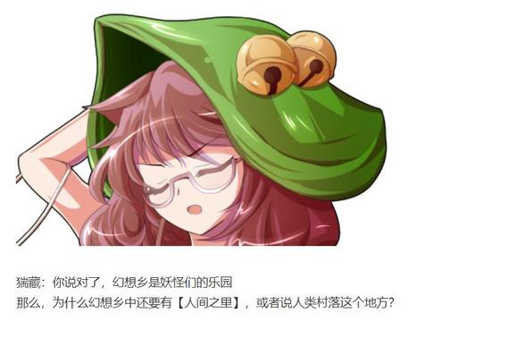

皮克的直觉【1d100：85】（75以上理解小铃）

皮克：不会是那帮孩子最喜欢的阴谋论吧？

“这个世界被妖怪们所控制着，巫女与魔法使都是想要支配村落的恶人”？

烈：哪怕有一个人好好跟她谈谈，都不至于会产生这种想法

但我估计灵梦和魔理沙都没把这当回事，偏偏值得信赖的大姐姐又当场变成了狸猫妖怪……

猯藏的愧疚【1d100：95】

狸猫妖怪惊讶的捂住了嘴

猯藏：是……是老朽的锅吗？！

烈：猯藏女士你也不必过于激动

你的影响力很大，但我想应当还有个起关键作用的直接引爆点出现，否则小铃小姐不至于做出这样的举动

皮克：小铃小姐到底干啥了？

烈：好问题

深信多年的世界观一朝崩塌，身旁的友人却无法信任，偏偏手头又刚好有本能够带来强大力量的妖魔书

你觉得本居小铃会做什么？

猯藏：不会吧？

她把《百鬼夜行绘卷》打开了？！

皮克：这么说来小铃岂不是被书里封印的妖怪附身了吗？！

你是怎么知道的？

烈：这只是最基本的推理，我的朋友

烈：此言差矣

我不知其他顾客来意如何，但皮克可是单纯为了你一个人才会来铃奈庵的！

皮克：你别当着人家面说出来啊！

猯藏：这陈旧的妖气……

果然就是那本书在搞鬼

魔理沙：来的正好！

烈海王，用你的假腿把那破书先拿走！

烈：不巧的是假腿刚刚已经用过了

大家先把小铃小姐控制住吧！

魔理沙：啧，我就知道你没一次靠谱的时候

（注：由于妖魔小铃只出场了一次没有符卡，因此这里直接骰点了）

四人的出力【1d50：37+50=87】（四人群殴+50）

小铃的出力【1d100：86】

那本奇异的书卷所含的妖力确实强大，在吸收了付丧神们的力量之后，居然拥有了大妖怪级别的威慑力

而魔理沙四人为了不伤到小铃却又打的束手束脚，难以与其分出胜负

最后，猯藏灵机一动变为了太阳

百鬼夜行在太阳升起后就四散而逃了——

利用这传说中的弱点，妖魔小铃才得以被安全退治掉

猯藏：嚯嚯嚯

有老朽在就相当于上了狸猫的泥船，自然是万无一失啦

魔理沙：那玩意最后化了吧？

而且那故事里狸猫也完蛋了

说起来《百鬼夜行绘卷》这次落到谁手里了？【1d10:7】

1 原作一样的大狸子

2 小铃：别抢我家的书啊！

3 灵梦：我没收了

4 原作一样的大狸子

5 小铃：别抢我家的书啊！

6 魔理沙：归我了！

7 原作一样的大狸子

8 小铃：别抢我家的书啊！

9 烈与皮克的报酬（为啥啦？）

10 大成功/大失败【1d2：1】

猯藏：这一次老朽可是名副其实的主力军

这绘卷就是老朽的战利品啦！

灵梦：你盯上这绘卷好久了吧

我之前还差点以为是你干的好事……

众人说着话的功夫，博丽的巫女已经回到神社了

烈：小铃小姐现在暂时昏迷了

灵梦小姐，你有什么好办法吗？

我不大好意思用急救拳直接打初次见面的少女……

魔理沙：我也是少女，你 TM 以前做急救的时候怎么就好意思打我呢？！

烈的情商【1d90：39+10=49】

烈：毕竟你的身体比皮克还要强壮的多

次次深受重伤没过几天就能活蹦乱跳，这体质是真的强到离谱……

说实话你头骨碎的那次我打的手都有点麻了

魔理沙：我记得你假腿刚刚用了是吧？

烈：怎么了？

等等，魔理沙你冷静点有话好好说别放魔炮至少别在这里放魔炮——

“轰”

武术家与魔法使开始了日常的符卡战

灵梦：小铃，你还记得你是怎么从店里消失的吗？

小铃的回忆【1d10:1】（1或10记得）

小铃：我勉强能想起一些来

我记得我遇到了一位非常漂亮的金发女士……她身穿紫色的道袍，手握阳伞，头上戴着蓬松的帽子——

烈：小铃小姐，你不需要再说了……

魔理沙：全幻想乡也就一个人能有这打扮

猯藏：嚯，原来是遭了神隐，难怪什么痕迹都没留下

众人的行动是【1d10：5】

1 皮克愤怒了

2 先送小铃回家吧（交给灵梦）

3 围殴八云紫（为啥啦）

4 皮克愤怒了

5 先送小铃回家吧（交给灵梦）

6 烈海王斗志昂扬（为啥啦）

7 皮克愤怒了

8 先送小铃回家吧（交给灵梦）

9 猯藏的恶作剧（为啥啦）

10 大成功/大失败【1d2：1】

烈：八云女士这到底是在干什么啊？

魔理沙：总之先把小铃送回家吧

她父母这段时间肯定担心坏了

猯藏：这事老朽就不参与啦~

话说回来，小铃现在也算是俺们这边的人类了

之后给她开个欢迎宴会吧

狸猫妖怪首领冲着众人挥了挥手，便握着卷轴心满意足的离去了

皮克：我也回永远亭得了……别吓着人家爹妈……

小铃：请别这样说！

虽然我很害怕皮克先生，但这一次真的多亏您的帮忙了——我的父母也一定是要感谢您的！

皮克：——好耶！

灵梦：紫的事就先交给我吧

我大概知道那家伙在打什么算盘了……

巫女用御币划出了一道隙间，并一跃而入

烈：嗯……不管怎么说，人没事就好

皮克，麻烦帮我跟师匠她们说一声，今晚我要赴约，就先不回去了

皮克的察觉【1d100：17】（75以上察觉）

皮克：这么晚还去打架？

那行，明早记得回来做饭嗷

告别了神社的众人，烈海王前往太阳花田了

~太阳花田~

今天的故事会改在太阳花田进行

烈的说明【1d100：2】大失败

烈海王大失败！

大失败是什么？【1d10:8】

1 克劳恩皮丝的月落

2 幽香：你吃个魔炮冷静一下吧

3 今晚没有禁果了

4 克劳恩皮丝的月落

5 幽香：你吃个魔炮冷静一下吧

6 师匠突击！

7 克劳恩皮丝的月落

8 幽香：你吃个魔炮冷静一下吧

9 永远亭全员突击！（为啥啦？！）

10 大成功/大失败【1d2：2】

烈：噢噢噢噢哦哦哦哦哦哦！

由于真的过于紧张的缘故，烈海王在幽香面前挥起了车轮拳

幽香：嗯，你还是先吃发魔炮冷静一下吧

~今晚的太阳花田出现了一发美丽的光柱~

烈的受伤【1d18：4】

烈：已经充分冷静下来了！

多谢您手下留情！

幽香：我可没放水

是你自己已经强到可以硬吃魔炮了

克劳恩皮丝：（骗鬼哦，你平常用的可不是那个功率）

幽香：那么，说说今天的故事吧

烈的说明持续了【1d30：7】分钟

烈：——之后我就来太阳花田了

幽香：紫那家伙又在多管闲事

连一个小小的看板娘都要操心，她到底是多放不下灵梦啊

烈：？

这和灵梦小姐有什么关系？

幽香：你应该已经查到易者案了吧？

烈：当然

变为妖怪的人类，被灵梦小姐无情退治掉了

幽香：小铃的状况实际上与易者差不多

她的身旁有着大量蕴含妖气的妖魔书，她也因此收到了诅咒——

再过不久，名为本居小铃的妖怪就会诞生于此世之中

烈的疑惑【1d100：67】

烈：这有和八云女士有何关系呢？

幽香：小铃变成妖怪之后，灵梦就不得不干掉她了——就像那个倒霉的易者一样

而紫打算直接加速这个过程

烈：原来如此

小铃小姐成妖后自然不必担心诅咒的问题，同时灵梦小姐也不必监视她了……

但她凭什么敢说灵梦小姐不会真的退治小铃小姐？

这一次小铃小姐只是被凭依而非真正成妖，但如果妖化不可逆转，即使是灵梦小姐也会出手吧？

幽香：因为灵梦也是个人类

是人类就会心软，是人类就会犹豫

如果把本居小铃这个灵梦的老朋友变成足以与她正面战斗的妖怪，以她那副心慈手软的性格，其结果必然是象征性的符卡战斗

紫拿捏准了灵梦的性子，因此就提前帮她做出了决定

不过在你们几个的折腾下这事最终也泡汤了——也未尝不是件好事吧？

~第332天~

烈海王从沉眠中醒来

他身侧的大妖怪正饶有兴致的注视着爱人的睡颜

因此他看到的第一件事物并不是陌生的天花板，而是那双赤红色的眼睛

这个时候该说什么呢……

这个时候该做什么呢……

已经，没有其他的答案了

他不愿打破这份美好，但他必须对此做出回应

因此，武者说出了发自内心的话语

烈：风见幽香

你愿意嫁给我吗？

幽香的回复是【1d10:8】

1 等到打完架之后——

2 不喜欢人间的规矩

3 愿意（现在吗？！）

4 等到打完架之后——

5 不去问问永琳吗？

6 想要西式的婚礼（为啥啦）

7 等到打完架之后——

8 我要当新郎（为啥啦？！）

9 等到有了孩子之后（为啥啦？！！！）

10 大成功/大失败【1d2：1】

幽香：让我当新郎的话，我就同意哦~

烈：为啥啊？！

原因是【1d10：1】

1 喜欢西装

2 想看烈穿婚纱

3 其实不想结婚

4 喜欢西装

5 想看烈穿婚纱

6 其实也喜欢永琳（求求你不要啊）

7 喜欢西装

8 想看烈穿婚纱

9 其实只是开玩笑的

10 大成功/大失败【1d2：1】

幽香：相比于轻飘飘的白婚纱，我还是更喜欢黑色的西装呢

烈：我觉得新娘也可以穿西装吧？

反正我是无所谓的

幽香：这样的话就嫁给你吧❤

烈：——等一下

那我们的战斗怎么办？

幽香：战斗和结婚有矛盾吗？

烈：不矛盾吗？！

幽香：在婚礼上打架不就好了

大妖怪温柔的将爱人拖回了床上

晚一些回永远亭也可以的吧？

这么想着，烈海王毫无抵抗的躺了回去

【1d6：3】小时后，烈海王回到了永远亭

~永远亭~

烈海王要做什么？【1d10:2】

1 总之先和师匠坦白吧

2 总之先求婚吧

3 这时候先瞒过去……（互相理解了，做不到的）

4 总之先和师匠坦白吧

5 总之先求婚吧

6 总之先和师匠打一架吧（为啥啦？！）

7 总之先和师匠坦白吧

8 总之先求婚吧

9 总之先逃跑吧（为啥啦？！）

10 大成功/大失败【1d2：1】

师匠刚刚走出了房间，就看到了她一夜未归的弟子

师匠：听皮克说你昨晚为了打架都顾不上回家了？

到底是遇到了什么样的家伙啊？

烈海王单膝跪了下来

烈：——八意永琳

你愿意嫁给我吗？

师匠：哎哎哎哎哎哎哎？！

一晚上没回家结果突然对我求婚了？！

烈：因为我……今天早上对幽香求婚了！

然后S E X也做过了！

师匠的愤怒【1d50:1+50=51】（初始值100，互相理解-40，突然被求婚-10，60以上坐轮椅，75以上滚蛋）

草草草草草草草草草，这半恼怒状态是怎么回事【1d10:10】

1 幽香事前已经打过招呼了

2 师匠：我完全理解了

3 师匠早就想结婚了（为啥啦）

4 幽香事前已经打过招呼了

5 师匠：我完全理解了

6 师匠：我无所谓！（你别啊？！）

7 幽香事前已经打过招呼了

8 师匠：我完全理解了

9 辉夜的心理辅导（为啥啦？！）

10 大成功/大失败【1d2：1】

大成功！

这个大成功是什么啊？！

这到底是谁的大成功啊？！！！！！！！！！！！！

【1d10：5】

1 变成了双人婚礼

2 永琳：要结婚当然没问题——不过得等到11年后才行！

3 幽香与永琳的完全理解（为啥啦？！）

4 变成了双人婚礼

5 永琳：要结婚当然没问题——不过得等到11年后才行！

6 我们都无所谓！（这是什么？！）

7 变成了双人婚礼

8 永琳：要结婚当然没问题——不过得等到11年后才行！

9 辉夜大小姐，拼尽全力的助攻！

10 大成功/大失败【1d2：2】

月之头脑捂住了脸

永琳：啊啊，原来如此

来这一手吗……

稍微一不注意就立刻反击了

真是丝毫不能大意的对手

烈：？

永琳，你在说啥啊？

永琳：没什么~

话说回来，居然是求婚啊……

这可完全出乎我的意料之外

银发的女子把嘴唇凑了到烈的耳旁

永琳：我很高兴你能对我说出这句话

不过，我觉得烈海王现在还没成熟到能够谈婚论嫁的地步呢❤

这是我作为师匠的，【绝对正确】的判断哦

烈：永琳，你想再等等吗？

永琳：不不

是你需要再等等……现在的你说这些，还太早了

至少等到十一年之后吧！

永琳温柔的把单膝跪下的弟子拉了起来

烈：可是幽香那边——

永琳：没关系，我之后会给她发使魔传信的~

风见幽香也是数一数二的大妖怪了，她不会在意这短短十一年的~

况且，你都还没打赢她呢，现在说这些也未免太早了吧？

烈：但我——

永琳：哎呀，现在都快到早饭的时间了

今天早上吃什么啊？

烈的情商【1d90：66+10=76】（50以上乖乖去做饭）

烈：（已经做好了被打死的觉悟才来求婚的，现在看来情况微妙的还……能维持住？）

哦哦哦哦哦哦那我先去做饭了！

烈海王跑去厨房了

铃仙：师匠......但是S E X ......

师匠：S E X和kiss有什么区别？

不过是 体 液 的交换而已，谁会在意这东西啊

辉夜：永琳......你好厉害啊......

永琳：我好歹都谈了半年恋爱了

现在我已经发现了，谈恋爱与战争并无分别——

无非是大家见招拆招，走一步算一步而已

我完全不急……时间还有很久

我们慢慢来

皮克：恋爱原来是这么复杂的事情？

小铃不喜欢我是因为我没有师匠这么聪明吗？

铃仙：我想还是别把这三人的恐怖恋爱战当成参考标准比较好吧？

因幡帝：傻点吧，皮克

两只兔子拍了拍原始人的头，走到餐桌前准备吃饭了

于是，永远亭再次回归到了日常之中……

~彩蛋~

~聊天~

~太阳花田~

师匠：结婚对于他来说还太早了

所以就麻烦你过个十一年左右再跟他讨论这个问题吧

幽香：我无所谓

十一年与十一天对我来说并无区别

不过，对你来说也差不多吧？

师匠：之后的日子还长得很

是呢……怎么说都要让他先打败你再说吧

幽香：然后，你要干掉他吗？

师匠：如果他输了的话呢

我衷心希望他别输~

两位强者和谐的在太阳花田喝着茶

一切都很正常，只是一旁的妖精不知为何，一直在瑟瑟发抖......

~笔友~

阿求对皮克的好感度【1d50：20+50=70】（大成功笔友+50）

皮克（手写）：说真的我这次好委屈啊

阿求：别跟小铃一般计较啦

她直到今日才对自身所处的世界有了初步的认知，归根到底还是个天真烂漫的少女而已

何况你本身不会讲话，平时又天天在店里嗷嗷乱叫……不如说对你有好感才是怪事吧？

阿求的开导【1d100：44】

皮克（手写）：阿求，我还是想不通

平日大家对我都很好啊

为啥到了小铃这反而就变了？

阿求：因为平日会跟你交流的都是些异类中的异类！

我作为幻想乡的史官也常常跟妖怪打交道，你一个原始人又有什么可怕的？

皮克（手写）：那咋办呢

我这是不是没戏了？

阿求的建议是【1d10:6】

1 下次给她带本书吧

2 先去学说话吧

3 我不想说的太失礼……

4 下次给她带本书吧

5 先去学说话吧

6 你可以来追求我啊（为啥啦？！你好感度才70！）

7 下次给她带本书吧

8 先去学说话吧

9 直球告白吧（你也是烈？）

10 大成功/大失败【1d2：1】

紫发的少女装模作样的清了清嗓子

阿求：咳咳

你可以先来尝试追求我嘛

皮克的震惊【1d50：45+50=95】（笔友+50）

皮克：嗷嗷嗷嗷嗷嗷嗷嗷嗷啊？！

原始人在房间中开始了狂暴的吼叫

阿求：你至于这么兴奋吗？！

皮克：嗷嗷嗷哦啊哦哦哦嗷嗷嗷……

（我对小铃小姐一心一意……）

阿求：我就知道你这原始人想歪了

是模拟战啦，恋爱模拟战

稗田阿求挥舞着手中的毛笔

阿求：要说难以攻略的少女，我可有自信自称是幻想乡第一档次的强者！

以我为对手进行恋爱模拟，如果能成功的话，攻陷小铃还不是手到擒来？

皮克（手写）：不愧是智慧过人的阿求小姐！

真是太感谢你了！

阿求：咱们都这么长时间的老朋友了，帮点小忙算什么？

从明天开始练习，争取一年之内把小铃拿下！

~永远亭~

皮克：嗷嗷嗷嗷嗷啊

（——所以之后我打算每天都去和阿求进行恋爱模拟战！）

嗷嗷嗷嗷嗷啊？

（你们怎么都捂着肚子蹲下了？中午的饭过期了吗？）

辉夜：我居然能在现实生活中看到这种情节？！

是我疯了还是这个世界疯了？！

因幡帝：啊我的胃……我的胃好疼……

铃仙：师匠，救命啊！!

烈：师匠，我顶不住了！!

师匠：坚持住……我去给大家拿胃药……

月之贤者捂着肚子走向了医务室

剩下的四人躺在地上痛苦挣扎着，只留下皮克一个人看着这诡异的图景

皮克：嗷嗷嗷嗷嗷嗷啊？

（以下是我的废话）

原本这篇的目的是跟大家探讨一下幻想乡的真实，并顺便发表一下我的个人拙见

不过幻想乡的真实算个屁啊，那玩意怎么样都好啦

这真的也太离谱了吧！！！！！！！！！！！！！！！

草！！！！！！！！！！！！！！！！！！！！！！

我在最后都已经做好烈搬出去住的预案了！

说实话提前打最终战的准备都做好了啊！！！！

死者苏生的准备也做好了啊！！！！！！！！！！！！！

结果最后这整得是什么玩意啊！！！！！！！！！！！

皮克你怎么也开始啦？！！！！！！！！！！

总之本次剧情算是平安结束了，真是可喜可贺

我胃好疼啊，真的好疼啊

下一次的更新是异变

异变真好，我爱异变

骰子下一层发

附上本次的骰子

皮克战有一段是摸鱼的时候骰的因此可能有截漏一两个

最后那俩骰子是另外一个彩蛋，之后再发吧

下一次更新应该在周一或者周二

顺便一提，关于本贴中的所谓感情线，或者说所谓炒股，我说一下我的看法

我无所谓

骰子怎么出我怎么写

太过离谱的结果我会给几个骰子限制一下，如果都过了那就这么办吧

因此哪怕之后出了魔理沙恋慕这种扯淡选项——只要骰子过了，那我就写！

我无所谓！

因此恳请大家别为此而争吵——归根到底这贴子也就是我图一乐的作品，跟骰子较劲当然是没有必要的

谢谢大家，晚安

半夜睡不着觉，稍微调整一下更新计划

下一次的更新变为日常回

主题是幽香战与永琳战，二连，打完再整异变

没错，这样一来永琳的卡会是削过面板的放水版本

但是如果不把这两场打完，之后的剧情就没啥办法进展了，别说大家愿不愿意看，我自己都很难写下去

因此

下一次更新就直接搞定这个拖了好久的约战

下一次更新就直接走完这两条感情线！

四季就先等异变结束后再打吧，毕竟特殊情况了（悲）

（补一下被吞的楼，应该没有了吧？）

~人物崩坏~

说实话这个话题应该在刚开贴的时候就讲的......

不过由于我经验不足的缘故，在当时就默认大家都理解了这一点

所以导致现在才开这个话题，可能因此引起了许多不必要的争吵，我首先在这里向吧友们道歉

首先说结论：本贴中的所有角色，在刚出场的时候就早已人物崩坏，或者说所谓的OOC了

为什么？

因为这个贴子是安科贴，角色们的好感度和大部分行为都会交给骰子

作为贴主的我能做到的 ，只有给出一定数值的基础值或者塞入大部分正常选项

（此处我最为致命的初期失误是师匠的80基础值）

但是梗选项一定会有，也一定会出现骰子骰了离谱的数值这种展开（比如万宝槌异变和幽香）

这就导致，角色们的行为在很大程度上是我无法左右的

我能做的只有在骰出结果后，通过对话的方式【尽可能】让角色们的所作所为显得合理

而在经过了这么长时间的连载之后，在这么多骰子的积累之下——

我想大家都能理解，贴子里的角色们早已不是他们原本的样子了

原作中的幽香与永琳当然不会爱上烈海王

原作中的魔理沙也当然不会三天两头住院

原作中的鬼人正邪哪里是这么可爱的孩子？

原作中的早苗更不会去看格斗和练相扑啦

同样的——

原作中的克巳去接手了，而不是接着练独臂空手道

原作中的皮克不会去追女孩子，他可能会直接去雷普（笑）

原作中的烈别说天文密葬法，他连花弹都绝对不可能去用

但在这个贴子里，由于骰子骰出了这样的结果，他们就会这样去做

正因如此，我在编选项和写对话的时候，会相对偏向于角色们在本贴中的形象进行考虑

【现在的他/她有可能去做什么】

【现在的他/她会怎么说？】

这样一来，他们的行动自然会跟原本的自己不同了

但我个人认为，这种【偏离自身形象】的行为，或者说OOC，正是安科/安价贴子的乐趣所在

或者说，这是相当一部分同人创作的乐趣所在啊

最后，归根到底还是那句话

“这个贴子中的所有内容都是二次设定，都是我个人的自娱自乐”

因此，还请吧友们千万不要当真啊

在此感谢吧友们的支持与讨论！

——实习时偷偷摸鱼的王子2326

~神隐的主犯~

~第331天~

灵梦跃入隙间之后，来到了【1d10：8】（2-9神社屋顶，1 10 随机梗选项）

金发的妖怪贤者正在神社屋顶悠哉的赏着月亮

灵梦：操纵小铃的真犯人就是你吧！

给我做好觉悟！

紫：真犯人？

你在说什么呢？

我只是在赏月而已——因为今晚月色很美

灵梦：是哦，在这个场合专门跑到神社的屋顶赏月

真亏你说得出来这种瞎话

紫：哎呀呀……

我可是特意为了拯救那个小姑娘而行动的，你却对着我大喊大叫

灵梦真薄情啊~

大妖怪装模作样的擦了擦眼角

灵梦：少来这套，让小铃变成妖怪算什么拯救？

紫：作为人类与妖怪的协调者，妖怪袭击人类与人类变为妖怪都是你必须阻止的事情

你也清楚的吧？处在这样的环境之中，那孩子迟早会变成妖怪，而你则不得不退治她

那干脆就加快这个进度吧

你们两个象征性的打上一场之后，就像解决异变的时候一样把她变为同伴，这样一来就不会有人受伤了——

虽说现在这样也能达成目的，但我还是认为我的方案更合适哦

灵梦：你们妖怪总是说些莫名其妙的话

就算是小铃，变成妖怪之后我也会毫不留情的退治掉

就像那个易者一样！

妖怪贤者用扇子遮住了脸

紫：你会吗？

我认识的灵梦可做不出这样的事情

灵梦的铁面无私【1d100:8】（50以上会）

博丽的巫女对此哑口无言

“哈哈哈哈哈哈”

八云紫发出了意味不明的嘲笑，转身走入隙间中消失了

只留下巫女站在原地，默默望着天上那美丽的月亮……

~永琳的爱情观~

迷途竹林的深处，月兔与地狱妖精正偷偷开着碰头会

铃仙：你那边情况如何？

克劳恩皮丝：总体看上去还算平稳

那个超可怕的月人上次过来跟幽香聊了一阵后居然就这么平安无事的走了

说真的我当时吓得要死，还以为她们要当场开战

铃仙的震惊【1d100：3】大失败

铃仙大失败！

大失败是什么？【1d10:3】

1 纯狐之怀

2 师匠：我有那么可怕吗？

3 掉入了兔陷阱

4 纯狐之怀

5 师匠：我有那么可怕吗？

6 掉入了妖精陷阱（那是啥？）

7 纯狐之怀

8 师匠：我有那么可怕吗？

9 烈：你们在说啥啊？

10 大成功/大失败【1d2：2】

铃仙：说起来师匠她那天早上看上去也的确不怎么生气——

哇啊啊啊啊啊啊啊啊啊啊啊！

沉思中的月兔扑通一声掉进了因幡帝随机设置的落穴中

克劳恩皮丝：哈哈哈哈哈哈哈哈！

你们居然还在家门口挖陷阱？

地狱的人都不会这么过分哦

铃仙：别笑了快点拉我上来！

【1d20：3】分钟后，铃仙被一脸坏笑的妖精拉了上来

克劳恩皮丝：说正事说正事

那个月之民到底是怎么想的啊？

铃仙：我也觉得不对啊！

那可是 S E X！是S E X哦！而且还求婚了！

那根本不是什么领先一两圈的问题，已经是坐在终点线喝茶了吧？！

我都以为师匠她当时已经坏掉了，开始自我欺骗了

但是辉夜大人好像又不怎么吃惊的样子……搞什么鬼啊？

兔子与妖精陷入了沉思之中

为了寻求解答，两人要做什么？【1d10:10】

1 去问问辉夜吧

2 去问问赫卡提亚吧

3 去问问师匠吧（为啥啊？）

4 去问问辉夜吧

5 去问问赫卡提亚吧

6 靠我们的直觉（为啥啊？）

7 去问问辉夜吧

8 去问问赫卡提亚吧

9 去问问纯狐吧（哈？）

10 大成功/大失败【1d2：1】

？？？

这个大成功是什么？【1d10:4】

1 辉夜在讲解结束后带两人一同观赏了EVA新剧场版第四部

2 赫卡提亚在讲解结束后带两人去地狱兜风了

3 师匠和蔼可亲的讲解

4 辉夜在讲解结束后带两人一同观赏了EVA新剧场版第四部

5 赫卡提亚在讲解结束后带两人去地狱兜风了

6 铃仙&amp;克劳恩皮丝：原来如此，我们完全理解了

7 辉夜在讲解结束后带两人一同观赏了EVA新剧场版第四部

8 赫卡提亚在讲解结束后带两人去地狱兜风了

9 纯狐和蔼可亲的讲解

10 大成功/大失败【1d2：1】

铃仙：要不去问问辉夜大人？

~永远亭~

辉夜正在房间里拆着网购商品的包装

辉夜：你不是那个地狱的妖精吗？

怎么跟因幡跑到一起了？

克劳恩皮丝：我们想问问疯子肌肉笨蛋花心朋友大人的师匠在想什么——

哎？话说你不怕我啊？

辉夜：你现在这点污秽对于普通的月之民都算不上威胁，更别提吓唬我了

话说回来永琳啊……

其实没什么好说的，她就是没太生气啊

克劳恩皮丝：所以说，为什么会不生气啊？！

一般而言会自动进入狂暴状态的吧？！

辉夜：？

理由她不都说了吗

S E X和kiss在她眼里没什么不一样

所以这事给她的刺激远逊于上次烈海王挨揍的时候……

毕竟他那时候跟风见幽香牵了六个小时的手，永琳可是真气疯了

铃仙：那不是气话吗？！

那不是精神濒临崩溃前的气话吗？！

辉夜：切

嫦娥被干掉的时候永琳都没崩溃，烈海王在太阳花田过夜算什么屁事啊

你们俩把月之头脑当什么啦？满脑子只有恋爱的笨蛋吗？

铃仙：这么说师匠她……是真觉得这个没什么大不了的？！

她真觉得牵手才是最过分的事情啊？！

辉夜：是这样哒

我们亲爱的永琳小姐是绝对的保守主义+精神恋爱派——

在她眼中，【牵手】这种心意相通的行为才是恋人间最为重要的底线

至于无聊的肉体关系，我想她是没什么所谓的

铃仙&amp;克劳恩皮丝的震惊【1d100：96大成功】

草，这个大成功是什么啊？【1d10:4】

1 EVA TV版+OVA+旧剧场版+新剧场版全集放送！

2 由于过于震惊，两人成为了无话不谈的好友

3 领悟了月之民的境界，Atk+5

4 EVA TV版+OVA+旧剧场版+新剧场版全集放送！

5 由于过于震惊，两人成为了无话不谈的好友

6 领悟了自身的渺小，Hp+2

7 EVA TV版+OVA+旧剧场版+新剧场版全集放送！

8 由于过于震惊，两人成为了无话不谈的好友

9 碰巧路过的烈海王恍然大悟（不要啊！）

10 大成功/大失败【1d2：1】

克劳恩皮丝：我的天

月之民都这么……都这么猛吗？

辉夜：嗯……我觉得其他月之民比起永琳也好不到哪去

比方说她的弟子，绵月依姬与绵月丰姬

这两个人是姐妹哦！

但是依姬的丈夫其实就是丰姬的儿子，也就是说丰姬不仅是依姬的姐姐同时也是她的婆婆

当年我听永琳一脸平静讲这事的时候就觉得，果然我身边人的恋爱观都有点问题吧？

铃仙：我不想知道，我不想知道这个啊……

克劳恩皮丝：那最后那个求婚......

辉夜：那个你问我也没用

我这贫弱的头脑还没到能彻底理解她们三人的地步，有空你们直接问烈海王去吧

