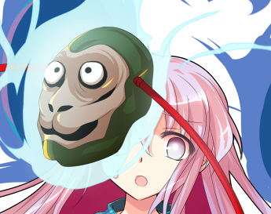

辉夜剪开了包装盒，从中拿出了一叠CD

辉夜：现在来看EVA吧！

这是包括新剧场版4在内的，有史以来最全的EVA合集

首先当然是从最新的剧场版看起！

克劳恩皮丝：哇，这个紫色的家伙看上去真帅......

于是，月兔、妖精与月之公主在房间里看起了EVA

——以下是新剧场版4的剧透（？）——

铃仙：这招是......流派，东方不败！王者之风！

全新系列，天破侠乱，血染东方一片红！

辉夜：居然是用全EVA一齐合体来达成人类间的相互理解，有一套啊

克劳恩皮丝：哦哦哦哦哦哦哦！

是EVANGELION PUNCH！

（彩蛋剧情结束）

由吧友 @望远镜300  制作的视频第20集更新啦！

本期的内容是万宝锤异变的EX篇，大家有兴趣的话就去看看吧！

吧友侠极八打与whyssrs正在尝试以本贴的剧情改编gal，目前他们建了一个交流群，感兴趣的吧友们可以去看一下

群号 188 012 280

由于明天很想更新，因此明天更新

大概早上八点半左右，具体看我什么时候能起床

顺便明天中午有点事因此明天可能要分两次更新了

准备一下图片，五分钟后更新

~第355天~

~永远亭~

月之头脑正站在黑板前指导着她的弟子

永琳：连续补习了一个多月，现在你的天文密葬法终于算是能够用于实战了

按照我的估计……

稍微做点准备，你就可以去挑战风见幽香了

烈：……

永琳：怎么了？

为什么要低着头不说话？

烈：永琳

过几天跟我打一场吧

永琳：——我跟你说过吧

输了就会死的

烈：我知道

但就像你说的一样，我还是不够成熟

我……没有将这场战斗继续拖延下去的耐力了

武术家从座位上起身，站在了恋人的身前

烈：我还需要调整一下自身的状态，顺便也做些准备

定在十天之后可以吗？

永琳的理解【1d50：15+50=65】（75以上了解烈的真意，月之头脑+50，相互理解+50，唐突的约战-50）

永琳：你到底在想什么呢？

我已经说过了吧，我完全不着急

烈：永琳，我理解你

但我自己已经无法等待了

可以请你……容许我的任性吗？

永琳：——这么想死的话我就成全你啊

烈：那真是多谢你了！

烈海王背对着八意永琳，默默离开了永远亭

10天后

~第365天~

烈海王现在在哪？【1d10:7】

1 永远亭

2 魔法之森

3 地灵殿

4 旧地狱

5 红魔馆

6 命莲寺

7 神灵庙

8 辉针城

9 地狱（为啥啦）

10 大成功/大失败【1d2：2】

~神灵庙~

烈海王正在神庙之中进行着日常的锻炼

而面灵气与圣人则在旁边谈论着有关于他的话题

秦心：烈海王怎么还不走啊？

他都来住了十天了哎！

神子：宽容一点嘛~人家好歹还帮忙做了十天饭呢

我哪怕塞住耳朵都能知道这家伙现在有心事

好歹都认识一整年了，能帮忙就帮帮忙吧

秦心：一整年？

他才来幻想乡一年吗？

神子：呵呵，确实

感觉已经很久了，其实到了今天才刚好一年呢

就在此时，武者结束了今早的训练

圣德太子拍了拍秦心的头，粉发的少女便面无表情的离去了

烈：神子殿下，真是感谢您这十天以来的收留

刚刚离开永远亭的时候我都不知道该去哪了……

神子：小事一桩，神灵庙里还不缺这一间空屋子

现在跟我说说吧，你到底是遇见什么事了？

烈的说明【1d100：55】（50以上理解）

烈海王对着神子说明了他自接下皮克的委托开始，一直到离开永远亭为止的故事

他的语速仍然十分急促，说话时甚至总想不自觉的挥拳——

不过，他总算是坚持着说完了

神子的震惊【1d70：27+30=57】（烈的经历+30）

神子：烈海王，你是真的有种啊！

这种事你都干得出来？！

烈：毕竟我那时真的不能后退了——

神子：不不不，我不是说这个

虽说花之暴君的攻势确实很凶猛……

但你之后对月之民的那个诡异到极点的求婚是怎么回事？

烈的理由是【1d10:4】

1 求死

2 不得不做

3 当时头脑坏掉了（别啊）

4 求死

5 不得不做

6 只是开玩笑的（你搞什么？！）……

7 求死

8 不得不做

9 我无所谓（为啥啦）

10 大成功/大失败【1d2：2】

烈：我那时其实......只是想死而已

神子：麻烦从我能听懂的部分开始说明

烈海王挠了挠头

烈：简单来说就是，我失败了

无论是做人还是恋爱方面都是，输的一塌涂地

神子的理解【1d70：47+30=77】（圣德太子+30,75以上理解）

神子：——你想说的是爱上四季鲜花之主的事情？

烈：没错

那个时候我已经察觉到了，幽香她喜欢我

所以面对她的约会邀请，我应当想个办法拒绝

哪怕是逃跑，甚至恶语相向

神子：啊啊，我完全理解了

你的心在风见幽香面前认输了

烈：正是如此

我就这么毫无抵抗的接受了她的邀请……因为我自己在那个时候就爱上了她

可是，我明明已经爱上永琳了

这是我的大失败

无论从哪个方面看，这都是我的大失败

神子拍了拍烈的肩膀

神子：我觉得你把这事情看得太复杂了

脚踏两只船而已，以我那时的标准连道德败坏都算不上，更别提以幻想乡的标准来看了

烈：但我自己被比谁都清楚，这是不对的！

坦白的说，我从前面对魔理沙的时候，心中一直隐隐约约有种优越感

因为我自认是个正直的人物，所以我有资格瞧不起那些不负责任的人——

可当我自己处于这个场合的时候，我却发现自己居然什么都做不了！

武者痛苦的抱住了脑袋

烈：我可以压抑自己的欲望，但我根本没有办法违背自己的心！

已经无数次扪心自问过，应该快些做个了断，不能这么恬不知耻的僵持下去

但最后我唯一得到的答案居然是，我爱着永琳却也爱着幽香！

神子：这发言可不适合你

解决异变和战斗时都毫无迷茫的烈海王面对恋爱却束手无测了……

烈：我没有办法了

我已经做出了那样的事，便必须负起责任来向幽香求婚

但就和以前一样，我又无颜面对永琳了

因此，我向她求婚了

神子的理解【1d70：28+30=58】（75以上理解）

神子：开始无法理解了

因为同时爱着两个人，因此也要同时对这两个人求婚吗？

烈：在那个时候，我——想要做出决断了

犹豫不决的烈海王早已无能为力，那么就把所有的一切都告诉永琳

永琳是个很保守的人……我想，她一定会很生气的

她会把我赶出去吧

她会把我打倒濒死吧

她会直接杀掉我吧？

这样一来就结束了……

神子：打算在一切结束之前，至少最后一次表明自己的心意啊......

但是你看上去却毫发无伤

烈：因为她并不生气！

为什么她不生气啊？！

她甚至没有责怪我一句话……

她只是跟我说等到十一年后再结婚——那么我该怎么办啊？！

这个从未胜利过的男人，终于哭了出来

烈：我永远无法理解她们的想法，我永远无法拒绝她们的请求

她们可以把恋爱拖得很远很远……

她们可以等到数十年之后，甚至上百年之后再慢慢解决问题

但我怎么能够在这种状态下再僵持十一年？！

我必须要为我的感情做一个了断！

神子：所以，要去决斗？

要去和谁决斗？

烈：和两个人决斗

我是一个爱上她们的卑鄙者

但我不想再这么夹在中间随波漂流……

不管是赢是输——至少，我不会再后悔了！

烈海王要做什么？【1d10：1】

1 挑战八意永琳

2 挑战风见幽香

3 留遗书

4 挑战八意永琳

5 挑战风见幽香

6 先去拜访朋友吧（为啥啦）

7 挑战八意永琳

8 挑战风见幽香

9 最后再锻炼一次吧（已经准备十天了哎？）

10 大成功/大失败【1d2：1】

烈：神子殿下

谢谢您为我提供了居所

谢谢您愿意听我说这些废话

我去挑战师匠了！

神子：介意我们去旁观吗？

只是单纯的想看看结局，绝对不会插手的

烈的无所谓【1d50：40+50=90】（75以上同意）

烈：我无所谓！

正如他来到幻想乡的第一天一样

武术家在圣人的目光中离开了神灵庙，前往了永远亭

~神灵庙~

丰聪耳神子拿出了一个通讯用的佛珠

神子：圣，要去看恋人间的打架吗？

白莲：会有人不想去看吗？

注意到了

无需神子的通讯，幻想乡的强者们也自然而然的感觉到

那两个人要打架了——

来得及

来得及

现在的话还来得及

从神社里，从城堡中，从森林里，从旧地狱的街道上，心痒难耐的人与妖怪们走了出来……

永远亭在此刻，成为了大家关注的焦点！

~永远亭~

先一步到达的妖怪们正站在竹林之中静静等待着战斗的开始

铃仙：师匠，来了好多人

我先把她们请出去吧？

永琳：无所谓

反正那个小心谨慎的妖怪贤者必然要在一旁监视着才能安下心来

辉夜：永琳，我会在一旁看着的

放心吧，没有人能够干扰你们的决斗

战斗！

BGM：千年幻想乡　～ Historyof the Moon

烈海王

Atk：265（134）

Hp：19（18）

技能

长期准备：为了今日的战斗准备已久，本日的战斗中Atk+11，本日的第一场战斗中破解判定所需成功值-15

烈 海 王：超越海皇，仍为海王。AtkX1.9，Hp+1。不会陷入异常状态，不会受到驻足，束缚等判定影响，面对所有技能都可以进行【1d100】的破解判定，60以上成功

完全消力： 普通攻击以及近战系、弹幕系技能所造成的的最终伤害/2（仅对Atk260以下的对手起效）自身所收到的普通攻击伤害-1，近战系、弹幕系技能伤害-2（仅对Atk261以上的对手起效）

红符【巨阙】（CT3）：（近战系）以超人术力与宇宙魔力凝结自身血液铸为无坚不摧的巨剑，本回合Hp-2，Atk+80，给予伤害+4

Flower star（CT4）：（弹幕系）对对手放出带有神秘力量的星形花弹，造成必中的【2+1d6】点伤害。

假腿【The World】:一天一次，使用假腿中的力量进行一次超快速移动。本回合战斗自动胜利且造成的伤害必中/本回合Hp不会归0。（对战斗力低于160的对手使用的情况下直接判定战斗结束，胜者烈海王）

急救拳：一场战斗中只能使用一次，Hp归0后回复1点Hp

必杀技

纯粹武道（CT5）：怀抱纯粹的武术，心存无色的执着。3T内Atk+70，对对手造成的伤害+3。3T内可对所有攻击进行【1d100】的破解判定，普通攻击与近战系、技巧系技能30以上成功，其余技能40以上成功，必杀技60以上成功

超人烈海王（CT6）：Atk+650，给予伤害X4，之后2T回避概率翻倍

秘术 【天文密葬法】（CT8）：制造虚假的月亮，削弱妖怪的力量，3T内战斗环节中，妖怪对手的Atk变为与自身最终结算后相同，自身的战斗骰变为【2d100】但同时无法进行破解行动。无法回避/破解/防御，给予伤害X2/引导宇宙的力量，发出轨道诡异的大量弹幕轰击 无法回避/破解/防御 Atk+900，给予伤害X6

八意永琳

Atk 290（310）

Hp 4X5 （无限）

技能

月之头脑：Hp无限，免疫异常状态与特殊攻击，自身技能/必杀技的破解/回避/防御判定所需成功值+15

一线生机：无法理解其自寻死路的行为，因此为弟子留下一线生机，Atk-20，被击破五次后败北

天丸【壶中的天地】（CT1）：（弹幕系）一场战斗中只能使用一次，放出无数使魔做出仅针对一人的包围圈，并在圈内外同时放出大量弹幕攻击。对手本回合需进行一次【1d100】的闪避判定，30以下的场合进入圈外，本回合战斗自动失败，31以上的场合进入圈内，本回合Atk-50，受到的伤害+2

神符【天人的族谱】（CT2）：（弹幕系）一场战斗中只能使用一次，以激光做出宛如系谱一般的二叉树，并释放大量弹幕进行攻击。本回合自身无敌，对对手造成【1d5】点伤害

秘药【仙香玉兔】（CT3）：（技巧系）一场战斗中只能使用一次，利用药物使对手产生幻觉，同时使用弹幕在物理意义上禁锢对手。本回合对手无法行动，给予伤害X2

苏生【Rising Game】（CT4）：（弹幕系）一场战斗中只能使用一次，构建弹幕的牢笼，令对手变为笼中之鸟。对对手造成必中的【4+1d6】点伤害，本回合对手无法使用普通攻击

神脑【Omoikane Brain】（CT5）：（弹幕系）一场战斗中只能使用一次，以无限回转的弹幕限制对手的行动。3T内对手Atk-60，每回合受到4点伤害

必杀技

天咒【Apollo 13】（CT6）：弹幕在瞬间之中展开，之后炫目的发光弹幕便会不断袭来。Atk+750，给予伤害X4，3T内对手受伤/攻击的场合不会出现大成功

药符【壶中的大银河】（CT7）：无法回避/破解/防御，比天地的规模更宽广，以月之头脑一人之力所构建的，壶中的微型黑洞。Atk+850，给予伤害X5，伤害判定结束后对手的Hp减半

秘术【天文密葬法】（CT8）：制造虚假的月亮，削弱妖怪的力量，3T内战斗环节中，妖怪对手的Atk变为与自身最终结算后相同，自身的战斗骰变为【3d100】，无法回避/破解/防御，给予伤害X2/引导宇宙的力量，发出轨道诡异的大量弹幕轰击 无法回避/破解/防御 Atk+950，给予伤害X6

【天网蛛网捕蝶之法】：自身被击破五次后发动，？？？

T1

永琳：我记得你在刚来永远亭的时候，我还常常用这招为你做抗压训练呢

现在的你能够战胜它吗？

符卡宣言 天丸【壶中的天地】！

烈的破解【1d100：15】失败

烈的闪避【1d100：81】进入圈内

无数隐形的使魔化为壶壁，将武者包围在了其中

他已经被这一招所殴打过数次……但直到今日，他也没能够成功破解

烈：现在我好歹不会傻乎乎的站在圆圈之外了！

烈的攻击【265-50+1d100：72=287】

差值大于100自动失败

烈的受伤【1d10:8】

1 回避

2 小伤害-1+2

3 小伤害-1+2

4 中伤害-1+2

5 中伤害-1+2

6 大伤害-1+2

7 大伤害-1+2

8 特大伤害-1+2

9 特大伤害-1+2

10 大成功/大失败【1d2：1】

Hp：19-4+1-2=14

仅仅是战斗开始的第一回合，烈就受到了极大的伤害！

神子：怎么看这都不可能赢吧？

白莲：就算那位月之贤者放水了，这也依然是完全没有胜算的战斗

T2

永琳：打倒了几个还算强大的妖怪，就以为自己天下无敌了吗？

烈，你真让我失望

符卡宣言 神符【天人的族谱】

烈的破解【1d100：29】失败

烈的受伤【1d5：4-2=2】

Hp：14-2=12

烈的攻击【265+1d100：97=362】

永琳的攻击【290+1d100：28=318】

（由于无敌效果，永琳本回合不会受到伤害）

烈海王强忍着被激光灼烧的痛楚，突破了月之贤者的封锁

他挥拳击飞了永琳射出的光之矢，正准备乘胜追击时，银发女子身后的赤色大玉便化为了最后一道防线，令其无奈之下退回了原处

烈：真是滴水不漏的放守……

果然，我根本不可能打得过师匠

永琳：那么你为何还要战斗？！

这么想死的话，直接跳进三途河里岂不是更好？！

烈：只是因为我想做个了结，仅此而已！

T3

永琳：头脑已经混乱到这个地步了，那就索性陷入幻觉之中吧

符卡宣言 秘药【仙香玉兔】

烈的破解【1d100：28】失败

月之贤者使用了她所调配的秘药

在那令人意乱神迷的气味之中，武者逐渐迷失了方向……

即使他想要依靠直觉突破弹幕的封锁，最后却连这份余力也已经消失

由于 秘药【仙香玉兔】的效果，烈海王本回合无法行动

烈的受伤【1d10：5】

1 回避

2 小伤害-1

3 小伤害-1

4 中伤害-1

5 中伤害-1

6 大伤害-1

7 大伤害-1

8 特大伤害-1

9 特大伤害-1

10 大成功/大失败【1d2：1】

Hp：12-2+1=11

八意永琳的光之箭在弟子的脸上擦出了一道血痕

永琳：烈，这是最后的警告

之后我不会再留手了！

烈：多谢你了，师匠

还请你全力以赴！

萃香：嘴上说的那么狠，实际上还是在打符卡战

紫：打符卡战对大家都好……

华扇：我可不想看到她在幻想乡内全力出手

T4

永琳：那便让你成为笼中之鼠吧

符卡宣言 苏生【Rising Game】

武者的身旁瞬间出现了极为密集的蓝色小玉，那狭小的空间甚至仅容一人屈身站立，想要战斗更是无稽之谈

此刻的烈海王仿佛变成了实验室中的老鼠

而以月之贤者为中心，数目巨大而又形态各异的赤色弹幕化作了螺旋的生命之海，向着她被囚禁的弟子无情扑去！

烈的破解【1d100：70】成功

烈的受伤：4-2=2（必中伤害4点）

Hp：11-2=9

然而，烈海王却利用那囚笼变化时的短暂空隙，仅仅受到了一点轻伤，便成功突破了八意永琳的封锁！

烈：师匠，你的符卡虽然名字不同，但在我看来却都没什么区别

归根到底，核心思路都是限制对手的行动，将主导权绝对控制在你的手里——

这样的符卡，只要见多几次就能破解！

现在该我攻击了

接招 Flower star！

永琳：——你平时打架的时候就这么跟人家讲话？！

正邪：卧槽

鵺：他还真敢啊......

永琳的受伤【2+1d6：2=4】

Hp：4-4=0

击破一次

烈海王在本次战斗中终于打出了第一次伤害

然而，一瞬之后，银发的女子便又恢复到了完全无伤的状态

烈：跟辉夜小姐以及那个蛤蟆一样……

符卡宣言 红符【巨阙】

Hp：9-2=7

烈的攻击【265+80+1d100：72=417】

差值大于100自动成功

永琳的受伤【1d10：9】

1 回避

2 小伤害+4

3 小伤害+4

4 中伤害+4

5 中伤害+4

6 大伤害+4

7 大伤害+4

8 特大伤害+4

9 特大伤害+4

10 大成功/大失败【1d2：2】

Hp：4-4-4=0

击破两次

永琳：又是血剑又是花弹

全都是乱七八糟的技能，你这一年间到底都学了些什么？！

烈：师匠……

你也没教过啥前期能用的小技巧啊，这一年咱们除了学医学药和天文密葬法以外基本上都在约会和聊天……

永琳：啊这个是教学计划的调整导致的……

不对啦！

说这些干什么，给我认真打架！

烈：明明是你先开始的哦？！

T6

Hp：3-4+2=1（神脑【Omoikane Brain】的效果）

永琳：明明已经修习了超人之术，你却到现在却还残留着短命种的思维方式

把肉体关系看得如此重要，遇到点小事就想着以死了结……

这样是根本无法长生的！

即使不遇到情感问题，你也迟早有一天会把自己逼入绝路！

烈：因为我从出生到现在也只经过了30余年！

你口中那无聊的肉体关系对我而言是极为重要的底线

你渴望的相互理解对我而言却只是单方面的话语！

在你的面前，我除了拼上性命外，又有什么理解你的办法？！

永琳：这么想当短命鬼的话，就接受这自天而降的诅咒吧！

符卡宣言 天咒【Apollo 13】！

红蓝二色的弹幕之环瞬间以永琳为中心构建完成

在月之贤者的诅咒之下，天空之中所有的事物都在此刻再次感受到了重力的束缚

那无限弹幕所构成的圆环逐渐向内收缩——而后自天而降，化作无可阻挡的暴雨，向着地上的武者袭来！

烈的破解【1d100：74】成功

然而，烈海王本就是在地上战斗的武者

接受了这份诅咒之后，战斗反而回到了他最为擅长的领域之中

过于密集的弹幕就用拳击破，无法阻挡的光矢便立刻避开

武术家在这暴雨之中，却是毫发无伤！

烈：永琳，我上次喝多的时候你就已经用过这招了！

符卡宣言 超人【烈海王】！

烈的攻击【265+1d100：8+650+70-60=933】

差值大于100自动成功

永琳的受伤【1d10:9】

1 回避

2 小伤害X4+3

3 小伤害X4+3

4 中伤害X4+3

5 中伤害X4+3

6 大伤害X4+3

7 大伤害X4+3

8 特大伤害X4+3

9 特大伤害X4+3

10 大成功/大失败【1d2：2】

Hp：4-4X4-3=0

击破三次

铃仙：烈先生当时不是光顾着喊救命吗？

他居然记住了？！

皮克：嗷嗷嗷嗷嗷哦啊啊

（对于我们而言，这是本能啊）

T7

Hp：1-4+2=0（神脑【Omoikane Brain】的效果）

烈要使用【1d2：2】

1 急救拳

2 假腿

就在烈海王的攻击刚刚结束时

一只来自于月之贤者的光箭，就这样悄声无息的来到了他的心脏之前

上一次感受到这种气息，是直面纯狐女士的时候

再上一次，是与武藏战斗的时候

已经经历过两次了，所以他很熟悉

这是死亡的滋味

但他还不能就此倒下

因为他还没有说出心中的话语

烈：【The World】！

时间停止吧！

——【The World】——

千钧一发之际，烈海王躲开了这致命的箭矢

他停留在原地，不做任何动作，直到时间再次开始流动

永琳：既然已经用了假腿，那就给我直接攻击过来！

这种半吊子的行动根本称不上什么觉悟，只是你虚情假意的自我满足而已！

烈：你说的没错，但我不想死在这个瞬间

至少要撑到下个回合结束，我才能死！

永琳：你说这个谁懂啊？！

符卡宣言 药符【壶中的大银河】！

如同第一个回合时一样，月之贤者再次于现实中构建了【壶】

只是这一次，存在于壶中的并不是那些微小的米弹，而是仿若黑洞一般的，令人恐惧的弹幕地狱！

烈：（这个时候用巨阙的话我就先死在这里了……必须等到下个回合）

永琳的攻击【290+750+1d100：61=1101】

差值大于100自动成功

烈的受伤【1d10：9】

1 小伤害X3（无法回避）

2 小伤害X3（无法回避）

3 小伤害X5

4 中伤害X5

5 中伤害X5

6 大伤害X5

7 大伤害X5

8 特大伤害X5

9 特大伤害X5

10 大成功/大失败【1d2：1】

Hp：1-5=0

由于药符【壶中的大银河】的效果，Hp减半：0/2=0

烈海王使用了急救拳

Hp：0+1=1

遍体鳞伤的武者跌出了永琳制造的银河

他在濒死之际使用了月之贤者的秘术——

于是，他再一次站了起来

永琳：如果你过上几年学会了复活术再战，都不会变成现在这副狼狈的样子

烈：但几年之后的我，也不会是现在的我了！

T8

超人术回避效果结束

纯粹武道效果结束

烈：希望能够成功——

Flower star 发动

永琳的受伤【2+1d6:2=4】

Hp：4-4=0

四次击破

永琳：又是花弹

最得意的弟子却天天用着别人的技能，我现在真是感受到了自己教育的失败

烈：怎么会呢

一直以来，我最大的依靠都是你啊

符卡宣言 秘术【天文密葬法】

永琳：呵，在我面前用这招……

你觉得会有成功的可能吗？！

符卡宣言 秘术【天文密葬法】！

师徒二人在此刻做出了同样的姿势

一模一样的起手式

一模一样的魔力运作

一模一样的咒文

最后的结果当然是，一模一样的天文密葬法

在这一刻，整个迷途竹林都化为了如同宇宙空间般黯淡无光的密室

烈与永琳所制造的密室在此激烈的碰撞着

使魔与使魔互相厮杀，弹幕与弹幕相互泯灭

但所有人都知道——烈海王不可能成功！

因为仅仅是这数秒间的功夫，他所制造的领域便已经在永琳的攻势下缩小大半了！

烈：这是你最得意的技术

而我才学了不过一年而已，又怎可能触及你的皮毛？

因此——我还是用我最熟悉的战斗方法吧！

符卡宣言 红符【巨阙】！

Hp：1-2=0

烈的攻击【265+900+80+1d100：67=1312】

永琳的攻击【290+950+1d100：55=1295】

武者体内的血液已经不够了

因此他现在所制造出的，只是一把普通的长剑而已

烈海王在此刻完全放弃了天文密葬法的胜负

他仅仅将其作为抵挡攻势的道具——

然后趁着它被击破前那最后的几秒空隙，手持赤色长剑冲向了那银发的女子

烈：武艺百般，此乃剑术！

你尝尝中华武术的厉害吧！

永琳的受伤【1d10:4】

1 小伤害X3+4

2 小伤害X6+4

3 小伤害X6+4

4 中伤害X6+4

5 中伤害X6+4

6 大伤害X6+4

7 大伤害X6+4

8 特大伤害X6+4

9 特大伤害X6+4

10 大成功/大失败【1d2：2】

Hp：4-2X6-4=0

五次击破

这个扎着辫子的武术家即使在幻想乡里过了这么久，也仍旧喜欢用他以前的那套战斗方法

弹幕就用弹幕来阻挡，最后的决胜技果然还是要用近身战

所以，他就这么拖着破破烂烂的身体冲到了永琳的面前

在他所营造的密室被击破的同时，他也将手中的长剑高高举起——

然后，发出了自己此生最后的攻击

妖梦：烈海王赢了吗？

芙兰朵露：不……那是我所教授的自残技能

在他用出红符的时候，他就已经无法胜利了

魔理沙：但是永琳也已经被击破了吧？

咲夜：我记得上次灵梦和紫就击破了她五次……

灵梦：她还有张符卡没用呢

那可是过分到极点的，我完全不想再看一次的招数

上一次的我们硬生生被逼成了平局，但这一次……

这一场该怎么处理啊？

武者沉默的站在了恋人身前

永琳：呼……到了最后用的居然还是武术，你这个顽固的家伙

按照规则来说你确实赢了……

但是，也到此为止了

符卡宣言 【天网蛛网捕蝶之法】

【天网蛛网捕蝶之法】：无法回避/破解/防御，3T内对手无法行动，每回合受到【3d3】点伤害

BGM：东方妖怪小町

月之贤者使用了她最后的秘术

黑暗的天文密室中突然变得明亮起来

因为银白色的激光出现在了银发女子的手中

于是，世间无人能够逃脱的，闪光的蜘蛛网浮现在天地之间

烈海王的行动自由被完全剥夺了

哪怕是眨眼这样微小的活动都会碰撞到激光网上而引起自身的灭亡

他不可能做出任何举动，只能在这天网之中等待着死亡的降临

但武者却只是露出了笑容

烈：永琳……真没想到我会说出这句话

你这个迟钝的家伙，我早就已经输了啊

武者手中的长剑变为粘稠的鲜血洒落在了地上

在这回合的战斗开始之前，在他使用红符的时候，烈海王就已经耗尽了他身躯内部所有的生命力

现在的他，已经没有办法将血液收回身体了

永琳：你——

这个顽固的男人丝毫不在乎那些致命的激光

他向前迈出一步，身上便出现了无数深可见骨的伤痕

但他没有停止自己的动作

武术家就这么鲜血淋漓的，抱住了眼前的恋人

烈：我无所谓

战斗是赢是输，死后会去到何方……

这些事情，我统统无所谓

我只是想借这个机会尝试拥抱你……

因为你看，平常的时候你肯定不会同意的

永琳：——就为了这个？

烈：不，我还想对你说些话

对不起，永琳，我是一个卑鄙无耻的人

我爱上了幽香

但我也爱你

格斗家在他生命的最后一刻，对着怀中的女子露出了微笑

随后，烈海王便停止了呼吸

战斗结束

平局 无人胜利

烈海王 死亡

圣人走到了月之头脑的身旁

神子：我听他的说法是，只要输了就去死

但是现在两方的Hp都归零之后，按规则来看可是平局啊……

不过烈海王也确实是死了

这该怎么处理？

永琳要做什么？【1d10:3】

1 因为是平局所以不许死

2 还有最后一张符卡没过所以去死吧（地狱道堂堂连载）

3 机械烈海王（为啥啦）

4 因为是平局所以不许死

5 还有最后一张符卡没过所以去死吧（地狱道堂堂连载）

6 麻薯烈海王（那是什么）

7 因为是平局所以不许死

8 还有最后一张符卡没过所以去死吧（地狱道堂堂连载）

9 魂飞魄散吧！（赫卡提亚救命啊）

10 大成功/大失败【1d2：2】

永琳：——没有输的话就没有理由让这个笨蛋去死啊！

优昙华，帮我准备手术台！

铃仙：师匠，可是……现在这样子根本就没法救……

永琳：没有办法保留人类躯体就用机械化改造！

哪怕把内脏全部换成维生装置……我也一定要让他活过来！

铃仙：明白了！

永远亭的众人推着急救车回去了

而外界围观的众人则面面相觑

白莲：烈先生以后会变成什么样子啊？

早苗：说不定会变成浑身钢铁的机器人？

恋恋：听起来好像还蛮帅气的……

之后他还要打吗？

神子：他说是之后还要继续挑战风见幽香

我今天是准备观战到底了，你们呢？

观众的热情程度【1d100：81】

早苗：这可没理由不看下去吧？！

你知道的，那可是那个风见幽香啊！

天子：我很期待啊！

想必会是仅稍逊于我前几天那场的精彩战斗！

觉：我觉得场面会变得很血腥……这对恋恋的教育可不好

魔理沙：你家妹妹早就已经长歪了，这还教育个屁啊

急救持续了【1d6：2】个小时（时间越长机械化程度越高）

仅持续了2小时，烈的改造手术如何？【1d10:7】

1 月球合金制骨骼

2 人工心脏

3 机械化假腿（为啥啦）

4 月球合金制骨骼

5 人工心脏

6 月球合金胃（这啥啊）

7 月球合金制骨骼

8 人工心脏

9 合金头骨（哈？）

10 大成功/大失败【1d2：1】

~医务室~

烈海王在病床上睁开了双眼

他第一眼看到的，是坐在床边的八意永琳

烈的迷惑【1d100：64】

烈：永琳？

这是……天堂的幻觉吗？

还是说我又来到了平行世界的幻想乡？

永琳：唉，你这个笨蛋

只是你伤好了而已啦

烈：——我明明已经死了啊？！

永琳：永远亭的血液储备还够，所以就给你换了血

大部分破损的内脏都是可以再生的，但是骨骼已经全部被我打碎了……所以就给你换了一身合金骨骼

把灵魂固定之后，最后再用一次复活术，这样一来就算是死人也照样可以救活啦

烈：这什么诡异的医术啊？！

不不不，我说的是我输了之后应该要死的——

银发的女子托着脸移开了视线

永琳：我特地去问了灵梦，她说双方Hp归零的场合按规则算平局

这样一来就没理由杀你了

烈的情商【1d90：86+10=96大成功】

这个时间点的大成功是什么！【1d10：4】

1 终于和解了（恋爱战结束）

2 kiss

3 他们都无所谓（这是什么）

4 终于和解了（恋爱战结束）

5 kiss

6 其实幽香一直在看（好恐怖）

7 终于和解了（恋爱战结束）

8 kiss

9 答应求婚了（为啥啦）

10 大成功/大失败【1d2：2】

烈：此后这份【战争】还会继续吧……但无论如何——

武者突然感觉背上一沉

他意识到，这一次是永琳抱住了他

永琳：没有什么战争了！

做手术的时候我一直在想，万一救不回来我该怎么办

万一手术失败了，我就是在单方面违约的情况下杀害掉自己的爱人了……

看到你死了之后我才发现，我早就已经不在乎这些东西了！

他的感觉肩膀上有些温热的液体

是下雨了吗？但现在还在屋子里啊……

他回过头之后才发现，原来是永琳哭了

于是，他反身抱住了自己的恋人与师匠

烈：永琳

我爱你

永琳：笨蛋

我也一直爱你啊

【1d20：3】分钟后

烈：那……我去挑战幽香了

师匠：加油！

一定要输啊！

烈：反了吧？！

师匠：为了我好吗，在太阳花田打假赛吧！

烈的无所谓【1d50：7+50=57】（100时同意）

烈：师匠，这个不能说无所谓的！

师匠：真遗憾……

既然要去打架……那就全力以赴的干掉她吧！

——————————————————————

烈海王获得了月球合金骨骼！

Hp+1！

——————————————————————

