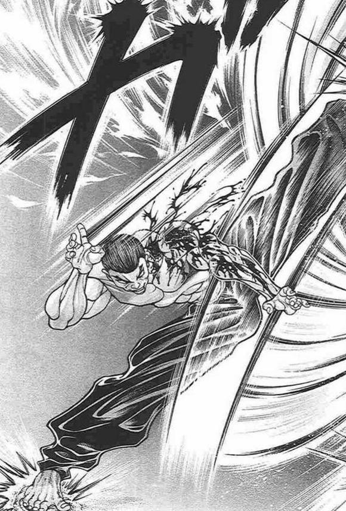
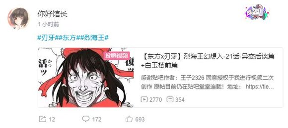

烈海王推开了医务室的大门

然后，他就看见了外面一大群正喝着酒磕着瓜子的吃瓜群众

赫卡提亚：活过来了~恭喜你啊！

我都在地狱帮你留好位置了，真可惜~

勇仪：咦？

你这机械化改造怎么没啥变化啊？

早苗：为什么不是超级机器人？

恋恋：为什么头上没有长角？

魔理沙：为什么还是人样啊？

烈的震惊【1d100：93】

烈：——怎么这么多人啊！！！！！！！

文文：毕竟这可算是除异变之外数一数二的大新闻了~

话说你接下来是要去太阳花田吧？

正邪：真是怕死的家伙，那可是那个风见幽香啊！

针妙丸：加油啊！被打死的话我们会帮忙把你抬回来的！

天子：你帮不上什么忙吧，抬人这事

于是，烈海王在一众看热闹不嫌事大的妖怪们那兴高采烈的呼声中走向了太阳花田

~太阳花田~

今日的太阳花田仍然平静如常

地狱妖精此时正在向花田之主报告着上午的情况

克劳恩皮丝的说明【1d100：35】（50以上理解）

克劳恩皮丝：——天突然黑了，好多弹幕砸过来砸过去，然后他拿着剑冲过去，抱紧了那个月之民就断气了！

之后连续做了两个小时手术，然后变成了机械笨蛋花心肌肉疯子朋友大人！

幽香：唉，皮丝也变成不会说话的孩子了

总之人没事就好……那么我也该做些准备了

皮丝：？

要去准备必杀技吗？还是新的符卡？

幽香：想什么呢~

这身裙子太碍事了，只是去换身衣服而已

【1d30：27】分钟后，烈海王来到了永远亭

而那位大妖怪正一如既往的坐在桌前看着报纸

只不过，她今天换了身衣服

今天的幽香系着黄色的领结，身穿白色衬衣与红色格子马甲，以及同样是红色格子的裤子

她的阳伞正摆在椅子之后，而她的瞳孔不知为何变成绿色了

烈的察觉【1d70：28+30=58】（50以上察觉外貌变化）

烈：？

幽香你今天怎么改穿裤子了……而且眼睛为什么变绿了？

绿色瞳孔的原因是【1d10:8】

1 是美瞳

2 打架时眼睛会变色

3 是花之魔力的影响（那是啥）

4 是美瞳

5 打架时眼睛会变色

6 是因为昨晚熬夜了（为啥啦）

7 是美瞳

8 打架时眼睛会变色

9 是第二人格（突然出现的崭新设定？！）

10 大成功/大失败【1d2：1】

幽香：我想打架的时候，眼睛就会变成绿色哦~

长裙在战斗时太碍事了，所以就改穿裤子了

（注：此处为我私心想用旧作立绘所以胡掰瞎扯的理由，请大家绝对不要当真）

烈：这还真稀奇

话说你知道我是来打架的啊？

幽香：大半个幻想乡的人都在那里喊“烈海王跟风见幽香要打架了”，想不知道都难吧

做好觉悟了？

你大可放心，就算输了我也不会干掉你的……大概吧

烈：别加最后那三个字好吗？！

永远亭 烈海王 请指教！

幽香：我是活的过于长久的大妖怪，喜欢欺负人的风见幽香

上次全力战斗还是跟地藏打架的时候——希望这次能让我打的尽兴！

T1

烈的攻击【265+1d100：95=360】

幽香的Atk变为【280+1d3：3=283】

幽香：刚开场就全力以赴，真是心急

那么我也相应的回报你吧❤

开场的欢迎仪式发动

烈的破解【1d100:57】失败

幽香的攻击【283+100+1d100：21=404】

烈的受伤【1d10：5】

1 回避

2 小伤害X2-1

3 小伤害X2-1

4 中伤害X2-1

5 中伤害X2-1

6 大伤害X2-1

7 大伤害X2-1

8 特大伤害X2-1

9 特大伤害X2-1

10 大成功/大失败【1d2：2】

Hp：20-2X2+1=17

烈海王在战斗开始的瞬间，就以全力的崩拳向着大妖怪打去

而绿发的少女则将足以蒸发小山的魔力凝聚在了手中

她不闪不避，正正一拳轰向烈的面门

只听一声巨震，武者便被一拳打入了地面之中！

烈：我还以为会是魔炮……

幽香：刚开场就用魔炮多暴力啊

用拳头不好吗？

T2

烈的攻击【265+1d100：4=269】

幽香的Atk变为【283+1d3：3=286】

差值大于100自动失败

烈海王尚未从地上起身，幽香便将腿高高抬起——然后，重重一脚踢了下去！

烈的受伤【1d10:1】

1 回避

2 小伤害-1

3 小伤害-1

4 中伤害-1

5 中伤害-1

6 大伤害-1

7 大伤害-1

8 特大伤害-1

9 特大伤害-1

10 大成功/大失败【1d2：2】

在攻击命中的前一秒，武者在地面上狼狈的打了个滚，从而躲过了幽香的踢击

幽香：穿裤子的好处就是可以随意用腿战斗

不过真可惜，打偏了

烈：真是一刻都不能大意……

咲夜：美铃，那招打中的话……

红美铃：起码骨折，踩中要害就当场完蛋

T3

幽香：接下来是你最熟悉的花弹

我觉得小技能这东西还是别太注重威力比较好，你魔改的版本有些背弃初衷了

烈的破解【1d100：31】失败

烈的受伤【3+1d4：3=6-2=4】

Hp：17-4=13

烈海王硬接下了大部分花弹，随后吐了口血

烈：咳咳……这可不算什么小威力的招式

现在该我反击了

符卡宣言 红符【巨阙】！

Hp：13-2=11

烈的攻击【265+80+1d100：68=413】

幽香的Atk变为【286+1d3：3=289】

差值大于100自动成功

幽香的受伤【1d10：5】

1 回避

2 小伤害+4

3 小伤害+4

4 中伤害+4

5 中伤害+4

6 大伤害+4

7 大伤害+4

8 特大伤害+4

9 特大伤害+4

10 大成功/大失败【1d2：2】

Hp：24-2-4=18

Hp：18+1=19

武者以血剑做出的攻击被大妖怪尽数承受了

但少女的脸上反而却露出了笑容

幽香：真好！

来，继续

让我看看你的力量吧！

烈：为什么……为什么你会这么高兴？

灵梦：真是熟悉的表情……

魔理沙：啧啧，和几年前那次一模一样

烈：然后——这是学自于你的护身之术！

接招 Flower star！

幽香的受伤【2+1d6：3=5】

Hp：20-5=15

烈的攻击【265+1d100;69=334】

幽香的Atk变为【289+1d3：3=292】

幽香的攻击【292+1d100：43=335】

武者与妖怪的双腿同时相击在了一处

幽香：可惜

是我更胜一筹！

烈的受伤【1d10：2】

1 回避

2 小伤害-1

3 小伤害-1

4 中伤害-1

5 中伤害-1

6 大伤害-1

7 大伤害-1

8 特大伤害-1

9 特大伤害-1

10 大成功/大失败【1d2：2】

Hp：11+1-1=11

烈：这里就用消力消去！

幽香：太棒了

要坚持住啊！

T5

Hp：15+1=16

烈：幽香……为什么，你在自己陷入劣势的时候反而会高兴呢？

幽香：没什么，只是我个人的兴趣而已~

符卡宣言 花符【幻想乡的开花】

纯粹武道发动

烈的破解【1d100：88】成功

风见幽香微笑着放出了如同开花一般的弹幕

而专注于武道的武者，则毫不留情的以肉身将其完全击破！

烈：请别在这个时候糊弄我！

幽香的Atk变为【292+1d3：1=293】

烈的攻击【265+70+1d100：94=429】

幽香的攻击【293+55+1d100：27=375】

幽香的受伤【1d10：5】

1 回避

2 小伤害+3

3 小伤害+3

4 中伤害+3

5 中伤害+3

6 大伤害+3

7 大伤害+3

8 特大伤害+3

9 特大伤害+3

10 大成功/大失败【1d2：2】

Hp：16-2-3=11

风见幽香毫不在意的正面接下了武者的攻击

幽香：你想知道原因吗？

那我就告诉你吧

对我来讲……太强，也是一种困扰啊！

T6

Hp：11+1=12

幽香：那么，继续我们的战斗

别死了，烈海王！

Flower shooting发动

魔炮发动

烈：当然，我绝不会死在这里的！

符卡宣言 红符【巨阙】

符卡宣言 超人【烈海王】！

Hp：11-2=9

烈的破解 花弹【1d100：57】成功

魔炮【1d100：10】失败

烈的受伤：3-2=1（必中伤害3点）

Hp：9-1=8

幽香的Atk变为【293+1d3：2=295】

花田的暴君举起了她的阳伞

伞尖之上汇聚着令人闻之色变的魔力

这份庞大的力量在风见幽香的控制下被压缩到了极致后，最终在一瞬间爆发而出，化为了一道巨大且明亮的，贯穿天地之间的光柱——那便是她最具有代表性的必杀技 魔炮！

而烈海王则默默运转着那习自圣白莲的超人之术，于此时短暂化为了超脱常人的无敌之身

他手持血剑一跃而出，毫不犹豫的扑向了面前那那无可阻挡的魔力洪流！

白莲：烈先生他确实有一直好好修行呢

现在看到这个场面，有种很欣慰的感觉

神子：说起来倒也好笑，你那一寺庙的妖怪弟子居然没有一个会你自己的招式

唯一得了真传的是偶然遇到的武术家……这也算是缘分吧

烈的攻击【265+70+650+80+1d100：16=1081】

幽香的攻击【295+750+55+1d100：14=1114】

烈的受伤【1d10：2】

1 回避

2 回避

3 小伤害X5+3-1

4 中伤害X5+3-1

5 中伤害X5+3-1

6 大伤害X5+3-1

7 大伤害X5+3-1

8 特大伤害X5+3-1

9 特大伤害X5+3-1

10 大成功/大失败【1d2：1】

（由于回避了伤害，因此不进行Hp减半判定）

双方的交手仅在一瞬之间就分出了胜负

察觉到自身不敌的烈海王迅速调整了战略，从而险之又险的躲过了幽香的炮击

但幽香的脸上却无丝毫不满

她只是开心的笑着，为对手的成功而感到欣喜

烈：你又在笑了，幽香

幽香：这不是很好吗

我已经好久……好久没有打过，这样心情愉悦的战斗了！

T7

Hp：12+1=13

幽香：月有丛云 花有风

符卡宣言 幻想【花鸟风月，哮风弄月】

幽香的Atk【295+1d3：1=296】

幽香的攻击【296+55+825+1d100：26=1202】

烈的攻击：差值大于100自动失败

烈的受伤【1d10：1】

1 小伤害X3+3-1（无法回避）

2 小伤害X3+3-1（无法回避）

3 小伤害X6+3-1

4 中伤害X6+3-1

5 中伤害X6+3-1

6 大伤害X6+3-1

7 大伤害X6+3-1

8 特大伤害X6+3-1

9 特大伤害X6+3-1

10 大成功/大失败【1d2：1】

Hp：8-1X3+1-3=3

毫无反制手段的烈海王，此刻被幽香那宛如开花般的弹幕所击倒了

但他却并不在意自身的伤势，只是思考着幽香的行为

烈的推理【1d70：43+30=73】（50以上理解）

烈海王的脑海中，浮现着他与风见幽香结识后的一幕幕画面

他刚刚来到花田送甜品的时候

他接到八云紫委托而前来说明的时候

他与幽香一同喝酒的时候

在萤火虫的光芒之下，一同观赏演唱会的时候

在三途河的岸边，听她讲述过去的经历的时候……

每一次都感觉到有些奇怪

每一次都觉得幽香似乎想说些什么

而到了今天，他才终于明白过来

烈：幽香……

你一直都，很孤独吧？

幽香：灵梦和魔理沙认识的人多了，也就不再来花田了

过去曾有个奇怪的毒人偶，之后也不知道去哪了

这些年来——你是第一个，在初次见面之后，还会继续前来与我交流的存在啊

武术家理解了

过于强大的实力使得弱小之人不愿接近

极其好战的性格又使得强大的妖怪们也想要远离

而过去的好友，现在也已经有了自己的新生活

这个孤僻而强大的妖怪就这样一天天窝在自己的家中，百无聊赖而又毫无意义的收集着幻想乡中的情报

直到一年之前，有个呆头愣脑的武者跑来想借一朵鲜花

于是，她的生活便因此而改变了

T8

Hp：13+1=14

幽香：所以我很高兴

我很高兴你也爱我，我很高兴你愿意与我战斗

因此——我会为此而全力以赴！

双重超阔激光发动

幻想春花发动

烈：抱歉，幽香

我直到现在才终于理解了你的孤独

从今往后——不会让你再继续孤单下去了！

符卡宣言 秘术【天文密葬法】！

Flowe star发动

幽香的受伤【2+1d6:5=7】

Hp：14-7=7

烈的破解 幻想春花【1d100：1】失败

烈要使用【1d2：1】

1 虚假之月

2 弹幕轰击

风见幽香打了个响指，自虚空之中便浮现出了另外一个幽香

她们同时凝聚着巨大的魔力，双倍的魔炮即将在下一刻降临——

而就在这时，她头顶的月亮已然变为了虚假的存在

大妖怪在瞬间便失去了力量的来源！

幽香的Atk变为【296+1d3：2=298】

烈的察觉【1d70：32+30=62】察觉真身

烈海王绕过了幽香那显得有些稀薄的分身，来到了她本体的面前

幽香：真头痛

这样一来就没法用魔炮了

烈：我也一样，维持着这份月光就没有余力去破解招式了

幽香：这样的话——

来互相殴打吗？

烈：当然

这是我最擅长的交流方式了！

武者与大妖怪相视而笑

然后，毫无任何技术可言的，纯粹的相互殴打开始了

烈的攻击【265+2d100：138=403】

幽香的攻击【265+1d100：99=364】

幽香的受伤【1d10：2】

1 回避

2 小伤害X2

3 小伤害X2

4 中伤害X2

5 中伤害X2

6 大伤害X2

7 大伤害X2

8 特大伤害X2

9 特大伤害X2

10 大成功/大失败【1d2：2】

Hp：7-1X2=5

——摘自《文文。新闻》特刊《幻想乡的恋爱战》——

受访者 守矢神社巫女 东风谷早苗

早苗：殴打这种行为，一般来说是单向的

取得绝对优势的一方，依靠自身的力量攻击对手，我们将这种战斗称之为殴打

早苗：但是，那两个人不一样

他们放弃了对自己身体的防护……

双方的攻击同时毫无保留的打在了无防备的对手的身上

所以，这种行为也可以称之为殴打

早苗：？？？

你说……他们为什么要这样做？

早苗：这个嘛

只是单纯的，想要拉近彼此的距离而已

格斗家和大妖怪都是这样的家伙

不将拳头拼命打出去的话——就没有办法，表达自己的心意啊❤

T9

幽香的Hp：5+1=6

烈：符卡宣言 红符【巨阙】！

Hp：3-2=1

这对相亲相爱的恋人，就这样毫不留情的攻击着彼此

烈的血剑破开了幽香的攻击——

Flower shooting 发动

烈的受伤【3+1d4：4-2=5】

Hp：1-5=0

但大妖怪立刻抓住了这个机会，在最近的距离之下发动了花弹

幽香的护身术将烈重重打倒在地

烈海王使用了急救拳

Hp：0+1=1

武者收回拳头，对着自己的胸口重重击下

于是他再一次从地上爬了起来，重新站在了风见幽香的身前

他们的身上都沾满了血

无论是武者还是妖怪，都早已遍体鳞伤

但是——

在笑着

无论是场中的两人，还是旁观的观众们

在场的所有人都发出了畅快的笑声

烈：——来吧，幽香！

幽香：——最后一击了！

烈的攻击【265+80+2d100：171=516】

幽香的攻击【265+80+1d100:80=425】

幽香的受伤【1d10：6】

1 回避

2 小伤害X2+4

3 小伤害X2+4

4 中伤害X2+4

5 中伤害X2+4

6 大伤害X2+4

7 大伤害X2+4

8 特大伤害X2+4

9 特大伤害X2+4

10 大成功/大失败【1d2：1】

Hp：5-3X2-4=0

已经没有魔力将血液铸为巨剑了

那就将他化为手上的护具吧

就像当年打拳击的时候一样——

两个人的拳头，同时击中了彼此的脸

最终

无敌的风见幽香倒下了

战斗结束

胜者 烈海王

“啪，啪，啪”

头戴耳机的圣人，首先鼓起了掌

而后——

“赢了！”

“做到了！！”

“简直像做梦一样！！！”

在场的所有观众，都为这一对恋人献上了掌声与欢呼！

而在太阳花田的中央，大妖怪倒在了武者的怀里

幽香：这一次打的很开心啊……

对不起哦，让你看到我这副粗暴的样子

烈：说什么傻话

我也很开心

幽香，以后想要打架的话就直接跟我说吧

就像我之前说过的一样——我会，一辈子都奉陪到底的

幽香：真是的……这样一来就没办法了

今后就拜托你了

爱你哦

烈：啊啊

我爱你

于是，在皎洁的月光下，在众人的欢呼声中，两人紧紧相拥

旁观的月之头脑叹了口气

永琳：算了算了

不也挺好的吗！

~第365天结束~

（本日的更新结束，下一次的更新大概在周四）

（以下是我的废话）

哦哦哦哦哦哦哦哦哦哦哦哦哦哦

终于把最麻烦的这一块搞定了！！！！！！！！！

没有胃疼的世界完成了！！！！！！！！！！！！！

果然还是打架写起来顺手

一到打架的时候怎么写怎么顺，恋爱情节就别扭的不行，果然我就是不会写恋爱

本日最猛的骰子是情商大成功，正正好好选出了最好的选项

这个时间点的大成功把最难办的永琳搞定了，那这个该死的恋爱战就终于能够完结了

至于第二场战斗是赢是输说实话影响不大，因为幽香不会下死手（笑）

永琳打完第一场就已经看开了所以那句发言完全只是我想玩个梗而已，大家不要自己吓唬自己啊（笑）

于是之后我们终于可以回归到轻松愉快的日常喜剧了

恋爱道第一季堂堂完结！异变道堂堂连载！除非之后日常/原创活动抽到皮克否则不可能胃疼下去了哈哈哈哈哈哈哈哈哈

那么本次的更新结束，下一次的更新应该在周四或周五

骰子监督这回终于温柔了一次，谢谢你（泣）

顺便最后一句话只是我想玩个梗而已（但为什么你们都知道啊）

并没有迫害师匠的意思（真的真的没有，只是觉得这句话很有意思而已）

因为本次剧情结束后大家都已经看开了，用GAL打比方的话就是进翅膀线路了

打个比方的话就是

师匠战失败 视情况进单线或死亡结局或完结

幽香战失败 视情况进单线但不会完结

两场全胜 翅膀

所以幸亏烈打赢了......幸亏没在关键点出大失败不然这贴就真要堂堂完结了

附上本次的骰子

顺便一提，按道理来说烈这次打完还得加强，但我昨天冲刺骰剧情到现在已经编不动了，所以就之后再补上吧（悲）

由吧友 @望远镜300  制作的视频第21集更新啦！

本期的内容是异变彩蛋和白玉楼预告，吧友们感兴趣的话就去看看吧！

~彩蛋~

~多谢你手下留情~

~师匠的医务室~

烈：永琳，你平常在打符卡战的时候，一般能够无条件恢复几次啊？

永琳的余地是【5+1d3：1=6】次

永琳：完好无损的状态能保持大概六次

之后如果再被击破就没法做出一副游刃有余的样子……

不过真到那时候也基本上是打生死战了

我一向是喜欢给自己留些余地的，所以一般被击破五次的时候我就会结束战斗

烈：然后就用那张超级过分的符卡吗……

这样一来根本就没人能打得过你吧？

永琳：你以为我是谁啊？

烈的情商【1d90：52+10=62】

烈：嗯……是我的爱人？

月之头脑拿起旁边的折扇敲在了烈的头上

永琳：我要听的不是这个！

给我说“你是伟大的月之头脑”！

烈：哦哦！

我是伟大的月之头脑！

银发女子无奈的用手捂住了脸

永琳：这个人没救了……

烈：那永琳，我顺便问一下

牵手要50年，S E X 要11年，那kiss要多少年？

永琳：kiss的话要【1d11：6】年

烈的震惊【1d100：90】

烈：嘴上说着完全不重视但实际上这不还是要等好久吗？！

那现在可以做什么啊？

永琳：现在的话……

特别允许你可以拥抱我哦

烈：——感觉这也挺好啊

于是，武者心满意足的抱住了身前的恋人

~恋爱强者~

~红魔馆~

芙兰朵露：——你有什么想说的吗？

烈：谢谢你，芙兰朵露老师！

你才是真正的恋爱大师！！

芙兰朵露：桀桀桀桀桀！

在我幻想乡第一恋爱强者芙兰朵露·斯卡雷特的面前，你这衰仔还远远未够班啊！

烈：是是是是

芙兰朵露老师有啥想要的回报吗？我一定满足！

芙兰朵露的回报是【1d10:8】

1 想吃甜品

2 果然还是躲避球

3 还想接着玩老师游戏（还来啊？！）

4 想吃甜品

5 果然还是躲避球

6 想吃血料理

7 想吃甜品

8 果然还是躲避球

9 想学武术（为啥啦）

10 大成功/大失败【1d2：1】

芙兰朵露：那就继续玩躲避球吧~

不许用消力哦！禁弹【StarbowBreak】！

烈：——为啥直接上符卡啦？！

红美铃：二小姐加油哦~ 烈也别逃跑哦~

一如既往，武者今日也躲避着恶魔之妹的弹幕攻击

~斗志~

~三途河~

烈：今天的课程就上到这里结束

？

莉格露你怎么了？

话说莉格露现在状态如何？【1d10：6】

1 超级消沉

2 斗志昂扬

3 她无所谓（这是啥啊）

4 超级消沉

5 斗志昂扬

6 想要尝试恋爱（为啥啊？）

7 超级消沉

8 斗志昂扬

9 天生战狂（为啥啦）

10 大成功/大失败【1d2：1】

莉格露：烈大哥……

我最近在想，要不要尝试去谈恋爱呢？

烈：——你怎么就突然想不开了？

莉格露：因为大哥你看

我觉得你能从一个跟橙海王都陷入苦战的人变为现在这个能够战胜风见幽香的强者，其最大的原因就是恋爱啊！

果然恋爱才能让人变强！

烈要做什么【1d10:7】

1 前面是地狱啊

2 给我专心打架！

3 勇敢的去吧（不要啊）

4 前面是地狱啊

5 给我专心打架！

6 这里就用我烈海王的厨艺！（为啥啦）

7 前面是地狱啊

8 给我专心打架！

9 这里就用我烈海王的直觉（有用吗？）

10 大成功/大失败【1d2：1】

烈海王把手放在了虫妖怪的头顶上

烈：莉格露

听我一句劝，这前方可是地狱啊

莉格露：？

为什么，恋爱不是很美好的事情吗？

烈：魔理沙，隔三差五就会因为重伤而来永远亭报道

辉夜小姐，每次出去约会回来身上都会带着十分强烈的血腥气味

我就更不用说了，前几天刚死了一次

——你还想谈恋爱吗？

莉格露的决心【1d100：47】（75以上想）

莉格露：——大哥，我觉得单身挺好的

烈：我也觉得

你想变强还是老老实实去练武吧，先成了海王再考虑其他的事情

（本日的彩蛋结束，幽香和帝的彩蛋明晚再发）

妈耶，早上起来一看怎么好像又要开吵了。。

在这里说一下，恋爱线，或者说烈的炒股剧情已经完结了，在昨天的更新中由于战斗的结果，选择了进翅膀线

大家可以觉得这条线中三个人都输了，也可以觉得这条线中三个人都赢了，但无论如何，就像师匠说的一样，以后没有恋爱战了

因此我最后那句台词实际上是想表达一种很有余裕的感觉，但台词选的不好，用了一句很容易引起大家误会的梗

在这里向吧友们道歉，以后我一定不会随随便便的玩梗了（悲）

也请吧友们不要因此而争吵——毕竟归根到底这是我的台词选择有问题，所以令大家产生了不必要的误会，如果不满还请直接骂我就行（悲）

~咖啡流行~

~香霖堂~

~第365天的晚上~

咲夜：老板，麻烦要两袋咖啡豆

霖之助：好的多谢惠顾

5分钟后

天子：店长，直接来三杯黑咖啡吧！

霖之助：哎？

本店毕竟不是正经的咖啡店，还是买豆子比较好——

针妙丸：已经没有等到回家再喝的余地了！

正邪，坚持住！

正邪：我要齁死了……

霖之助的迷惑【1d100：36】

银发的店主为客人们倒了三杯黑咖啡后，就疑惑的看向了一旁同样在喝咖啡的金发小女孩与巫女

霖之助：最近幻想乡流行喝咖啡不加糖？

魔理沙：今天吃糖已经吃的够多了

倒不如说现在嘴里都还是一股子沙沙的感觉

灵梦：甜掉牙了……我刚刚好想拿块桌子锤几下啊……

高大的半妖无奈的摇了摇头

霖之助：啧啧啧……今天都这么晚了

明天幻想乡就该流行失眠咯

~害怕吗？~

~太阳花田~

烈：幽香

仔细想想，刚认识的时候你好像经常吓唬我

幽香：有吗？

烈：有的有的

初次见面的时候我害怕的流了一身冷汗

帮八云女士传话的时候也是，刚聊到一半突然就摆着一副很可怕的脸看过来，我当时都吓到腿软了

幽香：我想起来了

那一次你吓到连话都说利索了，看上去特别有趣~

不过之后你胆子大了很多，欺负起来就没意思了，真遗憾

烈：所以说为啥啊？

幽香的理由是【1d10:1】

1 劝退

2 就是喜欢欺负人而已

3 种下恐惧的种子（好恐怖！）

4 劝退

5 就是喜欢欺负人而已

6 对劲敌的培养（为啥啦）

7 劝退

8 就是喜欢欺负人而已

9 无意识的举动（为啥啦）

10 大成功/大失败【1d2：2】

幽香：那其实是对你的警告

烈：警告？

幽香：因为我是个性格算不上太好的妖怪

说不准哪天非常想打架的时候，就会把旁边的家伙统统干掉哦

烈：所以如果有人想要靠近自己，就会先采用威慑的方式劝阻对方？

幽香：不过没想到，某个傻乎乎的武术家虽然次次都害怕得要死却还是次次都强撑着过来

这样子再吓他不就没什么意义了嘛

烈的情商【1d90：84+10=94】

烈：哎哎……

明明厌恶孤独却又主动劝阻着身旁的来客……

这可真是——

幽香：别扭的要死？

烈：——温柔得一塌糊涂

幽香一指点在了烈的脑门上

幽香：不许对大妖怪说这样的话！

要发自内心的恐惧我才对！

大妖怪在自身的周围制造了一条以孤独与恐惧所构造的沟壑，以此保护着他人，却也深深压抑着自己

而武者用真诚和勇气填补了它

于是，心与心之间再无距离

烈：啊——要被幽香杀掉了——（棒读）

幽香：一点都不像，给我认真一点学！

绿发的少女欢笑着扑在了恋人的背上

今日的太阳花田也依旧上演着俗套的恋爱戏码

而这份无聊的打闹，在今后也会一直持续下去吧

~究极的兔陷阱~

这件事发生在什么地方？【1d10:9】

1 社畜酒会

2 永远亭的宴会

3 太阳花田的采访

4 社畜酒会

5 永远亭的宴会

6 师匠的医务室（自寻死路？）

7 社畜酒会

8 永远亭的宴会

9 师匠与幽香的茶会（你跑这干嘛？）

10 大成功/大失败【1d2：2】

~永远亭~

师匠与幽香正在竹林中喝茶

烈海王此刻在厨房准备着点心

师匠：就说会让他成长到足以干掉你的地步

现在感觉如何啊？

幽香：久违的全心全意打上一场，感觉还真是不错~

你确实是第一流的老师，这是我真心实意的称赞哦

师匠：哎哎，你也是个战斗疯子

——说起来他当时为什么要去太阳花田啊？

幽香：嗯？

你不知道吗？

他是来找我要向日葵的

当时弱小成那个样子却还强撑着跟我说话，这样子完全没办法拒绝啊

师匠的察觉【1d50：12+50=62】（月之头脑+50,75以上察觉）

师匠：？？？？？

他？跟风花雪月压根沾不上边的人去找你要向日葵？

烈，你先过来！

烈：怎么了永琳？

师匠：你当时为什么会去找幽香要向日葵啊？

烈的情商【1d90：20+10=30】（50以下供出帝）

烈：这事啊

是帝小姐拜托我的，我正好那天有空就去帮她啦！

