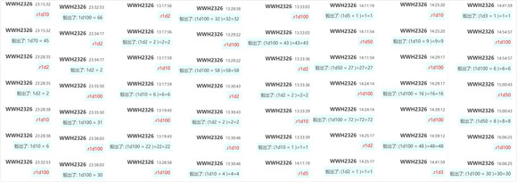
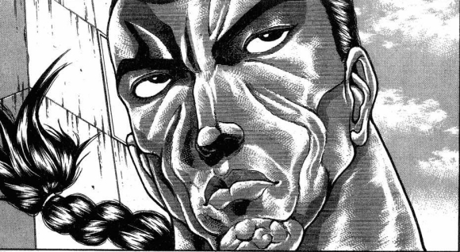
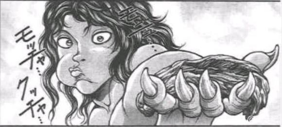
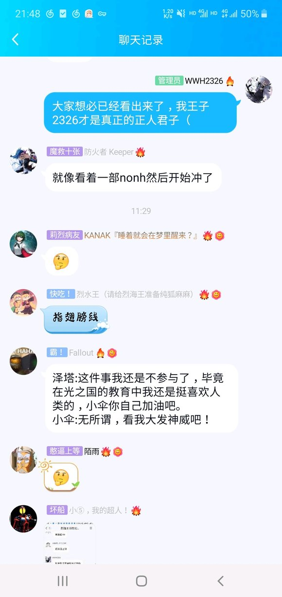

T6

战斗对象烈/紫苑

烈的误伤【1d100:6】失败

本回合无法攻击

负能量场中的空隙已经大到了肉眼可见的地步

而紫苑也调动了所有的咒文，发动了最后也是最强的攻击！

烈：这时候应该一点突破——

辉夜：这时候应该等待时符结束——

两人再一次采取了方向相反的行动

其结果是，他们又一次错失了战斗的机会

烈的受伤【1d10：5】

1 小伤害X6

2 小伤害X6

3 中伤害X6

4 中伤害X6

5 大伤害X6

6 大伤害X6

7 特大伤害X6

8 特大伤害X6

9 大失败

10 大失败

Hp：6-3X6=0

烈海王使用了急救拳

Hp：0+1=1

烈：总算是撑下来了……

“啪”

随着一声微不可查的轻响，依神紫苑所营造的绝望空间终于在此完全崩坏！

烈与辉夜再次来到了演奏会场的上空

而超乎所有人想象的是，与负能量气场截然不同的，闪烁着光芒的气场正从紫苑体内喷发而出

它为两人源源不断的提供着能量，令人充满了必胜的信心！

紫苑：居然把我所有的气场全都逼出来了……

烈：这可真是令人惊叹

隐藏在负能量场之下的，其实是闪烁的光辉吗

辉夜：哈，你不知道吗

贫穷神可从来都不是什么厄神——与此相反，她是保护他人免受财祸之苦的，真真正正的守护神啊！

T7

——由于守护神的气场，两人不会陷入误伤状态且全技能/必杀技CT清0——

紫苑：只能破罐破摔了！

我要把体内的所有气场全部释出！

辉夜：体内的力量不断上涌，我真是 high 到 最 高 点了！

上了，烈海王，一口气把这个可悲的黑幕解决掉！

烈：没问题！

符卡宣言 红符【巨阙】！

辉夜：符卡宣言【永夜归返　-新月-】

符卡宣言新难题【金阁寺的整块天花板】！

烈&amp;辉夜的攻击【285+80+800+1d100：9=1174】

紫苑的攻击【280+800-55+1d100：33=1058】

紫苑的受伤【1d10:10】

1 小伤害X5+4

2 小伤害X5+4

3 中伤害X5+4

4 中伤害X5+4

5 大伤害X5+4

6 大伤害X5+4

7 特大伤害X5+4

8 特大伤害X5+4

9 大失败

10 大失败

紫苑大失败！

大失败是什么？【1d10:1】

1 战斗不能

2 自爆（不会死的）

3 女苑也一块倒了（为啥啦）

4 战斗不能

5 自爆（不会死的）

6 战斗不能

7 变成了辉夜的粉丝（有道理吗？）

8 自爆（不会死的）

9 变成了乖巧的好孩子（为啥啦）

10 大成功/大失败【1d2：1】

武者挥舞着血剑，将贫穷神所放出的紫色符咒尽数斩破

而公主殿下则不知从哪掏出了一块巨大的天花板——

紫苑：不不不不不，不会吧

不会要把这东西——

烈：对，对，对

就是这个，这就是辉夜小姐的招牌符卡

怎么说呢——要不先祈祷吧？

然后，月之公主豪爽的将天花板直接砸在了贫穷神的头上

为了保护下方的观众朋友们，心慈手软的辉夜小姐并未用尽全力——因此紫苑只是昏迷着落在了观众席之间，引起了一阵小小的骚乱

与此同时

舞台上的付丧神对着观众们深鞠一躬，结束了这首曲子的演奏

辉夜：你所失败的原因只有一个——那就是把我蓬莱山辉夜惹火了！

战斗结束

胜者 烈海王&amp;辉夜！

由于最后一个回合逞强用了血剑导致Hp归0，烈海王此刻正在接受幽香的治疗

魔理沙拖着可怜兮兮的贫穷神来到了一旁的看台上

顺便一提，同样可怜兮兮的疫病神正被恋恋绑在一旁

烈：说是一天解决异变，没想到真就在今天之内干掉黑幕了

不愧是辉夜小姐

辉夜：少来这套

今天这稀里糊涂的行动也能算解决异变？运气好罢了

花之暴君为烈上好了恢复术式后，在一旁微笑着鼓了鼓掌

幽香：没想到演奏会的第一天就有这么精彩的暖场表演，感谢你们啊

克劳恩皮丝：哎呦……这位昏迷的倒霉蛋该怎么办？

恋恋：等她醒了再说吧！

现在想看演奏会！帕秋莉要上场啦！

魔理沙：哦哦哦，这我可得录下来！

幽香：紫，要留下来看演奏吗？

紫：为什么不呢？

辉夜：总而言之这事总算是结束了——

不对啊！我身上的凭依还没解决呢？！

魔理沙：我之前就想说了

你们俩这情况是强制凭依吧？

那解除权应该是在身为下仆的烈海王身上，用这个小技巧不就完了

烈的尝试【1d70：52+30=82】（魔理沙的提醒+30,50以上成功）

烈：成功了！

辉夜：——这不从头到尾都还是你的问题吗？！

月之公主愤怒的指责着一旁的武者，自知理亏的烈海王也不敢吭声

周围愉快的家伙们，则在一旁享受着帕秋莉甜美的歌声

于是，尽管仍有许多谜团等待解决

但这乱七八糟的一天，终于在一片欢乐的气氛中结束了

打倒了异变的黑幕 最凶最恶的两人组 依神女苑 依神紫苑

完全凭依异变 仍未结束

与辉夜进行了一次总体还算愉快的异变解决之旅，并在一天之内解决了异变

得到了一次重骰好感的机会

辉夜的好感度：【17+1d83:22=39】

~第376天结束~

本日的更新结束，下次更新大概在周一或周二

（以下是我的废话）

本次异变的剧情总体而言还不算太离谱——

但是大失败也太多了吧？！大成功也是啊？！

开局出辉夜我就知道，大纲大概要完蛋了

总而言之照片和梦铃仙都是小事，起码把第一次boss战斗保住——

然后紫大成功了

完全凭依异变正牌堂堂完结（悲）

话说烈和辉夜这配合真的稀烂啊

你们俩单独打都比组队强吧？学学隔壁魔理沙恋恋可以吗？

那么本次的更新到此结束

下一次的更新仍然是完全凭依异变，包括解说篇以及后续的剧情，不知道一次能不能搞定

下次更新大概在周一或周二吧

骰子明天再发

补上本次的骰子

魔理沙&amp;恋恋对战女苑紫苑的前半部分骰子被吞了所以没截到（悲）

这次异变还没结束，但后面的剧情有点麻烦......

按理说应该是故事会解说设定+处理梦境居民入侵这样的走向

但是这次速通太快导致最根本的完全凭依相关都来不及讲，很多有意思的组合压根都没出场（悲）

我得好好思考一下之后的走向......

处理为异变解决太快导致大家都没发现，于是都还在愉快的打凭依战这样的走向感觉可以

处理为以梦境居民为主体的走向感觉也不错

（午休时间的摸鱼）

好像有吧友想看我的大纲......？

实际上我从开贴开始就一直没写过大纲（笑）

毕竟大纲肯定是会被撕烂的

我一般会在剧情开头最重要的几个骰子骰完之后，先在脑子里思考一下比较有可能的大概走向，然后再接着骰

虽说这种大概走向基本上也都会完蛋的（笑）

而作为代替，在写异变剧情的时候，我会先将原作中的剧情点和梗先尽量过一遍，这样写对话和编选项的时候会相对好串很多

比如说这次异变的准备就是下面这张图（含大量剧透，没玩过原作不建议看哦）

这样写的时候就不需要次次都翻wiki了，相对会方便一些

虽然这一次暴走太快导致基本都没用上就是了（悲）

顺便一提，今晚应该会更新一下昨天剧情的后续（非彩蛋），估计也是七点半左右

今晚的更新是故事会的内容，并顺便为昨天的剧情收一下尾，因此并没有多少内容

毕竟昨天刚更新完正篇嘛（笑）

那么开始更新

——————————————

书接上文，英勇的依神姐妹使劲浑身解数仍然不敌烈海王、辉夜、魔理沙、恋恋与八云紫五大屑人的联手

最终，超级贫穷神倒下了

故事从依神紫苑的苏醒开始......

~第376天~

~太阳花田~

依神紫苑从一片黑暗中醒了过来

紫苑：我……输了？

烈：嗯，你输了

但你面对的敌人是蓬莱山辉夜

能奋战到这个地步，足以令人敬佩

紫苑的好感度【1d70：63+30=93】（战斗胜利+30）

紫苑：你是跟她搭档的武术家——

烈：紫苑姑娘，异变之类的话题稍后再说

我先请吃点你东西吧？

你现在这个样子我真的……看不下去了

紫苑：！！！！！！！！！！！

你……你要请我吃饭吗？！

作为贫穷神的我？！！

蓝发的贫穷神激动地握住了烈海王的胳膊

烈的震惊【1d100：98】大成功

草，这个大成功是啥啊【1d10:4】

1 得到了紫苑的加护（那是啥）

2 紫苑的好感度上升【1d5】（别啊）

3 学会了贫穷神的绝技（那是什么）

4 得到了紫苑的加护（那是啥）

5 紫苑的好感度上升【1d5】（别啊）

6 女苑的好感度上升【1d10】（为啥啦）

7 得到了紫苑的加护（那是啥）

8 紫苑的好感度上升【1d5】（别啊）

9 过于震惊以至于厨艺上升了（为啥啦？！）

10 大成功/大失败【1d2：1】

烈：紫苑小姐，吃顿饭而已不需要这么激动的！

我在幻想乡的正式工作就是厨师，帮大家做饭也算是我的本职了……

紫苑：居然还是真正的厨师！

我太感动了……您真是一位善良的先生！

我没有什么能够报答您的东西……如果不嫌弃的话，就收下我的加护吧！

草，贫穷神的加护是什么啊？【1d10:7】

1 一天可以使用一次，本回合对手不会大成功

2 物理意义上的加护，在幻想乡中宣传烈的好名声

3 得到了清贫而乐观的价值观，以后可以买到便宜菜了（有啥用啊）

4 一天可以使用一次，本回合对手不会大成功

5 物理意义上的加护，在幻想乡中宣传烈的好名声

6 凭依意义上的加护，下次剧情中变为烈的搭档

7 一天可以使用一次，本回合对手不会大成功

8 物理意义上的加护，在幻想乡中宣传烈的好名声

9 其实还是好感度（为啥啊？！）

10 大成功/大失败【1d2：1】

蓝发的贫穷神从头发里掏出了一坨蓝色的气场

紫苑：这是我所积攒的不幸的气场

在战斗中使用的话就可以令对手暂时变得倒霉起来——

不过由于力量所限，一天之中也只能使用一次而已

善良的厨师，希望它能帮上你的忙！

烈海王看着面前一脸期待的少女，不由得抹了把脸

烈：（这我可没法说不能收啊……）

紫苑小姐，那真是太感谢你了！我先去准备晚餐了！

一旁的月之公主目瞪口呆的看完了全程

辉夜：不是

为啥啊？

这是什么？

这有道理吗？

女苑：姐姐她就是这种人啦……

魔理沙：？

打完架大家都是朋友了，这不是很正常吗？

克劳恩皮丝：一点都不正常吧

我打完架也不怎么喜欢他啊

幽香：令我想起了刚刚见面的时候呢~

恋恋：烈海王，我要吃布丁~

烈的厨艺【1d45：43+55=98大成功】

大成功是什么？【1d10：10】

1 领悟了厨师的真谛，厨艺基础值+5

2 得到了辉夜的认可，好感度+【1d10】（你天天都在吃啊！）

3 解决了文文的照片问题（为啥啦）

4 领悟了厨师的真谛，厨艺基础值+5

5 乘胜追击，紫苑好感度+1d5

6 下一次战斗的搭档变为恋恋（为啥啦）

7 领悟了厨师的真谛，厨艺基础值+5

8 乘胜追击，紫苑好感度+1d5

9 幽香：教你魔炮吧（为啥啦啊啊？！）

10 大成功/大失败【1d2：1】

草草草草草，厨艺双重大成功

这个双重大成功是什么？【1d10:3】

1 与魔理沙的厨艺交流！基础值+10！

2 辉夜的好感度再重新骰一次（草）

3 解决了文文的照片问题！并且以后不会陷入八卦新闻了！

4 与八云蓝的厨艺交流！基础值+10！

5 紫苑好感度满了（不要啊）

6 下一次战斗的搭档变为恋恋，同时好感度增加【1d10】

7 与橙海王的厨艺交流！基础值+10！

8 紫苑好感度满了（不要啊）

9 学会了双重魔炮（救命啊————）

10 大成功/大失败【1d2：1】

【1d30：26】分钟后，烈海王做出了一堆一眼望去看不到尽头的美食之山

烈：今晚状态绝佳！

正好幽香这食材储备还够，我就一口气多做了些菜！

魔理沙：你这叫多做了些吗？！

这量已经够开宴会了！

幽香：那就在花田开宴会吧~

邀请来的乐队们还没离场，就把她们一块叫来

还有——顺便叫一下永琳她们？省的烈回去再做一顿了

辉夜：我也懒得回去再吃了

给永琳发个使魔吧

至于饥肠辘辘的紫苑小姐，她此刻已经带着满脸幸福的笑容开始动筷子而顾不上说话了…….

就在这时，人见人爱的天狗记者从远处飞了过来

文文：哇哦，好丰盛的晚餐

能让我也加入吗？我会顺便带酒来的！

烈：晚上好，射命丸小姐

您想吃就随便拿，我无所谓

文文：多谢啦~

这样的话……毕竟是老顾客了，以后就不写你的八卦新闻了

烈：老顾客还要请吃饭才不写？！

老顾客在天狗心里到底是什么性质啊？！

幽香：啊，对了对了

说起来——去年演唱会的时候

我似乎委托过你做宣传来着？

效果绝佳啊？

文文的恐惧心【1d100：59】（30以下吃魔炮）

文文：好可怕好可怕

对不起对不起，那一次我没什么经验嘛~

您看这次效果不就相当好？上一次的费用我现在就退给您！

天狗陪着笑脸给大妖怪退了费用后就跑去吃饭了

恋恋：我也去吃甜点啦~

你想接着被绑在这里？还是把你挂在地灵殿的门口？

女苑：先把我放出去可以吗？！

为什么你们刚打完架就和敌人一起开宴会啊？！

烈：毕竟这里是幻想乡啊

异变结束后的宴会也算是传统保留项目了

女苑的好感度【1d100：47】

女苑：唉……姐姐这个单纯的家伙，区区一顿饭就被骗傻了

果然还是需要我来照顾她

于是，疫病神也一同加入了宴会之中

【1d30：5】分钟后，永远亭一行人来到了太阳花田

魔理沙：好快？！你们有这么饿吗？

因幡帝：皮克一听有很多肉就兴高采烈的出门了，拉都拉不住……

师匠：公主大人，今天进度如何啊？

有好好借这个机会运动吗？

辉夜：运动？如果算符卡决斗的话那我确实有好好运动

顺便把黑幕也干爆了，就是那俩在拼命扒饭的姐妹

铃仙：哇……真就一天解决异变啊……

辉夜：对了，因幡

你好像对我有很多怨言啊？

又是neet又是啃老族，看不出来你词汇量这么丰富？嗯？

铃仙的疑惑【1d100：41】

铃仙：？？？

辉夜大人我没有啊——

烈海王用手揉了揉眼角

烈：铃仙前辈……

谢谢你对我这么好！

以后喝酒全部我请客！平时的杂活我也一定会帮忙的！

铃仙的疑惑【1d100:28】

铃仙：（烈先生这是在感激我平日对他的照顾吧？）

烈先生，那谢谢你啦！

皮克正往嘴里塞着牛排

皮克：嗷嗷哦啊哦嗷嗷嗷啊嗝

（今天为啥突然在花田开宴会了？）

烈的说明【1d100：33】（50以上理解）

烈：与辉夜小姐出门之后，我们就被射命丸小姐偷拍了

之后辉夜小姐使用能力困住了记者，总算是把照片拿了出来

与此同时，梦境世界的铃仙前辈把大家统统骂了一遍并在幻想乡大战了一场，所有凭依组合全都被她打倒了，然后在我们与魔理沙和恋小姐碰头的时候突然破门而入对着辉夜小姐喷了一长串的垃圾话

这时候我们才知道原来完全凭依与梦境有关！但八云女士却误会了！于是我们就——

幽香往烈的嘴里扔了个花弹

幽香：谁来翻译翻译？

或者换个人来说明？

永琳：我大概能听懂但不保证能让你们也理解……

公主大人，能交给你来说明吗？

辉夜的说明【1d70：60+30=90】（50以上理解）

月之公主有条有理的将本日的行动对众人叙述了一遍

其优雅的声调与清晰的逻辑，与一旁口中插着花呜呜直叫的武术家相比可谓是天地之别

铃仙：——梦境世界的我是这么过分的家伙吗？！！！

对不起哦辉夜大人……

辉夜：超——级过分

算了，反正那也不是真的因幡，就先不罚你吃石头了

因幡帝：（凭什么？凭什么就我吃啊？！）

永琳：居然真的只用一天就解决了异变

看来让公主大人出门活动活动对大家都是好事啊！

皮克：嗷嗷嗷嗷嗷啊？

（虽然辉夜小姐说的很明白，但我还是没搞懂，这个异变到底是什么原理啊？）

皮克看了看很想发言的烈海王，伸手帮他把嘴里的花弹拔了出来

烈：噗——多谢帮忙

先说结论

完全凭依异变是都市传说异变的延伸

它的初次出现是在神秘珠异变结束后不久，而在那天神子殿下特意来永远亭提醒过我们了

铃仙前辈，你应该有印象吧？

铃仙：哦哦，今天早上咱们还提到过

就是灵梦变成妹红的那次事故吧？

烈：正是

而这次异变所带来的影响就是，人的肉体和精神会被夺取

简单来说，一个人会突然变成另一个人

辉夜：就像你们所看到的一样

作为【主役】的我被作为【下仆】的黑曜石所完全凭依了

虽说我和烈海王可以同时出现，但这需要一定的练习

两人无法同时出现太长时间，且由于进行凭依的缘故无法远离彼此

用漫画来举例的话，就像拥有了一个替身一样

只不过这个替身与本体同时存在的时间很短，且拥有着自己的想法

烈：因此除战斗以外的大部分时间，凭依组合都只能以【单独一人】的形态活动

所以大家才会看到我与辉夜小姐闪过来闪过去……

但关于完全凭依的部分细节，我们还是没搞清楚

这方面大概得问问魔理沙了

魔理沙现在在做什么？【1d10:4】

1 喂帕秋莉喝汤

2 跟恋恋拼酒

3 修罗场（怎么做到的？）

4 喂帕秋莉喝汤

5 跟恋恋拼酒

6 单纯的大吃大喝（你还没吃完啊）

7 喂帕秋莉喝汤

8 跟恋恋拼酒

9 宴会上的即兴演出（为啥啦）

10 大成功/大失败【1d2：1】

众人将视线投向了一边的餐桌上

金发的小女孩正给女朋友喂汤

魔理沙：演出很棒啊！唱了这么久真是辛苦你了，赶紧喝口汤吧~

——你们都看着我干什么！？

我喂女朋友喝口汤都不行？！

帕秋莉：我就说不要在大庭广众之下干这事啦！

幽香：我现在真怀念以前那个单纯热血的魔理沙

说正经事呢，你对于名为完全凭依的现象了解多少啊？

魔理沙的了解程度【1d60：60+40=100】（优秀的凭依组合+30，多次凭依战+10,75以上大体解明完全凭依）

魔理沙大成功！

大成功是什么？【1d10：1】

1 我完全理解了

2 1+梦境世界的情报

3 顺便理解了堇子的状况（为啥啦）

4 我完全理解了

5 4+梦境世界的情报

6 顺便抓了几个梦境居民（什么时候）

7 我完全理解了

8 7+梦境世界的情报

9 学会了依神姐妹的绝技（这有道理吗）

10 大成功/大失败【1d2：1】

魔理沙：完全凭依？

这玩意我跟恋恋花了一上午的时间就完全解析完毕了

恋恋：我负责做实验，魔理沙负责分析原理

最高最善的bestmatch就是我们两人了！

辉夜：那你为什么不早点告诉我怎么解除凭依？！

魔理沙：不是

你也没问我啊？

我看你自己玩的也挺开心的就没提

铃仙：师匠……

我一直以来都在想，很多时候是不是大家坐下来开个会，交流一下情报，问题就能解决了？

为什么我们还要打符卡决斗呢？

师匠：外界的情况姑且不论，幻想乡内部的话……

只能说大家脑子里都缺根弦吧

烈：铃仙前辈，你这话说的

能靠打架解决的问题为什么要靠嘴呢？

铃仙：——好像也挺有道理的？

因幡帝：没有一点道理吧！

金发的小女孩用手沾着酒水，在桌子上比划了起来

魔理沙：首先，完全凭依分为两个类别

一种是双方都同意的自愿凭依

而另一种由下仆单方面进行的强制凭依

前一种凭依的代表是那边正在吃烤乳猪的两姐妹

而我与恋恋、烈海王与辉夜则属于后一种

魔理沙一指烈海王

魔理沙：这时候给你们做个实验就明白了

恋恋，上！

“刷”

紫光一闪，武术家从原地消失了，取而代之的是觉妖怪的身影

过了几秒钟，烈海王又被换了回来

烈：！

我这就被强制凭依了？

恋恋：成功了！

今天上午做了几次实验后发现，我可以随便凭依其他人，但魔理沙却做不到呢

“刷”

觉妖怪解除了凭依

纯狐：这方面我有问题呢

为什么这孩子和烈海王的强制凭依可以成功，但我却没能做到啊？

我之前尝试了好几次都不行，最后是征得铃仙同意后才凭依成功的

铃仙：——您之前还尝试了好几次啊？！

魔理沙：因为强制凭依需要被凭依者处于一种暂且失神的状态，或者说需要趁她不注意才能成功

恋恋本身就很难被注意到，她的强制凭依就几乎必定成功

另外，完全凭依同样是都市传说异变的延伸——所以使用过都市传说力量的人会更容易用出凭依来

纯狐：原来如此

当时我就坐在铃仙对面呢……

铃仙：您就算躲在门后面也会被我注意到！存在感太强了！

辉夜：我则是因为……熬夜看漫画当时很困所以刚好就撞上了？！

师匠：以后还请按时按点睡觉吧，公主大人

魔理沙：我通过与恋恋共同进行的实验发现，自愿凭依时解除主导权在主役，强制凭依时解除主导权在下仆

而作为下仆的烈海王又对凭依技巧一窍不通，这也是辉夜折腾半天都没办法挣脱的原因所在了

恋恋：对了对了，凭依时可以感受到双方的部分情感，这也是将凭依双方联系起来的纽带

你们在凭依的时候感受到了什么？

烈与辉夜的感受是【1d10：9】

1 想打架

2 想出去玩

3  hso（为啥啦）

4 好烦啊

5 想打架

6 好恶心啊

7 好爽快啊（为啥啦）

8 想打架

9 好烦啊

10 大成功/大失败【1d2：2】

辉夜：超级烦躁

烈：坐立不安

魔理沙：找遍全幻想乡也挑不出第二个像你俩这么烂的凭依组合了

真亏你们还能打赢啊？

烈：那么关于完全凭依的具体技巧我倒是已经理解了……

而它的具体运作原理，则与梦境世界有关

辉夜：这事直接问她俩不就好了？

贫穷神小姐，你吃饱了没有啊？

紫苑的饱腹度【1d70：48+30=78】

蓝发的贫乏神少女捂着肚子打了个饱嗝

在她的身旁摆着随机如山的空盘子，以及一盘整整齐齐的猪骨头

紫苑：嗝

终于吃饱了……

皮克：你那还算是人？

（我才吃了半只鸡，她就已经啃完一头猪了）

女苑：我求求你别丢人了……

烈：紫苑小姐，能说明一下完全凭依异变的运作原理吗？

紫苑的说明【1d100：52】（50以上理解）

紫苑：其实说到底就是对于梦境世界的干涉啦

进行完全凭依的时候，一般不都只会出现一个人吗？

此时他的搭档并不是凭空消失了，而是进入了梦里

紫苑：但是梦境世界的空间是有限的

举个例子来说，这位橙发的女士在凭依时进入了月兔的梦中，此时她便顶替了梦中月兔的位置

而梦中的月兔就被挤到了现实世界当中

这就是完全凭依的原理啦，说白了就是和梦境中的对象一换一而已

烈的察觉【1d65：52+35=87】（75以上察觉）

烈：那岂不是说

每进行一次完全凭依，就会有一个梦境居民来到现实世界？

现在到底有多少梦境居民混入幻想乡之中了？！

女苑：姐姐你搞什么？

我之前完全不清楚这个啊

紫苑：哎——

我以为这个不算什么大事的——

妖怪贤者此时从隙间中探出了头

紫：现在你们能明白我为何会产生误会了吧？

边打边骂的月兔很糟糕，但她在梦境居民中已经是属于相对温和的类型了

现在虽说引发异变的依神姐妹已经被解决，但完全凭依却仍在被妖怪们所滥用

这样下去进入现实的梦境居民只会越来越多……这可不是什么好笑的事情

烈：那现在最优先做的事情应当是——

【1d10:4】

1 阻止完全凭依的滥用

2 追踪梦境居民

3 向哆来咪求援（为啥啦）

4 阻止完全凭依的滥用

5 追踪梦境居民

6 完全凭依格斗大会（你在想什么？）

7 阻止完全凭依的滥用

8 追踪梦境居民

9 拜托灵梦吧（你也开始摸鱼了？）

10 大成功/大失败【1d2：1】

烈：现在最需要做的事情是阻止完全凭依的滥用

只要大家仍在利用完全凭依的力量，那么梦境居民就仍然会不断进入现实之中

紫苑小姐，你认为异变的余波还会持续多久？

紫苑：额……

大概【1d10：6】天左右吧……

魔理沙：差不多一个周

这可没法等他们自己发现真相了

明天就赶紧去通知大家！

紫：还有一件事

异变的发起者可是要接受处罚的——

烈的情商【1d80：22+20=42】（50以下吐槽）

烈：八云女士，还有这说法吗？

我看前几次异变的主谋都是挨了顿揍就当无事发生了啊

月之头脑无奈的捂住了脸

幽香：你能不能想办法帮他提高一下情商？

永琳：我早就已经放弃了……

妖怪贤者毫不在意的摇了摇扇子

紫：只是你不太清楚惯例而已

既然有胆子搞事，那也应当学会收拾自己整出来的烂摊子

因此——对梦境居民的追踪任务，就交给你们姐妹俩了

女苑的逆反【1d100：62】

女苑：凭什么？

我们只是想要抢钱而已！

紫苑：我们也不知道会有这种后果的……

紫的恐吓【1d50：21+50=71】（妖怪贤者+50，大于逆反值62起效）

妖怪贤者露出了令哭泣的孩子闭嘴的笑容

紫：说起来上次万宝槌异变的时候我本打算在全幻想乡通缉天邪鬼的~

可惜她太识相了

不如这次就用在你们身上吧？

女苑：——我会乖乖去做的

紫苑：——任务期间管饭吗？

烈：你想吃饭随时来找我就行……

三言两语之间，众人敲定了未来几日的目标

完全凭依已经解析完毕，但它所带来的影响却仍在蔓延之中

阻止完全凭依与清除梦境居民，成了大家接下来不得不做的事情

（本日的补充剧情结束，正篇的更新在周二或周三）

（以下是我的废话）

不是，太阳花田这地方是不是有问题啊？

怎么一到太阳花田大成功就开始批发了？

娘嘞，看到那个厨艺双重大成功我差点就要开始哀嚎了，没想到居然骰中了唯一一个凑数梗选项，真是谢天谢地

魔理沙骰了个100的理解，你早干什么去了？！

你早点把这骰出来这回也不至于这么惨啊？

总之今天算是把昨天的剧情收了下尾

之后应该还能打1-2场凭依战，然后把梦境线一收就差不多完事了

那么今天就到这里，骰子跑完步发

顺便一提，这个图只是我在群里看安科的时候玩个梗而已，大家放心，我的热狗还是在的（笑）

顺便给大家分享一下中午摸鱼时的沙雕对话（

前情提要:群内的安科出现了混沌的走向

附上本次的骰子

话说今天这算不算本贴最毫无意义的一次双重大成功啊？

感觉满怪的，但如果真出了其他选项也挺怪的

果然我也是德川（悲）

吧友 @望远镜300  制作的视频第22集更新了！

本期的内容是白玉楼篇与妖梦战，大家感兴趣的话就去看看吧！

~大版本更新（其实是我的失误）~

今日回顾妖梦战的时候才发现，破解普通攻击这个操作好像很久都没用过了

这是因为到了后期 无法回避/破解/防御的必杀技人手一个，导致这些时候没法破解，而只能在5 6T的时候使用破解操作

但开第二季之前由于考试的缘故我有几天没写，结果回头开打后把这个设定忘记了......

我已经被烈用崩拳痛殴过一顿了，请大家原谅我吧（吐血）

于是在这里更新一下技能设定：

武之怀升级为纯粹武道后，无法破解普通攻击

由于这是整体大版本更新，因此如灵梦/魔理沙/堇子等用有相似判定的角色此后也无法使用回避/防御等操作应对普通攻击

......这样一来纯狐女士和灵梦她们也会过来殴打我的，要死了要死了（悲）

这确实是我的重大失误，以至于必须在这里强行打个补丁才能挽回（不然就需要重新骰第二季以来的所有战斗了），在此向吧友们致以歉意

剧情角度的补丁如下

——————————————————————

烈：纯狐女士

为什么我领悟了您的境界之后，就无法破解普通攻击了？

纯狐：纯度太低了

所谓战斗，便是纯粹力量的碰撞

这份意志的真谛是让你驱除【斗争】以外的杂物——若是用来消除战斗本身，又有何意义？

烈：！

原来如此，我悟了！

