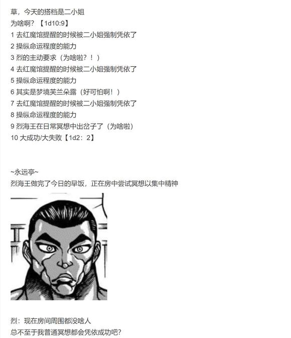
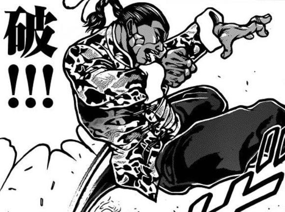

顺便一提，本次异变结束后就该让烈原创一张新符卡了

嗯......说实话我着实没什么头绪

因此打算将本次的原创符卡交给安价

当然，数值这块还是我来做的，因此安价的只是符卡名称与CT而已

大家可以选择原创一个帅气的名字，也可以选择与某位角色的符卡名相似或相同——到时候我会看情况骰学习过程

具体格式如下：【符卡名】+（CT）

举例：石符【一块石头】（CT6）

具体的时间是明天早上十点，因此大家有充足的时间准备

到时候我会和以前一样单开一层作为安价

安价楼

烈海王将学会什么样的新符卡？

请在此楼回复

具体格式如下：【符卡名】+（CT）

举例：石符【一块石头】（CT6）

再次重申一次，数值这块还是我来做的，因此安价的只是符卡名称与CT而已，到时候我会看情况骰学习过程

以及，过于离谱的选项我会适当排除掉——因此请别写热狗符之类的选项，谢谢大家（笑）

1 梦符【黑曜的武之狂梦】（CT7）

2 食符【太阳花田的秘传糕点】（CT1）

3 架势【倚楼揽月】（CT7）

4 道符【心境中的无为】（CT4）

5 海符【十二试炼】（CT7）

6 烈符【黑曜石机关枪】（CT7）

7 烈心【阿遮罗之龙晶】（CT7）

8 掌符【从天而降的掌法】（CT7）

9 崩符【半步开山】（CT7）

10 式神【魔理沙】（CT7）

11 瞬符【超音速踢】（CT4）

12 武符【梦幻斗舞】（CT7）

13 武符【旋转突进的黑色武者】（CT6）

14 般若【无明离欲】（CT7）

15 幻符【闭月羞花】（CT7）

16 红叶扇风（CT2）

17 恋符【花前月下】（CT4）

18 武道【强者战神】（CT7）

19 纯符【地上之花与天上之月】（CT7/9）

20 烈符【星河象形拳】（CT7）

烈海王将在本次异变结束后学会 武符【梦幻斗舞】（CT7）

——话说这到底是舞还是武啊？

考虑到符卡名编起来很麻烦因此这次放宽了选项，从前10个变为前20个了

大部分选项都是与武术相关的符卡，与恋爱相关的选项也不少

然后其中也悄悄混入了几个非常奇妙的选项，糕点也就算了为啥会有式神【魔理沙】啊（笑）

但转念一想倒也挺符合世界观的就没有排除，幸亏没选上

那么本次异变结束之后烈就可以学到新大招了

话说舞啊......舞啊......要去守矢神社学习吗（错乱）还是去找时尚大师赫卡提亚呢

不知道为啥把A12海皇的全名打出来就会被吞，因此没法@ 了（悲）

（顺便更一个彩蛋，本来是铃奈庵剧情结束时该发的但当时气氛太糟糕了（笑）就拖到今天了）

~小铃的欢迎会~

~博丽神社~

猯藏：恭喜小铃顺利成为了俺们的一份子！

小铃：咦？我也是妖怪了吗？

话说这里的大家也都是妖怪？

早苗：说的没错！这里就是妖怪神社，普通的人类过来就会被吃的连骨头都不剩——

“啪”

早苗的头上挨了一御币后痛苦的蹲下了

魔理沙：实际上本次宴会的成员中只有一半左右才是妖怪

我们之前一直瞒着你，是因为你毕竟只是个普通的人类

灵梦：这样的你如果被卷入了妖怪们的争斗之中可就太过危险了……

但是，我们的保护措施反而为你招致了危机

因此以后，我会像对待魔理沙、烈海王和皮克她们一样对待你

从今天开始，你就是与我们一样的，特殊的人类了

橙发的少女微微颤抖着

皮克：嗷嗷嗷嗷嗷哦啊？

（小铃小姐，你在害怕吗？）

阿求：怎么可能，倒不如说她快高兴疯了吧

小铃：——太好了！

我果然和一般人不一样！这就是我向往已久的生活啊！

文文：看来被妖怪附身这种小事完全影响不到小铃的好奇心啊……

话说回来，你这家伙这次偷偷拿了最大的好处吧？

天狗不怀好意的看向了狸猫

猯藏：那么为了庆祝小铃的加入让俺们一起干杯吧！！！！！！！

然后，狸猫毫不犹豫的忽视了记者的话语

妖梦：真热闹啊

之后要不要邀请小铃一起来喝酒啊？

烈：我看算了吧……

咱们几个无论谁喝多了小铃小姐怕是都要糟

咲夜：她这种家族企业接班人是无法理解职场的压力的……

社畜们在一旁忙活着料理，口中顺便聊着闲话

本居小铃从此正式成为了与妖怪们打交道的特殊人类

人里的居民们只当她是被神隐之后，又奇迹般归来了（实际也确实如此）

而铃奈庵的生意也正式对妖怪开放了——

借书店的生意越来越红火

但本居小铃却想着，自己什么时候才能像巫女和原始人一样，与妖怪们战斗呢？

（彩蛋结束）

今天晚上应该能把这个堪称喜剧的异变结束了（悲）具体时间看情况

由吧友 @望远镜300  制作的视频第23集更新了！

本期的内容是世界杯，大家感兴趣的话就去看看吧！

大概七点半左右更新

今天量不多，大概可以一口气更完

（今晚吞楼吞疯了，全得截图）

烈：那么我就跟芙兰小姐一起出发了

今天主要的任务是跑去提醒一下大家不要滥用凭依，所以应当不会有机会战斗的

芙兰朵露：我不能晒太阳，因此在室外的行动就拜托你啦~

咲夜：二小姐，不要随便毁坏公物哦

红美铃：玩的开心些~

于是，烈海王&amp;芙兰朵露开始了今日的行动

顺便一提，帕秋莉负责唉声叹气的在旁边监视

本日的凭依组合：狂暴好战的魔武者芙兰朵露·斯卡雷特&amp;烈海王

烈与芙兰要做什么？【1d10:5】

1 去提醒强者们吧

2 去寻找梦境居民吧

3 举办幻想乡第一届完全凭依格斗大会吧（为啥啦）

4 去提醒强者们吧

5 去寻找梦境居民吧

6 被人寻仇了

7 去提醒强者们吧

8 去寻找梦境居民吧

9 “运气真好，第一个就遇见了你们”

10 大成功/大失败【1d2：1】

烈：我现在最担心的，是四处乱跑的梦境居民们

芙兰朵露：把他们全部干掉然后扔回去吧！

帕秋莉：芙兰，这事情不像你所想象的那样简单

听烈海王的描述，梦境居民的外表与现实中的人是一模一样的——

那么，如何才能分辨我们眼前的人是梦境还是真实呢？

芙兰朵露：……靠直觉？

烈：太难了

举个例子来说，假如梦境中的魔理沙来到了现实中并大闹一场，大家一般也只会觉得“今天的魔理沙真奇怪啊”，而不是“这个魔理沙是假货”

恐怕只有灵梦小姐那样超越常识的灵感才能单靠直觉分辨真伪吧

恶魔之妹抢回了主导权，撑着阳伞飞到了天上

芙兰朵露：听起来好麻烦啊——

烈，你有什么好主意吗？

烈海王的办法是【1d10：8】

1 去拜托神子殿下吧

2 去拜托觉小姐吧

3 靠我烈海王的直觉（你刚刚才说过这玩意没用）

4 去拜托神子殿下吧

5 去拜托白莲师傅吧

6 凭依格斗大会（为啥啊）

7 去拜托神子殿下吧

8 靠我烈海王的推理（你有线索吗？）

9 “运气真好，第一个就遇见了你们”

10 大成功/大失败【1d2：2】

烈海王像替身一样浮现在了金发吸血鬼的身后

烈：这时候果然还是要用我烈海王的推理！

帕秋莉：连一点线索都没有要怎么推理啊？！

烈的推理【1d70：27+30=57】（75以上得到思路）

烈：梦境居民的入侵是完全凭依所带来的影响

那么只要确定目前所有的完全凭依组合并加以控制，就可以划定大概的范围——

芙兰朵露：烈，我们在讨论的是如何区分梦境居民哦

烈：——那我确实没啥思路

帕秋莉：完全不可靠啊，这个肌肉男

芙兰，你有什么想法吗？

芙兰朵露的建议是【1d10：5】

1 靠姐姐大人的能力

2 帕秋莉的使魔传讯

3 我们先去找个人打架吧！（为啥啊）

4 靠姐姐大人的能力

5 帕秋莉的使魔传讯

6 “那边为什么还有一个烈啊”

7 靠姐姐大人的能力

8 帕秋莉的使魔传讯

9 去上补习班吧（为啥啦？！）

10 大成功/大失败【1d2：2】

恶魔之妹打了个响指

芙兰：现在这副尴尬的境地，就是因为大家都不知道完全凭依的原理吧？

那么直接让帕琪把情报送给大家不就行了？

烈：！

不愧是芙兰朵露老师，为什么我就想不到呢？

芙兰：哼哼哼~

这就是姐姐大人所说的，贵族的行动模式啊！

帕秋莉：倒不如说这才是一般人的想法吧？

紫发的魔女向各大势力发出了通讯使魔

帕秋莉的宣传【1d100：27】（30以上起效，50以上众人停止凭依）

三人站在红魔馆门口等待了【1d3：1】个小时

他们收到的唯一一份回复来源于命莲寺的鵺小姐：“下次恶作剧的时候记得把谎话编的真一点，别动不动就幻想乡要完蛋了，这谁信啊（笑）”

芙兰的怒气【1d100：58】（50以上行动）

芙兰朵露把鵺的回信捏成了渣

芙兰朵露：他 X 的！

你惹龙惹虎也不该惹我，我——

烈：诶芙兰小姐这个是脏话不可以讲诶

芙兰朵露：我今日便要将命莲寺轰碎至渣口牙！

帕秋莉：我就知道会是这样的发展……

于是，三人前往命莲寺了

路上有事发生吗？【1d100：56】（30以下坏事，70以上好事）

一路平安无事

~命莲寺~

命莲寺目前状况如何？【1d10:3】

1 白莲正积极寻找对手

2 梦境烈砸场中

3 一轮正积极寻找对手（心态真好啊）

4 白莲正积极寻找对手

5 梦境烈砸场中

6 平安无事

7 白莲正积极寻找对手

8 梦境烈砸场中

9 宗 教 战 争

10 大成功/大失败【1d2：1】

三人刚刚来到命莲寺的门口，就看到了战意激昂的蓝发入道使

一轮：武术家，来的正好！

来一场完全凭依战斗吧！

烈的战意【1d70：25+30=55】（50以上迎战）

烈：哦哦，是一轮师傅啊

多日不见，你的实力似乎又有长进

我很乐意再打一场！

帕秋莉：我们明明是来提醒她们不要滥用凭依的吧？！

芙兰朵露：哎——

这根本没可能输啊——

烈与芙兰朵露的秒杀【1d100：2大失败】

烈&amp;芙兰朵露大失败！

大失败是什么？【1d10:8】

1 本次战斗中Atk-15

2 本次战斗中无法连击

3 被一轮反秒了（什么——）

4 本次战斗中Atk-15

5 本次战斗中无法连击

6 一轮今日的搭档是白莲

7 本次战斗中Atk-15

8 本次战斗中无法连击

9 帕秋莉加入了对方（为啥啊？！）

10 大成功/大失败【1d2：1】

【1d15:10】秒后，恶魔之妹便飞到了僧侣的身前

她掏出了一把巨大的炎剑，正准备一剑斩出，却刚好在此时与烈海王换了过来

烈：！

不好意思芙兰朵露小姐，之前跟辉夜小姐互相对抗习惯了，遇到了合拍的伙伴之后反而不适应了

芙兰朵露：真可惜......

这样就得正经打符卡战了

一轮的搭档是【1d10：5】（2-9布都，1 10随机）

布都：唔，你差点就被秒杀了啊

昨天跟月兔战斗时也输了

说实话我想跟太子大人或者屠自古搭档啦……

入道使转头愤怒的与风水师手对手顶起了牛

一轮：说什么呢，明明是你在打架中途突然要抢主役才会输的吧？！

布都：呜呜呜呜呜——

你这用云山作弊的僧侣，吾不与你一般见识——

本场战斗中烈&amp;芙兰朵露方的主役是【1d2：1】

1 烈

2 芙兰朵露

烈：芙兰小姐，这场你来当主役？

芙兰朵露：感觉会捏坏她们……还是你来吧

烈：明白

永远亭烈海王

红魔馆芙兰朵露·斯卡雷特

请指教！

布都：这两天打了不少实战……完全战的操纵也已经完全熟悉了

一轮：这一次定要一雪前耻！

战斗！

烈海王&amp;芙兰朵露·斯卡雷特 VS 云居一轮&amp;云山&amp;物部布都

BGM：大神神话传

T1

本回合战斗对象烈/一轮

芙兰朵露：弹幕游戏开始了~

符卡宣言 禁忌【Cranberry Trap】！

布都：以鲜血为食之魔怪，真真恶劣至极！

符卡宣言 风符【三轮的皿风暴】！

烈的破解【1d100:56】失败

一轮的受伤【1d3：2-2=0】

一轮：你这不还是能派上用场的嘛

布都：吾本来就是战斗的主力！

烈的攻击【260+1d100：77=337】

一轮的攻击【235-30+1d100：17=222】

一轮的受伤【1d10：9】

1 回避

2 小伤害-2

3 小伤害-2

4 中伤害-2

5 中伤害-2

6 大伤害-2

7 大伤害-2

8 特大伤害-2

9 特大伤害-2

10 大成功/大失败【1d2：1】

Hp：19-4+2=17

烈：一轮师傅，你的拳力又提升了许多

看来你这段时间没有懈怠，这是好事啊

一轮：这才第一回合你就开始了？！

T2

本回合战斗对象 芙兰朵露/布都

芙兰朵露：符卡宣言 禁忌【Four of a Kind】

见识一下吧，我的分身之术

金发的吸血鬼微微一笑，便分出了三个一模一样的分身

共计四位芙兰朵露·斯卡雷特同时出现在了战场之上，她们同时释放着形态相似而轨迹不同的弹幕，令风水师陷入了了迷惑之中

布都：真头痛……想不到异邦的妖物竟还会分身忍术

那便将你们一扫而空吧

符卡宣言 天符【雨之磐舟】！

烈的破解【1d100：50】失败

芙兰朵露的攻击【260+40+1d100：21=321】

布都的攻击【235+45+1d100：27=307】

布都的受伤【1d10：6】

1 回避

2 小伤害-2+4

3 小伤害-2+4

4 中伤害-2+4

5 中伤害-2+4

6 大伤害-2+4

7 大伤害-2+4

8 特大伤害-2+4

9 特大伤害-2+4

10 大成功/大失败【1d2：1】

Hp：9-3+2-4=4

恶魔之妹的分身们灵巧地绕过了仙人的磐舟，并毫不留情的对其发射着弹幕

芙兰朵露：桀桀桀桀！

区区一搜泥船也想打倒我芙兰朵露·斯卡雷特吗？！

T3

本回合战斗对象 烈/一轮

一轮：接招，烈海王！

符卡宣言 神拳【天海地狱冲】！

烈的破解【1d100：77】大于60+10=70成功

入道云山对武者挥出了如山一般的重拳

然而，烈海王只是简单的一拨一甩，便化解了一轮的攻势

烈：拳速增快了，拳力变强了

但其实质与先前见过的铁拳符卡如出一辙

充其量也只能算是老招式的改良，缺乏本质的改变！

一轮：我有办法吗？

上次特地研发的激光招式不还是被你破解了，新招式有用吗？

你这人才是，来来回回永远都是破解、花弹、还有圣的超人术这老三样吧！

布都：哇……你先消消气别把自己气坏了……

烈：一轮师傅想看我的新符卡？

那当然没有问题

拜托了，芙兰朵露小姐

芙兰朵露：哦哦！一起上！

符卡宣言 红炎符【禁忌双绝斩】！

武者与吸血鬼分别亮出了血液大剑与炽焰魔剑

在僧侣与仙人那目瞪口呆的表情中，两位手持巨剑的搭档同时挥斩而出，将附着魔焰的剑气化作弹幕之雨发起了突袭！

Hp:21-3=18

烈的攻击【260+100+1d100：9=369】

差值大于100自动成功

一轮的受伤【1d10：5】

1 回避

2 小伤害-2+5

3 小伤害-2+5

4 中伤害-2+5

5 中伤害-2+5

6 大伤害-2+5

7 大伤害-2+5

8 特大伤害-2+5

9 特大伤害-2+5

10 大成功/大失败【1d2：1】

Hp：17-2+2-5=12

一轮：我今天不想打了……

布都：喂，明明是你先开打的吧？！

T4

风符【三轮的皿风暴】效果结束

战斗对象 芙兰朵露/布都

烈：接招 flower star！

布都的受伤【2+1d6：3=5】

Hp：4-5=0

布都：啧，吾暂时没法帮你抵挡伤害了

一轮：剩下的交给我

符卡宣言 连打【帝王海妖来袭】！

烈的破解【1d100：34】失败

芙兰朵露的受伤【6次1d100：53 97 22 65 15 63】共成功1次

Hp：12-3-1=8

芙兰：烈的破解失败了？

一轮：烈海王，你还有什么话可说？!

烈：嗯……空隙仍然大的不像话，攻击频率虽高但命中率堪忧

不过你特意增多了弹幕的数量用以围困对手的行动，这是个不错的改进

总的来说，你的锻炼起到了相当的效果啊，一轮师傅

一轮：——我不是让你来点评招式的！！！！！！！！

烈的攻击【260+1d100：18=278】

一轮的攻击【235+1d100：21=256】

一轮的受伤【1d10：2】

1 回避

2 小伤害

3 小伤害

4 中伤害

5 中伤害

6 大伤害

7 大伤害

8 特大伤害

9 特大伤害

10 大成功/大失败【1d2：1】

Hp：12-1=11

T5

禁忌【Four of a Kind】效果结束

战斗对象 烈/一轮

布都：符卡宣言 运气【破局的开门】

让好运离你而去！

烈：此乃纯粹的武道意志——

纯粹武道发动

烈的破解【1d100：71】成功

厄运判定【1d10:5】UFO

仙人以盘为阵，自身盘坐于天空中急速旋转，借助风水之术降低了武者的运气

而这份厄运的结果是——

银白色的UFO突然从天而降，对武者发起了冲击！

鵺：呀呼！让我看看今天是谁这么倒霉——

化作不明飞行物的大妖怪还未来得及把话说完，就看见了前方状态怪异的武术家

鵺：卧槽——不会吧——

但见烈海王一击崩拳击出，便将飞碟按照原路打了回去！

烈：原来如此，是厄运的攻击

可惜，比起紫苑小姐那可怕的怨气爆发，单纯的物理冲撞不值一提！

——话说我刚刚打的是什么玩意？感觉手感有点熟悉啊

布都：怎么还能把UFO打飞的？

你们命莲寺行不行啊，就这？

一轮：别说了……鵺前两天差点自闭了……

烈的攻击【260+70+1d100：69=399】

差值大于100自动成功

一轮的受伤【1d10：4】

1 回避

2 小伤害+3

3 小伤害+3

4 中伤害+3

5 中伤害+3

6 大伤害+3

7 大伤害+3

8 特大伤害+3

9 特大伤害+3

10 大成功/大失败【1d2：1】

Hp：11-2-3=6

恶魔之妹打了个哈欠

芙兰朵露：哈~

无聊，下回合直接干掉你们吧

