~梦境烈海王~

说起来梦境烈平时跟谁关系最好啊？【1d10：5】

1 梦铃仙

2 梦灵梦

3 哆来咪（真的假的）

4 梦铃仙

5 梦魔理沙

6 梦白莲

7 梦永琳

8 梦幽香

9 其他角色

10 大成功/大失败【1d2：2】

~梦境世界~

梦烈：今日的目标是守矢神社的那几位相扑运动员

要一起去吗，魔理沙？

梦魔理沙：我刚刚才打完堇子哎

话说早苗啊……

那家伙整天神神秘秘的，明明是个巫女却比我还爱出风头

砸场子的话算我一个！

【1d30：11】分钟后，梦境中的烈海王、魔理沙与梦境中的早苗和神奈子打了起来

哆来咪：又开始了……

他们就不能消停点吗

梦境的支配者坐在梦魂上唉声叹气，思考着自己入场调解的时机

堇子：在此之前能请你跟我说明一下情况吗？

为什么我会进入梦境世界啊？

哆来咪：因为你之前都是在做梦的时候进入幻想乡的

一直以来在这种情况下，梦境世界的你会被驱除，被现实世界的你所取代

而现在由于幻想乡中的异变，梦境中的你正在外界大闹一场

在此期间，你就不能离开梦境世界了

堇子的理解【1d70：6+30=36】（超能力者+30,50以上理解）

堇子：完——全——听不明白

之后，堇子在八云紫的帮助下离开了梦境世界

她在外界与梦境堇子和二重身堇子进行了一场奇妙的三人共斗后，才终于回到了日常之中

你说具体的故事？以后有机会的话会讲的......大概吧

~演奏会~

~第386天~

~太阳花田~

为期十天的演奏会终于在今夜奏响了最后一个音符

观众们正热情地挥舞着荧光棒并献上了他们的欢呼

而轮椅上的烈海王与站在一旁的幽香则在看台上微笑着鼓掌致意

烈：幽香，这一次办的可比去年好多了

幽香：我觉得没有去年好哦

烈：？

为啥啊？

幽香：去年这个时候还没有正式谈恋爱呢

那种只差一层薄纱的微妙氛围，才是看演奏会的乐趣所在

——顺便一提，我也是在那次之后才真正喜欢上你的

烈的情商【1d80：39+20=59】

烈海王默默喝了口茶

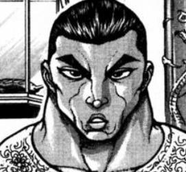

烈：（我那时还只是把你当做不知为何对我很好的，性情古怪的大妖怪来着）

话说居然是在那个时候啊……

我当时完全没想到以后会变成这样

幽香：就像你没想到现在会和魔理沙搞暧昧一样？

烈海王噗的一声把嘴里的茶水喷出来了

幽香的愤怒【1d100：59】（60以上打架，90以上告诉永琳）

花之暴君温柔地抱住了在轮椅上动弹不得的爱人

烈：幽香，你先听我解释我真的没有——

幽香：我知道我知道~

只是偶尔有点奇怪的想法而已，对吧❤

烈的情商【1d80：10+20=30】

烈：就是那个，从那天之后时不时会觉得魔理沙也蛮漂亮的——

啊糟了我不是这个意思，我想说的是——

武术家手足无措，开始胡言乱语

幽香：没关系~

你有的是时间慢慢讲，我不着急哦❤

大妖怪推着面如死灰的恋人走回了家中

【1d6：6】个小时后

烈：——总而言之就是这么回事，吃蘑菇中毒了一时头脑抽风而已！

真的什么都没干过！

也什么都不敢干的！

幽香：我本来就不怎么生气啊

毕竟魔理沙经常吃些奇奇怪怪的蘑菇这事大家都知道

估计永琳和魔理沙的小女朋友们也就把这事当个笑话看吧

烈：——哎呦吓死我了

幽香：啧啧啧，会感到害怕就说明你做贼心虚哦

大妖怪翻身搂住了她的恋人，并微笑着吻上了他的唇

夜晚的时间还有很长……

~最后的都市传说~

~命莲寺~

白莲：完全凭依异变结束后，持续已久的都市传说力量也要消失了

虽说之后依然可以骑摩托车，但还是没有自己召唤出来的方便

这大概是最后一次用它飙车的机会了吧……那么就【1d10:10】

1 按照承诺去找烈先生吧

2 带着神子一起飙车吧

3 给它取个名字吧（为啥啊）

4 按照承诺去找烈先生吧

5 带着神子一起飙车吧

6 邀请月之头脑一起飙车吧（为啥啊）

7 按照承诺去找烈先生吧

8 带着神子一起飙车吧

9 命莲寺全体出动，幻想乡飙车大赛开始！

10 大成功/大失败【1d2：2】

圣白莲大失败！

大失败是什么？【1d10:1】

1 按照承诺去找烈先生念佛经吧

2 还是去找神子打架吧

3 摩托车取名为霸天虎！（为啥啊）

4 按照承诺去找烈先生念佛经吧

5 还是去找神子打架吧

6 被月之头脑误会了（不要啊啊）

7 按照承诺去找烈先生念佛经吧

8 还是去找神子打架吧

9 命莲寺全体摩托车都坏了（草）

10 大成功/大失败【1d2：1】

白莲：这么说来好久没找烈先生讲经了

今天就把以前的份都补上吧！

圣白莲骑着摩托车冲向了永远亭

~永远亭~

烈：哦哦，白莲师傅是要去飙车吗！

白莲：我是来讲佛经的

烈的震惊【1d100：93】

烈：哎？！！

不是说好的下次一起飙车——

白莲：烈先生，不能因为外物诱惑而忘却了本心的修行！

我思来想去，觉得你目前最需要的果然还是修佛静心

来，再念一遍！

烈：好，再念一遍……

白莲的讲道持续了【1d12：8】小时（小于4有机会飙车）

8小时后，由都市传说具现而出的摩托车缓缓消逝了

烈：真可惜

以后就没机会飙车了……

白莲：烈先生何出此言？

虽说无法随时随地召唤出摩托了，不过命莲寺中还有我自己购买的车子哦

下次想飙车的话就来找我吧！

烈：——那真是多谢白莲师傅了！

于是，都市传说异变于此刻彻底结束了

~完全凭依异变结束~

~都市传说异变结束~

成就：最凶最恶的极贫不幸神达成

与蓬莱山辉夜、雾雨魔理沙、古明地恋、八云紫联手击败了异变的主谋依神紫苑

Atk+1

现在的Atk：262（137）

成就：为人所公认的实力者达成

除特殊情况外不会被Atk240以下的对手主动挑战

此后仅在战胜Atk285以上的对手后才可获得战斗奖励

（彩蛋结束）

（顺便一提，当时察觉到的人只有幽香而已）

顺便一提由于前几天写多了需要歇歇因此大概周六更新，具体时间看情况

因为白天要去看漫展所以晚上才更新，具体时间看情况

由于漏了一个片段，望远镜海皇正在重修中（悲）

逛了一圈把想买的都买到了，十分开心

回家恰饭了（

由吧友 @望远镜300  制作的视频第24集更新啦！

本期的内容是魔理沙的约会大作战，刚刚去打了个补丁灵基再临一下所以现在又骰了一般，大家感兴趣的话就去看看吧！

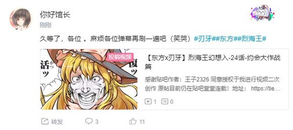

大概七点四十左右更新

这件事发生在烈海王来到幻想乡的第【386+1d30:15=401天】

说起来烈跟魔理沙的伤好没好啊？

师匠的医术【1d50：28+50=78】（月之头脑+50,75以上痊愈）

~永远亭~

魔理沙跳下了轮椅，迫不及待的做起了康复性训练

魔理沙：这一口气躺了将近一个月……

我怎么就能这么倒霉啊

烈海王在一旁拆着绷带

烈：我真觉得这回不能全怪我……

不如说是你乱扔蘑菇自找的吧？

魔理沙：鬼知道那是迷幻菇啊？！

话说永琳你出手前都不动动脑子的吗？！

师匠：哎呀呀……

这段时间我在这方面相对比较紧张

这次就不收你医药费了，对不起哦~

烈：（你这都能敲一笔？）

魔理沙：（那我还能白挨顿揍吗？）

走了走了，我可离你们永远亭远点吧

因幡帝：欢迎下次再来~

铃仙：床位都给你留好了的，放心大胆的出发吧！

皮克：嗷嗷嗷嗷嗷嗷啊

（一路顺风嗷）

金发的小女孩骂骂咧咧的飞走了

烈海王今天早上要做什么？【1d10：9】

1 与四季映姬战斗吧！

2 先前战斗的感悟（新必杀技）

3 小妖怪武术班

4 与四季映姬战斗吧！

5 先前战斗的感悟（新必杀技）

6 找白莲师傅学习吧！

7 与四季映姬战斗吧！

8 先前战斗的感悟（新必杀技）

9 古明地觉的侦探委托（今天早上来得及吗）

10 大成功/大失败【1d2：2】

正在烈海王思考今日的行程时，觉妖怪赠予他的通讯器久违地响了起来

觉：烈海王，你今天有空吗？

我这边遇到了一个有意思的案子

烈：早上好，觉小姐

我很乐意帮忙，具体来说是什么案件呢？

觉的委托内容是【1d10：4】

1 神秘昏迷事件（非智灵奇传）

2 人里居民失踪案

3 恋恋又跑丢了（还来啊？）

4 神秘昏迷事件（非智灵奇传）

5 人里居民失踪案

6 蓬莱人形杀人事件（那是啥！？）

7 神秘昏迷事件（非智灵奇传）

8 人里居民失踪案

9 铃奈庵的窃书案

10 大成功/大失败【1d2：2】

具体发生的地点是【1d10:10】

1 红魔馆

2 白玉楼

3 永远亭（哈？）

4 红魔馆

5 守矢神社

6 神灵庙

7 红魔馆

8 命莲寺

9 辉针城

10 大成功/大失败【1d2：1】

案发地点大成功

大成功是什么？【1d10:9】

1 永远亭

2 铃奈庵

3 博丽神社（开玩笑吧）

4 永远亭

5 铃奈庵

6 迷途之家（chennnnnnnn——）

7 永远亭

8 铃奈庵

9 月之都（为啥啊？！）

10 大成功/大失败【1d2：1】

觉：根据我收集到的情报来看

案发地点在月之都

烈的震惊【1d100：6】

烈：哦

受害者是谁啊？

受害者是【1d10:7】

1 清兰

2 铃瑚

3 稀神探女

4 绵月依姬（哈？）

5 绵月丰姬（不可能吧？！）

6 清兰

7 铃瑚

8 铃仙二号

9 八意永琳（？？？？）

10 大成功/大失败【1d2：2】

觉：据说是名为铃瑚的月兔

你以前似乎见过她一面吧？

烈：我想起来了，是被灵梦小姐绑起来的那位

——话说觉小姐你为什么会知道有关月之都的情报啊？

情报来源是【1d10:5】

1 其实是探女的委托

2 勇仪的鬼族情报网

3 其实是永琳的委托（为啥啦）

4 其实是探女的委托

5 勇仪的鬼族情报网

6 靠我觉妖怪的情报网（好强？！）

7 其实是探女的委托

8 勇仪的鬼族情报网

9 凶手向地灵殿发出了犯罪预告（为啥啊？！）

10 大成功/大失败【1d2：2】

觉：我最近才知道勇仪的人脉意外很广

真没想到现在的月之都变化那么大……

居然连鬼族都可以光明正大的走在街道上了，放在以前真是难以想象

烈：毕竟那地方前两天刚炸了一次……

我后来听师匠说，勇仪当时还是地狱联军的主力来着

那么前往月之都的方法是【1d10：6】

1 拜托师匠吧

2 觉：已经准备好隙间通道了

3 拜托稀神女士吧

4 拜托师匠吧

5 觉：已经准备好隙间通道了

6 走梦境通道吧！（好麻烦）

7 拜托师匠吧

8 觉：已经准备好隙间通道了

9 直接飞过去（为啥啊）

10 大成功/大失败【1d2：2】

烈：整天麻烦永琳或者八云女士也不太好

我们走梦境通道去月之都吧！

之前的通道入口还在妖怪之山下的基地那边，在那里集合如何？

觉：有点远啊……

要飞过去了，真麻烦

烈海王结束了通讯

有人一起出门嘛？【1d100：96大成功】（75以上有）

跟随人员大成功！

大成功是什么【1d10：4】

1 四季映姬

2 师匠

3 本次事件的黑幕（是谁啊？）

4 四季映姬

5 幽香

6 赫卡提亚

7 四季映姬

8 勇仪

9 纯狐（别啊别啊）

10 大成功/大失败【1d2：1】

“好久不见，性情耿直的武术家”

绿发的阎魔自竹林中走出，来到了烈海王的面前

烈：好久不见，四季映姬小姐

您终于又休假了？

四季：是啊……

上一次是特批的病假，这一次则是普通轮班到我休息了

八意医生之前给的药很有效果，最近症状缓解了许多，我打算再买点给同事们也带一份

——那么，你有好好遵守我的说教吗？

烈：当然！

您的教诲帮我想明白了许多事情

这些天我连续挑战了天子小姐，永琳、幽香、紫苑小姐还有一轮师傅，收获非常大！

四季的震惊【1d100：20】

阎魔微笑着点了点头

四季：本应如此

你已经在战斗中寻回了自己的真心，我的说教也就不算白费力气

那么，要履行上次的约定吗？

烈：能否请您等候我半日时光？

今早我打算与您上次见过的觉小姐一起去月之都办个案子……

在觉小姐的能力帮助下应当不会有太多波澜就能结束

四季：你要去月之都啊？

这么说来，我也很想看看月之民们是否有遵循我的教诲……

正好今日休假，我就跟你一起过去吧

烈的情商【1d80：1+20=21】（50以下吐槽）

烈：四季小姐，您当时明明是去谈判的，却还特地抽空去说教对方啊？！

四季：有何问题？

说教的对象本就无阵营之分，只要是在我眼中行事不端，那便应当给予教诲

过于执着于所谓的人情世故而忘却了真正的道理，这便是你的罪孽所在

正好借此机会好好纠正一下你的观念——

阎魔大人开始了无慈悲的说教

烈海王哭丧着脸，一边听从着绿发少女的说教一边回头拿药去了

【1d30：6】分钟后，两人来到了梦境通道的入口

~妖怪之山的湖中~

这里是月兔们当初秘密建立的前线作战基地之一

在月球支援行动过后，幻想乡与新月之都的关系有所缓和，这里也就当做双方交流的通道之一被保存了下来

轮椅上的读心侦探看见了远远飞来的两人，就象征性的向他们招了招手

觉：这不是喜爱说教的阎魔大人吗

真是好久不见了

“不会再轻易靠近你的”，无需担心，上次只是无奈之举，一般情况下我不会随随便便就用催眠术的

这次一同前行的理由是——原来如此，要顺路确认上次的说教是否有效果

烈：（觉小姐以前去过梦境世界吗？）

觉去过吗？【1d100：10】（75以上去过）

觉：这还是我第一次前往梦境呢

之后把这段经历说给恋恋听吧~

三人前往梦境世界了

路上有事发生吗？【1d100：12】（30以下坏事，70以上好事）

糟糕的事件发生了！

具体来说是什么？【1d10:1】

1 与梦境四季发生了遭遇战

2 三人迷路了

3 案件真凶的袭击（你胆子真大啊）

4 与梦境四季发生了遭遇战

5 三人迷路了

6 与梦境觉的遭遇战

7 与梦境四季发生了遭遇战

8 三人迷路了

9 卷入了哆来咪与梦境烈的混战

10 大成功/大失败【1d2：1】

嗯……说起来梦境四季是什么样的性格哇？【1d10：3】

1 表里如一

2 “我想摸鱼”

3 魔法少女山田酱（草）

4 表里如一

5 “我想摸鱼”

6 超级抖S派

7 表里如一

8 “我想摸鱼”

9 梦境世界漫才冠军（为啥啊）

10 大成功/大失败【1d2：2】

“那边的三位给我站住！！”

正在烈海王三人准备到达月之都时，一位似曾相识的少女飞到了他们身前

她的外表与烈海王身旁的阎魔大人可谓是一模一样——因为她就是梦境世界中的四季映姬

烈：您是……梦境世界中的四季小姐？

四季：！！！！！！！！！

糟————

正牌的四季映姬立刻准备出手阻止梦中自己的发言

四季的阻止【1d100：76】（90以上起效）

只可惜，在如此遥远的距离之下，即使是阎魔大人也无能为力

她只能眼睁睁的看着梦境中的四季映姬摆出了一套极其炫酷的姿势——

梦四季：虽然我可爱又迷人，但我会招来制裁

守护梦境的地狱少女，Devil Justice！四季映姬·夜摩仙那度！

梦境世界的风纪与正义，就由我来守护！

最终，梦境四季映姬以闪闪发光的星星眼和剪刀手结束了这惊世骇俗的发言

令人窒息的静寂持续了几秒钟

烈与觉的笑点【1d50：28+50=78】（魔法少女四季酱+50,75以上笑出声）

烈：——噗

觉：哈，哈哈哈，哈哈哈哈哈哈！

其后，毫无良心可言的侦探二人组同时笑出了声

四季的羞耻程度【1d50：28+50=78】（75以上不干涉战斗）

四季：呜呜呜呜呜啊啊啊啊啊啊！

阎魔大人在这巨大的冲击之下暂时失去了行动能力

觉妖怪温柔的把手搭在了四季的肩膀上

觉：直面不成熟的梦境，接纳真实的自己，这就是现在的你要积累的善行

四季：不要再说了！！！！！！

烈的战意【1d70：46+30=76】（50以上迎战）

烈海王清了清嗓子

烈：咳咳

不好意思我太过失礼了

四季小姐是想与我打一场吗？

事先说明，我是现实中的烈海王，并不是梦境居民

梦四季：没有关系

梦境中的居民与现实中并无本质区别

对你施加正义的制裁，正是我Devil Justice的职责所在！

觉：并无本质区别~~~

四季：至少别用那个称呼啊！！！

烈：那就来战斗吧，地狱少女 Devil Justice！

永远亭，烈海王，请指教！

梦四季：是非曲直由我来判定

在这变幻莫测的梦境之中，接受定罪吧！

战斗！

BGM：第六十年的东方审判　～Fate of Sixty Years

四季映姬·夜摩仙那度（梦）

Atk 290

Hp 20

技能

地狱的最高裁判长：不会受到异常状态的影响，对特殊攻击手段拥有耐性。自身受到的普通攻击伤害-2，自身的普通攻击必中

弹幕裁判（CT1）：（自身加持系）无法回避/破解/防御，一场战斗中仅能使用一次，本场战斗中可对对方的三种不同【技能】施加3次【1d100】的裁判判定，75以上封印，90以上封印并反弹

德之说示（CT3）：（弹幕系）向前方笔直地扔出木棒作为弹幕，对对手造成必中的【2d4】点伤害

罪符【彷徨的大罪】（CT4）：（弹幕系）以自身为中心放出大量悔悟之棒与赤色弹幕的追击，Atk+110，给予伤害+4

必杀技

审判【十王审判】（CT5）：分为四个系统的十种弹幕按照顺序展开，令对手体验死后三年中的经历。本回合对手无法行动，受到伤害X3，其后2T内对手Atk-60，受到伤害+3。

审判【Guilty or Not Guilty】（CT6）：Atk+700，给予伤害x4,以压倒性的力量构建恐怖的弹幕地狱，强行裁决对手的罪行

审判【净颇梨审判 -烈永周-】（CT7）：利用净玻璃之镜倒影出对手的虚影。无法回避/破解/防御，给予伤害X2，本回合自身无敌，自身Atk变为与对手最终结算后相同

审判 【Last Judgement】（CT8）：放出无数弹幕围困对手，后用红蓝二色的激光追击，最终以悔悟之棒施加裁决。Atk+900，给予伤害X6，本回合伤害结算前进行一次【1d100】的审判判定，1-30自身本回合无敌，31-95对手无法大成功，自身不会大失败，96-100本场战斗直接胜利

烈海王

Atk：262（137）

Hp：21

技能

烈 海 王：超越海皇，仍为海王。AtkX1.9，Hp+1。不会陷入异常状态，不会受到驻足，束缚等判定影响，面对所有技能都可以进行【1d100】的破解判定，60以上成功

完全消力： 普通攻击以及近战系、弹幕系技能所造成的的最终伤害/2（仅对Atk260以下的对手起效）自身所收到的普通攻击伤害-1，近战系、弹幕系技能伤害-2（仅对Atk261以上的对手起效）

红符【巨阙】（CT3）：（近战系）以超人术力与宇宙魔力凝结自身血液铸为无坚不摧的巨剑，本回合Hp-2，Atk+80，给予伤害+4

Flower star（CT4）：（弹幕系）对对手放出带有神秘力量的星形花弹，造成必中的【2+1d6】点伤害。

假腿【The World】:一天一次，使用假腿中的力量进行一次超快速移动。本回合战斗自动胜利且造成的伤害必中（对战斗力低于160的对手使用的情况下直接判定战斗结束，胜者烈海王）/【回避】一次致命攻击（对于无法回避/破解/防御的必杀技无效）

急救拳：一场战斗中只能使用一次，Hp归0后回复1点Hp

贫穷神的加护：自动发动，一天只能只用一次，令对手的大成功转变为大失败

必杀技

纯粹武道（CT5）：怀抱纯粹的武术，心存无色的执着。3T内Atk+70，对对手造成的伤害+3。3T内可对所有攻击进行【1d100】的破解判定，近战系、技巧系技能30以上成功，其余技能40以上成功，必杀技60以上成功

超人【烈海王】（CT6）：Atk+650，给予伤害X4，之后2T回避概率翻倍

秘术【天文密葬法】（CT8）：制造虚假的月亮，削弱妖怪的力量，3T内战斗环节中，妖怪对手的Atk变为与自身最终结算后相同，自身的战斗骰变为【2d100】但同时无法使用破解，无法回避/破解/防御，给予伤害X2/引导宇宙的力量，发出轨道诡异的大量弹幕轰击 无法回避/破解/防御 Atk+900，给予伤害X6

T1

梦四季：来，细数你的罪恶吧——

弹幕裁判！

阎魔大人举起木牌指向了武术家

然而，什么都没有发生

梦四季：？？

你的符卡呢？

烈：四季小姐，我没有那种一开场就能用的符卡……

烈的攻击【262+1d100：65=327】

梦四季的攻击【290+1d100：44=334】

烈的受伤【1d10：3】（由于四季映姬的被动，普通攻击必中）

1 小伤害-1

2 小伤害-1

3 小伤害-1

4 中伤害-1

5 中伤害-1

6 大伤害-1

7 大伤害-1

8 特大伤害-1

9 特大伤害-1

10 大成功/大失败【1d2：2】

Hp：21-1+1=21

梦四季抱着木棒嘟囔着嘴

梦四季：开场都不能够炒热气氛，你这样也配称之为强者吗？

给我好好悔过！

烈：怪......怪我没有好好修行？

四季：这里不需要说教！！！

你也不需要因为这个而悔过！

觉：不要跟梦境生气哦~

话说回来真的好可爱啊

“那是梦境！”我知道的我知道的，但喜欢看幼女动画和特摄剧也不是什么错嘛，对吧？

我家的恋恋有时候也会看的

T2

烈的攻击【262+1d100：44=306】

四季的攻击【290+1d100：60=350】

烈的受伤【1d10：1】

1 小伤害-1

2 小伤害-1

3 小伤害-1

4 中伤害-1

5 中伤害-1

6 大伤害-1

7 大伤害-1

8 特大伤害-1

9 特大伤害-1

10 大成功/大失败【1d2：2】

Hp：21-1+1=21

烈：完全消力！

您的攻击可比幽香的拳头要轻多了！

梦四季：利用自身的肉体与技术便可消去地狱少女的攻击，这说明你平日未曾懈怠过最基础的锻炼

很好，看来你有好好遵守另一个我的教诲

T3

梦四季：让我看看你该如何应对弹幕的直击

接招 德☆之☆说☆示！

觉：“魔法少女的技能名中当然要加上符号才对”

原来如此，这很合理

烈的破解【1d100：74】成功

烈的受伤：2-2=0（必中伤害两点）

梦境中的绿发少女挥手向武者投出了两道极速飞行的木棒作为弹幕

那是不带有任何技巧的，仅以力量与速度见长的纯粹物理攻击

而烈海王则不慌不忙，将双手交叉探出，于一瞬之间发力，将四季的弹幕握在了手中！

烈：力量虽大，但攻击方式过于单调

这般简单的攻击，我们在四千年前就可以破解了！

现在轮到我了

符卡宣言 红符【巨阙】！

Hp：21-2=19

四季的裁决【1d100：32】失败

梦四季：以自身精血为代价发动攻击，几近邪道

但作为武术家，以命搏命本就是常态……

那么这一招是【白】

四季：没错，这是【白】的符卡

觉：是红的吧，红的

烈的攻击【262+80+1d100：34=376】

梦四季的攻击【290+1d100：24=314】

梦四季的受伤【1d10：5】

1 小伤害-2+4

2 小伤害-2+4

3 小伤害-2+4

4 中伤害-2+4

5 中伤害-2+4

6 大伤害-2+4

7 大伤害-2+4

8 特大伤害-2+4

9 特大伤害-2+4

10 大成功/大失败【1d2：1】

Hp：20-2+2-4=16

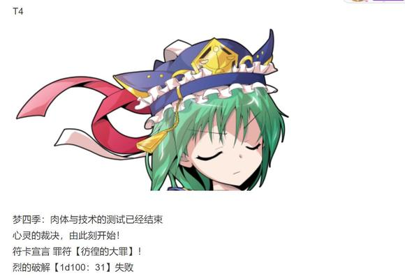

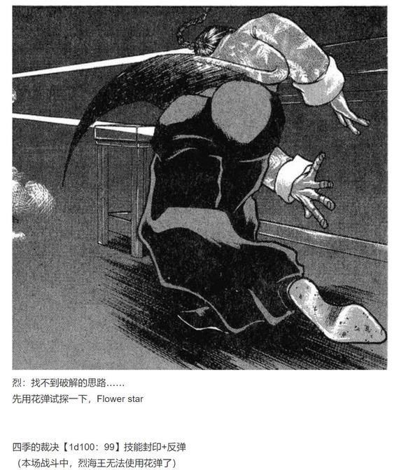

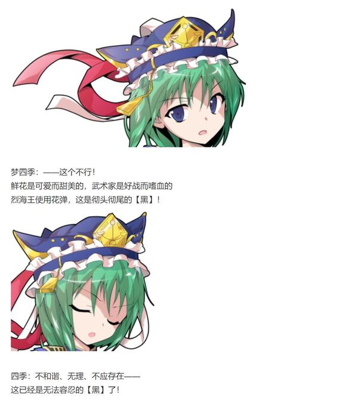

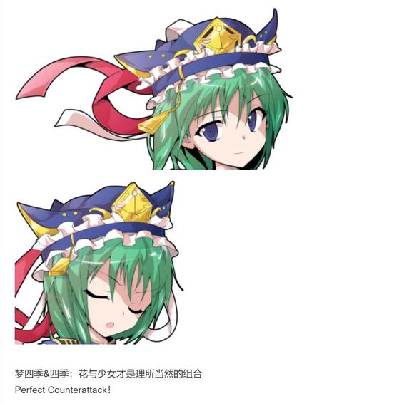

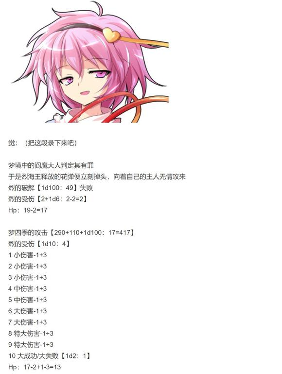

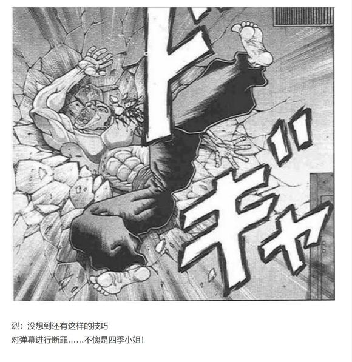

T5

烈：那我也应向您展现我的道路

心存武术，怀抱执着——

纯粹武道发动

四季：我不关心你的武术修为

我要裁决的，是你的心

让他见识一下吧，何为真正的地狱！

梦四季：当然，我Devil Justice正是为此而来

四季&amp;梦四季：居十殿，分四部，判黑白是非

成阎王，役神鬼，掌生死轮回

——符卡宣言 审判【十王审判】！

烈的破解【1d100：23】失败

十种弹幕被分为四个系统依顺序展开

四季映姬凭借纯白的弹幕，与梦境之中凭空构建了是非曲直厅的审判庭

这份力量的真谛并非是单纯的弹幕攻击——

而是将十殿阎魔的审判于此重现

武术家在此刻突然停下了他的攻击

因为他眼中浮现的场景早已不是与阎魔激战的梦境世界

而是他从出生到现在为止所经历的，完整的【一生】

他所有的言行举止都在此刻一一重现

少年时代的狂妄，历经挫折后的成熟，不曾偏离正道的激烈，最终毅然求死的执着——

初来幻想乡时的惊愕，融入此处后的幸福，于恋心之间的迷茫，明断本心后的决绝——

就连觉妖怪的第三只眼也无法穿越重重弹幕的包围而得知此处的场景

只有两位阎魔与受审判的武术家，才能看到这名为【人生】的，诡异而壮阔的画面

四季的攻击 自动成功

梦境中的四季映姬端详着武术家的一生

梦四季：自持武艺，狂傲无礼

拨弄口舌，以言恶人

面对恋情三心二意

面对友情心猿意马

四季：何等大罪……

你改悔吧！

梦境中的阎魔大人抬起了悔悟之棒，并重重敲打在了武术家的头上

烈的受伤【1d10：6】

1 小伤害X3-1

2 小伤害X3-1

3 小伤害X3-1

4 中伤害X3-1

5 中伤害X3-1

6 大伤害X3-1

7 大伤害X3-1

8 特大伤害X3-1

9 特大伤害X3-1

10 大成功/大失败【1d2：2】

Hp：13-3X3+1=5

·T6

阎魔的审判暂时结束了

武者终于从那份震撼之中回过神来

他毫不在意自己肉体之上的痛苦

只是不由自主的留下了眼泪

烈：有好多事情……有好多事情，我都已经完全想不起来了

我不知道该怎么形容这种感受……但是莫名的，有些想哭

谢谢您，阎魔大人

烈海王向着两位四季映姬郑重地行了一礼

四季：认清罪孽，便有机会洗心革面

但无需因此而松一口气——

梦四季：因为我的裁判还没有结束呢！

恐怖就是仁慈，力量就是正义！

审判【Guilty or NotGuilty】！

德之说示发动

红蓝二色的大玉构成了无可逾越的绝对防壁

而在这令人无法喘息的弹幕地狱中央，是阎魔所放出的紫红色魔力洪流！

烈的破解 德之说示【1d100：54】成功

审判【1d100:27】失败

烈的受伤：2-2=0

烈：果然，所谓审判是无法依靠技巧突破的

——那便用我自己的力量，堂堂正正突破它！

符卡宣言 红符【巨阙】

符卡宣言 超人【烈海王】！

Hp：5-2=3

仿佛传说中只手开山的圣人重现于世

武者手持巨剑化作赤色的流星，与阎魔的审判之光正面冲撞在了一起！

烈的攻击【262+80+70-60+650+1d100:82=1084】

梦四季的攻击【290+700+1d100:88=1078】

梦四季的受伤【1d10：5】

1 小伤害X4-2+4+3

2 小伤害X4-2+4+3

3 小伤害X4-2+4+3

4 中伤害X4-2+4+3

5 中伤害X4-2+4+3

6 大伤害X4-2+4+3

7 大伤害X4-2+4+3

8 特大伤害X4-2+4+3

9 特大伤害X4-2+4+3

10 大成功/大失败【1d2：1】

Hp：16-2X4-4-3+2=3

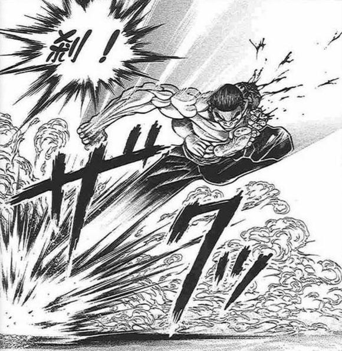

而在短暂的冲突之后

拼尽全力的武术家，突破了这极端重压下的弹幕地狱！

烈：既然是单凭力量所进行的裁决——

那么将其突破之后，自然是无罪可判！

梦四季：——强词夺理！

你怎么可以不讲道理呢！

觉：不不，我觉得你这招也很不讲理吧？

“我的话就是道理”原来如此，那没事了

四季：不要把梦境存在的话当真啊！

T7

梦四季：万般掩饰皆虚妄幻影，镜中所现为真实本性

——你可以逃离出我的地狱，但你能凭力量战胜自己的心吗？

符卡宣言 审判【净颇梨审判 -烈永周-】！

梦境中的四季映姬拿出了先前曾用过的八角镜

那小小的镜中这次倒映出了武者的全部

完全相同的镜中倒影出现在了烈海王的面前

仅限这个回合之内，他的对手变成了自己！

烈：与本心的战斗……

这可没有理由认输！

来吧，烈永周！

两位武术家同时露出了笑容

他们兴奋着，不安着，欢喜着，恐慌着，五味陈杂着冲向了自己——

烈的攻击【262+70-60+1d100：65=337】

梦四季的攻击【272+1d100：54=326】（由于净颇梨审判的效果，基础值变为与烈结算后相同）

与自己的战斗是一种什么样的体验？

攻击是无法预测的，因为过于清楚彼此的手段

蛮力是无法起效的，因为双方的出力永远相同

唯一的不同之处在于出手的时机

分出胜负的关键点在于谁的心中先出现“打倒对方”的想法

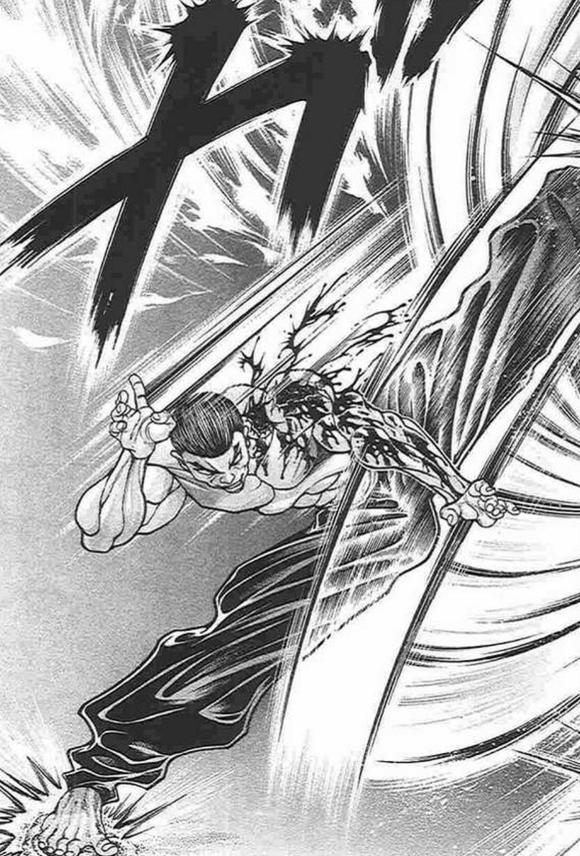

而在这场战斗之中，最先扣下“扳机”的人——

是真正的烈永周

烈：在那两场战斗结束之后，我早已不会因此而感到迷茫了

我是一个会犯错误的普通人

我会因此而深省，会因此而内疚，会因此而痛苦

但我绝不会因此而羞于面对真正的自己！

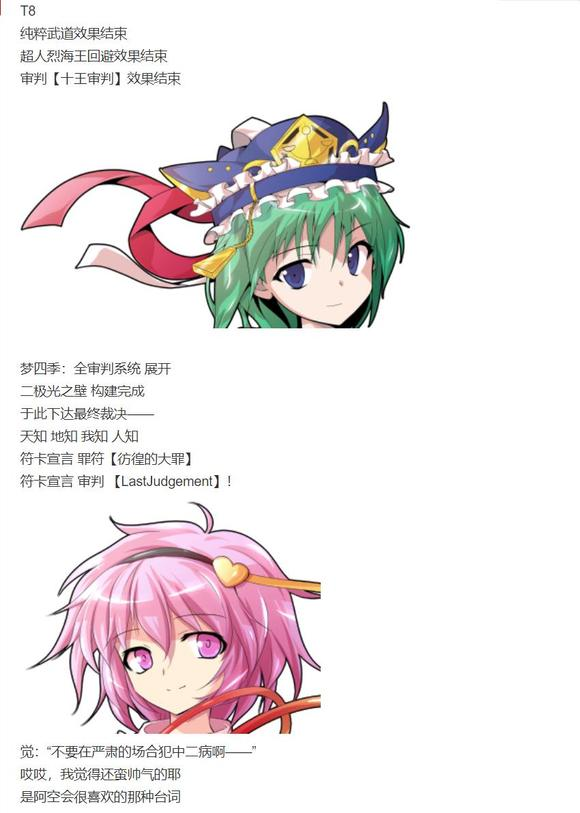

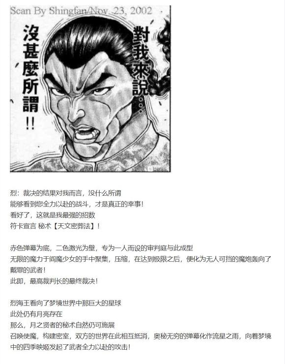

烈的破解 大罪【1d100：88】成功

烈的攻击【262+900+1d100：43=1205】

梦四季的攻击【290+900+1d100：16=1206】

裁决判定【1d100：45】

烈海王本回合不会大成功

烈的受伤【1d10：9】

1 小伤害X6-1

2 小伤害X6-1

3 小伤害X6-1

4 中伤害X6-1

5 中伤害X6-1

6 大伤害X6-1

7 大伤害X6-1

8 特大伤害X6-1

9 特大伤害X6-1

10 大失败

Hp：3-4X6+1=0

最强绝技的正面对抗，在震耳欲聋的轰响中结束了

浑身是血的烈海王自爆炸之中一跃而出，挥拳攻向了绿发的阎魔少女

迎接他的并不是惊慌失措的对手，而是其手中飞射而出的悔悟之棒

四季映姬最后的审判直接击中了武术家的心口

他脸上并未浮现一丝失落，而是立刻决定使用起死回生的急救之术

（由于四季的必杀技无法回避/破解/防御，烈海王无法使用假腿）

烈海王使用了急救拳

梦四季的裁判【1d100：99】成功

但是，真正的四季映姬抬手指向了烈海王

四季：已然失败却仍求苟延残喘，此即懦弱之大罪

梦四季：地狱少女的裁决已经下达，此刻绝无退缩之理

四季&amp;梦四季：妄求再战，死不服输

这是绝对的——

【黑】！

两位四季映姬下达了最后的判决

烈海王拳上的治愈魔力，在其命令之下骤然消逝

武术家只得无奈的笑了笑，便倒在了这片神秘的空间之中

烈：天文密葬法没有输......急救拳也没有输......

最后一刻，却是我烈海王自己输了啊

战斗结束

胜者 四季映姬·夜摩仙那度（梦）！

觉妖怪把武术家拖到了自己的轮椅上

觉：感觉如何？

烈：觉小姐哪还用问？

我烈海王心服口服

梦境中的四季映姬飞到了烈海王的身前

梦四季：Devil Justice大胜利！

此后也请多多支持可爱的地狱少女四季映姬呦~

四季：给我正经点说教！！！

忍无可忍的正牌阎魔一木牌打在了梦中自己的头上

梦四季：哎哎哎~

虽然我很想说教但这有什么可说的嘛，审判都已经结束了啊

烈：四季小姐

我果然是【黑】的？

梦四季：嗯……你觉得有罪之人就是【黑】的吗？

这样一来寻遍所有世界也找不到一个【白】的人了

因为除了洁净的死者之外，所有的生命身上都背负着罪孽啊

四季：我先前与你讲过

取得心与力的平衡，修得真实的自我，这就是现在的你要积累的善行

从这场战斗的过程来看

我很高兴你遵守了我的教诲

