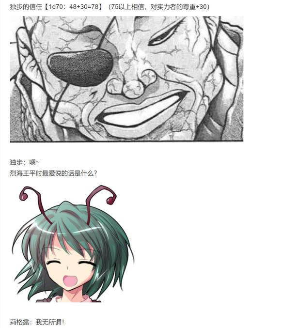
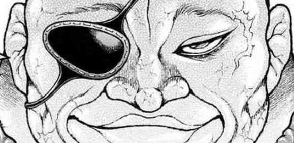
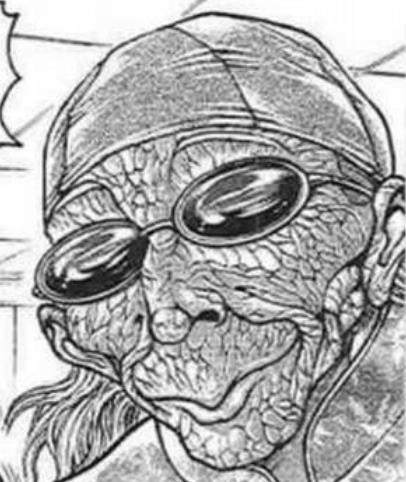

顺便一提，魔理沙的情况如何？【1d10:2】

1 平安解决！

2 又住院了

3 女友成三（你没完啦？）

4 平安解决！

5 又住院了

6 三重约会成功！（你好强大）

7 平安解决！

8 又住院了

9 吃了个爽（真的假的）

10 大成功/大失败【1d2：1】

~第二天~

烈海王正推着魔理沙在竹林中散步

烈：这次是双腿骨折了？

魔理沙：荷取那家伙下手真狠啊……

凭什么你这种渣男平安无事，我却要在这里坐轮椅？！

烈：大概是因为我前段时间刚死了一回？

你今天想吃啥？

给你熬点参鸡汤？

魔理沙：你打的惨但好歹两场战斗就完事了，我这都打好几年了也没结束

我要吃带糯米的！

再来一份烤五花肉！

于是，这个七夕节终于在永远亭的日常风景中结束了

可喜可贺，可喜可贺（？）

（彩蛋环节结束）

大概明天早上八点半更新

又到了原创活动的时间！已经是第五季了！

希望不会出现严肃的发展！

除了约会大作战外就没一次搞笑的活动！

放空大脑后开始烈海王乱七八糟的一天吧！

这件事发生在烈海王来到幻想乡的第【401+1d30:11=412】天

本次的原创活动是【1d10：7】（因为很想写某个活动所以概率X3）

1 莉格露似乎想要挑战格斗家的样子

2 幻想乡最自由的漫画比赛！

3 旧地狱地狱擂台赛再临，与皮克的双人挑战（赫卡提亚也在哦）

4 莉格露似乎想要挑战格斗家的样子

5 魔理沙的约会大作战 第二季（还来吗？）

6 博丽神社的春日祭！

7 莉格露似乎想要挑战格斗家的样子

8 神子：让人类再一次伟大！

9 厨神争霸战：黑暗料理界对战特级厨师！

10 大成功/大失败【1d2：2】

番外篇 莉格露似乎想要挑战格斗家的样子 堂堂连载！

~三途河~

小妖怪武术班下课后，学员们都陆陆续续离开了

只剩下莉格露一个人愁眉苦脸的坐在三途河边，不知道在想些什么

烈：？

有什么心事吗，莉格露？

莉格露的心事是【1d10:8】

1 找不到好对手

2 想打格斗战

3 看不到武术进步的空间

4 找不到好对手

5 想打格斗战

6 其实是恋爱问题（你搞啥啊）

7 找不到好对手

8 想打格斗战

9 想当海王（为啥啊）

10 大成功/大失败【1d2：2】

虫妖怪没精打采的往河里扔了块石头

莉格露：大哥……

我想打架

烈：？

我记得你前几天不是一直在到处约战吗？

莉格露：那些都是弹幕战啦

很多学过的技巧都用不上，这有什么意思嘛？

烈：你想打真正的战斗？

莉格露：对啊！

我学了这么久的武术结果却没法全力施展，这不是很过分的事情吗？！

烈的厚脸皮【1d90：30+10=40】（50以下同意帮忙）

顺便一提莉格露的女子力是【1d100：33】（50以上烈害羞，50以下烈害怕）

烈海王看着娇声娇气的徒弟，脸上露出了惊恐万分的表情

烈：停！快停！

我会想办法帮忙的所以你赶紧松手！

莉格露：做到了！好耶！

虫妖怪放手的瞬间，烈海王就满脸冷汗的窜到了一旁

莉格露：话说大哥你为什么是这个反应？

感觉跟我想象中的不太一样啊……

烈：这都谁教你的？！

是谁教的啊【1d10：7】

1 橙

2 若鹭姬

3 幽香（为啥啊）

4 橙

5 影狼

6 正邪（你搞啥）

7 橙

8 若鹭姬

9 米斯提亚（哈？）

10 大成功/大失败【1d2：2】

莉格露：橙说她每次在家里用这招效果都很好啊？

烈：——莉格露啊

你想象一下，魔理沙穿着轻飘飘的连衣裙抱着你的胳膊说“帮帮我吧，莉格露酱❤”的场景

莉格露：开什么玩笑，要吐了！

烈：你刚刚说话的破坏力大概是那个场景的【1d3：2】倍有余

莉格露的低落持续了【1d10：10】分钟

虫妖怪面无表情地抱腿坐在了河边

莉格露：大哥……

我现在觉得比起打架来说女子力才是更需要**心的东西……

烈：有什么所谓？

只要实力够强，一切问题都能迎刃而解

好了现在说回正题，你还是不能在幻想乡内打真格的

莉格露：哎？

为什么啊？

烈：灵梦小姐推行了这么久的符卡规则，哪能让你一个人的私心就破坏了？

与之相对的——去外界就没问题了

莉格露：外界……

大哥，你是说外界的格斗家们吗？！

小妖怪脸上的颓唐一扫而光

烈：没错

外界跟幻想乡不一样

人们没有这么多稀奇古怪的力量，因此只能运用自己的肉体去追求强大

我的很多朋友都在外面……

跟他们去打一场，对于现在的你来说是个不错的选择

莉格露：哦哦！

放心吧大哥，我会手下留情的！

烈海王的脸上露出了坏笑

烈：手下留情？

呵呵，我劝你才要小心谨慎

他们才不会跟你讲什么武德和人情——

偷袭、用武器、以多打少、攻击要害……

只要能赢，干什么都行，干什么都对！

莉格露：——那不是更好吗！

这样一来无论谁赢谁输都不会有怨言了！这正是我所期待的战斗！

【1d30：7】分钟后，红美铃与莉格露来到了永远亭

武术家与月之头脑正在门口等待着她们

永琳：这次出门的就你们两个吗？

最多【1d24：19】个小时之后就必须要回来了

莉格露：时间好充裕......

大哥你不去吗？

烈去吗？【1d100：98大成功】（75以上去）

烈海王大成功

大成功是什么？【1d10：5】

1 说服影狼同行了

2 师匠：这是能让人认出来的道具

3 铃仙也一起去（为啥啊）

4 说服影狼同行了

5 师匠：这是能让人认出来的道具

6 皮克也一起去（挺正常的）

7 说服影狼同行了

8 师匠：这是能让人认出来的道具

9 大家都一起去（为啥啊？！）

10 大成功/大失败【1d2：2】

烈：说实话我也挺想去的

但这次依然没办正式手续，走在大街上一旁的人们也基本认不出我来……

感觉像是一个孤魂野鬼徘徊在现世之中一般，我想还是算了吧——

话音刚落，一旁的银发女子掏出了几个徽章

永琳：说到这个嘛~

前几天我闲来无事，就顺便开发了这个小东西

具体的原理你们听不懂我就不说明了

它可以让你们在外界正常的被人认出来哦

烈：永琳……

永琳：别在外面闹出什么大动静哦

不然那个爱管闲事的妖怪贤者又会来投诉的

那么做好准备，【1d20：14】秒后出发

14秒后，武术家三人组从永远亭来到了外界之中

本次的降落地点是【1d10:4】

1 神心会本部

2 刃牙的家

3 地下竞技场（现在是谁在打啊？）

4 神心会本部

5 花山组

6 本部的道场（老师你的伤好了吗）

7 神心会本部

8 涉川老师的道场

9 白林寺（老郭在吗？）

10 大成功/大失败【1d2：1】

~神心会馆本部~

在东京市中心，有着一座占地面积极大的老式大楼

它的外侧绘有一副光头男子英勇打虎的挂画

它的顶层挂有一块极其显眼的白色招牌

这便是知名格斗组织，空手道馆 神心会的本部

而来自幻想乡的三人正站在这栋建筑物的门口，凝望着那副独步打虎的壁画

莉格露的震惊【1d100：93】

从未来过外界的虫妖怪，在此刻陷入了震惊之中

莉格露：大哥！那些跑来跑去的铁盒子是什么？！

还有这个是……是建筑物吗？！怎么会有这么高的房子啊！？

红美铃：那些是汽车啦~

外界的房子就是这么高的，不要大惊小怪哦

烈海王拍了拍徒弟的头

烈：你不是想打架吗？

走到这栋楼里面，对那些空手道家说一句话，你就有的是架打了

莉格露：？

说什么啊？

烈：就说——

“我是烈海王的徒弟！”

红美铃：去吧！

我跟烈可不会插手的！

两位武术家把一头雾水的虫妖怪推到了神心会馆的门口，然后便笑眯眯的藏到一旁了

~神心会空手道场~

现在道场有人吗？【1d100：17】（50以上有）

神心会的弟子们已经结束了今早的修行

因此现在道场内仅有武神与虫妖怪这两人而已

而在两人没有注意到的时候，烈与红美铃摘掉了徽章，正在窗外偷偷关注着屋内的情况

愚地独步盘腿坐在了地板上

独步：莉格露

你对【空手道】了解多少？

莉格露对空手道的了解【1d100：97大成功】

莉格露大成功！

大成功是什么【1d10：2】

1 烈海王详细的讲解，本战Atk+5

2 烈海王的针对性特训，对空手道破解判定基础值-10

3 其实我也会超音速拳（真的假的）

4 烈海王详细的讲解，本战Atk+5

5 烈海王的针对性特训，对空手道破解判定基础值-10

6 其实我也会菩萨拳（你从哪学的）

7 烈海王详细的讲解，本战Atk+5

8 烈海王的针对性特训，对空手道破解判定基础值-10

9 其实我也会老三样（草）

10 大成功/大失败【1d2：2】

莉格露：空手道——

追溯其历史，可至中国的崇山

后来传到琉球，在本土化后变成独自的发展，完成了极大的进化

手刀、足刀、拳、掌……基本上用四肢搏斗的技术，空手道都有涉及

我说的没错吧？

独步：你这不是很了解吗~

那我也不必为你做什么演示了

啊啊，你的流派自然是——

莉格露：烈大哥所教我的，只有中华武术而已！

莉格露的战意【1d70：62+30=92】（期待已久的实战+30,50以上开战）

虫妖对着眼前的中年男子摆出了战斗的架势

莉格露：中华武术 莉格露·奈特巴格 请指——

独步：喝！

武神没等她把话说完，就当场发动了突袭！

独步的突袭【1d100：68】

莉格露的躲避【1d100：70】

那粗大的拳头瞬间贴近了虫妖的面庞——

而在攻击命中的前一刹那，绿发的小女孩挥拳击出，正正挡下了愚地独步的突袭

莉格露：你至少听人把话说完嘛

独步：不愧是那个烈海王的弟子

愚地流空手道 愚地独步

让我们开始吧

战斗！

BGM：蠢蠢的秋月　～ MoonedInsect

莉格露·奈特巴格

Atk：150（100）

Hp：17（15）

中华武术：习自烈海王的中华武术，凭借高超的技术使AtkX1.5，Hp+2

四千年的传承：不会陷入异常状态，面对近战系、技术系的技能可以进行【1d100】的破解判定，75以上成功

武之怀（CT3）：莉格露的武学造诣不足，仅能在短时间内重现烈海王的绝技。Atk+50，本回合可对所有技能进行【1d100】的破解判定，近战系、技巧系技能30以上成功，其余技能50以上成功，必杀技75以上成功。

灯符【FireflyPhenomenon】（CT4）：（技巧类）命令萤火虫发出闪亮的光芒，使对方陷入异常状态【盲目】1T，战斗开始时即可发动。

蠢符【Night Bug Tornado】（CT4）：（弹幕类）令小虫们化作螺旋，发出如龙卷般扩散的攻击，对对手造成【1d5】点伤害

必杀技

隐虫【惊蛰连击】（CT6）：将小虫们的力量集于一身，于短暂的时间内爆发出惊人的力量，依靠中华武术给予对手无情的连打。Atk+400，给予伤害X3

【不合时令的蝶雨】（CT7）：Hp归零时发动，？？？

愚地独步

Atk：140（82）

Hp：15

技能

武神：凭借其独创的空手道战斗，AtkX1.7。在异常状态下仍可持续战斗，但本回合给予伤害-1

愚地流空手道：面对近战系、技术系的技能可以进行【1d100】的防御判定，80以上成功

五段式击法（CT3）：（近战系）连续使出五连击给予对手重创，Atk+65，给予伤害+2

空手气墙（CT4）：（近战系）受技的最高境界，本回合受到的弹幕系、技巧系技能伤害-2

散眼（CT5）：【因肢体残缺而无法使用】 3T内自身回避概率X3，给予伤害+2，可对近战系、技巧系技能进行完美防御

必杀技

菩萨拳（CT6）：仿佛婴儿握拳一般毫无杀气的强大攻击。无法回避/破解/防御，可与对手同时进行攻击。

T1

莉格露：让荧光遮蔽你的视野——

灯符【Firefly Phenomenon】！

愚地独步陷入了【盲目】状态

盲目：本回合普通攻击成功的场合进行一次【1d100】的击空判定，30以上时普通攻击失败

独步：哦，将萤火虫作为暗器

真有趣，这想必是你自己的能力吧？

莉格露的攻击:【150+1d100：93=243】

独步的攻击【140+1d100：17=157】

独步的受伤【1d10:6】

1 回避

2 小伤害

3 小伤害

4 中伤害

5 中伤害

6 大伤害

7 大伤害

8 特大伤害

9 特大伤害

10 大成功/大失败【1d2：2】

Hp：15-3=12

战斗开始的第一回合，独步出乎意料的以头槌击出

然而虫妖却以堂堂正正的直拳回击，正中独步的头部！

独步：好硬的拳头！

莉格露：比起烈大哥的崩拳来说，可还差得远呢！

T2

莉格露的攻击【150+1d100：44=194】

独步的攻击【140+1d100：6=146】

独步的受伤【1d10:3】

1 回避

2 小伤害

3 小伤害

4 中伤害

5 中伤害

6 大伤害

7 大伤害

8 特大伤害

9 特大伤害

10 大成功/大失败【1d2：2】

Hp：12-1=11

莉格露：你完全没有认真啊！

独步：心浮气躁可不是什么好习惯❤

T3

莉格露：但我可不会因此而手下留情！

将身体交给武术！

武之怀发动！

顿时，空手道家看到了属于虫妖的武术之影

那并非是所谓的【实体】

但任何一个处于现场的家伙，都能在脑中描绘出那异样的姿态

蝴蝶？蜈蚣？毛毛虫？飞蛾？

螳螂？甲虫？独角仙？瓢虫？

在这绿发少女的身后，浮现而出的像是将所有昆虫的特征糅合而成的可怖之物

毫无疑问，它的真身是——

独步：虫妖，昆虫的妖怪

原来如此……

这可真大啊

空手道家抱手望着莉格露的身后，不由得发出了惊叹之声

莉格露：早就跟你说过了吧，我是虫妖莉格露！

独步：呜呼……

在我面前，站着一位货真价实的【妖怪】

她用着烈海王的武术，要与我的空手道堂堂正正打一场

至福……

五段式击法发动

莉格露的破解【1d100：7】失败

莉格露的攻击【150+50+1d100：48=248】

独步的攻击【140+65+1d100：47=252】

莉格露的受伤【1d10：6】

1 回避

2 小伤害+2

3 小伤害+2

4 中伤害+2

5 中伤害+2

6 大伤害+2

7 大伤害+2

8 特大伤害+2

9 特大伤害+2

10 大成功/大失败【1d2：2】

Hp：17-3-2=12

独步：喝啊！

这个一直以来都表现的慈眉善目的中年老男人此刻终于暴露出了他的本性

他是空手杀虎的拳圣，空手道界的传说，在全盛时期甚至能跟范马勇次郎搏斗的武神！

他猛地踏步向前，向着妖怪的身体正中发出了急速的五连击——

五发重拳全部命中，将虫妖小小的身体打飞到了道场的另一侧！

莉格露：哈……哈……

厉害……完全没有破解的思路

独步：要继续了，接招吧！

T4

莉格露：我可……不会因为这种攻击而倒下！

接招 灯符【Firefly Phenomenon】

蠢符【Night Bug Tornado】！

独步的防御 灯符【1d100：97】成功

蠢符【1d100：46】失败

空手气墙发动

独步的受伤【1d5：3-2=1】

Hp：11-1=10

武神躲过了虫妖再次扔出的萤火虫

而面对其释放的虫之漩涡——

愚地独步左臂沉下，右臂上抬，凭借空气构建出了究极的防御！

莉格露的虫弹根本难以突破他的防御，只有少数漏网之鱼刮到了他粗壮的手臂之上，带来了一丝擦伤

独步：哼~

烈海王还教徒弟扔虫子？

莉格露：他倒是没教过我这招……

但他自己经常扔花

莉格露的攻击【150+1d100：97=247】

独步的攻击【140+1d100：33=173】

独步的受伤【1d10:6】

1 回避

2 小伤害

3 小伤害

4 中伤害

5 中伤害

6 大伤害

7 大伤害

8 特大伤害

9 特大伤害

10 大成功/大失败【1d2：1】

Hp：10-3=7

虫妖一脚踢在了独步的手臂之上

武神揉着胳膊退后了两步，嘴里却毫不留情

独步：踢手臂有什么用！

要踢裆，踢太阳穴，踢眼睛！

莉格露：——受教了！

T5

莉格露的攻击【150+1d100：27=176】

独步的攻击【140+1d100：76=216】

莉格露的受伤【1d10：8】

1 回避

2 小伤害

3 小伤害

4 中伤害

5 中伤害

6 大伤害

7 大伤害

8 特大伤害

9 特大伤害

10 大成功/大失败【1d2：2】

Hp：12-4=8

莉格露尚未来得及抽腿回身，武神便一击手刀命中了她的颈部

虫妖陷入了短暂的失神之中——而空手道家绝不会放过这个机会

他的右腿自下而上高高踢起，正正命中了虫妖的下巴！

独步：魔拳 烈海王的真传弟子，难道就这点水平吗？！

莉格露擦着嘴唇上的血，再次从地上爬了起来

莉格露：少来这套！

我每天都要听烈大哥的骂……你以为你这两句能起到什么效果？！

独步：嘻嘻，明明就很生气嘛❤

T6

莉格露：啊啊，当然会生气——

我才不想倒在他的朋友面前！

接招 隐虫【惊蛰连击】！

武之怀发动

莉格露的攻击【150+400+50+1d100：8=608】

差值大于100自动成功

五段式击法发动

菩萨拳发动

莉格露的破解 五段击【1d100:81】成功、

光头的武神再次使出了三回合前的连打

他冲着虫妖轰出了连续五次重击——

然而，小小的虫妖没有再次重蹈覆辙

莉格露沿着相同的轨迹挥拳击出，凭借自己更胜一筹的肉身力量，以堂堂正正之势击破了武神的绝技！

莉格露：别以为相同的招式能对我成功两次！

现在——

大叔，你尝尝中华武术的厉害吧！

独步的受伤【1d10：2】

1 回避

2 小伤害X3

3 小伤害X3

4 中伤害X3

5 中伤害X3

6 大伤害X3

7 大伤害X3

8 特大伤害X3

9 特大伤害X3

10 大成功/大失败【1d2：1】

Hp：9-1X3=6

武神承受着虫妖那永无止息的连打

但他可从来都不是任人揉捏的软柿子

在莉格露自以为胜券在握之时——

愚地独步的菩萨拳，悄然无息间凑到了她的眼前

莉格露的受伤【1d10：7】

1 回避

2 小伤害

3 小伤害

4 中伤害

5 中伤害

6 大伤害

7 大伤害

8 特大伤害

9 特大伤害

10 大成功/大失败【1d2：1】

Hp：8-3=5

武神那毫无杀气的温柔之拳，直接打破了虫妖骤雨般的攻势！

莉格露：？！

这是什么拳法！？

独步：你平常都在打木桩子吗？！

别以为在你攻击的时候对手就不会还手！

T7

莉格露的攻击【150+1d100：34=184】

独步的攻击【140+1d100：39=179】

独步的受伤【1d10：3】

1 回避

2 小伤害

3 小伤害

4 中伤害

5 中伤害

6 大伤害

7 大伤害

8 特大伤害

9 特大伤害

10 大成功/大失败【1d2：1】

Hp：6-1=5

独步：没有力气了？

要认输吗？

莉格露：怎么可能！

T8

莉格露：在这一回合解决掉你！

灯符【Firefly Phenomenon】

蠢符【Night Bug Tornado】！

独步的防御 灯符【1d100：100】成功

蠢符【1d100：61】失败

空手气墙发动

独步的受伤【1d5：5-2=3】

Hp：5-3=2

莉格露在最近的距离之下发动了虫群的轰击

即使是独步的气墙，也难以将其全部挡下！

莉格露的攻击【150+1d100：1=151】

独步的攻击【140+1d100：93=233】

莉格露的受伤【1d10:9】

1 回避

2 小伤害

3 小伤害

4 中伤害

5 中伤害

6 大伤害

7 大伤害

8 特大伤害

9 特大伤害

10 大成功/大失败【1d2：1】

Hp：5-4=1

但是，虫妖激进的攻击同时也让自己露出了破绽

经验丰富的空手道家顿时放弃了防御，转而以足刀斩出！

武神的足尖深深踢入了虫妖的腹部

莉格露的攻击再次失效了！

独步：太急了！

连对手的行动都毫无预测就这么冲动地攻击过来——

你的师傅可不会犯这种错误！

虫妖用手撑着地板，颤颤巍巍的爬了起来

莉格露：——多谢，您的指教！

T9

独步：喝啊！

五段式击法发动

武之怀发动

莉格露的破解【1d100：90成功】

虫妖的视线逐渐模糊了

她有些看不清眼前敌人出手的轨迹

她也许久没有体验过这样的痛苦了

胃中翻江倒海的感觉让她想要干呕

口中铁锈般的血味让她甚至想举手投降

在这个时候，她才真正明白了烈海王当时为何前来劝阻她的理由

但是——

莉格露：这是我自己提出的战斗……

我也绝不会允许……

让烈大哥的武术输在我的手上！

无需集中精力

无需掌握力量

将身体完全交给武术之后，便会得到它的回报！

绿发的少女拖着濒临极限的身体，在独步惊愕的目光之中破解了他所有的攻击

而后，莉格露拼尽全身的力量，以象征武术的崩拳堂堂击出！

莉格露的攻击【150+50+1d100：77=277】

独步的攻击【140+1d100：71=217】

独步的受伤【1d10：1】

1 回避

2 小伤害

3 小伤害

4 中伤害

5 中伤害

6 大伤害

7 大伤害

8 特大伤害

9 特大伤害

10 大成功/大失败【1d2：1】

但是！

但是！

还有余地！

还有余地！！

愚地独步在最后一刻，将这崩拳躲过去了！

莉格露：——什么！？

独步：有什么可大喊大叫的？

难道你的对手就要傻乎乎的正面与你拼力气吗？

我又不是什么相扑力士——我是空手道家愚地独步！

T10

武神摸了摸脑门上的虚汗

虫妖在这场战斗之中深受重伤，但空手道家自己也绝不轻松

他已经不再年轻了

独步：（几年之前尚能对着断臂谈笑风生，前几天却连胳膊脱臼这点小伤都疼得咬牙切齿……现在才打了几回合就一头虚汗）

（老了，真是老了）

喂，小子！

还能打吗？！

需要急救的话，我认识一个很好的医生哦！

莉格露：哈……哈……

这点小伤对我来讲，没什么所谓！

独步：哈哈，年轻真好啊

那就来吧！

要分胜负了！

莉格露的攻击【150+1d100：87=237】

独步的攻击【140+1d100：48=188】

独步的受伤【1d10：10】

1 回避

2 小伤害

3 小伤害

4 中伤害

5 中伤害

6 大伤害

7 大伤害

8 特大伤害

9 特大伤害

10 大成功/大失败【1d2：2】

愚地独步大失败！

大失败是什么？【1d10:7】

1 小伤害

2 小伤害X2

3 小伤害X2

4 战斗不能

5 战斗不能

6 战斗不能

7 战斗不能

8 被克巳看到了失败的样子

9 被老婆看到了失败的样子

10 大成功/大失败【1d2：1】

没有抬起胳膊的余力了

那就用腿攻击

已经丧失了前冲的力量

那就等待对手自己攻来

武神使用了自己最信任的手刀

而虫妖则选择一直站在原地

她等待着独步的攻击到来

然后，像她的师傅曾经教授的一样——

莉格露侧身回旋，以单腿站立，用迅猛的踢击命中了武神的心口！

莉格露：霸！

空手道家晃了晃身，最终倒在地上失去了意识

而虫妖虽然遍体鳞伤，却终究强撑着站在了道场之上

战斗结束

愚地独步 战斗不能

胜者 莉格露·奈特巴格！

莉格露跌跌撞撞的后退了两步，便被翻窗进来的美铃温柔地扶住了

红美铃：这不是打的很棒吗~

虫妖没来得及搭话，只是看向了一旁站立着的师傅

烈：莉格露

做得好！

听到这句话之后，她终于松了一口大气，并安心的昏迷过去了

莉格露与独步的昏迷持续了【1d60：31】分钟

31分钟之后，愚地独步悠悠醒转

他第一眼看到的事物，是站在一旁的武术家

愚地的震惊【1d100：75】

空手道家揉了揉眼睛

烈：愚地先生，好久不见！

独步：——你真没死啊？！

我还以为花山那小伙子在说胡话……没想到是真的！

莉格露：烈大哥死了还怎么教我啊？

独步：我以为你是他以前收的弟子呢

旁边这位强者是？

愚地独步打量着一旁的红发女子

红美铃：你好啊！

我叫红美铃，是烈和老郭的朋友

那么你们两位先聊着，我和莉格露出门逛逛再过来哈！

莉格露：为什么啊？我也想聊会——

红海皇打了声招呼后，就拖着一脸不满的虫妖怪先出门了

老郭的震惊【1d100：88】

老人家不敢置信的张大了嘴

老郭：啊呀呀呀呀！

烈还活着啊！

莉格露：？怎么你们一个个都说这话？

大哥当然还活着……

虽然他前几天又死了一次，不过现在正和独步大叔在楼上聊天呢

老郭要做什么【1d10:2】

1 先跟我讲讲红海皇

2 指导后辈

3 直接上去找烈吧（你好急啊）

4 先跟我讲讲红海皇

5 指导后辈

6 问问影狼的事吧（为啥啊）

7 先跟我讲讲红海皇

8 指导后辈

9 随便聊聊吧（聊啥啊）

10 大成功/大失败【1d2：1】

郭海皇略微平复了一下心情

他在刚刚听到了许多爆炸性的消息

自己的爱徒还活着，自己多了个虫妖怪当徒孙，似乎有位老友的名字也被提到了

但在此之前，最重要的事情是——

老郭：莉格露

你被打的蛮惨啊~

莉格露：就是说啊！

那个大叔真的好强！

老郭：我来教你两手吧？

烈他不喜欢这些小把戏，但我觉得很有用哦~

莉格露的察觉【1d70:12+30=42】（与老郭的交谈+30,50以上察觉实力）

莉格露：老人家您可歇歇吧

我练得可不是人里居民的那些健身操

这跟您平常打的太极可不一样！

老郭的突袭【1d100:100】大成功

郭海皇大成功！

大成功是什么【1d10：3】

1 影狼：好帅

2 莉——格——露——

3 莉格露的女子力提高了（为啥啊）

4 影狼：好帅

5 莉——格——露——

6 莉格露学会了攻消力（怎么做到的）

7 影狼：好帅

8 莉——格——露——

9 红海皇顺便带了师匠的药过来（什么药啊）

10 大成功/大失败【1d2：1】

矮小的老人在虫妖不屑一顾的目光之中把他那软弱的拳头抬了起来

像是朋友间玩笑般的嬉戏一样，老郭的拳头就这样慢慢靠近了虫妖的脸——

而直到这时莉格露才发现，她所面对的根本不是什么体弱的老人，而是一位更胜武神的格斗家！

莉格露：糟——

“啪！”

老郭的拳头在打中徒弟之前停下了

老郭：唉……

烈这个笨蛋，怎么把你教成了一副假小子的样子？

先去买件新衣服吧！

莉格露：哎？

为啥啊？

于是，老郭带着一脸懵逼的莉格露去购物了

