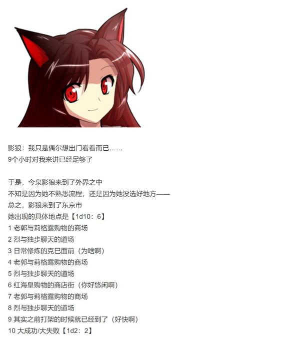
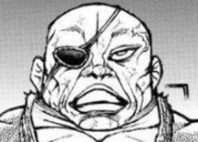
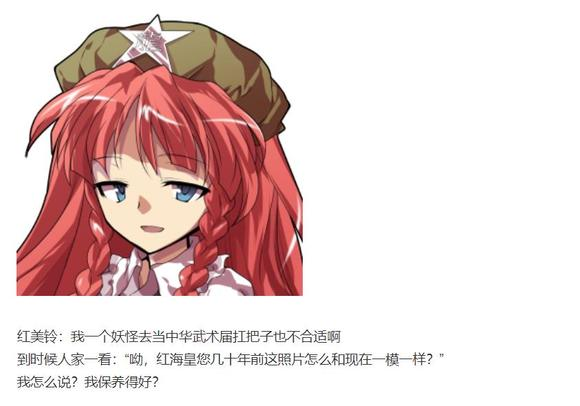
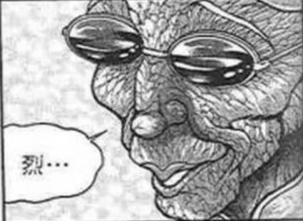
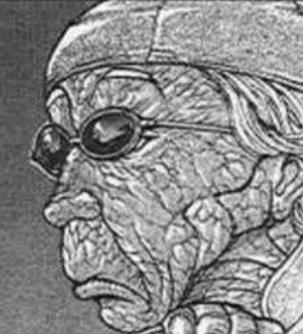
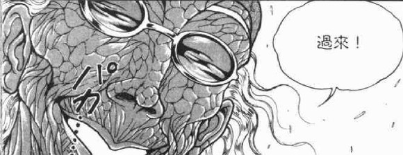
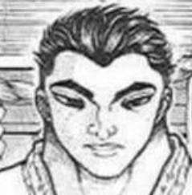
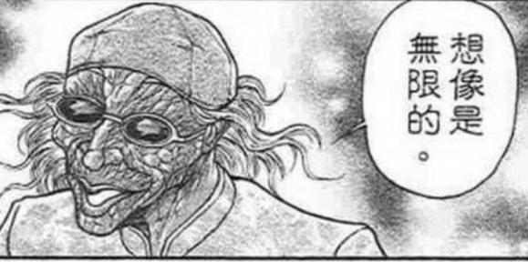
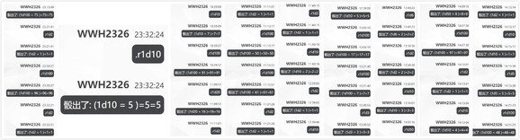
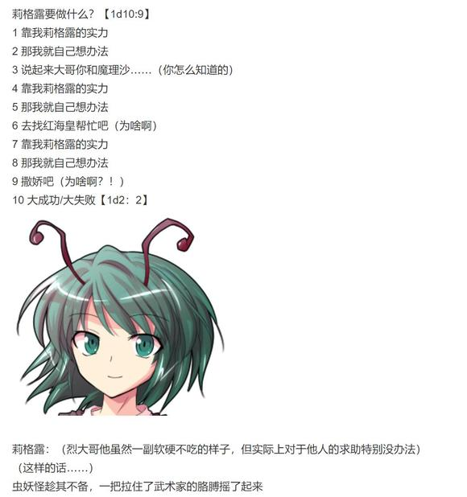

时间来到两个小时之后

~神心会馆本部~

烈与独步正在门口交谈着

独步：你也感受到爱情的沉重啦！

烈：我以前还是太年轻……

经历过这一段之后，看事情的角度会和以前变得不同

若是从前，想必我是会支持莉格露去挑战勇次郎的——

独步：但现在连跟我打架你都要心惊胆战的在旁边看着

小辈的成长、重要的亲情……蠢死了

沉迷在这些温柔的东西里，大家都变得天真啦

烈：或许只有勇次郎还是那副样子吧？

独步：开什么玩笑

他现在可是地上最温柔的男人了❤

两位相较过去变化极大的格斗家谈笑着走出了神心会的大门

尴尬的气氛持续了【1d10：2】分钟

最终先开口的是【1d10：7】

1 红海皇

2 影狼

3 烈（你要先说嘛）

4 红海皇

5 莉格露

6 独步（至福……）

7 红海皇

8 老郭

9 克巳（为啥啊）

10 大成功/大失败【1d2：2】

红海皇的话术【1d100：91】（50以上避免误会，75以上缓解尴尬）

红美铃不动声色的把手里的购物袋塞到了狼妖手中

红美铃：老郭，别真把徒孙当孙女啊！

老郭：人上岁数了就会变成这样啦~

狼妖脸上那扭曲的表情闻言顿时缓和了下来

（注：原作中146岁，时间线过后一年因此为147岁）

147岁高龄的老人家看了看周围的人们

他看到了前途无限的弟子

他看到了死而复生的徒弟

他看到了离别已久的挚友

他同时也看到了，那本应此生无望再见的恋人

郭海皇把墨镜摘了下来，用手揉了揉眼角

老郭：我活了147年啦……

今天是我这辈子，最开心的一天

【1d20：16】分钟后，六人来到了神心会的馆长室

克巳在吗【1d2：1】

1 在

2 不在

独臂的馆长愚地克巳，此刻正在处理今日的公务

他看到老爹对自己招了招手

克巳：老爹，怎么啦？

独步：先出来

给郭老师他们腾个地方吧

克巳的情商【1d100：50】（30以上听话）

年轻的空手道家疑惑的出门后，便看见那位乐为人师的老武术家和两位年轻靓丽的女子走进了馆长室

克巳又一转头，看到了一旁神色尴尬的烈海王与莉格露

克巳的疑惑【1d100：61】

克巳：？

？？

——哈啊？！！！！！！

烈，你没死啊？！

烈：克巳，好久不见！

这是我的弟子，莉格露！

烈海王四人要做什么？【1d10:1】

1 莉格露想要学习新技能

2 莉格露想要继续打架

3 这里就靠我烈海王的厨艺

4 莉格露想要学习新技能

5 莉格露想要继续打架

6 这里就靠我烈海王的直觉（有啥用啊）

7 莉格露想要学习新技能

8 莉格露想要继续打架

9 这里就靠我烈海王的故事会（再讲一遍？）

10 大成功/大失败【1d2：1】

空手道的最终兵器在此时陷入了空前的迷惑之中

他正一脸欣喜的与烈海王交谈着——

而武神则转而与虫妖聊起了刚刚过去的战斗

独步：哎呦，我可真没看出来......

之前可真是失礼了，不好意思啊

——莉格露

你对刚刚的战斗有什么感想吗？

莉格露：真要说的话……

赢得好艰难啊！

我的弹幕都没起到什么效果

（注：当时写选项没考虑好，实际上学会攻消力就等于学会消力了，因此这里学习后是初级消力+攻消力的结果）

红美铃：我看你倒是一点都不生气

影狼：这位连出门打人都是笑眯眯的

就他还能生气？

老郭：心态好活的才能长久~

老家伙们干完活就该退休了，我现在也早就不打架了……

话说回来，烈这段时间想必是受你照顾啦

红美铃：也就刚来那几天，现在可轮不到我照顾他啦

老郭，你教了个好徒弟啊！

两位海皇笑着伸出了拳头

他们将拳轻轻一碰，像是又回到了过去的时光

那时候大家都还年轻，尽管时局动荡，却在心中有着一番大展身手的雄情壮志

如今几十年过去了，当年的年轻人们都纷纷入了土

但那些精彩纷呈的故事却仍然有人记得

它们存在于那些破旧的记载中

也存在于妖怪们与老人的心里

红美铃转身出门了，屋内只留下了老郭和影狼面面相觑

老郭的情商【1d100：17】

郭海皇上下打量着狼妖与她身边的手提袋

老郭：影狼啊

又不是小姑娘了，怎么还出去买这些花花绿绿的衣服？

我觉得这真的不适合你——

影狼：这么久没见面你就跟我说这个？！

我一个女孩子追求时尚有错吗？！

郭海皇不忍直视地捂住了脸

老郭：哎呦，还女孩子哪？

影狼：跟那帮动不动几百上千岁的bba比起来我就是货真价实的女孩子好吧！

倒不如说我是最年轻的那一拨，是少女啊少女！

老郭：好好好

你永远都是我心里的少女啊~

影狼的害羞【1d100：7】

影狼：把“我心里”去掉也一样

真是的……看样子你最近还不错啊

老郭：前段时间那可真是糟透了

不过现在看来，什么问题都解决了

日子终于好起来了~

你呢？

影狼：我现在在和人鱼搞乐队，在人里那边人气还行

——事先说明这次我出门不是来看你的啊！

我都没想到偶尔想出来看看外界的变化都能见到你！

老郭：我无所谓❤

影狼：那是，你除了武术之外一向都是无所谓的！

就算是当年我走的时候，你也根本没来拦我！

老郭：你在外界的日子过得不如在结界里舒服

我为什么要拦着你？

狼妖被老人有理有据的回答噎得说不出话来

影狼：——烈海王、刘海王、还有你......

果然你们白林寺从上到下脑子全都有毛病！

老郭：哎呀，又开始了

每天都得说一遍，到现在也没变

老人和狼妖就这么你来我往的斗着嘴

好脾气的武术家与性急的狼妖从几十年前就是这副模样

因为他们乐于为了这些鸡毛蒜皮的琐事而浪费时光

【1d3：3】小时后，郭海皇与影狼来到了道场之中

烈海王神色恭敬的对郭海皇打了个招呼

烈：郭老师——

莉格露：郭海皇！我想学攻消力！

老郭：你想学？

我教你啊~

老人拍了拍徒弟的肩膀后，便对着徒孙演示起了自己的绝技

武术家们与妖怪们站在道场的一侧，看着这难得一见的珍奇场景

独步：看好了，克巳

这就是【传承】

中华武术传承了4000年……

他们就是这样一招一式的传承下来的

克巳：老爹，郭老师以前也教过我的

你能不能别整天找机会说教啊？

烈：愚地先生也是为了你好嘛……

【1d6：2】小时之后

莉格露：成功了！

学习了两个小时之后，虫妖便初步掌握了郭海皇的绝技

郭海皇：了不起~

你在这方面可比烈还要聪明

以后你就是莉格露海王了！

莉格露：哎！？

但是烈大哥说我不行——

烈海王尴尬的摇了摇头

烈：莉格露，如今的你已经完全可以胜任这个名字了！

莉格露：——好耶！

影狼：简直是溺爱！

老郭：你现在可打不过她咯~

———————————————————

莉格露学会了攻消力

莉格露学会了初步消力

莉格露得到了海王之名

———————————————————

在外界行动的最后一个骰子，临走前几位要做什么？【1d10:3】

1 宴会！

2 武学交流

3 郭海皇故事会（为啥啊）

4 宴会！

5 武学交流

6 恋爱交流（你们搞笑吧）

7 宴会！

8 武学交流

9 果然还是要打架（有完没完）

10 大成功/大失败【1d2：2】

在影狼离去前的最后两个小时，大家坐在神心会馆的道场中，听郭海皇讲述着过去的故事

老郭的说明【1d50：8+50=58】（郭海皇+30，红美铃与影狼的补充+20）

但由于影狼总是插嘴，故事会到后面又变成了两位例行的斗嘴

就在这欢乐而无奈的气氛中，影狼回幻想乡的时间到了

影狼：——多保重啊

老郭：你也一样❤

两人交换了最后一句无关轻重的话语

而武术家们也有再没说什么

该说的话已经说完了

他们相互招了招手，便再次离开了彼此的生活

~永远亭~

烈：收获如何？

莉格露：嗯……

收获很大

必可活用于下一次！

之后我还能去外面打架吗？

烈：会有机会的……

但下一次，我可就不会跟着你了

红美铃：莉格露，有时候也需要自己去战斗哦~

啊，你现在是莉格露海王啦！

拎着大包小包的红美铃与深有所获的莉格露离开了

而告别了妖怪们之后，烈海王也踏上了回家的路

又到了今天的烈海王故事会时间

烈的说明【1d100：97】大成功

惊了，故事会大成功

大成功是什么啊【1d10：4】

1 随机人物好感度上升【1d5】

2 深有所悟 Atk+2

3 月之恋爱脑再临（为啥啊）

4 随机人物好感度上升【1d5】

5 深有所悟 Atk+2

6 幽香很感动（为啥啊）

7 随机人物好感度上升【1d5】

8 深有所悟 Atk+2

9 赫卡提亚很感动（为啥啊）

10 大成功/大失败【1d2：1】

具体来说是哪一位呢【1d10:1】（师匠、幽香与皮克已经满了）

1 铃仙

2 紫苑

3 纯狐（为啥啊）

4 铃仙

5 帝

6 辉夜（为啥啊）

7 铃仙

8 帝

9 赫卡提亚（为啥啊）

10 大成功/大失败【1d2：1】

铃仙的好感度上升了【1d5：5】点！

铃仙的好感度变为84+5=89点了！

烈海王绘声绘色的讲述着今日的故事

从莉格露的初战，到六人见面的尴尬，再到最后别离的场景——

一旁的铃仙甚至听得哭了出来

因幡帝：哇，你没事吧？

铃仙：呜呜呜……

烈先生居然能好好讲话了，而且还是这么温暖的故事……

我好感动啊！

辉夜：不对吧？！前面那个不算泪点吧？！

而且说到底为什么热血漫画发展会一转阖家团圆啊？！

皮克：你那还算是人？

（有带特产回来吗？）

烈：我买了神心会的纪念品回来

比如说这个愚地独步的小雕像

雕像的品质【1d100：48】

永琳：好一般的纪念品……

好了优昙华，不要哭啦

月之贤者瞪了烈海王一眼之后，无奈的安慰着泪点极低的徒弟

而搞不清楚状况的武术家疑惑地挠了挠头，随后便去厨房做菜了……

~第429天结束~

（本日的更新结束，下一次的更新大概在周日或周一）

（以下是我的废话）

想要让莉格露去挑战格斗家！

突然冒出了这个想法，并且特别想写，于是就把这个选项放了三个进去

中了神心会之后的原计划是加藤末堂——独步——克巳这样子，也可能打完独步就结束

结果刚出门就遇见独步了（悲）

话说烈你为什么这么想去啊？！

都已经出去两次了！！！

然后影狼你怎么也来了？！真就筛子大结界啊？！

影狼和老郭一出来我就知道后半段别想打架了，转温馨喜剧吧（悲）

话说独步你好猛啊

武神再临了，这简直是

前几回合我还担心独步会不会垫结果到后面开始担心莉格露会不会垫了（

影狼和老郭的相处有点难写，但红海皇跟老郭聊天就很简单

果然还是友情好啊

那么本次的更新到此结束，下一次的更新应该在周日或周一

骰子刚刚忘了，一会吃完饭发（

原创活动结束了，又到了安价回的时间

今天下午三点的时候我会单开一层作为安价层

格式还是跟之前一样，在【什么地点】遇到【什么角色】

本次安价放开了限制，无论是否登场都可以提出

不过为了保证最基本的世界观，因此人物依然限制为【东方stg正作】【东方格斗作】【东方官方书籍】的登场人物

所以旧作角色是不会加进去的（

顺便附上本次的骰子

（补一下被吞的楼层）

安价楼

烈海王将在【什么地方】与【什么新人物】相遇？

请在此楼回复

再次重申一次，范围仅限于【东方stg正作】【东方格斗作】与【东方官方书籍】中登场的人物，且只能提出一位新人物

1 在【地灵殿】遇见【四季映姬】

2 在【舊地獄溫泉】遇到【星熊勇儀】

3 在【寺子屋】遇上【八云蓝】

4 在【守矢神社】遇见【键山雏】

5 在【三途河】遇见【上白泽慧音】

6 在【永远亭】遇见【稗田阿求】

7 在 【鲵吞亭】遇到【永江衣玖】

8 在【太阳花田】遇到【梅蒂欣·梅兰可莉】

9 在【月之都】遇见【铃仙】

10 在【香霖堂】遇见【上白泽慧音】

烈海王将在【香霖堂】遇到【上白泽慧音】

草草草，复制安价楼内容的时候把忘记把新人物改成所有人物了

不过还好这不影响选项的内容，下次一定记得改（悲）

本次的选项倒是大部分都很安定......大部分......

除了在温泉遇到勇仪那个（悲）各种意义上都会死的吧

次次都有选项的慧音老师终于有出场的机会了，可喜可贺，可喜可贺

由吧友 @望远镜300  制作的视屏第25集更新了！

本期的内容是约会大作战的下篇，大家有兴趣的话就去看看吧！

吧友 @望远镜300  制作的视频第25集悄悄更新了一个p2，是上次正篇后的小彩蛋

大家感兴趣的话就去看看吧！

明天事情很多应该没法更新了，因此下一次更新大概在周一晚上

顺便一提，由于开学了下个星期我得在三天内连考四门试，因此下下次更新大概得到九月六号之后了

？？？

不是吧友们慌啥呢，我就休一周而已又不是要腰斩了，为啥会产生一股子要完结的感觉

真到了快完结的时候我会提前说明的，不要自己吓唬自己啊（

那么正如刚刚所说的下一次更新在周一晚上，之后才会休一周，所以不用着急（

大概今晚七点半左右更新

~这件事发生在烈海王来到幻想乡的第【429+1d30:8=437】天~

烈今天去香霖堂的理由是【1d10：4】

1 普通的去买东西

2 其实是有想要鉴定的物品

3 魔理沙的拜托（为啥啦）

4 普通的去买东西

5 其实是有想要鉴定的物品

6 其实是霖之助的邀请（为啥啦）

7 普通的去买东西

8 其实是有想要鉴定的物品

9 皮克的委托（为啥啦）

10 大成功/大失败【1d2：1】

具体来说是什么？【1d10：1】

1 辉夜想玩GBA

2 假腿的保养器材

3 皮克的新衣（为啥啊）

4 因幡帝的陷阱工具

5 辉针城的新家具

6 铃仙想要新的枪（为啥啊）

7 师匠的医疗器材（原来是采购的？）

8 皮克想收集老杂志

9 幽香的新茶具

10 大成功/大失败【1d2：2】

~永远亭~

烈海王完成了早上的日常训练，正在思考今日的行程

就在这时，永远亭的公主殿下打着哈欠走出了房门

辉夜：哈~

因幡~你看见我的游戏机没有~

铃仙：辉夜大人，我不知道你说的是哪个……

因为你房间里有好多啊

辉夜：GBA啦GBA

就是那个小小的长方形盒子

铃仙：辉夜大人，那个前两天不是被妹红借走了吗？

辉夜：哎？

好像是有这么一回事

头疼，我不喜欢SP和GBM的设计唉，这样的话……

公主大人转头看向了一旁无所事事的武术家

辉夜：烈海王，你今天出门买菜的时候顺便去香霖堂帮我买一个新的回来！

烈：没有问题

那个游戏机是叫GBA？

辉夜：全称是Game Boy Advance

只要把名字告诉那个半妖店主，他就知道该拿出什么商品了

——这么简单的跑腿任务你应该不会出问题吧？

烈：还请您放心

我充分吸取了上次的经验，这次出门前一定会做好万全的准备

就算今天天子小姐再来跟我抢一次，现在我也有自信把商品保住了！

辉夜：自信的方向完全不对！

叫你出门买个东西而已，为什么要做战斗准备啊？

铃仙：毕竟是烈先生嘛~

有人和烈一起出门吗？【1d100：59】（75以上有）

公主大人无精打采地走向了餐桌

武术家与月兔打了个招呼，便独自一人前往香霖堂了

路上有事发生吗？【1d100：28】（75以上有）

一路平安无事

