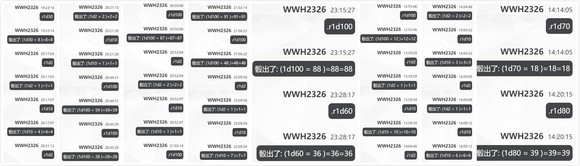

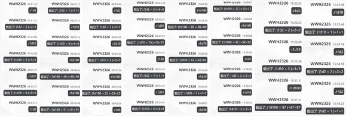

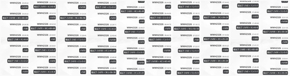

附上本次的骰子

由吧友 @望远镜300  制作的视频第26集更新啦！

本期的内容是阿燐安价回的上篇，大家感兴趣的话就去看看吧！

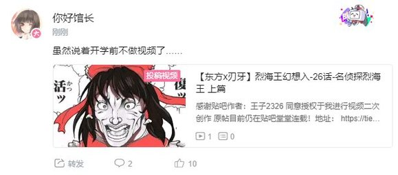

~本部老师的车万小讲堂~

感觉上一次更这个番外篇是不久之前的事情

结果一翻才发现已经是第一季的事了

那么久违的番外环节，今天来介绍一下上次安价回的主角 上白泽慧音吧

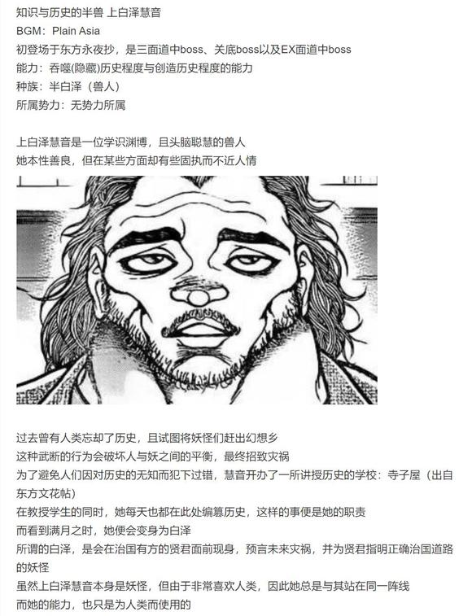

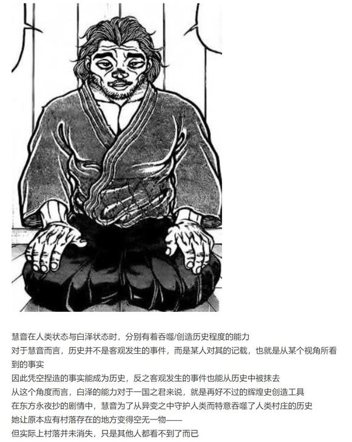

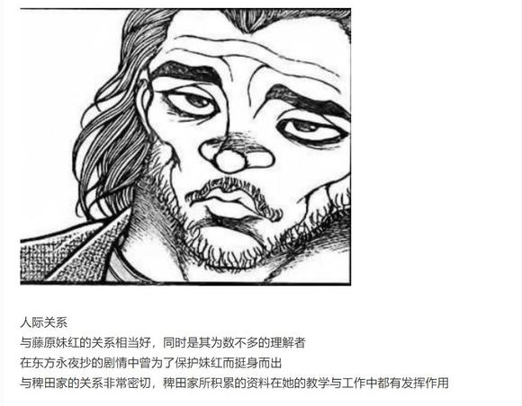

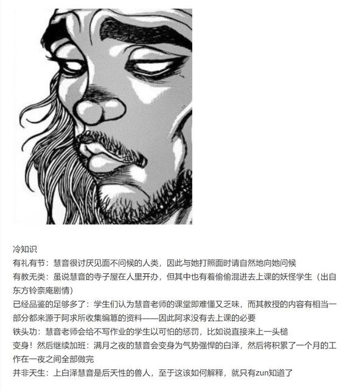

~彩蛋~

~没能用上的恶作剧~

原计划中试胆大会的最终环节是啥啊？【1d10：7】

1 师匠的星象魔法

2 1+辉夜：总之先来个邪神吧

3 友情客串的纯狐（为啥啊）

4 狂暴化的皮克

5 4+一同出场的烈海王

6 友情客串的赫卡提亚（为啥啊）

7 关底boss妹红

8 7+辉夜的双打

9 友情客串的紫苑（搞笑环节？）

10 大成功/大失败【1d2：1】

~寺子屋~

上白泽慧音正在书桌前整理着资料，并与一旁无所事事的妹红聊着天

慧音：现在想想才发现

妹红你那天晚上居然就在现场啊……

莫非那个胡闹的试胆大会你也参与了？

妹红：如果按原计划来，那么我就是镇守关底的最终boss哦

慧音的震惊【1d100：66】（75以上头槌）

慧音：居然要对我出手？！

果然你已经被蓬莱山辉夜带坏了！

妹红：你在想什么啊……

我想测试的是森近霖之助啦

如果那家伙胆敢表现出一点懦弱的样子——

妹红的杀意【1d100：8】（75以上下死手）

妹红：我就象征性的打两下然后把他赶走咯

慧音：好温和的处理方式

妹红：“你的人生在此Game Over了！”

不行啊，可不能对你的心上人说这种台词

兽人放下了手头的书卷

慧音：稍微有些感慨……

没想到我会有被妹红所守护的一天

妹红：上次试胆大会的时候，我也没想到你会出来啊

慧音：理所当然的吧

我可不能看着你被那般莽撞的人欺负

妹红：那么这边也是理所当然的

我可不能看着你被油嘴滑舌的人骗走

慧音与妹红在月下背对背的坐着

如今的她们都变得和过去的自己不一样了

但对于彼此的这份关爱，却从未改变

（彩蛋环节结束）

呕呕呕，可算是考完了

今晚回去开写 视情况在明天或后天更新

今晚七点四十五左右更新

又到了交流回的时间

感觉距离上一次交流回过去了好久，实际上也确实过去了好久

上次的低好感交流回写的感觉有些糟糕，因此本次我打算再次回到原本的格式——还是从高好感角色里骰3个吧

顺便一提由于特殊剧情的发生，师匠与幽香的好感度现在均调整为100，魔理沙破例加入高好感角色中

那么开始今日的交流回（上次安价遇到的上白泽慧音不计入内）

1 师匠 100

2 铃仙 89

3 因幡帝 81

4 皮克 100

5 神子 69

6 圣白莲 78

7 红美铃 80

8 芙兰朵露 96

9 风见幽香 100

10十六夜咲夜 71

11 伊吹萃香 66

12 星熊勇仪 94

13 八云紫 81

14 鬼人正邪91

15 少名针妙丸95

16 西行寺幽幽子69

17 魂魄妖梦82

18 博丽灵梦89

19 火焰猫燐 62

20 古明地恋 87

21 河城荷取 72

22 二岩猯藏 65

23 古明地觉 75

24 东风谷早苗 68

25 稀神探女 83

26 八坂神奈子 68

27 射命丸文 89

28 纯狐 75

29 赫卡提亚 99

30 四季映姬 76

31 比那名居天子 71

32 莉格露 97

33 依神紫苑 93

34 蕾米莉亚 66

35 雾雨魔理沙 19

第一位 【1d35：27】射命丸文

1 师匠 100

2 铃仙 89

3 因幡帝 81

4 皮克 100

5 神子 69

6 圣白莲 78

7 红美铃 80

8 芙兰朵露 96

9 风见幽香 100

10十六夜咲夜 71

11 伊吹萃香 66

12 星熊勇仪 94

13 八云紫 81

14 鬼人正邪91

15 少名针妙丸95

16 西行寺幽幽子69

17 魂魄妖梦82

18 博丽灵梦89

19 火焰猫燐 62

20 古明地恋 87

21 河城荷取 72

22 二岩猯藏 65

23 古明地觉 75

24 东风谷早苗 68

25 稀神探女 83

26 八坂神奈子 68

27 纯狐 75

28 赫卡提亚 99

29 四季映姬 76

30 比那名居天子 71

31 莉格露 97

32 依神紫苑 93

33 蕾米莉亚 66

34 雾雨魔理沙 19

第二位【1d34：25】稀神探女

1 师匠 100

2 铃仙 89

3 因幡帝 81

4 皮克 100

5 神子 69

6 圣白莲 78

7 红美铃 80

8 芙兰朵露 96

9 风见幽香 100

10十六夜咲夜 71

11 伊吹萃香 66

12 星熊勇仪 94

13 八云紫 81

14 鬼人正邪91

15 少名针妙丸95

16 西行寺幽幽子69

17 魂魄妖梦82

18 博丽灵梦89

19 火焰猫燐 62

20 古明地恋 87

21 河城荷取 72

22 二岩猯藏 65

23 古明地觉 75

24 东风谷早苗 68

25 八坂神奈子 68

26 纯狐 75

27 赫卡提亚 99

28 四季映姬 76

29 比那名居天子 71

30 莉格露 97

31 依神紫苑 93

32 蕾米莉亚 66

33 雾雨魔理沙 19

第三位【1d33:19】火焰猫燐

首先是第一位 射命丸文

这件事发生在烈海王来到幻想乡的第【437+1d30：19=456】天

~永远亭~

这天早上，烈海王一如既往地推开了房间的大门，准备开始他全新的一天

就在这时

久违的天狗报纸突袭来了！

烈的闪避【1d100：82】（50以上成功）

武术家侧身闪过了飞驰而来的报纸卷，并顺手接住了它

烈：早上好，射命丸小姐

今天又回到以前的派报方式了？

为大家所熟知的天狗记者正在天空上方向烈海王打着招呼

文文：早啊~

偶尔尝试一下杀必死也不错吧？还能顺便舒缓压力呢

烈：无论怎么看后面那句都才是真正的目的吧？

唉……怎么您今天一大早就来了？

文文的来意是【1d10:7】

1 找不到好玩的新闻

2 文花帖的新弹幕

3 只是普通的闲谈（现在是大清早哎）

4 文花帖的新弹幕

5 文果真报的处理

6 其实是来邀请参加酒会的（为啥啊）

7 文果真报的处理

8 感觉到了不寻常的气氛

9 其实是来挖皮克的八卦的（为啥啊）

10 大成功/大失败【1d2：2】

文文的说明【1d60：11+40=51】（50以上理解，传统的幻想书屋+40）

文文：简单来说，我前段时间一直在忙于制作一本名为《文文春新报》的周刊志

但就结果而言，耗费了众多人力物力的这本周刊志却没能发售

烈：为什么会这样？

我想幻想乡应该没有所谓出版限制吧？

文文的坦诚【1d100：69】（50以下推锅）

鸦天狗用耳旁的铅笔挠了挠头，随后叹了口气

文文：虽然我很想说这都怪那个月之民的计划……不过归根到底是我自己出现了失误

与重视速报性的《文文。新闻》不同，这本周刊志更加注重可读性

越刺激的新闻越有魅力！越刺激的新闻越能引起大家的主意！

抱着这种思想一路写下去，最后得出的报道和原来的材料已经完全不同了

烈：——是那种标题耸人听闻，结果跟实际内容却差了十万八千里的报道？

文文：说实话比那还要过分一点

像是部分裁取照片啊，对受访者的发言进行稍微有些过度的润色啦，还有就是悄悄隐去一些不太重要的信息……

烈：这不完全就是胡编乱造的报纸吗？！

这玩意不出版对大家和射命丸小姐你自己来讲都是好事吧？！

文文：怎么可以！这样一来我的努力该怎么办！

烈：请您把干劲放在正经的地方！

唉真是的……话说为什么这事要来找我啊？

文文：由于本次周刊志的主题是“异界交错与外来者”，因此有关于你的报道也占据了其中【1d6：4】篇左右的篇幅——说实话已经完全是主题之一了

因此就想着先征求一下当事人的意见~

这是我按照普通标准修改过的稿件，你觉得如何啊？

天狗记者从小包里掏出了一本样刊，并将其递给了烈海王

武术家沉默着看了【1d20：15】分钟的书

烈的评价【1d100：74】

烈：射命丸小姐，这比我想象的要好上很多啊！

虽然那十几篇关于其他人的报道有些一言难尽……

但站在一个读者的角度来看，我认为关于我自己的这四篇报道其可读性还是很高的

——但为啥决斗那篇的标题是《烈海王，凋零》啊？

文文：不要在意~那是适度的夸张描述而已~

如此看来，我的重修工作做得还是蛮到位的嘛

那么在都市传说异变已经结束的现在，就这样重新出版也没问题？

烈的答复是【1d10：5】

1 部分内容需要重写

2 部分内容需要删除

3 我觉得可以（为啥啊）

4 部分内容需要重写

5 再添加一篇个人专访吧

6 娱乐性不足（还嫌乐子不够多吗）

7 部分内容需要重写

8 我不想说的太失礼……

9 需要加入战报环节（为啥啊）

10 大成功/大失败【1d2：2】

烈：凭借射命丸小姐你的笔力，如果把剩下那些离谱的报道再按这个标准改改应该也能行

全部修改完毕之后……要不要试试再新增一篇个人专访呢？

文文：再来一篇？

现在这些内容已经很足了啊

烈：话虽如此，但您这周刊志是完全凭依异变之前写成的

在现在这个时间点来看，很多新闻都已经过时了

针对最近的话题人物，新增一篇时效性较强的专题报道大概能吸引更多的读者吧？

最近的话题人物是【1d10:4】

1 依神紫苑

2 依神女苑

3 幽香（为啥啊）

4 依神紫苑

5 帕秋莉

6 皮克（为啥啊）

7 依神紫苑

8 雾雨魔理沙

9 琪露诺（为啥啊）

10 大成功/大失败【1d2：1】

文文：果然说到话题人物就是最近引发异变的贫穷神

《特约专访：异变幕后的辛酸往事！》

就把这个当做重新发售时的专题报道吧！

话说紫苑现在在哪啊？【1d10:8】

1 安定的永远亭蹭饭中

2 旧地狱魔鬼特训

3 和天子准备宴会（为啥啊）

4 安定的永远亭蹭饭中

5 旧地狱魔鬼特训

6 真正的地狱修行（为啥啊）

7 安定的永远亭蹭饭中

8 旧地狱魔鬼特训

9 人里闲逛中（你老大呢）

10 大成功/大失败【1d2：2】

烈：说起来前两天赫卡提亚说要把紫苑小姐带到旧地狱去磨炼一下气势……

该不会她现在还在那吧？

文文：咦？

贫穷神还和那位赫卡提亚氏有关系吗？

烈：该说是认识了新的朋友，还是说找到了新靠山呢……

总之她现在过得应当比以前好些了

等我做完早饭后跟您一块去看看吧

要给您也做一份吗？

文文的饥饿【1d100：81】

文文：那真是多谢了~

我还没吃早饭呢

烈：这也太敬业了……

稍等我给您做份便当吧

【1d3：2】小时后，武术家与天狗记者来到了旧地狱

~旧地狱的街道~

“救命啊————”

贫穷神少女的惨叫声正在旧地狱中回荡着

游手好闲的鬼们则纷纷拿着酒葫芦站在一旁，并幸灾乐祸地看着街道中央的惨剧

烈：——这是在干啥啊？

路人鬼：呦，烈师傅！

勇仪大人这两天在带新人嘞！

武术家和天狗将视线投向了惨叫传来的方向

那里正站着某位可怜的少女，以及她和蔼可亲的教官们

勇仪：先来一遍自我介绍！

紫苑：我是……贫穷神，依神紫苑……

勇仪：没有劲！

阿空：听不清！

萃香：根本听不见！

阿燐：重来！

恋恋：这么小声还想发动异变？！

紫苑的干劲【1d100：4】大失败

依神紫苑大失败！

大失败是什么【1d10：6】

1 企图逃跑并立刻失败了

2 赫卡提亚加入了教官队伍！

3 和勇仪打起来了（为啥啊）

4 企图逃跑并立刻失败了

5 烈海王加入了教官队伍！

6 被文文抓拍了精彩瞬间（草）

7 企图逃跑并立刻失败了

8 走投无路的紫苑跳进了温泉里

9 6+文文一块录像了（为啥啊）

10 大成功/大失败【1d2：1】

紫苑：我是！！！最凶最恶的贫穷神！！！依神！！！紫苑！！！

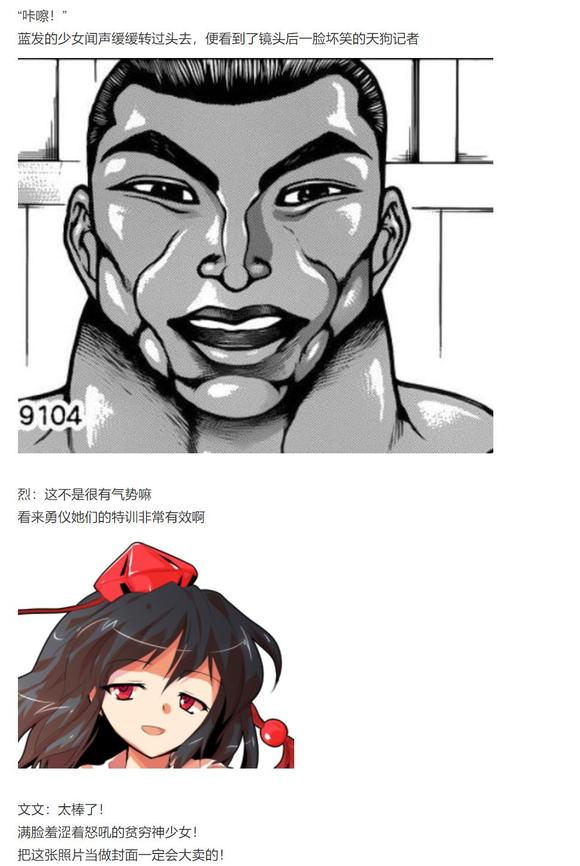

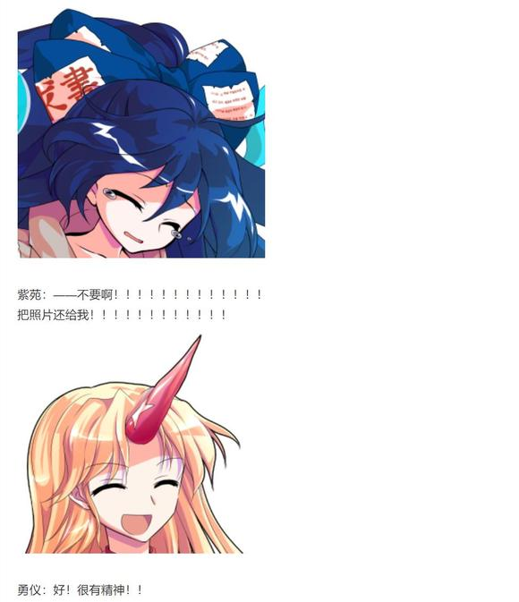

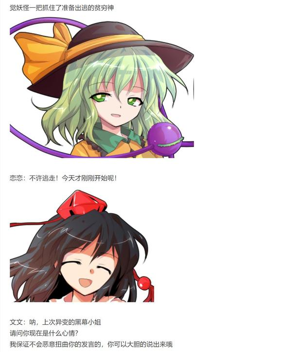

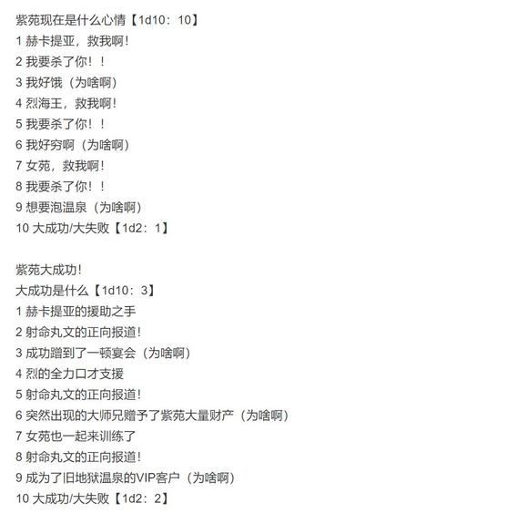

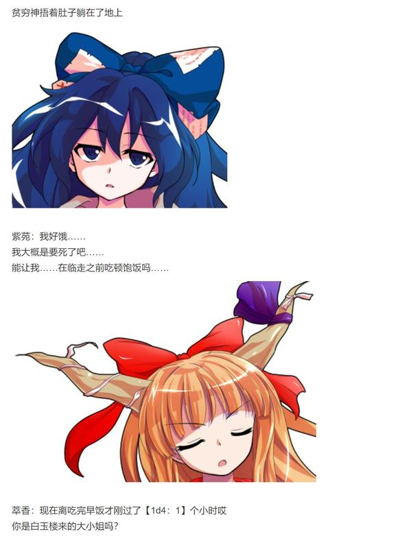

勇仪：也不能让她饿着肚子挨训啊

小的们，开宴会啦！吃完饭接着训练！

烈，来露一手？

烈：没问题！

紫苑：没想到我能在旧地狱吃上永远亭的饭……

啊……我好幸福……

文文：“幸福的人生只要有一顿饱饭就够了”

何等简朴的价值观啊

顺便问一下，你当时发动完全凭依异变的动机是什么？

紫苑：是因为我很穷......于是就想着发动异变来抢观众们的钱财......

我已经有好好悔过了

文文：不用这么紧张，你身后那几位当初也参与过异变的

能继续问几个问题吗？

我打算给你做一篇专题采访哦

紫苑：哎哎？！

专访？！关于我这种人的吗？！

我还从来没体验过这种待遇，真是太谢谢你了！

于是，天真的贫穷神就这样配合起了天狗记者的采访

而妖怪和鬼们则再次在旧地狱的街道上开起了宴会

烈：原本说是来帮忙采访的

结果为啥我这一早上全都在做饭？

文文：干老本行不好吗？

我可一直都坚守在第一线工作哦

烈：您在书里那篇采访中明明有抱怨日常工作太多导致没有时间休假吧？

文文：那是对匿名天狗A的采访！

跟我清廉正直的射命丸文是没有一丁点关系的！

烈的情商【1d80：12+20=32】

烈：我想但凡有点常识的人都能通过照片看出来那是谁吧

射命丸小姐，还是别把上司当成笨蛋比较好

文文：不要在娱乐新闻里讨论这么现实的东西啊……

天狗记者在旧地狱的宴会中为之后的报道打着草稿

武术家则在一旁为她提供着大部分时间都没啥作用的建议

这混沌而又和谐的场景，正是幻想乡中稀松平常的日常之缩影……

顺便一提，《文文新春报》正式发售后的人气是【1d70：46+30=76】（紫苑的封面照片+30）

烈：销量相当不错啊！

文文：贫穷神贡献出的那张照片真是绝赞~

果然还是要有冲击性的话题感才能刺激人们的购买欲！

进行了一次还算愉快的交流

射命丸文的好感度上升了【1d5:3】点

现在好感度为89+3=92点

第二位 稀神探女

这件事发生在烈海王来到幻想乡的第【437+1d30:11=448】天

具体的事件是【1d10：3】

1 探女探女想说话

2 普通的来永远亭做客

3 探女似乎想开店的样子（为啥啊）

4 探女探女想说话

5 对上次围攻事件的报复

6 对幻想乡天邪鬼的调查（为啥啊）

7 探女探女想说话

8 成为赛事解说吧！

9 探女想要挑战搞笑艺人（不可能吧）

10 大成功/大失败【1d2：1】

草，具体来说是什么店啊【1d10:5】

1 逆转命运的万事屋

2 月之都进口水雷专卖店

3 可丽饼店（为啥啊）

4 逆转命运的万事屋

5 哆来咪进口美梦

6 团子店（你来抢生意的吗？）

7 逆转命运的万事屋

8 是我自己画的同人志

9 卖章鱼烧吧（为啥啊）

10 大成功/大失败【1d2：1】

~永远亭~

这天中午，烈海王刚从人里卖菜回来，就看到屋里那块手写板正微微闪着光芒

烈：是稀神女士的通信？

让我看看……

探女（手写）：(｀･ω･)中午好，烈海王

你这两天有空吗？

烈（手写）：稀神女士您好

我这段时间很清闲，有什么需要我帮忙的吗？

探女（手写）：(=ﾟωﾟ)= 其实我决定趁这几天的假期开一家贩卖【梦】的店铺

ﾟ∀ﾟ)ノ其名为“鹭与貘的梦之屋”！

烈：（手写）您作为月之都的贤者为什么要来幻想乡开店啊？

而且还是在难得的假期？

探女的理由是【1d10:9】

1 这是计划的一部分

2 薪水不足

3 学习八意大人（为啥啊）

4 这是计划的一部分

5 薪水不足

6 是哆来咪的请求（为啥啊）

7 这是计划的一部分

8 薪水不足

9 最近相关的小说看多了（你也开始了？）

10 大成功/大失败【1d2：1】

探女（手写）：(ノﾟ∀ﾟ)ノ贩卖梦想的店铺听上去不是挺浪漫的吗

就像小说里写的一样：我没有梦想，但我可以卖给你们梦想！

烈（手写）：听上去完全变味了……

话说为啥不找兔子们帮忙？

探女（手写）：QAQ现在体制改革后月兔们的劳务费水涨船高

偏偏这是我的私人爱好又没得报销……因此只能来幻想乡找帮手了

报酬的话给你【1d5：3】成的收入可以吗？

烈（手写）：不不不这太多了

月兔们的要价到底高到什么程度了才会让您开出这种价码？！

您没必要给我报酬的，毕竟我也就顺手帮帮忙而已

探女（手写）：(*ﾟ∀ﾟ*)多么良心的劳动力啊

如果你不想要钱的话我就留一个梦给你吧

哆来咪那边的货源很充足，我想这几天大概是卖不完的

那么等明天放假我就来幻想乡试营业一段时间，看看地上人们对【梦】的需求如何

月之贤者又发了几个颜文字后便切断了通信

武术家耸了耸肩，转头为探女考虑起了合适的开店地点

于是，一天之后

~第449天~

探女开店的地点是【1d10：4】

1 考虑到人流量果然还是人里

2 面向妖怪的话去妖怪之山也不错

3 太阳花田（为啥啊）

4 考虑到人流量果然还是人里

5 魔法森林那边顾客也蛮多的

6 旧地狱（认真的吗）

7 考虑到人流量果然还是人里

8 博丽神社的场地费很便宜呢

9 永远亭（为啥啊）

10 大成功/大失败【1d2：1】

~人间之里~

武术家在人里边缘的街道租了一间小商铺，并在门面上挂上了写着“鹭与貘的梦之屋”的招牌

烈：稀神女士，您看怎么样？

考虑到商业区那边人来人往的您可能会不太适应，我特地找了个相对偏僻的铺子

这边虽说普通顾客比较少，但前来购物的妖怪们大概会多些

对于贩售【梦】的店铺来说，应该是个相对合适的位置吧

探女的厌恶度【1d70:26+30=56】（污秽的地上顾客+30,75以上换地方）

探女（手写）：比起我想象的那种遍地污秽的环境要好多了

这样一来不穿防护服也没问题！

烈：您要真穿的话客人也会被吓跑的吧……

话说哆来咪小姐去哪了？

探女（手写）：哆来咪说懒得跑来现实世界抛头露面，所以就在梦境世界负责运输货物啦

(*ﾟ∇ﾟ)营业的时候我遇到过于污秽的客人可以把他们赶出去吗？

为什么要露出那种表情？我知道了我不会做的 (`ε´)

烈海王出门宣传新店铺了

烈的宣传【1d70：22+30=52】（大家的老熟人烈海王+30,50以上两位客人，75以上三位客人）

“贩卖梦的店铺听上去好不靠谱啊”

“不会是那种收钱之后灌点心灵鸡汤就赶人出门的店吧？”

“但毕竟是那个烈海王说的……厨神应该不会在这里骗人的”

探女（手写）：——突然感觉没什么干劲了

烈：稀神女士您想开点，这才开业第一天嘛

这里毕竟是人里，我也不能在大街上宣传月之都或者梦境世界之类的东西……

您看这不就来客人了吗

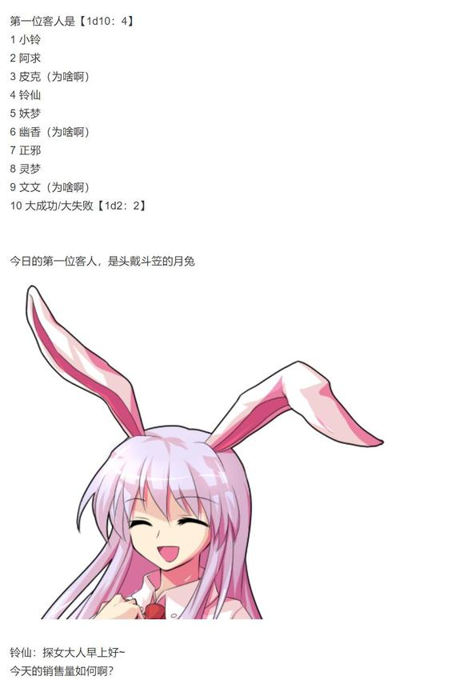

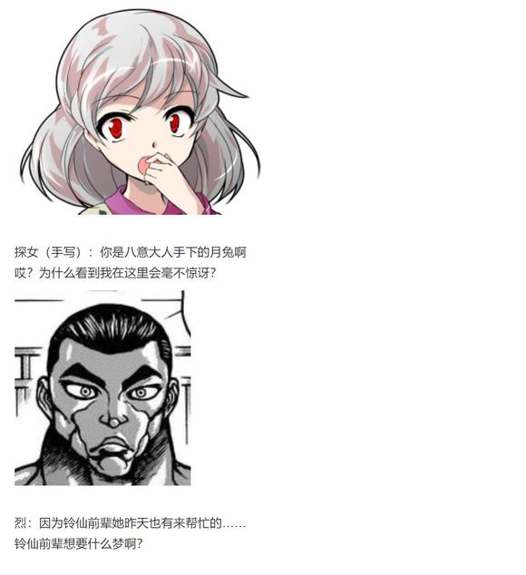

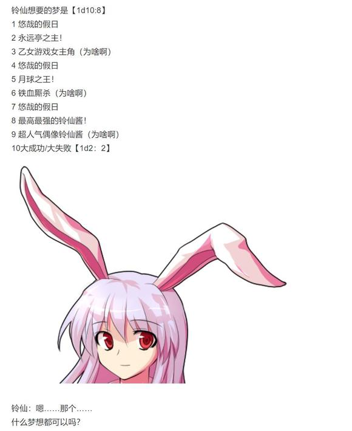

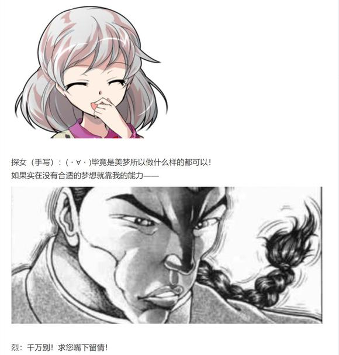

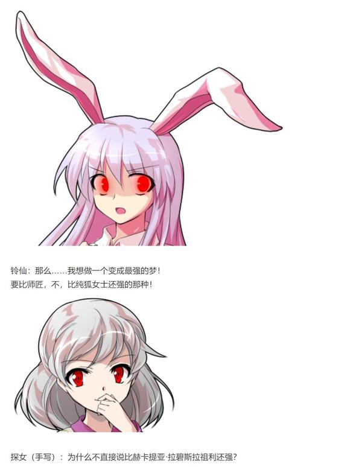

烈：稍等我去仓库找找有没有合适的梦啊……

库存梦境的吻合度【1d50：17+50=67】（哆来咪的造梦+50，60以上达标）

探女（手写）：变成超强实力者的美梦倒是有挺多的……

不过其中大部分都是相对男性向的梦(ﾟ∀。)

我觉得那些发展对你而言有些太过刺激了

如果要找相对温和些的梦境，实力大概只能到大妖怪的等级

铃仙：已经很好了！

我本来也只是想要体验一下强者们的感觉~

烈：话虽如此，铃仙前辈你本来实力也不差啊

铃仙：离那种能够独当一面的势力领袖还差得远呢

我也想被小妖怪们尊敬着称呼为“铃仙大人”啊

探女的笑点【1d100：98】大成功

探女大成功！

大成功是什么【1d10：4】

1 铃仙大强化！

2 今日的总销量超高

3 探女学会了很厉害的搞笑技巧（那是啥）

4 铃仙大强化！

5 今日的总销量超高

6 铃仙变成了小妖怪（为啥啊）

7 铃仙大强化！

8 今日的总销量超高

9 铃仙的气质变得非常高贵（为啥啊）

10 大成功/大失败【1d2：1】

正在永远亭的劳务二人组交谈之时——

被戳到笑点的天探女大人，不自觉笑出了声

探女：噗呲

铃仙变成了大妖怪，这种事情怎么可能在现实世界中发生啊

探女：啊糟了！！！

天探女大人一脸慌张地捂住了嘴

烈：我的娘嘞！

铃仙前辈！

你现在情况怎么样？！

铃仙的强化幅度是【1d50：4+50=54】（探女大成功+50，74以下Atk+35，75以上大妖怪）

铃仙：好奇怪……怎么说呢……

我现在感觉非常好

身体里充满了力量！

这莫非是探女大人的力量吗？！

探女（手写）：(´ﾟДﾟ`)你的命运刚刚似乎被我改变了

虽说连我本人都不能推断出我说话之后的变化……

不过现在看来事态似乎是朝着“铃仙变成了大妖怪”的方向发展了

烈：这还有卖梦的必要吗？

探女（手写）：(`д´)本店不接受退款！

共计【100X1d100：23=2300】元！

铃仙：不会退款的啦！

话说这梦感觉好便宜？

烈：这种类型的梦库存相当多

大概是因为大家的心里都有一个想要成为强者的梦想吧、

铃仙：总之真是多谢探女大人了！

真没想到我居然能以这种方式变强……

探女（手写）：千万不要告诉八意大人啊！

告别了眼神变得很吓人的天探女与一脸无奈的武术家，铃仙哼着歌离去了

本日的第二位客人是【1d10：4】

1 阿求

2 小铃

3 皮克（为啥啊）

4 阿求

5 堇子

6 幽香（为啥啊）

7 灵梦

8 魔理沙

9 师匠（草）

10 大成功/大失败【1d2：2】

【1d6：4】个小时后，无所事事的月之民与烈海王终于等来了今天的第二位客人

她留着一头紫色的中长发，头上佩戴着形似山茶花的发饰

她上身穿由绿色上衣与黄色印花长袖所构成的和服，下着红色的长裙，双足穿白袜，踩木屐，看上去像是位传统的和风少女

推门而入的客人，是与烈海王有过一面之缘的少女：幻想乡的记忆 稗田阿求

烈：我记得您是稗田阿求小姐吧

欢迎来到鹭与貘的梦之屋，请问您想购买什么样的美梦呢？

阿求的好感度【1d100：31】

紫发的少女皱了皱眉头，并后退了一步

阿求：（没想到店员会是这个好勇斗狠的武术家……）

你好，烈海王先生

没想到这是你开的店啊

探女（手写）：烈海王是我请来的店员，本人稀神探女才是真正的店长

ﾟ∀ﾟ)σ那么污秽的地上人，你想要什么样的美梦呢？

在此之前先骰一下某两人恋爱模拟战的倾向度以决定梦境的选项

【1d100：9】（越低越偏向阿求侧，越高越偏向小铃侧）

天啊……

阿求想要的梦是【1d10：9】

1 如常人一般老去

2 想和皮克一起过幸福的人生

3 想要成为拳击大师（为啥啊）

4 如常人一般老去

5 想和皮克一起过幸福的人生

6 想要成为真正的名侦探（为啥啊）

7 如常人一般老去

8 想和皮克一起过幸福的人生

9 想要尝试妖怪退治（为啥啊）

10 大成功/大失败【1d2：1】

阿求：（这位女士一看就知道不是人类呢）

污秽的地上人这说法好过分啊……

咳咳，言归正传

我想要购买一个退治妖怪的美梦！

烈：？？？

退治妖怪是指……像灵梦和魔理沙那样？

阿求：没错！

皮克君每次来的时候都会跟我讲他打弹幕战的经历

那听上去真的很有趣……

在现实之中，我应当是无法像你们一样在空中潇洒的飞行了

所以至少，让我在梦中体验一次做【英雄】的感觉吧！

烈对阿求的了解【1d70：64+30=94】（烈的情报收集+30,75以上得知寿命）

不应把自身的愿望寄托在虚无缥缈的梦境之中

即使是手无缚鸡之力的少女，在经过锻炼之后也是能和弱小的妖怪正面搏斗的

因此你现在应当做的是学习与战斗相关的技术

武术家原本，是想这么说的

但烈海王想起了他在过去曾收集过的情报

其中关于稗田阿求的那条是：

历代的御阿礼之子寿命无法长久，大概活不过30岁

烈：——还请您稍等片刻，我找找有没有类似的梦境

于是烈海王有些沉重的答应了一声，转头走进了仓库之中

探女的察觉【1d70：6+30=36】（天探女+30,75以上察觉）

探女（手写）：铃仙也是，你也是，为什么一个个都想着在梦中不劳而获呢

果然是地上人的陋习？

阿求：我想这和地上人或是天上人没有关系

想要不劳而获，想要强大的力量，想要实现永恒的美好——

明知这些事情不可能在现实中发生，却仍然在心中对此存有渴望

因此，人才会去追求那虚幻的梦吧

探女的认同【1d100：25】

银发片翼的女神大人有些奇怪地偏了偏头

探女（手写）：梦只是一时之间的安慰，却终究不是真正的现实

哆来咪认为美好的梦境可以带来欢乐，但在我眼中这不过是转瞬即逝的泡影

(・ー・) 一朝醒来之后，一切如常

阿求：那么，您为什么还要开这家店呢？

探女（手写）：哼哼~你无法理解吧

我没有梦想，因为我认为这毫无意义

(・∀・) 但我可以卖给你们梦想

象征性的收取报酬后，给予他人短暂的美好，这是件相当浪漫的事情

你不这样觉得吗？

和风的少女坏笑着摇了摇头

阿求：嗯~该怎么评价是好呢？

我想探女小姐您绝不是没有梦想的

因为您现在所开办的这家店铺，不正是所谓“不切实际”的梦吗？

探女（手写）：这只是我闲暇之余的个人爱好而已！

阿求：与日常相差甚远的爱好，平日无力实现的愿望，这同样也是梦啊

绝大多数人都只能在脑中空想，白日做梦，而您却成功将其付诸于现实之中

从这个角度来看，探女小姐您在追寻梦想的道路上比我要走的更远呢

天探女大人抱着手写板陷入了沉思之中

这时，烈海王从仓库里出来了

库存梦境的吻合度【1d50：46+50=96】大成功

梦境大成功！

大成功是什么【1d10：5】

1 一个无可挑剔的美梦，极大激发了阿求的创作欲

2 “你的梦想是不可能实现的”

3 阿求试用后的全力宣传，美梦销量暴涨

4 一个无可挑剔的美梦，极大激发了阿求的创作欲

5 “你的梦想是不可能实现的”

6 与皮克做了一样的梦（为啥啊）

7 一个无可挑剔的美梦，极大激发了阿求的创作欲

8 “你的梦想是不可能实现的”

9 美梦成真了（这合理吗）

10 大成功/大失败【1d2：2】

烈：这是库存中最好的一个梦境！

我想除非那位梦之支配者亲自为您再定制一个，否则绝对无法找到第二个像它一样美妙的梦了

这个梦的价格为【100X1d100：75=7500】元

阿求：好贵？！

你们不会在恶意抬高价格吧？

烈：这价格都是稀神女士定的，我也不知道标准是啥……

要不您去问问她？

与此同时，稀神探女正在柜台后思考着自己的梦

探女：（过去我想要成为月之都的高官，在奋斗了一段时间后便成功了）

（之后遇到了月之都的危机，我想要保住我所居住的城市便临危受命，虽然身陷重围但依旧圆满完成了任务）

（此后月都大变，风雨飘摇，我所求不过保住立足之地，最终却成了月之贤者……）

（这几天只是觉得小说中的情节有趣，回过神来时自己便已经开办了一家店铺）

（如此说来，我并非没有梦想，而是凭借着超绝的判断力与行动力，使得我稀神探女往往能在努力拼搏后达成自己的目标）

然而，这小女孩却只是污秽而短寿的地上人

由于能力所限，她的梦想终其一生都无法实现了吧……

探女：啊怎么又说出来了！！

银发的女神大人今日第二次捂住了自己的嘴唇

烈：——稀神女士！

您刚刚那句话的效果是什么？！

察觉到话语内容的武术家猛地转头看向了身旁的月之民

探女（手写）：QAQ我不知道啊

我的能力是让事情原本的走向被完全破坏

但之后的发展如何，是我自己都无法控制的

烈：也就是说“阿求小姐原本无法实现梦想”的现状被您打乱了

但之后的走向却完全是在一片混沌之中？

探女这句话所带来的影响是【1d10：2】

1 阿求的转生期限被减缓到了自然死亡之时

2 阿求可以亲眼看到幻想乡缘起完结的样子（此后无转生）

3 区区寿命论，看我稗田阿求把它打碎掉（这是啥啊）

4 阿求的转生期限被减缓到了自然死亡之时

5 阿求可以亲眼看到幻想乡缘起完结的样子（此后无转生）

6 完全攻陷了原始人（为啥啊）

7 阿求的转生期限被减缓到了自然死亡之时

8 阿求可以亲眼看到幻想乡缘起完结的样子（此后无转生）

9 阿求被暂时强化到了自机水准（为啥啊）

10 大成功/大失败【1d2：1】

阿求：如果要说我本人最大的梦想……那应当是看着《幻想乡缘起》被编篡完成吧

倒不如说，这是所有的“我”千百年来都持有的，共同的梦想哦

烈：——那如果这本书被您所编写完毕了，事情又会变成什么样啊？

阿求：这可难说了

本来这本书是作为保护人里的资料而编写的

可在现在的幻想乡，大多数情况下人类都不会被袭击吃掉……

这么多年过去后，这本书的意义也在不断的变化

如果有朝一日我真能亲手将其完成，我可能会停止这持续了上千年之久的转生吧？

阿求：说的有些太多了……

那么这个梦境我就先拿走了

两位再见

紫发的少女付款后收起了桌上的梦魂，之后就离开了店铺

探女（手写）：她刚刚提到过的转生是什么？

烈的说明【1d100：70】（50以上理解）

烈：简单来说，在遥远的过去，有位名为稗田阿礼的史官

她或者他有着过目不忘的能力，绝不会忘记所记住的东西

稗田阿礼想要凭此来为幻想乡的人类编写一本名为《幻想乡缘起》的史书

但是，由于常人的寿命所限，她或者他终其一生都没能做到这一点

探女（手写）：因此就选择了转生这一手法？

把自己的能力传给下一代，然后令他继续自己未完成的工作？

烈：是的……但根据我的调查，御阿礼之子在转生之后能够继承的也只有这份过目不忘的能力而已

他们无法继承上一代的记忆，而因为种种原因……

他们的寿命往往无法超过30岁

探女（手写）：真可悲啊

我现在大概能推断出刚刚那句话所带来的影响了

烈：您觉得会是什么？

天探女身后的翅膀无意识地扇动了两下

探女（手写）：我想，她在有生之年应当能够看到那本书被编写完毕的样子

这应该算是她最大的梦想——

而在其实现之后，稗田阿求就没有了转生的理由

烈：她会变成普通的女孩子吗？

还是说，仍然会在30岁之前倒下？

探女（手写）：谁知道呢？

我所带来的只是对于某一事件走向的破坏

而事件最终的结局，只能取决于当事人自身的想法和行动了

就像你们去支援月之都那时一样，如果没有你们的帮助，哪怕我说出再多的话，最终的结局也极可能是纯狐换了一种攻击手法，亦或者赫卡提亚直接出手与贤者们正面交锋

烈：即使有着改变命运的力量，最终的结局也依然只能靠自己决定吗......

武术家与月之民在今日关店之前收拾着屋内的道具

贩卖而出的梦是否具有价值？

还是说，其实店主本人的话语才是真正有意义的事物？

无人知晓真正的答案

但至少，店主与服务员都认为这天的工作并非是虚度光阴

因为他们的确在此改变了些什么……

梦之屋最终的人气是【1d100：96】大成功（50以上回本，75以上大赚）

大成功是什么？【1d10:8】

1 趁此机会完成了月之都的宣传任务

2 幻想乡中掀起了追求梦想的正能量之风

3 月之都连锁店堂堂开业（为啥啊）

4 趁此机会完成了月之都的宣传任务

5 幻想乡中掀起了追求梦想的正能量之风

6 哆来咪接手后变为了幻想乡常驻店铺（为啥啊）

7 趁此机会完成了月之都的宣传任务

8 幻想乡中掀起了追求梦想的正能量之风

9 深受实力者们的喜爱（为啥啊）

10 大成功/大失败【1d2：1】

虽说第一天的营业额十分惨淡

但在永远亭众人的帮助，以及客户试用后的宣传之下

探女的店铺在短短的一周之间，就成为了全幻想乡最火的地方！

店主本人自然是赚的盆满钵满，而购买梦的客户们在看到银发女神在手写板上那无情的嘲讽之后，不知为何居然燃起了追求梦想的热情！

一时之间，斗志昂扬的妖怪们与在夕阳下奔跑的少年少女，成为了幻想乡中常见的风景

探女（手写）：(＾o＾)ﾉ梦之屋大成功！

这一次真的是赚翻啦~

果然还是分你3成吧？

烈：您说笑了

我不过随手帮些小忙而已，钱财对我来讲没有什么所谓

还是跟之前说好的一样，送我一个梦便是了

——话说回来您不考虑接着开店吗？

探女（手写）：(´ρ`)很可惜，我的假期结束了……

而且哆来咪那边也没法保持长期供应呢，这次售出的梦已经是很长一段时间的积累了

烈：明明是假期的娱乐，最终却能发展到这般程度……

您果然是天才啊

探女（手写）：那还用说？

于是，天探女带着愉快的笑容和爆满的钱包，结束了她心血来潮的假日时光

与稀神探女进行了一次愉快的活动

稀神探女的好感度上升了【1d5：4】点

现在的好感度为83+4=87点

