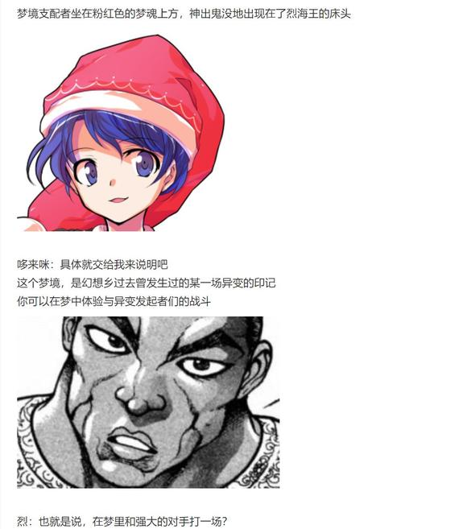

烈：这是库存中最好的一个梦境！

我想除非那位梦之支配者亲自为您再定制一个，否则绝对无法找到第二个像它一样美妙的梦了

这个梦的价格为【100X1d100：75=7500】元

阿求：好贵？！

你们不会在恶意抬高价格吧？

烈：这价格都是稀神女士定的，我也不知道标准是啥……

要不您去问问她？

与此同时，稀神探女正在柜台后思考着自己的梦

探女：（过去我想要成为月之都的高官，在奋斗了一段时间后便成功了）

（之后遇到了月之都的危机，我想要保住我所居住的城市便临危受命，虽然身陷重围但依旧圆满完成了任务）

（此后月都大变，风雨飘摇，我所求不过保住立足之地，最终却成了月之贤者……）

（这几天只是觉得小说中的情节有趣，回过神来时自己便已经开办了一家店铺）

（如此说来，我并非没有梦想，而是凭借着超绝的判断力与行动力，使得我稀神探女往往能在努力拼搏后达成自己的目标）

然而，这小女孩却只是污秽而短寿的地上人

由于能力所限，她的梦想终其一生都无法实现了吧……

探女：啊怎么又说出来了！！

银发的女神大人今日第二次捂住了自己的嘴唇

烈：——稀神女士！

您刚刚那句话的效果是什么？！

察觉到话语内容的武术家猛地转头看向了身旁的月之民

探女（手写）：QAQ我不知道啊

我的能力是让事情原本的走向被完全破坏

但之后的发展如何，是我自己都无法控制的

烈：也就是说“阿求小姐原本无法实现梦想”的现状被您打乱了

但之后的走向却完全是在一片混沌之中？

探女这句话所带来的影响是【1d10：2】

1 阿求的转生期限被减缓到了自然死亡之时

2 阿求可以亲眼看到幻想乡缘起完结的样子（此后无转生）

3 区区寿命论，看我稗田阿求把它打碎掉（这是啥啊）

4 阿求的转生期限被减缓到了自然死亡之时

5 阿求可以亲眼看到幻想乡缘起完结的样子（此后无转生）

6 完全攻陷了原始人（为啥啊）

7 阿求的转生期限被减缓到了自然死亡之时

8 阿求可以亲眼看到幻想乡缘起完结的样子（此后无转生）

9 阿求被暂时强化到了自机水准（为啥啊）

10 大成功/大失败【1d2：1】

阿求：如果要说我本人最大的梦想……那应当是看着《幻想乡缘起》被编篡完成吧

倒不如说，这是所有的“我”千百年来都持有的，共同的梦想哦

烈：——那如果这本书被您所编写完毕了，事情又会变成什么样啊？

阿求：这可难说了

本来这本书是作为保护人里的资料而编写的

可在现在的幻想乡，大多数情况下人类都不会被袭击吃掉……

这么多年过去后，这本书的意义也在不断的变化

如果有朝一日我真能亲手将其完成，我可能会停止这持续了上千年之久的转生吧？

阿求：说的有些太多了……

那么这个梦境我就先拿走了

两位再见

紫发的少女付款后收起了桌上的梦魂，之后就离开了店铺

探女（手写）：她刚刚提到过的转生是什么？

烈的说明【1d100：70】（50以上理解）

烈：简单来说，在遥远的过去，有位名为稗田阿礼的史官

她或者他有着过目不忘的能力，绝不会忘记所记住的东西

稗田阿礼想要凭此来为幻想乡的人类编写一本名为《幻想乡缘起》的史书

但是，由于常人的寿命所限，她或者他终其一生都没能做到这一点

探女（手写）：因此就选择了转生这一手法？

把自己的能力传给下一代，然后令他继续自己未完成的工作？

烈：是的……但根据我的调查，御阿礼之子在转生之后能够继承的也只有这份过目不忘的能力而已

他们无法继承上一代的记忆，而因为种种原因……

他们的寿命往往无法超过30岁

探女（手写）：真可悲啊

我现在大概能推断出刚刚那句话所带来的影响了

烈：您觉得会是什么？

天探女身后的翅膀无意识地扇动了两下

探女（手写）：我想，她在有生之年应当能够看到那本书被编写完毕的样子

这应该算是她最大的梦想——

而在其实现之后，稗田阿求就没有了转生的理由

烈：她会变成普通的女孩子吗？

还是说，仍然会在30岁之前倒下？

探女（手写）：谁知道呢？

我所带来的只是对于某一事件走向的破坏

而事件最终的结局，只能取决于当事人自身的想法和行动了

就像你们去支援月之都那时一样，如果没有你们的帮助，哪怕我说出再多的话，最终的结局也极可能是纯狐换了一种攻击手法，亦或者赫卡提亚直接出手与贤者们正面交锋

烈：即使有着改变命运的力量，最终的结局也依然只能靠自己决定吗......

武术家与月之民在今日关店之前收拾着屋内的道具

贩卖而出的梦是否具有价值？

还是说，其实店主本人的话语才是真正有意义的事物？

无人知晓真正的答案

但至少，店主与服务员都认为这天的工作并非是虚度光阴

因为他们的确在此改变了些什么……

梦之屋最终的人气是【1d100：96】大成功（50以上回本，75以上大赚）

大成功是什么？【1d10:8】

1 趁此机会完成了月之都的宣传任务

2 幻想乡中掀起了追求梦想的正能量之风

3 月之都连锁店堂堂开业（为啥啊）

4 趁此机会完成了月之都的宣传任务

5 幻想乡中掀起了追求梦想的正能量之风

6 哆来咪接手后变为了幻想乡常驻店铺（为啥啊）

7 趁此机会完成了月之都的宣传任务

8 幻想乡中掀起了追求梦想的正能量之风

9 深受实力者们的喜爱（为啥啊）

10 大成功/大失败【1d2：1】

虽说第一天的营业额十分惨淡

但在永远亭众人的帮助，以及客户试用后的宣传之下

探女的店铺在短短的一周之间，就成为了全幻想乡最火的地方！

店主本人自然是赚的盆满钵满，而购买梦的客户们在看到银发女神在手写板上那无情的嘲讽之后，不知为何居然燃起了追求梦想的热情！

一时之间，斗志昂扬的妖怪们与在夕阳下奔跑的少年少女，成为了幻想乡中常见的风景

探女（手写）：(＾o＾)ﾉ梦之屋大成功！

这一次真的是赚翻啦~

果然还是分你3成吧？

烈：您说笑了

我不过随手帮些小忙而已，钱财对我来讲没有什么所谓

还是跟之前说好的一样，送我一个梦便是了

——话说回来您不考虑接着开店吗？

探女（手写）：(´ρ`)很可惜，我的假期结束了……

而且哆来咪那边也没法保持长期供应呢，这次售出的梦已经是很长一段时间的积累了

烈：明明是假期的娱乐，最终却能发展到这般程度……

您果然是天才啊

探女（手写）：那还用说？

于是，天探女带着愉快的笑容和爆满的钱包，结束了她心血来潮的假日时光

与稀神探女进行了一次愉快的活动

稀神探女的好感度上升了【1d5：4】点

现在的好感度为83+4=87点

最后一位 火焰猫燐

这件事情发生在烈海王来到幻想乡的第【437+1d30：3=440】天

具体的事件是【1d10：2】

1 遇到了运货中的阿燐

2 只是普通的闲聊

3 安定的社畜酒会（还喝吗）

4 遇到了运货中的阿燐

5 厨艺交流赛

6 与阿空吵架了（为啥啊）

7 遇到了运货中的阿燐

8 侦探事件的临时搭档

9 久违的弹幕战！（为啥要和阿燐打啊）

10 大成功/大失败【1d2：1】

~旧地狱~

这天晚上，烈海王刚刚结束了旧地狱的酒会，正朝着地上的方向前行

这时，他看到了一旁正推着猫车的火车妖怪

烈：阿燐小姐，好久不见

阿燐：哦呼，是名侦探啊

咱总感觉你最近好闲的样子

闲聊的内容是【1d10:1】

1 关于阿燐的工作

2 关于阿燐与阿空

3 关于过去的异变

4 关于阿燐的工作

5 关于阿燐的能力

6 发牢骚（你刚喝完酒哎）

7 关于阿燐的工作

8 关于阿燐的符卡

9 关于温泉（为啥啊）

10 大成功/大失败【1d2：2】

烈：这段时间相对来说比较平静

别说异变，就连日常委托都没几个

我每日除了练武和做饭外，也确实没什么事情可做了

阿燐：真好啊~

咱可是天天都勤勤恳恳推着车子，在旧地狱与地上之间跑上跑下的呢

烈：说起来我从很久以前就想问了

——为啥阿燐小姐你每天都要运那么多的……尸体啊？

烈海王前去看了眼猫车内部的内容物后，便赶紧退了回去

阿燐：毕竟咱是火车妖怪啊

专为运载罪人至地狱之车就是火车~

因此咱的能力就是带走尸体程度的能力嘞

烈：所以这主要是出自于你的天性？

阿燐对工作的喜爱【1d100：12】

红发的少女苦着脸摇了摇头

阿燐：虽说火车是有着追逐从死者身上一瞬脱出的灵魂的习性

不过咱喜欢的其实是跟尸体或者怨灵交流哦

它们在大多数时候都意识不到自己已经死了，讲起话来很有趣的

但是把尸体运来运去就是纯粹的体力活了，说真的好累喵

烈：搞不懂……那你为什么还要天天运尸体啊？

阿燐：因为这是地狱火焰遗迹的重要燃料哦

阿空每天的工作就是把咱运来的尸体看情况扔进去，以此来调整火力

唉，但是现在运尸体也变得越来越麻烦了

人们现在都喜欢在命莲寺安葬遗体，跑去那地方偷东西可真够吓人的……

烈对此的看法是【1d10:10】

1 要试着换种燃料吗？

2 让恋小姐帮个忙吧？

3 开个火葬场吧（为啥啊）

4 要试着换种燃料吗？

5 无能为力……

6 和守矢神社联合启动能源革新吧（为啥啊）

7 要试着换种燃料吗？

8 帮助阿空控制力量吧

9 改成收购的方式吧（为啥啊）

10 大成功/大失败【1d2：2】

烈海王大失败！

大失败是什么【1d10:1】

1 为什么不烧石头呢

2 激怒阿燐后享受了一把猫车

3 被偷盗尸体后，愤怒的追兵追来旧地狱了！

4 为什么不烧石头呢

5 激怒阿燐后开战了（不要啊）

6 间歇泉从二人脚下爆发啦！

7 为什么不烧石头呢

8 阿空大暴走！

9 开价100000元一具！（草）

10 大成功/大失败【1d2：1】

烈：既然阿燐小姐你自己也不太喜欢这工作……

那为什么不尝试着换点新燃料呢？

阿燐：像是木材之类的？

烈：我觉得我们可以尝试一下烧石头！

你看，整个旧地狱最不缺的就是石头，如果把这些岩石当成燃料，那岂不是随取随用吗？

火车妖怪眯着眼扫了武术家一下

阿燐：烈海王

你今天这是喝了多少啊？

烈：我才喝了【1d6:1】个小时而已，怎么可能醉呢？

来来来，我这就搬两块石头拿去试试！

~灼热地狱遗迹~

阿燐面无表情的看着武术家扛着两块巨大的石头扔进了核熔炉之中

烈：阿燐小姐你看！效果怎么样！

阿燐：喵，炉心好像堵了

阿燐：咱觉得阿空看到这场面之后会很生气

会超级生气

会生气到咱和觉大人一块上都劝阻不动的程度

烈的情商【1d80:29+20=49】

烈：为啥会没效果呢……

忍无可忍的阿燐抓起武术家的衣领摇了起来

阿燐：因为一般来说根本没人会把一块比咱还高的石头砸进炉子里，你这醉酒侦探！！！！

烈：哦哦哦哦哦哦我知道了我知道了，我会在阿空小姐上班之前把烂摊子收拾好的！

烈的搬运持续了【1d4：4】个小时

烈：总算是把这石头搬出来了……

为啥我刚才会做出这么傻的事情啊？

阿燐：因为你喝多了！

明明酒量不行却天天去和勇仪大姐拼酒，你就不能对自己有点数吗？

于是，武术家和火车妖怪一直忙活到快半夜才回到了地上

进行了一次堪称喜剧的交流

阿燐的好感度上升了1点

现在的好感度变为62+1=63点

阿燐：他人倒是真挺热心的……

但为什么有时候做事却能这么离谱呢？

~不知何处的神秘空间~

？？？：最近真是悠闲啊

温暖的春日结束了，仲夏的季节来临了

真是个适合出门的好时候~

就趁着这个机会，把该做的事情一鼓作气，全部搞定吧

炎热而愉快的夏日到来了

妖精们在幻想乡中四处散播这属于她们的活力，而妖怪们与人类们在看到这般景象后也不由得露出了微笑

就在这活力四射的日子里

幻想乡的第三位贤者，准备开始活动了

（本日的更新结束，下一次的更新在周四或周五）

（以下是我的废话）

总体而言是十分安定的一次更新

虽说和骰到的选项有关系，不过果然我太久没写东西手也有些生疏了（笑）

不过探女回的大成功有点多啊？

你们这开的到底是贩卖梦想还是美梦成真？

其实后面的客人全都是冲着店主来的吧？！

铃仙前辈一个大成功直接跟上版本了，好耶！

阿求也终于找到了寿命论的突破口，好耶！

......但皮克那边对小铃有70的专心程度唉......希望下次别抽到皮克或者阿求或者小铃......

最后一段剧情按理来说其实可以一转战斗回的，但我骰不动了，所以就这么先收尾了

毕竟阿燐交流回和阿燐打架有点太......

下一次的更新是大异变，某位贤者终于该正式出场了

那么本次的更新就到此结束了，骰子明天发

下一次的更新在周五或者周四，看情况吧

附上昨日的骰子

~稗田邸~

原始人正注视着在桌前写书的少女

皮克（手写）：阿求，你这书到底要写多久啊？

阿求：这本幻想乡缘起吗？

不会再写很久……

大概等到下一次的异变结束之后，我就会选择将其正式完成吧！

皮克（手写）：都写了这么久了突然就这么结束了！？

我就随口一问而已啊！！

紫发的少女跳起来拍了拍原始人的肩膀

阿求：所以说，你明明脑子不聪明就不要想这么多啊

这事情和你没有关系……

只是我在最近才发现，我，或者说历代的御阿礼之子，都只是在做一个虚无缥缈的梦而已

皮克（手写）：这事不是你们家代代相传的任务吗？

阿求：你知道吗，皮克君

《幻想乡缘起》这本书，原本是为了保护人类而写的

将妖怪的弱点记录下来，将躲避妖怪的方法书写下来，将危险的地区标志出来——

如此，才能在这妖怪遍地的幻想乡之中守护脆弱的人类

正因怀着这份责任感，以及对史书本身的热爱，过去的阿礼才会选择将其不断延续下去

少女老成的叹了口气

阿求：但是，时代不同了

在当今的幻想乡，人类被妖怪吃掉的事情已经很少发生了

虽说人与妖怪对立的局势仍然存在……但这方面的真实情况，你是比我还要更加清楚的吧？

皮克（手写）：上次调查小铃小姐失踪案的时候就讲过吧，人与妖怪是相互依存的……

离开了任何一方都无法生存下去，现在的幻想乡就是这样奇妙而又不正常的社会啊

阿求：结果到头来，明明是为了保护人类而写的书籍，妖怪们却欢快地跑来说“把我写的可怕一些吧！”“希望给我加上XXX的能力”

内容也变成了帮妖怪们写上注意事项，日常琐事，以及和谐相处的方法这样的东西

皮克（手写）：变成了与一开始的目标完全不同的书了

阿求：就是这样哦

我本就对此的存在意义抱有一定怀疑——

而在见到那位探女小姐之后，我便更加坚信了我心中抱有的念头

《幻想乡缘起》是御阿礼之子所共同抱有的梦

我以平凡人的身份追求着这份遥不可及的梦想

但沧海桑田，世事变迁

梦境中的美好已经失去了赖以生存的土壤

是时候从梦中醒来，直视现实了

阿求的坦诚【1d100：86】（75以上说出余命）

皮克（手写）：那不是很好吗！

这样一来阿求你的工作就终于结束了！

以后可以去干点其他事情了！

原始人奋笔疾书的手停了下来

因为眼前的少女露出了有些悲伤的表情

阿求：是啊……以后的日子会变得很轻松吧

我可以经常去铃奈庵串门了

平时有空的时候就跟慧音一起编写其他的史书

还可以继续写那套侦探小说

皮克君的恋爱模拟也是，差不多也该开始模拟约会了吧？

我还想试试去打符卡战斗呢……

阿求说话的速度慢下来了

她转过身去，不再面对着身后的朋友，而是用手捂住了脸

阿求：——但是我去问过阎魔大人了

她说即使不再转生，身为常人的我也只有30岁可活了！

她颤抖着发出了呜咽的声音

温热的泪水从指缝间流了出来，化作雨滴打在了少女身前的书桌上

皮克要做什么？【1d10：1】

1 去寻找延寿的办法吧

2 他不知道

3 去问问师匠吧（别啊）

4 去寻找延寿的办法吧

5 他不知道

6 我会吃掉朋友的（求求你不要啊）

7 去寻找延寿的办法吧

8 他不知道

9 靠锻炼克服它（为啥啊）

10 大成功/大失败【1d2：1】

原始人看着悲伤的朋友，缓缓放下了手中的板子

他回想起了过去曾偶尔听到过的一些情报的碎片

他已经明白了阿求如今的处境

阿求：对不起，皮克君

我不应该告诉你这些的……

我不想因此而让你困扰的！

他走进了书桌前的少女，用指头点了点她的肩膀

皮克：嗷嗷嗷嗷嗷嗷啊

（原本是因为转生才导致余命无多，结果现在发现即使不转生，作为常人的正常寿命也只能到30岁了）

嗷嗷嗷嗷嗷哦啊

（那么，在剩下的十几年中找到延寿的办法不就行了吗？）

阿求：哎？

原始人装模作样的摇了摇头

皮克：你那还算是人？

（阿求小姐你平时那么聪明，怎么遇到跟自己相关的事情就慌神了？）

嗷嗷嗷嗷嗷啊！

（就像阿求帮我一样，我也会一起帮忙的！）

阿求的信心【1d100：54】（50以上相信）

皮克尝试用他那笨拙的话语安慰着阿求

他只会简单的嚎叫声和略显粗野的肢体语言

但在少女的眼中，那却比什么都要值得信任

阿求：皮克君会帮我吗？

原始人一言不发，只是笑着向少女伸出了拳头

阿求用她那小小的拳和其碰在了一起

少女那布满泪水的脸上，终于再次露出了笑容

阿求：那就约好了哦！

我会一直，一直都相信着你的，皮克！

~彩蛋~

~被改变的命运~

阿求与《幻想乡缘起》在未来的发展是【1d10:8】

1 在近期完结，成为常人

2 不久后完结，成为余命三十岁的普通人

3 永远这样写下去，成为永生的不死者

4 在近期完结，成为常人

5 不久后完结，成为余命三十岁的普通人

6 现在已经到了完结之时！但由于要写第二部所以继续转生（为啥啊）

7 在近期完结，成为常人

8 不久后完结，成为余命三十岁的普通人

9 真的变成了实力者阿求（草）

10 大成功/大失败【1d2：2】

最开始最重要的一个选项被忘记发了（悲）于是和彩蛋骰子一起发出来吧

（还有一个彩蛋明天再发）

顺便一提这个骰子是在彩蛋最开始的剧情之前骰的

所以按照时间顺序来讲，最终决定走向的还是皮克那个骰子

大家不要自己吓自己（

~多么强大的力量~

（注：之前翻了一下发现鵺的面板都才270，一口气暴增到275太不合适了）

（于是铃仙的Atk调整为+29，目前的Atk是269）

铃仙：烈先生

来扳手腕吧！

烈：？

我倒是无所谓……

烈的出力【1d100：26】

铃仙的出力【1d100：54】

烈海王刚刚把手摆好，铃仙就迫不及待地一把将他的手腕掰了下去

烈：真厉害啊，铃仙前辈

没想到你的肉体力量变大了这么多，我一时之间都没反应过来

铃仙：耶！

之前挑战皮克的时候我也在五次以内成功了！

接下来就接着挑战辉夜大人！

烈：不不不我觉得这不太合适——

然而，信心满满的月兔已经冲进了辉夜的房间

【1d5：1】分钟后，铃仙哭丧着脸走了出来

辉夜：因幡，你连栋房子都举不起来还想跟我比力气？

谁给了你这么大的勇气啊？

铃仙：手……

我的手麻了……

师匠：自作自受呢~

今晚七点半左右更新

~永远亭~

如今正是严酷的夏天，因此除了一年四季都穿着那套和服的辉夜公主外，永远亭众人都纷纷换上了清凉的衣服

这天早上，身穿夏装的烈海王推开了房间的大门，准备开始今天的晨练

然后，他便看到了一片白雪皑皑的景象

仅仅一夜之间，竹林中便堆满了足有几十厘米之高的积雪！

烈的震惊【1d100：92】

烈：……

我睡傻了？

我还在做梦吗？

武术家默默把门关上，之后又重新开了一遍

烈：这啥啊！？

因幡帝：一眼就能看出来了吧

这是异变啊！异变！

烈海王四处打量了一番，最终在不远处看到了半个身子都被埋入雪中，只露出来一个头的兔子

烈海王默默把帝拔了出来

烈：帝小姐，这是异变吗？

因幡帝：啊嚏！

明明昨天还在吃冰西瓜结果今天就成了年末的样子，这怎么想都不对头吧？

啊，铃仙刚刚掉到那边的雪坑里了，你有空把她也捞出来吧

永远亭的另一侧，皮克正看着雪地上露出的一对兔耳朵，思考着这到底是什么新物种

皮克：嗷嗷嗷嗷哦啊哦啊啊？

（这是新品种的兔子吗？从地上长出来的？）

烈：那是铃仙前辈啊————

【1d30：27】分钟后，终于得救的月兔在饭桌前等待着今日的早饭

铃仙：为什么我明明变强了这么多却还是会中陷阱……

辉夜：因为人的本质是无法改变的哦~兔子也同理

哎呀，虽说偶尔看看雪景也不错——

但是我现在更想享受普通的夏日呢

烈海王端着早饭从厨房走了出来

烈：的确，这次的异变也太过离谱了

完全凭依异变基本上只会对少数个体有影响，但今天的现象很可能在幻想乡全境都有出现

它影响的可绝不只是一两个***常生活……

必须尽快把它解决掉！

烈海王现在要做什么【1d10：7】

1 先去其他地方看看情况吧

2 在永远亭周围寻找异常的来源

3 这里就靠我烈海王的直觉（为啥啊）

4 先去其他地方看看情况吧

5 在永远亭周围寻找异常的来源

6 这里就靠师匠的智慧（这才刚开始哎）

7 先去其他地方看看情况吧

8 在永远亭周围寻找异常的来源

9 去问问神子殿下吧（为啥啊）

10 大成功/大失败【1d2：2】

烈：虽说永远亭周边变成了寒冷的冬季，但不知道其他地区会变成什么样子

我想现在应该先去别处看看情况，再决定下一步的行动

师匠：相对稳妥的决定

我想以你目前的实力应该不需要我多加嘱咐了——

不过如果遇到危险的家伙还是要记得逃跑哦

还有就是，围条围巾再出发

月之头脑给弟子围了条围巾

永琳：这样就不用担心着凉了~

烈的情商【1d80：62+20=82】

烈：多谢了，永琳

我太过毛手毛脚了，如果就这么匆匆忙忙的出门的话肯定是会感冒的！

皮克：嗷嗷嗷嗷嗷啊？

（就这点温差还能感冒吗？）

铃仙：超人也是会感冒的吧……大概？

因幡帝：反正我是会感冒的

啊嚏！

换上了全新的冬装之后，武术家转身离开了永远亭，开始调查异变了

师匠的察觉【1d50：21+50=71】（月之头脑+50,90以上察觉隐匿状态下的四季之门）

月之头脑盯着烈海王的背后看了一眼

她感觉那里似乎有着什么奇怪的东西，但却没有找到任何证据

于是八意永琳疑惑的摇了摇头，便转头去给因幡帝配感冒药了

（注1：由于我并未找到关于【门】状态的细致描写，因此此处设定为自机们的【门】在非战斗状态下自动隐秘）

（注2：由于原作并未明说一面故事发生的场所，因此此处参考漫画图设置为太阳花田）

烈海王准备去哪？【1d10:8】

1 太阳花田（一面）

2 博丽神社（三面）

3 白玉楼（为啥啊）

4 太阳花田（一面）

5 魔法之森（四面）

6 旧地狱（你搞笑啊）

7 太阳花田（一面）

8 妖怪之山（二面）

9 辉针城（为啥啊）

10 大成功/大失败【1d2：1】

有人一起行动吗？【1d100：69】（75以上有）

孤独传说继续……

路上有事发生吗？【1d100：21】（30以下坏事，70以上好事）

糟糕的事情发生啦！

具体来说是什么事件【1d10:5】

1 合欢乃的陷阱

2 遇到了四处寻战的超级琪露诺

3 文文：该不会……是你们永远亭搞的鬼吧（为啥啊）

4 合欢乃的陷阱

5 遇到了四处寻战的超级琪露诺

6 神奈子：该不会……是你们永远亭搞的鬼吧（为啥啊）

7 合欢乃的陷阱

8 遇到了四处寻战的超级琪露诺

9 ？？？决定先提前抽取一点魔力

10 大成功/大失败【1d2：2】

~妖怪之山~

BGM：妖怪山间无色风

与雪花飘散的迷途竹林不同，妖怪之山此刻却铺满了红色的落叶

这并不稀奇，武术家在过去也曾看过这般景象

烈：但那是在去年的秋天……

与竹林所处的冬季不同，妖怪之山如今却变成了秋季？

这可真是怪了，这异变到底是什么原理？

就在侦探尝试着寻找蛛丝马迹之时——

“哇——！

夏天最棒啦——！”

精神抖擞的冰之妖精飞到了他的面前

她外表看上去是有着浅蓝色短发与蓝色眼瞳的矮个子少女，在头上扎着蓝色的大蝴蝶结，背后生有三队冰晶状的菱形翅膀

妖精身穿下摆有着冰山状花饰的蓝色连衣裙，在领口系着红色的领结

今日的冰之妖精与往日有些不太一样

不仅由于她在身上佩戴了些花朵，更重要的是——

烈：琪露诺，你怎么变黑了？

没错

少女那洁白的肌肤不知为何变为了健康的小麦色

琪露诺：感觉全身都充满了超强的力量

一定是夏天的太阳让我变成这样哒！

烈：不不不，我觉得一般情况下太阳是不会影响妖精的肤色的……

话说你在这做什么？

琪露诺：要你管我哦，辫子妖怪

去哪里要做什么都是我的自由！

我可是要成为幻想乡支配者的妖精！

烈的情商【1d80：49+20=69】（琪露诺好感为25,75以下开战）

武术家无奈地叹了口气

烈：好好好……

那么幻想乡的支配者大人，请问您能否配合一下我的调查呢？（棒读）

琪露诺：你那是什么眼神？

果然你是把老子当笨蛋了吧？！

既然如此就别怪我动粗了！

烈海王

Atk：262（137）

Hp：21

技能

烈 海 王：超越海皇，仍为海王。AtkX1.9，Hp+1。不会陷入异常状态，不会受到驻足，束缚等判定影响，面对所有技能都可以进行【1d100】的破解判定，60以上成功

完全消力： 普通攻击以及近战系、弹幕系技能所造成的的最终伤害/2（仅对Atk260以下的对手起效）自身所收到的普通攻击伤害-1，近战系、弹幕系技能伤害-2（仅对Atk261以上的对手起效）

Breezy Cherry Blossom：温和的春之子机，自身普通攻击造成的伤害+1，本次战斗中的第【1d5】回合无敌

红符【巨阙】（CT3）：（近战系）以超人术力与宇宙魔力凝结自身血液铸为无坚不摧的巨剑，本回合Hp-2，Atk+80，给予伤害+4

Flower star（CT4）：（弹幕系）对对手放出带有神秘力量的星形花弹，造成必中的【2+1d6】点伤害。

假腿【The World】:一天一次，使用假腿中的力量进行一次超快速移动。本回合战斗自动胜利且造成的伤害必中（对战斗力低于160的对手使用的情况下直接判定战斗结束，胜者烈海王）/【回避】一次致命攻击（对于无法回避/破解/防御的必杀技无效）

急救拳：一场战斗中只能使用一次，Hp归0后回复1点Hp

贫穷神的加护：自动发动，一天只能使用一次，令对手的大成功转变为大失败

必杀技

纯粹武道（CT5）：怀抱纯粹的武术，心存无色的执着。3T内Atk+70，对对手造成的伤害+3。3T内可对所有攻击进行【1d100】的破解判定，近战系、技巧系技能30以上成功，其余技能40以上成功，必杀技60以上成功

超人【烈海王】（CT6）：Atk+650，给予伤害X4，之后2T回避概率翻倍

武符【梦幻斗舞】（CT7）：以舞蹈的仪式引发体内的所有潜能，借助精神与生命的平衡，实现烈海王梦想之中的至高武道。无法回避/破解/防御，本回合自身无敌，进行一次【1d100】的反击判定，30以上可对对手的攻击进行反击

秘术【天文密葬法】（CT8）：制造虚假的月亮，削弱妖怪的力量，3T内战斗环节中，妖怪对手的Atk变为与自身最终结算后相同，自身的战斗骰变为【2d100】但同时无法使用破解，无法回避/破解/防御，给予伤害X2/引导宇宙的力量，发出轨道诡异的大量弹幕轰击 无法回避/破解/防御 Atk+900，给予伤害X6

本场战斗中烈的子机发动回合为第【1d5:1】回合

T1

合欢乃：既然来了就给咱留在这里吧

符卡宣言 雨符【被诅咒的豪雨】！

烈的破解【1d100：99】成功

武术家宛如游鱼一般穿过了山姥的弹幕之雨，并快速拉近了两者间的距离

烈：弹幕间的空隙太大了

作为观赏性符卡尚可，但应用于实战之中却不是什么明智的行为

琪露诺：切，又开始在那品头论足了

那就吃我这招 PerfectSummer Ice！

黑色的妖精自身后释放了范围极广的冰弹攻击

由于其攻击过于密集，以至于连烈海王都找不到回避的机会！

然而——

在武术家的身后，一扇小小的门扉悄然打开了

樱花色的春之魔力在其身侧形成了一圈坚固的屏障，将琪露诺的冰弹尽数拦截！

烈：？！

这是什么？！

烈的察觉【1d70：17+30=47】（75以上察觉两人背后的异常）

武术家本能的察觉到，自己刚刚无意之间所使用的技巧有些异常的地方

但他无暇深究——因为现在正是战斗的时候！

烈的攻击【262+1d100：97=359】

琪露诺的攻击【261+1d100：71=332】

琪露诺的受伤【1d10：9】

1 回避

2 小伤害+1

3 小伤害+1

4 中伤害+1

5 中伤害+1

6 大伤害+1

7 大伤害+1

8 特大伤害+1

9 特大伤害+1

10 大成功/大失败【1d2：1】

Hp：24-4-1=19

烈：天天逃课，次次偷懒，现在知道吃亏了吧！

琪露诺：吵死了！

你的课比起慧音还要无聊，谁会天天去上啊！

T2

Perfect Summer Ice发动

Hp：20-3+2=19

烈的攻击【262+1d100：82=344】

琪露诺的攻击【261+1d100：50=311】

琪露诺的受伤【1d10：6】

1 回避

2 小伤害+1

3 小伤害+1

4 中伤害+1

5 中伤害+1

6 大伤害+1

7 大伤害+1

8 特大伤害+1

9 特大伤害+1

10 大成功/大失败【1d2：2】

Hp：19-3-1=15

烈海王随手放出一道曲线激光打飞了嗷嗷直叫的冰妖精后，一拳砸在了山姥的菜刀之上

烈：真是怪了……

这些樱花色的魔力弹是从哪来的？

为什么它们会自动帮我攻击？

合欢乃：哇

一个打两个都这么轻松，你好强啊！

琪露诺：你说什么！？

我才是最强的！

