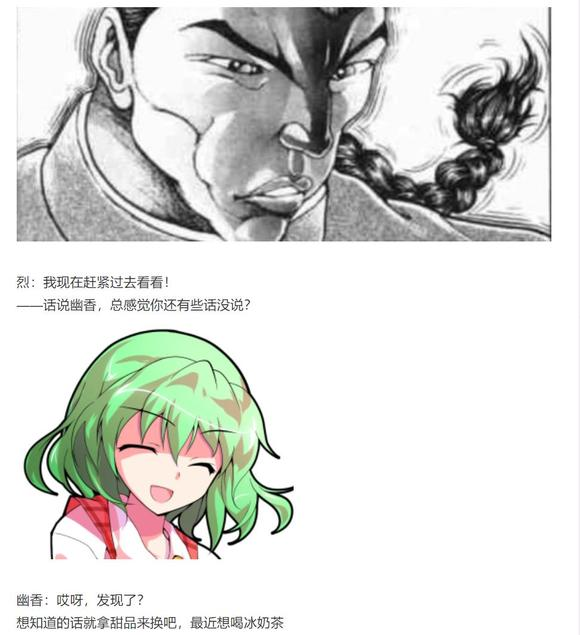
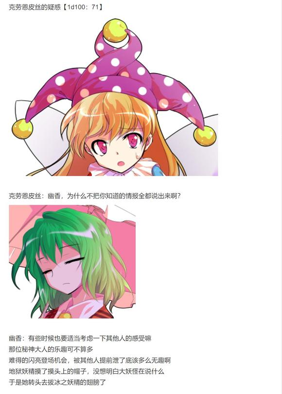
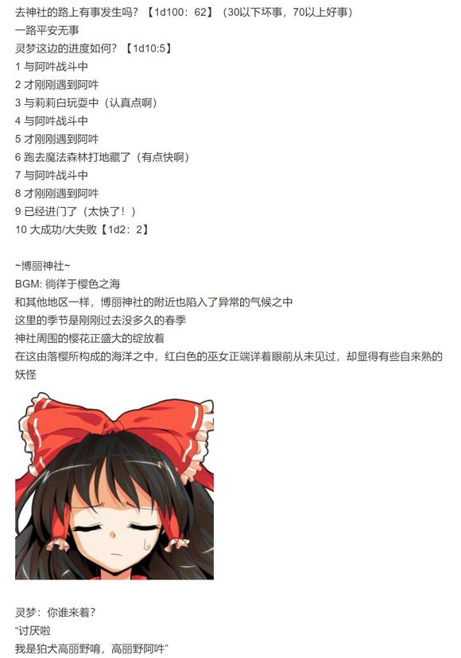
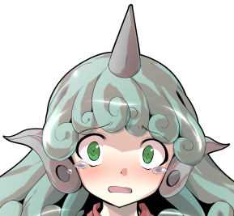
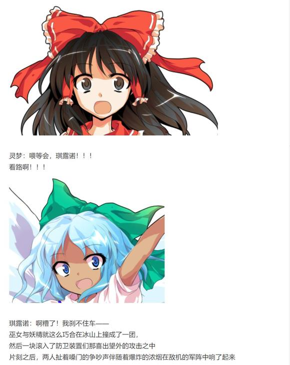

T3

Perfect Summer Ice发动

Hp：19-3+2=18

琪露诺：居然敢无视身为支配者的我

那就让你看看我的力量！

符卡宣言 冰符【Cool Sunflower】！

合欢乃：很有干劲嘛小妖精

咱也一起上！

符卡宣言 刃符【山姥的鬼菜刀研磨】！

烈的破解

冰符【1d100：11】失败

刃符【1d100：49】失败

烈的受伤【1+1d3：2-2=1】

Hp：18-1=17

烈海王沉迷于思考自身力量的来源，却忽视了眼前迫在眉睫的危机

烈：糟，太久没打架居然走神了！

符卡宣言 红符【巨阙】！

Hp：17-2=15

琪露诺：辫子妖怪，你想得美

Perfect Summer Ice 发动！

武术家拔出了鲜血之巨剑，准备以此应对对手的攻击

然而，冰之妖精再次使用了那份来源未知的力量

在夏之魔力的干扰之下，已然成型的巨剑在一瞬之间变回了流动的血液！

烈的攻击【262+1d100：41=303】

琪露诺的攻击【261+40+1d100：57=358】

烈的受伤【1d10：2】

1 回避

2 小伤害+3-1

3 小伤害+3-1

4 中伤害+3-1

5 中伤害+3-1

6 大伤害+3-1

7 大伤害+3-1

8 特大伤害+3-1

9 特大伤害+3-1

10 大成功/大失败【1d2：2】

Hp：15-1-3+1=12

烈：真没想到你还得到了这样的力量

这份奇妙的魔力还能使用几次？

琪露诺：呼哈哈哈！

很厉害吧，这个！

我可是还能用两次嘞！

合欢乃：别把底牌直接暴露出来啊你这笨蛋！

T4

Perfect Summer Ice发动

Hp：12-3+2=11

Flower star 发动

Perfect Summer Ice发动

这一次，妖精消去了烈所投掷的花弹

琪露诺：哈哈，哈哈哈，哈哈哈哈哈！

现在的我已经无人能敌啦！

符卡宣言 雹符【Hailstorm】！

冰之妖精欢快地释放了巨大的冰之螺旋

与她以往所使用的，宛如杂耍表演一般的符卡不同——

在这份迷之魔力的增幅之下，琪露诺现在所召唤出的龙卷风，已经可以称之为不折不扣的天灾了！

烈的破解【1d100：81】成功

空中的武术家被这极寒的旋风所吞没了

但烈海王的脸上毫无惊慌之色

他凭借自身丰富的战斗经验，在抵御风暴的同时寻找着魔力运作的关键环节

而后，一腿击出！

烈：破！

琪露诺吹起的暴风雪骤然爆散

一时之间，世界风平浪静

只剩下妖精与山姥在原地目瞪口呆的看着这轰碎天灾的男人

合欢乃：娘嘞，太强了

琪露诺：开玩笑吧……

凭肉体怎么可能做到这样的事情啊……

烈：虽说声势浩大，但却空有其表

好好上课的学生们可不会害怕这样的攻击！

现在，开始你最喜欢的力量比拼环节吧！

烈的攻击【262+1d100：69=331】

琪露诺的攻击【261+1d100：42=303】

琪露诺的受伤【1d10：8】

1 回避

2 小伤害+1

3 小伤害+1

4 中伤害+1

5 中伤害+1

6 大伤害+1

7 大伤害+1

8 特大伤害+1

9 特大伤害+1

10 大成功/大失败【1d2：2】

Hp：15-4-1=10

武术家与妖精挥出了同样的直拳

而结果毫无疑问，是武者的胜利！

琪露诺：你这家伙！

我只是逃了十几节课而已，有必要这么严格吗？

烈：你平均每个月才来上一堂课！

合欢乃：怎么说呢，突然能理解你生气的理由了......

T5

Perfect Summer Ice发动

Hp：11-3+2=10

合欢乃：虽然咱很能理解你的心情

但是战斗还是要继续

符卡宣言 尽符【Bloody Mountain Murder】！

烈：怀抱武术，心存执着——

纯粹武道发动

烈的破解【1d100：19】失败

出人意料的是，山姥所扔出的匕首阵成功困住了武术家

他不得不分出一部分精力来躲闪合欢乃的攻击

而这正好给了冰精发射弹幕的机会

烈的攻击【262+70-35+1d100：31=328】

琪露诺的攻击【261+1d100：44=305】

琪露诺的受伤【1d10：7】

1 回避

2 小伤害+3+1

3 小伤害+3+1

4 中伤害+3+1

5 中伤害+3+1

6 大伤害+3+1

7 大伤害+3+1

8 特大伤害+3+1

9 特大伤害+3+1

10 大成功/大失败【1d2：2】

Hp：10-3-3-1=3

琪露诺：好，我赢啦！

晒黑的琪露诺得意洋洋的找了个合适的位置准备发射弹幕——

然后她就被烈海王放出的曲线激光打了个跟斗

烈：上课的时候说了多少遍，别把敌人当不会还手的木桩子，怎么就是不听呢？

~T6~

BGM：活泼的纯情小姑娘

琪露诺：可恶，子机的存货不够了……

那就让你看看我琪露诺大人的招牌符卡！

符卡宣言 冰符【Cool Sunflower】

符卡宣言 冻符【Perfect Freeze】！

合欢乃：小家伙，咱感觉你那些冰冰凉凉的符卡看上去都差不多啊

符卡宣言 刃符【山姥的鬼菜刀研磨】

烈的破解：冰符【1d100：71】成功

冻符【1d100：53】失败

刃符【1d100：6】失败

正所谓双拳难敌四手，恶虎还怕群狼

面对妖精与山姥的双重夹击，即使是烈海王也只能暂且破除其中最为基础的弹幕！

烈：琪露诺用冰弹限制对手的行动，合欢乃小姐则趁机投掷菜刀攻击

真是精妙的配合

这样一来，便只能以力破巧了！

符卡宣言 红符【巨阙】

符卡宣言 超人【烈海王】！

Hp：10-2=8

Perfect Summer Ice发动

琪露诺最后一次发动了她那神秘的力量

武者的血剑再次融化了——但是，化作超人的烈海王也来到了她的身前！

冻符【Perfect Freeze】的出力【1d4：4】

烈的攻击【262+70-35+650+1d100：68=1015】

琪露诺的攻击【261+40+625+1d100：100=1026】

何等令人惊叹！

堪称不可思议！

简直叹为观止！

不知是由于她极其旺盛的好胜心，还是因为夏天的魔力令她的思维变得格外灵活

面对着一脸凶相突击而来的武术老师，这位皮肤黝黑的冰之妖精，有生以来第一次——

冷静下来了！！！

琪露诺：哼，我知道的

你肯定会选择自己最为擅长的接近战

既然如此……将冰弹的活动范围仅局限于我身前的几尺空地之间……配合追随者的刃弹……些许误差就用魔力修正……

这样就，完成了！

烈日下不融的冰精露出了充满自信的笑容

琪露诺：睁大眼睛看好了，辫子妖怪

这就是我琪露诺的完美冻结！

在妖精那精密的运算之下，本应滑稽可笑的无规律弹幕在解冻之后爆发出了前所未有的威力

琪露诺在武者周围那极小的空间之中，构建出了真正意义上完美的冰之囚笼！

即使运转了超人之术，烈海王也仍需全力以赴才可完成破解之法

可是他此刻面对的不只是一个对手！

合欢乃：好样的小家伙！

接下来就交给我吧！

灰发的山姥狞笑着举起了那巨大的菜刀

而后，重重斩下！

烈的受伤【1d10：8】

1 回避

2 回避

3 小伤害X4+3-1

4 中伤害X4+3-1

5 中伤害X4+3-1

6 大伤害X4+3-1

7 大伤害X4+3-1

8 特大伤害X4+3-1

9 特大伤害X4+3-1

10 大成功/大失败【1d2：1】

Hp：8-4X4-3+1=0

武术家只来得及用出最为基础的消力，便从空中直落而下，在红叶遍地的山坡之上砸出了一个巨大的空洞！

合欢乃：了不起，咱们赢啦！

琪露诺：呼哈哈哈哈哈哈哈哈哈！

果然，我就是——

最强的！！！！！！

烈要使用【1d2：1】

1 急救拳

2 假腿

Hp：0+1=1

烈：干得不错，琪露诺

在这次异变结束之后，那份神秘的力量应当会离你而去吧——

但你一定要记好刚才发动攻击时的感觉！

那是谁也无法夺走的，只属于你自己的感悟，明白吗！

武术家若无其事的从坑里爬了出来

琪露诺：——你搞笑吧？！

为啥这都干不掉你啊？！！！！！

烈：按照四季小姐的说法，这不是什么好习惯

不过呢……

对我来讲，只要能继续战斗，就没什么所谓！

T7

合欢乃：小妖精，冷静下来！

琪露诺：呼——心平气和心平气和——

说的没错，我要冷静冷静冷静冷静冷静

冷静个屁啦！用老子最强的出力直接干掉你！！！！

符卡宣言 冰块【Great Crusher】！

烈的破解【1d100:27】失败

出奇愤怒的琪露诺，在此刻汇集了身体所有的力量

那海量的夏之魔力在妖精狂暴而不拘小节的操纵之下化作了堪称小山的巨大冰块

这是纯粹至极的暴力，以力取胜的物理攻击！

琪露诺的攻击【261+725+1d100:8=994】

烈：既然你想要使用纯粹的力量

那我就用纯粹的技术去克服它！

符卡宣言 武符【梦幻斗舞】！

烈的反击【1d100：91】成功

烈海王的脚下踏动着奇异的步伐

他并未选择以拳法雕琢妖精的冰之山

而是沿着那平滑的冰面以不可思议的轨迹滑到了冰峰之顶端！

而后，武者自山巅一跃而下，向着妖精与山姥发起了最后的攻击！

琪露诺的受伤【1d10：10】

1 小伤害+1+1（无法回避）

2 小伤害+3+1

3 小伤害+3+1

4 中伤害+3+1

5 中伤害+3+1

6 大伤害+3+1

7 大伤害+3+1

8 特大伤害+3+1

9 特大伤害+3+1

10 大成功/大失败【1d2：1】

琪露诺 大成功！

琪露诺：——你的下一句话是：“你尝尝中华武术的厉害吧！”

烈：你尝尝中华武术的厉害吧——

什么？！

琪露诺：哼，又不是没看过你打架，真以为我琪露诺大人会因为这点小事慌张吗？

骗你的！

我可是好好记住了刚才的感觉哦

合欢乃，发动飞刀！

这就是身为支配者的我那完美的计策——巨冰破碎！

山姥坏笑着发动了刚刚所埋下的陷阱

数百道赤色的飞刀自丛林间的红叶深处飞射而出，它们瞄准了妖精故意留下的破绽，将烈海王背后的山峰切割成了无数冰块

究极的雪崩开始了！

烈海王正在思考是否应该使用假腿该如何应对妖精的陷阱

琪露诺和合欢乃认为自己已经胜券在握

而所有人都没想到的是……

武者身上那份几乎被他所遗忘的加护，第一次发挥了它的作用

~贫穷神的加护自动发动~

琪露诺的大成功变为大失败！

琪露诺的受伤【1d10：6】

1 小伤害X2+1+1

2 小伤害X2+3+1

3 小伤害X2+3+1

4 中伤害X2+3+1

5 中伤害X2+3+1

6 战斗不能

7 战斗不能

8 被愤怒的慧音抓去写作业了

9 被愤怒的慧音抓去写作业了

10 大成功/大失败【1d2：1】

简直像是概率之神的恶作剧

在烈海王正为此而感到迷茫之时——

妖精与山姥迫不及待的的冲了过来，准备给予他最后一击

十分凑巧的，合欢乃撞到了空中飞散的冰弹

非常巧合的，琪露诺被飘散的冰渣迷了眼

她们就这样错开了滑行中的武术家，而一头扑进了冰雪的狂浪之中

于是烈海王顺着雪崩的冲击力滑到了她们身后

而手忙脚乱的两人则被自己的陷阱所吞没，并被埋在了一人多高的积雪之中

烈：？？？？？？？

啊？？？？？？？

你们俩搞什么啊？？？？？？

战斗结束

胜者 烈海王

【1d20:6】分钟后，烈海王把雪堆中的妖精和山姥挖了出来

烈：这可真是……

琪露诺，合欢乃小姐，你们没事吧？

合欢乃的好感度【1d70：50+30=80】（战斗胜利+30）

灰发的山姥满不在乎地拍了拍身上的雪

合欢乃：小妖精昏迷过去了，不过咱没事

话说，你好强啊！

听小家伙说你是辫子妖怪？

你这是什么新品种？

烈：不……

我是人类，职业是武术家兼职厨师，偶尔还会做侦探工作

合欢乃：嚯，这么复杂

一开始看你欺负小妖精还以为是不知从哪来的坏胚，打完才发现是个像传说中的赖光一样的人类啊

咱很中意你！有什么话尽管问吧

（例行跑步洗澡，大概九点五十左右继续）

烈：噗噗噗噗噗噗噗哦哦哦哦哦哦哦！！！！！

烈海王小心翼翼的把冰之妖怪放到了一旁的地上，然后一边吐着血一边挥起了车轮拳

幽香等待了【1d10：2】分钟后，随手往烈的嘴里扔了个花弹

幽香：冷静一下，血都溅到我身上了

先把你和妖精的伤治好再说之后的事情吧

烈：呜呜呜呜呜呜

（我能先把花吐出来吗？）

幽香：不~行~

学不会讲话的笨蛋就给我老老实实接受教训

【1d20：8】分钟后，恢复如初的烈海王与幽香说起了上半天的经历

烈：——就是这样，我想着妖精毕竟是生命力的化身

带来太阳花田这种生机旺盛的地方应该有助于她的伤势恢复

生命力治疗效果如何？【1d50：20+50=70】（太阳花田+30，夏季的魔力+20,75以上立刻起效）

琪露诺在一旁的简易床铺上舒舒服服地打着呼噜，并顺便翻了个身

克劳恩皮丝：这个家伙完全从正面吃下了自己的陷阱，想恢复正常还得歇一段时间呢

至少再睡个半天吧？

如果急着找她的话可以用我的火炬哦

烈的急切【1d100：73】（75以上拜托皮丝）

烈：说实话我很好奇她那份奇怪的魔力是从何而来的……

但琪露诺刚刚打的很棒，她真的很努力了

让这孩子歇歇吧

烈现在要做什么？【1d10：1】

1 幽香：博丽神社出现了新的妖怪

2 关于秘神

3 例行的甜品时间（还吃啊）

4 幽香：魔法森林那边也在下雪

5 关于秘神

6 靠我烈海王的推理（现在的情报好像也够了）

7 幽香：魔理沙刚刚打了一场符卡战

8 关于秘神

9 靠我烈海王的直觉（为啥啊）

10 大成功/大失败【1d2：1】

烈海王有些头疼地捏了捏下巴

烈：幽香，我现在感觉思路有些混乱

原本以为这次只是某些大妖怪一时兴起就出来兴风作浪，没想到最后却牵扯到了秘神

合欢乃小姐给我的那些提示让我隐隐约约有些灵感……

但是我却抓不住重点，似乎是忽略了什么重要的东西一样

幽香：嗯……

你刚刚说小妖精在战斗的时候发射了奇怪的冰弹？

并且，你自己也用出了来路不明的力量？

花之暴君扫了一眼外表看上去一切如常的武术家

幽香：（原来如此，非战斗状态下不会【打开】，难怪八意永琳没看出来）

好了，既然一时之间找不到思路就换一个方法

我这里正好有些与此相关的情报哦~

比方说，在博丽神社的附近出现了一只新品种的妖怪

烈：这个时间点突然出现的新妖怪？

很可能与这次的异变有关系……

等会，在异变的时期跑去灵梦家？

那很危险吧！

幽香：谁知道呢~

说不定现在已经被退治了？

（我这脑子呀......上上层改为热奶茶）

烈的察觉【1d70：56+30=86】（50以上察觉异状，75以上察觉门）

但是，旁观的武术家察觉到了一丝不对头的地方

烈：（灵梦小姐的阴阳玉变成了樱花的颜色？）

（不对，感觉有点熟悉……）

这份魔力与我在之前战斗中所用过的力量一模一样！

烈海王立刻观察起了这份力量的流向

烈：居然是门！

灵梦，你的身后有一扇门！

他惊讶的发现，博丽巫女的背后正开着一扇神秘的【门】

它在灵梦战斗的时候为她提供了季节的魔力，但在战斗结束之后，便悄悄合拢

仿佛那里本就不存在任何事物

灵梦：门？你在说什么？

烈的说明【1d100：39】（50以上理解）

烈：琪露诺的神秘力量应当也来自于她背后的门

她所使用的力量属性……被晒黑的样子……莫非是夏季的魔力？

而灵梦与我使用的魔力看上去与樱花的颜色十分相似……樱花……这大概是春季的魔力

合欢乃小姐说要注意身后，很可能指的就是这扇门……季节之门？

难不成这就是秘神的力量？

灵梦：你到底在说什么啊？

突然就沉浸在自己的世界里了，这种毫无前因后果的推论谁也听不懂啊

烈：抱歉，是我太着急了

稍等我讲述一下今天的经历……

顺便我也有些话想问问这位阿吽小姐

【1d30：26】分钟后

总算勉强理解状况的灵梦，正与呜呜假哭着的狛犬说着话

阿吽：呜呜呜呜……

好过分，我明明只是想守护神社而已……

灵梦：对不起啦

看样子你没有说谎，我还以为你是入侵者呢

——但为什么我以前从来都没有见过你啊？

阿吽：没事啦~

我一直都很享受默默奉献的过程

毕竟是从没输过的灵梦小姐嘛，我也没想过能赢的

烈：阿吽小姐你好，我是永远亭的烈海王

请问你对于这次的异变有什么头绪吗？

或者说，你是否有注意到些奇怪的事？

阿吽的好感度【1d100：61】

阿吽：是经常过来的烈海王先生啊！

我一直都在看着你哦~

要说最近奇怪的事情，也只有妖精暴走这种程度的吧

还有就是……

刚刚战斗的时候感觉背上有些冰冷的东西流过，力量好像也变强了？

灵梦：又是背上

难不成她的背上也出现了【门】？

烈和灵梦要做什么？【1d10:4】

1 靠我博丽灵梦的直觉

2 靠我烈海王的推理

3 今天太晚了，明天再说吧（请敬业一些好吗）

4 靠我博丽灵梦的直觉

5 靠我烈海王的推理

6 情报还是不够（已经过量了）

7 靠我博丽灵梦的直觉

8 靠我烈海王的推理

9 调查迷途竹林吧（为啥啊）

10 大成功/大失败【1d2：2】

灵梦的直觉【1d50：3+50=53】（巫女的超直觉+50,60以上起效，75以上进门）

灵梦：（山姥、妖精和狛犬……共同点是隐秘？

平时隐秘身形的家伙们带着不可能拥有的力量出现了，这应当不是偶然——是那个所谓秘神的布局？

但是代表夏季的琪露诺为什么会出现在秋季的妖怪之山……背后的门是力量的来源？这又是如何出现的？）

是我的直觉变得迟钝了吗，目前为止竟然完全没有解决异变的头绪……

阿吽：灵梦小姐你看上去明明就考虑了好多的事情哦？！

烈与灵梦接下来要做什么？【1d10：10】

1 靠我烈海王的推理

2 灵梦：说起来魔法森林那边好像在下雪

3 今天太晚了，明天再说吧（请敬业一些好吗）

4 靠我烈海王的推理

5 灵梦：说起来魔法森林那边好像在下雪

6 靠我烈海王的直觉（为啥啊）

7 靠我烈海王的推理

8 灵梦：说起来魔法森林那边好像在下雪

9 调查迷途竹林吧（为啥啊）

10 大成功/大失败【1d2：1】

大成功！

大成功是什么【1d10:2】

1 烈海王的名推理

2 魔理沙&amp;文文的联络

3 茨华仙的提示（为啥啦）

4 烈海王的名推理

5 前来邀请的二童子

6 紫的提示（为啥啦）

7 烈海王的名推理

8 博丽神社的门开了

9 终于反应过来的师匠（好迟钝）

10 大成功/大失败【1d2：2】

被联络的人是【1d2：2】

1 灵梦

2 烈

武者与巫女面对着过量的信息，一时间竟想不出下一步该做什么

就在这时，烈海王兜里的通讯器响了起来

灵梦：？

你这怎么看上去跟觉用的那款这么像啊？

烈：因为这就是觉小姐初次见面时送我的……

喂你好，我是烈海王

说起来魔理沙&amp;文文的进度是【1d50：17+50=67】（大成功+50默认进门，75以上五面战，90以上六面战）

魔理沙：呦，你那边调查进度如何啊？

不会还傻不拉几的在竹林附近打转吧？

烈：这副得意洋洋的口气……

莫非你已经找到这次异变的关键点了？

文文：没错！

没想到【门】的后方还有着如此宽广的世界

这可是名副其实的大新闻啊！

灵梦：等会

那扇涌出奇怪魔力的门扉是可以进入的吗？

魔理沙：哦呼，灵梦也在啊

正是如此，这一次异变中，表现异常的家伙们身后应该都有着这样的门

而门后的空间之中，应当就是黑幕所在的地方了

文文：灵梦小姐和烈海王先生也请加快进度哦~

不然的话，这次的异变就要被我们所解决啦！

天狗与魔法使欢快地挂断了通讯

烈海王和灵梦缓缓地看向了一旁的狛犬

阿吽：怎……怎么啦？

为什么要露出这样的表情？

灵梦：阿吽啊~

能不能请你转个身背对我们呢？

阿吽的误解【1d100：79】

阿吽：哎哎哎哎哎哎哎哎？！

灵梦小姐你要干什么？！

烈：还请您放心，我们只是想调查一下另一侧的世界

我想这应当不会危害您的安全

阿吽害怕地缩到了一旁的角落里

阿吽：不不不不不

我，我是正经的狛犬妖怪！

我一直兢兢业业地守护着大家，为什么要这样对我？！

灵梦掏出御币轻轻敲了一下小妖怪的脑袋

灵梦：你在想什么呢？

我们说的是你背后的门扉

你刚刚不是说感觉背后有些凉意吗？那应当就是这玩意搞的鬼

阿吽：灵梦小姐你们吓死我了……

狛犬妖怪听话的转过身去

正像魔理沙所说的那样

她那本应空无一物的背上，正开着一扇小小的门

烈：！

就是这个！

这和之前灵梦小姐的身后所显现的门看上去一模一样！

灵梦：终于抓住你了~

我们出发！

可不能让魔理沙那家伙领先呢！

（以下是我的废话）

天空璋的第一阶段居然出乎意料的平稳（？）

这一次实际上出现了非常多的速通机会，但这帮rta玩家居然无一例外的全部拉胯了

反而是敌机的骰运意外的都很好

合欢乃的直觉和太阳花田那里我都已经做好直接跳五面甚至直接六面的准备了，结果居然全跨，也是挺不容易的

话说回来这一次的主角是琪露诺吧？！

哇我的天啊，这场打的

堪称热血漫主角绝境战！

T6的时候我甚至在思考要不要找个理由让烈放一下水了......毕竟琪露诺真的太不容易了......

想了想毕竟是异变中还是算了，认真打吧

结果T7的时候大成功

啊啊啊啊啊啊啊啊啊

紫苑的加护居然是在这种场合下发动的（悲）

某种意义上还真符合角色设定啊（悲）

烈的斗舞没有被削，是我复制成老版本的了，下次用的时候会记得改的（

幽香的口味居然被我忘记了！！！

我的天啊，我的脑子.......

得亏瞄了一眼回复发现不对头赶紧打了个补丁

真是老了（独步并感）

那么本次的更新到此结束，下一次的更新在周日或周一

骰子在异变结束后一块发

由吧友 @望远镜300  制作的视频第27集更新啦

本期的内容是阿燐安价回的下半段，大家感兴趣的话就去看看吧！

（刚刚视频出了点小问题，望远镜海皇紧急重修了一下，现在已经没问题啦）

大概七点半左右更新

得出门拿个东西，推迟到7点四十五左右更新

（书接上文）

门之后的世界之中所存在的，依然是无数的门

仿佛是注意到了有侵入者来到了自己的地盘之中——

自黑暗的深处，自神秘的彼端，无数暗红色的阴阳玉浮现而出

下一个瞬间，蓝色的弹幕之海向着巫女与武者奔涌而来！

烈与灵梦要做什么【1d10:9】

1 稳扎稳打的躲避（赶不上五面战了）

2 先与魔理沙她们汇合吧

3 烈：这里就交给我（为啥啊）

4 稳扎稳打的躲避（赶不上五面战了）

5 先与魔理沙她们汇合吧

6 灵梦：这里就交给我（为啥啊）

7 稳扎稳打的躲避（赶不上五面战了）

8 先与魔理沙她们汇合吧

9 琪露诺突击！！（你醒啦？）

10 大成功/大失败【1d2：2】

~太阳花田~

克劳恩皮丝正在琪露诺的翅膀上刻着冰雕

克劳恩皮丝：刻一个主人大人……刻一个朋友大人……再刻一个幽香……

琪露诺：我靠，你在干什么？！

终于睡醒的冰之妖精下意识地释放了一阵寒气

于是她身后的翅膀又恢复如初了

克劳恩皮丝：啊！

你还我辛辛苦苦刻了【1d3：3】个小时的冰雕！

琪露诺：你傻啊？！

为什么要在人家的翅膀上画东西？！

冰之妖精略感不适地挠了挠后背

巧合的是，由于刚起床时力量较为活泼，她背后的门扉恰巧打开了

于是

一脸蒙蔽的琪露诺就在两人的面前进入到了门后的世界之中

克劳恩皮丝：？？？？？？？？？

她去哪了？？？？？

幽香：门后的空间，隐秘的世界

大贤者的私有地，障碍者的神之国——

真有意思

冰之妖精误打误撞闯入了【后户之国】，不知她会作何感想？

~后户之国~

BGM：禁断之门对面，是此世还是彼世

琪露诺：这里是哪呀？

这地方真是又暗又无聊

正当巫女与武者准备应对眼前的阴阳玉大军之时——

被晒黑的妖精突然从一扇门中掉了出来！

烈：琪露诺？！

糟，快跑！

这里不是你能应付的了的！

琪露诺的奋战【1d70：43+30=73】（夏天的魔力+30,50以上拖住攻势）

琪露诺：呜哇这都什么啊？

看我把你们全部冻住——

冻符【Perfect Freeze】！

在太阳花田养精蓄锐之后的冰之妖精，如今正是精神充沛的时候

伴随着妖精充满活力的叫喊声，巨大的冰之花在敌阵深处盛大开放

琪露诺仅凭一人之力，就硬生生拦下了阴阳玉的攻势！

灵梦：我看她完全应付得来啊？

不如说玩的超级开心？

烈：——琪露诺你小心点啊，别中太多弹幕了

我和灵梦先走一步

琪露诺：居然把杂兵留给我？！

你们两个好过分！

巫女与武术家憋着笑飞走了

开场弹幕结束，接下来两人遇到的是【1d10】（1-4里乃的突击，5-7魔理沙汇合，8-10文文汇合）

后户之国的自动防卫系统仍在继续运行之中

总数为【100X1d100：76=7600】的赤色自动追击弹幕向着两位侵入者无情地袭来

然而，以数量取胜的防卫系统被绝对的质量所打破了

炽热的蓝色光束自黑暗之中遥遥飞来，以无可阻挡的气势吞没了两人眼前的所有对手！

魔理沙：一网打尽da☆ze！

你们俩速度还挺快啊

身穿大衣并围着围巾的黑白魔法使飞到了两人身前

灵梦：感谢雾雨魔理沙赠送的魔炮支援~

话说文呢？

魔理沙：那家伙嗖的一声就飞到前面去啦

噗，你这什么打扮？

你个天天打架光膀子的家伙还围围巾？

烈：我怕感冒不行吗？

你自己不也围了一条？

......还挺适合你哈

魔理沙：草，你突然说这个？！

......谢谢啊

武术家与魔法使不约而同地扯了扯脖子上的围巾，然后又一块甩了甩脑袋

灵梦：您二位在这搞什么呢？

赶紧集中注意力，激光网要来了！

武术家与魔法使看了一眼很有精神的两位队友，决定先去前方探路

【1d30：18】分钟后，两人的眼前终于出现了他们在此世界中所遇到的第一位【敌人】

“真是的，舞总是这样冒冒失失”

“明明还没有收到指令，怎么就把人拉进来了？”

她外表看上去是位手拿茗荷的咖啡色短发少女

少女身穿有着黄色洋花边的洋红色连衣裙，头戴黑色的风折乌帽，项戴类似围嘴的装饰，脚上穿着黑色的及膝袜以及洋红色的舞鞋

魔理沙：总算找到一个能正常交流的家伙了

你是什么人？

这里又是什么地方？

刚刚那个绿色的家伙看上去和你很像啊？

烈：（魔理沙，小心一些）

（这人看上去不大对头！）

魔理沙：（——啧，我也看到了）

（她跟本没有停下来啊）

武者与魔法使注意到了那略微不和谐的怪异之处

一般来讲，人们在说话的时候虽然都会有些下意识的小动作，但整体而言都还会保持着相对稳定的状态

但眼前的少女却不太一样

因为她无时无刻都在活动着自己的身躯

仿佛是某个特意的仪式，又仿佛是某种神秘的技巧，她就这样永不停息地跳着莫名而诡异的舞蹈——

即使在与两人交谈之时，也是一样！

里乃：呼～，我是尔子田里乃

师傅大人的吩咐还没有来呢

你们现在赶紧——

里乃的察觉【1d70：39+30=69】（50以上察觉烈）

粉红色的舞蹈者看了武术家一眼

里乃：哦哦，是你啊？

早点说啊，那就直接走流程吧

舞——快来工作啦——

