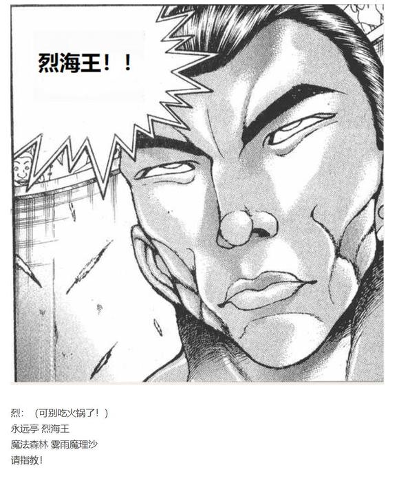

战斗！

BGM：Crazy Back Dancers

丁礼田舞&amp;尔子田里乃

Atk：290（240）

Hp：26（16）

技能

过于危险的背景武者：操纵精神与生命的二童子，利用其神秘的舞蹈令对手陷入狂乱之中。不会受到异常状态的影响，对特殊攻击手段拥有耐性。每回合开始时进行一次【1d2】的判定，出目为1时对手的Atk降低2点，出目为2时对手的Hp上限降低1点（最低降到1点）。每回合进行一次特殊攻击：【失衡】：进行一次【1d100】的失衡判定，50以上本回合对手造成的伤害减半，90以上本回合对手无法行动

？？？的加护：Atk+50，Hp+10，技能与必杀技大幅度增强，对其技能/必杀技的破解所需成功值+15

茗荷【Forget Your Name】（CT1）：（自身加持系）一场战斗中仅能使用一次，以扭曲的激光和螺旋的札弹作为舞蹈的点缀，3T内舞蹈带来的能力下降作用翻倍，此技能无法破解

竹符【Bamboo Crazy Dance】（CT1）：（弹幕系）一场战斗中仅能使用一次，以枪矛般的激光与散乱的札弹作为舞蹈的点缀，3T内自身Atk+60，给予伤害X2，对此技能的破解需要每回合各进行一次

笹符【Tanabata Star Festival】（CT4）：（弹幕系）对对手造成必中的【3+1d5】点伤害

冥加【Behind You】（CT5）：自对手的身后发动弹幕的突袭，3T内对手Atk-45，自身攻击必中且造成伤害+2

必杀技

舞符【Behind Festival】（CT6）：无法防御/破解/回避，2T内Atk+650，给予伤害X4/Atk+700，给予伤害X5，对手为多人的情况下2T内每回合进行一次【1d100】的默契判定，低于50时对手本回合自相残杀

狂舞【狂乱天狗怖吓】（CT8）：二童子的秘仪，对天狗的绝杀——不过对普通人也照样能用。无法防御/破解/回避，Atk+750，给予伤害X5，对手是天狗时先进行一次【1d100】的扑杀判定，50以上成功，成功后战斗自动胜利

烈海王

Atk：277（137）

Hp：23（21）

技能

烈 海 王：超越海皇，仍为海王。AtkX1.9，Hp+1。不会陷入异常状态，不会受到驻足，束缚等判定影响，面对所有技能都可以进行【1d100】的破解判定，60以上成功

完全消力： 普通攻击以及近战系、弹幕系技能所造成的的最终伤害/2（仅对Atk260以下的对手起效）自身所收到的普通攻击伤害-1，近战系、弹幕系技能伤害-2（仅对Atk261以上的对手起效）

Breezy Cherry Blossom：温和的春之子机，自身普通攻击造成的伤害+1，本次战斗中的第【1d5】回合无敌

雾雨魔理沙的支援：Atk+15，Hp+2，破解判定所需成功值-15，可使用必杀技 魔炮【Final Master Spark】，可使用连携技【幻星符】 Flower meteor

红符【巨阙】（CT3）：（近战系）以超人术力与宇宙魔力凝结自身血液铸为无坚不摧的巨剑，本回合Hp-2，Atk+80，给予伤害+4

【幻星符】Flower meteor（CT4）：（弹幕系）花弹与星弹的连携技，宛如幻梦的流星雨，造成必中的【3+1d7】点伤害。

假腿【The World】:一天一次，使用假腿中的力量进行一次超快速移动。本回合战斗自动胜利且造成的伤害必中（对战斗力低于160的对手使用的情况下直接判定战斗结束，胜者烈海王）/【回避】一次致命攻击（对于无法回避/破解/防御的必杀技无效）

急救拳：一场战斗中只能使用一次，Hp归0后回复1点Hp

贫穷神的加护：自动发动，一天只能使用一次，令对手的大成功转变为大失败

必杀技

纯粹武道（CT5）：怀抱纯粹的武术，心存无色的执着。3T内Atk+70，对对手造成的伤害+3。3T内可对所有攻击进行【1d100】的破解判定，近战系、技巧系技能30以上成功，其余技能40以上成功，必杀技60以上成功

超人【烈海王】（CT6）：Atk+650，给予伤害X4，之后2T回避概率翻倍

魔炮【Final Master Spark】（CT7）：还没有打倒敌人就继续增加火力，以最强的火力发出无法阻挡的魔炮！无法回避/破解/防御，Atk+850，造成伤害X5，伤害结算后对对手进行一次【1d100】的重伤判定，60以下Hp减半

武符【梦幻斗舞】（CT7）：以舞蹈的仪式引发体内的所有潜能，借助精神与生命的平衡，实现烈海王梦想之中的至高武道。无法回避/破解/防御，本回合自身无敌，给予伤害X2，进行一次【1d100】的反击判定，30以上可对对手的攻击进行反击

秘术【天文密葬法】（CT8）：制造虚假的月亮，削弱妖怪的力量，3T内战斗环节中，妖怪对手的Atk变为与自身最终结算后相同，自身的战斗骰变为【2d100】但同时无法使用破解，无法回避/破解/防御，给予伤害X2/引导宇宙的力量，发出轨道诡异的大量弹幕轰击 无法回避/破解/防御 Atk+900，给予伤害X6

T1

本场战斗中春子机的发动回合为第【1d5：1】回合

春日的魔力自武者的身后奔涌而出，在他身前形成了坚不可摧的防护罩

里乃：让我们跳起欢乐的舞蹈

在这音乐中忘记你的过往！

符卡宣言 茗荷【Forget Your Name】！

舞：让我们跳起愉快的舞蹈

沉迷在这甜蜜的韵律之中！

符卡宣言 竹符【Bamboo Crazy Dance】！

舞蹈判定【1d2：2】

烈海王的最大Hp下降1X2=2点

Hp：23-2=21

魔力屏障之后的武术家在目睹了二者那狂乱的舞蹈之后，却感觉身体变得虚弱了起来

魔理沙：？

你这屏障怎么没用？

烈：这恐怕不是子机能抵御的了的攻击……

她们用舞蹈直接调控了我们的生命力！

烈的破解竹符【1d100：93】成功

身体上的些许异状并未影响武术家的发挥

他凭借仅此一回合的魔力之壁尽数抵挡了舞者的竹之矛，并趁机向着二色的童子发动了突袭！

失衡判定：【1d100:89】伤害减半（注：失衡为特殊攻击）

烈的攻击【277+1d100：68=345】

二童子的攻击【290+1d100：96=386】

烈的受伤：本回合无敌

然而武术家并未料到，他所受到的影响绝非自己所想的那么简单

生命力的降低所带来的最直接影响，便是对于身体操纵能力的【失衡】！

烈海王的一身本领此刻难以发挥出十之一二，他的攻势被童子们所轻易攻破——

而后见势不妙的魔理沙赶紧拉着他飞开了一段距离

魔理沙：她们跳的舞有问题

你试试闭着眼打架？

烈：这玩意可没那么简单……

她们仅仅存在于此处，便会影响范围内的所有生物！

T2

舞蹈判定【1d2：1】

烈的Atk下降2X2=4点

Atk：277-4=273

失衡判定【1d100：73】伤害减半

烈的破解 竹符【1d100：69】成功

烈：之前已经成功过一次了——

这可没有失败的道理！

武术家神情自若地破除了绿衣童子的第二次激光攻击

烈的攻击【273+1d100：33=306】

二童子的攻击【290+1d100：18=308】

烈的受伤【1d10：7】

1 回避

2 小伤害-1

3 小伤害-1

4 中伤害-1

5 中伤害-1

6 大伤害-1

7 大伤害-1

8 特大伤害-1

9 特大伤害-1

10 大成功/大失败【1d2：1】

Hp：21-3+1=18

里乃：真遗憾~

你们的精神力也变弱了！

被疯狂的舞蹈所影响的烈海王与魔理沙，以一招之差输给了童子们的札弹

魔理沙：这打法也太恶心了吧

烈：确实……令人烦躁！

T3

舞蹈判定【1d2：2】

烈海王的最大Hp下降1X2=2点

Hp：19-2=17

舞：来吧，来吧

加入我们的舞蹈，挖掘自身的潜力！

失衡判定【1d100：98】无法行动

绿衣的童子加快了舞动的速度

猛然削弱的生命力与骤然增长的精神力一时间打破了烈与魔理沙的身体均衡

肉体的虚弱与精神的暴走，让他们瞬时间陷入了极不稳定的状态之中——

而二童子的攻击已经到了！

由于烈与魔理沙无法行动，本回合战斗自动失败

烈的受伤【1d10：7】

1 回避

2 小伤害X2-1

3 小伤害X2-1

4 中伤害X2-1

5 中伤害X2-1

6 大伤害X2-1

7 大伤害X2-1

8 特大伤害X2-1

9 特大伤害X2-1

10 大成功/大失败【1d2：1】

Hp：17-3X2+1=12

毫无还手之力的武者与魔法使就这样正面吃下了童子们的札弹轰击

半晌之后，浑身冒着黑烟的两人狼狈的从无数的门间飞了回来

魔理沙：咳咳咳，咳咳咳

（用你无敌的中华武术想想办法啊？！）

烈：咳咳，咳咳

我们武者的强大就来源于这份身与心的平衡……

这本是我们最为自傲之处，但在她们那疯狂的舞蹈面前却反而成为了弱点

魔理沙：那你到底行不行？

不行我来！

烈：区区失衡而已

已经体验过一次，就不会再中同样的陷阱了！

T4

茗荷、竹符效果结束

舞蹈判定【1d2：1】

烈海王的Atk下降2点

Atk：272-2=270

舞：七夕佳节的幻梦舞，献与秘神的星之祭

迷茫而无知的人类哟，与我一起欢呼，与我一同跳跃！

符卡宣言 笹符【Tanabata Star Festival】！

失衡判定【1d100：34】失败

烈的破解【1d100：7】失败

烈的受伤【3+1d5：2-2=3】

Hp：12-3=9

绿色的梦幻之星伴随着童子们的舞步飘然而至

它们看上去是那般的迷人而美丽，但被打中时的伤害却又那么的刻骨铭心

没错——

就像约会失败时的情侣们心中的滋味一样

烈：终于适应了这诡异的失衡情况

该开始反击了

符卡宣言 红符【巨阙】！

Hp：9-2=7

魔理沙：星星的魔法可是我雾雨魔理沙的招牌——

让你们看看真正的流星雨！

烈&amp;魔理沙：符卡宣言 【幻星符】Flower meteor！

二童子的伤害【3+1d7：5=8】

Hp：26-8=18

无需事先提醒，没有丝毫练习

武者与魔法使放出了随性而至的连携技

花弹与彗星构成了梦幻般的流星雨，将舞者的七夕之星彻底吞没后，于本场战斗中第一次给予了童子们沉重的一击！

里乃：哇！

为什么过七夕节你们都不开心？

烈：我倒是无所谓，不过魔理沙她就……

魔理沙：别跟我提这晦气节日！

烈的攻击【270+80+1d100：24=374】

二童子【290+1d100：47=337】

二童子的受伤【1d10：4】

1 回避

2 小伤害+1+4

3 小伤害+1+4

4 中伤害+1+4

5 中伤害+1+4

6 大伤害+1+4

7 大伤害+1+4

8 特大伤害+1+4

9 特大伤害+1+4

10 大成功/大失败【1d2：1】

Hp：18-2-1-4=11

破除了对手的符卡之后，兴致高昂的两人立刻乘胜追击

黑白的魔法使对着绿衣的童子释放了小型的魔炮

而手持巨剑的武术家则毫不留情地将紫衣的童子横扫而出！

“轰！”

疯狂的背景舞者们打着旋儿飞入了魔理沙的流星雨中，并在此遭受了第二顿痛击

舞：呜哇啊啊啊

好粗暴的家伙……

魔理沙：打弹幕战，要的就是火力！

T5

舞蹈判定【1d2：2】

烈海王的最大Hp下降1点

Hp：7-1=6

失衡判定【1d100：4】失败

里乃：这么轻易的输掉可是会挨师傅大人骂的……

在这里一鼓作气干掉你们！

符卡宣言 冥加【Behind You】！

舞步已经加快到了极致，那便更进一步的扭曲自己的身体

尔子田里乃将自己的身躯伸展到了一个不可思议的程度

那是否可以称之为人类的舞蹈？亦或者说，那是异形者们的蠕动？

武者与魔法使感到了一丝凉意

因为舞者所召唤的札弹已经在不知不觉间来到了他们身后！

烈：怀抱武术，心存执着——

纯粹武道发动

烈的破解【1d100：59】成功

然而，童子们的偷袭并未起到丝毫作用

武者仅凭简单的拳脚，就将札弹尽数扭曲撕碎了！

烈：装模作样，故弄玄虚，不过是简单的软骨功夫

你们所走过的路——我们在四千年前就已经走过了！

魔理沙：呦呵，看不出来你还会跳舞啊？

烈的攻击【270+70+1d100：89=429】

差值大于100自动成功

二童子的受伤【1d10：4】

1 回避

2 小伤害+1+3

3 小伤害+1+3

4 中伤害+1+3

5 中伤害+1+3

6 大伤害+1+3

7 大伤害+1+3

8 特大伤害+1+3

9 特大伤害+1+3

10 大成功/大失败【1d2：1】

Hp：11-2-1-3=5

舞：哎呀呀呀啊

怎么办啊，里乃

我们好像要输了？

里乃：别慌！在这里输掉就是他们战胜了考验

在这里赢了就是我们努力工作的成果

无论怎么样都是我们的胜利！

T6

舞蹈判定【1d2：1】

烈的Atk下降了2点

Atk：270-2=268

失衡判定【1d100：95】无法行动！

舞：刚刚已经放跑一个天狗了，可不能让你们再这么轻易过去

里乃：沉醉吧，狂喜吧，高声颂赞吧！

此乃后户之国的秘仪，献于最高者的盛宴——

舞&amp;里乃：舞符【Behind Festival】！

由于想起了师傅大人发怒时的样子，两位可怜的舞蹈家爆发出了此身之中的全部潜力

与上次的情况恰好相反，这一回烈与魔理沙体内的生命力打倒了巅峰，但精神力却忽然衰弱了下来

他们只感觉体内充满了力量，但眼前的世界却仿佛变成了慢放的影片——

星弹与札弹就这样“慢慢悠悠”地飞到了两人身前，但他们却无力操控肉体拦下这本能轻易躲避的弹幕！

由于无法行动，本回合战斗自动失败

烈的受伤【1d10:7】

1 回避

2 小伤害X4-1

3 小伤害X4-1

4 中伤害X4-1

5 中伤害X4-1

6 大伤害X4-1

7 大伤害X4-1

8 特大伤害X4-1

9 特大伤害X4-1

10 大成功/大失败【1d2：2】

Hp：6-3X4+1=0

（由于本必杀技无法回避，假腿无法使用）

烈海王使用了急救拳

Hp：0+1=1

武术家于本日第二次使用了这份应急的技巧

伤痕累累的烈与魔理沙喘着粗气从巨大的门上爬了起来

魔理沙：我宁愿跟纯化后的克劳恩皮丝打一架——

烈：——也不想再跟这两位纠缠了！

T7

舞蹈判定【1d2：1】

烈的Atk下降了2点

Atk：268-2=266

失衡判定【1d100：34】失败

里乃：生气了，生气了~

舞：着急了，着急了~

把这份怒气发泄到你们自己身上吧~

默契判定【1d70：20+30=50】（损友+30，50以上成功）

……这压线过具体是怎么表现的？【1d10：8】

1 攻击到对方之前清醒过来了

2 其实是对喷

3 相互攻击时不小心拉住了手（为啥啊）

4 攻击到对方之前清醒过来了

5 其实是对喷

6 把烈的围巾扯下来了（为啥啊）

7 攻击到对方之前清醒过来了

8 其实是对喷

9 把魔理沙的帽子扯下来了（为啥啊）

10 大成功/大失败【1d2：1】

武术家与魔法使一时之间竟被童子们的舞蹈所短暂迷惑了

他们有些混乱的转身面对着对方，而后下意识的采取了敌对的姿态——

魔理沙：你为什么要在第一回合用子机啊？！

把防护罩用在之后相对关键的场合不好吗？！

烈：我无法操控背后的门，这玩意是自己发动的

倒不如说魔理沙，你为什么次次都和我一块晕了？

魔理沙：哇，你个专业掌握平衡的武斗派都顶不住还指望我能撑过去？

烈：不是，你讲点道理好吗？！

舞：里乃,这算是起效了吗？

里乃：大概算……吧？

话音刚落，烈与魔理沙就转头看向了一旁的两位舞蹈家

烈要使用【1d3：2】

1 超人术

2 魔炮

3 梦幻斗舞

烈：原来如此，是令敌人自相残杀的招数

真可惜，我们两人基本上是不会打起来了——

魔理沙，拜托了

黑白色的魔法使坏笑着搓了搓手中的八卦炉

魔理沙：对付这种爱用阴招的家伙呢……

就要用最单纯的火力轰爆她们！

符卡宣言 魔炮【Final Master Spark】！

烈与魔理沙的攻击【266+850+70+1d100：90=1276】

二童子的攻击【290+700+1d100：17=1007】

二童子的受伤【1d10：1】

1 小伤害X3+1+3（无法回避）

2 小伤害X5+1+3

3 小伤害X5+1+3

4 中伤害X5+1+3

5 中伤害X5+1+3

6 大伤害X5+1+3

7 大伤害X5+1+3

8 特大伤害X5+1+3

9 特大伤害X5+1+3

10 大成功/大失败【1d2：2】

Hp：5-1X3-1-3=0

迸射的魔力星点照亮了黯淡无光的背景

震天动地的轰响打破了后户之国的宁静

魔法使手中的八卦炉久违的以最高功率运行了起来——

那是仅由魔力构建而成的，纯粹的毁灭之光！

二童子的攻击毫无意外被其所完全吞没

这场曲折而艰难的战斗，于此结束！

烈：声势不减当年啊

让我想起了神秘珠异变的时候

魔理沙：可别提了

跟你一块打的架就没一场轻松的

战斗结束

胜者 烈海王&amp;雾雨魔理沙！

浑身冒烟的两位童子颤颤巍巍地飞了回来

舞：呜呜呜，还挺有两下子嘛

里乃：呜呜呜，恭喜二位合格了......

魔理沙：都被揍到这么惨了还摆架子？先洗把脸吧

话说合格又是什么？

烈：异变的事情，测试的事情，还有关于我本身的事情

想问的事情有很多，还请麻烦二位略作解释吧

二童子的说明【1d70：25+30=55】（疯狂的背景武者+30,40以上说明异变和测试，60以上说明烈）

舞：异变是说四季异变？

那个可不是我们干的呀

里乃：我们可以通过在对象背后舞蹈来无限引导出对象的潜在能力

四季异变是因我们的舞蹈而暴走的妖精，精灵和神灵们干的好事

烈：——那这不还是你们干的吗？！

舞：我们在我们在奉命发掘平时隐匿身形的家伙的潜能的同时

还接受了捕捉像你们这样好斗的人才的命令

魔理沙：什么？！

不惜让幻想乡陷入混乱也要找到我这样的人才

我其实也没有这么厉害的~

烈：不不不，我觉得人家肯定不是这个意思……

话说回来我又是怎么回事？

为什么您两位看上去像是认识我？

二童子的好感度【1d65：55+35=90】（战斗胜利+30，一面之缘+5）

里乃：因为我们本来就认识你啊~

咱们又不是第一次见面了

烈：？？？

我们以前见过吗？？？

舞：哦哦哦，说起来初次见面的时候你连意识都没有来着

具体的事情你之后自己问师傅大人吧

那么，测试也合格了，就招待你们过去吧！

背后之最高秘神的座前！

谈话间的功夫，二童子身上的伤痕便已经消失不见

她们利用舞蹈恢复了两人的生命力之后，便带领着他们飞向了后户之国的深处……

【1d60：34】分钟后

说起来文文现在的情况是【1d100：4】大失败（75以下垫了，90以下留下重要情报，91以上意外的发展）

呜哇，射命丸文大失败

大失败是什么【1d10:10】

1 被囚禁了！

2 完败后战斗不能，晕倒在了河童的聚集地

3 新童子（不要啊啊）

4 被囚禁了！

5 完败后战斗不能，晕倒在了狸猫的老窝

6 傻瓜天狗（是啥啊）

7 被囚禁了！

8 完败后战斗不能，晕倒在了旧地狱的熔炉旁

9 天 狗扑 杀（请您手下留情啊！！！）

10 大成功/大失败【1d2：1】

射命丸文大成功！

那么文文现在的情况到底是【1d100：57】（75以下垫了，90以下留下重要情报，91以上意外的发展）

文文：——这是什么？！

？？？：只要你背上的四季之门还在，你就没有任何一丝获胜的希望

老老实实地退去吧

天狗，不，傻狗记者哟！

暗处的秘神则讥笑着发动了那必中的陷阱

于是射命丸文便从后户之国中无声无息地消失了

仿佛她从未来过此处

~妖怪之山~

文文：——？？？？？

怪了……我为什么会回到山里……

刚刚我应该是在后户之国取材才对……

不对，我刚刚到底在做什么？

极速的天狗小姐此刻难得露出了迷茫的神色

~后户之国的深处~

BGM： Into Backdoor

里乃：切勿打开~

切勿窥看~

舞：后门之中~

别有秘天~

二色的童子口中哼唱着怪异的歌谣，在两人的前方不知疲惫地舞动着

而后户之国的环境，却在逐渐深入的过程中发生了变化

那散落分布的绿色门扉依已然消失不见，取而代之的是在一行人身前依次开合的暗色大门

每一次门扉的开合，都伴随着异色的魔力从中弥漫而出

每一次魔力的涌动，都改变着这神秘国度的整体氛围

烈与魔理沙的感性【1d100：82】

魔理沙抱着胳膊打了个哆嗦

魔理沙：我不知道是不是我想多了……

总觉得这个氛围有些……古怪？

武术家下意识地扯了扯脖子上的围巾

烈：不是你的问题

这地方太过于……脱离常理了

与硝烟弥漫的月面战场和寂静的月之海不同

那里的氛围是激荡的，是狂气的，是令人心潮澎湃的，是令人热血沸腾的

而在这另一侧的秘神之国，二人感受不到那些他们所熟悉的情绪

这里的环境是古老的，是隐秘的，是令人迷惑不安的，是令人难以言表的

在余下的路途之中，连作为防卫装置的阴阳玉都不再出现

而最终，这段短暂而又漫长的路途结束了

于是

在二色童子的歌谣中

于是

自混沌莫名的黑暗中

祂来了

~摘自射命丸文的私人采访《Hidden Star in Four Seasons.》（未出版）~

受访者 烈 海王先生

30代，男，格斗家

“格斗家需要的不仅是眼力”

“更重要的是想象力”

“在脑中与模拟的对手战斗，其伤势也能反映到自身的肉体之上”

“在现实中遇到了强力的敌人，也能在其身后看到他的象征”

“我在与什么东西战斗？我的对手又是抱着怎样的心态来见我的？我可以在脑中【看】到这些”

“但这一次，我什么都看不到”

“不，或者说……我看到了太多的东西”

“像是把所有的概念都糅合在了一起，但定睛一看，存在于此处的又只是祂一个人”

“那是多么诡异而又神秘的——”

“神啊”

“噢噢，终于来了啊”

“二童子所说的人类，以及，自外界而来的武术家”

那是，凝为实质的压迫感

那是，万千神秘的化身

那是，究极的绝对秘神

正体不可妄见

真言不可轻闻

神名不可擅语

她头顶黑色的唐式幞巾，身着绘有北斗七星的黄绿二色和式狩衣，手持能乐表演中的小鼓，留有一头黄色的长发

于四色灵气所簇拥的至高秘神，于暗色的尊位之上俯视着前方的来客

烈：星星……乐舞……大地……

不，不对，都不对

到底是什么？！

摩多罗：我是摩多罗隐岐奈

既是后户之神

也是障碍之神

也是能乐之神

还是宿神、星神

更是创造了这个幻想乡的，贤者之一！

烈的震惊【1d100：77】

那已经是将近一年之前的事情了

在某个无所事事的日常中，武术家与心血来潮的读心侦探调查起了他进入幻想乡的原因

在经过了如此之久的时间之后，妖怪贤者对此的回答早已被他不知不觉间抛到了脑后

但他从未想过，自己会在这时直面那份真相！

烈：奇特的空间能力……似乎认识我的二童子……幻想乡的第三位贤者……

难道说

将我烈海王带入幻想乡的存在，就是您吗？！

摩多罗：啊~哈~哈~

正是本人！

烈与魔理沙要做什么【1d10：7】

1 先解决异变要紧（开战）

2 幻想入的原因（先聊天）

3 这里就靠我烈海王的口才（为啥啊）

4 先解决异变要紧（开战）

5 幻想入的原因（先聊天）

6 摩多罗：你们的简历呢？（为啥啊）

7 先解决异变要紧（开战）

8 幻想入的原因（先聊天）

9 先报恩吧！（为啥啊）

10 大成功/大失败【1d2：1】

一直以来的谜团却在此刻揭露了谜底

武术家一时之间感到有些迷茫

他忽然不知道自己该说些什么了

要先解决异变？要和眼前的秘神大人聊聊？要报恩？

烈海王的脑中一片混沌——于是一旁的魔法使帮他做出了决定

魔理沙：真是够了da☆ze

过于冲击性的事实让这个笨蛋完全慌神了

那就先进行我这边的调查吧

椅子上的秘神上下打量了一副魔理沙

摩多罗：哼——

你穿的这是什么呀

真是不可思议的服装

魔理沙：这是魔法使的正装哦

再说，你的打扮可比我怪异多了吧？

那么说回正题

你为什么要发动四季异变啊？

摩多罗的坦诚【1d100：38】（75以上说出真实目的）

摩多罗：我是在寻找那对废柴二人组的继任者

你看，这不就找到了相当合适的人类吗

工作的具体内容是在幕后维持幻想乡的平衡，说是修理工也差不多

这是份相当轻松的工作哦~

摩多罗的劝诱【1d100：57】（大成功时劝诱成功）

魔理沙：这工作听起来还蛮有趣的——

但是代价是变得和那两人一样是吧？

所以我拒绝！

我雾雨魔理沙最喜欢的事情，就是对那些自以为自己很厉害的家伙说NO！

摩多罗：你们是不是搞错了什么？

我从一开始就没有留给你们选择的余地啊

大贤者轻轻敲打着座椅的扶手

魔力的雾气开始震荡

门扉的开合逐渐加速

烈：！

魔理沙，小心！

摩多罗：选谁来当手下由我说了算

没有必要听你说三道四

魔理沙：呼~要靠蛮力解决啊

求之不得！

（先别想那些搞不明白的事情，要上了！）

烈：（明白！）

摩多罗女士，得罪了！

永远亭 烈海王，请指教！

摩多罗：真是狂妄而又可爱的家伙们

只要你们背上的四季之门还在，就永远无法逃出我的掌心

那么——开始最后的暗黑测试吧

令我失望的话可会没命的

对你们每一个人来说，都一样！

与异变黑幕的最终战，于此开始！

战斗！

BGM：被秘匿的四个季节

烈海王

Atk：262（137）

Hp：21

技能

烈 海 王：超越海皇，仍为海王。AtkX1.9，Hp+1。不会陷入异常状态，不会受到驻足，束缚等判定影响，面对所有技能都可以进行【1d100】的破解判定，60以上成功

完全消力： 普通攻击以及近战系、弹幕系技能所造成的的最终伤害/2（仅对Atk260以下的对手起效）自身所收到的普通攻击伤害-1，近战系、弹幕系技能伤害-2（仅对Atk261以上的对手起效）

Breezy Cherry Blossom：温和的春之子机，自身普通攻击造成的伤害+1，本次战斗中的第【1d5】回合无敌

红符【巨阙】（CT3）：（近战系）以超人术力与宇宙魔力凝结自身血液铸为无坚不摧的巨剑，本回合Hp-2，Atk+80，给予伤害+4

Flower star（CT4）：（弹幕系）对对手放出带有神秘力量的星形花弹，造成必中的【2+1d6】点伤害。

假腿【The World】:一天一次，使用假腿中的力量进行一次超快速移动。本回合战斗自动胜利且造成的伤害必中（对战斗力低于160的对手使用的情况下直接判定战斗结束，胜者烈海王）/【回避】一次致命攻击（对于无法回避/破解/防御的必杀技无效）

急救拳：一场战斗中只能使用一次，Hp归0后回复1点Hp

贫穷神的加护：自动发动，一天只能使用一次，令对手的大成功转变为大失败

必杀技

纯粹武道（CT5）：怀抱纯粹的武术，心存无色的执着。3T内Atk+70，对对手造成的伤害+3。3T内可对所有攻击进行【1d100】的破解判定，近战系、技巧系技能30以上成功，其余技能40以上成功，必杀技60以上成功

超人【烈海王】（CT6）：Atk+650，给予伤害X4，之后2T回避概率翻倍

武符【梦幻斗舞】（CT7）：以舞蹈的仪式引发体内的所有潜能，借助精神与生命的平衡，实现烈海王梦想之中的至高武道。无法回避/破解/防御，本回合自身无敌，进行一次【1d100】的反击判定，30以上可对对手的攻击进行反击

秘术【天文密葬法】（CT8）：制造虚假的月亮，削弱妖怪的力量，3T内战斗环节中，妖怪对手的Atk变为与自身最终结算后相同，自身的战斗骰变为【2d100】但同时无法使用破解，无法回避/破解/防御，给予伤害X2/引导宇宙的力量，发出轨道诡异的大量弹幕轰击 无法回避/破解/防御 Atk+900，给予伤害X6

雾雨魔理沙

Atk：260（240）

Hp：18

技能

普通的魔法使：用魔力形成屏障，普通攻击以及弹幕系技能所造成的的最终伤害/2（对Atk250以上的敌人无效）/自身所受到的弹幕系技能伤害-2（仅对Atk251以上的对手起效）。普通攻击造成的伤害+1。不会陷入异常状态，不会受到驻足/禁锢等判定影响。异变发生时Atk+20。

Extreme Winter：严酷的冬之子机，战斗中的第【1d3】与第【3+1d3】回合中Atk+50，弹幕系技能所造成的伤害+2

Rising Sweep（CT3）：（近战系）用改造扫帚一口气进行纵向升龙斩，并留下一道长长的发光轨迹。Atk+60，给予伤害+2

Powerful Drug（CT4）：（弹幕系）投掷装有特殊药剂的魔法瓶，限制对手的行动范围同时对其造成伤害。对对手造成【1d3】的伤害，同时本回合对手无法回避

光符【Luminous Strike】（CT4）：（弹幕系）以扫帚为炮筒发射出魔法炮弹，对对手造成【3+1d3】的伤害

星符【Satellite Illusion】（CT5）：（弹幕系）召唤卫星辅助单元。一边跟在自己身边，一边自动攻击靠近的对手。3T内每回合对对手造成2点伤害，同时自身受到的伤害-2

必杀技

恋符【Master Spark】（CT6）：释放强烈光和热的魔理沙招牌魔法，以超高的火力摧毁对手！Atk+700，造成伤害X4，由于过于注重威力破绽较大，对本技能的回避/破解判定成功值-20

魔炮【Final Master Spark】（CT7）：还没有打倒敌人就继续增加火力，以最强的火力发出无法阻挡的魔炮！无法回避/破解/防御，Atk+850，造成伤害X5，伤害结算后对对手进行一次【1d100】的重伤判定，60以下Hp减半

【Blazing Star】（CT8）：将极限火花朝着后方放出，然后利用其推力在空中飞翔，最终决战时就这样一击定胜负！无法回避/破解/防御，Atk+900，造成伤害X6，伤害结算后对自身造成【1d6】的伤害

摩多罗隐岐奈

Atk：295（？？？）

Hp：20/10（？？？）

技能

威风堂堂的神秘：对手的【所有抗性】无效，自身技能/必杀技的破解/回避/防御判定所需成功值+15

随便玩玩：坐在椅子上打架，假装所有特殊攻击手段/异常状态/各类判定有效

后符【绝对秘神的后光】（CT1）：（弹幕系）一场战斗中只能使用一次，此为佛后的神圣之光。对对手进行一次【1d100】的【闪烁】判定，31以上的场合本回合Atk-50，无法回避攻击，30以下的场合对手为佛光所震慑而误伤自身，受伤时进行两次伤害判定

里夏【异常酷暑之焦土】（CT2）：（弹幕系）一场战斗中只能使用一次，以高温的炎弹重现极端的酷暑，对对手造成必中的【1d4】点伤害，并令其陷入【灼烧】状态，此后每回合Hp上限-2

里秋【异常枯死之饿鬼】（CT3）：（弹幕系）一场战斗中只能使用一次，以背后涌出的弹幕封锁对手的行动，本回合对手无法使用技能，令对手陷入【饥饿】状态，此后每回合Atk-5

里冬【异常降雪之雪人】（CT4）：（弹幕系）一场战斗中只能使用一次，将急冻的寒星隐藏于黑暗之中，本回合自身无敌，对手Atk-70，受到伤害X2，令对手陷入【黑暗】状态，此后发动技能与普通攻击时需进行一次【1d100】的黑暗判定，30以上miss。（被破解的场合仅对对手起效的作用消失）

里春【异常落花之魔术使】（CT5）：（弹幕系）一场战斗中只能使用一次，令对手迷茫于樱花色的弹幕之海，3T内对手Atk-50，给予伤害/2

必杀技

【里·Breezy Cherry Blossom】（CT6）：？？？一阶段击破后或第六回合时自动发动，此为春日的终结

【里·Extreme Winter】（CT6）：？？？一阶段击破后或第六回合时自动发动，此为冬日的灭绝

T1

本场战斗中春子机发动回合为第【1d5：3】回合

本场战斗中冬子机发动回合为第【1d3：3】回合和第【3+1d3:3=6】回合

摩多罗：游戏开始了~

拜倒在我的威光之下吧——

符卡宣言 后符【绝对秘神的后光】！

烈的破解【1d100：56】失败

闪烁判定

烈【1d100：28】误伤

魔理沙【1d100：27】误伤

尊位之上的秘神放出了耀眼的圣光

那是位于神佛之后的尊崇伟光

单纯目睹便足以令人顶礼膜拜，将其破除更是痴心妄想！

摩多罗的攻击【295+1d100：74=369】

差值大于100自动胜利

烈的受伤【1d10：6】

1 回避

2 小伤害-1

3 小伤害-1

4 中伤害-1

5 中伤害-1

6 大伤害-1

7 大伤害-1

8 特大伤害-1

9 特大伤害-1

10 大成功/大失败【1d2：1】

误伤判定

烈的受伤【1d10:8】

1 回避

2 小伤害-1

3 小伤害-1

4 中伤害-1

5 中伤害-1

6 大伤害-1

7 大伤害-1

8 特大伤害-1

9 特大伤害-1

10 大成功/大失败【1d2：2】

Hp：21-3+1-4+1=16

魔理沙的受伤【1d10:3】

1 回避

2 小伤害

3 小伤害

4 中伤害

5 中伤害

6 大伤害

7 大伤害

8 特大伤害

9 特大伤害

10 大成功/大失败【1d2：2】

误伤判定

魔理沙的受伤【1d10:7】

1 回避

2 小伤害

3 小伤害

4 中伤害

5 中伤害

6 大伤害

7 大伤害

8 特大伤害

9 特大伤害

10 大成功/大失败【1d2：2】

Hp：18-1-3=14

纯白的圣光禁锢了二人的肉体

秘神随手放出的四色弹幕则将动弹不得的两人打飞到了红黑色的大地之上！

烈：？！

刚刚到底发生了什么？！

魔理沙：该死……看到那光芒的瞬间就已经失去意识了！

摩多罗：稍微加把劲啊~

这样没出息的表现可是会令我失望的

T2

摩多罗：接下来，稍微用些【季节】的魔力吧

首先是，夏季

秘神如剧院中的观众一般拍了拍手掌

无数门扉中的一扇随之打开

夏季的魔力之雾从中弥漫而出，而当其消失的时候——

他们就感受到了那清新的空气与灼热的温度

诡异而神秘的后户之国，就在二人的面前变为了烈日下的太阳花田！

魔理沙：这是什么幻术？

还是说她把我们转移到外侧了？

烈：不，不是这种小把戏……

这是很单纯的技巧……

她只是，把自己的国度从物理上变成现在这副模样了！

摩多罗：就是这样~

不过，这只是【多数人】眼中的夏季

而我想让你们看看的，是在那背后的东西

欢乐的夏天背后是极端炎热的绝望大地

符卡宣言 里夏【异常酷暑之焦土】！

生机勃勃的夏日图景消失不见

后户之国仿佛变为了旧地狱深处的灼热熔炉

高温的火焰在空中闪烁，干裂的大地在岩浆中燃烧

那是常人根本无法生存的，堪称地狱的焦土！

烈的破解【1d100：70】成功

烈：连千年前的沙漠之路都已经被我们所踏破

区区炎热天气又有何惧！

魔理沙，借你的扫帚加个速！

魔理沙：路上的炎弹规避就交给你了！

烈的攻击【262+1d100：82=344】

魔理沙的攻击【260+1d100：42=302】

摩多罗的攻击【295+1d100：84=379】

烈的受伤

烈的受伤【1d10：5】

1 回避

2 小伤害-1

3 小伤害-1

4 中伤害-1

5 中伤害-1

6 大伤害-1

7 大伤害-1

8 特大伤害-1

9 特大伤害-1

10 大成功/大失败【1d2：2】

Hp：16-2+1=15

魔理沙的受伤【1d10:1】

1 回避

2 小伤害

3 小伤害

4 中伤害

5 中伤害

6 大伤害

7 大伤害

8 特大伤害

9 特大伤害

10 大成功/大失败【1d2：1】

然而——

秘神仅凭单手，就在椅子上握住了烈海王的拳头！

摩多罗：不行，不行~

要好好尊重我才对，知道吗？

她轻而易举的举起了惊愕的武者，然后将其如标枪般扔向了一旁的魔理沙

魔法使连忙骑在扫帚上闪过了秘神的人体炮弹

魔理沙：别怪我啊

这我可真接不住！

烈：噗——

是我太大意了——

T3

Breezy Cherry Blossom 发动

Extreme Winter 发动

后户之国的环境再次发生了改变

凉风吹拂，落叶遍地

这一次出现的，是红叶遍染的妖怪之山

摩多罗：下一个季节~

丰饶的秋季背后，是颗粒无收的枯黄田地

符卡宣言 里秋【异常枯死之饿鬼】

那是枯寂的衰败之意，凄凉的饥荒之景

二人的体内忽然间失去了活力，一股极强的饥饿感自他们的腹中涌出——

光是强撑着不倒下便已经竭尽全力，想要在这种虚弱的状态下战斗几乎是不可能的！

烈的破解【1d100：97】成功

烈：还好我早有准备

喝这个！

烈海王从大衣的兜里掏出了一瓶高度浓缩的液体，并将其丢给了魔理沙

魔理沙：这啥？

哇，好甜啊！

烈：这是解决异变时专用的应急口粮

往十公斤的水中加入四公斤的果糖！

在我改进之后又陆续添加了蜂蜜、桂圆、红枣、枸杞和柠檬，最终浓缩而成的就是这永远亭特供能量饮料！

魔理沙：噗——

虽说现在确实不饿了但这热量也太高了！

会变肥的！

在饮用了超高能浓缩饮料之后，武术家与魔法使腹中的饥饿一扫而空！

摩多罗：看上去好像挺好喝的

给我也来一罐呗？

烈：您请您请......

摩多罗的评价【1d65：24+35=59】（烈的厨艺+55，热量太高了-20）

摩多罗：啊呀~

虽说口感不错，但这个真的太甜了

不能当做正经的料理呢，确实是应急食物

魔理沙：——怪了，明明在打架为什么会变成这么诡异的环节？

接招 Rising Sweep！

再加上这份冬日之光

ExtremeWinter！

烈：抱歉，职业病犯了！

符卡宣言 红符【巨阙】！

Hp：15-2=13

魔理沙的攻击【260+60+50+1d100：71=441】

烈的攻击【262+80+1d100：56=398】

差值大于100自动胜利

摩多罗的受伤【1d10：9】（魔理沙的攻击）

1 回避

2 小伤害+1+2

3 小伤害+1+2

4 中伤害+1+2

5 中伤害+1+2

6 大伤害+1+2

7 大伤害+1+2

8 特大伤害+1+2

9 特大伤害+1+2

10 大成功/大失败【1d2：1】

Hp：20-4-1-2=13

摩多罗的受伤【1d10：5】

1 回避

2 小伤害+1+4

3 小伤害+1+4

4 中伤害+1+4

5 中伤害+1+4

6 大伤害+1+4

7 大伤害+1+4

8 特大伤害+1+4

9 特大伤害+1+4

10 大成功/大失败【1d2：1】

Hp：13-2-1-4=6

魔理沙以改造的扫帚挥出了升龙斩

烈海王则用巨阙迎头一剑劈斩而来

二人在本场战斗之中第一次给予了秘神重大的打击！

摩多罗：非常好

我要找的就是你们这样的人才！

T4

秘神摇了摇手中的小鼓

又一扇门扉听令敞开

与先前的情况相同，三人身处的世界又一次发生了改变——

这一次他们所见到的，是被积雪所埋没的森林与竹林

摩多罗：时光继续流逝——

到了一年之中最后的时间

安稳的冬季背后是极寒刺骨的无光长夜

符卡宣言 里冬【异常降雪之雪人】！

刹那之间，后户之国变为了无光的世界

因为无边无际的降雪将两人困在了没有出口的幽谷之中

暗色的寒星带来了急速下降的温度

极大的危险正暗中向二人逼近

但他们却找不到前进的方向——

烈的破解【1d100：96】成功

烈：现在看来，真亏我早上出门的时候穿了冬装

魔理沙，有光吗？

魔法使弹出了几颗闪烁着的星弹

魔理沙：还别说，幸亏我围了围巾……

直接把这玩意轰掉？

烈：不需要

昔日多里安海王曾凭肉体战胜过自然

如今我烈海王也已经拥有了这份【技量】！

斗志昂扬的武术家一拳轰在了前方的冰壁之上

他的拳脚以惊人的速度破坏着这片巨大的雪山！

魔法使为他照亮了前方的道路，并抵挡着自暗处而来的偷袭

而多年练成的武艺将他的肉体化为了无往不利的利刃

最终，暗无天日的雪山被他打出了一条宽阔的通路

他在这遥远的后户之国中，重现了那位老人当年徒手开山的伟业！

烈：现在该我反击了！

接招 Flower star！

魔理沙：在这回合解决掉你！

接招 Powerful Drug！

符卡宣言 光符【Luminous Strike】！

由于本回合无敌，摩多罗不会受到伤害

烈的攻击【262+1d100：19=281】

魔理沙的攻击【260+1d100：19=279】

摩多罗的攻击【295+1d100：83=378】

烈的受伤【1d10：7】

1 回避

2 小伤害-1

3 小伤害-1

4 中伤害-1

5 中伤害-1

6 大伤害-1

7 大伤害-1

8 特大伤害-1

9 特大伤害-1

10 大成功/大失败【1d2：1】

Hp：13-3+1=11

魔理沙的受伤【1d10：1】

1 回避

2 小伤害

3 小伤害

4 中伤害

5 中伤害

6 大伤害

7 大伤害

8 特大伤害

9 特大伤害

10 大成功/大失败【1d2：1】

“啪，啪，啪”

摩多罗轻笑着推入了身后的门扉里，而后又从两人身后的另一扇门中钻了出来

她随手放出了一片淡蓝色的弹幕射击后，在座位上欣赏地鼓起了掌

摩多罗：竟然让我移动了位置

你们可以引以为豪了！

魔理沙：你这靠无敌符卡撑场子的家伙说什么啊？！

明明你自己中招之后就要输了吧？

烈：魔理沙，别大意了

她从战斗开始到现在为止——

甚至还没有站起来过！

T6

摩多罗要使用【1d3：1】

1 里春

2 里冬

3 两个都用

摩多罗：我刚刚一直都在考虑，你们毕竟有两个人，要用谁的季节好呢？

不过两个都用有些太过分了，而你们的御寒措施又做得很好嘛

所以还是用这个吧

摩多罗：呜呼哀叹吧

此乃，春日之终结

——【里·BreezyCherry Blossom】！

【里·Breezy Cherry Blossom】：【本场战斗中不会失败】，给予伤害必中，对手的季节子机无效，所有需要魔力发动的技能/必杀技均无法使用，3T内自身Atk+100，给予伤害X4/Atk+150，给予伤害X5/Atk+200，给予伤害X6

后户的贤者发动了其在异变之初便埋下的陷阱

那一直在两人背后提供支援的季节之门，在此刻发起了反逆！

烈海王与魔理沙惊慌的发现，他们所失去的不只是那份可有可无的季节魔力——

烈：它带走了我体内的魔力？！

魔理沙：糟了

这样一来别说用八卦炉，连维持护身的卫星都做不到！

春子机失效

冬子机失效

星符【Satellite Illusion】失效

红符【巨阙】无法使用

Flower star 无法使用

急救拳 无法使用

超人【烈海王】无法使用

秘术【天文密葬法】无法使用

光符【LuminousStrike】无法使用

恋符【Master Spark】无法使用

魔炮【FinalMaster Spark】 无法使用

【Blazing Star】 无法使用

