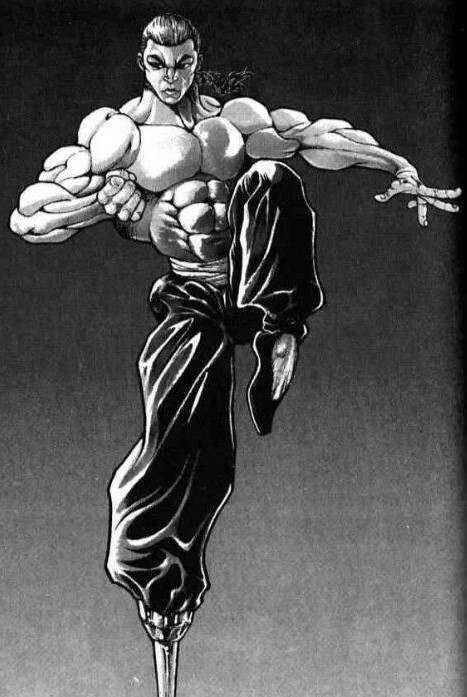
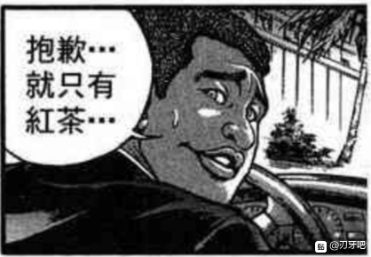
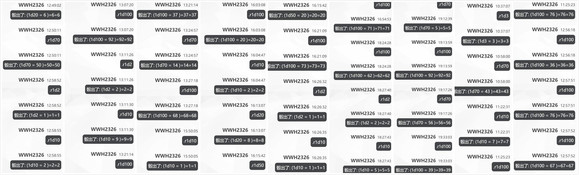
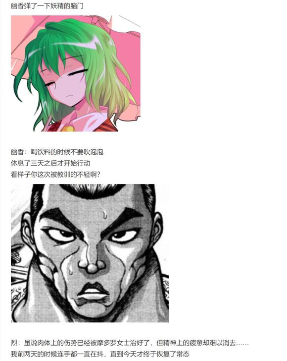
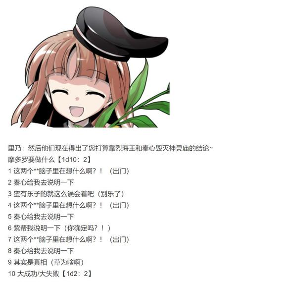

烈的破解【1d100：14】失败

这是两人之前从未遇见过的状况

他们在瞬间便成为了与神秘无缘的人类

而他们所面对的，却是秘神掀起的樱之海！

樱花状的弹幕宛如波浪般此起彼伏，向着虚弱的二人奔涌而来！

魔理沙：啧，希望荷取的改造扫帚还能顶得住……

Rising Sweep发动

烈的攻击【262+70+1d100：14=346】

魔理沙的攻击【260+60+1d100：80=400】

摩多罗的攻击【295+100+1d100：57=452】

烈的受伤【1d10：1】

1 小伤害X2-1（必中）

2 小伤害X4-1

3 小伤害X4-1

4 中伤害X4-1

5 中伤害X4-1

6 大伤害X4-1

7 大伤害X4-1

8 特大伤害X4-1

9 特大伤害X4-1

10 大成功/大失败【1d2：2】

Hp：11-1X2+1=10

魔理沙的受伤【1d10：7】

1 小伤害X2（必中）

2 小伤害X4

3 小伤害X4

4 中伤害X4

5 中伤害X4

6 大伤害X4

7 大伤害X4

8 特大伤害X4

9 特大伤害X4

10 大成功/大失败【1d2：1】

Hp：14-3X4=2

多亏了烈海王一直以来所积累的战斗经验

他仅以些许的擦伤为代价躲过了第一轮攻击

但身无丝毫魔力的魔理沙，却不得不强行吃下了这一击

烈：这季节明明在我身后的时候看着不太强，为何作为敌人却如此棘手？！

摩多罗：这就是主役者之间的本质区别咯~

T7

樱之海的冲击忽然加速

白色的光玉加入了粉色的攻势之中，令其变得难以抵挡！

烈的破解【1d100:24】失败

魔理沙：能破解吗？

烈：找不到破解的思路，但我还有武术可用！！

符卡宣言 武符【梦幻斗舞】！！！

烈海王的脚下踏动着奇异的步伐

这是脱胎于巫女之舞的至高武术

即使没有魔力，也可凭借自己的身体施展而出！

摩多罗的攻击【295+150+1d100：85=530】自动成功

烈的反击【1d100：53】成功！

烈：没有魔力从来都不是什么可怕的事情

因为我在过去，一直都是这般走过来的！

摩多罗的受伤【1d10：8】

1 小伤害+3（无法回避）

2 小伤害X2+3

3 小伤害X2+3

4 中伤害X2+3

5 中伤害X2+3

6 大伤害X2+3

7 大伤害X2+3

8 特大伤害X2+3

9 特大伤害X2+3

10 大成功/大失败【1d2：2】

Hp：10-4X2-3=0

由于【里·Breezy Cherry Blossom】的效果，摩多罗在本场战斗中不会失败

摩多罗：没有白费我的点拨

你的武艺，我摩多罗隐岐奈确实看到了！

我便承认吧

这场战斗中的你们——没有失败！

战斗结束

平局

无人胜利

魔理沙拖着被打昏过去的烈海王，坐在漂浮的门扉上喘了口气

魔理沙：呼——

说是输了要死，但实际上还没有纯狐下手来的狠

多谢你手下留情啊

摩多罗：我又不是什么巨凶~

更何况，你们也没输啊

那么，这次的游戏到此为止

真遗憾，你们本次的行动彻底失败咯

秘神打了个响指后，魔理沙便由自己身后的门中消失不见了

摩多罗的好感度【1d45:44+55=99】大成功（情商+5，达成平局+20，幻想入之黑幕+30）

（注：情商加成见第161日剧情）

哎呦……草……

大成功是什么【1d10:4】

1 摩多罗：我是护佑着你的神啊

2 是摩多罗最喜欢的棋子哦

3 下一任的童子就决定是你了（不要啊啊啊）

4 摩多罗：我是护佑着你的神啊

5 是摩多罗最喜欢的棋子哦

6 摩……摩多罗妈妈？（龟龟这是啥呀）

7 摩多罗：我是护佑着你的神啊

8 是摩多罗最喜欢的棋子哦

9 恋……慕……？（哈啊啊啊啊？！）

10 大成功/大失败【1d2：1】

摩多罗：接下来……

哦呦，怎么还昏过去了

秘神大人拍了拍手中的小鼓

烈海王体内的生命力应声沸腾起来

他痛苦地翻滚了几下之后，终于清醒了过来——

然后他便看到了眼前面带笑意的秘神大人

烈的混乱【1d100：1】大失败

烈海王大失败！

大失败是什么【1d10:7】

1 摩多罗：你先跳会舞吧

2 下意识进入战斗状态，又挨了一顿揍

3 被灵梦误解了（为啥啊）

4 摩多罗：你先跳会舞吧

5 下意识进入战斗状态，又挨了一顿揍

6 烈：您刚刚那份工作具体是要干啥啊？

7 摩多罗：你先跳会舞吧

8 下意识进入战斗状态，又挨了一顿揍

9 魔力被抽空后留下了后遗症，Atk-10

10 大成功/大失败【1d2：1】

烈：是摩多罗女士？！

刚刚的战斗是——

摩多罗：咦，又有人过来了

看来还得再玩一场

你先在这跳会舞吧

喂——废柴们，过来跳舞啦——

里乃：哦哦，明白了！

舞：来，跟我们一起跳~

烈：为啥啊？？？？？？？？？

刚刚苏醒的烈海王此刻毫无还手之力，他就这样在童子们的操纵之下跳起了舞

【1d60：24】分钟后，摩多罗结束了战斗

灵梦与琪露诺的战斗结果是【1d100：40】（75以下垫了，90以下关键线索，91以上意外的发展）

摩多罗：博丽的巫女也就算了，居然还来了一个有趣的妖精

你们两个笨蛋到底是怎么挑人的？

烈：连灵梦都输了！？

是因为背后的【门】吗？！

摩多罗：理所当然

只要背后的四季之门存在，你们就没有战胜我的一丝希望

本次解决异变的全员都失败了！

里乃：师傅大人深谋远虑~

舞：师傅大人神力无敌~

烈海王抹了抹头上的冷汗，决定先问问他现在最想知道的事情

烈：看来今天的行动是暂且失败了……

但姑且不提这次异变

我想问问更为私人的事情

具体来说就是……

为什么您会将我带入这幻想乡之中？

武术家直视着面前这深不可测的神明

他对这位善意的存在心怀感激

但他却无法理解对方行动的理由——

为什么她要将毫无关系的自己，带来这远离尘世的幻想乡之中？

摩多罗：你不知道吗？

我还以为以你的智慧早就已经清楚了

这不是很简单的，摆在明面上的，一目了然的事情嘛——

因为我是护佑你的神啊

烈：您在说什么？！

我何时曾接触过您？！

具体来说是【1d10：4】

1 老刘当年带回过摩多罗神的神像

2 身在异国的烈也算是被差别民之神

3 与秦河胜同出一脉（为啥啊）

4 老刘当年带回过摩多罗神的神像

5 身在异国的烈也算是被差别民之神

6 其实是白林寺的信仰之一（哈啊啊啊？）

7 老刘当年带回过摩多罗神的神像

8 身在异国的烈也算是被差别民之神

9 摩多罗的崭新神职（是啥啊）

10 大成功/大失败【1d2：1】

摩多罗：不记得了吗？

差不多在你刚进寺庙的时候，你的师父刘海王从海外带来了一尊神像

烈海王摸着脑袋想了半天

烈：哦哦，我想起来了

当时刘海王似乎是跑去日本找人了……现在想想估计是去找影狼女士了……

他回来之后把一尊有点奇怪的神像放在了大佛背后的佛龛中

我记得那看上去好像是个带着两位童子的老翁模样？

真怀念啊，每次值日的时候我都负责清扫那一块，有时候我还偷偷冲着神像发牢骚——

烈海王目瞪口呆地看着眼前的秘神与她身后的二童子

烈：……不会吧？

摩多罗：那尊神像的名字呢，叫做摩多罗神

连我自己都没想到，我的神像会被一位中国的武僧搬到了他自己的寺庙之中

而我更没想到的是，居然有个小和尚天天跑来与我发牢骚

“师傅不让我当海王啊”“天天在寺庙里没有架打啊”“多里安海王好厉害啊”

秘神大人活灵活现地学着烈永周小时候说话的模样

摩多罗：可真是太吵啦！

不过，我本来就是无人所知的神秘

平时也没有什么人跟我聊天——那我就勉为其难的听着吧

而当你的话语被神所听闻之时

你便已经进入到神的视线之中了

烈的震惊【1d100：19】

烈海王静静地听着秘神大人的话语

他一直以来的迷惑在此刻终于被揭开了

他以前设想过很多不同种类的真相——也许这位贤者将其当做了好用的棋子，也许她只是偶然间心血来潮，又或许这一切都是某个计划中的一部分

但事情的真相却只是这么的简单

不过是因为从二十多年前开始，有个小和尚就经常在清扫神像的时候对其顺带发几句牢骚

他把其当成了日常生活中的一部分，直到他长大成人并离开白林寺为止，都从未停止——

而佛像背后的神明大人，则因此将这固执的武僧记在了心里

不知不觉间，这个男人流出了眼泪

烈：摩多罗女士

我从未想过这些……

我以为神明们是听不到我的话语的……

摩多罗：哈哈哈！

那些伟大的神佛们当然听不到

你以为每天有多少人和他们说话，而每天又有多少人和我说话呢？

摩多罗：这几年日子终于清闲了一些

直到去年的时候，有个熟悉的声音又来了

他说：“收获很大，必可活用于下一次”

可是我一看，真可惜，他已经没有下一次机会了

不过呢，我毕竟是个神明大人嘛

都听他说了这么久的牢骚了——就顺手帮他一把吧

后户之神温和地看着眼前的武术家

摩多罗：现在我问你，烈海王

你的愿望达成了吗？

烈海王擦了一把眼角的泪水，随后恭恭敬敬地对着眼前的秘神深深作揖

烈：烈永周此生已然无憾

救命之恩，难以言报！

摩多罗：免了免了

你听过哪家的神明大人还索取过回报的？

那么，本次参加面试的候选者们到此全员淘汰~

再接再厉哦，期待你们的下一次挑战

摩多罗的放水【1d100：81】（50以上给提示）

摩多罗：临走前再给你个提示吧

不妨想想，为什么你所到达的第一个地方是神灵庙

而你所遇到的第一个异变，是感情异变呢？

烈海王身后的季节之门随之启动

下一个瞬间，他便离开了贤者的国度，而回到了寒冷的竹林之中

~迷途竹林~

铃仙：烈先生你回来啦~

哎？怎么身上连伤都没有？

你怎么哭啦？

烈：我不知道该说什么……

我真的不知道该说什么……

月兔手忙脚乱地拖着烈海王跑去医务室了

~师匠的医务室~

烈的说明【1d100：19】

烈：呜哦哦哦哦哦哦哦哦哦哦哦哦！

接受了过多的冲击之后，烈海王挥起了车轮拳

铃仙：啊，正常的烈先生回来了

师匠：稍等我翻译一下啊……

被逃课的妖精打出了急救拳——送去太阳花田之后跑去神社发现新的妖怪被秒杀了——收到联络后前往门后的后户之国——博丽的巫女中途脱落——与魔理沙一同战胜了二色的童子——与魔理沙一起和秘神打成了平手——从二十多年前开始就一直在和秘神发牢骚因此去年的时候被秘神送来了幻想乡……

？？？？？？？？？？

辉夜：永琳……

如果真的听不懂没有必要勉强自己……

永琳：不，可他就是这么说的啊？！

【1d20：5】分钟后，烈海王终于冷静了下来

铃仙：好了好了，不哭了~

烈：我真的从来没想到过……

原来神真的能够听到人们的声音

永琳：从你的描述来看，这位摩多罗隐岐奈真可称得上是特例中的特例了

居然能够找到她的神像，你师傅当年到底做了些什么啊？

因幡帝：不知道这算不算傻人有傻福？

皮克：嗷嗷嗷嗷嗷嗷啊

（傻人有好运？还是说神明大人也喜欢傻瓜？）

辉夜：然后呢

不知道是哪位骁勇善战的武术家，对着自己的救命恩人用假腿来了一下啊？

烈：求求您别说了......

永琳：说回正题

这一次的战斗虽说理论上是平局，但实际如何你自己也清楚吧？

烈：是的……

实际上是毫无余地的输了

没有魔力而光凭肉体破解招数的成功率太低

这样一来根本就没有与她战斗的方法啊

永琳：呵，季节之门……

知道其运作的原理之后，就已经不足为惧了

好了，现在你赶紧给我去休息

虽说肉体上的伤痕已经被修复了，但精神上的疲惫却是无法在短期内恢复的

辉夜：啧啧啧，异变速通高手可终于吃了次瘪

铃仙：毕竟这一次连灵梦都败了呢~

安抚了心情激动的武术家之后，永远亭的众人离开了

烈：永琳

多谢你的围巾

在我今天与雪山搏斗的时候帮大忙了！

永琳：唉，一股子汗馊味……

如果外面很热的话就别一直戴着啊

幻想入的谜团已经解开

但四季的异变却仍未解决

失败的自机们在自己的居所中思考着今日的战斗

吸取了今日的教训之后，就该开始反击了！

~第473天结束~

~四季异变仍未结束~

（本日的更新结束，下一次的更新在周四或周五）

（以下是我的废话）

安定的五面+六面战——

不过为了凸显角色特色而给了太多相对恶心的判定了

结果把我自己都恶心到了（悲）

连续两场战斗都出了算术岔子，摩多罗那场甚至把破解判定加成值都忘了，啊啊啊啊啊啊啊啊啊

下一次boss战还是整点简单粗暴的机制好了，但看着现在烈那恐怖的卡又实在是难顶——

头疼，真头痛

话说这次的敌机们好感度为什么都这么高，啊？！

合欢乃80，阿吽61，童子90，摩多罗直接整个99

您几位搞啥啊？！！！！！

我事先都准备好摩多罗黑幕说的思路了啊？！只要好感度不太离谱就可以往这个线上靠的哦！

大成功的时候中个棋子不好吗？！

相对的是自机们的骰运，简直了

灵梦小姐开打前就一个大失败强行退场了，天啊

虽说灵梦小姐在的话结局应该也不怎么会变不过我还是想骰灵梦战啊......因为不用写新卡了......

那么天空璋正篇剧情结束，接下来的剧情是EX面

还得再给boss写张卡——果然这次得整个简单粗暴的模式

那么本次的更新到此结束，骰子明天再发

附上本次天空璋正篇的骰子

刚刚想发个彩蛋，却发现即使截图都会被瞬间吞掉......

~中场休息~

~第五个季节~

~永远亭~

（注：前两张截图不知为何怎么都发不出来，大概内容是烈询问师匠季节之门的对策，然后师匠大成功骰出了一个强化版的 长 夏 子机）

翻了下之前二童子战的回复，其实减hp上限在这个贴里就是直接扣当前hp的，不然就没啥意义了（笑）

为啥要用这个说法？因为我觉得这样很coooooooool（

那么今天晚上大概七点半左右更新

~浴室~

【1d20：9】分钟后

风见幽香关上了滋滋作响的水龙头

温热的水珠从绿发女子的身上落下，在潮湿的地板上滴答作响

浴室中充满了雾气，让镜中的景象也变得模糊起来

不着寸缕的二人挤在了相对狭小的隔间里

幽香：介意帮我洗一下头发吗？

烈的意志力【1d70：54+30=84】（75以下心有杂念）

高温会让人的头脑变得不太清醒

二人独处会让人都变得不够冷静

不过对于常年苦修的武者而言，这都不是什么问题

他十分镇定地用梳子梳洗着恋人头发上的泡沫，并未作出任何除此之外的举动

烈：我实在是缺乏经验……

你知道的，我虽说留了辫子，但头发也不算太多……

幽香：我不在意这些哦~

多洗几次自然就知道该怎么做了

烈：可饶了我吧

我现在连肌肉都快控制不住了——

幽香的玩心【1d100：70】（50以下无事发生）

那么幽香要做什么呢【1d10：6】

1 也帮你洗洗吧

2 顺便帮我洗背吧

3 也帮你洗头吧（为啥啊）

4 也帮你洗洗吧

5 顺便帮我洗背吧

6 不小心滑倒了❤（为啥啊）

7 也帮你洗洗吧

8 顺便帮我洗背吧

9 把浴室的灯关掉吧（为啥啊）

10 大成功/大失败【1d2：1】

大妖怪愉快地冲洗着自己的头发

正直的武术家在其身后悄悄数着质数，以维持着自身的镇定

终于，短暂而又漫长的时光结束了

幽香转头看向了恋人，准备让出喷头下的位置

不过

今天的地板似乎很滑

以至于连她都不小心踩空了

武术家赶忙接住了失去平衡的绿发少女

烈：幽香

没事吧？

幽香：不小心滑倒了

多谢你啊

这隔间实在是太小了

以至于两人就这样紧贴着靠在了透明的墙上

一时之间，浴室中变得安静起来

烈：——可以吗？

幽香：为什么不呢？

滴答，滴答

喷头上的水珠不知疲惫的落下

温热的雾气让镜中的世界显得一片模糊，看不清究竟发生了什么……

【1d6：5】小时后，恋人们从屋中走了出来

幽香：没想到头发会缠到一起

真是新鲜的体验❤

烈：结果到最后不得不又洗了一次

我先平复一下情绪再去找神子殿下……

不然可就太失礼了

幽香：不如先吃个魔炮冷静一下吧？

烈：谢谢你，幽香！

靠我自己就可以了！真的！

绿发少女看着身旁默念佛经的恋人，脸上露出了愉悦的坏笑

【1d60：60】分钟后，终于冷静完毕的烈海王来到了神灵庙

~神灵庙~

出来迎接的人是【1d10：6】（2-5秦心，6-9神子，1 10随机）

烈：永远亭烈海王

求见神子殿下！

神子：前两天不刚来送过饭？

你这是又研发什么新菜式了？

烈：这一次是有些问题想要求助于您的智慧……

神子：聪慧如你都感到困惑？

看来这次的异变水很深啊

进来坐吧，与我说说你遇到了什么棘手的状况

【1d10：7】分钟后，烈海王在神子的办公室中向她说明着本次异变中的见闻

烈的说明【1d100：39】（50以上理解）

烈：引导我进入幻想乡的贤者，就是我自幼熟知的神像之正体，其名为摩多罗隐岐奈

她自称是后户之神、障碍之神、能乐之神、宿神、星神，同时也是本次异变的黑幕

我和魔理沙联手后在她的面前却仍然失败，最后临走前摩多罗女士提醒我说让我想想我第一个到达的地方以及我第一次遇见的异变，于是我就过来找您了！

神子的理解【1d70：18+30=48】（50以上理解，圣人的智慧+30）

圣人的理解力，在烈海王的口才之前败退了

神子：好，停！

我听不懂！

给我从最开始的时候按时间顺序一件件讲起！

【1d20：3】分钟后

烈：——大概的情况就是这样了

按照我的理解，摩多罗女士似乎和您以及秦心小姐之间有着些许关系？

圣人若有所思地拍打着手中的笏板

神子：烈海王

将那位摩多罗隐岐奈的外貌与我详细说说

烈：？

摩多罗女士留着黄色长发，头顶黑色的唐式幞巾，身着绘有北斗七星的黄绿二色和式狩衣——

说起来摩多罗外貌与秦河胜的相似度是【1d100：89】

神子：哦~她是否很喜欢发出那种恶趣味的笑声？

像是“啊~哈~哈~”这样？

她的身上是否有着与能乐或歌舞相关的元素？

烈：她确实很喜欢这么笑......

我想想，摩多罗女士手里拿着一个看上去像是表演用的小鼓

并且她自称是能乐之神

神子的愉悦【1d100:72】

头戴耳机的圣人愉悦地高声欢笑着

神子：哈哈，哈哈哈，哈哈哈哈哈！

是随手做出的化身？还是心血来潮的本体？

这可真是有趣！

没想到啊，我丰聪耳神子过去的部下——

居然摇身一变，成了后户之国的秘神，幻想乡中的贤者！

神子：这么多年过去了，河胜这家伙甚至连外观和说话习惯都没怎么变

与以前相比也就是换了套新衣服而已，我怎么可能认不出来？

恐怕连秦心在第一眼见到的时候都能明白吧！

烈的察觉【1d70：2+30=32】（75以上察觉）

烈：不是，这啥啊？？？

神子殿下您到底在说什么？！

神子：呵，不要着急

烈海王，你听说过【秦河胜】这个名字吗？

烈对秦河胜的了解【1d100：28】

烈：我唯一一次听到这个名字，是在感情异变的时候

那时您说，秦心小姐的本体是您为秦河胜所做的面具

神子：正是如此

那么你还记得秦心的战斗方式吗？

烈的推理【1d70：28+30=58】（50以上成功）

烈：当然，那可是我参与解决的第一个异变！

秦心小姐是用扇子与薙刀战斗的，她招牌的符卡就是能乐之舞

（等会……摩多罗女士与秦河胜外貌相似……她是能乐之神……秦心小姐是由神子殿下交给秦河胜的面具所化成的妖怪……她的战斗方式也是能乐……）

神子殿下

那位秦河胜与能乐表演有何干系？

神子：河胜是神道神乐的开创者，猿乐与能乐的始祖

因此，她也被后世尊为【能乐之神】

没错——正是那位摩多罗隐岐奈所自称拥有的神职之一！

烈的震惊【1d100：5】大失败

大失败是什么【1d10:7】

1 烈海王的全力反向胡掰瞎扯

2 能乐表演就用漫才表演来对抗！

3 烈：所谓秘神不过是障眼法！（完全不对）

4 烈海王的全力胡掰瞎扯

5 能乐表演就用漫才表演来对抗！

6 烈：这么说来摩多罗殿下其实是男性！（不是啊）

7 烈海王的全力胡掰瞎扯

8 能乐表演就用漫才表演来对抗！

9 能乐就用能乐来击溃，这里就拜托秦心小姐（草）

10 大成功/大失败【1d2：1】

在听到了令人震惊的发言之后，烈海王丝毫没有陷入慌乱之中

他冷静地思考了一阵之后，最终得出了完全错误的结论

烈：我完全理解了——

原来摩多罗女士的原意，是借此机会从内部破坏神灵庙！

神子：哈？

烈：摩多罗女士十分了解我与神子殿下的性格

她知道以您的性格必然会帮我疗伤，并助我一臂之力

她也知道我在遇见您后定然会战意旺盛，并不断变强以求胜利

而身为仙人的您如果有朝一日被我所击败，对神灵庙的名声定然是毁灭性的打击！

烈：不仅如此……这还只是计划表面的一部分

而真正的杀招是秦心小姐！

神子：是……是秦心？！

烈：秦心小姐有着控制情绪的力量，而拥有着秦河胜一面的摩多罗女士对她必然有着相当程度的掌控力

尚若在神子殿下失败的时候一声令下，依靠秦心的能力，正好可以借此机会在幻想乡全境激起对神灵庙势力的厌恶与怀疑！

声势一落千丈，信任力降至冰点，只要稍微煽动其余势力的敌意，神子殿下在幻想乡中就再无立足之地——

于是，对过去上司的复仇剧，就此完成了！

神子的相信【1d50：12+50=62】（大失败+50,60以上相信）

神子：原来如此……对于站在人类一侧的我就用人类来对付

以我的性格确实没有拒绝挑战的理由……

如果在战斗时稍稍用些小把戏，我甚至很可能不明不白的输掉！

秦心的劝说【1d100：79】

神子：秦心，我们现在在讨论很严肃的话题——

秦心：神子殿下，还请不要和烈海王一起犯蠢了

秦河胜大人怎么可能做出这种事情

请二位说话做事之前至少先动动脑子好吗？

烈：不，所以说我们现在就在思考这件事的缘由——

秦心：如果一个猜测怎么想都毫无道理

那说明这个思路本身就有问题！

自认聪慧的二人，在粉发少女那凌然的正论面前哑口无言

神子：我居然会犯这么低级的错误

真是失态了……

烈：不，主要责任在我

仔细一想在自己不方便出面的情况下，把我放到值得信赖的老上司地盘上是件理所当然的事情啊……

接下来烈要做什么【1d10：2】

1 关于摩多罗真身的推理

2 与同伴们共享情报吧

3 解决子机问题后就直接去挑战！（好快）

4 关于摩多罗真身的推理

5 与同伴们共享情报吧

6 找秦心小姐帮忙吧（为啥啦）

7 关于摩多罗真身的推理

8 与同伴们共享情报吧

9 这里就靠我烈海王的直觉（为啥啊）

10 大成功/大失败【1d2：1】

烈：神子殿下，不管怎么说都多谢您所提供的情报了！

如今看来，摩多罗女士的力量有很大一部分都来自于秦河胜这个身份……

我现在打算与朋友们一块交流下情报

秦心小姐的事情我之后一并去问摩多罗女士吧！

烈海王在此告辞！

烈海王前往博丽神社了

秦心：他说的摩多罗是谁啊？

神子：呵，好问题

我也想知道，摩多罗、或者说秦河胜，到底是谁呢？

秘神大人伸手摘下了魔法使的帽子，然后揉了揉她的脑袋

魔理沙：哈？？？？你在说什么？？？？

把手给我放开！

摩多罗：从今以后，我摩多罗隐岐奈便是护佑着你的神明

期待着你的下一次挑战哦

秘神踏入了凭空出现的门扉，随后便消失不见了

金发的小女孩思考了一阵之后，试着低声呼喊着秘神的名字

【1d6：3】秒之后，一个熟悉的声音从她的耳边响了起来

摩多罗：呵呵，想要学习什么新的魔法吗？

还是说，想要寻求我这秘神的智慧？

魔理沙：额……那个……

你有能让骨头不被女朋友打碎的魔法吗？

~时间回到现在~

~博丽神社~

烈海王刚到博丽神社，就看到了满面喜色的魔法使

烈：魔理沙，看上去你那边进度很快啊？

魔理沙：哼哼哼，摩多罗的事情我已经完全调查清楚了

不仅如此，我这次可是抱到了超强的大腿！

灵梦：我和文也已经完成了大部分的调查

文文：可能使用的秘仪情报已经收集完成

再加上季节之门的对策，这一次总算能够跟她堂堂正正打一场了！

四人将视线投向了一旁的琪露诺

琪露诺：你们难道在调查那个坐在椅子上打架的懒货？

喂喂喂，打不过就去调查对手可是可耻的行为！

（注：由于摩多罗本人的设定相对晦涩难懂，因此以下内容包含大量我个人的理解，请各位千万千万千万不要当真）

灵梦：情理之中呢~

那就先从我这里开始吧

摩多罗神曾被请至延历寺药师堂，立于佛背之后，正对后门的佛龛中

祂因此被称为“后户之神”，我想这就是那份自背后开门的能力之来源

而摩多罗隐岐奈在战斗开始时使用的圣光，应当就是佛像之后的装饰，也即后光

魔理沙：我这边则是从隐岐奈入手的

从读音和字义来看，这个名字包含了星宿之神与被差别民之神的二重含义

隐岐奈的读音同翁，即宿神，也即北极星神

而我从香霖那边得知隐岐奈的写法来自于流放罪人的隐岐国，因此被差别民指的就是被流放者

烈：我是根据摩多罗女士的提示，从神子殿下那边得知了她身为【秦河胜】的一面

她的外貌打扮与过去的秦河胜极为相似——姑且不论这两人之间的具体关系，她所持有的相当一部分力量都来源于这个身份

能乐之神、养蚕之神、胞衣荒神以及最重要的秘神都可能是她因此而所拥有的力量之一

文文：大家基本上已经说的差不多了

我最后再补充一点吧——

在遥远的过去，障碍之民的先祖分为两拨，一拨择山而栖，变为天狗

另一拨潜藏于佛像背后栖息在人类村落，那就是障碍的秘神——也即，消灭天狗之神

与天狗的始祖同源的存在，那就是摩多罗隐岐奈了

琪露诺的迷惑【1d100：44】

琪露诺：感觉有点摸不着头脑哎

那个懒货其实是这么多神混在一起变成的家伙吗？

文文：不，如果是在调查之前我心底里还有些怀疑

但我现在可以确信，绝对没有谁能同时持有这么多的神格！

灵梦：刚开始的时候我还以为她特意隐藏了本质……

但实际上她的自我介绍倒也确实是一点都没错

你会感到无法理解才是理所当然的反应

因为摩多罗隐岐奈这个神本身就是“无可理喻”的代名词

魔理沙：藏匿于常人无法发现的里侧世界，故为隐秘

神格混沌而无法理解，因此被称为神秘

如果把所有这些诡异的神职都用一个广义的概念所代替的话——

烈：诸多身份的共同点、诸多神职间的联系，就是那份藏于里侧的非常识，与正常社会背道而驰而因此被排斥的荒诞

我想摩多罗隐岐奈作为秘神的正体——

就是无法理解的，【神秘】本身！

~【摩多罗隐岐奈】真名解析 完成~

完成了对其神性本质的解析，调查了相关秘仪的情报

~神秘杀手升级了~

神秘杀手（A）

与古代日本出身的且在历史上留名的知名妖怪战斗时，Atk+10，破解判定所需成功值-5

与摩多罗隐岐奈战斗时，Atk+25，破解判定所需成功值-20

烈现在要做什么？【1d10:7】

1 单挑摩多罗

2 与魔理沙一起上的复仇战

3 灵梦：这次我来当主力

4 单挑摩多罗

5 与魔理沙一起上的复仇战

6 文文：这次我来当主力

7 单挑摩多罗

8 与魔理沙一起上的复仇战

9 琪露诺：这次我来当主力（别吧）

10 大成功/大失败【1d2：1】

烈：摩多罗女士对我来说是位值得敬重的神……

事前的调查已经如此充足了

这一次，我想试着自己去面对她！

魔理沙：呦，这么自信？

可别丢人的被她打爆啊

灵梦：介意我们一会过去观战吗？

烈：我无所谓！

烈海王先走一步！

告别了在场的朋友们，烈海王伸手探向了自己身后的门扉

下一个瞬间，他眼前的景象便樱花遍地的神社变成了大贤者的门之国

~后户之国~

BGM：门再也进不去了

红黑色的天地，锈绿色的门扉，后户之国的样子看上去和上次进来时没什么变化

只是这片空间的主色调，不知为何由令人不安的暗红色变为了神秘而诡异的紫色

二色的童子自某扇门中飞了出来

烈：舞小姐、里乃小姐，下午好

虽说我上次已经败了——

不过，我果然还是想再试着打上一场

可否请二位带我去见摩多罗女士呢？

二童子的战意【1d100:22】（高于好感度90时再打一场）

舞：按理来说我们应该再打一场的~

里乃：不过毕竟是你嘛，就直接带你去吧~

武术家跟在两位舞者身后，于后户之国中飞行着

不知不觉间，上与下变成了左和右

不知不觉间，竖立的门扉横置了起来

是他在飞行的时候不自觉迷失了方向？

还是说，这空间本身就在不断的变化？

研究神秘的学者们可能会对此而感到好奇，不过对于武者来说，这没什么所谓

【1d30：13】分钟后，烈海王再次见到了摩多罗隐岐奈

烈：下午好，摩多罗女士！

摩多罗：下午好啊烈海王——你以为我会这么说吗？

你到底是用怎样的脑回路才能思考出那般漏洞百出的阴谋论？

偏偏太子还和你一起犯蠢？

你们两个加起来难道都没有秦心来的聪明吗？

