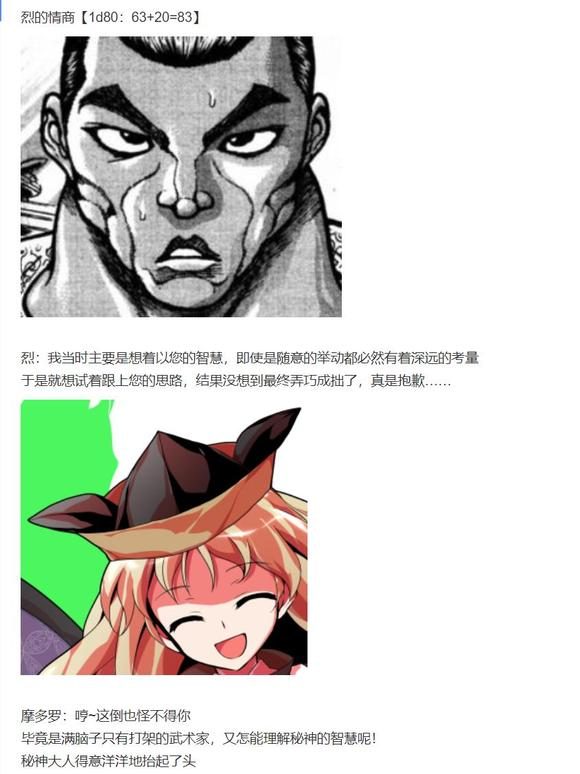
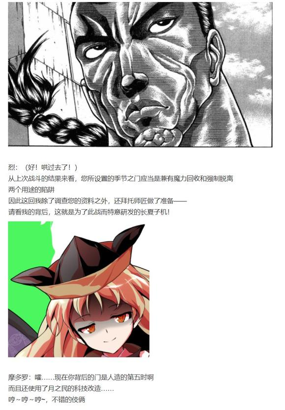
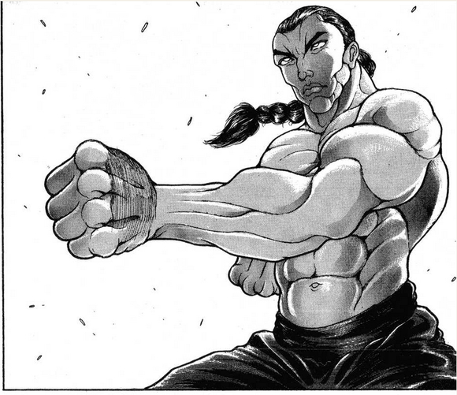

摩多罗隐岐奈放下了手中的小鼓，从见面以来第一次站了起来

一扇如形似开启门扉的法阵自她高举的双臂前浮现而出，四色的灵气化为了这透明之门的点缀

黄色的长发自她的脑后飘然而起，后户之国的秘神在此刻终于显现了战斗的姿态！

摩多罗：但你可能不知道

我呢，非常，非常，非常的——不喜欢月之民！

烈：我还真不清楚这一点

但凭借这魔改后的季节之门，我才终于拥有了与您战斗的资格！

摩多罗：本想着用上次的符卡和你再打一次

但我现在觉得适当教训一下你也不错

见之！

闻之！

语之！

这便是障碍之秘神的真姿！

烈：永远亭，烈海王

请您指教！

战斗！

BGM：秘神摩多罗　～ Hidden Star in All Seasons.

烈海王

Atk：287（138）

Hp：21

技能

烈 海 王：超越海皇，仍为海王。AtkX1.9，Hp+1。不会陷入异常状态，不会受到驻足，束缚等判定影响，面对所有技能都可以进行【1d100】的破解判定，60以上成功

完全消力： 普通攻击以及近战系、弹幕系技能所造成的的最终伤害/2（仅对Atk260以下的对手起效）自身所收到的普通攻击伤害-1，近战系、弹幕系技能伤害-2（仅对Atk261以上的对手起效）

长 夏 之 子 机（魔改）：人工制造的第五季节，配合月之都科技魔改后成为了绝对的作弊封印道具。仅能在本次剧情的最终战中使用，对于无法回避/破解/防御的必杀技可以进行回避/破解/防御，自身的战斗骰变为【1d125】，本场战斗中所受到的前4次伤害减半

神秘杀手（A）：与古代日本出身的且在历史上留名的知名妖怪战斗时，Atk+10，破解判定所需成功值-5

与摩多罗隐岐奈战斗时，Atk+25，破解判定所需成功值-20

红符【巨阙】（CT3）：（近战系）以超人术力与宇宙魔力凝结自身血液铸为无坚不摧的巨剑，本回合Hp-2，Atk+80，给予伤害+4

Flower star（CT4）：（弹幕系）对对手放出带有神秘力量的星形花弹，造成必中的【2+1d6】点伤害。

假腿【The World】:一天一次，使用假腿中的力量进行一次超快速移动。本回合战斗自动胜利且造成的伤害必中（对战斗力低于160的对手使用的情况下直接判定战斗结束，胜者烈海王）/【回避】一次致命攻击（对于无法回避/破解/防御的必杀技无效）

急救拳：一场战斗中只能使用一次，Hp归0后回复1点Hp

贫穷神的加护：自动发动，一天只能使用一次，令对手的大成功转变为大失败

必杀技

纯粹武道（CT5）：怀抱纯粹的武术，心存无色的执着。3T内Atk+70，对对手造成的伤害+3。3T内可对所有攻击进行【1d100】的破解判定，近战系、技巧系技能30以上成功，其余技能40以上成功，必杀技60以上成功

超人【烈海王】（CT6）：Atk+650，给予伤害X4，之后2T回避概率翻倍

武符【梦幻斗舞】（CT7）：以舞蹈的仪式引发体内的所有潜能，借助精神与生命的平衡，实现烈海王梦想之中的至高武道。无法回避/破解/防御，本回合自身无敌，进行一次【1d100】的反击判定，30以上可对对手的攻击进行反击

秘术【天文密葬法】（CT8）：制造虚假的月亮，削弱妖怪的力量，3T内战斗环节中，妖怪对手的Atk变为与自身最终结算后相同，自身的战斗骰变为【2d100】但同时无法使用破解，无法回避/破解/防御，给予伤害X2/引导宇宙的力量，发出轨道诡异的大量弹幕轰击 无法回避/破解/防御 Atk+900，给予伤害X6

摩多罗隐岐奈

Atk：270/280/290/300/310/320/330（？？？）

Hp：3/4/5/6/12/14/18（？？？）

技能

点到为止：自身被击破7次，或使用所有技能/必杀技后战斗结束

弹幕游戏：对手的所有抗性无效，自身所有必杀技均不可回避/破解/防御，自身技能/必杀技的破解/回避/防御判定所需成功值+15

绝对的究极秘神：所有特殊攻击手段/异常状态/各类判定对其无效

秘仪【Reverse Invoker】（CT1）：（弹幕系）一场战斗中仅能使用能够一次，自四侧交叠围困而来的弹幕之壁，回避要点在于穿过墙与墙之间的缝隙。进行7次【1d100】的中弹判定，55以上成功，对对手造成2+成功次数的伤害

秘仪【背叛的后方射击】（CT2）：（弹幕系）一场战斗中仅能使用能够一次，令阴阳玉自后方发出散乱而密集的红蓝二色弹幕射击，请积极向前方突进。对对手造成必中的【3d3】点伤害

秘仪【弹幕的玉茧】（CT3）：（技巧系）一场战斗中仅能使用能够一次，令绿之茧化为无限回环的囚笼，以黄色的弹幕作为无可躲避的重击，现在是该用子机的时候了。本回合对手每次破解/防御/闪避/攻击时时都会减少1点Hp上限，本回合对手无法进行普通攻击。

秘仪【后户的狂言】（CT4）：（技巧系）一场战斗中仅能使用能够一次，中场休息时的简短笑剧，随循环的弹幕一同旋转吧。本回合对手Atk-65，受伤时进行三次伤害判定。

秘仪【Matarah Dukkha】（CT5）：（弹幕系）一场战斗中仅能使用能够一次，若接近便会感受痛苦，若远离则需拥抱死亡，此为无可逃脱的苦谛针雨。3T内对手Atk-60，每次破解/防御/闪避/攻击时受到无视任何耐性与无敌的2点真实伤害。（被破解的场合仅令对手攻击降低的效果消失）

必杀技

秘仪【七星之剑】（CT6）：执掌杀戮的七星剑，带来毁灭的流星雨。令对手Hp减半，

自身Atk+750，给予伤害X4

【背面的暗黑猿乐】（CT7）：能乐之神所带来的最高表演，于暗处绽放的艺术之花。Atk+800，给予伤害X5

【无秩序的弹幕地狱】（CT8）：如同字面意思一样，由千奇百怪的弹幕所构成的攻击。Atk+900，给予伤害X6

T1

摩多罗：游戏再开！

符卡宣言 秘仪【Reverse Invoker】！

隐秘的神明一声令下，便有无色的弹幕自武者四周的阴影中凭空生成

它们井然有序地构成了变幻莫测的迷宫，并缓缓压缩着烈海王的活动空间

这是无法强行突破的，由秘神亲手设计的迷宫！

烈的破解【1d100：55】成功（成功值：60+15-20=55）

然而，武术家却仿佛早已看过了这神秘仪式的设计图

他险之又险的自弹幕之墙中穿梭而过，竟然毫发无伤的来到了秘神身前！

烈：您这符卡和秦河胜晚年所设计的仪式思路如出一辙

只要看过原版的设计图，破解现在的版本就不是什么难事！

烈的攻击【287+1d125：54=341】

摩多罗的攻击【270+1d100：65=335】

摩多罗的受伤【1d10：7】

1 回避

2 小伤害

3 小伤害

4 中伤害

5 中伤害

6 大伤害

7 大伤害

8 特大伤害

9 特大伤害

10 大成功/大失败【1d2：2】

Hp：3-3=0

一阶段击破

摩多罗：不错嘛，看来你除了无聊的阴谋论外还是有好好在做调查

T2

摩多罗：勇往直前的武术家，能够应付自背后而来的突袭吗？

符卡宣言 秘仪【背叛的后方射击】

后户之国的环境变为了令人头晕目眩的绿黑二色

不可名状的图案们在烈海王的视野中跳着令人不快的舞蹈

而在他为这诡异的情境所迷惑之时，红蓝二色的细小弹幕已如尖刀般攻向了他的背后！

烈的破解【1d100：13】失败

烈的受伤【3d3：7/2-2=1】

Hp：21-1=20

由月之头脑亲手设计的长夏子机自动化作了吞噬魔力的结界

它毫无保留地吞没了自后侧而来的绝大多数弹幕，只有极少数漏网之鱼勉强对武者造成了一些擦伤

烈：用起来感觉与琪露诺的夏之子机有些相似，真是强大的力量

烈的攻击【287+1d125：32=319】

摩多罗的攻击【280+1d100：36=316】

摩多罗的受伤【1d10：1】

1 回避

2 小伤害

3 小伤害

4 中伤害

5 中伤害

6 大伤害

7 大伤害

8 特大伤害

9 特大伤害

10 大成功/大失败【1d2：2】

摩多罗：可惜，月之民的科技再强也不是你自己的力量

秘神轻轻侧身，便躲过了武术家志在必得的突袭

烈：什么？！

摩多罗：你以为这种简单的攻击会对我起效吗？

动一动你的脑子，我都看你打过多少架了？

T3

摩多罗：居然对着神明大人拳脚相向，真是丝毫没有敬重之心

在这起源之茧中好好反省吧！

符卡宣言 秘仪【弹幕的玉茧】！

仿佛养蚕的丝茧，仿佛起源的摇篮，双重嵌套的绿色回环于武术家身旁形成了无限回环的囚笼

这粘稠而碧绿的墙壁在被击破的瞬间就会立刻再生，凭借暴力破坏已然几近妄想

黄色的小玉自茧的内侧破壁而出，如子弹般在这狭小的空间内射向了无路可逃的烈海王！

烈的破解【1d100：77】成功

但武术家早已不是会因此而困扰的愣头青

他跟随墙壁运动的节奏而改变着自己挪移的脚步，凭借着消力的技巧而抵御着自四方而来的弹幕——

这诡异的图景简直就像在枪林弹雨中翩翩起舞，匪夷所思却又令人惊叹！

烈：我自从到幻想乡以来，就天天接受师匠的抗压训练

同样是闭锁行动后再进行攻击的符卡，您的玉茧比起壶中的大银河可要差得远了！

符卡宣言 红符【巨阙】！

Hp：20-2=18

烈的攻击【287+80+1d125：74=441】

摩多罗的攻击【280+1d100：58=338】

摩多罗的受伤【1d10：8】

1 回避

2 小伤害+4

3 小伤害+4

4 中伤害+4

5 中伤害+4

6 大伤害+4

7 大伤害+4

8 特大伤害+4

9 特大伤害+4

10 大成功/大失败【1d2：1】

Hp：4-4-4=0

第二阶段击破

摩多罗：原本那么老实的烈海王，现在却连打架都闲不住嘴

果然让你跑去月之民的地盘就是个错误的决定！

T4

烈：乘胜追击

接招，Flower star！

摩多罗的受伤【2+1d6：5=7】

Hp：5-7=0

三阶段击破

面带冷笑的后户之神毫不在意地接下了烈海王的花弹

摩多罗：开幕的演出已经结束

让我观赏你所主演的滑稽笑剧吧——

符卡宣言 秘仪【后户的狂言】！

烈的破解【1d100：50】失败

被口出狂言的武术家所激怒之后，后户的秘神终于不再留手

门后国度于此刻化为了冷厉的深蓝色，而摩多罗只是将双手微微举起

无法想象的狂暴赤色弹幕旋风，就以她为中心而瞬间席卷了整个后户之国！

与此同时，前来观战的灵梦四人刚好来到了战场的边缘

琪露诺：呜哇，救命啊！！！

这啥啊！！！

冰之妖精被席卷全境的暴风吹的东倒西歪，而不得不躲在了灵梦的身后

灵梦：别抓我衣服——看样子摩多罗认真了！

文文：啧，就连我都无法轻易靠近……

旁观的二位童子吓得赶紧跳入了一扇门扉之中

而位于风暴中心的武术家却连这份逃走的余力都已经消失

因为他周围所有的门扉，都被秘神狂暴的怒火所摧毁了！

烈的攻击【287+1d125：22-65=244】

差值大于100自动失败

烈：摩多罗女士您别生气我真的没有诋毁您的意思啊！！！！！

摩多罗：如此喜欢口出狂言，就在狂言之中挣扎求生吧！

烈的受伤【1d10：2】

1 回避

2 小伤害/2-1

3 小伤害/2-1

4 中伤害/2-1

5 中伤害/2-1

6 大伤害/2-1

7 大伤害/2-1

8 特大伤害/2-1

9 特大伤害/2-1

10 大成功/大失败【1d2：1】

Hp：18-1/2=18

武术家当机立断使用了 长 夏 的魔力，以在最初的轰击中护得了自身的安全

摩多罗：看样子很有力气啊

那就给我跑起来！

秘神的狂言停止了一瞬

而后，蕴含着毁灭力量的赤色魔弹沿着以之前相反的方向，向着武术家咆哮而来！

烈：哦哦哦哦哦哦哦哦哦哦哦！！

烈的受伤【1d10：6】

1 回避

2 小伤害/2-1

3 小伤害/2-1

4 中伤害/2-1

5 中伤害/2-1

6 大伤害/2-1

7 大伤害/2-1

8 特大伤害/2-1

9 特大伤害/2-1

10 大成功/大失败【1d2：2】

Hp：18-3/2+1=18

不敢有丝毫怠慢，以子机护身的烈海王拼尽全身地奔跑着

在他以为自己终于逃出生天的时候

摩多罗：我让你停了吗？

最后一圈！

魔理沙：我的天啊，简直是灾难

让我想起了纯狐的那摊黑泥……

在旁观四人那目瞪口呆的视线中，本应停歇的赤色暴风爆发出了先前数倍的速度

形态各异的魔弹们彻底抛弃了先前所遵循的行动规则，它们在此时化为了以破坏为最终目的的毁灭兵器，自能想象的所有方向朝着烈海王围攻而来！

武术家唯一能做的只是激发出背后的所有力量，而后未有一刻停歇地跑着！

烈的受伤【1d10：8】

1 回避

2 小伤害/2-1

3 小伤害/2-1

4 中伤害/2-1

5 中伤害/2-1

6 大伤害/2-1

7 大伤害/2-1

8 特大伤害/2-1

9 特大伤害/2-1

10 大成功/大失败【1d2：2】

Hp：18-4/2+1=17

~长夏之子机的四次减伤消耗完毕~

摩多罗：啊~哈~哈~

不错嘛，这才称得上是缓解气氛的中场表演

你现在有什么想说的？

烈：谢谢您……手下留情……

T5

摩多罗：如今的你已经过上了幸福的人生

但你却永远无法逃离自身曾经历过的痛苦

符卡宣言 秘仪【Matarah Dukkha】！

如果将痛苦化为真实可触的实物，它会变成什么样子？

答案是针

光是看到就会有种刺伤双目的感觉

如果直接接触的话，则很容易受伤

针就是这般尖锐而又不讲道理的东西

这一点和痛苦是一样的

你问为什么突然说起这个？

那是因为——

琪露诺：哇，这什么夸张的招式？

她是硬生生造出了一个针地狱吗？

秘神于自身的国度之内以痛苦为针，造出了一个朝着自身不断合拢的地狱！

若在原地犹豫不定，则会葬身于被逼近的针山之中

若向前迎接秘神的挑战，则就必须直面自身所经历的痛苦

没有所谓万全的破解方法——只是从两条折磨人的道路之中，选择一条走下去而已！

纯粹武道发动

烈的破解【1d100：40】成功！（纯粹武道加成下成功值：40+15-20=35）

Hp：17-2=15（秘仪的效果）

每一个微小的动作都会带来针尖的伤害

每一次前行的脚步都会唤醒心中痛苦的回忆

被朋友尽数破解的招式

被友人所吞食的腿

被剑士所斩的腹部

因自身迷茫而混乱的恋情

以及，被恋人所击碎的心脏

但投身于武术的烈海王，却毫无犹豫的选择向着秘神前行！

烈：这惨痛的回忆，就是我变强的动力

我不会忘记任何一次失败

因为我不想忘记我在其中得到的教训！

鲜血淋漓的烈海王终于来到了摩多罗的身前

他全神贯注地对秘神轰出了自己，最为执着的一击！

烈的攻击【287+70+1d125：482】

差值大于100自动成功

Hp：15-2=13（秘仪的效果）

摩多罗的受伤【1d10：4】

1 回避

2 小伤害+3

3 小伤害+3

4 中伤害+3

5 中伤害+3

6 大伤害+3

7 大伤害+3

8 特大伤害+3

9 特大伤害+3

10 大成功/大失败【1d2：1】

Hp：6-2-3=1

文文：可惜，就差一点

秘神毫不躲闪，堂堂正正的正面接下了武者的攻击

而后，她以手中的法阵将烈海王扔向了其身后的针山中

摩多罗：真是顽固的家伙

既然已经拼到这番田地——

那我也不得不拿出点真本事了

烈：求之不得！

我一向是，无所谓的！

T6

摩多罗：居天之中央，当昆仑之上，随二十四气，定四时五行

主临制之权，称七政帝车，分阴阳混沌，令天下四方

秘仪【七星之剑】！

秘神抬手指天，便有闪耀的明星自空中浮现而出

其形如长勺，柄指西方，为主杀之星象，掌纷乱之权柄

北斗的新光化为杀伐之利剑，向地下的武者直刺而来！

烈的破解【1d100：26】失败

Hp：13-2=11（秘仪的效果）

烈：贪狼、巨门、禄存、文曲、廉贞、武曲、破军

以北斗之星光铸为杀伐大阵

这怎么可能破解？

武术家于星光之下握紧了拳头

烈：那就用我自身的力量，去对抗这份天降之杀机吧！

符卡宣言 红符【巨阙】

符卡宣言 超人【烈海王】！

Hp：11-2=9

Hp：9/2=4（七星之剑的效果）

以自身的血液铸为大剑

将自身的肉体化为流星

一道血色的光芒拔地而起，迎向了自天而落的璀璨繁星！

烈的攻击【287+80+70+650+1d125：7=1094】

Hp：4-2=2（秘仪的效果）

摩多罗的攻击【290+700+1d100：62=1052】

摩多罗的受伤【1d10：8】

1 回避

2 小伤害X4+3+4

3 小伤害X4+3+4

4 中伤害X4+3+4

5 中伤害X4+3+4

6 大伤害X4+3+4

7 大伤害X4+3+4

8 特大伤害X4+3+4

9 特大伤害X4+3+4

10 大成功/大失败【1d2：2】

Hp：1-4X4-3-4=0

四阶段击破

听不到一丝多余的轰响，看不到任何弥漫的硝烟

天际的七颗星辰大放光芒，而后暗淡着，低迷着，如同来时一般悄然无声地回到了神秘的黑暗之中

武术家站在秘神面前，勉强用血剑支撑着自己的身体，而后抑制不住的吐了口血

魔理沙：这**……

和北斗星君的术式硬碰硬，就算赢了也得不到什么好处啊

灵梦：皮肤表面大面积创伤，侧腹部被开了个洞

胸口中了一剑，心脏似乎没事，但肺部应该是破了

摩多罗：笨~蛋~

还要接着打吗？

烈：当然

只要还有一口气在

就没有停止战斗的道理！

T7

摩多罗：那就继续吧！

演出的高 潮部分已经来临，暗黑的能乐之舞于此上演

符卡宣言【背面的暗黑猿乐】！

烈海王面前的秘神拍了拍他的肩膀，而后忽然消失了

武术家回头望去，却在自己背后数千米之外的地方看到了秘神的背影

摩多罗：接招，烈海王

——半径20千米的弹幕结界！

扭曲的暗黄色变为了世界的背景，花团锦簇的图案于暗处隐约出现

蓝色的弹幕之环构成了舞台的边界，自后方发射的魔力之光柱成为了观众的欢呼——

后户之国在秘神的手中化为了仅为一人而设的舞台

而表演失败的结果，就是葬身于这暗黑的能乐之下！

烈的破解【1d100：41】失败

Hp：2-2=0（秘仪的效果）

烈要使用【1d2：2】

1 急救拳

2 假腿

回避秘仪攻击后，Hp变为2

武者四周的苦痛之针仍未消失

他想要试着破解秘神的舞蹈，但抬手一动就有万千针刺向他飞来

因此，烈海王不得不提前用出了假腿的力量

烈：【The World】！时间停止吧！

他在静止的时间中轰飞了自身周围的针刺之山——

然后时间开始流动

烈：这可真是大手笔

既然您营造了如此壮观的舞台

那我也不便推辞，便在此起舞吧！

符卡宣言 武符【梦幻斗舞】！

摩多罗的攻击【310+800+1d100：25=1135】差值大于100自动成功

烈的反击【1d100：24】失败

由于本回合无敌，战斗伤害为0

Hp:2-2=0（秘仪效果不受无敌影响）

最后一批苦痛之针扎入了武者的肉体之中

他不得不用出自身压箱底的绝技，才能拥有继续战斗的力量

烈海王使用了急救拳

Hp：0+1=1

掌握了精神与肉体的平衡，就无需担心会发生无意义的失误

习得武术之真谛后，在这奥秘的国度之中，也能够来去自如！

未曾迷惑于变幻的背景，不曾碰触舞台的边界，横扫的激光更是难以触之分毫！

烈海王在这秘神划下的区域之中，跳起了属于自己的舞蹈！

烈：距离实在太远，凭我目前的体力是过不去了

我的演出，可否满足您的期待？

摩多罗：哈哈哈哈，你这嘴硬到死的家伙

不错，我很满意！

T8

Flower star 发动

摩多罗的受伤【2+1d6：4=6】

Hp：12-6=6

摩多罗：真可惜，就算完全打中了也依旧毫无意义

自持武力而独自前来挑战，就是你今天做出的最为失败的决定

于这混沌莫名的地狱中沉沦吧！

符卡宣言【无秩序的弹幕地狱】！

填充背景的颜色开始以疯狂的速度变化着

门扉之内的空间终于成为了光怪陆离的世界

环境之中的纹样已然变为不可名状的怪异图画

可供辨识方向的标志性物品从战斗的中途就已经被完全摧毁

在场的众人所能看到的只有秘神所释放的弹幕——

红紫二色的箭弹化为边界，赤色的魔弹构成主体，而秘神亲手释放的炽热之光辉，成为了这绝体绝命的无规则地狱内最大的杀招！

灵梦：啧，根本不像纯狐那样一段一段的慢慢游乐……

文文：一出手就是火力全开的杀招啊！

烈：理所当然，靠我自己是绝对打不过您的

我知道，与灵梦魔理沙她们并肩作战才是取胜的正道——

但无论如何，我都想靠自己来面对这场战斗！

请看好了，这就是我平生所学中最为强大的招式！

符卡宣言 秘术【天文密葬法】！

就和以前千百次的练习一般

武术家熟练地操纵着自身体内的魔力

召唤使魔，构建密室，于神国中创造属于自己的空间

无法应用虚假的月光削弱神明，那便凭借宇宙的力量突破祂所制造的绝望困境吧！

月之头脑的秘术于此制造了无边的弹幕之海，向贤者的地狱发起了一往无前的冲锋！

魔理沙：实力差距实在太大了……

能做到吗？

琪露诺：不是能不能做到的问题，是一定要做到！

战力不足的话，就用勇气来弥补！

恍惚间，烈海王想起了过去在月球的战斗

那时面临纯狐的地狱，他能做的只是搏命般造出一轮虚假的月光，然后祈祷它能够起到些效果

而如今，同样是弹幕的地狱，同样是无力匹敌的对手

只是这一次，正面面对挑战的人，变成了自己

嘴角不自觉的勾了起来

战斗的结局似乎变得不重要了

他已经不再关注胜负这原本最为关键的东西

而只想看看自己，究竟能够走到什么地步

烈的攻击【287+900+1d125：94=1281】

摩多罗的攻击【310+900+1d100：50=1260】

在二人的攻击正面相撞的那一刻

全幻想乡的居民仿佛都听到了一声若有若无的轰响自他们身旁的门中传出

在场旁观的四人在冲击来临之前便不得不全力用出了护身的招式

她们静静等待着硝烟的散去，等待着这场战斗最后的结局

摩多罗的受伤【1d10：2】

1 小伤害X3（无法回避）

2 小伤害X6

3 小伤害X6

4 中伤害X6

5 中伤害X6

6 大伤害X6

7 大伤害X6

8 特大伤害X6

9 特大伤害X6

10 大成功/大失败【1d2：1】

Hp：6-1X6=0

战斗结束的时候，应当如何判断胜负呢？

答案是高度

决胜负时的标高……海拔……

能放的比头的位置更高的人，就是胜者

这个时候，有两个人正面对面的站着

其中一人披头散发，遍体鳞伤

另外一人衣着整洁，神色自若

摩多罗：真是的，还真做到了

所以说我才讨厌月之民的技术

那位鲜血淋漓的武术家，挣扎着张开了口

烈：摩多罗女士

我成功了吗？

究极的绝对秘神重新坐回了她的尊位之上

于是相较于座位上的摩多罗

烈海王成为了海拔较高的人

摩多罗：漂亮的战斗！

你已经破解了我本次使用的所有符卡

这次，是我输了！

五阶段击破

全符卡击破

战斗结束

胜者 烈海王

武者听到自身获胜的消息之后，才终于心满意足的倒在了地上

烈：能来个人扶我一把吗……我没力气了……

魔理沙：不能

给你瓶疗伤魔药自己喝去吧

黑白色的魔法使从兜里掏出了一罐奇妙的蓝色药剂，然后塞进了武术家的嘴里

灵梦：那么……奇怪的秘神大人，可还有战斗的力量吗？

文文：我已经迫不及待地想进行私家采访了哦！

摩多罗：哦~

看样子你们的复仇心都还很高涨啊

那就陪你们再玩四把吧！

【1d100:50】分钟后，摩多罗结束了与其余四人的一对一决斗

一脸轻松的秘神和灰头土脸的四位自机回到了武术家的面前

此时烈海王凭借着魔法使的魔药，总算恢复了些继续行动的力气

烈：现在大家的战斗都结束了

摩多罗女士，您也可以说说发动异变的真正目的了吧？

摩多罗：哎呀？

我不都说了是在招聘新员工吗？

灵梦：怎么可能

你要是真想找人替代二童子，那早就趁我们失败的时候强行洗脑了

摩多罗的坦诚【1d50：20+50=70】（第二次战斗胜利+50，默认说出基本目的，75以上说出所有目的）

摩多罗：真是敏锐的家伙们啊

嗯，四季异变到现在也基本上可以停止了，毕竟这一次算是你们的胜利

下一次我不会在幻想乡全境开启背后之门了

因为该传达的信息也都已经传到了

魔理沙：传达信息？

向谁啊？

摩多罗：现在幻想乡的众人，以及别的贤者

琪露诺：搞什么

说白了你不就是在显摆实力吗？

摩多罗：琪露诺，显摆实力可是很重要的事情

去博丽神社的门在左数第【1d100：65】上数第【1d100：72】个，慢走不送

不知不觉间，绿色的门扉又再次出现了这片诡异的空间之中

灵梦：多谢，总算是能回去了

可别忘记把季节变回原样哦

红白色的巫女拉着魔理沙和琪露诺飞向了自己的家

摩多罗看向了一旁的天狗记者

摩多罗：我想我的意思已经传达的够明确了

文文：——我先前已经向大天狗大人汇报过了

并不想与您为敌，这是他们所表露的意见

摩多罗：很好

如果现在的天狗都像你这般模样，那与天狗签订和平条约也是可以考虑的事情

下一次去天狗的地盘看看吧

文文笑着对秘神挥了挥手，而后飞走了

烈的察觉【1d70：19+30=49】（75以上察觉）

烈海王毫无头绪的听着两人间的对话

烈：摩多罗女士，我还有些想问的事情

我刚到幻想乡的那段时间，究竟有多少事是在您计划之中的啊？

摩多罗的掌控【1d10：2】

1 永远亭最离谱

2 见幽香最离谱

3 幽香强袭最离谱（为啥啊）

4 永远亭最离谱

5 万宝槌异变最离谱

6 魔理沙最离谱（为啥啊）

7 永远亭最离谱

8 跟师匠表白最离谱

9 全部都在我的掌控之中（为啥啊）

10 大成功/大失败【1d2：2】

摩多罗：我毕竟是星象之神，也了解你在这方面的特异天赋……

因此被月之民所看重到也是我有考虑过的发展

但莫名其妙的跑去太阳花田是什么玩意？

啊？弱小到这个地步却偏偏有胆子去找大妖怪？

就算是我也不可能想到这个发展啊

烈：啊这个确实……我当年也没想到会变成如今这样……

那秦心小姐是？

感情异变的黑幕是【1d10：10】

1 帮秦心找朋友

2 1+顺便让烈海王练手

3 乐子（别乐了）

4 帮秦心找朋友

5 4+顺便让烈海王练手

6 其实不关我事（那您说啥啊）

7 帮秦心找朋友

8 7+顺便让烈海王练手

9 其实当年想撮合一下你们（您想啥呢）

10 大成功/大失败【1d2：1】

黑幕大成功！

这里大成功是啥啊？【1d10：9】

1 借此机会调整了人里的平衡

2 全部在我的计划之中

3 超级大乐子（草）

4 借此机会调整了人里的平衡

5 全部在我的计划之中

6 其实是紫（为啥啊？！）

7 借此机会调整了人里的平衡

8 全部在我的计划之中

9 虽说这对没成但幽香那边很顺利（哈啊？！）

10 大成功/大失败【1d2：2】

秘神大人装模作样的清了清嗓子

摩多罗：咳咳

我想着当时你应该能够应付这种程度的小异变了，就悄悄把秦心的面具扔到了地底

无感情的面灵气妖怪被感性丰富的武术家所打倒之后觉醒了心中的恋情——

这不是很常见的剧情嘛

结果被你最后的时停暴击给完全毁掉了，你可真行啊

烈：不不不您为啥还操心这些？！

怎么想都不合适吧，这个！

摩多罗：顺便一提

风见幽香那次倒是出人意外的顺利

烈：啊？为啥会突然提到幽香？

摩多罗：你记不记得去年的某场音乐会上，付丧神姐妹演奏了一首出人意料的曲子？

烈的察觉【1d70：24+30=54】（50以上察觉）

烈：……您给的？

摩多罗：没错！

当时想着之后气氛一定很好就顺手帮一把，没想到还真能起作用啊

哈哈哈哈！哈哈哈哈哈！！

烈：啊？？？？

啊？？？？？？？？

秘神大人在椅子上高声长笑着

武术家则在一旁无奈的捂着脸

这场心血来潮的异变，就像之前的数次异变一般，在这哭笑不得的氛围中结束了

~永远亭~

又到了今日的烈海王故事会时间

烈的说明【1d100：47】（50以上理解）

被包成粽子的烈海王正在轮椅上语速飞快地说着今天的见闻

铃仙：这一次居然连我都基本上能听得懂耶

因幡帝：莫非坐轮椅能提高智力？

月之头脑正面无表情的看着手中的弓

永琳：居然连秘神都掺了一手

我的恋爱之路到底受到了多少人的阻碍？

辉夜：永琳，冷静，先冷静一下

不要一脸狂暴的把弓拿在手里好吗，拿出点身为月之贤者的威严啊！

【1d20：11】分钟之后，烈海王结束了今日的讲述

辉夜：虽说这次依然有很多值得吐槽的地方

不过竹林里的雪总算是化了，干得不错！

皮克：嗷嗷嗷嗷嗷啊

（结果，摩多罗跟秦河胜之间到底是什么关系啊？）

烈：我不知道，我也没有问

我想这事只有身为当事人的神子殿下她们，才有资格知道吧？

铃仙：师匠

最后摩多罗对天狗说的那些话是什么意思啊？

永琳：这只是我的推断，不过摩多罗隐岐奈大概也是这个思路吧

那是警告，对于天狗族群的警告

在与狸猫的信息战中取得优势后，这段时间的天狗明显变得明目张胆起来

自以为掌控了幻想乡的信息渠道，她们甚至敢于编造各种莫须有的故事

烈：比如说射命丸小姐前几天出版的那本书的原版？

永琳：没错

我本想让探女借此机会给她们一个教训，不过却被多管闲事的赫卡提亚打乱了计划

呵，结果最后反而是幻想乡的贤者被她们所激怒了……真是个滑稽的笑话

烈：结果那本书没能按时出版的最大原因是你和探女暗中的计划被赫卡提亚所阻挠了？！

师匠你连这都有下手的？！

话说那计划如果成真会变成什么样啊？

永琳：也不会有多大的变化，一部分人会变得和以前不太一样，仅此而已~

幻想乡的贤者在顾虑各种各样的事情

我和地狱的女神也需要考虑自己相关的琐事

大家的思维在幕后相互碰撞，最后才有了表面上的和平

这就是平淡如常的幻想乡哦

皮克：嗷嗷嗷嗷嗷啊

（听上去好恐怖啊）

因幡帝：放弃吧，皮克

咱们可没法理解她们的思考方式......

迷途竹林的积雪已经消融

幻想乡全境再次回到了仲夏之中

居于幕后的贤者借此机会重回了表面上的舞台

究竟有多少台面上的事情，是大人物们暗自交锋的结果？

武术家并不了解这些事情

“下次围这条围巾的时候，得等到今年冬天了吧？”

他只是默默在轮椅上养着伤势，并思考着自己现在该穿什么衣服

~第476天结束~

——四季异变结束——

异变总持续时间：4天

成就：幻想入之谜 达成！

终于解开了自身幻想入的谜团

今后的选项中会偶尔加入摩多罗隐岐奈相关剧情

成就：解决四季异变 达成！（此成就包含本次异变中的所有战斗奖励）

Atk+4

现在的Atk：269（142）

成就：究极的绝对秘神 达成！

通过了摩多罗隐岐奈的考验，解明了绝对秘神的真身

神秘杀手升级了！

神秘杀手（EX）

与古代日本出身的且在历史上留名的知名妖怪或神明战斗时，Atk+10，破解判定所需成功值-5

与摩多罗隐岐奈战斗时，Atk+25，破解判定所需成功值-20

（本日的更新结束，下一次的更新在周一或周二）

（以下是我的废话）

那么天空璋异变到此正式结束

没有玩过原作的朋友们可能会有些好奇，前面出场的山姥和阿吽与这次的主线剧情究竟有啥关系呢？

哈哈哈哈哈哈，其实确实就没啥太多关系，她们只是同为隐秘的妖怪而已（

阿吽此后会成为博丽神社常驻者之一，她跟摩多罗的关系倒是比较密切，有机会整个彩蛋吧

话说这次是他 妈 的异变回啊！不是日常回也不是原创活动啊！

怎么还吃？！吃不饱吗？！

这是第几次脸皮大成功了？啊？！

你察觉和推理的时候怎么就拿不出这劲呢？

摩多罗二战骰的没一战恶心，不过写起来很卡，超级卡

毕竟写出**就得整点大场面，就得说骚话......于是最后三个回合写了半天才搞定（悲）

为啥最后摩多罗黑幕还能来个大成功梗选项呢

秦心，我的倒霉蛋（悲）

之后会在彩蛋环节补一些没有写明白的剧情——比如说四人二回战究竟垫了几个（笑）

那么本次的更新到此结束，下次的更新在周一或周二

下一次是安定的日常回，真好啊真好啊

什么，你说梦境？那玩意我就加一个梗选项，希望等到过段时间再写——不然连续俩异变得累死我

骰子明天发

附上本次的骰子

阿吽：哎？

那个深藏不露的射命丸小姐居然都会输？

隐岐奈小姐原来这么厉害啊

秘神拿起了身旁的酒杯，让武术家给她倒了杯酒

摩多罗：那是当然

只要我想的话，把幻想乡推倒重建这种事也是轻而易举呢

灵梦的敬业【1d100：42】

灵梦：如果你要做这种事

我一定会让紫阻止你的！

文文：灵梦小姐，至少自己也出战好吗？

烈海王看了看秘神身旁的狛犬

烈：摩多罗女士您跟阿吽小姐关系还蛮好的？

摩多罗伸手搂住了一旁呆呆的狛犬妖怪

摩多罗：呵呵

这只狛犬，是寄身于石像的神灵，凭借背后之门的魔力局限而化的妖兽

在这次异变之前，她一直都是以石像的模样看着你们的

灵梦：所以才会说出“我一直都看在眼里”这样的话吗？

哎，等会

四季异变之前的她只是石像

这不就相当于你制造了一个新妖怪？！

摩多罗：就是这么一回事

我呢，只需一念之间就可以轻易制造出一个新的妖怪

所以说，把幻想乡推倒重建这种事是很简单的吧？

烈的情商【1d80：60+20=80】

烈：（魔理沙，这算不算母女关系？）

魔理沙：（你想死吗？你说出来试试？）

文文：呜呜呜

这么有趣的新闻却没法登报，真是太可惜了

在此次异变中从头到尾都一直吃瘪的天狗记者无奈地灌了口闷酒

一旁的自机们此时对于秘神的强大却少有的没什么太大看法

因为无论是输是赢，他们都已经充分领教过那份可怕的力量了……

欢乐的宴会还在继续

秘神大人在短暂的登场之后，便退到了会场的边缘

而幻想乡的另一位贤者则从她身旁的隙间中探出了头

摩多罗：哦，你来了

说起来，我在巫女所用的季节间隙中看到了些很熟悉的手法

那种操控境界线的方式，和某人常用的手段如出一辙呢

紫：你都那样大张旗鼓地给出了信息

我也不得不做些表示嘛

如何啊，我们这些年的成果

摩多罗：啊啊，我放心了

我们所制造的幻想乡还在平稳而安定地运行着

外来的变数们没有影响到，也不可能影响到最根本的机制

平稳到这般地步，甚至已经不需要我们出手干涉了

他们自己会将问题解决的

本次的测试圆满成功

紫：还好意思说这个？

你所带来的武术家才是近期最大的变数

不仅为此间接发动了异变

连他的恋爱问题都要偷偷在暗处干涉

你这胡作非为的神

摩多罗：啊呀，那你对巫女那明显到极点的偏爱又是什么？

明明让她自己去处理就可以了，却偏偏忍不住要自己出手帮忙解决门的问题

前段时间为了她的朋友你还亲自去人里的书屋跑了一趟

你这肆意妄为的妖怪

贤者们冷笑着看向了对方，随后又默契地碰了碰杯，将美酒一饮而尽

小家伙们仍在明亮的正殿中嬉戏打闹

而对于隐藏在幕后的她们而言

在阴影中注视着台面上的表演，兴趣所致时偶尔登上舞台

才是平和而又安宁的日常

~你是谁？~

~神灵庙~

头戴耳机的圣人正在办公室中处理着她今日的工作

就在这时，她耳中响起了敲门的声音

神子抬头望去，发现紫绿二色的童子从办公室的门后探出了脑袋

里乃：太子大人您好~

舞：师傅大人说想见您一面~

您现在方便吗？

神子：呵，装模作样的家伙

躲在暗处不知看了多久，结果现在反而知道派手下来问了？

请吧

于是童子们把头缩了回去

而后，究极的绝对秘神光明正大的推门走了进来，并坐在了神子的对面

摩多罗：好久不见，太子殿下~

神子：差不多将近一千五百年了吧？

确实是许久不见了

那么，我应当如何称呼你呢？

是如以前那般叫你河胜？

还是说，称您为摩多罗大人？

说起来摩多罗与秦河胜的关系到底是？【1d10:6】

1 当初的一个化身

2 正是心血来潮的本人

3 是转世身（那是什么）

4 当初的一个化身

5 正是心血来潮的本人

6 秦河胜于1500年之间修成了如今的力量（太离谱了吧）

7 当初的一个化身

8 正是心血来潮的本人

9 是……是始皇帝！（哈啊啊？！）

10 大成功/大失败【1d2：2】

摩多罗：啊~哈~哈~

接着用以前的叫法也完全没问题哦

因为归根到底——

你眼前的存在于这1500年间，根本就没怎么变过嘛！

丰聪耳神子惊讶的看着眼前这不可一世的家伙

那神采飞扬的姿态，与千年之前的部下根本就没有一丝一毫的差异

神子：喂喂，不会吧

真是河胜？！

你真的靠自己修成了如今的力量？！

摩多罗：正是！

哈哈哈，真要论年龄的话，我甚至连山中的天狗们都比不上！

神子：真是难以置信……

你究竟是如何做到的？

摩多罗的做法是【1d10：4】

1 吞噬神性

2 继承神职

3 时光逆行（过于离谱了）

4 吞噬神性

5 继承神职

6 靠我秦河胜的努力（我的天）

7 吞噬神性

8 继承神职

9 误收的信仰（为啥啊）

10 大成功/大失败【1d2：2】

摩多罗把玩起了手中的小鼓

摩多罗：当年我退治完那滑稽可笑的“常世神”之后，却发现自己的力量莫名变强了

我从那时起才知道，原来【神】的力量是可以被抢夺的

不过，那些知名的神明们对当时的我来说太过强大了

即使对于成为能乐之神的我来说，也是一样

神子：所以，就把目标放在了那些名不经传的神身上？

摩多罗：过程意外的顺利

很多所谓的【神】甚至没有自己的意识，而只是一团形状怪异的力量而已

于是，我就一步步这样走着

我变成了宿神

我变成了星神

我变成了后户之神

我战胜了与天狗同源的古老隐秘，于是我又成为了障碍之神

最终——不算很久的时间过去之后——

秦河胜变成了摩多罗隐岐奈

而我，成为了究极的绝对秘神

神子的认同【1d100：58】

神子拿起了手中的笏板，而后吧唧一声拍在了秘神的头上

摩多罗并未躲闪，只是装模作样的揉了揉额头

神子：哼，早就劝你不要走神道教的道路

吞噬了过多隐秘存在的你，却也不得不因此继承它们的身份

结果到最后你也只能是秘神了

这就是歪门邪道的代价！

摩多罗：掌握了力量与权柄

守护了重要的事物

能够做到这些，对我而言便已心满意足

至于身份？

那种东西怎样都好啦，哈哈哈哈！

秘神大人

不

秦河胜在圣德太子的面前，如千年之前一般飞扬跋涉的笑着

丰聪耳神子一脸头疼的揉着脑袋

神子：你这无可救药的家伙！

烈海王来的时候也是，秦心发动异变的时候也是，一直都在暗中窥探着吧？

我早该知道根本没有那般巧合的缘分在的！

摩多罗：何必如此严肃？

真要较真的话，你我能在此处的幻想乡相见，不就是最大的缘分吗？

那么该说的我都已经讲完了

祝你生活愉快啊，太子殿下

不，神子殿下

摩多罗隐岐奈愉起身向着办公室的大门走去

神子对摩多罗的称呼是【1d2：1】

1 秦河胜

2 摩多罗

摩多罗将手伸向了门把手，将门推开了一丝缝隙——

神子：彼此彼此，河胜

障碍之秘神背对着过去的上司，在门前停下了脚步

她看着手中的门把手，不知在想些什么

神子：自从你将烈海王送来之后，神灵庙的伙食倒是改善了很多呢

布都和屠自古那两个吃货自不必说，娘娘那挑剔的胃口也能满足

呵，就连娘娘的小僵尸偶尔都会吃两口，真是位了不得的大厨

下次有空的时候过来吃饭吧？我请你喝两杯酒

不，算是余赐你的，哈哈哈哈！

究极的绝对秘神在门前转过了身

摩多罗：哎呀哎呀，这可真是

多谢太子殿下了！

圣德太子与秦河胜在这千年之后的幻想乡再次相遇了

她们已经有了与过去相异的身份

她们的名字也不再是从前那个了

力量的差异与身份的高低都颠倒了过来——

但说话的方式却仍和以前相同

摩多罗隐岐奈挥了挥手，潇洒而快乐的离开了神灵庙

丰聪耳神子则在身后看着好友离去的背影，等待着她下一次的来访

一切似乎都和过去不同

一切似乎都和过去一样

（本日的彩蛋结束）

附上彩蛋的骰子

摩多罗和秦河胜的关系原作并未说明，因此这里无论骰出哪个选项都是毫无疑问的二设（不如说本贴内容本来就全都是二设），请大家千万千万别当真啊

顺便一提因为评价那里出了58这个不上不下的数字，因此最后神子选称呼那个1d2其实是决定了两人之间今后的关系（

如果选了秦河胜那么就维持过去的友谊

如果选了摩多罗那么两人就会分道扬镳

所以称呼其实还蛮重要的（笑）

