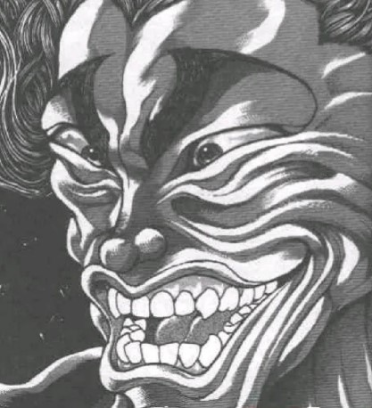

~高热量食品~

~雾雨魔法店~

雾雨魔理沙正浑身颤抖的看着她脚下的秤

魔理沙：骗人的吧？！

我就喝了一小罐……

居然，居然胖了【1d4：4】斤？！

此时，烈海王恰好推开了魔法店的门

烈：之前说好请你吃饭的

这次想吃啥？

狂暴化的金发小女孩猛冲过来揪起了武术家的领口

魔理沙：还吃？！还吃？！

他 妈 的 你那罐超甜饮料害我胖了四斤！！

四斤！！！

烈的情商【1d80：9+20=29】

烈：嗨，才四斤，这怕什么？

从外表上一点都看不出来嘛哦哦哦噢噢噢哦哦别晃了别晃了脖子要断了！！

魔理沙：已经不是吃饭的时候了！！！必须要减肥！！！

魔理沙要做什么【1d10：6】

1 和帕秋莉一起锻炼吧

2 和爱丽丝一起锻炼吧

3 问问摩多罗吧（为啥啊）

4 烈：这里就应该选择跑步

5 肚子饿了还是先吃饭吧（草）

6 烈：这里就应该扎马步（为啥啊）

7 灵梦，救我啊！！

8 靠我雾雨魔理沙的魔药！

9 靠我雾雨魔理沙的减肥餐（别吧）

10 大成功/大失败【1d2：2】

烈：不要慌张

这里就要靠我们中华武术代代相传的基本功——马步！

魔理沙：那是什么啊？

烈：这是我们锻炼下盘稳定所用的基础练习

将双脚分开略宽于肩，采取半蹲姿态，因姿势有如骑马一般故得此名

这可是很累的！

坚持得越久，对肉体的负担就越大，到最后出汗量甚至会在地上形成水洼——

如何，要试试吗？

魔理沙看了一眼地上的秤

她感到自己充满了决心

魔理沙：干，拼了！

如果没用我就找你算账！

烈：只要你坚持的够久，就一定会有效果！

来，我陪你一起做！

魔理沙的马步练习持续了【1d12：9】小时（1-3一斤，4-6两斤，7-9三斤，10-12四斤）

9小时之后，终于坚持不住的金发小女孩倒在了地上

魔理沙：呼……呼……

我的腿和腰……我感觉不到它们了……

烈：这不是相当有毅力吗

来，现在看看瘦了多少！

魔理沙：要是没用我饶不了你——

哇这还真行？瘦了三斤？！

武术家与魔法使畅快的笑着

而他们直到笑完之后才想起来，自己身上的衣服已经完全被汗水所浸透了

魔女装的质量【1d100：12】（越低越贴身）

烈的评价【1d100：19】

烈：怎么说呢，我觉得这衣服穿你身上显得有点太小了……

倒不是说不好看，就是有股子高中生穿小学校服的感觉

举个例子来说就像是堇子小姐穿上了琪露诺的衣服——

魔理沙：****嘴！

还会举例子？！

你个次次说明状况时打车轮拳的憨货为什么在损我的时候嘴就这么毒？！

烈：（不过这套说实话比以前那套黑白色的好看很多……）

魔法使正一脸坏笑的看着武术家

魔理沙：（哎嘿？）

烈：糟！习惯性的就……

魔理沙：口是心非的家伙

饿死我了足足大半天没吃东西，赶紧吃晚饭！

今天的晚饭是【1d10:9】

1 烧烤

2 鲁菜

3 减肥餐（好残忍）

4 烧烤

5 川菜

6 空气晚餐（太惨了）

7 烧烤

8 粤菜

9 蘑菇火锅（啊？！）

10 大成功/大失败【1d2：2】

烈：没问题，今晚吃啥？

烤串？烤肉？还是整点我家乡菜？

魔理沙：热量都太高了，你这一顿能把我今天努力的成果全都报废！

接着吃蘑菇得了

烈：还蘑菇，别了吧？！

上次差点把命都丢了！！

魔理沙：上次那是不小心吃错蘑菇了，我可能在一个地方跌倒两次吗？

这次让你见识见识我真正的手艺！

魔理沙的厨艺【1d100：22】（30以下坏事，70以上好事）

糟糕的事件发生了

具体来说是【1d10：6】

1 拉肚子

2 食物中毒，堂堂住院

3 灵梦蹭饭突击！（别吃这个啊！）

4 拉肚子

5 食物中毒，堂堂住院

6 蘑菇汤里……钻出了西瓜！（为啥啊）

7 拉肚子

8 食物中毒，堂堂住院

9 摩多罗决定找点乐子（别乐了！）

10 大成功/大失败【1d2：1】

【1d30：6】分钟后

烈海王与魔理沙正神情严肃的看着锅中那不可名状的粘稠液体

一个个五彩斑斓的气泡从黑色的浓汤中冒了出来，随后“啪”的一声破碎，似乎能听见些若有若无的哀嚎从遥远的地方传出

蘑菇们巨大的菌盖在锅中上下翻腾着，那鲜艳的颜色逐渐融化到了汤中，只剩下一丝令人不安的白

烈：魔理沙……

这玩意看上去比上次还恐怖啊……

魔理沙：这次发挥稍微有点失常……

应该不会吃死人的……吧？

两人颤抖着向火锅伸出了筷子

就在这时，浓汤的水平面突然升高，因为某个奇妙的生物从锅中跳了出来！

两人的恐惧【1d100：78】

烈：啊啊啊啊啊啊啊啊啊蘑菇的冤魂来报复啦！！

魔理沙：啊啊啊啊啊啊啊啊啊蘑菇不会有冤魂的！！

两人手忙脚乱的扔掉了筷子，并不约而同的缩到了房间的角落中

萃香：是我啦，哇哈哈哈哈！

小小的百鬼夜行正在锅中哈哈大笑着

魔理沙：为什么我的晚饭里会出现萃香？

烈：难不成萃香小姐刚刚在蘑菇堆里睡觉吗？

萃香：一觉醒来发现自己居然在火锅里炖着，真奇妙啊~

要来点酒吗？

于是，两人一鬼喝着美酒并享用了超级难吃的火锅

萃香：魔理沙，你做的这个真的好难吃啊

烈：——我看下次要不我教你两手吧？

魔理沙：——我承认我这厨艺是该练练了

（彩蛋环节结束）

~保底机制更改与个人的反思~

不知道各位有没有一种感觉

从二连战之后，贴子内的剧情展开就变得有些略微平稳了

并不是说平稳不好——说实话我也受够胃疼了绝对不想再来一次——但是总感觉意外性似乎变少了许多

当然，这是因为最大的爆点已经过去了（毕竟那段我原本打算放在结局的），但我想也有些其他的问题在

于是反思之后得到以下结论

1 离谱的选项变少了

不要着急，这和感情戏无关（笑）

在贴子初期的时候，我的选项会相对给的自由很多

因为当时我并未考虑太多，什么“设定中这不可能啊”“这和原剧情矛盾了啊”，统统都没想

所以会出现咲夜的时停假腿或者一个大成功学会超人术这种超离谱的展开（笑）

也会出现辉针城和心绮楼的超快速速通

不过之后写的时候就觉得“果然还是稳妥一些来的好”，于是异变中出场的角色基本上都变为了原作固定的班底们，也会尽力让剧情向大纲方面去扭动

但现在想想，这同样让出人意料的展开变少了——

因此之后我会尝试调整一下梗选项的离谱程度

“这不可能做到！”“这角色原剧情里没有！”但是骰中了就把它们加进去吧

“这选项放在大失败里但中了实际上不就相当于大成功吗”那多有意思啊

当然，像烈永久娘化那种会导致全部崩盘的选项我是再也不会加了

那算得上我自开贴以来最大的失误之一……真是个惨痛的教训

2 挽救太多了

很多时候出了过于离谱的大成功/大失败梗选项后，我会尝试救一下

比如这次神子的信任骰和秦心的劝说骰

但现在想想，这不就相当于用两个骰子把大失败抵消了吗？

这可不行

虽说合理性回来了，但同时意外性却少了

因此之后出现类似情况的时候会通过对话形式稍微圆一下剧情——

然后就朝着大成功/大失败的方向一路狂奔吧

不救了，好耶！！！

3 保底过分了

最糟糕的问题是这个，保底机制

哎呀……保底机制已经用了这么久了……

突然要说改是很意外且不合理的

但是还是要改

不仅因为固定值保底让大成功概率高了，更因为它把大失败的可能性抹去了

于是今后的保底改为如下格式

以基础值30打个比方

【1d100】（最低值30）

当出目高于30时不算保底，当出目为6-29时记为30

当出目为1-5时堂堂大失败，如果是那种给了50保底的大成功情况却依然大失败了就加些奇妙的梗选项进去玩玩

突然改变了机制我自己都有些不习惯，但感觉这样会更有意思一些

于是今后的剧情中就会一直采用这样的机制啦

那么多谢大家听我废话，本次的调整与反思到此结束

~补充说明以及数值调整~

厨艺、察觉和推理这些较为常用的骰子该怎么办呢？

厨艺还好说，但察觉和推理的基础值都只有三十——这可太过分了，如果干吃保底会变成什么都察觉不到的大侦探，如果相应降低标准值又会变成连那个琪露诺都能做到的推理

因此将相关数据调整如下

PS：从剧情角度来讲就是经历了这么多之后他已经变成成熟的自机了（确信）

~烈的察觉和推理基础值在新机制下变为50~

在新机制下如果吃了50基础值，会变为“发现了某些明显的线索”“察觉到了某些不对劲的地方但不知道违和感在哪”这样的展开

也就是说会保证最低程度的情报，具体什么情报可能骰1d10也可能我直接看情况给

而成功标准值也会相应降低一些，具体看相关剧情难度来决定

同理，其他角色与主线剧情相关的判定基础值也会做相应调整

你问情商和厚脸皮这些？

那又不是主线......（移开视线）

那么大概就这样，不排除之后继续调整的可能性，维持高度柔软性进行随机应变的处理吧（

由吧友 @望远镜300  制作的视频第28集更新啦！

本期的内容是工程量极大的辉夜双人战，大家感兴趣的话就去看看吧！

~进一步的细化调整~

用之前更改过的骰子系统，拿来应对主线应当是没有什么问题了

不过在一些特殊的场合会变得很奇怪

比如说掰手腕的时候

举例：烈和铃仙前辈的臂力保底同为30

如果大家都骰【1d100】掰手腕，就会变成：

~都吃保底~

烈：僵持不下！

铃仙：感觉还差一点！

帝：两边都是30打平，这什么低水平的胜负啊

（保底值变成了搞笑道具）

~都不吃保底或者只有一方吃保底~

铃仙出了60，烈吃保底30

铃仙：哦哦，我赢了~

烈：使不出力气......要使出力气来......

师匠：烈，最近过于懈怠了

之后的日常训练要加强了哦

（保底值毫无意义）

无论哪种都是相当尴尬的情况（笑）

于是仅在【对抗】的场合，将骰子更改如下

【1d100】+固定值，总值高的一方获胜

举例：皮克碎大石

皮克的臂力保底50，大石的坚固保底20

皮克的出力【1d100】+50

大石的坚固【1d100】+20

这样一来就保留了大成功大失败，同时固定值的差异也能看出效果了

如果只是皮克单纯在秀肌肉的话，就会变成【1d100】（保底50）这种和之前一样的机制

只有双方对抗时才会采用这种新的调整机制，请大家不要搞混——

（话说我自己会不会也搞混啊？应该不会吧，大概不会吧，可能不会吧）

那么平衡性微调结束，希望之后能别再接着调了......希望吧

今天事情相当多，晚上应该是来不及更新了

于是明天晚上七点半左右更新

～实践出真知～

先说结论:新机制在【本次测试回】后堂堂腰斩

在本次新机制的测试回中，我发现了有那么一点点点点点点点多的问题

主要的原因还是在于保底值和判定值的问题，判定高于保底总会导致保底大多数时候变没用了——而保底的基础信息这玩意对于推理/察觉这种骰子还好说，厚脸皮保底和情商保底之类的就变得毫无意义了（悲）

如果只是剧情由于大成功/大失败暴走那还好说，但在奇怪的地方出岔子就会变成令人哭笑不得的诡异情况，剧情的不合理程度大大增加了

基本上我的原意只是想减少大成功概率，增加大失败概率以增加趣味性，但实际看来效果和我原想的方向很不一样

因此【本次测试回】之后新机制进入废纸堆（悲）

之后可能还会参考吧友们的建议微调一下骰子机制，但基本上还是以原先为主了

那么就这样，今晚七点半更新仅此一次的全程新机制测试回（悲）

~这件事发生在烈海王来到幻想乡的第【476+1d30:6=482】天~

异常的气候消失了，幻想乡又重新回到了酷热的夏天

生命力暴走的妖精们如今再度变得温顺起来，某个冰之妖精的皮肤也重新变成了原本的颜色

于是，烈海王重新回到了日常生活之中

今天早上烈要做什么？【1d10:4】

1 去红魔馆玩吧！

2 小妖怪徒弟们似乎开始手痒了

3 去找师匠锻炼智力吧

4 最近似乎在举办奇怪的女子力大赛

5 去找秘神大人玩吧（为啥啊）

6 永远亭漫画大赛

7 说到做到的厨艺教学

8 去太阳花田

9 梦（太快了）

10 大成功/大失败【1d2：2】

烈海王是怎么知道这事的？【1d10:5】

1 一如既往的报纸

2 与师匠的闲聊

3 武术班的课下闲聊（认真上课啊）

4 一如既往的报纸

5 与幽香的闲聊

6 举办者，正是本人（哈啊啊？）

7 一如既往的报纸

8 与魔理沙的闲聊

9 评委之一，正是本人（哈啊啊啊啊？）

10 大成功/大失败【1d2：1】

~太阳花田~

烈海王与风见幽香正在花田中央看着报纸闲聊

烈：被摩多罗女士警告之后，天狗们的报纸最近似乎变得正常起来了

幽香：你觉得她们能长多久的教训？

我看过不了半年天狗们就又会回到之前的模样

不过，这段时间她们似乎在搞内部整顿的样子

连新举办的大赛都没上新闻，估计是没有时间出来采风了

烈：大赛？

什么大赛，是格斗大赛吗

幽香：要是格斗大赛就好了呢~

是女子力大赛啦

无所事事的妖怪们比较谁更加具有少女般的魅力，大概就是这样的比赛

烈：哦哦，原来如此

幽香你要参加吗？

幽香的兴趣【1d100：21】（50以上参战）

幽香：要是弹幕大赛或者格斗大会我倒是还有兴趣

但这种比赛还是算了吧

烈的情商【1d100：11=20】（保底20）

烈：女子力啊，确实

这种比赛听上去跟你没太大关系——

大妖怪和善地举起了手旁的阳伞

幽香：满分100的话，我的女子力是多少分？

烈：500分？400分？

再怎么往低了评，也不会低于300分

但是……

花弹、魔炮、分身术、长发变身、风华绝代的外貌、乃至优雅高贵的举止

若把这些全部加起来，便不会低于1000分！

幽香：你这不是很明白吗~

顺便一提我是本次大会的评委之一，需要推荐一位参赛选手

如果有空的话就顺便帮我找个人参赛吧

烈：结果整了半天你自己就是评委啊？！

话说评委还能参赛的吗？！

幽香：规则上又没有写评委不能参赛

所以也不排除某些厚颜无耻的家伙自己下场哦

本次比赛的奖品是【1d10:8】

1 一百万！

2 特供十二单和服

3 雀食堂餐券一年份（为啥啊）

4 一百万！

5 某位大妖怪的特训机会

6 华丽的首饰以及定制礼服（大师兄友情提供）

7 一百万！

8 月都科技战斗服

9 去地狱度假（为啥啊？！）

10 大成功/大失败【1d2：2】

幽香：本次比赛的奖品是月之都科技战斗服

我也没见过实物，听起来似乎是件蛮有趣的东西

烈：把这玩意当女子力大赛的冠军奖品真的没问题吗？

怎么看都是弹幕格斗大赛的奖品吧？

烈接下来要做什么？【1d10:8】

1 回永远亭找参赛选手

2 去辉针城找参赛选手

3 要不让皮丝试试吧（为啥啊）

4 回永远亭找参赛选手

5 去红魔馆找参赛选手

6 要不让妖梦小姐试试吧（为啥啦）

7 回永远亭找参赛选手

8 去旧地狱找参赛选手

9 要不让学生们试试吧（为啥啦）

10 大成功/大失败【1d2：1】

烈：我想想

说到女子力的话，果然还是要去旧地狱找参赛选手

幽香：不愧是你，一开口就说出了与女子力南辕北辙的地名

烈：我想大家一定会对这个战斗服很感兴趣的

等吃完甜品我就出发！

今天的甜品是【1d10：6】

1 红豆芒果双皮奶

2 应季水果冰粉（常温）

3 白巧克力焦糖布蕾

4 芝麻糊配杏仁露

5 牛奶木瓜炖桃胶

6 巧克力提拉米苏蛋糕

7 莲子百合绿豆水

8 蜜三刀、桃酥配水果茶

9 杏仁可颂配热卡布奇诺

10 大成功/大失败【1d2：1】

烈的厨艺【1d100：5大失败】（新机制下厨艺保底变为75）

大失败是什么【1d10：6】

1 玩闹的妖精们一头砸在了蛋糕上

2 蛋糕外层的巧克力热化了

3 这一次，做成冰的了（为啥啊）

4 玩闹的妖精们一头砸在了蛋糕上

5 蛋糕外层的巧克力热化了

6 砸在了幽香身上（怎么可能啊）

7 玩闹的妖精们一头砸在了蛋糕上

8 蛋糕外层的巧克力热化了

9 这一次，真的超级难吃（为啥啊？！）

10 大成功/大失败【1d2：2】

武术家从旁边的手提袋中拿出了一个四寸的巧克力蛋糕

在他刚刚准备把蛋糕端到桌子上的时候

克劳恩皮丝：呀呼！

看我来个急转弯——

与朋友们们比赛着高难度飞行的克劳恩皮丝，突然从一旁的花田中钻了出来！

烈：等会，先别过来你看路啊！！！

“咣！”

玩上头的地狱妖精从侧面撞上了端着蛋糕的武术家

烈海王下意识的准备出手防御

于是他手中那盘蛋糕便在空中划过了一道优美的弧线，并在两人惊恐的目光中砸在了幽香的裙子上

幽香的怒气【1d100：3大失败】（大失败保底50怒气吃魔炮，60以上开战）

草草草草草，丝毫不生气的大失败是什么【1d10:1】

1 由于在思考问题所以根本没有意识到

2 天狗在暗处拍下了照片

3 其实有点喜欢这种奇怪的play（为啥啊？！）

4 由于在思考问题所以根本没有意识到

5 天狗在暗处拍下了照片

6 皮丝：我我我我我我准备了新的衣服！！！！！（是什么啊）

7 由于在思考问题所以根本没有意识到

8 天狗在暗处拍下了照片

9 其实怒到爆炸了因此看上去很平静（好可怕）

10 大成功/大失败【1d2：2】

幽香：（摩多罗现在已经站上了台面）

（她的原计划大概是之后找机会与地狱方面交涉，但现在月之都却大变了一番模样……那么她的下一步会是什么？警告，还是结盟？）

（自神秘珠异变以来，茨木华扇已经许久没有去过外界……她的目的很可能已经达成了，最近大概会有些动作）

（要提醒烈吗？还是说，静待事件的发展？）

不好意思，刚刚我有些走神了

今天的甜品是什么啊？

一无所察的大妖怪向武术家与妖精温和的笑着

克劳恩皮丝（小声）：幽香好像还没发现

肌肉笨蛋朋友大人，该怎么办啊？

烈和皮丝要做什么【1d10:1】

1 全力道歉吧！！

2 烈：现在马上重做一个！！

3 皮丝：瞒过去！（不可能的）

4 全力道歉吧！！

5 烈：现在马上重做一个！！

6 皮丝：买件新衣服回来赔礼道歉！（来得及吗）

7 全力道歉吧！！

8 烈：现在马上重做一个！！

9 皮丝：你牺牲色相吧！（为啥啊）

10 大成功/大失败【1d2：2】

烈：想啥呢直接道歉吧！

对不起，幽香！

我刚刚被皮丝一撞没把握好平衡，结果不小心把蛋糕砸在你的裙子上了！

皮丝：呜呜呜对不起啊幽香

我真的不是故意的……

道歉的效果【1d100：80】（全力道歉+30，50以上原谅）

风见幽香用手指沾了点裙子上的蛋糕，放进嘴里尝了一口

幽香：味道还不错嘛

算了，我又不是什么恶魔……这一次就原谅你们吧

不过——

花田暴君看向了瑟瑟发抖的地狱妖精

幽香：克~劳~恩~皮~丝~

之后把裙子帮我好好洗干净，可 以 吗？

克劳恩皮丝：没问题！放心！请交给我！

绝对会完成任务的！！！

一旁的武术家擦着脑门上的汗

烈：（差点以为要再和幽香打一场，吓死我了……）

等比赛这事结束之后我帮你买件新的吧？

幽香：那真是多谢你了

不要买奇怪的衣服哦~

烈海王如释重负般的叹了口气，然后转身去旧地狱了

~旧地狱~

话说烈本次劝说的人选是【1d10：3】（最低参赛标准25）

1 觉（女子力30）

2 恋恋（女子力45）

3 勇仪（为啥啊）（女子力2）

4 觉（女子力30）

5 阿燐（女子力20）

6 阿空（为啥啊）（女子力1）

7 觉（女子力30）

8 紫苑（你还在啊）（女子力30）

9 帕露西（你认识人家吗）（女子力50）

10 大成功/大失败【1d2：1】

地上的异变似乎从未影响过地下的世界

旧地狱的居民们并没有为异变结束而庆祝的想法，因为他们本就天天在街上饮酒作乐

怪力乱神的鬼王正在街边的高台上与贫穷神聊着天

她看到街上走来了一个熟悉的身影，便转身向他挥了挥手

勇仪：哟，好久不见啊烈海王！

烈：两位早上好

话说紫苑小姐你还在旧地狱啊？

紫苑：我直到昨天才从特训地狱中解脱出来

赫卡提亚大人又不知道去哪了……

勇仪：在旧地狱待着不也挺好？反正大家都蛮喜欢你的

烈，今天这么早就来喝酒了？

烈的口才【1d100：19】（50以上理解）

烈：哦哦哦哦哦哦哦哦哦哦哦哦！！！

想要邀请勇仪参加大赛却不知如何说明的烈海王挥起了车轮拳

勇仪：开始了开始了

小的们过来看，烈师傅又开始打拳了！

鬼们拿着酒葫芦走了过来

路人鬼：哦哦，是每次喝酒时的例行表演！

怎么今天烈师傅醉得这么快啊？

紫苑：不是……今天烈师傅还没开始喝呢……大概吧

【1d20：1】分钟后，飞速冷静下来的烈海王说出了自己的来意

烈：总而言之就是最近有个幽香当评委的女子力大赛，正好需要寻找一位选手推荐参赛

奖品是件据说很帅气的战斗服，你要试试吗？

勇仪的自信【1d100：55】（50以上参赛）

勇仪：等会，啥比赛？女子力大赛？

紫苑，女子力是什么力啊？

握力，还是臂力？

或者说重力那种？

紫苑：啊这个……

这个……

帮帮我啊鬼先生！

路人鬼：勇仪大人，我也不知道！

我猜女子力就是身为女子的强度！

也就是说，越是强大的家伙女子力越高！

星熊勇仪一拍大腿

勇仪：原来如此，怪不得会找那个风见幽香当评委啊

好！

既然是决定【强】的大会，怎么能让我缺席呢？

这份邀请，我星熊勇仪接下了！

“噢噢噢噢！”

路边的鬼族们配合的发起了欢呼声

烈：那个……勇仪……你真不再考虑考虑吗？

我听幽香的意思这个女子力大会指的是

“比较谁更加具有少女般的魅力”，这样的比赛

勇仪：啊？

空气突然安静了一瞬

【1d10：2】秒之后，旧地狱的街道中央爆发出了震天的笑声

路人鬼：哈哈哈哈哈哈哈！

啊哈哈哈哈哈哈哈哈哈哈哈！

勇仪大人，少女般的魅力，哈哈哈哈哈哈！

鬼们抱着肚子在地上打开了滚

勇仪：好的看样子你们这帮混账是皮痒了

我今天就让你们知道什么叫做女 子 力！

鬼们的惨叫声和笑声在旧地狱的上空回荡不息……

【1d30：10】分钟后，勇仪揍趴了所有笑出声的鬼族

勇仪：烈，这种比赛你为什么要来找我啊？

烈：勇仪你看啊

觉小姐天天窝在家里不喜欢出门，恋小姐则压根连影子都找不着

阿燐小姐大部分时间都在忙于工作，而阿空小姐一见到我就想搓核弹

整个旧地狱我认识的熟人里面，确实就只有你适合参加比赛了啊！

勇仪：你可以去找帕露或者紫苑嘛——

哦我想起来了，你好像还真不认识帕露

烈：我也不知道紫苑小姐在这啊……

要不我再去问问觉小姐她们？

勇仪：不用了！

既然已经答应参赛了，我就说到做到

事先声明，这得不了冠军可别怪我啊

烈：勇仪你放心，我听幽香说这次是纯友谊比赛

估计大家也不是为了奖品去的，基本上都是为了图一乐

大赛时间是【1d4：1】天之后，要不要先准备一下？

酒喝到一半的鬼王被呛着了，贫穷神赶紧去帮她拍了拍背

勇仪：噗，现在都今天中午了你告诉我明天开赛？

这还准备啥啊，直接上吧？

烈：咱们好歹努力一下？

就算输了也能安慰安慰自己？

紫苑：从刚才开始就有种好熟悉的感觉

仔细想想，从一开始就对自己的失败坚信不疑

这不就是我每次准备做些事情之前的心理活动吗

勇仪&amp;烈：紫苑/紫苑小姐——

鬼与武术家充满期待的看向了贫穷神

紫苑的战意【1d100：61】

紫苑：不要放弃啊，勇仪小姐！

我会告诉你失败之后开脱责任和找理由逃避的方法的！

勇仪：不行啊，完全没救了这个

星熊勇仪组 战意低落

烈：打起精神来，不管怎么说基本的准备都还是要做的！

烈与勇仪要做什么？【1d10:9】

1 去地灵殿寻求帮助吧

2 去找高女子力的指导老师！

3 先吃个午饭再说吧（为啥啦）

4 去地灵殿寻求帮助吧

5 去找高女子力的指导老师！

6 先打一架再说吧（为啥啦）

7 去地灵殿寻求帮助吧

8 去找高女子力的指导老师！

9 先泡个温泉再说吧（搞啥啦）

10 大成功/大失败【1d2：2】

勇仪：光在这里喝闷酒也无济于事

总之先去泡个温泉再说吧！

紫苑：勇仪小姐已经完全放弃了……

勇仪：说什么呢你，就是这个时候才要先泡温泉放松一下心情

烈你要来吗？男汤在街对面那头

烈想泡温泉吗【1d100：19】（50以上想）

烈：我就先算了吧，现在大中午头去洗澡感觉有点怪

正好现在快到饭点了我去给你们准备点吃的，等泡完出来叫我一声啊

于是，鬼王拉着贫穷神去泡温泉了

【1d4：2】个小时后

“神清气爽~果然没有头绪的时候就要去泡温泉啊！”

金发独角的鬼王拉着头晕脑胀的贫穷神走出了旧地狱的温泉

如今的她不再穿着那身白色的衬衫与红色的长裙，而是换上了腰间系着红色蝴蝶结的淡蓝色印花浴衣

双肩及胸口的大片肌肤被她毫不在意地裸露在外，看上去却毫无异样之感，而只显得洒脱

紫苑：勇仪小姐你泡太久了……

而且这个衣服，也太大胆了！

勇仪：大家夏天的时候不都是这么穿的？

烈的评价【1d100：18】（30以上明天穿浴衣参赛）

烈：如果以数值衡量的话女子力大概暴涨了9倍左右

不过这件露出度有些太高了……

不合适，确实不太合适

勇仪的理解【1d100：98大成功】

勇仪理解大成功！

大成功是什么【1d10:2】

1 拉拢到了新的评委！

2 学会了基础的穿着打扮，女子力上升了【1d98】

3 好感度上升了【1d3】（为啥会提升自己的好感度啊）

4 拉拢到了新的评委！

5 学会了基础的穿着打扮，女子力上升了【1d98】

6 战斗力增强了！（为啥啊）

7 拉拢到了新的评委！

8 学会了基础的穿着打扮，女子力上升了【1d98】

9 原来如此，所谓女子力就是露出度吧（不对啊）

10 大成功/大失败【1d2：1】

女子力上升了【1d98：26】

现在的基础女子力变为28了！

~达到了最低参赛标准~

勇仪：平常的衣服不行，换了身浴衣女子力就上升了

难不成衣着打扮很重要吗？

紫苑：我不了解哎

因为我就这一套衣服

烈：应该说是反差感？

虽然人没变，但是偶尔换个衣服或者换个发型就会给其他人一种很“不一样”的感觉

勇仪：哦哦，原来如此

这可真是有意思~

下次喝酒的时候讲给萃香和华——和另外一个鬼王听吧！

烈的察觉【1d100：75】（名侦探+50，60以上察觉华扇）

烈：紫苑小姐，请问您可以先回避一下吗？

我有些私事想单独问问勇仪

紫苑：？？？？

好的好的……

武术家直视着眼前的好友

烈：勇仪，我有件事从以前开始就一直很在意

你和萃香小姐偶尔会提到过的第三位鬼王

该不会就是茨华仙人吧？

勇仪的震惊【1d100：45】

勇仪：哎哎！？

我可从来没提过她的名字哦

烈：我好像没跟你讲过

之前神秘珠异变的时候，我偶然之间听到过茨华仙人的名字

她自称为茨木华扇……不觉得这名字听起来很有种似曾相识的感觉吗？

姓氏为茨木，右手总是缠着绷带，头上用布包隐藏着什么东西，听灵梦说她连酒量都好的出奇——

应该说，不会联想到鬼才是奇怪的事吧？

星熊勇仪安心的拍了拍胸口，而后一把揽住了身旁的武术家

勇仪：闹了半天是她自己过于马虎而漏了陷，这可没理由来怪我啦！

没错，独臂有角的仙人其真身为鬼

她是我和萃香的老朋友，奸佞邪智的鬼

——也即山之四天王之一，茨木华扇

烈：这么爽快就承认了？

勇仪：你不都已经猜出来了吗？我又不能对朋友说谎

再说了，这事老资格的大家基本上都知道

也就只有最近新来的那些小家伙们才会猜不出来她是谁吧！

这事——

烈：我就算死也不会往外说的

勇仪笑着搂了搂那在她怀中显得略小一号的武术家

紫苑的误解【1d100：8】

紫苑：（就算距离这么近也没有丝毫尴尬，依旧谈笑如常）

（果然，勇仪小姐跟烈先生真是很好的朋友呢）

烈：（我记得华扇女士好像喜欢勇仪来着……话说要不要借此机会问问勇仪和华扇女士的关系？）

（注：见第97日初见华扇时的察觉大失败）

烈的情商【1d100：31】（基础值20,40以上不问，60以上改变看法）

烈：勇仪，不知道是不是我想多了

我总感觉华扇女士似乎喜欢你？

勇仪的误解【1d100：41】（75以上误解）

怪力乱神的鬼王面色沉重地拍了拍武术家的头

勇仪：烈啊

我知道你前段时间因为感情的事情压力很大

但你真的没有必要一遇到关系要好的朋友就觉得他们在谈恋爱

整天带着这种歪脑筋看人，眼中的世界会逐渐坏掉的哦

烈：抱歉，是我恋爱入脑了

本日的最后一次行动，烈与勇仪要做什么？【1d10：4】

1 去地灵殿寻求帮助吧

2 去找高女子力的指导老师！

3 先喝两杯再说吧（为啥啦）

4 去地灵殿寻求帮助吧

5 去找高女子力的指导老师！

6 先打一架再说吧（为啥啦）

7 去地灵殿寻求帮助吧

8 去找高女子力的指导老师！

9 把希望留给明天的自己！（不要自暴自弃啊）

10 大成功/大失败【1d2：2】

紫苑：明天就要参赛了，现在还剩下一点时间

要不去地灵殿问问恋小姐和阿燐小姐她们有没有什么好方法？

烈：好主意

虽说我觉得恋小姐和阿燐小姐应该提不出什么靠谱的建议

但觉小姐一定会有办法的！

三人前往地灵殿了

~地灵殿~

出来迎接的人是【1d10：7】（1阿空，2-5阿燐，6-9觉，10恋恋）

粉发的觉妖怪正在地灵殿的门口喂着宠物

觉：下午好，各位

“为了参加女子力大会所以来寻找帮助”，原来如此，是这位紫苑小姐吗？

“参赛选手是勇仪” 哎？哎？

古明地觉罕见的陷入了混乱之中

勇仪：哎呀~

我是真的不太明白到底怎么样才算有女子力

所以就拜托你帮个忙啦，小觉

觉的建议是【1d10:3】

1 社交礼仪训练

2 锻炼温柔的说话方式

3 来唱歌吧（为啥啊）

4 社交礼仪训练

5 锻炼温柔的说话方式

6 学着写小说吧（为啥啊）

7 社交礼仪训练

8 锻炼温柔的说话方式

9 相信自己！（不要放弃啊）

10 大成功/大失败【1d2：2】

觉：要不要试着去唱歌？

唱歌好听的妖怪们人气似乎都挺高的，就像山女小姐那样

“感觉不太靠谱的样子”，毕竟我自己也不是很懂这些呢……对不起啊

“不是故意这么想的”我知道，我不在意的

烈：要不你先试试？

勇仪的歌声【1d100：23】

勇仪：怪力乱神的大恶鬼♪妖怪之山的四天王♪

我的名字是星熊勇仪♪

杯中之酒一滴不洒♪用破灭之力粉碎一切♪

耶！

在花之酒宴中~载歌载舞~

怪力乱神的鬼王豪爽地唱着能让人发疯的歌曲

【1d20：9】分钟之后，星熊勇仪的个人演唱会终于结束了

勇仪：感觉不错嘛！

——紫苑怎么吐了？

紫苑：呕……

我到底做错了什么

莫非这就是发动异变的惩罚吗

呕呕呕

~自主规制的彩虹与和谐音效~

觉：简直像是胖虎来到了现实之中

为什么世界上会有这样的声波武器，难不成这也是怪力乱神的一部分吗

太可怕了——呕

觉妖怪捂着嘴干呕了起来

在地上挪动着的武术家，挣扎着握住了鬼王的腿

烈：好强的狮吼功......配上这自作的歌词，杀伤力简直难以想象......

勇仪，听我一句劝……

千万别在战斗以外的场合唱歌……求你了……

这位英勇的烈士在说完最后一句话之后，就毅然而决然的昏倒在了地上

勇仪：至于这么难听吗？！

于是，参赛前的准备阶段就这样结束了（悲）

~第483天~

大赛具体是在哪里举行的【1d10：5】（决定主办方的骰子）

1 红魔馆

2 白玉楼

3 永远亭（为啥啊）

4 守矢神社

5 命莲寺

6 三途河（为啥啊）

7 神灵庙

8 辉针城

9 后户之国（为啥啊）

10 大成功/大失败【1d2：1】

~命莲寺~

与往常那寂静幽深的氛围不同，今日的命莲寺分外热闹

因为对自己的魅力充满自信（？）的少女（？）们，正摩拳擦掌准备在舞台上一展身手！

勇仪：为什么我一眼过去就看到了好几个老熟人啊？

那几位不管怎么说都和少女扯不上关系吧？

已经不是数值低的问题了，女子力完全就是负数啊？

紫苑：也许是评委或者后援团?

她们应该不会亲自下场……吧？

白莲：欢迎大家前来参加本次的幻想乡女子力大会~

我是主办者圣白莲，请大家多多指教~

烈：为啥会是白莲师傅办这比赛啊？

白莲办比赛的原因是【1d10:8】

1 化解幻想乡内的暴力氛围

2 妖怪们的馊主意

3 其实是自己想参赛（为啥啊）

4 化解幻想乡内的暴力氛围

5 妖怪们的馊主意

6 其实是想要强推一轮的人气（为啥啊）

7 化解幻想乡内的暴力氛围

8 妖怪们的馊主意

9 其实是神子的馊主意（为啥啊）

10 大成功/大失败【1d2：1】

白莲：原本我是打算像往年一般举办法会的

但是一轮和鵺她们却闹着说法会过于无聊了，想要办些新的活动……

看在她们老老实实念了【1d30：6】天经文的份上，我就勉为其难的答应吧~

那么现在开始介绍大会的规则

除了作为主办方的我以外还有着共【1+1d4：1=2】位评委

第二位评委是【1d10:2】

1 神子

2 永琳

3 堇子（为啥啊）

4 幽幽子

5 大狸子

6 灵梦（为啥啊）

7 神奈子

8 八云紫

9 阿求（为啥啊）

10 大成功/大失败【1d2：2】

白莲：她们分别是来自永远亭的八意永琳女士和来自太阳花田的风见幽香女士~

无论实力或者资历都是一等一的强者

想必两位评委一定能为大家带来公正无比的裁判

紫苑：烈海王先生，你还好吗？

为什么捂着肚子蹲下了？

烈：幽香，你算计我！

这就是昨天事件的报复吗？！

风见幽香和善地冲着烈的方向挥了挥手

白莲：到昨天为止包括两位评委推荐选手在内，共有【1d100：27】名选手报名参加了比赛

那么事不宜迟，让我们宣布比赛的规则吧

比赛的主要内容是【1d10：2】

1 对于日常交流环节的考验

2 白莲：幻想乡全境竞速大赛

3 命莲寺红白歌会！（为啥啊）

4 对于日常交流环节的考验

5 永琳：基础知识问答比赛

6 果然还是气质最重要，直接上女子力测定仪（会出事吧）

7 对于日常交流环节的考验

8 幽香：传统的和风花道比试

9 无限制弹幕格斗大会（已经出事了）

10 大成功/大失败【1d2：2】

白莲：本次胜负的主要内容是——

幻想乡全境竞速大赛！

勇仪：好，赢定了！

永琳：我们三人在结合自身经验与外界参考资料探讨后

发现了女子力最为重要的组成部分

幽香：那就是行动力

为了自身的目标不懈努力，为了自己的梦想而勇于拼搏，最终以极强的行动力将其牢牢握在手心——

这就是新时代少女所必备的素养

台下的武术家抱着手臂打起了哆嗦

恋恋：姐姐，烈海王感冒了吗？

明明现在是夏天哎

觉：他只是想起了不好的回忆而已

这可真是惨痛的记忆，连我都不忍心看下去了……

谢谢你啊恋恋

绿发的觉妖怪贴心的帮姐姐捂住了第三只眼

白莲：说到行动力的话要考验的就是速度，这就是本次大赛的指导思想

以大家现在所在的命莲寺为起点环绕幻想乡一圈，并在总共【1d6:3】个检查点盖章，最先回到命莲寺的选手就是本次大赛的冠军

本次比赛并不限制选手们的具体移动方式，使用载具、空中飞行亦或是请求他人的帮助都是规则允许的

永琳：作为评委的我们三人会制止过于离谱的作弊行为

幽香会对过分的暴力进行场外介入，而死掉的选手们会在第一时间被我复活过来，请大家安心参赛

三个检查点分别是妖怪之山上的守矢神社，位于极东边缘处的博丽神社以及位于冥界的白玉楼

幽香：为了考验选手们随机应变的能力，我们略微缩短了比赛开始前的准备时间

具体来说，你们只有【1d20：20】秒的时间去前台的寅丸星处领取需要盖章的命莲卡

那么，20秒之后比赛正式开始

星：请大家有序领取，不要着急~

选手们的有序度【1d100：86】（50以下宝塔丢了）

或许是为三位评委们的气场所威慑

尽管时间紧迫，选手们却还是乖乖地在大师兄面前排好队后有序领取了命莲卡

然后——

勇仪：用不着什么载具或魔力，竞速大会就要靠肉身拿到第一

我们上！！！

烈：哦！！！冲啊！！！！

紫苑：哎？哎？

我和烈海王先生也要跟着跑吗？

选手们各显神通，与后援团们一同奔向了正门的方向

永琳：为什么烈和鬼王也跑出去了

推荐选手不是默认从第三检查点后才加入比赛的吗？

幽香：啊呀，这可真是

我昨天好像忘记跟他说了

白莲：（光看表情就知道是你故意的吧……）

（烈先生到底干了什么啊？）

我这边也让一轮她们老老实实从起点出发了

毕竟比起结果，享受比赛的过程对于她们而言才是更加重要的修行呢

