~Round1 守矢神社~

本轮勇仪的主要竞争对手是【1d10:2】

1 魔女三人组

2 小铃&amp;阿求&amp;皮克

3 一轮&amp;命莲寺后援团（为啥啊）

4 莉格露&amp;橙

5 针妙丸&amp;正邪&amp;天子

6 半路追上来的紫&amp;灵梦（好快啊你们）

7 妖梦&amp;幽幽子

8 斯卡雷特突击！

9 摩多罗&amp;魔理沙（为啥啊）

10 大成功/大失败【1d2：2】

话说这个组合的参赛选手是谁啊【1d10：8】（2-5阿求，6-9小铃，1 10皮克）

~守矢神社前的山道~

早苗：幻想乡的大家早上好！

我是本轮赛事的解说员兼裁判官，守矢神社的巫女东风谷早苗，还请大家多多支持我们的神社并积极贡献信仰哦~

说回目前第一轮比赛的情况，代表旧地狱参战的星熊勇仪选手与她的后援团凭借自己引以为豪的肉体力量遥遥领先，将使用载具和飞行术士的少女们都远远抛在了后方

请问后援团之一的烈海王先生对目前的赛况有何看法呢？

烈：到目前为止都非常顺利

不是我自夸，就连魔理沙的魔炮都追不上我们现在奔跑的速度

除非射命丸小姐或者妖梦小姐突然参赛，否则这优势基本上是保住了

紫苑：呼哧呼哧

但说到底为什么我们也要跟着跑啊？

勇仪：大家一起奔跑才会更加有动力嘛~

等一下，有强大的家伙过来了！

“嗷嗷嗷嗷嗷嗷哦啊哦啊哦啊！”

“冲啊，皮克号！！”

“加油啊，皮克先生！！”

但见三人身后尘土飞扬，一位披头散发的原始人背着两位文静的少女从鬼王的后方硬生生追了上来！

皮克：你那还算是人！

（小铃小姐难得过来拜托我一次）

（哪怕是和鬼王硬碰硬，我也绝不认输！！）

勇仪：我喜欢有骨气的家伙

那就看看究竟是谁的脚力更强吧！

勇仪的冲刺【1d100：47+75=122】（怪力乱神的鬼王+75）

皮克的冲刺【1d100：2大失败+75=77】（原始人+50，恋爱之力+15）

哈哈哈哈哈哈，皮克大失败

大失败是什么【1d10：5】

1 阿求稍微有那么一点点嫉妒

2 皮克忘记拐弯了

3 皮克战意大爆发（为啥啊）

4 阿求稍微有那么一点点嫉妒

5 皮克忘记拐弯了

6 撞上了作弊中的灵梦和紫（为啥啊）

7 阿求稍微有那么一点点嫉妒

8 皮克忘记拐弯了

9 他摔倒了（你还背着俩人呢）

10 大成功/大失败【1d2：1】

早苗：哦多，皮克选手冲上了赛道！

啊不对，坐在皮克背上的小铃选手冲上了赛道

后援团和参赛选手此刻合为了一体，这为了胜利而在规则内不择手段的身姿正是女子力的证明！

一轮：这明显是犯规啊！

如果可以坐在后援团身上参赛的话那我也要坐在鵺FO背上！！

鵺：你已经骑着摩托车了都没人家快，就算让我来也不可能反超的吧？

化恋爱为动力的原始人，此刻居然依靠这自己的力量与鬼王齐头并进，不分高低！

小铃：哇，没想到用烤肉换来的皮克先生居然这么值得依靠

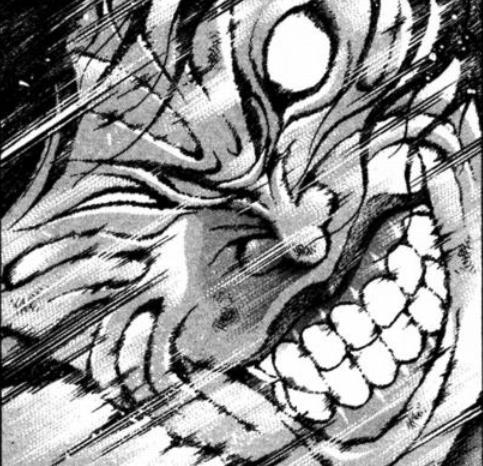

皮克：嗷嗷嗷嗷嗷啊

（比起没有战斗理由的你来说……我现在正为了恋爱而奋斗！）

（现在的我，不会输给这个世界！）

阿求：皮克君，虽然你说着很热血的话但是小铃她听不懂的！

而且神社在右边，在右边！

那边是湖的方向啊啊啊啊啊啊啊啊啊

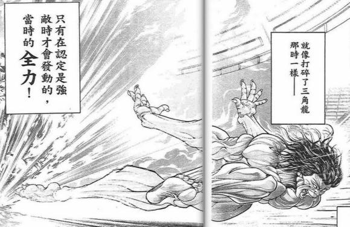

皮克终于超过了鬼王

而后，他怀着满腔热血，踏着笔直的线路，带着背上两位惊恐的少女一头栽进了风神之湖中

早苗：皮克选手，啊不是，小铃选手由于不会拐弯而暂时出局

于是本轮胜负的第一名是星熊勇仪小姐，恭喜恭喜~

也请其他各位参赛者继续加油哦~

紫苑：呼哧呼哧

皮克先生没事吧？

烈：我觉得他自己不会有啥大事

不过小铃小姐和阿求小姐大概……会有点生气？

浑身湿透的原始人正垂头丧气的坐在湖边

少女们则在他身旁拧着衣服上的水

阿求：皮克君这个笨蛋

衣服全都湿了，这还怎么继续嘛

小铃的战意【1d100：62】（50以上继续）

小铃：这点小事算什么

既然已经参加比赛了，无论输赢就都应该坚持到底才行

皮克先生，可以请你继续帮我一把吗？

皮克：嗷嗷嗷嗷嗷嗷嗷啊！

（交给我吧！！）

原始人与少女们重新振奋起了精神

为了以体面的方式接着参赛，总之先去守矢神社借套衣服吧......

【1d60：9=9】分钟后，劲头正足的选手们冲向了博丽神社

目前勇仪的出力是【1d100：8=75】（怪力乱神的鬼王+75,90以上暂时第一位无竞争对手）

~Round 2 博丽神社~

第二段路程，勇仪的主要竞争对手是【1d10:5】

1 魔女三人组

2 堇子&amp;哆来咪

3 一轮&amp;命莲寺后援团（为啥啊）

4 莉格露&amp;橙

5 针妙丸&amp;正邪&amp;天子

6 终于追上来的紫&amp;灵梦（其实挺合理的）

7 妖梦&amp;幽幽子

8 斯卡雷特突击！

9 摩多罗&amp;魔理沙（为啥啊）

10 大成功/大失败【1d2：2】

这个组合的参赛选手是【1d10：1】（2-5针妙丸，6-9天子，1 10正邪）

~博丽神社前的参拜道~

阿吽：早上好~

我是一直在身后看着大家的，由于灵梦小姐跑去参赛因此暂时代替解说兼裁判官的高丽野阿吽

博丽神社一直都很冷清呢，大家有空的话不妨来参拜一下吧……

那么说回正题，目前遥遥领先的除了意料之中的勇仪大人外，还有一位半路杀出的黑马

没错，就是来自辉针城的鬼人正邪选手！

天邪鬼和小人族正一脸懵逼的坐在天人操纵的移动要石之上

正邪：不是，喂，天子

我对这比赛和奖品是真的很感兴趣，你为什么会相信我呢？

天子：哈哈哈，你不用再强调了

虽说我身为高贵的天人，受你们的侍奉也是理所应当

但我比那名居天子可不能这么白受照顾

子曰“以直报怨，以德报德”

既然你这次这么想要赢下这比赛的冠军，那么我就帮你达成这一愿望！

正邪：针妙丸，这家伙为什么听得懂人话啊？！

针妙丸：正邪……我觉得很大一部分是你不说人话的原因啊……

啊，前面是烈先生和鬼王，以及不知为何在口吐白沫的贫穷神

这样下去我们会输掉的！

正邪组要做什么【1d10:9】

1 天子：这里就靠我的地震

2 正邪：这里就靠我的能力

3 针妙丸：这里就靠我的万宝槌（怎么用啊）

4 天子：这里就靠我的地震

5 正邪：这里就靠我的能力

6 这里就堂堂正正一决胜负（为啥啊）

7 天子：这里就靠我的地震

8 正邪：这里就靠我的能力

9 这里就靠我们的挑衅（为啥啊）

10 大成功/大失败【1d2：1】

正邪：没办法了……这里就靠我的挑衅！

天子，把爷写的这些话朝前面的鬼王念出来！

正邪的挑衅【1d100：18+50=68】（天邪鬼+50）

天子：我看看啊……

星熊勇仪，你这胸大无脑的肌肉女，谎话连篇的欺诈师

酒量奇差无比，实力弱的不行

平时除了饮酒作乐以外什么事都不会干，简直是旧地狱之耻辱

山之四天王就指望着你丢人啦！！！！

勇仪的忍耐力【1d100：44+30=74】（怪力乱神的鬼王+30，低于挑衅值开战）

勇仪：这话让好吃懒做的天人来说真是一点说服力都没有

简直像是在骂你自己一样

烈：我估计这词是正邪小姐写的

但她又没法靠自己把这些念出来……

也是无奈之举吧

鬼王无视了来自身后的无理谩骂，并豪爽地冲过了博丽神社的鸟居

紫苑：现在才跑完两段……

呜呜呜呜呜呜，为什么我要跟着跑呢……到底为什么啊……

勇仪：才跑了不到半个小时就累成这样，你这训练量还是不够嘛

来，我背着你继续跑！

口吐白沫的贫穷神小姐刚准备躺在地上，就被勇仪背起来之后继续前进了

正邪的战意【1d100：14】（50以上继续）

正邪：不干了，不干了！

今天就到此为止，咱们去旁边观战吧！

天子：明明输掉了，你却一点都不丧气呢，为什么啊？

正邪：不都说了我从最开始就非常感兴趣了吗！！！！

天子：？？？？？？

那你输了还不丧气？

这就是地上人独有的古怪脾气吗？

一旁的小人族决定彻底放弃翻译这驴唇不对马嘴的对话，而后跑去和狛犬聊天了

【1d60：1=1】分钟后，勇仪来到了白玉楼

草草草为什么会这么快啊【1d10:9】

1 感觉赢不了的某位贤者决定整点活

2 感觉不够有趣的某位贤者决定找点乐子

3 文文航空（为啥啊）

4 感觉赢不了的某位贤者决定整点活

5 感觉不够有趣的某位贤者决定找点乐子

6 假腿良性暴走！（为啥啊）

7 感觉赢不了的某位贤者决定整点活

8 感觉不够有趣的某位贤者决定找点乐子

9 紫苑的好运！（谢谢你）

10 大成功/大失败【1d2：1】

~1分钟之前~

贫穷神正趴在鬼王的背上

烈：紫苑小姐，你现在感觉怎么样？

如果撑不住的话就先下来歇歇吧，咱们现在大幅度领先，休息一会也没问题的

紫苑：大家都这么努力，我也要加把劲了

这里就用我这段时间积累的运气！

贫穷神小姐洒下了金色的【幸运】之力量

勇仪：感觉体内的力量突然增强了一大截

居然对我都有效果，厉害啊紫苑！

人所谈论的怪力乱神顺手提起了身旁的武术家，而后一脚踏地，向着远方的天空一跃而起！

烈：呜哦哦哦好快的风速！

不知为何居然有些莫名的爽快感！

紫苑：太——快——了——

救——命——啊——

勇仪：哇哦，起飞啦

就这样一口气飞到白玉楼去！！

~Round 3 白玉楼~

白发的半灵少女正在白玉楼前清扫着地上的尘土

她听到远方似乎有破空之声传来，便抬头望去——

下一秒，鬼王、武术家和贫穷神就降落在了妖梦的面前

妖梦的震惊【1d100：57】

妖梦：哇，好快的速度

我还以为你们还要等一阵才能过来呢

勇仪：说实话连我自己都没想到这次这么顺利~

麻烦帮我再盖个章

现在连一个竞争对手都没有，这样一来就赢定了吧？

妖梦：嗯，你不知道吗？

要说对手的话还有一位哦

那就是一直在这里等待着的，永琳大人所推荐的参赛选手

永琳的推荐选手是【1d10:5】

1 铃仙

2 辉夜

3 探女（为啥啊）

4 铃仙

5 妹红

6 皮克（为啥啊）

7 铃仙

8 辉夜

9 我亲自上阵（为啥啊）

10 大成功/大失败【1d2：1】

白发红瞳的蓬莱人与来自永远亭的后援团们，从白玉楼的会客室中走了出来

妹红：没想到最先来到这里的对手会是鬼王啊

本以为会是枯燥乏味的战斗，现在看来还有些意思

紫苑：比我方更加离谱的参赛选手出现了！！

为什么会找这一位参赛啊？！

话说妹红对状况的理解度是【1d100：6】

妹红：这一次不是普通的竞速比赛吗？

辉夜说她很想要奖品，于是就让我帮她参加了啊

勇仪：对哦，跑了这么久连我都忘了

咱们参加的原来是女子力大赛啊！

妹红的厚脸皮【1d100：87】（50以下回去找辉夜）

白发的蓬莱人回头看了看一脸坏笑的月之公主，而后在指尖燃起了一撮火苗

妹红：我就知道又是辉夜的恶作剧

只是，照顾恋人的任性也是我不得不担的责任

综上所述，虽说是荒谬的比赛但还是要拜托你与我一决胜负了

火焰熄灭的时候就同时出发，如何？

如果想要休息的话也可以给你些喘息的时间哦

勇仪：呦，是个不爱拖泥带水的家伙

不需要什么休息时间——

就在现在开始吧！

蓬莱人吹灭了指尖的火焰

最后的胜负开始了！

烈：这是何等的男子气概！

铃仙：男友力，已经超乎想象了

两边都是堂堂正正的男子汉，不要输啊！！！

勇仪的出力【1d100：71+75=146】（怪力乱神的鬼王+75）

妹红的出力【1d100：79+60=139】（蓬莱的人之形+50，准备充足+10）

尽管蓬莱人准备充足，但鬼王还是凭借绝对的实力差把握住了领先的位置

起步落后的后援团们正在两人身后拼命追赶着，而负责本段胜负的妖梦小姐则尽职尽责的手持麦克风在一旁解说！

妖梦：幻想乡的大家早上好，我是最后一段赛事的解说员兼裁判魂魄妖梦

——幽幽子大人，我感觉这两人的速度都没有我快，请问我也可以参赛吗！

幽幽子的玩心【1d100：31】（50以上同意）

幽幽子（通讯）：妖梦真是的~

比赛都已经到最后一段了却突然说要参赛，可没有这种道理哦

如果真要参加的话也得从命莲寺重新出发才可以呢

妖梦的坚持【1d100:56】（75以上去）

半人半灵的庭师，有点不甘心的放弃了

辉夜：妖梦，非官方作弊是不行的呦~

话说妹红这不是落后了吗？

妹红方要做什么【1d10:6】

1 这里就直接开战吧

2 这里就靠辉夜的能力

3 这里就靠铃仙的瞳术（有用吗）

4 这里就直接开战吧

5 这里就靠辉夜的能力

6 帝的兔陷阱（有用吗）

7 这里就直接开战吧

8 这里就靠辉夜的能力

9 help me erinnnnnnn（你是评委啊？！）

10 大成功/大失败【1d2：2】

兔陷阱是什么啊【1d10:10】

1 便携式仙香玉兔

2 皮可招来！

3 把铃仙推到附近的湖里（前辈——）

4 便携式仙香玉兔

5 皮可招来！

6 拜托好心的纯狐女士（为啥啊）

7 便携式仙香玉兔

8 皮可招来！

9 拜托好心的赫卡提亚女士（为啥啊）

10 大成功/大失败【1d2：1】

兔陷阱 大成功！

大成功是什么【1d10：4】

1 便携式虚假之月

2 超狂暴状态的皮克

3 把铃仙封印在巨大石堆中吧（救命啊）

4 便携式虚假之月

5 超狂暴状态的皮克

6 便携式弹幕地狱（这什么可怕的东西）

7 便携式虚假之月

8 超狂暴状态的皮克

9 物理系陷阱，勇仪跌落回旧地狱了！（怎么做到的）

10 大成功/大失败【1d2：1】

因幡帝：嘿嘿嘿，别着急

这里就用我之前拜托师匠制作的恶作剧道具——

便携式伪月结界！

地上的兔子坏笑着拿出了一个信号弹般的装置，而后将其射向了天空

月之头脑的力量暂时笼罩在了这片空间之上，永远亭的众人对此毫无异样之感，但身为妖怪的鬼王力量却被大大削弱了！

辉夜：做得好，因幡

这样一来我们就赢定了~

妹红：嚯，还有这一手啊

先走一步了，我也有要胜利的理由在呢

蓬莱人轻而易举的超越了力量衰弱至常人水平的星熊勇仪

而在她们身后，已经可以隐隐约约看到其余参赛者们的身影了！

勇仪组要做什么【1d10：1】

1 The World！

2 地灵殿的支援

3 烈：用我的秘术覆盖它！（什么原理啊）

4 The World！

5 地灵殿的支援

6 紫苑的诅咒（好恐怖）

7 The World！

8 地灵殿的支援

9 靠毅力去克服它！！（怎么可能啊）

10 大成功/大失败【1d2：1】

勇仪：可恶，还有这一手？！

糟糕了……

这样下去别说第一，都要被后面的家伙们赶超了

烈：既然辉夜小姐她们如此明目张胆的作弊

那我们也不妨用些盘外招数——

勇仪，是否介意我背你几秒钟呢？

勇仪：事先说好，我块头可不小哦

烈：对我而言

没什么所谓！

金发独角的鬼王放下了背上的贫穷神，而后很有些不适应地被武术家所背了起来

紫苑：加油啊，不要输给卑鄙的兔陷阱！

我会在后面努力妨碍大家的！！

勇仪：——果然还是算了感觉这样超尴尬啊！

烈：别着急，只要一瞬间就好——

【The World】！时间停止吧！

飞扬的尘土在空中骤然定格，喧嚣的环境瞬间变得鸦雀无声

武术家久违的在非战斗状态下进入了他专属的【世界】

烈：10秒的时间已经足够了

符卡宣言 超人【烈海王】！

然后，超凡脱俗的伟力于他的肉身之上显现而出！

烈的出力【1d100：11=80】（时停超人术+80默认赶上妹红，90以上来到终点线前）

两旁的风景化作了模糊的残影，即使是飞速的天狗也难以捕捉武人此刻飞奔的身姿

烈海王在这静止的世界中化为了黑色的流星，在这超人之力的作用下，即使是数千米之遥的距离也被他于十秒之中所轻易跨越！

他背着鬼王远离了兔陷阱的作用范围，并再次跑在了蓬莱人的身前——

烈的情商【1d100：68】（保底20，30以上放下勇仪）

武术家轻轻放下了挚友

然后时间开始流动

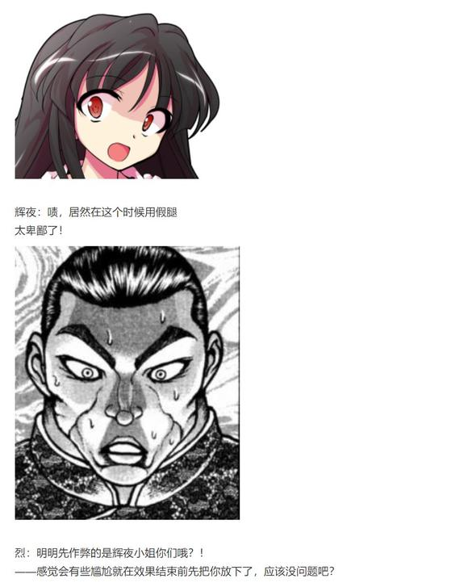

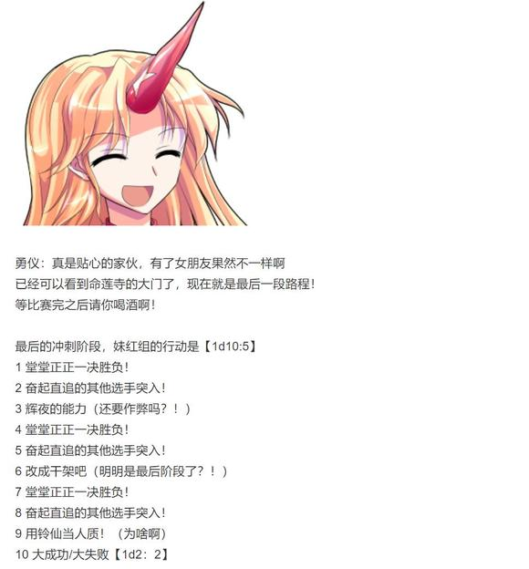

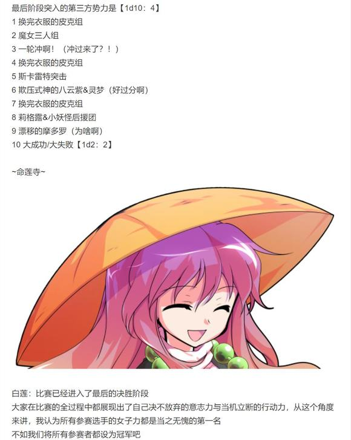

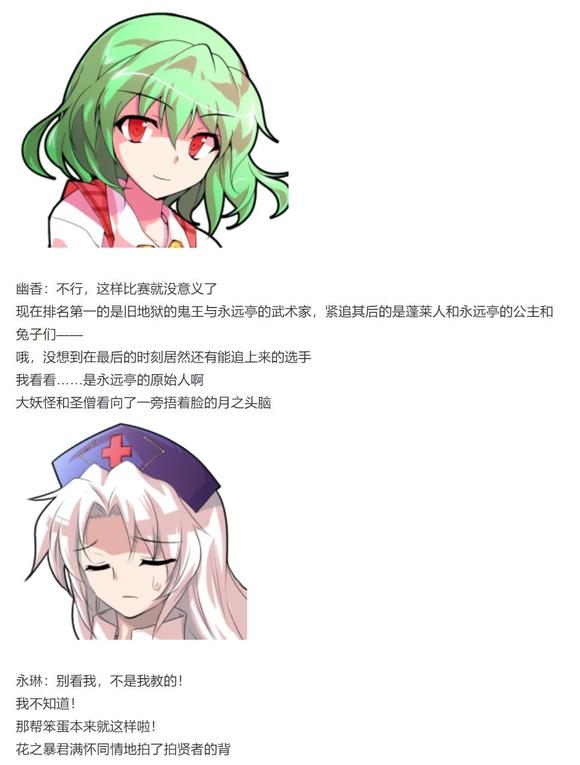

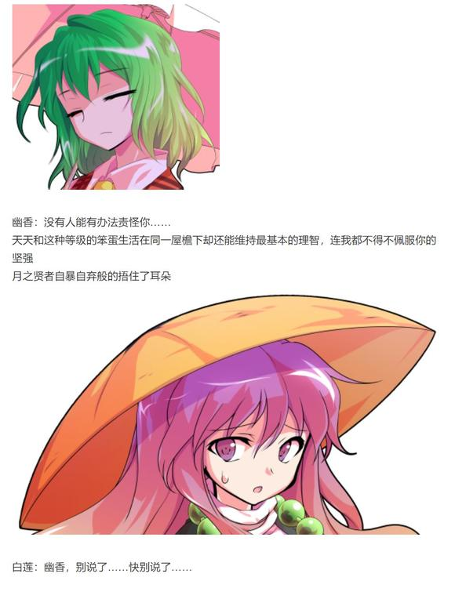

~命莲寺前的石板路~

“嗷嗷嗷嗷嗷嗷嗷啊！”

从湖中爬出后重振精神的原始人与两位换好衣服的少女，居然奇迹般的追上了前方两人的脚步！

小铃：加油啊皮克先生！！！

就算输了也无所谓，至少要在最后表现出你的根性来！！

阿求：我觉得参赛选手好像已经变成皮克了......

不过算啦，就这样轻松的上吧~

妹红：没想到皮克会突然追上来啊

呵，气氛这么热烈的情况下，可没办法像辉夜想的一样出阴招了——

喂你们两个，一招定胜负如何？

皮克：你那还算是人？！

（正合我意，这一次我不会再输了！）

（符卡宣言 神技【八方鬼缚阵】！）

妹红：那就全力以赴的上了！

符卡宣言 不死【凯风快晴飞翔蹴】！

拼尽全力的原始人手持结界，斗志昂扬的蓬莱人脚踩烈焰

皮克的出力【1d100：25】（75以上有戏）

妹红的出力【1d100：64】（75以上有戏）

两者同时对最前方的鬼王发起了攻击——

而受到威胁最大的第一名，却只是笑着活动了一下手腕

勇仪：烈，先站远点

她回头，转身，一步踏出

淡蓝色的弹幕便在瞬间充满了她身侧的每一寸空间

勇仪：这才是正儿八经打架的氛围

这才是我所熟悉的血与力的空气！

那么来吧，符卡宣言——

第二步踏出

鬼王已然走到了两人面前，如冰般透彻的第二轮魔弹之阵突兀的出现在了他们的身侧，令本应一往无前的攻势带上了一丝阻塞

勇仪：——四 天 王 奥 义

【三步必杀】！

人所熟知的怪力乱神在原地踏出了最后一步

那无与伦比的金刚力化作了无数惨白色的力量结晶，自鬼王为中心扩散而出，

它们闪烁着，膨胀着，最终在勇仪豪爽的笑声中轰然爆发

皮克与妹红的攻击在此刻被鬼王的怪力所完全粉碎，命莲寺的周围变为了一片纯白的世界！

【1d30：21】秒后，耀眼的光芒终于散去

烈：与他们两人正面相碰却安然无事

皮克和妹红小姐都只是昏迷不说，连距离这么近的观众们也都毫发无伤

最后居然连杯中的酒都一滴未洒……

真不愧是你啊

星熊勇仪站在两位昏迷的对手前方，悠然自得地抿了口酒

勇仪：久违的用了些力气，感觉真不错

呦，紫苑也追上来了

那就大家一块堂堂正正的拿下这场比赛的冠军吧

紫苑：呼哧呼哧

我们赢了吗？

一头雾水的贫穷神随着武术家和鬼王走过了命莲寺的大门口

一旁的观众们平静了数秒之后，终于从震撼中反应过来，并为第一名献上了他们的喝彩！

烈&amp;勇仪：当然

我们是冠军！

【1d30：20】分钟后，

评委们对于勇仪的总评价是【1d100：95】（赢得冠军+50,60以上增加奖品）

增加的奖品是【1d10:8】

1 月之羽衣

2 立花

3 白莲的社交培训（为啥啊）

4 华丽的首饰与定制礼服（大师兄友情提供）

5 盛花

6 月之战车（为啥啊）

7 哈雷摩托

8 月兔手制团子一年份

9 便携式间谍种子（为啥啊）

10 大成功/大失败【1d2：2】

白莲：恭喜星熊勇仪小姐赢得了本次大赛的冠军！

本次大赛的总分为100

在与两位评委讨论了20分钟后，我们认为勇仪小姐在本日所展现的女子力为——95分！

勇仪：95分？！我？！

开玩笑吧？！

紫苑：是不是和战斗力搞混了……?

幽香：与强敌战斗时能以自己的方式堂堂正正一决胜负，面对卑鄙的挑衅则以洒脱的气度无视之

在身边的同伴遇到困难时会毫不犹豫的伸出援助之手，与此相对的当自身陷于困境之中也会得到同行者们的帮助

你在各个方面都展现出了自己出色的一面，即使将竞速换为恋爱，凭借你的素质也定然能够夺得胜利吧——

永琳：不过，以上所列举的也只是所谓的加分项

真正重要的还是你自身的实力

克服重重险阻并依靠自己的力量达成目标，这便是女子力的证明！

一旁的武术家不知为何，又一次捂着肚子蹲下了

白莲：再一次恭喜勇仪小姐夺得冠军

请收下作为奖品的月都科技战斗服，以及作为附加奖励的月兔手制团子一年份！

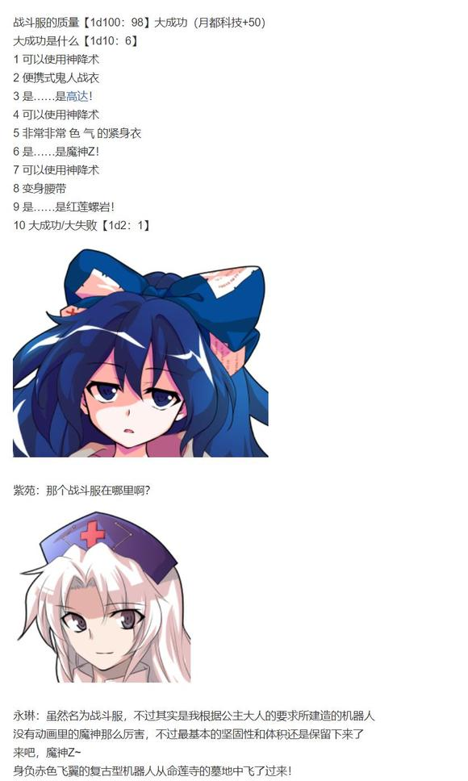

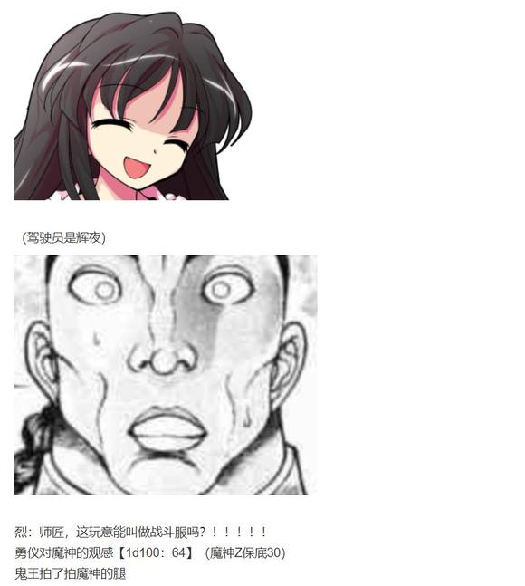

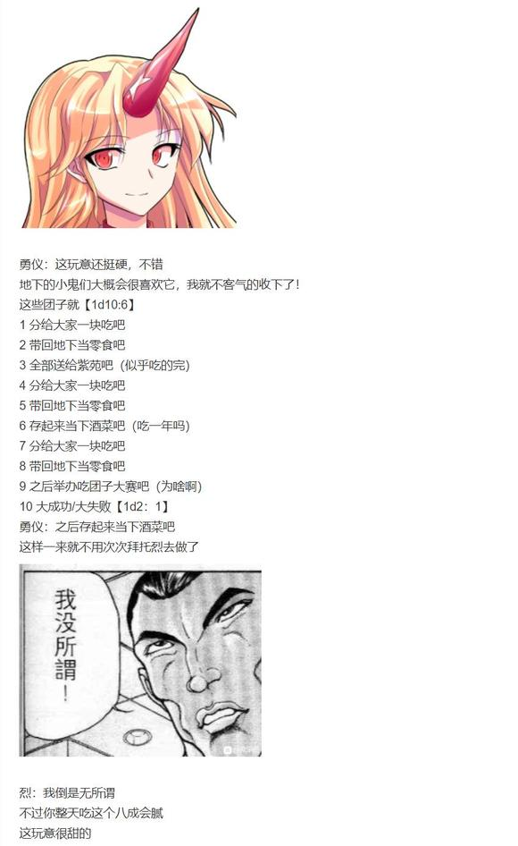

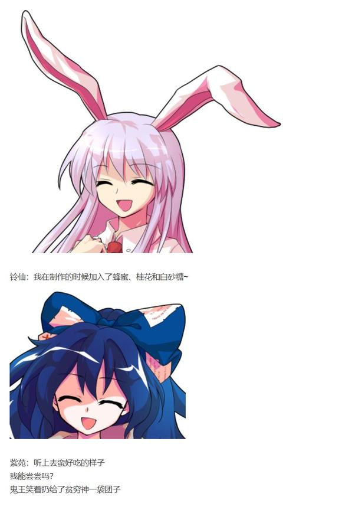

一旁的蓬莱人正无可奈何的听着公主的唠叨，而看板娘和史官则在一旁安慰着两次失败的皮克

尽管最终获胜的只有一支队伍，但参赛者们却并未感到多么沮丧——

毕竟，这只是个莫名其妙的女子力大会而已嘛！

烈：话说原来我们参加的是女子力大会哦？！

勇仪：管它什么大会，开心就好啦！

举办者与评委们正在命莲寺的正殿中聊着天

而明哲保身的武术家则选择先和地底的朋友们喝点酒避避风头

于是，这乱七八糟而又欢乐的一天，到此结束

~第483天结束~

与星熊勇仪参加了一场愉快的比赛

勇仪的好感度上升了【1d3：1】点

现在的好感度为：94+1=95 点

勇仪：烈这家伙，真是变得比以前强多了

不，这里果然还是该说变得越来越值得依靠了？

虽然脑子里还是一如既往的缺根弦呢，哈哈哈哈！

（本日的更新结束，下一次的更新在周六或周日）

（以下是我的废话）

那么本次的日常回——啊不是新机制测试回——啊不是原创活动回——啊不是勇仪个人交流回——算了管他什么回总算是结束了

草草草草草，这都啥啊，女子力大会草草草草

开场那俩堪称毫无意义的大失败一口气爆出了新机制的弊端

yysy，在太阳花田厨艺大失败会发生啥啊？跟幽香再打一架？

这我寻思我骰完了也没人爱看啊？

于是硬着头皮理清楚思路准备幽香二战了结果幽香怒气大失败

笑死我了，这都啥啊草

可以说这俩大失败坚定了我回滚机制的念头，真的是过于莫名其妙了

然后女子力选手安定的梗选项，安定的勇仪......

出勇仪的那一刻我就知道这大会别想好好办了，总之先想点办法让前期显得文雅一些——

然后是白莲、永琳和竞速大赛的三连击

文雅个屁，开干啦！！！

最后那个魔神Z是个战力蛮强的手办

如果在战斗中使用大概会是想爱丽丝那样的装甲机制+多一两个新技能之类的，其实是蛮实用的东西

如果交给莉格露或者橙的话大概能拿来应付普通的四面，运气好干翻五面也不是不可能哦

不过给勇仪的话就......旧地狱的大家有新玩具了，真好啊（悲）

那么本次的更新到此结束，下一次的更新在周六或周日，是原创活动

机制方面可能还会做点微调，不过大体而言还是回到以前那样了

骰子明天再发

~最终调整~

从昨天的剧情中大家应该也能看出来了，新机制让剧情大暴走的概率其实不大——但是让剧情朝着奇怪方向展开的概率却大了很多

在厨艺、喝茶、口渴这些地方大失败的话会变得相对奇怪，完全是意☆义☆不☆明的展开

因此在这里敲定最后的机制，【以后不会改了】

1 察觉、推理、厨艺等常用技能骰/主线相关骰以及其各类保底值回滚到原先版本

为了提高趣味性与意外性，当这些有保底的骰子出了1-5的时候我会加一个1d10骰原因（参考师匠51那次）

这个原因骰并不是大失败，而是“为什么他的发挥会如此失常”这样的，糟糕选项较少而梗选项和搞笑选项变多的骰子

如此一来高保底的大成功概率变高，但奇妙拉胯（不是大失败）的概率也会变高，某种意义上也会让剧情变得合理一些

举例：纯狐引开了看门的铃仙后，永远亭的团子被赫卡提亚偷了

烈的推理【1d70：1+30=31】（50以上起效）

31的推理是什么啊【1d10：9】

1 我闻到了地狱的味道（过1d10决定调查方向）

2 犯人与妖精的关系很好

3 犯人的身材很好（为啥啊）

4 我闻到了地狱的味道（过1d10决定调查方向）

5  犯人与妖精的关系很好

6 犯人的实力相当强劲（废话）

7 我闻到了地狱的味道（过1d10决定调查方向）

8  犯人与妖精的关系很好

9 铃仙前辈是内奸（为啥啊）

10 大成功/大失败【1d2：】

烈：我知道了！

偷取团子的犯人利用了铃仙前辈......也就是说，铃仙前辈是内奸！

辉夜：因幡

你还有什么遗言吗？

铃仙：为什么要用那种眼神看着我！？

师匠，救命啊！！

2 好感度/情商/脸皮等与日常交流交流相关的骰子采用新机制

举例：花山遇到了华扇

华扇的好感度【1d100：10=50】（侠客行+50）

华扇：看上去是个有情义的人啊

琪露诺遇到了金龙山

琪露诺的好感度【1d100:1大失败】（退役的大相扑+6）

大失败是什么【1d10：】......

琪露诺：哇这个人满嘴烟味，好糟糕啊！

差不多是这样的感觉

新系统的具体应用场合由我来决定，不过基本上就是大家常见的好感度啊、意志力啊、情商啊、脸皮啊这些东西

这一块的骰子数值并不影响剧情推动，不过代价是之后的新人物吃保底的可能性会大大提升

相比之下趣味性也会相应高一些（笑）

这样一来系统调整就终于结束了！以后就一直用这个并且不会改了！

谢谢大家这两天所提出的建议！

（四个彩蛋，今天先发两个）

~彩蛋~

~女子力测定仪~

~永远亭~

师匠：说起来我之前为了比赛还特意准备了这个女子力测定仪

虽说最后由于数据浮动太大而放弃使用了……不过偶尔玩玩也不错？

大家要来试试吗？

辉夜的女子力【1d50：34+50=84】（月之公主+50）

辉夜：居然不是100，这机器肯定坏掉了

烈：（居然有84这么高，这机器肯定坏掉了）

铃仙的女子力【1d60：1+40=41】

噗，这里出1是为什么【1d10:9】

1 铃仙正在做战斗训练

2 机器察觉到了铃仙的疯狂本质

3 身材好扣分（什么破机器）

4 铃仙正在做战斗训练

5 机器察觉到了铃仙的疯狂本质

6 铃仙戴着卖药时的斗笠（为啥啊）

7 铃仙正在做战斗训练

8 机器察觉到了铃仙的疯狂本质

9 女子力，只能用悲剧来形容（前辈——）

10 大成功/大失败【1d2：1】

师匠：我检查了一下发现机器确实没出问题

这说明按照一般人的判定标准，优昙华的女子力似乎真的只有41……

铃仙：怎么可能，连那个辉夜大人都有84分啊！

这合理吗？！这机器坏了吧！？

皮克：嗷嗷嗷嗷嗷嗷啊

（就是因为你一遇到意外状况就会立马变红眼然后进入狂暴模式，女子力才会这么低的吧……）

帝的女子力【1d100：27】

因幡帝：呜撒——

怎么了，为什么大家都在看我？

铃仙：突然觉得心里平衡了起来

皮克的女子力【1d100：25】

皮克：嗷嗷嗷嗷嗷嗷啊

（连我也有吗？）

师匠：数值比起某些残念的妖怪们还要来的高

令人无言以对

烈的女子力【1d100：60】

烈：午饭已经做好了，大家快过来吃吧

辉夜：烈海王的女子力比两个因幡都高，哈哈哈哈哈！

因幡帝：如果要说会做饭和照顾人的少女女子力高倒也算合理……

但性别逆转过来就变得完全不对头了吧？

师匠：这个奇怪的力量到底是以什么标准测量的？

最后测一下我的吧

师匠的女子力【1d70：11+30=41】（月之头脑+30）

永琳：优昙华，你说的没错

这玩意果然坏了

铃仙：啊啊，把它砸烂吧

可怜的机器被月之贤者和月兔一人一脚踩成了渣

烈的情商【1d100：50】（基础情商+20，50以上闭嘴）

烈：（我觉得这数值满准确的......）

考虑到口出狂言之后将要面对两位狂暴化的女性，武术家张了张口后又明智的闭上了嘴，乖乖转头去准备碗筷了……

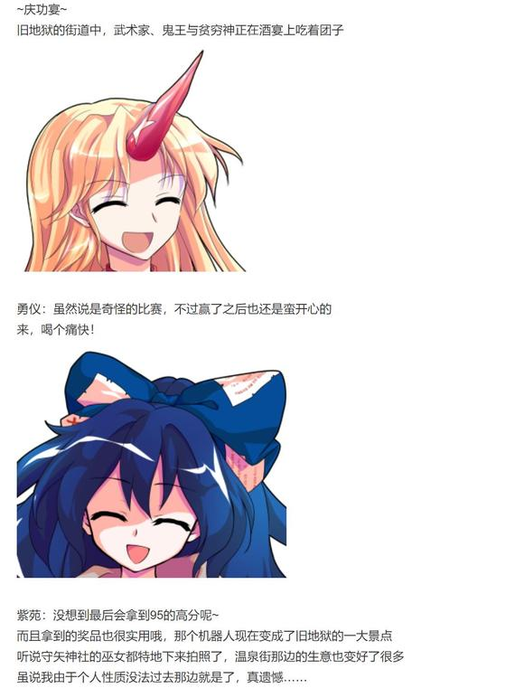

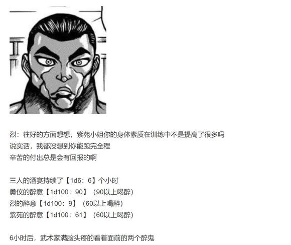

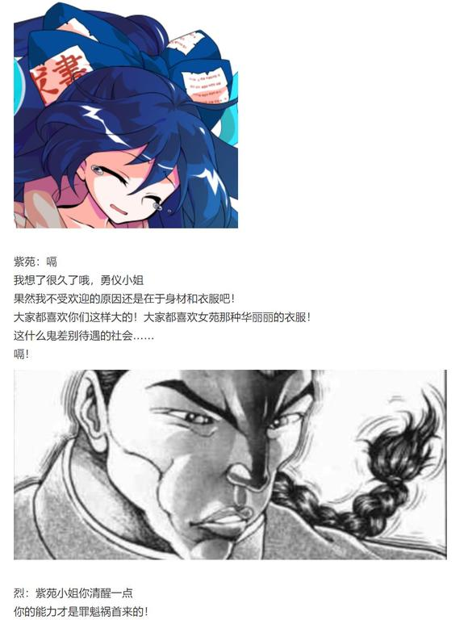

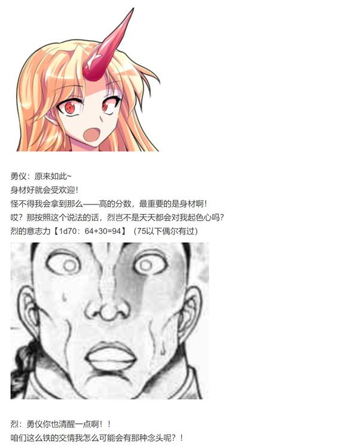

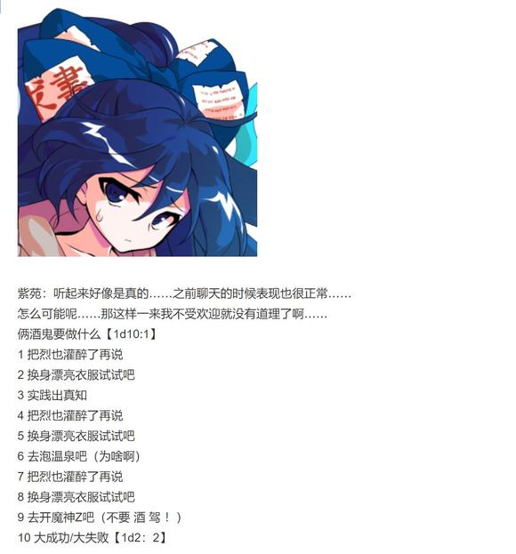

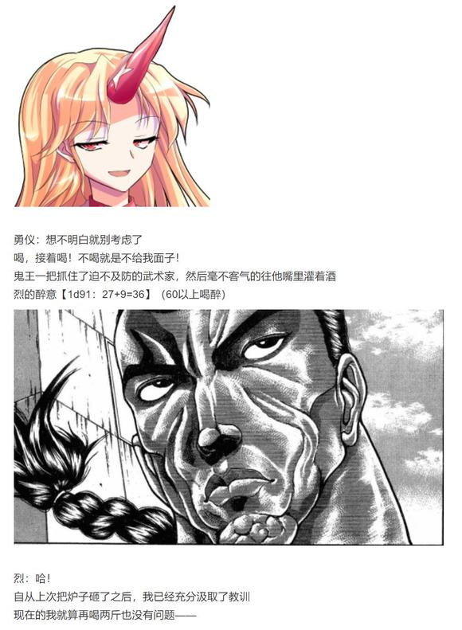

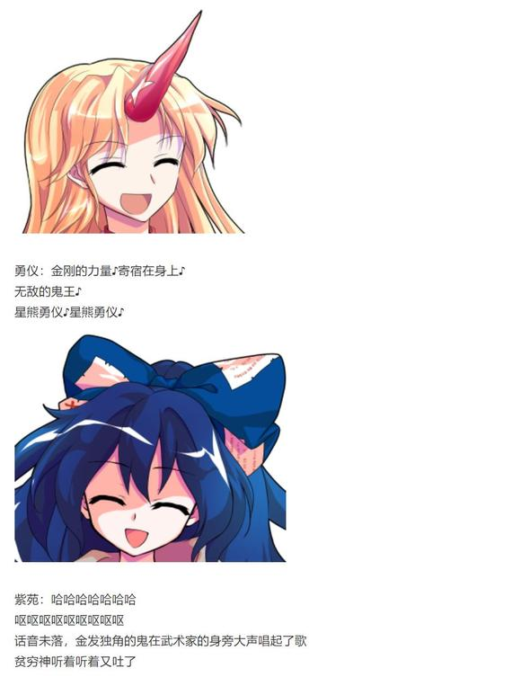

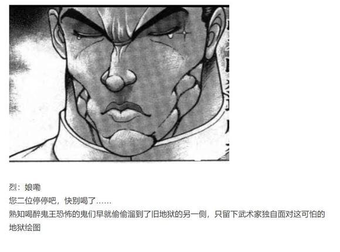

【1d3：3】小时后

唱累的鬼王靠在武术家身上睡着了

烈：唉，我算是明白那些平常酒量很好的人喝多之后会有多可怕了

有人来帮帮我吗？

我一个人不方便抬这两位啊！

烈的求援【1d100：78】（50以上有回应）

回应者是【1d10：2】（2-5萃香，6-9摩多罗，1 10随机）

“嘿咻”

小小的鬼王扛起了紫苑后，向着勇仪家的方向走了过去

萃香：好久没看到勇仪喝醉过了

就把她们都放在勇仪家里吧！

烈：多谢你了，萃香小姐！

能顺便帮帮我这边吗？

萃香：不~能~

一个人扛一个，你负责扛你那边的~

头生双角的鬼坏笑着走到了前方

武术家看了看无人的四周，最终只得无奈的扛起了朋友，并跟在了萃香身后

不知为何，他想起了过去的酒宴

那时他的实力还算不上强，原本就差的酒量比起现在也更为糟糕

因此每次在旧地狱喝酒时，几乎过不了多久就会醉得一塌糊涂

而金发独角的鬼面对着如此弱小的朋友，却次次都耐心地听他发着酒后的牢骚，看着他酒后的失态，并在最后背着烂醉如泥的他回到地面之上

他的朋友从未特意提起过此事，仿佛一切都理所应当

烈：真是……

一直以来都受你照顾了啊

武术家听着来自背上的鼾声，笑着摇了摇头

睡梦中的鬼似乎梦到了些好事，于是也连带着露出了微笑

（本日的彩蛋结束）

~新衣服~

烈帮忙买的新衣服是【1d10:10】

1 又买了一件一模一样的

2 睡衣

3 紧身衣（基础怒气30）

4 又买了一件一模一样的

5 女仆装

6 旗袍（基础怒气30）

7 又买了一件一模一样的

8 水手服

9 体操服（给我适可而止，基础怒气50）

10 大成功/大失败【1d2：1】

烈海王大成功！

大成功是什么【1d10：4】

1 给师匠也买了！

2 可爱的睡衣少女幽香酱~

3 换上了紧身衣（为啥啊）

4 给师匠也买了！

5 女仆幽香酱~

6 换上了旗袍（为啥啊）

7 给师匠也买了！

8 JK幽香酱~

9 换上了体操服（真的假的）

10 大成功/大失败【1d2：1】

~太阳花田~

烈：我不知道你喜不喜欢那些最近流行的服装

因此我在人里找了半天之后，最后还是决定给你买一件跟以前一模一样的

武术家从袋子里拿出了一套和以前看上去完全相同的红白格子裙

幽香：我就知道你肯定会这么做

算了，这套新衣服的原料比以前那套要好很多

这一次就原谅你吧~

烈海王长出了一口大气

大妖怪走到烈的身后，俯身拥抱着自己的恋人，在他的耳边悄悄开口

幽香：对了对了，顺便一提

你完全没必要顾虑这么多的

因为只要不是太过奇怪的衣物，无论你买什么给我，我都会很开心哦❤

随后，她提着新衣服回屋了

烈：为什么明明已经相处了这么久，我却还总是会不自觉心动不已呢……

克劳恩皮丝：也许这就是你们天天说的女子力？

~永远亭~

烈给师匠买的衣服是【1d10:2】

1 还是一模一样的

2 睡衣

3 紧身衣（基础怒气50）

4 还是一模一样的

5 羽绒服

6 女仆装（基础怒气50）

7 还是一模一样的

8 风衣

9 体操服（天☆文☆密☆葬☆法）

10 大成功/大失败【1d2：2】

~师匠的医务室~

天色已晚，月之头脑结束了一日的工作，正与恋人无所事事的闲聊中

烈：——说起来永琳

我给你买了件新的衣服，你看合适吗？

武术家从手提袋中拿出了一套新衣服

那是以粉色为基底并点缀着星星图案的，毛茸茸的少女风睡衣和睡帽

师匠的接受度【1d100：53】（30以上会穿，50以上一起睡）

永琳：给我买了新衣服倒是很高兴

但为什么是睡衣？

烈：上次异变的时候你不是送了我条围巾嘛

从那时起就想着应该回赠些东西——

感觉你应该不喜欢那些时尚新潮的衣物，于是就买了这套睡衣

【1d10：6】分钟后，师匠试着穿上了新的睡衣

永琳：——果然我穿这个还是很不合适吧？

烈的情商【1d100：67】（基础情商+20）

烈：不，怎么会呢

我也想不出什么好听的话语

只是觉得，确实蛮适合你的

永琳：我很高兴哦

因为我知道你是不会说谎的

永琳：只不过，现在可是夏季最热的时候

而烈，你买的这套睡衣是冬装啊

烈：糟了！

我光想着要买件暖和舒适些的衣服！

永琳：我就知道……

算了，今晚开着空调睡觉吧

和你一起呢

烈：哎？！

这，我——

银发女子把睡帽扣在了恋人头上

永琳：想什么呢你这笨蛋

普通的睡在一起而已，不许起歪心思哦

月之头脑拉着弟子走进了房间

烈的意志力【1d70：43+30=73】（75以上安然入睡，50以下杂念过多）

夜色已深

身穿睡衣的月之贤者在弟子的身旁均匀地呼吸着

而头戴睡帽的武术家则满眼血丝的看着天花板

烈：（糟，满脑子都是杂念）

（要抑制住蠢蠢欲动的心！快想想武术！快想想修行！）

烈海王瞄了一眼身旁女子安宁的睡颜

烈：（冷静冷静冷静冷静冷静）

（我现在很困，明天还有很多事情要做，该睡了该休息了该闭眼了……）

【1d6：3】个小时后，可怜的烈海王终于进入了梦乡

~第二天~

月之头脑从床上爬了起来，并顺便伸了个懒腰

永琳：昨晚睡得不错啊~

烈，你看上去脸色不太好？

烈：昨晚睡前锻炼了大概三个小时的意志力导致睡得有点晚而已

没有什么问题！

永琳：少睡几个小时第二天会变得更加精神哦

如果昨晚真的起歪脑筋的话……

烈：起码是半夜起来做实战特训的程度，我明白的

永琳：不会不会，也就【1d100：87】左右的怒气啦

烈：比起上一次反而还要更加生气了，到底是什么标准啊？！

武者无奈地帮恋人打理着头发

她的脾气绝对算不上好，即使相处已久也时不时会触发她的怒气

她虽说头脑聪慧算无遗策，但总有些古怪的论点与离奇的观念

她的实力强大无比，但对己方以外的人与物却毫无真正的感情可言，甚至对于自己人有时候也冷漠的过分——

烈：但是，我所爱的就是这样的你啊

永琳：又突然说这一句？！

都跟你讲过多少次了，没用

我早就已经不吃这套了！

话虽如此，背对着他的女子却仍然笑的很是开心

于是，永远亭的恋人们又一次开始了他们平淡无奇的一天

~今晚吃烤肉吧~

~人里的烤肉店~

铃奈庵的看板娘与稗田家的大小姐正与原始人一同烤着肉

小铃：虽说输了但还是很开心啊~

阿求：没想到守矢神社会提供空手道服

说到底为什么神社会有这种东西，是神明大人们的私人爱好吗？

皮克（手写）：很抱歉最后还是输掉了

勇仪小姐的力量真是难以阻挡

明明之前说的那么好听，结果我在正面冲击的第【1d10：2】秒就昏过去了

小铃：没关系哒

那个，是非常厉害的妖怪吧？

我觉得敢于和她正面相争的皮克先生也已经很厉害了哦！

小铃的察觉【1d100：37】（50以上察觉皮克拼命的理由）

小铃：话说这一次我对于皮克先生也有改观了！

我以前一直都过于以貌取人了……

现在想想，皮克先生虽说长相很可怕，但是其实是位善良且热心的——

烤肉爱好者啊！

皮克：嗷？！

（嗷！？）

小铃：为了自己的爱好不惜与那么可怕的家伙交锋！

好厉害啊，皮克先生！！

皮克的勇气【1d100：45】（原始人+30，爱恋对象-30,70以上表明心意）

原始人组织了半天语言，但怎么都鼓不起勇气

皮克（手写）：我确实很喜欢肉

烤肉很好吃，谢谢你啊！

最后，他自暴自弃地随便写了点东西，然后就专注于吃饭了

【1d30：26】分钟后，三人的晚餐结束了

橙发的少女对大家复杂的心思一无所知，她朝着朋友们挥了挥手，便转头走回了铃奈庵的方向

皮克：嗷嗷嗷嗷嗷啊

（难得的表现机会出了岔子，结果刚刚明明有机会却退缩了）

（阿求小姐，我感觉自己好失败）

紫发的少女拍了拍皮克的胳膊

阿求：往好的方面想，这次活动之后小铃明显不那么怕你了

这不就是很大的进步吗！

刚刚晚餐的时候表现也不错，这说明我们之前的用餐模拟是有效的

皮克：嗷嗷嗷嗷嗷啊！

（说的没错，我们的距离还是在一点点缩短的！）

（谢谢你的鼓励，阿求小姐！）

原始人在笔友的鼓励下，再次燃起了斗志

阿求：再接再厉哦，皮克君

之后尝试着做一次约会模拟战——

然后就鼓起勇气约小铃出门吧！

告别了重振旗鼓的朋友之后，紫发的少女独自一人走向了回家的道路

阿求：（如果就这样一直模拟下去……

在小铃那边也一直碰壁的话……

也是，不错的发展吧？）

紫发的少女想了一阵，忽然抬手拍了拍自己的脸颊

阿求：我在想什么呢，为什么会有这种卑鄙的念头存在

还得准备一下之后的作战计划呢

皮克君都承诺过要帮我了，我也要尽力让他的恋爱成功才行啊！

阿求抛去了脑中那荒谬的念头

然后，她转身走进了自己的家中

（彩蛋环节结束）

由吧友 @望远镜300  制作的视频第29话更新啦！

本期的内容是交流回的下半场，大家感兴趣的话就去看看吧！

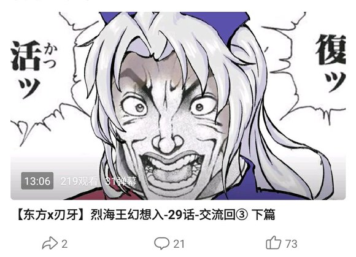

大概今晚七点半左右更新

