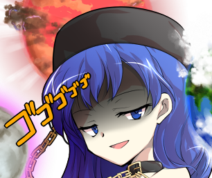
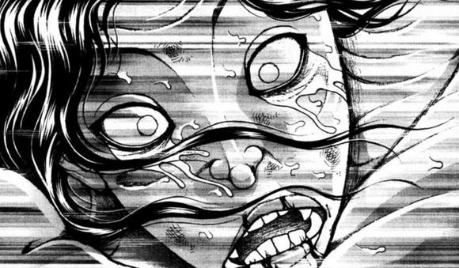
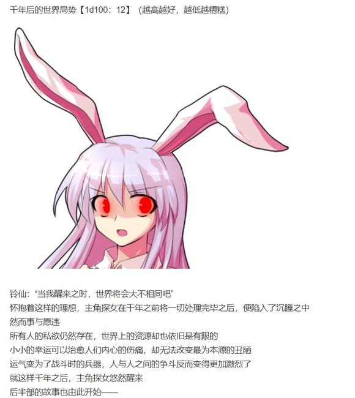
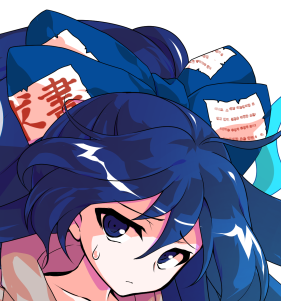

铃仙：要找我吗？！

我们两个组队的话基本上是绝对没有获胜希望的吧？

烈：我无所谓

反正漫画比赛这种东西，无论怎么想都不可能赢的

既然如此，就把它当做职场上必须要完成的工作吧！

一旁的月兔顿时停下了手中的动作

铃仙：对——

我差点忘记了，这是工作

不论结果如何，参加大赛这一工作都是要认真完成的！

我们上，烈先生！

烈：哦哦！

那就从最基本的画工开始

首先画个皮克测试一下我们的能力吧！

武术家与月兔拿着素描本和铅笔看向了院子里的皮克

【1d60：30】分钟后，烈与铃仙完成了各自的皮克素描

烈的画技【1d100：69】（60以上有戏）

铃仙的画技【1d100：60】（60以上有戏）

铃仙：感觉我们画的似乎都差不多……烈先生画得更加写实一些

如果一直都能按照这个水平发挥的话，莫非意外的能行？！

烈：嘿，没想到郭老师当年开的绘画辅导班还真有用到的时候

看样子我学的还不错嘛

师匠：你当年在寺庙里到底都学了些什么啊……

赫卡提亚：No problem！

社团名称和具体成员我都不关心，总之来一决胜负吧！

判断标准是大赛当日的人气投票，得票多的一方判定胜利！

败者的惩罚是【1d10:7】

1 穿一个月的地狱T衫

2 去地狱打工一个月

3 托管紫苑一个月（好可怕）

4 穿一个月的地狱T衫

5 去地狱打工一个月

6 陪纯狐玩弹幕游戏（这个也好可怕）

7 穿一个月的地狱T衫

8 去地狱打工一个月

9 陪赫卡提亚玩弹幕游戏（会死人的）

10 大成功/大失败【1d2：2】

赫卡提亚：失败者的惩罚是

整整一个月都要穿和我同款的T衫~

如果我们这边输掉的话就是让纯狐和紫苑换这身衣服

如何，很有趣的恶作剧吧？

纯狐：我 不 想 穿

无名的仙灵此刻撒发着令人恐惧的压迫感

站在两位伟大存在中间的贫穷神已经快哭出来了

烈：不过是换件衣服而已，我无所谓！

铃仙：但我有所谓啊！！

赫卡提亚：wow，我觉得你们都很适合我的衣服哦

顺便一提我们社团的看板娘是【1d10:10】

1 克劳恩皮丝

2 紫苑（去霉运版）

3 四季大人（为啥啊）

4 克劳恩皮丝

5 紫苑（去霉运版）

6 是我赫卡提亚（为啥啊）

7 紫苑（去霉运版）

8 是我赫卡提亚！

9 纯狐（好可怕）

10 大成功/大失败【1d2：1】

草草草，看板娘大成功是什么

【1d10：10】

1 克劳恩皮丝率领的妖精众

2 早苗与堇子

3 四季和小町（你俩工作呢）

4 灵梦与魔理沙

5 紫苑与女苑

6 白莲与神子（怎么想都过于离谱了）

7 铃仙与纯狐（前辈——）

8 帕秋莉与爱丽丝

9 绵月姐妹（到底为啥啊）

10 大成功/大失败【1d2：2】

看板娘大失败，回去重骰一次

【1d10:1】

1 克劳恩皮丝

2 紫苑（去霉运版）

3 四季大人（为啥啊）

4 克劳恩皮丝

5 紫苑（去霉运版）

6 是我赫卡提亚（为啥啊）

7 克劳恩皮丝

8 紫苑（去霉运版）

9 纯狐（好可怕）

10 大成功/大失败【1d2：1】

赫卡提亚：是我的王牌，克劳恩皮丝！

克劳恩皮丝：交给我吧~

只要在摊位前站着挥舞火炬就可以，这种工作我绝对会完成的！

辉夜：啧，偏偏是地狱妖精

对部分很不妙的人群有着超乎想象的吸引力……

真是糟糕的选择

不过，最重要的还是技术！画技不过关的话，就算宣传再好也是无用之举！

【狂乱地狱】社团的主笔绘画力是【1d50：46+50=96】大成功

大成功是什么【1d10:9】

1 粉丝数量超乎想象的实力派画师！

2 已经在杂志上有连载作品了！

3 已经有一部完结大长篇原创作品了（好可怕）

4 粉丝数量超乎想象的实力派画师！

5 已经在杂志上有连载作品了！

6 已经成为某杂志台柱了（天啊）

7 粉丝数量超乎想象的实力派画师！

8 已经在杂志上有连载作品了！

9 地狱的漫画之神（为啥啊）

10 大成功/大失败【1d2：2】

噗啊

这位主笔是【1d10：8】（2-5赫卡提亚，6-9紫苑，1 10 纯狐）

赫卡提亚：哼哼哼

你们应该不知道吧

紫苑她的漫画在我们地狱，被誉为神的作品

交战中的恶鬼看到她的漫画也会停战，冤死的鬼魂看到她的漫画也会笑出声响

她就是拥有着这样的才能！

无名的仙灵习惯性的抱住了贫穷神

纯狐：这孩子以前似乎一直都被她的能力所困扰着

由于自身的性质问题，即使作品再优秀也不可能取得成功

因此我略微纯化了她身为【守护神】的一面——

紫苑：最后的结果是，让大家以购买漫画的形式陷入十分短暂的贫穷状态

由于漫画的定价很低，即使销量超高我也只是勉强回本

最后得到的除了人气之外也只有读者们的鼓励而已

不过，我终于，终于能够成功做出点事情了！

贫穷神露出了天使般的笑容

辉夜：在这么短的时间内就成为了漫画之神，怎么可能有这么扯淡的事情？！

让我看看你的漫画！

紫苑有点害怕的给永远亭的众人一人递了一本漫画

紫苑的漫画力【1d100：36+96=132】（漫画之神+96）

辉夜的阅历【1d100：6+50=56】（月之公主+30，资深读者+20）

【1d15：15】分钟后

永远亭的公主大人用纸巾擦着自己的眼泪

辉夜：真是温暖人心的作品

从翻开第一页的那一刻开始就被内容所深深吸引，在剧情跌宕起伏的同时完美的把握住了角色们的人设，最终达成了意料之外情理之中的Happy End

一口气看到结局之后，连我也不由得落下泪来

烈：呜呜呜呜呜呜呜呜

这是什么……明明是欢喜的结局，看完之后泪水却停不下来！

铃仙：呜呜呜呜呜呜呜

我好感动！

已经说不出其他的话了

这是我这辈子看过最好看的漫画！

顺便一提，同样看完漫画的皮克与因幡帝正在院子里抱头痛哭

赫卡提亚：无论盘外宣传还是正儿八经的硬实力，我们这边毫无疑问都是NO1哦

要接受这份挑战吗？还是说，老老实实提前承认失败呢？

在座的各位要做什么【1d10:6】

1 烈：这里就靠我的口才！

2 铃仙前辈挺身而出！

3 这里就靠紫苑的漫画（已经失败过啦）

4 烈：这里就靠我的口才！

5 铃仙前辈挺身而出！

6 帮帮我吧摩多罗女士（更加混乱了）

7 烈：这里就靠我的口才！

8 铃仙前辈挺身而出！

9 开 战 啦（救 命 啊）

10 大成功/大失败【1d2：1】

铃仙：如果师匠和赫卡提亚女士真的在这里打起来了，就算是弹幕战咱们永远亭也要完蛋

要不我去拜托纯狐女士……

烈：不，还有办法

我正巧认识一位能与她们平等交流的人物

——摩多罗女士，救命啊！！！！

于是

自莫名的高处，自众人的背后，有古怪而又神秘的旋律悄然传出

仿佛有人突然按下了某个奇怪的开关一样，诡异的音乐取代了冰冷的寂静，一瞬之间，那紧张万分的空气便消失了

而后，永远亭的大门忽然大开

身穿黄绿色狩衣的神明大人坐在轮椅之上，慢慢悠悠地来到了众人的面前

摩多罗：初次见面，无名的仙灵，地狱的支配者与月之都的智者

我的名字是摩多罗隐岐奈，为幻想乡的贤者之一

在事情变得无可挽回之前，不妨让我们先谈谈吧？

究竟是何事让诸位如此紧张？

宫装女子把切好的西瓜一块块放到了盘子里

纯狐：她们正为了一本漫画的剧情而吵架

摩多罗：……哈？

皮克的笑点【1d100：69】（50以上笑出声）

“噗哈”

院子里的原始人在忍耐了许久之后，终于不小心笑出了声

烈：（皮克，别在这时候笑啊！！！！！！）

皮克的脚下突然出现了一个神秘的大坑

可怜的原始人瞬间就被莫名的力量埋在了土里，只留下一个脑袋在地上呼吸

摩多罗要干什么【1d10:3】

1 这里就靠我摩多罗的口才

2 吃瓜吧

3 让我也看看（为啥啊）

4 这里就靠我摩多罗的口才

5 吃瓜吧

6 烈来说明一下（好主意）

7 这里就靠我摩多罗的口才

8 吃瓜吧

9 武力介入（您开玩笑吧）

10 大成功/大失败【1d2：2】

秘神大人静静思考了一阵

摩多罗：那本漫画，可以让我也看看吗？

师匠：给，在这里

师匠把手头的漫画递给了轮椅上的贤者

紫苑的漫画力【1d100：77+96=173】（漫画之神+96）

摩多罗的阅历【1d100：13+70=83】（威风堂堂的神秘+50，各类艺术杂项神职+20）

【1d20：4】分钟后，幻想乡的贤者大人粗略翻完了整本漫画

她抬起衣袖擦了擦眼角

摩多罗：——太感人了

烈，帮我拿包纸巾

烈：（您非得在这时候看吗？！！！！！）

面色扭曲的武术家给秘神大人递了包纸

摩多罗：基础的画工与分镜自然不必多说，对于剧情节奏的安排也是恰到好处

从零开始奋斗直至最后克服千辛万苦终于成功的故事，甚至让我想起了当年的时光

即使是我也不得不打出高分……

这个是，连神也会承认的漫画啊

赫卡提亚：就是说啊！

但那边的月之民却把最重要的剧情抛在一边而抓住那些细枝末节的地方不放

这怎么看都是不合理的评判标准吧！

师匠：我听公主大人说漫画这东西是要给人带来快乐的

那么如果其中的一部分元素令人感到不快——无论那是否在漫画中占据重要部分——

对于被其所冒犯的人来说，这就毫无价值可言

摩多罗：作为障碍之神的我倒是能够理解这种观点

在各个方面都过于敏感的内容或元素是不适合出现在创作之中的

然而以绝大多数人的角度来看，这本漫画里所涉及的“月之都革新”这一事件都只是类似于“去年的年度新闻”一般，是几乎所有人都知道且谈论过的话题——

如果要因此而动怒可实在是不值得啊

师匠：哦~

我记得你和神灵庙那边有些关系

那不如下次我委托公主大人画本圣德太子或者地狱的黑历史合集，不知你们能否抱着这般平和的态度欣赏呢？

那可也都是大家都知道且谈论过的话题哦~

秘神大人不再开口，而是端详着手中的小鼓

本就沉重的压力进一步增强了

三人间的杀机似乎已经膨胀到了具象化的地步

在场的所有人都察觉到了，在现在这个场合

除了正在吃西瓜的纯狐以外

无论是谁，无论是什么动作

只要打破了这片冷厉的寂静，就会引发无可想象的反扑！

其余的大家要做什么【1d10:3】

1 有人要吃瓜吗

2 辉夜的说教！

3 探女救命啊（要出事的）

4 有人要吃瓜吗

5 辉夜的说教！

6 该吃午饭了！（为啥啊）

7 有人要吃瓜吗

8 辉夜的说教！

9 开 战 啦（救 命 啊）

10 大成功/大失败【1d2：1】

“咚咚咚”

永远亭的门口突然响起了敲门声

皮克挣扎着从地里钻了出来，而后走去开了门

银发片翼的女神大人此刻正站在门口

探女（手写）：(ﾟ∀ﾟ)大家早上好~

最近天气实在是太热了，我就买了台刨冰机带过来

(ノﾟ∀ﾟ)ノ要一起吃冰吗？

天探女大人一无所知地踏入了永远亭的会客厅

然后，她就看到了此刻室内的地狱绘图

探女的震惊【1d50：37+50=87】（过于可怕+50，90以上吓出声）

稀神探女看了看三足鼎立的老上司，地狱女神与初次见面但感觉很强的秘神

她又看了看在站在原地一声都不敢吭的其余大家，以及自觉跳回坑里的皮克

最后，她看到了正在旁边的桌子上吃西瓜的纯狐

探女要做什么【1d10：4】

1 到底发生什么了

2 留遗言吧

3 有人要吃西瓜刨冰吗（我的天使）

4 到底发生什么了

5 留遗言吧

6 用……用我稀神探女的能力（别啊啊啊啊啊啊啊）

7 到底发生什么了

8 留遗言吧

9 先……先给师匠站台吧（更麻烦了！！）

10 大成功/大失败【1d2：1】

探女吞了口口水，而后向烈海王举起了手写板

探女（手写）：(´ﾟДﾟ`)到底发生什么了？！

铃仙：（不要在这个时候问烈先生啊！！！！）

辉夜：（完蛋了）

紫苑：（我这一生都过得很开心……）

烈的说明【1d100：37】（50以上理解）

烈：赫卡提亚女士与纯狐女士推门而入！

在漫画大赛上发起胜负，输掉的一方要穿一个月的地狱T衫！

紫苑小姐成为了漫画之神，但她的漫画却激怒了师匠！

气氛变得很紧张于是我叫来了摩多罗女士，但摩多罗女士看完漫画后也加入了争论之中

气氛变得更加紧张了！这个时候您来了！

探女的理解【1d70：41+30=71】（60以上理解）

天探女大人看了看周围的各位那扭曲的表情与房间正中央的那本漫画，结合烈海王那胡言乱语的描述，居然大概理解了现状！

探女要做什么【1d10:2】

1 靠我探女的口才！

2 纯狐：有人要吃西瓜刨冰吗

3 让我也看看（为啥啊）

4 靠我探女的口才！

5 纯狐：有人要吃西瓜刨冰吗

6 快，快去请绵月姐妹（没完了吗？！）

7 靠我探女的口才！

8 纯狐：有人要吃西瓜刨冰吗

9 开 战 啦（救 命 啊）

10 大成功/大失败【1d2：1】

稀神探女的脑中正紧张万分地思考着接下来的发展

面对如此荒谬而错综复杂的情况，即使是她也陷入了困惑之中

探女：（纯拼力量的话我们这边毫无优势，幻想乡的贤者此刻立场又不明确，直接开战绝对是下下之策）

（但如果要解决她们之间的争执又需要从那本漫画入手——我看过的漫画还没有辉夜大人多，如果换我去看的话也绝对会被打动，这样一来又没有办法作为八意大人的支持者活动）

（用我的能力拼一把？能做到吗？我真的能够在这些人面前开口吗？！）

（该怎么办……说到底这争吵也是在太过于荒唐了，直接站出来堂堂正正的指责她们？！我能够做到吗？！）

就在银发的女神绞尽脑汁之时，无名的仙灵大人从她手中接过了刨冰机

纯狐给机器插上了电，并顺手造了些冰块放进去

“哗啦哗啦”，雪花般的刨冰在盘子里堆成了一座小山

她把盘中剩下的西瓜切成了小块放在了刨冰周围，之后转身看向了不敢动弹的人们

纯狐：有人要吃西瓜刨冰吗？

烈&amp;铃仙&amp;紫苑&amp;克劳恩皮丝：我要吃！！！！！！

辉夜&amp;因幡帝&amp;皮克：给我也来一份！！！！/嗷嗷嗷嗷嗷啊！！

如释重负的大家玩命般逃到了纯狐身旁

赫卡提亚：纯狐，你在干什么？

师匠：稍微注意一下场合可以吗？

摩多罗：现在是严肃的讨论时间——

纯狐：三个大人物拿着紫苑的漫画各执一词，当着后辈和下属们的面故作深沉的吵来吵去

原本是好端端的娱乐活动最后却成了如此荒谬的言语交锋，你们觉得很有意思吗？

纯化暴言的威力【3d100：224】（200以上起效，三个笨蛋X3）

三位伟大的存在坐在凳子上张大了嘴巴，发不出任何声音

无名的仙灵补上了最后一刀

纯狐：简直像小孩子吵架一样

笑死我了

赫卡提亚·拉碧斯拉祖利 战斗不能

八意永琳 战斗不能

摩多罗隐岐奈 战斗不能

胜者 纯狐！

【1d30：8】分钟后

烈海王把炼乳和糖浆拎在了刨冰上，又在旁边加了些果干，随后分成小份递给了在座的大家

烈：那啥……

师匠、赫卡提亚、摩多罗女士

你们吃刨冰吗？

双眼无神的三位大人物们顺手接过了甜点，而后机械般的往嘴里递着

赫卡提亚：吧唧吧唧

这还是我有生以来第一次被那个纯狐教训

怎么说呢……确实是太过火了……

师匠：吧唧吧唧

你应该只是想找烈他们玩恶作剧而已吧

说到底是我的问题……不应该在这种小事上较真的……

摩多罗：吧唧吧唧

我，本来是应该来调解矛盾的

结果到头来反而让矛盾激化了……

唉，颜面无存啊……

三人一边反思着自己的无厘头行为，一边往嘴里塞着刨冰

刨冰的口感【1d70：66+30=96大成功】（烈的加工+30）

草，刨冰大成功是什么【1d10:10】

1 漫画大赛得到了赫卡提亚与摩多罗的赞助

2 友善（？）的交流开始了

3 成……成为了好朋友（怎么做到的）

4 漫画大赛得到了赫卡提亚与摩多罗的赞助

5 友善（？）的交流开始了

6 纯狐其实是神级厨师（为啥啊啊）

7 漫画大赛得到了赫卡提亚与摩多罗的赞助

8 友善（？）的交流开始了

9 达成了战略性合作（你们在想什么啊？！）

10 大成功/大失败【1d2：1】

唔啊啊啊啊啊啊啊啊啊

刨冰双重大成功是什么【1d10:2】

1 三界联合漫画大会

2 友谊地久天长

3 咱们一家亲啊（为啥啊）

4 三界联合漫画大会

5 友谊地久天长

6 做出加工的烈得到了亲切的指导（为啥啊）

7 三界联合漫画大会

8 友谊地久天长

9 永远亭三结义（什么玩意啊）

10 大成功/大失败【1d2：2】

摩多罗：话说这刨冰还挺好吃的

尊敬的仙灵，您的手艺还真棒啊

纯狐：我只是打了冰而已

剩下的都是烈海王和铃仙加工的

赫卡提亚：果然啊~

我就说我记得纯狐的厨艺没有这么好的——

啊好疼不要用纯化弹幕打我，一般人会死的

地狱之女神面不改色地用手接住了纯狐扔来的弹幕

师匠：某种意义上这已经算是无敌的厨艺了

今天我才知道他连画画都会，他过去在寺庙里都学了些什么啊？

摩多罗：哎呀，你想听吗？

我倒是不介意分享一下过去的见闻……

神明大人们，不知为何和谐的聊起了天

【1d6：1】个小时后

大家都早已默默退出了房间，只剩下纯狐、赫卡提亚、师匠、摩多罗和作为书记官的探女留在室内

摩多罗：在去年那般死局之中硬生生算出了一条活路，你的智慧与力量着实令人敬佩

我必须承认，我受过去观念的影响太多了

没想到月之民在地上度过千年之后，却也能变为可以理解的存在

师匠：我也一样

你和那位藏头露尾的隙间妖怪风格并不相同

身为隐秘之神却向外界展露着自身的存在，我并不厌恶这种做法

赫卡提亚：由于身份与职责的缘故，今后我们或许仍会站在立场不同的一方吧——

但作为个人而言，在工作以外的时间

我想我们仍旧可以作为朋友像现在一样聊着天，而不是如先前一般剑拔弩张，勾心斗角

椅子上的三人笑了笑，而后相互握了握手

烈：哦哦，好主意

就当做难得的集体活动，大家一起画漫画吧！

漫画的主题基调是【1d10：9】

1 烈：格斗

2 铃仙：军事

3 探女：爱情

4 紫苑：王道

5 皮克：美食

6 皮丝：狂气邪道

7 因幡帝：异世界

8 好朋友们：商战

9 辉夜：自由

10 大成功/大失败【1d2：2】

辉夜：当然，是自由！

主场角色们毫无意义的退场，令读者意想不到的超展开，高人气老角色被当做垫脚石，严肃正经的剧情中突然插入搞笑剧情，到了最后甚至连这本漫画在讲什么都不知道——

我想要看到的正是这种无拘无束的自由作品！

紫苑：不过我们现在在创作的是同人漫画吧？

如果想要体验自由的话就是……无论什么作品的登场角色都可以出现，世界观也一片混乱，甚至出现创作者们自身都没问题的感觉？

辉夜：没错

学着烈海王一样喊声我无所谓，然后把那些规矩都忘掉吧~

主角的人选是【1d10:8】

1 烈

2 皮克

3 铃仙

4 因幡帝

5 辉夜

6 皮丝

7 紫苑

8 探女

9 妹红

10 大成功/大失败【1d2：1】

探女（手写）：这样的话主角形象可以用我吗？

我想在漫画里体验一下可以随意说话的感觉

铃仙：探女大人您也真是辛苦了

这样主角的外貌就依照探女大人的形象来画

然后主角探女的善良度大概是【1d100：75】左右，属于难得一见的老好人

探女（手写）：(ﾟ∀ﾟ)没错，这就是我本人的性格哦

因幡帝：（可拉倒吧……你个黑心程度都快赶上师匠的家伙……）

主角探女的目标是【1d10:9】

1 烈：成就最强的武术！

2 铃仙：天下无双！

3 皮克：吃遍美食

4 探女：梦想中的恋爱

5 紫苑：正义的伙伴

6 因幡帝：超级英雄

7 皮丝：超级罪犯

8 好朋友们：天下布武

9 辉夜：创造完美的世界

10 大成功/大失败【1d2：2】

辉夜：这位主角探女的人生目标是——

实现完美

人与人的差异不复存在，无谓的争执与战争从世界上消失，邪恶之物无处藏身，全员都能得到幸福的世界！

克劳恩皮丝：怎么可能啊，地狱的大家听见后会吐的

那个月之民自己脸色都已经不太好了哦

烈：不要在意，反正这是漫画嘛……

唉，大家一起创作的话也没必要去找编剧和看板娘了

那就直接正式开始我们的故事吧

故事的起始发生在【1d10：6】

1 烈：天下第一武道会

2 铃仙：海军本部

3 皮克：原始森林

4 探女：华丽的宫殿（哭腔）

5 紫苑：贫民街

6 因幡帝：魔王城

7 皮丝：尸魂界

8 好朋友们：探女的家中

9 辉夜：学园都市

10 大成功/大失败【1d2：1】

因幡帝：既然说要自由那就胡来一些吧

故事的开始地点在魔王城！

探女发出了悲鸣

因幡帝：而主角探女的身份是【1d10:1】

1 四天王

2 偷偷潜入的盗贼

3 魔界的公主（为啥啊）

4 四天王

5 普通干部

6 魔王（为啥啊）

7 四天王

8 前代魔王

9 勇者（为啥啊）

10 大成功/大失败【1d2：1】

因幡帝：主角的身份是——

四天王之一，灾厄的银翼，稀神探女！

探女（手写）：QAQ为什么？

我明明是75善良度的好人吧？

~魔王城株式会社 总裁办公室~

本代魔王 因幡帝正惊恐地看着破门而入的四天王稀神探女

魔王帝：为什么？！

探女，我是如此的信任你——

主角探女：你的存在是理想世界的障碍

为了大义而牺牲吧

【破灭的喷射白光】！

主角探女以一个充满魄力的姿势放出了强大的魔炮，而魔王在大跨页中被粉碎成了渣

紫苑：开篇的剧情完成~

时间紧迫我只能画出大概的草稿

感觉帝小姐非常符合这个剧情的定位于是就选取她作为魔王了

探女笑的很开心

战胜了原本懦弱无能的魔王，成为了魔王城的新任总裁之后，本就强大无比的主角探女真正拥有了实现梦想的能力

现在，主角探女要做什么【1d10:5】

1 烈：以武力折服其余的势力

2 铃仙：先搞科研以壮大实力

3 皮克：先在公司内构建理想国吧

4 探女：选妃吧（你开始了？）

5 紫苑：实现全员的幸运

6 帝：魔王帝 复活！

7 皮丝：全面战争开始啦

8 好朋友们：异世界篇突入

9 辉夜：研发骑士系统

10 大成功/大失败【1d2：2】

紫苑：掌握了权利的主角探女，决定以幸运的方式实现自己的梦想

“所有人都幸运万分，想要做的事情总会成功，这便是理想的世界”

怀着这样的想法，主角探女开始了她的行动

铃仙：话虽如此

到底用什么样的方法，才能让所有人都拥有幸运啊？

【1d10:1】

1 烈：靠锻炼去达成！

2 铃仙：靠我的催眠术

3 皮克：全员长生不老

4 探女：用言灵的力量

5 紫苑：寻找贫穷神的帮助吧

6 帝：苦求不得的主角探女陷入了绝望之中

7 皮丝：将不幸者全员捕杀

8 好朋友们：构建生成好运的术式

9 辉夜：把所有人关押在虚拟世界中

10 大成功/大失败【1d2：1】

烈：这个时候就要靠锻炼去完成

只要将所有力量都投入到对肉体的锻炼之中，运气就会回报你！

主角探女的锻炼【1d100：38】（由于是漫画所以30以上起效）

辉夜：无论怎么想都很扯淡不过反正这是漫画嘛

于是主角探女通过肌肉锻炼而掌握了【运气】

现在的她拥有了操纵运气程度的能力，但代价是成为了肌肉度【1d100：54】的健美者

皮克：嗷嗷哦啊嗷嗷嗷嗷啊

（这样一来之前决定好的世界局势有啥意义啊）

探女（手写）：(ノﾟ∀ﾟ)ノ校园青春恋爱喜剧

我喜欢这样的展开

世界局势什么的管他呢

苏醒后的主角探女要做什么【1d10:10】

1 烈：成为全校最强吧！

2 铃仙：加入学生会

3 皮克：上课

4 探女：说到校园就要谈恋爱！

5 紫苑：解决校园霸凌事件

6 帝：出门的探女看到了走廊里同学们的尸体

7 皮丝：弹 丸 论 破

8 好朋友们：与校长交涉

9 辉夜：圣杯战争开始了

10 大成功/大失败【1d2：1】

主角探女大成功！

大成功是什么【1d10:6】

1 烈：全学校的老大哥！

2 铃仙：学生会长！

3 皮克：全级第一

4 探女：逆后宫主角！

5 紫苑：远近闻名的霸凌头目（为啥啊）

6 帝：知道了自己是犯人因此可以毁灭证据（哈啊？）

7 皮丝：已经掌握了关键证据

8 好朋友们：是董事长的先祖

9 辉夜：得到了最强的从者

10 大成功/大失败【1d2：1】

因幡帝：主角探女伸手探向了课室的大门

门后似乎被什么东西挡住了，不过这拦不住战力超群的主人公

她轻而易举地拉开了门

而后，某些粘稠的鲜红色液体从门的另一侧流了过来

BGM：絶望汚染ノイズミュージック

因幡帝：那是自尸体中流出的温热血液

主角探女颤抖着看向了走廊中的【1d100：12】位同班同学

这时她终于想起了那被短暂遗忘的记忆

夺走同学们鲜活生命的犯人——不正是，自己吗！

探女的怒气【1d100：85】

探女（手写）：名字是帝，对吧？

虽说以这般模样出现，但你在这污秽之地上也是相当古老的存在了

只可惜，大国主神仍然被封印于神社之内

会感到寂寞吗？还是说，已然忘却过去的回忆了？

帝：并不会多么寂寞哦

我对现在的生活感到十分的满足

更何况，大国主大人破除注连绳而离开出云不过是时间问题

并不需要做什么多余的事情——我只需耐心等待即可

天探女与白兔面带微笑地聊着些与漫画无关的事情

周围的大家却根本插不上话

似曾相识的尴尬氛围又一次出现了

大家要做什么【1d10:6】

1 辉夜的说教

2 靠我烈海王的口才！

3 劝不动，开打啦（加把劲啊！）

4 辉夜的说教

5 靠紫苑的漫画！

6 “刨冰还有剩哦”（为啥啊）

7 辉夜的说教

8 靠铃仙前辈的武力！

9 即兴漫才表演！（为啥啊）

10 大成功/大失败【1d2：1】

就在这时

月之头脑拿着一盘刨冰从房间中走了出来

师匠：刨冰还有剩哦

还有人要吃刨冰吗？

烈&amp;铃仙：我要！！

刚刚已经吃冰吃到头疼的两人再次挺身而出

他们英勇而无畏地往嘴里疯狂塞着刨冰，将尴尬而冰冷的氛围彻底扔进了垃圾桶

紫苑：好的那就跟着刚刚决定的剧情继续画下去！

啊，现在需要一两位充当尸体的路人角色

辉夜：用我和妹红吧，记得死相画惨一点哦~

对了

不会真有人把搞笑漫画剧情当真吧？

不会吧？不会吧？

在上司那无言的压力与公主大人的阴阳怪气之下，小心眼的神与兔子明智的选择了和好并再吃一碗刨冰

因幡帝：怎么可能呢公主大人~

探女（手写）：(・∀・) 大家一起画漫画就是要开心才好嘛

就是这样的混沌发展才能称得上是自由！

继续画漫画吧！

~圣月都高等学校~

~三年A班~

主角探女看着四周无人的环境，下意识选择了消除自己的作案痕迹

对于战斗力95的她来说，想要抹去自己曾到过这里的这一事实是十分简单的

她躲在暗处，悄悄观望着学校其余人们的反应

教师永琳：辉夜！妹红！

为什么，为什么会出现这样的惨剧

她们甚至还没来得及上交欠的【1d100：1】份作业啊！

名侦探烈海王：永琳老师，我理解您的心情

还请退后一步，将现场交给我的助手皮克

赌上摩多罗女士的名誉，我一定会解决这起案件！

助手皮克：我定将那凶手碎尸万段！

铃仙：一开始定下的大方向已经被全都被扔掉了......

主角探女要做什么【1d10:7】

1 烈：自首吧

2 铃仙：逃跑吧

3 皮克：与名侦探们战斗

4 探女：这一切都是梦（不要梦结局）

5 紫苑：献出自己的力量改变过去

6 帝：变 身！

7 皮丝：创造地狱吧！

8 好朋友们：依靠自身的能力与机构交涉

9 辉夜：将不完美的存在统统毁灭

10 大成功/大失败【1d2：1】

克劳恩皮丝：全世界的局势已经糟糕到了如此的地步，连身边的亲友也被自己亲手所杀

那便索性在此创造地狱吧！

无限的争斗便是究极的和平！于无底的狂气之中才可看到遥不可及的美好！

力量就是衡量一切的绝对标准，把那些乱七八糟又无聊的规矩扔到一边，无秩序的绝对自由之地，就是理想中的乐园！

辉夜：很自由，就这样画吧！

烈：75善良度的主角探女到底经历了什么才会在杀人后创造地狱啊？！！！

~圣月都高等学校~

主角探女挖掘着自己脑中的回忆

主角探女的努力【1d100：48】（因为是漫画所以30以上回想成功）

在几分钟的迷茫之后，她终于想起了自己千年之中的经历

这已经是她第【1d100：7】次苏醒了

千年之前的宏愿从未成功

每一次苏醒都只能看到相同的争斗

她以无边的伟力平息了这混乱的世界，制定了新的规则，而后期待着未来并陷入沉睡

而下一次苏醒之后，映入眼帘的却只是更加无趣的争执

同样的过程重复了6次

而在第7次苏醒之时，当她看到身旁的同学们在进行一场奇怪的游戏

用匕首刺向对方的身体，最先受到致命伤的人就是败者

“有什么嘛，反正大家的运气都很不错，即使被捅了上百刀也死不掉的~”

理想的殉道者于这一刻，终于感受到了绝望

主角探女：完美的世界？

带来幸福的好运？

什么啊……将这人世间变成这样的，不正是自诩善人的我吗？！

已经无药可救了

已经无可挽回了

既然如此——

就让这走向绝路的世界变为真正意义上的地狱吧！

无可阻挡的伟力将学院中的一切生灵碾为了血泥

灾厄之银翼站在这尸山血海的中央咆哮着，痛哭着，最终向这充满绝望的世界展露了微笑

探女（手写）：(´ー`)青春校园恋爱喜剧

我的青春校园恋爱喜剧……

皮克：嗷嗷嗷嗷哦啊哦啊啊

（这个漫画还能往下画吗？感觉已经要结局了哦）

紫苑：稍等一下我在画主角探女的颜艺脸……

剩下的篇幅已经不多了

详细描绘一下创作地狱的方式，而后画出主角探女的最终结局，这个故事就可以结束了

探女的地狱是【1d10:7】

1 烈：无限格斗地狱

2 铃仙：无限战争地狱

3 皮克：重复着吃与被吃的原始地狱

4 探女：沉醉于美梦之中的虚假地狱

5 紫苑：饥饿地狱

6 帝：无生地狱

7 皮丝：大焦热地狱

8 好朋友们：娱乐地狱

9 辉夜：无限循环地狱

10 大成功/大失败【1d2：2】

克劳恩皮丝：说到地狱的话那当然是大焦热地狱

永不熄灭的火海，触之即死的熔岩

在这没有希望的混乱之地，连基本的求生都已经成为奢望！

在这美妙而狂乱的火焰之中尽情欢笑，享受地狱的乐趣吧！

铃仙习惯性地拔出了喇叭枪

铃仙：狂气的杀戮时间开始了——

烈海王把枪又塞回去了

烈：没有开始！前辈你清醒一点！！

克劳恩皮丝你也控制一下，再说下去铃仙前辈就要进入战斗模式了！

~大焦热地狱~

对世界绝望的魔王以最为简单粗暴的方式达成了她的愿望

一把大火

自天上到地下的所有存在，自这天起都成为了燃烧的火炬

但是，无人因此死去

那名为幸运的赐福在此刻变为了最为恶毒的诅咒——

因为即使浑身燃烧着烈火，人们也奇迹般的幸存下来

大焦热地狱的局势是【1d100：75】（越低越糟糕，越高越好）

（路人代表：灵梦）

不可思议的是，在这焦灼的炼狱之中，燃烧的人们却寻回了自己曾经遗失的事物

无意义的战争几乎消失了，因为所有人都在为建设全新的社会而奋斗

死去的生物会被自己身上的火焰化为灰烬，目睹了这一惨剧的人们心中产生了“活下去”的意愿

人们在地狱之中反而活的比以前更为幸福了——这是何等的讽刺啊

探女（手写）：(´ﾟДﾟ`)等一下，最基本的逻辑在哪里？

为什么好运可以让人不会被烧死？

而且这帮人最后是被洗脑了吧？！在这种世界怎么可能得到幸福啊？！

辉夜：一般而言当然不可能，但别忘了这可是漫画

只要足够有趣就行，哪管得了这么许多啊

紫苑：好的——地狱之惨状绘画完毕

最后几页，决定主角探女的结局，给这部漫画画上句号吧

