她伸手揭下了手中书本的封带

爱丽丝：我也久违的，拿出点真本事吧

来，歌利亚人偶！

巨大无比的人偶自金发少女的身后出现，其手中双剑交叉斩下，在红魔馆的庭院中扬起了一阵风沙

武者静静等待着烟尘的消退

数秒之后，人偶所制造的狂风平息了

而那位稳重而优雅的人偶使却已然消失不见

取而代之的，是一位仿佛从童话中走出的少女

她那过于白暂的皮肤给人以一种极为突出的非人感，但那幼小的身材却让人生不出敌对的念头

她头戴点缀着蓝色缎带的发卡，身穿有着蓝色围裙的白色连衣裙

手中书本的封印已经揭开，可以看到封皮上名为着《the Grimoire of Alice》的烫金书名

烈：稍等一下，您是爱丽丝小姐吗？！

为什么您的外貌变化会如此之大？！

爱丽丝：我喜欢在认真战斗的时候略微调整一下自己的外貌

对战斗力并没有什么实质性的影响，只是我个人的习惯而已

来吧，永远亭的武术家

上次没能分出的胜负，就在今日完结！

魔理沙：（这个状态下的爱丽丝超强的！）

（象征性打打就行了啊！我先去图书馆了！）

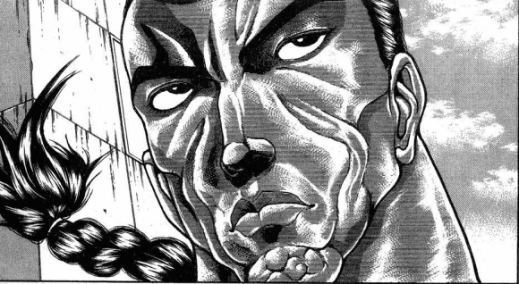

烈：（象征性打打可做不到……这必须得拼尽全力了！）

永远亭，烈海王，请指教！

让我见识一下魔女的力量吧！

战斗！

BGM：the Grimoire of Alice

烈海王

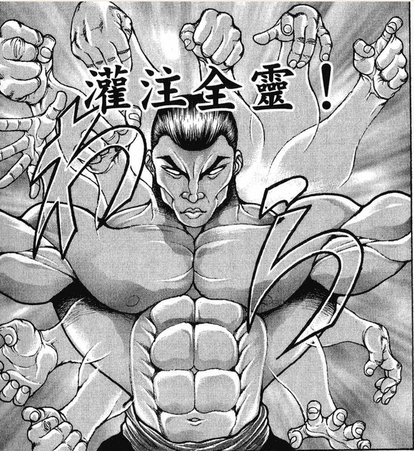

Atk：269（142）

Hp：21

技能

烈 海 王：超越海皇，仍为海王。AtkX1.9，Hp+1。不会陷入异常状态，不会受到驻足，束缚等判定影响，面对所有技能都可以进行【1d100】的破解判定，60以上成功

完全消力： 普通攻击以及近战系、弹幕系技能所造成的的最终伤害/2（仅对Atk260以下的对手起效）自身所收到的普通攻击伤害-1，近战系、弹幕系技能伤害-2（仅对Atk261以上的对手起效）

红符【巨阙】（CT3）：（近战系）本回合Hp-2，Atk+80，给予伤害+4

Flower star（CT4）：（弹幕系）对对手造成必中的【2+1d6】点伤害。

假腿【The World】:一天只能使用一次，使用假腿中的力量进行一次超快速移动。本回合战斗自动胜利且造成的伤害必中（对战斗力低于160的对手使用的情况下直接判定战斗结束，胜者烈海王）/【回避】一次致命攻击（对于无法回避/破解/防御的必杀技无效）

急救拳：一场战斗中只能使用一次，Hp归0后回复1点Hp

贫穷神的加护：自动发动，一天只能使用一次，令对手的大成功转变为大失败

必杀技

纯粹武道（CT5）：怀抱纯粹的武术，心存无色的执着。3T内Atk+70，对对手造成的伤害+3。3T内可对所有攻击进行【1d100】的破解判定，近战系、技巧系技能30以上成功，其余技能40以上成功，必杀技60以上成功

超人【烈海王】（CT6）：Atk+650，给予伤害X4，之后2T回避概率翻倍

武符【梦幻斗舞】（CT7）：无法回避/破解/防御，本回合自身无敌，进行一次【1d100】的反击判定，30以上可对对手的攻击进行反击

秘术【天文密葬法】（CT8）：3T内战斗环节中，妖怪对手的Atk变为与自身最终结算后相同，自身的战斗骰变为【2d100】但同时无法使用破解，无法回避/破解/防御，给予伤害X2/无法回避/破解/防御 Atk+900，给予伤害X6

爱丽丝·玛格特洛依德

Atk：285

Hp：11+4

技能

七色的人偶使：用人偶保护自身，拥有4点伤害的护甲，护甲破碎前每次受伤固定造成1点伤害

魔界的女儿：不会受到异常状态的影响，对特殊攻击手段拥有耐性，每次自身的人偶护甲被击破/自身的人偶爆炸时对对手进行一次特殊攻击【诅咒】：进行一次【1d100】的诅咒判定，首次出目为1-29时本场战斗中对手受到的所有伤害+2，其后出目为1-29时本场战斗中对手受到的战斗伤害+1，出目为30-59时以上本场战斗中对手回避/破解/防御成功判定值+7，出目为60-89时本场战斗中对手Atk-4，出目为90-100时对手Hp减半

试验中【歌利亚人偶】（CT1）：（自身加持系）依靠巨大的人偶抵挡伤害并进行追击，自身的前二次攻击成功时可令对手进行第二次受伤判定，本次判定中对手受到的伤害+2。此技能无法进行破解

白符【白垩的俄罗斯人偶】（CT3）：（近战系）发射放出冰蓝色十字弹幕群的人偶，本回合Atk+65，造成伤害X2

苍符 【博爱的奥尔良人偶】（CT4）：（技巧系）操纵人偶放出华丽的红绿二色弹幕，对对手造成必中的【1d8】点伤害

雅符【春之京都人偶】(CT5)：（弹幕系）操纵人偶放出碧绿色的高密度弹幕，3T内Atk+50，每回合向对手投掷一个自**偶进行【诅咒】攻击。（被破解的场合仅失去Atk增加效果）

必杀技

甜蜜的死亡（CT6）：释放自动追踪对手的黄色激光与圆形魔弹，Atk+675，给予伤害X4

诅咒【上吊的蓬莱人偶】（CT7）：操纵人偶，以自身为中心放出大量形状不等的弹幕攻击，Atk+775，给予伤害X4

the Grimoire of Alice（CT8）：“少女睁开了她的双眼，发现那美丽的世界不过是幻梦一场”。Atk+900，给予伤害X6，本回合对手需进行一次决心判定，60以下的场合无法进行普通攻击

T1

烈的攻击【269+1d100：87=356】

爱丽丝的攻击【285+1d100：41=326】

爱丽丝的受伤【1d10:2】

1 回避

2 护甲

3 护甲

4 护甲

5 护甲

6 护甲

7 护甲

8 护甲

9 护甲

10 大成功/大失败【1d2：2】

人偶护甲：4-1=3

烈：这个糟糕的手感

又是人偶护甲？

爱丽丝：没错

友情提醒，当你击破人偶的时候

人偶的痛苦也会回馈到你的身上

金发的少女翻开了手中的魔法书，并轻声念出了书页上的句子

爱丽丝：“正直村中有着8位正直者”

“他们舍弃了人类的身份，而来到了乐园之中”

“好奇心最旺盛的我被神秘的小丑叫住，我既不能动弹也无法出声，再也无法见到同伴。”

爱丽丝的诅咒【1d100：3】

本场战斗中烈受到的所有伤害+2

烈：恕我冒昧，似乎没什么明显的变化

爱丽丝：和魔理沙一样急性子，难怪你们会成为朋友

无需着急——这只是，第一位正直者而已

T2

烈的攻击【269+1d100：73=342】

爱丽丝的攻击【285+1d100：71=356】

武者正准备乘胜追击，却发现自身对肉体的掌控变得有点迟缓起来

这对他的攻击并没有太多的影响，但是对于他引以为豪的消力技术却妨碍极大！

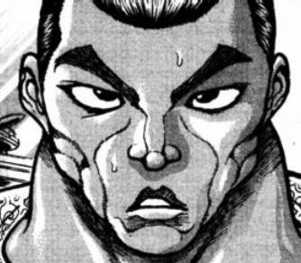

烈：什么时候——

原来如此，是这样的诅咒吗？！

爱丽丝：察觉到了吗

我所诅咒的，正是对于魔法使来说最为重要的肉体

上，歌利亚

金发少女操纵着巨大的人偶，对武者同时发起了攻击！

烈的受伤【1d10：1】

1 回避

2 小伤害-1+2

3 小伤害-1+2

4 中伤害-1+2

5 中伤害-1+2

6 大伤害-1+2

7 大伤害-1+2

8 特大伤害-1+2

9 特大伤害-1+2

10 大成功/大失败【1d2：2】

烈的受伤【1d10:7】（歌利亚的追击伤害+2）

1 回避

2 小伤害-1+2+2

3 小伤害-1+2+2

4 中伤害-1+2+2

5 中伤害-1+2+2

6 大伤害-1+2+2

7 大伤害-1+2+2

8 特大伤害-1+2+2

9 特大伤害-1+2+2

10 大成功/大失败【1d2：2】

Hp：21-3+1-2-2=15

烈：厉害

操纵着如此巨大的人偶却仍然能依靠本体与其同步进行攻击

不愧是七色的人偶使

爱丽丝：可惜，这个人偶仍然是个实验品

用不了几次就要停止活动了，我也很困扰呢

T3

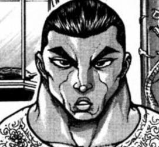

烈：将未完成的招式用于实战……

我还真是被小看了

符卡宣言 红符【巨阙】！

Hp：15-2=13

爱丽丝：战斗同样是修行魔法的一环，这就是我们的风格哦

符卡宣言 白符【白垩的俄罗斯人偶】！

烈的破解【1d100:39】失败

烈的攻击【269+80+1d100：75=424】

爱丽丝的攻击【285+65+1d100：4=354】

爱丽丝的受伤【1d10：1】

1 回避

2 护甲

3 护甲

4 护甲

5 护甲

6 护甲

7 护甲

8 护甲

9 护甲

10 大成功/大失败【1d2：2】

武术家只用三两招便解决了爱丽丝的激光人偶

他双手高举，正准备以炽热的血剑破坏对手的人偶防御，却发现金发的少女手指微微一动，那巨大的人形便化为坚不可摧的堡垒挡在了他的身前！

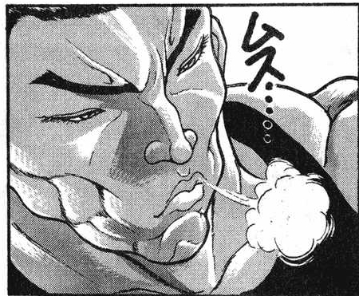

烈：这种程度也是实验品？

爱丽丝：当然

如果将这个正式完成，那你连出手的机会都不会有

红魔馆的大门前，恶魔之妹与被吵醒的门番正看着庭院中的战斗

芙兰朵露：那种程度的东西，明明我能轻易捏碎的

红美铃：二小姐，对你来讲捏不碎的东西也没有几个吧~

话说回来，护甲、巨大人偶和诅咒啊

啧啧，这糟糕的相性

T4

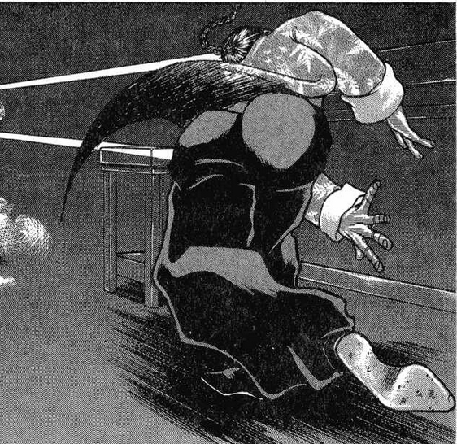

烈：在拼胜负之前总得先把护甲干掉

接招，flower star！

人偶护甲：3-1=2

爱丽丝的诅咒【1d100：29】

本场战斗中烈受到的所有伤害+2，战斗伤害+1

爱丽丝：“最美的我被小丑所俘虏了，我已无法回到我们的地方。”

击破的人偶越多，你所受到的诅咒也越沉重

两难的抉择，不是吗？

符卡宣言 苍符 【博爱的奥尔良人偶】

烈的破解【1d100：11】失败

烈的受伤【1d8：5-2+2=5】

Hp：13-5=8

烈的攻击【269+1d100：76=345】

爱丽丝的攻击【285+1d100：94=379】

可爱人偶所释放的红绿二色弹幕给予了武者极大的伤害

而烈海王万万没有想到的是

一直躲藏在人偶身后的魔法使本人，却在他忙于躲闪弹幕的时候一反常态的拉近了距离！

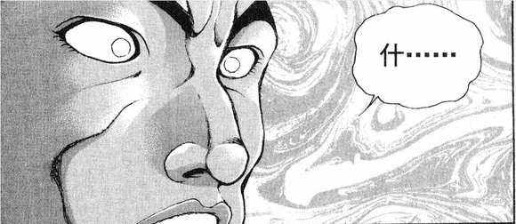

烈：什——

爱丽丝：接招

魔法【刺拳】！

金发的少女抓住了武者的破绽，她以令人想起拳击选手般的灵巧动作绕过了烈的攻击，并转而向他的下颚打出了刺拳！

烈的受伤【1d10：7】

1 回避

2 小伤害-1+2+1

3 小伤害-1+2+1

4 中伤害-1+2+1

5 中伤害-1+2+1

6 大伤害-1+2+1

7 大伤害-1+2+1

8 特大伤害-1+2+1

9 特大伤害-1+2+1

10 大成功/大失败【1d2：2】

Hp：8-3+1-2-1=3

魔法使的拳头结结实实的打在了烈的下巴上

他感到大脑如同豆腐一样晃动了起来，世界仿佛变成了一副七彩的抽象油画，令他根本找不到正确的方向

而在他身后，巨大人偶的追击已经到来！

红美铃：无需达成破防或是失去平衡这种条件，堂堂正正从正面突破

唯一需要的只是速度，因此它也被称为近代武术近代格斗技中最快的技术

进攻的时机把握的相当好，了不起

烈的受伤【1d10：9】（歌利亚人偶）

1 回避

2 小伤害-1+2+1+2

3 小伤害-1+2+1+2

4 中伤害-1+2+1+2

5 中伤害-1+2+1+2

6 大伤害-1+2+1+2

7 大伤害-1+2+1+2

8 特大伤害-1+2+1+2

9 特大伤害-1+2+1+2

10 大成功/大失败【1d2：1】

Hp：3-4+1-2-1-2=0

烈要使用【1d2：2】

1 急救拳

2 时停

——【The World】！——

歌利亚人偶挥出了最后一次重击，而后保持着这个姿势在原地停止了活动

爱丽丝：战斗四回合，进攻两次，机能停止但没有自爆

不错的结果，已经可以在我不操控的情况下活动这么久了，这一次的实验也还算成功

不过，这一击似乎是被躲过去了啊

爱丽丝看向了突然出现在庭院另一侧的武术家

烈：是我太过轻敌了

明明已经看过魔理沙那凄惨的下场，却仍然忘记了你的近战技术

——但不管怎么说那都是格斗技而不是魔法！

爱丽丝：这可是身为魔法使的我经过刻苦钻研，不凭借外力而独自使出的技术

正如你的花弹是武术一样

我的拳头当然也是魔法

芙兰朵露：说的没错，我的莱瓦汀也是魔法哦~

T5

爱丽丝：来吧，继续我们的战斗

符卡宣言 雅符【春之京都人偶】！

以异国都市所命名的人偶释放了宛如春日般的弹幕之风

那碧绿而华丽的弹幕以人偶为中心缓缓旋转着，以旁观者的角度看来与盛开的鲜花尤为相似

纯粹武道发动

烈的破解【1d100：49】成功

武术家轻松写意地穿过了弹幕的封锁，并顺手击退了那位于中央的碧绿人偶

烈：我在幽香那边已经见识过相似的招数了！

你这符卡附带的效果是……

啧，又是诅咒吗？！

构成符卡阵势的人偶之一抬头向他露出了一个可爱的笑脸，随后便在他眼前炸成了一团小小的烟花

爱丽丝：“最年幼的我，在黑暗中被不吉利的小丑给捉到了。”

爱丽丝的诅咒【1d100：38】

本场战斗中烈的破解成功所需值+7

烈海王突然感觉自己的大脑变得“慢”了起来

往日几乎是下意识的动作，如今却需要拼命回想才能及时作出

那些看上去轻而易举就能躲闪的弹幕，实际躲避时却也变得吃力起来

烈：这是对于思考速度的诅咒！

最近遇到的尽是这样出人意料的攻击，我可真是长见识了

爱丽丝：喜欢硬碰硬的话不如去和帕秋莉掰手腕啊

没事，她的力量可比不上鬼族……

大概吧

烈的攻击【269+70+1d100：6=345】

爱丽丝的攻击【285+1d100：47=332】

爱丽丝的受伤【1d10：4】

1 回避

2 护甲

3 护甲

4 护甲

5 护甲

6 护甲

7 护甲

8 护甲

9 护甲

10 大成功/大失败【1d2：2】

人偶护甲：2-1=1

爱丽丝的诅咒【1d100：86】

烈的Atk：269-4=265

爱丽丝：“最聪明的我察觉到小丑就在我们之间，而后便感受到了背后的气息”

“热感从我背上扩散开去——”

这回的诅咒是简单粗暴的削弱肉体能力，感觉如何啊？

烈：很糟糕，不想体验第二遍了

T6

爱丽丝的诅咒【1d100：25】

本场战斗中烈受到的所有伤害+2，战斗伤害+2

爱丽丝：“最成熟的我恋慕着美丽的小丑，从而幸福地坠入梦乡。”

烈：爱丽丝小姐

你所述说的这些诡异的句子，是发动诅咒所需的咒文吗？

爱丽丝：不，只是我个人很喜欢的一个故事而已

我很好奇，你是否能听到这个故事的结局呢？

这是爱丽丝小姐赠与你的礼物

还请抬手拥抱，这甜美的死亡

白符【白垩的俄罗斯人偶】发动

甜美的死亡 发动

金发的少女欢笑着举起了手中的书籍

那黑色封皮的魔法书在空中自行翻动着书页，为主人寻找着她所渴求的魔法

片刻之后，书本停下了它的动作

明黄色的光之柱自书页之中浮现而出

它们以一种悠闲而稳定的速度追逐着眼前的武术家，看上去对自己的胜利充满了信心

但躲避攻击的烈海王却不敢有丝毫怠慢之心

因为光柱的增值从未停止——

它们无穷无尽地从书中出现，在短短的数秒之间就已经遮蔽了武者头上的天空！

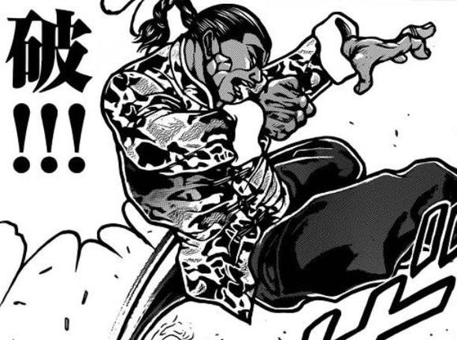

烈的破解 白符【1d100：20】失败

死亡【1d100：84】成功

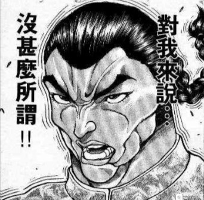

烈：数量无限的全范围追踪攻击，确实是朴实却有效的魔法

只可惜，死亡对我来说从来都没什么所谓！

符卡宣言 红符【巨阙】

符卡宣言 超人【烈海王】！

Hp：3-2=1

化为超人的武术家选择了最为直接的破解方式

他一瞬之间爆发出了自身所有的力量，凭借过人的战斗经验穿过了光柱间那几乎可以忽略不计的缝隙

几乎在武者刚说完话的时候，他便已经冲到了少女的身前，并砍向了爱丽丝最后的护身人偶！

烈的攻击：差值大于100自动胜利

爱丽丝的受伤【1d10：2】

1 回避

2 护甲

3 护甲

4 护甲

5 护甲

6 护甲

7 护甲

8 护甲

9 护甲

10 大成功/大失败【1d2：1】

人偶护甲：1-1=0

爱丽丝：“我的脸在可怕的黑暗之中扭曲着。我的手脚随着声音疼痛起来。”

“我已被人钉在了树木之上，动弹不得。是谁把我钉在了树木上？”

爱丽丝的诅咒【1d100：77】

烈的Atk：265-4=261

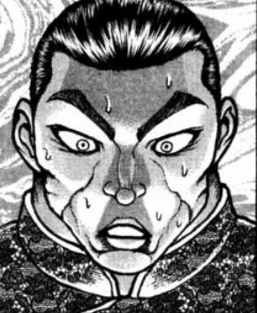

烈：这故事听下来全是在死人啊！

爱丽丝：你是这么觉得的吗？

不过，有一个人其实没有死哦

T7

爱丽丝：“最早起来的我，意识陷入了苟延残喘之中。”

“啊啊，全部都是那个人搞的鬼！但不管怎样，都已经是太迟了…”

爱丽丝的诅咒【1d100：75】

烈的Atk：261-4=257

烈：爱丽丝小姐

这个故事的结局是什么？

金发的少女如孩童般掩嘴笑着

爱丽丝：不要着急，马上，就要到最后的终局了

“那对我已经是无关紧要了，我现在只是孑然一身。”

“对这充满肮脏的谎言的世界，我已经无所依恋。”

“我用足够结实的绳绑在天花板上，把高椅踢开，这一次，身体再也没有回到地上。”

符卡宣言 诅咒【上吊的蓬莱人偶】

小小的人偶们手牵着手站在了爱丽丝的身旁

她们如同真人一般露出了似恐惧又似欢喜的神情，并旋转着，飞翔着，向四周挥洒着大玉，激光与彩色的魔弹

这是真正的诅咒术式？是人偶们不经意间的恶作剧？还是说，仅仅是冠以诅咒之名的弹幕游戏呢？

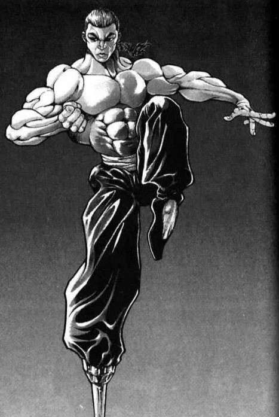

烈：嚯，作为诅咒而言这可真称得是华丽无比

不过，当诡异之事物以可以被打倒的形态现身之时——它也就没什么可怕了！

符卡宣言 武符【梦幻斗舞】！

爱丽丝的攻击：【285+775+1d100:93=1153】

烈的反击【1d100：62】成功！

武术家在战斗时向来不关心这些与打架无关的题外话

他于弹幕之中来去自如，在人偶们的身侧跳着属于自己的舞蹈

已然无惧咒缚的武术家将爱丽丝的人偶毫不留情地打飞到了一旁

而躲在幕后的人偶使，终于真正意义上受到了一次攻击！

爱丽丝的受伤【1d10：2】

1 回避

2 小伤害X2+3

3 小伤害X2+3

4 中伤害X2+3

5 中伤害X2+3

6 大伤害X2+3

7 大伤害X2+3

8 特大伤害X2+3

9 特大伤害X2+3

10 大成功/大失败【1d2：2】

Hp：11-1X2-3=6

爱丽丝：多么冷酷无情而又过激的舞姿啊

结果，你也成为了故事中的一部分

蓬莱人形的故事终于迎来了结局

你是无甚所谓的巫女，而我，是聪慧而顽皮的美丽之人！

烈：虽说这招确实是从灵梦那学的

但我烈海王可不是什么巫女！

T8

爱丽丝：“幻想乡永远失去了正直者，而金发的少女则住进了森林的洋馆中”

“今天又是无聊的一天啊，巫女小姐这般记载着，便送走了这安然无事的夏天”

于是，蓬莱人形的故事到此结束！

烈的察觉【1d70：53+30=83】（50以上误解，75以上察觉）

烈：我大概明白了

爱丽丝小姐，这个故事跟你其实压根就没什么关系吧？

爱丽丝：真可惜~

我的恶作剧又失败了，为什么大家都这么相信我呢？

符卡宣言 苍符【博爱的奥尔良人偶】

烈的破解【1d100：66】低于67失败

烈的受伤【1d8：2+2-2=2】

Hp：1-2=0

烈海王使用了急救拳

Flower star发动

爱丽丝的受伤【2+1d6：1=3】

Hp：6-3=3

为诅咒所困而导致思考迟钝的烈海王不得不硬吃了他以往绝不会中的招数

武术家强撑着用出了自身最后的底牌

传自月之贤者的秘术，让他有了见证魔女那究极魔法的机会

他顺手扔出了花弹，而后毫无意外的发现爱丽丝并未倒在此招之下

烈：我这边的原因倒是很简单

等战斗结束后再详细说明吧

现在还请让我见识一下究极的魔法——

不会又是格斗术吧？！

少女搂着书本咯咯直笑

爱丽丝：哈哈哈哈！

不是不是，这是，不看着书就使不出来的、非常惊人的魔法啊‼

“那狂乱而迷人的仙境不过幻梦一场

但我却依然着迷于这心爱的故事

迷恋着那虚幻而美丽的爱丽丝！”

【the Grimoire of Alice】！

魔界之女欣然念出了书本上的字句

书中那瑰丽的世界便来到了现实之中

七色的异彩流淌在红魔馆的天空之上，优雅的庭院也被绿草如茵的仙境所取代

白兔、棋子、扑克牌、帽子……

踏着诙谐的脚步，唱着滑稽的长诗，童话中的角色们接二连三的登场了

有谁会在这般环境下选择粗暴的打斗？

又有谁忍心破坏这美好的梦呢？

看吧，那美丽的少女就在遥远的彼方

只需静静等待她的邀请，人人均可进入仙境之中！

烈的决心【1d70：38+30=68】大于60成功

烈：只要踏进一步便是无处不在的全方位魔法轰击，这样的仙境可还是算了吧！

该从梦境中苏醒了，爱丽丝小姐

符卡宣言 秘术【天文密葬法】！

蜂拥而出的使魔群构建了无处可逃的密室

冰冷而无情的宇宙魔力撕碎了少女所营造的美丽面纱，露出了潜藏其下的真实

那是赤色的魔针，是回旋的禁弹，是暗藏在空气中的魔力陷阱，是毁灭一切的破灭之环！

从来都没有什么梦中的仙境

只有那悄声念诵的魔界之女，与她所释放的万般法术！

蕾米莉亚：【Star of David】

在两人的术式正面交锋之前，红魔馆的主人降下了覆盖全城的六芒星

那可怜的印文挡住了最为激烈的第一次冲击便粉身碎骨

紫发的吸血鬼苦恼地挠了挠头，而后不得不再次设立了多重防御用的魔印，以保护她那脆弱的城堡

烈的攻击【257+900+1d100：77=1234】

爱丽丝的攻击【285+900+1d100：20=1205】

爱丽丝的受伤【1d10：8】

1 小伤害X3（无法回避）

2 小伤害X6

3 小伤害X6

4 中伤害X6

5 中伤害X6

6 大伤害X6

7 大伤害X6

8 特大伤害X6

9 特大伤害X6

10 大成功/大失败【1d2：1】

Hp：3-4X6=0

双方那激烈无比的冲突被恶魔封印在了结界之内

那封闭的空间之中究竟发生了什么？

连旁观的两人也无法知晓

她们只知道，在蕾米莉亚所施加的防御术式被全部破坏之时

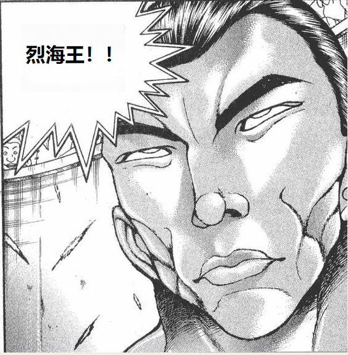

永远亭的武术家也终于站在了爱丽丝的身前

他接过了少女手中摊开的书本

并抬手将其重新合了起来

烈：还要继续打吗？

爱丽丝：有些为难呢

近战魔法还是你比较擅长，再来一次突袭八成是没用了

总之，还请先把书还给我

烈海王把书递给了人偶使

他自觉地退后了一段距离，而后发现对面的少女不出意外的变回了平时的模样

爱丽丝：多谢，永远亭的绅士先生

这一次是我输了

我会在下一次连本带利讨回来的

到时候，还请务必与我一战

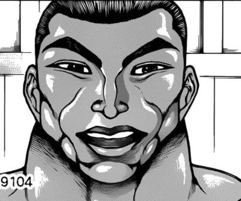

烈：理所当然

我随时欢迎再打一场！

伟大的蕾米莉亚小姐看着终于被自己保住的红魔馆悄悄松了口气

一旁的女仆长体贴地为她的主人递了杯红茶

而恶魔之妹与门番，则笑着为这场精彩的战斗鼓起了掌

战斗结束

胜者 烈海王！

烈海王看向了一旁的门番与吸血鬼

烈：不好意思，我光顾着打架连换场地都忘记了…..

两人的笑点【1d100：83】

红美铃：烈

虽然你现在灰头土脸的样子很狼狈

但你刚刚身穿T衫与小丑帽战斗的样子真的很靓仔！

芙兰朵露：马戏团王牌台柱就是你啦，哈哈哈哈哈哈哈！

恶魔之妹与红发的武术家捂着肚子笑开了花

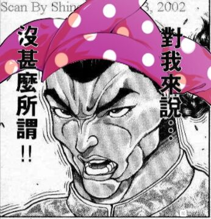

烈：我已经习惯了

我无所谓！

爱丽丝：无所谓的小丑先生

可否说说你为何会认为“蓬莱人形”只是个故事呢？

烈：总结一下这个故事，就是“八位正直者中的七位离奇死亡，而最后生存下来的人是位美丽的金发少女”

枉死的七人与美丽的金发幸存者，**纵的人偶与金发的魔法使

上吊而死的最后一位正直者，名为上吊的诅咒符卡……

同样居住在森林中的洋馆，同样认识红白色的巫女……

你们之间的相似点已经多到夸张的地步了

而这个故事的真实——

爱丽丝：没错，就是我成就究极之魔法的诅咒仪式！

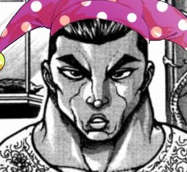

烈：怎么可能，爱丽丝小姐你可别开玩笑了

如果这个故事真的发生过，那么灵梦绝不会像故事中一般对“这种小事”视而不见

而如果你真是那般邪恶的存在，魔理沙也绝不可能会喜欢上你

我猜这个故事是你写的？

或者你的某些符卡是根据这故事编的？

实际上是怎么样呢【1d10：3】

1 爱丽丝写的

2 只是普通的故事而已

3 神绮写的（为啥啊）

4 爱丽丝写的

5 只是普通的故事而已

6 魔理沙写的（你好强大）

7 爱丽丝写的

8 只是普通的故事而已

9 帕秋莉写的（为啥啊）

10 大成功/大失败【1d2：2】

爱丽丝：你还真是相信她们两人啊

差不多都对了，我的部分符卡灵感确实来自于这个故事

我非常的喜爱它

因为它是母亲送给我的礼物

烈的情商【1d100：88】（基础情商+20，50以下吐槽）

烈：（一般人会送自己女儿这么诡异的故事书吗？！！）

这确实是……相当独特的礼物

芙兰朵露：你的母亲很有品味哦

我也最喜欢这种无人生还的故事啦！

爱丽丝：你也喜欢？我很开心

下一次的人偶剧，就演这个故事吧

到时候还请前来观赏

烈：既然这场战斗是我的胜利，那么可否请你停止对魔理沙的诅咒了？

我无意对你们的关系发表任何意见……

但请至少别用这么过激的手段去伤害你的女朋友

爱丽丝：没办法，毕竟这次是我输了

不过这本来也只是心血来潮的诅咒

大概就会持续个【1d365:121】天左右吧

红美铃：121天之后会变成什么样子都不奇怪了！

真是可怕的诅咒，魔理沙逃过一劫啊！

说起来魔理沙现在的进度是【1d10:7】

1 成功拿到书了

2 与帕秋莉纠缠中

3 读书会中（为啥啊）

4 成功拿到书了

5 与帕秋莉纠缠中

6 你尝尝精灵魔法的厉害吧（为啥啊）

7 成功拿到书了

8 与帕秋莉纠缠中

9 魔理沙危机一发（为啥啊）

10 大成功/大失败【1d2：2】

~巴瓦鲁大图书馆~

~几分钟前~

黑白的魔法使轻车熟路地绕过了帕秋莉的魔法陷阱，在魔女一无所知的情况下拿走了那本书

魔理沙：做到了da☆ze！

最麻烦的爱丽丝被烈海王引走了，陷阱也已经被我全部破除

这份挑战，我雾雨魔理沙完成了！

现在只需要悄悄溜出去——

“轰！”

图书馆之外响起了震天的轰鸣

魔理沙：？！

不是，他俩打的这么起劲吗？！

小恶魔：帕秋莉大人，爱丽丝小姐和肌肉脑侦探在院子里打起来了

刚刚外面的环境变得很漂亮——

啊，蕾米莉亚大人似乎设置了防御结界的样子，现在什么都看不到了

帕秋莉的震惊【1d100：40】（50以上出门）

帕秋莉：两个暴力狂聚在一起，也难怪会变成这样

有蕾米看着不会出什么事的，不用管她们啦

现在还是防范魔理沙要紧

紫发的魔女并未被外面的战斗所打动，而是选择继续留在图书馆内

魔理沙要做什么【1d10:1】

1 按照原计划溜了

2 给烈海王打个信号先

3 先看看书吧（别啊）

4 按照原计划溜了

5 给烈海王打个信号先

6 去找帕秋莉炫耀吧（为啥啊）

7 按照原计划溜了

8 给烈海王打个信号先

9 去找爱丽丝（为啥啊）

10 大成功/大失败【1d2：1】

魔理沙：拜拜帕秋莉~

这本书就由我收下啦！

魔理沙的潜行【1d70：54+30=84】（惯犯+30，50以上瞒过帕秋莉，75以上瞒过爱丽丝）

魔理沙静静等待着外界战斗的余波结束

她估算着时间差不多了之后，便在帕秋莉的眼皮底下溜了出来

爱丽丝与其余众人正在庭院中闲聊，蕾米莉亚又懒得插手魔女们的日常游戏

因此，黑白色的魔法使居然就这么轻轻松松的溜了出来！

魔理沙：（任务完成！可以撤了！）

烈：（可算完事了……）

这都快到中午了，我也该回去做午饭了

烈海王在此告辞！

芙兰朵露的察觉【1d100：61】（50以上察觉不对头）

芙兰朵露：（不对劲）

（烈每次过来的时候要么是找美铃练武，要么是找我玩游戏或者求救）

（但他今天过来却是和爱丽丝·玛格特洛依德打了一场——如果要找她打架，为什么还会特意来红魔馆呢？）

芙兰朵露要做什么【1d10:1】

1 直接开口询问

2 这里就悄悄跟在后面

3 这里就交给美铃（为啥啊）

4 直接开口询问

5 这里就悄悄跟在后面

6 这里就提示爱丽丝（为啥啊）

7 直接开口询问

8 这里就悄悄跟在后面

9 这里就靠我芙兰朵露的武力（求求你不要啊）

10 大成功/大失败【1d2：2】

芙兰朵露：这么快就要回去？

烈，你今天是过来干什么的啊？

红美铃：对哦，说起来你今天打扮得这么滑稽是来干啥的？

惩罚游戏的配套环节吗？

烈要怎么做【1d10：6】

1 靠我烈海王的口才！

2 魔理沙！！

3 实话实说（你又开始了？）

4 靠我烈海王的口才！

5 魔理沙！！

6 这里就用无言的暗示（是啥啊）

7 靠我烈海王的口才！

8 魔理沙！！

9 跑路啦！（为啥啊）

10 大成功/大失败【1d2：1】

永远亭的武术家默默指了指自己头上的帽子与身上的衬衫

烈：这个……要穿30天

现在是，第四天！

爱丽丝：如此残忍？！

烈：铃仙前辈她穿着和我一样的T衫

但她分到的不是帽子……而是克劳恩皮丝的袜子

红美铃：好可怕的惩罚！

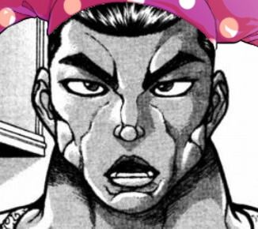

烈：我在这30天内无论去哪里，都要保持着这副打扮

但，我没所谓！

烈的暗示【1d60:9+40=49】（T衫帽子+50，灰头土脸-10,50以上成功）

恶魔之妹面色沉重的拍了拍武术家的肩膀

芙兰朵露：烈，你真的很坚强

——但这和你突然跑来红魔馆有什么关系呢？

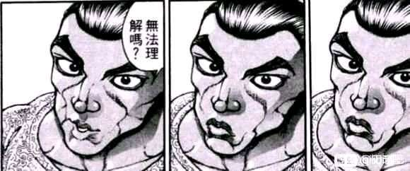

烈：......无法理解吗？

芙兰朵露：当然，无法理解啊

现场陷入了一阵尴尬的沉默

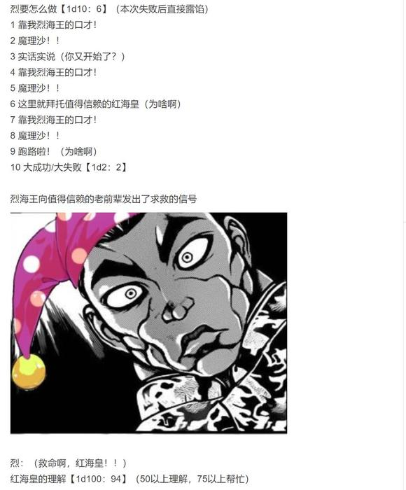

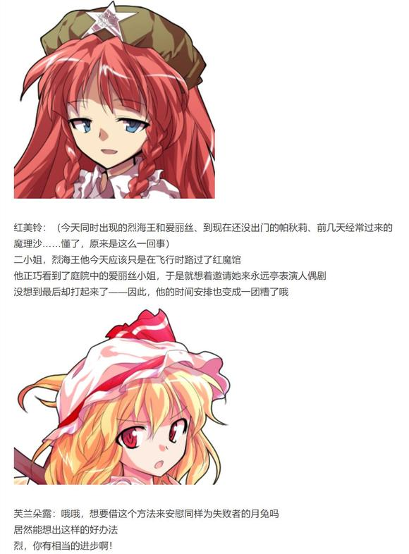

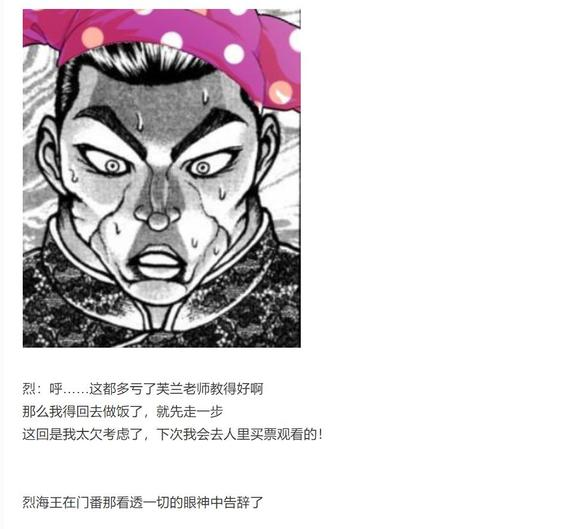

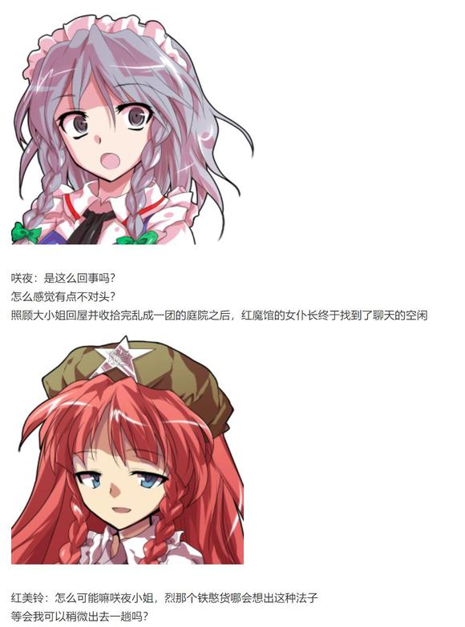

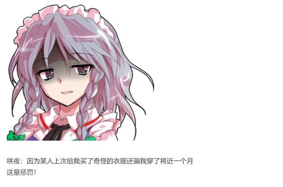

【1d30：22】分钟后

~永远亭~

魔理沙：呀呼！本次的作战大成功！

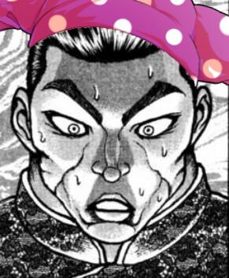

烈：哪里大成功了？！

最后的时候我已经露馅了，完全是靠着红海皇帮衬才跑掉的！

魔理沙：我拿到了书，逃脱了噩梦般的结局，你和爱丽丝打了一架

这不就是双赢吗！

其余的都是小事，现在该看看这书里都写了什么了~

黑白的魔法使满怀期待的从怀中掏出了一本老旧的笔记本

烈：？

你费尽心思就为了找这个？

魔理沙：帕秋莉那家伙说“现在的你还远远没到能看这本书的时候”，然后就给我来了个超狠的十字固定

我寻思她都这样发出挑战了，那我总得接下来吧？

好嘞，现在终于到揭开真相的时候了——

“停一下~”

就在魔理沙把手伸向笔记本的时候，红魔馆的门番从竹林之中走了出来

红美铃：这个地方真是太容易迷路啦

要不是一路跟着你们两个前进，我怕是现在都还在外头打转呢！

红美铃要怎么做【1d10：1】

1 简单有效的话术（无需判定）

2 讲道理

3 胁迫魔理沙（为啥啊）

4 简单有效的话术（无需判定）

5 讲道理

6 来吧，咲夜小姐（为啥啊）

7 简单有效的话术（无需判定）

8 讲道理

9 来吧，爱丽丝、帕秋莉！（为啥啊？！）

10 大成功/大失败【1d2：2】

红美铃：那本书里并没有什么有价值的信息，只是无意中夹带了些无聊的往事

那是类似某位红魔馆成员的个人隐私一样的东西

这也是帕秋莉小姐不想让你翻阅的原因所在

不过，她的处理方法似乎出了点问题——

烈：结果被魔理沙误解成挑战书了

是这么一回事吗？！

两位武术家将目光投向了魔法使

魔理沙要做什么【1d10:7】

1 我亲自回去还书

2 拜托美铃还回去

3 拜托烈还回去（为啥啊）

4 我亲自回去还书

5 拜托美铃还回去

6 让帕秋莉和爱丽丝过来拿（你找死吗）

7 我亲自回去还书

8 拜托美铃还回去

9 我就要看（为啥啊）

10 大成功/大失败【1d2：1】

魔理沙：哈啊啊啊啊？！

她早说啊！

哎呦这……我现在就给她还回去

绝对不会看的，绝对！

黑白色的魔法使急忙地骑上扫帚飞走了

烈：真是多谢你了，红海皇

唉，我还想着是人家情侣间玩游戏而不是真偷就帮了个忙

没想到今天差点做了错事

红美铃：那书里面夹的东西其实也没啥大不了的

类似黑历史剪报一样的感觉？

话说回来，你居然会帮魔理沙偷东西？

她给你开了什么价码啊？嗯？

红美铃坏笑着戳了戳旁边的武术家

烈：我求求您可别问这事了……

~巴瓦鲁大图书馆~

帕秋莉：糟了

那本书不见了！！

爱丽丝：哈啊？

就这么一会功夫书就能没了，你这里的防御设施是有多差啊？！

黑白的魔法使嗖的一声从大图书馆的入口处飞了进来

魔理沙：书在这里！

我一次都没翻过的，请相信我！

魔女们的相信【1d100：46】（50以上相信）

爱丽丝一步步走到了魔理沙的身后

爱丽丝：魔理沙

如果你没有看过的话

为什么你会这么着急把书送回来呢？

帕秋莉则站在了魔理沙身前

帕秋莉：魔理沙

我真的，真的很想相信你

就只差一点点了……

你先把八卦炉递给我，我们再好好聊聊如何？

魔理沙：喂喂

爱丽丝，帕秋莉

我们是恋人对吧？是恋人对吧？

请问二位小姐能否对恋人有那么一点最基本的信任呢？

爱丽丝&amp;帕秋莉：不能！

二魔女的夹击【1d100：42】

魔理沙的逃走【1d100：46】

金发小女孩猛地蹲下身子，躲过了恋人们同时使出的擒拿手

魔理沙：我就知道！！

等红美铃回来你们就明白我是无辜的啦！

在此之前我先溜了！！

爱丽丝&amp;帕秋莉：哪里逃？！

红美铃出门的时长为【1d6：3】小时（1-4小时魔理沙平安无事）

魔女们的追逐戏直到门番回来说明情况后才终于结束

已经被逼到墙角准备呼叫秘神的魔法使在千钧一发之际保住了一命

魔理沙：现在你们相信了吧？！

帕秋莉：那个……

对不起哦，魔理沙

爱丽丝：还不是你这家伙前科太多

下一次会相信你的啦

魔女们尴尬的将坐在墙角的女朋友拉了起来

蕾米莉亚：天天都这么吵吵闹闹的

你们这帮人就不能安安稳稳地过上一天吗......

于是，红魔馆再次回到了日常（？）之中

~永远亭~

又到了今日的故事会环节

烈的说明【1d100：83】

烈：——就是这样，我跟爱丽丝小姐打了一场之后就回来了

没想到她的真正实力那么强

说实话我最后真以为自己要输了

辉夜：你这黑曜石次次打架都这么说，我早就已经不信了

话说魔界啊……这方面我还真不清楚

永琳，魔界是个什么样的地方？

师匠：命莲寺的白莲师傅与妖怪们曾被封印的地方就是魔界

那是个十分广阔，但却不适宜生存的异界

它被结界所封锁，其中有着很重的瘴气与妖气

在这种环境下，连魔界的物品都有自我意识

有些妖怪们会在其中修行，人类也能从中修行魔法

而爱丽丝·玛格特洛依德所提到的母亲……大概是神绮吧

铃仙：没听过的名字呢

是很厉害的人？

皮克：嗷嗷嗷嗷嗷啊

（莫非是魔界之主？）

师匠：称呼为魔界之神会更恰当一些

从魔界人到魔界的社会制度

魔界整个世界的一切，都是她一个人创造的

可以说，她是所有魔界生物的母亲

听起来很夸张吧？

就是这么离谱的存在啊

因幡帝：我的天哪

爱丽丝的母亲是这么恐怖的家伙？

烈的震惊【1d100：96】

草，这里震惊大成功是什么【1d10:8】

1 过于震惊使得攻击力和体质增强了

2 过于震惊而有所领悟

3 魔界一日游套票（这啥啊）

4 师匠的指导（随机增强一个技能）

5 铃仙的膝枕

6 魔界来往船票（这又是啥啊）

7 纯狐的指导（增强纯粹武道或消力）

8 赫卡提亚的抱抱（随机增强一个技能）

9 神绮来啦（为啥啊！？）

10 大成功/大失败【1d2：1】

烈：凭借自己创造一个世界？！

居然有这么可怕的人物吗？！

赫卡提亚：不怕不怕~

有我在这里~

地狱的女神大人神不知鬼不觉地出现在了武术家身前，并温柔地抱住了他

烈：多谢你——不不不赫卡提亚快放手快放手啊！！

赫卡提亚：？

为什么，朋友之间贴贴抱抱不是很正常的事情吗？

师匠：从 来 都 不 是

你 给 我 放 手

赫卡提亚：不要，为什么啊~

哇，这点小事至于动用武力吗？！

地狱女神抱着武术家跑出了永远亭的大门

月之头脑手持弓箭身手敏捷地追了上去

永远亭的大家相互看了看，一律明智的选择了放弃插手并回到了各自的房间之中

不知为何跟神明大人特别有缘分的武术家的一天，还在继续！

~第490天结束~

~第491天~

烈增强的技能是【1d10:8】

1 超人术

2 巨阙

3 花弹（还加强啊）

4 超人术

5 巨阙

6 纯粹武道（您还懂武学吗）

7 超人术

8 巨阙

9 天文密葬法（为啥啊）

10 大成功/大失败【1d2：1】

具体来说是【1d2：2】

1 威力增强

2 消耗变少

烈：为啥我这血剑感觉不大一样了？

赫卡提亚：锵锵~

昨天晚上的拥抱其实是一次小小的赐福，增强了你体内的造血机能与再生能力

怎么样，厉害吧？

烈：啊？！就抱了那一会？！

这怎么可能做到呢？！

赫卡提亚：看吧看吧，就是这种“这怎么可能”的反应

所以我才说你见得太少呢~

红符【巨阙】升级了！

异红符【巨阙】（CT3）：（近战系）以超出常理的魔血铸造炽热之巨剑，本回合Hp-1，Atk+80，给予伤害+4

成就：死之少女 达成！

战胜了魔界之女爱丽丝·玛格特洛依德

Atk+3

现在的Atk：275（145）

成就：人类之巅峰 达成！

已达到了当前情况下的极限Atk

此后除特殊情况外，Atk无法增长

（本日的更新结束，下一次的更新在周日或周一）

（以下是我的废话）

好久没试过中途断一个小时再接着更了，这一次实属无奈之举

毕竟我也想不到今晚突然整活了，对吧（悲）

本次的爱丽丝回骰子感觉真的很......怪？

前期疯狂出梗选项，结果打完架之后的出目反而变得十分温顺起来

金发小女孩历经千辛万苦终于有了一次美好的结局，可喜可贺（

话说那个恋爱诅咒真是笑到我了，搞啥啊这？！

爱丽丝打架的时候简直招招毙命，看出来是真要下死手了

结果最后拼点的时候反而拉胯了，没想到这场还真能赢啊

爱丽丝战中我由于个人趣味加了各种各样奇奇怪怪的元素进去

包括但不限于旧作、蓬莱人形、爱丽丝梦游仙境、以及大家最喜欢的恶饿鬼爱丽丝（笑）

没接触过的吧友们光看对话可能很有种“这两人在讲啥”的一头雾水的感觉，如果感兴趣的话不妨去查查吧（笑）

写起来挺麻烦不过我个人倒是蛮high的，结果最后检查一看发现这对话过于电波了这不是根本get不到点吗——

但是已经到更新的时间了！！于是只能硬着头皮上了，请原谅我个人的任性吧

之后会更个小彩蛋略微填一下这次梗选项骰出来的坑

还有个本部老师番外篇，大概吧（

那么本次的更新到此结束，下一次的更新在周日或周一，骰子明天发

提前祝大家节日快乐啦

~彩蛋~

~陈年往事~

说起来咲夜的过去是【1d10:6】

1 吸血鬼猎人

2 开膛手杰克

3 犬咲夜（为啥啊）

4 吸血鬼猎人

5 小不点咲夜

6 潇洒的布兰多一族（这啥啊）

7 吸血鬼猎人

8 魔法少女☆咲夜

9 木花咲耶姫（过分了吧？！）

10 大成功/大失败【1d2：1】

嗯……话说咲夜与父亲的关系是【1d100：36】（越高越好，越低越糟糕）

~红魔馆~

紫发的魔女与吸血鬼正在庭院中开着茶会

红魔馆的门番和恶魔之妹则在旁边照顾着花朵

潇洒的女仆长为主人倒了杯红茶，正准备回头拿盘点心，却发现魔法使的怀中抱着一本似曾相识的笔记本

咲夜：这不是……

那个人的书吗？

帕秋莉：对，这是迪奥·布兰多的笔记本

有种怀念的感觉吧

咲夜：还请别提那时候的事了

我至今为止都不敢置信，世界上居然有如此不负责任的父亲

蕾米莉亚：那可真是个奇妙的男人

“想做什么都可以，她就拜托你照顾了”

这么说着就强硬地把咲夜送过来了呢

红美铃：从各种意义上来讲他和咲夜小姐都很像~

尤其是发动能力的时候，简直一模一样！

恶魔之妹拿起了夹在书中的照片

芙兰朵露：那时我还被关在地下所以没实际见过他，看上去好有气势的样子

旁边这位发型很奇怪的人，是咲夜的弟弟吗？

咲夜：是啊，乔鲁诺是个正直且有责任感的好孩子

——我认为他绝对是受了来自父亲的不良影响才会选择去干黑帮这行

潇洒的女仆长小姐摇了摇头，转身回厨房拿饼干了

芙兰朵露：哎呀呀……

咲夜很讨厌她的父亲吗？

红魔馆的门番耸了耸肩

红美铃：如果真是那样的话

我们就看不到这张照片啦

紫发的恶魔顺手接过了妹妹手中的老照片

身着奇装异服的男人正在照片上张狂的笑着

而金发的男孩与银发的女孩则羞涩地站在父亲的身旁，仿佛想装作不认识他的样子

红魔馆的主人端详着这老旧的照片，似乎想起了从前的往事

她微笑着将其放回了原处

于是，咲夜的过去再次被隐藏在了那黑色的笔记本中

