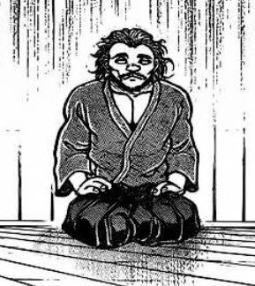
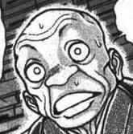
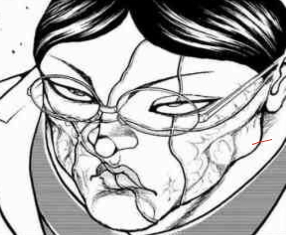
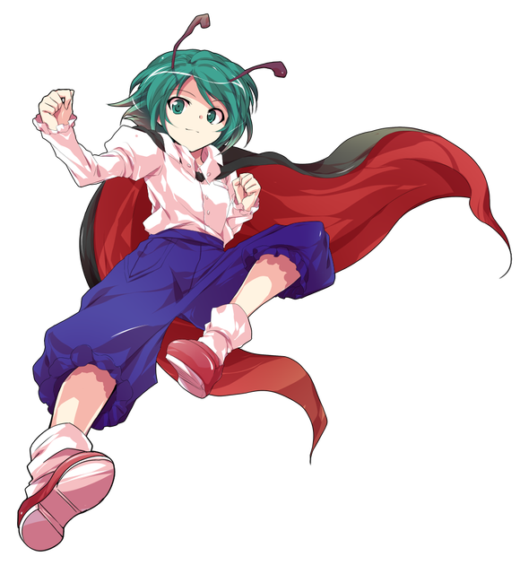
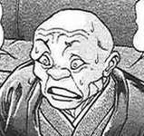
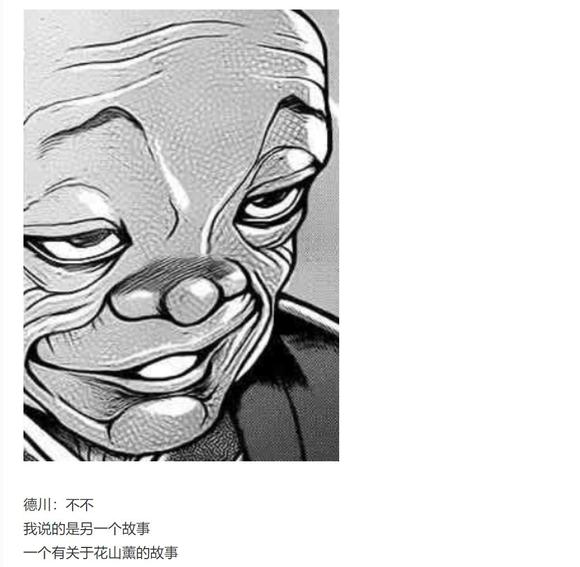

~中秋特别篇~

~这件事发生在烈海王来到幻想乡的第？？？天~

中秋节，又称祭月节、月光诞，是中国民间的传统节日

它是秋季时令习俗的综合，祈盼丰收、幸福与阖家团圆，是中秋节最为核心的意义

“ 一个献给大国主大人～

两个献给大国主大人～

为了一百八十位御子～

大家继续捣啊

嗨呀　继续捣啊”

这天，兔子们正在因幡帝的带领下捣着团子

远在竹林之中的永远亭平日只在满月的时候举行例月祭，这便是例月祭的活动之一

原本的祭典到此就该结束了——

不过，来自大陆的武术家显然对此有些不同的看法

烈：团子这东西什么时候都能吃

但中秋节怎么能不吃月饼呢？

皮克：嗷嗷嗷嗷嗷嗷啊

（那是啥？听上去蛮好吃的样子）

永远亭的月饼馅是【1d10:7】

1 蛋黄莲蓉

2 蛋黄豆沙

3 韭菜鸡蛋的（为啥啊）

4 蛋黄莲蓉

5 五仁

6 水果的（为啥啊）

7 蛋黄莲蓉

8 肉松

9 冰皮的（为啥啊）

10 大成功/大失败【1d2：2】

【1d60：4】分钟后，烈海王从厨房中拿出了早就做好的月饼

烈：这是我家乡那边过中秋时必须要吃的传统食物

这两年奇怪的馅变得越来越多了，不过我个人还是喜欢比较传统的那几种

烈的厨艺【1d45：24+55=79】

幽香：这个馅料是……莲子、白糖和油混合做成的？

味道不错嘛

魔理沙：麻烦帮我打包几个！

我一会带回去给灵梦她们尝尝

探女（手写）：(ﾟ∀ﾟ)我不介意尝试一下那些奇怪的馅料哦

摩多罗：你确定？

那些玩意的味道很……难以形容的

我觉得西红柿和苦瓜根本就不该和月饼扯上关系

辉夜：把它当成平日的固定菜单好像也不错

妹红：太甜啦……整天吃这个当心长胖

铃仙：哦哦，这个好好吃啊！

师匠~来吃月饼吧~

~师匠的医务室~

月之头脑正看着偷偷溜过来的两位弟子

师匠：你们两个要过来也不打一声招呼

优昙华要是知道你们在屋里，怕是要吓得不敢吭声咯

？？？：姐姐她突然说着想去地上就拉着我过来了

明明还有很多工作要做的

？？？：啊啦，偷懒也要适可而止才行

我与依姬就先回去了

八意大人，祝您和辉夜大人节日愉快哦~

忙里偷闲的两人沿着月光离去了，正如她们过来的时候一样悄然无息

师匠：现在自由来往倒比以前方便许多了

某种意义上算是为数不多的好事吧？

永远亭的公主正在月光下追打着出言不逊的蓬莱人

月之贤者与兔妖一脸黑线地看着武术家端出的那些古怪的“月饼”，在尝试了几口之后果断决定将其全部倒进原始人的嘴里

而无名的仙灵大人则向月亮放声大笑着

纯狐：不共戴天之敌，嫦娥啊

你看到了吗！

地上这美妙的光景！

赫卡提亚：被打成渣后封印的嫦娥想必一定看得清清楚楚吧~

克劳恩皮丝：吧唧吧唧

不过她估计是吃不着月饼咯

月之贤者微笑着推开了房门

烈：为啥吃个月饼也会变成这么吵闹的景象呢……

节日快乐，永琳

永琳：谢谢

节日快乐，烈

她一边吃着盘中的点心，一边与恋人一同走向了吵闹的人群之中

天空之上，明月高挂

天空之下，阖家团圆

（本日的彩蛋结束）

昨天光顾着赶番外把骰子忘了（悲）

附上本次的骰子

~人？非人？~

~命莲寺~

武术家正与圣僧交流着他近期修行的体会

烈：——大概就是这么回事

自习得超人术以来，我的力量增长速度就非常快

可是到了最近这段时间，自从与爱丽丝小姐的战斗结束之后，我就很明显感受到自己遇到了一股密不透风的无形之墙

实力的增长似乎被其所拦截了……

白莲师傅，是否是我在修行中走入歧途了？

白莲：烈先生

如果不打符卡战，而是与你所见过的对手们正经战斗，亦或是生死搏杀

你觉得你的真实实力大概是什么等级？

烈的自我评估为【1d10：9】

1 勉强算大妖怪

2 大妖怪前的守门员

3 只能算普通实力者（为啥啊）

4 勉强算大妖怪

5 大妖怪前的守门员

6 大妖怪巅峰（你喝多了吗）

7 勉强算大妖怪

8 大妖怪前的守门员

9 贤者级！（你做梦吧）

10 大成功/大失败【1d2：2】

烈：符卡战中大家都有留手，我也有许多过分的招式没能使用

在这种情况下，仍然能战胜如此多对手的我——

其实力当然是，贤者级实力！

白莲的怒气【1d100：40】

白莲：不知大贤者先生是否介意与***力量？

烈：我无所谓

武术家与圣僧将手举过头顶，而后在空中牢牢地握在了一起

烈的出力【1d100：42+40=82】（烈海王+40）

白莲的出力【1d100：83+70=153】（认真白莲+70）

体内的各种魔力、最为基础的臂力、以及苦修至今的所有技术

极想证明实力的烈海王，在一开始的时候就用上了所有的力量

但这根本无法改变根本性的实力差距

烈海王就这样眼睁睁地看着对面的僧人以一副云淡风轻的表情将手轻轻下压——

他的大半身躯就不由自主地低了下去

烈：白莲师傅

难不成，我的真实实力其实连大妖怪的边都没摸着？

白莲：这倒不至于

按照我的估算，即使是习得超人术的一轮在当下也仍旧是打不过你的

拿寺里的大家来举例的话……

现在的你如果和鵺打不择手段的全力战斗，其结局很可能是两败俱伤，真要说的话你的赢面还大一些

你觉得这样的进步速度很慢吗？

烈：——绝不可能

修行时间如此短暂的我能有如今的实力，从各方面来说都是一个奇迹

白莲：的确如此

烈先生，我在修行这方面从未见过如你这般聪慧之人

但【人】是有其极限的

努力可以缩短到达极限的时间，天资可以抬高极限所在的高度

但你总有碰触到它的一天

烈的察觉【1d70：68+30=98大成功】（50以上察觉不做人）

烈海王察觉大成功！

大成功是什么【1d10:10】

1 得到了白莲的精心教导，超人术增强了

2 习得了超人术的具体应用，体质增强了

3 去飙车啦（为啥啦）

4 得到了白莲的精心教导，超人术增强了

5 习得了超人术的具体应用，体质增强了

6 把极限抬高了（为啥啦）

7 得到了白莲的精心教导，超人术增强了

8 习得了超人术的具体应用，体质增强了

9 蹭了顿饭（为啥啦）

10 大成功/大失败【1d2：1】

草草草，烈海王察觉双重大成功

双重大成功是什么【1d10:1】

1 超人术大强化

2 体质大强化

3 飙车+白莲的教导，察觉基础值+10

4 超人术大强化

5 体质大强化

6 我是没有极限的（什么鬼啊）

7 超人术大强化

8 体质大强化

9 蹭了顿饭+超人术普通强化

10 大成功/大失败【1d2：2】

烈：人是有其极限的……但您现在显然未受到这份困扰……

那么关键之处果然还是在于超人术

难道说，要在真正意义上超脱于人类吗？

白莲：正是如此

很多魔法使会使用【舍食】与【舍虫】的仪式告别人类之身

我则是通过加持于身的修行获得长久的寿命与超人的肉体

但无论如何，这都是一个相当漫长的过程

你的本质会在长久的时间中一点一滴的发生转变

烈先生，当困扰着你的壁垒终于被突破之时——

烈：我也早已算不得常规意义上的人类了

原来如此，想要突破这层障碍需要经过长久的苦修才行

看来未来的路还很长啊

僧人有些讶异地看向了面前的武者

白莲：烈先生，我还以为这对你而言会是个相当大的打击呢

烈：我在当初寻求长生法的时候，就想过这个问题了

无论成为仙人还是魔法使，都是与常人所相差甚远的存在

但不超脱人类的话，却又永远无法接近我所爱慕的人

烈：说实话，我着实苦恼了一阵

而后我想了想在外界认识的人们

范马勇次郎算人吗？皮克算不算人？武藏算人吗？

从通常概念来讲，统统不算！

那我做不做人又有什么所谓呢？

归根到底，我终究还是个格斗家啊！

圣僧看着面前洒脱的武术家愣了一阵，而后不由得笑出了声

白莲：哈哈哈

上次谈到人妖关系的时候也是

烈先生，每次谈到类似话题的时候，你总能给我令人耳目一新的见解

烈：只要能够继续修习武术，能够继续挑战强者，能够与我所爱之人一同前行

那无论是否算人，对我来说都没什么所谓

只要我觉得我是人，那我就是人

白莲：确实如此……只要能够达成目标，又何必纠结于这些概念呢？

继续超人术的修行吧！

我过去也曾经历过这段艰难的时光，在突破障壁这方面也确有一些经验

如果需要建议，还请随时来寺里找我

烈：多谢您的指导，白莲师傅！

了解到自身不足之处的武术家，在圣僧的指导下开始了进一步的修行

数百年之后的自己是否还算人类？

数百年之后的自己是否还能自认为人？

他不能看到如此久远的未来

但那时的他，肯定还是一位武术家

唯有这点，烈海王坚信不疑

获得了进一步的指导，超人术大幅度增强了！

超人【烈海王】（CT6）：以苦修之魔力升华自身的肉体，于短暂的数秒之中超越人类之极限。Atk+675，给予伤害X4，其后2T内Atk+25，回避概率翻倍

（本日的彩蛋结束）

附上本日彩蛋的骰子

描述下心路历程的彩蛋都能骰出来个双重大成功强化我真是服了（悲）

顺便一提关于昨天那个彩蛋

在遇到世界观融合这种棘手问题的时候我一般会交给骰子解决

所以本贴中的dio先生是什么职业，有没有替身，跟烈的假腿有没有关系这些事情——

我一概不知道(笑)

等到之后有机会的时候说不定会骰一下

至于什么时候有机会。。。如果咲夜剧情连续中梗大概才会有吧，基本上是没啥戏了(

大概今晚七点半左右更新

又到了交流回的时间

本次我在打交流名单时发现角色实在是有点多了……于是就将标准稍微往上抬了一些，改为65以上加入列表（某位特殊机制角色除外）

结果骰完才发现压根没去掉几个（悲）

那么，开始本次的交流回环节吧

1 师匠 100

2 铃仙 89

3 因幡帝 81

4 皮克 100

5 神子 69

6 圣白莲 78

7 红美铃 80

8 芙兰朵露 96

9 风见幽香 100

10十六夜咲夜 71

11 伊吹萃香 66

12 星熊勇仪 95

13 八云紫 81

14 鬼人正邪91

15 少名针妙丸95

16 西行寺幽幽子69

17 魂魄妖梦82

18 博丽灵梦89

19 古明地恋 87

20 河城荷取 72

21 古明地觉 75

22 东风谷早苗 68

23 稀神探女 83

24 八坂神奈子 68

25 射命丸文 89

26 纯狐 75

27 赫卡提亚 99

28 四季映姬 76

29 比那名居天子 71

30 莉格露 97

31 依神紫苑 93

32 蕾米莉亚 66

33 上白泽慧音91

34 坂田合欢乃80

35 里乃&amp;舞 90

36 摩多罗隐岐奈99

37 雾雨魔理沙 19

第一位【1d37:7】红美铃

1 师匠 100

2 铃仙 89

3 因幡帝 81

4 皮克 100

5 神子 69

6 圣白莲 78

7 芙兰朵露 96

8 风见幽香 100

9十六夜咲夜 71

10 伊吹萃香 66

11 星熊勇仪 95

12 八云紫 81

13 鬼人正邪91

14 少名针妙丸95

15 西行寺幽幽子69

16 魂魄妖梦82

17 博丽灵梦89

18 古明地恋 87

19 河城荷取 72

20 古明地觉 75

21 东风谷早苗 68

22 稀神探女 83

23 八坂神奈子 68

24 射命丸文 89

25 纯狐 75

26 赫卡提亚 99

27 四季映姬 76

28 比那名居天子 71

29 莉格露 97

30 依神紫苑 93

31 蕾米莉亚 66

32 上白泽慧音 90

33 坂田合欢乃 80

34 里乃&amp;舞 90

35 摩多罗隐岐奈 99

36 雾雨魔理沙 19

第二位【1d36:3】因幡帝

1 师匠 100

2 铃仙 89

3 皮克 100

4 神子 69

5 圣白莲 78

6 芙兰朵露 96

7 风见幽香 100

8十六夜咲夜 71

9 伊吹萃香 66

10 星熊勇仪 95

11 八云紫 81

12 鬼人正邪91

13 少名针妙丸95

14 西行寺幽幽子69

15 魂魄妖梦82

16 博丽灵梦89

17 古明地恋 87

18 河城荷取 72

19 古明地觉 75

20 东风谷早苗 68

21 稀神探女 83

22 八坂神奈子 68

23 射命丸文 89

24 纯狐 75

25 赫卡提亚 99

26 四季映姬 76

27 比那名居天子 71

28 莉格露 97

29 依神紫苑 93

30 蕾米莉亚 66

31 上白泽慧音 90

32 坂田合欢乃 80

33 里乃&amp;舞 90

34 摩多罗隐岐奈 99

35 雾雨魔理沙 19

第三位【1d35：20】东风谷早苗

首先是第一位 红美铃

~这件事发生在烈海王来到幻想乡的第【491+1d30：4=495】天~

具体的事件是【1d10:10】

1 红海皇似乎想练练手的样子

2 小妖怪武术班代课老师

3 红海皇似乎想给咲夜做便当（为啥啊）

4 红海皇似乎想练练手的样子

5 小妖怪武术班代课老师

6 吨吨吨吨吨（又喝？！）

7 红海皇似乎想练练手的样子

8 小妖怪武术班代课老师

9 红海皇似乎想约咲夜小姐出门的样子（为啥啊）

10 大成功/大失败【1d2：1】

噗，大成功！

大成功是什么【1d10:4】

1 烈介绍了外界的格斗家

2 中华武术的决定性突破

3 烈的全力厨艺补习！（为啥啊）

4 烈介绍了外界的格斗家

5 新的海皇诞生了

6 酒中仙人！（这啥啊）

7 烈介绍了外界的格斗家

8 武术班成功火到了人里

9 烈的全力约会助攻！（会叫帮手的）

10 大成功/大失败【1d2：1】

~红魔馆~

烈海王正在门番面前演示着他所新习得的武术

烈：——这就是我自灵梦的舞蹈中所感悟的武术

您感觉如何？

红美铃：前两天你和爱丽丝打架的时候用的就是这招吧

在保证自己立于不败之地的同时对对手施以反击

总的来讲是非常均衡的护身术，老郭应该会喜欢这种思路

不过，你这招基本上教不了徒弟啊

烈：确实

要达成那种瞬间的完美状态，对体内精神力和生命力的操纵是必不可少的

但由于身体素质与战斗经验的不同，每个人能达成平衡的方法都不一样

就结果而言变成了只可意会而不可言传的招式

红美铃：老手艺基本上都是这么失传的，也只能说是无可奈何咯

你那几个徒弟都挺聪明的，我觉得多教教指不定还有戏能学会呢

红魔馆的门番悠哉地靠在了墙边上

烈：红海皇，我有的时候是真很佩服您和郭老师

我遇到强者总会在心里想着跟他们打一架

遇见无法解决的问题也难免慌张失措

但你们好像从来都不会着急上火……

红美铃：再过上几十年你也会变成这样的~

我只是没以前那么好斗了，现在遇到合胃口的家伙也会想着去打一架哦

上次跟旧地狱的鬼王和命莲寺的圣僧打得都相当畅快，可惜最后还是输啦

最近这段时间打得最愉快的时候还是上次跟你的那场

之后该找谁呢……久违的再去挑战一次大小姐吧？

烈：如果您想来一场的话……

我倒是能介绍很棒的对手

烈介绍的对手是【1d10:6】

1 Boy

2 杰克

3 本部老师（为啥啊）

4 Boy

5 花山

6 勇次郎（你找得着吗）

7 Boy

8 皮克

9 武藏（怎么可能）

10 大成功/大失败【1d2：2】

红美铃：嚯，这语气，听上去是外界的高手

你以前提到过的那个高中生？

还是独臂的空手道家？

烈海王沉思了一阵

烈：我觉得您去找这几位反而不太合适

红海皇，你想见见地上最强的男人吗？

红发武者的眼睛亮了起来

红美铃：咲夜小姐~

可以准一天假吗~

咲夜：反正你上班也是天天打瞌睡……

去吧去吧

红美铃：万分感谢！

这一回也会带特产回来的！

这次出门的方法是【1d10:4】

1 拜托师匠吧

2 拜托摩多罗女士吧

3 红魔馆的秘密渠道（是啥啊）

4 拜托师匠吧

5 拜托摩多罗女士吧

6 找八云女士求助吧（为啥啊）

7 拜托师匠吧

8 拜托摩多罗女士吧

9 梦境通道（为啥啊）

10 大成功/大失败【1d2：2】

【1d30：11】分钟后，两位武术家来到了永远亭

师匠：这次出门的时间——就和上次一样按照一天的期限来算吧

两个人都要出发？

烈要去吗【1d100：53】（75以上去）

烈：我现在这打扮让老朋友们看见属实不太合适

这次要不您自个出发？

红海皇要叫人吗【1d100：84】（75以上找人）

要找谁啊【1d10：8】（2-4咲夜，5-9莉格露 1 10随机）

红美铃：一个人出门还真没啥意思

问问莉格露来不来？

烈海王掏出了通讯使魔

烈：莉格露海王，我现在在永远亭

红海皇准备去外面找人打架，你要跟着去吗？

莉格露：我马上到！！！

莉格露：你在说什么啊？！

我们武术家本来就是这样打架的，那么喜欢硬碰硬你去找鬼打架啊！

红美铃要做什么【1d10：3】

1 攻消力（基础值40）

2 崩山彩极炮（基础值45）

3 大鹏坠击拳（基础值50）（太狠了吧）

4 攻消力（基础值40）

5 崩山彩极炮（基础值45）

6 星脉地转弹（基础值75）（这是气功吧）

7 攻消力（基础值40）

8 崩山彩极炮（基础值45）

9 彩光莲华掌（基础值80）（粟——米——）

10 大成功/大失败【1d2：1】

红美铃举手拦下了神情激动的虫妖

红美铃：我倒是没什么所谓

可以啊，那就按照你的规矩来

宿祢：你是认真的吗？

在过大的体重差距之前，技术终究是……

红美铃：忘记我刚才的话了？

你过于自信了

武术家向力士勾了勾手指头

于是这巨大的男子不再多言

他如同刚刚的训练一般，将单脚抬起，而后重重砸下

此为【四股】

野见宿祢蹲伏在大地之上

他双手握拳垂于胸前，将头微微抬起，注视着前方一脸淡然的武术家

这一次，没有任何场外因素的干扰——

宿祢的脚掌在地上踩出了一个大坑

力士那庞大的身躯以极为离奇的速度冲向了红发的武术家！

宿祢的冲刺【1d100：84+50=134】（大成功+50）

美铃的反击【1d100：93+50=143】（大鹏坠击拳+50）

武者的双臂如大鹏展翅般伸展开来

她那显得如此渺小的手掌就这样不偏不倚地正面撞上了力士的胸膛——

而野见宿祢却被这看上去如同玩笑般的一击所阻止了脚步

德川：停……停下来了？！

女子收身后撤，而后带着先前未完的力量对力士用出了铁山靠

借力于大地的巨人再次飞向了空中

而武者的攻击甚至还没正式开始

红美铃：小子，接好了

这可是你自己要求的硬茬子

——大鹏坠击拳！

七彩的流光自她的拳上一闪而过

来自中华的武者以超乎想象的力量挥出了决定性的一击！

武术家的拳头随着一声闷响砸入了力士的腹部

爆炸般的气浪自空中怦然扩散

野见宿祢如同流星一般飞过了大半个庭院，最终砸入了德川的鱼池之中！

莉格露：这么大的体重差，居然正面接下来了

这是怎么做到的？！

身穿和服的老者震撼地看着院中那冲天而起的鱼群与水花，一时之间竟不知说什么是好

红魔馆的门番抱歉地对他笑了笑

红美铃：很抱歉搞乱了您的院子，莉格露会帮忙打扫的

我的名字叫红美铃，是来自中华的武术家

请问您知道范马勇次郎在哪里吗？

【1d30：5】分钟后

德川的保镖们和莉格露正在清扫着一团狼藉的庭院

而刚从池中爬起来的宿祢，则自觉的低下了头

宿祢的察觉【1d100：34】（75以上察觉种族）

宿祢：我自傲的力气却比不过您这样的女子

心服口服，无话可说

还请您指导我

红美铃：我对相扑的技术一窍不通，指点不了你什么技巧上东西

但你的心态可实在该改改了

不管对方用了什么手段，不管实行的是什么样的规则

输了就是输了

总为自己的失败找理由，还能算是强者吗？

野见宿祢望着自己未能做到的双手，陷入了沉思之中

德川给武术家和力士各自倒了一杯茶水

德川：红美铃，你是超乎想象的强大者

但我必须要确认一下

你知道你想挑战的人是谁吗？

红美铃：地上最强的男人，对吧？

倒也不是说想要挑战……

想要见他一面，用这种说法会比较好吧？

德川的建议是什么【1d10:3】

1 地下竞技场！

2 去酒吧

3 我帮你联系吧（为啥啊）

4 地下竞技场！

5 去酒吧

6 去找刃牙吧（为啥啊）

7 地下竞技场！

8 去酒吧

9 勇次郎的住址（勇伯愤怒了）

10 大成功/大失败【1d2：1】

光头老者摸着自己的烟枪，又看了眼院子里正在满地抓鱼的莉格露，突然笑了起来

德川：嘿嘿嘿

听说前段时间有个号称是烈海王之徒的小子战胜了武神，应该就是她吧？

而你是海王？还是另一位海皇？

红美铃：老朋友们一般管我叫红海皇

小老头拍着大腿笑了起来

德川：嘻嘻嘻嘻嘻嘻嘻！

我来帮你联络勇次郎吧！

不需要等待太长时间……

他一定会很感兴趣的！

庭院中的虫妖好奇地探出了头

莉格露：老先生，您认识很多格斗家吗？

德川：我的任务，我的爱好，我的一生，我所拥有的所有的一切

全部都是为了看强大的人们相互战斗！

你也想打吗？

如果你想的话，我也会为你安排非常厉害的对手哦！

莉格露的战意【1d100：52】（50以上同意）

莉格露：真的假的？

那可真是多谢您啦！

我跟红海皇就能出来玩一天，可能时间会有点紧张

德川光成在坐垫上狂喜地挥舞着手臂

德川：战胜野见宿祢的海皇！

战胜愚地独步的海王！

两场比赛，全都发生在一天之内……

太好了！太好了！！

交给我吧！全部交给我德川吧！！

小老头跑出了茶室，立刻开始了比赛的筹备

红美铃：好热情的老人家啊

宿祢：德川先生他一向是这般热诚的

他甚至会到深山老林中去寻找我呢

——红美铃大师，我想您说的没错

现在的我需要的不仅是力量......更重要的是，心的修行

我要回到山中继续苦修了，谢谢您！

巨大的力士告辞后离开了德川府

他放弃了本来立刻就要进行的复仇战，转而考虑起了关于自身的问题......

首先进行的战斗是【1d2：2】

1 红美铃

2 莉格露

那么莉格露的对手是【1d10：5】

1 本部老师

2 克巳

3 奥利巴（还没走啊）

4 本部老师

5 花山

6 Boy（打的过吗？）

7 本部老师

8 杰克哥

9 勇次郎（您连打两场吗）

10 大成功/大失败【1d2：2】

战斗的地点是【1d10：4】（2-5地下竞技场，6-9街头，1 10随机）

【1d6：3】个小时后

~地下竞技场~

由于是匆忙中举办的紧急比赛，今日的竞技场座位上并没有观众的身影

从看到东京巨蛋就开始大张着嘴的虫妖怪，直到进入地下之后才勉强恢复了平静

莉格露：哇

老先生，这个建筑都是你家的吗？！

这么厉害的地方是怎么造出来的啊？！

光头老者在座位上开怀大笑

德川：嘿嘿嘿嘿嘿

表露惊讶的人我已经见过很多了

从站在外面的时候表情就如此夸张的还真是少见

红美铃：见笑了，这孩子没怎么出过远门

小小的虫妖怪站在地下竞技场的中央，从地上捞起了一把沙子

她看着沙土中的指甲与牙齿从她的指缝中一点点洒落了出来

莉格露：老先生

这些……都是真的？

德川：没错，这都是在此战斗的战士们所留下的证明

——哦哦，他来了

你的对手来啦！

莉格露抬头看向了前方

一个散发着巨大存在感的男人从场地的另一侧走了出来

他的头发梳得一丝不苟，脸上斯文的架着副眼镜，俊秀的脸庞上划满了刀疤，看上去并不野蛮，却带着一股子豪气

这一米九一的巨汉并未穿着宽松的武道服或是T衫，而是选择将自己巨大的身躯塞入了一身白色的西装中

他脚上踩着花哨的鳄鱼皮鞋，脖子上紧紧地扎着领带，手中拎着一瓶wild turkey威士忌

这违和的打扮放在他身上却显得非常合理，仿佛这人就应该穿成这副模样

莉格露的迷惑【1d100：22】

莉格露：我在漫画里见过这种打扮！

你是黑道吗？

花山的察觉【1d100：12】（75以上察觉性别）

花山：正是

姓花山

名薰

你是，烈海王的弟子？

莉格露：正是！

我是虫妖怪，莉格露·奈特巴格

现在已经是获得承认的海王……

巨汉抬手阻止了虫妖的发言

花山：烈海王的弟子是个妖怪

他的名字叫做莉格露

知道这些便已经足够

他抬手轻轻一掰，威士忌的瓶颈就被扭了下来

一整瓶的酒液混着玻璃渣一同被他倒入了口中，而后豪爽地吞进腹内

莉格露的震惊【1d100：26】

莉格露：花山，你在打架之前喝酒？

身穿西服的男子伸手摘下了眼镜

花山：这是我个人的……准备活动

开始吗？

莉格露条件反射般做出了躲避的姿势

花山双手揣在兜里，面无表情地看着眼前紧张的虫妖

莉格露：不好意思，我还以为你也要偷袭……

除了宿祢和红海皇外有其他人观战吗【1d100：12】（75以上有）

德川：你在说什么呢，他可是那个花山薰啊！

规则只有一条，不许使用武器

双方选手回到原地！

海王 莉格露 对战 喧哗师 花山薰

比赛开始！

战斗！

BGM：蠢蠢的秋月　～ MoonedInsect

莉格露·奈特巴格

Atk：170（100）

Hp：17（15）

莉格露海王：继承了海王之名的武术家，凭借高超的技术使AtkX1.7，Hp+2

四千年的传承：不会陷入异常状态，面对近战系、技术系的技能可以进行【1d100】的破解判定，75以上成功

初步消力：执着于攻击面的莉格露只学到了最为基础的消力技巧，自身所受到的所有伤害-1

攻消力（CT3）：（近战系）以消力技巧对对手造成巨大伤害，本回合Atk+60，造成伤害+2

灯符【FireflyPhenomenon】（CT4）：（技巧类）命令萤火虫发出闪亮的光芒，使对方陷入异常状态【盲目】1T，战斗开始时即可发动。

蠢符【NightBug Tornado】（CT4）：（弹幕类）令小虫们化作螺旋，发出如龙卷般扩散的攻击，对对手造成【1d5】点伤害

必杀技

武之怀（CT5）：莉格露的武学造诣不足，仅能在短时间内重现烈海王的绝技。Atk+50，3T内可对所有技能进行【1d100】的破解判定，近战系、技巧系技能30以上成功，其余技能50以上成功，必杀技75以上成功。

隐虫【惊蛰连击】（CT6）：将小虫们的力量集于一身，于短暂的时间内爆发出惊人的力量，依靠中华武术给予对手无情的连打。 Atk+400，给予伤害X3

【不合时令的蝶雨】（CT7）：？？？（由于前来锻炼武术，本日的战斗中不会使用）

花山薰

Atk：170

Hp：16（18）

技能

天生的强者：不会闪避任何攻击，不会对无法行动的对手出手。在异常状态下仍可持续战斗，但本回合给予伤害-1，自身所造成的普通攻击伤害+1

剑豪的遗伤：在与宫本武藏的战斗中深受重创，单眼失明且体质下降，Hp-2

体重X速度X握力=破坏力（CT3）：（近战系）深深蓄力后所发出的沉重一击，势大力沉但破绽极大，对本技能的破解判定所需成功值-15。Atk+50，给予伤害X2，造成大伤害/特大伤害的场合对手下回合无法行动

铁爪握击（CT4）：（近战系）用可怕的握力对对手进行抓握攻击，造成【1d6】点伤害

必杀技

侠客行：背负着侠客行之人，至死都不会倒下。Hp小于8时或者第六回合时发动，无法回避/破解/闪避，3T内Atk+50，给予伤害+3，Hp归0时仅限一次可继续战斗直至下一次受伤为止

T1

体重X速度X握力=破坏力 发动

莉格露的破解【1d100：12】失败

花山薰开始了他的战斗

他扭转身躯，将单手垂下，毫不保留地露出背部的同时，做出了十分明显的【蓄力】动作

莉格露：？？？

这什么古怪的姿势……

你不认真打的话我就要攻过去了！

接招 灯符【FireflyPhenomenon】！

花山陷入了【盲目】

已经拥有过实战经验的虫妖没有犯轻敌的错误

她当机立断释放了闪烁的光弹，并向着那毫无防备的后背飞踢而出！

德川：等等！

刚刚已经说过了，不许使用武器！

红海皇：那玩意对她来说就像是头发或者指甲一样的东西

并不是身外之物，因此不算武器哦

莉格露的攻击【170+1d100：29=199】

花山的攻击【170+50+1d100：3=223】

但莉格露没有想到的是

花山的蓄力完成速度，比她想象的还要更快！

莉格露：什——

166kg的体重

超乎想象的速度

绝无仅有的握力

将这些综合到一起而造就的——

就是举世无双的破坏力！

莉格露的受伤【1d10：6】

1 回避

2 小伤害X2+1-1-1

3 小伤害X2+1-1-1

4 中伤害X2+1-1-1

5 中伤害X2+1-1-1

6 大伤害X2+1-1-1

7 大伤害X2+1-1-1

8 特大伤害X2+1-1-1

9 特大伤害X2+1-1-1

10 大成功/大失败【1d2：2】

Hp：17-2X3+1-1+1=12

莉格露的飞踢毫无建树

因为在攻击成功之前，花山的铁拳便带着无可阻挡的力量狠狠砸在了她的脸上！

她那相比之下娇小无比的身躯扑通一声砸在了沙土之中

红海皇：嚯，好厉害的力量

T2

由于花山的技能效果，莉格露本回合无法行动

光……

刚刚的一瞬间，仿佛看到了光……

被那个拳头砸中之后，脑中所能见到的就只有白茫茫的一片

纯白色的……什么都没有的……某个空间……

莉格露：那是什么地方……

头晕目眩的莉格露自地上爬了起来

她感到鼻腔里有股铁锈味，知道自己被打出了鼻血

虫妖抹了把脸，看向了站在原地的流氓

他并未进行追击，只是对着自己的拳头吹了口气

红美铃：莉格露海王

你刚刚昏迷了【1d30：27】秒

不知不觉

虫妖握紧了拳头

莉格露：将近半分钟的时间……

为什么不打过来？！！！

你在侮辱我莉格露吗？！！！！

流氓依旧维持着那副站立的姿态

花山：来，轮到你了

T3

虫妖，不，武术家的心中，罕见的燃起了怒火

并不是针对“被小瞧了”这件事情

而是自己居然给了对手这样做的机会

她学着老海皇常用的姿势，将右拳轻轻举了起来——

莉格露：那就让你看看我的力量

花山薰再次摆出了那副怪异的姿势

短暂的蓄力之后，打架大师的铁拳再次击出！

攻消力发动

体重X速度X握力=破坏力 发动

莉格露的破解【1d100：96】成功！

莉格露的攻击【170+60+1d100：46=276】

花山的攻击【170+1d100：50=220】

花山的受伤【1d10：2】

1 小伤害+2

2 小伤害+2

3 小伤害+2

4 中伤害+2

5 中伤害+2

6 大伤害+2

7 大伤害+2

8 特大伤害+2

9 特大伤害+2

10 大成功/大失败【1d2：1】

Hp：16-1-2=13

莉格露：破！

狂怒的虫妖并未选择与巨汉做正面的硬碰硬

她将攻消力的力量蕴含在手背之上，对着花山的小臂轻轻一敲

流氓那巨大的铁拳便被弹向了另一侧的空气之中！

花山：厉害

这是你学习的武术？

还是妖怪用的妖术？

莉格露：这是郭海皇教我的武术！

T4

花山：你之前放出的闪闪发光的小虫子

那是妖术吗？

莉格露：妖术是什么奇怪的说法啊

那是我所用的弹幕技术，或者说虫魔法啦！

接招 灯符【Firefly Phenomenon】

蠢符【Night Bug Tornado】！

花山陷入了【盲目】状态

花山的受伤【1d5：2】

Hp：13-2=11

莉格露所释放的虫弹正面命中了花山那毫无防备的面部

他将手举至面前轻轻一握——

爆炸般的冲击便瞬间轰碎了花山面前的虫群

花山：有点痛

该我了

铁爪握击发动

莉格露的破解【1d100：14】失败

花山薰向着虫妖伸出了双手

或许是由于无聊的自尊心作祟，又或许只是单纯的不服输——

莉格露并未闪避对手的邀请，而是堂堂正正的伸手与其握在了一起！

莉格露的受伤【1d6：4】

Hp：12-4=8

曾有人这么描述过

“花山薰无法真正的握拳，因为他的握力会损坏自己”

如果此刻的莉格露听到这句荒谬的描述，她想必一定会点头赞同的

因为她现在的经历，已经完全证明了这点！

双手刹那间就失去了知觉

力量对抗以己方的完败告终

直到流氓松开双手之后，虫妖才终于体会到了那份迟来的痛苦——

双手在急促地颤抖着

活动手指已经是当下的极限

握成拳头简直就是奢望

尽管如此，虫妖还是抬头看向了她的对手

花山：还要继续吗？

莉格露：我又没断气……为什么要停？！

莉格露的攻击【170+1d100：84=254】

花山的攻击【170+1d100：82=252】

花山的受伤【1d10：3】

1 小伤害

2 小伤害

3 小伤害

4 中伤害

5 中伤害

6 大伤害

7 大伤害

8 特大伤害

9 特大伤害

10 大成功/大失败【1d2：1】

Hp：11-1=10

莉格露：无法握拳的话，就用手背去战斗！

莉格露试图以鞭打的技巧进行攻击

但出手至中途，手上的剧烈疼痛就影响了她的发挥

那本应伤害巨大的鞭打在中途就变形为了滑稽的抽击

莉格露：（糟了！这连琪露诺都能躲过去！）

但是身穿西装的流氓并未躲闪

他堂堂正正的站在原地，用脸接下了这走样的攻击

花山：还要，继续吗？

莉格露：......这你都不躲的？

花山：躲避攻击

追击对手

调查敌人

强者不应当做这些事情

T5

虫妖有些惊愕地看着眼前的对手

她回想着这场战斗中流氓的表现

自开场受到击打以来就来心中燃烧的怒火，莫名消退了

莉格露：啊啊，我真是服气了

居然还有你这样的自大狂

连琪露诺都干不出来这样的事情啊！

莉格露：如果这就是你的风格

那我也不介意展现我的武道！

武之怀发动

在莉格露发出了宣言之后

在场的每一个人都看到了她身后那无形的怪物

它比起上次与独步对战时，似乎变得更大了

张牙舞爪、肆意妄为、头颅之上是细长的触角，肢体周围是尖锐的利爪……

如果说这是虫的话

到底是什么种类的昆虫，才会长成这副样子？

但年轻的流氓没想这么多东西

花山：和动画里演的一样

真帅气啊

他只是握紧了双拳，并扑向了前冲的武者

莉格露的攻击【170+50+1d100：59=279】

花山的攻击【170+1d100：32=202】

花山的受伤【1d10：1】

1 小伤害

2 小伤害

3 小伤害

4 中伤害

5 中伤害

6 大伤害

7 大伤害

8 特大伤害

9 特大伤害

10 大成功/大失败【1d2：1】

Hp：10-1=9

莉格露闪身躲过了花山那破绽过大的袭击，转而一击上勾拳砸在了他的下巴上

身穿白色西装的流氓被打的略微后退了几步

莉格露：还要继续吗？

喧哗师露出了看上去可怖万分的笑容

花山：当然

他转身背向着妖怪，并扯下了身上的西装

于是，【那个】出现了

说起来

你听过，侠客行的故事吗？

流氓再一次摆出了那怪异的姿势

他只会这一招

他只有这一招

但是，没有人会因此出言嘲笑

他的对手只是甩了甩已然丧失知觉的双手，而后认真地摆出了一决胜负的架势

莉格露：上了，花山薰！

隐虫【惊蛰连击】！

花山：喝啊！

体重X速度X握力=破坏力 发动

攻消力发动

莉格露的破解【1d100：5】失败

莉格露的攻击【170+50+400+60+1d100：64=744】

花山的攻击【170+50+50+1d100：36=306】

花山的受伤【1d10：8】

1 小伤害X2+2

2 小伤害X3+2

3 小伤害X3+2

4 中伤害X3+2

5 中伤害X3+2

6 大伤害X3+2

7 大伤害X3+2

8 特大伤害X3+2

9 特大伤害X3+2

10 大成功/大失败【1d2：2】

Hp：9-4X3-2=0

与武神一战之后的虫妖怪早已不会再犯那些可笑的错误

对眼前对手最大的尊重，就是不惜一切代价，拼尽所有技艺——

献上自己最强的一击！

莉格露借助体型优势窜到了花山的身前

她并未使用自己几乎被废掉的拳头，而是将力量全部集中在双腿之上

短短的一秒之内，虫妖已如闪电般向花山的腹部击出了十数道力可穿石的连踢！

巨汉那庞大的身躯，被莉格露最后的回旋踢所狠狠砸在了竞技场的沙地上

莉格露：这样就……分出胜负了！

侠客行发动

小小的武术家正准备宣布自己的胜利

身负纹身的流氓却从地上站了起来

他什么都没说，只是将双手高举过头顶，再一次摆出了那花山薰独属的进攻姿势

红美铃：这还真是

和纹身一模一样啊

花山薰的姿态在虫妖的眼中似乎与其背后的纹身所重叠了起来

无需任何言语，她已经明白了对手想要说什么

莉格露：——明白了

继续！

T8

莉格露的攻击【170+1d100：67=237】

花山的攻击【170+50+1d100：10=230】

莉格露还有着剩余的虫弹，花山也仍可以尝试握击

无论哪一招成功之后都能即可结束战局吧

但他们不想这么做

竞技场中的两个人现在唯一想做的事情

只是比比谁的拳头更强！

莉格露：你尝尝中华武术的厉害吧！

花山：很高兴，能和你这样打一场！

花山的受伤【1d10：4】

1 小伤害

2 小伤害

3 小伤害

4 中伤害

5 中伤害

6 大伤害

7 大伤害

8 特大伤害

9 特大伤害

10 大成功/大失败【1d2：2】

Hp：0-2=0

拳眼向上，拳心向里

莉格露此刻用出的，乃是象征中华武术的崩拳

而花山薰用的仍然是那一招

已经成为他本身代名词的，正面的铁拳

莉格露：霸！

拳与拳再次于竞技场的中央相撞

本次的胜利者是，身材娇小的武者！

背负侠客行的流氓被击退了

他转身背对着自己的对手，将双手高高举起

那可怖的纹身便完全展现在了莉格露的眼前

德川：分出胜负！

分出胜负！

胜者 海王 莉格露·奈特巴格！

战斗结束

胜者 莉格露·奈特巴格！

