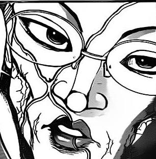
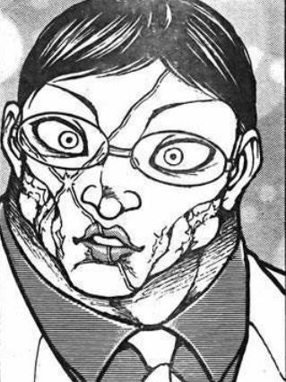
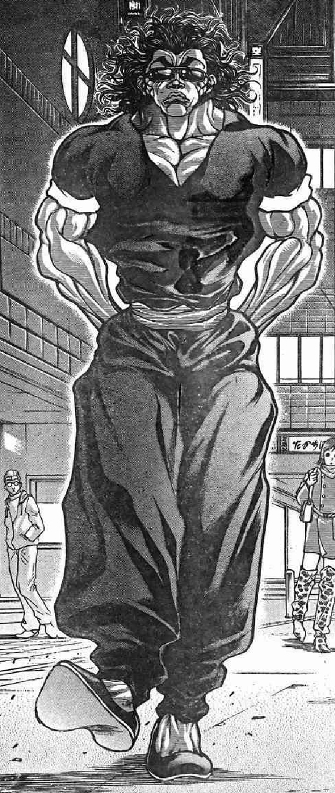
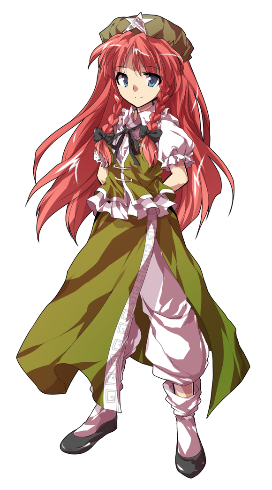
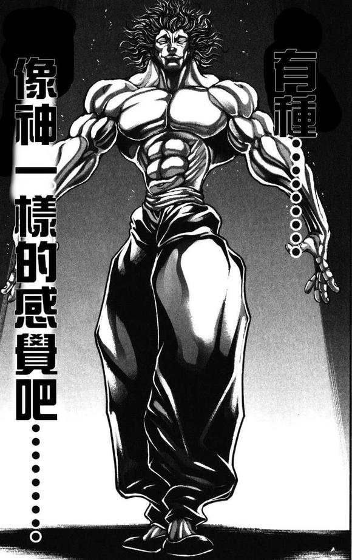
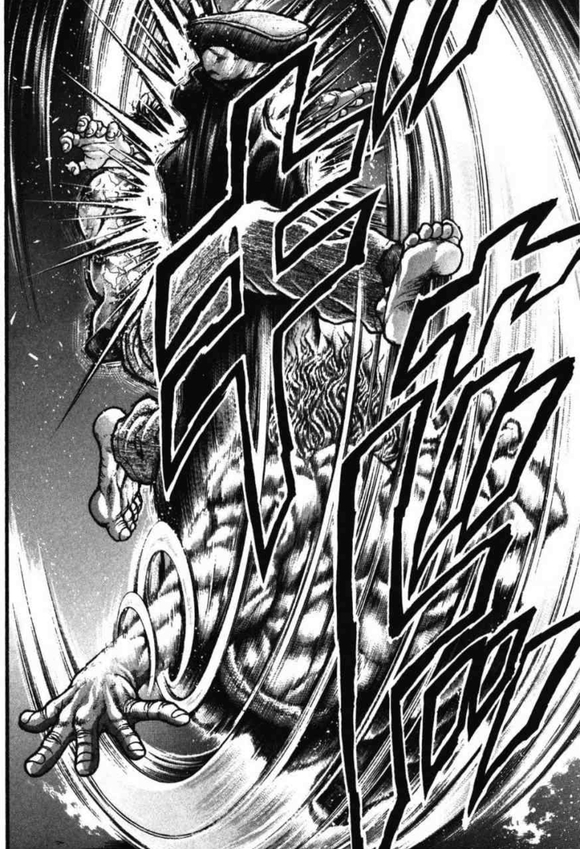
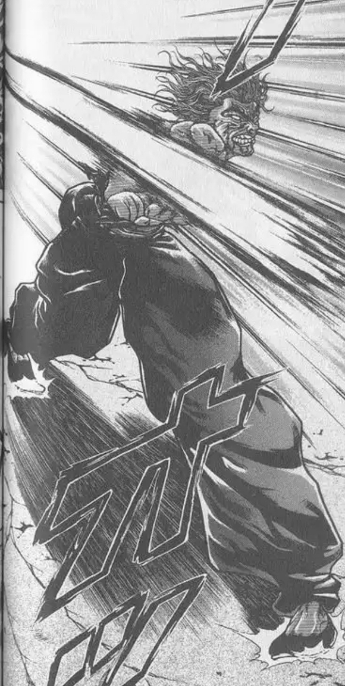
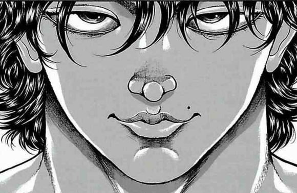
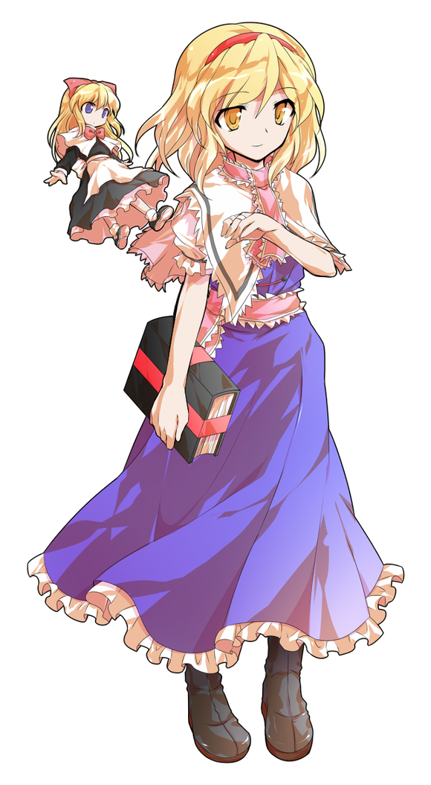
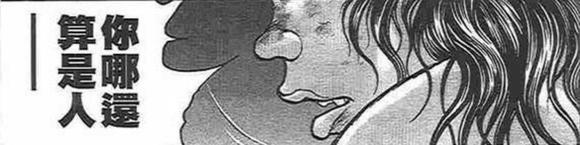

【1d30：26】分钟后，修整完毕的虫妖怪与流氓在医务室中聊起了天

莉格露：疼疼疼疼疼

我真是第一次见到力气这么大的人类

我的手到现在才恢复了点感觉哎

花山：一般而言，骨头会粉碎

但用在你身上却只是暂时性的失去知觉

妖怪真厉害

莉格露：厉害？我吗？

单论肉体强度的话，比我强大的妖怪多了去了

我能有现在的力量主要还是靠烈大哥的教导

不然我连琪露诺那个笨蛋都打不过……

花山对莉格露晃了晃酒瓶子

花山：要来一杯吗？

莉格露的好奇【1d100：57】（30以上尝试）

莉格露的评价【1d100：29】

莉格露：我还真没喝过这种酒哎

稍微尝两口应该不碍事……

噗哇，好辣！

这和我以前喝过的完全不一样嘛！

流氓少见地笑了笑

花山：我喜欢这种酒

可以和我讲讲那个奇妙的地方吗？

上次烈海王说得不多，只知道像童话一样

莉格露的说明【1d100：89】（50以上理解）

常去寺子屋上课的莉格露并不像师傅一样不善言辞

她活灵活现地向花山说明着她眼中的幻想乡

虫妖住在迷途竹林之中，每天起床练武的时候总能看见大清早才收摊的夜雀老板娘

平日上课的地点在三途河边，常见的同学们是猫妖与人鱼，也能看到偶尔来上课的笨蛋冰精和视察情况的天邪鬼

迷途竹林的深处是烈大哥所居住的永远亭，那里住着来自月亮上的外星人和兔子，会卖很有效的药物和奇奇怪怪的装备……

她讲着自己日常的经历，讲着那些稀奇古怪的妖怪，讲着烈大哥干出的那些厉害的事情……

而花山就在一旁静静聆听着虫妖的话语

他最感兴趣的地方是【1d10:7】

1 女性强者

2 烈的故事

3 鬼（为啥啦）

4 女性强者

5 烈的故事

6 贤者（为啥啦）

7 女性强者

8 烈的故事

9 旧地狱（为啥啦）

10 大成功/大失败【1d2：1】

花山：莉格露

你说的那些像电影里一样强的妖怪们

都是女的吗？

莉格露：男妖怪也有很多啊，不过确实有很多厉害的大人物们是女的

这有什么好奇怪的，你不是刚跟我打完架吗？

花山：......你是女的？

花山的震惊【1d70：63+30=93】（没看出来+30）

勇次郎指定的地点是【1d10:1】

1 街头

2 就在德川的院子里

3 地下竞技场（为啥啊）

4 街头

5 就在德川的院子里

6 酒吧（还喝吗）

7 街头

8 就在德川的院子里

9 高级酒店（先吃一顿？）

10 大成功/大失败【1d2：1】

【1d60：32】分钟后

~东京市的街道~

一个男人正在道路的中央走着

他有着一头赤色的短发与黝黑的皮肤，身上的肌肉高高隆起，面上的五官略显狰狞

他身穿黑色的功夫装，脚踩深色布鞋，脸上架着一副黑色的墨镜

男人那凶恶的眼神被阻挡在墨镜之后了

这对一旁的路人来说是件幸事

这让他们还能分出精神悄悄看着这位传说中的【父亲】

而不是在他那可怕的凶煞与存在感面前恐惧得瑟瑟发抖

自我介绍或是名片……

这个男人不需要这样的东西

他的强大只要看上一眼就能明白

他的大名在那场战斗后早已威名远扬

他是地上最强的生物，范马勇次郎！

就在这时，一位女子从他的正前方走了过来

她外表看上去像是身材高挑的青春少女，留有一头及腰的红色长发，在两鬓的位置各编有一条麻花辫

她身穿样式古旧的墨绿色华人服与裙褂，头戴同色的帽子，其上有刻有“龍”字的五角星

若论打扮之怪异，她与前方的男子应说是相差仿佛吧……

但二者的气质却截然不同

强大、威能、压迫感……

在她身上感受不到这些东西

她脸上总带着温和的笑，身上隐约透露出一股骨子里的慵懒，看上去绝非什么强者或是高手

少女背着手走到了男人的面前

红美铃：你好啊

请问你就是地上最强的男人吗？

勇次郎的察觉【1d50：7+50=57】（75以上察觉种族，地上最强+50）

地上最强的男人打量着面前的少女

他那穿透一切的眼睛此刻却看不出对方身上哪怕一丝一毫的【弱点】！

范马勇次郎勾起了嘴角

勇次郎：你是强者

天生的强者

既然如此……为何还要去，研习技术？

说起来红美铃习武的原因是【1d10:3】

1 因为热爱武术

2 为了更好地战斗

3 为了交朋友（为啥啊）

4 因为热爱武术

5 为了更好地战斗

6 因为无聊（哈啊？）

7 因为热爱武术

8 为了更好地战斗

9 打着打着就会了（为啥啊）

10 大成功/大失败【1d2：2】

红美铃苦恼地捏着下巴

红美铃：那可真是相当久之前的事情了

真要说原因，是为了交朋友吧

勇次郎：朋友？

红美铃：那时我又没工作，又打不过强大的家伙们，日子过得相当无聊

某天看到一群人凑在一起，很是开心的交流起了拳脚功夫

我想着“我也想找人聊聊天啊~”就混进去和大家一块学了学，没想到这还挺有意思的

学完了就打，打完了接着学，一路上认识了不少朋友，一路上也变得比之前强了许多

最终回过神来的时候，我已经在大擂台赛上拿了冠军啦！

女子回想着往事，畅快地笑了起来

勇次郎的纯度评价【1d100：28】

勇次郎：纯度太低了

为了追求强而战斗，为了复仇而战斗，为了功名利禄而战斗……

你和这些人都不一样

你的出发点居然只是荒谬的“想交朋友”！

红美铃：但我很开心

如果没有武术，我无论如何也无法认识老郭他们几个

如果没有武术，我也得不到现在这份好工作

如果没有武术——我可连你，都打不过呢！

勇次郎：嚣张的口气，和那个狡猾的老头子如出一辙！

红美铃：大家这么多年朋友了，有点相像也在所难免

天也聊得差不多了，开始吗？

德川府的工作人员悄悄驱散了周围的行人

两位强者得以在大街上拥有充足的战斗空间

旁观者们远远的站在了街道的另一端，等待着这场马上就要开始的激烈冲突

勇次郎抬手弹飞了自己脸上的墨镜

他将手牢牢握紧

那可怕的力量就像要破体而出一般，将他臂上的肌肉撑成了可怖的块状！

勇次郎：姓范马

名勇次郎

称号是，地上最强！

红美铃：太极拳，红海皇

请指教！

战斗！

BGM：上海红茶馆　～ ChineseTea

（由于身在外界，红美铃选择性使用了招式）

红美铃

Atk 225（100）

Hp 18

技能

红 海 皇：超越海王，即为海皇，AtkX2.25，Hp+3。面对所有技能可以进行【1d100】的破解判定，75以上成功

消力：习自烈海王的技巧，普通攻击造成的伤害/2（对Atk240以上的对手与拥有特殊技巧的对手无效）

攻消力（CT3）：（近战系）以消力技巧对对手造成巨大伤害，本回合Atk+60，造成伤害+2

彩华【虹色太极拳】（CT4）：（技巧系）发出如波纹一般在地面缓慢扩散流动的气波，由此长时间限制住对手行动。3T内对手Atk-40，本回合对手需进行一次【1d100】的束缚判定，低于30陷入束缚

三华【崩山彩极炮】（CT5）：（近战系）给予敌人强烈的三击，造成必中的【2+3d2】的伤害

武之巅峰:（CT5）：Atk+60，3T内可对所有攻击进行【1d100】的破解判定，技能30以上成功，必杀技75以上成功

必杀技

炽击【大鹏坠击拳】（CT6）：以气护身后集中浑身之力向对手发出全力一击。Atk+600，给予伤害X4，可与对手同时进行攻击。

范马勇次郎

Atk：225

Hp：20

技能

地上最强生物：他的名字叫范马勇次郎。不会陷入异常状态，不会受到驻足、束缚等判定影响，所有减少近战伤害的技巧对其无效，普通攻击所造成的伤害+2。面对所有技能可以进行【1d100】的破解判定，50以上成功。

拔拳（CT1）：（近战系）一场战斗中只会发动一次，于0.5秒前击出的超快速拳击。本回合战斗自动成功。

强者的结晶（CT3）：（近战系）想象力的巅峰，无法模仿的绝技，范马勇次郎象形拳！Atk+70，给予伤害+3

范马之血（CT4）：（自身加持系）于战斗中所激活的范马之血。一场战斗中只想发动一次，习得并使用对手所使用的上一个近战系/技巧系技能，但对此技能的破解判定所需成功值-15。

礼服（CT5）：（近战系）将人体作为武器攻击周围的一切事物，对对手造成【3d3】点伤害。

必杀技

鬼之背（CT5）：无法回避/破解/防御，那可怕的鬼浮现于他的身后，这个男人认真起来了。4T内Atk+80，给予伤害X2。可对所有攻击进行【1d100】的破解判定，技能40以上成功，必杀技65以上成功。

鬼哭神嚎 弑神一击（CT6）：此为终极的暴力。Atk+575，给予伤害X3。

T1

拔拳发动

人的意识传达到身体之前，有着所谓0.5秒的空隙

这半秒之内的人相当于毫无防御，只要能够几种便可确定胜利

但是，在0.5秒内出拳，出击，击打对手

这种事情能做到吗？

范马勇次郎做得到

只是刹那间的功夫，旁观的德川甚至还没来得及举起望远镜——

勇次郎的拳头就已经从裤兜中拔出，并砸向了眼前的武者！

红美铃的破解【1d100：95】成功

“啪”

把握住了

同样是在0.5秒之内

勇次郎的拳头被红发的武者握在了手心

红美铃：0.5秒的间隙，意识的扳机，所谓的先之先啊

要来玩谁先扣动扳机的游戏吗？

我倒是无所谓哦

被握住拳头的男人，此刻却露出了狂暴的笑容

勇次郎：有趣

被正面挡下了攻击

这是有多久没发生过的事情了？

扣动扳机的游戏对这二人而言已经毫无意义

纯粹力量的比较才是强者的证明！

武术家与强者同时向前方击出了拳头

红美铃的攻击【225+1d100：1=226】

勇次郎的攻击【225+1d100：70=295】

红美铃的受伤【1d10：5】

1 回避

2 小伤害+2

3 小伤害+2

4 中伤害+2

5 中伤害+2

6 大伤害+2

7 大伤害+2

8 特大伤害+2

9 特大伤害+2

10 大成功/大失败【1d2：1】

Hp：18-2-2=14

毫无意外，不使用技巧的武术家在力量的比拼中落入了全面的下风

她的身躯如炮弹般砸碎了街旁商店的玻璃橱窗

红美铃满不在乎地从玻璃渣中爬起身来

红美铃：好强的臂力，不愧是地上最强

果然，消力已经被你所破解了

勇次郎：无论什么样的技巧

在我面前都毫无意义！

T2

红美铃的攻击【225+1d100：91=316】

勇次郎的攻击【225+1d100：41=266】

勇次郎的受伤【1d10：9】

1 回避

2 小伤害

3 小伤害

4 中伤害

5 中伤害

6 大伤害

7 大伤害

8 特大伤害

9 特大伤害

10 大成功/大失败【1d2：1】

Hp：20-4=16

红美铃：来而不往非礼也

刚刚收到的礼物，就在现在还给你！

红发的门番闪身贴近了范马的身躯

她那细小的手腕轻轻靠在了勇次郎的腹肌之前

红美铃握拳，发力

武者体内的气劲于腕间骤然爆发，上回合的景象再次重演

只是这次被砸进路边的人，是范马勇次郎！

莉格露：一模一样的反击

花山：连飞过的距离都一模一样！

范马勇次郎从被砸烂的商店中跳了出来

红美铃：这招名叫红寸劲

感觉如何？

勇次郎：将气的压缩与爆发用于寸拳中

威力尚可，思路清奇

只不过，还不够【强】！

T3

范马勇次郎将双臂高高举起

他猛然将双手分开，用力劈下，那隐藏在其身躯内部的庞然伟力就化作了无形的气浪

满地的碎屑被这一个动作所轻易击飞，连旁观的人们都感受到了那可怖的力量！

勇次郎：看好了，这才是【强】！

所谓的战斗，就是力量的释放！

除了力量以外的一切

奥义、秘传、秘技......

统统都是不 纯 物！

红美铃举起了拳头

地上最强熟悉这个架势

他见过这招

那是郭海皇的得意技巧，应用于攻击的消力之拳

红美铃：技术是强！肉体是强！

为了打架而打架才是纯度高！为了变强而打架才是纯度高！

老郭和烈大概会一本正经地和你讨论讨论这些玩意

红美铃：不过对于我而言——

只要打得痛快，哪有什么所谓！

强者的结晶发动

攻消力发动

红美铃的破解【1d100:8】失败

勇次郎的破解【1d100:47】失败

红美铃的攻击【225+60+1d100：36=321】

勇次郎的攻击【225+70+1d100：77=372】

红美铃的受伤【1d10：2】

1 回避

2 小伤害+3+2

3 小伤害+3+2

4 中伤害+3+2

5 中伤害+3+2

6 大伤害+3+2

7 大伤害+3+2

8 特大伤害+3+2

9 特大伤害+3+2

10 大成功/大失败【1d2：2】

Hp：14-1-3-2=8

已经见过一次的攻击，对这个男人没有任何意义

红美铃的消力拳被其稍一偏头就轻易躲过

范马勇次郎将腿高高抬起，而后重劈而下——

武术家像钉子一样被砸入了地面之中！

红魔馆的门番双手撑地蹦了出来，并随手抹去了嘴角流下的鲜血

红美铃：我的天，真厉害

名不虚传啊，范马勇次郎！

地上最强的男人闻言居然笑了起来

勇次郎：我要收回之前的话语

真是走眼了

你这不是相当的……相当的……

享受着争斗吗！

T4

红美铃：与强敌战斗，无论什么时候都是件开心的事啊

接招 彩华【虹色太极拳】！

七彩的气劲自武者的身侧流出

至柔的劲力缠向了勇次郎的双脚

勇次郎的破解【1d100:98】成功

但这个男人不会在意这种弱者的技巧

他像开场的时候一样紧握右拳，而后向着地面发出了沉重的一击！

以范马勇次郎的拳头为中心，整条街道的路面被打出了一个巨大的深坑

红美铃所发出的太极气劲被这终极的暴力所轻易击碎了！

范马之血发动

勇次郎：太极拳，以柔克刚的技巧

学习它需要多少年？

造就它又需要多少年？

睁大眼睛看好咯……不可思议的事情要发生啦！

地上最强的男人与数秒前的少女做出了相同的动作

范马勇次郎以自身那堪称巅峰的天资重现了武者的绝技！

红美铃的破解【1d100：64】成功（成功值75-15=60）

无形的气劲带着不同的颜色在空中相撞，而后相互泯灭

理所当然的，门番不会被自己的招式所伤

红美铃：哎呀呀……就算是烈学东西也没这么快

不过，看样子你不打算接着用？

勇次郎：我有我的方法

这个，就是我范马勇次郎的流派！

T5

范马勇次郎向两侧高高举起了双手

他背后的肌肉如骇人恶兽一般扭动着，膨胀着，最终化为了一副堪称恶鬼的恐怖图样

这就是地上最强真正的姿态！

红美铃：鬼，倒还真挺像

那就试试你是否有鬼般的体格吧！

接招 三华【崩山彩极炮】！

勇次郎的破解【1d100:34】失败

勇次郎的受伤【2+3d2:5=7】

Hp：12-7=5

红美铃那力可崩山的三连击完全命中了范马勇次郎

但他本来就没有任何躲闪的意图

勇次郎：红海皇

我有个很想让你见识一下的招式

给我做好……护身准备吧！

礼服发动

范马突然一把抓住了武术家的手臂

他鼓动着浑身上下所有的肌肉，将敌人如同双节棍一般在自己的身躯旁上下舞动着

仿佛自己的身后出现了一层赤红色的礼服——

勇次郎逐渐熟悉了新武器的手感

他环顾了一圈，发现四周并无方便的车辆

于是范马勇次郎索性将手中的人体双节棍砸向了脚下的大地！

武之巅峰发动

红美铃的破解【1d100：72】成功

旁观的虫妖怪几乎就要冲上去阻止这可怕的暴行

但随后发生的事情却让她停下了脚步

她看到红发的海皇在空中一拳砸向了脚下的地面

坚不可摧的路面在她的拳下仿佛变成了柔软的豆腐，极为轻松就可将手腕深入其中

借助这自己所打出来的着力点，红美铃在半空中转身一旋，就挣脱了范马的铁腕！

红美铃：真刺激！

要不是我被鬼王轮过，这次怕是也要中招了

这招叫什么？大风车还是旋转木马？

勇次郎无奈地甩了甩手

勇次郎：名字叫做礼服

切，效果比起刃牙那次还差！

下次不用勇一郎的招式了！

红美铃的攻击【225+60+1d100：81=366】

勇次郎的攻击【225+80+1d100：62=367】

两位强者再次挥起了自己的拳头

只是毫厘之差，真的只是极为微小的差距——

率先攻击到对手的，是恶鬼的重击！

红美铃的受伤【1d10：10】

1 回避

2 小伤害X2+2

3 小伤害X2+2

4 中伤害X2+2

5 中伤害X2+2

6 大伤害X2+2

7 大伤害X2+2

8 特大伤害X2+2

9 特大伤害X2+2

10 大成功/大失败【1d2：1】

大成功，红美铃的反击！

红美铃所研习的武术名为太极拳

以柔克刚正是她的拿手好戏

掌中巧劲微微一拨，范马之拳就被迫偏离了原先的轨道

乘胜追击的武术家立刻用出了回旋踢！

勇次郎的受伤【1d10:10】（大成功反击无加成）

1 回避

2 小伤害

3 小伤害

4 中伤害

5 中伤害

6 大伤害

7 大伤害

8 特大伤害

9 特大伤害

10 大成功/大失败【1d2：1】

大成功！勇次郎的反击！（大成功反击无加成）

但是！

但是！

她所面对的男人名叫范马勇次郎！！

战斗已经成为了肉体中本能的反应

面对武者的踢击，地上最强所选择的应对方式是——

用回旋踢还以回旋踢！

莉格露：开什么玩笑？

这么扯淡的事情！这种事情他都可以做得出来吗？！

花山：当然可以

因为他是范马勇次郎

红美铃的受伤【1d10:10】（大成功反击无加成）

1 回避

2 小伤害

3 小伤害

4 中伤害

5 中伤害

6 大伤害

7 大伤害

8 特大伤害

9 特大伤害

10 大成功/大失败【1d2：1】

大成功！红美铃再一次反击！

转瞬之间，战局出现了第三次的反转

意识到对手之难缠的武术家立刻改变了策略

红美铃借助对手的力量在空中进行了一次小小的回旋——

这不能让她远离面前凶暴的对手，却足以让她改变攻击的手段！

红魔馆的门番以膝盖顶向了勇次郎的踢击！

勇次郎的受伤【1d10:2】（大成功反击无加成）

1 回避

2 小伤害

3 小伤害

4 中伤害

5 中伤害

6 大伤害

7 大伤害

8 特大伤害

9 特大伤害

10 大成功/大失败【1d2：1】

Hp：5-1=4

在旁观者们那不敢置信的目光中，这瞬间的攻防终于结束

红发的海皇在最后以十分微弱的优势略胜一筹

但地上最强的生物并不生气

他十分愉快的，非常开怀的，露出了那可怖却又发自内心的笑容

勇次郎：哈哈哈哈哈哈哈！

哈哈哈哈哈哈哈哈哈哈！

就连刃牙都做不到这一步！

红美铃：打得很开心啊，小子

勇次郎：我总不能天天和儿子打架！

但其他人呢？！

直接退隐的郭海皇，不知道跑去哪里的原始人，半途而废的宫本武藏，无趣而悲哀的本部……

大相扑干脆就是一群肥猪！

哈哈哈哈哈哈！失望过如此多次之后，生活又一次变得有趣起来了！

红美铃：彼此彼此

我也许久没打过这般酣畅的战斗了！

T6

勇次郎：可惜

森罗万象，诸行无常

短暂的快乐时光要结束了

红美铃：人没多大岁数，口气倒是不小

你在惹人生气这方面比烈还要厉害，莫非这是现在的风气？

勇次郎并未理会武术家的嘲讽

他背部的肌肉在此刻扭曲到了极限

就像是恶鬼在嚎哭

勇次郎：接不住的话，就会死的

红发的武术家摆出了上午时所用过的姿势

她的双臂自然地向着前后伸展

远远望去，如同展翅的大鹏

红海皇：能接住这招就算你赢！

——大鹏坠击拳！

强者的结晶发动

攻消力发动

红美铃的破解 强者结晶【1d100：78】成功

弑神一击【1d100：3】失败

勇次郎的破解 攻消力【1d100:86】成功

大鹏坠击拳【1d100：19】失败

红美铃的攻击【225+600+50+1d100:21=896】

勇次郎的攻击【225+575+80+1d100:48=928】

弑杀神明的一击命中了红发的武术家

整条街道的玻璃尽数被拳风震成了粉碎

击打肉体的声响传到了百里开外的路人耳中

强者们的角力甚至让大地都为之震撼——

旁观者们甚至不得不抱紧了身旁的大树，才可勉强维持站姿！

红美铃的受伤【1d10：5】

1 回避

2 小伤害X3X2+2

3 小伤害X3X2+2

4 中伤害X3X2+2

5 中伤害X3X2+2

6 大伤害X3X2+2

7 大伤害X3X2+2

8 特大伤害X3X2+2

9 特大伤害X3X2+2

10 大成功/大失败【1d2：1】

Hp：8-2X2X3-2=0

德川：已经结束了！快叫救护车——

老者宣告了比赛的终结

但虫妖却想起了今天上午时的某些细节

莉格露：（那个时候似乎也是相同的场景

红海皇从正面硬接了一击不可能承受的撞击，但她随后立刻进行了反击

那是如何做到的？

有点像独步大叔的菩萨拳……好像又不大一样……)

虫妖回想着门番上午时的动作

她的眼睛突然亮了起来

莉格露：我明白了，是霸体术！

将气力集中于受创的区域，即使遭受重击也仍可继续行动

红海皇上午打飞那力士时用的就是这份技巧

这样一来……

就是武术胜利了！！

红美铃：霸！

理应在弑神一击下失去意识的红美铃依靠护体之气力强行进行了反击

击坠大鹏的重拳笔直地砸进了勇次郎的躯体之内

数秒前的震撼冲击于此刻再次爆发！

勇次郎的受伤【1d10：3】

1 回避

2 小伤害X4

3 小伤害X4

4 中伤害X4

5 中伤害X4

6 大伤害X4

7 大伤害X4

8 特大伤害X4

9 特大伤害X4

10 大成功/大失败【1d2：2】

Hp：4-4=0

天下无敌的范马勇次郎倒下了

风华绝代的红美铃同时倒下了

莉格露：这算是谁的胜利？

是红海皇赢了？还是那个范马大叔赢了？

花山：要看谁先站起来

能够主宰对手性命的人，才算是胜利者

可是，可是

被同时击倒的两人，在【1d20：20】秒之后，却又不分先后的站了起来

德川：这该怎么分辨？

要继续打下去吗？

伤痕累累的两人面对面陷入了沉默

最终，先开口的人是【1d2：2】

1 勇次郎

2 红美铃

红发的武术家摘下了帽子

红美铃：不愧是地上最强，真是相当有魄力的一击

嗨呀，差点就得请病假了……

是你赢了，范马勇次郎

地上最强的男人向他的对手伸出了手

红美铃有些疑惑地歪了下头，然后把手里的帽子递给了他

范马勇次郎以一种十分体贴的，甚至可说是温柔的手法拍了拍帽子上的尘土

他抬手轻轻一抛，那闪烁着五星的帽子又回到了武术家的头上

勇次郎：接下了我的全力仍然可在此处谈笑

是你赢了，红美铃海皇

地上最强的名号，还有之前赢来的范马海皇

就在这里统统交给你吧！

红美铃：我红美铃早就退休再就业咯，中华武林的事我才不管

我又算不上地上最强，拿这名号干嘛？

谁当海皇跟我一看大门的有啥关系？

这些名字就放你那吧

让年轻人们自己去拿！

两个自认失败的强者你看看我，我看看你

最后不知为何，又一次笑了起来

战斗结束

平局 无人胜利！

红发的武术家向着地上最强挥了挥手，便转身走向了等待着她的虫妖

红美铃：架也打完了！正事搞定了！

还剩好多时间，咱们去购物吧！

莉格露：稍等我帮烈大哥发个快递啊……好嘞搞定啦

花山要一起来吗？

花山的脸皮【1d100：68】（50以上去）

花山：可以来我的街道上买东西

老板们一般会给折扣

三人正待出发，矮小的老人家却拦住了他们

德川：你们以后还会来吗？！

莉格露：我不知道哎……我得看师傅的心情

如果运气好的话，以后说不定还有机会？

德川：下次来的时候一定要来找我

我会帮你安排最棒的比赛的！

【1d6：6】个小时后，幻想乡女子二人组终于心满意足的结束了她们的购物

她们从花山身旁接过了小山一般的大包小包，挥手道别之后，就悄悄摘下了自己身上的徽章

武术家们慢慢融入到了人来人往的街头之中，成为了难以注意到的暗淡虚影

花山薰站在繁华的购物街旁，回味着自己今日的经历

花山：——陪女性购物，比打架要累多了

说出了自己最大的感想之后，白衣的流氓无视了身旁路人们好奇的目光，转头走向了花山组的方向……

~永远亭~

莉格露：大哥

我今天和一个叫做花山薰的黑道打了一架，差点就输了

快递我也帮你寄了哦！

烈：你是怎么打的？

莉格露：花山那家伙自傲的要死

我就一拳拳跟他硬拼，最后是我拼赢啦！

烈：好样的，莉格露

快去医务室歇歇，晚上一块吃晚饭吧

虫妖欢呼了一声后就跟着铃仙走进了医务室

烈：红海皇您感觉如何？

红美铃的评价【1d70：60+30=90】（苦战一场+30）

红美铃：非常痛快

那可真是个了不得的人

我一开始以为会是干净利落的胜负，没想到最后居然打平了

我好久没打过这样的架啦！

烈：您高兴的话就真的再好不过了

红美铃敲了敲烈的脑袋

红美铃：少来这套

错过了最好的挑战机会，很遗憾吧？

烈：——是的

非常的遗憾

我不可能对着勇次郎用花弹、巨阙或是天文密葬法

我也不应当凭借现在的肉身去和他比拼力气

红美铃：你呢，就是整天在自寻烦恼

技术有没有进步？

自己活得开不开心？

身边的大家过得都怎么样？

才是你真正需要在乎的东西

烈：为何最后会是平局？

红美铃：我们都用出了自己的全力

同时倒地，同时站起，那可不就是平局？

如果真要说个胜负的话

我最后可真是全靠武术才能打出回击，不然当时我肯定先趴下了

所以说——

烈：哈哈哈

是武术胜利了！

武术家们说着说着就笑了起来

厨房中传来了饭菜的香味

饥肠辘辘的门番与虫妖怪决定蹭顿饭再走

于是，这看上去略微漫长的一天，到此结束

与红美铃进行了一次愉快的交流

红美铃的好感度上升了【1d5：1】点

现在的好感度：80+1=81

红美铃：该说是和老郭像呢？

还是说和我像呢？

嗨呀，反正我们这些习武之人，无论性格如何

心里头那份不服输的本质，总是不会变的！

~第495天结束~

几天后

~白林寺~

郭海皇推开了一间小屋的门

那里面有个站桩画画的老者

郭海皇：多里安

这里有给你的快递

白发老者打开了一个小包裹

那里面是一些小小的糖球

多里安：好吃……

还有吗？

郭海皇：烈给你寄了很多

慢慢吃吧❤

白发的老者舔着比以前好吃很多的小糖球

他脸上露出了开心的笑

（本日的更新结束，下一次的更新在周三或周四，内容为剩下两人的交流回）

（以下是我的废话）

那么本次的烈海王幻想入特别篇之红美铃莉格露幻想出堂堂结束

啊，说起来这次是交流回

......交，交流回？

烈这不是根本没怎么出场吗？！

算了不管了，反正其他的大家都挺开心的就这样吧（悲）

yysy，我一开始是打算把外界格斗家们当做中了战斗选项后的梗选项的

结果开局就来大成功，我寻思这直接全上外界格斗家吧让红海皇开开心心打一场

就结论而言莉格露也开开心心打了一场，不如说大家全都挺high的，那就完事了

大失败看到四股，很合理

粟米那个大成功其实不怎么合理，按理来说应该加的是粟米干掉红海皇的选项而不是红海皇指导粟米的选项

......但我觉得我会写吐所以就委屈一下粟米了

谢谢你，相扑力士

天啊这才是第一个交流回.....剩下还有俩，我的娘嘞

剩下两位应该和尽量避免战斗展开因为这两场我写的真有点累了

其他角色们的表情包全是我今天下午冲刺截的，给勇伯截了很多张结果用上的不多（

顺便到隔壁A12海皇贴子里扒了几张德川的图（

那么今天的更新就到这里结束，下一次的更新大概是周三或周四

内容是交流回下半段，会回归之前的篇幅所以不会很多

骰子明天发

（补一下被吞的楼层）

(莉格露花山战的t7似乎也被吞了 补一下)

大家可能已经发现了，勇伯这张卡其实是一张非常超模乃至于离谱的卡(

其实一开始的时候我是打算车个和红海皇差不多或者略胜一筹的那种卡，但是车着车着就觉得“这可是范马勇次郎啊！”

于是最后出现的就是这个技能组超强但白值一般般的超级怪物勇次郎(

为了抄热气氛其实有很多东西没写，比如说拔拳对atk240以上的需要过判定才能看是否成功啊，天子灵梦那样的减伤天赋没法无视之类的。。

不过管他呢！打的痛快就好啦！

顺便一提，勇伯这卡由于情况特殊是基本上独立于本贴战斗体系外的

因为以他的性格遇见大妖怪们大概压根不会管什么符卡规则而是全力开战。。倒时候基本上就是双重魔炮/绯想天/天文密藏法糊脸的发展

所以把这张卡当做番外篇特供版吧！反正以后基本也没机会出场啦哈哈哈哈哈哈哈哈哈

附上本次的骰子，中间可能被吞了几个但最重要的地方应该都有截到

顺便再次再次强调，本贴的人物卡完全是为了剧情而服务的，我自己瞎掰的东西

就算说一轮一口吃了勇次郎或者勇次郎一口吃了一轮，那我也只能说“您两位嘴真大啊”这种话（悲）

如果真要说本贴内我个人认为的实力定位，那基本是和Atk差不多相同

所以归根到底还是大家听了很多次的那句话——

千万别较真啊（悲）

~彩蛋~

~地上最强的调查~

红美铃一战后的勇次郎首先去干什么了【1d10:3】

1 调查堇子

2 寻找神秘

3 跟儿子们科普常识（为啥啊）

4 调查堇子

5 寻找神秘

6 出东方本（为啥啊）

7 调查堇子

8 寻找神秘

9 锻炼（真的假的）

10 大成功/大失败【1d2：2】

~高级酒店~

刃牙和杰克正疑惑地看着桌前身穿正装的男人

杰克：这是你第一次请我吃饭……

刃牙：爸爸

突然叫我和杰克哥出来吃饭是？

勇次郎：我今天要教会你们一些在这社会上生存所必须的【常识】

给我听好了

儿子们不约而同地咽了口口水

勇次郎：神、妖怪和超能力者都是存在的

世界上存在很多不得了的女性强者

月亮上住着名为月之民的外星人

在几年前消失的守矢神社供奉有货真价实的神

圣德太子是擅长格斗的美少女道士！

刃牙的相信【1d100：84】（50以上相信）

杰克的相信【1d100：89】（50以上相信）

杰克：听起来真是不可思议

但范马勇次郎是不会骗人的

刃牙：那一天的确感受到了超乎想象的存在感

我也曾听大家提过几句相似的故事……

地上最强竖起了手指头

勇次郎：这座城市里有一位超能力者

姓名不知道！外貌长相也统统不知道！只知道似乎是个女高中生！

来找找她在哪吧！

渴望着战斗的儿子们在勇次郎的监督下彬彬有礼地享用了晚餐

而后，三人走出了酒店，开始了寻找堇子的游戏

堇子的隐藏【1d100：39】

刃牙的调查【1d100：16】

杰克的调查【1d100：24】

勇次郎的调查【1d100：96大成功】

那么唯一发现堇子的人是勇次郎

草草草，勇次郎调查大成功

大成功是什么【1d10:8】

1 相当愉快的打赢了堇子

2 1+和堇子成了朋友

3 遇到了出门的贤者（为啥啊）

4 相当愉快的打赢了堇子

5 4+和堇子成了朋友

6 勇次郎月之都行（哈啊啊啊？！）

7 相当愉快的打赢了堇子

8 7+和堇子成了朋友

9 勇次郎地狱行（你怎么跑过去的？！）

10 大成功/大失败【1d2：1】

~某天深夜~

~东深见高中附近的公园~

身穿校服的女高中生满脸厌恶的望着公园的入口

堇子：没想到这个时代还有跟踪狂

如果再这么纠缠下去，会发生什么事情我可不管哦！

勇次郎：找~到~了~

看来那个所谓的超能力者就是你吧

堇子：你说什么我听不明白——

等会，你不是辫子大叔召唤过的那个大叔吗？

女高中生上下打量了一番眼前的肌肉男，然后从书包里掏出了斗篷

堇子：啊啊，完全理解了

你也是与众不同的人啊

我的名字叫宇佐见堇子

——大叔，被女高中生打到求饶的话可是很丢人的事情

勇次郎：我是范马勇次郎

如果能够打倒我的话，别说求饶

连饭都可以帮你做哦

念动力发火、短距离内的瞬间移动、飞行……

射出了不知多少打印子弹，扔出了【1d30：21】根钢筋，【1d20:10】根电线杆……

最终，在亲眼看着这个人打烂了【1d10:2】座铁塔之后，手段尽出的宇佐见堇子无奈地认输了

勇次郎：哈哈哈哈哈哈哈！

以前只打过直升机——没想到还真能和在空中的敌人战斗！

堇子：不打了，我认输！

脸接火焰也就算了，子弹没用我能理解，瞬间移动的攻击失效我算你战斗意识强，钢筋砸身上不疼不痒大概是你体格好……

但是靠肉身力量从大楼顶一跳蹦到天上是什么鬼啊？徒手打烂电波塔你还是人吗？念动力轰击你用拳头凭空打碎了？！

范马大叔你是从搞笑漫画里出来的角色吧！

勇次郎：死物怎么可能敌得过久经锻炼的肉体？

和超能力相比，你的身体简直跟个娘——

哦，你确实是女性

堇子：哈啊？！你这肌肉大叔当心我告你X骚扰哦

之后我会把这份屈辱讨回来的，给我等着吧！

女高中生的身影在夜色中消失了

勇次郎：生活又一次变得充满乐趣了

看来这回可以持续很久……

堇子在之后偶尔会与勇次郎战斗

对外界那无聊的世界感到绝望的堇子，破天荒找着了可以交流的对象

在一次次的冲突之中，两人之间居然出现了奇妙的友情

据说在某所高中附近，可以看到地上最强生物与女子高中生和谐的聊天

这诡异的场景成为了新的都市传说……

而这两人的友情，似乎还会和他们之间的战斗一样持续下去

~本次的礼物~

红海皇这次给咲夜小姐买了什么衣服啊？【1d10:5】

1 居然是正经的风衣

2 JK水手服！

3 dio的cosplay服（为啥啊）

4 紧身衣！

5 功夫装！

6 死库水（为啥啊）

7 体操服！

8 旗袍！

9 果然还是要色色的女仆装！（为啥啊）

10 大成功/大失败【1d2：2】

~红魔馆~

红美铃：这次给咲夜小姐带的是潇洒的功夫装~

要穿来试试吗？

咲夜的评价【1d70：52+30=82】（美铃送的+30）

红魔馆的女仆长打量着自己身上的蓝白色武服

咲夜：穿起来感觉很舒适，而且也有暗兜可以放小刀

居然意外的实用……

但为什么看上去和你身上那套那么像啊？

红美铃的话术【1d100：10】（30以下说实话）

红魔馆的门番微笑着举起了大拇指

红美铃：没有什么特别的原因，只是我很想看咲夜小姐穿和我一样的衣服而已！

咲夜的厚脸皮【1d100：22】

银发少女的脸以肉眼可见的速度红了起来

咲夜：——你这一个月的工资都没了！！！

红美铃：为什么啊，为什么明明是得到好评的普通衣服还要扣工资？！

难道说咲夜小姐喜欢的其实是上一次那种色色的衣服——

啊不要扔小刀！冷静一点啊咲夜小姐！！

身穿功夫装的少女们在红魔馆的庭院中开始了日常的追逐打闹

芙兰朵露：姐姐大人，美铃她平时不是很会说话的吗？

蕾米莉亚：有些时候说不说实话效果都差不多的

最终，在承诺认认真真上【1d30：25】天的班之后，敬业的门番保住了本月的薪水

虽说收礼物的时候有点尴尬，但女仆长小姐最终还是留下了它

这套蓝白色的功夫装之后偶尔可以在日常训练时的咲夜小姐身上看到

咲夜：毕竟它穿起来确实很舒服嘛~

（彩蛋环节结束）

~本部老师的车万小讲堂~

本部老师，时隔不知道多久之后再次出场

哎呀……最近沉迷于超实战研究，常去的公园却不知为何被砸烂了

于是失去固有结界的本部老师只能回头更新一下鸽了不知道多久的番外篇了

今天来介绍一下烈上一次的对手 魔法使 爱丽丝·玛格特洛依德吧

七色的人偶使爱丽丝·玛格特洛依德

Bgm：人偶裁判　～玩弄人形的少女/布加勒斯特的人偶师/the Grimoire of Alice

种族：魔法使所属势力：无势力所属

正作初登场于东方妖妖梦是本作的3面Boss

旧作初登场于东方怪绮谈是本作的3面Boss与EX面Boss

爱丽丝·玛格特洛依德是一位能用魔法操控人偶，让它们表现得栩栩如生的技艺精湛的魔法使

她本人有着人偶般的金发和白暂的皮肤，是一位由人类修行而成的魔法使，因此十分理解人类。

爱丽丝对他人冷淡，基本上不拘束于事物，性格上不固执不厌恶，喜欢一个人独处。但和给人的第一印象不同，她同时也会去参加宴会，并在祭典上表演人偶剧。

她平日独居在魔法森林的玛格特洛依德邸，由于喜欢一个人在家制作各种各样的人偶，所以不怎么喜欢出门。

能力

爱丽丝拥有着操控人偶（操纵魔法）程度的能力

这两者并不矛盾，因为她所使用的就是一种让人偶表现得像活着一样的魔法。

这并不是给予人偶生命，而是用魔法线进行远距离操控的困难技巧

人偶并不会违反命令，也不会因此伤害到操纵者

她平时的料理、洗衣、打扫等家事基本上都是由人偶完成的，但由于人偶基本上由她自己操作，因此工作量并没怎么减少

人偶可以完成人类所做的大多数事情，甚至能够通过人偶操控人偶，但唯有制造人偶一事需要爱丽丝亲手完成

在战斗的时候，爱丽丝的对手需要面对她所率领的多个人偶，由于本人操纵人偶时需要全力以赴，因此她个人的行动缓慢且战斗能力较低（在本贴内则变成了会用出刺拳的近战爱好者爱丽丝这种完全相反的情况（笑））

人际关系

与雾雨魔理沙同样有着收集书籍之类的魔法道具的癖好，同样是魔法使和收集家

决定性的差异在于魔理沙是人类而爱丽丝是魔法使，不怎么重要的差异在于魔理沙喜欢用生长在魔法森林里的蘑菇而爱丽丝不喜欢用

两人常常因为收集道具的缘故碰面，关系很不好，可谓水火不容

但是，在东方永夜抄与东方地灵殿的剧情中，两人却一同搭档去解决异变了

爱丽丝本人的说明如下“真有闲情雅兴啊。如果我能高高兴兴赏月，人手足够的话……我绝对不会拉你这种家伙出来的。”

“魔理沙去退治妖怪什么的太滑稽了。”（但同时她自己还跟着）

与帕秋莉·诺雷姬同为魔法使

在东方萃梦想与东方绯想天的剧情中，爱丽丝为了解决异变都前往大图书馆寻求了帕秋莉的帮助（但之后还是开始战斗了）

两人也在东方地灵殿的剧情中同样作为魔理沙的支援者出场（但分属于不同的线路）

是博丽灵梦的老朋友，在东方妖妖梦的剧情中初次登场时自称旧友，而灵梦则表示“谁会和你这种七色魔法笨蛋是旧友”，二人随后斗嘴并开始战斗

冷知识

这是必要的牺牲：爱丽丝的人偶可以自爆，这是她的攻击手段之一，并用来威胁过魔理沙。爱丽丝同时也会用献祭人偶的手法进行攻击。

重视传统：爱丽丝可以通过稻草人偶进行诅咒，这是一种逐渐流失的传统技能。

热情好客：如果在魔法森林中迷路时走到了爱丽丝的家中，则会被她邀请留宿一晚。不过就算住下来，她也会继续研究人偶操控且不多说话，让人觉得很难受并想马上离开这里。

是我是我：新作中的爱丽丝·玛格特洛依德与旧作中的爱丽丝为同一人，但在故事上却【没有任何联系】。爱丽丝因此和东方怪绮谈的六面Boss神绮在二次创作中常常扯上关系（如本贴中的爱丽丝设定为神绮之女），但实际情况如何，到底有没有联系，这些事情除了ZUN外谁也不知道。

精彩的故事：在蓬莱人形　～ Dollsin Pseudo Paradise.这张CD的附带文本中，zun写了一个关于正直者之死的故事。这个故事中的角色很容易让人联想到爱丽丝，但这并不是东方的官方剧情，而只是zun过去所写的短篇随笔。（本贴将故事的一部分内容当做了爱丽丝的诅咒咏唱词，这也只是我的个人爱好而已（笑））

Open the book：爱丽丝手中有本绑着封带的魔法书，打开书本后力量暴涨/变回旧作EX面爱丽丝都是常见的二次设定，但这本书实际是什么情况却谁也不知道。

威震天：由于名字太长常常被人记错，因此在爱好者中有了爱丽丝·威震天之类的别名。

那么本部老师该去清理公园了，久违的小课堂结束

爱丽丝是一位出场剧情与相关设定都非常多的角色，这里只列出了我觉得重要的部分，如果想要深入了解还是建议去thbwiki观看人物界面

下一次更新这个番外篇是什么时候呢……答案是我不知道（笑）

（补一下被吞的红勇战T4后半段）

男人狂笑着握紧了拳头

技巧的冲突已经结束，战斗又回到了原始的暴力之中！

红美铃的攻击【225+1d100：51=276】

勇次郎的攻击【225+1d100：3=228】

勇次郎的受伤【1d10：8】

1 回避

2 小伤害

3 小伤害

4 中伤害

5 中伤害

6 大伤害

7 大伤害

8 特大伤害

9 特大伤害

10 大成功/大失败【1d2：2】

Hp：16-4=12

红发的武术家一脚踢在了勇次郎的太阳穴旁

红美铃：哈，不就是纯粹的暴力吗

你这流派我也会啊！

旁观者们不禁吞了口吐沫

莉格露：他们看上去好像很开心？

花山：很少有人能和他打到这个地步

——勇次郎先生要拿出全力了

大概今晚八点左右更新

内容是剩下的两个交流回，本次回归正常篇幅了所以内容会相对少一些(

烈：天邪鬼是说正邪小姐？

具体是怎么回事啊？

具体的事件是【1d10:6】

1 去坑钱的帝反被坑了零花钱

2 被正邪推销了一堆鸡肋产品

3 性别被反转了（真的假的）

4 去坑钱的帝反被坑了零花钱

5 被正邪推销了一堆鸡肋产品

6 性格被反转了（好事）

7 去坑钱的帝反被坑了零花钱

8 被正邪推销了一堆鸡肋产品

9 智商被反转了（怎么做到的）

10 大成功/大失败【1d2：2】

兔妖怪气愤地抬起了头

帝：我只是去辉针城稍微搞了下欺诈而已，那家伙居然就把我的性格反转了

想要说谎的时候内心就有个声音跟我说“要做一个诚实的兔子”

刚想恶作剧就满脑子都是“要温柔和善的对待大家”，刚刚我甚至下意识去帮铃仙搬东西了——

这什么可怕的手段啊！！

烈的情商【1d100：23】（保底20）

烈：这不挺好的吗

我看正邪小姐这次干了件好事啊

皮克：你那还算是人

（从今天开始适应自己的新性格吧，大家一定都会很开心的）

因幡帝的怒气【1d100：60】

小个子的兔妖默默走到了两人跟前，举起拳头敲在了他们的腿上

因幡帝：呜呜呜呜，你们怎么能这么欺负我

人家真的生气了！

格斗家们反射性地捂住了嘴

烈：呕呕呕

我的天，这的确是大问题

皮克：你那还算是人！

（快把帝小姐变回去，我要吐了！）

因幡帝：我的女子力有这么低吗？！

烈：不是女子力的问题，是某种更加严重的——

帝小姐我求求你别用那种闪闪发光的眼神看我，我真的要吐了！

皮克已经跑去一旁的水池边干呕了

