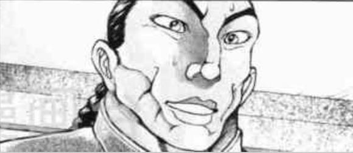
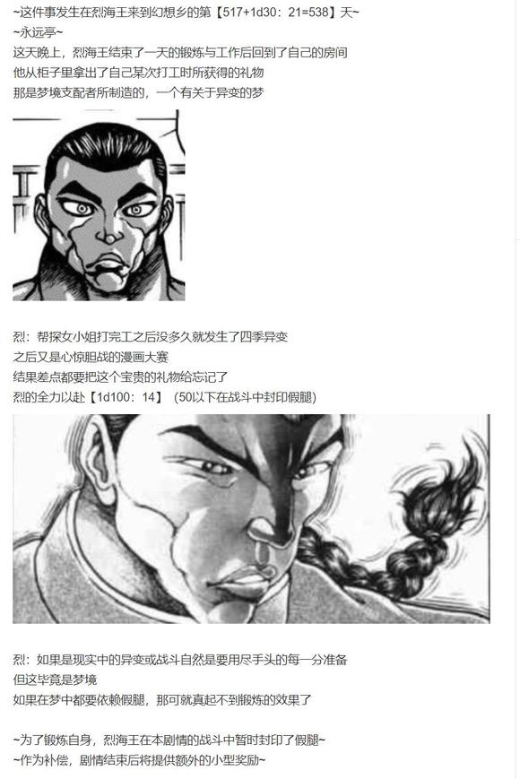

因幡帝：所以说这该怎么办啊

我感觉自己的性格正在慢慢固化，在这样下去就真要变成好孩子因幡帝了

两人的建议是【1d10:5】

1 直接去拜托正邪吧

2 恶作剧复建疗法

3 去看医生吧（为啥啊）

4 直接去拜托正邪吧

5 恶作剧复建疗法

6 这里就靠你的幸运（能做到吗）

7 直接去拜托正邪吧

8 恶作剧复建疗法

9 适应性疗法（这啥啊）

10 大成功/大失败【1d2：1】

皮克：嗷嗷嗷嗷嗷嗷啊

（帝小姐之前的日常爱好之一就是恶作剧）

（让她体验一次成功的恶作剧说不定就能找回之前的感觉了）

因幡帝：这么过分的事情不太好吧……

烈：帝小姐的症状已经进入晚期了，必须速战速决

就先这么死马当做活马医疗吧

恶作剧的对象是【1d10:9】

1 烈：我来！

2 铃仙前辈

3 皮克（有用吗）

4 烈：我来！

5 铃仙前辈

6 辉夜（认真的吗）

7 烈：我来！

8 铃仙前辈

9 师匠（不要命啦？）

10 大成功/大失败【1d2：1】

烈：既然是刺激性疗法，那当然是刺激越大越好

这次特殊恶作剧的目标就定为师匠！

因幡帝：不要啊！！师匠绝对会生气的！！！

皮克：嗷嗷嗷哦啊哦啊啊

（反正是烈出的馊主意，到时候出事了他负责背黑锅）

烈：不过我还真不懂该怎么做恶作剧

是要做出之前铃仙前辈中的那种兔陷阱吗？

帝小姐，如果是以前的你会怎么做？

帝的思路【1d10:1】

1 稳妥的兔陷阱

2 冒充他人

3 是我是我欺诈（为啥啊）

4 稳妥的兔陷阱

5 冒充他人

6 古董欺诈（哪来的）

7 稳妥的兔陷阱

8 冒充他人

9 碰瓷（哈啊？）

10 大成功/大失败【1d2：1】

帝：如果是以前的我要坑师匠的话……

电话欺诈这些小手段对她没用，冒充他人身份的话术也会被一眼看穿

实际成功率最高的应该还是物理意义上的兔陷阱！

不管是创造落穴陷阱还是把她引入危险区域都是有可能做到的办法，甚至特意引来其他人也不是不行——

兔妖怪刚刚说到一半就停了下来

帝：天啊

我怎么会有这样邪恶的念头，这实在是太过分了

要赶紧去找师匠道歉才行！

烈：很有效果，刚刚普通的帝小姐已经出来了

这样下去的话说不定能行！

皮克的勇气【1d100：13】（50以上参与）

皮克：嗷嗷嗷嗷嗷啊……

（你俩打算对师匠用这种物理性质的陷阱吗......）

（我还没追到小铃小姐，我不想毫无意义的死在这里……你们加油吧……）

原始人默默退出了计划

烈：但是这事很麻烦

我不觉得传统的落穴陷阱对师匠会有用

帝：因此就需要诱饵

我需要一个能让师匠心甘情愿上钩——

不行了说不下去了，内疚感，内疚感好强！

烈：坚持住啊，帝小姐

不要输给自己的善良！

两人的馊主意是【1d10:9】

1 烈：这里就靠我的口才！

2 把陷阱设置在医务室内

3 拜托铃仙前辈吧（你们还要拉人下水啊）

4 烈：这里就靠我的口才！

5 把陷阱设置在医务室内

6 拜托辉夜小姐吧（为啥啊）

7 烈：这里就靠我的口才！

8 把陷阱设置在医务室内

9 The World！（要怎么做啊）

10 大成功/大失败【1d2：1】

烈：我想不到什么能让师匠去踩陷阱的诱饵

那我就干脆用假腿把她搬到陷阱里去

有我垫在下面永琳也不会受伤——真是完美的计划！

帝：怎么会

为了这样的我，你要牺牲自己吗

呜呜呜呜呜呜，我好感动

旁观的原始人发出了明显的呕吐声

皮克：嗷嗷嗷嗷嗷啊

（我先撤了，再看下去今天这饭都没法吃了）

【1d30：1】分钟后，烈与因幡帝完成了简易的兔陷阱

兔陷阱的质量【1d100：62】（75以上有特别惊喜）

因幡帝：这是我之前特意帮铃仙准备的新恶作剧

普通的竹枪对于现在的她来讲没什么威胁了，因此我把里面改装成了对大型猛兽用的**陷阱

一旦落入其中就会立刻触发高强度**电流，此后是自上方落下的捕获用烟雾弹，以及月球合金网，当铃仙彻底失去行动能力后

烈：就怎么样？

因幡帝：就在里面播放鬼王的歌声顺便拍照

不过这种陷阱真的太过分了，这会伤害到无辜的铃仙的

我刚刚已经把播放器拆下来了，接下来要去除的就是底下的陷阱机关——

烈：那不就成单纯的大坑了吗？！

这样就足够了，除了勇仪的歌以外其他的陷阱我都有信心扛下来

呼……我出发了！

因幡帝：谢谢你，好心而勇敢的烈海王

正前往医务室的烈海王一个酿跄，差点摔倒在地上

【1d10：2】分钟后

烈海王走到了师匠的医务室前

这大概是他近期所面临的最大挑战

要把八意永琳搬运到陷阱之内……

能做得到的吗？永琳会生气吗？说到底假腿对她能起效吗？

这些都不是需要考虑的问题——

因为如果再不做点事情，因幡帝就要彻底变成好孩子了！

烈：【The World】

时间停止吧！

烈海王冲进了医务室中，在静止的时间内一把抱起了月之头脑！

永琳的震惊【1d100：97大成功】（50以上暂时不反抗）

草，这里震惊大成功是什么【1d10：8】

1 过于震惊的永琳瞬间理解烈的计划

2 过于震惊的永琳亲了上去

3 过于震惊的月之头脑学会了时间停止（为啥啊）

4 过于震惊的永琳瞬间理解烈的计划

5 过于震惊的永琳亲了上去

6 过于震惊的永琳用出了天网捕蝶法（为啥啊）

7 过于震惊的永琳瞬间理解烈的计划

8 过于震惊的永琳亲了上去

9 过于震惊的永琳把烈带回了寝室（为啥啊）

10 大成功/大失败【1d2：1】

永琳：哎哎哎哎哎哎哎？！

突然这么粗暴？！

而且还特意用了时间停止？！

月之头脑被恋人唐突的举动所深深震惊了

由于脑中一片空白加上烈的举动实在是过于具有误解性——

永琳此刻的第一反应居然是，恋爱！

永琳：（原来如此，最近压力实在是太大了，想要寻求安慰又实在不好意思在我面前开口，于是就用了这种方法吗）

永琳：（真是的，都这么久了还是这样……）

银发的女子顺势搂过了恋人的脖子

她闭上了自己的双眼，而后将脸轻轻凑了过去

在静止的时间中，唇与唇相接

数秒之后，当假腿的效果消失时

恋人们才终于结束了这个吻

烈：不是，永琳，我

永琳：想kiss的话就算不用这种办法也没问题哦......

烈的口才【1d100：15】

非常想打车轮拳但是由于公主抱着恋人而做不到的武术家凭空嚎叫了起来

烈：哦哦哦哦哦哦哦哦哦！

永琳：这个叫声是......“其实是想带我去竹林里所以才特意用了能力”

为什么啊？

打完拳的武术家与怀中的月之贤者面对着面

医务室中陷入了尴尬的沉默

两人要做什么【1d10:2】

1 这里就靠我烈海王的情商

2 这里就靠永琳的智慧

3 约……约会吧！（救救帝啊）

4 这里就靠我烈海王的情商

5 这里就靠永琳的智慧

6 说……说实话吧！（你想啥啊）

7 这里就靠我烈海王的情商

8 这里就靠永琳的智慧

9 就……就这样继续吧（为啥啊？！）

10 大成功/大失败【1d2：1】

永琳的智慧【1d50：6+50=56】（60以上想明白大概情况，75以上完全理解）

月之头脑迷惑地歪了歪头

永琳：？？？？？？？

所以到底是怎么回事呢？

明明刚才那么大胆的，结果现在却这么害羞？

永远亭众人缓缓看向了不再挣扎的因幡帝

帝：……刚刚那一声，是师匠叫的？

辉夜：的确是

我还录像了

拍到了相当珍贵的景象呢~

帝：好……好爽啊！

这简直是我有史以来恶作剧的巅峰！

居然真的可以，居然真的可以吓到那个八意永琳！

呀呼！！！！

兔妖怪在地上激动万分的蹦了起来

皮克：你那还算是人

（普通的帝小姐终于又回来了）

【1d10：1】分钟后，被电成爆炸头的烈海王背着师匠跳了出来

烈：哦哦，这个表情

看样子这一次的治疗效果很好啊

帝：太棒了！

简直让我找回了最开始恶作剧成功时的那种发自内心的欢愉感

我感觉现在浑身上下都充满了动力！

师匠微笑着抓住了因幡帝的头

师匠：而我觉得呢

你需要久违的被教育一下

帝：稍等一下师匠

你自己中了这种陷阱都害怕我觉得不是我的问题——

啊啊啊啊师匠放手啊头骨要碎了啊啊啊啊

铃仙：你活该！哈哈哈哈哈哈！

月之头脑单手提起了兔妖怪，开始了难得一见的全力说教

其余的大家有说有笑地看着终于恢复原样的因幡帝

一时间，永远亭中充满了快活的气息

~师匠的说教持续了【1d4：4】个小时~

因幡帝：呜啊，总算结束了

这次真是多谢你了，烈海王

烈：咳咳，毕竟是帝小姐难得一次的请求

说服师匠中一次陷阱这种小事，并不是我烈海王做不到的事情

帝：哇你这个小心眼的家伙，居然还记得那次的事情？！

烈：如果没有当初那个恶作剧，我很可能到现在都没遇到幽香呢

这一次居然也发生了难得的好事

不愧是带来幸运的白兔啊

帝：哼哼哼，这可是我的招牌能力

下一次要不要考虑靠赠与好运去赚钱呢~

武术家与兔妖怪有说有笑的走入了永远亭中

顺便一提，一直等待着兔妖上门求情的正邪直到【1d30：19】天之后才发现自己的反转已经被解除了

不过，这就是后话了

~第510天结束~

与因幡帝进行了一次愉快的交流

因幡帝的好感度上升了【1d5：3】点

现在的好感度为81+3=84点

帝：虽然方法有点奇怪，但果然他在重要的事情上还是一如既往的靠谱

以后恶作剧的时候想个办法找烈海王一起帮忙吧~

最后一位 东风谷早苗

~这件事情发生在烈海王来到幻想乡的第【491+1d30：8=499】天~

具体的事件是【1d10:5】

1 去妖怪之山坐索道吧！

2 守矢神社迷途竹林分社

3 东风谷早苗想开巨大机器人（为啥啊）

4 拜托了，奇迹师早苗！

5 守矢神社迷途竹林分社

6 东风谷早苗想要成为偶像（为啥啊）

7 守矢神社迷途竹林分社

8 拜托了，奇迹师早苗！

9 挑战守矢流综合格斗术！（求求你们别打了）

10 大成功/大失败【1d2：2】

具体的地点是【1d10：6】（2-5迷途竹林，6-9守矢神社，1 10随机）

~守矢神社~

这天上午，烈海王爬上了守矢神社前那长长的参拜道

而发出邀请的绿发巫女，正站在神社的入口处等待着客人的到来

烈：早上好，早苗小姐

不知今日找我来是要做些什么？

如果想要切磋的话，我随时奉陪啊

早苗的笑点【1d70：54+30=84】（地狱t衫+30）

早苗：噗，为什么你会穿着那个变态女神的T衫啊，这是哪门子的惩罚游戏？

对不起我不该笑出声的但这个真的好搞笑啊哈哈哈哈哈！

烈：别提了，这是上次跟赫卡提亚比赛输了之后的惩罚

看样子今天不是来找我打架的啊

守矢神社的风祝端正了一下自身的态度，摆出了一副严肃的神色

早苗：咳咳，今天想要讨论的是关于工作的问题

为了更加有效率的收集信仰，我们守矢神社近期准备再次设立一批分社

其中一个目标是迷途竹林区域的闲散妖怪，也算是永远亭的管辖范围

神奈子大人这次说让我自己来做她先不管了，但我和永远亭的几位算不上太熟……

因此就想拜托你问一下永琳小姐和辉夜小姐的意见

烈的疑惑【1d100：59】

烈：？？？

这种事情你直接去找师匠商量不好吗？

为啥要通过我去问呢？

早苗：如果我直接上门拜访的话会显得很失礼

那会显得像是势力争夺战一样严肃的事情，但其实只是想要收集竹林中闲散妖怪们的信仰而已

就是因为不好直接上门问，所以才会拜托你啊

烈海王要做什么【1d10:1】

1 问问分社的具体地点吧

2 收集信仰的原因

3 直接介绍早苗去见面吧（为啥啊）

4 问问分社的具体地点吧

5 收集信仰的原因

6 靠你的奇迹吧（有用吗？！）

7 问问分社的具体地点吧

8 收集信仰的原因

9 果然得让大人物们亲自谈（为啥啊）

10 大成功/大失败【1d2：1】

烈：这一块我是真不太明白……

总之我先问问具体的计划，然后再回去和师匠说一声吧

你们打算把这个小神社建在哪里？

具体的地点是【1d10：1】（1-3永远亭，4-6竹林入口，7-9雀食堂隔壁，10影狼的家门口）

绿发的风祝微笑著竖起了大拇指

早苗：当然是迷途竹林区域最大的妖怪聚集地永远亭啊

本地的妖怪自不必说，每日前来看病的病号们也是一批很有潜力的信众

这里毫无疑问就是最棒的地方啦！

烈：从最基本的地点开始就完全跑歪了

如果直接对着师匠说这话，她可能会把你轰出去的

早苗：为什么啊

月之民们明明就不需要信仰啊

烈的口才【1d100：65】（50以上说服早苗换个地方）

烈：倒不是说需不需要的问题

举个例子来说，如果我在守矢神社对面开了个武馆并天天拉着你这的参拜客做宣传，你会怎么想？

早苗：第一天就上门踢馆把你赶出去

烈：同理，你在永远亭门口建神社那师匠和辉夜小姐当然也会生气的

早苗：那这样的话就【1d10：4】（1-3竹林小径旁，4-6竹林入口，7-9雀食堂隔壁，10影狼的家门口）

早苗：迷途竹林的入口处，这个位置怎么样？

离竹林深处的永远亭很远，不会打扰到你们的日常生活

平日进出竹林的人与妖怪们也有参拜的机会，这样一来我们也能收集到一定程度的信仰

还有什么其他需要注意的地方吗？

烈的建议【1d10:10】

1 给师匠和辉夜小姐送点东西吧

2 和帝搞好关系吧

3 画张竹林的地图吧（为啥啊）

4 给师匠和辉夜小姐送点东西吧

5 和帝搞好关系吧

6 在小妖怪面前展现奇迹吧！（为啥啊）

7 给师匠和辉夜小姐送点东西吧

8 和帝搞好关系吧

9 就这样行动吧！（会失败的）

10 大成功/大失败【1d2：2】

烈海王建议大失败！

大失败是什么【1d10:4】

1 向小妖怪们传授诹访大舞吧

2 说到信仰就是偶像！

3 遇到了愤怒的诹访子（为啥啊）

4 匆忙建立的神社被兔妖怪们砸烂啦

5 说到信仰就是偶像！

6 早苗愤怒了（为啥啊）

7 辉夜：内 奸 排 除

8 说到信仰就是偶像！

9 被卷入了诹访大战！（为啥啊）

10 大成功/大失败【1d2：1】

烈：师匠她们应当不会在意竹林边缘的神社

等我晚上回去问问情况，如果没啥大问题的话，明天你应该就可以开工了

早苗：多谢啦，烈海王！

征得永远亭的同意之后，我们也就可以放开手脚进行信仰传播啦~

~永远亭~

烈的说明【1d100：31】

烈：早苗小姐……神社……竹林边缘……寻求意见……

师匠：不要在吃饭的时候讲话！

如果只是在竹林外围建个分社那倒是没什么问题

不要打扰到公主大人的正常生活，只要让她们记住这一点就可以了

辉夜：虽说这两年永远亭已经变得越来越热闹了

尤其是去年支援月之都的行动之后……

辉夜大小姐满怀怨念地看向了饭桌对面的老几位

赫卡提亚：热闹一点不好吗？

紫苑：再来一碗，谢谢！

只不过，在座的众人都没有意识到

有一位成员对此感到有那么一丝丝不满

帝：嘿~在竹林旁边里建神社啊~

迷途竹林可是个危险的地方哦~

【1d7：5】天后

~第504天~

~人间之里~

双手叉腰的绿发巫女气鼓鼓地走向了买菜的烈海王

早苗：如果不同意的话从一开始直接明说不就好了

为什么要在背后耍这种小手段呢？

烈的误解【1d100：52】

武术家看了看手里提着的两大袋子菜

烈：我买这么多菜砍砍价也不算什么小手段吧？

勤俭持家才是良好的习惯啊

早苗的怒气【1d50：20+50=70】（大失败神社被拆+50，75以上小冲突，90以上开战）

怒气冲天的早苗被武术家一句话给噎住了

早苗：不是说你买菜的问题……

是前两天说过的分社啊

才刚建好不到一个星期就被人拆掉了！

烈：？

怎么会呢，师匠她们就算不同意也会直说，而不是玩这种小把戏啊

早苗小姐，稍等片刻我一块去看一下

【1d30：4】分钟后，巫女和武术家飞到了破损的分社旁

刚刚建好的木质神社此刻被砸的破破烂烂，看上去简直惨不忍睹

早苗：不管怎么说这样也太过分了吧？！

烈海王要做什么【1d10：1】

1 这里就靠我烈海王的推理

2 去问问附近的妖怪吧

3 这里就靠我烈海王的直觉（有用吗）

4 这里就靠我烈海王的推理

5 去问问附近的妖怪吧

6 是帝干得（这么快？！）

7 这里就靠我烈海王的推理

8 去问问附近的妖怪吧

9 快用你无敌的奇迹想想办法（为啥啊）

10 大成功/大失败【1d2：2】

烈的推理【1d70：63+30=93】（60以上起效）

烈：（木头上有齿痕，可以看出破坏者的门牙很锋利……

然后这个似乎是大锤砸下的痕迹……我之前应该看到过类似的锤子……

再加上路旁的脚印……原来如此）

我基本上已经明白了

这是竹林里的兔妖怪们破坏的

早苗：说到底这不还是你们永远亭干的吗？！

烈：虽然永远亭周边有很多兔妖怪在帮忙，但唯一能命令她们的只有帝小姐一个人

就算是师匠或者辉夜小姐直接下令，如果不通过帝来传达兔子们也不会听的

早苗：等一下啊

也就是说永琳小姐和辉夜小姐都已经同意了

但是因幡帝却偷偷在背后搞鬼？

烈：我觉得应该只有这一个解释了

但帝小姐她平时对于偶尔迷路的人都会指引他们走出竹林，只有对于熟悉的家伙才会做恶作剧，其实并不是很坏的妖怪

我想不出来她为什么要这么做……

两人要做什么【1d10:6】

1 早苗：直接过去和帝交涉吧

2 这里就靠烈的察觉

3 早苗：有什么话跟她打一架再说（冷静点啊）

4 早苗：直接过去和帝交涉吧

5 这里就靠烈的察觉

6 这里就靠早苗的奇迹（为啥啊）

7 早苗：直接过去和帝交涉吧

8 这里就靠烈的察觉

9 erin~（这都要找永琳？！）

10 大成功/大失败【1d2：2】

早苗：这里可是幻想乡，用常识想不通的事件就要用非常识的手段解决

这里就靠我现人神的奇迹！

早苗的奇迹【1d100：90】（75以上发生好事）

具体的事件是【1d10:6】

1 兔子们又来把分社修好了

2 奇怪的信徒增加了

3 因幡帝束手就擒（为啥啊）

4 兔子们又来把分社修好了

5 奇怪的信徒增加了

6 帝开着超级机器人出现了（为啥啊）

7 兔子们又来把分社修好了

8 奇怪的信徒增加了

9 早苗的战斗力变强了！（为啥啊）

10 大成功/大失败【1d2：1】

烈：我觉得在这时候用奇迹也不会有什么用——

等会，什么玩意这么大动静？

但听轰鸣阵阵，鸟兽惊走，一个巨大的黑影出现在了竹林的深处

那是【1d10:2】

1 初代高达

2 强袭自由

3 EVA（为啥啊）

4 初代高达

5 红莲螺岩

6 大魔神（还来吗）

7 初代高达

8 银河美少年！

9 盖塔！（好可怕啊！）

10 大成功/大失败【1d2：2】

早苗：是，是强袭自由高达啊！！

奇迹出现了！！

帝（广播）：测试~测试~

念一句台词试试

“我不想开枪，也不要逼我开枪！”

听得到吗~

烈：我还以为是辉夜小姐在驾驶结果是你啊？！！！！

帝：这不是烈海王和守矢的巫女吗

正好我还要做飞行测试，你们先站在原地不要动啊

【1d60：32】秒后，兔妖怪从开到两人身前的高达上蹦了下来

早苗的责任感【1d100：61】

早苗的好奇心【1d100：79】

绿发的巫女看了看被破坏的神社，又看了看眼前被一比一重现的钢铁巨人

她心中经过了一番极其强烈的天人交战，而后走到了兔妖怪的身前

早苗：——这架机体的还原度是多少？！

烈：最开始要问的是这个？

帝：我听公主大人说这玩意只有原作中【1d100：40】的能力

好像是把经费全都用在后面那双大翅膀上了

结果其他地方都只能应付应付完事的样子

早苗：有超级龙骑兵机动兵装翼就足够了！

辉夜小姐真是太懂了

请问我可以借来开一下吗，哪怕只有半分钟都行的！

帝：我只是被辉夜大人抓来测试机体的可怜兔子而已，这事你得去问她哦

话说你是不是关注一下其他东西比较好？

守矢神社的巫女已经两眼发光地扑在了高达身上，全然忘记了自己今日行动的初衷

烈：唉……这可真是

我帮她问吧

帝小姐，你为啥要干出这事啊？

（注：以下剧情包含大量我个人的理解，揉入了部分角色们的神话原型设定，请大家千万千万不要当真）

帝的坦诚【1d100：100大成功】（50以上说明原因）

哎呦喂

坦诚大成功是啥【1d10：1】（这个骰子同时决定了原因）

1 竹林地区建起了祭祀大国主的分社

2 因幡帝成为了二神公认的竹林贤者

3 早苗成为了因幡帝的挚友（为啥啊）

4 竹林地区建起了祭祀大国主的分社

5 因幡帝成为了二神公认的竹林贤者

6 获得了守矢二神的礼物（为啥啊）

7 竹林地区建起了祭祀大国主的分社

8 因幡帝成为了二神公认的竹林贤者

9 大国主 破封而出！（为啥啊？！）

10 大成功/大失败【1d2：1】

帝：这还用问为什么吗？

你在我家门口做出了这样失礼的事情，被我报复也是在所难免的吧

早苗：但是月之民们应当是不需要信仰的啊？

我事先也已经征得她们的同意了——

因幡之白兔面无表情地看着绿发的巫女

帝：我可不是什么月之民

我是永远亭建立之前就在此处生活的兔妖，被大穴牟迟神所救的因幡的白兔

迷途竹林的兔子们至今为止都颂唱着我所传授的歌谣，那是纪念着他并为他祈祷的歌曲

结果现在你却要在我的地盘上建造守矢神社的分社？！

早苗：说到大穴牟迟神的话，那不就是素盏鸣神之子，出云的国魂……

也就是大国主神啊！

帝：没错，是你家那位八坂神奈子的长辈！

当年那场战斗双方都已经出尽全力了，是没有人能够指责的结局

但如今平安无事的建御名方神却非要来抢夺这可怜巴巴的一点点信仰吗？

就算是恶作剧也不能如此过分吧？！

早苗的口才【1d100：26】

早苗：我，我真的不了解这一块的传统我我我我我我

兔妖怪难得一见的动了真火

绿发的巫女此刻却陷入了狂乱之中

这个时候，一直旁观着的武术家终于开口了

烈：好了好了，双方都请冷静一点

早苗小姐和我都没考虑到还有这一层，这是我们的过失

但是帝小姐你可能也有些过虑了

据我所知，早苗小姐想要收集的信仰是来自于莉格露或者夜雀老板娘那样的，竹林中闲散的妖怪

你所率领的兔妖在一开始就被她视为永远亭的一部分了，因此并不是她的目标啊

帝：那难道说是我想多了……？

早苗：不，这一次真的是我的责任

我在接到任务之后就有些得意忘形了，结果甚至连最基本的功课都没做好就闹出了这样的笑话

我会做补偿的！神社的扩张计划会做更改，把竹林区域的这一块改为祭祀大国主神的分社可以吗？

早苗：没问题没问题

毕竟材料费用并不高，主要还是人工制作花的时间长些

话说回来，辉夜小姐的那个高达可以试玩吗？

烈：我之前帮你问了一下

辉夜小姐说“同样是有着钢之魂的人，谁能够抵挡开高达的诱惑呢？”

然后就允许你来驾驶那个机器人玩了，说是只要时间别太长就行

早苗：呀呼~太棒啦！

绿发的巫女一声欢呼就飞向了永远亭的机库

兔妖怪则十分欣喜地看着竹林入口的新分社

烈：嗯……总而言之就结果而言，大家都还挺高兴的？

永远亭的武术家看着竹林中冲天而起的高达，脸上也露出了愉快的笑容

~第511天结束~

与东风谷早苗进行了一次普普通通的交流

早苗的好感度上升了【1d3：3】点

现在的好感度：68+3=71

早苗：难得自己出一次任务，结果却让烈海王看了笑话

不过能开一次高达还是很开心的

下一次一定要做好准备，不能像这次一样马虎了！

~第517天~

在漫画比赛中败给赫卡提亚30天之后

武术家与月兔终于换回了自己的衣服

两人的欣喜【1d100：16】

铃仙：为什么呢，烈先生

时隔一个月之后再换回自己的衣服，我突然感觉有点不适应了

烈：我也差不多

本来应该是相当开心的事情，但事到如今我才发现我已经习惯这个T衫了……

赫卡提亚：那要不以后接着穿吧？

烈&amp;铃仙：绝对不要！！！

于是，烈海王与铃仙恢复成了原本的样子

可喜可贺，可喜可贺

~关于某个梦境~

由于梦境世界相关实在难以判断，因此用骰子提前决定这个梦里大家的情况【1d10:1】

1 基本相当于过去事件的再演（无此时间段之后的记忆，没有见过烈海王）

2 部分角色的清醒梦

3 是凭依华中愉快的梦境世界的大家！（别啊）

4 基本相当于过去事件的再演（无此时间段之后的记忆，没有见过烈海王）

5 部分角色的清醒梦

6 堇子也来啦（要二合一吗）

7 基本相当于过去事件的再演（无此时间段之后的记忆，没有见过烈海王）

8 部分角色的清醒梦

9 主角变成了梦境烈（为啥啊）

10 大成功/大失败【1d2：1】

基本相当于过去事件的再演，登场角色们没有见过烈海王，同时也没有神灵庙之后的记忆

主角为清醒状态下的烈海王而非梦境烈

综上

（本日的更新结束，下一次的更新在周日或周一，是神灵异变之梦）

（以下是我的废话）

那么本次的交流回终于结束了

说实话这还是第一次更到两次的量，主要还是红海皇第一个交流回量太足了

实际上写完一看已经基本相当于一个小异变的文本了（悲）

帝这个开局大失败梗选项可还行

写着写着就感觉纯良帝意外的挺带感，其实一直让她善良下去也挺好啊（笑）

与此相反的是一脸兴高采烈带着师匠跳坑的烈海王，你就这么喜欢这种奇怪的play吗

师匠本次的所有骰子居然真能一个都不过，其实你也很喜欢吧？！

最后居然还真能吓到，笑死我了

早苗那边则是相对平稳的展开，其实我还是给了几个战斗机会的（比如开局的骰子、早苗的怒气以及帝的坦诚、还有那个其实非常恐怖的大失败），但好歹大失败没中最可怕的那几个，谢天谢地

虽然突然出现了高达但也只是跟上次魔神Z一样玩个梗，不会出现世界观融合这种恐怖展开，大家可以放心（

下一次终于该到神灵之梦啦

这个梦境并不是正式的异变，因此我也并不打算把它写成很长的篇幅

大概一到两次更新就能搞定啦？大概吧

那么本次的更新到此结束，下一次的更新在周日或周一

骰子明天发

（补一下被吞的楼层）

那么继续交流回

第二位 因幡帝

这件事发生在烈海王来到幻想乡的第【491+1d30：19=510】天

具体的事件是【1d10:10】

1 帝的欺诈计划

2 新型兔陷阱的开发

3 带来幸运的白兔（这啥啊）

4 帝的欺诈计划

5 新型兔陷阱的开发

6 因幡帝的团子教室（这又啥啊）

7 帝的欺诈计划

8 新型兔陷阱的开发

9 晚上去吃烤串吧！（为啥啊）

10 大成功/大失败【1d2：2】

噗，开局大失败

大失败是什么【1d10:1】

1 大欺诈师翻车了

2 常年中陷阱的人们开始了报复

3 因幡帝的运气被反转了（为啥啊）

4 大欺诈师翻车了

5 常年中陷阱的人们开始了报复

6 团子里……有毒！（为啥啊）

7 大欺诈师翻车了

8 常年中陷阱的人们开始了报复

9 在雀食堂欠下了大笔债务（为啥啊）

10 大成功/大失败【1d2：2】

帝这回栽在谁手里了【1d10:4】

1 正邪

2 鵺

3 大狸子（为啥啊）

4 正邪

5 鵺

6 灵梦（为啥啊）

7 正邪

8 鵺

9 铃仙（什么？！）

10 大成功/大失败【1d2：1】

~永远亭~

烈海王刚从人里买完菜回来，就看到了院子里一脸黑线的兔妖怪

因幡帝：呜撒！！！！！

烈的震惊【1d100：65】

烈：怎么了这是？

帝小姐吃坏肚子了吗？

皮克：嗷嗷嗷嗷嗷啊

（说不定是撞到脚指头了？）

因幡帝：不是这么蠢的事情

我这次居然被天邪鬼坑了！

附上昨天的骰子，今早忘记发了（悲）

由吧友 @望远镜300  所制作的视频第31集更新啦！

本期的内容是红海皇毕业战，同时也是视频第一季的完结篇，大家感兴趣的话就去看看吧！

大概明晚七点半左右更新

烈的察觉【1d70：50+30=80】（60以上察觉灵体，90以上察觉异变真相）

烈：灵体？就是天上飞的这些东西？

如果这次的异变与灵体有关

那莫非是幽幽子小姐？

白莲师傅似乎也有能力做到这一点，地狱那边的势力应该也行……

察觉到关键信息的武术家喃喃自语着陷入了沉思当中

灵梦：听你的口气，你和她们似乎都很熟啊

但为何我从来没有见过你？

在遍地都是这样奇怪灵体的时候却突然出现了这么一号人物

——引发这次异变的家伙，该不会就是你吧？

烈海王要怎么做【1d10:5】（仅一次机会，失败后开战）

1 这里就靠我烈海王的口才

2 这里就靠灵梦的直觉

3 要跑路了哦！（为啥啊）

4 这里就靠我烈海王的口才

5 这里就靠灵梦的直觉

6 这里就拜托白莲师傅吧（为啥啊）

7 这里就靠我烈海王的口才

8 这里就靠灵梦的直觉

9 实话实说（为啥啊）

10 大成功/大失败【1d2：2】

烈：这可麻烦了，我实在是不擅长说明这方面的事情

灵梦……小姐，你为何不用自己的直觉思考一下呢？

灵梦：你在说什么？

烈：我是敌是友，与这次的异变有没有关系

这些小事靠你的直觉一想就能明白

当然，在你思考的时候我也不会擅自走动

如果你依旧认为我是可疑人物的话——那我也不介意来打上一场

灵梦的直觉【1d100:93】（巫女的超直觉+50，大失败-50,75以上察觉）

红白的巫女仔细观察了一阵眼前的武术家

灵梦：这种古怪的感觉……

你和永琳她们有关系？

烈：不愧是灵梦小姐

我的名字是烈海王，职业是武术家和永远亭的厨师，同时也是师匠的弟子

我想你应该感觉的出来，这次异变与我们并无干系

灵梦：哎~永远亭什么时候还多了你这号人？

算了，看样子你确实不是什么陈年老妖怪

异变的时候尽量少出门吧，帅气的厨师先生

博丽的巫女挥了挥御币，之后转头飞走了

烈想要挽留灵梦吗【1d100：88】（50以上想）

烈：灵梦小姐，还请你稍等片刻

我在解决特殊事件上也有着相当多的经验

不知你是否介意让我前来帮忙呢？

灵梦的无所谓【1d50：9+50=59】（60以上无所谓）

博丽的巫女一脸怀疑地看着初次见面的男子

灵梦：我看得出来你是蛮强的……

但一个初次见面的人居然要帮我解决异变？

这是什么新型的搭讪手法？

还是说永琳她们又有什么坏主意了？

烈海王要做什么【1d10:7】

1 这里就靠我烈海王的口才

2 这里就先单独行动

3 去找其他的队友吧（为啥啊）

4 这里就靠我烈海王的口才

5 这里就先单独行动

6 这里就靠我烈海王的厨艺（为啥啊）

7 这里就靠我烈海王的口才

8 这里就先单独行动

9 这里就实话实说！（为啥啊？！）

10 大成功/大失败【1d2：1】

烈的口才【1d100：36】（50以上起效）

武术家手舞足蹈地说着让人听不懂的话

烈：我已经有女朋友了不会随便去搭讪的！

师匠她们也没有给我布置任务！

只是我想要与强者们战斗顺便帮你一把而已！

灵梦：你慢点你慢点……

总之你没有恶意这点我已经明白了

多谢你的帮忙啊，解决异变这种事情交给我一个人就足够了

一脸懵逼的灵梦小姐飞走了

烈：唉，如果是普通的灵梦就好了

突然变得像陌生人一样还真是不适应

烈海王现在要做什么【1d10:7】

1 去白玉楼看看吧

2 先从收集情报做起

3 拜托了，摩多罗女士（为啥啊）

4 去白玉楼看看吧

5 先从收集情报做起

6 果然还是继续找帮手吧（为啥啊）

7 去白玉楼看看吧

8 先从收集情报做起

9 这里就靠我烈海王的直觉（为啥啊）

10 大成功/大失败【1d2：2】

烈：准确的时间没法确定，现在我对于大家来说又像是陌生人

说到底连这次的黑幕是谁我都没法确定……

那就就按照刚才的思路先去白玉楼看看吧！

烈海王前往白玉楼了

路上有事发生吗【1d100：60】（30以下坏事，70以上好事）

一路平安无事

~白玉楼~

现在白玉楼的情况是【1d10:2】

1 异变刚刚开始，无人打扰

2 刚刚结束一次战斗

3 幽幽子战意昂扬（为啥啊）

4 异变刚刚开始，无人打扰

5 妖梦还没出门

6 和紫开酒会哟（为啥啊）

7 异变刚刚开始，无人打扰

8 大家已经打完一面了

9 幽幽子今天不在家（为啥啊）

10 大成功/大失败【1d2：1】

具体来说是谁【1d4：4】

1 灵梦

2 魔理沙

3 早苗

4 妖梦

BGM：死灵的夜樱

在冥界之中，有着一座西行寺家的大型宅邸

难以计数的樱花树在庭院中尽情开放着

冥界中的幽灵则在长长的阶梯旁观赏者初春的落樱

烈海王对这里十分熟悉，因为他曾在白玉楼中有着一段难忘的经历

烈：上次来这里还是帮妖梦小姐代班的时候

感觉已经是很久之前的事情了，时间过得真快啊

武术家随手驱散了空中活蹦乱跳的妖精与幽灵们，并飞到了白玉楼的大门之前

刚刚打完弹幕游戏的大小姐与庭师，正在此处交谈着关于本次异变的事情

说起来梦境中的幽幽子对烈的态度是【1d2：2】

1 初见时的10好感

2 完成任务后的69好感

幽幽子：啊啦啊啦，有客人光临了？

是以前没见过的人呢

烈：幽幽子小姐，妖梦小姐你们好，我是来自永远亭的武术家烈海王

今日贸然前来拜访，是想问问您对于近期出现的这些幽灵有何看法

幽幽子的玩心【1d100：52】（30以上开战）

妖梦：这件事与我们——

冥界的大小姐用扇子拦住了庭师的发言

幽幽子：你想知道关于这些神灵的事？

那就先与我一战

等打倒我再说吧~

烈的战意【1d70：56+30=86】（50以上一面幽幽子，75以上六面幽幽子）

武术家喜出望外地笑了起来

烈：真的吗，那太好啦！

不瞒您说

我作为一名武术家，早就想和您打上一场了！

幽幽子：哎呀呀

没想到居然是这么热情的客人

这样一来如果随手玩玩就太失礼了——

要认真的拿出待客礼仪，才对呢

幽幽子对着庭师招了招手

妖梦：明白了，幽幽子大人

我会负责看好院子的！

幽幽子：好孩子~

初雪融化后的，幻想乡的春天

是适合赏樱的好时候

也是适合战斗的好时候

死去的时候被埋在樱花树下，这样的结局你喜欢吗？

烈：我没什么所谓

真要说埋骨之地的话

放在故乡亦或是爱人身旁，会更开心一点

幽幽子：那真是太遗憾了

就像春天与樱花一样

亡骸也是要集中在一个地方，才会美丽哦

烈：让我见识一下你的力量吧，亡灵的大小姐！

幽幽子：那就迷乱于樱花之海中吧，无谓的武术家！

战斗！

BGM：幽雅地绽放吧，墨染的樱花　～ Border of Life

烈海王

Atk：275（142）

Hp：21

技能

烈海王：超越海皇，仍为海王。AtkX1.9，Hp+1。不会陷入异常状态，不会受到驻足，束缚等判定影响，面对所有技能都可以进行【1d100】的破解判定，60以上成功

完全消力：普通攻击以及近战系、弹幕系技能所造成的的最终伤害/2（仅对Atk260以下的对手起效）自身所收到的普通攻击伤害-1，近战系、弹幕系技能伤害-2（仅对Atk261以上的对手起效）

异红符【巨阙】（CT3）：（近战系）本回合Hp-1，Atk+80，给予伤害+4

Flower star（CT4）：（弹幕系）对对手造成必中的【2+1d6】点伤害。

假腿【The World】:为了锻炼自身而暂时封印

急救拳：一场战斗中只能使用一次，Hp归0后回复1点Hp

贫穷神的加护：由于身在梦中而无法使用

必杀技

纯粹武道（CT5）：怀抱纯粹的武术，心存无色的执着。3T内Atk+70，对对手造成的伤害+3。3T内可对所有攻击进行【1d100】的破解判定，近战系、技巧系技能30以上成功，其余技能40以上成功，必杀技60以上成功

超人【烈海王】（CT6）： Atk+675，给予伤害X4，其后2T内Atk+25，回避概率翻倍

武符【梦幻斗舞】（CT7）：无法回避/破解/防御，本回合自身无敌，进行一次【1d100】的反击判定，30以上可对对手的攻击进行反击

秘术【天文密葬法】（CT8）：制造虚假的月亮，削弱妖怪的力量，3T内战斗环节中，妖怪对手的Atk变为与自身最终结算后相同，自身的战斗骰变为【2d100】但同时无法使用破解，无法回避/破解/防御，给予伤害X2/引导宇宙的力量，发出轨道诡异的大量弹幕轰击无法回避/破解/防御 Atk+900，给予伤害X6

西行寺幽幽子

Atk：285

Hp：16

技能

华胥的亡灵：不会受到异常状态的影响，对特殊攻击手段拥有耐性，每次发动技能/必杀技时对手的Hp上限-1（最低降到1点）。自第四回合开始，自身所受到的普通攻击伤害减半，受到的技能伤害变为三分之一。

亡乡【亡我乡 -自尽-】（CT3）：（技巧系）控制大量幽灵四处奔逃，同时配以激光封锁行动，本回合对手Atk-75，受到伤害+2

亡舞【生者必灭之理 -魔境-】（CT4）：（弹幕系）那在空中飞舞的点点缤纷并非花瓣，而是樱色的蝴蝶，对对手造成必中的【3+1d6】点伤害。

华灵【ButterflyDelusion】（CT5）：（弹幕系）湛蓝的樱之雪在我背后绽放，异色的蝶之花于你身侧盛开。3T内自身Atk+60，对手给予的伤害-2，每回合对手Atk-5。（被破解的场合仅削弱对手的效果消失）

必杀技

幽曲【埋骨于弘川 -神灵-】（CT5）：蝴蝶的数量爆发性增长，此景正是与冥界相配的优雅之死亡。对对手造成必中的【2d5】点伤害

樱符【完全墨染的樱花 -开花-】（CT6）：花瓣？死蝶？魔弹？已经分不清眼前看到的究竟为何物，只是沉醉在这绝美的花开之中。Atk+640，给予伤害X4

【反魂蝶 -一分咲-】： Hp归0时或第六回合结束时发动，？？？

【反魂蝶 -三分咲-】：？？？

【反魂蝶 -五分咲-】：？？？

【反魂蝶 -八分咲-】：使用完毕后战斗结束，？？？

