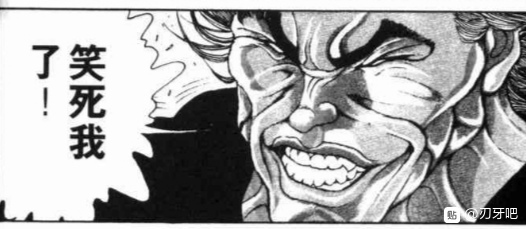

战斗！

BGM：幽雅地绽放吧，墨染的樱花　～ Border of Life

烈海王

Atk：275（142）

Hp：21

技能

烈海王：超越海皇，仍为海王。AtkX1.9，Hp+1。不会陷入异常状态，不会受到驻足，束缚等判定影响，面对所有技能都可以进行【1d100】的破解判定，60以上成功

完全消力：普通攻击以及近战系、弹幕系技能所造成的的最终伤害/2（仅对Atk260以下的对手起效）自身所收到的普通攻击伤害-1，近战系、弹幕系技能伤害-2（仅对Atk261以上的对手起效）

异红符【巨阙】（CT3）：（近战系）本回合Hp-1，Atk+80，给予伤害+4

Flower star（CT4）：（弹幕系）对对手造成必中的【2+1d6】点伤害。

假腿【The World】:为了锻炼自身而暂时封印

急救拳：一场战斗中只能使用一次，Hp归0后回复1点Hp

贫穷神的加护：由于身在梦中而无法使用

必杀技

纯粹武道（CT5）：怀抱纯粹的武术，心存无色的执着。3T内Atk+70，对对手造成的伤害+3。3T内可对所有攻击进行【1d100】的破解判定，近战系、技巧系技能30以上成功，其余技能40以上成功，必杀技60以上成功

超人【烈海王】（CT6）： Atk+675，给予伤害X4，其后2T内Atk+25，回避概率翻倍

武符【梦幻斗舞】（CT7）：无法回避/破解/防御，本回合自身无敌，进行一次【1d100】的反击判定，30以上可对对手的攻击进行反击

秘术【天文密葬法】（CT8）：制造虚假的月亮，削弱妖怪的力量，3T内战斗环节中，妖怪对手的Atk变为与自身最终结算后相同，自身的战斗骰变为【2d100】但同时无法使用破解，无法回避/破解/防御，给予伤害X2/引导宇宙的力量，发出轨道诡异的大量弹幕轰击无法回避/破解/防御 Atk+900，给予伤害X6

西行寺幽幽子

Atk：285

Hp：16

技能

华胥的亡灵：不会受到异常状态的影响，对特殊攻击手段拥有耐性，每次发动技能/必杀技时对手的Hp上限-1（最低降到1点）。自第四回合开始，自身所受到的普通攻击伤害减半，受到的技能伤害变为三分之一。

亡乡【亡我乡 -自尽-】（CT3）：（技巧系）控制大量幽灵四处奔逃，同时配以激光封锁行动，本回合对手Atk-75，受到伤害+2

亡舞【生者必灭之理 -魔境-】（CT4）：（弹幕系）那在空中飞舞的点点缤纷并非花瓣，而是樱色的蝴蝶，对对手造成必中的【3+1d6】点伤害。

华灵【ButterflyDelusion】（CT5）：（弹幕系）湛蓝的樱之雪在我背后绽放，异色的蝶之花于你身侧盛开。3T内自身Atk+60，对手给予的伤害-2，每回合对手Atk-5。（被破解的场合仅削弱对手的效果消失）

必杀技

幽曲【埋骨于弘川 -神灵-】（CT5）：蝴蝶的数量爆发性增长，此景正是与冥界相配的优雅之死亡。对对手造成必中的【2d5】点伤害

樱符【完全墨染的樱花 -开花-】（CT6）：花瓣？死蝶？魔弹？已经分不清眼前看到的究竟为何物，只是沉醉在这绝美的花开之中。Atk+640，给予伤害X4

【反魂蝶 -一分咲-】： Hp归0时或第六回合结束时发动，？？？

【反魂蝶 -三分咲-】：？？？

【反魂蝶 -五分咲-】：？？？

【反魂蝶 -八分咲-】：使用完毕后战斗结束，？？？

T1

烈的攻击【275+1d100：12=287】

幽幽子的攻击【285+1d100：28=313】

冥界的大小姐自袖中拿出了两把小小的折扇

幽幽子：和武术家打的话，果然是要用近战吧？

那就用这个，蝴蝶梦之舞~

粉发的少女手持折扇，似舞蹈般像武者发起了连击

烈的受伤【1d10：10】

1 回避

2 小伤害-1

3 小伤害-1

4 中伤害-1

5 中伤害-1

6 大伤害-1

7 大伤害-1

8 特大伤害-1

9 特大伤害-1

10 大成功/大失败【1d2：1】

然而，亡灵少女的近战技术在海王面前实在是难以拿得出手

武术家随手就破开了大小姐的攻势，并立刻发起了强力的反击！！

大成功，烈海王的反击！

幽幽子的受伤【1d10：6】

1 回避

2 小伤害

3 小伤害

4 中伤害

5 中伤害

6 大伤害

7 大伤害

8 特大伤害

9 特大伤害

10 大成功/大失败【1d2：1】

Hp：16-3=13

幽幽子在空中晃晃悠悠地飘了半圈

妖梦：幽幽子大人——

为什么要和武术家拼近战啊？！这种工作交给我来不好吗？！

幽幽子：为什么呢~

因为这样会有意思一些？

烈：那个，弹幕技巧和魔法术式之类的我也会

您大可不必非要打近身战，和以前一样就行的

T2

烈的攻击【275+1d100：79=354】

幽幽子的攻击【285+1d100：31=316】

烈海王向着拉开距离的亡灵公主放出了一道曲线激光

幽幽子：啊咧咧?

这个技巧看上去有点眼熟啊

死灵小姐呆呆地看着那轨道奇异的激光，全然没有躲避的意图

幽幽子的受伤【1d10：10】

1 回避

2 小伤害

3 小伤害

4 中伤害

5 中伤害

6 大伤害

7 大伤害

8 特大伤害

9 特大伤害

10 大成功/大失败【1d2：2】

幽幽子大失败

幽幽子的受伤【1d10:8】

1 小伤害X2

2 小伤害X2

3 中伤害X2

4 中伤害X2

5 大伤害X2

6 大伤害X2

7 特大伤害X2

8 特大伤害X2

9 战斗不能

10 大成功/大失败【1d2：2】

Hp：13-4X2=5

埋头思考的幽幽子从正面吃下了曲线激光的攻击

公主大人再次在空中飘荡了起来

幽幽子：啊，说起来现在还在战斗中哦

好疼好疼~

妖梦：幽幽子大人——

武术家迷惑地看着眼前这离奇的战果

烈：幽幽子小姐，您这是在干什么？

如果您不想打的话请直说就好，没有必要这样……这样……应付了事的

幽幽子：不不，是我主动提起的战斗嘛

我只是很好奇

为什么永远亭的人会用命莲寺那个僧侣的招数呢？

烈：！

T3

幽幽子的眼神变得犀利了起来

幽幽子：好奇怪，好奇怪

自称是武术家，却用出了圣白莲的魔法

你的魔力中还有着各种奇怪法术的痕迹

真的是，永远亭的厨师吗？

烈：这是——

武术家正准备上前说明问题，冥界的大小姐却突然笑了起来

幽幽子：不要紧张嘛~

我无意打探你的隐私，这只是我个人小小的好奇而已

话说，我有这么可怕吗？

明明出于绝大的优势之中，你的头上却在冒冷汗呢

烈海王擦了把脸上的汗水

烈：让您见笑了

说起来您可能不信，我过去有段时间每天都要担心是否会被您干掉

这是类似于某种心理阴影一样的东西……但和当下的战斗没有一丝关系

幽幽子：明明我们今天是第一次见面

那么就，继续战斗吧

符卡宣言 亡乡【亡我乡 -自尽-】

烈的破解【1d100：33】失败

粉发的少女抬手放出了樱花色的光栅以限制武者的行动

白玉楼的幽灵们则将自身化作了透明的弹幕，向着武术家扎堆扑来！

Hp：21-1=20

烈海王正待迎击，却感到一阵阴寒的气息自对手身旁扩散开来

那诡异的力量悄然渗入了武者的体内，他感到自己突然之间就失去了些许活力

这并不是什么陌生的感受——

烈：啧，又是对于生命力的剥夺吗？！

符卡宣言 异红符【巨阙】！

Hp：20-1=19

烈的攻击【275+80-75+1d100:92=372】

幽幽子的攻击【285+1d00:87=372】

赤色的巨剑驱散了聚集而来的幽灵，但武术家同时也被亡灵公主的激光所阻拦在外

距离过远的烈海王无法依靠技术再分胜负，于是这一回合的交手以平局告终！

幽幽子：烈海王，你还会恶魔的血魔法啊？

烈：这是朋友所教授于我的实用技巧……

在我的恋爱之路上发挥了很大作用

妖梦：血剑和恋爱？

？？？？？？？

T4

幽幽子：好可怕~我可不想被这么大的东西打中

再玩下去会输的很惨的

该认真打架咯

“啪！”

华胥的亡灵收起了手中的纸扇

与此同时

十数米之宽的巨大折扇，就这样毫无征兆地出现在了亡灵的后方

紫色的魔力构成了扇面，御所車的家徽填充在其中

它优雅地夸耀着其美妙的身姿——

而形如彩蝶的海量弹幕携带着那属于大妖怪的魄力破画而出！

幽幽子：弹幕游戏开始了

符卡宣言 亡舞【生者必灭之理 -魔境-】

Hp：19-1=18

烈的破解【1d100：39】失败

烈的受伤【3+1d6：6-2=7】

Hp：18-7=11

本应清雅的樱色在幽幽子的操控下却显得分外壮丽

那飘飘起舞的魔蝶化作了令人窒息的弹幕之海，即使是身经百战的武者也难以找到破解的思路

他从这纷乱的蝶群中挣扎着起身，却发现自己早已被推到了那长而又长的阶梯之下！

烈：不愧是幽幽子小姐，当真厉害

我也要以弹幕还击了

接招 Flower star！

幽幽子的受伤【2+1d6：6=8/3=2】

Hp：5-2=3

烈海王所扔出的花弹行至中途就被狂乱的魔力所吹散，仅有部分接触到了幽幽子的折扇之上

幽幽子：（看上去像是风见幽香的花弹……呵呵，紫大概会很感兴趣吧）

烈的攻击【275+1d100：69=344】

幽幽子的攻击【285+1d100：97=382】

烈的受伤【1d10：3】

1 回避

2 小伤害-1

3 小伤害-1

4 中伤害-1

5 中伤害-1

6 大伤害-1

7 大伤害-1

8 特大伤害-1

9 特大伤害-1

10 大成功/大失败【1d2：2】

Hp：11-1+1=11

烈：完全消力！

烈海王在空中如羽毛般扭转着自己的身躯，从而消去了正面命中的大玉攻击

幽幽子：这又是你从哪里学的呢~

难不成，是妖梦的半灵？

烈：这是我自家师傅教的武术！

T5

幽幽子：灵魂~灵魂~

黑色的凤蝶是灵魂的化身

西行的樱花为幽曲的精灵

而这缤纷的异彩，正是冥界的瑰丽

符卡宣言 华灵【ButterflyDelusion】

符卡宣言 幽曲【埋骨于弘川 -神灵-】

蓝色的魂光化为了光亮的虚树

墨色的蝴蝶追随着生者的气息

藏于武者身侧的蝶弹侧如鲜花般绽放而开，这惊心动魄的美景之下却是毫不掩饰的杀机！

Hp：11-1-1=9

纯粹武道发动

烈的破解华灵【1d100：21】失败

幽曲【1d100：27】失败

烈的受伤【2d5：6-2=4】

Hp：9-4=5

烈的Atk：275-5=270

永远亭的武术家见过那足以震撼大地的威力，也知晓那不可名状的诡秘

他知道如何与那些可怖的强者作战

但却不明白，该如何应对眼前这瑰丽的美景

即使将思维纯化，却也想不到合适的思路

于是便将无关紧要的杂事抛开——

而后静静享受，这樱与蝶的舞蹈

短暂的迷乱之后，清醒过来的武术家迅速从樱海中脱身而出

他并不太在意身上的伤势，只是由衷地赞美起了这绚丽的弹幕

烈：……真美啊

幽幽子小姐

我再没见过比这更漂亮的弹幕了

幽幽子：樱花啊♪樱花啊♪

难得见到愿意静下心来赏花的人类

灵梦和魔理沙她们次次都一脸慌张的跑掉，真是不解风情

烈的攻击【270+70+1d100：78=418】

幽幽子的攻击【285+60+1d100：26=371】

幽幽子的受伤【1d10：7】

1 回避

2 小伤害/2+3-2

3 小伤害/2+3-2

4 中伤害/2+3-2

5 中伤害/2+3-2

6 大伤害/2+3-2

7 大伤害/2+3-2

8 特大伤害/2+3-2

9 特大伤害/2+3-2

10 大成功/大失败【1d2：2】

Hp：3-3/2-3+2=1

烈：我很能理解魔理沙她们的心情

刚刚只不过痴迷了数秒，我就已经深受重伤

若是全身心投入其中，怕是过不了多久我就得葬身于樱花之下了

幽幽子：（确认了，灵梦和魔理沙也是他所熟悉的人）

（要再套点话出来吗……还是干脆享受弹幕游戏呢？）

真为难啊~

T6

烈的Atk：270-5=265

亡乡【亡我乡 -自尽-】发动

幽幽子：（算了，这些麻烦的事情还是统统交给紫来想吧）

生命的可贵之处正在于那份转瞬即逝的美好

而弹幕游戏的乐趣也是一样

这是倒数第二次的符卡宣言

撑过最后的两次攻击，就是你的胜利哦

烈：准备一招定胜负吗？

我倒是没什么所谓

幽幽子：深草山野边，所栖樱花若有知，还愿限今年，所咲花色作墨染，一同服丧共哀戚

樱符【完全墨染的樱花 -开花-】

Hp：5-1-1=3

冥界的公主面上带着超然的微笑，口中却轻声咏唱着这哀切的和歌

或许是被这词中的哀伤所打动，亦或者只是为了满足少女所亲口说出的愿望——

满天飞舞的蝴蝶与樱花，随着幽幽子的咏唱所改变了自己的颜色

黯淡的死意与深沉的墨自蝴蝶的飞舞所扩散到了整片冥界之中

那美好的春天和靓丽的花仿佛只是过去的泡影

这凄冷而哀怜的冥界，才是樱花之下的真实！

烈的破解 亡乡【1d100：4】失败

樱符【1d100：17】失败

烈：我对于这种类型的攻击真是不知该如何应对……

还是靠最为简单的办法结束战斗吧！

符卡宣言 异红符【巨阙】

符卡宣言 超人【烈海王】！

Hp：3-1=2

武术家想不明白该如何用肉体破除这无处不在的墨色之雨

那便用最为简单的方式结束这场战斗吧！

手持血剑的烈海王化作了超凡脱俗的圣人，向着那巨大扇面下的女子发起了冲锋！

T7

烈的Atk：265-5=260

蓝紫色的虚幻之蝶以难以置信的速度跨过了两人间的距离，并一并穿透了烈海王的身体

永远亭的武术家赫然发现，这看似无害的蝴蝶却留下了可怖的死意

光是压制身体不被其所伤就已经需要竭尽全力，在此刻使用其余的术式简直是痴人说梦！

烈：还有这一招？！

幽幽子：赏花才刚刚开始，在此刻贸然破坏可就太过不解风情了

【反魂蝶 -三分咲-】

【反魂蝶 -三分咲-】：希望在我死后，吊祭我的人能以樱花贡奉。无法回避/破解/防御，3T内自身的战斗骰变为【3d40】

（由于Hp已经为1，Hp上限无法继续下降）

烈的攻击【260+70+1d100:76=406】

幽幽子的攻击【285+70+3d40：25=380】

幽幽子的受伤：0

烈：这般可怖的赏花会，可还是算了吧！

开场时的羞涩已经消失不见，樱花勇敢地展现出了自己的身姿

那赤色的蝶弹随着花朵的开放向着武者袭来，却被他毫不留情地打成了飘洒的碎屑

武者正准备乘胜追击，却发现他无论如何都无法触及到虚幻而透明的亡灵公主

幽幽子：然而，人的意识无法阻扰花的开放

因为此处，是我所管辖的幽冥之境

因为此处，是只属于亡灵的无垢净土

T8

纯粹武道效果结束

华灵【ButterflyDelusion】效果结束

幽幽子：樱花就快要盛开了

只是，你还能坚持到那个时候吗？

——【反魂蝶 -五分咲-】！

【反魂蝶 -五分咲-】：应该能不体会自身悲惨的境遇就度过每一日吧，如果是在那个没有出家风俗的世界的话。对对手造成【1d10】点伤害

明亮却冰冷的蝶弹旋转着，交叉着，将贸然闯入的武术家卷入了赤色的旋风之中

刹那间，武者就被无边无际的蝴蝶所推离了那触手可及的敌人

而冷酷的蝶群却丝毫不顾及他的感受，只是一味地飞翔着

让这公主所期待的樱花继续开放

让无礼之徒陷入名为死亡的深渊

烈的破解【1d100：88】成功

烈：破！

但武者并没有被这令人眼花缭乱的蝶群所迷惑

他只是沉默着集中了自己体内的全部力量

而后向着前方的赤色一腿踢出！

数以千计的蝶弹被烈海王的踢击所轰然吹散，亡灵公主的攻势在此刻被骤然逆转！

烈：不应该将它们看做美丽的风景，而将其视为普通的弹幕攻击——

想明白了这点之后，要破除您的攻击就算不得什么难事了！

幽幽子：不愿意专心赏花呢

烈：因为要集中精力战斗啊

看来目前的我没有手段能伤到您

那就等到最后再分胜负吧！

幽幽子的攻击【285+3d40：37=322】

烈的攻击【260+1d100：24=284】

烈的受伤【1d10：4】

1 回避

2 小伤害-1

3 小伤害-1

4 中伤害-1

5 中伤害-1

6 大伤害-1

7 大伤害-1

8 特大伤害-1

9 特大伤害-1

10 大成功/大失败【1d2：2】

Hp：1-2+1=0

烈海王使用了急救拳

Hp：0+1=1

幽幽子：这是，月之民的技术？

烈：的确，也是我目前最后的底牌

该决出胜负了！

T9

反魂蝶 -一分咲- 无敌效果结束

幽幽子：满开的时候终于要到了

烈：是满开吗？

如果按照之前的规律来看

这次的樱花只会开到七八分吧？

幽幽子：啊啦，你不明白呢

樱花完全盛开之时，离它的凋落也就不远了

因此只需开到八分，便足以展现自身的美丽了啊

这就是，最后的开花了

幽幽子：【反魂蝶 -八分咲-】

【反魂蝶 -八分咲-】：樱花盛开了。无法回避/破解/防御 Atk+900，给予伤害X6

放射至四方的光带已经暗淡

赤色的蝶群也被武术家所轰散了

但这自死而生的樱花却依旧想要盛开

但冥界的公主却仍然想看到那过去曾有的美景

于是，粉发少女动用了那只属于她的力量

纵使是已经枯萎的鲜花，也能化为蝴蝶而得到生存的希望

赤色的魔力以那闪烁的光芒宣告了终于到来的时刻

在这清幽静雅的冥界之中，却出现了至今为止最为壮丽与热情的开花！

整片冥界都染上了樱花的光芒，即使是最为茫然无知的灵魂，也能在明白此时此刻应该做些什么

它们不约而同地朝向了空中那耀眼的光

看吧——

樱花开放了！

（补T6后半段）

烈的攻击【265+70+80-75+675+1d100：79=1094】

幽幽子的攻击【285+60+6400+1d100：95=1080】

幽幽子的受伤【1d10：6】

1 回避

2 小伤害X4/2+3+4-2

3 小伤害X4/2+3+4-2

4 中伤害X4/2+3+4-2

5 中伤害X4/2+3+4-2

6 大伤害X4/2+3+4-2

7 大伤害X4/2+3+4-2

8 特大伤害X4/2+3+4-2

9 特大伤害X4/2+3+4-2

10 大成功/大失败【1d2：2】

Hp：1-3X4/2-3-4+2=0

烈：结束了，最后一击！

赤色的流星破开了黯淡如墨的蝶之海

武者的巨剑摧毁了亡灵那巨大的折扇！

已然确定自己胜利的武术家看向了冥界的大小姐

但粉发的少女却在空中令人不安的笑着

幽幽子：真遗憾~

我说过的吧？

还有，最后一张符卡

BGM：Border of Life

西行寺幽幽子缓缓抬起了自己的双手

粉与蓝的光之带便出现在了她的身旁

而后，无数虚幻的蝴蝶自她的身侧凭空浮现而出

它们以少女为中心而缓缓向外推进，让过去被墨色所染的冥界再次变成那仿若幻梦的仙境

武术家站在原地观察了半晌

他忽然明白了自己所看到的事物

烈：——是樱花？

没错，是樱花

闪烁的光带是它的花骨，迷幻的彩蝶构成了它的花瓣

而位于中央的那惹人拎爱的少女，正是这绽然开放的樱花之心！

幽幽子：冬去春来，一年过去

又到了赏花的好时节

还请欣赏吧，这就是冥界最美的樱花

——【反魂蝶 -一分咲-】

Hp：2-1=1

【反魂蝶 -一分咲-】：厌离秽士，欣求净土。Hp归0时仅限一次仍可继续战斗，本场战斗中自身无法使用除【反魂蝶】以外的技能/必杀技，无法回避/破解/防御，3T内自身无敌，下回合对手无法使用技能/必杀技。

【1d30：17】后，终于打扫完庭院的妖梦给两人端上了茶

妖梦：结果绝大部分的破坏都是幽幽子大人干的

还请考虑一下我的工作量可以吗？

幽幽子：这是锻炼哦，对妖梦的锻炼~

幽幽子的怀疑【1d100：95】（高于好感度61告诉紫）

幽幽子：（涉及的势力太多了，认识的人似乎也不少，但此前我却从来没有见过他）

（果然，还是得把这位烈海王的事情和紫说一下呢~）

呀真开心，好久没有这么愉快的打过一场了

说起来你是来干嘛的啊？

烈的察觉【1d70：40+30=70】（75以上察觉幽幽子的打算）

烈：（是我多心了吗？感觉幽幽子小姐似乎在考虑些复杂的事情……）

我是想问问您对于近期出现的这些幽灵有何看法

幽幽子要做什么【1d10:4】

1 稳妥地告知情报

2 先拖延时间等紫过来

3 地底的假情报（为啥啊）

4 稳妥地告知情报

5 先拖延时间等紫过来

6 4+派妖梦一起去（为啥啊）

7 稳妥地告知情报

8 先拖延时间等紫过来

9 紫~就在这里哦~（别啊！！）

10 大成功/大失败【1d2：1】

幽幽子：四处飘荡的这些是神灵的孩子

是人类的欲望集合体

虽然也叫灵但和幽灵没关系哦

烈：欲望的集合体……

也就是说，这些东西是小型的神灵？

为什么它们会出现在幻想乡之中？

妖梦：幽幽子大人说是因为有个麻烦的家伙要复活了啊好疼！

冥界的大小姐用折扇敲了一下庭师的脑袋

幽幽子：真是的，妖梦，随便插嘴很没礼貌的哦

你之后要去哪里呢？

和这些小小的神灵一样，去往寺庙后方的墓地吗？

烈的察觉【1d70：12+30=42】（50以上察觉异变真相）

烈：（寺庙……莫非是白莲师傅她们发动的异变？我想不到她们这样做的理由啊）

原来如此，看来命莲寺的墓地中还有些古怪

多谢您的指点，烈海王在此告辞！

幽幽子：慢走不送哦~

送走了前来拜访的武术家，白玉楼的大小姐吃起了桌上作为茶点的仙贝

幽幽子：（看上去对于这次的异变没什么了解，可能与此无关？）

嚼嚼……

妖梦~帮我把通讯使魔拿过来~

妖梦：好的幽幽子大人已经拿过来了我出发了！

白玉楼的庭师以飞一般的速度离去了

幽幽子：嚼嚼……真是急性子，还想着让你做点东西吃再走呢

喂喂，紫在吗~

接通讯的是【1d3：3】（1-2紫，3蓝）

蓝：幽幽子大人您好

紫大人刚刚忙完工作，现在在休息

要我叫她起来吗？

幽幽子的执着【1d100：65】（50以上叫紫）

幽幽子：请去吧~顺便告诉她我今天遇到的事情

具体来说是这样的……

【1d60：15】分钟后，睡眼惺忪的隙间妖怪在听完使魔的说明后接起了通讯

紫：总结一下

幽幽子遇到了一个奇怪的武术家

他自称名叫烈海王，是来自永远亭的厨师

实力不弱，似乎认识不少人且会她们的招式？

幽幽子：没错

吸血鬼的血魔法，风见幽香的花弹，圣白莲的超人术，还有月之民的术式

顺便一提，他貌似对我有着一定程度的恐惧心，但是我并没有见过他

烈：我是来调查这些小神灵的

在命莲寺已经建成之后的春季发生的异变，神灵的源头处还出现了你……

这个梦境的真相是莫非是神子殿下所发起的异变？

僵尸少女看着自顾自往前走的武术家，感到自己被深深冒犯了

芳香：都说了不要往前走了

根本不听僵尸的话

那你就，成为我们之中的一员吧！

呜哦~

唐装僵尸张牙舞爪地扑了上来，然后一口咬在了分神的武术家身上！

烈：什么？！

烈的反击【1d100：36】（50以上芳香战斗不能）

烈海王一拳击退了死咬不放的僵尸，而后查看起了自己的伤势

他看到伤口处的肌肤以缓慢的速度变得灰暗了起来

烈：糟了，这是僵尸的死毒！

芳香：你也——变成——僵尸吧——

烈的战意【1d70：18+30=48】（74以下先想办法解毒，75以上就这样开战）

烈：（如果不想想办法的话很可能真要变成僵尸

这样一来之后就没法跟神子殿下打架了）

不得不先撤退了，真是遗憾

希望灵梦小姐她们别这么快就解决异变……

武术家捂着胳膊飞走了

芳香：呜，呜……

呜，哦

击退一人，好耶！

小僵尸在原地跳起了舞

烈海王中毒了！

僵尸毒：宫古芳香身上带有的强力毒素，中毒之后会逐渐成为僵尸。战斗中每回合Hp-1，破解判定所需成功值+15，在战斗开始的第4回合后每回合需进行一次【1d100】的僵化判定，70以上时战斗不能。

烈海王要做什么【1d10：7】

1 这里就靠我烈海王的医术

2 去命莲寺求助吧

3 拜托芳香解毒吧（为啥啊）

4 这里就靠我烈海王的医术

5 去命莲寺求助吧

6 中毒了当然要看大夫（好远哦）

7 这里就靠我烈海王的医术

8 去命莲寺求助吧

9 靠毅力去克服它！（为啥啊？！）

10 大成功/大失败【1d2：2】

~命莲寺参拜道~

烈的医术【1d70：19+30=49】（师匠的教导+30）

芳香的毒素【1d70：46+30=76】（僵尸+30）

烈海王看着手臂上那逐渐扩散的毒素皱起了眉头

烈：只能做到暂时抑制却无法彻底根除

要不是修炼了超人术，恐怕我现在已经变成僵尸了

真是太过大意了

“话虽如此，你看上去却丝毫没有危机感呢”

烈海王回头看向了声音传来的方向

那位幻想乡的代表人物，操纵境界的妖怪贤者，此刻正坐在暗色的隙间旁看着眼前这陌生的人类

烈：八云女士？！您怎么来了？！

紫：你认识我啊

但是，我却丝毫没有见过你的印象

烈：不，这是——

八云紫：不擅长交涉的话，最好还是老老实实说实话哦

那些似是而非的话语，可连幽幽子都瞒不过呢

烈海王要做什么【1d10：4】（仅一次机会，失败后开战）

1 实话实说

2 这里就靠我烈海王的直觉

3 跑路了！（有用吗）

4 实话实说

5 这里就靠我烈海王的厨艺

6 开战啦（别啊）

7 实话实说

8 这里就靠我烈海王的口才

9 帮帮我吧摩多罗女士（为啥啊）

10 大成功/大失败【1d2：2】

武术家苦恼地挠着脑袋，最后决定实话实说

烈：我真不知道该怎么说明这事才好

我也确实没对幽幽子小姐撒谎

实话实说吧，我在做梦

这个梦境的内容是神灵异变的再演，但由于当时我没有进入幻想乡，因此大家都不认识我

结果最后就变成了这副尴尬的样子……

紫的怀疑【1d100：46】（50以下相信）

妖怪贤者习惯性地将半个身子缩到了隙间之内，只留下上半身与武术家交谈着

紫：现实中的你进入幻想乡的契机是什么？

烈：我在外界比武时陷入了死境，而后摩多罗女士将我救到了幻想乡之中

隙间妖怪竖起了手指

紫：隐岐奈啊

那可真是位温柔体贴且彬彬有礼的大妖怪~

烈：？？？

八云女士您说啥呢，摩多罗女士是秘神啊

而且她的性格……

我没有背后说人坏话的意思，但我觉得她并不像您所说的那样——

紫：对，那是个自傲自大且充满恶趣味的家伙

还以为你是梅莉那边的人，吓我一跳……

真是让人连个安稳觉都睡不了

在睡觉的时候还要忙于工作，我真可怜啊~

金发的少女打了个哈欠

烈：您这就信了？

紫：对隐岐奈的事情都这么清楚，虽说初次见面但我却有种亲切感，再加上你那毫无保留的态度

用梦境来解释的话，就非常合情合理了

不必惊讶，这又不是什么少见的事情

晚安，初次见面的烈海王

金发的少女挥了挥手，而后彻底钻入隙间中消失了

烈的察觉【1d70：47+30=77】（90以上察觉梅莉）

烈：在梦境中再度入睡的话，会做新的梦吗？

晚安，八云女士

得想想办法解决胳膊上的毒了……

烈海王要做什么【1d10:4】

1 老老实实看大夫吧

2 去命莲寺求助吧

3 魔理沙救命啊（为啥啊）

4 老老实实看大夫吧

5 去命莲寺求助吧

6 找鬼王讨酒喝吧（为啥啊）

7 老老实实看大夫吧

8 去命莲寺求助吧

9 去问问幽香吧（为啥啊）

10 大成功/大失败【1d2：1】

烈：没想到绕了一大圈最后还是得回家才能解决问题

这回可得管住嘴了……师匠和永琳这种一叫就露馅了，得怎么称呼呢？

大夫？八意大夫？

【1d30：10】分钟后，急于打架因此拼命赶路的烈海王飞回了永远亭的方向

烈：请问有人在吗？

我想挂个急诊！

出门迎接的是【1d10:6】

1 铃仙

2 师匠

3 皮克（已经来了吗）

4 铃仙

5 师匠

6 辉夜（为啥啊）

7 铃仙

8 师匠

9 帝（为啥啊）

10 大成功/大失败【1d2：2】

身穿和服的黑发少女从屋中走了出来

她看了眼门口气喘吁吁的武术家，面上闪过了一丝微不可查的厌恶

她将双手微微抬起，用宽大的袖子遮住了自己面上的表情

辉夜：今日负责挂号的因幡有事外出了

如果你想看病的话，就走去那边的医务室吧

永远亭的公主大人轻轻点了点头，而后便优雅地回到了屋内

烈的震惊【1d100：42】

烈：（哇，这彬彬有礼的辉夜小姐简直像大家闺秀一样）

（但平时这个点你基本上都还没起床……看样子昨天晚上八成是又熬夜了）

武术家心里想着这些不知所谓的琐事，转头敲了敲医务室的门

“请进”

武术家走进了他所熟悉的小屋

那位美丽的银发女子，正坐在桌前调配着今日的药物

师匠：你好，我是永远亭的医生

称呼我为八意大夫即可

请问你是哪里不舒服呢？

烈的说明【1d100：61】（50以上理解）

烈：永——八意大夫您好，我的名字是烈海王

说起来可能有点奇怪，我被僵尸咬了一口

您看看这还有救吗？

师匠：……哈？

月之头脑看着眼前这古怪的男子，脸上露出了惊异的表情

师匠的药术【1d50：21+50=71】（月之头脑+50,默认起效，76以上彻底根除）

【1d10：9】分钟后，师匠调配好了应急的药物

师匠：把这个涂上就可以暂时阻止毒素的扩散

这种邪仙的蛊毒相对来说较难处理，想要根治的话，怎么说都得住院【1d7：3】天左右才行

烈：哦哦，没有生命危险就好说了！

这样的处理对我而言已经足够

太感谢你了，八意大夫

请问医疗费是多少？

师匠：还说什么医疗费？

出门的时候小心一些就行了

真是的，“我被僵尸咬了！”

这什么古怪的伤势啊——

月之贤者说到一半才反应过来，自己说出了多么古怪的话

师匠：不好意思，我刚刚似乎有些走神

医疗费就不需要了，一点小忙而已

烈：——谢谢！

武术家匆忙离去了

只留下银发的女子在屋内独自思考着

师匠：真奇怪

我之前见过他吗？

为何会感觉如此亲近……

抑制了僵尸毒的扩散！

被抑制的僵尸毒：在月之头脑的简易处理后已无生命危险，但僵硬的肢体仍旧影响了战斗时的发挥。自身的破解判定所需成功值+10

烈：该去解决异变——不，该去继续战斗了

我估计神子殿下应该就在命莲寺的墓地之下等待着复活……那就一口气突入终点吧！

烈海王前往神灵庙了

路上有事发生吗【1d100：81】（30以下坏事，70以上好事）

总算有好事发生了

具体的事件是什么【1d10:3】

1 与自机们汇合了

2 得到了命莲寺的支援

3 师匠：果然还是再想想办法吧（为啥啊）

4 与自机们汇合了

5 得到了命莲寺的支援

6 一口气冲到了神灵庙！（为啥啊）

7 与自机们汇合了

8 得到了命莲寺的支援

9 神子出门啦（为啥啊）

10 大成功/大失败【1d2：1】

“请等一下”

刚出门没多久的烈海王被熟悉的声音所叫停了脚步

他回头看去，发现师匠手中拿着一个奇怪的装置向他走了过来

师匠：虽然僵尸的毒素没办法这么快就根除

不过凭借这个辅助装置，你依旧可以在短时间内正常战斗

烈：谢谢，永——八意大夫

我会付……

师匠：钱的话就算了吧

当成我一时之间的心血来潮就好

不要在意啊

银发女子将手中的机械装置递给了烈海王后，就转身走回了永远亭的方向

烈的情商【1d100：100】大成功（保底20）

草，烈海王情商大成功

大成功是什么【1d10:9】

1 永琳醒了

2 过于强烈的情感吸引了小神灵们

3 得到了路过的自机的帮助（为啥啊）

4 永琳醒了

5 过于强烈的情感吸引了小神灵们

6 虽然永琳没醒但还是提供了帮助（为啥啊）

7 永琳醒了

8 过于强烈的情感吸引了小神灵们

9 不打架了，起床约会去（为啥啊？！）

10 大成功/大失败【1d2：2】

烈海王沉默着看着自己手中的机械装置

他轻轻抚摸着那光滑的表面，然后不出所料地感受到了一丝尚未散去的余温

烈：——这是，刚刚做好的？

师匠：手头刚好有些原材料，今天我又恰巧有空罢了

你无需在意……

烈：原来如此

只是有些可惜

我用不到它了

银发女子疑惑地看着那即熟悉又陌生的男子

永琳：你不是还要前去战斗吗？

烈：原计划确实是这样

那是难得的和神子殿下她们战斗的机会，说不定还能遇到其他意外的强敌呢

但是我改主意了

永琳：为什么？

烈：因为我发现了比那更加重要的东西

谢谢你，永琳

我爱你

武术家冲上去拥抱了一下梦中的恋人

随后，他的身体就在女子那惊愕的眼神中逐渐化为了飘逸的光点，最终消逝在了那春天的薄雾之中

永琳：......

我也……？

（梦境存留度判定留到之后进行）

~现实~

~永远亭~

烈海王从自己的床上醒了过来

他压根没去看现在的时间，而是快步走出了房间，并一把推开了师匠的房门

武术家冲到了恋人的床前，并轻轻摇醒了熟睡中的她

烈：永琳，我们去约会吧！

永琳的震惊【1d100:3】大失败

草，这里大失败是什么【1d10:7】

1 想起了梦中所作所为的永琳决定使用物理性失忆

2 困死了我要睡觉

3 在梦里约会吧（为啥啊）

4 想起了梦中所作所为的永琳决定使用物理性失忆

5 困死了我要睡觉

6 大家都被吵醒了（为啥啊）

7 想起了梦中所作所为的永琳决定使用物理性失忆

8 困死了我要睡觉

9 条件反射式的全力出手（不要啊——）

10 大成功/大失败【1d2：1】

永琳：怎么了烈……大半夜的……

意识朦胧的月之贤者看着眼前恋人，慢慢回想起了她在梦境中的所作所为

银发女子的脸以肉眼可见的速度红了起来

她闪电般抬臂锁住了武术家的脖子，而后顺势使出了 裸 绞！

永琳：把梦里的事情给我忘掉！

烈：不会忘记的！就算昏迷了也不会忘记的！

永琳：给我忘掉啊！！！

两人的格斗持续了【1d60：20】分钟

最后的胜者是【1d2：2】

1 烈

2 永琳

20分钟后，彻底锁住了男友四肢的月之贤者以一个完美的压制姿势宣告了自身的胜利

永琳：别以为近身战就一定是你的优势

当初月之都的新兵入门搏击训练课程还是我编写的呢！

烈：大意了

原以为会用例行的铁爪，没想到这回居然是柔术

收获很大，必可活用于下一次……

永琳：——不对啦为什么会变成这样？！

烈：明明是你先出手的哦？！

【1d20：3】分钟后，尴尬的恋人们躺回了床上

烈与永琳要做什么【1d10:4】

1 继续约会计划吧

2 就这样躺着聊会吧

3 接着睡觉吧（为啥啊）

4 继续约会计划吧

5 就这样躺着聊会吧

6 醒都醒了……（别了吧）

7 继续约会计划吧

8 就这样躺着聊会吧

9 第二回合，再开！（你们搞笑吗？！）

10 大成功/大失败【1d2：1】

永琳：为什么非要大半夜的时候过来找我啊

就那样继续在梦中冒险不好吗？

烈：真要说的话却也找不到什么理由

只是觉得和最重要的东西相比，其他的一切都显得没什么所谓了

永琳：最重要的东西就是大半夜过来提醒我梦中自己的羞耻发言吗？！

烈：最重要的事情是陪伴一直爱着我的人

最重要的事情是陪伴我永远爱着的人

与此相比，一场错过的打架又算得了什么？

——我们去约会吧！

月之贤者把头埋到了被子里

永琳：不要一脸严肃地说这些害羞的话啊

行吧约会约会……地点由你来定哦

约会的地点是【1d10：5】

1 妖怪之山

2 月之都

3 就在竹林中散步吧（为啥啊）

4 雾之湖

5 魔法森林

6 去冥界吧（大半夜的？）

7 地底

8 梦境世界（还做梦？！）

9 人间之里（大晚上去？）

10 大成功/大失败【1d2：2】

~魔法森林~

时值夏季，幻想乡的森林之中正是一片生机勃勃的景象

潮湿的大地上随处可见色彩斑斓的巨大蘑菇，形状奇异的瓜果则不合常理地挂在书上

然而在深更半夜之时，这本应充满活力的景象却在瘴气之中显得分外诡异——

不过对在森林中漫步的两人而言，这却连威胁都算不上了

永琳：结果，为什么要来森林呢？

烈：一时之间想不到什么适合的地方

这个点还热闹着的地方就只剩下地底了，你肯定是不喜欢那的

于是索性就来这边散散步吧，顺便为明天的料理收集些食材

永琳：很有自信啊

不怕采到毒蘑菇？

烈：我之前在魔理沙那学过如何辨别蘑菇的品种

她说的那些“大概没啥事”的蘑菇我是一个都不敢吃，“绝对没事”的应该还算可食用的级别——

应该吧

两人要做什么【1d10：5】

1 就这样聊聊吧

2 关于梦境

3 师匠的蘑菇讲座（为啥啊）

4 就这样聊聊吧

5 关于梦境

6 野生的妖怪出现了（谁啊）

7 就这样聊聊吧

8 关于梦境

9 果然还是要第二回合（这么执着吗）

10 大成功/大失败【1d2：2】

月之头脑随手摘了些树上的水果，并将其递给了武术家

永琳：现在回头想想，你在梦里也是真的很过分哦

居然就那样突然抱住了好心的大夫然后表白

如果真是陌生人的话绝对会被我干掉的

烈：其实当时我已经做好在清醒前被你干掉一次的心理准备了

永琳：即使拼上性命也要对梦中的我进行X骚扰？！

为什么？！好可怕？！

烈的说明【1d100:88】

烈：怎么说呢……是种很矛盾的心情

我觉得以清醒的状态面对梦中的你是件不太正当的事情

但当时我却又难以抑制自身的感情

即使赌上性命也想这么做

如果被干掉的话，就当是对我的惩罚吧

永琳：不要天天把死和性命挂在嘴边啊

平时说话的时候也是，动不动就“死对我来说没什么所谓”

少说些这样令人不安的话语好吗？

烈：我倒是一直都挺看得开的

毕竟相处了将近两年

我也大概能想明白，你和辉夜小姐所服下的【蓬莱之药】是什么样的东西了

永琳的震惊【1d100：73】

银发的女子停下了手头的动作

永琳：——你去问了妹红？

烈：只是简单的推理而已

我与你和辉夜小姐都战斗过，看过你们那瞬间复原的能力

再想想嫦娥的传说与她最终的结局……能想到的可能性也就只剩下那么几个

真正意义上的不死之药，对吧？

八意永琳沉默了一阵

她似乎想说些什么，但一时之间却又无法张口

最终，做好准备的月之头脑看向了在一旁静静等待着的武术家

永琳：纵使受到了再大的伤害，也绝对无法死掉

纵使度过了千万年岁月，也不会变的衰老

这是如同字面意思一样，真正名为【永远】的诅咒

你明白——

烈的情商【1d100:24】（保底20）

烈海王突兀的打断了女子的发言

烈：师匠，我不是怀疑你的实力

但这药有那么厉害吗？

永琳：哈？

烈：同样吃了药的嫦娥在月之都被变成了蛤蟆

然后去年我刚看过她被打成渣的样子

感觉就算吃了这药在赫卡提亚面前好像也没啥大不了的……

月之头脑的话被噎在了嗓子眼里，差点一口气就没顺上来

永琳：你脑子里能不能想点和打架无关的东西？！

我说的不是战斗力的问题！

烈：主要是那个长生不老的附带作用，对我来讲没什么所谓

因为你对我而言本来就是【永远】

而永远和无限，其实没什么区别啊

月之头脑哑口无言地看着眼前的男子

她已经可以轻易理解他心中的想法

正因如此，才会无言以对

永琳：——你从最开始告白的那天开始，就已经想到这些了？

烈：当然啊

那时候长生不老对我来讲简直是天方夜谭

像郭老师那样活到一百多岁都是做梦也不敢想的事情

所以铃仙前辈跟我说完之后我就想，如果最后我先一步离去该怎么办呢——

八意永琳无奈地捂住了额头

永琳：啊啊，我已经完全能猜出你是怎么想的了

总之就这样先追求永远的寿命，如果真失败了哪怕成为幽灵也要继续……

烈：就是这样

因此永远也好，无限也罢，对我而言通通没什么所谓

我只需要拼命修炼

然后就这样陪你一直走下去

——直到世界的尽头

银发的女子看着自己的恋人，突然笑了起来

永琳：哈哈哈

你早就已经想明白的事情，我却一直在犹豫该如何开口……

我可以相信你吗？

烈：当然

如果圣人的躯体腐坏，那我就去当仙人

如果仙人都衰朽了，那我就去当幽灵

无论变成什么样子

我都会一直陪伴你的

永琳：真的是，真的是自寻烦恼

难得的约会居然浪费在这种事情上面了哎？！

烈：我承认我挑的这个时间和地点确实不太好

我看看还有多久到白天啊——

离天亮还有【1d6：6】个小时（4小时以上就回去接着睡觉）

烈：……现在离天亮还有6个小时

咱们回去接着睡觉吗？

月之头脑满脸绝望地趴在了恋人背上

永琳：这都什么啊

大半夜和男朋友打了一场之后在森林里说起了严肃的话题

最后又提着一篮子蘑菇与水果回去接着睡觉

我觉得现在的自己更像是在做梦哦？！

烈：是我太过冲动了

但是我那个时候脑子除了想见永琳以外，几乎什么都想不到了——

永琳：啊停停停，不要说了！

我不想走了你给我负起责任背我回去！

武术家耸了耸肩

他手中提着明天的早餐，背上背着一脸无奈的恋人，就这样飞回了永远亭……

~永远亭~

~师匠的房间~

来来回回折腾了大半夜的两人最终又躺回了床上

烈的情商【1d100:59】（基础情商+20）

武术家犹豫了一会，然后慢慢搂住了身边的女子

烈：会热吗？

银发女子在恋人的怀中换了个舒适的姿势，而后反手抱住了他

永琳：当然会热啊，现在又不是冬天

好困……我先睡了

烈：晚安，永琳

永琳：晚安，烈

梦里，有句话没有说完就醒了

烈：那是？

永琳：……我也爱你啊

恋人们在黑暗中陷入了沉静的酣睡

一夜无梦

~第538天结束~

~第539天夜晚~

~永远亭~

烈：昨天晚上做梦做到一半自己就醒了

也不知道这梦还能不能继续做

希望可以吧……

武术家怀着忐忑的心情陷入了梦乡

梦境的损耗度【1d100：21】（无大成功大失败，50以下还能继续）

烈海王自梦中苏醒的时间点是【1d10：6】

1 与灵梦相遇时的人间之里

2 刚开始的旧地狱

3 刚开始的魔法之森（为啥啊）

4 与灵梦相遇时的人间之里

5 刚开始的守矢神社

6 刚开始的太阳花田（为啥啊）

7 与灵梦相遇时的人间之里

8 刚开始的命莲寺

9 被芳香咬前的墓地（为啥啊）

10 大成功/大失败【1d2：2】

~太阳花田~

从梦中醒来的烈海王看向了周围的环境

映入眼帘的是他再熟悉不过的景象

令人目眩的金黄向日葵在柔和的春风中轻轻摇摆

妖精们在花田的上空与飘荡的神灵们做着游戏

烈：——不会吧

武术家转头看去

他毫无意外地发现，那位绿发红瞳的大妖怪正坐在小桌旁饶有兴致地观察着眼前的陌生来客

幽香：真是稀奇

没想到新的异变刚刚开始，我的花田就迎来了意外的访客

你是谁？

（本日的更新结束，下一次的更新在周四或周三）

（以下是我的废话）

那么神灵之梦前半段剧情结束

一直到幽幽子战结束为止都还在我的预料之内，突然和灵梦或者紫开战也不是不行——

然后从中芳香梗选项开始就 他 妈 一路狂奔啦！

啊我真的服气了为什么啊，为什么偏偏能连续中三个梗选项？！

我被僵尸咬啦！师匠医疗没过！师匠追过了来了！情商大成功！我们约会吧！

草草草草草草草草草草

这难不成是永琳的怨念吗？！连续两次交流回没中就这会连本带利补回来？！

其实最后那段剧情我有在犹豫要不要骰个恋情或者怒气之类的一转禁果......

不过果然还是算了，感觉实在是不合时宜而且不符合这两个人的风格

最后那个骰子我是真的傻了

怎么就能这么准呢

永琳小姐来了一套组合拳，然后幽香小姐高呼给我也整一套？！

——应该不会出现又起床约会这种鬼展开吧？！如果真那样的话就不做梦了直接进下个异变哦！

那么本次的更新结束，下一次的更新应该能够结束这个梦境了

骰子结束后一块发

