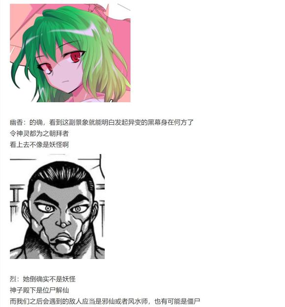
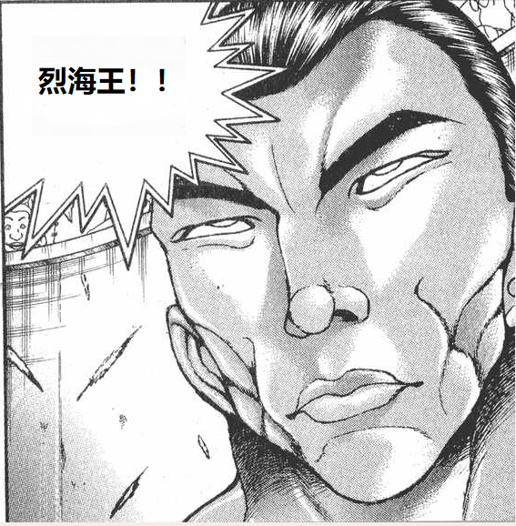
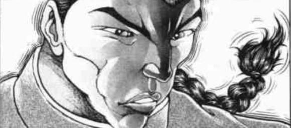
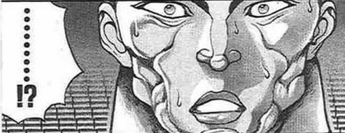
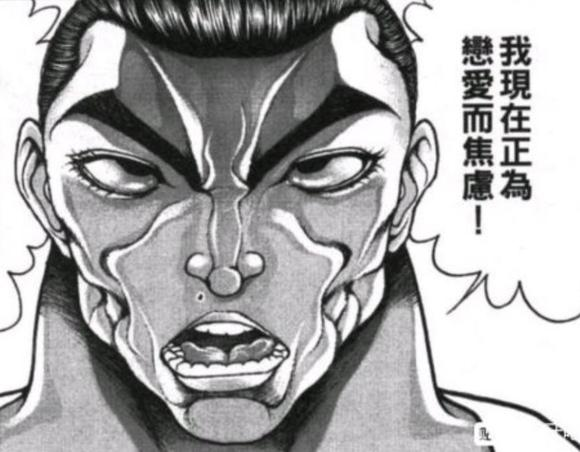

大概明晚七点半左右更新

~前情回顾~

顺利进入神灵异变之梦的烈海王，却发现他自梦中苏醒的地点正是那熟悉的太阳花田

武术家缓缓转头看去

那位绿发红瞳的大妖怪正坐在小桌旁饶有兴致地观察着眼前的陌生来客

幽香：真是稀奇

没想到新的异变刚刚开始，我的花田就迎来了意外的访客

你是谁？

烈海王要做什么【1d10:1】

1 这里就靠我烈海王的厨艺

2 这里就靠我烈海王的口才

3 实话实说（为啥啊）

4 这里就靠我烈海王的厨艺

5 这里就靠我烈海王的口才

6 要跑路了哦！（为啥啊）

7 这里就靠我烈海王的厨艺

8 这里就靠我烈海王的口才

9 这里就靠我烈海王的情商！（为啥啊）

10 大成功/大失败【1d2：1】

武术家尴尬地望着眼前神情愉悦的少女

对她说谎根本就没有一丝可能，但如果说实话又有很大概率被怀疑后开启战斗

于是，烈海王想到了他在花田使用过最多次的技术

烈：幽香——女士你好

我的名字叫做烈海王，职业是厨师

今日冒昧拜访花田，是想请你品尝我做的点心！

幽香：啊呀，这可真是

我都有些抑制不住想出手的冲动了

现在的厨师对于自身实力的要求都这么高了吗？

烈：毕竟是要请四季鲜花之主吃甜点

如果没有这点实力就过来，那该有多失礼啊

幽香：这时候又开始装模作样了？

明明你就算被吓到腿软也一样照来不误——

花田的暴君停下了口中无意识的话语

幽香：（有些走神了，莫非是这些神灵们的影响吗……）

食材和厨具都在那边的小屋内

这么有自信的话，就让我看看你的厨艺吧

至于你来花田的真正原因，等到之后再说也不迟

烈：我就知道瞒不过你

那么还请稍等片刻......

屠自古的战意【1d100：16】（50以上自己打，50以下拉布都过来一起）

屠自古：汝等看来绝非弱手

若单有吾一人迎击，只怕不出几合便要败于汝二人联手之下啊

既然如此，也莫要怪吾叫帮手了

来吧，吾之亲友，物部氏的布都呦！

【1d30：21】秒后，一脸迷茫的风水师从亡灵身后飞了出来

布都：啊啊，这一天终于到来了

前来祝福吾复活的人啊，报上名来！

屠自古：憨货！

看不出来吗，这是入侵者！

烈：说是侵入者也不太准确，实际上我是来找神子殿下的

我的名字是烈海王，职业是武术家

这位是风见幽香——

幽香：是你们最为厌恶的妖怪呢

布都：哦哦，原来如此

尚若吾在此刻以大妖作为贺礼，太子殿下定然会欣喜万分

物部秘术与道教融合后的威力

就在汝等身上试验下吧！

幽香：总算可以开始了

你要参战吗？

还是说，先独自往前走？

烈：我可不能让你独自面对两人的夹攻

久违的，愉快地来打上一场吧！

战斗！

BGM：大神神话传

物部布都&amp;苏我屠自古

Atk：275（260）

Hp：18

技能

司掌龙脉的风水师：不会受到异常状态的影响。每回合对自身进行一次【1d100】的开运判定，出目为1-40时无事发生，出目为41-70时为自身提供一次回避效果（一场战斗中仅可使用一次，第二次出现时变为Hp+2），出目为71-90时本回合Atk+15，给予伤害+2，出目为91-100时，本回合受伤/攻击的场合默认出现大成功（一场战斗中仅可使用一次，第二次出现时效果同71-90）。

屠自古的支援：与苏我屠自古并肩作战，Atk+15，技能/必杀技数目增多

风符【三轮的皿风暴】（CT1）：（弹幕系）一场战斗中仅能使用一次，利用旋转的盘子召唤旋风护体，3T内自身受到的所有伤害-2，给予伤害+1

天符【天之磐舟哟，向天飞升吧】（CT2）：（近战系）一场战斗中仅能使用一次，在飞跃于空中的泥船上向下方射出箭矢。Atk+55，给予伤害+3

雷矢【Gagouji Tornado】（CT3）：（弹幕系）以金红二色的雷霆构造毁灭性的龙卷，对对手造成【1d7】点伤害

投皿【物部氏的八十平瓮】（CT4）：（近战系）将祭祀用的平盘投出，利用其碎片阻碍对手的攻势。进行一次【1d100】的碎片判定，本回合Atk上升碎片出目值。

运气【破局的开门】（CT5）：（弹幕系）制作出降低运气的场，为对手带来不幸。进行一次【1d10】的厄运判定，出目为1时对手被木桶袭击，本回合Atk-60，受到伤害+2；出目为2-4时对手被木柜袭击，本回合Atk-80，受到伤害+4；出目为5-10时对手被UFO袭击，本回合Atk-120，受到伤害+6。（由于本战在灵庙前进行，UFO变为布都的泥船）本回合对手大失败概率翻倍。

必杀技

炎符【火烧樱井寺】（CT6）：以高温的炎弹重现过去焚毁寺庙的历史。Atk+675，给予伤害X4

怨灵【入鹿之雷】（CT7）：苏我氏的怨念，灭亡遗恨之雷。Atk+725，给予伤害X5

圣童女【太阳神的贡品】（CT8）：以弹幕重现对于天照大神的祭祀仪式，将对手化为神尝祭的贡品。无法回避/破解/防御，Atk+825，给予伤害X6

风见幽香

Atk 280

Hp 24

技能

四季鲜花之主：不会受到异常状态的影响，对特殊攻击手段拥有耐性。每回合回复1点Hp，上升【1d3】点Atk，Atk到达300点时不再上升

烈的支援：面对所有技能都可以进行【1d100】的破解判定，60以上成功

开幕的欢迎炮击（CT1）：（弹幕类）一场战斗中只能使用一次，毫无征兆的放出可怕的魔炮轰击对手，Atk+100，给予伤害X3，本回合无视对手的技能类减伤效果

Flower Shooting（CT3）：（弹幕类）对对手放出弹道诡异的花弹，造成必中的【3+1d4】点伤害

幻想春花（CT4）：（近战类）令巨大的花朵缓缓落下，对对手进行攻击。Atk+100，给予伤害+5

花符【幻想乡的开花】（CT5）：（自身加持类）不断放出如同盛开花朵一般的黄色弹幕进行攻击，3T内Atk+50，给予伤害+3,自身Hp回复X4（被破解的场合仅Hp回复效果消失）

必杀技

魔炮（CT6）：风见幽香的招牌技能，将魔力凝聚到极点之后放射出的魔炮攻击。Atk+750，给予伤害X5，伤害结算后对对手进行一次【1d100】的重伤判定，60以下Hp减半

幻想【花鸟风月，哮风弄月】（CT7）:无法回避/破解/防御 宛如花开一般释放回旋的黄色弹幕，最终以红黄二色弹幕的爆发收尾。Atk+825，给予伤害X6

双重超阔激光（CT8）：无法回避/破解/防御 分身后同时以最大功率释放双重魔炮轰击 Atk+950，给予伤害X6，本回合对手需进行一次察觉判定，60以下的场合无法判定真身，本回合自身无敌

T1

布都：见识一下吧，这便是我物部一族的风水术

符卡宣言 风符【三轮的皿风暴】！

烈的破解【1d100：26】失败

武术家刚想前去击破飞盘，就被亡灵的雷电所阻挠了脚步

屠自古：吾可不会让你轻易靠近啊

烈：可惜，没能在最开始的时候击破这些护盾

被它们阻拦可是很麻烦的

开运判定【1d100：14】无事发生

幽香Atk变为【280+1d3：3=283】

开幕的欢迎仪式发动

幽香的攻击【283+100+1d100：12=395】

差值大于100自动成功

花之暴君瞬间穿过了旋风的阻碍

她一把提起了矮小的风水师，然后笑着俯下身子，将伞尖凑到了她的眼前

幽香：如果这样直接攻击的话

你的护盾还会起效吗？

布都：吾，吾觉得这种战斗有些太过暴力了——

幽香：biu❤

可怖的魔力于伞尖爆发而出

头戴乌帽的风水仙人被轰飞到了灵庙的高墙之上！

布都的受伤【1d10：4】（由于技能效果不受到减伤影响）

1 回避

2 小伤害X3

3 小伤害X3

4 中伤害X3

5 中伤害X3

6 大伤害X3

7 大伤害X3

8 特大伤害X3

9 特大伤害X3

10 大成功/大失败【1d2：1】

Hp：18-2X3=12

屠自古：布都——快醒醒——

幽香：面对这种无足轻重的小技巧时

就要用简单而有效的办**服它

烈：娘嘞……

谢谢你当时用了拳头……

T2

头晕脑胀的风水仙人被亡灵从墙里抠了出来

布都：吾……吾不会让你继续靠近了……

符卡宣言 天符【天之磐舟哟，向天飞升吧】！

物部布都带着身旁的亡灵同伴登上了飞跃于空中的泥船

她抬手一指，便有无数闪亮的弓箭自天舟之上急速射出

烈的破解【1d100：96】成功

幽香：这就有点麻烦了呢

烈：我倒是有些破解的办法

介意把手交给我吗？

大妖怪看了看身旁的武术家，像今日初见时一样握住了他的手

烈海王将魔力暂时集中，以超人般的肉体向着头顶上的飞船一跃而起！

他轻而易举的穿过了风水师的层层箭雨，就这样站在了天舟之上！

屠自古：吾到底沉睡了多久？

现在的人类都有这般强大了吗？

开运判定【1d100：96】

本回合布都默认大成功！

布都：无需急切，屠自古

运气是站在吾等这一侧的

再强的力量，也无法战胜吾等胜利的命运！

幽香Atk变为【283+1d3：2=285】

幽香的攻击【285+1d100：33=318】

布都的攻击【275+1d100：51=326】

本应处于危难关头的仙人此刻却莫名充满了自信

在其即将受创的一刻，飞行中的天之舟忽然出现了一丝若有若无的震动

极为巧合的是，她恰好借此机会躲过了大妖怪的攻击！

绝大的破绽出现在她的眼前，风水师手中飞盘一闪，便在最近的距离下对对手造成了迎头一击！

幽香的受伤【1d10：6】（默认布都大成功）

1 小伤害X2+1

2 小伤害X2+1

3 中伤害X2+1

4 中伤害X2+1

5 大伤害X2+1

6 大伤害X2+1

7 特大伤害X2+1

8 特大伤害X2+1

9 战斗不能

10 大成功/大失败【1d2：2】

Hp：24-3X2-1=17

幽香：利用运气的攻击，真有趣

话说，我还以为你会自顾自地挡在我身前呢

烈：怎么可能

这可是难得的享受战斗的机会

如果我敢这么做的话，接下来就会变成我们之间的战斗咯

幽香：你这不是很懂嘛❤

T3

Hp：17+1=18

屠自古：接下这万钧雷霆吧！

符卡宣言 雷矢【GagoujiTornado】！

烈的破解【1d100：43】失败

幽香的受伤【1d7：2】

Hp：18-2=16

大妖怪向着那金红色的闪电伸出了手掌

她轻笑着微微一握，便将那闪烁的雷霆捏碎在了手中

幽香：没有了吗？

那就，该我反击了

Flower shooting

布都的受伤【3+1d4：3=6-2=4】

Hp：12-4=8

布都：呜哇，好疼！

为什么这里会有花啊？！

幽香：因为我在这里

就算是遥远的云端之上，只要我想也会有鲜花盛开

开运判定【1d100：78】

本回合Atk+15，给予伤害+2

幽香Atk变为【285+1d3：1=286】

幽香的攻击【286+1d100：49=335】

布都的攻击【275+15+1d100：12=302】

即使有着幸运的加持，风水师也依然难以抹消那巨大的力量差距

大妖怪轻描淡写地打飞了布都的弹幕，而后一伞抽向了被旋风所护佑的风水师！

布都的受伤【1d10：1】

1 回避

2 小伤害-2

3 小伤害-2

4 中伤害-2

5 中伤害-2

6 大伤害-2

7 大伤害-2

8 特大伤害-2

9 特大伤害-2

10 大成功/大失败【1d2：2】

仅剩最后一丝力量的风盾毫无意外地倒在了幽香的阳伞下

见势不妙的亡灵在最后一刻赶忙拖走了呆愣的布都

“轰！”

挥空的阳伞在泥船的甲板上打出了一个巨大的空洞

刚刚复活的豪族们习惯性地擦了把脸上并不存在的冷汗

布都：亲友，吾被你救了一命啊……

屠自古：刚刚复活就遇到这么可怕的妖怪

莫非外界已经是人间地狱了吗？！

烈：怎么说呢

外界都挺好的，只是你们跑到妖怪的聚集地了……

T4

风符效果结束

Hp：16+1=17

布都：怎么可能，此处可是太子所沉眠的灵庙啊

接招 投皿【物部氏的八十平瓮】！

烈的破解【1d100：86】成功

头戴乌帽的风水师投出了祭祀用的平盘

她正准备将其粉碎后化为破片，却发现对面的武术家做出了一个奇异的动作

烈海王将手送到了嘴边——

烈：破！

武者的气箭将刚刚投出的飞盘在原地打得粉碎

布都的攻击在刚开始的第一步就就已经宣告了完结！

幽香：碍事的小东西被吹走了~

来，继续赏花吧！

幻想春花发动

开运判定【1d100：78】

本回合Atk+15，给予伤害+2

幽香的Atk变为【286+1d3：1=287】

幽香的攻击【287+100+1d100：80=467】

差值大于100自动胜利

豪族们一脸绝望地看着天上那巨大的花朵

布都：屠自古

连花都变成了这般样子

当今究竟是多少年后了？

屠自古：冷静点，布都

这等荒谬的场景，定是沉睡中的梦境

吾等必然还未苏醒呢！

布都的受伤【1d10：3】

1 回避

2 小伤害+5

3 小伤害+5

4 中伤害+5

5 中伤害+5

6 大伤害+5

7 大伤害+5

8 特大伤害+5

9 特大伤害+5

10 大成功/大失败【1d2：2】

Hp：8-1-5=2

风水师挣扎着从巨大的花朵下爬了出来

布都：不是……梦啊……

烈：（不，确实是梦来着……）

T5

布都：可恶，至少要为太子大人的复活争取足够多的时间

就用厄运对汝降下诅咒

运气【破局的开门】！

风水师双手合十，盘膝而坐，运用风水秘术召唤出了莫名的力场

阴森而不幸的力量从中凭空出现，名为厄运的诅咒在此刻降临在了大妖怪的身上！

厄运判定【1d10：1】

数量众多的木桶突然从空中掉了下来！

风见幽香抬手拦下了准备行动的烈海王

幽香：你先不要插手哦，我还想再玩一会呢

符卡宣言 花符【幻想乡的开花】

大妖怪释放了她那海量的生命力

在她那独一无二的能力影响之下，即使是灵庙的墙壁上也开出了明媚的鲜花

开运判定【1d100：85】

本回合Atk+15，给予伤害+2

幽香的Atk变为【287+1d3：1=288】

幽香的攻击【288+50-60+1d100：15=293】

布都的攻击【275+15+1d100：83=373】

布都：竟敢独身面对吾等的攻势

汝真真是太过大意了

屠自古：就用汝之身躯领会吧，吾等豪族的怒火！

风水师与亡灵自相反的方向飞奔而出，向着花丛中静立不动的大妖怪发起了夹击！

幽香的受伤【1d10:10】

1 回避

2 小伤害+2+2

3 小伤害+2+2

4 中伤害+2+2

5 中伤害+2+2

6 大伤害+2+2

7 大伤害+2+2

8 特大伤害+2+2

9 特大伤害+2+2

10 大成功/大失败【1d2：1】

大成功！

幽香的反击！

绿发红瞳的少女从正面面对着两人的夹击，脸上却毫无俱意

她轻轻侧转着自己的身体，飞盘与雷弹便与她的发梢擦身而过

风见幽香顺手撩了下被稍稍吹乱的发丝

她抬眼看向了身前那一脸惊愕的两位豪族

而后微笑着举起了手中的阳伞

布都的受伤【1d10：9】

1 回避

2 小伤害

3 小伤害

4 中伤害

5 中伤害

6 大伤害

7 大伤害

8 特大伤害

9 特大伤害

10 大成功/大失败【1d2：1】

Hp：2-4=0

被幽香拦在身后的烈海王于心不忍地捂住了脸

片刻之后，只听一声巨响，灵庙的高墙之上就被砸出了两个人形的大坑

幽香：真可惜，还以为可以多打一阵呢

特意委托我过来就是为了干掉她们？

烈：说实话我当时最主要的目的，其实真的就是想请你吃甜品来着

邀请你一块出门只是顺口一提的理由，没想到你真同意了……

大妖怪悠哉地撑开了阳伞

幽香：偶尔出门打一场也不错啊~

战斗结束

胜者 风见幽香&amp;烈海王！

【1d20：17】分钟后，两眼无神的布都与屠自古从墙里爬了出来

布都：咕

刚刚复活就遇到这般强敌

今有此败，也属无奈

屠自古：汝的借口还是和以前一样糟糕

烈：战斗也已经结束了

请问神子殿下就在这建筑之内吗？

屠自古：太子大人现在还在沉睡中——

等等，空中飘荡的这些莫非是低俗灵？

这么说太子大人即将要复活了啊

不可在此久留，吾等先失陪了！

屠自古拉着布都飞走了

幽香：这灵庙的深处确实有着强者的气息

那就是你想要挑战的对象吧？

烈：是的

那是位帮我过很多忙的，值得尊敬的人物

幽香：是了

这位仙人明明还没苏醒，你却已经认识她了

就像你早就已经见过我一样，对吧？

烈的震惊【1d100：75】（50以上说漏嘴）

烈海王吓得跳了起来

烈：不是，幽香，我真不知道这事该怎么说明

啊！

武术家满脸慌张地捂住了嘴

幽香：没关系，没关系

我一点都不着急~

等到你的战斗结束之后，再来慢慢说明情况吧？

烈：多谢——

幽香：亲 爱 的

大妖怪一边哼着歌一边推开了灵庙的大门

不知为何冒出了冷汗，但又不知为何心跳不已的武术家跟在恋人的身后，走进了那未知的黑暗之中

神子的察觉【1d70：61+30=91】（50以上察觉来意，90以上察觉梦境）

圣德太子闭目聆听了数秒之后，却面带疑惑地扫了眼面前的两位来客

她无意识地拍了拍手中的笏板，而后忽然间捧腹大笑了起来

神子：哈哈哈哈哈！

真是笑死我了

想打架的话直说即可，何必用这样拐弯抹角的方式？

这可不像你一直以来的作风啊，烈海王！

烈的震惊【1d100：61】

烈：这么快就察觉到了？！

神子：忘记了吗？

【现在】的我可还刚刚苏醒，对能力根本就没怎么压制

就连你接下来想说的话，我都知道哦

幽香：恭喜，你完全被看透了~

烈：说实话，我在进入这个梦境之前也确实不知道这是您发起的异变

那么——并没有什么特别的理由，要来上一场吗？

神子：让我看看吧，500余日前那脆弱的武人，如今成长到了何等地步

来吧，试着打倒我吧！

烈：永远亭，烈海王

请指教！

战斗！

BGM：圣德传说　～ True Administrator

烈海王

Atk：275（142）

Hp：21

技能

烈海王：超越海皇，仍为海王。AtkX1.9，Hp+1。不会陷入异常状态，不会受到驻足，束缚等判定影响，面对所有技能都可以进行【1d100】的破解判定，60以上成功

完全消力：普通攻击以及近战系、弹幕系技能所造成的的最终伤害/2（仅对Atk260以下的对手起效）自身所收到的普通攻击伤害-1，近战系、弹幕系技能伤害-2（仅对Atk261以上的对手起效）

异红符【巨阙】（CT3）：（近战系）本回合Hp-1，Atk+80，给予伤害+4

Flower star（CT4）：（弹幕系）对对手造成必中的【2+1d6】点伤害。

假腿【The World】:为了锻炼自身而暂时封印

急救拳：一场战斗中只能使用一次，Hp归0后回复1点Hp

贫穷神的加护：由于身在梦中而无法使用

必杀技

纯粹武道（CT5）：怀抱纯粹的武术，心存无色的执着。3T内Atk+70，对对手造成的伤害+3。3T内可对所有攻击进行【1d100】的破解判定，近战系、技巧系技能30以上成功，其余技能40以上成功，必杀技60以上成功

超人【烈海王】（CT6）： Atk+675，给予伤害X4，其后2T内Atk+25，回避概率翻倍

武符【梦幻斗舞】（CT7）：无法回避/破解/防御，本回合自身无敌，给予伤害X2，进行一次【1d100】的反击判定，30以上可对对手的攻击进行反击

秘术【天文密葬法】（CT8）：制造虚假的月亮，削弱妖怪的力量，3T内战斗环节中，妖怪对手的Atk变为与自身最终结算后相同，自身的战斗骰变为【2d100】但同时无法使用破解，无法回避/破解/防御，给予伤害X2/引导宇宙的力量，发出轨道诡异的大量弹幕轰击无法回避/破解/防御 Atk+900，给予伤害X6

丰聪耳神子

Atk：290

Hp：22

技能

司掌宇宙的全能道士：不会受到异常状态的影响，对特殊攻击手段拥有耐性。自身所造成的所有伤害+1，自身所受到的所有伤害-1，自身战斗骰为【2d60】，自身技能/必杀技的破解/回避/防御判定所需成功值+10

名誉【十二阶之冠位】（CT1）：一场战斗中仅能使用一次，令大小不同的六色弹幕四散而开，将对手如同旧时代般击成粉碎。对对手进行一次【1d12】的名誉判定，出目为1-6时对手本回合Atk-30，受到的伤害增加出目数值。出目为7-12时对手本回合造成的伤害减少出目-6的数值，但同时受到出目数值-6的伤害。

仙符【日出之处的天子】（CT2）：一场战斗中仅能使用一次，发出强烈的光辉浸彻天地，吾为日出之国的统治者。本回合自身回避概率翻倍，给予伤害X2。

召唤【豪族乱舞】（CT3）：一场战斗中仅能使用一次，来吧我忠诚的部下们。本回合自身无敌，Atk+85，攻击成功时可令对手进行第二次受伤判定。（被破解的场合仅第二次受伤效果消失）

秘宝【圣德太子的欧帕兹】（CT4）：一场战斗中仅能使用一次，以旋转的弹幕重现奥秘的星空。对对手造成必中的【3d4】点伤害。

光符【Guse Flash】（CT5）：一场战斗中仅能使用一次，此为拯救世界的神圣之光。3T内自身Atk+60，每回合对对手造成3点伤害，本回合进行一次【1d100】的特殊攻击【威严】判定，出目高于30时本回合战斗自动胜利。（被破解的场合仅造成伤害与威严效果消失）

必杀技

神光【无忤为宗】（CT6）：以手中之宝剑迸射十七条闪光，配以无限的札弹将对手逼入绝路。Atk+725，给予伤害X4，2T内自身受到的最终伤害减半。

道符【掌上的天道】（CT7）：无法回避/破解/防御，以道术构建模拟的宇宙，天道即在我的手中。Atk+825，给予伤害X5。本回合造成伤害后进行一次【1d100】的和谈判定，50以上成功，成功时宣告战斗结束。

【新生的神灵】（CT8）：无法回避/破解/防御，众灵来朝，星辰降落，庆贺吧！Atk+925，给予伤害X6。

T1

神子：我生前用人不论出身家事，只看真才实学

德仁礼智信义，紫青赤黄白黑，如今的你可任何阶？

符卡宣言 名誉【十二阶之冠位】！

烈的破解【1d100：44】失败

名誉判定【1d12：9】

烈海王的受伤：9-6-2=1

Hp：21-1=20

本回合烈海王造成的伤害-3

大小各异的六色弹幕自仙人的手中四散而出

武术家的身上亮起了薄青色的光芒

神子：哦呼，是第九阶

不错啊，这是相当高的评价！

烈的攻击【275+1d100：46=321】

神子的攻击【290+2d60：59=349】

烈的受伤【1d10：8】

1 回避

2 小伤害-1+1

3 小伤害-1+1

4 中伤害-1+1

5 中伤害-1+1

6 大伤害-1+1

7 大伤害-1+1

8 特大伤害-1+1

9 特大伤害-1+1

10 大成功/大失败【1d2：2】

Hp：20-4+1-1=16

圣德太子一抖披风，便瞬移到了武者的身后

她以无形的刀刃射向了措手不及的对手，在第一回合就给予了他沉重一击！

烈：这般高的评价就没点优待吗？

神子：放在过去还能给你发点俸禄

现在的话嘛——起码名字还挺好听的，哈哈哈！

T2

神子：日落之国的武者，可否战胜这日出之地的光辉？

符卡宣言 仙符【日出之处的天子】！

圣德道士将手中的笏板高高举起，浸彻天地的光辉便从她的身侧放射而出

复活的仙人此刻仿佛化作了光彩夺目的太阳，将这幽暗空间的每一个角落都尽数照亮，令眼前的敌人无处可逃！

烈的破解【1d100：97】成功

但身经百战的武术家却并不慌张

他精准地穿梭在那看似天衣无缝的光辉之中，最终竟然毫发无伤地来到了道士的身前

烈：以观赏性符卡的角度来说，确实是相当耀眼的光辉

但在这四千年的传承之前，号称日出可就言过其实了！

烈的攻击【275+1d100：44=319】

神子的攻击【290+2d60：80=370】

烈的受伤【1d10：3】

1 回避

2 小伤害-1+1

3 小伤害-1+1

4 中伤害-1+1

5 中伤害-1+1

6 大伤害-1+1

7 大伤害-1+1

8 特大伤害-1+1

9 特大伤害-1+1

10 大成功/大失败【1d2：2】

Hp：16-1+1-1=15

武术家硬挡了一击笏板的抽击

神子：烈海王，我一直很欣赏你这输人不输阵的口才

烈：被神子殿下这般称赞，真是令我受宠若惊！

T4

神子：过去的我难以想象，凭借仙人的力量竟能将星相握于掌中

看吧，这就是我为之陶醉的美丽星空

符卡宣言 秘宝【圣德太子的欧帕兹】！

烈的破解【1d100:28】失败

烈的受伤【3d4：7-2=5】

Hp：14-5=9

闪烁的光玉凭空出现，人造的星空于此流转

神子凭借自身的道术，将这广阔的灵庙化为了只属于她的天球仪

身在其中的武术家根本无处逃脱，而被吞没在了这旋转的星空之中！

烈：真是大手笔的弹幕，不愧是神子殿下

现在该我还击了

接招 Flower star！

幽香：啊啦，这不是我的花弹吗

怎么被改成这样了

神子的受伤【2+1d6：5-1=6】

Hp：22-6=16

神子：居然成功伤到了我

你已经可以引以为豪了

烈：这点程度可远远不够

起码要将您的全力逼出来才行啊！

烈的攻击【275+1d100：1=276】

神子的攻击【290+2d60：74=364】

烈的受伤【1d10：5】

1 回避

2 小伤害-1+1

3 小伤害-1+1

4 中伤害-1+1

5 中伤害-1+1

6 大伤害-1+1

7 大伤害-1+1

8 特大伤害-1+1

9 特大伤害-1+1

10 大成功/大失败【1d2：1】

Hp：10-2+1-1=8

仙人一脚踢飞了正准备攻击的武术家

神子：连出拳的力气都没有了，还在这里放狠话？

要不要等你睡醒了再接着打啊？

烈：多谢关心

我还没累到那个地步！

T5

神子：那就仰视吧！叹服吧！而后崇拜这神圣的光芒吧！

我会容纳所有的欲望

我会背负人类的未来！

符卡宣言 光符【Guse Flash】！

众生的祈愿化作了七彩的光芒，似曾相识的佛光以太子为中心放射而出

普通的凡人早已拜倒在这无与伦比的威压之下，连坚毅的武者此刻都难以发起反抗的念头！

纯粹武道发动

烈的破解【1d100：64】成功

烈：在见过摩多罗女士的佛光之后，我就已经不会再怕这种攻击了！

你尝尝中华武术的厉害吧！

烈的攻击【275+70+1d100：67=412】

神子的攻击【290+60+2d60：49=399】

神子的受伤【1d10：2】

1 回避

2 小伤害-1+3

3 小伤害-1+3

4 中伤害-1+3

5 中伤害-1+3

6 大伤害-1+3

7 大伤害-1+3

8 特大伤害-1+3

9 特大伤害-1+3

10 大成功/大失败【1d2：1】

Hp：16-1+1-3=13

圣德太子举剑挡下了武者的重拳

烈：您要不要也歇歇再打？

我一向是无所谓的！

神子：这可真是体贴的对手

不过这时候我刚睡了将近一千五百年——

休息的时间早就够了！

T6

神子：以道德规章治人心叵测

集三教之长宣吾之威光

永远平和的浩然盛世，寄于此十七条宪法之上！

符卡宣言 神光【无忤为宗】！

圣德太子的规章化作了十七条浩荡的光芒

无限的札弹井然有序地列成七彩的纵队，向那前来挑战的武者宣扬着太子的威光！

烈的破解【1d100：10】失败

烈：如此浩大的攻击却完全找不到一丝破绽，不愧是神子殿下

这个时候，用这招却是正好

符卡宣言 异红符【巨阙】

符卡宣言 超人【烈海王】！

Hp：7-1=6

手持血剑的武者运转起了习自圣僧的超人之术

佛门的魔法与道家的秘术正面相撞，这梦境中的灵庙深处却再次上演了佛道之争！

烈的攻击【275+70+80+675+1d100：93=1193】

神子的攻击【290+60+725+2d60：64=1139】

神子的受伤【1d10：10】

1 回避

2 小伤害X4-1+3+4/2

3 小伤害X4-1+3+4/2

4 中伤害X4-1+3+4/2

5 中伤害X4-1+3+4/2

6 大伤害X4-1+3+4/2

7 大伤害X4-1+3+4/2

8 特大伤害X4-1+3+4/2

9 特大伤害X4-1+3+4/2

10 大成功/大失败【1d2：2】

神子大失败！

烈海王的行动速度远远超乎了神子的预料

灼热的激光与绚丽的札弹在超人化的武者面前根本没能构成阻碍

而尚未做好准备的道士，却已经要面对那突如其来的痛击！

烈：承让了，神子殿下！

神子的受伤【1d10:1】

1 小伤害X4X2-1+3+4/2

2 小伤害X4X2-1+3+4/2

3 中伤害X4X2-1+3+4/2

4 中伤害X4X2-1+3+4/2

5 大伤害X4X2-1+3+4/2

6 大伤害X4X2-1+3+4/2

7 特大伤害X4X2-1+3+4/2

8 特大伤害X4X2-1+3+4/2

9 战斗不能

10 大成功/大失败【1d2：2】

Hp：13-（1X4X2-1+3+4）/2=6

圣德道士在危机关头做出了最为正确的反应

她放弃了手头的攻击并果断进行了一次瞬移，以最轻的伤势撑过了这势在必得的突击

神子：圣亲自施展的超人术我都躲得过去

你这才练了两年不到还想让我翻船？

烈：合着您跟白莲师傅打的时候也得躲啊？

神子：我是哪根筋想不开才会跟她比肉体力量啊？

T7

神子：圣德太子的招式已经用完了

现在，该让司掌宇宙的全能道士登场了

符卡宣言 道符【掌上的天道】！

圣人在手中以魔力构建了一个精雕细琢的迷你天球

这湛蓝色的小小星空在她的掌中以令人惊叹的速度不断膨胀

仅仅数秒之后，两人交战的所有区域就被这迷你的宇宙所吞噬其中！

神子：看吧

这就是，我的天道！

烈：那也请您看好了

此为，我的武道！

符卡宣言 武符【梦幻斗舞】！

平衡了精神与生命的武者与无数闪烁的星辰擦肩而过，却丝毫没有被其所伤

他就这样遨游于天道之中，在这模拟的宇宙里跳起了奇妙的舞蹈！

神子的攻击【290+60+825+2d60：42=1217】

烈的反击【1d100：27】失败

烈的受伤：本回合无敌

仙人手中的宇宙逐渐暗淡了

而武者的舞蹈也在此刻结束

两人又重新回到了战斗开始时的距离

烈：在最后错失了攻击的机会，真是可惜

神子：很厉害嘛，烈海王

没想到你居然撑过了这一招

接下来，就是我今日最后的一张符卡了

T8

纯粹武道效果结束

光符【Guse Flash】效果结束

神光【无忤为宗】减伤效果结束

早已退场的豪族们激动地挥起了手

屠自古：庆贺吧！

她是知晓一切的神圣之子！

布都：庆贺吧！

她是拯救世界的伟大之人！

神子：此刻，我的复活终于完成

诞生之时已至，此为【新生的神灵】！

头戴耳机的圣人举手指向了天空

那无穷无尽的神灵便化作了闪亮的晨星

这既非道术，也非魔法

小小的神灵们义无反顾地燃烧着自己的一切

只是为了这终于复活的仙人献上它们的祝福

于是

灵庙之上，星落如雨

烈：那我便以最强的一击献上祝福！

符卡宣言 秘术【天文密葬法】！

诡秘的宇宙之力在这究极的密室中化作弹幕出现在了武者的身旁

神灵与使魔捉对厮杀

流星与魔弹相互泯灭

人造的宇宙与新生的神灵，在此刻毫不保留地正面相击！

那璀璨的魔力穿越了广阔的灵庙，穿透了幽深的洞窟，在命莲寺的墓地之上形成了一道通天透地的光芒！

烈的攻击【275+25+900+1d100：75=1275】

神子的攻击【290+925+2d60：106=1321】

烈的受伤【1d10：7】

1 小伤害X3-1（无法回避）

2 小伤害X6-1

3 小伤害X6-1

4 中伤害X6-1

5 中伤害X6-1

6 大伤害X6-1

7 大伤害X6-1

8 特大伤害X6-1

9 特大伤害X6-1

10 大成功/大失败【1d2：1】

Hp：7-3X6+1=0

震荡天地的轰击结束了

那明亮的光芒逐渐消散，神灵庙再次回到了幽暗的空间之中

圣德太子伸手一抖背后的斗篷，而后漫步走向了倒在地上的武术家

神子：你还不至于在此处倒下吧？

我猜猜——是急救术和花弹？

烈海王使用了急救拳

Hp：0+1=1

武术家挣扎着将拳头锤向了自己的胸口

于是本来已经无法战斗的武者再一次站了起来

烈：这可是幽香教我的护身术

接招 Flower star！

Flower star 发动

神子的受伤【2+1d6:5-1=6】

Hp：6-6=0

烈海王的花弹再次命中了眼前的神子

精疲力竭的两人同时坐到了地上

神子：啊疼疼疼！

连续两次都这么疼，好过分的招式！

早点用的话，说不定我连最后的符卡都用不出来哦

烈：日常切磋的时候哪能这么打呢？

神子：少来这套

你为了看到厉害的招式，哪怕异变的时候也会这么干吧？

烈：干正事的时候应该不会这么做的！

还打吗，神子殿下？

神子：按规则都打赢了还在这问？

真是的，是你胜利了！

仙人和武术家看了看对方那灰头土脸的样子，而后不约而同地笑了起来

战斗结束

胜者 烈海王！

【1d30：19】分钟后，满脸坏笑的神子正看着接受大妖怪治疗的烈海王

神子：那么，虽说这话有点迟了——

你该如何应对现在的四季鲜花之主呢？

烈：！

我——

幽香：动作不要这么夸张嘛~

你看，伤口这不是又裂开了？

神子：哈哈哈，二位慢走不送啊！

我要去这梦境的别处看看咯

龇牙咧嘴的武术家牵着大妖怪的手离开了神灵庙

烈与幽香要干什么【1d10：5】

1 回太阳花田吧

2 去三途河边吧

3 就这么边走边聊吧（为啥啊）

4 回太阳花田吧

5 去三途河边吧

6 去永远亭吧（为啥啊）

7 回太阳花田吧

8 去三途河边吧

9 去买西装吧（为啥啊）

10 大成功/大失败【1d2：2】

烈：感觉有些事情不太好说明

我们……去三途河畔吧？

幽香：哇哦，真是完美的约会地点

不愧是你啊，烈海王

烈：这地方当初是你选的啊！

幽香：原来如此

不愧是我

~三途河~

【1d60：56】分钟后，悠闲的恋人们慢慢悠悠地飞到了三途河畔

梦境之中的三途河没有烈海王所开设的辅导班

因此这里依然是那副空空荡荡的样子

他们像第一次来时那样手牵着手，穿过了迷茫的雾气，坐在了寂静的河岸边

烈与幽香要做什么【1d10:9】

1 这里就靠我烈海王的口才

2 幽香：我们是怎么认识的？

3 要来学武术吗（为啥啊）

4 这里就靠我烈海王的口才

5 幽香：我们是怎么认识的？

6 要钓鱼吗（你俩想啥呢）

7 这里就靠我烈海王的口才

8 幽香：我们是怎么认识的？

9 要来kiss吗（为啥啊）

10 大成功/大失败【1d2：1】

谁主动的【1d2：1】

1 烈

2 幽香

武术家坐在恋人的身旁，绞尽脑汁地想着之后说明的话语

烈：（直接说这是个梦境感觉气氛会很糟糕！但如果从头开始慢慢说明的话我实在没有成功的自信！）

（想想第一次约会的时候是怎么做的……我想想，做了聊了会天然后kiss……kiss？）

武术家扭头看向了身旁的大妖怪

烈：我知道这么说很奇怪！

但是我想不出什么更好的办法了

来kiss吗，幽香？

幽香：啊呀？

你当时明明连牵手都慌的不行呢

居然主动提出这种要求，这可是值得纪念的第一次哦——

风见幽香停下了口中无意识的话语

像初次约会时一样，绿发红瞳的少女忽然将脸贴近

于是，唇与唇相接

这次的吻不再是那蜻蜓点水般的一沾而过

因为眼前的男子反手抱住了她

他们将这甜蜜的吻持续了下去

似乎像是过了很久，又似乎只是过了数秒，两人才恋恋不舍地将唇分开

幽香：在梦里对毫无记忆的恋人提出这种要求，可算不上是正直的行为哦❤

烈的情商【1d100：13=20】（保底情商20）

烈：公平公正地讲，当时是你先搞突然袭击的

我觉得这属于合理的报复行为

幽香：不如我接着报复下去吧？

烈：——是我错了，要刀要剐悉听尊便！

大妖怪笑着靠在了恋人的肩膀上

幽香：那就保持这个姿势不许动

就这样让我依靠一会吧

烈和幽香要做什么【1d10:6】

1 关于梦境

2 就这样聊聊吧

3 关于三途河（为啥啊）

4 关于梦境

5 就这样聊聊吧

6 关于西装（为啥啊）

7 关于梦境

8 就这样聊聊吧

9 野生的妖怪出现了（为啥啊）

10 大成功/大失败【1d2：2】

烈：说起来，幽香

你之前说过想穿西装

一定要是黑的吗？

幽香：白色的西装也不是不可以

突然就要开始婚礼的准备了吗？

烈：还没有急切到那般地步

只是之前买衣服的时候，感觉白色的西装穿在你身上大概会更加亮眼一些

幽香：哦~

你该不会，经常幻想我穿其他服饰的样子吧？

烈的意志力【1d70：60+30=90】（75以下有）

烈：不不不

我平常是绝对不会有这种想法的！

即使在梦里也一样！

幽香：好好，相信你哦

毕竟在梦里见到我之后的第一反应居然是做甜品

现在想想真是不知道说什么好了呢

烈：主要是我还保留着现实中的记忆

于是就又一次变成了和之前一样的发展

幽香：说到这个

如果我刚刚遇到的你同样没有记忆

你觉得以现在的实力，你会怎么做呢？

烈的回答是【1d10:2】

1 靠我烈海王的口才

2 战斗！

3 果然还是厨艺（为啥啊）

4 靠我烈海王的口才

5 战斗！

6 直接发出邀请（为啥啊）

7 靠我烈海王的口才

8 战斗！

9 告白（有道理吗？）

10 大成功/大失败【1d2：2】

武术家闭目思考了一阵

烈：我觉得

如果跟一个强大的对手在这种尴尬的境地下见面

果然，会发起战斗吧？

幽香的眼神不知为何变暗了一些

幽香：我估计会打的很开心……

也有可能被你那无往不利的口才所直接激怒了？

幽香：而在这场突如其来的战斗结束之后

你会回到永远亭或者继续解决异变

而我会继续住在花田中

继续那一成不变的日常——

她背靠着恋人，在他所看不到的地方微微低下了头

烈的情商【1d100：82】

而后，武术家接下了她的话语

烈：还有之后

幽香：之后？

烈：之后我会觉得，那个绿色头发的大妖怪真的好厉害啊

我会想，不如以后再去找她打一场吧

大妖怪的眼睛亮了起来

幽香：然后呢？

烈：然后，你想啊

想要经常打架的话可必须和这个大妖怪搞好关系

这时候就得靠我拿手的厨艺了吧？

那么我就不得不经常去花田给她送点心了

笑容又一次回到了幽香的脸上

幽香：再之后呢？

烈：在之后......

我会发现这个大妖怪其实很爱听音乐，所以我说不定会帮她办音乐会

我会发现这个绿发红瞳的少女其实是位情报强者，所以我遇到麻烦会常常找她帮忙

我会发现她真的很美丽，我会发现她的性格真的很好，我会不由自主地想要帮她解决一切问题，哪怕那只不过是些鸡毛蒜皮的琐事——

最后我会发现

我早就已经无可救药地爱上了风见幽香

她在恋人看不到的地方开怀的笑着，并轻轻擦拭着眼角的泪珠

幽香：——不许回头看我哦

烈：当然

我听你的

