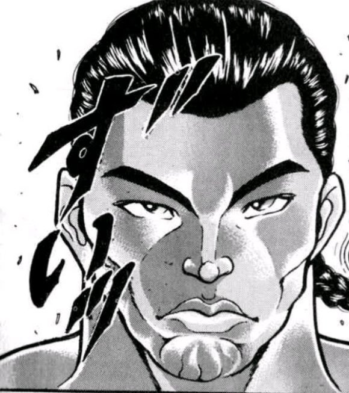
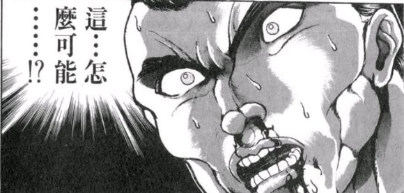
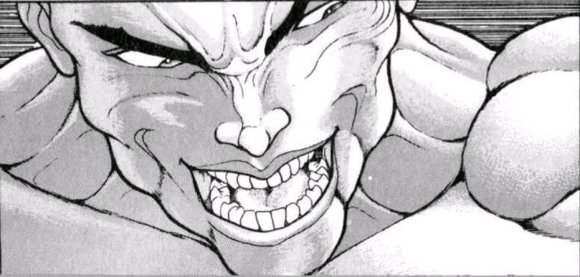
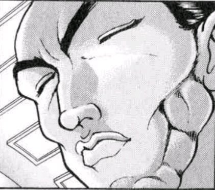
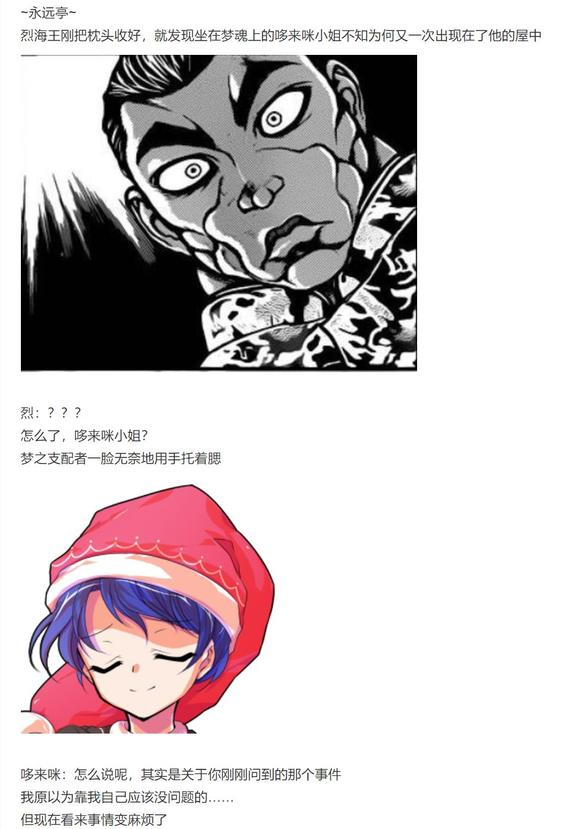

【1d60：51】秒之后

~神灵庙~

本应从梦中醒来的烈海王睁开了双眼

他发觉自己再次来到了一个熟悉的地方

烈：这不是神灵庙吗

难道说这个梦境还没结束？！

他抬眼看向了天上刺眼的阳光，正准备四处打探下情报，却发现神灵庙的门口处忽然开了一扇【门】

他目瞪口呆地看着某位身穿黄绿二色狩衣的贤者把一个看上去非常眼熟的人从门中运了出来

烈：不会吧？！

这是？！

秘神大人听到他的惊呼后往这边看了一眼

摩多罗：咦？

啊啊……你做梦的时候是不是遇到了什么让你情感激荡的事情？

不然不至于出这种恶性的故障啊

烈：哈啊？！

您是梦中的摩多罗女士还是现实中那个？

摩多罗：真是古怪的问题

不如你去问问哆来咪·苏伊特，看看她是梦中的貘还是现实中的貘啊？

哦哟，别说话

有意思的场景要出现了~

秘神拖着武术家钻进了一旁的门中

只见头戴耳机的圣人推开了神灵庙的大门

神子：呀今天真是好天气~

……

……

充分欣赏了老上司那震惊的表情并确定烈海王的平安之后，秘神大人心满意足地关上了门

烈：？？？？？？？？？

摩多罗女士，我已经完全无法理解了！

摩多罗：啊~哈~哈~

那很正常，因为你在做梦

梦里什么事情都有可能发生，不是吗？

烈：额，啊

我现在在做梦？

摩多罗：现在是该起床的时间了

别着急，想要探究梦境的话，不久之后还有机会

那么——

早安，烈海王

~永远亭~

~烈海王的房间~

烈海王眼前的世界轰然破碎

他猛地从床上爬起身来，检查了一遍那变得空空荡荡的梦之容器后，有惊疑不定地看了看表

烈的相信【1d100：96】大成功（50以上相信自己回到了现实）

（顺便一提这里确实就是现实）

草，相信大成功是什么【1d10：8】

1 今天的早饭超水平发挥

2 幽香来到了永远亭

3 魔理沙来到了永远亭（为啥啊）

4 今天的早饭超水平发挥

5 幽香来到了永远亭

6 Atk上升了（为啥啊）

7 今天的早饭超水平发挥

8 幽香来到了永远亭

9 Hp上升了（为啥啊）

10 大成功/大失败【1d2：2】

“咚咚咚”

绿发红瞳的大妖怪正在敲着他房间的窗户

幽香：介意我一块吃早饭吗？

不可思议的是

在看到幽香的一瞬间，那惊疑不定的心就平静了下来

武术家笑着打开了窗户，然后一把将大妖怪抱进了自己的房间内

烈：——随时欢迎！

时值夏季，阳光明媚

虚无缥缈的梦境结束了

烈海王开始了他全新的一天

完成了神灵异变之梦！

成就：圣德道士 达成！

在不用假腿的情况下战胜了丰聪耳神子

得到了一次利用假腿开发新符卡的机会（作为常驻技能，无使用限制）

此后非异变时期将默认使用该新符卡，异变时期则视情况使用原本的假腿功能

（本日的更新结束，下一次的更新在周日或周一或周二，具体看情况）

（以下是我的废话）

那么本次的神灵异变之梦兼永琳个人回兼幽香个人回到此结束

嗯，会出现后面两个平行的发展怎么想都很奇怪

不如说太奇怪了吧？！

开场那个厨艺大成功我已经完全懒得吐槽了！

倒不如说一看到满点数的第一反应已经变成了“果然是这样”而不是“居然大成功”，说实话要是不是大成功我反而还会奇怪哦？！

其实幽香的双打战我觉得娘娘和芳香会打的更好看一些，因为原计划是打算把芳香做成很恶心的回血肉盾战士这种感觉

但突然想起来芳香战力不大行得过秒杀骰，于是俩骰子下去四面直接再见了

啊啊，如果幽香不在的话（绝望）

之后的五面也完全变成了幽香的碾压局，连T6都没撑到！回避和回血的效果一次都没中反而次次加攻击，你们俩怎么这么莽啊？！

神子战在T6前中规中矩，T6一个大失败呜哦哦哦哦哦哦哦

天啊我当时真的发出了物理性悲鸣，差点就以为神子要成雷鼓二号了

结果最后反而是花弹收了残血（悲）本来预想的结局是T9之后平A几个回合定胜负的......

幽香的IF线其实应该多写点，不过写着写着感觉有点难顶就算了

大成功的bug梗选项其实是我原定的梦境结局（打完大狸子后出），不过在最开始这梦就跑偏了所以扔到这当梗啦

假腿的新符卡？当然是交给安价，具体时间待定，估计是明天晚上吧

下一次的更新会是一个小型的“异变”，不过内容并不多，估计甚至连一次战斗都打不起来

因为主要的战斗戏份并不在烈这边呢（，基本上一次更新就可以搞定了，之后进入下一轮日常

那么本次的更新到此结束，骰子明天发，下一次的更新在周日或周一或周二具体看情况咯

（补一下被吞的神子战T3）

于是安价假腿新符卡的时间决定为明天晚上7点

具体格式如下：【符卡名】+（CT）

举例：石符【一块石头】（CT6）

数值这块还是我来做的，因此安价的只是符卡名称与CT而已，到时候我会看情况骰学习过程

以及，过于离谱的选项我会适当排除掉——因此请别写热狗符之类的选项，谢谢大家（笑）

顺便一提，这个新符卡的其实不会比一天使用一次的瞬移挡伤害更强，倒不如说肯定比那个要弱

因为那个效果在本贴的系统中基本上已经属于最强等级的了（悲）

而优势在于可以无限制使用，也就是说一天之中连战的情况下会优于只能用一次的挡伤害或突击

为啥会特意要这个新符卡呢？

因为我感觉两个保命技能对于战斗的观感实在是太差了

作为保底的一个急救拳其实已经完全足够，和朋友们日常切磋用假腿真的是......各种意义上都蛮糟糕的

站在我个人的角度来看，是赢是输无所谓，打得好看就好

像这次梦境的感觉就不错，之后也会尽量往这个方向去打，也希望大家能够理解

那么碎碎念就到这里，我想不出什么好名字了因此期待大家的想法（

谢谢大家！

（补一下被吞的楼层，位于摩多罗出场之前一层的大成功）

顺便一提，神子战其实写的相当卡（悲）

在梦境中苏醒就没有了强制推动力，是救命恩人也很难直球嘴臭，偏偏这两人又是那种相当不错的关系——

于是就变成了这种像是朋友之间边吐槽边打游戏一样的感觉，某种意义上还挺日常回的（笑）

~对近期战斗回的反思与今后的思路调整~

这段时间我反思了一下最近的战斗回，发现不知怎么说好呢......有点没劲

倒不是说把敌人的卡写崩了或者润色描写的问题......而是重复的套路太多了

把前5t撑过去之后就是678三个回合一套连招带走，就算撑不过去也有急救或者假腿保底，说实话基本上看不到什么失败的可能性

当然这对于贴子的稳定性是个好事啦，不过意外性就会少很多

另外一个问题就是审美疲劳

超人术！血剑！梦幻斗舞！天文密葬法！

天啊！说实话神子战的时候我几乎想不到什么好的烘托气氛的办法了，因为我词穷了啊！

已经品鉴过足够多次了！简直跟独步的老三样有的一拼！

人家隔壁特摄英雄时不时还换个形态打几场呢（悲）

那么针对以上两个问题，目前想到的办法是这样的

以后剧情中学习/自创新技能/必杀技的机会会大幅度增多，甚至会回到刚开贴时那种一个大成功突兀加入学习选项的频率

像是必杀技的魔炮，魔神复诵，壶中的大银河......

或者小技能中的太极拳，烈海王气箭，武艺百般，攻消力拳......

等等等等，视情况而定都会加入选项中

但与此同时，由于烈的符卡本身就已经很多了，会不可避免的出现同CT符卡的情况（比如同样是CT6,CT7,CT8的大招）

因此学到新技能之后，以后打架前会过一个符卡选择骰

这个骰子会决定这场战斗中用哪几张符卡，视情况不同会很大程度上影响战局

未来的新符卡也许会是比原技能还要超模的变态卡，也可能只是与原卡组持平或方向不同的技能，但肯定不会出现（Atk+5，给予伤害+1）这种凑数卡的

与此同时各种各样怪异机制的卡可能会变多，毕竟次次都是对方用机制也满无趣（笑）

顺便一提，剧情关键战斗时默认使用最强卡组，所以肯定不会影响重要剧情，请大家放心

那么本次的碎碎念到此结束，下一次更新的剧情？其实是TH16.5啦（

附上本次梦境剧情的骰子

https://tb2.bdstatic.com/tb/editor/images/face/i_f33.png?t=20140803

顺便一提关于今晚的安价，如果出了CT1 CT2的技能会变成一场战斗中仅能使用一次的开幕限定技能（像幽香的开局魔炮和勇伯的拔拳一样的用法），所以大家可以放心大胆的编CT

当然如果出了CT9CT10这种......估计就算中了也没机会看到了......

安价层

烈海王将学会什么样的新符卡？

请在此楼回复

具体格式如下：【符卡名】+（CT）

举例：石符【一块石头】（CT6）

再重申一次，数值这块还是我来做的，因此安价的只是符卡名称与CT而已，到时候我会看情况骰学习过程

以及，过于离谱的选项和重复的选项我会适当排除掉——因此请别写热狗符之类的选项，谢谢大家（笑）

1 召唤【魔理沙乱舞】（CT7）

2 想起【幻世的雪月花】（CT4）

3 心符【损友电台·da☆ze】（CT1）

4 天符【伸手及月】（CT1）

5 式神【魔理沙】（CT3）

6 华符【皇帝问倭王】（CT6）

7 假腿【无形】（CT1）

8 【白垩纪战法·改】（CT1）

9 速符【spark rush】（CT？）

10 凭依【空烈眼刺惊】（CT1）

11 时符【Time Break】（CT1）

12 历符【往昔武术家所见】（CT4）

13 食符【绽放的味觉地狱】（CT1）

14  一瞬千击（CT4）

15 友符【永远亭的支援】（CT4）

16 武符【零时踢】（CT4）

17 须臾【隐匿的永远姬君】（CT1）

18 假腿【天堂制造】（CT6）

19 言弹【芝加哥打字机】（CT？）

20 血符【空裂眼刺惊】（CT2）

烈海王将在下一次的日常回中学会 天符【伸手及月】（CT1）

总体来看大多数选项都很正常很帅气，而且创意真的都很棒

呜呜呜呜，我好感动啊

然后

魔理沙有三个？？？还真的都是不同名字的？？？？？

【皇帝问倭王】这个历史梗当符卡是个好主意但是好像跟假腿也没关系啊？？？

怎么还有个做菜的符卡？架打到一半桌子一放“咱们搓一顿再接着打吧！”？？？

第17个是啥？辉夜吗？为什么会有辉夜大小姐？？？

空烈眼刺惊出现了两个但是CT和前缀都不一样居然没有理由踢出去哎？？？

最搞笑的是那个芝加哥打字机，草，我看到之后真的笑出声了

说真的骰到这个该怎么办啊，拜托河童把假腿改成机关枪吗草草草

然后关于这次的新符卡

天符【伸手及月】（CT1），看这位吧友的想法是做成3T强化

倒也没问题，但是这个要怎么表现呢......

用时间的力量加速？还是摆pose强化？或者像符卡名称一样拜托师匠魔改假腿？

感觉可能性有很多，到时候交给骰子吧，如果可以的话还请回复一下设想中的表现形式

那么安价环节到此结束

呼，没有抽到魔理沙真是万幸......

~彩蛋~

~梦的延续~

~白玉楼~

亡灵公主与妖怪贤者正在庭院中吃着西瓜

幽幽子：嚼嚼……

紫~

我前天晚上做了一个很奇怪的梦哦~

紫：我猜猜

你在梦里和一个奇怪的人打了一架？

幽幽子：是啊~

记不清他的长相和梦里的具体内容了

只记得打得很愉快，但是他好像很可疑，最后决定统统交给紫处理了

紫：什么嘛

幽幽子明明那么聪明的，为什么老是把麻烦的事情交给我啊？

幽幽子：有紫在我就不需要动脑子了，多好啊~

妖梦：然后有我在的话您连手都不用动了啊好疼！

半灵庭师的脑袋上挨了一折扇

从某种意义上来说，梦与现实其实没有什么差别……

~战斗之后~

战斗之后仍然清醒的神子去干什么了【1d10:7】

1 去命莲寺了

2 大战自机四人组

3 去找摩多罗了（为啥啊）

4 去命莲寺了

5 大战自机四人组

6 去探索梦境的极限了（为啥啊）

7 去命莲寺了

8 大战自机四人组

9 去睡觉了（为啥啊）

10 大成功/大失败【1d2：2】

~梦境~

~命莲寺~

头戴耳机的圣人走入了命莲寺的大门

白莲：本以为依靠这寺庙的建立至少能够拖延些时间

没想到最终却仍然没能阻止你的复活

神子：哈，说起来当时你连我的名字都不知道

在这种情况下却果断作出了封印的决定，该说不愧是你吗？

圣僧摆出了迎战的姿态

白莲：我只是做了自认为正确的事情而已

还未请教尊姓大名？

神子：吾名为丰聪耳神子，亦可称我为圣德王

在梦中可不必遵守什么符卡规则了

圣白莲哟，来看看到底是谁更强吧！

战斗的结果是【1d10：6】（4-7平局，1-3神子胜利，8-10白莲胜利）

【1d6：6】小时后

~不知名的仙界~

白莲：没想到你修行到了如此境界

善哉，我竟然已经无力继续战斗了

神子：彼此彼此

凭肉身破尽了我的道法，真是让人笑不出来的和尚

啊啊，站不起来了……

拼尽全力的道士与僧侣同时倒在了地上

白莲：信徒的争夺是平局

现实中的符卡战是平局

现在在梦境之中的全力搏杀却还是平局

真是，让人说不出话了

神子：哦，早就醒了啊

那介意拉我一把吗？

白莲：自己爬起来吧，你这废材圣人

神子：真是冷血无情，你这妖魔僧侣

已经没有余力做任何事情的两人就这样无所事事地斗着嘴

直到她们与梦境一同化作缥缈的光芒……

（彩蛋环节结束）

赶了半天模拟实验（悲）大概明晚七点半左右更新

由于今晚被测试突袭了因此更新时间推迟到8点45分以后

搞定了，八点半开始更新

~幻想乡~

烈是怎么接触到这件事的【1d10:6】

1 魔理沙的委托

2 最近的传闻

3 摩多罗的邀请（为啥啊）

4 魔理沙的委托

5 最近的传闻

6 哆来咪电话购物（为啥啊）

7 魔理沙的委托

8 最近的传闻

9 梦烈（原来是梦烈视角吗？）

10 大成功/大失败【1d2：2】

~永远亭~

现在正是悠闲的下午，结束了一天之中主要工作的武术家在犹豫了一阵之后，决定给某位梦之支配者发个通讯

烈：不知道从这能不能打得通……

不行的话就拜托稀神女士下次帮忙问问吧

烈海王掏出了自己的通讯器，而后抱着试一试的想法发起了联络

【1d60：34】秒后，通讯的另一头传来了回复

接电话的人是【1d2：2】

1 哆来咪

2 探女

探女：……

……

……

探女敲了敲通讯器

烈：难不成是稀神女士吗？！

您可千万别勉强自己说话！

请问哆来咪小姐在吗？

我想问问她还卖不卖梦了

通讯器的另一头隐约传来了写字的沙沙声

几秒之后，貘妖怪接通了电话

哆来咪：你好，这里是让您安眠入睡的哆来咪枕头专卖店

请问你需要什么？

目前热销的商品是与月之都联合推出的羽毛枕，可以让使用者享受远离污秽的清净睡眠

另外手工制作的熟睡眼罩也很受大家的欢迎

烈想买枕头吗【1d100：82】（75以上想）

烈：哆来咪小姐你好，我是烈海王

问一下枕头和眼罩各多少钱一个啊？

还有就是上次那种梦还卖吗？

哆来咪：原来是你啊，好勇斗狠的武术家

羽毛枕【10X1d100：313=3130】元一个，眼罩【1d100：26】元一个

这段时间梦境世界相当混乱，我希望能尽可能让梦中的居民们稳定一些

因此梦境的生意本店就暂时不做了

烈的零花钱【100X1d100：89=8900】

烈：多谢您了，那我先买个羽毛枕和眼罩吧

话说梦境世界那边是出什么事了吗？

哆来咪的守口如瓶【1d100：44】（低于好感度30说明情况）

梦境的支配者抱着一个看上去很舒服的枕头，手中拿着黑色的眼罩出现在了烈的床边

哆来咪：这里是你订购的商品

那个不是什么重大的事情……

甚至对她本人都不会有什么实质性的影响

困扰我的只是解决方法而已

那么我就先走了，祝你好梦

烈的察觉【1d70：9+30=39】（75以上察觉）

烈：真可惜，早知道上回打工的时候我也一块买几个了

一无所察的烈海王交了钱之后，就看着貘妖怪像她来时一样诡异地消失了

接下来烈要做什么【1d10:7】

1 转梦烈视角吧

2 去香霖堂购物吧

3 灵梦的委托来啦（为啥啊）

4 转梦烈视角吧

5 去香霖堂购物吧

6 摩多罗的委托来啦（为啥啊）

7 转梦烈视角吧

8 去香霖堂购物吧

9 铃仙前辈的闲聊（为啥啊）

10 大成功/大失败【1d2：2】

现实中的烈海王没有继续深究这件“小事”

与此同时……

~梦境世界~

梦烈现在在干什么【1d10:9】

1 愉快的追杀堇子中

2 与梦魔理沙正经商量对策中

3 我无所谓（那是什么）

4 愉快的追杀堇子中

5 与梦魔理沙正经商量对策中

6 正在现场激情解说！（老本行吗）

7 愉快的追杀堇子中

8 与梦魔理沙正经商量对策中

9 去死吧，宇佐见堇子！（不要啊！）

10 大成功/大失败【1d2：2】

堇子：呼……呼……

今天的追杀应该就到此结束了吧……

从四大强者的围攻中逃过一劫的宇佐见堇子，正准备将今日的弹幕摄影上传到SNS上

就在这时，一位眼熟的武术家飞到了她的身前

梦烈：哦，终于找到你了

堇子：搞什么，还有啊？

大叔我们明天再打可以吗？！

今天我真的已经很累了哦！

梦境中的烈海王笑着摆出了应战的架势

梦烈：去死吧，宇佐见堇子！

堇子要做什么【1d10：7】

1 至少最后让我知道原因啊！

2 靠我堇子的瞬间移动！

3 靠我堇子的毒舌（那是啥）

4 至少最后让我知道原因啊！

5 靠我堇子的瞬间移动！

6 救命啊魔理沙亲（有用吗）

7 至少最后让我知道原因啊！

8 靠我堇子的瞬间移动！

9 救命啊摩多罗小姐（为啥啊）

10 大成功/大失败【1d2：1】

无敌的超能力者小姐将双手交叉在前方，做出了一个X的手势

堇子：啊啊我知道了我知道了，会跟你打架的

但是至少让我知道你们为什么一个个都这么疯狂的原因吧？

你这种战斗狂人就算了，但就连灵梦亲和魔理沙亲都摆着那副可怕的脸，就算是噩梦我也无法理解啊！

梦烈的无所谓【1d50：17+50=67】（60以上说明，烈海王+50）

梦烈的说明【1d100：86】（50以上理解）

梦烈：十分简单的理由，宇佐见堇子

只是因为你将梦境世界的所有居民，一次性全部激怒了

堇子：哈啊啊啊啊？

不才本人到底是怎么做到让大家全部记恨我的？！

梦境中的烈海王叹了口气

梦烈：你居然还没有意识到……

我倒是无所谓，但你确定要听吗？

惘然无知的死去比知晓一切的苟活要幸福得多啊

堇子：当然了！

我这一生的愿望就是探索未知的神秘

就这么不明不白的死去，对我而言简直是最为糟糕的结局了！

梦烈：那就听好了

宇佐见堇子

为什么你明明有着外界的记忆，却无法逃离梦境

为什么你会受到所有梦境居民的仇视

为什么梦之支配者会对你表现怜悯

答案只有一个！

你是世界首例，拥有躯体的【梦境居民】啊！

堇子：你在说什么鬼话？！

我毫无疑问是现实中的——

宇佐见堇子停下了她口中的话语

她想起了上次完全凭依异变时所见过的诡异景象

她想起了那位一直都很友善的貘妖怪最近对她那诡异的态度

以及最重要的

她发现自己怎么都想不起来，她是如何来到这噩梦之中的！

堇子：骗人的吧

我……我是，梦境的居民？

梦烈：“既然你能做到获得肉体前往现实那凭什么我不能”

这就是，你被敌视的最主要原因了

不过对我而言——你是谁根本没什么所谓

无趣的说明环节到此结束了

去死吧，宇佐见堇子！

超能力者与武术家的厮杀开始了！

战斗的结局是【1d10：5】

1 与超强化后的梦堇子打平

2 摩多罗出手救助堇子

3 又垫了（你可挣点气吧）

4 与超强化后的梦堇子打平

5 摩多罗出手救助堇子

6 和解了（为啥啊）

7 与超强化后的梦堇子打平

8 摩多罗出手救助堇子

9 堇——子——（不要啊！！）

10 大成功/大失败【1d2：2】

【1d60：27】分钟后

超能力者遍体鳞伤地躺在了一片废墟之中

不远处，面无表情的武术家走了过来

梦烈：弹幕摄影，死而复生，大幅度增强的念动力与生命力……

多了很多新能力啊，在近战方面也变强了

可惜，输在了最致命的经验不足上！

女高中生吐了口血

梦堇子：就算是刚才的圣白莲小姐和神子小姐也就只用了些过分的符卡

你居然开场就直接上了杀招……连范马大叔都没这么过分啊！

梦烈的良心【1d100：1】大失败

草，良心大失败是什么【1d10:3】

1 过于狠毒的梦烈被摩多罗教训了

2 两人的对话被堇子录音后发去永远亭了

3 堇子绝地反击！（为啥啊）

4 过于狠毒的梦烈被摩多罗教训了

5 两人的对话被堇子录音后发去永远亭了

6 连其他的梦境居民都看不下去了（为啥啊）

7 过于狠毒的梦烈被摩多罗教训了

8 两人的对话被堇子录音后发去永远亭了

9 同归于尽！（这啥啊）

10 大成功/大失败【1d2：2】

梦烈：呵，一般的战斗也就算了

夺得躯体的你只会给这梦境带来越来越多的麻烦

幻想乡的大家在担心，现实中的你也在困扰——

在此战败后回到从前，就是所有人而言最好的选择

梦烈：再见了，宇佐见堇子

梦该醒了！

梦境中的武术家一拳轰向了看似无力抵抗的超能力者

然而，他没有想到的是

现在的宇佐见堇子，与过去相比已经有了【质】的改变！

她自残垣断壁中一跃而起，利用自身那强大的念动力加速着肉身的行动

瞬移躲过武者的正拳之后，将右腿重重击向他的后颈

紧接着是，以左膝对咽喉发出的必杀一击！

迫不及防的武者几乎瞬间就失去了反抗能力

超能力者以念力将他的手臂扭曲到了身后，与此终于完成了她那不可思议的绝地反击！

其名为——

梦堇子：念力【虎王】！

梦烈：什么？！

这是刃牙的招式，为什么！

梦堇子：本来是打算下次用来教训范马大叔而特意跟他儿子学的

现在正好用在你的身上！

我已经特意用念力加固了地表，休想用打地板这种扯淡的方法挣脱！

你输了，烈海王！

超能力者对着武术家的脖子给予了一记肘击

梦境中的烈海王，又一次倒下了

梦堇子：呼……呼……

好险好险

还好他最后出手之前说了一堆废话，不然这次真的要完蛋

下次请刃牙吃冰激凌吧……如果真能去现实世界的话……

宇佐见堇子强撑着起身离去了

【1d20：12】秒后，贤者从门中探出了头

摩多罗：你啊，为什么总能在这种时候这么离谱的输掉呢？

感觉自己比较强就在战前放狠话然后被对手打翻

明明已经打赢了却在最后说一大堆废话被翻盘

动不动就“杀了你”“去死吧”“再见了”，称呼他人的时候也老是叫全名

简直就是标准的三流反派哎？

梦烈：摩多罗女士，能帮我一把吗

我起不来了……

摩多罗：长点教训对你有好处

慢慢趴着吧，啊

秘神大人坏笑着回去了

梦中的烈海王挣扎着掏出了通讯器

梦烈：魔理沙,救命啊！

【1d10：3】分钟后，梦中的金发小女孩骑着扫帚飞来了

梦魔理沙：你怎么又躺了？

这次是怎么输的？

梦烈：我想把最近引起骚乱的宇佐见堇子解决掉

全程都是我的优势——

梦魔理沙：然后又在最后说废话被翻盘了是吧？

笑死我了，哈哈哈哈哈！

不愧是速趴烈海王！

梦烈：麻烦动作轻点

脖子，感觉脖子好像快断了......

~梦境中的魔法使拖着武术家飞走了~

烈海王要怎么做【1d10:9】

1 和永远亭的大家一起商量吧

2 最关心堇子的应该是灵梦

3 放心交给我一个人吧（为啥啊）

4 和永远亭的大家一起商量吧

5 最关心堇子的应该是灵梦

6 拜托觉小姐一起思考吧（为啥啊）

7 和永远亭的大家一起商量吧

8 最关心堇子的应该是灵梦

9 这里就靠稀神女士的能力（不要啊！！！）

10 大成功/大失败【1d2：2】

值得信赖的名侦探先生埋头思考了一阵

烈：哆来咪小姐，我到现在为止还是不太明白这件事情的起因

但如果你只是想要打破眼前的尴尬局面

那为什么不拜托稀神女士说句话呢？

哆来咪：那会出大问题的吧？！！

还没有到需要出动这种战略兵器的地步啊！！！

烈海王已经在手写板上写了起来

哆来咪：行动力好快？！

不不不探女她作为一个有责任心的常识人应该不会答应的……

貘妖怪看向了手写板上的对话

烈（手写）：稀神女士您好

我和哆来咪小姐遇到了一个很难解决的问题，思来想去觉得可能要依靠您的能力才行

请问您今天有空吗？

PS：今天我打算做点冰激凌，如果有想吃的口味可以提前说一声

探女（手写）：(ﾟ∀ﾟ)我今天的工作马上就要处理完了所以没有问题

正好一块去拜访一下八意大人吧

(=ﾟωﾟ)=冰激凌要污秽的地上味，谢谢！

梦之支配者发出了呐喊声

哆来咪：我靠——

为什么探女答应了啊——

烈：因为到目前为止，稀神女士每一次发动能力都能带来好结果吧？

你要啥口味的？

哆来咪：麻烦来一份不带脑子的月之民味，谢谢

【1d3：3】个小时后

~永远亭~

刚下班的探女、一脸无奈的哆来咪与永远亭的大家正在院子里吃冰激凌

烈：这个是污秽的地上味，不知道具体是什么口味所以我用了巧克力、咖啡和椰子的混合来表现“污秽”的感觉

然后这边是用香草、香蕉和夏威夷果仁做成的不……不拘一格的月之民味，看上去颜色和月亮很像吧？

烈的厨艺【1d45：4+55=59】

这个超低水平发挥是啥【1d10：10】

1 师匠：你是不是想说不带脑子

2 过于追求表象但是味道一般般

3 皮克已经吃掉一半了（为啥啊）

4 师匠：你是不是想说不带脑子

5 过于追求表象但是味道一般般

6 时间太紧张没冻好（你的魔力呢）

7 师匠：你是不是想说不带脑子

8 过于追求表象但是味道一般般

9 铃仙前辈愤怒了！（为啥啊）

10 大成功/大失败【1d2：1】

草草草，在毫无意义的地方大成功了

重骰一次厨艺【1d45：2+55=57】

更难吃了（悲）

这个超低水平发挥是啥【1d10：3】

1 师匠：你是不是想说不带脑子

2 过于追求表象但是味道一般般

3 皮克已经吃掉大部分了（为啥啊）

4 师匠：你是不是想说不带脑子

5 过于追求表象但是味道一般般

6 时间太紧张没冻好（你的魔力呢）

7 师匠：你是不是想说不带脑子

8 过于追求表象但是味道一般般

9 铃仙前辈愤怒了！（为啥啊）

10 大成功/大失败【1d2：2】

探女（手写）：ﾟ∀ﾟ)ノ这个相当符合我的期待

但是量好少哎，每种口味都只有一个球吗？

铃仙：这些只是试吃的量而已

我跟烈先生做了两大桶呢

您看，就在那边——

大家看向了月兔手指的方向

满脸冰渣的原始人刚好从桶里抬起了头

皮克：你那还算是人？

（不是说这两桶就交给我了吗？）

帝：那是叫你搬过来的意思，不是让你全吃光啊！

貘妖怪看着在师匠手中挣扎的原始人，默默往嘴里塞了口冰激凌

哆来咪：（的确是不带脑子的月之民……）

（说起来这个还挺好吃的）

【1d10：9】分钟后，师匠的说教终于结束了

探女（手写）：那么说回正题

具体而言是要我说什么呢？

烈：说实话我也还没想好

因为目前我所得到的信息真的不太够

哆来咪小姐，可以请你说明一下这件事的来龙去脉吗？

哆来咪的说明【1d70：15+30=45】（50以上理解）

哆来咪：简单来说就是，宇佐见堇子有三人

你们平常在幻想乡见到的是身为二重身的宇佐见堇子，在外界正常生活的是普通的宇佐见堇子

而本次在梦境世界中大吵大闹的则是梦境世界的宇佐见堇子

梦中的堇子夺取了二重身堇子的肉体，使得堇子无法出现在幻想乡了，但同时也因此引发了梦境居民的敌视，这也是她在梦中不断遭受袭击的理由——

烈：哆来咪小姐，可以慢点吗？

我的脑子跟不上了……

,

一脸懵逼的众人将视线投向了可靠的师匠

永琳的理解【1d50：3+50=53】（月之头脑+50，60以上理解）

唔哦哦哦这超低的出目是什么【1d10:8】

1 这是新同人志的设定吗？

2 哆来咪的工作压力过大产生幻觉了

3 原来如此，是平行世界啊（不是啊）

4 这是新同人志的设定吗？

5 哆来咪的工作压力过大产生幻觉了

6 永琳，压根没有在听（尊重一下人家可以吗）

7 这是新同人志的设定吗？

8 哆来咪的工作压力过大产生幻觉了

9 原来如此，是赫卡提亚那样的感觉啊（不是啊）

10 大成功/大失败【1d2：1】

月之头脑以和蔼的眼神看着一旁的貘妖怪

师匠：一边干本职工作一边开网店，果然压力太大了吧？

为了解决自己幻想中的危机甚至不惜求助于探女……

唉，你现在需要的是一段长时间的休假与适当的药物调理

为了身体着想，还是先把工作放一放吧？

头戴睡帽的哆来咪小姐一脸绝望的看向了探女

哆来咪：探女

我可以走了吗？

这里怎么看都不靠谱啊？

探女（手写）：(´ﾟДﾟ`)八意大人感谢您的关心！

但是最近这段时间梦境世界确实是有问题出现的，并不是哆来咪的幻觉啊！

