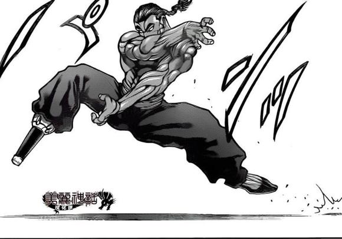
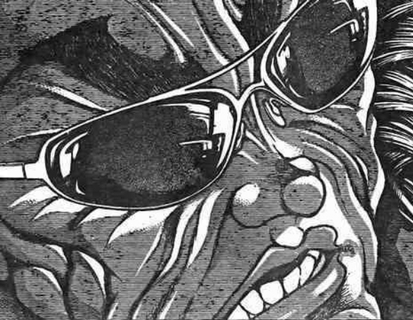
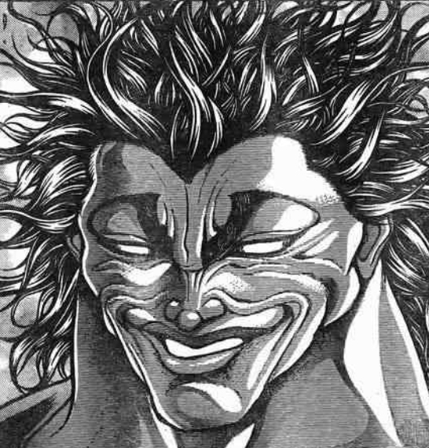
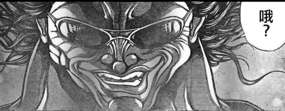

师匠：不是幻觉吗？

那说不定是相当严重的妄想症——

忍无可忍的月之公主大人敲了敲桌子

辉夜：好了都给我停

我刚刚已经听懂了，所以接下来的部分交给我来解说！

皮克，去把黑板给我拿过来！

【1d30：30】秒后，被门框卡了半天的原始人终于把黑板运到了院子里

辉夜大小姐拿着粉笔画了三个圈

辉夜：先从最基本的部分说起

正如哆来咪苏伊特所说，宇佐见堇子一共有三人

皮克：嗷嗷嗷嗷哦啊啊啊？

（为啥会有三个？剩下两个是她的克隆人吗？）

辉夜：并不是你所想的那种情况，也不是赫卡提亚女神那样的三个身体

听好了，首先是一个大家都知道的大前提

由于梦境世界的存在，我们每个人都可以说是有【二人】的，到这一步为止都没问题吧？

烈：哦哦，我明白了

第二个自己就是梦境中的自己，比如说相当凶暴的铃仙前辈，魔法少女四季小姐以及总是在奇怪的地方失败的我

铃仙：为什么大家的梦境都这样残念啊……

公主大人描粗了代表【现实】与【梦境】的圈

辉夜：现实与梦境，这就是对几乎所有人而言的两个自己

但超能力者的情况有些不一样

她有着名为【二重身】的第三个自己，也就是第三个宇佐见堇子

考虑到这个怪异的名字，这应该是她在探女所发起的都市传说异变中得到的能力

探女（手写）：|дﾟ)和我也有关系吗？！

哆来咪：要不是你的言灵珠哪会有都市传说这种麻烦的事情啊……

感谢您的说明，辉夜小姐，剩下的部分还请交给我就好

而这一次梦境世界中的骚乱起因就是我之前所说过的话了

“梦中的堇子夺取了二重身堇子的肉体，使得堇子无法出现在幻想乡了”

（注：由于本段剧情相对模糊，以下内容包含大量我个人对于设定的解读，并不保证正确请大家千万不要当真）

烈的迷惑【1d100：27】

烈海王埋头思考了几秒

烈：（肉体……梦……堇子会在梦中来到幻想乡……）

也就是说，这个糟糕的事态其实涉及到了一个平常被我们视而不见的问题

堇子小姐到底是如何在梦中进入幻想乡的？

师匠接过粉笔之后，在代表【现实】与【二重身】之间的圈画了个单箭头

师匠：你问这个吗？说起来倒也不算复杂

这个现象的核心就是她所获得的【二重身】能力

所谓的二重身，就是一个完全相同的自己，也可以称之为半身

宇佐见堇子将自己的半身留在了幻想乡中

由于二重身是依托于本体而存在的，因此这个堇子平时并不会出现

而每当外面世界的她睡觉时，她就会经由这第二个自己来共享意识

这个时候，幻想乡中的二重身被激活并出现在人们的眼前，宇佐见堇子也就成功来到了幻想乡

帝：稍等一下

也就是说，那个已经成为幻想乡常客的女高中生其实并不是真正意义上的本体

而是与本体完全共享意识的二重身吗？

哆来咪：就是这样了

由于两者的意识同步，思维共享，甚至她们自己都没意识到“我是另外一个堇子”，因此基本看成同一个人就行

好了，现在你们可以理解她所面临的问题了吗？

烈的推理【1d70：49+30=79】（75以上成功）

烈海王走到黑板前，将代表【梦境】与【二重身】的堇子各涂黑了一半

烈：原来如此，我明白了

现实中的堇子小姐同时有着精神与肉体

作为梦境存在的梦堇子小姐只有精神而没有肉体

平时隐藏起来的二重身堇子小姐，则是拥有肉体并与本体共享精神

按照堇子小姐平时可以轻易同步思维来看，这位二重身堇子小姐的个人意识比起常规意义的人格来讲应该是更为轻微的……并不能称为没有灵魂/精神，但在这里可以暂且忽略掉

而现在发生的问题是，只有精神的梦堇子小姐在暴走中夺取了二重身堇子小姐的肉体，并因此受到了其他梦境居民的敌对？

哆来咪：就是这样

由于拥有了真正意义上的肉体，梦中的堇子现在可以光明正大地出现在现实之中了

而梦境中的大家则纷纷认为“凭什么你能得到肉体我却不行”，因此对其进行了阻挠

但令人担忧的是，不知为何，拥有肉身的梦堇子在这个过程中变得越来越强……

今天下午的时候，她甚至在真格对战中战胜了梦境中的烈海王

虽说只是机缘巧合，但我认为事情已经快要超出我的掌握了，因此才会前来求助

了解情况的大家要做什么【1d10:8】

1 询问最为糟糕的结果

2 讨论探女要说的话

3 探女：可以上了（等一下好吗）

4 询问最为糟糕的结果

5 讨论探女要说的话

6 进一步确认堇子目前的情况（是对的）

7 询问最为糟糕的结果

8 讨论探女要说的话

9 探女：区区堇子，无需担心（不要啊！！！）

10 大成功/大失败【1d2：1】

探女（手写）：(´∀`)情况已经大概了解了

只是涉及到一个个体的命运变化，这种情况下就算出现最差的结果也没什么大不了的，因此我可以放心开口

现在我需要说什么呢？

探女要说的话是【1d10：2】

1 关于梦堇子的实力

2 关于目前的局势

3 关于梦境世界（太糟糕了）

4 关于梦堇子的实力

5 关于目前的局势

6 关于现实的堇子（为啥啊）

7 关于梦堇子的实力

8 关于目前的局势

9 关于黑幕（为啥啊）

10 大成功/大失败【1d2：1】

烈：单纯影响堇子小姐一个人的实力其实没有太大影响

如果想从根本上解决问题的话，需要改变的则是这个局势

也就是像上次支援月球时一样，大概说明一下目前的状况就行

如此一来不管命运被扭转的方向如何，堇子小姐大概都没办法待在梦境世界中了

哆来咪：真的要说吗？

探女的能力很可能会带来糟糕的结果啊

永琳小姐，可否请您劝阻一下？

师匠：我相信探女哦~

哆来咪：（呜啊，你这看热闹的黑心贤者）

银发片翼的女神阻止了一下语言之后，便严肃地开口了

探女：就让宇佐见堇子在噩梦之中的战斗继续下去吧！

探女的言灵【1d100：79】（51以上正面效果，出目越高越有效，50以下负面效果，出目越低越糟糕）

起效了！

言灵的效果是什么【1d10:9】

1 梦堇子来到了幻想乡

2 二重身堇子的觉醒（原作路线）

3 梦烈&amp;梦魔理沙的复仇战（为啥啊）

4 梦堇子来到了幻想乡

5 二重身堇子的觉醒（原作路线）

6 摩多罗有了新想法（为啥啊）

7 梦堇子来到了幻想乡

8 二重身堇子的觉醒（原作路线）

9 紫介入了（好像也是原作路线）

10 大成功/大失败【1d2：2】

紫的行动是什么【1d10:6】

1 摩多罗的干涉被抵消了

2 硬性分离了梦堇子与二重身

3 我亲自出手（您真敬业）

4 摩多罗的干涉被抵消了

5 硬性分离了梦堇子与二重身

6 梦堇子被神隐走了（是哪啊）

7 摩多罗的干涉被抵消了

8 硬性分离了梦堇子与二重身

9 紫派出了刺客（为啥啊）

10 大成功/大失败【1d2：1】

紫把梦堇子扔去哪了【1d10：2】

1 现在的香霖堂门口

2 现在的永远亭

3 拜托了，幽幽子（为啥啊）

4 现在的香霖堂门口

5 现在的永远亭

6 地底核熔炉（为啥啊）

7 现在的香霖堂门口

8 现在的永远亭

9 梦烈的家（为啥啊）

10 大成功/大失败【1d2：2】

~永远亭~

永远亭的大家好奇地看着天探女

烈：稀神女士，您这次发言的效果如何？

探女（手写）：|ー`)就算你问我，我也不知道啊

具体的效果得让哆来咪亲自去梦境那边看看了

就在梦之支配者准备前去观察情况时——

那位大家都很熟悉的妖怪贤者从隙间中探出了头

紫：晚上好啊，梦之支配者以及永远亭的各位月之民们

你们似乎在讨论与堇子有关的问题？

永琳：好久不见，紫小姐

怎么，妖怪贤者也打算来帮帮忙吗？

隙间妖怪看了眼坐在旁边的天探女

紫：原来如此，是扭转命运的力量啊

那么，最为关键的梦堇子本人我就顺手帮忙带过来了

正巧我也不想让那家伙继续那么藏在幕后胡闹下去

就当做我好心的义务劳动吧~

隙间妖怪又划开了一道隙间，一脸懵逼的堇子就从中掉了出来

热心的贤者向着大家挥了挥手，而后缩回隙间中消失不见了

梦堇子的震惊【1d100：72】

梦堇子：搞什么，刚刚的是紫小姐？！

我这是到哪了？！

我可刚刚打完两场战斗啊？！

哆来咪：真是可怜

你现在所在的地方比起之前还要更加可怕呢……

梦堇子的战意【1d100：32】（30以上开战）

梦堇子：结束完一场死斗之后就是下一场战斗

真是糟糕，我居然都已经习惯这种生活了……

一个个打的话太无趣了，你们一起上吧！！

对自己充满自信的超能力者抬手指向了院子中吃着冰激凌看戏的人们

永远亭侧的出战者是【1d10：1】

1 安定的烈+铃仙

2 哆来咪+探女

3 辉夜大小姐想打架（为啥啊）

4 安定的烈+铃仙

5 哆来咪+探女

6 师匠似乎也想玩玩（为啥啊）

7 安定的烈+铃仙

8 帝+皮克

9 一般通过赫卡提亚（救命啊）

10 大成功/大失败【1d2：2】

哆来咪：还请各位小心

你们眼前的她和和以前的宇佐见堇子完全不同……

说实话，一对一单挑我并没有能战胜她的自信

师匠：全方位的超幅度强化，新增了几个有趣的能力，再加上她个人所持有的对神秘抗性

这的确不是你一个人能应付得了的对手，特意求援的选择是正确的

那么，既然对方都特意发出了邀请——

烈，优昙华，你们两个一起上吧

主战者是【1d2：2】

1 烈

2 铃仙

烈的察觉【1d70：41+30=71】（75以上察觉能力来源）

烈：（总感觉这种提升能力的手法看上去很熟悉……）

铃仙前辈，谁来当主手？

铃仙：我来我来！

援护就交给你了，烈先生！

堇子：整整三周以来，我可是战胜了成百上千的噩梦！

把你们干掉之后，就去现实中全力讴歌女高中生的生活！

战斗！

BGM：燕石博物志所带来的黑暗

T1

铃仙的攻击【269+1d100：96=365】

梦堇子的攻击【285+1d100：42=327】

梦堇子：去死——

没有任何一句废话，没有一丝一毫的无用动作

拔枪，瞄准，扣动扳机——

狂气的月兔在战斗开始的瞬间就完成了攻击！

梦堇子的受伤【1d10：8】（由于Teleportation的效果第一次受伤伤害减半）

1 回避

2 回避

3 小伤害+2/2

4 中伤害+2/2

5 中伤害+2/2

6 大伤害+2/2

7 大伤害+2/2

8 特大伤害+2/2

9 特大伤害+2/2

10 大成功/大失败【1d2：1】

Hp：18-6/2=15

“轰！”

超能力者立刻使用了她得到的新型瞬移

但即使如此，迫不及防的她还是被爆炸的余波所伤

梦堇子：二打一还突袭？！

铃仙：我和你不一样

当我心里浮现出“去死吧”这句话的时候

我的行动就已经完成了

烈：是久违的火力全开铃仙前辈……

T2

铃仙的攻击【269+1d100：46=315】

梦堇子的攻击【285+1d100：18=303】

梦堇子：真是感谢你的指导

我不会再犯这种小看人的失误了

就让你看看我学到的新招式！

话音未落，她就瞬间移动到了铃仙的身后

超能力者出其不意地发动了奇袭

那是瞄准脖颈的绞杀技——

但迎接她的却是黑洞洞的枪口

狂气的月兔头也不回地反手向身后扣动了扳机

梦堇子的受伤【1d10：8】（由于Teleportation的效果第二次受伤伤害减半）

1 回避

2 回避

3 小伤害+2/2

4 中伤害+2/2

5 中伤害+2/2

6 大伤害+2/2

7 大伤害+2/2

8 特大伤害+2/2

9 特大伤害+2/2

10 大成功/大失败【1d2：2】

Hp：15-6/2=12

尽管再次用保命技能逃过一劫，但超近距离的爆炸还是对堇子造成了相当程度的伤害

梦堇子：怎么可能？

我应该没有露出破绽吧？！

月兔朝着不断躲闪的超能力者补了几枪

铃仙：面部表情做得很好

可惜，你的动作在我眼中简直一清二楚

烈：对于能看到波长的铃仙前辈而言，演技和假动作这些东西完全没什么意义啊

T3

梦堇子：我呢，本来不想在幻想乡用这种过分的招式的

但看来现在不是我能手下留情的战斗了

女高中生举起了武术家曾经见过的小手枪

她向着烈与铃仙打出了一颗看似与以前一模一样的子弹

烈的破解【1d100：29】

烈：我已经说过了吧，堇子小姐

这种玩具子弹根本就……

梦堇子：我知道

这段时间以来，我已经完全认识到了自己过去在能力使用上的不足之处

你觉得一直用着以前那些招式的我，能在噩梦中活下来吗？

接招吧——

念力【Fang Screwdol】！

在武者伸手向前的一刻，那潜藏的陷阱被启动了

子弹中潜藏的紫色念力化作了狰狞的血盆大口，向着烈海王露出了獠牙

那可怖的咬合力对于在场的绝大多数人而言都十分陌生

但格斗家们对于它的威力却再熟悉不过了！

烈的受伤【2+1d5:4-2=4】

烈的Hp：21-4=17

烈海王捂着血流不止的胳膊推到了一旁

皮克：嗷嗷嗷嗷嗷嗷嗷啊！

（是那个很会咬人的朋友！）

烈：你遇到了杰克范马？！

梦堇子：说起来我也很意外

那个大叔意外的还挺友善啊！

肌肉大叔退场了，接下来就到你了，兔子！

铃仙：啊啊，互相残杀的时间到了

幻波【赤眼催眠(Mind Blowing)】！

梦堇子的回避【1d100：69】失败

疯狂判定【1d100:60】失败

无意间眼神相接的超能力者立刻就中了催眠术

她并未因此陷入疯狂，但一瞬之间的失神对于铃仙而言已经足够

月兔再次举起了枪——

铃仙的攻击【269+1d100：29=298】

梦堇子的攻击【290-50+1d100：84=324】

但是，这场尚未开始的交锋却已经结束了

活用瞬间移动的堇子凭直觉转移到了月兔的侧方

梦堇子：实弹确实很可怕啊

被打到的话会死，运气再好也会受伤

抓住了铃仙开枪时的破绽，超能力者将她那不讲道理的念动力完全用于了肉体的加速之上

梦堇子：不过与此相对的是——

开枪时的你可就没办法应对攻击了！

她闪电般抬腿踢出

月兔在这沉重的一击下被一口气踢进了竹林的深处！

铃仙的受伤【1d10：7】

1 回避

2 小伤害+2

3 小伤害+2

4 中伤害+2

5 中伤害+2

6 大伤害+2

7 大伤害+2

8 特大伤害+2

9 特大伤害+2

10 大成功/大失败【1d2：1】

铃仙的Hp：20-3-2=15

T4

月兔挣扎着爬了起来

烈：铃仙前辈，小心一些

她不是克劳恩皮丝那种疯狂的对手

现在的堇子小姐十分理智……没有手下留情的余地了！

铃仙：多谢提醒，烈先生

任务继续！

狂视【狂视调律(Illusion Seeker)】！

Bullet cancel发动

Telephotography发动

烈的受伤【1d4：2】

烈的Hp：17-2+2=17

疯狂判定【1d100：4】失败

超能力者掏出手机拍了张照

她身前那密密麻麻的弹幕便立刻消失无踪

与此同时，挡在铃仙身前的武术家也受到了无形的攻击！

烈：动不了了？！

这是什么招数，远程的咒杀？！

“啪！”

超能力者打了个响指，她的右拳便被灼热的火焰所笼罩

梦堇子：范马大叔有时候偶尔也会说点正确的话

没错，用念动力扔垃圾真的很**

所以我思考了一阵之后决定改变一下以往的应用方法

而结果就是，这一招！

接招，念力【Shining finger】！

利用念动力加速

利用烈焰增加威力

利用闪烁的光芒迷惑眼前的敌人

而后，宇佐见堇子挥出了宛如流星的一击！

烈的破解【1d100：48】失败

先制判定【1d100：66】失败

铃仙的攻击【269+1d100：53=322】

梦堇子的攻击【285+50+1d100：3=338】

铃仙的受伤【1d10：8】

1 回避

2 小伤害+3+2

3 小伤害+3+2

4 中伤害+3+2

5 中伤害+3+2

6 大伤害+3+2

7 大伤害+3+2

8 特大伤害+3+2

9 特大伤害+3+2

10 大成功/大失败【1d2：2】

铃仙的Hp：15-4-3-2=6

超能力者的炎拳从正面击中了月兔

炽热的暴风自宁静的竹林中升腾而起！

天探女大人看了看满身黑烟的铃仙和动弹不得的烈海王

探女（手写）：ﾟÅﾟ)我完全理解你前来求助的理由了

哆来咪：是吧

说真的跟打不打得过没关系

我不想跟这种可怕的奇葩打架啊

T5

铃仙：相当疯狂的攻击啊

那么与此相对的，也让你领教一下月之民的狂气吧！

【月面弹跳(Lunatic Double)】！

梦堇子的回避【1d100:21】失败

疯狂判定【1d100：89】成功

铃仙狂笑着举起了双枪

在竹林间疯狂跳动着的能量弹们封锁了堇子的行动

即使超能力者发动了瞬间移动，也难以超脱这无规律的跳弹之网——

Bullet cancel发动

Telephotography发动

烈的受伤【1d4：4-2=2】

Hp：17-2=15

超能力者用最后的理智消除了眼前的弹幕

烈海王再次被未知的力量袭击了

随后，宇佐见堇子陷入了疯狂

她的双眼同样变得鲜红起来

她的嘴角刮起了怪异的笑

梦堇子：哈哈，哈哈哈，哈哈哈哈哈哈哈哈哈！

思维从来没有这样清晰过！

身体也变得灵活多了！

真棒，太棒了！

疯子眼中的世界，居然是这般美好！

烈：铃仙前辈，你这催眠术确定没问题吗？！

我怎么觉得她疯过头了？！

铃仙：烈先生，你想想吧

一个在受全员敌视的噩梦世界中活过两周的人，怎么可能正常？

梦堇子：哦呼，无聊的废话说完了吗？

那么那么那么就去死吧

没事，最多不过是脖子被扭断而已——

如果脑袋也不小心飞出去了也是正常现象哦，哈哈哈哈哈！

念力【虎王】！

烈的破解【1d100：19】失败

铃仙的攻击【269+1d100：28=297】

梦堇子的攻击【285+120-50-40+1d100：30=345】

疯狂的超能力者本应因此而做出错漏百出的行动

但是，狂气的月兔此刻却也已经深受重伤

凭借着不讲道理的瞬间移动，堇子的突袭再一次成功了

仿若虎颚的攻击向着铃仙的脖颈咬去！

铃仙的受伤【1d10:10】

1 回避

2 小伤害+2+5

3 小伤害+2+5

4 中伤害+2+5

5 中伤害+2+5

6 大伤害+2+5

7 大伤害+2+5

8 特大伤害+2+5

9 特大伤害+2+5

10 大成功/大失败【1d2：2】

铃仙大失败！

预想之中的冲击

没有到来

永远亭的月兔睁开了双眼

她看到了一片绿色的竹林与其中那略显渺小的永远亭

铃仙瞬间理解了

自己目前正身处于高空之上

然后，她听到了那来自身后的低语

梦堇子：这毕竟只是普通的寝技

如果没能一击毙命的话，逃离的方法要多少有多少

因此我对此稍微做了些小小的改动——

脖颈上的压力忽然变强了

可怕的念动力固定住了身体的每一个角落，想要做出多余的行动根本就是不可能的事情

梦堇子：直接从数百米的高空一口气把脑袋砸下来的话，无论如何也不可能接着活动啦！

哈哈哈哈哈哈哈！

几乎就要窒息的铃仙看着自己被调整到了一个近乎与地垂直的角度

她就这样毫无还手之力的向着地面以急速坠落！

铃仙的受伤【1d10：5】

1 小伤害X2+2+5

2 小伤害X2+2+5

3 中伤害X2+2+5

4 中伤害X2+2+5

5 大伤害X2+2+5

6 大伤害X2+2+5

7 战斗不能

8 战斗不能

9 长时间住院

10 大成功/大失败【1d2：2】

Hp：6-3X2-2-5=0

~主场优势发动~

并不是在接近大地

站在铃仙的视角来看，这更像是地面突兀地冲向了自己的头颅

立刻就理解了，无论如何也承受不下这样的一击

月兔听天由命地闭上了双眼

铃仙：很抱歉没能完成任务……

然后，她听到了一个熟悉的声音

师匠：烈，假腿

烈：——【The World】，时间停止吧！

下一个瞬间

超能力者在竹林中砸出了一个巨大的坑洞

但在飞扬的尘土之中，却唯独没有那本应出现的身影

梦堇子：哈

把时停用在这种地方了啊？

还算正确的选择，比起梦境中拿来突袭的你可要稳妥多了

她抬头看向了竹林的另一侧

狂气的月兔此刻正躺在武术家的怀中

铃仙：呼……

多谢了，烈先生

烈：不管怎么说也不能看着你去硬接那种过分的招式

前辈，还要继续吗？

铃仙：啊啊，当然

被打了这么一套之后毫无反击就下场

我的脾气还没有好到这个地步！

疯狂效果结束

女高中生眼中的狂气消退了

她在恍惚了一阵之后，终于想起了刚刚自己的所作所为

梦堇子的内疚【1d100：37】

梦堇子：啊啊啊啊！

我居然特意用了那种招式， 真是对不起

梦堇子：明明当时升到天空之后，直接开枪就可以了！

真是太执着于招式的表象了

下次，我会选择更为简单有效的攻击方法的！

烈：……铃仙前辈，你说的没错

与是否疯狂没有关系

在现在这个堇子小姐的眼中，我只能看到为了达到目的而不择手段的【意志】！

T6

梦堇子：不择手段？

那是当然的

已经拥有肉体的我本人——为什么不能在现实世界中，成为真正的女高中生呢？！

宇佐见堇子只能有一个，从来就没有这种规定吧？！

枪符【Fang Screwdol】

念力【Psycho Plosion】！

噩梦中的堇子再次射出了内藏陷阱的子弹

与此同时，她用出了自己最为擅长的，身为超能力者的代表性招式

那是名为精神爆破的，深紫色念动力炸弹！

烈的破解

枪符【1d100：39】失败

念力【1d100：39】失败

烈的受伤【2+1d5：5-2=5】

烈的Hp：15-5=10

念力陷阱的爆发根本就没有任何前兆

但武术家必须确保主攻手的安全

于是他选择了最为稳妥的办法

烈海王直接挥拳击向了魔弹

他主动触发了那狂兽般的咬击！

烈：念力陷阱被我挡下了！

趁现在，铃仙前辈！

铃仙：交给我吧！

幻波【赤眼催眠(Mind Blowing)】

散符【真实之月(Invisible Full Moon)】！

堇子的回避

幻波【1d100:49】失败

散符【1d100:35】失败

疯狂判定【1d100：86】成功

铃仙的攻击【269+650+1d100：11=930】

梦堇子的攻击【285-40-50-50+650+1d100：36=831】

那隐约浮现的虚实弹幕让宇佐见堇子再一次陷入了疯狂

被狂气所占的头脑无法精密操纵念力炸弹

身旁弹跳的能量弹又限制了她的行动

于是，她的对手终于找到了一个接近战的机会！

月兔一把抓住了丧失理智的超能力者

辉夜：因幡

给我上！

近代月兔格斗术始祖，八意永琳曾说过

速度X力量X狂气=破坏力

这是连技巧都算不上的，十分简单的攻击

深深地握紧拳头

将愤怒倾注于拳中

向后扭转身躯以增强挥拳的速度

然后就这样，毫无保留的——

一拳挥去！

铃仙：刚刚送来的袭击和烈先生的份

就在这里一口气还给你！

梦堇子的受伤【1d10：3】

1 回避

2 回避

3 小伤害X4+2+3

4 中伤害X4+2+3

5 中伤害X4+2+3

6 大伤害X4+2+3

7 大伤害X4+2+3

8 特大伤害X4+2+3

9 特大伤害X4+2+3

10 大成功/大失败【1d2：1】

Hp：12-1X4-2-3=3

紧急逃脱的手段已经用尽

超能力者被一拳轰飞到了遥远的天际！

T7

但是战斗还没有结束

因为噩梦中的超能力者避开了最为严重的伤势！

梦堇子：残念啊，兔子小姐！

你们两个人一起上也就只能做到这个地步了

就用我刚刚完成不久的这招一口气了解掉你们！

她毫不在意地擦着嘴角的血，并狂笑着发动了自己在噩梦中所研发的，最强的招式

梦堇子：三角龙？迅猛龙？翼龙？

不对吧？

说到恐龙的话果然还是要用霸王龙啊！

念力【Tyrannosaurus rex】

无形的巨大躯体在她的身后缓缓浮现

那原本只是出现在人们脑海之中的，所谓具现化的想象力——

但在暴走的超能力者面前，令空想成真绝非无稽之谈

于是

与原始人同时代的最强凶兽，就这样出现在了如今的迷途竹林之中！

看到眼熟的朋友之后，旁观的皮克立马一脸欣喜地站了起来

烈的破解【1d100：86】成功

从陷阱中挣脱的武术家，就这样一脸平淡的站在了具现化的巨兽之前

烈：梦境中的堇子小姐

你用超能力重现了他们的招式……

不仅如此，还配合着你独特的理解做出了在此之上的创新

很厉害，真的做得很好

哪怕是他们本人看到那些也一定会发出赞叹的

——除了这一招之外！

梦堇子：你在说什么？

比起刃牙的三角龙拳，我直接召唤的霸王龙明显更强——

烈：无法理解吗？

不管什么样的恐龙，终究都只是皮克的手下败将

再怎么可怕的凶兽，都是敌不过【人】的！

遍体鳞伤的武者飞身而起

那巨大的凶兽，可怖的恐龙，由念力空想而成的决战兵器

就这样被武术家一脚踢爆了头颅！

帝：皮克

你当年真打过这玩意？

皮克：嗷嗷嗷嗷哦哦啊哦啊

（很疼很疼的，我当时可打了很久呢）

狂气的月兔越过了那逐渐消散的念力兵器

超能力者再一次看到了那猩红色的双眼

铃仙：月眼【月兔远隔催眠术(Tele-Mesmerism)】

铃仙的攻击【269+775+1d100：32=1076】

差值大于100自动成功

堇子的受伤【1d10:4】

1 小伤害X3+2（无法回避）

2 小伤害X3+2（无法回避）

3 小伤害X5+2

4 中伤害X5+2

5 中伤害X5+2

6 大伤害X5+2

7 大伤害X5+2

8 特大伤害X5+2

9 特大伤害X5+2

10 大成功/大失败【1d2:1】

Hp：3-2X5-2=0

确认对手已经完全陷入催眠状态后，铃仙以一记手刀干脆利落的结束了本场战斗

她从倒地的超能力者身旁站起，正准备宣告任务结束时，却听到了队友的惊呼

烈：铃仙前辈，小心身后！

Death Cancel发动

Hp回复【1d5：2】点

Hp：0+2=2

铃仙警觉地回过头去

那本应丧失战斗能力的对手却又一次站了起来

梦堇子：好险好险

这可是真正意义上的，最后的保命手段了

T8

梦堇子：真是受教了

果然还是应该老老实实用格斗技啊

这个距离下，就算是那个烈海王也不可能跑过来帮你挡招了

超能力者再次使用了她独创的招式

宛如神明之手带着烈焰与星光落地，急速的流星再次向着月兔的面门袭来

正如她所说的一样

没有人能帮铃仙抵挡这一次的攻击了！

梦堇子：去死吧，疯狂的兔子小姐！

念力【Shining finger】！

狂视【狂视调律(IllusionSeeker)】发动

堇子的回避【1d100:53】失败

但是

超能力者忽略了一个最为根本性的问题

她所面对的不是坚信肉体能力的格斗家或原始人

而是习惯于使用兵器作战的，前月都士兵

在噩梦中的少女点燃火焰的一刻，月兔已经拔出了手枪

在她挥拳前冲的一瞬之前——

她的对手就已经扣动了扳机

堇子的受伤【3+1d4:2=5】

Hp：2-5=0

灼热的火焰被实弹所击碎

超能力者本人则倒在了最后的一发麻醉弹下

铃仙：在战斗刚开始的时候我就已经说过了

我不会把“去死吧”这种话挂在嘴边

当我内心浮现出“去死吧”这句话时，我的行动就已经完成了

狂气的月兔重新收起了自身的配枪

她拖着昏迷不醒的超能力者，向着身后的烈与永远亭走去

铃仙：铃仙·优昙华院·因幡

任务完成

战斗结束

胜者 铃仙·优昙华院·因幡&amp;烈海王！

【1d30：1】分钟后

~医务室~

铃仙：啊疼疼疼！

师匠，轻点啊，师匠！

烈：师匠我自己来就可以了别往伤口上倒酒精啊好疼——

呲牙列嘴的武术家与月兔正在医务室中接受治疗

师匠：你们两个好意思说吗？

烈，你整场战斗中破解就成功了一次

到了最后居然自暴自弃用肉身硬抗念力陷阱？

感觉自己很英勇吗？

优昙华，帅气的话说的很好听

但是没有中间那次时停你早就要住院了！

最后居然还没有发现对手装死，拔枪稍微晚一瞬间就是你的失败！

探女（手写）：(ﾟДﾟ)八意大人进入教学模式了

呜哇，脑中回想起了学生时代的可怕记忆

哆来咪：（无论是现实还是梦境，永琳小姐毫无疑问就是让这两人变成现在这样的罪魁祸首……）

师匠的说教与治疗持续了【1d20：12】分钟

师匠：——总而言之，这次的对手确实具有相当的实力

如果不是她连战后立刻被八云紫带了过来，光是那个拍照消弹和诡异的瞬移就够和你们打了

但把自己双双搞成重伤才打赢，绝对不是什么值得鼓励的事情

你们两人今晚不用做饭了好好养伤，顺便一块给我好好反思一下自己的战斗方式，明白吗？

烈&amp;铃仙：明白了师匠……

那咱们今晚吃什么啊？

今天的晚饭是【1d10:10】

1 叫外卖吧

2 交给帝！

3 探女！（探女会做饭吗）

4 叫外卖吧

5 哆来咪！

6 交给辉夜小姐！（为啥啊）

7 叫外卖吧

8 师匠！

9 交给皮克！（生吃吗）

10 大成功/大失败【1d2：1】

草草草，晚饭大成功是什么【1d10:2】

1 享用了美味晚餐后的梦堇子决定放弃野心

2 1+纯狐帮忙下厨了！

3 完美潇洒的外卖（为啥啊）

4 享用了美味晚餐后的梦堇子决定放弃野心

5 4+纯狐帮忙下厨了！

6 赫卡提亚帮忙下厨了（您还会做饭吗？）

7 享用了美味晚餐后的梦堇子决定放弃野心

8 7+纯狐帮忙下厨了！

9 吃到了很好吃的饭，学会了新的技能（为啥啊？！）

10 大成功/大失败【1d2：2】

刚好前来拜访的无名仙灵闻言举起了手

纯狐：今晚没人做饭吗？

那要不我来吧

辉夜：真的假的……

纯狐做晚饭……

铃仙：说实话纯狐女士之前做的便当挺好吃的……

终于从麻醉中醒来的梦堇子看着眼前这温馨的日常景象揉了揉眼睛

梦堇子：……这啥？

我还没醒吗？

【1d60：32】分钟后

纯狐的厨艺【1d70：55+30=85】（基础厨艺+30）

皮克：嗷嗷嗷嗷嗷啊！

（居然真的很好吃！）

帝：好厉害！

毫不逊色于烈海王平时的发挥，在某些菜色上比起他还更胜一筹

这就是伟大存在的实力吗？！

哆来咪：（说起来我是来干什么的来着）

嚼嚼……真好吃耶

梦堇子的震惊【1d100：75】

梦境中的堇子小姐看着眼前丰盛的晚餐和给她盛饭的无名仙灵，震惊的说不出话来

纯狐：啊呀

你不吃饭吗？

梦堇子：不是

这啥？

虽然莫名其妙就被带过来了但我是来打架的哎

刚刚打的那么惨烈现在坐一块吃饭这合适吗？

烈：你说啥呢堇子小姐

都来幻想乡这么久了还没习惯啊？

铃仙：战斗结束之后一切也就结束了啊

现在你也彻底失败了，差不多是时候该放弃那无聊的野心回到梦境中了吧？

梦堇子：凭什么啊？！

已经拥有了肉体，和本体有着相同的记忆，在战胜噩梦之后就连实力也是我更强

凭什么现在的我不能回到现实中成为真正的宇佐见堇子？！

哆来咪：因为当你与现实中的堇子相见之时，其中一方就会消亡

并且这样一来你所占有的二重身也会消失

现实世界中真正堇子的消灭与，从此无法再回到幻想乡

这就是你实现野心的代价了

梦堇子【对自己】的良心【1d100：79】（51以上自觉放弃，50以下被和蔼可亲的大家劝说后放弃）

堇子小姐扒饭的手停下了

梦堇子：骗人的吧

“宇佐见堇子只有一个就够了”这种话嘴上说说就好

结果居然真是……

师匠：没错，为了自己的幸福而牺牲了另一个无自觉，且并未犯错的自己

你认为这种行动是正确的吗？

【1d30：9】秒的沉默之后，噩梦中的女高中生做出了决定

梦堇子：为了梦想牺牲他人对我来说并不是什么不可饶恕的事情

但是为了自己的梦想而干掉另外一个一无所知的自己，真是个不好笑的笑话

梦堇子：就这样吧

新研发的招式也已经用完了，无论如何也算是彻底大闹了一场——

梦境中的第一次秘封活动，就到此结束！

另一位秘封俱乐部的初代会长，终于发表了活动完结的宣言

【1d60：5】分钟后

归还了肉体的梦境堇子，在哆来咪的引导下回到了梦境世界中

哆来咪：虽然过程真的很不靠谱，但最后确实干脆利落地解决了问题

在此向你表达谢意，不拘泥于常理的武术家

也多谢探女酱的帮忙了

探女（手写）：(〃∀〃)最近这段时间我的能力次次都起到了好效果

以后是不是可以考虑常常开口了？

辉夜：不行，绝对不行

要是一不小心用词不当，你那张嘴很可能会引发大问题的

铃仙：说起来到最后好像还有个问题没搞明白

那些奇怪的招式是堇子自创的

但是像消弹、超快速瞬移和起死回生这些新能力也是她依靠锻炼得到的吗？

纯狐怀中的月兔提出了今日的最后一个问题

纯狐：那孩子身上和那位自称秘神的存在有着相同的气息

无论怎么看，这都是摩多罗隐岐奈赠送给她的能力

烈：？？？

这件事情的背后还有摩多罗女士插手？

为啥啊？

师匠：谁知道呢？

神或者妖怪的思维是很难理解的

你有空的时候自己去问她吧

小小的插曲已经结束

永远亭的众人又一次回到了日常之中

一段时间之后，宇佐见堇子又再次出现在了幻想乡的众人面前

现实中的她对于噩梦中另一个自己的经历一无所知

至于幻想乡的朋友们是怎么跟她说明这次事件的

那又是，与此无关的故事了

~第541天结束~

~几天后~

~外界~

~路边的咖啡厅~

桌上放着一杯冒着热气的咖啡

拴着挂饰的书包则被毫不在意地放在桌下

它的主人，一位身穿校服的女子高中生正在一旁划动着手机的屏幕

这本应该是随处可见的普通风景——

只不过桌对面的某位撒发着巨大存在感的肌肉男子完美的破坏了其中的日常感

范马勇次郎从兜里掏了根烟

堇子：大叔，这里禁烟的哦

作为当代社会的一名有身份的常识人，你应该不会像那群五六十岁的中年老男人一样无视他人感受与环境要求仅仅为了吸一口尼古丁就在他人的注视之下让自己的形象变成中年酗酒人生失意的职场社畜吧?

堇子的毒舌【70：4+30=34】（JK+30，50以上成功）

草，这么低的数值是什么【1d10:4】

1 店员：“我们这里允许吸烟的”

2 勇次郎喝起了酒！

3 我要杀了你！（为啥啊）

4 店员：“我们这里允许吸烟的”

5 勇次郎喝起了酒！

6 勇次郎表演了同时抽两根（什么鬼啊）

7 店员：“我们这里允许吸烟的”

8 勇次郎喝起了酒！

9 好的开战吧！（为啥啊）

10 大成功/大失败【1d2：1】

地上最强生物给雪茄点了火，然后指了指旁边的牌子

勇次郎：这里

允许吸烟

堇子：为什么啊？！

这里是学校附近的咖啡厅吧？！

店员（友情出演：隔壁的蓝发大哥）：由于旁边花山组的小哥们是这里的常客，所以就顺势更改了一下规定

毕竟是本店的金主，还请您谅解……

堇子无奈地挥散了眼前的烟雾

堇子：ok，我下一次肯定不会来这里了

说正事，范马大叔你对灵异现象也有研究吧？

我最近遇到了一些奇怪的事情

具体来说就是手机里多了些很古怪的灵异照片——

勇次郎扫了眼桌对面的女学生

勇次郎：连基础的信息技术都不明白，手机下载了垃圾图片之后就说是灵异

你这样还好意思自称是高中生吗？

堇子：你以为我是机械**吗？！

说正经的这些东西是莫名其妙出现在我手机里的，而且内容相当奇怪

你看一眼就知道了

勇次郎的察觉【1d50：18+50=68】（75以上察觉问题，90以上给出有效建议，地上最强生物+50）

地上最强看了一眼堇子的手机

在屏幕之上显示的，正是最后一战中所拍摄的，来自铃仙的弹幕攻击

勇次郎：这是弹幕

所谓的弹幕，就是妖怪们常用的一种攻击手段

堇子：果然这种问题找你们这种肌肉男没用

好的，既然如此就先进行复仇战吧！

这一次一定要把上次的债连本带利讨回来！

勇次郎：哈哈哈哈哈哈！

上一次是至今为止最大的火球

再上一次是究极的念动力

这一次又是什么啊？

超能力者举起了拳头

堇子：果然面对你这样的还是要用接近战！

勇次郎：哦

你前几天似乎去找了刃牙他们

学到了真正的战斗方法吗？

堇子：我才不会用那种过分的招式

又是撕咬又是绞杀，还有奇怪的象形拳……

普通人挨了这种粗暴的攻击之后绝对会死的！

地上最强的头发竖了起来

勇次郎：那么

不准备用这些招式的宇佐见堇子

又打算怎么复仇呢？用超能力杂耍笑死我么？

堇子：当然是和用女高中生相配的弹幕格斗术！

上次去幻想乡的时候，我特意请教了近身战的高手

秦心酱的步伐！

布都小姐的架势！

封兽鵺小姐的象形拳！

还有一轮师傅亲自指导的入道拳法！

现在的我，已经无人能挡了！

于是，堇子与勇次郎又一次开始了他们日常的战斗

现实生活中的超能力者大概从没想过

另一个堇子在真正意义上完成了这些招式

这独特的超能力格斗法如今仍在另一个世界的战斗中大展身手

而使用着它们的新星格斗家宇佐见堇子，也成为了梦境世界中的新传说……

（本日的更新结束，下一次更新在周五或周六）

（以下是我的废话）

用一次更新解决的小异变到此结束

准确来说这也不是个异变，称呼为一个剧情事件好些吧？

本来预想的是在现实世界与梦境世界做同步展开，通过两方视角的切换来推进剧情，最后在打完战斗的时候爆一下梦堇子的身份再结束——

但大纲又一次被哆来咪的电话推销和梦烈的“去死吧”所完美毁灭了

说起来梦烈怎么又垫了啊？！

良心骰出了一点你是哪里来的三流反派吗？！还刚刚好抽中了被堇子本人反杀的梗选项？！

我原本准备让他当boss的......结果两次出场两次都以非常搞笑的方式垫了......真绝了

原本现实世界这块我是准备走香霖堂开会路线的

但是哆来咪和探女齐心协力又把思路扯歪了！

原计划中的灵梦魔理沙香霖慧音华扇一个都没法登场！绝了！

烈的厨艺拉胯啦！

师匠的理解也拉胯啦！

你们俩怎么这时候就这么同步呢？！

梦堇子原本是打算做成双人战boss的

但由于刚好抽到了神隐梗选项，剧情上两次血战后的堇子依然保持全盛状态怎么想都很奇怪因此不得不削了几刀

如果是计划中的全盛梦堇子就会是无限制拍照消弹+无限制瞬移减伤+一个CT8或Hp归零时发动的隐藏大招这样子

说实话就算烈和铃仙打正经双人战也不一定能过，因为对面也有闪避（，正确的解法是找机会接触双堇子的合体

因此本次剧情中的两位MVP毫无疑问是探女和紫......真的好敬业啊

下一次的更新会是日常回，到时候会一并进行新符卡学习的剧情——具体情节看骰子咯

那么本次的更新就到这里结束，骰子明天发

附上本次的骰子

其实堇子与勇次郎聊天那段是最开始的时候骰的，原本的思路是先放出一个模模糊糊的结局烟雾弹，然后在回到几天之前慢慢骰过程

但是大纲被梦烈和哆来咪的神速连击干烂了（笑）

最后检查的时候发现这段还不如直接放在最后当结尾，所以就调整了一下顺序

（当然，最后梦堇子格斗术那段话是我自己加的，毕竟一开始的时候根本没想到会打成这样啊（悲））

~如果没有梦烈和八云紫~

昨天的后记中我也说过，实际上原定的噩梦堇子比这次打的还要稍微强上那么一些

不如说人物卡我早早都已经写好了（悲）

结果在剧情上由于跟梦烈大战一场后又被紫小姐神隐了导致压根没有让她全状态的条件，因此不得不削了一下噩梦堇子的卡

梦烈打的堇子就是以下的状态了

PS：会使用天文密葬法和超人术的烈海王无论梦境与现实都是毫无疑问的神秘存在，因此噩梦堇子的Atk加成是250

PS2：你说打勇次郎的时候？嗯，不管怎么看勇伯都是普通人类，用的也是简单朴实的格斗技，因此Atk只能+200，这很合理

考虑到单人战的可能性没有给67T太强的数值，原本我是准备在8T后用必杀技的机制重现原作剧情的

但果然这还是有点点过分......

实际写完之后发现用着这些技能的女高中生在另一个层次上好可怕啊......

让她和铃仙前辈单挑的话总感觉会变成地狱绘图......

把她消耗了那么多后潇洒退场，默默在幕后为主角团的成功出了自己的一份力

谢谢你，梦烈（悲）

~彩蛋~

~幕后黑手（？）~

说起来摩多罗本次搞事的原因是【1d10:5】

1 只是单纯的出手相助

2 一个小小的实验

3 纯粹的乐子秘神（为啥啊）

4 只是单纯的出手相助

5 一个小小的实验

6 想趁此机会认识一下堇子酱呢（为啥啊）

7 只是单纯的出手相助

8 一个小小的实验

9 在梦境中施加自己的影响（为啥啊）

10 大成功/大失败【1d2：2】

~后户之国~

前来拜访的武术家拎着一个手提袋，在二童子的引导下见到了秘境之中的摩多罗

烈：摩多罗女士您好

我想请教一下前两天那起事件之中所隐藏的内情

这只是我个人作为侦探的好奇心而已，如果不方便说明的话还请您当我没说过吧

摩多罗：哦~

只是我见她在噩梦中挣扎的惨状就于心不忍帮了一把，亦或者只是我个人的娱乐活动

你就没考虑过这种可能性吗？

烈的情商【1d100:84】（基础情商20）

烈：（说实话我觉得很有可能但也不能当着您面直说啊）

您说笑了

光靠我自己的惯性思维去揣摩您的行动很可能变成像上次那样完全跑偏的推理

正因如此，我才会特意前来请教的

舞：什么，那个师傅大人的行动居然还有暗藏的目的？！

里乃：不管怎么看都是师傅大人在单纯的找乐子而已吧？！

摩多罗：好的你们两个废柴给我去抄谨言慎行和尊师重道各一千遍，中午前写不完就别吃饭了

不用你那诡异的大脑去胡乱猜测是个正确的判断

梦境与现实交融的特性，天生与神秘亲和的命运，再加上那份与生俱来的超能力

这些独特的要素让宇佐见堇子成为了一个相当特殊的存在

正因如此，我趁此机会做了一个小小的实验

烈：实验？

如果想要探究她身上的特殊之处……

只是给予能力后让她在梦中大闹一场能够得到什么结论啊？

摩多罗：你看，你又一次执着于表象了

宇佐见堇子的那份奇异之处，仅仅来自于她自身吗？

用你最擅长的推理能力想想，在这次事件从发生到解决的全过程中，除了给予她能力的我以外——

最为不合常理的部分，是什么？

烈的推理【1d70：39+30=69】（75以上察觉）

烈：真要说的话

是稀神女士的帮助吧？

她的能力直接导致这起事件以一次在永远亭中的战斗结束

而我和铃仙前辈本应与此毫无关系的

