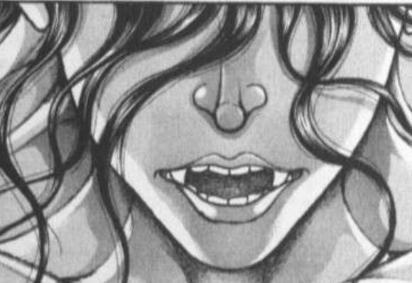
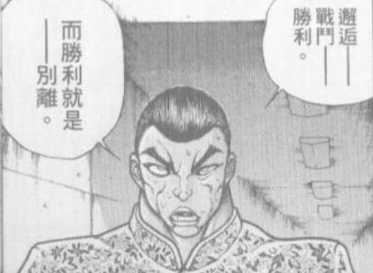

秘神大人摇了摇手指

摩多罗：很接近，但是不对

天探女是梦之支配者的好友

你是灵梦与魔理沙的好友

致力于解决事件的她们去寻求了你们的帮助，这并不是无法想象的事情

而永远亭的月之民们在你参与后出了一份力，这同样合情合理

摩多罗：也就是说——

你们同样都是很有可能登上名为“噩梦日记”这一舞台的，潜在的登场角色

因此无论你们做出什么样的事情，我都不会因此而讶异

那么再一次，如果把这起事件看作一个故事

除我本人以外，哪位角色的登场最为突兀以及不可理解呢？

烈的察觉【1d70：58+30=88】（50以上察觉）

烈：是……

在探女小姐开口不久就立刻行动的八云女士？

摩多罗：正确答案

依旧是那个故事的比喻

稀神探女的能力发动后会让未来的剧情陷入混沌之中

但是，她没有办法让这个故事的核心角色突然变多或是变少

亲爱的妖怪贤者早在她张口之前就早已暗中关注此事了

但是，为什么？

武术家低头思考了一阵

烈：……我想不出来

站在贤者的角度出发，八云女士的职责是维护幻想乡的平和以及妖怪们的权益

这件事情最糟糕的结局是现实中的堇子小姐被梦中的她所取代，但这对妖怪与幻想乡都构不成任何实质上的威胁

因此从明面上看，我找不到她出手相助的动机！

摩多罗：啊~哈~哈~

终于理解了吗？

站在我的角度来看，我们乐于助人的隙间妖怪简直像是突然闯入舞台之中的不速之客！

摩多罗：而她的角色是什么？

是与我一样仅仅对超能力者感到好奇的探究者？那为何不和往常一样在幕后静观其变？

是恪尽职守的贤者？又不是上次完全凭依异变时那样的情况，梦境世界的居民们这回怎么样都不可能影响到现实，她有什么理由出场？

是相应熟人邀请的助拳者？但实际上灵梦与魔理沙那时都在香霖堂像无头苍蝇般寻找对策，她们压根就没想过去找那一点都不靠谱的隙间妖怪帮忙！

摩多罗：那么，在排除掉这些选项之后

剩下最有可能的答案是什么？

烈：是私人情感？

八云女士只是身为一个好朋友，一个好前辈，而特意亲自出马前往梦境帮助了堇子小姐……？

摩多罗的愉悦【1d100：3】大失败

哦呼，摩多罗大失败

大失败是什么【1d10：7】

1 紫结束了谈话

2 摩多罗：原来紫变成了这般善良的妖怪

3 摩多罗：答案是恋爱（为啥啊）

4 紫结束了谈话

5 摩多罗：原来紫变成了这般善良的妖怪

6 摩多罗的思路，完全跑歪了（为啥啊）

7 紫结束了谈话

8 摩多罗：原来紫变成了这般善良的妖怪

9 开战啦（为啥啊）

10 大成功/大失败【1d2：2】

秘神大人转动着手中的小鼓

摩多罗：哈

老谋深算的隙间妖怪和天真的女高中生成了挚友并因此而亲自奔波

这笑话实在是太冷了，连我都笑不出来呀

这就是实验的结果

宇佐见堇子身上最大的异常之处根本不是那些表面上的能力

而是这份隐藏在背后的，毫无理由的，十分突兀且不合理的，甚至连她自己都不知情的——

与八云紫的“缘”！

“咚咚咚”

后户之国的一扇门后突然响起了敲门的声音

一旁埋头抄书的二童子连忙起身开门

手持阳伞的妖怪贤者，正微笑着站在门扉之后

紫：刚想前来拜访，就听到了好多奇怪的话语

站在我的角度来看，亲手救助武术家的你也一样像是突兀登台的额外演员哦

烈的情商【1d100:64】（基础情商20,50以上自觉退场）

烈海王起身行了一礼，并顺手把手提袋放在了桌上

烈：早上好，八云女士

摩多罗女士，多谢您的解答

当然，我是绝不会向外说明您的实验的

我先回去做午饭了，这些是昨晚刚做的冰激凌，您喜欢的话我下次再带点

摩多罗：谢谢~果然夏天就是要吃冰品呢~

哎呀呀，什么时候我家的废柴们也能学会做点心呢

你俩先别抄书了，带烈海王回永远亭吧

狂乱的舞者们带着武术家离去了

隙间妖怪坐到了另外一张椅子上

紫：如果我刚刚没过来的话

你准备说些什么呢，隐岐奈？

（由于梦境世界的剧情已经基本结束，此后大概不会涉及这块了，因此随便骰几个梦境角色的性格当彩蛋吧）

~梦境世界愉快的大家~

第一位 梦一轮

梦一轮的性格是【1d10:2】

1 伟人一轮（原作路线）

2 圣一轮

3 暴力一轮（为啥啊）

4 伟人一轮（原作路线）

5 圣一轮

6 主役是云山（为啥啊）

7 伟人一轮（原作路线）

8 圣一轮

9 贤者一轮（这是啥）

10 大成功/大失败【1d2：2】

~梦境世界~

梦中愉快的大家今日又一次因为无关紧要的原因打了起来

知名的圣者云居一轮与她的侍从云山，在一旁默默叹了口气

梦一轮：永无止境的战斗，从不停息的混乱……

这样粗暴的争斗究竟有何意义呢？

你们那独一无二的能力与强大的实力，难道就要浪费在这种事情上面吗？

第二位，想不到很想写的因此随机【1d10：3】

1 红美铃

2 恋恋

3 皮克

4 觉

5 二小姐

6 勇次郎

7 红美铃

8 莉格露

9 花山

10 红美铃

梦皮克的性格是【1d10：8】

1 会说话的真君子皮克

2 史前凶兽皮克

3 恋爱脑皮克（那是啥）

4 会说话的真君子皮克

5 史前凶兽皮克

6 大艺术家皮克（这又是啥）

7 会说话的真君子皮克

8 史前凶兽皮克

9 作家皮克（为啥啊？）

10 大成功/大失败【1d2：2】

梦中世界的原始人，某种意义上变为了他毫无掩饰的样子

社交，规矩，道理…..

这些东西在他所活跃的年代根本就不存在

因此皮克今日也依旧在梦中毫无顾忌地与强者厮打着

理所当然的，梦中的他也不会说话

皮克：嗷嗷嗷嗷嗷

嗷嗷嗷嗷嗷嗷嗷啊！

最后一位，【1d10：1】

1 红美铃

2 恋恋

3 琪露诺

4 觉

5 二小姐

6 勇次郎

7 红美铃

8 莉格露

9 花山

10 红美铃

梦红美铃的性格是【1d10:5】

1 天生战狂

2 孤高的武人

3 摸鱼程度更胜于现实（怎么做到的）

4 天生战狂

5 孤高的武人

6 和梦烈差不多（为啥啊）

7 天生战狂

8 孤高的武人

9 完美潇洒的武术家（为啥啊）

10 大成功/大失败【1d2：2】

梦境世界的门番，是一位孤高的武者

并不会积极参与众人的争斗，但也不会独自一人过着苦修的生活

只要不打扰她的武术修行怎样都好

但一旦有人提出挑战，她也会立刻欣然接受

梦红美铃：哦，想要战斗吗

那就来吧

便让这份武之极意，铭刻在你的灵魂之中！

于是，梦境世界的人们大体就是这个样子

和本体有些微妙的不一样，但最为根本的性格其实没怎么改变

而当这些愉快的家伙凑到一起时——

梦魔理沙：主人公有我一个就够了！

接招，【Blazing Star】！

梦烈：这一次绝不会给你翻盘的机会了

一瞬千击 瞬狱杀！

梦堇子：就用刚刚完成的这招最强的冲刺了解你们！

念力【Giga Impact】！

梦铃仙：欺骗少女感情的渣滓

阴狠恶毒的超能力者

你们就由我来消灭

【幻胧月睨（Lunatic Red Eyes）】！

梦一轮：快住手啊！不要再这样继续了！

至少用符卡规则——

其余众人：谁要用那破烂玩意啊！！！

梦一轮：可恶……

那就算使用暴力我也要阻止你们

忿怒【空前绝后巨眼焚身】！

梦皮克：嗷嗷嗷嗷嗷嗷啊！

嗷嗷嗷嗷嗷嗷！

（食物……朋友……吃！）

梦红美铃：嚯，真是难得一见的盛宴

想要袭击我的话，就做好坠入地狱的准备吧

彩光莲华掌！

不分敌我的大乱斗，充满愉悦的大惨剧又一次在梦中上演——

然后一如既往的，最糟糕的那位出场了

？？？：并非荣誉的决斗，亦非信念的对决

只是沉迷于战斗欲望的你们，毫无疑问是【黑】

梦境世界的平和与安宁——

梦四季：就由我地狱少女，Devil Justice来守护！

要上了，以此一击除尽此世一切之罪

最终审判【Last Judgement】！

~参与乱斗的所有成员全灭~

梦四季：今天的我，依旧守护了这片天空呢

魔法少女安心的离去了

~哆来咪的家~

探女（手写）：(｀･ω･)哆来咪，梦境那边的工作你不用管吗？

哆来咪：怎么说呢

我的日常更像是街道调解员或者动物园园长一样的工作

光是看一眼就能明白了吧

到底要怎么样的人，才能去管理那群连规矩都没有的胡作非为的家伙啊？

（彩蛋环节结束）

修正一下，突然发现明天是星期六

那么就是明天早上九点半或者晚上七点半，具体看我今晚能不能骰完

明天早上九点半更新

吃完早饭了，整理一下图片九点半更新

说起来上次早上更新感觉像是好久之前了（笑）是从什么时候开始变成晚上七点半固定时间的来着，感觉以前好像更随意一点的

烈的思路是【1d10:4】

1 恰如其名的自身强化系

2 重现原作的控制系

3 超直球的1t爆发（还暴击吗）

4 恰如其名的自身强化系

5 重现原作的控制系

6 意外的减伤系（为啥啊）

7 恰如其名的自身强化系

8 重现原作的控制系

9 诡异的特殊攻击系（这啥啊）

10 大成功/大失败【1d2：1】

烈海王埋头思考了一阵

烈：仔细思考了一下，感觉我最需要的是在战斗开始时就能立刻使用的短时间强化符卡

毕竟现在遇到的很多对手都会从一开始就用符卡了……

单凭肉身硬抗会相当吃力

师匠：用魔力进行的自身强化

考虑到你的情况，最合适的思路果然是——

【1d2：1】

1 天文密葬法（战斗面强化与Hp回复）

2 时停（伤害强化与防御面增强）

师匠：嗯，果然还是用天文密葬法比较妥当

你平常用的奇怪能力已经够多了，差不多给我有点身为永远亭成员的自觉吧

烈的情商【1d100：44】（基础情商+20）

烈：可是师匠

这话咱们上次打架的时候也说过

你好像也确实没教过我啥简单实用的小技巧啊

师匠：我有办法吗？！

不知为何原定的教学计划中有【1d50：2+50=52】%的时间都拿去谈恋爱了，剩下的时间均匀分布到医学妖怪学神学和基础实战教学中，能让你学成目前这样不如说已经是我超水平发挥了吧？！

烈：不不不，就算这么说我印象中有很多时候是你先开始的吧

你看啊，我们刚开始交往的时候你不是常常喊着“今天是课外实践~”然后就出门约会吗？！

师匠：你都说那是刚开始的时候了！

结果到后来反而你开始主动了？！

一有空闲时间就拉着我到处跑上次甚至大半夜带我出门的是哪里的哪块石头啊？！

庭院中的人们面无表情地听着医务室中的喧嚣

辉夜：为什么我一大早起来就要看这种无聊的三流恋爱喜剧啊

铃仙：总比看他们打架要好……吧？

【1d30：16】分钟后，毫无意义的拌嘴结束了

本日的胜者是【1d2：1】

1 烈

2 师匠

烈：承认吧，永琳

满打满算从认识到现在为止

一直是你主动出击的次数比较多啊！

永琳：什么？！

不可能，我，我居然——

“战场上，没有手下留情一说

残酷的战斗结束了

身为败者的月之头脑就这样倒在了敌人的怀中

等待她的，将是多么残酷而悲惨的未来——”

辉夜：第133季结束

敬请期待，估计再过三天左右就会上演的第134季！

师匠：不准在旁边配旁白

把音乐也给我停下！

烈：那以后要不减少一些日常交往的时间？

师匠：不要

就这样慢慢来吧

【1d10：8】分钟后

师匠：咳咳

正好这借个机会给你布置一下任务，不过还是先把假腿改造完成吧

按照先前的思路，我在原本容纳时停能力的部分稍微做了一点小改动

现在你可以将体内的魔力暂时存储在假腿中

具体的用法由你自己决定

尝试着创造新的招式吧？

武术家走到了永远亭外的竹林之中

他静静启动了假腿中的新术式

体内的宇宙魔力沿着似曾相识的方向运转，流出

最终在天穹之上形成了一轮纯净的月亮

像是过去习得平衡之武学一般，烈海王心中略微把握住了什么

他单腿点地后飞身一跃，让自己的身躯完全被那洁白的月光所笼罩——

旁观的月兔拔出了腰间的手枪

数发急速的子弹向着空中的武者袭来

而隐藏在这表面攻势之后的，则是铃仙那令人神志恍惚的狂气！

下一个瞬间，武者已经来到了她的身前

烈海王的眼中毫无狂气

而那些危险的子弹，不知何时便已经到了他的手中

铃仙：哦哦，好厉害！

我都没看清你是什么时候挡下攻击的

而且烈先生你，居然没有受到我的狂气影响吗？

烈：不，实际上是有的

但月光的护佑令这些诡秘能力的影响大大降低了

这样一来，即使正面吃了一发催眠术我也仍旧可以继续战斗

师匠：看来你选择的应用是行动加速以及暂时的神秘抗性

嗯，考虑到你现在面临的对手，这确实是个不错的选择

想好名字了吗？

烈：由于是从天而降的护佑，因此取名为天符

天符【伸手及月】

师匠：居然这么文艺？！

我还以为以你的审美会叫它“月光战法”之类的

烈：我觉得这是相当适合它的名字

天上的圆月将光芒赠与了黑暗中的过客

地上之人迷醉于这美丽的光辉之中——

但那手中的月亮不过是天穹之上的倒影

看似近在咫尺，却又相去天渊

月之头脑聆听着这少见的发言

她看到自己的弟子与恋人伸出了手

烈：于是狂妄之人选择付出一切去追寻她的轨迹

然后终有一天，在这永不停息的追逐中

我定然会触及到那遥不可及的月亮

银发女子笑着握住了他的手

永琳：啊啊，当然

你一定能够成功的

因为月亮最喜欢的

就是这样不知变通而永不放弃的人啊

烈海王学会了 天符【伸手及月】

天符【伸手及月】（CT1）：一场战斗中只能使用一次，3T内自身每回合Hp+2，战斗骰变为【3d40】，并暂时获得对特殊攻击的耐性。

具体来说是去【1d10：3】（2-4神社，5-7辉针城，8-10地底，1随机）

烈：说到研发符卡的话，果然还是去问问对此最熟悉的灵梦与魔理**较好

就去神社看看吧！

烈海王前往博丽神社了

有人同行吗？【1d100：32】（75以上有）

孤独传说继续

路上有事发生吗【1d100：32】（75以上有）

一路平安无事

~博丽神社~

今日神社的人气【1d100：47】（50以上华扇在，默认魔理沙在）

穿过门前长长的阶梯，烈海王来到了位于东部的偏僻神社

如今没有异变发生，人里的局势也处于稳定之中，博丽的巫女自然没有四处奔波的理由

正和好友在神社中喝茶的灵梦看到了前来拜访的武术家，便懒散地抬手打了个招呼

灵梦：这么早就过来真少见啊~

有带吃的吗~

烈：这刚过早饭时间，我也没啥理由带零食过来啊

现在可是夏天，正是大家精神充沛的时候

怎么灵梦你看着跟刚睡醒一样？

魔理沙：没有异变就没有出门的理由

没有祭典也没有赚钱的动力

无所事事的每一天下来不就成这样咯~

说起来你是来干嘛的？

宴会的时间还早得很呢

烈的说明【1d100：49】（50以上理解）

烈：师匠刚刚帮我改造了一下假腿，我就借此机会做了一张新符卡

之后和大家聊天的时候我发现自己的符卡似乎有点少的过分

于是我就来神社找你和魔理沙了

灵梦：？？？

你来找我俩干什么？

符卡又不是真卡片，我也没法送你啊？

【1d5：1】分钟后

巫女给武术家倒了杯茶

灵梦：原来如此，想要开发新符卡但是没什么思路

于是就来咨询我们的建议了吗

魔理沙：等等等等，给我稍等一下

原来你真的来来回回就那几张卡？

那你和小妖怪或者妖精她们打符卡战的时候该怎么办？

烈：什么该怎么办？

魔理沙：我记得你好像和琪露诺打过

你……该不会……对着琪露诺用了巨阙或者超人术一类的符卡吧？

烈海王点了点头

魔理沙的震惊【1d70:5+30=35】（无常识武术家+30）

黑白的魔法使一脸无奈的捂住了脸

魔理沙：不是你真好意思那么干？

那是妖精啊，妖精！

我和她打的时候都是用手电筒代替八卦炉的哦！

烈：就算是面对弱小的对手也没有手下留情的理由

全力以赴才是对于她的尊重！

魔理沙：你和隔壁家小孩玩拳击游戏的时候也用武术吗？

烈：不，这个倒不会……

巫女小姐看着逐渐开始冒冷汗的武术家，配合挚友完成了本次谈话中的最后一击

灵梦：明明已经是相当的实力者却和妖精较真

和琪露诺打符卡战的时候居然还用了血剑啊超人术啊这种可怕的招数

啧啧啧，烈海王先生

就连你亲爱的风见幽香都干不出这种事哦

烈的内疚【1d100：87】

在欺负人的方面居然无意间超越了自己的恋人！

得知此事的武术家，陷入了深深的内疚之中

烈：现在想想在那场战斗中全力以赴的我确实有点过分了

就算是二打一，就算是异变这么做也真的太糟糕了

不行，我现在就过去和她道歉——

魔理沙：你可拉倒吧

因为打赢了她而道歉，琪露诺听到这种话会被气疯的

找点理由给她送些点心就得了

现在看来你的确需要些不一样的符卡了，先不论威力如何起码表现出来别那么过分

让我想想……

灵梦与魔理沙的建议是【1d10:9】

1 单独拿出一个武术招式作为符卡

2 灵梦：道具类弹幕是个好主意

3 魔理沙：就魔炮吧！（好过分啊！）

4 单独拿出一个武术招式作为符卡

5 灵梦：尝试使用结界术也不错

6 魔理沙：就双重魔炮吧（更过分了！）

7 单独拿出一个武术招式作为符卡

8 灵梦：或者和咲夜一样用飞刀吧

9 魔理沙：就魔拳吧！（这啥啊？）

10 大成功/大失败【1d2：1】

雾雨魔理沙打了个响指

魔理沙：不愧是我，这么快就想到了好主意

你觉得超大威力的魔力轰炸如何？

灵梦：哇，前脚刚说着人家的符卡过分转头就提出了更过分的主意

烈：你想说的是魔炮吗？

魔理沙：魔力轰炸又不是只能用魔炮这一种方式表现出来

你这接近战狂魔肯定不喜欢远距离开炮的快感

所以不妨把魔力全部集中在拳头上，然后一口气用肉体轰出如同魔炮一般的威力——

其名为魔拳，怎么样？

烈：哦哦，这名字不错

我以前在外界也曾有过“魔拳”的绰号，如今听来却是倍感熟悉

让我思考一下具体的用法……

烈的感悟【1d70：24+30=54】（50以上普通技能，75以上必杀技）

【1d3：1】小时后

烈：光靠拳头打出魔炮的破坏力恐怕不太现实

但利用魔力的爆发打出沉重的一击是个好主意

参考了堇子小姐的超能力用法，最终研发的就是这个招式

拳眼向上，拳心向里

烈海王摆出了一个他苦练过许久的姿势

那是象征着中华武术的崩拳

灵梦：速度意外的快啊

看看效果如何？

神技【八方龙杀阵】！

博丽的巫女一摆御币，赤黄色的大结界便出现在了武者的身旁

武术家不慌不忙地将拳击出

结界那坚不可摧的表面在与其接触的瞬间就变得裂纹密布

凝于拳上的纯粹魔力化作了可怖的冲击，将眼前的结界轰成了碎屑！

烈：红海皇在打寸拳的时候习惯用“气”

我没有她那与生俱来的能力，但我可以用魔力所代替

参考了幽香平时的用法，最终得到的就是这注重威力的一击

其名为 魔崩拳！

烈海王学会了 魔崩拳！

魔崩拳（CT4）：（近战系）以魔代气，以武代力，堂堂正正而势不可挡的一击。Atk+90，给予伤害+3，本回合无视所有减伤效果，造成伤害后进行一次【1d100】的爆破判定，60以上对手Hp减少1/4,90以上对手Hp减少1/2。

（注：减伤效果包括伤害减少、护甲、伤害无效等，但不包括无敌）

（注：习得了同CT符卡，此后在战前通过骰子决定本场战斗中使用的符卡，异变等关键战斗默认使用最强配置）

烈的取名品味【1d100：2】大失败

草，在这种无关紧要的地方大失败是什么【1d10:6】

1 灵梦：说起来你还欠我一顿烧烤

2 魔理沙愤怒了

3 这次神社的祭典由你负责筹备（为啥啊）

4 灵梦：说起来你还欠我一顿烧烤

5 魔理沙愤怒了

6 被卷入了奇妙的骚动中（是啥啊）

7 灵梦：说起来你还欠我一顿烧烤

8 魔理沙愤怒了

9 被奇怪的强者盯上了（为啥啊）

10 大成功/大失败【1d2：1】

奇妙的骚动是什么【1d10:4】

1 一般通过忧郁皮克

2 奇怪的箱子

3 一般通过女子大学生（为啥啊）

4 一般通过忧郁皮克

5 魔理沙被借物赛跑选手带走了！！

6 河城荷取小姐误解了些什么（是啥啊）

7 一般通过忧郁皮克

8 学生们的恩怨情仇

9 卷入了红魔馆内战（为啥啊）

10 大成功/大失败【1d2：2】

魔理沙：噗——

魔崩拳是什么鬼？

你就不能好好取个正常的符卡名吗？

烈：我觉得这作为武术招式已经很正常了好吧

你不是也有RisingSweep这种招式吗——

正当两人因为无聊的名称斗嘴之时

一位满脸忧郁的原始人默默爬完了神社门口的台阶

他无视了一旁三人奇怪的眼神，就这样慢慢吞吞地走到了神社的角落中

然后双手抱腿，一屁股坐了下来

皮克什么都没有讲，就这样沉默的缩在了角落之中

于是令人尴尬的沉默出现在了博丽神社

先开口的是【1d3：3】

1 烈

2 魔理沙

3 灵梦

最终，红白的巫女在其他两人鼓励的眼神中拿着茶壶站了起来

灵梦的情商【1d100：73】

博丽巫女给原始人倒了杯茶

灵梦：皮克

就算遇到了再糟糕的事情，光是在这里一言不发也不会有任何进展

先喝杯茶再跟我们讲讲情况吧

魔理沙和烈海王一定会帮你的！

烈：（不要轻描淡写地把自己摘出去啊！！！）

魔理沙：（你也看到了！别想着溜走你也得上！！！）

灵梦：你看，值得信赖的大家都在你身边呢

到底出什么事了？

皮克的遭遇是【1d10：6】

1 鼓起勇气的约会请求被拒绝了

2 根本就没有提出约会的勇气

3 阿求好像喜欢我（不要啊——）

4 鼓起勇气的约会请求被拒绝了

5 根本就没有提出约会的勇气

6 第一次约会完全搞砸了（你怎么做到的啊？）

7 鼓起勇气的约会请求被拒绝了

8 根本就没有提出约会的勇气

9 意外的感情事件无关，只是被人暴打了一顿而已（谁啊）

10 大成功/大失败【1d2：2】

皮克面无表情地喝了口茶，然后拿出了手写板

皮克（手写）：就在昨天的时候，我鼓起勇气向小铃小姐提出了明天一起出门的邀请

我这一次居然一举成功了

今天早上的时候我特意做好了万无一失的准备，才从家里出发的

烈：结，结果呢？

皮克（手写）：约会开始的第【1d120：79】分钟后，小铃小姐就脸色糟糕的告辞了

完全失败

彻底搞砸了

武术家与巫女把视线投向了经验最为丰富的魔法使

金发小女孩斟酌了一下用词，然后小心翼翼的开口了

魔理沙：嗯……皮克，具体的过程你不用说得太详细

你个人感觉啊，究竟是哪个部分出了岔子？

具体的问题是【1d10:9】

1 小铃亲友团的妨碍

2 带着小铃去旧地狱了

3 说起来有点——（为啥啊？！）

4 小铃亲友团的妨碍

5 带着小铃去干架了

6 今天忘记穿正装了（为啥啊？！）

7 小铃亲友团的妨碍

8 带着小铃去喝酒了

9 以 上 所 有（呜哇啊）

10 大成功/大失败【1d2：2】

皮克（手写）：今天出门的时候，本来特意去河童那边租了一辆摩托车

不知道为啥摩托车打不着火

于是为了赶路只穿着一条短裤就跑去铃奈庵了

说起来有点失礼，剧烈运动完之后裤子那块不太文雅

结果还迟到了

灵梦：呜哇

皮克（手写）：没办法就借了辆双人自行车准备当做出行的载具

不知为何路上忽然刮起了狂风

感觉像是在龙卷风中骑行，到达目的地的时候我们两个满脸都是沙子

烈：哇啊

皮克（手写）：最后终于到了旧地狱

我带着小铃小姐报名参加了当地的酒会与格斗大赛

到这个时候我感觉气氛实在有点糟糕，就想着买个小礼物缓解一下气氛

但是不知为何，刚买好的礼物在送出去的一瞬间就变成了树叶

魔理沙：呜哦啊

皮克

其他先不提

带着小铃去旧地狱喝酒打架这个主意是……？

皮克：嗷嗷嗷嗷嗷嗷啊

（是我和阿求小姐一起商量的啊）

烈&amp;灵梦&amp;魔理沙：皮克你先坐在这里等一会啊我们商量一下马上就来帮你啊啊啊啊啊啊啊啊啊！！！

满脸扭曲的三人如闪电般逃进了神社大殿

红白的巫女第一时间做好了隔音结界

黑白的魔法使观察了一阵原始人的行动后打了个手势

永远亭的武术家立刻关好了门窗

三人不约而同地喘了口气

然后——

烈：这到底该怎么办啊？！！！

这已经不是其中某一个人的问题了光是想象一下那个场面我的胃就在疼啊！！！

魔理沙：猯藏和文我还可以理解为什么荷取她也在捣乱啊？！

这帮屑人就不能考虑一下当事人的感受吗？！

小铃到底做错了什么才会遇到这么倒霉的一场约会啊？！！！

灵梦：最麻烦的是最后那个吧？！

这计划居然是和阿求一起商量出来的？！

这可是那个智慧过人的稗田阿求啊！

烈的说明【1d100：100大成功】（50以上说出猜测）

草草草草，这里说明大成功是什么【1d10:6】

1 阿求的协力邀请！

2 性格超棒的小铃决定给个机会！

3 皮克听见了（这是大失败吧！？）

4 阿求的协力邀请！

5 性格超棒的小铃决定给个机会！

6 学习了新的招式（现在不是时候啊！）

7 阿求的协力邀请！

8 性格超棒的小铃决定给个机会！

9 我完全理解了（你理解啥了啊）

10 大成功/大失败【1d2：1】

武术家突然抬起了手

烈：稍等一下，我想起了一件很重要的事情

——我现在，突然有了学习新招式的灵感！

魔理沙：朋友遇到了这么糟糕的事件居然还想着打架？！

把您的灵感给我塞回脑子里去！

忍无可忍的魔法使小姐使用了升龙拳！

烈的破解【1d100:25】失败

烈的受伤【1d4：3/2=1】

Hp：21-1=20

武术家在空中旋转了起来

烈：完全消力！

灵梦：你们两个漫才演员给我差不多一点

新招式研发等到之后再说，阿求那边到底是怎么回事啊？

（注：由于太过不合时宜，这个新招式学习留到彩蛋环节再骰）

烈：这事说起来挺伤胃的

简单来说皮克和阿求小姐之前当了很长一段时间的笔友

然后皮克不是想追小铃小姐但是总失败嘛……

阿求小姐就提议说帮他做恋爱模拟练习……

魔理沙：喂喂喂

不会是我想的那种发展吧？

烈：我之前就这个话题和皮克聊过几次

以我的经验来看……应该……就是这样……

灵梦的理解【1d100：6】

红白的巫女一脸迷惑地看着抱着肚子蹲下的两人

灵梦：？？？？？

怎么了？

这么说来阿求也只是好心做了坏事而已，这有什么好担心的吗？

魔理沙：想想你看过的那些恋爱小说啊你这个没谈过恋爱的纯情巫女！

啊糟了我胃好疼……

他 妈 的 好不容易咱们两边都解决了居然是皮克这边爆了雷……

【1d10：8】分钟后

终于理解了情况的灵梦小姐加入了胃痛两人组之中

灵梦：嘶，我先梳理一下情况

皮克喜欢小铃，并与阿求进行了一段相当长时间的恋爱模拟，但对于阿求那边的情况毫无察觉

小铃对此一无所知，在她眼中皮克与阿求同样是她的好朋友，但猯藏、文和荷取这几位与她相识的妖怪相当敌视皮克

阿求一直在陪皮克做恋爱模拟，基本上已经陷进去了但自己却没发现

这一次的约会机会出自阿求与皮克两人之手，但听上去相当糟糕。要么是设计失误，要么是其中有什么内情，要么就是阿求她故意下了绊子……

还有什么要补充的吗？

烈的情报收集【1d70：68+30=98大成功】（50以上已知皮克的承诺）

草，这里大成功是什么【1d10:4】

1 把寿命论殴打致死的训练课程

2 发现了阿求其实在尽力帮忙的事实

3 其实被阿求雇佣了（为啥啊）

4 把寿命论殴打致死的训练课程

5 发现了阿求其实在尽力帮忙的事实

6 新技能的灵感……（求求你干点别的吧）

7 把寿命论殴打致死的训练课程

8 发现了阿求其实在尽力帮忙的事实

9 顺便入手了与此无关的情报（是啥啊）

10 大成功/大失败【1d2：1】

烈：补充一个你们可能不知道的情报

阿求小姐她上次受到了稀神女士的能力影响，其原本的命运轨迹得到了扭转

其结果是，她放弃了就这样继续转生下去的职责，而选择作为常人度过余生

但身为常人的她也仅能存活到30岁

得知此事的皮克许下了一定会帮她延寿的承诺......

魔理沙：真是糟糕透顶

这**原始人当着她的面说出了这种话……

就算没有前面那些故事，被人喜欢上也是一点都没有意外的结局啊

灵梦：啊啊，真的是糟糕透顶

皮克这家伙除了干架以外什么都不会

他能有什么办法？

啧，无论怎么看都是毫无希望的故事……

得知此事的女孩子们，情绪变得略微低落了起来

而武术家则有些诧异的挠了挠头

烈：皮克确实没思路啊，所以他一回家就来找我了

我一听赶紧和师匠一块帮她量身定做了一个训练计划

只要坚持每天【1d12：7】小时左右的高强度训练，配合一定量的药膳与食补

不说成为武术高手，但拥有常人的寿命应该是没有问题的

魔理沙：……哈？

哈？？？？

还能这么搞吗？？？？

烈：有着转生限制的余命三十载确实令人无从下手

因为就算锻炼出再强壮的肉体也难以抵挡命中注定的结局……

但现在这单纯的阳寿短缺可就不一样了

这四千年对于人体的探究给了我们无数可以活用的经验

区区天生短命，就用锻炼去克服它！

魔理沙：你把刚刚的感动与哀伤还给我啊！

凄美的爱情故事现在已经染上汗水的味道了！！

灵梦：好的无论是什么方式总之最大的地雷被排除了真是可喜可贺（棒读）

该把注意力集中在眼前这件事上了

先确定立场——

几乎什么都不知道的小铃

喜欢上皮克的阿求

想追小铃的皮克

这三人之中我们应该帮谁？

1 小铃

2 阿求

3 皮克

烈的倾向【1d3：2】

烈：我很想帮助皮克，但他目前知道的实在太少

如果要说我个人的倾向……

那我更希望阿求小姐能够成功

魔理沙的倾向【1d3：1】

魔理沙：说实话，我觉得皮克他不谈恋爱也能过得很好

但这事对于小铃实在是不公平

站在她的角度来看，今天这糟糕的约会完全就是从天而降的无妄之灾

我想帮小铃出口气，至少让她玩得开心一些

灵梦的倾向【1d3：2】

灵梦：我的意见和烈海王相同

阿求能走到今天这步真的很不容易，可以的话我还是希望她的恋情能够成功

这样的话总结一下行动方针，支持阿求的恋情但同时也帮小铃出口气，没问题吧？

烈&amp;魔理沙：我无所谓/我没问题

三人组接下来的行动是【1d10：2】

1 给亲友团们相应的回礼吧

2 去铃奈庵道歉吧

3 全说啦！（为啥啊）

4 给亲友团们相应的回礼吧

5 去铃奈庵道歉吧

6 阿求来吧（好快！）

7 给亲友团们相应的回礼吧

8 去铃奈庵道歉吧

9 是可忍孰不可忍，开战啦（为啥啊？！）

10 大成功/大失败【1d2：2】

博丽的巫女推开了神社的大门，然后一挥御币指向了角落中的皮克

灵梦：让你久等了，皮克

行动计划已经完成

虽说今天你被妖怪们的恶作剧坑了一把，但这计划确实也是不怎么样

首先是第一步，去铃奈庵给小铃道个歉吧！

皮克的迷惑【1d100：15】

皮克：嗷嗷嗷嗷嗷啊？

（难道说不是我准备不足的缘故）

（果然刚刚是有人故意捣乱？）

魔理沙：啊啊，不如说已经明显到一听就明白是哪几位了

我估计她们这时候可能正在小铃旁边嘘寒问暖呢

不过不用着急，全都是老朋友了，有的是办法对付她们

皮克：嗷嗷嗷嗷啊！

（谢谢大家！）

烈：走，皮克

出发去铃奈庵——

（然后不管怎么说这次都得让你知道事实了！）

原始人和三位其实压根不怎么支持他恋爱的朋友前往了铃奈庵

~无关紧要的暗骰【1d100：7】~（50以上成功）

~稗田家~

阿求：毕竟小铃她还一点都没有察觉到

第一次约会就去那种氛围很好的地方，可能会起反效果的

能在地底世界参加鬼族的酒宴，对她来讲一定很开心吧

皮克君也正好可以借此机会展现自己英勇的一面

嗯，一定会很顺利的！

与此同时

紫发的少女正在家中全心全意地祝愿朋友能够成功

虽然皮克失败了

但是这份计划对于渴望接触神秘的妖怪，渴望摆脱平淡无奇的日常的小铃来说，确实是个很好的主意

是的，虽然皮克的朋友们没有想到这一点——

但是稗田阿求确实没有在其中加入，哪怕任何一点的私心

皮克（手写）：我请你去恶魔的洋馆看演唱会吧？

今天下午是帕秋莉小姐的演出时间

我的朋友和她们都挺熟的，所以我这有位置很好的票

小铃的记仇【1d100：17】（50以下同意）

小铃：哎哎，真的吗？

皮克先生你不会又拿树叶当门票来糊弄我吧？

皮克坚决地摇了摇头

皮克（手写）：早上的时候出了点意外

这次我绝对不会再犯类似的错误了！

小铃：那一言为定咯！

真好啊，我还从来没去过那栋湖心的城堡呢~

性格超棒的橙发姑娘笑着原谅了莽撞的原始人

大狸子的察觉【1d70：34+30=64】（75以上察觉有问题）

角落中的狸猫妖怪合上了书

猯藏：（真有毅力啊，恐龙小子）

（看来下午还得再跑一趟了）

借书屋中的妖怪们露出了阴险的笑容

与此同时

借书屋外的人类吗也露出了和善的微笑

灵梦：约好时间了？红魔馆对吧？

好，牵手kiss告白之类的你今天就统统先别想了，陪小铃玩得开心就行

剩下的统统交给我们，明白吗？

皮克：嗷嗷嗷嗷嗷哦啊

（为啥啊？这不是我的约会吗？）

烈：不，这是你对小铃小姐的赔礼道歉，同时也是你对于那几位妖怪的回击

有些事情你还不知道，但是现在跟你说了也没用

所以就先准备好出门吧

至于约会的事嘛……

等今天晚上再慢慢和你说

一头雾水的原始人被朋友们拉走了

~中场休息五分钟~

提示一下目前的情况

烈 灵梦 魔理沙：想帮皮克找回场子，但同时支持阿求，因此目的是让皮克和小铃出去好好玩一阵作为早上糟糕约会的回礼，之后向皮克说明情况

大狸子文文荷取：小铃亲友团，不支持皮克的恋爱，妨碍约会的敌人

小铃：啥都不知道，下午想好好玩一下

皮克：啥都不知道，虽然朋友们说约会没戏了但自己心里其实还是想尝试一下

阿求：支持皮克，没意识到恋情，这次压根没入场

那么我休息五分钟之后继续

【1d6：6】小时后

~铃奈庵~

依然穿着运动服的皮克拿着两张门票走进了借书屋

皮克的准备工作【1d70：17+30=47】（朋友们的帮助+30,50以上飞着去，75以上飞行器）

皮克（手写）：小铃小姐，快到演出开始的时间了

我感觉距离也不算太远

要不我们还是骑自行车出门吧？

小铃：我没问题的~

毕竟平时出门工作的时候我都是走着去的

原始人带着看板娘出门了

理所当然的，在仅仅【1d20：2】分钟后，莫名其妙的事件发生了

具体来说是【1d10:2】

1 大狸子的变化术

2 文文的八卦报纸

3 河童的机械路障（这啥啊）

4 大狸子的变化术

5 文文的八卦报纸

6 三人引来了麻烦的妖怪（为啥啊）

7 大狸子的变化术

8 文文的八卦报纸

9 文文的突击采访（为啥啊）

10 大成功/大失败【1d2：2】

风

奇妙的风在人里的街道上吹了起来

它让一张看似平平无奇的报纸飘到了本居小铃的面前

出于平日养成的习惯，橙发的少女习惯性地看了一眼书于其上的标题

然后，她就看到了那行被特意标粗的黑体大字：

《残暴的嗜血魔兽——以友人为食的史前生物！》

小铃：……不会吧？

书店的看板娘咽了口吐沫后，又悄悄往下看了几眼

“居住于永远亭的原始人皮克，有着看似粗豪却彬彬有礼的性格”

“但出于记者的直觉，我认为在那温文尔雅的表面之下，定然隐藏着他不为人知的一面”

“考虑到他是出入于人里的常客，我针对其进入幻想乡前的过去进行了一系列调查”

“其结果相当出人意料”

“作为原始人的皮克，在择友观念上与常人有着十分明显的差异”

“在他的眼中，朋友与食物是近乎相同的存在”

“因此，他有着以友人为食的过去，其挚友烈海王的肢体残缺就是由此所造成的”

“在此提醒，当皮克对人表露出善意之时，还请千万小心”

（射命丸 文）

小铃的恐惧【1d100：44】（文文新闻保底40，50以下开口询问）

橙发的少女沉默地看向了在前方蹬车的大块头

突然得知这样可怕的事情，让她的心中浮现了些许恐惧

如果是刚和皮克认识时的她，此时很可能已经被吓得夺路而逃了

但是在经历过那起奇妙的神隐之后，在和他一起参加过那欢乐的大会之后

小铃的心中早已没有了开始时那么多的成见

因此她尝试着张开了口

小铃：……皮克先生

你会吃掉朋友吗？

那位烈海王先生的腿，是被你吃掉的吧？

皮克的震惊【1d100：45】

皮克：嗷嗷嗷嗷嗷嗷嗷啊！

（不是你想的那样！我是不会吃你的！）

原始人略显慌张的叫唤了起来，但后座上的少女却无法理解他的意图

正当皮克准备停车好好说明的时候

永远亭的武术家恰好提着一篮子菜从旁边走了过来

烈的说明【1d100：61】（大于50成功）

烈：小铃小姐是想问这条腿？

那确实是件相当糟糕的往事

小铃：这么说——

烈：我当时，应该让皮克把所有的部分都吃掉的

皮克的确会吃掉“朋友”

那是他在遥远的过去所养成的天性

威胁到自己的强者，站在眼前的敌人

在战斗之中理解了它们的想法，在战斗之中学会了他们的技术

然后，在最后把它们吃掉

只有这样才能在那个时代活下来

只有这样才能够成为独一无二的霸主

在知道这些之后，我主动向皮克发起了挑战

小铃：哎？！

就算输了就会被吃？！

烈：就算会被吃也想去！

想要验证自己的技术能否战胜史前的暴力

想要看看现在的我们是否追上了前辈的孤独……

这就是属于我们这一类人的天性

那一次皮克甚至没有使出全力，是我的完全败北

我为自己的失败而遗憾，也为与朋友的相遇而欣喜

但是，对于那场战斗本身——

心中却没有一丝一毫的后悔

小铃：那样的你们现在却可以这么融洽地相处吗？

烈：在生死战中失去了肢体的一部分，对我们来讲是很常见的事情

经过了外界的经历与师匠的教育，皮克现在已经适应了这个社会

他不会再那样匆忙地对敌人下死手了

他也不会像过去那样对朋友露出獠牙

因此你大可不必害怕，小铃小姐

我可以保证，现在的皮克即使对于普通的孩童而言，也是一位值得信赖的朋友

原始人眨了眨眼

他笑着向挚友挥了挥手，而后又一次骑着车子出发了

小铃：……感觉还是难以理解你们的想法呢

总之，皮克先生是不会吃掉我的！

知道这一点之后我就可以放心了！

皮克：嗷嗷嗷嗷嗷啊

（当然，我不会吃掉你的！）

武术家站在街道上看着他们远去的身影

魔理沙：（真洒脱啊）

（要是有人吃了我的腿，我可绝对不会原谅他的）

烈：（我们就是这样奇怪的人了）

（最糟糕的陷阱已经被破除，之后小铃小姐大概是不会再害怕皮克了）

（该去应对她们的下一波攻击了！）

武术家与魔法使默默撤退了

~无关紧要的暗骰2【1d100：35】~（由于是第二次所以75以上成功）

~稗田家~

阿求：皮克君怎么到现在还没联络我

莫非是，到还没结束约会吗？

呼呼，这么看来计划真的很成功嘛~

【1d30：11】分钟后

~雾之湖附近的森林~

脚力飞快的原始人将脚踏车骑出了摩托一样的速度

他带着书屋的看板娘在丛林中飞快地疾驰着

而妖怪们则隐藏在暗中思索着接下来的恶作剧

文文：可惜

我紧急赶制的特刊却刚好撞到了出来买菜的当事人

想要再从恐惧本身下手就有些困难了，果然还是用回早上的法子？

荷取：又来一次暴风？

小铃也不是笨蛋，一天之中连续遇到两次相同的意外怎么想都有问题啊

狸猫妖怪吐了个烟圈

猯藏：就知道天狗的报纸肯定没用

河童的能力在森林里没什么用处，这里就交给老朽吧！

猯藏要做什么【1d10:7】

1 变化碰瓷之术

2 符卡战开始咯

3 呼唤野生妖怪（为啥啊）

4 变化碰瓷之术

5 符卡战开始咯

6 狸猫小弟给我上（有用吗吗）

7 变化碰瓷之术

8 符卡战开始咯

9 色诱之术（为啥啊？）

10 大成功/大失败【1d2：2】

大狸子本次的变化对象是【1d10：10】（2-5普通的路人，6-9大妖精 1 10随机）

草，大狸子这次随机变成谁了【1d10：5】

1 白莲

2 神子

3 铃仙（糊弄谁呢你）

4 灵梦

5 魔理沙

6 辉夜（为啥啊）

7 堇子

8 秦心

9 针妙丸（为何啊？）

10 大成功/大失败【1d2：2】

