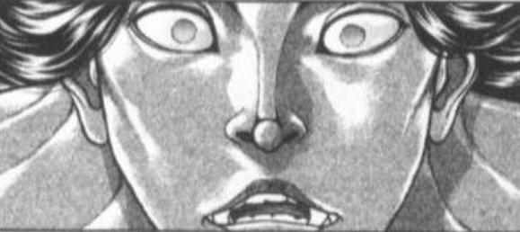
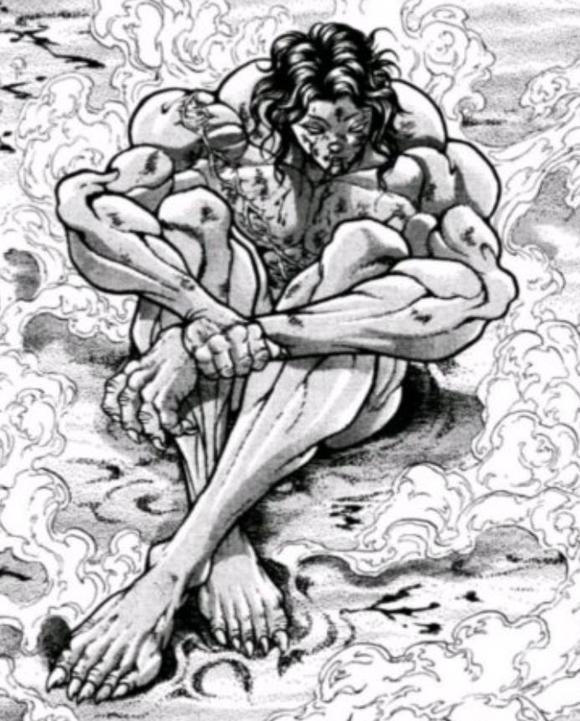
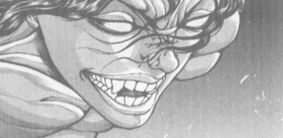
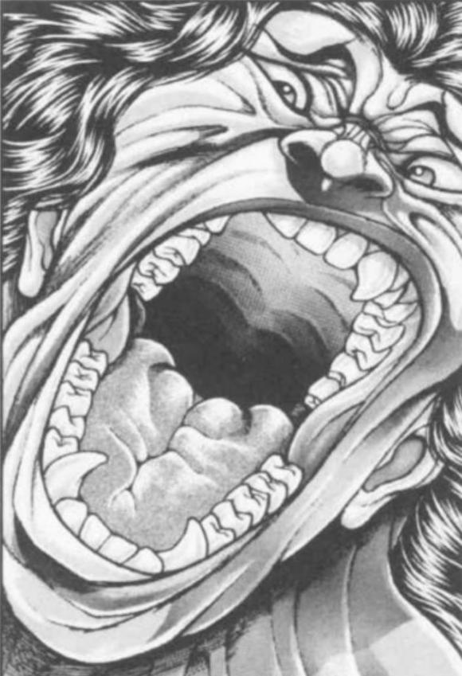
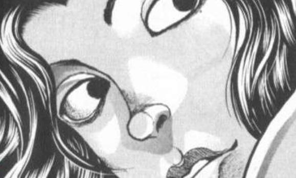

【1d60：3】秒钟后，就在这辆急速行驶的自行车前方

一位似曾相识的黑白色魔法使突然从路旁的草丛中跳了出来！

皮克的闪避【1d100：89】（75以上成功）

换作任何一个普通的车手，接下来将要发生的就是不忍直视的惨剧了吧——

但是此刻骑车的人是皮克！

原始人那粗壮的双腿在地上猛地一蹬，竟然硬生生靠着他那无与伦比的肉体力量让脚踏车飞翔在了空中！

小铃：哇，飞起来了！

避过魔理沙（？）的两人在空中划过了一道优美的弧线，而后平稳地落在了地上

大狸子的演技【1d60：48+40=88】（老奸巨猾+40，75以上成功）

成功避免车祸的两人安心地看向了身后

然后他们就看到了那惨不忍睹的场景

金发小女孩篮子里的蘑菇撒了一地

这位本该活蹦乱跳的魔法使此刻正虚弱地倚靠在路边大树旁

令人不安的暗色液体从她的嘴角流出，将白色的衣领染的鲜红

她看上去想要说些什么，但却根本发不出像样的音节

于是只能在那急促呼吸的间歇中零星蹦出几个字眼

魔理沙（？）：好……疼……

灵梦……

小铃：啊啊啊啊啊啊啊啊啊！

魔理沙！稍等一下现在就带你去看医生，要坚持住啊魔理沙！！！

文文：（这也太卑鄙了吧？）

荷取：（还别说演的真挺像……我刚刚差点就要跳出去了……）

本次的行动者是【1d2：1】

1 灵梦

2 魔理沙

另一侧暗中的三人组正面无表情地看着大狸子的精彩表演

烈：这演得也太假了

魔理沙平常面对的都是歌利亚人偶和贤者之石这一等级的威胁，再次也是那两位可以捏爆肋骨的握力

皮克那自行车真撞上了撑死也就摔个跟头，我估计连皮都破不了

好了魔理沙你冷静点把八卦炉收回去别在这时候跳出去干架！

武术家控制住了暴跳如雷的金发小女孩

魔理沙：&amp;%%#%……%##我宰了她！！！！

灵梦：好了你赶紧把狂暴的魔理沙控制住

这里就交给我吧

~森林~

魔理沙（？）正继续着她那逼真的表演

她颤抖着向小铃伸出了手

魔理沙（？）：灵梦……

救……救救我……

正当小铃快要哭出声的时候——

某位红白色的巫女一个闪身就出现在了她们中间，并温柔地握住了魔理沙（？）的手

灵梦：啊啊，来了来了

我这不是在这里吗，魔理沙？

说起来，你的头上为什么多了一片奇怪的叶子啊？

魔理沙（？）：！！！！！！！

灵梦：莫非，莫非

你是妖怪变成的吗？

稍等一下哦，我做一个小小的测试，之后就马上带你去看最好的大夫

博丽的巫女从怀中掏出了一叠符纸

灵梦：梦 想 封——

魔理沙（？）：啊哈哈俺刚刚是不小心吃了毒蘑菇导致产生了点幻觉现在已经完全没有问题了多谢你的帮忙啊灵梦俺还有事就先走一步了！！！！

但见路旁那重伤的魔法使一个鲤鱼打挺就蹦了起来

她面色扭曲地挣脱了灵梦的双手，双腿一跃就跳上了半空中的树枝，就这样以敏捷的令人难以置信的速度逃离了现场！

小铃：啊？？？

啊？？？？？？？

这到底是什么情况啊？？？？

灵梦：妖怪的恶作剧而已

很常见的小事，连皮克都不会因此而惊讶的

你们俩不是要出去玩吗？那就快点出发吧，别迟到了哦

皮克带着一头雾水的小铃出发了

【1d20：16】分钟后

~雾之湖~

皮克与小铃在湖畔停下了车

小铃：皮克先生

我们要怎么样渡湖啊？难道要游过去吗？

皮克的想法【1d10：1】（2-9划船，1 10随机）

草，这里抽到随机了是什么【1d10:2】

1 扛着飞过去！

2 烈：我拜托琪露诺做了冰道

3 魔理沙借了把扫帚（为啥啊）

4 扛着飞过去！

5 烈：我拜托琪露诺做了冰道

6 烈海王亲传踏水法（为啥啊）

7 扛着飞过去！

8 烈：我拜托琪露诺做了冰道

9 锵锵，芙兰朵露来了（为啥啊？）

10 大成功/大失败【1d2：1】

皮克（手写）：继续骑车就可以的

今天的湖上有路可走

小铃顺着原始人手指的方向看去

在那一片茫然的白雾之中，似乎有些什么东西正在闪闪发光

那是一条由坚冰铺设而成的，直通湖心的透明道路！

小铃：好厉害！

这是怎么做到的？！

皮克（手写）：这是妖精的力量哦

原始人载着一脸兴奋的橙发姑娘骑上了冰之道

~琪露诺的家~

琪露诺：半天不到的时间造出这么个东西，就算是老娘也累得要死啦！

烈：真是多谢你了，琪露诺

报酬想要什么？

琪露诺：至少【1d15：13】份点心

这回是看在皮克的面子上，换了你就算是一百份我也不帮忙！

烈：没问题！

算上上次的份，我多做点给你凑个整，20份吧！

没想到皮克他和你们的关系还挺好的？

灵梦：妖精们都喜欢大自然嘛

而那家伙在某种意义上都可以算是大自然的宠儿了

好了，任务基本完成

河童就交给魔理沙吧~

~湖的另一侧~

天狗正望着灰头土脸的狸猫哈哈大笑

文文：哈哈哈哈！

明明变成普通的村民就好了，结果为了追求冲击力却非要幻化成魔理沙的样子

最后差点被灵梦退治了吧？

猯藏的察觉【1d70：61+30=91】（60以上察觉有问题）

猯藏：这可不能说是老朽的失算

那个场合无论变成谁都可以起到相应的效果——

但只要灵梦在就一定不可能成功

是了，再加上刚刚恰好路过的烈海王

看来恐龙小子这次学聪明了，知道叫帮手了啊

荷取：怎么整，狸猫老大？

再不行动的话他们就要成功渡湖了

到了红魔馆的地盘可就没法出手干预了

猯藏的行动是【1d10:4】

1 俺去找阿求吧

2 将计就计

3 直接转符卡战吧（为啥啦）

4 俺去找阿求吧

5 将计就计

6 大家联手整个大的吧（为啥啦）

7 俺去找阿求吧

8 将计就计

9 放弃吧（为啥啦）

10 大成功/大失败【1d2：1】

猯藏：伤脑筋啊

是个人都能看出来他们根本就不合适，这小子却非得往死胡同里闯

河童你再最后努力一把吧

俺去请个新观众一块看演唱会

“嘭！”

狸猫妖怪在一阵白烟中消失不见了

蓝发的少女从背包里掏出了一个巨大的扳手

魔理沙：冷静点，冷静点荷取

不管怎么说我们都可以用更加理性而有效率的方法解决误会

所以无论如何先把那个东西放下好吗被扳手打真的是很疼的——

荷取：你居然还敢一脸正气的跟我谈恋爱话题？！

魔理沙：（糟了她居然还记得上次的事情啊！！！）

（救命啊！！赶紧过来救人啊！！！）

烈：（为什么让你去阻拦一下恶作剧还能出现这种情况？！）

烈海王要做什么【1d10：6】

1 武力介入吧

2 当然是靠我烈海王的口才

3 当然是拜托灵梦小姐（为啥啊）

4 武力介入吧

5 当然是靠我烈海王的口才

6 【The World！】（快成救人专用道具了）

7 武力介入吧

8 当然是靠我烈海王的口才

9 这里就拜托琪露诺吧（有用吗）

10 大成功/大失败【1d2：2】

烈：没办法……

【The World】！时间停止吧！

河童狞笑着向在机械臂中苦苦挣扎的金发小女孩挥出了扳手——

——【The World】——

“砰！”

但是，荷取的奋力一击只砸到了自己的装备

因为黑白色的魔法使忽然凭空消失了

荷取：？？？

这都能溜走，魔理沙是怎么做到的？？

天狗从湖中心飞了过来

文文：皮克和小铃已经到红魔馆了

不得不承认，我们的妨碍已经基本失败了~

之后就看那狸猫的鬼牌咯

~湖的另一侧~

武术家抱着魔法使从静止的世界中走了出来

烈：感觉今天应该没机会打架了，索性就直接用假腿了

她应该不会追过来吧？

魔理沙：荷取应该没和咲夜打过，我估计她一时半会反应不过来——

金发小女孩说到一半才发现了，自己如今正被横抱着的这个事实

魔理沙的慌张【1d100：88】

魔法使的脸以肉眼可见的速度红了起来

魔理沙：——***刚刚抱着我过来的？！

烈：不是，只是这个姿势比较顺手而已啊！

我之前战斗中救援铃仙前辈的时候也是这样的！

魔理沙：你个死变态居然还敢抱铃仙？！永琳没有打***？！

妈 的 赶紧把我放下，被帕秋莉或者爱丽丝看到我这条小命就要交代了！

黑白色的魔法使压着帽子蹦了下来

烈：（那下次救你的时候怎么办？拎着走还是背着走？）

【1d3：3】

1拎着

2背着

3抱着

魔理沙：（其实旁边没人的时候抱着也不是不可以……）

烈：（那不还是没变吗……）

等会这话题有问题吧？！

我怎么觉得越聊越不对头了？！

魔理沙：这**话题是你先开始的吧？！

红白色的巫女从空中飞了过来

灵梦：您二位在这磨蹭什么呢？

演唱会要开始了，赶紧想想之后怎么跟皮克解释吧

三人间的尴尬【1d100：76】

两眼无神的皮克

一脸懵逼的阿求

茫然无知的小铃

坐在座位上的三人不约而同地陷入了尴尬的沉默

阿求：——皮克，要不我们换个位置吧？

皮克：嗷嗷嗷嗷哦啊啊啊

（没啥必要，上午那场约会我搞砸了，下午这次实际上我只是想让小铃小姐开心一下而已）

嗷嗷嗷嗷哦啊啊

（烈海王他们建议我现在就别想着牵手 告白 kiss这些事了）

嗷嗷嗷嗷嗷嗷啊

（我觉得他们说的有道理……这次就当普通出来玩吧）

小铃：？？？

皮克先生在说什么啊？

紫发的史官不知为何松了口气

阿求：皮克说上午搞砸了，所以下午希望你能玩的开心哦！

橙发的看板娘闻言笑了起来

小铃：什么啊，皮克先生你怎么还想着上午的事情

太为我着想可不能说是你的错

就算今天下午没有听到歌，光是能出来这两次我已经非常满足了！

皮克（手写）：谢谢你，小铃小姐

帕秋莉小姐已经登台了，我们专心听歌吧！

观众席上的三人再次将视线投向了舞台中央

与此同时

~红魔馆大门~

走出庭院的狸猫妖怪，正好遇见了站在门口的巫女、魔法使与武术家

猯藏：就知道是你们三个在那边帮忙

不过，为啥最后的时候没来阻止老朽呢？

烈：在此之前，您对于他们三人间的关系了解多少？

猯藏的了解【1d100：89】

猯藏：老朽是常常在人里闲逛的，所以也能在各种各样的地方看见他们

一起吃饭，一起逛街，一起参加庆典，一起坐缆车上山，一起去游乐园玩……

刚开始的时候还觉得是关系很好的朋友，但到了现在

恐怕除了那两人之外，所有人都一看就能明白吧？

魔理沙：那就好办多了

总而言之，我们也觉得一直这样下去不太合适

但你们早上那种做法可太过分了

灵梦：本来只要和皮克说清楚让他自己做决定就行

结果现在不得不先帮他找回场子了

这到底是应该怪谁呢？

大妖怪苦笑着举起了双手

猯藏：对不起，是老朽太过心急了~

现在没有其他人能下场了

就看那孩子能不能鼓起勇气咯

~红魔馆~

本日的演奏曲目是【1d10：8】

1 Locked Girl　～ 少女密室

2 Flowering Night

3 YMCA！（二小姐？）

4 ライオン（Lion）

5 星间飞行（Interstellar Flight）

6 献给已逝公主的七重奏（大小姐？）

7 上海红茶馆　～ ChineseTea

8 爱·おぼえていますか

9 U.N.OWEN就是她吗？（又是二小姐？）

10 大成功/大失败【1d2：1】

今日其他成员似乎没有下场的打算

站在舞台上的只有一位紫色的歌姬

红魔馆的偶像 帕秋莉·诺雷姬调整了一下麦克风的位置后，有些紧张的吸了口气

帕秋莉：那个……今天大家都有事情要做，因此登场演出的只有我一个人了

还请不要有太大期待哦

帕秋莉的人气【1d50：44+50=94】（当红歌姬+50）

“大家都是为了帕秋莉小姐才会来的！！！”

“不要有任何压力请您安心唱吧！！”

“噢噢噢噢！”

（友情观众：路人鬼）

观众们激动地挥起了荧光棒，并用自己的行动支持着害怕冷场的偶像

帕秋莉：谢谢，谢谢大家的支持！

那么让我们开始吧，今天的第一首歌曲是

爱·おぼえていますか！

BGM：爱·おぼえていますか

帕秋莉：如今 又听到你的声音

「过来吧」

你对着在孤独中快要倒下的我说

如今 又看见你的身影

正向着

闭着眼睛等待着你的我 缓步而来

直至昨日 还悲伤的流着泪

而现在我的心…

你还记得吗

我们目光交汇的时刻

你还记得吗

我们手牵手的时候

那曾是我们

爱的旅途的起点

I love you so

皮克的感触【1d70：26+30=56】（70以上鼓起勇气告白，90以上察觉阿求的心意，恋爱模拟+30）

阿求的感触【1d70：14+30=44】（50以上察觉自己的心意，70以上鼓起勇气告白，恋爱模拟+30）

小铃的感触【1d100：72】（70以上察觉皮克的心意）

歌姬甜美的声音，与关于“爱”的歌词回荡在他们的耳旁

原始人似乎略有所动，但他想了想朋友们的告诫后又打消了心中的念头

紫发的少女还在思索着现在到底是什么情况，却没有分心去聆听歌曲

而书屋的看板娘对身旁两人的情况一无所知

她专心致志地听着这美妙的旋律

不知不觉，她回想起了这位大块头平时的一言一行

当自己被神隐的时候，是皮克先生第一时间采取了行动

当自己想要参加比赛的时候，皮克先生毫无犹豫就答应了邀请

皮克先生过去明明是位残暴而嗜血的狂人，现在却总是对自己彬彬有礼

他总会在空闲时间在店里看书，并尝试着带来些稀奇的礼品——而他却从未套要过任何报酬，似乎只是想和自己聊聊天

于是，橙发的女孩明白了

小铃：（原来如此）

（原来皮克先生喜欢我啊）

观众席上的三人各怀心思注视着舞台上的演出

他们就这样一言不发地听着

直到歌姬唱完了最后一句歌词

帕秋莉：再也不是独自一人

因为你的存在

再也不是独自一人

因为你还在这里

再也不是独自一人

因为你还在我心中

帕秋莉：这首歌送给我所爱的雾雨魔理沙

感谢她对我演艺事业和日常生活的支持！

魔理沙：谢谢，亲爱的！

金发的小女孩在旁人羡慕的眼光中挥起了荧光棒

烈：（你这一句话把气氛全毁了，魔理沙）

魔理沙：（我女朋友送的，你有吗？你女朋友会唱吗？）

烈：（我觉得八成不会吧……）

【1d30：7+30=37】分钟后，红魔馆的歌姬以她的招牌歌曲“Locked Girl　～ 少女密室”结束了本次的演唱会

时间已经到了傍晚，平静的湖面上映照着夕阳的倒影

兴奋的观众们讨论着今日的曲目离去了

而原始人和两位少女则在雾之湖畔慢悠悠地走着

皮克（手写）：小铃小姐，阿求，你们今天开心吗？

小铃：不仅体验到了与往日不同的生活，而且还听到了十分感人的歌曲

我，真的很开心！

阿求：虽然我到现在还有点迷惑啦

不过今天的演唱会真的很棒

皮克，你感觉怎么样？

皮克的情商【1d100:1】大失败

草，皮克你真绝了

大失败是什么【1d10:10】

1 皮克开始了呜嗷乱叫

2 帕秋莉愤怒了！

3 小铃：观念差异实在太大了（为啥啊）

4 皮克开始了呜嗷乱叫

5 帕秋莉愤怒了！

6 阿求生气了（为啥啊）

7 皮克开始了呜嗷乱叫

8 帕秋莉愤怒了！

9 小铃愤怒了（没戏了）

10 大成功/大失败【1d2：2】

双重大失败

双重大失败是什么【1d10:6】

1 当场发卡

2 1+不仅如此连朋友都没得做了

3 与亲友团当场开战（为啥啊）

4 当场发卡

5 4+不仅如此连朋友都没得做了

6 小铃那边没戏了，阿求也闹掰了（为啥啊）

7 当场发卡

8 5+不仅如此连朋友都没得做了

9 滑稽的野性（直接被打晕拖走了）

10 大成功/大失败【1d2：1】

皮克（手写）：我没听出啥好听的啊

说到底我本来也不爱参加这种活动

不知为何，橙发的少女看上去有些情绪低落

小铃：……皮克先生

明明是那么感人的歌曲

你却真的一点感触都没有吗？

皮克（手写）：小铃小姐你不用在意我的！

今天下午这次是我个人的赔礼道歉，只要你们开心就好！

本居小铃有点难过地低下了头

小铃：我，一直以来都觉得和皮克先生相处的时候总有些不对劲的地方

然后到现在我终于明白了

皮克先生你喜欢的并不是看风景啊，音乐会啊这种无聊的事情

和强大的对手厮杀，和妖怪们战斗才是对你而言的乐趣吧？

原始人呆呆地看着眼前的少女

小铃：但你却总是在我面前逼迫着自己做些不开心的事情

自己感觉无聊透顶，却总是耐着性子觉得让我高兴就好

我们明明是朋友吧？

小铃：刚刚听歌的时候，我才终于明白了你的心意

但是，我真的没有办法理解你的想法

为了追女孩子而一直变相折磨自己

这样一来就算以后在一起了也没有办法幸福啊

皮克：嗷嗷嗷嗷嗷啊

（我——）

小铃：已经认识这么久了

我却连你的话都听不懂

她走上前去，抱了抱眼前的大个子朋友

她有些遗憾，有些感伤，心里充满了难过的滋味

小铃：对不起，皮克先生

你真的是，真的是——

我所认识的，对我最好的朋友

原始人呆愣着站在了原地

他看见小铃遇到了棕发的大妖怪，然后在她的怀中哭了起来

他看到狸猫妖怪同样有些遗憾地向他摇了摇头，而后带着他的心上人离去了

他就这样傻乎乎地站着，直到身边紫发的少女拉了拉他的衣袖

阿求：……所以我之前制定计划的时候就说过了

小铃是个很感性的孩子，别带她去音乐会或者艺术展这种场所

第一次的约会就去地下看擂台赛，对她来说是个很棒的活动啊

阿求：先别急着放弃，皮克君

冷静一段时间之后把你的心里话跟她说清楚，这样一来就还有希望

现在先回去休息一下，等之后准备好了再继续——

然后

从天堂跌到地狱的原始人，终于忍耐不住地迁怒了起来

皮克：嗷嗷嗷嗷哦啊啊哦哦哦啊哦啊！

（但是早上那一次失败的更惨！）

嗷嗷嗷嗷嗷嗷嗷嗷哦啊啊！

（辛辛苦苦制定的计划简直就是一坨废纸！所有人都在妨碍我！！！）

嗷嗷嗷嗷嗷嗷嗷嗷嗷啊！

（我明明一直有尽力帮你的，为什么阿求小姐你却要故意给我这么糟糕的计划呢？！）

嗷嗷嗷嗷嗷嗷嗷！

（连你也希望我失败吗？！现在我输掉了，你们都开心了吧！！！）

稗田阿求震惊地听着眼前这男人的嘶吼

她想说我不是故意的，我完全没想过会出现这种意外

她想说一开始的约会只能一步步慢慢来，指望一步登天是不可能的

她想说实际操作中你出现了很多意外的失误，这都不能怪到我的头上

她想说我这大半年来一直在尽心尽力地帮你，也许心中确实有些阴暗的想法，但却从未付诸实际过

她想说我比谁都在乎你

她想说我比谁都希望你能够成功

但是

最终脱口而出的，却只是最糟糕的一句话

阿求：皮克君......

我，最讨厌你了！！！！！

她转身背对着原始人，就这样流着眼泪跑走了

【1d4：3】小时后

皮克双手抱着腿，静静地坐在湖岸边

朋友们在远处观望着他的情况

猯藏：——对不起

本来以为他送走小铃之后，那孩子会鼓起勇气表明真意的

或者万一他被拒绝了，对那孩子而言也是难得的好机会

但老朽实在是没有想到，居然会变成这个样子

烈：猯藏女士，这不是您一个人的问题

我们都觉得那是个很好的场合

他们可以将心里藏着的话说出来，然后迈向崭新的一天

魔理沙：我们都是这样想的，所以你把阿求带来的时候大家都很开心

大家都觉得他们总算可以结束了

但谁也没想到问题出现在了皮克本人身上

灵梦：大家都过于忽视他的感受了

可最后搞砸一切的却也是他自己……

我们现在该怎么办啊？

大家的决策是【1d10:7】

1 需要时间让他们冷静一下

2 与皮克说明情况吧

3 现在追上去还不算迟（真的吗）

4 需要时间让他们冷静一下

5 与皮克说明情况吧

6 皮克，你自己决定（你们这帮屑人）

7 需要时间让他们冷静一下

8 与皮克说明情况吧

9 有时候放弃也是一种成长（你们闭嘴吧）

10 大成功/大失败【1d2：1】

武术家走到了原始人的身后

烈：皮克，我们回永远亭吧

皮克：你那还算是人？

（回去干什么？）

烈海王抬手，发力，把朋友从湖边拉了起来

烈：回去商量商量，之后该怎么办！

皮克：嗷嗷嗷嗷嗷啊？

（还有下一次吗？）

烈：如果你放弃了，就永远没有下一次

如果你还在坚持，那明天总会有办法

你在史前时代克服了那么多的困难才活到今天

现在你却要这么消沉下去吗？只因为自己说错了话？

皮克的决心【1d100：45】

皮克：嗷嗷嗷嗷嗷啊

（但我真感觉没希望了……）

猯藏：当然，靠你一个人肯定是没戏了

但是朋友们不都在帮你吗？

这次老朽也会站在你这边帮忙的

恐龙小子，今天赶紧回去睡一觉

等到明天，再把你的恋爱找回来！

~永远亭~

今天的烈海王故事会开始了

烈的说明【1d100：31】

烈海王手足舞蹈地说明着今天的遭遇

师匠：我的天……这可真是……

皮克的恋爱怎么就这么艰难啊？

【1d30：7】分钟后

师匠向大家说明了今天的情况

兔子们正在旁边安慰着原始人

帝：好啦，皮克，不要自闭了

铃仙：皮克，别哭啦

虽说今天最大的锅确实在你身上

但自闭也解决不了问题啊

皮克：嗷嗷嗷嗷嗷嗷哦啊哦啊哦

（可我觉得这回真没戏了啊）

辉夜的怒气【1d50：44+50=94】（垂头丧气的原始人+50）

辉夜：你给我差不多一点！

这副畏畏缩缩的样子真是看着就来气，你平常打架时的凶狠到哪去了？！

神宝【蓬莱的玉枝　-梦色之乡-】！

“轰！”

原始人被七彩色的弹幕砸进了地里

辉夜：吵一架有什么大不了的啊？！

被女孩子讨厌了又怎么样？！

连基本情况都没搞清楚的家伙有什么资格在这里自暴自弃？！

烈海王当时比你惨多了！

我当年更惨！现在不还是过得很好！

皮克：嗷嗷嗷嗷嗷啊

（嗷嗷嗷嗷嗷啊）

师匠：说的没错

现在已经快半夜了，再去打扰她们不会有任何好的效果

你给我好好去睡觉

等到明天早上，再开始你的反击吧

皮克：嗷嗷哦啊哦啊啊

（我真的能成功吗？）

烈：放心吧，皮克

你看看，我，师匠，辉夜小姐，魔理沙这么多专家一块帮你

别的不敢说，谈恋爱这事

没几个人能比我们更懂了！

半信半疑的原始人进屋睡觉了

永远亭的各位则做起了第二天的准备工作

糟糕的一天结束了

而未知的明日，即将到来

（本日的更新结束，下一次的更新在周三左右，是本次剧情的后续，不知道长度如何，具体看我什么时候写完）

公布一下暗骰：

阿求的情报收集，成功后主动加入本次剧情

总共两次，全部失败

（以下是我的废话）

那么，本次的日常回到此结束

哎呀真是久违了，跑偏到这种程度的剧情

他 妈 的 我刚开始开局的时候是打算来个修炼回的！

正好借此机会多整点新符卡，顺便让其他角色们出个场

结果后续出这种剧情我一看转原创活动吧，然后前面都不错的结果偏偏在最重要的那个骰子

双重大失败了，草

从结论来说确实多了不少符卡

现在谁在乎那个啊（悲）

哎呦喂......我真的服了......

皮克在本次的剧情中真的是，全部抽到了最糟糕的选项

从开局就已经糟糕透顶了

三人会议居然一个站在皮克那边的都没有你们这帮屑人

演唱会的时候偏偏是小铃过了

最后大失败的时候基本上都是一边GG的选项他完美抽出了两方完蛋

两个救场子的暗骰一个都没有成功

——说真的一个人的骰运可以这么倒霉的吗？？？？？？

最惨的是这次下场的所有人其实真的都不算坏

两方行动的共同目标是让皮克认识到阿求的心意顺便把这一对促成了

结果小铃那边完蛋了连带着阿求那边也完蛋，偏偏还是皮克自己的问题，连个锅都没地方甩

我真的服了......

下一次的更新是加更的日常回，剧情线的第二天，不管是成是败都得给这烂摊子收个尾了

剧情可能不会长，也可能像今天这样的篇幅，具体看情况而定

那么本次的更新到此结束，下一次的更新在周三左右，具体看我什么时候写完，骰子明天发

~本日剧情的个人解析~

不知道大家会不会有种感觉

这一回的剧情实在是过分到极点了？

似乎比起之前那几次还要过分，但却可能隐隐约约说不上来

在这里分享一下我个人的见解

皮克这次最倒霉的地方在哪呢？

是那个双重大失败吗？是开局的约会失败吗？

都不是

皮克这次最倒霉的地方在于——

【本次剧情中】除了阿求之外，没有一个人真正站在他那一边

在烈 灵梦 魔理沙选倾向的时候，我原本是打算让他们三人直接过一个骰子的

但是如果这里没有中皮克的选项，那么皮克这回就真的会变得相当孤立无援了

于是我给三个人过了三个骰子，但依然没有一个人站皮克（悲）

这里才是那份违和感的来源

两方人马看似都在为他们的恋情而努力，实际上却没有一个人真正站在皮克的角度思考问题

因此我特意给了两个阿求的暗骰，因为【本次剧情中】只有阿求才是真正站皮克那边的唯一角色

但这两次都没过（悲）

从某种角度上来说，这才是皮克吃瘪的最大原因——

因为哪怕除了阿求之外有一个人站他那边，我都有理由塞挽救选项，剧情的走向也不会是后半段这个样子

不过大家也不需要太过着急

站在皮克一方的角色可还有很多呢，下一次就该他们出场了

角色的恋情是否能成功要交给骰子

但是这个故事的总体基调，由我说了算

一路追过来的大家应该也能看出来，我一直是【非常讨厌坏结局的】

所以不论这段剧情怎么收尾，我都会尽最大努力让皮克在贴子里过得开心，还请大家相信我

那么废话就说到这里，我去继续骰剧情了（

这两次的日常回骰子等到之后一起发吧，毕竟剧情上是连起来的

不知道明晚有没有事，如果没事的话明晚七点半更新，有事的话大概会推迟或者直接推到后天晚上，具体看情况

大概今晚七点半左右更新

~前情提要~

两线崩盘，皮克自闭

~第549天~

~夜晚~

~永远亭~

哀伤的原始人被半哄半强制地送进屋里睡觉了

而毫无睡意的永远亭的大家则在医务室开起了作战会议

辉夜：皮克的情况大家也了解了

说好听点叫感情受挫，说难听点叫两线崩盘

本居小铃那边不算什么大问题，她比另外两人看得都要清楚

但是皮克和稗田阿求则一个比一个麻烦

具体分析放到之后在说，我们现在首先要确立一个大前提

辉夜：那就是我们的行动立场

我们要做的是什么？

是帮助皮克成功追到本居小铃？

还是帮稗田阿求成功追到皮克？

嗯，烈海王？和皮克一起经历过这一天的你有何见解啊？

永远亭的武术家毫无犹豫地回答了这个问题

烈：都不是

我们的立场应该是帮助皮克尽可能清晰理智地理解这个局面，并且让他从现在这个颓废的状态中走出来

恋爱是他自己的私事，我们无权替他做任何事情

换而言之——

帮助皮克在【冷静】的状态下做出让他自己不会后悔的决定，才是我们该做的事情

师匠：你总算明白了

其他两人是什么感受？

他们三个人的关系能够回到从前吗？

站在我这个老师的角度来看，这些都是次要的

与皮克自己的心情和成长相比，其他事情统统无所谓

烈：你说的没错……

当时在场的我们都太过于自以为是了

那些傲慢的善意对于当事人根本就没什么实质性的帮助，却起到了反效果

辉夜大小姐敲了敲桌子

辉夜：好了，无聊且没有意义的反省时间到此结束

立场确定下来了，剩下的事情就好说了

这事光靠他们自己来肯定是不行的，现在的皮克需要支援

而这个支援由谁负责？

就靠我们几个和灵梦魔理沙她们，还是再去找其他的外援？

永远亭众人的自知之明【1d100：67】（50以上拉外援）

沉默了一阵之后，月之头脑率先开口了

师匠：虽说大家都已经谈过恋爱了

但是我们这些相对异常的情况，实际上对皮克是没有什么帮助的

烈：我不认为和她们两个打一架能够解决这个尴尬的局面

我也不觉得辉夜小姐那种依靠时间和陪伴成功的计划能够用在现在的皮克身上

帝：策划一下活动给他们亲近的机会这种活我还干的来

但是这种双方都已经很熟悉的情况……

我也没办法啊

铃仙：我连恋爱都没谈过……

辉夜：看来大家的意见都一样

我们需要强力的外援，最好是有经验，有实绩，头脑冷静，善于分析情况，且恋爱观相对正常的人物

考虑到这个复杂而糟糕的情况，提供意见的人越多越好，差不多【1d6：5】位左右吧

正好大家一人推举一位，烈海王先开始

武术家想都没想就说出了那个值得信赖的名字

烈：芙兰朵露小姐

行动力与理论兼备，看问题一针见血，我所知道的实绩最强的恋爱专家

永琳，你的推荐是？

和烈海王一样，月之头脑立刻就给出了答案

永琳：风见幽香

理由的话我已经不用说明了吧？

到你了，优昙华

铃仙：要我说的话……

果然是探女大人吧

虽然她不太擅长恋爱这块，但是她的能力对于这种情况有奇效

在情况最为糟糕的时候我们可以拜托她开口——

反正我觉得已经没什么情况比这更糟了

地上的兔子接过了月兔的话头

帝：头脑冷静，善于分析情况，且恋爱观相对正常……

要说这些的话，我第一反应是上次那个白头发的男人

叫做森近霖之助对吧？

虽说那次大家都有出手相助，但我觉得他自己的表现才是获得胜利的关键因素

这样一来就凑齐了四人，公主大人您还有谁可以推荐的？

辉夜的推荐是【1d2：2】

1 妹红

2 慧音

永远亭的公主大人用单手撑起了脸

辉夜：我们还需要一位和那两个小女孩关系好，且值得信赖的帮手

除了上白泽慧音以外，还有其他的选择吗？

如今夜色已深，给她们送个使魔之后今天就该结束了

明天一早找个地方继续开会，在永远亭的话皮克很可能会听到讨论的声音

我不想对他造成太大刺激，因此需要找个新地点

【1d3：1】

1 太阳花田

2 香霖堂

3 红魔馆

辉夜大小姐沉思了一阵

辉夜：香霖堂那地方面积太小

我们和斯卡雷特家算不上太熟，全都去红魔馆也不现实

烈海王，提前跟风见幽香说一声

明天去太阳花田开会，没问题吧？

烈：交给我吧

我想幽香她不会拒绝的！

师匠：那么我负责联系探女，烈去找芙兰朵露与幽香

公主大人负责联系上白泽慧音和森近霖之助

我们几个要在这边配合计划行动

因此烈，由你一个人去参加会议

辉夜：记住，我们的目标不是一定要让这场恋爱成功

这次行动的主题是让他从这个失恋的阴影中走出来

皮克的心态是第一要务，与那两个小女孩的关系修复属于次要任务

像是什么时候告诉皮克真相，什么时候鼓励他前进，明天的具体行动计划……

这些事情统统交给你们来决定，而我们来负责执行

明白了吗？

烈：哦哦，放心吧！

决定了明天的行动计划之后，永远亭众人结束了这短暂的会议，并离开了医务室

见多识广的众人对自己的能力和帮手们的智慧有着充分的自信

他们安稳地进入了梦乡之中

~第550天~

~清晨~

~太阳花田~

半妖店主，白泽，天探女，吸血鬼，还有请求帮助的武术家......

由于本次请来的帮手有点太多了，四季鲜花之主不得不多搬出了几张桌子

幽香：真热闹啊~

上一次有这么多客人来，似乎还是支援月之都行动的时候呢

没想到那次事件的主谋会来我这做客

说起来我这里应当是属于污秽较多的地方

这位月之民不会为此而感到为难吧？

穿着全封闭防护服的天探女大人摆了摆手

探女（手写）：毕竟是八意大人的吩咐，自然没有推脱的道理

让那个小丑妖精离我远点，其他的事情我不在乎

不远处的克劳恩皮丝向她摆了个鬼脸

由于刚刚起床还有些困顿的白发半妖推了推眼镜

霖之助：我们也没法保证能帮上忙

魔理沙说的话有些零碎，我无法拼凑出事件的全貌

总之还请先说明一下情况吧，亲身经历过的烈海王先生

烈的说明【1d100：51】（50以上理解）

永远亭的武术家在因幡帝的帮助，将他所了解的情况说了出来

在座的各位专家闻言陷入了沉思之中

【1d120：74】秒后，他们开启了话题

第一个话题是【1d10:7】

1 芙兰朵露：皮克的心态

2 霖之助：皮克的身份

3 幽香：阿求的原计划（好快啊）

4 芙兰朵露：皮克的心态

5 霖之助：皮克的身份

6 慧音：阿求那边的情况（好快啊）

7 芙兰朵露：皮克的心态

8 霖之助：皮克的身份

9 探女：直接进入实操环节（为啥啊）

10 大成功/大失败【1d2：2】

飞在半空中的恶魔之妹率先提出了问题

芙兰朵露：这确实是有点复杂的情况

不过，在提出建议之前

芙兰老师我有个地方感觉很奇怪啊

皮克他为什么会这样束手束脚的？

我并不是很了解这个人，他平时在日常生活中也这样吗？

烈：不，皮克他平常不仅憨而且胆子还很大

上次那么紧张的场合他都能笑出声的，干架的时候也是狂暴的像个野兽一样

慧音：我认为，个人的实力在人际交往方面其实占据了很重要的一部分

战斗力强大的皮克先生，没有理由在一个小女孩面前低声下气啊

霖之助：我也觉得这样很不合理——

喂你们看着我干什么？！

为什么都笑起来了？！

在这样下去我走了哦！认真的！

藏住了笑容的大家看向了最了解皮克的武术家

烈的推理【1d70：30+30=60】（50以上成功）

烈：这只是我的猜测

恐怕这有着两方面的原因

一方面，皮克他知晓自己是强者的这一事实

因此他很害怕自己会不小心把朋友弄坏

就像和刃牙打架的时候一样，他想让自己表现的无害，而这又是在他喜欢的女孩子面前

因此他下意识地把自己藏在了弱势的表面下——这对双方都是种保护

烈：而另一方面

皮克是一个原始人

现代社会的规矩和礼仪之类的东西对他而言是种没有必要的束缚

平时他自己在外面打架的时候还好

但和女孩子们见面的时候，他不得不把自己禁锢在这个笼子里

这对他而言是相当别扭且无法理解的……

这就是我所推测的原因了

众人的解决方案是【1d10：10】

1 让皮克回到原本的样子

2 暂时削弱皮克的力量吧

3 让皮克痛痛快快打一架吧（为啥啦）

4 让皮克回到原本的样子

5 暂时削弱皮克的力量吧

6 让皮克学会说话吧（为啥啦）

7 让皮克回到原本的样子

8 暂时削弱皮克的力量吧

9 唤醒他的野性吧！（过头了！！）

10 大成功/大失败【1d2：1】

解决方案大成功！

大成功是什么【1d10:10】

1 直接让皮克走出自闭了！

2 原始回归后的皮克重拾了信心！

3 做出了让皮克出气顺便回归正常的战斗计划（怎么做到的）

4 直接让皮克走出自闭了！

5 原始回归后的皮克重拾了信心！

6 不忘初心，钢铁意志文青原始人诞生了（为啥啦）

7 直接让皮克走出自闭了！

8 原始回归后的皮克重拾了信心！

9 是我探女哒（为啥啦）

10 大成功/大失败【1d2：1】

双重大成功

不愧是你们，不愧是这地方

我真的服气了

双重大成功是什么【1d10：4】

1 原始回归自信皮克+让他冷静察觉三人关系的完美计划

2 原始回归自信皮克+缓和三人关系的完美计划

3 自信皮克+缓和了三人间的关系+痛痛快快来一场（怎么做到的）

4 原始回归自信皮克+让他冷静察觉三人关系的完美计划

5 原始回归自信皮克+缓和三人关系的完美计划

6 探女的超水平发挥（为啥啦）

7 原始回归自信皮克+让他冷静察觉三人关系的完美计划

8 原始回归自信皮克+缓和三人关系的完美计划

9 以上所有

10 大成功/大失败【1d2：1】

诸位恋爱专家们思考了数秒

而后不约而同地露出了微笑

芙兰朵露：这不是很好解决的问题吗~

只要让皮克在那两人面前回到原本的样子，他本人的心态问题就已经解决大半了啊~

烈：哎！？

可是皮克他是凶暴的原始人啊！

这对那两个姑娘的刺激未免太大了吧？！

幽香：那又怎么样？

我的脾气也算不上好，就连现在都还压抑着蠢蠢欲动的战意呢

尽管你以前经常被我吓的满身是汗，但是这并没有阻止你和我的交往吧？

慧音：说到底，所有人都有着不为人知的一面

能够接受对方的真实面目，在此基础上还愿意主动维持这份关系的，才是真正的朋友或恋人啊

如果做不到这点的话......

霖之助：那就是，浮于表面的虚伪的情感

这种关系就算破裂了也没有什么大不了的，对吧？

银发的恋人们相视一笑

探女（手写）：ﾟ∀ﾟ)ノ顺便一提，刚刚我做好让这个奇怪的原始生物自己冷静认清现状的方案了

其他几位应该也已经想出了有效的办法

烈：这么快吗？！！

等会，这个先放在一边

说到底该怎么让皮克他回到过去的样子？

他现在已经很习惯现代生活了啊

众人的办法是【1d10:8】

1 打一场吧！

2 在创造的历史中狩猎！

3 把衣服扒了（为啥啊）

4 打一场吧！

5 在创造的历史中狩猎！

6 梦境（为啥啊）

7 打一场吧！

8 在创造的历史中狩猎！

9 大规模环境改变（为啥啊）

10 大成功/大失败【1d2：1】

霖之助：皮克先生的本体，是在数亿年前所诞生的生物

那个时代没有神秘力量的加护，也没有外界所谓科技的帮助

在那时所生存下来的他应当有着另一重身份

也就是，仅凭本能活动的猎食者

慧音：给我足够的有关于那个时代的历史记载，我就可以尝试用能力暂时重构当时的环境

如果再为他准备一只足够凶猛的野兽

在古代活跃的战士，可没有理由再保持那副彬彬有礼的样子了吧？

幽香：嗯，恋爱战要的就是速战速决

你就先去永远亭执行计划的第一步，稍后我们就把让他冷静认清现状的方案提供过去

辛苦你了，白泽老师

慧音：我自己的恋爱也是受了大家很多帮助才能成功的

现在当时帮助我们的人遇到困难了，可没有不伸出援助之手的道理啊

那么我就先出发了！

白发的半兽人向着半妖挥了挥手后，起身暂时离开了花田，前往永远亭了

【1d30：18】分钟后

~永远亭~

刚刚起床的皮克，正准备随便吃点东西应付一下肚子

这个时候，地上的兔妖怪一脸惊慌的跑到了他跟前

帝：皮克！

外面好像出现了个很厉害的家伙

看上去和上次超能力者召唤出来的怪物好像啊，你认识吗？

皮克：嗷嗷嗷哦啊哦啊啊？

（啊？这个时代还有朋友吗？）

一脸迷惑的原始人扛着兔妖怪推开了永远亭的大门

他本以为自己会看到在竹林中猖狂肆虐的妖怪——

但眼前的场景超乎了他的想象

他所看到的并不是幽静的竹林，而是被裸子植物与蕨类植物所占据的荒蛮大地

空气中充满了潮湿的气息

翼龙在变了个颜色的天空中飞行

相比于现在更加巨大和古怪的昆虫们在地上爬行着

一切都像是回到了他记忆之中的场景

一切都像是回到了一亿多年前一般

“咚，咚”

原处传来了巨大的响声

原始人看向了声音传来的方向

那是【1d10：9】

1 三角龙（大型野猪幻化）

2 迅猛龙（小型妖兽幻化）

3 镰刀龙（为啥啊）

4 三角龙（大型野猪幻化）

5 迅猛龙（小型妖兽幻化）

6 棘龙（那时候有吗）

7 三角龙（大型野猪幻化）

8 迅猛龙（小型妖兽幻化）

9 霸王龙（这怎么整出来的啊？）

10 大成功/大失败【1d2：2】

那是，他过去曾经拼尽全力才打倒的敌人

和之前超能力者曾经召唤出来的念力兵器不一样

这是有呼吸的，有利齿的，身上流淌着血液的——

活物

帝：这玩意不管怎么说都太可怕了吧？！（棒读）

皮克，咱们还是去找师匠吧——

笑了

原始人露出了笑容

他轻轻放下了肩膀上的兔妖怪

他的四肢向着怪异的方向扭曲着

他的肉体上出现了一道狰狞的伤疤

猎食者像过去一样趴在了地上

皮克：嗷嗷嗷嗷嗷嗷啊！

（这是老朋友了！）

他像一亿多年前那般一跃而起，向着眼前的凶兽展露了自己的獠牙！

【5+1d15：1=6】分钟后

过去的强敌对如今的皮克已经不是太大的威胁

巨大的暴龙轰然倒地

原始人高高挥舞着手臂，做出了胜利的姿势！

皮克的野性【1d50：30+50=80】（75以上开吃，原始回归+50）

皮克还没吃早饭呢

他在数分钟以前还满怀着犹豫，感觉世界一片灰暗——

但对于现在的他而言，没有什么比眼前的食物更加重要

暂且忘记糟心的事情

不去思考未来的计划

遵循着本能，他大口咬向了眼前的食物

皮克：嗷嗷嗷嗷嗷嗷啊！

（是真的！是它的肉！！）

原始人欣喜地发现，这的确是记忆中的味道

他迫不及待地咽下了口中的食物

而直到这时候他才想起

自己如今身在永远亭

嘴角挂着血丝的皮克有些慌乱地看向了身后的兔妖怪

帝：怎么了皮克？

我不爱吃生的，你要想留就切块肉下来让烈海王晚上炖了吧

地上的因幡一脸稀松平常地看着他

皮克：嗷嗷嗷嗷嗷啊……

（不是，我在吃生肉……）

嗷嗷嗷嗷嗷嗷啊……

（不会因此而讨厌我吗……）

兔妖怪笑着拍了拍皮克的腿

帝：你在说什么啊？

咱们都认识多久了？

要吃的话你拖进院子里再吃哈，我去问问师匠这环境是怎么回事

等之后你吃完早饭了，咱们再接着商量今天的行动流程

因幡帝走回屋子里去了

原始人看了看自己现在的样子

他刚刚起床，身上就穿着一条裤衩

披头散发，满手血腥

口中嚼着鲜活的肉块

脸上想必也带着可怖的表情

但他的朋友不害怕，也不在乎

皮克：哈哈哈！

笑容重新回到了他的脸上

史前生物拖着暴龙的尸体，脸上带着些莫名的自傲和活泼，就这样走回了庭院之中

