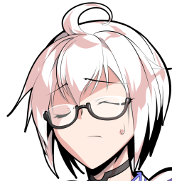
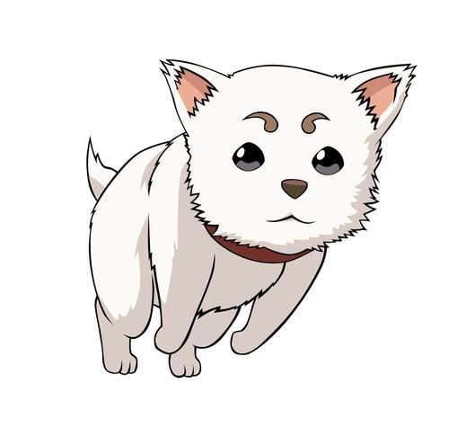
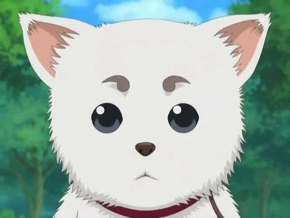
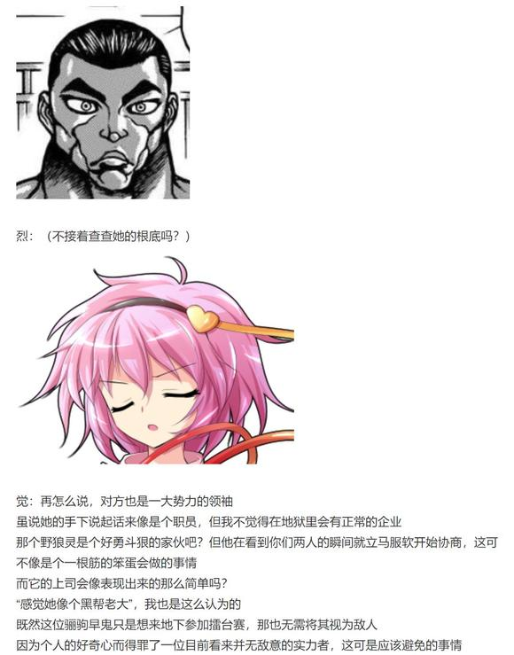
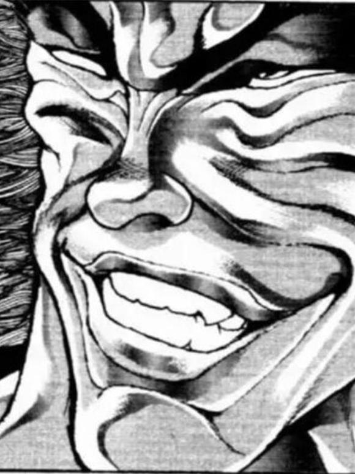
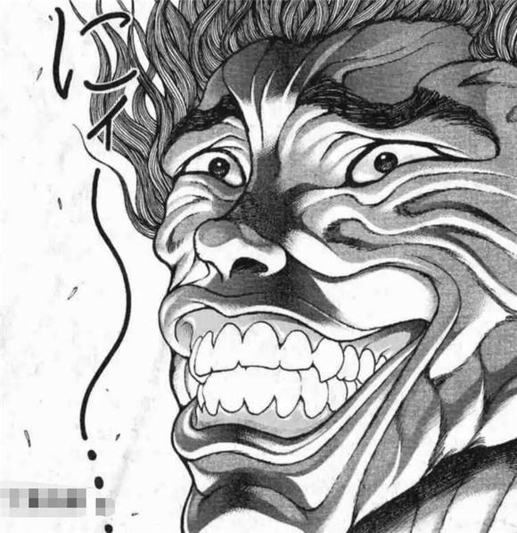
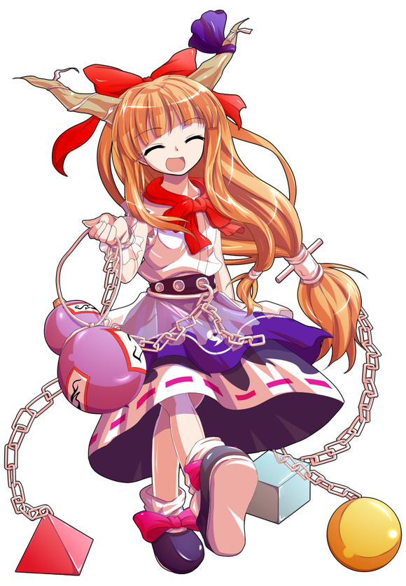
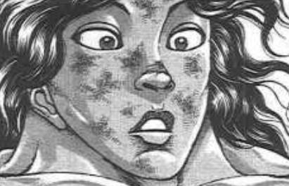
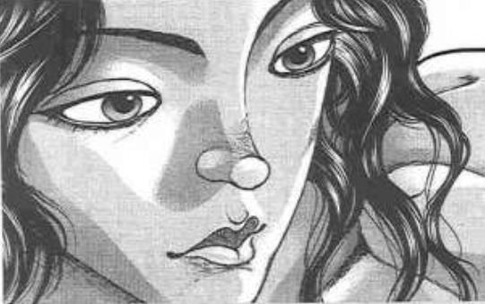
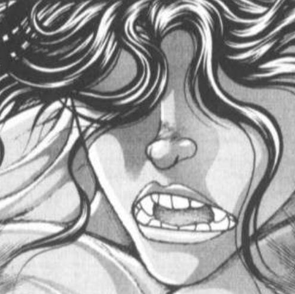

~时隔已久的补习~

~博丽神社~

黑着脸的银发半妖提着一大袋子书本走向了正在喝茶的巫女与魔法使

魔理沙：香霖？你怎么来神社了？

霖之助：认为你们两个已经成长到了独当一面的程度是我的过错

对着心情微妙的少女说出那种超直球发言还丝毫不以为意

就算其他人可以打着哈哈笑过去但本人可是完全难以接受啊！

灵梦：那个，霖之助先生？

我很感激你援助神社的诚心但把这些书本换成现金可以……吗？

香霖堂的店主把书堆砸到了巫女的小桌上

霖之助：啊哈哈当然不行！

这是之后这段时间的教科书与课外读物

该开始补习了你们两个！

魔理沙：又来？！

又不是我不识字的时候了哪有这个年纪还在上课的啊？！

霖之助：宇佐见君跟我说过了

很多外界的年轻人们直到20多岁才会结束课程，甚至有学习到30岁以上的刻苦人物

相比之下，对你们两个的放养政策简直是本人无可容忍的大失败！

红白色的巫女悄悄蹭到了门口

灵梦：说得对，魔理沙她确实需要这样的补习——

因此还请两位慢慢加油我就先去巡查人里了！

博丽的巫女以堪称一骑绝尘的速度冲出了神社的大门

然后不偏不倚地撞到了来访的仙人身上

华扇：巡查工作我帮你完成就好

今天已经没有其他的事情了吧？

那就放平心态接受杂货店小哥的补习吧

这也是修行的一环哦~

灵梦：（救命啊——）

两人的专心程度【1d100：24】

尽管有着仙人的看守，但两人对于学习依然抱着漫不经心的态度

在努力了【1d60:52】天后，森近霖之助不得不承认，他的精英教育计划又一次失败了……

（彩蛋环节结束）

大概明晚七点半左右更新

有些素材忘记准备了(悲），于是稍等10分钟左右

原创活动第七季来了！

在沉重而压抑的恋爱故事过去之后终于又到了欢乐搞笑活动的时间！

求求你不要出现严肃发展了！至少让基调看上去像是轻松的搞笑活动！也别再迫害人了好吗？！

那么就放空大脑，开始烈海王乱七八糟的一天吧！

~这件事发生在烈海王来到幻想乡的第【550+1d30:27=577】天~

本次的原创活动是【1d10：3】

1 莉格露似乎想要挑战格斗家的样子 第二季（这次让橙上吧）

2 车椅子侦探古明地觉事件簿 特别篇

3 旧地狱地狱擂台赛再临，与皮克的双人挑战（赫卡提亚也在哦）

4 问题儿童们的报恩！

5 魔理沙的约会大作战 第二季（还来吗？）

6 夏日的弹幕烟花大会

7 守矢神社大擂台！

8 神子：让人类再一次伟大！

9 厨神争霸战：黑暗料理界对战特级厨师！

10 大成功/大失败【1d2：2】

距离第一次前往地底已经过去了五百余日——

旧地狱地狱擂台赛 再开！

烈海王是怎么接触到这事的？【1d10：3】

1 勇仪的酒会

2 与赫卡提亚的闲聊

3 觉的联络（为啥啊）

4 勇仪的酒会

5 与赫卡提亚的闲聊

6 我无意识（为啥啊）

7 勇仪的酒会

8 与赫卡提亚的闲聊

9 下课后的闲聊（为啥啊）

10 大成功/大失败【1d2：2】

~永远亭~

这天早上，刚刚完成晨练的烈海王正在思考着今日的早餐

就在这时，觉妖怪赠送给他的通讯器响了起来

武术家掏出了那个眼球状的奇怪物体

烈：早上好，觉小姐

又有新委托了？

觉：早上好，烈海王

地下又要开始办新一轮的擂台赛了，你知道吗？

烈的情报收集【1d70：62+30=92】（50以上知情）

烈：这事我清楚的很

之前和勇仪喝酒的时候她提到过，在【1d5：3】天之后要办一轮新的擂台赛

这一次她们好像准备办场团体赛，由赫卡提亚女士负责当裁判和解说，我正准备拉着皮克参赛呢

话说您问这个做什么？

觉来联络的理由是【1d10：9】

1 普通的组队邀请

2 带恋恋一块参赛吧

3 似乎有人想要乱入的样子（是谁啊）

4 普通的组队邀请

5 带阿燐一块参赛吧

6 后勤队缺点人手来帮个忙吧（为啥啊）

7 普通的组队邀请

8 带阿空一块参赛吧

9 有奇怪的灵混入了旧地狱（真的假的）

10 大成功/大失败【1d2：2】

觉：清楚情况的话就好办很多了

长话短说，在鬼族们忙着筹备擂台赛的时候

旧地狱内却悄悄混进了些奇怪的灵魂

烈：灵魂？

是某种特殊的怨灵吗？

奇怪的灵是【1d10：2】（2-5野狼灵，6-9水獭灵，1 10随机）

嗯……过一个觉对 畜 生 界的了解

【1d100：36】（60以上大概了解，75以上明确势力分布）

觉：不，和你想象的有些不一样

怨灵也好恶灵也罢，在其生前都是人类

但是这一次混进来的灵魂与它们有着“种族”上的区别

那是，动物的灵魂

烈：动物灵？

觉：正是

我不太了解它们平常所居住的地域

但按理来说，这种存在是不应当出现在地下的

只是想来参赛的话自然欢迎，但如果它们想做点小动作的话——

烈：在您的立场上可就无法放任不管了

我大概理解了，确实是有点奇怪的状况

正好我今天也没什么事，稍等我把早饭做好就去一趟地底吧

觉：那么就感谢协助了

顺便，你其实每天都没什么事吧？

烈：毕竟我的正式工作是厨师

不用像铃仙前辈一样经常往外跑的话，空余时间也自然很充足了

结束了与读心侦探的通讯之后，烈海王走向了厨房，开始了今天早上的烹饪……

【1d2：2】小时后

本次觉要找代理吗【1d10：9】（1-3自己上，4-6阿燐，7-9恋恋10随机）

~旧地狱的街道~

武术家在地下繁华的街道中环顾了一圈，却并未找到觉妖怪的身影

烈：觉小姐，我已经到地底了——

就在这时，另一位觉妖怪无声无息地拍了拍他的肩膀

恋恋：姐姐说她自己来的话很容易暴露

所以就让我来当代理了！

烈的惊吓【1d100：54】

烈：哇！

是恋小姐啊，吓我一跳

恋恋：哦哦，成功了~

好遗憾，刚刚应该用玛丽小姐的

觉（通讯）：鬼族之中的大多数一看到我就会一脸慌张地退走，因此虽然是地下的主场，但这次还是拜托恋恋来替我跑一趟了

那么首先是本日的第一个任务，也是最重要的任务——

觉妖怪略微停顿了几秒钟

觉（通讯）：拜托帮我一并看好恋恋别让她到处乱跑了

这次她出去了足足【1d15：5】天直到昨晚才回来，我差点就要提出第二次寻人委托了

烈：怎么听都觉得这个才是您让她来的真实目的吧？

觉（通讯）：不，这个只是大概【1d100：47】%左右的私心而已

烈：私心差点就要超过正事了！

觉（通讯）：毕竟你能够发现恋恋嘛，就麻烦你了~

言归正传，开始本次的委托吧

烈海王要做什么【1d10：8】

1 关于那个动物灵的详细情报

2 关于那个动物灵的出没地点

3 这里就靠我烈海王的直觉（为啥啊）

4 关于那个动物灵的详细情报

5 关于那个动物灵的出没地点

6 这里就靠恋恋的无意识（要怎么做啊）

7 关于那个动物灵的详细情报

8 关于那个动物灵的出没地点

9 这里就靠勇仪的情报网（勇仪知道吗）

10 大成功/大失败【1d2：1】

烈：觉小姐，这位“动物灵”这几天出没在地下的哪片区域？

目前对方的立场尚不明确，我想先试着与其接触之后再做决定

觉的情报搜集【1d60：26+40=66】（读心侦探+30，地底主场+10,60以上判定成功）

野狼灵的出没地点是【1d10:1】

1 街道的酒馆

2 地灵殿附近

3 旧地狱的温泉（为啥啊）

4 街道的酒馆

5 地灵殿附近

6 灼热地狱遗址（为啥啊）

7 街道的酒馆

8 地灵殿附近

9 幻想风穴（这不都没进来吗）

10 大成功/大失败【1d2：2】

觉（通讯）：根据我的情报来看，它似乎很中意旧地狱的酒馆

本次的目标是动物灵，它以本体出现的概率不高

我认为它可能会采取凭依到其他客人身上的手段来隐藏自己

烈：明白了，我会注意观察的

那现在就开始调查——

恋小姐你干啥呢？

绿发的觉妖怪正坐在轮椅上看着他

恋恋：要当调查的话当然要坐这个！

这一次的车椅子侦探，就是本人古明地恋啦！

武术家耸了耸肩，然后推着觉妖怪开始了他的调查活动

烈的情报收集【1d70：27+30=57】（60以上成功）

【1d60：12】分钟后，烈海王望着挤满了恶鬼的酒馆叹了口气

烈：旧地狱的酒馆太多了

这么个找法再折腾一天，希望也不算大

恋小姐，你有什么看法吗？

恋恋的无意识【1d50：34+50=84】（75以上随机事件）

哦呼，恋恋干什么了【1d10:8】

1 和路边的蒙面人聊了起来

2 说起来她很容易被凭依来着

3 和路边的长尾巴的家伙聊了起来（为啥啦）

4 和路边的蒙面人聊了起来

5 说起来她很容易被凭依来着

6 报名参赛啦（为啥啊）

7 和路边的蒙面人聊了起来

8 说起来她很容易被凭依来着

9 抓获了被野狼灵凭依的路人鬼（为啥啊）

10 大成功/大失败【1d2：1】

轮椅上的觉妖怪转过了头

恋恋：看法？

我有什么看法，你这家伙明明是来调查的却要问我的意见，到底靠不靠谱啊？

做不到的话就直接跟姐姐说“我干不来”然后回地上嘛，在这里浪费时间是做什么

烈的察觉【1d70：51+30=81】（50以上察觉有问题，75以上直接分离）

武术家对着眼前的绿发女孩端详了片刻

烈：恋小姐

说起来你今天想吃甜品吗？

恋恋：当然！

布丁或者蛋挞都可以，既然说了就赶紧给我做点吧

烈：（果然有问题，恋小姐之前可不是这么说话的）

（但这些话看上去也没有偏离她的本意）

（“没有主意”和“想吃甜品”都是她自己的想法，但表达出来的方式却不太一样，这看上去有点像是……）

恋小姐，像上次异变的时候一样，先把身上的凭依解除掉吧

恋恋：哦哦！

古明地恋从轮椅上蹦了下来，然后高举双手，原地一跳——

一个火红色的灵魂就从她的背后弹了出来！

（由于没有找到合适的立绘，因此先让既不是火红色也不是野狼的定春友情出演）

？？？：哈啊？！

搞什么？！

烈：的确，恋小姐由于自身能力的缘故是很容易被凭依的

不过在上次完全凭依异变的时候，她和魔理沙也利用这一特性做了许多与此相关的实验

从结论来说——

恋恋：想要凭依他人和解除凭依对我来讲都是小事一桩啦

说起来这个红色的家伙是谁啊？

？？？的坦诚【1d100：64】（51以上和平说明，50以下逃跑）

红色的犬状灵魂摇了摇尾巴

野狼灵：呵呵呵

我是畜 生 界最强组织劲牙组的一员

黑天马老大的直系下属

以肌肉和力量自傲的野狼灵！

烈：哦

无意识的少女抓着犬状灵魂的脖子把它提了起来

恋恋：哦

原来如此

你知道最近出现的动物灵是谁吗，野狼灵？

野狼灵：被抓到了也没办法......

没错，就是我！

恋恋：哎~

居然特意跑来地下喝酒

那个叫做**界的地方没有酒吗？

野狼灵：虽然没这边好喝但我们那边也是有酒水的——

不是，你在说什么？

恋恋：哦哦，原来如此

说起来你是谁啊？为什么在我手里？

野狼灵将求助的目光投向了一旁强忍着笑意的武术家

烈：噗噗噗噗

恋小姐是这样子的，不要在意

那么回归正题，请问**界的动物灵为何会来地下呢？

野狼灵的目的是【1d10:7】

1 老大想要参赛因此过来侦查下情况

2 对幻想乡的战力侦查

3 老大！你在哪里啊老大？！（为啥啊）

4 老大想要参赛因此过来侦查下情况

5 对幻想乡的战力侦查

6 ？？？的任务（为啥啦）

7 老大想要参赛因此过来侦查下情况

8 对幻想乡的战力侦查

9 其实是自己溜出来玩的（为啥啊）

10 大成功/大失败【1d2：1】

野狼灵：是老大给的任务

叫做大擂台赛对吧？

黑天马老大看到传单后也想来玩一玩，但她担心这会不会是那些阴险的家伙给她下的坑

于是作为劲牙组智囊的我就当仁不让地接下了侦察任务！

野狼灵的情报搜集【1d60：51】（笨蛋-40，50以上说不定能查出点情报）

哈哈哈哈还真有成果

野狼灵查到了什么【1d10:1】

1 地灵殿与鬼王们的实力

2 本次的赛制

3 据说这边的温泉很不错（为啥啊）

4 地灵殿与鬼王们的实力

5 本次的赛制

6 旧地狱美食大全（为啥啊）

7 地灵殿与鬼王们的实力

8 本次的赛制

9 8+帮老大找好队友了

10 大成功/大失败【1d2：1】

野狼灵得意地扬起了头

野狼灵：地灵殿的觉妖怪姐妹，灼热地狱的八汰乌，怪力乱神的鬼王，偶尔来拜访的百鬼夜行与酒量很差的武者……

这旧地狱的实力者们已经被我调查了一个遍！

恋恋：好厉害！

你有什么想法吗？

野狼灵：哈哈哈哈

击碎天穹的那张报纸是在开玩笑吧？

核融合这种可怕的技术居然可以用肉身操控吗？

不擅长战斗的觉妖怪的能力分别是读心与无意识怎么看也不是善茬啊？

——说真的你们这地方到底是怎么回事？！

有几位已经强到离谱的程度了我感觉老大亲自上也打不赢啊？！

恋恋：啊，它虽然很聪明但其实还是笨蛋呢

烈：萃香小姐不喜欢说谎，所以那张报纸应该是真的

顺便一提，单论力气的话勇仪应该比她还要大一些

哦，拎着你的那位是无意识的古明地恋小姐，我是偶尔来喝酒的武术家，烈海王

野狼灵的震惊【1d100：51】

野狼灵下意识地夹起了尾巴

野狼灵：？！

难怪会这样简单的发现我

这几天凭依在他人身上只是为了方便收集情报而已，我没有干过其他事情的

刚刚想着“这小姑娘看上去很好凭依的样子”就贴上去了是我不对，很抱歉

请问我可以回去汇报工作了吗？再晚些的话老大要扣我工资的

烈海王要做什么【1d10:6】

1 就这样放走

2 觉：询问**界的情报

3 恋恋：我可以养它吗（为啥啊）

4 就这样放走

5 觉：询问**界的情报

6 老大，老大来了（为啥啊）

7 就这样放走

8 觉：询问**界的情报

9 觉很生气（为啥啊）

10 大成功/失败【1d2：1】

烈：（它的话语之中似乎并无恶意）

（它的口气听起来很像是社会人士……正如恋小姐所说，能力很好但脑筋却不太灵活……是身为动物灵的天性？）

（它对于那位“老大”很有自信，但却也没到盲信的程度……对地底的实力抱有充分的认可，只凭这点他捣乱的可能性也不大……但那位“老大”是什么意见却也难讲……）

还请稍等片刻，我询问一下此地的主人——

“抱着期待的心情出来转转，结果却发现下属在工作时间偷懒”

“喂喂，野狼灵，我可是很信任你的……”

就在武术家准备与读心侦探联络的时候

一位身负巨大黑翼的女子从街边的小巷中走了出来

她有着一双赤色的眼瞳，黑色的长发在身体侧后方绑成了长马尾，显得英气勃发

她头戴着深棕色的牛仔帽，身穿断层燕尾服，脖子上系着打结的白色围巾，脚踏深红色的长筒靴，看上去像是从西部片中走出来的人物一样

这潇洒的女子看了眼被恋恋拎着脖子的野狼灵

？？？：喔，原来是被逮着了

还请两位先放开这个笨蛋，如何？

烈：在此之前

这位未曾谋面的强者，不知您该如何称呼？

？？？的好感度【1d100：64】（50以上本次剧情中可以组队）

黑色长发的女子并未搭话

她抬手压了一下头上的牛仔帽，而后一步踏出

仿佛连贯的画面之间缺失了某些必要的部分

远在街道另一侧的她就这样突兀地站在了两人之间，并伸手抓向了——

空无一处的地方

？？？：？！

恋恋：这家伙挺漂亮的嘛~

要不要带回家养呢~

早在她采取行动之前，在女子从小巷中走出的时候

绿发的少女就早已离开了原本的位置

无意识的妖怪坐在轮椅上晃荡着腿，并将手中的火红灵魂递向了身旁的武术家

黑天马转身，抬腿，以她那难以置信的急速在瞬时之间用出了一记侧踢

几乎同一时间，早有准备的烈海王挥拳攻向了眼前这未知的强者！

黑发女子的突袭被武术家所接了下来

“啪！”

而直到此时，两人攻击所造成的音爆才在空中响起

早鬼：啊哈哈！

居然能接下我的突袭

有意思，人类

我是劲牙组组长，骊驹早鬼！

烈：我是地上的武术家，烈海王

你的速度比我要快得多

要不是恋小姐的能力让你打空了第一击，这招我是挡不下来的

武术家放开了手中的野狼灵

动物灵立马跑回了它的老大旁边

烈：不过，这样一来就可以确认了

看来是我多虑了，你不是那种会搞小手段的类型

早鬼小姐此次是来打擂台的？

早鬼：没错

外来的选手也可以报名，是吧？

恋恋：的确是这样~

但是这一次要打的是总计【3+1d2：1=4】人的轮战哦

你一个人要怎么参赛啊？

早鬼的疑惑【1d100：80】

黑天马看向了她身旁的野狼灵

早鬼：嗯？

你不是说是单挑战吗？

野狼灵：老大，那是之前的赛制啊！

具体规则今天才出，我刚准备查就遇见他们俩了！

早鬼：你这个月加班费没了

那边的人类，你要参赛吗？

要打的话加我一个如何？

烈：我无所谓

皮克应该也不会在意多一个队友，当然没有问题

劲牙组组长打了个响指

早鬼：那就这么说定了

我带着这家伙先走了，擂台赛上见！

黑天马那巨大的双翼一展，便带着动物灵飞离了旧地狱的街道

武术家与觉妖怪望着她极速远去的背影

恋恋：这个人虽然跑的很快也很厉害

但和野狼灵一样，都是笨蛋呢

烈：真可惜

要是没提组队的话，我说不定能和她打上一场

烈：那我就先回地上找最后一位队友了——

不，在那之前还是先帮恋小姐做个甜品吧，毕竟之前都特意问过她了

烈的厨艺【1d45：16+55=71】（75以上的话有好事发生）

在忙活了【1d60：33】分钟后，借用了厨房的武术家烤好了布丁

恋恋：阿燐平时不喜欢做这个呢~

阿燐：咱是为了你好哦，恋大人

整天吃高热量食品的话会发胖的

觉：“感觉没有发挥出自己应有的水平”

我觉得挺好吃的啊？

“幽香大概不会很满意”

原来如此，你也不容易呢

烈要去哪里找队友？【1d10:1】

1 让学生们长长见识吧

2 问问阿燐吧

3 正邪你来吗（为啥啊）

4 让学生们长长见识吧

5 问问妖梦吧

6 问问一轮吧（为啥啊）

7 让学生们长长见识吧

8 问问魔理沙吧

9 早苗小姐，该你上了（为啥啊）

10 大成功/大失败【1d2：2】

烈：勇仪和萃香小姐是擂主，估计现在也正找队友呢，要照顾恋小姐的阿燐小姐大概也不会来……

那我就去问问莉格露海王她们吧

烈海王先行告辞！

告别了地灵殿的朋友们之后，烈海王前往地上了

~三途河~

本日武术班的人气是【1d100：6】（75以上琪露诺在）

由于今日不是硬性规定的上课时间，本就自由散漫惯了的普通学员们没有一个过来自觉锻炼

三途河边只有每天都坚持训练的莉格露，与在一旁懒洋洋地躺着的猫妖

橙：莉格露你还在练拳哦

明明老师都没有布置作业的~

莉格露：我又不是你那样随随便便就能变强的天才选手

要是不努力的话哪有追上你们的可能——

啊，烈大哥来了

永远亭的武术家走到了两位弟子身前

烈的说明【1d100:19】

烈：噢噢噢噢哦哦哦哦哦哦！

然后不知道为什么又打起了车轮拳

橙：喵~

我听不懂，帮我翻译一下可以吗？

莉格露：我也听不懂啊！

除了八意女士以外没人能懂大哥现在在说什么吧？！

橙的兴趣【1d100：21】

莉格露的兴趣【1d100：8】

莉格露：我呜啊——

虫妖刚刚准备开口，就被一旁的猫妖捂住了嘴巴

橙：小虫她一点兴趣都没有哎

那这次就我去吧~

烈：哦，哦哦

我觉得她好像挺想去的？

橙：怎么会呢~

莉格露之前亲口说过，下一次出门玩的机会要让给我的

莉格露（说不出话）：呜呜呜，呜呜呜呜！

烈：哦哦，那行

那三天之后来永远亭找我和皮克吧

莉格露海王你这次不想上台，那就先当观众呗

橙：莉格露说没问题！

虫妖愤怒地挣脱了束缚

莉格露：我今天就要干掉你这家伙！

你尝尝中华武术的厉害吧！！

橙：喵哈哈哈

我的武术练得不比你差哦~

灵活的猫妖几个跳跃就把同学抛在了身后

武术家看着打闹的弟子们耸了耸肩，然后转身回永远亭做饭了

~3天后~

~第580天~

~永远亭~

早已做好准备的武术家和原始人，正在门口等待着队友们的到来

皮克：嗷嗷嗷嗷嗷嗷嗷啊

（带弟子磨练一下是没问题）

嗷嗷嗷嗷嗷嗷嗷啊？

（但你找的那个新队友靠谱吗？）

烈：你问早鬼小姐？

光看一眼就能明白了，那是你的同类

不过她好像没你聪明

皮克：嗷嗷嗷嗷嗷嗷啊

（真可惜，怎么让她当队友了呢）

嗷嗷嗷嗷嗷嗷啊

（这种人站在对面会更好玩一些的）

烈：放心吧，对面的阵容只会比咱们更离谱的

勇仪和萃香小姐这次可没理由放水

说实话，我感觉咱们没多大胜率

皮克：嗷嗷嗷嗷嗷嗷啊

（这才有意思啊）

嗷嗷嗷嗷嗷嗷啊

（哦，你那俩徒弟来了）

莉格露和橙冲着门口的两人招了招手

烈：今天的饭已经提前做好了，阿求小姐也委托给铃仙前辈帮忙照顾了

准备都做好了，那就出发吧！

去地下痛痛快快打一场！

莉格露&amp;橙：哦哦哦！

兴致高昂的肌肉脑们离开了永远亭，前往了今日的战场

【1d120：4】分钟后，感觉走着过去太慢的四人回头拜托师匠直接传送去了旧地狱

早鬼的震惊【1d100：38】

早鬼：哇哦

那位赫卡提亚怎么跑这来了

皮克：嗷嗷嗷嗷嗷嗷啊

（你好像不怎么惊讶啊）

早鬼：哈，这位可是全地狱最为自由的统帅者

她干出什么我都不会奇怪

话说你……看上去像个人类，其实是野兽啊

不错，很棒的血腥味

要不要加入我们最速最强的劲牙组啊？

早鬼的劝诱【1d100：78】（75以上皮克偶尔去打工）

皮克：嗷嗷嗷嗷嗷嗷啊？

（你们那是干什么的？）

早鬼：我们劲牙组这一动物集团以强大的腕力、迅捷的脚力和无限的勇气为傲

是畜 生 界的最强组织！

平时的主要工作是干架！

皮克：嗷嗷嗷嗷嗷嗷嗷啊

（听上去挺和我胃口）

嗷嗷嗷嗷嗷嗷啊？

（但我平时住在地上没法跟你走，需要打架的时候我过去帮忙，这样可以吗？）

早鬼：想当临时的战斗员？

没有问题，这样的话就不给你发固定工资了

打赢一场发一次奖金，打输了就什么都没有，和这次地底的擂台赛差不多，不过到时候就是真刀真枪的火并了

意向如何？

皮克：嗷嗷嗷嗷嗷嗷啊

（好黑心的企业，还好我不缺钱）

嗷嗷嗷嗷嗷啊

（我的名字叫皮克）

嗷嗷嗷嗷嗷嗷啊！

（合作愉快，骊驹老大！）

早鬼：哈哈哈哈，没想到出来玩一趟还能拐到好料子！

合作愉快，皮克！

原始人与黑帮老大笑着握了握手

橙：他们是怎么在半分钟以内谈完生意的？

莉格露：确实是同类呢，这两个人

~地狱大擂台~

路人鬼：零食小吃和酒都买好了吗？没买的现在赶紧去顺便帮我带一份生煎！

那么报名时间结束，现在开始介绍本日上午参赛的八位选手！

挑战者 四人分别为：

劲牙组组长 骊驹早鬼

妖怪式神的式神 橙

自由自在的原始人 皮克

无谓且正直的武术家 烈海王！

“出现了三个新面孔啊”

“酒量贼差的烈师傅——”

“我看这猫妖连仨回合都撑不过去”

旁观的鬼们纷纷配合地发出了讨论的声音

主办方的队伍是【1d10：8】（勇仪与萃香已经确定参赛）

1 帕露西+恋恋

2 阿燐+阿空

3 恋恋+觉（为啥啦）

4 帕露西+恋恋

5 山女+阿空

6 阿燐+早苗（你怎么来了）

7 帕露西+恋恋

8 帕露西+阿空

9 阿空和华扇呦（太过分了吧？！）

10 大成功/大失败【1d2：1】

路人鬼：主办方 四人分别为

地壳下的嫉妒心 水桥帕露西

难以驾驭的神之火 灵乌路空

还有我们无敌的鬼王——伊吹大人与星熊大人！

“哦哦哦哦！帕露帕露！”

“干翻他们，老大！”

“真要让阿空上吗，咱们这擂台怕是要炸啊？！”

“可拉倒吧，那次不是刚开打没几分钟擂台就成废墟了......”

（休息1个小时左右我去洗漱一下，10点左右继续第一战）

赫卡提亚：无趣的聊天省略，直接进入大家最关注的胜负环节！

首先是第一场，主办方出战者为【1d4：3】

1 帕露西（抽到的话自动让橙出战）

2 阿空

3 萃香

4 勇仪

赫卡提亚：招牌的怪力，奇妙的魔法，狡诈的战术，还有那永远一辆醉态的酒鬼模样——

说到鬼的话当然就是她了！

萃集梦想、虚幻、以及百鬼夜行，山之四天王之一，伊吹萃香！

来吧，谁来当她的对手？

【1d3：2】（橙不是莉格露那种傻孩子因此不放进来）

1 烈

2 皮克

3 早鬼

没等其他人搭话，原始人就直接跳到了擂台上

皮克：嗷嗷嗷嗷嗷嗷啊！

（第一场就由我上！）

路人鬼：好！

皮糙肉厚，极其好战，见过他的家伙基本上都跟他打了一遍

你这家伙除了没有角以外完全就是个鬼吧！

挑战者队伍的前锋是，迷途竹林的皮克！

武术家比了个加油的手势，然后走到了另一侧正喝酒的鬼王身旁

勇仪：这一场你不上吗？

我以为你会很想打复仇战的

烈：我可是每场都想上，可惜没有那份实力啊

既然如此，就只是全力准备自己最想打的一场了

烈海王与朋友碰了碰杯，而后一并看起了擂台上的第一场胜负

BGM：碎月

小小的鬼王拿着葫芦灌了口酒，然后晃晃悠悠地走了上来

萃香：你的事我很清楚哦

因为一直看着呢

你在宴会上只是在吃料理，但却从来不喝酒

是害怕自己酒后失态吗？

真是可怜

但是，谁也没有在意这点，谁也没关注你是否喝醉哦

皮克：嗷嗷嗷嗷嗷哦啊啊哦啊

（喝多了之后头脑会不清醒）

嗷嗷嗷嗷嗷嗷哦啊哦啊

（想喝的话还是自己一个人来就好）

嗷嗷嗷嗷嗷嗷嗷嗷嗷嗷啊

（我不想在宴会上的大家面前丑态百出）

萃香：明明打架的时候，比喝醉之后还要狂暴得多呢

皮克：嗷嗷嗷嗷嗷嗷啊

（毕竟是干架嘛，没有办法）

嗷嗷嗷嗷嗷嗷啊！

（我可是期待已久了，与鬼王的战斗！）

萃香：很好啊，和你这样憨直的家伙来一场也不错

在地上消失了的的鬼之力，聚集之力——

就让你见识一下吧！

战斗！

BGM：御伽之国的鬼岛　～Missing Power

皮克

Atk 285

Hp 26

技能

原始人：与常规意义上的人类根本不是一个物种，普通攻击对对手造成的伤害X2，不会受到异常状态的影响

白垩纪的肉体：拥有高速回复的能力，每回合Hp+1

飞速成长：每次战斗后都会变强

与朋友的回忆（CT3）：（自身加持类）通过与朋友们的战斗而积累了无数的战斗记忆，在战胜了名为“初恋”的挑战后，精神面得到了充足的成长。3T内可以进行【1d100】的破解判定，本回合技能30以上成功，必杀技75以上成功，其后2T技能45以上成功，必杀技90以上成功

高速冲击（CT4）：（近战类）四肢着地，以急速向对手冲刺 。Atk+100，造成的伤害+5

必杀技

最终形态（CT5）：自身变化为完全的战斗形态。 3T内每回合Hp+2，Atk+80，对对手造成伤害后进行一次【1d100】的受伤判定，50以上+2伤害，75以上+3伤害，90以上+4伤害

神技【八方鬼缚阵】（CT6）：生成巨大的结界以攻击对手，Atk+650，给予伤害X4

新难题【金阁寺的整块天花板】（CT7）：完全就是举起一块超大的天花板砸下来而已，不过现在学会用结界术自己做天花板了。无法回避/破解/防御 Atk+775，给予伤害X5

凯风快晴飞翔蹴（CT8）：将狂暴的魔力集中于腿部，踢出敌我不分的终焉一击，原本应当使用燃烧的火焰作为助力，但皮克用结界术的魔力进行了改良。自身Hp变为1，Atk+900，给予伤害X6，伤害结算环节后进行一次【1d100】的爆破判定，75以上对手战斗不能，25以下自身战斗不能。

伊吹萃香

T1

原始人正聚精会神地看着眼前的对手

以前那强大的敌人们身后，是可以看到东西的

藤原妹红的背后有凤凰

蓬莱山辉夜的身后是月亮

博丽灵梦的背后是一轮阴阳鱼

但这次不一样

隐隐约约似乎有着什么东西在，但却看不清楚——

雾袭判定【1d8:8】

本回合战斗自动成功！

皮克正琢磨着这怪异的现象，却发现小小的鬼王忽然消失在了他的眼前

皮克：嗷嗷嗷嗷嗷啊？

（去哪了？）

他谨慎地搜寻着敌人的踪迹，却没有发现一团黑色的雾气早已悄悄出现在了自己的身后

那诡异的魔雾轻轻一撞，原始人高大的身躯就被打飞到了半空之中！

皮克的受伤【1d10:6】

1 回避

2 小伤害

3 小伤害

4 中伤害

5 中伤害

6 大伤害

7 大伤害

8 特大伤害

9 特大伤害

10 大成功/大失败【1d2：1】

Hp：26-3=23

原始人从地上爬了起来

皮克：嗷嗷嗷嗷嗷嗷啊

（居然能把自己变成雾）

嗷嗷嗷嗷嗷嗷啊

（好狡猾的手段）

黑色的魔雾聚到了一起，而后化作了一脸醉意的鬼王

萃香：哈哈哈哈！

鬼不会说谎，不代表鬼不会玩计策哦

烈：萃香小姐这能力还能用来攻击啊？

勇仪：我感觉她这能力拿来干什么都行

T2

Hp：23+1=24

雾袭判定【1d8：4】

Hp：24-4=20

萃香：噗！

头顶双角的恶鬼向着前方喷出了一片酒雾

无数迷你的萃香从这白色的醉雾之中蹦了出来

她们借着这无处不在的雾气而直接抱团冲向了对手

一时之间，皮克居然找不到躲避的方向！

皮克的攻击【285+1d100：1=286】

萃香的攻击【300+1d100：43=343】

皮克强顶着这来自四面八方的狙击，想要快速拉近两者之间的距离

但身经百战的鬼王不会如此轻易地露出破绽

她踏着轻佻的步伐，像个醉汉一样略一低头，就躲过了原始人的利爪——

而后将手中的酒葫芦向上一抛，便刚好打在了皮克的下巴上！

皮克的受伤【1d10：4】

1 回避

2 小伤害

3 小伤害

4 中伤害

5 中伤害

6 大伤害

7 大伤害

8 特大伤害

9 特大伤害

10 大成功/大失败【1d2：1】

Hp：20-2=18

原始人晃了晃脑袋

皮克：嗷嗷嗷嗷嗷啊

（不如弹幕打的疼）

萃香：抗击打能力很强嘛

光是这一下，以前的烈海王就要昏迷咯

T3

Hp：18+1=19

萃香：接下来，你就站在原地不要动吧

符卡宣言 醉梦【施饿鬼缚之术】！

鬼王抬手一挥，那带着诡异魔力的铁链就向着原始人的手腕缠了过去！

与朋友的回忆 发动

皮克的破解【1d100：96】成功！

这个瞬间

原始人回忆起了，在幻想乡之中的战斗记忆

使用束缚技能的敌人有许多

其中具有代表性的人物就是师匠

刻意躲闪她的攻击只会陷入下一步的陷阱

堂堂正正地冲过去反而仍有一丝余地

于是他不闪不避地接住了对手的锁链——

并在其缠绕而上的瞬间发力，一口气将敌人拉到了自己的身前！

皮克：嗷嗷嗷嗷嗷哦啊哦！

（该我出招了，伊吹萃香！）

雾袭判定【1d8：8】

本回合战斗自动成功

但是

皮克再一次低估了对手的狡诈

在他借助锁链发劲的时候，鬼王就做好了反击的准备

而在他挥拳击出的一瞬之前——

锁链另一头的敌人早已化为了飘散的雾气！

皮克的受伤【1d10：8】

1 回避

2 小伤害

3 小伤害

4 中伤害

5 中伤害

6 大伤害

7 大伤害

8 特大伤害

9 特大伤害

10 大成功/大失败【1d2：2】

Hp：19-4=15

借助雾化脱离而出的鬼王出现在了原始人的身侧

她伸手握住了对手那粗壮的手腕，仅凭单臂就将其高高举起——

萃香：哈啊！

而后毫不留情地将原始人的脑袋砸在了地上！

观众席上的猫妖默默捂住了眼睛

橙：好惨……

这也太——

早鬼：这也太狡猾了吧？！

给我堂堂正正的拼力气啊！

用雾化这种&amp;￥#@￥能力算什么好汉！

橙：额，啊？

喵？

野狼灵：不好意思，老大她比较讨厌这种相对不怎么正当的手段

说实话我也挺讨厌的

T4

Hp：15+1=16

原始人挣扎着把脑袋从地里拔了出来

皮克：嗷嗷嗷嗷嗷嗷嗷嗷啊！

（我说什么也要打到你！）

萃香：你做得到吗，古老的人类？

符卡宣言 鬼神【Missing Purple Power】

符卡宣言 鬼火【超高密度磷祸术】！

能够将身体分散为虚，自然也能将其凝聚为实

鬼王那变幻莫测的能力在此刻展示了其最为简单却也最为强大的一面——

变大

变得更大

变得超级大

伊吹萃香那宛如幼童般的躯体在几个呼吸之间就化为了震天撼地的巨人！

她抬脚一踏，便有灼热的熔岩喷发而出

皮克的身旁瞬间成为了字面意义上的地狱！

原始人呆呆地看着眼前这模样大变的对手

此时此刻，他终于看到了对手身后那隐约浮现的东西

那是由雾气所构成的怪异存在，头顶双角的可怖梦魇

只存在于古老传说之中的，甚至已经被地上所遗忘的——

恶鬼！

皮克：嗷嗷哦啊哦嗷嗷嗷

（原来如此）

嗷嗷嗷嗷哦啊哦啊哦

（我看到了，你的背后是鬼！）

萃香：我也看到了哦

你的背后，也是鬼啊！

皮克的破解【1d100:68】成功

Hp：16-4=12（必中伤害4点）

雾袭判定【1d8：2】

Hp：12-2=10

高速冲击发动

顶天立地的巨人挥拳击向了地上的对手

而然，相比之下甚至显得渺小的原始人却毫无惧色

因为在比拼力气这件事上，他还从来没有怕过任何人！

皮克：嗷嗷嗷嗷嗷嗷啊！

（没错，打架就是这么打的！）

他身体下伏，四肢着地，就这样毫不在意地趴在了流淌的熔岩之上

并在短暂的蓄力之后，一往无前地冲向了前方这巨大的恶鬼！

皮克的攻击【285+100+1d100：100=485】

萃香的攻击【300+80+1d100：5=385】

萃香的受伤【1d10:4】

1 小伤害-1+5

2 小伤害-1+5

3 小伤害-1+5

4 中伤害-1+5

5 中伤害-1+5

6 大伤害-1+5

7 大伤害-1+5

8 特大伤害-1+5

9 特大伤害-1+5

10 大成功/大失败【1d2：2】

Hp：24-2+1-5=18

宛如离弦之箭，宛如脱缰之马，皮克在此刻发挥出了他所占有的速度优势

鬼王的巨拳被其所轻易地突破

原始人在这场战斗中第一次给予了对手真正的伤害！

早鬼：好！就该这么打！

萃香：真是让人愉快啊，原始人！

这样就算我多出点力——你也能扛得住吧！！

T5

皮克：嗷嗷嗷嗷嗷啊

（我以前没有见过鬼的）

萃香：当然，你背后的不是鬼族

但是，那个怪异而强壮的姿态，那个可怕又优美的身姿——

除了“鬼”以外，又有什么可形容呢？

看看镜子吧，皮克

你现在这全力以赴的样子在一般人的眼中，就是恐怖的恶鬼啊！

最终形态发动

Hp：10+2+1=13

四肢弯折，身高暴涨，那可怖的伤疤也随着肌肉的运动而展露而出

原始人拿出了他所具有的最大诚意

那就是向着眼前的对手，展现自身所有的力量！

皮克：嗷嗷嗷嗷嗷啊！

（这我早就知道了！）

嗷嗷嗷哦啊哦啊啊！

（不过我的朋友才不在乎这个！）

嗷嗷嗷嗷嗷嗷哦啊！

（来吧，继续！让我看看你的本事！）

萃香：来吧！来吧！如你所愿！

这就是山之四天王的绝技，我等鬼族的真正力量！

一人成军的百鬼夜行握紧了拳头

原本热闹喧嚣的会场忽然变得鸦雀无声

并不是维持严肃气氛之类的理由

只是单纯的无法开口

只是单纯的无法行动

仿佛心脏都要为止停跳，仿佛呼吸都要因此停滞——

名为“恐惧”的异常之物，就这样瞬间降临到了在场的每一位观众身上！

萃香：接招！

四天王奥义 【三步坏废】！

这次她并未使用任何的小手段

伊吹萃香只是毫无保留的伸拳击出

因为鬼族的真正奥义从来都不是什么技巧或异能——

而是她那碎裂天穹的，可怖巨力！

皮克的破解【1d100：73】（成功值90-20=70，成功）

雾袭：由于四天王奥义的效果，本回合不会发动雾袭

皮克的攻击【285+80+1d100:50=415】

萃香的攻击【300+80+1d100:5=385】

萃香的受伤 本回合无敌

打不过

甚至不需要思考，甚至不需要回忆过去的战斗

仅凭本能就能明白这个简单的道理

打不过，绝不可能和这招硬拼，看不到一丝一毫胜利的希望

这个时候——

如果是烈海王的话，就会将身体交给武术，企图以力破巧

而皮克则选择了不同的做法

本能

像是幼小时遇到了可怕的敌人一样

像是成年后遇到了难以想象的天灾一样

每当遇到这种危及生命的处境时，原始人都会选择最为有效的，且可以说是最为理智的行动——

逃跑！

将身体压低到极限后，以几乎与地面平行的角度飞跃而出

皮克用着他过去攻击的方式，依靠那更胜一筹的速度躲过了这次必败的攻击

挥空的巨拳结结实实地砸在了地上，将这本应坚固无比的大擂台一击打成了无数微不可见的细小尘埃！

萃香：哈哈哈哈！

不是要比拼力量吗，皮克？

皮克：啊哦嗷嗷嗷哦啊哦啊！

（我又不是傻瓜！）

嗷嗷嗷嗷嗷啊！

（这招光是蹭到一下，我半个月就都不用出门了！！）

旁观的武术家抹了把头上的冷汗

烈：萃香小姐当时跟我打的时候，得放了多少水啊？

勇仪：把她那葫芦拿出来倒一个多小时的量就差不多了吧？

