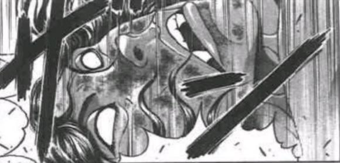

T6

Hp：13+1+2=16

萃香：伤势都恢复的差不多了，你的身体素质真不错~

那我下手再重那么一点点，应该也没问题吧？

符卡宣言 醉梦【施饿鬼缚之术】！

与朋友的回忆发动

破解判定 醉梦【1d100:10】失败

本回合无法进行普通攻击

雾袭判定【1d8：5】

Atk-【1d30：25】点

皮克：嗷嗷嗷嗷嗷——

（你以为那锁链会有效果吗——）

嗷嗷嗷嗷嗷啊？！

（什么？！）

原始人那本应胜券在握的躲闪此刻却出现了莫名的凝滞

起跳的动作才刚刚开始，鬼王的锁链就已经缠在了他的身上！

身在场中的皮克完全无法理解发生了什么

但观众们却看的一清二楚

莉格露：皮克变小了？！

早鬼：那个鬼将她那古怪的能力用在了对手身上

体型突然缩小了一号，原有的动作自然就会走形……

他陷入绝境了

赤色的光芒在铁索之上一闪而过，原始人顿时就失去了力气

头顶双角的鬼王牵住锁链，像个拔河的醉汉一样摇摇摆摆地向后一扯——

皮克就这样毫无还手之力地被拉到了她的身前

巨大化的萃香举起了动弹不得的敌人

萃香：想想办法保护好自己吧，皮克

符卡宣言 鬼符

【大江山悉皆杀】！

萃香的攻击【300+650+80+1d100：79=1109】

本回合皮克无法进行普通攻击，自动胜利

皮克瞬间就明白了

这根本就不是什么弹幕

甚至，这连技术都算不上

她所做的只是极为简单的动作

将手中的敌人高高举起——

然后用尽全身的力量砸向地上！

皮克的受伤【1d10：5】

1 小伤害X2+4

2 小伤害X4+4

3 小伤害X4+4

4 中伤害X4+4

5 中伤害X4+4

6 大伤害X4+4

7 大伤害X4+4

8 特大伤害X4+4

9 特大伤害X4+4

10 大成功/大失败【1d2：2】

Hp：16-2X4-4=4

震天动地的轰鸣在地底的都市中回响

以力量而自傲的原始人，此时却败在了更胜一筹的暴力之下

究竟扣打了多少次？

就连观众都没法给出确切的数目

他们只能看到场地正中间被砸出的那个巨大的天坑——

以及挣扎着从中爬出来的战士

皮克：嗷嗷嗷嗷嗷嗷啊

（疼死我了）

嗷嗷嗷嗷嗷啊

（你的力气比辉夜小姐还大）

萃香：啊呀，真的吗？

你也挺抗揍的，比观众席上那帮扒饭的可强多了！

正在大口下饭的鬼们羞愧地低下了头

T7

Hp：4+1+2=7

鬼神效果结束

萃香：真不错，我打的很开心

把这招接下来，就算你赢啦！

符卡宣言 鬼气【蒙蒙迷雾】！

“咕咚咕咚”

毫不在意对手可能发起的突袭，伊吹萃香畅快地灌了口酒

她那幼小的身躯逐渐变得透明而又稀薄，最终化为了一片笼罩全场的白雾

皮克尝试着伸出了手臂

他立刻感受到了仿佛烧灼一般的剧痛从与白雾接触的皮肤上传来

皮克：嗷嗷嗷嗷嗷嗷嗷啊

（抓不到本体就谈不上攻击）

嗷嗷嗷嗷嗷嗷嗷啊

（只要碰到雾气就会受到伤害）

嗷嗷嗷嗷嗷嗷嗷啊

（真是无赖的招式，还好我也有办法！）

原始人嘶吼着用出了他自友人之处所学来的“技术”

用魔力构建名为结界的坚固板块

让它变得很大，很宽

让手中的这块板子变得比擂台的面积还要广阔——

然后利用自己的力量一跃而起，将它狠狠砸向下方无边无际的雾气！

皮克：嗷嗷嗷嗷嗷嗷嗷哦哦啊啊！

（把所有的白雾全都砸烂，你的小伎俩就失败了！）

嗷嗷嗷嗷嗷嗷哦哦啊哦啊啊！

（符卡宣言 新难题【金阁寺的整块天花板】！）

早鬼：厉害！

这真是，令人赞叹的技术！

橙：这个能算技术吗？！

怎么看都是暴力吧，和鬼一样的暴力啊！

（注：T4漏算了皮克的被动，萃香血量修正为16）

雾袭判定【1d8:5】

Atk-【1d30：4】

皮克的攻击【285+80+775-4+1d100：89=1225】

萃香的攻击【300+850+1d100：23=1173】

受伤判定【1d100:37】（无伤害加成）

萃香的受伤【1d10：5】

1 小伤害X3X2/4-2（无法回避）

2 小伤害X5X2/4-2

3 小伤害X5X2/4-2

4 中伤害X5X2/4-2

5 中伤害X5X2/4-2

6 大伤害X5X2/4-2

7 大伤害X5X2/4-2

8 特大伤害X5X2/4-2

9 特大伤害X5X2/4-2

10 大成功/大失败【1d2：2】

Hp：16-2X5X2/4+2=13

原始人的结界消失不见

弥漫的白雾也已经收敛

两旁的观众们紧张地等待着这场战斗的结局

最后，场地中央的尘埃终于散去

于是他们总算看见了一脸醉态的鬼王

以及那仍在她身前站立着的对手

皮克：嗷嗷嗷嗷嗷啊？

（这样算不算接下来这招了？）

萃香：哈哈哈哈哈哈哈哈哈哈！

还说什么接不接招的，你这不是堂堂正正的——

用你的力量，打破它了吗！

伊吹萃香走上前去

她发现自己的身高不太够

于是猛地变大了几圈，而后高高举起了皮克的手

萃香：这场战斗，是你胜利了！

“真的假的？！居然能接下伊吹大人的那招！？”

“了不起，小子！！”

“好样的！之后过来喝酒吧！”

看台之上的鬼与妖怪们为这位勇敢的挑战者献上了掌声与欢呼

四轮胜负的第一场，拉下帷幕！

赫卡提亚：第一场比赛 胜负已分！

胜者，皮克！

战斗结束

胜者 皮克！

【1d20：19】分钟后

浑身虚脱的原始人像条咸鱼一样趴在了地上

猫妖戳了戳一动不动的皮克

橙：皮克，没事吧？

皮克：嗷嗷嗷嗷嗷嗷啊

（我浑身都疼）

嗷嗷嗷嗷嗷嗷嗷嗷啊

（刚刚在中途就已经被砸晕了，我是后来才又被砸醒的）

烈：这次的比赛感觉如何啊？

皮克：嗷嗷嗷嗷嗷啊！

（非常痛快！）

嗷嗷嗷哦啊啊哦啊

（但有点可惜，我感觉她还有招数没用呢）

萃香：已经用了不少了哦~

你的表现可比烈海王强多啦！

他当时才挨了一下扣杀就快口吐白沫了，哈哈哈！

哦哟，擂台那边好像已经快好了

众人把目光投向了那刚刚被砸得惨不忍睹的擂台

经验丰富的鬼族施工队在仅用了不到十分钟，就立马再建了一个看上去差不多的场地

赫卡提亚：wow，好快的建筑速度

这种速成擂台真的没问题吗？

路人鬼：您放心吧，按我们的经验来看

不管擂台建的多结实，每场战斗到最后基本上都逃不过被砸烂的结局

所以现在我们这边建筑标准也改了，反正怎么整最后都得烂，那还不如外观建漂亮点质量能用就行

赫卡提亚：不愧是注重实用主义的旧地狱

那么中场休息时间结束，该开始第二场胜负了！

主办方出战者为【1d3：1】

1 帕露西（抽到的话自动让橙出战）

2 阿空

3 勇仪

赫卡提亚：主办方出战者是这位！

金发绿瞳的桥姬，操纵嫉妒心的妖怪，就算在地底也被人敬而远之，但在某些群体中却有着超高人气的美丽少女——

水桥帕露西来了！

嗯……

虽然没什么意义但是骰一下帕露的人气

【1d100：87】

BGM: 阻绝人迹之桥

“哦哦哦是帕露西！”

“帕露帕露！咱们这唯二看上去还算正常的女孩子！”

“打不过就赶紧下场再嫉妒对手就好不要拼命啊！！”

嗜血的观众们一反常态地收起了自己那看热闹不嫌事大的心态，而像狂热的粉丝一样对着走上擂台的金发少女加油鼓劲了起来

“地上的光催我妒意

吹拂的风催我妒意

干掉你们的理由要多少我都找得出来

来吧，谁来当我的对手？”

金发碧眼，皮肤白暂的尖耳朵少女走到了擂台之上

她身穿有着紫白格纹滚边的棕色长衣，脖子上系着一条纯白色的围巾，下着装饰着象征“桥”的红色挂绳与蓝色布料的裙子

她的手臂上穿戴着白色的泡泡袖，双腿上是白色的泡泡袜与黑色的玛丽珍鞋，看上去像是个活泼开朗的少女，与所谓的嫉妒心似乎没有一点关系

萃香：啧啧，我是受不了这个**的妖怪

你们这边谁要上？

橙：好像就这一位是我打得过的

那就我去吧！

路人鬼：挑战者一方的第二位战士是妖怪式神的式神！

虽说出身名门但其实没学到多少东西！现在最强的技术反而是从烈师傅那学的武术！

个人建议象征性打两下就赶紧下场吧，至少别输的太难看！

橙海王，入场！

红衣绿帽的猫妖怪轻巧地跳上了擂台

帕露西：真是嫉妒啊

嫉妒你这强烈的自信心

橙：喵？

好开心，我还没试过被他人嫉妒的感觉呢！

帕露西：你在说谎

我感觉到了，你身旁的虫妖怪一直对你心存嫉妒呢

莉格露：那不是嫉妒！

只是想要比她更强而已，是正常的斗争心！

帕露西：不，怎么看都是嫉妒！

橙：在你眼里什么都是嫉妒吧？

那么让我们开始吧

中华武术，橙海王，请指教——

是这么说的吧，大概？

战斗！

BGM: 绿眼的嫉妒

水桥帕露西

Atk 200

Hp 16

技能

地壳下的嫉妒心：对异常状态具有耐性，每回合对对手进行一次的【特殊攻击】：妒火。进行一次【1d5】的妒火判定，对对手种下出目数的嫉妒之种

嫉妒【看不见的绿眼怪兽】（CT1）：（弹幕类）一场战斗中只能使用一次，召唤出隐形的绿眼怪兽攻击对手。3T内自身所受到伤害由绿眼怪兽承担，Atk+30，每次攻击成功的场合为对手种下1颗嫉妒之种。对本技能的破解需每回合进行一次。

开花爷爷【小白的灰烬】（CT4）：（弹幕类）令鲜花状的弹幕追踪对手，同时以绿色的中玉封锁其去路。对对手造成【1d4】点伤害，同时种下2颗嫉妒之种

剪舌麻雀【大葛笼与小葛笼】（CT5）：（弹幕类）分离出另一个自己，并分别发出碧绿色的小玉与大玉进行攻击。2T内自身Atk+40，给予伤害+2。本回合对手需进行一次【1d100】的察觉判定，40以上成功，失败的场合攻击自动失败。

必杀技

恨符【丑时参拜第七日】（CT6）：自怨恨的五寸钉中迸发出的嫉妒之火，美丽而不幸的耀眼光辉。本回合自身Atk+450，给予伤害X2，并对对手种下【1d10】颗嫉妒之种

怨恨念法【积怨返】（CT7）：以怨恨为燃料，华丽燃烧的嫉妒之火。Atk+500，给予伤害X3，引爆对手身上所有的嫉妒之种，数目为1-15时自身Atk增加其数目X10的数值，数目为16-25时对对手造成【4d4】的伤害，数目为26以上时本回合战斗自动胜利，数目为30以上时本场战斗自动胜利

橙

Atk：204（10）

Hp：14（5）

技能

橙海王：继承了海王之名的武术家，凭借高超的技术使AtkX1.7，Hp+4

猫猫弹幕格斗术：不会陷入异常状态，面对所有技能都可以进行【1d100】的破解判定，75以上成功。“把这个招式融入到弹幕战里……对手使用符卡的时候就学着烈海王一样做……看吧弹幕攻击也是可以破解的~”我完全听不懂她在讲啥，莉格露如是说

式神化：Atk X 12，Hp X 2，将原本弱小的妖怪借由式神化增强，被水泼中时解除

仙符【凤凰展翅】（CT4）：（近战系）投掷鸟蛋进行攻击——原本应该是这样的，但在发现拳头更好用之后就将此符卡改为了只有名字相同的近战招式。使用如同凤凰展翅一般的高速连击，对对手造成【2d3】点伤害

阴阳【晴明大纹】（CT4）：（近战系）以五角星路线快速闪避，在对手周围放出大量弹幕干扰视线并以接近战完成最后一击。本回合受到的伤害-2，Atk+50，给予伤害X2

童符【护法天童乱舞】（CT5）：（自身加持系）使身体能力爆发性提升，3T内自身闪避概率X3，Atk+65，给予伤害+2

八云蓝的加护：ATK X 24，HPX 4: 借由主人八云蓝的式神术再次增强，此处未发动

必杀技

仙符【尸解永远】（CT6）：Atk+425，给予伤害X3，充分发挥自身身手敏捷的优势，用魔力增强体能后，使用中华武术给予对手急速的一击。“名字和之前一样？想新名字很麻烦的~”

鬼神【飛翔毘沙門天】（CT7）：橙以固定的路线飞行，同时洒出大量鳞弹与追踪弹幕。Atk+600，给予伤害X3，在锻炼后的现在可以依靠自己发动，但所需要的时间延长了.

T1

妒火判定【1d5：2】

嫉妒之种：2个

帕露西：我，真是嫉妒啊

嫉妒你这惹人拎爱的身姿

我的妒意会将你逼入无处可逃的角落——

符卡宣言 嫉妒【看不见的绿眼怪兽】！

橙的破解【1d100：37】失败

橙的攻击【204+1d100：94=298】

帕露西的攻击【200+30+1d100：71=301】

橙：喵？

二尾的猫妖正疑惑地寻找着对手的攻击

而隐形的怪兽却已经潜伏在了她的身后

橙的受伤【1d10:5】

1 回避

2 小伤害

3 小伤害

4 中伤害

5 中伤害

6 大伤害

7 大伤害

8 特大伤害

9 特大伤害

10 大成功/大失败【1d2：1】

Hp：12-2=10

嫉妒之种：3个

橙：好疼好疼

你的式神是隐形的？好厉害啊~

帕露西：不，这个是我的奴隶，并不是什么式神……

T2

妒火判定【1d5：1】

嫉妒之种：4个

橙的破解【1d100：39】失败

橙：还是找不到你的奴隶呢

能不能让它现出身形啊？

帕露西：很遗憾，不行

真是嫉妒啊，嫉妒你的那份纯真！

橙的攻击【204+1d100：44=248】

帕露西的攻击【200+30+1d100：73=303】

橙的受伤【1d10:2】

1 回避

2 小伤害

3 小伤害

4 中伤害

5 中伤害

6 大伤害

7 大伤害

8 特大伤害

9 特大伤害

10 大成功/大失败【1d2：1】

Hp：10-1=9

嫉妒之种：4个

橙：呜哇，好险！

隐形怪兽的攻击被猫妖一个后空翻躲了过去，只在她的面颊上划过了一道浅浅的痕迹

勇仪：烈，你这徒弟心态不错啊

在这被帕露揍了两回合都还是笑嘻嘻的

烈：确实，我一直觉得她心态比莉格露海王好

虫妖怪一脸不满地跳了起来

莉格露：为什么啊？！

那个嬉皮笑脸的家伙心态哪里比我好了？！

原始人望着跳脚的虫妖挠了挠头

皮克：嗷嗷嗷嗷嗷嗷啊

（有一说一，确实）

T3

妒火判定【1d5：4】

嫉妒之种：8个

橙的破解【1d100：7】失败

橙：唉，怎么都找不着

我放弃了，直接这么打吧

橙的攻击【204+1d100：57=261】

帕露西的攻击【200+30+1d100：39=269】

彻底放弃看破的橙海王将身体缩在了擂台的角落

她双手交叉，站在原地，选择用肉体硬抗对手的攻击！

橙的受伤【1d10：6】

1 回避

2 小伤害

3 小伤害

4 中伤害

5 中伤害

6 大伤害

7 大伤害

8 特大伤害

9 特大伤害

10 大成功/大失败【1d2：1】

Hp：9-3=6

嫉妒之种：9个

绿眼怪物向着角落中的猫妖发出了最后一次突袭，便在显出原形之后消散在了空气之中

橙：呼……呼……

这可真不妙，下一周上课我得去学学消力了

帕露西：你的挫败感呢？

对着这样不幸的败局，你就没有一点负面的想法吗？

橙：喵？没有啊

烈海王、蓝大人、紫大人、偶尔在河边能见到的死神……

我每天都会见到一大堆自己打不过的人，对自己是弱者这件事情有着充分的认知哦

能打赢很幸运！打输了也很开心！就是这样的

金发绿瞳的少女用手捂住了脸

帕露西：啊啊，原来如此

我好嫉妒啊

嫉妒你所在的那个温柔而体贴的环境！

T4

妒火判定【1d5：1】

嫉妒之种：10个

帕露西：哼，到现在为止居然才只有十个种子

你这样的妖怪和旧都简直是致命性的不合

赶紧回去地上吧，猫妖！

符卡宣言 开花爷爷【小白的灰烬】！

三色的花朵状弹幕随着桥姬的命令而悄然开放

她们充斥着猫妖周围所有的空间，令整个擂台变为了危险而又美丽的花海！

橙的破解【1d100：15】失败

而橙并没有选择躲避

她双手抱头，全力冲刺，在弹幕的花海之中硬生生撞出了一条通路

以最大的伤害为代价，橙总算接近了那一直与她保持距离的对手！

橙：好，总算靠近你了

打了这么久，现在——

终于该我了吧？

符卡宣言 仙符【凤凰展翅】

符卡宣言 阴阳【晴明大纹】！

橙的受伤【1d4：4-2=2】

Hp：6-2=4

嫉妒之种：12个

帕露西的受伤【2d3：5】

Hp：16-5=11

帕露西：什——

桥姬甚至没有来得及发出她的惊叹

因为橙海王的攻击已经打在了她的身上！

以敏捷的身手而自傲的猫妖在此刻完美展现了她的学习成果

无需呼吸的连击在数秒之间就完全封死了对手挣扎的可能

嫉妒的妖怪在这宛如狂风骤雨的连打下被逼的连连后退！

橙的攻击【204+50+1d100：81=335】

帕露西的攻击【200+1d100：60=260】

帕露西的受伤【1d10：6】

1 回避

2 小伤害

3 小伤害

4 中伤害

5 中伤害

6 大伤害

7 大伤害

8 特大伤害

9 特大伤害

10 大成功/大失败【1d2：2】

Hp：11-2X3=5

而就在这几乎永不停息的连打停滞之时

蓄力已久的回旋踢终于击出，将橙海王的对手直接踢到了擂台的上空！

橙：喵哈哈哈！

这是我还给你哒！

勇仪：帕露被打飞了！

这丫头可以啊！你们平常都怎么学的？

观众席上的众人一同看向了莉格露

莉格露：单纯是她的性格比较恶劣而已，和我们武术班的作风没有关系

我一般而言在弹幕战中是不会下这种重手的哦？

但她每天跟我打架的时候都这样......

T5

妒火判定【1d5：1】

嫉妒之种：13个

“帕露！打不过快下场不要逞强！”

“你是咱们旧地狱为数不多还算正常的了千万别变得向那几位一样啊！！”

嫉妒心的妖怪捂着肚子，在观众们的声援（？）下从地上爬了起来

帕露西：可恶，我小看你了

那副楚楚可怜的外表之下隐藏的，完全就是地底的恶鬼

你……比谁都适合这个地方

真是嫉妒啊……

嫉妒你那更胜一筹的残忍！

符卡宣言 剪舌麻雀【大葛笼与小葛笼】！

另一个看上去一模一样的桥姬忽然出现在了擂台的另一端

她们脸上挂着相同的微笑，双手举起直至头顶

大小各异的绿色弹幕就从她们的身边凭空出现，并射向了站在对面的猫妖！

橙的破解【1d100：39】失败

橙的察觉【1d100:59】成功

橙：发射大玉的那个是假的，这可连妖精都知道哇~

接下来，让你看看中华武术的厉害吧

符卡宣言 童符【护法天童乱舞】！

一脸清爽的猫妖凭借着自己那敏捷过人的速度，就这样不闪不避地冲向了真实的对手！

帕露西：哈，无知是福说的就是你这样的妖怪

你甚至到现在都还没发现身体之内所潜藏的种子……

啊，真是嫉妒啊

一想到你之后那痛苦挣扎的样子，我就嫉妒的发慌！

说起来

你知道，猫有多强吗？

实战式神术大师，八云蓝曾经说过

普通妖怪和猫妖在笼中战斗的话

普通妖怪拿着封魔针，可说是初次的对等吧

猫拥有它们所没有的武器

爪？牙？

不，答案是——

反射神经

橙的攻击【204+65+1d100：70】

帕露西的攻击【200+40+1d100：91】

帕露西的受伤【1d10：7】

1 回避

2 小伤害+2

3 小伤害+2

4 中伤害+2

5 中伤害+2

6 大伤害+2

7 大伤害+2

8 特大伤害+2

9 特大伤害+2

10 大成功/大失败【1d2：1】

Hp：5-3-2=0

因此，当橙笑眯眯地闪过了帕露西的弹幕的时候

当橙在一秒之后就闪到桥姬身前的时候

当橙笑着伸出拳头的时候

当橙一击重拳直接将其打飞出擂台的时候——

另外两位武术家，没有丝毫的意外

地上的桥姬挣扎着抬起了头

帕露西：怎么可能……

怎么可能这么快……

橙：？

有吗？

我天天上实战课的时候要面对的可比这快多了啊？

橙：啊，顺便一提

并不是没有发现你种下的种子

只是在它们爆发之前先把你干掉就能解决所有的问题

就是，这么简单哦~

战斗结束

胜者 橙！

“帕露！已经不用再战斗了！”

“卧槽这猫好强！不愧是烈师傅带出来的！”

赫卡提亚：第二场战斗 胜负已分

胜者 橙！

（本日的更新结束，下一次的更新在周一或周二，内容是接下来的两场战斗）

（以下是我的废话）

那么原创活动的上半截到此结束！

原本是感觉没啥想法了就塞了个动物灵梗选项，没想到还真中了

如果没抽到早鬼出场的话按理来说是有可能进对面的阵容或者旁观看戏的，没想到这次居然梗连中

说的好像哪次不是梗连中一样草草草草

皮克被拐过去了不过没啥大事，他也就周末过去打个工而已，某种程度上是很适合他的工作

萃香的卡实在是有些过分了所以我7T留了一条生路（说实话四天王奥义没破解基本上就完蛋，换烈上也差不多，某种意义上皮克这次骰运还行的

帕露的卡，本来是想拿来玩玩新机制结果被橙海王秒了（悲）

橙海王，你好强大

那么本次更新就到这里，下一次的更新是接下来的两次战斗，骰子结束后一块发

大概在周二或周三吧......大概？

大概周二晚上七点半左右更新

~数据调整~

基本上骰完剩下的剧情之后回头看了一眼上一次的人物卡

嗯，作为boss卡的萃香果然好过分，帕露西的新机制有点问题，橙的卡面跟莉格露大概上应该差不多，然后皮克......

皮克......

皮克............

皮克的卡出问题了啊啊啊啊啊啊啊啊啊

妈呀90的必杀技破解还好说这个45的技能破解已经爆炸啦！比起灵梦勇伯的常态50都要强啊！！！

CT8必杀技怎么都到900了卧槽啊！！！！

被热烈的激斗氛围所感染的我脑子一热就写出这种东西了

结果仔细一想皮克以后说不定还会打架到时候拿着这个卡面出门简直离谱哦哦哦哦哦哦哦哦哦哦哦哦哦哦哦

因此把数值调整如下

与朋友的回忆（CT3）：（自身加持类）通过与朋友们的战斗而积累了无数的战斗记忆，在战胜了名为“初恋”的挑战后，精神面得到了充足的成长。3T内可以进行【1d100】的破解判定，本回合技能30以上成功，必杀技75以上成功，其后2T技能70以上成功，必杀技90以上成功

（将其后2T对技能的破解由45调整为70）

凯风快晴飞翔蹴（CT8）：将狂暴的魔力集中于腿部，踢出敌我不分的终焉一击，原本应当使用燃烧的火焰作为助力，但皮克用结界术的魔力进行了改良。自身Hp变为1，Atk+860，给予伤害X6，伤害结算环节后进行一次【1d100】的爆破判定，75以上对手战斗不能，25以下自身战斗不能。

（将Atk加成由900调整为860）

（以上两图指我的行为）

好的

这一次找不到任何理由完全就是我的数据做砸了！！

非常抱歉皮克先生！！

已经被勇伯和本部老师骂过了我有在深刻反省了所以求求你不要吃掉我！！！

认真的讲这次确实是我的问题，这次新卡比较多没来得及调整好数据因此才出现了超级皮克这样过分的卡

这一次请大家当做皮克由于气氛很热烈因此超水平发挥了吧

我有在深刻反省了，实在是抱歉（悲）

那么数据调整到此结束，更新时间大概是今晚七点半左右

烈：？

谢谢夸奖啊！

橙：是吧，烈海王的兼职是名侦探来的~

师徒二人露出了十分神似的笑容

帕露西：勇仪大人

那个小虫子很简单就能挑起妒火

但为什么我一点都挑不起来其他两人的嫉妒心啊？

明明他们都是练武术的吧？！

勇仪：无所谓的家伙对于嫉妒当然也是无所谓的咯~

莉格露的认同【1d100：55】

莉格露：皮克，我怎么总觉得有点怪呢

难不成，真是我心态出问题了吗？

皮克：嗷嗷嗷嗷嗷嗷嗷嗷嗷啊

（没这事，大家都这样）

嗷嗷嗷嗷嗷嗷嗷嗷嗷嗷嗷嗷啊

（像烈和小猫一样啥都无所谓那才叫心态有问题）

【1d15：1】分钟后，短暂的休息时间结束了

赫卡提亚：大家都聊够了吗？

擂台这次也不需要重建，开始第三场胜负吧！

主办者方出战者为【1d2：2】

1 勇仪

2 阿空

BGM：业火地幔

赫卡提亚：难以驾驭的神之火，地底之下的太阳，火力至上的大暴走家！

主办者方的出战者是这位

灵乌路空上场了！

“阿空你悠着点打啊我害怕！！”

“别扔核弹好吗求你了！！”

“让她上场到底是谁出的馊主意啊？！！”

恋恋：是我哦~

阿空：大家好！

入侵者在哪里啊？

赫卡提亚：不不，这里是擂台赛哦

是和对手进行一对一胜负的战斗游戏

阿空：原来如此，是弹幕游戏啊

好，就让你们看看我这究极的力量

【Abyss Nova】！

旧地狱的街道上不知为何突然亮起了颜色非常不妙的光

觉：还没开始战斗呢，你给我适可而止

如果阿空暴走的话我会第一时间使用催眠的，还请大家放心

挑战者【1d2】

1 烈

2 早鬼

烈：这场就由我——

黑帮老大抬手拦下了跃跃欲试的武术家

早鬼：我对这个用核能的妖怪挺感兴趣的

你应该也更想和旁边那位干一架吧？

那这场就先让给我吧，哈哈！

她双指一抬，做了个告别的手势，然后不由分说地跳到了擂台之上

勇仪：你这新朋友还挺善解人意啊，烈

烈：我猜她是想过去劝诱阿空小姐入伙……

路人鬼：好！挑战者一方的战士是劲牙组组长 骊驹早鬼！

这一位是真真正正的新面孔！

别说地底，之前似乎连幻想乡都没去过！

本人自称以力量、速度与勇气自傲，是最速最强的动物灵！

擂台赛的人气【1d70：42+30=72】（鬼族的宣传+30，75以上有神灵庙众旁观）

不知不觉间，观众席上已经混入了不少来自地上的妖怪

但神灵庙的道士们似乎对地底的战斗没有多少兴趣

“想靠肉体硬抗核弹吗，不知天高地厚的家伙！”

“看上去是个硬茬子啊”

“那个劲牙组是黑帮吗？”

身负黑翼的女子在观众们议论纷纷的噪声中站上了擂台

她抬手指向了对面的地狱鸦

早鬼：灵乌路空，是吧？

你看上去挺强的啊！

考不考虑加入我们劲牙组啊？

早鬼的劝诱【1d100:29】（大成功的话说不定能行）

阿空：哦哦，你是为了确认我的强大力量而来的吗？

但是我一直是在觉大人手下干活的！

每天的工作量都很大没法搞兼职啦

早鬼：真可惜

想跳槽的话随时欢迎来找我啊

顺便问一句，你用的能量是从哪来的？

阿空：我吸收了某个神明的力量

黑色的太阳，八咫乌尊

核能是可以半永久地产生超高温的究极之力

也就是，八咫乌的神德

换句话说——我的体内，寄宿着神明！

早鬼：不好意思啊，神明管不到我住的那块地方

所以就算你这么说，我也只能看见一只厉害的鸟

阿空：呵呵呵

那就用这核能把你熔化殆尽吧！

用我所吞噬的，这神之火！

早鬼：这才有意思！

来吧，让我这匹漆黑的天马

领教一下妄称究极的神明之力！

战斗！

BGM：圣德太子的天马　～ Dark Pegasus

骊驹早鬼

Atk 280

Hp 24

技能

最速最强的动物灵：自身的普通攻击必中，回避概率X2，给予伤害+2，无法对没有灵魂的对手造成伤害

劲疾技【Thrilling Shot】（CT1）：（弹幕系）一场战斗中只能使用一次，拔出手枪乱射一气，来看看你的运气如何！进行7次【1d100】的中弹判定，60以上成功，对对手造成2+成功次数的伤害

劲疾技【Lightning Neigh】（CT2）：（弹幕系）一场战斗中只能使用一次，射出纯白色的闪电之网，阻挡对手的行动。2T内对手每次攻击时，本场战斗中Atk下降【1d5】

劲疾技【Triangle Chase】（CT3）：（近战系）发挥自身引以为豪的速度，对对手进行疾风迅雷般的突击。Atk+65，给予伤害+3，本回合可进行一次【1d100】的闪避判定，50以上成功。“我不想和她打接近战……没人想和她打接近战”另一个组织的头目如此说到

劲疾技【Black Pegasus流星弹】（CT4）：（弹幕系）以红黄二色的星弹连射攻击对手，造成必中的【2d4】点伤害

劲疾技 【Muscle Explosion】（CT5）：（自身加持系）令二色的魔弹集聚在自身的周边，而后向着对手暴射而出——不过由于这次想打近战因此变为了字如其名的身体强化技，3T内Atk+65，给予伤害+2，受到的所有伤害-2

必杀技

【Follow Me,Unafraid】（CT6）：在高速奔袭中向对手投下海量的蓝弹与赤色的巨大魔弹，不知为何后者和阿空的耀斑很像。Atk+700，给予伤害X4

【鬼形的Hoi Polloi】（CT7）：无法回避/破解/防御，召唤魂状的使魔包围对手，在保护自身的同时对其进行惨无人道的群殴。本回合自身受伤/2，Atk+800，给予伤害X5

【鬼**之所为】（CT8）：无法回避/破解/防御，以堪称鬼畜的速度制造无限的弹幕轰击对手，Atk+900，给予伤害X6

灵乌路空

Atk 280（240）

Hp 26（16）

技能

地狱鸦with八汰乌：体内的神明提供了极其强大的力量，但作为速成强者的她在某些方面依旧有所不足。Atk+40，Hp+10，对异常状态具有耐性，可使用各类核能相关的技能。每回合进行一次【1d100】的注意力判定，出目为1-5时自身本回合战斗自动失败/出目为6-20时自身注意力大幅度下降，对自己造成2点伤害/出目为21-40时自身注意力勉强还行，本回合给予伤害-【1d3】/出目为41-60时正常战斗，本场战斗中自身Atk+【1d5】/出目为61-80时认真战斗，给予对手【1d4】点伤害/出目为81-90时斗志大爆发，本回合Atk+【1d30】，给予伤害X2/出目为91-100时，在81-90的效果上追加本回合受到的所有伤害/2

核热【核反应失控】（CT1）：（弹幕系）一场战斗中只能使用一次，放出异常炽热的火球进行攻击。3T内对手回避概率X3，自身Atk+45，造成伤害的场合对对手进行一次【1d100】的追击判定，高于40时可令对手进行第二次受伤判定，高于75时对对手造成【1d4】点伤害。

光热【High Tension Blade】（CT3）：（近战系）从制御棒中放出剑刃状的热能，听上去像是光剑但其实更像光炮。进行一次【1d100】（保底40）的瞄准判定，本回合Atk+出目数，给予伤害+出目数/20

爆符【Peta-Flare】（CT4）：（弹幕系）收集并发射核聚变能力，几乎不可正面与之抗衡的高火力射击，速度快，热量高，但密度略显稀薄，对对手造成【1d8】点伤害。“我真是太喜欢这样的符卡了”雾雨魔理沙评价如上

焰星【十凶星】（CT5）：（弹幕系）将核能打进地面，令岩浆从地面接连喷出。3T内Atk+70，召唤10个炽热的凶星，3T内分别令其中3/3/4个凶星爆炸，每个凶星造成2点伤害。对手受到其中【1d3】/【1d3】/【1d4】个凶星的伤害，自己则受到剩下的凶星的伤害。

必杀技

【Hell’s Tokamak】（CT6）：阿空生成的最大级别的火球，让两个巨大的火球夹击在一起并融化中间的对手。Atk+725，给予伤害X4

【Subterranean Sun】（CT7）：我就是地底的太阳！无法回避/破解/防御，Atk+825，给予伤害X5，对对手进行一次【特殊攻击】坠落：进行一次【1d100】的堕落判定，出目为40以上时对手Atk-30，出目为75以上时本回合战斗自动成功。（对手拥有特殊攻击耐性的场合，成功值变为65/90）

【Abyss Nova】（CT8）：化作将周围一切都燃烧殆尽的灼热太阳。无法回避/破解/防御，Atk+925，给予伤害X6，本回合结束时对敌我双方同时造成【1d10】点伤害。

T1

阿空的注意力【1d100：47】

阿空的Atk：【280+1d5：4=284】

阿空：符卡宣言 核热【核反应失控】

今天感觉不错，就这样一口气干掉你！

早鬼：真敢说啊，才第一回合就开始大言不惭了

刚刚的战斗中我已经看明白了，你们这用的说是弹幕战，但实际上——

不还是大家怎么开心怎么打吗！

接我这招 劲疾技【ThrillingShot】！

黑天马双翼一展，便将战场带到了天空之上

她笑着拔出了腰间的左轮枪，而后向地狱鸦射出了真枪实弹的弹幕！

中弹判定【7X1d100：3 6 7050 32 95 37】成功两次

阿空的受伤【2+2=4】

Hp：26-4=22

地狱鸦将双翼笼罩在身前抵御了大部分的冲击

阿空：哈，老式的左轮子弹

现在谁还用这玩意？

该跟上时代了，黑鸟

我的核能才是新时代的梦想！

阿空的攻击【284+45+1d100：91=420】

早鬼的攻击【280+1d100：76=356】

早鬼的受伤【1d10：9】（自身回避概率X2，由于阿空的技能回避概率再X3）

1 回避

2 回避

3 回避

4 回避

5 回避

6 回避

7 大伤害

8 特大伤害

9 特大伤害

10 大成功/大失败【1d2：1】

Hp：24-4=20

追击判定【1d100：37】失败

早鬼：这破绽大到可笑的攻击——

黑天马的话才刚说到一半，却发现自己的肩上有种莫名的沉重感

她用眼角的余光扫见了自己肩膀之上那奇形怪状的“爪”

阿空：你速度好快啊

但是，我的速度也不慢哦~

炽热的火球在最近的距离吞没了地狱鸦的对手

黑翼的天马被一击核爆轰回了地上，在擂台之上砸出了一个人形的大坑！

但是，经验丰富的实干分子不会再中第二次相同的伎俩

她高高抬起了自己的右腿——

早鬼：你也去地下玩玩吧，灵乌路空！

而后一脚将地狱鸦砸向了下方的大地！

阿空的受伤【1d10:10】（早鬼的攻击必中）

1 小伤害

2 小伤害

3 小伤害

4 中伤害

5 中伤害

6 大伤害

7 大伤害

8 特大伤害

9 特大伤害

10 大成功/大失败【1d2：1】

阿空大成功！

BGM：灵知的太阳信仰　～Nuclear Fusion

但是！

但是！

灵乌路空同样是有着丰富战斗经验的妖怪！

自幼在旧地狱中摸爬滚打，天天与会读心的觉朝夕相处，使她练就出了一身不经大脑就直接行动的超反射神经！

她当机立断用坚固无比的第三足挡下了早鬼的下劈，而后直接拿出了自己最为原始的武器——

用那燃烧着火焰的拳头打向了她的对手！

阿空：我不去，你去！

早鬼的受伤【1d10：7】（大成功反击无技能三倍回避加成）

1 回避

2 回避

3 小伤害

4 中伤害

5 中伤害

6 大伤害

7 大伤害

8 特大伤害

9 特大伤害

10 大成功/大失败【1d2：2】

Hp：20-3=17

追击判定【1d100：2】无追击

漆黑的双翼猛地一震，连环的爆破在她身后响起

借助核爆与翅膀的双重加速，灵乌路空带着堪称恐怖的加速度一拳锤下，将对手再次打入了擂台之中！

阿空：他 妈 的一百万匹核能转动，地狱爆破拳！

觉：哎这个是脏话不可以讲的……

T3

黑帮老大挣扎着从第二个坑里爬了出来

早鬼：卧 槽

你 他 妈平时是干的什么工作

你不来我们这行可惜了……

地狱鸦得意洋洋地抱起了双手

阿空：我的职业是假面骑士

假面骑士 nuclear！

阿空的集中度【1d100：22】

本回合给予伤害-【1d3：1】

早鬼：我可去你%&amp;￥……#的吧！

劲疾技【Triangle Chase】！

阿空：正义是一定会打倒邪恶的！

哦哦哦哦哦哦！

符卡宣言 光热【HighTension Blade】！

阿空的瞄准【1d100：17=40】（保底40）

本回合Atk+40，给予伤害+2

早鬼的闪避【1d100：20】失败

劲疾技【Lightning Neigh】发动

阿空的Atk【282-1d5：5=277】

阿空的攻击【277+45+40+1d100：8=370】

早鬼的攻击【280+65+1d100：93=438】

出奇上头的黑天马此刻连枪都不拔了

他完全爆发出了那称霸 畜 生界的急速，以三角的轨迹迷惑着对手，而后像是上回合对手所做的一样——

狠狠一拳砸了过去！

阿空的受伤【1d10：7】

1 小伤害+2+3

2 小伤害+2+3

3 小伤害+2+3

4 中伤害+2+3

5 中伤害+2+3

6 大伤害+2+3

7 大伤害+2+3

8 特大伤害+2+3

9 特大伤害+2+3

10 大成功/大失败【1d2：1】

Hp：22-3-2-3=14

报复心极强的黑天马在地上打出了第三个，也是最深的一个长翅膀的人形大坑

阿空：什么？！

你居然敢打假面骑士？！

早鬼：老子TM打的就是假面骑士！！

T4

核热效果结束

电网效果结束

阿空的注意力【1d100：94】燃起来啦！

本回合Atk上升【1d30:12】，给予伤害X2，受到所有伤害减半

灵乌路空眼中燃起了熊熊的火焰

阿空：好，我今日必要打倒你这令人作呕的邪恶黑鸟！

符卡宣言 爆符【Peta-Flare】！

早鬼：老子是马不是鸟！

劲疾技【Black Pegasus流星弹】！

地狱鸦双手高举着一轮巨大的火球，黑天马带领着无数破灭的流星

连自己在说啥都搞不懂的两位强者就这样撞到了一起！

早鬼的受伤【1d8：6】

Hp：17-6=11

阿空的受伤【2d4：6/2=3】

Hp：14-3=11

阿空的攻击【277+12+1d100：10=299】

早鬼的攻击【280+1d100：84=364】

阿空的受伤【1d10：8】

1 小伤害/2

2 小伤害/2

3 小伤害/2

4 中伤害/2

5 中伤害/2

6 大伤害/2

7 大伤害/2

8 特大伤害/2

9 特大伤害/2

10 大成功/大失败【1d2：1】

Hp：11-2=9

在冲突中失败的阿空满不在乎地抹了把脸

阿空：不疼不痒

正义，是无法被打倒的！！

早鬼：那老子就接着打

打到你服为止！

观众席上的野狼灵默默记起了笔记

恋恋：你在写什么？

野狼灵：我在记录这位阿空小姐的战吼

说的真是太好了，连吉吊大人都没法把老大气成这样

下次跟鬼杰组火并的时候，我拿个喇叭在后面喊几嗓子看看效果如何

勇仪：哈哈哈哈哈哈哈哈哈！

我笑的肚子疼，我快不行了

T5

黑天马愤怒地握紧了拳头

早鬼：呼——

厉害，我已经很久没这么上头了

是我小瞧你的口才了，地狱鸦

现在……我就用纯粹的暴力让你闭嘴！

劲疾技【Muscle Explosion】！

阿空的注意力【1d100：75】很燃！

阿空：要比力量的话我绝不会输！

好，燃起来了！！

哈啊啊啊啊啊啊！

无可抵御的神之火在激昂的阿空身旁熊熊燃烧

包括擂台与观众席在内的所有区域全都变成了如同字面意思一般的焦灼地狱，观众们纷纷惨叫着跳起了脚

“我就知道她管不住自己！！”

“我靠，我生鱼片成渣了！”

“还惦记你那生鱼片呢老子屁股都着火了！”

早鬼的受伤【1d4：1-2=0】

黑天马在这灼热的地狱中呼了口气

早鬼：很好，真棒

这糟糕而恶劣的环境正是我们地狱的象征！

来吧，地狱鸦

让我看看，冠以地狱之名的你的强大！

阿空：好，接招！

上无天穹，亦无星体

暗淡而寂静的夜中仅有微弱的烛光

我便以究极的神力创造闪耀之明星

为这阴暗而不幸的地狱带来光明！

焰星【十凶星】！

灵乌路空一拳打向了地面

就有十颗闪耀的凶星从熔岩之中缓缓升起

它们如同呼吸一般重复着收缩与膨胀的过程，在这机械的作业中积蓄着自己的力量

没有人会质疑它们最终爆发时的威力——

但这些毁灭性的火球却像是空中的天体一般做着毫无规律的运动，即使是场外的观众也无法判断它们下一秒会居于何处！

阿空：我也不知道哪颗会爆炸

谁离得近谁遭殃，敢赌吗！

早鬼：哈

我们这种亡命之徒最不怕的——

就是赌博！

阿空的攻击【277+70+1d100：42=389】

早鬼的攻击【280+65+1d100：40=385】

同时射出了魔弹与火球，同时挥出了自己的拳头

两位战士在沸腾的熔岩中正面相搏

而这一次，是拥有核动力的阿空更胜一筹！

阿空：你输了，黑鸟魔人

正义必胜！

早鬼的受伤【1d10：8】

1 回避

2 回避

3 小伤害-2

4 中伤害-2

5 中伤害-2

6 大伤害-2

7 大伤害-2

8 特大伤害-2

9 特大伤害-2

10 大成功/大失败【1d2：2】

Hp：11-4+2=9

依靠自身那被强化过的身体，黑天马挡下了这势大力沉的一击

她抬眼看向了身旁的凶星——

其中三个已经膨胀到了即将爆炸的地步！

凶星判定【1d3:1】

早鬼的受伤 1X2-2=0

阿空的受伤 2X2=4

Hp：9-4=5

在爆炸前的一瞬间，展翅翱翔的天马躲过了自己身旁的炎弹

但对面的地狱鸦却被卷入了剩下的两个凶星之中

黑帮老大望着被自己炸得东倒西歪的对手，脸上露出了嘲讽的笑容

早鬼：真可惜，地底的正义使者

你的运气实在不好！

T6

阿空的注意力【1d100：32】

本回合给予伤害-【1d3：2】

被凶星的爆炸所卷入的阿空此刻正晃晃悠悠地摇着自己的脑袋

但她的对手可不会给她放松的机会

早鬼：已经没有力气了吗？

那就在地上等死吧

而我，将前往遥远的天空之上！

【Follow Me,Unafraid】！

劲疾技【Triangle Chase】发动

骊驹早鬼暂时脱离了地上那炎热的环境，前往了天空这一最为宽广的战场

蓝色的弹幕自她的左轮手枪中急速射出

而几近比肩凶星的赤色魔弹则被她自己亲手砸向了地上的敌人！

“卧槽这个娘们怎么也开始扔核弹了啊？！”

“完蛋了那阿空怕不是要——”

终于清醒过来的地狱鸦看向了那从天而降的赤色魔弹

她那小小的脑袋分辨不出早鬼所用的魔法与她的力量之间的区别

于是，名为“好胜心”的火焰在她的胸中熊熊燃起！

阿空：哼，你这小小的弹药也好意思在我眼前炫耀吗？

那就让你见识一下吧——

破灭一切，毁灭所有的核能之真意！

符卡宣言 【Hell’sTokamak】！

地底之下突然发出了极为不妙的哀鸣

在观众们心惊胆战的目光中，战斗区域内的整片地壳突然出现了一个看上去极为不妙的弧度

那本应平整的大地如今像个气球一样高高隆起——

而后终于在那自内而外的压力之下轰然爆碎

那流淌着炎与火的光芒自地下冉冉升起

至今为止规模最大魄力最为可怖的核融合爆弹破壳而出！

阿燐：惨了

还有一个呢

是的，还有一个

吞噬神明的地狱鸦抬手指向天空

于是另一个一模一样的核能火球就出现在了在场所有人的头顶之上

无数触之即死的炎弹自两颗太阳之中蜂拥而出，向着位于其中的黑天马扑去！

——warning——

——warning——

——warning——

机械的警报音开始在旧地狱的上空回响

赫卡提亚：各位观众无需担心，在核爆开始之前我会及时出手拦下余波的~

还请在观众席上安心坐好以获得最佳观看体验哦！

烈：没想到有朝一日，我竟能亲眼看到这般激动人心的场景！

皮克：嗷嗷嗷嗷嗷嗷啊

（骊驹老大你还打吗）

嗷嗷嗷嗷嗷嗷啊

（我觉得真没必要和笨蛋拼命的）

光热【High Tension Blade】发动

瞄准判定【1d100:59】

本回合Atk+50，给予伤害+2

回避判定【1d100：34】失败

与胆战心惊的观众们不同，头戴着牛仔帽的女子反而露出了愉悦的笑容

早鬼：好，这才够劲！

来吧，灵乌路空！

火红色的弹幕如狂风骤雨般袭来，却伤不到她的一根羽毛

地底之下的岩浆喷涌而出，却被黑发的女子微微展翅便轻易躲过

她以那令人难以置信的灵活伸手穿梭于两颗太阳之间，将必杀的魔弹射向了正中央的阿空！

阿空的攻击【277+50+725+70+1d100：76=1198】

早鬼的攻击【280+65+65+700+1d100：69=1179】

早鬼的受伤【1d10：3】

1 回避

2 回避

3 小伤害X4+2-2

4 中伤害X4+2-2

5 中伤害X4+2-2

6 大伤害X4+2-2

7 大伤害X4+2-2

8 特大伤害X4+2-2

9 特大伤害X4+2-2

10 大成功/大失败【1d2：1】

Hp：9-1X4+2-2=5

数目的压制与能源质量上的差异，让漆黑的天马也不得不在这狂暴的攻势中暂避锋芒

她紧紧贴着太阳的边缘，仅用最小程度的烧伤避过了这一轮致命的攻击——

而后，那毫无规律可循的凶星爆炸了！

凶星判定【1d3：1】

早鬼的受伤2-2=0

阿空的受伤2X2=4

Hp：5-4=1

好运再次眷顾了喜欢冒险的早鬼

最低限度的暴风被她所轻易抗下，但毫无察觉的阿空却被卷入了剩余的爆破之中！

早鬼：哈哈哈！又是被自己的攻击所伤到了！

我现在倒是可以确信

你这家伙的脑筋的确算不上好！

阿空：你说什么？！

明明你看上去才是个笨蛋吧！

T7

阿空的注意力【1d100：70】很燃！

早鬼的受伤【1d4：4-2=2】

Hp：5-2=3

本就酷热难耐的高温在阿空的操作下进一步升级

处于这人造地狱中央的早鬼无奈地躲避着突如其来的火舌

早鬼：厉害，笨蛋

你到底还有多少能量啊？

阿空：一开始的时候我就说过了吧，我所拥有的是最强的力量

早鬼：可惜，你的用法实在太过糟糕

我可真是第一次见到如此挥霍能源的对手

你就算在战斗中也不动动脑子吗？

阿空：不，我有好好在思考

究极的能源，未来的幻想，无限的可能性如今掌握在了我的手中

然后，我开始了开动脑筋

我能够做什么？

阿空：究极的交通工具？究极的武器？还是究极的魔法？

地底的大家不需要这些东西

于是，我将目光投向了头顶之上，投向了这被魂光所饰的虚假天穹

在这无日无月亦无星的地底，在这被人所抛弃的古老地狱，没有人能够感受到温暖的阳光

既然如此——

就由我来，成为太阳！

符卡宣言 【SubterraneanSun】！

灵乌路空威风堂堂地站在这灼热地狱的中央

依靠她那长久以来所练就的控制力，两颗巨大的火球开始了行动

它们燃烧着自身以外的所有事物，在那无可抵挡的伟力下靠近了寄宿神明的地狱鸦

最终，在令人难以直视的光芒之中——

以阿空为中心，最凶最恶的核爆弹们融合到了一起

一轮真真正正的太阳，就这样出现在了万丈之下的地底！

黑帮老大并未接话，而是掏出左轮向着空中连开三枪

深紫色的魂状使魔自火海中凭空出现

它们训练有素地在早鬼身后排成了整齐划一的军阵

而作为召唤者的黑天马，正是这队伍的第一先锋！

早鬼：不得不承认，现在是你的火力更强

但现在可就不好说了

质量拼不过的话就用数量取胜，上了！

——【鬼形的Hoi Polloi】！

带领着这深紫色的军势，骊驹早鬼向着太阳发起了冲锋！

