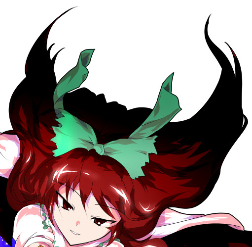
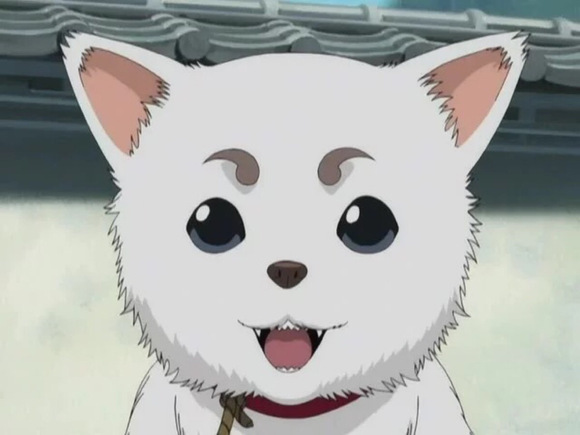
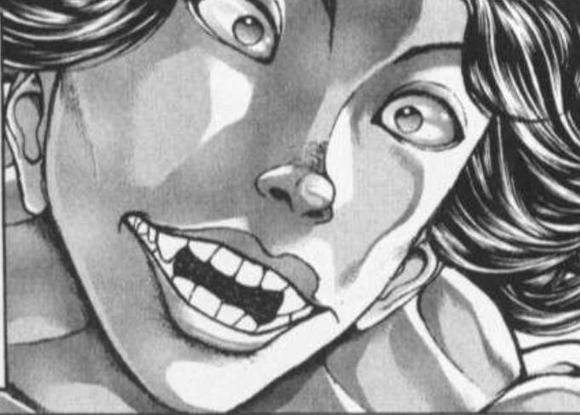
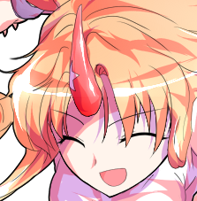
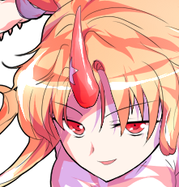
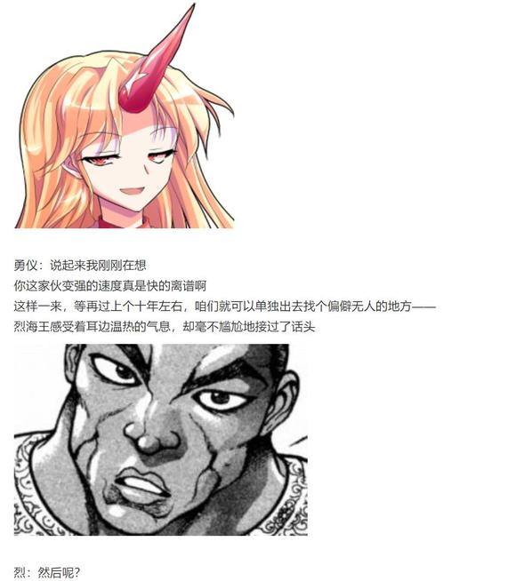

坠落判定【1d100：100】高于90成功！

阿空的攻击【277+70+825+1d100：15=1187】

由于坠落效果，本回合战斗自动成功

将目标设置为对手的本体，依靠速度绕过那可怖的核弹，这样一来胜负究竟如何仍未可知

然而，黑帮老大误算了一点

那巨大的火球并非是只有威力的炸弹，而是拥有着重力的人造天体！

她毫无防备地滑向了太阳的方向

然后被淹没在了，这至今为止最为可怖的爆炸之中！

阿空：向着太阳坠落吧，骊驹早鬼！

机械的警报音在爆炸产生的瞬间就被那难以形容的轰响所掩盖的一干二净

地狱的女神不慌不忙地出手保住了观众席与周边的街道

于是，这一天

在场的所有人都在地底看到了太阳

早鬼的受伤【1d10:2】

1 小伤害X3/2-2（无法回避）

2 小伤害X3/2-2（无法回避）

3 小伤害X5/2-2

4 中伤害X5/2-2

5 中伤害X5/2-2

6 大伤害X5/2-2

7 大伤害X5/2-2

8 特大伤害X5/2-2

9 特大伤害X5/2-2

10 大成功/大失败【1d2：2】

Hp：3-（1X3/2-2）=3

灰色的蘑菇云在面无表情的众人眼前缓缓散去

而毫发无伤的黑天马却出现在了地狱鸦的眼前

她用围巾擦了把脸上的灰烬，而后毫不在意地将其扔到了一旁，并笑着向阿空举起了左轮手枪

早鬼：很有创意的招式，以你的智商来说

你在大规模战斗中是毫无疑问的杀手锏

但是很可惜，在一对一的单挑中——

范围性杀伤武器，也不过是想想办法就能闪避的攻击

凶星要爆炸了

是你输了，灵乌路空

凶星【1d4：4】

阿空：那又怎样呢？

看看你的周围吧，黑鸟

我的凶星可还剩下——【4】个呢！

没错

还有四个凶星在刚刚的爆炸中存活了下来

这些敌我不分的纯随机爆破弹此刻却毫无理由地冲向了骊驹早鬼的方向！

早鬼：开什么玩笑？这些自爆专用弹居然？！

难不成你算到了？！

阿空：我，什么都没有想！

我只是信任着我的弹幕

于是弹幕也自己回应了我！！

Hp：3-4X2+2=0

骊驹早鬼在这无人能料到的，最后的爆炸中倒下了

地狱鸦高高举起了第三足

阿空：邪恶败在了我与弹幕的羁绊之下！

相信我，你也可以变成光！

“谢天谢地这俩娘们总算打完了！”

“哦哦哦！不愧是我们旧地狱的太阳！”

“干得好，阿空！记得回头过来重建街道啊！”

赫卡提亚：第三场战斗 胜负已分！

胜者 无可抵御的神之火 灵乌路空！

战斗结束

胜者 灵乌路空！

【1d20：5】分钟后

精神焕发的地狱鸦正接受着主人的夸奖

觉：好~

阿空这次打赢了表现很棒

今晚给你加餐哦

阿空：好耶！

浑身散发着糊味的早鬼正躺在地板上

黑色的烟圈正一个接一个的从她口中冒出

早鬼：这合理吗？

你们笑什么？

皮克：嗷嗷嗷嗷嗷嗷嗷啊

（噗，骊驹老大，你的发型现在有点……）

野狼灵：老大，你现在……

变成爆炸头了

早鬼的尴尬【1d100：34】

黑天马满不在乎地理了理头发

早鬼：草，这也太傻了

喂，傻鸟！

这场打的很开心，有机会再来一场吧！

阿空：哦哦，你还想挨揍吗？

没问题！下一次再揍你一顿！

觉妖怪敲了敲宠物的脑袋

觉：给我有礼貌点说话

不好意思，你刚刚应该也能明白的

阿空只是单纯有点呆呆的而已，她没有恶意的

黑天马摆了摆手

早鬼：有没有恶意我一眼就能看出来

和我老家那帮混账相比，你家这位简直纯良的像个天使一样

不过这位小姐，还请你稍微离我远点

我的部下跟我汇报了你的能力——

说实话，被读心这种事还是算了吧

觉的读心【1d100：71】（由于早鬼的防备无基础值加成，50以上了解势力分布，75以上了解特定人物）

觉：（刚刚那一瞬间她所想到的是……）

（** 界的四个组织，极为恶劣的环境，弱肉强食的环境，以及某个极为恶性的对手……）

（可惜，没能听到那个人的名字）

可以理解，那么我就先去另一边观战了

阿空，走吧

阿空：啊！

觉大人，那个很丑的家伙也在

我可以先干掉他再走吗？

哎哎？不行？为什么啊？

一脸迷惑的地狱鸦被觉妖怪带走了

勇仪：哈哈哈哈

阿空觉得你很丑哦，烈

烈：唉，就算是我听见这种评价也感觉很受打击啊

没想到这回我居然是最后上场的

勇仪：不习惯吗？

大将放在最后很正常吧

烈：说的就是这个

我还从来没当过大将呢

当年是郭海皇当领队，再往前在巨蛋战斗的时候我也没能撑到最后一轮

也算是个新鲜体验

朋友们轻松自在地聊着天，等待着战斗区域的重建结束

【1d120：103】分钟后，敬业的鬼族施工队终于完成了他们的工作

赫卡提亚：这可真是，时隔已久的大休息

好像有不少观众都已经闲的打起来了

不过不必担心，擂台的重建已经结束，刚刚涌出来的岩浆也被我塞回去了！

那么，终于

大擂台赛的最后一场比赛，现在开始！

（统一回复一下，早鬼T7的减伤是只作用与普通攻击轮，但不作用于技能伤害轮的，所以并没有算错哦）

BGM：漫游旧地狱街道

赫卡提亚：已经无需抽签了，主办者一方的选手当然是她！

能让哭喊的孩子吓得闭嘴的鬼，人所谈论的怪力乱神，破灭的金刚力，山之四天王之一——

星熊勇仪 登场了！

“老大！勇仪老大！”

“这回也要拿着酒杯上场吗！”

“可别把对手打残废咯！”

金发独角的女子在鬼们的喧闹中站上了擂台

路人鬼：而另一边出场的，已经不必多说了！

弱小的时候就敢和伊吹大人打架，之后据说还去了月球，那场一天之中的二连战至今令人记忆犹新！

地上世界的名侦探，中华武术的代名词，用技术战胜妖怪的人类，无谓且正直的武术家——

大家的老朋友 烈海王来了！

“烈师傅，这回别喝多了！”

“说不定烈师傅这次能行啊！”

“让我们看看你现在的实力吧！”

丝毫不逊色于鬼王登场时的欢呼从观众席上爆发了出来

烈：我之前一直在想，为什么我总喜欢来地底

现在我终于明白了

是因为这里和我以前所在的地方很像啊

大家都为战斗而喝彩，实力者们也乐于上来比拼一场……

简直像回到了东京的地下一样

勇仪：所以我就说

烈，是你有问题

普通的人类才不会喜欢来我们这地方呢！

烈：哈哈哈哈！

大概的确是这样吧

金发独角的鬼王喝了口杯中的残酒

勇仪：那么，跟萃香那场一样

这场的胜利条件是……

让我放下酒杯就算你赢，怎么样？

烈的战意【1d70:58+30=88】（50以上不同意）

决定符卡

【1d2：1】

1 巨阙

2 百辟

【1d2：2】

1 花弹

2 崩拳

烈：真是优越的条件

不过，我和皮克不太一样

除非遇到生命威胁，他不会选择去打必败的战斗

但是，我——

就算明知要输，也想让对手全力以赴！

勇仪：啊哈哈哈哈哈

我久违地兴奋起来了呢！

让我放下酒杯之后，我就出全力给你看

但你做得到吗，烈？

烈：是否戏言，一试便知

中华武术 烈海王！

勇仪：山之四天王 星熊勇仪！

烈&amp;勇仪：堂堂正正

一决胜负！

战斗！

BGM：大江山的花之酒宴

T1

勇仪：来吧，祭典开始了

符卡宣言 鬼符【怪力乱神】！

烈的破解【1d100：56】（大于60-5=55）成功！

华丽而怪异的弹幕自鬼王的身旁以螺旋状涌出，却未能伤到武者的一根毫毛

烈：子不语，怪力乱神

此句可以有两种解释

一说为，圣人不言，唯恐扰乱他人思绪

另一说为，圣人不言，怪异、勇力、悖乱、鬼神

而后者所指的当然——

勇仪：就是我们鬼了

调查的挺清楚啊！

烈：我的历史和文学课可不算差

符卡宣言 天符【伸手及月】！

但见一轮明亮的圆月出现在了擂台之上

武者飞身而起，借着月光的护佑，向着对手发起了第一轮的交锋！

烈的攻击【285+3d40：77=362】

勇仪的攻击【300+1d100：65=365】

烈的受伤【1d10：10】

1 回避

2 小伤害+4-1

3 小伤害+4-1

4 中伤害+4-1

5 中伤害+4-1

6 大伤害+4-1

7 大伤害+4-1

8 特大伤害+4-1

9 特大伤害+4-1

10 大成功/大失败【1d2：2】

只是很小的差距，真的只是极小的误差

烈海王自上而下的踢击，被鬼王的刚力所击溃了

烈：糟——

勇仪：那么，既然你都如此要求了

我也就不客气的开始了！

金发独角的恶鬼一手抓住了武者的假腿

而后，像是摔打毛巾一般——

半空之中武术家被她毫不留情地砸在了地上！

大失败！

烈的受伤【1d10：3】

1 小伤害X2+4-1

2 小伤害X2+4-1

3 中伤害X2+4-1

4 中伤害X2+4-1

5 大伤害X2+4-1

6 大伤害X2+4-1

7 特大伤害X2+4-1

8 特大伤害X2+4-1

9 战斗不能（这才第一回合不要啊啊啊）

10 大成功/大失败【1d2：2】

Hp：21-2X2-4+1=14

Hp：14+2=16

星熊勇仪望着被砸进地里的武术家喝了口酒

勇仪：准备工作很充足嘛

不过很遗憾，和鬼拼力量可是没人能赢得了的！

T2

Hp：16+2=18

烈的破解【1d100：68】成功

烈海王双手发力，硬生生把自己拔了出来，并顺手躲过了鬼王的弹幕攻击

烈：虽说知道暴力非我所长

但和鬼族比试力量这种激动人心的事情

总是想要尝试一下的！

烈的攻击【285+3d40：66=351】

勇仪的攻击【300+1d100：78=378】

力量的运作，攻击的角度，能用经验补足的地方全都是武者占优

但是，他的正拳却再次被勇仪所轻松破除

没有什么深层次的原因——

对手的速度更快，力量更强，仅此而已！

勇仪：太天真了！

你以为用你的武术就能成功吗？

所谓的技术终究只是个道具

对于真正的强者而言，这东西毫无意义！

烈的受伤【1d10：1】

1 回避

2 小伤害+4-1

3 小伤害+4-1

4 中伤害+4-1

5 中伤害+4-1

6 大伤害+4-1

7 大伤害+4-1

8 特大伤害+4-1

9 特大伤害+4-1

10 大成功/大失败【1d2：2】

没能成功

鬼王自下而上的勾拳被早有预料的武术家侧头躲了过去

烈：看来真正的强者没能打中我啊？

勇仪：切，我就不该跟你斗嘴！

T3

Hp：18+2=20

勇仪：大有长进啊，烈

那就让你见识一下吧，我们鬼族的怪异之力！

符卡宣言 光鬼【金刚螺旋】！

金发独角的恶鬼并未使出什么独有的法门

只是简简单单的抬手，握拳

充斥着光与热的黄色螺旋便缠绕在了她的手臂之上

那是眨眼之间就可毁灭数个村庄的破灭之光

此时此刻，却被她用在了最为单纯的近战当中！

烈的破解

鬼符【1d100：2】失败

光鬼【1d100：82】成功！

烈的受伤【1d5：4-2=2】

Hp：20-2=18

像是回到了当初第一次来地底的时候

像是看到了另一位鬼王的刚力一般

当时的自己是如何做的？

实打实的说，已经记不清当初的细节

头脑中所存的是那一战中所留下的黑暗与恐惧

以及那份不会输给暴力的，对于自身技术的绝对自信！

烈：破！

于是武者无视了周围所残存的弹幕，而站在了他所认为的最好的角度

无视了眼前致命的威胁，而等待着高大恶鬼自己拉近距离

双手前后持平，身体笔直立起，一腿撑地，一腿高踢——

将力量集中在一点之上，让那无可抵御的刚拳被踢向了另一侧的空中！

烈：现在，让你看看我的剑术吧！

符卡宣言 异红符【巨阙】！

几乎是同一瞬间

武术家以自身的鲜血铸成了异形的钝剑，向着近在咫尺的敌人砍去！

Hp：18-1=17

烈的攻击【285+80+3d40：59=424】

差值大于一百自动成功

勇仪的受伤【1d10：4】

1 小伤害+4

2 小伤害+4

3 小伤害+4

4 中伤害+4

5 中伤害+4

6 大伤害+4

7 大伤害+4

8 特大伤害+4

9 特大伤害+4

10 大成功/大失败【1d2：2】

Hp：26-2-4=20

Hp：20+2=22

鸦雀无声

全场的恶鬼竟无一人说话

它们会因为擂台的损毁而猖狂大笑，会因为可怖的爆炸而高声吼叫

但是，鬼王被人类暂时击退了的，这一发生在它们面前的事实——

无法评价

无论是支持哪边的观众都发不出声音来

于是它们将目光投向了擂台之上的两人

于是它们发现交战的双方都在大笑

烈：看见了没有！

这就是以弱胜强的武术！

勇仪：哈哈哈哈，没看清楚！

我们再来过！

T4

勇仪的Hp：22+2=24

鬼符效果结束

天符效果结束

天上的银月化为泡影消散了

地上的人与鬼却还在搏斗

勇仪：月光加持不见了

现在的你，还能与我正面交手吗？

符卡宣言 枷符【罪人不释之枷】！

巨大的，庞大的，几乎可比肩山峰的魔力枷锁出现在了勇仪那空闲的手中

她摇了摇杯中的美酒，而后像是随手丢出块石子一般

将手中那冰冷的铁轮砸向了身前的对手！

烈的破解【1d100：18】失败

已经来不及做些多余的动作

因为狂笑着的恶鬼已经和这罪人的枷锁一同冲到了自己的身前

于是武者不闪不避

他堂堂正正地摆出了象征着中华武术的架势——

其名为 崩拳！

烈：当然！

既然说好了一决胜负

就绝没有暗自言退的道理！

接招 魔崩拳！

烈的攻击【285+90+1d100：65=440】

勇仪的攻击【300+1d100：64=364】

冰冷的山峰在武者的重击下轰然爆碎

而在鬼王那不坏好意的眼神中，枷锁的残片突然变成了幽蓝的魔弹，向着将其释放的烈海王爆射而去

勇仪：你中计了啊，烈海王

烈的受伤【5+1d4：2-2=5】

Hp：17-5=12

烈：这点小伤对我来说，没什么所谓

该我了！

以自身的受伤为代价，武者的崩拳结结实实地打在了鬼王竖起防御的手臂之上！

勇仪的受伤【1d10：8】（魔崩拳无视减伤效果）

1 小伤害+3

2 小伤害+3

3 小伤害+3

4 中伤害+3

5 中伤害+3

6 大伤害+3

7 大伤害+3

8 特大伤害+3

9 特大伤害+3

10 大成功/大失败【1d2：1】

Hp：24-4-3=17

爆破判定【1d100：28】失败

气喘吁吁的两人各退一步

甩着手臂的勇仪率先开口

勇仪：原先以为是隔山打牛，没想到是爆破内劲

差点我就要拿不稳酒杯咯

话说回来

刚刚那招你有什么想说的吗？

烈：罪人的枷锁？

我不关心这玩意

你有兴趣讲的话我就跟着听

你不想提，我也无所谓！

勇仪：知道吗，烈

你就是这点特别讨人喜欢！

T5

勇仪的Hp：17+2=19

勇仪：热身运动差不多咯

要来玩正经的了，烈海王

符卡宣言 鬼符【鬼气狂澜】！

就在朋友宣言完毕的这个时候

武术家终于“看到了”，她背后的东西

与如雾般飘逸的酒吞童子不同

“那个”虽然无形，但看上去却像是个实体

身材极其高大，恐怕已经超过了普通的平房

脸上带着凶恶的表情

头上顶着赤色的独角

这超出常理的怪异应该用什么来形容呢——

理所当然的，是鬼

金发独角的恶鬼向前微微踏出一步

坚实的擂台连带着周围所剩无几的建筑就被她那纯粹的暴力所碾为了平地

她轻笑着打了个响指，用声如雷鸣的音爆唤醒了对面正观察着的武术家

勇仪：你在看什么呢？

烈：我？

我在看鬼，你身后的鬼

你在我的身后又看到了什么？

勇仪：说什么傻话

前来挑战的武术家，烈海王就站在我的身前

我还能看得到什么东西？

武术家默默摆出了架势

纯粹武道发动

烈：说的没错，我真是着相了

还能看到什么呢……

除了眼前的对手以外，还能看到什么呢！

像是早已演习过无数次一样

在相同的时间，用着相同的动作——

武术家与鬼王的双腿在空中相击！

烈的攻击【285+70+1d100：70=425】

勇仪的攻击【300+90+1d100：79=469】

烈的受伤【1d10：8】

1 回避

2 小伤害X2+4-1

3 小伤害X2+4-1

4 中伤害X2+4-1

5 中伤害X2+4-1

6 大伤害X2+4-1

7 大伤害X2+4-1

8 特大伤害X2+4-1

9 特大伤害X2+4-1

10 大成功/大失败【1d2：2】

Hp：12-4X2-4+1=1

然而，就算是观众席上最为弱小的两位妖怪都能明白——

莉格露：去和鬼族正面相搏，怎么可能会成功呢！

毫无悬念的，一路洞穿了数不其数的建筑物

武术家被一口气击飞到了数个街区以外的遥远之处！

皮克：嗷嗷嗷嗷哦啊哦啊啊

（就算已经吃过好几次瘪了但永远不会改变作法）

嗷嗷嗷嗷嗷嗷嗷嗷嗷

（就算明知会输也想要堂堂正正一决胜负）

奥嗷嗷嗷嗷嗷嗷嗷哦啊

（和我们初次见面的时候一模一样，这就是烈海王啊）

T6

勇仪的Hp：19+2=21

从一片废墟中挣扎着起身的烈海王，拖着重伤的身躯飞回了勇仪的身前

勇仪：怎么样啊烈海王，还打吗？

烈：我之前说过了吧

怎么都要让你把那个杯子放下！

勇仪：那就像你说的一样做给我看看！

符卡宣言 光鬼【金刚螺旋】

符卡宣言 鬼声【毁灭之咆哮】！

在听到这张符卡名的瞬间，烈海王的脑中立刻回想起了不好的回忆

烈：等会！等会！

别唱啊！！！！！！！！！

星熊勇仪深深吸了口气

勇仪：喝啊啊啊啊啊啊啊啊！

要形容声音大的话，一般而言会怎么说呢？

声如洪钟？

声如雷鸣？

但地底之下，有另一个更为贴切的说法——

声音大的像鬼一样！

正如武者过去所形容过的一样，这是彻头彻尾的，物理意义上的毁灭性武器

连粗壮的树木在这招之前都会被吼成碎片

而拥有听觉的生物所受到的，更是肉体与精神上的双重打击！

烈的破解

光鬼【1d100：70】成功

鬼声【1d100：9】失败

面色扭曲的武术家挣扎着为自己鼓起了劲

烈：我真是谢谢你没开唱！

符卡宣言 异红符【巨阙】

符卡宣言 超人【烈海王】！

Hp：1-1=0

烈海王使用了急救拳

Hp：0+1=1

对于深受重伤的烈海王而言，单纯用出巨阙已经几乎让他丧失了战斗的能力

他不得不提前用出了保命的底牌——

然后冲向了眼前的人形可怖音波武器

烈的攻击【285+70+675+80+1d100：95=1205】

勇仪的攻击【300+90+750+1d100：53=1193】

勇仪的受伤【1d10：1】

1 小伤害/2X4+4+3

2 小伤害/2X4+4+3

3 小伤害/2X4+4+3

4 中伤害/2X4+4+3

5 中伤害/2X4+4+3

6 大伤害/2X4+4+3

7 大伤害/2X4+4+3

8 特大伤害/2X4+4+3

9 特大伤害/2X4+4+3

10 大成功/大失败【1d2：2】

Hp：21-1X4/2-4-3=12

“什么都，听不见……”

“谢谢你，烈师傅，可别让老大开口了！！”

“呕呕呕呕呕呕”（口吐白沫）

可怕的暴力音波终于被制止了

观众席上的众人纷纷留出了感谢的泪水

勇仪：啧，你这招打的没劲啊

怎么突然没力气了？

烈：勇仪，我求求你对自己的嗓门有点自觉吧

这得亏是干嚎没唱歌，配上歌词我怕是动都动不了就得完蛋！

勇仪：不是，有那么难听吗？！

武术家默默捂住了脸

烈：我不会说谎的

所以咱们换个话题吧，行吗？

T7

Hp：12+2=14

勇仪：哎呦，我自尊心好受伤啊

符卡宣言 力业【大江山颪】！

烈：我想大家的心灵所受到的伤害应该更大……

符卡宣言 武符【梦幻斗舞】！

怪力乱神的鬼王抬手晃了晃酒杯

无数力量的结晶形成了璀璨的大玉，像是从山上席卷而来的狂风一般吹向了对面的武者

正所谓“弹幕就是力量”，这迅疾而美丽的山颪最大的优势便在于——

勇仪：撞到其中任何一个就会彻底完蛋！

敢来试试吗，烈海王？

勇仪的攻击【300+90+850+1d100：75=1315】

烈的反击【1d100：25】失败

见识过无数招式的武术家如今已经不会惧怕单纯的弹幕之海

重伤的身躯丝毫没有阻挠他的发挥，掌握了平衡的武者展现了自身最为高超的武艺

他轻松自在地穿梭在这闷热而潮湿的山风之间

而在鬼王的攻击结束的时候

武术家也终于把手搭在了她的酒杯之上

他用手指敲了敲酒杯的边缘

烈：这样一来

算不算让你放下杯子了？

星熊童子畅快的笑着

勇仪：不都说过了，这样已经算你赢了

不过，你不会接受的吧？

那我就只能拿出点真本事咯

怪力乱神的鬼王抬手将对手扔向了战斗区域的另一侧

她喝光了杯中所剩的最后一滴残酒

然后松手，将其放在了大地之上

T8

Hp：14+2=16

一步踏出，她站在了这片大地的中央

淡蓝色的弹幕在瞬间充满了她身侧的每一寸空间

勇仪：超出常理的怪异！

扰乱秩序的暴力！

第二步踏出

鬼王出现在了武者的面前，

透明而美丽的魔弹构成了这绝杀之阵的基石

思维忽然变得缓慢起来

想要抬起手臂，想要发出声音

——还来得及吗？

勇仪：背离正道的邪意！

不可直视的鬼神！

这就是在无尽的战斗之中所练就的，属于我等鬼族的真意！

来吧——

人所熟知的怪力乱神在他的面前踏出了最后一步

破灭的金刚力化作了如同字面意思一般的力量结晶，将武者眼中所及的所有一切全部变为了惨白色的光景！

勇仪： 四 天 王 奥 义

【三步必杀】！

烈要使用【1d2：1】

1 虚假之月

2 弹幕轰击

赶上了

在那无与伦比的刚力爆发之前

在身体被恐惧所彻底支配之前

永远亭的武术家用出了自己所习得的，最为强大的技术！

烈：我想看到的就是这招！

接招

秘术 【天文密葬法】！

纯白的薄纱笼罩在了两人的身上

地底之下第一次出现了，这明亮而又美丽的月光

仿佛是被这温柔的光辉所引导，就连鬼王那狂暴的力量也在此暂避锋芒

勇仪：弹幕都不见啦

不妙啊，这样一来不就只能——

用肉身和你打接近战了吗！

可怖的最终兵器变为了仅作用与肉身的杀阵

武者与恶鬼在月光之下开始了最为原始的搏杀！

魔崩拳发动

烈的攻击【285+25+90+2d100：109=509】

勇仪的攻击【400+1d100：2=402】

勇仪的受伤 本回合无敌

勇仪：不疼不痒

再来一拳！

烈：好，再来一拳！

T9

Hp：16+2=18

光鬼【金刚螺旋】发动

烈的攻击【285+2d100：106=391】

勇仪的攻击【285+1d100：99=384】

螺旋状的金刚力缠绕在了勇仪的手上

纯粹的暴力化作刚拳攻向了奄奄一息的武者，却被他轻巧地一拨化解

勇仪的受伤【1d10：6】

1 小伤害X2

2 小伤害X2

3 小伤害X2

4 中伤害X2

5 中伤害X2

6 大伤害X2

7 大伤害X2

8 特大伤害X2

9 特大伤害X2

10 大成功/大失败【1d2：1】

Hp：18-3X2=12

暂时性的，技术赢得了一线生机

于是怪力乱神的恶鬼第一次在正面的搏杀中落入了下风

勇仪：怎么不用你的血剑了！

烈：我已经快要没有力气了！

要留到最后一招的时候！

T10

Hp：12+2=14

已经数次拿出了自己最强的攻击

对方也结结实实地将其硬吃了下去

武术让他在几乎精疲力竭的状况下依然能够击打出强力的拳头

但是武术带给他的观察力，却令他发现了一个堪称绝望的事实

他所造成的打击已经被鬼王所恢复了大半

每过去一秒钟，对手的伤势便淡去一道

每经过一次交手，对手的气息便强盛一分

这是武术所无法弥补的，最为根本性的差距——

肉体的强度，亦可说是体力

纯粹武道发动

武术家强撑着支起了拳头，看着眼前那被月光所压制，却依旧生龙活虎的对手

烈：——我直到现在，才算彻底明白了郭海皇当年的心情

他该有多么欣喜，又该有多么绝望啊

勇仪：哦，我记得你说过这是你师傅来着

他也和鬼打过吗？

烈：差不多

我那时候还很弱小

只能看着老人家在擂台上跟鬼搏斗

鬼符【鬼气狂澜】发动

勇仪：难不成现在的你

就能战胜鬼了吗？

烈：不敢轻言取胜

但靠着这一身本领，总算能够站上擂台——

终于不是台下的看客了！

烈的攻击【285+2d100：102=387】

勇仪的攻击【285+1d100：86=371】

烈海王略一侧身就躲过了鬼王的抓取

他学着过去的老人一样将身体完全交给了武术

然后打出了毫无章法可言的，堪称混乱的连击

勇仪的受伤【1d10：3】

1 小伤害X2/2+3

2 小伤害X2/2+3

3 小伤害X2/2+3

4 中伤害X2/2+3

5 中伤害X2/2+3

6 大伤害X2/2+3

7 大伤害X2/2+3

8 特大伤害X2/2+3

9 特大伤害X2/2+3

10 大成功/大失败【1d2：1】

Hp：14-1X2/2-3=10

观众席上的众人迷惑地看着这无理可循的攻击，与被打的连退数步的鬼王

早鬼：这是什么招式？

他已经没有理智了吗？

橙：并不能算是什么招式……

但这的确是武术

莉格露：他自己所原创的，中华武术！

T11

Hp：10+2=12

天文密葬法效果结束

虚假的月光逐渐淡去

可怖的力量再次回到了鬼王的身体之中

星熊勇仪笑着握紧了拳头

勇仪：你的月亮不见了

烈，你明白的吧

烈海王心满意足地叹了口气

烈：啊啊

鬼对我的武术会有着什么样的反应

我在朋友的面前能够坚持到何等地步

已经知道这些了

太好了，没有比这更好的了

烈的攻击【285+70+1d100：66=421】

勇仪的攻击【300+90+1d100：37=427】

在对手的刚拳挥来之前，武术家就已经完全明白了

不做些什么的话，他绝对接不下这一击

异红符【巨阙】发动

Hp：1-1=0

烈的最终Atk：421+80=501

于是烈海王用尽了体内所剩所有的力量，强撑着锻造了最后的血剑

烈：来吧，星熊勇仪！

勇仪：一决胜负，烈海王！

勇仪的受伤【1d10：1】

1 小伤害/2+3+4

2 小伤害/2+3+4

3 小伤害/2+3+4

4 中伤害/2+3+4

5 中伤害/2+3+4

6 大伤害/2+3+4

7 大伤害/2+3+4

8 特大伤害/2+3+4

9 特大伤害/2+3+4

10 大成功/大失败【1d2：1】

Hp：12-1/2-3-4=5

烈海王手中的巨剑化作了粘稠的鲜血，点点滴落在了地上

他迷惑地看着空无一人的前方，思考了一阵，终于明白鬼王现在应当在自己的身后

武术家缓缓回头，看向了他的朋友

烈：我输了

勇仪：没错，你输了

彻底丧失力量的烈海王倒向了后方

然后，被他的朋友接在了怀里

勇仪：不过，最后这一招，的确——

是你赢了！

烈：是吗……

那真是，太好了

于是，带着可称之为幸福的笑意

名为烈海王的武术家心满意足地昏迷了过去

现场的寂静持续了一瞬

而后，旧地狱迎来了今日最大的欢呼与掌声

“哦哦哦噢噢噢哦哦！”

“烈师傅！！打的漂亮！！”

“不愧是勇仪老大啊！！”

赫卡提亚：最终战 胜负已分！

胜者 人所谈论的怪力乱神 星熊勇仪！

战斗结束

胜者 星熊勇仪！

酒宴持续了【1d6：6】个小时

烈的醉意【1d100：4】大失败

草，醉意大失败是什么【1d10：6】

1 不得不带着一群酒鬼回家

2 1+勇仪在唱歌

3 连赫卡提亚都喝多了（为啥啊）

4 不得不带着一群酒鬼回家

5 4+勇仪在唱歌

6 被卷入了酒鬼们的斗殴之中（为啥啊）

7 不得不带着一群酒鬼回家

8 7+勇仪在唱歌

9 被发酒疯的阿空袭击了（为啥啊）

10 大成功/大失败【1d2：1】

~6小时后~

武术家正面无表情地看着眼前喧闹的酒鬼们

早鬼：决定了，老子要把奖品抢过来！

接招 【鬼 畜 生之所为】！

阿空：好，再揍你一顿！

【Abyss Nova】！

皮克：嗷嗷嗷嗷嗷嗷嗷啊！

（一口气干掉你们！）

嗷嗷嗷嗷嗷嗷嗷嗷！

（凯风快晴飞翔蹴！）

萃香：这帮人全都喝多啦！

【百万同一鬼】！

烈：——麻烦大家清醒点可以吗？！

超人【烈海王】！

勇仪：好！又进去一个！让我也加入吧！

路人鬼：第二回合！第二回合！

第二回战开始了！本次是不分敌我的大乱战！

要下注的赶紧啊！！

本次的酒宴最终以赫卡提亚的物理劝架收尾

可喜可贺，可喜可贺

【1d3：1】个小时后

鼻青脸肿，浑身酒气的众人回到了地上

早鬼：有空记得过来打工啊皮克，从三途河过去地狱再走一阵很快就到

我先回去歇了……卧槽疼死我了……

告别了新认识的队友们，黑帮老大离开了幻想乡

【1d30：5】分钟后，送走了两位徒弟的烈海王拖着皮克回到了永远亭

~永远亭~

今日的故事会开始了

烈的说明【1d100：68】

多亏了被卷入混战之后又被女神大人一视同仁地揍了一顿，虽说喝了六个小时但头脑却十分清醒的武术家难得的说明完了今天的故事

铃仙：原来如此

对于他们一身酒气满脸是血的回来的这件事情我已经丝毫不惊讶了，这就是所谓的习惯成自然吗？

帝：比起这个，皮克接的那个新兼职有点不妙吧？

辉夜：畜 生 界的黑道啊……

我不觉得她们会是动画中的那种侠义集团呢

烈：就我今日的接触来看，这位骊驹早鬼看上去不像是城府很深的人物

有着必要的防备但脑子里其实没想太多事情，喜爱争斗并热衷于为组织招揽人才，差不多是这样的感觉

师匠的好奇心【1d100：44】（50以上派皮克收集情报）

师匠：地狱的事情和我们没关系，还是少管为妙

皮克，去那边打架或者帮着抢地盘倒是无所谓

但如果出现大规模乱战或者棘手的事情就立马放手撤退，明白吗？

你可没有为畜 生 们的灵魂卖命的必要

皮克：嗷嗷嗷嗷嗷嗷嗷啊

（我明白的，师匠）

嗷嗷嗷嗷嗷嗷嗷啊

（平常过去帮忙干架而已，真出事我不会瞎参合的）

师匠：没错，别和烈海王一样多管闲事就好

烈，久违的输了一次，感觉如何啊？

烈：有些遗憾，不过也很开心

我还有很长的路要走啊……

武术家与原始人老老实实地坐在凳子上接受着师匠的治疗

公主大人与兔子们则在一旁议论着畜 生 界的黑道会是什么模样

回味着上午的战斗，闲聊着宴会中的见闻，永远亭的武术家终于脱离了那热闹而喧嚣的氛围

并回到了平淡无奇的日常之中

（以下是我的废话）

好的那么本次的战斗回终于终于终于结束了！！！！

累死我了！！总计5张新卡2张半新卡四场战斗我到底是脑子出了什么问题才会来写这种活动啊！！！

阿空战，从BGM和T1时的对话大家应该能看出来这一次我刚开始的时候是想把注意力放在早鬼身上并尝试刻画一下严肃而有boss气场的阿空的——

但是从T2那个双重大成功出现之后阿空就瞬间变成主角了！BGM也换了！

说实话这场应该是我在本贴写得最嗨的一场，仅次于鵺战，那些对话我自己写着写着都笑出了声草草草草这都啥啊！！！

本来想着是速成强者的阿空要削弱一下所以就给了张这么随机的卡结果这打的是怎么回事！噢噢噢噢燃起来了！！

名副其实的从头笑到尾，真的笑死我了这场

另一方面，勇仪战的氛围就有些严肃了

毕竟烈和皮克不一样，他肯定不愿意看对手提前认输的

“你在侮辱我烈海王吗！”，我想他应该会这么说

不过其实勇仪这场他也是有胜率的，至少同归于尽也应该没问题

烈这场骰运也是真的不咋地，有些可惜（悲）明明战前的技能抽到的都算是最胜手了

但我也写的很爽，为啥呢（笑）有点像找回了看漫画时的感觉一样

谢天谢地勇仪好感没骰中梗啊！！！

娘嘞离恋慕真的就差那么一点！！好兄弟差点就变味了卧槽！！

吓死我了，真的吓死我了

你问为什么即使这样还要给加好感的机会？

——因为这次连我都感觉要加好感了！不如说没理由不加好感啊啊啊啊！

没中恋慕的时候有些微妙的可惜感，果然我也有问题（确信）

下一次的更新我在犹豫是写安价回还是先插个烟花大会。。。等我想想再说

那么本次的更新到此结束，下一次的更新在周六或周日，骰子明天发

思考了一下果然还是先把烟花大会开了吧

于是下一次的更新内容是个篇幅相对较短的烟花大会，一个大型彩蛋的感觉？

总之就是这么回事，轻松愉快的小活动

绝对没有战斗要素了，绝对

这个小活动之后才是安价回，以上

附上本次的骰子

看完这次的更新大家可能会觉得两个鬼王的卡真的很过分

啊，实际上也确实是很过分，基本上本贴常规单血条体系下是不会出现比这两位更离谱的卡了（笑）某位妖怪贤者会再过分一点点，某位不愿意透露姓名的鬼王如果真的打的话情况会和平时完全不一样

你说摩多罗、师匠和纯狐？那又不是单血条......

赫卡提亚大人真要开打的话连大概机制都会不一样（笑）

顺便一提，最近看到了不少用卡面实力对标设定实力的回复

这方面我的具体想法早在第一季刚开始的时候就已经专门强调过好几遍了，在第二季的话最近这段时间应该也讲过？感兴趣的话大家可以去翻翻（因为我自己都找不着在哪了）所以就不再重复

真要说我个人在本贴内设定的实力，那光看Atk就行，人物被动应该也可以参考一下？大概就是这种感觉（

最后还是那句老话，归根到底都是我自己瞎想的东西，不要较真哦（

~彩蛋~

~那之后的两人~

~旧地狱~

武术家敲响了朋友的家门

烈：我带着下酒菜过来了，今天喝什么？

勇仪：梅雨季节当然是喝梅酒咯

上次萃香去神社的时候帮我顺了两罐，就在旁边柜子里

你进门之后顺手拿一下吧

烈海王推门进屋，并从柜中拿出了两个小小的罐子

烈：这酒罐看上去也就比你那杯子大点啊

？勇仪你人呢？

烈海王看了眼空无一人的房间，然后在沙发上发现了那被堆成一坨的，看上去非常眼熟的衣服

鬼王的声音从洗手间的方向传了过来

哗啦，哗啦

同时传出的，还有他十分熟悉的水声

勇仪：糟，我把衣服忘外面了

喂，烈！

帮我把衣服拿过来，应该在客厅那块！

烈的误解【1d100：90】（75以上误解）

地上知名的大侦探倒吸了一口凉气，然后一个闪身就跳回了门口

烈：你自己拿！

这个我不帮！！

我先出门了你搞定之后再叫我！！！

勇仪：哈啊？为什么？

我现在不方便才叫你帮忙的啊？

你不是一向无所谓的吗？

烈：你不方便难不成我就方便吗？

不不不这个不能无所谓的

这个绝对不能无所谓的？！

勇仪：不是，你在说什么？

烈：我才想问你在说什么等会别开门啊！

糟糕，好强大的握力——

眼疾手快的武术家一把握住了门把手

但是，另一方的握力明显更强！

名为身体性能的决定性差异再次出现

烈海王拼尽全力的阻拦没能起到丝毫效果，星熊勇仪毫无阻碍地推开了房门！

在他反射性闭眼的前一瞬间——

满手泡沫，拎着洗衣盆，一脸莫名其妙的鬼王出现在了他的眼前

勇仪：我洗个衣服怎么了我？

尴尬的氛围持续了【1d30：13】秒钟

先开口的是【1d2：1】

1 烈

2 勇仪

烈的口才【1d100：29】（50以上缓解尴尬）

烈：不好意思我以为你在洗澡！

勇仪：你整天都在想啥啊？！

【1d10：3】分钟后

一脸尴尬的武术家在一旁看着正搓洗衣服的朋友

烈：咳咳

不好意思啊，误会，误会，真不是故意的

勇仪的玩心【1d100：65】

勇仪：哎呀呀呀

正人君子烈海王，居然满脑子都是这般龌龊的念头

你平时到底是怎么看我的？嗯？

烈的意志力【1d60:5+40=45】（50以上没想过）

草，这里意志力大失败是什么【1d10:2】

1 成为了此后两人间【1d100】年的笑柄

2 1+勇仪黄段子全开啦

3 干脆利落的承认后一转攻势了（为啥啊）

4 成为了此后两人间【1d100】年的笑柄

5 4+勇仪黄段子全开啦

6 干脆利落的承认后被爆揍了一顿（为啥啊）

7 成为了此后两人间【1d100】年的笑柄

8 7+勇仪黄段子全开啦

9 干脆利落的承认后同时陷入尴尬了（你们在干什么）

10 大成功/大失败【1d2：1】

烈：我承认偶尔可能确实有点想多了但是等会你干什么！？

恶行恶相的鬼扑了上来

勇仪：哎呦，你害羞啦

来，让我看看！

让我看看你发育正不正常啊！

烈：住手

异红符【巨阙】！

怪力乱神的鬼王一把捏住了武术家的巨剑

勇仪：哦，强而有力，强而有力啊~

啧啧，不要跑啊~

我要看看天下无敌的烈海王现在脸上是什么表情~

烈：萃香小姐，救我啊！！！

勇仪：哈哈哈哈哈哈哈！

等下回我就拖着你去泡温泉，哈哈哈哈哈哈！！

于是，今天的娱乐活动以第二场全力以赴的格斗开始，以战斗结束后充满着荤段子与怪笑声的酒会结束

武术家今日的故事成为了此后【1d100：95】年间勇仪在两人聊天时最常用来取乐的笑柄

其在95年后被废弃不用的原因十分单纯——

只是因为烈海王在此期间闹出了更多性质与此高度相似但却更加令人捧腹的笑话而已

加油啊，明明意志力坚硬如铁但在朋友面前居然偶尔真的会想歪的武术家！

（本日的彩蛋结束）

（补上本次剧情的成就，是在彩蛋之前写的但我漏发了，这也是彩蛋剧情中意志力基础值为40的原因）

成就 人所谈论的怪力乱神 达成

进行了一场毫无遗憾的战斗，与星熊勇仪成为了真正的挚友与未来的好对手

战意、决心、勇气等意志力相关判定基础值+10，现为40

~Primitive man in Animal Realm~

~畜 生 界~

畜 生 界，是被几个巨大组织所支配的，究极的弱肉强食的世界

靠自己在这个世界中生存是几乎没有胜算的，只能隶属于某个畜 生 组织，永远作为奴隶而战斗

换句话说，这里是实用主义之上，集团更胜于个人的世界——

原本，应该是这样的

皮克：嗷嗷嗷嗷嗷嗷嗷嗷嗷啊啊！！！

水獭灵（友情出演 水水獭）：咿呀呀呀呀呀呀呀呀！！

那个怪物！那个怪物来了啊啊啊啊啊啊啊！！！

鱼灵（友情出演 鲤鱼王）：救命啊我们顶不住啦！！！！

某组织的下属们所组成的防线被咆哮着扑来的原始人撕出了一道巨大的伤口

闻风丧胆的社畜们惨叫着四散而逃

早鬼：好！皮克今天奖金翻倍！

小的们跟我上！！

野狼灵：这就是正义的铁拳！

你们阴暗的鬼杰组在我等大义的面前是无力反抗的！

光辉与我等同在！

？？？的怒火【1d100：10】

敌对组织的老大在后方笑着拍了拍手，而后送出了通讯用的使魔

？？？：劲牙组要转型维护社会治安了吗？

这可真是再好不过

这混沌而不平等的 畜 生界所需要的，正是您这样勇于站出来维护秩序的勇者啊

我鬼杰组自然是举双手支持

还请稍等半日，骊驹组长无私维护正义，不取一丝一毫的名声，定将扬名地狱全境之中！

早鬼：野狼灵你这 白 痴 快闭嘴！

让这家伙这么干了的话咱们以后就真的没脸混了！！！

