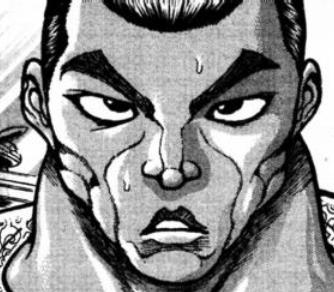
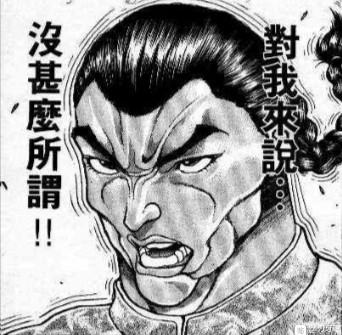
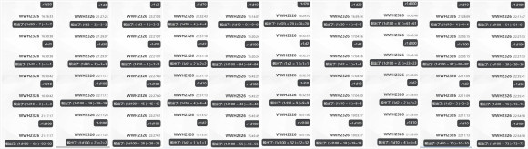
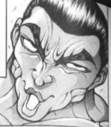

~评委席~

克劳恩皮丝：看我把烟花大会用地狱之炎烧光，哈哈哈哈！！！

狱符【地狱之蚀】！

针妙丸：正邪，交给你了！

我先把这些弹幕变小！

正邪：哦哦哦给我逆转回天上去！！

烈：被遗漏的那些就交给我吧！我用花弹把它们打下来！

救火队员正拼命拦截着自天而降的弹幕

而地狱的女神大人则在旁边好奇地看着他们

赫卡提亚：你们在干什么呢？

妖梦：看一眼就明白了吧是在从弹幕之下保护观众啊！

可恶，这些蜘蛛丝砍起来好麻烦

早苗小姐，麻烦来点风！

赫卡提亚：嗯~

其实不用这么麻烦的吧？

你们看，只要做一个简单的结界——

地狱的女神大人打了个响指

透明而无形的结界便笼罩在了这片区域的上方，将观众们与危险的弹幕牢牢隔离开来

赫卡提亚：这样不就可以了~

保证了节目效果的同时也不妨碍妖怪们的表演，一举两得吧？

结界的出口我放在了会场出口的位置，记得和观众们说一声哦

那么我去接着看烟花了，byebye~

灰头土脸的救火队员们面面相觑

咲夜：工作，完成了？

……我们现在应该干什么啊？

灵梦：评委席被紫她们占了

要不我们也去看烟花吧？

无所事事的自机们决定当场解散，并开始享受起了下半场的美丽烟花

救火剧情结束

开始处理刚刚骰出的所有剧情

【1d5：4】

1 新符卡的来源

2 随机一位在场角色的好感度提升【1d10】

3 遇到了一见如故的新朋友

4 评委们的指导，Hp与Atk的小幅度提升

5 看烟花

~评委席~

无事一身清闲的武术家，决定先去和新的评委们打声招呼

烈：晚上好，摩多罗女士

您这次的来意是？

究极的秘神大人离开了长凳，并走到了烈海王的身旁

摩多罗：那位女神大人确实是个值得信赖的人物，这样一来我也无需多费口舌了

因此这一次只是我个人的娱乐而已

比起这个，你啊

最近是不是进入瓶颈期了？

你的力量已经很久没变强过了

烈：不瞒您说，确实如此

我先前也咨询过白莲师傅了，她说我如今正处于向着“非人”过度的漫长时光之中

除了脚踏实地的苦修之外别无他法

摩多罗：啧啧啧，你们的思维怎么就这般僵硬呢

兼修一些其他的法门，试着自己收集信仰，亦或者吞噬他人的力量——

动动脑子，修行上的捷径要多少就有多少

烈的情商【1d100：96】大成功（50以下吐槽）

草，大成功是什么【1d10：6】

1 学会了七星剑

2 梦幻斗舞强化了

3 AtkHp进一步强化（求求你不要啊）

4 学会了七星剑

5 学会了背面的暗黑猿乐

6 是膝枕哦（为啥啊）

7 学会了七星剑

8 学会了弹幕的玉茧

9 是抱抱哦（为什么啊？）

10 大成功/大失败【1d2：2】

武术家刚想吐槽说这些都是旁门左道，却突然想起来对方正是所谓“邪门歪道”的集大成者

烈：您说的有道理，不过我还是喜欢比较踏实的笨法子

怎么说呢……

摩多罗：不想为了追求力量而做自己不喜欢的事情，对吧？

这是正确的

为了获得力量而做出违心之举，是本末倒置的事情

两人远离了喧闹的人群，并走到了寂静的树林中

烈：您……当年做过类似的事情吗？

摩多罗：怎么会呢？

我是自我主义至上的神明大人

成为秘神，成为贤者，发动异变……

所有的一切都是因为我喜欢才去做的

而力量则是让我随心所欲的条件

这就是动力，变强的动力

来，躺过来吧

秘神大人毫不在意地坐在了大树之下，并拍了拍自己的大腿

烈的厚脸皮【1d100：33】（基础20,75以上同意）

烈：？！

不不这个就算了——

一股轻柔而无法抗拒的魔力凭空生成，将武术家硬生生摁躺了下去

秘神大人心满意足地摸着眷者的头

摩多罗：乖乖~

看到了吗？这就是随心所欲了

这一次是膝枕，下一次的话……要不要抱抱你啊？

烈：求求您饶了我吧

摩多罗：那么

我这里刚好有些适用于过渡期的经验可以跟你讲讲

不过都是些小小的“捷径”法门呢，要听吗？

脑后那柔软的感触

说话时口中吐出的气息

以及那抚摸着他的，温柔的手

被这些折磨的坐立不安的武术家立刻点起了头

烈：请指导我，摩多罗女士！

摩多罗：很好，那你就这样躺着听吧~

烈：怎么这样！

至少让我站起来行吗？！

远离人群的寂静树林之中，神明大人正向眷者讲述着种种奥妙的法术

被魔力所压制的武术家无可奈何地躺在了秘神大人的腿上

自幼习武的他从没有过类似的经历，却也感受的到对方的温柔与关切

于是他逐渐放弃了挣扎，而沉浸在了这难得的安宁之中

秘神大人对眷者的过去一清二楚

她观察着对方那别扭的表情，自己也露出了温馨的笑

烈的Atk上升了2点

烈的Hp上升了1点

现在的Atk：279（147）

现在的Hp：22

【1d20：18】分钟后

告别了一脸坏笑的神明大人，武术家回到了热闹的会场之中

烈：好尴尬啊，摩多罗女士是不是总觉得我还是当时的孩童……

喃喃自语的武术家，忽然看到了人群之中那熟悉的身影

烈：永琳？

你是来看烟花的吗？

永琳：不，我是来找公主大人的

你有看到她吗？

烈：有的，差不多一个小时前我刚和她聊过

放心吧，辉夜小姐这次是来找妹红小姐约会的，并没有独自一人出门

永琳：吓我一跳

光是留下一张“我去看烟花了~”的字条就悄悄出门了，这我怎么能够安心呢

独自一人出门的话，遇到了不怀好意的家伙该怎么办啊

烈的情商【1d100：55】（50以下吐槽）

烈：（用天花板把他们砸成饼然后再用秘宝补刀？）

我想有妹红小姐照看着肯定是没事的

来都来了，要一起看看烟花吗？

现在正在表演的人是【1d10：3】

1 摩多罗隐岐奈

2 纯狐

3 赫卡提亚

4 霍青娥

5 哆来咪苏伊特

6 阿空

7 船长

8 鵺

9 白莲

10 大成功/大失败【1d2：1】

赫卡提亚：愿此处的人类们，也能以无罪之身而望配所之月

罪人所见之月，或许就是此般景象吧

来吧，这是我今夜献上的最后的弹幕

【月亮掉下来啦！】

在观众们的惊叹声中，一轮巨大的月亮从空中坠落，并在粉碎之后散为了飘逸的星河

烈：永琳你看，是赫卡提亚表演的碎月烟花！

多漂亮啊！

永琳：……

烈：……

我真的不是故意的

永琳的怒气【1d100：10】

永琳：我已经完全懒得生气了，无论是对那个恶趣味的家伙还是对你不过脑子的发言

是啦是啦很漂亮啦（棒读）

烈海王有点沮丧地低下了头

烈：唉

我总是没法子让气氛浪漫起来

这种时候一般该干什么啊？

永琳：男朋友到底能做出什么动人心弦的浪漫举动呢，我好期待啊（不抱任何期望的棒读）

烈的情商【1d100:91】（基础20,50以上去放烟花）

武术家灵机一动，想到了个不错的主意

烈：永琳，稍等，稍等一下啊！

我过去一趟马上就回来！

【1d60：17】秒后，月之头脑发现恋人加入了表演者的行列之中

烈：我从来没试过这种纯粹的弹幕演出，希望能做出还算入眼的烟火

超人【烈海王】！

武术家以流星般的速度，用激光与使魔在夜幕之上挥起了画笔

他所洒下的弹幕在天空之上逐渐组成了有规律的形状——

即使是普通的居民也能看出，那是一位手持长弓的温婉女子

烈的弹幕评分【1d10：9】

堇子：可恶，我好想给个低分但这个确实很漂亮

观众们的反响也不错，9分！

天子：让我想起了天界中能看到的星星，这可比地上的烟火好看多了

9分

摩多罗：完全不够疯狂啊，这个

看在他够努力的份上给9分吧

紫：毫不遮掩的关系户发言，你这样的才不能算是合格的评委

哦，莲子她们好像挺喜欢的

那就9分吧

武术家兴高采烈地回到了恋人跟前

烈：没想到我拿到的评分还挺高的

永琳你感觉怎么样，画的像吗？

月之头脑笑着抱住了恋人

永琳：给你100分哦！

烈：那可真是太好了

他反手抚摸着恋人那银色的长发，并一同看向了空中那仍未停息的烟火

超人【烈海王】

综合评价 9分

“用弹幕来绘画人物是个很有新意的举动，仅仅数秒就将其完成的速度也值得称赞。但最厉害的一点还是他亲身上阵时那拼上全力的表情，这样一来所有人都不得不承认他的努力呢”

下一个【1d3：1】

1 新符卡的思路来源

2 随机一位在场角色的好感度提升【1d10】

3 遇到了一见如故的新朋友

新符卡的思路来源是【1d10：10】

1 “这我也做得到啊！”烈海王评委如是说

2 看烟花时心有所感

3 膝枕时的闲聊（还是摩多罗吗）

4 “这我也做得到啊！”烈海王评委如是说

5 看烟花时心有所感

6 和朋友们的酒会（为啥啊）

7 “这我也做得到啊！”烈海王评委如是说

8 看烟花时心有所感

9 像上次一样的灵机一动（你整天都在想什么）

10 大成功/大失败【1d2：2】

我服啦

思路来源大失败是什么啊【1d10:10】

1 学会了没啥用的观赏性符卡

2 摩多罗的新符卡有副作用

3 看烟花时心有所感不过身边是奇怪的人（为啥啊）

4 学会了没啥用的观赏性符卡

5 摩多罗的新符卡有副作用

6 喝多了（为啥啊）

7 学会了没啥用的观赏性符卡

8 摩多罗的新符卡有副作用

9 和魔理沙激烈讨论时被师匠误解了（你们在说啥啊）

10 大成功/大失败【1d2：1】

这是今天第几次了（吐血）

回去再来一遍【1d10：3】

1 “这我也做得到啊！”烈海王评委如是说

2 看烟花时心有所感

3 膝枕时的闲聊（还是摩多罗吗）

4 “这我也做得到啊！”烈海王评委如是说

5 看烟花时心有所感

6 和朋友们的酒会（为啥啊）

7 “这我也做得到啊！”烈海王评委如是说

8 看烟花时心有所感

9 像上次一样的灵机一动（你整天都在想什么）

10 大成功/大失败【1d2：2】

~时间回到18分钟前~

~树林~

摩多罗：——就是这样的技巧了

明白了吗？

烈：我懂了，摩多罗女士

实际听来发现确实是可行度很高的小技巧

在不影响自身修行大方向的前提下特化了对于精神力与生命力的掌控……

不愧是您啊

摩多罗：呵呵

你学东西可比魔理沙快多了

烈的察觉【1d70：33+30=63】（75以上察觉魔理沙）

烈：（怎么突然提起魔理沙了？）

所以我能起来——

摩多罗：不~行~

悟性这么高就正好多学点东西

我想想，现在适合你的技巧是【1d10：9】

1 七星剑

2 后户的狂言

3 弹幕的玉茧（好像不大合适）

4 七星剑

5 后户的狂言

6 背面的暗黑猿乐（还跳舞啊？）

7 七星剑

8 后户的狂言

9 Anarchy BulletHell（您搞笑吗）

10 大成功/大失败【1d2：1】

摩多罗：无秩序的弹幕地狱！

烈：做不到的吧？！

您用那招的时候整个后户之国都在震这个我绝对是做不到的吧？！

摩多罗：你对那个演出用版本印象这么深刻？

看来我的老本行还没退步嘛~

烈：连那个都是演出用版本的话实战版本该有多强啊？！

摩多罗：如果让你来用的话，就是连续进行多次攻击并令对手陷入混乱状态的符卡

突出混乱与无序的弹幕地狱，很有趣吧？

不过，凭你目前的实力是无法兼顾破坏力与神秘性的，单纯追求更高的破坏力或是针对妖怪做特攻的话，还是用秘术比较好

所以还是要看情况使用这张符卡呢

烈：就算您这么说……我也不知道该怎么用啊……

摩多罗：不巧，我不是那种喜欢用理论说明的学究派

所以嘛，还是让你亲身体验一下比较好吧？

烈：等等等等，您不会要在这里——

秘神大人笑着将手遮盖在了眷者的眼上

堪称巨量的信息流毫无征兆地流入了武者的脑海之中

整个世界似乎变得扭曲而又莫名的生动，但却又像褪了色的油画一样模糊而看不清楚

他在并不存在的空间中四处张望，发现四周充斥着五光十色而难以辨别的物质

而在这疯狂的景象之中，似乎有位不可名状的伟大存在，正用难以辨别的低语向他缓缓讲述着，讲述着那百鬼夜行般的狂乱祭典，与那充斥着混沌与狂气的，里侧的世界

他难以自已地向着未知的神秘伸出了手——

“怎么了？”

手中传来了柔和的触感

武术家在现实中睁开了双眼，发现自己正抚摸着神明大人的脸颊

烈：？！！！

不好意思摩多罗女士，我……

我不知道该怎么形容，但我应该确实是看到了那个景象

摩多罗：对吧~

所以我才说，亲身体验比起理论学习要有效得多

烈：如果一般人看到那些会立刻发疯的吧？

摩多罗：当然，当然

想缩短长年累月的努力，就要付出一定的风险，这是非常公平的事情

不过在有我照看的情况下，就算让毫无力量的你来接触这些也不会有什么危险的

大概吧

烈：那个大概吧听上去好可怕啊？！

唉，总之真是多谢您的指教了，摩多罗女士

没想到还有这般不可思议的法术

摩多罗：啊~哈~哈~

我可是神呢

守护着你的，神明大人

烈海王学会了新必杀技！

【无秩序的弹幕地狱】（CT6）以千奇百怪的弹幕建造无尽的混乱地狱。

3T内Atk+700，给予伤害X3/Atk+800，给予伤害X4/Atk+900，给予伤害X5，每回合进行一次【特殊攻击】混乱：进行一次【1d100】的混乱判定，10以上对手本回合无法使用技能，30以上对手本回合无法造成伤害，50以上对手本回合战斗自动失败，70以上对手本场战斗自动失败（面对具有特殊攻击耐性的对手，标准值变更为40/60/85/96）

此后战斗前提前判定T6之后所用的必杀技组合，分别为超人术+斗舞+天文密葬法/弹幕地狱

下一个【1d2：2】

1 随机一位在场角色的好感度提升【1d10】

2 遇到了一见如故的新朋友

新的朋友是谁啊【1d10：4】

1 诹访子

2 蓝

3 星

4 诹访子

5 蓝

6 小野塚小町

7 诹访子

8 蓝

9 永江衣玖

10 大成功/大失败【1d2：2】

在放完烟花的【1d20：17】分钟后

确认了辉夜行踪的月之头脑安心回永远亭了，在这个夜晚经历了过多事件的武术家刚准备找个地方歇上一段时间——

就在道路的正中遇见了一位奇妙的神明大人

她有着一头金色的齐肩短发，穿着以青和白为基调的“壶装束”，脚上穿着白色的过膝袜，头上踩着有两个眼珠状装饰的，令人联想起青蛙的市女笠

她像儿童一样蹲在武术家的眼前，正巧抬眼与他对上了视线

烈的情报收集【1d70：14+30=44】（50以上知道诹访子）

烈：请问您是？

诹访子的好感度【1d100：66=75】（双重大成功+75，基础值为75）

诹访子：哦哦

你是以前来找过早苗的武术家

我的名字是洩矢诹访子

是守矢神社真正的主人哦

烈的疑惑【1d100：81】

烈：真正的主人？

我一直以为那个神社是属于你们三人的东西

诹访子：那个原本可是我的东西

后来神奈子发动了战争，把它抢过去了

不过最后由于一些其他的原因，我们两人又选择了合作——

最后就变成这种关系啦~

烈：这可真复杂……

诹访子：啊哈哈哈哈，都是以前的往事而已

比起这个，你啊，也是很少见的专业人士了

来玩一局游戏吧

相扑或者合气道，想要哪个？

【1d2：2】

1 相扑

2 合气道

武术家向着小小的神明伸出了手

烈：我对相扑没有兴趣

但合气道却在外界见识过一二

是要这般比较的，对吧？

诹访子：你很懂嘛~

就是这样，我们来握个手吧！

烈的出力【1d100：5+50=55】（烈海王+50）

诹访子的出力【1d100：85+50=135】（守矢流综合格斗术+50）

双手相握的瞬间，武术家便感受到了

对方没有使用任何的超自然能力

只是单纯地运用着自己的身体，用着比孩童都大不了多少的力量

但是无法撼动

但是无法将手抽出

简直像是妖术！

烈：和过去看到过的景象一样——

原来是这样的感觉吗？！

诹访子：武者呦

你已经落到我的手里了❤

像是重力突然翻了数倍

武术家的身体被一点点压了下去——

然而，烈海王的身体却突然在空中旋转了起来

这份扭曲的力道沿着手臂传向了另一端的神明，让土著神惊讶地松开了手

烈：完全消力！

诹访子：这招看上去很有趣的样子！

烈海王落回了地上

烈的不服输【1d100:35】（保底30）

烈：厉害

之前光听早苗小姐的话语，还以为不过是她在吹嘘

没想到却是我眼见狭隘了！

诹访子：别在意~

早苗那孩子说话的时候总带着一股子傲气，这也是她的老毛病啦~

比起这个，下次来神社做客吧

我还想看看你其他的招式呢！

烈：真的吗？那太好了！

和神明进行的武艺切磋，这可是我们梦寐以求的事情！

诹访子：就是要这样~

如果你愿意和神明一起玩游戏的话，神明也会高兴地回应你的

今天认识了新的好朋友呢，我很开心！

我要先去找神奈子了，下次见，烈海王！

小小的神明蹦蹦跳跳地离去了

武术家回味着刚刚交手的体会，前往了评委席的方向

烈的情商【1d100：69】（50以下说烂话）

武者没有看向身旁的妖怪

而是望着天空中的烟火缓缓开口

烈：我觉得这次这活动办得还不错

无论评委，参赛者还是普通的观众们都充分享受了弹幕的乐趣

应该说，这才是属于幻想乡的祭典吧？

正邪小姐，你说以后把这个当成常驻活动怎么样？

正邪：常驻活动？

每年都办一次？

烈：也许可以办两次？

冬天的时候普通人们没办法出门太远，因此就只能办小规模的弹幕比赛

夏天的时候就可以办像这次一样的了

今天没能邀请过来的选手，还有许多没展现出来的弹幕，就在明年的天空中与它们相遇

明年的时候，应该会有更多人来参加活动了吧——如果灵梦懒得办的话，就由我来当主办方

正邪小姐下次要来吗？

鬼人正邪愣了几秒，而后发自内心地露出了笑容

正邪：当然！

给我当心点，下次本大爷一定会做好充分的准备

然后把你们有趣的弹幕大会彻底颠倒，搅得天翻地覆！

烈：真有斗志

但对我而言，没什么所谓！

朋友们笑着立下了明年的约定

巫女小姐用最后的烟花宣告了这个夏日的终结

在所有人愉快的笑容中

第一届弹幕烟花大会，到此结束！

两层之前有幅图放错了，那剧情里没有辉夜的啊（

以及剧情还有一小段才结束

不过，虽说到了散场的时间，但大家的热情却没有冷却下来

有部分没能参加的人与没射够弹幕的人，趁着人群还未散去的时候玩闹着放出了弹幕

比如说——

铃仙：明明说好了不参加结果烈先生师匠和辉夜大人全都去了！

好过分！我也要放烟花，烈先生跟我一起来！

烈：哦哦哦哦哦好的铃仙前辈没问题！

烈&amp;铃仙：散秘符「虚假之月(Illusive Full Moon)」！

堇子的评价【1d10：9】

堇子：这两个人的配合居然意外的好

将秘术与催眠术结合而形成的若隐若现之满月……确实是很漂亮但是为何我却浑身发冷汗呢……

9分吧！这个有资格进我的额外相册呢！

女高中生掏出手机，向着夜空中的弹幕按下了最后一次摄影键

这个在幻想乡中显得异常的行为，恰好被路过的两位女大学生看到了

秘封组的察觉【1d100：99】大成功（50以上察觉老手机）

你们察觉什么了啊【1d10：5】

1 连具体的时间点都推断出来了

2 堇子的相貌

3 梅莉能力的真相（那是什么）

4 连具体的时间点都推断出来了

5 堇子的相貌

6 莲子：其实我也会超能力（真的假的）

7 连具体的时间点都推断出来了

8 堇子的相貌

9 两人间的感情（这啥啊）

10 大成功/大失败【1d2：1】

BGM：少女秘封俱乐部

梅莉：莲子？

你看到了吗，那个手机看上去很奇怪

现在还会有人用那么老式的器械吗？

但她的朋友并未搭话

宇佐见莲子呆呆地看着前面那个正在拍照的小女生

她的年纪看上去比自己还要小，用的手机是现在根本看不到的老式型号

她脸上带着与方才的自己如出一辙的表情，那是对神秘的好奇心，对非日常的渴求，对于怪异之物的热爱，以及心满意足后的欣喜

她熟悉这个表情

她无数次从那位尊敬的长辈脸上看到过它——

而记忆中的那张脸与眼前的现实，却逐渐重叠了起来

下意识地，她向前走去，并站在了那位少女的身前

莲子：——名字！

我，可以问一下你的名字吗！

堇子的震惊【1d100：99】

大成功是什么【1d10：5】

1 过于震惊因此全都说了

2 1+回忆起了梦中的往事

3 超能力强化了（为啥啊）

4 过于震惊因此全都说了

5 4+回忆起了梦中的往事

6 原来如此，是我的后辈（为啥啊）

7 过于震惊因此全都说了

8 7+回忆起了梦中的往事

9 她也完全理解了（你又懂了什么？！）

10 大成功/大失败【1d2：】

十分唐突的，宇佐见堇子被看上去比自己还大一些的少女拦住了去路

在这非常识的幻想乡中，她第一次遇到这般日常的“刺激”

像是自己身体的防卫机制一般，女高中生反射性地用出了一个小小的技巧——

一个现实中的她绝对不会用出的技巧

堇子：接招，Shining finger！

出于最基本的自制，她并未使用超能力

因此这只是一击十分单纯的直拳突刺——

是宇佐见莲子也能学会的，普普通通的招式

女高中生的拳头在女大学生面前停了下来

堇子：吓我一跳！

不好意思差点伤到你，我现在脑子里好混乱

哇这都什么招式……我还干过这么丧心病狂的事情吗我的天……

已经完全明白了

对于莲子而言，这已经是连确认都不需要做的事情

而她所询问的对象也终于给出了答复

堇子：啊啊，名字是吧？

我的名字是宇佐见堇子，职业是女子高中生，超能力者——

以及，秘封俱乐部的初代会长！

梅莉：那不是——

有很多话想说

有很多事情想问

想要知道你现在过得是什么样的生活

想要知道你是如何来到这里的

想要知道现在究竟是哪一年

但是宇佐见莲子没有将这些话语说出口

她在对方那诧异的眼神中紧紧握住了女高中生的双手

莲子：探究未知的神秘

学习独特的格斗技

远离无趣的日常

在这另一侧的世界中，举办秘封活动！

在做这些事情的时候，你开心吗？

只是提出了自己最想知道的事情

想要知道现在的你，到底是什么样的心情

女高中生有些疑惑地挠了挠头

然后，她愉快的笑了起来

堇子：那当然是很开心啊！

这是我宇佐见堇子一生之中最大的梦想

没有任何事情能比这更加令我满足了！

不知不觉间，眼中流出了泪水

她擦了把脸，而后向着面前的女高中生露出了微笑

莲子：我也一样！

我也很开心！

堇子小姐，这只是一个陌生人的请求

请你一定，一定不要忘记这时的心情！

堇子疑惑地歪了歪头

堇子：我当然不会忘记

我，这辈子都不会忘记的

梅莉：谢谢你

真的很感谢你，宇佐见堇子小姐！

秘封俱乐部的两人对着初代会长送上了自己最为诚恳的致谢

她们哭着，笑着，告别了初次见面的女高中生

然后在不可见的涟漪中逐渐淡去

回到了自己的世界之中

不远处的阴影中，两位贤者正看着这难得一见的光景

摩多罗：真可惜，我又错过了和她们聊天的机会

下一次她们过来，会是什么时候呢？

紫：或许会是十年之后

或许会是数百年前

也或许，就在明天？

摩多罗：你也不知道吗？

紫：我也不知道

说到底，又有谁能够真正的掌控自己呢？

她们谈笑着不知所谓的事情

并走向了一脸茫然的女高中生，将她带离了这逐渐冷清的会场

~外界~

~20XX年~

宇佐见莲子与玛艾露贝莉·赫恩回到了自己的宿舍中

刚一落地，黑发的女大学生就奔向了自己的行李箱

梅莉：莲子，要出门？

莲子：啊啊！

我要回东京一趟！

我想去看看勇次郎老爷子，去看看刃牙大叔，梢江阿姨以及杰克大叔

我想去看看东深见高中，想去看看当年她自己的活动室还在不在

我想去看看堇子阿姨——

我想知道现在的她，会对我们说些什么！

梅莉：你会让我一起去的吧？

莲子：当然！

这是我们接下来的秘封活动——

不，这不是社团活动

只是借助难得的假期，去回到故乡看一眼而已！

女大学生们兴奋地收拾着行李，准备着之后几天的行程

她们所寻找的那张照片正显示在手机的屏幕上

夜空之中有着怪异而美丽的球状物体

似乎能看到顶着兔耳朵的少女与扎着辫子的男人站在画面的中间

过于模糊的画质让人看不清他们脸上的表情——

但是，光是看着这副画面就会觉得

那时的他们，脸上一定带着开怀的笑容

（本日的更新结束，下一次的更新在周三或周四，为新人物安价回）

（以下是我的废话）

哎呦喂这个大型彩蛋环节总算是结束了

这都啥啊我的天啊

骰出秘封组之后就想着多写点秘封组的剧情结果真的就写多了啊！！

赶紧回到了烟花大会想着快点过了无趣的前半段开始后半段激昂的剧情——

结果最关键的搞事两人被一个大成功就毙了啊！！！

正邪！正邪！我求求你了正邪你能挣点气吗？！！！

为什么你每次搞事都是光速完结啊啊！？辉针城都过去多久了怎么现在还能犯呢？！

抱着这样的想法我继续骰了下去

我错了，正邪，这不是你的问题，骰子监督今天发疯了

这都是什么啊（绝望）

弹幕大会的总思路被那个三连骰给撕得稀烂了

不如说之后后半段和烟花到底有什么关系啊草草草

正邪最后的好感骰真就差了一点要是过了今天八成就没法更新了草！

秘封组与其他人的关系没有骰，也没有细说，不光是因为zun没有讲，更是因为我觉得这样会比较有趣——因为有些东西说清楚了就没意思了

本想着重点塑造梅莉但这个会格斗技的莲子真的好有趣一写就停不下来了草草草

最后那段话，如果设置在更加久远的未来——

堇子和刃牙他们已经成了存在于回忆中的人物，唯一的联系只有一本笔记或是相册，这时的秘封组察觉了这次偶然的巧合——

让两位对过去仅有一丝半点了解的未来人把这些说出口会更加有感染力，效果也会更好

不过，我实在不喜欢这样的剧情

因此哪怕让这些话语显得突兀，哪怕只过了数十年科技进步就这般厉害很不合理，我还是选择了这样的发展——因为从本质上来讲，我就是个喜欢大团圆结局的，没有一点文艺细胞的，只想看好结局的烂俗人物啊（笑）

戏剧性之类的全部扔一边去，还是开开心心写好结局更合我意

下一次是安价回，具体安价时间待定

那么本次的更新到此结束，下次的更新在周三或周四，大概率周四了，骰子明天发

本次的安价在明早九点半进行，倒时候我会单开两个安价层

规矩与之前一样，不过这次为了增加趣味性，我会将地点与人物分开安价

具体来说，明早九点半发地点安价楼，九点35分发人物安价楼，各取前20个，是这样的程序

规矩还是和之前一样哦！各位晚安

安价和上次是一样的规则啊，新角色和已经出场过的角色都没问题

安价楼（地点）

（人物楼在9:35分发）

这次安价回的地点是【什么地方】？

请大家自由发挥

请在此楼回复

安价楼（人物）

烈海王将与【什么人物】相遇？

请在此楼回复

再次重申一次，范围仅限于【东方stg正作】【东方格斗作】与【东方官方书籍】中登场的人物，新人物与已经出场过的人物都可以

地点：（前20中有位朋友发了两次因此把第二次除去了）

1 辉针城

2 地狱

3 太阳花田

4 后户之国

5 太阳花田

6 月之都温泉

7 无缘冢

8 太阳花田

9 地狱

10 三途河

11 月之都温泉

12 东方漫才大会

13 三途河畔的武术班

14 太阳花田

15 玄武之泽

16 畜 生 界

17 辉针城

18 太阳花田

19 月之都

20 辉针城

人物

1 键山雏

2 鬼人正邪

3 森近霖之助

4 绵月依姬

5 铃仙·优昙华院·因幡

6 梦境烈海王（这个倒也确实出场过草）

7 永江衣玖

8 绵月依姬

9 博丽灵梦

10 奥野田美宵

11 鬼人正邪

12 鬼人正邪

13 村纱水蜜

14 雾雨魔理沙

15 易者

16 易者

17 绵月丰姬/绵月依姬（中了的话骰【1d2】决定哪位）

18 云山

19 宫古芳香

20 雾雨魔理沙

地点【1d20:12】东方漫才大会

人物【1d20:12】鬼人正邪

烈海王将在【东方漫才大会】遇到【鬼人正邪】

共计5个花田3个辉针城2个温泉，已经完全可以看出大家的喜好了真是过草

我还想着这次的地点都很稳定嘛没有出现什么“地狱熔炉中心”“三途川河底”“四季大人的桌子下面”“赫卡提亚的t衫里”“刃牙的饭桌前”这种草选项的吧友们真的很温柔——

结果就命中了唯一一个梗选项漫才大会

说真的这是1/20的几率啊到底是怎么做到的（无力）

人物方面正邪有三个倒是意料之中，绵月姐妹和转转船长这些也能想的到——

但是为啥会有两个易者啊？！怎么还有一个云山？！大叔浓度好高？！

最草的是那个梦境烈海王我想踢出去但居然找不到理由？！已经在本贴内出场了好几次的这位好像也确实能算老角色？！

草草草配合上这个漫才大赛的地点如果中了这仨我简直难以想象是什么样的混沌场面呜哇

而且漫才，漫才该怎么写啊啊啊啊啊啊啊啊十分钟的漫才文本是很长的啊啊啊啊啊啊啊啊啊

交给骰子决定吧（笑）

不过这个场景的话可能性有很多......搭档选手/敌方选手/评委/观众等等，也不一定是当场组合，总之到时候再说吧

原以为做好了全方位防护没想到却是这种意料之外的攻击，呜哇

那么下次更新的时候就可以看到这次安价的内容了，以上

附上本次的骰子，早上忘发了（

顺便这是昨天剧情中想放进去的两张海报，结果也忘了（

还有就是昨天下半场和师匠看烟花是骰出来的剧情，并不是我默认写的，但是昨天更新的时候好像忘记把这个骰子复制过去了（悲）

大概是周四晚上七点半更新

不过这几天事情比较多，不知道能不能写完，具体看情况吧

今晚七点半左右更新

~开始前的碎碎念~

由于地点是漫才大会会场，这次更新中会带有很多【东方M1漫才大会】这个同人手书系列中的梗

像是人物对话中提到的“第X届”指的就是该系列的第X届，大家感兴趣的话可以看一下

不过，漫才这种搞笑节目会不可避免地出现掉节操对话等人物崩坏剧情，理解为大家在演节目的时候high过头了比较好，不要当真哦（笑）

虽说用了很多漫才系列的梗但也不代表着这个同人中的剧情全都在本贴世界线发生过，把这些当成无厘头彩蛋环节吧！反正只是梗而已没看过也无所谓的！

那么开始更新（

~这件事发生在烈海王来到幻想乡的第【584+1d30:11=595】天~

夏季最后的夜晚在漫天的花火中过去，幻想乡的大家迎来了红叶与丰收的季节

冠以秋之名的两位神明变得活跃起来，她们在山中制造着缤纷的落叶，也在农田里祝福着谷物的丰收

曾参与四季异变的人们，在看到这秋季的景象时却也感受到了一丝恍惚，仿佛眼前所见并非真实，而是神明大人又一次的心血来潮之举

不过永远亭的武术家并无这般感触

热闹且喧嚣的种种活动终于结束了，他带着平和的心境结束了自己在幻想乡度过的第二个夏天，并回归到了那平平无奇的日常生活中——

~东方M1漫才大会 丰收漫才祭典~

BGM：众神眷恋的幻想乡

霖之助：好了，终于开幕了

第13届东方M1大会——

虽然我很想这么说，但是现在还没到年末呢

今天的漫才大会是为了庆祝秋收而举办的特别祭典！

霖之助：我是一直担任主持人的森近霖之助，还请多多指教！

说起来烈与正邪这次是【1d10：6】（1-6的话队友，7-8评委，9竞争对手，10随机）

武术家与天邪鬼正面无表情地看着手拿话筒的王牌主持人，一旁端坐着的五位评委以及情绪比夏天时还要激昂的观众们

烈：真的要上去表演吗？！

就靠我们两个？！

正邪：事到如今也不能撤了吧？

烈海王与正邪不约而同地回想起了【1d11：7】天前的那个上午

没错，那就是一切开始的起点——！！

~时间回到七天前~

~第588天~

烈海王是怎么接触这个活动的【1d10:4】

1 在辉针城做客时的闲聊

2 主办方是新的朋友

3 其实主办方是辉夜小姐（为啥啊）

4 在辉针城做客时的闲聊

5 主办方是新的朋友

6 我烈海王有一个梦想（啥啊这是）

7 在辉针城做客时的闲聊

8 主办方是新的朋友

9 其实这次是副主持人（为啥啊）

10 大成功/大失败【1d2：2】

~辉针城~

紫发的小人族正懒洋洋地趴在桌前剥着石榴

针妙丸：时间过得真快啊~感觉这一年都快要过去了~

等天气再冷一些就可以把天子上次买的暖炉拿出来了

正邪：还没到冬天呢你懒散点可以吗？

这么闲的话就过来帮忙擦一下桌子——哦，烈海王来了

永远亭的武术家拎着一大篮子菜进了门，并和朋友们打了声招呼

烈：针妙丸小姐，正邪小姐，早上好

你要的菜我帮你买过来了

天子小姐这是在干嘛呢？

蓝发的天人此刻正在另一侧的书桌旁面色扭曲地咬着铅笔

天子：这个捏他太低俗了不可以……

这个段子不懂历史梗的观众又根本听不懂……

唱歌？年年都搞这一套的话连海选都过不去啊

说到底我身为高贵的天人为什么要来写这个剧本，那个妖怪又把事情全都推我头上……

针妙丸：天子在准备这次年末大会的漫才剧本哦~

啊，说起来烈海王来幻想乡好像还不到两年，你有看过每年过年时的那个吗？

烈的情报收集【1d70：41+30=71】（50以上看过去年的，75以上历届全都看过）

烈：哦哦，是每年年末都有办的那个霖之助先生主持的比赛吧

叫做东方M1漫才大会来着？

我去年和师匠她们在家看了转播，魔理沙那场给我留下了非常深刻的印象……

正邪：她和灵梦那次的漫才从中间开始就完全变成临场发挥了

后半段那个求吻的演出就连本大爷都觉得有点太平和了，那个巫女不会生气吗？

烈：怎么说呢

我记得灵梦之后来永远亭看魔理沙的时候笑的还挺开心的

当时我问她怎么魔理沙大过年的又骨折了，据说是那天晚上被两位魔女追杀的连家都不敢进

而且最后还被追上了……

天人小姐将用完的铅笔头随手扔进了垃圾桶

天子：“天作孽，犹可恕；自作孽，不可活”

啧啧啧啧，自作自受啊~

说起来，你们今年要不要参赛啊？

年末那场正式比赛的报名应该来不及了，不过一周之后的特别大会现在倒还可以哦

烈：天子小姐，这个特别大会具体是什么情况啊？

特别大会主办方是【1d10:9】

1 守矢神社

2 八云紫

3 就是我们辉针城（为啥啊）

4 守矢神社

5 摩多罗

6 白玉楼（现在是秋天哎）

7 守矢神社

8 红魔馆

9 其实还是四季（为啥啊）

10 大成功/大失败【1d2：2】

天子：这次特别大会的主办方依然还是石地藏

虽说上次总冠军的名号是被“秘封堂”拿走了，不过她似乎还想接着发扬搞笑文化的样子

正邪：那个给我“死刑”评价的家伙

一想到那次我就来气……针妙丸你那次还给了我0分！！

针妙丸：谁叫正邪连假队友都没分辨出来啊~

天子：这次的奖品是相比于正赛大幅度缩水的1万元以及

【1d10：1】

1 一个季度的新鲜蔬果供应

2 云山泡芙礼盒

3 爆仙娘娘的唱片CD（为啥啊）

4 一个季度的新鲜蔬果供应

5 死神镰刀（装饰版）

6 幻想乡羽翼写真集（谁想要啊）

7 一个季度的新鲜蔬果供应

8 Binary drop的唱片CD（这个还不错哦）

9 “你也能够成为格斗家！”守矢流格斗术免费培训课（谁要这个啊）

10 大成功/大失败【1d2：1】

天子：一个季度的新鲜蔬果供应！

烈与正邪的兴趣【1d100：73】（50以上主动参赛）

烈：整整一个季度都不用出门买菜了？！

正邪：它们应该也提供送货上门的服务吧？！

两位负责买菜做饭等家务事的苦劳役的双眼亮了起来

烈：要参赛吗，正邪小姐？

正邪：当然了！

看本大爷把这次比赛彻底颠倒过来！

斗志昂扬的两人在小人与天人的加油鼓劲中发出了参赛的宣言！

【1d20：13】分钟后，冷静下来的武术家与天邪鬼开始了他们的计划

正邪：既然要参赛了就得准备好段子才行

喂烈海王，你对漫才的了解有多少？

烈的了解【1d100：29】

武术家自信地点了点头

烈：我还是做过一些调查的

这个说漫才讲究一个说学逗唱……

正邪：缺一不可全都得会真是这样就好了哦！

烈：不是那个吗？

“鬼人老师的父亲少名老爷子”那个？

正邪：那是相声不是漫才！

天子：真要说的话，漫才与对口相声在某种程度上也挺像的

由看上去像是正经人的找碴角色吐槽，由扮演滑稽角色的装傻角耍笨，通常由这两人的组合来完成漫才的演出

表演的两人需要以相对较快的速度相互讲述笑话，通过小误会、捏他、双关语、谐音梗或者流行梗等等元素让观众笑起来

外界的漫才情况如何我并不清楚，幻想乡的漫才大会中一次表演需要控制在10分钟左右，听上去简单实际上还是需要准备很多对话的呢

烈的理解【1d70:66+30=96】大成功（天子的说明+30，50以上理解）

大成功是什么【1d10:9】

1 原来如此，我想好剧本了

2 原来如此，我想好梗了

3 保送决赛了（为啥啊）

4 原来如此，我想好剧本了

5 原来如此，我想好梗了

6 日常评委黑幕（这啥啊）

7 原来如此，我想好剧本了

8 原来如此，我想好梗了

9 发现了自己的搞笑天赋（这啥啊）

10 大成功/大失败【1d2：2】

聆听着天人的解说，回想着过去看过的节目，武术家的心中突然浮现了一个念头

烈：如果只需要写一个有趣的剧本然后照着演出的话……

我应该也做得到啊！

正邪：哇，这个人好像突然燃起了斗志的样子

烈：和正邪小姐搭档的话就用这几个话题……梗的话就用这些……

好，让你们看看中华四千年喜剧艺术的厉害！

正邪：四千年前别说喜剧连曲艺都够呛有吧？

