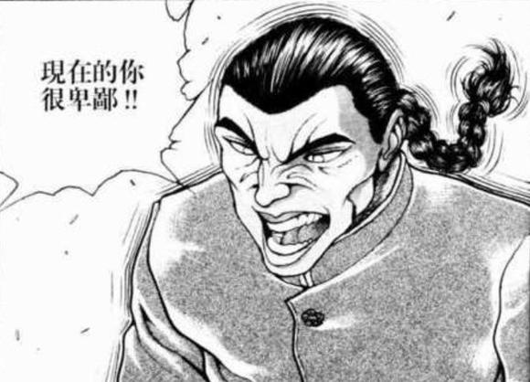

~这件事发生在烈海王来到幻想乡的第【584+1d30:11=595】天~

夏季最后的夜晚在漫天的花火中过去，幻想乡的大家迎来了红叶与丰收的季节

冠以秋之名的两位神明变得活跃起来，她们在山中制造着缤纷的落叶，也在农田里祝福着谷物的丰收

曾参与四季异变的人们，在看到这秋季的景象时却也感受到了一丝恍惚，仿佛眼前所见并非真实，而是神明大人又一次的心血来潮之举

不过永远亭的武术家并无这般感触

热闹且喧嚣的种种活动终于结束了，他带着平和的心境结束了自己在幻想乡度过的第二个夏天，并回归到了那平平无奇的日常生活中——

~东方M1漫才大会 丰收漫才祭典~

BGM：众神眷恋的幻想乡

霖之助：好了，终于开幕了

第13届东方M1大会——

虽然我很想这么说，但是现在还没到年末呢

今天的漫才大会是为了庆祝秋收而举办的特别祭典！

霖之助：我是一直担任主持人的森近霖之助，还请多多指教！

说起来烈与正邪这次是【1d10：6】（1-6的话队友，7-8评委，9竞争对手，10随机）

武术家与天邪鬼正面无表情地看着手拿话筒的王牌主持人，一旁端坐着的五位评委以及情绪比夏天时还要激昂的观众们

烈：真的要上去表演吗？！

就靠我们两个？！

正邪：事到如今也不能撤了吧？

烈海王与正邪不约而同地回想起了【1d11：7】天前的那个上午

没错，那就是一切开始的起点——！！

~时间回到七天前~

~第588天~

烈海王是怎么接触这个活动的【1d10:4】

1 在辉针城做客时的闲聊

2 主办方是新的朋友

3 其实主办方是辉夜小姐（为啥啊）

4 在辉针城做客时的闲聊

5 主办方是新的朋友

6 我烈海王有一个梦想（啥啊这是）

7 在辉针城做客时的闲聊

8 主办方是新的朋友

9 其实这次是副主持人（为啥啊）

10 大成功/大失败【1d2：2】

~辉针城~

紫发的小人族正懒洋洋地趴在桌前剥着石榴

针妙丸：时间过得真快啊~感觉这一年都快要过去了~

等天气再冷一些就可以把天子上次买的暖炉拿出来了

正邪：还没到冬天呢你懒散点可以吗？

这么闲的话就过来帮忙擦一下桌子——哦，烈海王来了

永远亭的武术家拎着一大篮子菜进了门，并和朋友们打了声招呼

烈：针妙丸小姐，正邪小姐，早上好

你要的菜我帮你买过来了

天子小姐这是在干嘛呢？

蓝发的天人此刻正在另一侧的书桌旁面色扭曲地咬着铅笔

天子：这个捏他太低俗了不可以……

这个段子不懂历史梗的观众又根本听不懂……

唱歌？年年都搞这一套的话连海选都过不去啊

说到底我身为高贵的天人为什么要来写这个剧本，那个妖怪又把事情全都推我头上……

针妙丸：天子在准备这次年末大会的漫才剧本哦~

啊，说起来烈海王来幻想乡好像还不到两年，你有看过每年过年时的那个吗？

烈的情报收集【1d70：41+30=71】（50以上看过去年的，75以上历届全都看过）

烈：哦哦，是每年年末都有办的那个霖之助先生主持的比赛吧

叫做东方M1漫才大会来着？

我去年和师匠她们在家看了转播，魔理沙那场给我留下了非常深刻的印象……

正邪：她和灵梦那次的漫才从中间开始就完全变成临场发挥了

后半段那个求吻的演出就连本大爷都觉得有点太平和了，那个巫女不会生气吗？

烈：怎么说呢

我记得灵梦之后来永远亭看魔理沙的时候笑的还挺开心的

当时我问她怎么魔理沙大过年的又骨折了，据说是那天晚上被两位魔女追杀的连家都不敢进

而且最后还被追上了……

天人小姐将用完的铅笔头随手扔进了垃圾桶

天子：“天作孽，犹可恕；自作孽，不可活”

啧啧啧啧，自作自受啊~

说起来，你们今年要不要参赛啊？

年末那场正式比赛的报名应该来不及了，不过一周之后的特别大会现在倒还可以哦

烈：天子小姐，这个特别大会具体是什么情况啊？

特别大会主办方是【1d10:9】

1 守矢神社

2 八云紫

3 就是我们辉针城（为啥啊）

4 守矢神社

5 摩多罗

6 白玉楼（现在是秋天哎）

7 守矢神社

8 红魔馆

9 其实还是四季（为啥啊）

10 大成功/大失败【1d2：2】

天子：这次特别大会的主办方依然还是石地藏

虽说上次总冠军的名号是被“秘封堂”拿走了，不过她似乎还想接着发扬搞笑文化的样子

正邪：那个给我“死刑”评价的家伙

一想到那次我就来气……针妙丸你那次还给了我0分！！

针妙丸：谁叫正邪连假队友都没分辨出来啊~

天子：这次的奖品是相比于正赛大幅度缩水的1万元以及

【1d10：1】

1 一个季度的新鲜蔬果供应

2 云山泡芙礼盒

3 爆仙娘娘的唱片CD（为啥啊）

4 一个季度的新鲜蔬果供应

5 死神镰刀（装饰版）

6 幻想乡羽翼写真集（谁想要啊）

7 一个季度的新鲜蔬果供应

8 Binary drop的唱片CD（这个还不错哦）

9 “你也能够成为格斗家！”守矢流格斗术免费培训课（谁要这个啊）

10 大成功/大失败【1d2：1】

天子：一个季度的新鲜蔬果供应！

烈与正邪的兴趣【1d100：73】（50以上主动参赛）

烈：整整一个季度都不用出门买菜了？！

正邪：它们应该也提供送货上门的服务吧？！

两位负责买菜做饭等家务事的苦劳役的双眼亮了起来

烈：要参赛吗，正邪小姐？

正邪：当然了！

看本大爷把这次比赛彻底颠倒过来！

斗志昂扬的两人在小人与天人的加油鼓劲中发出了参赛的宣言！

【1d20：13】分钟后，冷静下来的武术家与天邪鬼开始了他们的计划

正邪：既然要参赛了就得准备好段子才行

喂烈海王，你对漫才的了解有多少？

烈的了解【1d100：29】

武术家自信地点了点头

烈：我还是做过一些调查的

这个说漫才讲究一个说学逗唱……

正邪：缺一不可全都得会真是这样就好了哦！

烈：不是那个吗？

“鬼人老师的父亲少名老爷子”那个？

正邪：那是相声不是漫才！

天子：真要说的话，漫才与对口相声在某种程度上也挺像的

由看上去像是正经人的找碴角色吐槽，由扮演滑稽角色的装傻角耍笨，通常由这两人的组合来完成漫才的演出

表演的两人需要以相对较快的速度相互讲述笑话，通过小误会、捏他、双关语、谐音梗或者流行梗等等元素让观众笑起来

外界的漫才情况如何我并不清楚，幻想乡的漫才大会中一次表演需要控制在10分钟左右，听上去简单实际上还是需要准备很多对话的呢

烈的理解【1d70:66+30=96】大成功（天子的说明+30，50以上理解）

大成功是什么【1d10:9】

1 原来如此，我想好剧本了

2 原来如此，我想好梗了

3 保送决赛了（为啥啊）

4 原来如此，我想好剧本了

5 原来如此，我想好梗了

6 日常评委黑幕（这啥啊）

7 原来如此，我想好剧本了

8 原来如此，我想好梗了

9 发现了自己的搞笑天赋（这啥啊）

10 大成功/大失败【1d2：2】

聆听着天人的解说，回想着过去看过的节目，武术家的心中突然浮现了一个念头

烈：如果只需要写一个有趣的剧本然后照着演出的话……

我应该也做得到啊！

正邪：哇，这个人好像突然燃起了斗志的样子

烈：和正邪小姐搭档的话就用这几个话题……梗的话就用这些……

好，让你们看看中华四千年喜剧艺术的厉害！

正邪：四千年前别说喜剧连曲艺都够呛有吧？

【1d30：22】分钟后，自信满满的武者完成了自己的第一份漫才剧本

烈：感觉思维非常的活跃，简直像是在练武一样

难不成，我其实也有着表演的天赋？

针妙丸：我觉得烈先生平常说话就已经很搞笑了~

要来尝试一下吗，正邪？

天邪鬼正一脸痛苦地看着剧本

正邪：这里面有好多我完全理解透彻的外界梗啊

哇……真的要用这个吗？我觉得我上次那个暗杀漫才还挺是糟糕的

天子：？

你自己都说糟糕了那还不换一个？

和初心者一起讲的漫才也不会有人有太多期待的——总之先试着把它讲完吧

啊，最后一个问题，组合的名称是？

烈：【逆转的武人】！

正邪：听上去像热血动画倒数第二集的标题一样！

我们要讲的是漫才吧！

烈：好的，准备完成

开始吧！

BGM：沉向空中的辉针城

笑场判定【1d100：29】（50以上笑场）

烈：观众朋友们大家好！

我们是【逆转的武人】！

正邪：哟下三滥的家伙们！

我鬼人正邪大人又回来了哦！

倒立着站在天花板上的武术家与天邪鬼沉着冷静地说出了他们的开场白

由于重力的作用，烈海王的辫子垂了下来

他调整了一下头的角度，刚好把辫子朝向了正邪的方向

正邪：好~

虽然开场就说这个不太好

这个梗已经用了一次了哦，第九届的时候

烈：我知道

但是有句话叫做事不过三，如今才刚演了第二遍，想必大家也是可以接受的

正邪：我寻思事不过三应该不是这样用的

说到底为什么啊？

冒着被批评没有新意的风险来用重复的梗？

烈：无法理解吗？

仔细想想，我们目前所处的这个状况！

正邪：难不成，

这个从我的角度上来看像是辫子在说话的状况莫非隐藏着什么了不得的笑点？

烈：——正是所谓【逆转的武人】！

正邪：开场就用这种冷笑话是在闹哪样啊？！

炒热气氛的闲聊时间却让空气冷下来了话说这次的吐槽役居然是本大爷吗？！

烈：不，还没有结冰

正邪：这时候结冰的话就是异变了！

博丽灵梦会带着鬼一样的脸过来的！

话说你把***正过来！也不要抖辫子！我不想和会说话的倒立辫子聊天！

天邪鬼与武术家从倒转的角度上正了回来

烈：呼——

我认为这个是必要的演出

因为观众朋友们中间肯定有没有见过我们的人吧

这个时候，就要展示能力

我的能力就是用辫子说话

笑点判定【1d100：8】（50以上笑场）

天邪鬼神色自如的接过了武术家的梗

正邪：哦哦那可真不方便啊~

然后本大爷的能力是逆转一切

呀，确实能力在幻想乡的业界是很无所谓的呢

个人特征啊，人生目标啊，担当的角色啊这些从能力上就能看出大半了，真的是很无所谓的呢

烈：真的真的真的是很重要的呢

可是为什么呢？我最近就在思考这些问题

然后我明白了，是因为有些事情只有靠我们的能力才能做到

比如说下克上

正邪：对，以下克上！

那真是无所谓的事情

啊呀可是我每一次的尝试都成功了，真是无所谓呢

烈：我，我有点分不清到底有没有所谓了

果然是很重要的目标吧？

正邪：当然，没所谓的

可是为什么每一次都会成功呢，明明是这么无所谓的事情

烈：不，那个

无所谓的事情成功了也无所谓吧？

正邪：那肯定是无所谓的啊

所以我该怎么办呢？

烈的建议【1d10:8】

1 战斗

2 殴打弱者

3 恋爱（为啥啊）

4 战斗

5 殴打弱者

6 唱歌（为啥啊）

7 战斗

8 殴打弱者

9 学习武术（为啥啊）

10 大成功/大失败【1d2：2】

烈：等等等等，稍等一下啊

好了，我烈海王已经完全理解你的意思了

总是失败的理由就是对手太强

这样的话，我们只要去殴打弱者就好！

正邪：明明是下克上却要去殴打弱者吗？！

反了吧？！

烈：反了就对了

这正是天邪鬼下克上的方式

没错，只要把弱者统统殴打一遍，最后再发动“逆转”的能力——

就可以得到强者被战胜了的结果！

笑场判定【1d100:92】（50以上笑场）

天邪鬼一不小心笑出了声

正邪：噗哈哈哈

好差劲啊我，这真的好差劲啊

那么要练习一下吗，那个，殴打弱者，哈哈哈哈哈，殴打弱者的练习

烈：交给我烈海王吧！

我会帮你准备很棒的弱者的！

【1d15：1】秒后，短暂离场的天邪鬼带着一脸凶神恶煞的表情跳了进来

正邪：嘻哈！

本大爷来蹂躏弱者了！

这次要升天的家伙是谁啊？

是琪露诺吗？是大妖精吗？是chennnnnnnnn吗？还是扎着丝带的金发幼女啊？

对手是【1d10:1】

1 黒木玄斎

2 范马勇次郎

3 比那名居天子（为啥啊）

4 黒木玄斎

5 范马勇次郎

6 风见幽香（为啥啊）

7 黒木玄斎

8 范马勇次郎

9 蕾米莉亚斯卡雷特（为啥啊）

10 大成功/大失败【1d2：2】

一位身穿练功服的黑发大叔从台后走了出来

（由天子化妆后扮演）

黑木（天子）：怪腕流 魔枪 黒木玄斎！

正邪：STOP

停一下

这个是弱者？

你把这个大叔叫做弱者吗？！

黑木（天子）：老夫正是弱者

遇到超人或野兽的话会被轻易的干掉

正邪：说什么鬼话你把超人和野兽都干掉了吧

烈：如果遇到了牙或者主人公的话，当然也是打不赢的

正邪：原来如此那可真是太好了个鬼哦！

牙也被他干掉了啊！

主人公也是啊！

这个大叔哪里算是什么弱者他是最高级别的吧？！

烈：正邪小姐，你在说什么呢

睁大眼睛看好了，这明明就是很常见的路人大叔啊

黑木（天子）：没错，睁大眼睛看好了

——魔枪！

正邪的回避【1d100：24】（50以上成功）

天邪鬼被一记魔枪击飞到了天花板上！

正邪：呜啊！

本大爷，本大爷居然——

烈：正邪小姐！

正邪小姐！！

你怎么能够倒在这里！

只差一步，只差一步你就是——

正邪：只差一步我就是——

烈：你就是幻想乡秋日水枪射击大赛的冠军了啊！！！

正邪：是水枪啊？！

那个大叔一脸高手风范地掏出水枪把我干掉了吗？

喂他走了哎！他一脸得意的走了哎！

说好的蹂躏弱者呢这个不行啊！

【1d15：4】秒后，整理完毕的两人回到了台前

烈：这个不行吗，黑木大师

正邪：这个太强了

麻烦来个弱一点的

烈：那就……

灭堂之牙可以吗？

正邪：第六代的话——

烈：第五代的

正邪：第五代的绝对不行

换个更弱一些的，没经过锻炼的光我君那个等级的

烈：等等！

正邪：怎么了？

烈：为什么全部都是格斗漫画里的角色

这样下去观众们会看不懂的啊！

笑场判定【1d100：62】（50以上笑出声）

天邪鬼第二次笑场了

正邪：噗……说到底不都是你找的梗吗你这个偷偷看漫画的家伙……

那就不要找漫画里的角色啊！要幻想乡的！我们演的不是东方漫才吗！！

烈：好的我明白了

那就再来一次

正邪：再来一次

【1d15：2】秒后，凶神恶煞的天邪鬼再次降临！

正邪：咿嘻嘻嘻嘻！

本大爷来蹂躏弱者了！

这次要升天的杂碎是谁啊？

是影狼吗？是人鱼吗？还是烤起来很香的小碎骨啊？

对手是【1d10：6】

1 赫拉克勒斯

2 范马勇次郎

3 比那名居天子（为啥啊）

4 赫拉克勒斯

5 范马勇次郎

6 风见幽香（为啥啊）

7 赫拉克勒斯

8 范马勇次郎

9 蕾米莉亚斯卡雷特（为啥啊）

10 大成功/大失败【1d2：1】

一位身穿红白格子装的绿发少女从后台走了出来

幽香：我是风见幽香哟~

正邪：STOP

停一下

这个是弱者？

你把四季鲜花之主叫做弱者吗？！

话说这是真人吧？！是真人吧喂？！

烈：这位——

自称是弱者

幽香：我很弱哦~

烈：你听，她是这么说的

正邪：原来如此那么我就上了你以为我会这么说吗？！

这位不用7个回合就能干掉我吧到底哪里弱了啊？？？

烈：主要是精神面的问题

正邪：哦哦，对精神面的受创很弱

这就是这位大妖怪的弱点吗

烈：是的，她的精神面十分脆弱

已经到了被豆腐碰一下就会碎掉的程度，毫无疑问是弱者

听好了，这可是很可怕的弱点

正邪：好的本大爷会心不在焉地听着的

烈：具体来说就是

在控制自己的暴力欲望这方面特别脆弱，极其容易失控！

幽香：魔炮时间到了❤

正邪的回避【1d100：50】（50以上成功）

在千钧一发之际，天邪鬼以一个超高难度的后空翻躲过了魔炮的轰击！

正邪：本大爷差点就死了啊！！！

这个不行！风见幽香绝对不行！重新来过！！

【1d15：11】秒后，气喘吁吁的天邪鬼回到了台前

笑场判定【1d100：31】（50以上笑场）

非常想笑的武术家，靠着自己的毅力忍住了！

烈：这个不行吗，风见幽香

正邪：这个不行，绝对不行

烈：我现在才反应过来

天邪鬼说不行的话其实是很满意的样子？

正邪：你把天邪鬼当成什么了啊？我求救的时候也会很正常的喊“救救我！”哦！

烈：那么再换一个弱一点的

我可以吗？

正邪：你算哪门子的弱者啊

要再弱一些的，完完全全是杂鱼等级的那种

烈：我明白了

这次一定会成功！

正邪：最后一次了！

【1d15：1】秒后，凶狠可恶的天邪鬼第三次到来了！

正邪：wagggggggggh！

本大爷来把弱者碾碎成渣了！

这一次的倒霉鬼是谁啊？

是山彦吗？是小虫子吗？还是长翅膀的妖精啊？

对手是【1d10:8】

1 少名针妙丸

2 毛玉

3 灰烬英雄（为啥啊）

4 少名针妙丸

5 毛玉

6 无名（为啥啊）

7 少名针妙丸

8 毛玉

9 只狼（为啥啊）

10 大成功/大失败【1d2：2】

一团毛球飞了过来

（由用了万宝槌的针妙丸友情出演）

烈：这是毛玉

不会用符卡，没有名字，甚至连说话都做不到的真正的弱者！

如何，正邪小姐，能做到吗？！

你能够打倒它吗！

正邪：这个是真的毛玉吧？

打倒之后就蹦出来一个超强的怪物这种事情不会有吧？

烈：无论从哪个方面看这都是真真正正的毛玉

一个弹幕就可以打倒！

正邪：交给我吧

欺符【逆针击】！

~biu~

毛玉被打飞了

烈：成功了！

大家看到了吗，这就是逆袭的天邪鬼 鬼人正邪！

正邪：哦哦终于成功了

看到了吗，看到了吗！

只用了一个弹幕就把它打飞了

如何啊，我鬼人正邪？

烈：居然殴打弱小的毛玉

正邪小姐，现在的你很卑鄙！

正邪：你丫的准备这么久就是想说这句话吧给我适可而止啊！

烈：感谢大家的观看！

于是，武术家与天邪鬼结束了他们的首次漫才表演

烈海王擦了把头上的汗

烈：呼——

看上去很简单实际做起来相当困难啊

尤其正邪小姐还笑场了

正邪：我看过《拳愿》那部漫画的，明白梗的话当然会笑啊！

哇当吐槽役好累……我更想负责装傻啊……

说起来为什么真正的风见幽香会过来啊？

为什么幽香会出现啊【1d10：1】（2-9核对漫才稿，1 10随机）

随机是什么【1d10:9】

1 其实是辉针城的常客哦

2 最近和针妙丸成了好朋友

3 来找烈的（为啥啊）

4 其实是辉针城的常客哦

5 最近和正邪成了好朋友

6 来借万宝槌的（为啥啊）

7 其实是辉针城的常客哦

8 挺久以前就和天子是好朋友了

9 来送花的（为啥啊）

10 大成功/大失败【1d2：2】

坐在天子旁边的大妖怪挥了挥手

幽香：我是来送花的哦

针妙丸小姐订购的秋之七草

天子：“芽之花 乎花 葛花 瞿麦之花 姫部志 又藤袴 朝皃之花”

针妙丸，你还喜欢和歌啊？

小人族走上前去接过了花朵

针妙丸：我可是血统高贵的小人族哦

想着给城里购置些花卉就去拜托了幽香小姐，没想到她意外的好说话呢~

正邪：呜啊，我最喜欢的风花雪月的环节要开始了

先不说这些，刚刚那个漫才的感觉如何？

幽香的评价【1d15：13+85=98】（基础分75，烈的搞笑天赋+10）

天子的评价【1d15：7+85=92】（基础分75，烈的搞笑天赋+10）

总评 190分（180分以上可以拿去参赛）

烈：居然还挺高？！

正邪：开玩笑吧就刚刚那个能上90分吗？！

天子：虽然正邪是第一次当吐槽役，但她吐槽的时机和程度都还不错

如果只是普通这样演下去的话大概也就90左右的平均分数——

幽香：但是烈的喜剧效果真的太强了

我光是看他站在台上一本正经地讲话就好想笑

年末的正式大会姑且不论，这个漫才拿去参加一周后的特别大会应当没有问题

烈与正邪的斗志【1d70:32+30=62】（意外的高分+30）

烈：我感觉说不定有戏啊，正邪小姐

正邪：上次参赛时被执行死刑的耻辱就在这次的大赛上夺回来！

让那个地藏看看我的厉害！

幽香：斗志昂扬呢，他们两个

说起来天子，你的剧本写得怎么样了？

天子的剧本完成度【1d100：12】

蓝发的天人小姐无精打采地趴在了桌子上

天子：开场的自我介绍环节才写了一半不到

呜啊好痛苦……简直跟写老爷子们要求的命题作文有的一拼……

幽香：实在干不来的话就交给我嘛

我自认上次写的那个梗还不错哦

天子：本 小 姐 绝 对 不 要

说好的擦边球段子一人一半结果仔细一看全都交给我了！

最后那个百合段子站在观众的角度来看就和真的亲上去了一样，我的名声差点就要扫地了！

幽香：安心吧，现在我有男朋友了

所以要玩百合段子的话就可以更加过激一些❤

天子：绝对不要

这一次一定要写出健全的，全年龄的，符合我高贵天人身份的漫才！

烈的好奇心【1d100：45】（30以上去调查）

烈（小声）：正邪小姐，她们两个参赛是第几届？

正邪（小声）：第九届啊，就是上次我和狸猫混账参赛的那场

话说你，身后，看看身后啊

绿发红瞳的大妖怪笑眯眯地把头凑了过来

幽香：你对百合段子这么有兴趣吗~

哎~真意外啊~

烈：我只是想看看幽香讲过的漫才而已！

和百合段子或者擦边球段子没有一丁点关系！真的！

辉针城的众人吵吵嚷嚷地讨论着有关漫才表演的话题

初出茅庐的武术家与天邪鬼在这天定下了他们的第一个漫才

经过了短短七日的练习，终于，时间来到了一周之后——

~特别活动 漫才大会开始了~

在本次大会中，五位评委将对选手们的漫才表演进行理论满分500，实际满分一般400，偶尔连分都没有的评分

四组参赛成员中得分前二的将会进军决赛，并表演另一个漫才决出胜负

烈与正邪在首轮所演出的即为刚刚所骰出的漫才

介于更新篇幅与个人能力所限，共计六组表演无法全部写出——因此预赛只写一场，加上决赛的两场共完整写出三场

烈&amp;正邪能够进入决赛的场合，增加1点好感度

能够夺得冠军的场合，增加【1d5】点好感度，同时部分选项将有所变化

好感度相关剧情将在大会结束后，即本日剧情的最后进行

那么无关紧要的说明到此结束，漫才大会开始啦

霖之助：哈哈哈，不愧是佛教徒

那么话不多说，介绍一下为本次特别大会进行严正审查的各位评委！

前四位评委是【4d10：3 5 6 9】

1 白莲

2 神子

3 早苗

4 诹访子

5 咲夜

6 幽香

7 堇子

8 云山

9 摩多罗

10 大成功/大失败【1d2：1】

~judgement~

星：让分会场变得乱七八糟的就是这一位！守矢神社的三柱神之一，通晓神明漫才与人类漫才的现人神

东风谷早苗小姐

星：在第一届引导斯卡雷特家走向胜利的参谋，舍命效忠于漫才和主人的女仆长

十六夜咲夜小姐

星：在搞笑方面没有任何妥协，不论哪种艺人都害怕的幻想乡的提意见者

风见幽香小姐！

星：究极的秘神大人当然也拥有着演艺之神的身份，初次参加本大会的搞笑大师

摩多罗隐岐奈小姐！

星：最后当然是这一位！

东方M1漫才大会的策划人兼本次的裁判长

四季映姬·夜摩仙那度小姐！

霖之助：以上五名裁判员，还请多多指教！

那么四季映姬小姐，请问你有何看法呢

四季：本次的特别活动采用了与正式大会不同的赛制

没有经过两万多组中选出4组的海选环节，只要对自己的能力有信心就可以站上台来表演

正因如此，我们裁判员对于选手们会说出什么样的漫才也是一无所知

在放宽标准的同时，我也对于今夜能看到怎样的表演而心怀期待……

武术家与天邪鬼正在台下紧张地观望着场上的情况

烈：在这五个人面前表演我感觉压力好大

正邪：我们是第【1d4：2】组，真要说的话比最先上场的第一组要好的多

你看，打先锋的倒霉蛋要上了哦

第一组是【1d10:2】

1 magic doll

2 命莲道士

3 巫女巫女spark（你俩剧情上刚上过啊）

4 magic doll

5 Water wolf

6 云山堂（太可怕了）

7 magic doll

8 八云仙人

9 幽灵乐团（三个人？！）

10 大成功/大失败【1d2：2】

霖之助：【宿敌亦是友人】

佛教的大魔法师白莲与道教的圣人神子，两位信仰不同的搞笑专家将带来怎么样的演出？

参赛编号【1d1000:167】命莲道士！

BGM：感情的摩天楼　～ CosmicMind

念佛三昧的大阿阇梨与司掌宇宙的全能道士登上了赛场

白莲：大家好~

神子：好~

白莲：我是丰聪耳神子~

神子：我是圣白莲——真是这样就好了哦

我是丰聪耳神子！

圣僧大人奇怪地偏了偏头

白莲：哎？

神子：哎什么啊哎

我才是圣德道士

你是圣白莲啊

白莲：好奇怪的话呢

你凭什么说自己是神子呢

神子：凭什么？

我的名字就叫做丰聪耳神子

圣德道士指的就是本人！

白莲：哎~

有着一样的名字和称号，就能称之为同一人了吗？

神子：不够的话就再加上长相与能力

你问问观众朋友们，我是不是神子？

大魔法师装模作样地用手搭了个棚子并看向了观众席

白莲：是这样吗？

我看看……

你看，命莲寺的观众朋友们都在摇头呢

神子：还有神灵庙的观众啊

你去看看博丽神社的观众也行啊！

白莲：相同的名字、称号、长相、能力

仅靠这些外在的东西就认定为同一人，这是非常不合情理的

神子：把这些外在的东西全都去掉人还剩什么

衣服吗？帽子？还是心？

白莲：还有摩托车呢！

笑场判定【1d100：72】（两位老手70以上笑场）

圣德道士把头扭向一边并笑出了声

神子：噗噗噗噗

“还有摩托车呢”，噗噗噗噗

这是在人生路上疾驰的必要道具吗

没有摩托车的人该怎么办啊

白莲：噗噗噗噗

那个……那个……

靠自行车在人生道路上奔驰……

神子搬来了一辆自行车并骑了上去

神子：嚯

以15公里/小时的高速在人生道路上疾驰

前面有人还得赶紧打个响铃

“叮铃，叮铃”

坐在轮椅上的黄发女士登上了舞台

神子（震声）：那个！

那位坐在轮椅上的女士您让一下可以吗？

非常抱歉！我在追赶隔壁寺庙的住持！

她的摩托车速度是我是十几倍多点，但我一定会努力的！

白莲：我有好好遵守交通规则的，没有十几倍那么多的速度差啦！

神子（震声）：您说什么？

“这破自行车速度还没我的轮椅快”

骗人的吧真的好快？！一眨眼的功夫就把我甩开了？！

坐在轮椅上的黄发女士以超高速度飞离了舞台并回到了评委席上

圣德道士把自行车扔到了一边

神子：看到了吗这破东西

你骑着摩托车的时候让别人骑这个垃圾自行车，你好意思吗你

白莲：——【Angirasa Veda】！

闪烁着金光的圣僧将道士撞出了场外

神子：噗——

圣，你这家伙？！

大家都看到了吗？！

打人了！圣白莲打人了！

白莲：你搞错了吧，这位初次见面的道士小姐

命莲寺的住持大人是不会出手伤人的

我是，丰聪耳神子

神子：那是我的名字！

白莲：区分一个人真正的面目并不能光看这些外在的事物

她的行为才是真正重要的地方——

在什么样的场合下会做出什么样的事情，在这一点上才能看出谁是真正的丰聪耳神子

神子：那我也不会当场打人啊

白莲：也就是说，“丰聪耳神子”在这种场合下会做什么

只要稍微练习一下就可以认出真正的神子了

神子：我是本人哦？

你在本人面前再怎么表现也没用啊？！

圣白莲表现出了迎战的姿势

白莲：南无三！

多说无益，开始吧！

神子：没办法……

那就【1d10:10】

1 遇到妖怪的时候

2 被搭讪的时候

3 修行的时候（该怎么表现啊）

4 遇到妖怪的时候

5 被搭讪的时候

6 办公的时候（为啥啊）

7 遇到妖怪的时候

8 被搭讪的时候

9 聆听欲望的时候（为啥啊）

10 大成功/大失败【1d2：2】

大失败！

哈哈哈哈哈哈哈

这里大失败是什么【1d10：5】

1 聆听欲望的时候

2 被告白的时候

3 打起来啦（为啥啊）

4 聆听欲望的时候

5 被告白的时候

6 忘词然后冷场了（你俩搞笑吗）

7 聆听欲望的时候

8 被告白的时候

9 被调戏的时候（这该怎么演啊）

10 大成功/大失败【1d2：2】

一脸坏笑的圣德道士开始了即兴演出

神子：那就这个吧！

丰聪耳神子被告白的时候，让我看看这时候的她会有什么样的行动！

白莲的震惊【1d50：24+50=74】（75以上不演，大失败+50）

白莲：哎？

稍等一下，要练习这个吗？

丰聪耳神子被告白？

神子：没错，开始吧！

烈的察觉【1d70：11+30=41】（50以上察觉即兴演出）

观众席下，武术家与天邪鬼正讨论着第一场的演出

烈：居然选择这么高难度的段子……不愧是神子殿下

不过，我很担心白莲师傅能不能演下去啊

正邪：我猜是新潮的暴力漫才

最后用一张符卡轰飞搭档收尾的那种

【1d15：14】秒后，短暂下场的两人准备好了演出的道具

圣僧神色疑惑的看着快步走来的道士

白莲：请问您的来意是——？

神子：我有句话想说很久了

我喜欢你，神子大人，请与我交往吧！

笑场判定【1d50：29+50=79】（大失败+50，70以上笑场）

白莲：神子向神子告白……这什么自恋狂发言啊哈哈哈哈

那个对不起，我不能接受你的这份好意

神子：为什么呢？

原因【1d10：3】

1 想专注于事业

2 没有恋爱经验

3 我是出家人（日本和尚能结婚的哦）

4 想专注于事业

5 没有恋爱经验

6 单纯的相性问题（为啥啊）

7 想专注于事业

8 没有恋爱经验

9 我有心上人了！（真的假的）

10 大成功/大失败【1d2：1】

白莲：那个……那个……

是职业的问题！

神子是道士哦，出家人是不可以妄谈婚娶的！

神子：这是哪个年代的破旧习俗啊？

当今时代，莫说道士，就连和尚也都有自由恋爱的权利的

呐，神子小姐，用职业当挡箭牌可是行不通的

第二个理由【1d10:9】

1 总之就是不可以！

2 没有恋爱经验

3 接受了（一转攻势）

4 总之就是不可以！

5 没有恋爱经验

6 单纯的相性问题（为啥啊）

7 总之就是不可以！

8 没有恋爱经验

9 我有心上人了！（真的假的）

10 大成功/大失败【1d2：2】

面对队友的步步紧逼，圣僧在电光火石之间想出了第二个理由！

白莲：是，是感情方面的问题！

我丰聪耳神子已经有心上人了！

神子的震惊【1d100：66】

神子：真的假的？

你准备说哪个啊？

神子小姐？你的心上人是谁啊？

白莲的挡箭牌【1d10：1】

1 屠自古！

2 蕾米莉亚斯卡雷特！

3 觉！（为啥啊）

4 屠自古！

5 霍青娥！

6 圣白莲！（你想啥呢）

7 屠自古！

8 摩多罗！

9 一轮！（是一轮吗？！）

10 大成功/大失败【1d2：1】

圣僧得意地笑了起来

白莲：我丰聪耳神子的心上人当然是苏我屠自古小姐

那可是从飞鸟时代开始，从神子生前一直陪伴到现在的恋人——

如何，这个理由十分充分吧？

神子：确实，这可是不能否认的事实

不过，你有一点可是完全搞错了

可谓是破绽全开呢，一听这话就知道你不是神子了

白莲：我所说的有哪里出了问题？

神子：听好了

“心上人”才不是只有一个的存在！

博爱的胸怀与充足的爱意，才是太子大人的圣德所在！

白莲的怒气【1d70：18+30=48】（屑发言+30,75以上开战）

圣僧露出了看垃圾的眼神

白莲：哇

丰聪耳神子会同时有好几个心上人吗……

神子：为什么不可以？

白莲：那真正的神子被告白的时候会怎么样啊

神子：要来练习一下吗

白莲：好的练习一下

舞台上陷入了短暂的黑暗

【1d15：5】秒后，准备充分的两人重新站上了舞台

白莲的厚脸皮【1d100：81】（50以上正常演）

神色自若的圣僧毫无犹豫地扮演起了告白的角色

白莲：神子大人

我有一句话想说很久了……

我喜欢你，可以和我交往吗？

圣人把手搭在了队友的下巴上，将她的头抬了起来

神子：真是可爱的脸呢

当然，没问题

白莲：可是，神子大人您已经有心上人了吧？

神子：没有关系

我的心中可以放下许多美丽的存在

来，无需担忧，今后就让我们一起同行吧

白莲：原来如此，这就是真正的神子会做出的事情吗

神子：正是

如何，明白了吗？

圣僧大人笑着握住了搭档的手

白莲：我已经完全理解了

神子，你啊

完全就是个彻头彻尾的渣滓道士啊！

天符【释迦牟尼的五行山】！

神子：大家看，圣白莲又打人了嘿！

不是你这人到底怎么回事，给我适可而止！

~表演结束~

霖之助：那么在最终结果出来之前还请两位稍作休息

第一回合第二场是这两位，有请！

星：【问题妖怪与武术家】！

自第九届之后便销声匿迹的鬼人正邪与初次参赛的烈海王，他们两人会带来怎样的漫才表演呢？

有请参赛编号【1d1000:455】，逆转的武人！

武术家与天邪鬼相互鼓着气（？），并上台表演了他们在七天前写好的漫才

【5+1d5：4=9】分钟后

两人的表演【1d100：51】（70以上评分基础值+5,30以下评分基础值-5）

以普普通通的发挥结束了表演的两人，在舞台上悄悄松了口气

星：两位辛苦了~

那么，请看评分——

（基础分75，烈的搞笑天赋+10，摩多罗黑幕+5）

早苗【1d15：2+85=87】

咲夜【1d15：9+85=94】

幽香【98】（沿用初次的给分）

摩多罗【1d10：7+90=97】

四季【1d2：1】（1 黑 2 白）

霖之助：87点 94点 98点 97点 黑

总分是 376&amp;黑！

星：超过了命莲道士的370点，目前暂列第一位，恭喜！

早苗小姐和四季映姬小姐可以说说感想吗？

早苗：鬼人正邪选手在中途笑场了好几次，这个必须要扣分了

还有就是，把漫画梗当做包袱的话对于没有看过原作的观众来说会很不友好，这也是需要注意的一个点

四季：身为新人的烈海王有着不错的发挥，鬼人正邪的吐槽也找准了节奏

虽说不及她上次所表演的暗杀漫才，但作为与新人搭档的结果来看已经可以称得上很好了

烈的疑惑【1d100：75】

烈：四季小姐，我能问一下吗？

黑和白代表着多少分啊？

四季：真是奇怪的问题

黑就是黑，白就是白啊

烈：？？？？

正邪：有那家伙参与评分的比赛统统都是400分满分

很容易理解吧，这个石头地藏？

好，这样一来感觉能看到胜机了啊！

这次就由我鬼人正邪把冠军拿到手里！

志得意满的天邪鬼与一脸迷惑的武术家走下了舞台，等待着剩下两组的分数出现

第三组【1d10：8】

1 magic doll

2 幽幽紫

3 巫女巫女spark（你俩剧情上刚上过啊）

4 magic doll

5 Water wolf

6 云山堂（太可怕了）

7 magic doll

8 八云仙人

9 幽灵乐团（三个人？！）

10 大成功/大失败【1d2：2】

总分【4d15：33+340=373】，【1d2：2】黑

第四组【1d10：9】

1 magic doll

2 幽幽紫

3 巫女巫女spark（你俩剧情上刚上过啊）

4 magic doll

5 Water wolf

6 云山堂（太可怕了）

7 magic doll

8 猫猫虫

9 幽灵乐团（三个人？）

10 大成功/大失败【1d2：2】

总分【4d15：13+340=353】，【1d2：2】黑

【1d20：9+10=19】分钟后，两位主持人宣布了本场大会一会战的排名顺序

霖之助：大家久等了！

目前总排名一位为376&amp;黑的【逆转的武人】

二位为373分&amp;黑的【八云仙人】

之后的总决赛将从这两个队伍之中决出胜负

星：最终决赛的比赛顺序，将由排名更高的一组做出选择

所有的表演结束后，五名评委将对最有趣的一组投票，是记名投票制度

获得最多票数的一组将成为本次特别大会的冠军！

目前排名第一位的两位准备如何选择呢？

【1d2：1】

1 先手

2 后手

正邪：我们当然是后手！

烈：嗯，正邪小姐说要抢先手

霖之助：我有点难以理解总而言之是先手对吧？

那么短暂休息10分钟后，总决赛就要开始了！

10分钟休息时间，烈海王要做什么【1d10:2】

1 再想个段子吧

2 和正邪聊聊吧

3 和对手们聊聊吧（为啥啊）

4 再想个段子吧

5 和正邪聊聊吧

6 和评委们聊聊吧（为啥啊）

7 再想个段子吧

8 和正邪聊聊吧

9 什么也不干休息啦（为啥啊）

10 大成功/大失败【1d2：2】

武术家与天邪鬼走到了后台，开始有一搭没一搭地聊起了天

烈：没想到咱们还能进决赛啊，正邪小姐

正邪：对手居然是八云紫和茨华仙人

这两个人干什么不好居然凑到一起来讲漫才，真是有够闲的……

她们缺这点奖品吗？

烈：真要说的话咱们也不缺这些，这比赛主要也就是图一乐吧

说起来正邪小姐，现在问这个倒是有点晚了

为啥你当时不去找针妙丸小姐或者鵺大师组队啊？

原因是【1d10：10】

1 头脑一热就跟着报名了

2 不好意思拜托针妙丸

3 充分信任你的搞笑才能（为啥啊）

4 头脑一热就跟着报名了

5 不好意思拜托针妙丸

6 充分信任你的武力（为啥啊）

7 头脑一热就跟着报名了

8 不好意思拜托针妙丸

9 我无所谓！（为啥啊）

10 大成功/大失败【1d2：2】

？？？

大失败是啥啊【1d10:4】

1 想要借机会扰乱会场！

2 是我鬼人正邪的恶作剧哒！

3 十分钟结束了！（为啥啊）

4 想要借机会扰乱会场！

5 是我鬼人正邪的恶作剧哒！

6 正邪的仇人们来了！（为啥啊）

7 想要借机会扰乱会场！

8 是我鬼人正邪的恶作剧哒！

9 以上所有（还来吗？）

10 大成功/大失败【1d2：2】

正邪：事到如今告诉你也无所谓了，本大爷其实是想这个机会报复一次

之前跟你讲过的吧

第九届大会的时候，我明明表演的很好的，结果却因为所谓“恶性异变发起者”这个理由被给了个“死刑”的评价

虽说那次因为被你及时制止了没造成太大后果，因此那帮bba也没下手整我啦

……但是，果然老子还是不服气

烈的情报收集【1d70：34+30=64】（50以上去补了那场比赛）

烈：并不是因为实力不足而失败，而是因为场外因素下场，这确实是挺憋屈的事情

不过，正邪小姐你那次也在会场偷偷捣乱了

把评委们给出的分数左右颠倒过来导致前面四组的胜败顺序也掉了个，这可是你的恶作剧吧？

正邪：这是——！

烈：真要说的话还是你先出手扰乱的秩序

你可从来都不是什么单纯的受害者，正邪小姐

正邪：哈哈哈哈哈哈！

说的没错，让这一切天翻地覆正是本大爷的乐趣所在啊！

这一次的大会也是，本想着靠你来吸引其他人的注意力我好找点乐子的

结果今天好死不死是bba大聚会……什么鬼啊……

烈：确实，今天在场的蛮多人物生起气来都挺可怕的

但你是不是忘了还有我呢？

我也不会放着你乱来的啊

正邪的大意【1d50：30+50=80】（大失败+50,60以上把烈忘了）

天邪鬼的笑容僵在了脸上

正邪：为什么每次做计划的时候都会把你忘掉啊？！

怪了，明明爷连巫女突袭这种小概率事件都考虑到了啊？

烈：啧啧啧

我算明白为什么每次都能刚好发现你了，正邪小姐

休息时间结束了，该上台咯

还是说你要坚持恶作剧计划？

正邪：可拉倒吧

道士、和尚、地藏、秘神、仙人，还有那个八云紫

当着这帮bba的面恶作剧？

爷还不想死呢，老老实实演完漫才拿菜啦！

休息时间结束了，武术家与天邪鬼走上了舞台

~表演开始~

BGM：ReverseIdeology

烈：大家好！

我是烈海王，这位是鬼人正正小姐

正邪：大家好~我是正正亲~（假声）

个鬼啦爷是鬼人正邪！

前面几组都玩过了还玩姓名梗不腻吗？

烈：不好意思记错您名字了，邪邪小姐

正邪：那是什么？

幼女动画中第一集出现的垃圾反派吗？

烈：秘密组织《辉针城》手下一天王之一

鬼之邪邪！

正邪：满打满算就一个干部的组织有什么存在必要吗

就一个还天王啊，叫大将算了

烈：那不行

大将是有三个的，这连我都知道

正邪：这个话题STOP，感觉会开始战斗力讨论的所以STOP

烈：不过大将和大将级又不一样哦

大将级有几个来着？

正邪：你就是想开始撕战力吧？！

嘛说回正题，我呢，一直都很想成为一个【1d10:5】

1 魔法使

2 热血漫主人公

3 武术家（为啥啊）

4 魔法使

5 热血漫主人公

6 恋爱少女（为啥啊）

7 魔法使

8 热血漫主人公

9 冒险者（为啥啊）

10 大成功/大失败【1d2：2】

正邪：我一直都很想成为一个，热血漫画的主人公

烈：热血漫画就是在青年jump上连载的漫画？

正邪：是少年jump啦

我一直都很憧憬哦，JUMP的三要素

这个你应该知道吧？

烈：这个我知道

分别是【淡淡的友情】、【徒劳的努力】以及【空虚的胜利】

正邪：加上三个前缀之后意思就完全不对了

不要一脸得意地单手叉腰！

也别把巨大螺丝拿在手里！

烈：『我只是希望对未来抱有憧憬的少年们能够了解现实的残酷』

正邪：就算加上括号也完全不像，三十代的大叔就别去学高中生讲话了

正邪的毒舌【1d100：96】大成功（50以上烈被破防）

哈哈哈哈哈哈哈毒舌大成功是什么啊【1d10:2】

1 一转攻势，吐槽役变成烈了！

2 1+最终评审中确定一位评委支持了！

3 成为了人气艺人（为啥啊）

4 一转攻势，吐槽役变成烈了！

5 4+最终评审中确定一位评委支持了！

6 正邪的好感度上升了（你怎么做到的啊？）

7 一转攻势，吐槽役变成烈了！

8 7+最终评审中确定一位评委支持了！

9 正邪的实力变强了（所以说为啥啊？）

10 大成功/大失败【1d2：1】

武术家震惊地捂住了胸口

烈：大……大叔？！

女高中生也就算了，我被妖怪称呼为大叔了？！

正邪：一般来说三十代的人类男性就是大叔啊

你的人类朋友也会管你叫大叔的呀，叫大爷都没什么问题

烈：刃牙他们平时管我都叫大哥的啊！

天邪鬼一脸同情地拍了拍队友的肩膀

正邪：承认现实吧，烈海王

虽然年龄勉强还算得上是青年人，但你那个年轻到爆炸的脸就算放在三五年前也已经是一脸大叔相了

