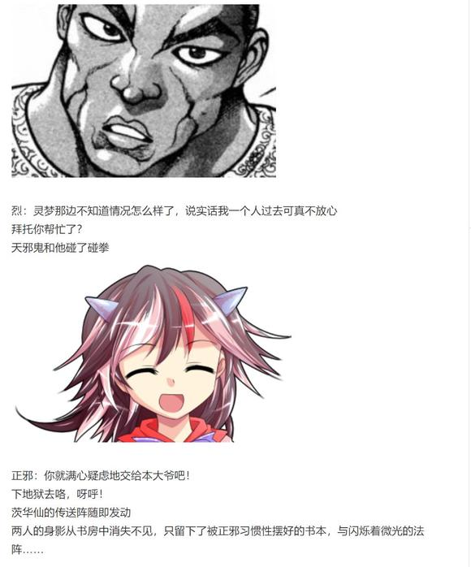
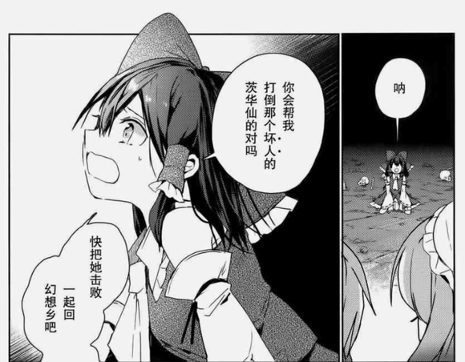
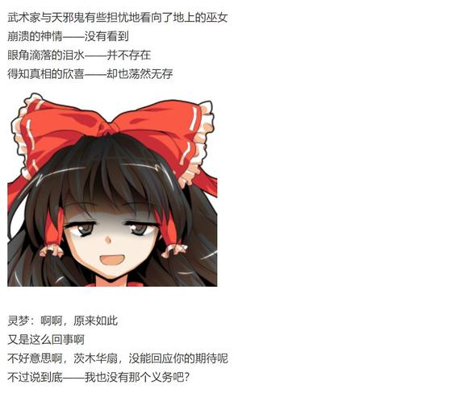

【1d15：7】分钟后，大概听明白了的天邪鬼走向了河边的死神小姐

正邪：呦，小町！

本大爷刚刚得到了一个很劲爆的消息啊

听说你把那个红白巫女的灵魂带走了？

是小町干的吗【1d10：2】（1或10的话真是）

小野冢小町惊讶地张大了嘴

小町：我？带走了灵梦的灵魂？？

为什么啊？

我是三途河摆渡人，负责的只是收钱划船而已啊

正邪的察觉【1d100：4】大失败（30以上察觉没说谎）

大失败是什么【1d10:9】

1 小町终止合作了

2 开战啦

3 1+方向完全错误的情报二号（为啥啊）

4 小町终止合作了

5 开战啦

6 4+正邪：这是针对八云紫的阴谋啊！（为啥啊）

7 小町终止合作了

8 开战啦

9 7+小町：你去三途河里游泳吧！（为啥啊）

10 大成功/大失败【1d2：1】

天邪鬼向着死神做了个鬼脸

正邪：我这只鼻子向来对谎言的味道最为敏感

你在说谎！

小町：啊？

正邪：本大爷对你的能力可是一头雾水

寻常的墙壁或是结界对你们死神而言就跟摆设差不多

借助自身的先天优势，你在昨天晚上神不知鬼不觉地溜进了博丽神社，就这样偷走了巫女的灵魂，然后悄悄运到地狱里去了

而这一切都是那个地藏的阴谋！没错，是她为了侵略幻想乡而做出的第一步——排除最麻烦的巫女！

只可惜，这个计划在第一天就被爷所识破了！

如何啊，我名侦探鬼人正邪的推理！

得意洋洋的天邪鬼用手指着死神完成了他的侦探宣言

小町：名侦探鬼人正邪小姐

你还是先去河里冷静一下吧！

“扑通”！

刚刚还在岸边的正邪下一秒就落进了三途河里

气鼓鼓的敬业死神划着船离去了……

正邪的游泳技术【1d50：31】（30以上没事，大失败-50）

正邪：没想到吧，爷会游泳！

哈哈哈哈哈哈！

黑发的天邪鬼以勉强算得上是标准的自由泳姿游上了岸，而后在武术家一脸绝望的眼神中叉着腰大笑了起来

烈海王要做什么【1d10：6】

1 先回神社集合吧

2 带正邪先回辉针城吧

3 去找四季投诉吧（为啥啊）

4 先回神社集合吧

5 带正邪先回辉针城吧

6 去追小町吧！（为啥啊）

7 先回神社集合吧

8 带正邪先回辉针城吧

9 继续调查，下一站旧地狱！（为啥啊）

10 大成功/大失败【1d2：2】

烈：小町小姐，还请您等一下！

我这边还有事情想打听——

正邪：我们上！不能让她跑了！

烈与正邪的追踪【1d100：49】（50以上成功）

“马上就能追上她了！”

武术家与天邪鬼抱着这样的想法折腾了半天，却连小船的影子都没看到，最终无奈放弃了

正邪：呼……呼……

累死爷了，没想到她跑的这么慢

我就说这死神有问题吧！

烈的相信【1d100：25】（50以上相信正邪的推理）

烈：我觉得四季小姐没理由派下属来捉弄灵梦

她每天工作量大到都犯胃病了，最近地狱又乱的出奇

光是手头的事都办不完了，她这么严肃认真的人又怎么会来策划阴谋呢？

正邪：啊？

本大爷难得感觉灵光一闪怎么结果还对了呢

浑身湿透的天邪鬼失望地嘟囔了几句

嗯……说起来正邪你掉河里了是吧

无关紧要的骰子，过个连衣裙的质量吧

【1d100：3】大失败

草，质量大失败是啥啊【1d10:1】

1 堂堂感冒

2 当场发烧

3 掉色了！（你这什么破衣服啊）

4 堂堂感冒

5 当场发烧

6 全没了！（你这到底什么破衣服啊）

7 堂堂感冒

8 当场发烧

9 恼羞成怒，当场开战！（你是小女孩吗？）

10 大成功/大失败【1d2：1】

烈：对了正邪，你刚刚掉河里没着凉吧？

彻底放弃的武术家转头看向了身旁的好友

而后，何止贴身基本上已经全透的天邪鬼映入了他的眼帘

正邪：啊嚏！

爷好像感冒了，怎么这么冷啊

烈海王绝望地闭上了双眼

他立刻把上衣脱了下来，并一把罩在了朋友身上

其动作之敏捷，速度之迅疾，甚至产生了突破空气的音爆！

烈：——全透了，下次买件防水的吧！

正邪的慌张【1d100：42】

正邪：哦哟，吓我一跳

没办法的吧这是连衣裙！

本大爷哪能想到有一天会穿着这身衣服下河游泳啊？

那啥，外套多谢了

烈：幸亏我里面还穿了件背心，这要是光着膀子就真成变态大叔了

针妙丸：居然是，泳装？！

而且还是死库水？！！

天子：——何等高难度的装傻！

能做到吗，烈海王？

烈的吐槽【1d100：39】（75以上成功）

武术家面色扭曲地抱住了头

烈：我做不到啊！

这我真的吐不出槽来了！！！

说起来正邪你是

【1d2：1】

1 认真的

2 故意搞笑

草草草草草

烈与正邪要做什么【1d10:1】

1 回神社集合吧

2 1+路上尝试收集其他情报吧

3 去人里买衣服吧（你干点正事行吗）

4 回神社集合吧

5 4+路上尝试收集其他情报吧

6 魔理沙：灵梦不见了！（好快！）

7 回神社集合吧

8 7+路上尝试收集其他情报吧

9 这里就拜托幽香的情报（为啥啊）

10 大成功/大失败【1d2：1】

天邪鬼一脸疑惑地歪了歪头

正邪：为什么要吐槽

这个不行吗？

天子：等会你认真的吗？！

为什么你会觉得连体泳装可以穿着出门啊？！！

在此之前你衣柜里会有这种东西我都觉得很奇怪了啊！！

正邪：我也没办法嘛，其他衣服今早全洗了还没干呢

比起那些裙子上全是窟窿的衣服，这件不还挺好的吗？

好，出发吧！

去神社看看那个巫女现在怎么样了！

烈：算我求你了起码把外套穿上再走行吗！

小人族的公主双手合十向武术家行了一礼

针妙丸：不好意思烈先生，我们家正邪又给你添麻烦了

你知道的，她人不坏，只是脑子偶尔有点傻……

穿着背心的武术家与穿着泳装裹着外套的天邪鬼前往神社了

~时间回到烈海王刚刚离开神社的时候~

魔理沙三人的调查【1d10：1】（2-5只发现了战斗的痕迹，6-9得到了额外的情报，1 10随机事件）

随机事件是什么【1d10:2】

1 灵梦提前消失了

2 黑幕提前在正殿设置了陷阱

3 黑幕直接出手了（为啥啦）

4 灵梦提前消失了

5 黑幕提前在正殿设置了陷阱

6 突然来了一大堆人探望灵梦（为啥啦）

7 灵梦提前消失了

8 黑幕提前在正殿设置了陷阱

9 黑幕：我们合作吧！（你在干什么啊？？）

10 大成功/大失败【1d2：1】

魔理沙：正好借此机会搜刮一下灵梦的神社吧~

早苗：除了垃圾和灰尘以外什么都找不到吧

说不定还有发霉的食物？

一行三人说笑着走向了正殿的后方

她们看上去并不多么紧张，因为这里是博丽神社，幻想乡中最安全的地方之一

只是，在博丽的巫女已经昏迷的当下，事情就变得有些不同了

在走入正殿的瞬间，七彩的光球就冲向了她们的面前！

魔理沙的闪避【1d100：96】大成功（75以上成功）

早苗的闪避【1d100：18】失败（75以上成功）

咲夜的闪避【1d50：11+50=61】失败（75以上成功，时停+50）

闪避大成功是什么啊【1d10:8】

1 Atk Hp上升了

2 魔理沙：这手段不是……

3 将陷阱抓住了（为啥啦）

4 Atk Hp上升了

5 魔理沙：这手段不是……

6 锵锵，秘神大人的提示来了（为啥啦）

7 Atk Hp上升了

8 魔理沙：这手段不是……

9 已经有了大概的猜测（为啥啊）

10 大成功/大失败【1d2：1】

毫无准备的巫女与女仆长被当场放倒

而久经磨练的魔法使却惊险地躲过了这突如其来的袭击！

金发小女孩连忙把昏迷不醒的两人拖到了一边，而后回想起了刚刚触发的陷阱

魔理沙：没想到居然在这还有埋伏

没事吧，早苗，咲夜！

啧……不对劲啊

那玩意看上去怎么和茨华仙的手段这么像？

她琢磨了一阵，然后小心翼翼地走向了正殿之中

这一回，提前设置好的触发式陷阱似乎已经被破除了

于是魔理沙看到了散落一地的符咒

与遍布墙壁与地面的可怖抓痕

魔理沙：——这可不妙啊

灵梦她到底遇见什么事了？

~时间回到现在~

烈：我这边进度不怎么样——

魔理沙：神社里面有问题——

于是

只穿着背心的武术家与身穿连体泳装披着外套的天邪鬼，与照看着三位一刷刷躺在一排昏迷不醒的朋友的魔法使碰了面

烈与魔理沙的震惊【1d70：70+30=100】大成功（诡异的情况+30）

绝了，这时候震惊大成功是什么啊【1d10:8】

1 极其高效的信息交换，情况已经基本理解了！

2 博丽灵梦充满了决心！（本次剧情战斗中Atk+10，Hp+2）

3 锵锵，秘神大人的提醒来了（为啥啊）

4 极其高效的信息交换，情况已经基本理解了！

5 博丽灵梦充满了决心！（本次剧情战斗中Atk+10，Hp+2）

6 黑幕看不下去了（为啥啊）

7 极其高效的信息交换，情况已经基本理解了！

8 博丽灵梦充满了决心！（本次剧情战斗中Atk+10，Hp+2）

9 灵梦被惊醒了（真的假的）

10 大成功/大失败【1d2：2】

魔理沙：你 妈 的 我差点被神社里的陷阱打昏过去结果你跑出去都调查了什么啊？？？

雾雨魔理沙用出了一记飞踢！

但是，烈海王躲过去了！

烈：破绽太大了！

正邪：怎么还带点评的，你当这是在上课吗你？

魔理沙：这个穿泳装的天邪鬼又是怎么回事，好可爱！

正邪小姐，我在河童那边有认识的朋友，有兴趣之后来玩漂流吗~

正邪：你丫居然敢找爷搭讪？！

本大爷今儿就先拿你开刀！

极度震惊的三人开始了一通大混战

~与此同时~

~？？？~

博丽巫女的灵魂正虚弱地躺在某个漆黑而无光的空间内

她的眼前似乎浮现出了神社内的场景

灵梦：（这是，大家的影子吗？）

（我又让大家担心了吧……）

红白色的巫女向空无一处的地方伸出了手，似乎想抓住那虚无缥缈的幻影

她集中了精神，想要仔细看清楚眼前的光景——

而后，刚吃干净还没洗的便当盒，身旁躺成一排正打呼噜的巫女与女仆，以及身穿泳衣的天邪鬼与武术家和魔法使边打边骂的混战就清晰地映入了她的眼帘

灵梦：——你们这帮混账给我等着！

等我出去了以后第一个打的就是你们！！我全都记住了一个都别想跑！！！

博丽灵梦一个鲤鱼打挺从地上蹦了起来

此时她一扫之前的颓废，感到自己充满了决心

~【1d15：7】分钟后~

~博丽神社~

冷静下来的三人终于开始了交换情报

魔理沙：——就是这么回事

正殿那边有些很可怖的抓痕，灵梦平常用的那些符咒都被撕碎了

而我们在刚踏入正殿的时候就触发了陷阱，早苗和咲夜当场就中招了

不知道是不是我的错觉，那玩意……

看起来很像茨华仙以前用过的仙术

大侦探思索着目前的情报

烈：（能在神社布下陷阱……这个人要么是实力超群，要么是对神社非常熟悉，茨华仙确实符合这个条件）

（灵梦的身上有地狱的气息……如果是茨木华扇而非茨华仙的话倒也说得通……）

（但是为什么？她有这样做的理由吗？这完全说不通啊？）

魔理沙：（茨木华扇是谁啊？）

（我也觉得茨华仙没理由暗算灵梦啊）

烈：——你先别问这个，我不太好说明

魔理沙，你上次见到茨华仙是什么时候？

魔法使苦思冥想了一阵

魔理沙：得是一周多之前了吧？

我确实是好久没见过她了

烈的推理【1d50：13+50=63】（基本了解情报+50,60以上前去华扇仙府，75以上大概理解计划）

烈：（就算是鬼想杀人的话也不会用这种别扭的法子啊）

我想不通……也许那是茨华仙守护灵梦的手段，却被你误触了？

我先去她的仙府拜访一下看看情况

那地方我以前去过，现在应该还能找着

同行人员【1d3：1】

1 正邪

2 魔理沙

3 只有烈

正邪：啊嚏！

爷跟你一块去吧

你呢，魔法使？

金发小女孩戳了戳昏迷不醒的巫女

魔理沙：我先留下来照顾灵梦吧，没有人在神社看着可不行

调查就交给你了，烈海王

烈的情商【1d100：71】（保底20，50以上提醒喂饭）

烈：没问题

你记得给灵梦喂点吃的啊，就算没有灵魂的话肉体也是会饿的

我看咲夜小姐带的粥就挺好

【1d3：1】小时后

~华扇的仙界~

在妖怪之山的某个角落中，隐藏着一个通往异界的入口

从这隐秘的通道进入之后，就来到了茨华仙人所开辟的仙界

虽然外界已经是秋末，此处却仍旧保持着适宜的温度

仙界处处盛开着鲜花，隐约可见到高耸入云的山川与其上清雅的松柏

茨华仙的住处是仙界之中的一座中国风格的三层小楼

如今，武术家与天邪鬼正站在华扇邸的木质门前

烈：茨华仙您好，我是烈海王

请问您在吗？

灵梦今天突然昏迷过去了，我们想寻求您的帮助！

不出意外，没有任何回应传来

天邪鬼跑去二三层溜达了一圈，而后倒挂在了房檐上

正邪：烈海王，你觉得普通人会给自己的家里设陷阱吗？

还是说这是这帮仙人的怪癖？

烈：以我的经验来看，思维正常的人一般都不会这么做

神子殿下她们平常也只是普通地居住在仙界中，我可没在神灵庙见过陷阱

鬼人正邪一脸嫌弃地甩了甩手

正邪：但这个仙人居然在自己家的窗户上全都设下了封印

爷刚想试试翻窗，结果差点把爷给电麻了

这也太正常了吧？

烈：怎么看都不对劲啊

姑且不论她的动机与目的

但茨华仙跟这次的事件，大概是脱不开干系了

正邪的准备【1d100：95】（75以上带了万宝槌）

使用次数【1d3：2】

黑发少女坏笑着从外套兜里掏出了一个小小的“玩具”

她轻轻一抖，鬼族的秘宝就瞬间在她手中变回了原本的样子

正邪：嘿嘿嘿，幸亏本大爷把针妙丸的宝贝借出来了

这玩意正经战斗的时候没天子那把剑好用，但对付死物可是它的专长——可惜用多了会有副作用，爷只敢用两次

给这破门来一发狠的吧？

烈的决心【1d60：55+40=95】（60以上同意）

武术家默默制造出了赤色的巨剑

烈：（她既是鬼王，又是仙人，同时还是这幻想乡的贤者之一……）

（这样的人如果想认真对付我，我能坚持多久？灵梦又能坚持多久？）

不能再等下去了

责任由我来担，大不了之后和茨华仙赔礼道歉

现在先把这门砸开再说！

烈与正邪的出力【1d100：50】（暴力破解成功标准90，万宝槌-30，双人协作-20，40以上成功，本次未成功的场合使用第二次机会，成功标准降低到30）

超人术加持下的武术家挥剑砍向了门板

烈海王的全力一击并未建功，只是让这物理上的封锁有了些许震动——

找准时机的天邪鬼立刻挥动起了手中的小槌

正邪：好嘞！

小槌——

【你给爷砸烂吧】！

“咚！”

茨华仙所设下的坚固封印，在鬼族的秘宝之力下坚持了数秒

而后，就被连着门板一同被轰成了碎片！

志得意满的天邪鬼小姐哈哈大笑

正邪：爽到，爷早就想试试拆仙人的家了！

啊嚏！

烈：茨华仙大概做梦也想不到，她的家门会被穿泳装的天邪鬼一边打着喷嚏一边用锤子砸开吧

穿着连体泳装的感冒天邪鬼与武术家破门而入后走进了华扇邸

……某种意义上来说真是地狱般的图景

这里过个双方的进度，黑幕高于烈与正邪的场合触发强制事件

黑幕【1d100：79】

烈与正邪【1d100：42】

~与此同时~

~博丽神社~

帮灵梦喂好药、喂了饭、灌了水、顺便梳了个头的金发小女孩终于算是完成了她的任务

魔理沙：累死我了

你俩怎么还睡啊？醒醒起来换个班行吗？

她转身摇了一阵昏迷不醒的两位同伴，总算是让她们醒了过来

早苗：发生什么事了……

哎？灵梦呢？

魔理沙：她不就在旁边——

卧 槽灵梦呢？？？

我刚给她喂了【1d6:3】碗肉粥怎么人突然就没了？？

魔法使转过头，发现本应躺在她身后的巫女如今却突然消失不见了

现场只留下了空无一人的床铺，与三人目瞪口呆的表情

咲夜：你喂了她三碗？

那是我特意做的高能量料理……很顶饱的……

烈与正邪要做什么【1d10:6】（仅一次机会，失败后灵梦无法参战）

1 永远值得信赖的假腿（确定成功）

2 靠我鬼人正邪的能力

3 靠我烈海王的口才（你开玩笑吧）

4 永远值得信赖的假腿（确定成功）

5 靠我鬼人正邪的能力

6 靠我正邪的毒舌（你也开始了？）

7 永远值得信赖的假腿（确定成功）

8 靠我鬼人正邪的能力

9 加油啊，红白色的小姐姐！（你俩搞笑吧）

10 大成功/大失败【1d2：2】

哎呦我的天啊

正邪的毒舌【1d100：55】（50以上成功）

天邪鬼扫了眼地面上被砸出的大坑与周围散落的符咒，便将情况了解了大半

她伸手拦住了准备冲到前方去的搭档，而后在鬼族那诧异的眼光中开了口

正邪：你啊，是鬼吧

真是笑死人了，爷还是第一次见到这么弱的鬼

华扇（鬼臂）：哈啊？

你这可笑的家伙在说什么？

正邪：“一只手臂就足够杀你了”，嘴上说的倒是很威风嘛

然后实际上呢？

光是看着周围这些痕迹都能明白，你也是费了相当一番功夫才做到这点的

装着一副云淡风轻的样子其实自己也没多轻松嘛，本大爷说的没错吧？

粉发的恶鬼并非搭话，而是直接抬手扔了根柱子过去

一言不发的武术家挥拳将其击成了粉碎

黑发的少女抬手拨开了从天而落的碎片

她笑着走向了眼前的鬼王

正邪：所以本大爷才觉得你弱的可笑

天人啊，武者啊，真正的强者我可是见过的

他们会摆着一副高高在上的样子出言嘲笑，也会在干架的时候大言不惭

但是无论胜负如何，在战斗的最后，他们绝对会对自己身前的对手抱有【敬意】！

鬼人正邪向着真正的恶鬼伸出了大拇指——

而后，她抱着一脸不屑的神情将其指向了下方

正邪：你这样的脸，本大爷也很熟悉啊

抱着一点不值一提的小事在那里沾沾自喜，对争斗和对手毫无敬重，甚至在结束的时候还要在这里废话个不停

归根到底——

不过就是个只会恃强凌弱的渣滓罢了，你！

若是对上原本的仙人，这种话语是不会起到任何作用的吧

但是，眼前之人并非山中的贤者，而是地狱里的恶鬼

因此才会暴跳如雷

因此才会怒火中烧

因此，才会浮现出如此前所未有的杀意

茨木童子之臂随手将巫女扔到了一边，而后咆哮着冲向了眼前的妖怪

华扇（鬼臂）：——我要杀了你！！！！

鬼臂的攻击【1d100：34+50=84】（茨木华扇之臂+50）

烈的攻击【1d100：82+65=147】（烈海王+50，神秘杀手+15）

鬼族拥有着人类无法想象的力量

光是握紧手掌就可以制造出破灭般的热量

它们的全力一击更能轻易撕裂大地

是的，武者对此十分清楚

正因对鬼族十分熟悉，他才能够破去对手的含怒一击！

烈：你大可试试看啊，茨木华扇！

一旁的天邪鬼扶起了地上的灵梦

正邪：啊嚏！

怎么样啊你，还能动弹吗？

灵梦：我居然会被穿着泳装的天邪鬼救了一命……感觉像是在做梦一样……

不管怎么说都多谢你了

烈海王！那个家伙不是本体，她应当是茨华仙的右臂！

真正的茨华仙才不是这种恶人！

烈的推理【1d70：4+30=34】（50以上得知华扇在附近，75以上得知计划）

你又推出什么了啊【1d10:10】

1 茨华仙也是恶人（不对啊）

2 你想用鬼臂赚钱吧（啊这确实）

3 你是不是吃多了（为啥啊）

4 茨华仙也是恶人（不对啊）

5 你想用鬼臂赚钱吧（啊这确实）

6 你刚刚大意了（为啥啊）

7 茨华仙也是恶人（不对啊）

8 你想用鬼臂赚钱吧（啊这确实）

9 这盒子是你偶尔捡到的（为啥啊）

10 大成功/大失败【1d2：1】

大成功，回去再骰一遍

烈的推理【1d70：38+30=68】（50以上得知华扇在附近，75以上得知计划）

武术家赶向了巫女身旁，并赶紧为其做起了急救

烈：（按照茨木童子的传说来看，这应当是被武士所斩下的手臂）

（但我却是从茨华仙的书房进来的，她绝不可能对此一无所知）

（这么说来……）

灵梦，小心点！

茨华仙的本体应该就在附近！

“没想到你们的调查速度这么快”

“唉，灵梦……你怎么会被打得毫无还手之力！”

“看你一副这么狼狈的样子，我把肉体带来不就毫无意义了吗”

与武术家的猜测完全相同

与鬼臂所化之人带有完全相同之容貌的仙人，自无间地狱的深处走了出来

灵梦：太好了！

你是好人的茨华仙啊~

这样一来就得救了！

华扇的信任【1d100：5】（30以上提前透露部分计划，50以上选择联手）

我 的 天 啊

信任大失败是什么【1d10:8】

1 刀片被鬼臂发现了

2 说出了屑发言

3 2+把刀片收起来了（你在想什么啊？）

4 刀片被鬼臂发现了

5 说出了屑发言

6 4+直接交出了主导权（为什么啊）

7 刀片被鬼臂发现了

8 说出了屑发言

9 8+之后将全员排除吧（别这样屑好吗我求求你了）

10 大成功/大失败【1d2：1】

茨华仙失望地摇了摇头

华扇：你的力量就这种程度吗

我花费了如此长的时间进行培养，究竟是为了什么啊？

灵梦

你 真 令 人 失 望

博丽灵梦从来没有想到过，有朝一日她会听到这样的发言

难以置信——不，应该用不可思议来形容

那个茨华仙怎么会说出这样的话来？

灵梦：————

她一时之间甚至说不出任何话来，只能眼睁睁地看着仙人走向了另一个自己

华扇：好久不见，我的搭档！

华扇（鬼臂）：没想到居然是本体自己找上门来了

这下可得好好感谢博丽的巫女了

你可没把我给忘了吧？

茨华仙的演技【1d100：18】（50以下笑出声）

仿佛是看到了什么值得欣慰的事情一般，山中的仙人笑了起来

华扇：哈哈哈哈哈哈

怎么可能把你忘了呢？

她笑着与自己的手臂站在了一起

灵梦的心灵受伤【1d50：20+50=70】（大失败屑发言+50，75以上失去战意）

红白色的巫女呆呆地坐在地上，看着自己最为信任的人之一与邪恶的鬼臂在天空中谈笑风生

她几乎就要失去反抗意识了——

但是，终于为她做完急救的武术家默默将地上的御币捡了起来，并递到了她的手中

于是她总算找回了些许平常心

几乎不抱有一丝期望，她用有些颤抖的声音提出了自己最后的问题

灵梦：呐

你会帮我打倒那个坏人的茨华仙对吗

快把她击败，我们一起回幻想乡吧……

仙人看着巫女叹了口气

她转身，向着另一个自己伸出了那只由绷带所构成的手

华扇：来吧，我的搭档

终究还是找到你了

让我们再次合二为一吧！

烈与正邪的阻止【1d100：90】（75以上有好事发生）

行动结果是【1d10：7】（2-9提前得到刀片，1随机，10阻止合一）

感到不妙的天邪鬼与武术家立刻采取了行动

全力以赴的逆转之能力，令仙人短暂地失去了平衡

而武术家则立刻向其踢出了一击

这次突袭并未成功阻止仙人的行动，但却让某个小小的包裹掉了出来

于是，眼疾手快的武术家得到了某个最为关键的道具——

而她们的行动，也终于完成了

肆意妄为的粉发女子散去了身形，只留下了作为原身的手臂

仙人解除了她那用于代替手臂的绷带，将其中不详的黑气伸向了真正的手

只听一声轻响

她无视了努力抵抗着威压的三人

只是有些不适应地活动着自己的右臂

而后，欣喜地张开了双手

华扇：在下正是，四天王之一，茨木华扇！

我已寻回我的手臂，叫我如何败北！

伴随着似曾相识的压迫感——

伴随着几乎可让人失去意识的恐惧感——

伴随着他们在过去极少数的艰难战斗中所体会过的存在感——

带着肆意而张狂的笑容，真正的鬼王降临了

战斗！

BGM：华狭间的战场——

......

算了算了

BGM：少女绮想曲　～ DreamBattle

~十分唐突的注解环节~

注1：以下出现的部分卡面属于仅此一次的剧情限定，不适合也不应当与过去出现的任何一张人物卡做任何意义上的比较，说实话这场连正常战斗都没法算因此别在意哦

注2：由于鬼华扇没有任何意义上的【正规招式】，因此卡面中的大部分技能都是我看着漫画的表现和根据格斗作中的部分技能写的，而CT7的必杀技则是我自个随便编的，千万别当真

注3：简易Q&amp;A

Q：换句话说？

A：剧情限定战、QTE必杀与流程CG的结合，就是这么回事

Q：我想看那种双方竭尽全力的热血漫战斗！开局就是双方的最强必杀技全力全开，一口气定胜负！

A：那样的话会大概率1T解决战斗因此在本贴的战斗中无法采用

Q：这是死斗吗？

A：我 不 知 道

Q：双方有没有出全力啊？

A：我 不 知 道

Q：我觉得XX没有这么强/XX没有这么弱/这数值不合理/原剧情中不是这样的……

A：你 说 得 对

差不多就这样，总而言之我先提前把大家可能会问的问题先过一遍（笑）

那么，开始战斗环节吧

茨木华扇

Atk 300

Hp 24

独臂有角的仙人：此身已非求道之人。无法使用

奸佞邪智的鬼：如此方为我之真身。

不会受到异常状态的影响，对特殊攻击具有耐性

自身的普通攻击必定造成特大伤害，自身无视所有减伤效果

自身所有技能的回避/破解/防御判定所需成功值+15，除特殊条件外无法对其造成任何伤害

每回合对对手进行一次特殊攻击【威压】：进行一次【1d100】的威压判定，1以上对手本回合无法使用回避/破解/防御，15以上对手本回合无法使用技能，35以上对手本回合无法进行普通攻击，55以上对手本回合战斗自动失败

（面对具有特殊攻击耐性的对手，成功标准值变为10/35/65/90）

石柱乱舞（CT3）：（近战系）利用路边的石柱发起毫不留情的连打，对对手造成【3d3】点伤害

鬼之臂（CT3）：（近战系）抓起敌人后在空中回旋数圈，而后将其扔向地面给予沉重一击。Atk+85，给予伤害X2

亡魂的军势（CT4）：（技巧系）召唤无间地狱中为自己所杀的骷髅，凭借数量的暴力阻止对手的行动。本回合自身无敌，给予伤害+2，对手无法行动

鬼王之真身（CT5）：（自身加持系）吞噬一切向自身所袭来的攻击，3T内自身受到的所有伤害变为1/3，ATK+85

必杀技

破灭的辉光（CT6）无法回避/破解/防御，Atk+750，给予伤害X4

四天王奥义【三步绝灭】（CT7）无法回避/破解/防御，本回合自身无敌，Atk+900，给予伤害X5，本回合战斗成功的场合，对手死亡

特殊战斗：

开局时全【技能】CT-3，自身所得到的支援极大幅度增强，CT7必杀技极大幅度增强

总支援如下

鬼切丸的碎片：对阵茨木华扇的场合，自身能够对其造成伤害

充满决心：Atk+10，Hp+2

鬼人正邪的支援：灵梦无法行动或战斗自动失败的场合，可通过使用一次万宝槌跳过该回合，对手受到小伤害/中伤害的场合，仅限两次将其逆转为特大伤害/大伤害

烈海王的支援：1T发动虚假之月，4T发动弹幕地狱，可使用一次急救拳

神秘杀手EX：与古代日本出身的且在历史上留名的知名妖怪或神明战斗时，Atk+10，破解判定所需成功值-5

虚假之月（支援）：3T内对手Atk-40，自身给予伤害X2

无秩序的弹幕地狱（支援）：3T内每回合进行一次【1d100】的混乱判定，10以上对手本回合无法使用技能，30以上对手本回合无法造成伤害，50以上对手本回合战斗自动失败，70以上对手本场战斗自动失败（面对具有特殊攻击耐性的对手，标准值变更为40/60/85/96）

博丽灵梦

Atk：295（255）

Hp：18（16）

技能

博丽的巫女：异变发生时Atk+20，不会陷入异常状态，不会受到驻足，束缚等判定影响，拥有对时停等特殊攻击的耐性，对所有技能均可进行【1d100】的回避判定，50以上成功。自身所受到的所有伤害-2。

神技【天霸风神脚】（CT3）：（近战系）连续使出威力强大的倒挂金钩踢，Atk+75，给予伤害+2

宝具【阴阳鬼神玉】（CT4）：（弹幕系）投掷巨大的阴阳玉，对对手造成必中的【3d3】点伤害

神技【八方龙杀阵】（CT4）：（技巧系）以不可思议的力量束缚对手的行动，本回合自身不会受到伤害，给予伤害+3

回灵【梦想封印　侘】（CT5）：（弹幕系）放出大量灵符令其自动追击对手，3T内对手Atk-65，每回合收到3点伤害

必杀技

大结界【博丽弹幕结界】（CT6）：制造没有境界的世界，营造二重的结界。Atk+700，造成伤害X4

无限【梦想封印】（CT7）：最强最棒的异变解决巫女！无法回避/破解/防御，Atk+800，给予伤害X5，3T内自身无视所有特殊攻击，3T内每回合开始时进行一次特殊攻击【封印】：进行一次【1d100】的封印判定，对妖怪成功值标准30，对妖怪以外的对手成功值标准为50，判定成功的场合，本回合对手无法使用技能/必杀技、无法进行普通攻击、无法造成任何伤害。（面对拥有特殊攻击抗性的对手时，成功值变为60/90）

【梦想天生】（CT8）：博丽灵梦的究极奥义，化作无法触及的存在，以阴阳玉自动攻击对手。无法回避/破解/防御，Atk+900，造成伤害X6，本回合无敌。

T1

威压判定【1d100:59】

灵梦本回合无法使用技能

华扇：气势倒真是很强啊，巫女

可惜，光靠气势的话什么都做不到！

在刚刚就被我差点宰掉的你，就算加上两个杂鱼又能做些什么？！

石柱乱舞发动

奸佞邪智的鬼王随手举起了巨大的石柱，而后像是丢垃圾一般扔向了地面之上的巫女

灵梦的回避【1d100：98】成功

然而，红白色的巫女只是在空中宛如舞蹈般飞过，就躲过了鬼王志在必得的一击

灵梦：真是，毫无美学的战斗方式

鬼之臂发动

华扇：像这样东逃西窜的就是你所谓的美学吗？

我们鬼还是更喜欢简单粗暴而又纯粹的暴力！

带着即可开山裂石的怪力，状态完全的鬼王一把抓向了空中的巫女——

灵梦的回避【1d100：98】成功

仿佛空间被微微扭曲了一般

巫女只是站在原地没有任何动作，但恶鬼的追击却莫名其妙地擦着她的发梢一闪而过

灵梦：鬼退治我已经做过好几次了，这种简单的攻击别想对我起效果

还有就是——

在此支援我的人，可不是什么杂鱼啊！

支援：秘术【天文密葬法】发动

一轮明亮的圆月突兀地在这无间地狱的空中升起

在战斗开始的瞬间，武者就已经发动了学自月之头脑的秘术！

烈：我现在还没办法支持太久，千万——

灵梦的攻击【295+1d100：40=335】

华扇的攻击【300-40+1d100：65=325】

华扇的受伤【1d10:6】

1 回避

2 小伤害X2

3 小伤害X2

4 中伤害X2

5 中伤害X2

6 大伤害X2

7 大伤害X2

8 特大伤害X2

9 特大伤害X2

10 大成功/大失败【1d2：1】

Hp：24-3X2=18

武者担心的话语尚未说完，狂暴的巫女就握着刀片一拳打飞了自己的敌人

她漫不经心地甩了甩自己血流不止的右手，而后看向了地上的队友们

灵梦：怎么了？

正邪：额……千万小心谨慎……？

T2

威压判定【1d100：37】

灵梦本回合无法使用技能

粉发的鬼王看向了自己腹部那深深的伤口

华扇：不错啊，看来无论是我还是本体都太小看你了

那么，该用什么对付你呢~

她像是戳破果冻一般将手插入了地面里，而后随手掏出了一个惨白色的骷髅头

华扇：找到了，找到了

地狱之中可是有我无数奴仆存在的！

亡魂的军势发动

华扇手中的白骨一阵吱嘎作响，数不尽数的尸骸便从地底深处破土而出

鬼王所召唤的亡灵大军自四面八方封锁了巫女的退路

而后，她将手中的头颅向着高空抛去——

仅有头骨所构成的惨白色之天灾，就这样向着下方的灵梦扑来

地狱的地面之上被砸出了一个巨大的坑洞，而红白色的巫女早已不知所踪！

华扇：忘记提醒你了

这些骷髅全都是被我所吃掉的家伙的尸骨

这下奴仆又增加一个了~

灵梦的回避【1d100：61】成功

“哒，哒”

面无表情的巫女用御币敲了敲恶鬼的后背

灵梦：对着什么都没有的空气自言自语，很有趣吗？

灵梦的攻击【295+1d100：36=331】

华扇的攻击【300-40+1d100：56=315】

华扇的受伤：本回合无敌

茨木华扇立刻以骸骨之墙阻断了巫女的突袭

但她的眼中却仍旧带有一丝惊异

华扇：你，突然就像变了一个人一样啊

灵梦：啊啊，说实话

不管是你，还是真正的茨华仙，对于现在的我来说——

都只是想要暴揍一顿的对象而已！

狂怒的巫女向着恶鬼吼出了自己的心声

正邪（小声）：那可是鬼王哎，强到不可思议的存在.......

巫女是怎么做到看起来比鬼还可怕的……

烈（小声）：她真生气了……

就算是过去面对纯狐女士的时候我都没见过这么生气的灵梦……

T3

威压判定【1d100：91】

灵梦本回合战斗自动失败！

鬼王之真身发动

华扇：哈哈哈哈！不愧是幻想乡的巫女！

本体的想法我总算是明白了

现在的你，的确有着击败我的可能性！

就像是鬼们遇到了好敌手的时候一样，茨木华扇笑着捂住了自己的脸

对于博丽的巫女来说，这是她再熟悉不过的神情了

在间歇泉异变的时候，地底街道的统治者是这般欢笑的

在数年之前的某个夏天的时候，那个小小的鬼王也是这般欢笑的

这是鬼族对于强大对手的认可，也是成为她们友人所必须的前提条件

而在那之后，就是争斗的结束与寻酒作乐的邀请

灵梦：茨华仙，我——

她仿佛看到了自己熟悉的友人也即将做出这样的举动

仿佛在下一秒中，就能像过去一样再次和好如初

华扇：正因如此

我才要不留一丝余地地干掉你

然而，她所等到的不是对方热情的邀请

而是忽然暴涨的威压，与她冰冷而无情的双瞳

在那虚假月光的照耀之下，奸佞邪智的鬼王毫不留情地将对手压制在了地上

茨木华扇举起了她的右拳——

鬼人正邪的支援发动

“咚！”

鬼王的身躯突然猛地变为了幼童大小

不应出现的破绽被送到了巫女身前，博丽灵梦即刻躲开了这必杀的一击！！

正邪：这玩意用多了爷也要完蛋，这是最后一次了！

你自己注意着点，巫女！

灵梦：多谢了

我不会再中计了

T4

支援：秘术【天文密葬法】效果结束

支援：【无规则的弹幕地狱】发动

混乱判定【1d100：68】

华扇本回合无法使用技能

威压判定【1d100：49】

灵梦本回合无法使用技能

天空之上那虚假的月光终于散去

而武术家所奋力用出的第二轮支援则在此刻到来

单调乏味而又无限重复的旋律自虚空之中响起

七彩斑斓的光芒忽然间照耀在了这片虚无的大地之上！

灵梦：？！

这不是摩多罗隐岐奈的招数吗？！

武术家擦了把头上的汗

烈：对，没错，但是我现在控制不好这招！

如果把这玩意用来攻击的话很可能会伤到你，因此只能做干扰效果了——

抓紧机会快上，我用不了多久！

灵梦的攻击【295+1d100：63=358】

华扇的攻击【300+85+1d100：65=450】

灵梦的受伤【1d10:8】（华扇的攻击必定造成特大伤害，且无视所有减伤效果）

1 回避

2 特大伤害

3 特大伤害

4 特大伤害

5 特大伤害

6 特大伤害

7 特大伤害

8 特大伤害

9 特大伤害

10 大成功/大失败【1d2：2】

Hp：18-4=14

仅能使用刀片造成伤害，在无形之中就限制了灵梦的攻击手段

御币与符纸完全无用，道术又因对手的威压而无法用出，于是接近战成了目前唯一的出路——

然而，认真起来的茨木华扇只是用手中的石柱随手一挥

巫女便从高空之中被一口气砸到了两人的身旁！

华扇：你不会真的以为

没有秘术支援的你，能够靠近我吧？

烈：灵梦，别跟她拼近战！

巫女趴在地上吐了口血

灵梦：咳……

用碎片当做弹幕射击风险太大

只有一次机会……现在还不到时候

T5

混乱判定【1d100：41】

华扇本回合无法使用技能

威压判定【1d100：65】

灵梦本回合无法进行普通攻击

茨木华扇痛苦地捂住了头

她的脑中似乎出现了些奇特而不连续的画面

形似昆虫的怪异之神、在烟气中翩翩起舞的孩童、雕像前歌唱着的狂乱的人们、猿猴之面具，衣着华丽的女子与滑稽而荒诞的鼓声

还有那于暗中不断开合着的、布满铜锈的青色大门

他们、她们、它们、祂们永无止境地向她诉说着毫无意义的单调言辞——

“I'a I'a Matara Okina……”

“I'a I'a Matara Okina……”

华扇：隐岐奈！你这恶趣味的自恋混账邪神！！

茫然无知的天邪鬼看向了身边同样一脸扭曲的友人

正邪：她怎么突然发疯了？

烈：别提了，我也听着呢！

再用下去我也得疯！

灵梦，快点！

红白色的巫女将手中的刀片高高抛起

灵梦：没法近身也没有关系——

就用这招一口气封印你！

接招

宝具【阴阳鬼神玉】

神技【八方龙杀阵】

回灵【梦想封印　侘】！

抓住对方陷入混乱的刹那时机，博丽的巫女终于用出了自己最为得意的招式

以赤色的结界限制对手的行动

用巨大的阴阳玉遮蔽恶鬼的视野

最后，以这几乎照亮了无间地狱的七彩光芒轰向了那头顶双角的妖邪！

华扇的受伤

宝具【3d3：8/3=2】

回灵：3/3=1

Hp：18-1-2=15

灵梦神色凝重地收回了混入其中的碎片

耀眼的光辉与爆炸后的烟尘一同散去

近乎毫发无伤的鬼王从中走了出来

华扇的攻击：本回合灵梦无法进行普通攻击，自动成功

灵梦的受伤：本回合无敌

她瞬间便跨越了百米以上的距离，将灵梦用以护身的结界一拳击成了碎片！

华扇：这场烟花，也只是给我挠痒痒而已

就这种程度还想封印我？

别让我笑掉大牙了！

灵梦：果然，就算有了比之前更强的力量，你也只是条胳膊而已

茨华仙才不会说出这种杂鱼一样的发言呢！

正邪（小声）：茨华仙本人刚刚说的比这好听多了吧？

烈（小声）：骂人也是有段位的，茨华仙本体比她的胳膊厉害，这很合理

T6

鬼王之真身 效果结束

混乱判定【1d100：38】

失败

威压判定【1d100：18】

灵梦本回合无法回避

头顶双角的鬼王舒适地转了转头

华扇：从开始到现在为止，就从未停歇的阻挠……

月之民的秘术、我等鬼族的秘宝、还有隐岐奈的古怪仪式……

终于，总算是全部都结束了

——没人能够救你了

去死吧，博丽的巫女！

石柱乱舞发动

灵梦的受伤【3d3：4】

Hp：14-4=10

在恶鬼的威压之下，出于身为人类的本能——

博丽灵梦无法像先前那样做出灵活的动作了

她竭尽全力做出了回避，但却依旧付出了代价

仅仅是被鬼王的攻击蹭到了些许，她的左手便已经无力地垂下

但巫女却只是讥讽地看向了眼前的敌人

灵梦：你似乎搞错了什么啊

该不会，你到现在都还觉得——

自己还有所谓“获胜的可能性”吧？

神技【天霸风神脚】发动

大结界【博丽弹幕结界】发动

华扇：尽管在嘴上逞威风吧

这就是你最后的遗言了！

鬼之臂 发动

破灭的辉光 发动

不详的赤色之力在茨木华扇的右臂之中凝聚

像是大妖怪们最喜欢做的那样，像是身为仙人的自己也曾使用过的招式一样——

她将自身的魔力压缩到了极点，而后向着巫女的结界轰出了带来破灭的辉光！

灵梦的攻击【295+700+75+1d100：3=1073】

华扇的攻击【305+750+85-65+1d100：41=1116】

灵梦的受伤【1d10:1】

1 特大伤害X2

2 特大伤害X4

3 特大伤害X4

4 特大伤害X4

5 特大伤害X4

6 特大伤害X4

7 特大伤害X4

8 特大伤害X4

9 特大伤害X4

10 大成功/大失败【1d2：1】

Hp：10-4X2=2

名为茨木华扇的鬼王对自己的实力有着绝对的自信

即使在纯粹的力量上比不过自己的某位友人，区区人类也不可能逃出她的掌中

但是，为何会出现现在的情况？

“左臂彻底断了，真麻烦”

“骨头大概也折了不少，内脏……大出血了吧”

“这回去得住院了，魔理沙会笑话我的”

已经处于无力状态的武术家刚想冲出去救援友人，却看到了对方向自己所做的手势

于是他沉默着坐了下来，并一同拉住了身旁的天邪鬼

正邪：你搞什么？

在这么下去巫女就要死了！

烈：灵梦有她的想法

我们现在过去反而可能帮不到太多……

再等等看吧

那个巫女活下来了，这并不算意料之外的事情

真正令她疑惑的是对方脸上的神情

看不到亲近，却也看不到恐惧

看不到友善，却也看不到敌意

即使身处无间地狱，即使面对着绝无可能战胜的敌人——

博丽灵梦也只是像平时一样站在那里

华扇：你在想什么？

巫女并未回答她的问题，只是漫不经心地打量着手中的碎片

灵梦：连这都无法理解吗？

所以我才说

你啊，也就这种程度了

T7

她用右手将那份仙人的赠礼高高举起

七彩的光芒在她身后一一浮现，照亮了巫女脸上那坚毅的神情

灵梦：茨华仙才不会像你一样满口都是废话

真正的鬼也不会没用到你这个程度

说到底，就算力量再强，你不过就是条手臂而已！

想要吓唬人的话，还是乖乖去找手无寸铁的幼童吧！

你以为我这都是第几次降服鬼了？！

接招，【梦想封印】！

威压判定：由于梦想封印的效果自动失败

封印判定【1d100:93】成功！

对于茨木华扇来讲，这本应是可以轻易弹开的攻击

但是，那个巫女没有给自己和对手留下任何一条退路

她就这样光明正大地将鬼切丸的碎片送入了耀眼的光辉之中

于是——

仅此一次的对茨木华扇必杀武器，就此完成！

华扇：打算一击制胜吗，博丽的巫女

那就来吧！

让我看看你的觉悟！

灵梦：就算不用这种东西我也能干掉你

我可是，最强最棒的异变解决巫女，博丽灵梦！

灵梦的攻击【295+800+1d100:43=1138】

华扇的受伤【1d10：1】

1 小伤害X3

2 小伤害X5

3 小伤害X5

4 中伤害X5

5 中伤害X5

6 大伤害X5

7 大伤害X5

8 特大伤害X5

9 特大伤害X5

10 大成功/大失败【1d2：1】

鬼切丸的碎片擦着鬼王的脸颊飞过了

她触碰着脸上的伤痕，并舔舐着流到嘴角的鲜血

她渐渐长大了嘴角

简直像是看到了世间最为荒诞的喜剧一般

茨木华扇捂着肚子大笑了起来

华扇：哈哈哈哈哈哈哈！

哈哈哈哈哈哈哈哈哈哈！

啊……不行了不行了，我的肚子都痛起来了

赌上了自己所有的一切，最后居然得到了这般徒劳无功的结果！

博丽的巫女啊，你最后的挣扎也彻底失败了！

灵梦：这可不好说啊~

喂，天邪鬼

你的老本行还没生疏吧？

鬼人正邪的支援发动

鬼人正邪的支援：对手受到小伤害/中伤害的场合，仅限两次将其逆转为特大伤害/大伤害

正邪：哟，奸佞邪智的鬼

这是爷送你的最后一句话哦

下地狱去吧！

天邪鬼向下伸出了她的大拇指

与此同时，刚刚与鬼王擦肩而过的脆皮极其突兀的逆转了方向

在茨木华扇那不敢置信的眼神中

鬼切丸的碎片，就这样穿透了她的胸膛

Hp：15-4X5=0

烈：就像灵梦所说的一样

就算力量再强，你也并不是茨木华扇本人

而只不过是她的一条手臂而已

灵梦：茨华仙可不会中这种简单的陷阱

所以我才会说啊——你，也就这种程度了

再见了，鬼之臂

她看着“茨木华扇”逐渐化为了碎片，消逝在了这无间地狱之中

博丽灵梦捡起了那逐渐变得干枯的手臂，将其塞进了木盒里

而后回头，走向了自己身后的朋友

战斗结束

胜者 博丽灵梦 烈海王 鬼人正邪！

