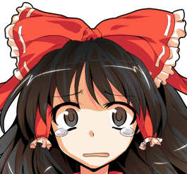
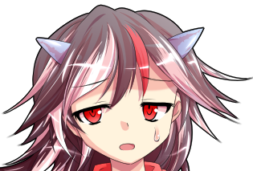
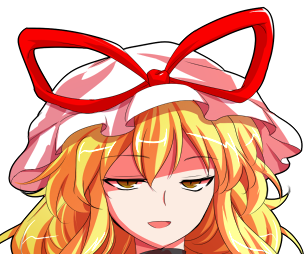
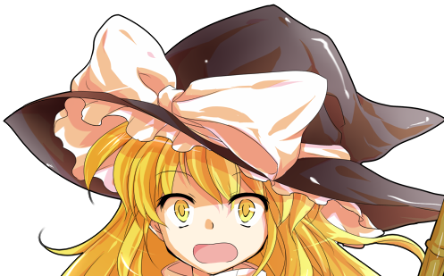
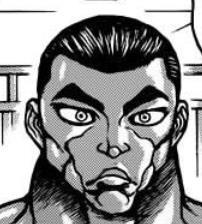
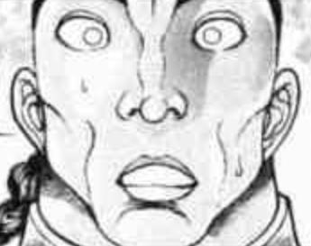

粉发的仙人思考了一阵

华扇：嗯……

我大费周章地利用你来将我打倒的原因你已经知道了，那也就没什么好说的了

真是的，我的计划差点就失败了，你之后可要继续好好修行啊

博丽灵梦慢慢低下了头

这样一来，山中的仙人就看不见她的表情了

华扇：啊，这只手臂就先借给你用来当展出时的用品——

灵梦：这么危险的东西可不能拿给大家看呢

你把它收好吧，茨华仙

以后可千万别把它再搞丢了！

我先去永远亭做诊察了！

她打断了对方唠唠叨叨的言语，把手臂还给了它原本的主人

博丽灵梦像平日一样笑着告别了茨木华扇，而后走向了神社之外的朋友们

只留下独臂的鬼在神社中奇怪地歪着头

华扇：……今天的灵梦好奇怪啊？

【1d60：42】分钟后

~永远亭的医务室~

被捆成粽子的博丽灵梦正眼泪汪汪地看着眼前的大夫

灵梦：呜呜呜，永琳

住院费这方面，呜呜呜，能不能通融一下？

永琳的良心【1d100：45】（原标准50成功，真哭了-20，现成功标准30）

师匠：灵梦小姐，你这伤势起码要治疗【1d4：4】个星期哎

虽然住院不会这么多天，但日常的护理也还是少不了的

一天两天也就算了一个月的医疗费用实在是——

哎，怎么还真哭了呢……

好了好了给你免单，给你免单行吧？别哭了好吗？

正邪：大夫，爷好像感冒了，有感冒药吗？

月之头脑一脸无奈地看着身穿连体泳装的天邪鬼

师匠：你穿这身出门怎么可能不感冒呢？

感冒药【1d100：85X10=850】一份

正邪：呜啊好便宜

这什么良心医院啊……

哭丧着脸的天邪鬼在师匠的威压下乖乖地掏了腰包

银发女子看着眼前这离奇的场景，将恋人悄悄带到了门外

师匠：你们这是跑地狱去干什么了？

就算是当时跟纯狐打的时候，灵梦也没有伤的这样重啊

烈：唉，这事怎么说呢

涉及人家的个人隐私

永琳，你对于茨华仙的事情有了解吗？

永琳的情报【1d50：8+50=58】（75以上知道华扇的真身，月之头脑+50）

师匠：与其说有没有了解

我跟她几乎就只见过一两面而已啊

是个挺厉害的仙人，这样的感觉

烈海王无奈地挠了挠头

烈：是吧……我觉得大家都是这样想的

说实话这事跟咱们真的是一点关系都没有，等我一会琢磨琢磨怎么在不泄露个人隐私的情况下跟大家大概说说这事啊

我跟朋友有约定，具体的就先算了，可以吗？

师匠：当然，没问题

说到底幻想乡中大部分的事件，我其实都不怎么关心的~

烈：多谢理解了，永琳

我先带灵梦散步去了

今天有点不太痛快，晚上出去喝点酒

【1d20：4】分钟后

武术家与天邪鬼推着轮椅上的巫女在竹林间溜达了起来

灵梦：嗯，那个……

今天真是多谢你们了

说实话，我一个人在那地方很害怕的

正邪：爷是一点都没看出来

你这巫女干架的时候比鬼还可怕，本大爷以后可是不敢招惹你

灵梦：说什么呢你这个穿泳衣下地狱的笨蛋天邪鬼！

明明今天说的话做的事情都很帅气但配上你这一身衣服就都全毁了啊！

我当时被掐着脖子都差点笑出声来！

在笑闹声平息之后，永远亭的武术家想了想，问出了他的问题

烈：茨华仙人她有说些什么吗？

灵梦：有啊，和之前差不多的话吧

不过

为什么她会知道那只手臂就在神社

为什么她要在神社中布下陷阱

为什么明明有更好的办法，她却要做出这么麻烦的事情

这些事情，她统统都没有讲

轮椅上的巫女沉默着看向了竹叶间的天空

灵梦：她甚至不愿意在这个可笑的计划开始前，提前跟我说上哪怕一句话

泪水已经在刚刚的时候偷偷流过了

因此现在，她的脸上还是与平常一样的表情

鬼人正邪想说些什么好听的话，亦或者是些发人深省的道理

但她是天邪鬼，她说不出这般许多

最终，她只得无奈地拍了拍巫女的肩膀

正邪：魔法使啊，山上的巫女啊，女仆啊，还有旁边这家伙啊

本大爷也勉强算是一个吧……

你的朋友不还多的是吗

烈：你看这次你一出事，大家就都急匆匆地赶来了

说明在乎你的人还有很多的

所以，啊，那啥......

不善言辞的两人统统卡死了

红白色的巫女看着他们绞尽脑汁、咬牙切齿来安慰自己的样子，噗嗤一声笑出了声

灵梦：哈哈哈哈哈哈！

你们两个不去接着做艺人真是太可惜了，不考虑接着报名年末的大赛吗？

不必担心，我一向是没所谓的！

她催促着朋友们调转了轮椅的方向，而后走向了永远亭那温暖而熟悉的病床

就这样

有关于巫女、仙人与鬼的故事

在这个秋天的末尾，告一段落

~第668天夜晚~

~旧地狱~

武术家正和挚友说着今天的事情

烈：——差不多就是这么回事吧

师匠他们不知道茨华仙的真身，我也不好跟他们讲

但我心中总有些不太舒服，思来想去也只能来找你蹭顿酒喝了

金发独角的鬼王若有所思地晃悠着她手中的酒瓶子

勇仪：喂，烈

这么说来的话，你应该见过华扇那招了吧？

我……

烈海王伸手接过了鬼王手中的酒

烈：我的挚友之一在初次见面的时候就吃掉了我的腿，当时我准备把整个身体都送他来着

我另一位挚友是位混黑道的老大，他过去说自己年轻时出手不知轻重，甚至将人活活打废过

名为铎尔的死囚犯过去曾与我战斗过一场，我那时下手极重，将他打成了重伤

此后我被人所偷袭了，他拖着重伤的身躯看守了我一夜，最后我背着他去的医院

所有人都有过去……但我只看他们现在待我如何

其余琐事，我没什么所谓

怪力乱神的鬼伸出了手，想要像过去一样亲近自己的朋友

她有些犹豫，似乎想收回自己的动作——

但看着友人脸上那与平常没有一丝不同的神情，便消除了自己的顾虑

于是，星熊勇仪像过去一样笑着搂住了他

勇仪：——多谢了，烈！

烈：你手臂上的锁链，之前用过的招式……

过去发生过什么事情我心里当然也有猜测

但这些都没所谓，我并不关心这么许多

勇仪：我还以为你是专门来找我说这个来着

那又是什么让你这么烦闷？

武术家给自己倒了杯酒

烈：我没法理解茨华仙的思维

她的出身有什么很不好说明的吗？

她到底相不相信灵梦啊？

她是为什么才想当仙人的？

提前和灵梦说一声，难不成会发生什么大变故吗？

如果今天我和正邪没赶到那个地方，单靠灵梦是真的很有可能死在那里的！

他缓缓喝着杯中的烈酒，而后看向了身旁的友人

勇仪：我哪知道？

我和萃香从始至终都是个鬼

但华扇……怎么说呢

你有没有断过胳膊的朋友？

烈：我还真有

那是位极有天赋，且人品极好的空手道家

勇仪：啊，就拿你这朋友打比方吧

假如这位空手道家断臂之后，忽然性情大变

他决定改头换面了，以后不练空手道了，转而去练拳击或者摔跤

你怎么想？

烈：绝不可能

克巳过去曾经是有过这段时期，但他早已成长了

上次出去的时候还特意确认过，他的独臂空手道已经大成了！

勇仪：我说如果嘛

武术家沉默了一阵

烈：我无法理解

但是大家终究还是朋友

勇仪：是吧？

所以我也无法理解华扇在干什么

但就像你说的，大家终究还是朋友啊......

武术家和鬼王碰了碰杯

他们将杯中之物一饮而尽，随后继续探讨着关于鬼与朋友的话题……

（本日的更新结束，下一次的更新在周四或周五，是日常回）

（以下是我的废话）

那么本次的异变回终于结束了

各种意义上都是完全非常规的一次异变，简直比堇子梦日记那次还要过分实在是过草

前半段完全就是搞笑活动！

说真的正邪你是个搞笑角色吧！到底是怎么做到每一个骰子都拉胯的啊？！！

鬼人正邪的名推理！

天邪鬼在三途河里游泳哎！

她认真换上了连体泳装就这么出门了！

这 都 啥 啊

小町提前退场导致不得不想办法开门，因此才过了万宝槌的骰子

从这个骰子开始正邪又给力起来了，你是那种平时很搞笑关键时刻非常靠谱的大叔角色吗草

很想让天子c一把但两次机会都没中，天子啊哎.......

最终战大家应该能看出来是有调整的

但调整对象不是华扇，是灵梦，因为这个鬼华扇本来是个双人战boss的

但我觉得这场的氛围实在不适合让烈师傅上了就过了个怒气骰子

大暴怒实在是过草

但也实在是可以理解因此更草了

灵梦的CT7和烈的支援就是战斗之前临时调整而得来的结果

毕竟不靠支援拿着原卡面单人挑战基本没戏啊（悲）

哎呦喂......华扇啊......

之前我和朋友们聊天的时候也提到过，茨歌仙最后这一段剧情是有很多种解读方式的，具体不在此详细论述，有兴趣的吧友们也可以去看看漫画的剧情

说实话，我个人偏向相对负面的解读

但是考虑到本贴一直以来的氛围，在这种欢乐的气氛中突然来个原作华扇那其实真的是很过分的——

因此我特意给了那个骰子，当时的计划是过了之后就用万能的万宝槌当理由来解决不合体的问题

这样不合体也能圆过去，平时的感觉也能回来，华扇的正面形象能体现，唯一的问题不过是大家都已经习惯的速通而已

然后她大失败了（悲）

我的天啊......

实在是硬着头皮打完了最终战赶紧给华扇再过一个骰子，同样是30以上就能过的那种

这次翻倍了，出了10（笑）

说真的我做梦都没想到我能骰出比原作还过分的华扇啊！！！！！！

我连洗白剧本都准备好了怎么两个机会就都没过呢，你怎么做到的啊华扇？！！！

真的连我都无言以对了

彩蛋会补充一下相关剧情，灵梦绝对不会自闭的大家大可放心（悲）

那么骰子明天发

本次的更新到此结束，下一次的更新在周四或周五，内容是日常回

回顾了一下发现本战记错效果等bug大概是本贴有史以来最多的一次，差不多都要超越天子战了，我有在严肃反省了(正色)

原因在于这次实在过于离谱导致不得不临时调整机制，另外一个最重要的原因在于最近实在太忙导致这场是一个下午赶出来的，被机制打的实在是头昏脑涨了(悲)

另外，之后彩蛋会补充相关的剧情，因此大家先别着急，起码等我明天下了课嘛(

附上本次的骰子

前面有一段骰子被吞了，应该是是换完泳装后回神社那里的剧情，其他我应该都有截到（悲）

~彩蛋~

~为什么？~

~华扇的仙界~

自外界归来的仙人再次用绷带代替了自己空无一物的右臂

此时此刻，她正满脸黑线地看着自己家那被砸得粉碎的大门

华扇：我的天哪

亏我还特意设下了封印

他们到底做了什么啊……

粉发的仙人叹了口气，准备稍后再整理自己的居所

她忽然感受到了一股怪异的气息，便回头看向了自己的身后

紫：恭喜你啊，茨木华扇

你终于找回了自己的手臂呢

幻想乡的妖怪贤者从她那招牌性的暗色隙间中走了出来

华扇：什么嘛，是紫啊

你会特意来找我，还真是难得

大妖怪装模作样地摆出了一副受伤的表情

紫：次次都这样，我好伤心~

以前的时候也是

前脚和我聊得好好的，后脚一看到灵梦来了马上就自己溜走了

害得我那次平白无故地被挨了顿打，明明我出的力才是最多的呢

华扇：那次是为了不引起灵梦的怀疑

和你混在一起的话影响可是很糟糕的

我可是仙人啊

紫：“影响很差”，嘛，的确就是这么回事

毕竟你连萃香都躲着呢

可是这样一来，我就有了一些想不明白的地方

你可是很注重在灵梦面前的形象的

既然如此，为什么要让她在毫无准备的情况下，面对大变了一番模样的你呢？

隙间妖怪转起了手中的阳伞，并等待着她的回复

茨华仙的理由是【1d10：6】

1 没有那个必要

2 信任灵梦的实力

3 这是一场试炼，一场来自过去的试炼（为啥啊）

4 没有那个必要

5 信任灵梦的实力

6 工具人巫女（为啥啊）

7 没有那个必要

8 信任灵梦的实力

9 茨木华扇流的单人期末考试！（为啥啊）

10 大成功/大失败【1d2：1】

粉发的仙人面色古怪地看着她对面的贤者

华扇：为什么要让她提前知道？

这样一来的话，计划的成功率可是会大大降低的

八云紫的双眼眯了起来

紫：愿闻其详？

华扇：很简单的道理啊

灵梦在知道了我是鬼之后，就很有可能选择第一时间出手退治我

当然她是不可能成功的……

但在这份关系破裂之后，就没人能帮我封印手臂了

这可不行，谁知道再过多久，我才能等到下一个博丽灵梦呢？

阳伞的旋转似乎变快了一些

紫：看你天天和她待在一起

我还以为，你是很信任她的

茨华仙平和地笑了笑

不知为何，此刻她脸上的表情竟与身为恶鬼的时候有着些许相似

华扇：怎么能将自己的希望寄托在虚无缥缈的信任之上？

在无间地狱依靠我提供的碎片将恶鬼杀死，然后平安无事地回到神社

只要按照我的计划一步步来就好

而且归根到底，她本来就不需要知道这些——

这从一开始就是由妖怪们所选出的，巫女的工作啊

八云紫停下了手中的动作

紫：将话说得这般直白可不太好

总要考虑到其他人的感受才是

华扇：？有吗？

解决异变，守护人里，维护幻想乡的平衡，帮助我们解决手头的麻烦

巫女的职责不就是这样？

茨木华扇沉思了片刻，而后坏笑着看向了沉默不语的贤者

华扇：啊——你是要说我冷酷无情吗？

免了吧，紫

你先前策划第二次月面战争的时候，不也让她在月之都待了不少时日吗？

虽说月之民不会杀生，但谁能保证他们不会破例？

那可也是相当“过分”的事情呢

紫的怒气【1d70：47+30=77】（工具人+30，50以上开战，75以上动真格的）

神隐的主犯笑着将伞收进了隙间中

紫：当然，当然

我可没有资格指责你

不好意思废话了这么多，一旦上年纪了就会变的唠叨呢~

啊啊，对了，还有最后一个问题

我一直很好奇，你那亲近人类的行为，你那的所谓【天道】——

是否，是发自真心的呢？

华扇的执着【1d50：49+50=99】大成功（独臂有角的仙人+50,76以上真心喜爱，75以下因为正确而作）

哇！华扇执着大成功！

大成功是什么【1d10:5】

1 彻底斩断了自己身为鬼的一面

2 虽说是工具但也相当在意

3 修复了和灵梦的关系（为啥啊）

4 彻底斩断了自己身为鬼的一面

5 虽说是工具但也相当在意

6 与紫的战斗自动成功（为啥啊）

7 彻底斩断了自己身为鬼的一面

8 虽说是工具但也相当在意

9 取得了仙界的居住权！（为啥啊）

10 大成功/大失败【1d2：1】

茨华仙毫无犹豫地给出了答复

华扇：如果不是因为我从心里认同这条道路，我又为何要成为仙人呢？

保护人类是正确的选择，同时也是因为我发自内心地认同它们

如果这次灵梦真的有所不测，我必然会因此而悲痛万分吧——

但即使如此，我也不会改变计划

因为这比起我个人的情感，要来的更加重要！

今天听到的，没有哪怕一个字是谎话

无论仙人还是鬼都没有吐露谎言的习惯

每一句都发自肺铺

每一句都驻地有声

正因如此，她才会为之而感到愤怒

紫：啊，原来如此

不愧是走在正路之上的仙人

我这种邪道的妖怪可没法指责你……

笑容从贤者的脸上消失了

她身旁的空间逐渐发生了无形的扭曲

狰狞的裂缝在她身旁悄悄开裂，无数不详又妖异的猩红瞳孔从中张开，并看向了另一侧的仙人

紫：抱歉，实在说不下去了

我完全无法理解你扭曲的思维

我根本听不懂你到底在想什么

我要吐了

华扇：紫，你认真的？

境界的妖怪睁开了她的双眼

紫：茨华仙

你 把 我 惹 火 了

无关大义，无关职责

甚至算不上是什么个人积怨

只是出于极为单纯的怒火

没有任何意义的战斗开始了

~探望病人~

紫与华扇的战斗结果是【1d10：1】

1 紫胜利

2 平局

3 华扇胜利（别了吧）

4 紫胜利

5 平局

6 把鬼臂抢过来了（为啥啊）

7 紫胜利

8 平局

9 和稀泥的摩多罗（为啥啊）

10 大成功/大失败【1d2：2】

~永远亭~

~清晨~

如今是霜月的末尾，繁忙的师走之月还未到来

天气逐渐变得寒冷了

若在往常，此刻的他应当仍旧待在那温暖的令人生厌的屋中，看着窗外那缤纷的色彩逐渐凋零吧

不过，如今的他却走在竹林之间的小路上

已经能看到永远亭了，银发的半妖不急不慢地向着前方走去——而后便看到了那位打着阳伞的妖怪少女

霖之助：啊……

早上好，紫小姐

没想到会在这里看到你

紫：我也很意外呢

连出门赏樱花都不愿意的男人，会在这样的季节来到竹林中

道具店的店主举起了手中的包裹

霖之助：姑且还是要过来探望一下的

我不喜欢吵闹的环境

趁着灵梦的朋友们还没过来，索性就早些动身了

紫：真巧，我也一样

说起来，我们初次见面似乎也是这个时间

霖之助：那时已经入冬了，却要比现在还晚些的……

半妖与妖怪说着过去的话题，在竹林中缓步行走着

【1d15：15】分钟后，他们站在了灵梦病房的门口

说起来现在屋里的探病者是【1d10：3】（1-5烈与魔理沙，6-9其余自机，10随机）

烈：魔理沙第一次住院是隔壁的位置，不过后来她就往这房间搬了

主要是因为这里窗户比较近，被人追杀的时候她好跳窗逃跑……

魔理沙：你说这里风景很好会死吗？！非得说实话？！

隙间妖怪听着屋内喧闹的声音，看着银发男子那一脸头疼的表情，坏笑着推开了房门

正捧着大盆胡吃海塞的巫女小姐出现在了她们的眼前

灵梦：哦！

紫，霖之助先生！

永远亭伙食味道超棒哎，还是全免单的！

霖之助：嘶——

你大清早就吃这么油腻的食物？！

这是给病号吃的吗？！

烈：天冷了吃点辣的没啥问题啊

上次魔理沙住院我们还做了烧烤来着

说起来霖之助带的探病礼物是【1d10：2】（1-6自酿酒，7-9书，10随机）

霖之助：我就不该指望你们会有什么常识

给，灵梦

这是上个月我酿的酒

霖之助的酿酒技术【1d100：4】大失败

哇，大失败是什么【1d10:5】

1 超可怕的毒酒

2 极苦的药酒

3 酒味的果冻（怎么做到的）

4 超可怕的毒酒

5 极苦的药酒

6 酒味的冰激凌（你干啥呢）

7 超可怕的毒酒

8 极苦的药酒

9 虽然看上去很糟糕但意外好喝的普通酒（为啥啊）

10 大成功/大失败【1d2：2】

魔理沙：香霖，你给病号送酒也不太靠谱吧？！

话说这玩意撒发着一股子超怪的味道啊它真能喝吗！？

烈：我光闻着味都快吐了……

霖之助：这才是外行人的说法

听好了，酿酒最重要的因素就是酿酒地点所寄宿的神明

这是我上个月特意跑去森林用各种中药所酿造的药酒……

银发的男子习惯性地开始了长篇大论，金发的少女则走到了巫女的身旁

灵梦：我可不想喝这玩意……

话说你的慰问品呢？

不带东西也起码拿点钱来嘛！

紫：啊，糟了

我忘记了！

哎呀，毕竟最近真的太忙了嘛~

灵梦：作为一位天天在被窝里睡懒觉的妖怪，你这话可真有可信度啊

紫：体谅一下上了岁数的人嘛

我刚刚才把某位粉色的贤者小姐暴打了一顿

现在浑身上下可都疼得不行呢

灵梦的震惊【1d100：45】

灵梦：哈啊？！

为什么啊？！

萃香：因为紫一直都很看不惯她吧~

呜哇，这酒好难喝，还是喝我的吧

不知何时出现的鬼尝了口霖之助的药酒，然后一脸嫌弃地把它搬到了一边，随即掏出了自己的酒葫芦

灵梦：所以说你们这帮妖怪真的是！

一个两个都随心所欲的要死！

根本就搞不懂你们在想什么嘛！

红白色的巫女抓狂地看着她身旁嘻嘻哈哈的妖怪

只不过，不知为何

看着身旁这帮不着调的家伙们

她的嘴角也在不知不觉间勾了起来

银发的半妖叹了口气

霖之助：唉

特意挑了大清早的时间过来，没想到又吵闹起来了

烈：话虽如此，你不也没走吗？

魔理沙：你才知道？香霖他就这样的

武术家看着病房内热闹的场景，感到莫名的有些欣慰

他悄悄起身，将空间留给了房间正中的巫女与她的朋友们……

~年龄~

说起来正邪小姐，你现在多大来着？

【1d10:1】

1 普通的三位数（500以下）

2 意外的20代

3 少女（开玩笑吧）

4 普通的三位数（500以下）

5 意外的30代

6 bba等级（为啥啊）

7 普通的三位数（500以下）

8 比较高的三位数

9 贤者级（为啥啊）

10 大成功/大失败【1d2：1】

~辉针城~

烈：说起来正邪，你现在是多大岁数来着？

正邪：？

爷没怎么记，普普通通的几百岁吧

真要说的话爷应该比红魔馆的恶魔们岁数小点

武术家回想了一下芙兰朵露的外貌与表现，将其与天邪鬼对比了一番

烈：——妖怪与妖怪果然不一样啊

正邪：你这不废话吗？

嘿你这么一说爷想起来了嗷，你这刚刚三十的按辈分得管爷叫长辈

来，叫个姐姐听！

烈的厚脸皮【1d100：48】（保底20,75以上照做）

烈：可拉倒吧你，还姐姐呢

叫长辈行啊，以后叫鬼人女士吧？

正邪（正话）：这什么鬼称呼！？

爷在妖怪里是正儿八经的少女好吧，可离那帮bba差远了！

（彩蛋环节结束）

附上彩蛋的骰子（悲）

大家不要因为贴子里骰出来的剧情而对原作的华扇有看法啊！！（悲）

原作华扇最多最多也就是最后那段有点迷惑，但她总体而言还是非常正面体贴亲和人的一个形象，和灵梦关系也蛮好的！茨华仙不是这种屑人的！！！（震声）

哎呦喂，这个骰子里面有三个中性选项（没有必要），三个正面选项（信任实力），两个正面搞笑梗选项，偏偏就中了最糟糕的那个（悲）啊这人设，这之后那个大成功反而让这人设更恐怖了我真的是服了（悲）

大家可以去看看原作漫画或者相关二次创作回一下血！

千万别被本贴骰出来的屑华扇气到啊！

那么我的废话到此结束，感谢大家的理解

~突兀的废话环节以及下次更新的内容调整~

好的，那么，啊，这，又到了我的废话环节

简单明了的一句话概括：下次的更新调整为类似皮克约会后续的特殊日常回，之后再过普通日常

但是呢

【本贴华扇的形象是不会变的】

【我也不会强行写出“你我一笑而过此后仍以姐妹相称”这种扯淡的剧情】

在维持以上剧情结果的情况下，【以一个尽量积极健康向上正能量的剧情为这段剧情收个尾】，才是这个特殊日常的任务——不然一转烈的欢乐日常太突兀了，我也写不动（悲）

那么，以下是我的剧情解析以及写剧情对话时的思路（

可能大家在看最后的一些剧情时会感到有些莫名的烦闷

其实原因在于呢，灵梦和茨华仙本体这次的互动太少了

灵梦的暴怒是向着鬼华扇的，紫的怒气是向着仙人华扇的，但灵梦和仙人华扇本次剧情中却没有太多的交流，只局限与剧情最后的寥寥几句

这就相当别扭了（悲）

与此同时，华扇的出场次数也过于少了，这让很多剧情显得很突兀

这也是我决定加这个特殊日常的原因所在，不然就靠这点彩蛋剧情收个尾会觉得似乎少了些什么，很别扭（

顺便可以和大家提前说一下我的思路

我们的主角烈师傅其实是很不适合掺合进这事里的

这就像boy和勇伯打架的时候，烈海王突然跳出来一句大吼“勇次郎，现在的你很卑鄙！”

啊，那boy不给他一个三角龙拳都算是脾气好，但读者八成是很想给他一个虎王的

因此下一次的更新中烈的戏份不会多，有点像是皮克特殊回中的支援角色们的那种感觉，主要剧情和视角大概会交给灵梦小姐（

再次强调一下，这个已经骰出来的人设是不会变的哦，我也不会写那种很突兀的强行和好的哦（

那么废话环节到此结束，下次的更新会是特殊日常回，内容大概不会很多——

把这段剧情收个尾吧！

顺便一提由于要骰特别日常回所以今天没彩蛋哈，大家不用等(

大概明晚七点半左右更新

由于晚上突然有事，今晚更新推迟到8点(悲)

前情提要

5信任10关心99执着天道，把巫女当工具人但是又对灵梦很有感情的华扇被紫暴打了一顿

~这件事发生在烈海王来到幻想乡的第【668+1d30:7=675】天~

山中的红叶已经落尽，幻想乡的色彩逐渐变得单调起来

灰暗的天空与白色的落雪，构成了这副冬季的画卷

然而，这幻境之中的居民们却并未因此而停止她们的活动

某位精力充沛的妖精迎来了她最为喜爱的季节，最强的冰之琪露诺在各大地区充满自信地挥洒着她的弹幕，虽说绝大部分时候都会毫无意外地输掉，但凭借着自己学来的技巧，却也能偶尔赢上那么几场

白发蓝衣的雪女则享受着冬季这幸福的光景，她随心所欲地降低着自己身侧的温度，增加着积雪的厚度，而后在引**动后被气急败坏的巫女、魔法使、女仆或者月兔退治一通

为了解决这帮莫名活跃的妖怪，不得不出门的少女们也纷纷换上了自己的冬装

她们那绚丽而多彩的衣着，却也给这乏味的冬季平添了一抹亮色

永远亭的武术家并未因寒冷的温度而改变他一成不变的日常

就在这天上午

烈海王接到了自入冬以来的第一件委托

~永远亭~

大侦探正有些好奇地看着病房内正做着伸展运动的巫女

烈：看样子你恢复的不错啊，这么快就不用坐轮椅了

突然叫我过来干啥？

灵梦：你以为我是谁啊？这点小伤算不了什么

嗯，其实也不是什么大不了的事情

——有兴趣接下我的委托吗，大侦探烈海王先生？

烈：？

我倒是无所谓

你想调查什么？

红白色的巫女举起了手指

灵梦：这一次的事件过后，我发现

虽说已经在一起度过了很长的时间，但我其实并不很了解她的事情

因此，我想要调查茨华仙

仙人、鬼、贤者……

无论什么都好，尽可能的收集有关于她的所有情报

可能会稍微有些困难，能做到吗？

烈的理解【1d100：47】（50以上理解灵梦的意图）

烈：真要说的话，我也确实能尝试去搜集情报

但是这些事你自己来调查比我更适合吧？

毕竟我与这位仙人并不是很熟悉

博丽的巫女坏笑着摇了摇头

灵梦：不行啊，我可没时间去做这种细枝末节的工作

如果不从现在就开始准备的话，我又该怎么去完成最重要的任务呢？

武术家看着巫女不断重复着的康复训练，脑中突然出现了些许奇怪的想法

烈：（怎么感觉灵梦看上去像是比赛之前的刃牙一样）

看来你有自己的计划……

那没有问题，情报收集就交给我吧！

烈海王今日的调查方向【1d3：2】

1 仙人

2 贤者

3 鬼

说到贤者的话【1d10:7】

1 当然是摩多罗女士

2 问问八云女士吧

3 月之贤者也是贤者（为啥啊）

4 当然是摩多罗女士

5 问问八云女士吧

6 直接去问本人吧（为啥啊）

7 当然是摩多罗女士

8 问问八云女士吧

9 黑帮老大应该也算当地的贤者吧（为啥啊）

10 大成功/大失败【1d2：1】

烈：（八云女士那神出鬼没的样子可实在不好找，师匠她们又不了解仙人的事。这里就……）

武术家思索了一阵，而后凝神念出了那位神明大人的名字

烈：摩多罗女士，请问您听得到吗？

我想求助于您的智慧

【1d60：42】秒后，他感到身后出现了某种熟悉的感觉

烈海王伸手触碰着身后的门扉

下一刻，他便来到了那怪异而又神秘的后户之国

说起来摩多罗现在在干什么【1d10：10】

1 听二童子汇报工作

2 无所事事的每一天

3 听华扇发牢骚（为啥啊）

4 听二童子汇报工作

5 无所事事的每一天

6 魔理沙的教学工作（为啥啊）

7 听二童子汇报工作

8 无所事事的每一天

9 哇这游戏好棒耶，是VR的（为啥啊）

10 大成功/大失败【1d2：2】

噗，摩多罗大失败是什么【1d10:10】

1 之前想去劝架结果被双方暴揍了

2 哇这galgame好棒耶，是VR的

3 二童子们造反了！（为啥啊）

4 之前想去劝架结果被双方暴揍了

5 刚起床如今正在被窝里趴着

6 后户之国轮椅漂移大赛，冠军摩多罗！（您干啥呢）

7 之前想去劝架结果被双方暴揍了

8 冰激凌吃多了头好疼

9 如今正在战斗中（为啥啊）

10 大成功/大失败【1d2：2】

日常活动双重大失败是啥啊？？？【1d10：6】

1 被双方暴揍到重伤如今再起不能

2 1+即使如此还是要玩VRgalgame

3 二童子们造反成功了！该滚出去的是你吧（什么鬼啊啊啊）

4 被双方暴揍到重伤如今再起不能

5 4+即使如此还是还是要赖床！

6 后户之国泳装轮椅漂移大赛，冠军摩多罗！（您到底在干啥呢）

7 被双方暴揍到重伤如今再起不能

8 7+即使如此还是要吃一大堆冰激凌

9 如今正在与动真格的赫卡提亚战斗中（说真的为啥啊）

10 以上所有（这做得到吗啊？）

~后户之国~

BGM：被秘匿的四个季节

烈：摩多罗女士您好——

武术家刚想习惯性地打个招呼，就被眼前那难以形容的场景把话堵回了嗓子眼里

但见三位身穿泳装的轮椅侠正以矫健的身手极速奔腾，向着不远处红色的终点线做着最终冲刺！

舞：离终点就差一步了！

怎么可以倒在这里……这可是我用【1d12：3】个月的零花钱买来的泳装啊！！！

“咚！”

粉裙棕发的舞者忽然间发难，从侧方撞向了她的同伴！

里乃：你休想！！！

我足足攒了【1d12：7】个月的零花钱才买到了这件泳装！！

怎么可以……怎么可以输给你这种劣质的装备啊啊啊啊啊啊啊啊啊！！

顺便骰一下摩多罗穿的什么型号吧【1d10：5】（2-9连体泳装，1 10随机）

然而，就在此时

幻想乡的贤者后来居上，以绝对的优势超过了两位舞者！

身穿连体泳装的秘神大人在她自豪的椅子上哈哈大笑

摩多罗：啊~哈~哈~

第【1d100：79X10=790】届漂移大赛的冠军还是我

就算这回穿着泳装你们也赢不过我，这就是硬实力的差距！

哦，烈海王来啦？

冠军大人笑着向着她的神眷者挥了挥手

烈的吐槽【1d100：40】

烈：——这啥啊？！

最近流行穿泳装吗？！

不是我真的吐不出来槽了您三位到底在干啥啊？！！！

被荒诞的现实所压垮的武术家，露出了满脸扭曲的表情

【1d20：7】分钟后

摩多罗（泳装）在收拾好了赛道之后坐到了自己原本的椅子上

里乃（泳装）与舞（泳装）则垂头丧气地站在她的身后

摩多罗：那么

你又遇到了什么样的难题呢，烈海王？

烈：——我现在遇到的最大的难题是不知道您为啥要整这一出！！！

摩多罗女士您注意一下形象可以吗？！

而且现在是冬天！您穿这个不冷吗？！

摩多罗：总要在枯燥而乏味的生活中找点乐趣，不然我也没什么事情好做啊~

舞：幻想乡里没有大海，穿了泳装也没有用

为什么我们要做这样没有意义的事情呢……

里乃：说实话我有点冷哎……

烈的说明【1d100：39】（50以上理解）

武术家看着丝毫不打算换装的三人，彻底放弃了劝说的打算，而后手舞足蹈地说起了他今日的来意

摩多罗的理解【1d50：19+50=69】（60以上理解，究极的绝对秘神+50）

摩多罗：原来如此

灵梦想要调查华扇的身份——

不，她想要理解华扇的思维，对吧？

烈：说实话我不太清楚

灵梦她看上去总是一副云淡风轻的表情，导致我很难搞明白她在想什么

秘神大人敲了敲椅子的扶手

摩多罗：那么，就暂且脱离身为“神”的身份

站在身为“贤者”的角度，来看看我的老友茨木华扇吧

首先是第一个问题

你觉得幻想乡的贤者是什么？

烈的答复【1d10:5】

1 幻想乡的创造者与维护者

2 最老资格的一批成员

3 最聪明的妖怪们（你面前这位是神哎）

4 幻想乡的创造者与维护者

5 最老资格的一批成员

6 最厉害的强者们！（为啥啊）

7 幻想乡的创造者与维护者

8 最老资格的一批成员

9 我不知道！（为啥啊）

10 大成功/大失败【1d2：2】

烈：说到贤者的话，那应当就是在幻想乡建立的时候就已经存在的，最老资格的妖怪或者神明吧？

摩多罗：很接近，但不算全对

在这幻想乡建立的时间点，曾在一旁见证，曾经共同参与，曾经出手相助

这样的存在就是“创造幻想乡的贤者”

我的使命是保护幻想乡不受外界侵害，并通过对生命力和精神力的调解来维持幻想乡的平衡——但这并不意味着其他的贤者也一定肩负着与我类似的职责

贤者是对于当初那些人的一个称呼，仅此而已

烈：那在您眼中，身为贤者的茨木华扇是个什么样的人？

摩多罗的评价【1d10:6】

1 扭曲的贤者

2 帮助人类的贤者

3 无趣的贤者（为啥啊）

4 扭曲的贤者

5 帮助人类的贤者

6 偷懒的贤者（为啥啊）

7 扭曲的贤者

8 帮助人类的贤者

9 笨笨的贤者（为啥啊）

10 大成功/大失败【1d2：1】

秘神大人毫无犹豫地回答了这个问题

摩多罗：啊~哈~哈~

她是个特别喜欢偷懒的家伙啊！

烈：为啥啊？！

摩多罗：我的生活虽然无趣，但每天也确有要做的事情

紫天天忙活着在结界内外穿梭，要么就是想着恐吓月人，要么就是想着反攻人类，满脑子都是“全妖怪群体的未来”，虽然都是些没什么意义的破事，倒也算是忙的不亦乐乎

华扇呢？

需要外交谈判的时候她不出面，需要武力恐吓的时候她也不出面，甚至连个异变都没发动过，一天到晚就和巫女和魔法使一块乐呵着解决人间之里的闲杂小事，美名其曰“守护人类”“仙人职责”！

你说这样的好同事能算敬业吗？

烈的震惊【1d100：87】

烈：摩多罗女士，我听您好像挺生气的？

摩多罗：她满脑子就想着她那胳膊！

好了，现在手是找回来了，和巫女的关系也闹崩了

她到底是怎么做的才能把这么简单的事情搞得这般复杂？

之后甚至和紫打了起来！

你知道她们两个动起真格的来会造成多么恐怖的影响吗？！

最后收拾烂摊子的工作居然还扔到了我的头上，她就连这点事都要偷懒！！

身穿泳装的秘神大人越说越气，最后愤怒地站了起来

里乃：师傅大人，您消消气

舞：我们干的活比您多多了，其实您也没我们累……

烈海王要做什么【1d10：1】（2-5就这样回去，6-9听听摩多罗的个人评价，1 10随机）

随机是啥啊【1d10:5】

1 这里就靠我烈海王的情商！

2 您快把狩衣披上别着凉了

3 请问该怎么战胜华扇啊（为啥啊）

4 这里就靠我烈海王的情商！

5 您快把狩衣披上别着凉了

6 这里就问问茨华仙的近况（为啥啊）

7 这里就靠我烈海王的情商！

8 您快把狩衣披上别着凉了

9 我给您买个游泳池吧（为啥啊）

10 大成功/大失败【1d2：1】

武术家赶紧把椅子后面挂着的黄绿色狩衣拿了过来

烈：摩多罗女士您先把正装披一下好吧

这大冷天的您穿泳衣容易着凉

秘神大人接过了自己的正装

摩多罗：你啊……神是不会感冒的

总而言之，我对这位老朋友在身为贤者方面的评价也就这样了

烈：但您和茨华仙关系似乎还是挺好的？

虽然您在这说了不少，但也还是帮她做了善后工作

摩多罗：我跟华扇在很久以前就认识了

她的性格，我的思虑，我都一清二楚

真是的，就是这样才麻烦啊

秘神大人叹了口气

她挥手开启了一扇门扉，送别了得到答复的眷者，而后沉浸在了自己的回忆之中

【1d15：12】分钟后

~永远亭~

~灵梦的病房~

烈：……摩多罗女士的看法差不多就这样了

总得来说我还是挺意外的，没想到在她眼中的茨华仙是这副样子

灵梦的震惊【1d100：30】

灵梦：我就知道

她要是真的那么敬业哪会隔三差五地往神社跑……

嘿嘿嘿嘿，嘿嘿嘿嘿

红白色的巫女露出了相当不妙的笑容

烈：灵梦，你冷静点可以吗？

我看得出来你现在不怎么生气但是你笑得好可怕啊！

灵梦：这可是意外之喜啊~

真期待啊，到时候她脸上的那副表情~

多谢你了烈海王

下一步的调查就过几天再说吧，我完全不着急~

【1d10：8】天后

~第683天~

距离巫女入院已经过了半个月

如今的灵梦早已脱离了那副虚弱的姿态，除了动作仍有些不太流畅外，看上去与平时却没有一点不同

今天的第一个调查方向是【1d3：2】

1 仙人

2 鬼

3 直接问本人

调查方向是【1d10：8】（2-5烈去找勇仪，6-9灵梦去找萃香，1 10随机）

灵梦：呀，烈海王

今天要拜托你做下一步的调查了！

烈：我觉得从鬼这方面入手应该算是个好的切入点

不过，你和萃香小姐的关系要比我来的更好吧？

虽说我可以去问勇仪，但我还是——

红白色的巫女打断了武术家的发言

灵梦：但你还是觉得这方面的细节让我自己去了解会更好，是吧？

啧啧啧，你可真是个温柔过头的家伙

烈的厚脸皮【1d100：48】（保底20，50以上面不改色）

烈：？！

温柔这种词汇并不适合形容我们格斗家……、

博丽灵梦笑着告别了神情尴尬的武术家，从而前往神社了

有人跟随吗？【1d100：18】（由于仍然是病号因此标准降低到30）

看样子医护人员与患者家属们对于巫女的身体素质都有着非常强的信心

【1d60：8】分钟后，走到半路的巫女小姐直接开了到隙间跑去了神社

~博丽神社~

出来迎接灵梦的人是【1d10:2】

1 萃香

2 1+忠诚的阿吽

3 华扇（为啥啊）

4 萃香

5 4+魔理沙

6 紫（为啥啊）

7 萃香

8 7+策划活动的河童

9 开宴会的自机们（为啥啊）

10 大成功/大失败【1d2：2】

她刚刚踏进神社的鸟居，就看到绿发的神兽一脸兴奋地扑了过来

阿吽：灵梦小姐！

你终于回来了！

竹林里面没有石狮子，我都看不到你呢

灵梦：好好，多谢关心啊~

话说你有看到萃香那家伙吗？

醉醺醺的鬼王自神社的正殿中走了过来

萃香：我在的哦~

怎么，这么早就想来喝一杯吗？

还是说——

你想问问有关某个鬼的事情？

旁听的狛犬奇怪地歪了歪头

阿吽：这个鬼为什么要这么做？

萃香的观点【1d10:8】

1 不认同自己的过去

2 鬼是不能成为仙人的

3 不相信我们（更过分了）

4 不认同自己的过去

5 鬼是不能成为仙人的

6 单纯的脑袋不好（为啥啊）

7 不认同自己的过去

8 鬼是不能成为仙人的

9 她压根没搞懂自己想做什么（为啥啊）

10 大成功/大失败【1d2：2】

萃香：鬼是不能成为仙人的

没有人会认同这样的存在，因此绝不能暴露自己的身份

抱着这样的想法一路走下去，最后就变成了这副模样咯

很奇怪吧？明明，谁也不会关心这个的

真要深究下去

这世界上有几个人，能说自己是纯白的呢？

灵梦：什么嘛，真是无聊的理由

最后一个问题

萃香，你觉得

她是鬼，还是仙人？

【1d2：1】

1 鬼

2 仙人

小小的鬼王看着杯中的酒

萃香：有机会的话……

还想和她们一起，四个人去登山呢

灵梦：嗯哼，明白了

下次请你喝我酿的酒吧~

巫女告别了狛犬与鬼

她笑着离开了神社，前往了下一个目的地

灵梦要做什么【1d10：7】

1 最后一个调查方向，去神灵庙吧

2 等不及了，先去华扇的仙界约战吧

3 摸鱼了，烈海王在吗（为啥啊）

4 最后一个调查方向，去神灵庙吧

5 等不及了，先去华扇的仙界约战吧

6 摸鱼了，魔理沙在吗（为啥啊）

7 最后一个调查方向，去神灵庙吧

8 等不及了，先去华扇的仙界约战吧

9 我现在就要打（这么快吗）

10 大成功/大失败【1d2：2】

【1d60：45】分钟后

~神灵庙~

博丽的巫女大大咧咧地走进了尸解仙的修行道场，而后自来熟地坐到了她的身前

灵梦：好久不见啊，神子~

关于仙人，我有些在意的地方想问问你呢

神子的疑惑【1d100：46】

神子：是打算要更换信仰了吗？

如果你想要成为弟子的话，我倒是随时都欢迎

灵梦：谁要信这种随随便便的宗教啊

只是想问些简单的问题

比如说，你为什么要做仙人？

头戴耳机的圣人略微整理了一下思路，而后做出了她的回答

神子：这倒不是出于什么高尚的目的……

很简单，我想要不老不死

灵梦：就这样？

神子：就这样

“自打混沌初开，海不枯、石不烂，为何人类终有一死”

这是凭借我的智慧都难以解开的难题

而我所最终求得的答案，便是通过成仙来摆脱凡人的束缚

并不是多么高尚的追求——

想要活下去，仅此而已

灵梦：那么

你们所追求的天道又是什么啊？

这一次，圣德道士立刻给出了解答

神子：天道？

我就是天道！

灵梦的惊讶【1d100：90】

灵梦：哈啊？！你在说什么啊

我听天子说过的，除她以外的天人们都是斩断七情六欲的存在吧

你这种充满欲望的家伙怎么可能是天道？

司掌宇宙的全能道士笑着摊开了手

神子：生命、宇宙以及一切的终极答案，便是所谓的“道”

欲望也是自身的一部分，是想丢也丢不走的真理

而为了满足追求“道”的欲望，我才会修行

知晓真理，升华自我，提升力量，这样的人类被称之为仙人——再进一步取得不老不死的力量成为天人，则是在其之后的事情

而一步步走在这条道路上的我丰聪耳神子，理所当然的就是天道的化身啊

灵梦：哎？

那这么一说的话，你们所谓的天道和人类群体其实没有什么关系？

只是为了自己超脱和悠闲才会这般做的？

神子：的确如此

仙人是亲近人类的，但天道与他人是无关的

我对于普通人类的关注，一方面是出于我身为仙人的立场，另一方面也是出于我身为执政者的习惯

但即使帮助了再多的普通人，对于自身的修行也并不会有什么益处——毕竟，这是出于立场和责任感的行为

