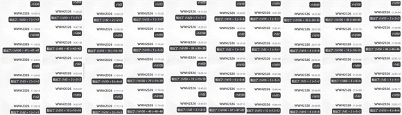

博丽的巫女思考了一阵她所得到的答案，而后问出了今日的最后一个问题

灵梦：那么

如果有天生不老不死的家伙去修行了仙道，但却很是关注普通人类的情况……

你是怎么看的呢？

神子的察觉【1d70：28+30=58】（圣德道士+30,50以上察觉华扇，75以上察觉鬼）

神子的看法【1d10:6】

1 想要靠近“人”

2 过于看重执念了

3 太笨了（为啥啊）

4 想要靠近“人”

5 过于看重执念了

6 没有任何意义（为啥啊）

7 想要靠近“人”

8 过于看重执念了

9 单纯的自我满足（为啥啊）

10 大成功/大失败【1d2：2】

神子：（这时候她所想的是……茨华仙吗）

在常人的视角来看，这定然是件大好事吧

但作为一个仙人来说

这对于她的修行，其实并无任何意义

灵梦：原来如此

谢了，再见~

正如她来时一般突兀，红白色的少女没有多客套一句就起身离开了

神子：哎呀呀……

一如既往，搞不懂她在想些什么呢

圣人将心思从巫女身上收回，并重新回到了她的日常之中

需要的信息已经收集完毕了

对于茨木华扇的另一面，也有了些了解

回忆着15天前她与对方的寥寥几句交谈

回忆着化身为鬼的对方在地狱中那可怖的姿态

回忆着紫所讲述的，两人之间的交谈

也回忆着她们过去朝夕相处的点点滴滴

现在的她，对于茨华仙这个存在终于有了一个可以确信的看法

那是【1d10:6】

1 逃离过去的恶鬼

2 虚伪而有情的仙人

3 已然狂乱的鬼仙（为啥啊）

4 逃离过去的恶鬼

5 虚伪而有情的仙人

6 只是个单纯的笨蛋而已（你是天使吗？）

7 逃离过去的恶鬼

8 虚伪而有情的仙人

9 冠以求道之名的恶徒（没到这地步吧）

10 大成功/大失败【1d2：1】

“呵”

博丽灵梦发出了一声意义不明的嗤笑

灵梦：怪不得就连紫和萃香都没法理解她……

难怪她能干出这么古怪的行径……

根本就不是一处两处的问题，她把所有的事情全都搞反了！

真是个彻头彻尾的笨蛋，连带着因此而伤心的我都显得像个**一样！

她转身走向了竹林的方向

灵梦：之后就是完完全全的私仇时间了

做好被修正的准备吧，茨木华扇！

不知为何

比起之前在医院的时候

此刻的巫女小姐看上去似乎更为活泼些了

【1d60：16】分钟后

~永远亭~

武术家与原始人正在院中相互对持着

久违的，两位好朋友准备来一场点到为止的切磋

战前准备——对他们而言并没有什么必要

互放狠话——对战斗而言也没有任何用处

甚至无需旁人宣告比赛开始，在视线相交的瞬间，两人便同时挥出了自己的右拳——

灵梦：烈海王，皮克，帮我做些战前准备！

我要去把茨华仙那个笨蛋狠狠打一顿！

而后，红白色的巫女小姐丝毫不看气氛地飞到了场地的中央

烈与皮克的震惊【1d100：15】（50以上不停手）

皮克：嗷嗷嗷嗷嗷啊

（我就知道）

两位格斗家默契地收回了拳头，并一齐看向了场地中央的灵梦

烈：并不意外

准备什么时候出发？

灵梦，你现在的伤势可还没好全，想和之前一样灵活地闪避攻击还是有些困难的

灵梦的急切【1d100：41】

（1-30：15天后，灵梦彻底恢复，华扇基本痊愈（Atk-10，可使用常规符卡战中所有招数，无视特殊攻击）

31-60：10天后，灵梦基本痊愈（Atk-10），华扇仍旧负伤（Atk-20，可使用常规符卡战中所有招数，拥有特殊攻击耐性）

61-90：5天后，灵梦轻伤（Atk-15，闪避成功值+15），华扇中等负伤（Atk-25，拥有特殊攻击耐性，能使用动物朋友和假肢）

91-100：就在今天，灵梦中等负伤（Atk-15，闪避成功值+15，仅能使用体术与结界术），华扇重伤（Atk-25，失去特殊攻击耐性，仅能靠动物朋友战斗））

灵梦：我可是完全不着急~

再过上个十天左右就差不多完全恢复了

在此期间

能拜托你们二位帮我做些康复训练吗？

两位格斗家忽然觉得，少女脸上的表情似乎在哪里见到过

非常的……淡漠吧

非常的……冷静吧

但在说起这个话题的时候

话语间就有了与平常不同的热情

眼里像是在看着某个不在此处的存在

即使是初次见面也能明白，这是在为“某事”而做准备

这是为了很快就要发生的事情，而做好了拼尽全力的觉悟

而后，他们不约而同地想起来了

他们当然是见过的

并不是在幽静的竹林里，而是在于朋友相识的斗技场中

那个少年与他们战斗的时候——

那个少年将他们打倒的时候——

那个少年在战斗之后，与他们畅所欲言的时候——

就是带着，这样的表情的！

烈：简直一模一样

你说是吧，皮克？

原始人咆哮着举起了他那可称之为“凶器”的拳头

皮克：嗷嗷嗷嗷嗷嗷嗷啊！

（我从刚见面的时候开始，就一直觉得她和刃牙很像了！）

嗷嗷嗷嗷嗷嗷嗷嗷嗷啊！

（那就来玩吧，灵梦！）

名为“康复训练”的连战，开始了

好的稍等片刻，我们继续

~10天后~

~第693天~

~永远亭~

黑白色的魔法使骑着扫帚飞到了永远亭的门口

今天是灵梦出院的日子，但她却没带什么礼物

魔理沙往院中探出了头，而后不出所料地看到了正在修行的巫女小姐

烈与皮克的陪练效果【1d60：58+40=98】大成功！（50以上伤势提前愈合，75以上本次战斗Atk+15）

哇咧，陪练大成功是啥啊【1d10:6】

1 她的实力进步飞快！Atk+10，Hp+2

2 我已经预测了这场战斗的全过程！本次战斗中回避判定所需成功值-10

3 意外增强了近战技巧，天霸风神脚变强了（为啥啊）

4 她的实力进步飞快！Atk+10，Hp+2

5 我已经预测了这场战斗的全过程！本次战斗中回避判定所需成功值-10

6 意外增强了结界术，博丽弹幕结界变强了（为啥啊）

7 她的实力进步飞快！Atk+10，Hp+2

8 我已经预测了这场战斗的全过程！本次战斗中回避判定所需成功值-10

9 阴阳道术变强了（说真的为啥啊）

10 大成功/大失败【1d2：1】

“博丽弹幕结界！”

瞬间释放的二重结界，将武术家弹飞到了魔理沙的身旁

金发小女孩顺手拉起了烈海王

魔理沙：都已经10天了吧？

真难得啊，上次看到灵梦这么勤奋还是她被茨华仙抓走的时候呢

武术家望着庭院中央的巫女，欣慰地笑了起来

烈：她果然是天才……她真的是天才！

在第【1d5：1】天的训练结束后，伤势便已经提前愈合，因为她的身体自行回应了她的意图

在第【1+1d5：6】天的训练结束后，气势已经攀升至巅峰，简直像是异变时的状态一样

保持着这样的劲头继续锻炼到了今天——甚至连结界术，都变强了这么多！

皮克：嗷嗷嗷嗷嗷嗷嗷啊

（简直像是每一天都在进化）

嗷嗷嗷嗷嗷嗷嗷啊

（如果你平时能拿出这副劲头来锻炼的话——）

博丽的巫女打断了原始人的发言

灵梦：我~才~不~要~

累死了累死了，等正事干完就赶紧回神社喝茶去

——啊，差点忘记了

烈海王，麻烦你再做一下那个充满“杀意”的表情让我模仿一下

烈：这样吗？

灵梦：对，就是这个！

出发了，魔理沙！

魔理沙：要去哪啊？

灵梦：不是什么严肃的事情

我要把茨华仙那个对自己毫无自觉的笨蛋狠狠揍一顿！

博丽的巫女抽出了御币，而后气势汹汹地赶向了妖怪之山的方向

大结界【博丽弹幕结界】（CT6）：制造没有境界的世界，营造二重的结界。Atk+750，给予伤害X4

【1d60：13】分钟后

~华扇的仙界~

说起来你们俩就是在这开打的来着

那骰个华扇邸完整度吧

【1d70：28+30=58】（30天过后保底30）

茨华仙的动物朋友们如今正齐心协力地修复着华扇的三层小楼

粉色头发的仙人则头疼地看着自己眼前那刚建好一半的房子

华扇：紫这混账

莫名其妙地跑过来开战就算了，第一时间先把别人家砸了算怎么回事

怎么还能有这么没素质的家伙……

灵梦：好久不见啊，茨华仙

你这幅狼狈的样子可真少见哦~

红白色的巫女坏笑着走入了华扇的仙界

华扇：是灵梦啊

咦？你最近看上去有在好好修行的样子？

真让我吃惊……看来我的说教没有白费呢~

山中的仙人温和地向巫女打了声招呼

无论是说话的语气，亦或者是言语中的内容，都与过去两人相处之时别无二致

没错

简直就像是，什么都没有发生过一样

但博丽灵梦并不吃惊

对方将会做出的应对她早已想到

因此，红白色的巫女笑着开口了

灵梦：在这里开始……还是跑到外面去？

你想要去神社的话也可以

选个地方吧？

华扇：？？？

你在说什么？

幻想乡的巫女抽出了她的御币

灵梦：看上去你没听懂

那就说的更仔细一点

你想在这里开打，还是跑去外面？

华扇的迷惑【1d70:17+30=47】（灵梦的约战+30）

仙人陷入了短暂的迷茫之中

茨木华扇有些不可思议地问出了她的问题

华扇：你要和我战斗？为什么？

前些天的事情其来龙去脉你已经了解，我的计划也已经成功

如果不是你太过大意的话，根本都不会有这般的伤势

灵梦，这些道理你应当是清楚的吧？

而巫女却只是摇了摇头

灵梦：华扇，你真是一个彻头彻尾的笨蛋

你甚至到现在都没有搞清楚重点在哪里……

到现在都还在纠结于这些无足轻重的事情！

真是看不下去了

居然还有着这般【不自由】的仙人！

她静静听着巫女的回应

重点……重点是，什么呢？

于是，片刻之后，她终于找到了自以为关键的地方

华扇：以后已经不会再有可怖的鬼之臂了

我也早就不是过去那番样子了

即使这样

即使这样，你还是想退治我吗？！

她有些激动地说出了这些话语

灵梦：啧啧啧，放轻松一点

才不是这么严肃的事情——

只是一场普通的弹幕决斗而已

你看，我还特意找了观众过来呢~

武术家、魔法使、小小的醉鬼，独角的鬼王、后户的秘神……

与她们所熟识的人们正一个接一个地从仙界的入口走来

这些不请自来的观众们纷纷提着酒壶坐到了一旁，等待着即将开始的战斗

仙人赶忙封闭了仙界的入口

华扇：怎么会有这么多人？！

你在想什么？

就算要决斗的话也不需要这样——

幻想乡的巫女在朋友面前摆出了战斗的架势

灵梦：做好准备吧，茨木华扇

你那扭曲的性格，无聊的执念，还有一头浆糊一般的头脑——

就由我来，好好修正！

在一头雾水的仙人面前

在数位观众的注视之下

仅属于两人的战斗，开始了！

战斗！

BGM：华狭间的战场

博丽灵梦

Atk：285（255）

Hp：16

技能

博丽的巫女：异变发生时Atk+20，不会陷入异常状态，不会受到驻足，束缚等判定影响，拥有对时停等特殊攻击的耐性，对所有技能均可进行【1d100】的回避判定，50以上成功。自身所受到的所有伤害-2。（本次视为日常战斗，无异变加成）

战斗的记忆：本场战斗中Atk+15

轻伤上阵：本场战斗中Atk-10（利用高强度的康复训练让伤势提前愈合，本技能失去效果）

人体，很神奇吧？：本场战斗中Atk+15

鬼王的药酒：由热心观众烈海王友情提供，仅可使用一次，回复【1d10】点Hp

神技【天霸风神脚】（CT3）：（近战系）连续使出威力强大的倒挂金钩踢，Atk+75，给予伤害+2

宝具【阴阳鬼神玉】（CT4）：（弹幕系）投掷巨大的阴阳玉，对对手造成必中的【3d3】点伤害

神技【八方龙杀阵】（CT4）：（技巧系）以不可思议的力量束缚对手的行动，本回合自身不会受到伤害，给予伤害+3

回灵【梦想封印　侘】（CT5）：（弹幕系）放出大量灵符令其自动追击对手，3T内对手Atk-65，每回合受到3点伤害

必杀技

大结界【博丽弹幕结界】（CT6）：制造没有境界的世界，营造二重的结界。Atk+750，造成伤害X4

神灵【梦想封印　瞬】（CT7）：博丽巫女的代名词，将对手封印在只属于灵梦的时空之中。无法回避/破解/防御，Atk+800，给予伤害X5，本回合自身无视所有特殊攻击/意志判定，并进行一次特殊攻击【封印】：进行一次【1d100】的封印判定，对妖怪成功值标准30，对妖怪以外的对手成功值标准为50，判定成功的场合，本回合对手无法进行普通攻击、无法造成任何伤害。（面对拥有特殊攻击抗性的对手时，成功值变为60/90）

【梦想天生】（CT8）：博丽灵梦的究极奥义，化作无法触及的存在，以阴阳玉自动攻击对手。无法回避/破解/防御，Atk+900，造成伤害X6，本回合无敌。

茨木华扇

Atk 280（300）

Hp 24

独臂有角的仙人：不会受到异常状态的影响，无视所有特殊攻击。自身所造成的普通攻击伤害+2，所受到的所有伤害-2，自身攻击必中，自身战斗骰为【3d40】，自身技能/必杀技的破解/回避/防御判定所需成功值+10

技能

八云紫的余伤：本场战斗中Atk-20，受到特殊攻击的场合，视为仅持有特殊攻击耐性

雷符【低速的务光】（CT3）：（弹幕系）令雷兽奔袭而出，对对手造成必中的【1+1d4】点伤害，并进行一次特殊攻击【雷光】：进行一次【1d10】的雷光判定，出目为1-4时本回合对手受伤+2，出目为5-8时对手本回合Atk-30，出目为9时对手无法造成伤害，出目为10时本回合战斗自动成功。

包符【假肢变形】（CT4）：（近战系）利用右臂的绷带将对手缠起，在空中回旋数周后利用怪力摔打而出，本回合自身给予伤害+4，进行一次特殊攻击【封禁】：对手本回合无法行动。（面对拥有特殊攻击耐性的对手时需进行一次【1d100】的封禁判定，30以上成功）

鹰符【Hawk Beacon】（CT5）：（技巧系）以仙术制造七彩的炫光，标记对手后令大鹫“竿打”突刺进行攻击。3T内每回合对对手造成3点伤害，自身Atk+60，受到伤害-3。（被回避的场合，仅造成伤害的效果无效）

必杀技

龙符【Dragon's Growl】（CT6）：将构成右臂的绷带化为龙口，释放破灭般的咆哮。Atk+750，给予伤害X4，本回合战斗成功的场合，对手Hp减半，Atk-20。

【不可视的鬼之手】（CT7）：原为过去所得到的都市传说，在异变结束后依据其仙术重现。将绷带化作旋风击飞敌手，而后以仙术构成的鬼臂释放必杀一击。Atk+800，给予伤害X5，本回合开始时进行一次【1d100】的决心判定，50以下的场合宣告战斗结束，胜者茨木华扇。

四天王奥义【三步绝灭】：无法回避/破解/防御，自身Hp归零时发动，下回合Atk+950，自身无敌，给予伤害X6

T1

灵梦的攻击【285+1d100：48=333】

华扇的攻击【280+3d40：98=378】

以阴阳玉干扰对手的视线，而后将手持的封魔针飞射而出

这是巫女退魔时常用的开局，几乎每次都能起到理想的效果——

可对于山中的仙人来说，这并无任何意义

右臂所缠的绷带仅仅轻轻一握，灵梦所射出的弹幕就在其掌中化为了碎片

华扇：灵梦，你知道的吧？

凭你是不可能战胜我的

就算在这份规则之下，也是一样啊

灵梦的受伤【1d10:6】（灵梦被动-2，华扇被动+2，相互抵消）（华扇攻击必中）

1 小伤害

2 小伤害

3 小伤害

4 中伤害

5 中伤害

6 大伤害

7 大伤害

8 特大伤害

9 特大伤害

10 大成功/大失败【1d2：1】

Hp：16-3=13

仙人随手放出了一片七彩的光华，就将巫女击飞到了一旁的树林之中

灵梦：不愧是本体，比单独的胳膊可是强多了

只可惜，头脑似乎还比不上手臂灵活啊！

魔理沙：（手臂？手臂怎么了？）

（话说乐子神我能理解，为啥鬼们也会来看啊？）

烈：（你等着看就是了）

T2

灵梦的攻击【285+1d100：16=301】

华扇的攻击【280+3d40：49=329】

没有给予对手起身的时机

粉发的仙人一步便跨越了遥远的距离，随手便将巫女高高举起——

而后毫不留情地摔在了大地之上

灵梦的受伤【1d10:8】

1 小伤害

2 小伤害

3 小伤害

4 中伤害

5 中伤害

6 大伤害

7 大伤害

8 特大伤害

9 特大伤害

10 大成功/大失败【1d2：2】

Hp：13-4=9

“轰！”

简直就像是地下的斗争重现了一般

仙人随手的一投，就在坚固的地面之上砸出了一个数十米之深的巨坑！

勇仪：哦哦，威力不减当年啊~

她并没有做进一步的追击，而是就这样看着坑洞中央的巫女

华扇：所以我才说了

你需要多加修行啊，灵梦

看看你现在这副可笑的姿态吧

幻想乡不需要这么软弱的巫女！

博丽的巫女擦了口血

灵梦：哦呦，实在是不好意思

我自认为自己在这行上干的还算是不错

要不要把那句话的主语稍微换一下

稍微坦诚一些

“我不需要这么软弱的巫女”，如何？

仙人惊讶地看着一脸平静的巫女

华扇：你为何会这样想

你认为我是那样无情的人吗？

这是出于我的职责——

少女笑着从地上爬了起来

灵梦：恰恰相反，华扇

你的感情，你的思虑，你所思考的东西实在是太多了

结果全部搞反了！从源头处就完全错误了！

你啊

其实根本就不爱修仙吧？

T3

已经没有办法和现在的灵梦对话了

她已经完全失去理智了

这样想着，仙人呼唤了她的宠物

华扇：够了，灵梦

你现在需要冷静一下头脑

符卡宣言 雷符【低速的务光】！

灵梦的回避【1d100：61】成功（成功值50+10=60）

身披雷光的小兽冲向了红白色的巫女，却始终无法捕捉到她那似有似无的身体

最终，雷兽只得哀鸣了一声，而后回到了饲主的身旁

灵梦：可不要回避话题哦~

我可是详细调查过了

你这家伙摆着一副认真负责的样子，其实正事上却老是浑水摸鱼吧？

你还好意思说我偷懒？！

魔理沙（超大声）：是这样吗，乐子神？

我看茨华仙平常挺认真负责的啊？

摩多罗（超大声）：可拉倒吧，就是懒，满脑子光想着她那胳膊！

紫前几年天天往外跑没见她帮忙，最近和月球地狱整外交也不出面，甚至异变都不知道搞一个！

反而人里那边一丁点大小的事倒是能看见她出马了，这可是灵梦的工作啊！

烈（震声）：摩多罗女士，人家就在旁边呢这样说不好吧！

华扇：不不！

这个是大家负责的区域有所不同……

在粉发的仙人手忙脚乱开始解释的时候，巫女已经趁机发动了攻击！

灵梦：有破绽！

符卡宣言 神技【天霸风神脚】！

T4

她愤怒地看向了一旁坏笑的巫女

华扇：你为什么要这样做？！

灵梦：自己不是人在幻想乡难道是件很丢人的事情吗？

这有什么好遮遮掩掩的啊，茨华仙？

华扇：够了

我真该重新考虑和你的关系了，灵梦！

符卡宣言 包符【假肢变形】！

情绪激动的仙人这次亲自发动了攻击

构成右臂的白色绷带突然散开

它们像是拥有灵性的生物一般围到了巫女的身旁！

烈：是缚法！

完全包裹起来了！

快速而又坚决，如同在完成自己的使命一般——

飞舞的绷带将巫女牢牢地缠成了一个人形

而后，几乎没管任何后果，暴怒的仙人将其全力砸向了地上！

灵梦的回避【1d100：89】成功！

“哒，哒”

就在华扇含怒出手的下一刻

红白色的巫女用御币敲了敲她的肩膀

灵梦：简直和前几天一模一样呢

华扇，你可真是上头了

和【不自由】的你不同，我是全幻想乡最为【自由】的巫女

就算你把骨头换成了绷带，也关不住我！

接招——

符卡宣言 神技【八方龙杀阵】

符卡宣言 宝具【阴阳鬼神玉】！

华扇的受伤【3d3：6-2=4】

Hp：21-4=17

山中的仙人结结实实地吃下了这来自身后突袭

但她只是气恼地问出了自己自开战以来就一直有的问题

华扇：你到底在说些什么？！

什么【不自由】……这与这场战斗到底有什么关系？！

没有任何东西在束缚我！

灵梦：不见得吧？

我觉得你到现在都没逃出你的过去

并且——

你到现在都仍旧执着于，你那自以为是的“天道”之中

灵梦的攻击【285+1d100：99=384】

华扇的攻击【280+3d40：54=334】

华扇的受伤【1d10：2】

1 回避

2 小伤害+3-2

3 小伤害+3-2

4 中伤害+3-2

5 中伤害+3-2

6 大伤害+3-2

7 大伤害+3-2

8 特大伤害+3-2

9 特大伤害+3-2

10 大成功/大失败【1d2：1】

Hp：17-1-3+2=15

取得大好优势的巫女小姐，并没有趁此机会痛下杀手

她只是轻轻地，温柔地，像是和朋友交流一般地

拍了拍对方的脸颊

事后，中华武术大师 烈海王（30代）如此说到

烈：我曾在过去的某场战斗中，看到过类似的场景

烈：实打实的说，这是十分冒险的行为

在任何类型的争斗之中——符卡战，格斗战，甚至游戏对决亦或是下棋——侮辱对手都是见怪不怪的事情

这是一种十分合理的战术

烈：但是这种行为不一样

对战斗的另一方展露出这样的温柔与体贴

已经超出了“侮辱”的范畴了

我甚至不知道该用什么词形容它

我只能说，理所应当的

烈：她暴怒了

T5

“轰！”

怒气已经攀升到了极点

仙人，不，鬼的全力一击几乎将这座山都打碎了一半！

看热闹的观众们赶忙飞到了半空之中

而茨木华扇却并未理会他们的举动，只是将视线投向了同样飞行着的巫女

华扇：到此为止！

给我一个合理的解释，博丽灵梦！

灵梦：你还没发现吗？

那就让我来一条条告诉你！

你跟我和魔理沙认识了这么久，却一直不敢说出自己的真身，根本就不是为了维护自己的仙人形象

你只是觉得人类不可能信任鬼——只是单纯害怕被人讨厌而已！

怒火瞬间平息了

也难怪

听到这般幼稚的话语从对方的口中说出来

即使是她也不由得为止苦笑吧

华扇：唉

你不理解，灵梦

这并不是如你所想的所谓简单的人际关系

这是为了我所追求的天道——

巫女毫不留情地打断了对方的话语

灵梦：少拿你的天道当挡箭牌！

看得出来，你确实很执着于那玩意啊

只是很可惜，你做的和你说的根本对不上号

追求宇宙的至高真理，和亲近人类有什么关系？

正是因为人类修炼成了仙人，仙人才会亲近人类

这和你们所追求的“道”可没有一点关系！

一时之间竟哑口无言

一时之间竟找不出反驳的依据

但是巫女是无法理解她的追求的

她所求之物根本不在于所谓究极的真理……

华扇：仙人和仙人也是不一样的

我求天道是要离开这污浊而又无意义的地狱和与人间——

是要成为天人，进入新的天地！

灵梦：那就更奇怪了

天人应当淡薄口舌之欲，你却一天到头吃个不停！

天人应当与世无争，你却总是跑来跑去而又多管闲事！

天人应当舍弃七情六欲，只留身为“道”的部分欲求

你却亲口承认如果我死了还会因此而痛哭不止！

你这样的家伙怎么可能升入天界——你的情感比起天子那不良天人都要丰富！

华扇：——

灵梦：所以我才说你不爱修仙

所以我才说你不自由到了极点

华扇，你啊……

你才不是什么仙人

你只是个对自己妄想出的“天道”万分执着，被自己的过去折磨的束手束脚，最终扭曲成这副样子的

一个笨蛋鬼而已！

想不出该如何反驳

一定是被这些古怪的话语所气到无法回应了

于是茨木华扇强行结束了这个话题

华扇：到此为止……不要用你的思维来揣摩我，灵梦

符卡宣言 鹰符【HawkBeacon】

灵梦的回避【1d100：40】失败

灵梦的受伤：3-2=1

Hp：9-1=8

大鹫“竿打”穿过了仙人所制造的光芒，而后一头撞在了巫女的身上

灵梦：恼羞成怒了吧？无言反驳了吧？

那就继续战斗

我要把你的本能，打出来！

符卡宣言 回灵【梦想封印　侘】！

华扇的受伤：3-2=1

Hp：15-1=14

灵梦的攻击【285+1d100：2=287】

华扇的攻击【280-65+60+3d40：68=343】

灵梦的受伤【1d10：7】

1 小伤害

2 小伤害

3 小伤害

4 中伤害

5 中伤害

6 大伤害

7 大伤害

8 特大伤害

9 特大伤害

10 大成功/大失败【1d2：1】

Hp：8-3=5

在巫女话音刚落的瞬间——

鬼的重拳，就已经砸在了她的腹部

华扇：我过去已经劝告过你多次了

不要在战斗时说些无关紧要的话语

因为每当你得意自满的时候，你就会露出不应有的破绽

就像现在这样啊！

T6

灵梦的Hp：5-3+2=4

华扇的Hp：14-3+2=13

巫女喘着粗气从山石的碎片中爬了起来

旁观的武术家不慌不忙地飞了过来，而后拿出了他上次得来的奖品

烈：来，喝这个！

“吨吨吨吨吨”

鬼王的药酒发动

Hp回复了【1d10：2】点

Hp：4+2=6

勇仪：哦，是快过期的药酒！

真是不怕死的家伙

魔理沙：这玩意快过期了吗？！

烈：拿到之后都过了这么长时间了，现在没坏就不错了……

灵梦：谢了，烈海王！

华扇：啧，偏偏还是我的酒……

够了，灵梦

身为巫女的你不需要考虑这么多！

符卡宣言 雷符【低速的务光】

符卡宣言 龙符【Dragon'sGrowl】！

灵梦的回避

雷符【1d100：41】失败

龙符【1d100：10】失败

灵梦的受伤【1+1d4：2=3+2-2=3】

Hp：7-3=4

雷光判定【1d10：4】

本回合灵梦受伤+2

状态逐渐下滑的博丽巫女，这次并没能够挡下雷兽的突袭

而茨木华扇的攻击已经准备完成

她的绷带再次散开，而后聚集成了龙口一般的模样

仙人的力量在这白色的巨龙口中不断聚集——

蓝色的破灭之光如咆哮般轰响了博丽的巫女！

灵梦：终于动真格的了

那就让你看看吧，我这次修行的成果！

符卡宣言 大结界【博丽弹幕结界】！

神技【天霸风神脚】发动

由妖怪贤者所传授的结界术在此展开

无限而重复的二重世界，迎向了仙人所释放的耀眼光芒！

灵梦的攻击【285+75+750+1d100：18=1128】

华扇的攻击【280+60-65+750+3d40：54=1079】

华扇的受伤【1d10：4】（天霸风神脚+2，被动-2抵消，此处仅计算鹰符-3）

1 回避

2 小伤害X4-3

3 小伤害X4-3

4 中伤害X4-3

5 中伤害X4-3

6 大伤害X4-3

7 大伤害X4-3

8 特大伤害X4-3

9 特大伤害X4-3

10 大成功/大失败【1d2：1】

Hp：14-2X4+3=9

粉发的仙人震惊地看着面前充满自信的巫女

她太熟悉对方的招式了——因此，才会感到讶异

华扇：……你变强了，灵梦？

灵梦：哈！为了好好修正你这个笨蛋

我可是努力锻炼了足足十天呢！

魔理沙：（足足十天呢~）

（每次听到她说这话我都感觉好气啊）

烈：（相信我，我比你更能体会这种感觉）

（我跟皮克陪她练了十天呢）

T7

灵梦的Hp：6-3+2=5

华扇的Hp：9-3+2=8

为什么旁观的大家都是一副理所当然的样子？

为什么就连勇仪和萃香也在笑着点头？

你们都在想什么呢？

独臂有角的仙人已经迷惑到了极点——

华扇：我不是异变的发动者

我也不是害人的恶鬼

居然为了打倒我而锻炼……

你身为幻想乡的巫女，根本就没有和我敌对的理由！

灵梦：所以我才说*****！

巫女应该做什么，仙人应该做什么，鬼应该怎样，人类应该怎样……

你满脑子都是这些自已想出来的“道理”，整天思考的都是这些不知所谓的“身份”，却根本没有意识到真正重要的是什么！

和你战斗的才不是博丽的巫女

而是你的朋友博丽灵梦！

华扇：这是天道——

她突然停住了口中的话语

她已经想到了对方会怎么答复

你所坚信的，是真正的天道吗？

种种的矛盾、过去的回忆、与紫的冲突、以及眼前少女的身影……

太多的东西叠加在了一起

已经快要无法正常思考了

快让这场战斗结束吧

T8

已经顾不上眼前的对手了

茨木华扇越过了观众席上的神鬼们，看向了唯二的两名人类——

烈：逼出来了！

魔理沙：继续啊！

还没打完呢！！

我早就想看这个了！！！

而后就看见了他们脸上那比鬼还要凶暴的表情

华扇：为，为什么？

灵梦：哦，人里的小朋友估计是会吓哭的

但魔理沙当然不会害怕

你以为我们见过多少事情了？

灵梦：巫女本来就是由妖怪们选出的，你若要说是工具也无所谓

我呢，天天被紫骗去干着干那，连个报酬都没有也早就习惯了

但是呢

我始终当你是我的朋友

不管你是仙人、是鬼、还是现在这个**——这一点都是不会改变的！

小小的醉鬼从仙人居所的废墟中晃晃悠悠地走出，手里拎着一个很是眼熟的盒子

萃香：喂，华扇~

你要用吗，这个？

她把鬼之臂扔到了茨木华扇的面前，等待着她的回复

华扇的决心【1d70：44+30=74】（灵梦的坦白+30，50以上使用）

独臂有角的仙人打开了木盒

她看着其中的手臂与面前被她视为工具的朋友

而后苦笑着将其拿了出来

华扇：你说的没错

不管怎么说，无论再怎么否认

我都是鬼啊

她将那干枯的鬼爪接在了那空无一物的右臂之上

于是

奸佞邪智的鬼复活了

华扇的主体意识【1d100：98】大成功（51以上主体上风，50以下鬼臂上风）

天啊，你可算是大成功了一次

大成功是什么【1d10:2】

1 意识无任何改变的永久性合一

2 1+认清了自己的道路

3 战力暴增！（为啥啦）

4 意识无任何改变的永久性合一

5 4+认清了自己的道路

6 我不做仙人了，灵梦！（为啥啦）

7 意识无任何改变的永久性合一

8 7+认清了自己的道路

9 学会了控制自己的角（这啥啊）

10 大成功/大失败【1d2：2】

茨木华扇惊讶地活动着自己的右臂

本来应有的反抗没有出现

那邪恶的意识也几乎感受不到了

感受到的只有重新拥有的力量

以及那份丢失已久的

对于“自己”的骄傲

华扇：——怎么会这样？

勇仪：废话，那是你自己的胳膊哎

我倒是想问你以前是怎么回事啦？

掉了条胳膊就跟精神分裂一样

萃香：标准的心理问题~

被灵梦一口气骂完之后自己想明白了，所谓的“邪气”也就不攻自散咯~

毕竟，那也是“你”啊，华扇

灵梦：喂，茨华仙

如果你的天道不能让鬼来修行的话

如果你的天道一定要那样别扭的话

为什么现在的你接上胳膊之后，反而跟之前一丁点的差别都没有啊？

她感受着除外貌外几乎没怎么变化的自己

而后不受控制地笑了出来

华扇：哈哈哈哈哈

哈哈哈哈哈哈哈哈

哈哈哈哈哈哈哈哈哈哈哈！

你说的没错，灵梦

我真的，真的

是个**啊！

灵梦：准备好了吗，鬼？！

要上了！

【梦想天生】！

华扇：来吧，人类！

四天王奥义【三步必杀】！

奸佞邪智的鬼将她的右臂高高举起

与简单而粗暴的奥义不同

与炫彩而华丽的奥义不同

这是仅仅以快速和迅捷为傲的，名为“必杀”的奥义

于微不可察之一瞬跨越遥远的距离——

以其鬼臂切实穿透，敌方之心脏

灵梦的攻击【285+900+1d100：2=1187】

华扇的攻击【280+950+3d40：80=1310】

灵梦的受伤：本回合无敌

但是，无往而不利的奥义在巫女面前失效了

华扇的手臂从物理意义上穿透了灵梦的胸膛

但却没有丝毫击中的感触

因为对方早已处于可视而不可触的另一侧，成为了不透明却透明的人类

这是生来就属于她的能力——只属于博丽灵梦的能力

鬼王无奈地收回了右手

华扇：确实

和是不是巫女根本就没有关系

你本来就是最为【自由】的，人类啊

T9

（紧急修复，灵梦最后1T血量为1）

双方的奥义均已用完了

心中的话语已经尽数吐露了

甚至连混乱的思绪，也逐渐平息了

于是这场战斗再也没有了这些不纯物的参与

而仅仅成为了极为单纯的，胜负之争

博丽的巫女坏笑着看向了对面的朋友

灵梦：你的头脑终于清醒了

那么，现在就是纯粹的私仇时间了

你那天说给我的恶劣发言——

就在今天，尽数返还给你！

接招！神技【天霸风神脚】！！！

灵梦的攻击【285+75+1d100：100=460】

华扇的攻击【280+3d40：53=333】

华扇的受伤【1d10:10】

1 回避

2 小伤害+2-2

3 小伤害+2-2

4 中伤害+2-2

5 中伤害+2-2

6 大伤害+2-2

7 大伤害+2-2

8 特大伤害+2-2

9 特大伤害+2-2

10 大成功/大失败【1d2：2】

华扇大失败

大失败是什么【1d10:4】

1 小伤害X2+2-2

2 小伤害X2+2-2

3 中伤害X2+2-2

4 中伤害X2+2-2

5 战斗不能

6 战斗不能

7 战斗不能

8 战斗不能

9 鬼臂又被打分离了（求求你别折腾了行吗）

10 大成功/大失败【1d2：2】

Hp：0-2X4-2+2=0

这一次，正如巫女所说的

茨木华扇的下巴结结实实地被她毫不留情的全力一踢所击中

鬼王的身体高高飞起，而后摔在了一旁的废墟之中

幻想乡的巫女随手将御币扛在了肩上

灵梦：恶鬼退治，到此结束~

华扇：是这样吗？

符卡宣言

雷符【低速的务光】！

灵梦的回避【1d100：40】失败

灵梦的受伤：【1+1d4：3-2=2】

Hp：1-2=0

地上的仙人微微一指

雷兽便化作电光袭击了得意自满的巫女小姐

灵梦：什么——

华扇：所以我早就提醒过你了

别光顾着放狠话啊，灵梦！

于是，这场两人之间的战斗

以两人同时倒地的声响，宣告结束！

战斗结束

平局

无人胜利！

【1d20：20】分钟后

悠悠醒转的茨木华扇，看到了她面前那熟悉的面孔

萃香：反杀成功啊，恭喜~

不过你还是被退治啦，华扇

勇仪：打的还不错啊，虽说最后翻盘用的是宠物

华扇：真的是

我差点就彻底输掉了

还好最后还留了一手

被电成爆炸头的巫女小姐哭丧着脸走了过来

灵梦：疼疼疼疼疼

你这宠物真是过分到极点了

那么，茨木华扇小姐

你现在有什么想对我说的吗？

华扇的答复【1d10:1】

1 过去的道歉

2 未来的期望

3 即使如此我也还是不想当鬼（你有完没完）

4 过去的道歉

5 未来的期望

6 即使如此“灵梦”也还是我眼中的工具（你够了没有）

7 过去的道歉

8 未来的期望

9 我要回地狱去（歇歇吧行吗）

10 大成功/大失败【1d2：1】

回味着自己过去的话语

她有些难堪地低下了头

而后再度振奋起来，并直视着巫女的双眼

华扇：对不起，灵梦

我无法信任人类

但我应当相信你

灵梦：啊，对了

巫女是工具对吧

嘛，对于妖怪来说的确就是这么回事呢~

华扇：我——

的确是这样想的

但是，我也的确认为

博丽灵梦是我的朋友

她等待着对方的回应

也许是尖酸刻薄的，也许是充满挖苦的，也许是满怀恶意的——

但博丽灵梦只是和平时一样，将普普通通的话语说出了口

灵梦：是吧？所以我才说你是笨蛋呢

说到底啊，华扇

我才不关心你的“天道”到底是什么样子，我说的只是我的“看法”罢了

你万分执着的东西对我来讲根本就没什么所谓

灵梦：就像你说的一样

我只是个幼稚的小女孩

我只关心的我的人际关系，仅此而已

华扇：——

灵梦：你自个把家打烂了我可不赔钱啊！

等你把自个家修好了之后——

再来，神社玩吧

她潇洒地挥了挥手，而后招呼着朋友们走向了仙界的出口

究极的秘神走到了朋友的身旁

摩多罗：华扇

你是赢了呢？输了呢？

还是平局呢？

茨木华扇摸了摸自己头上重新回来的角

她感受着自己这仿佛从未离开过的右臂

也感受着，自己未曾变化的心

华扇：说什么傻话……

我完全输了啊

粉发双角的鬼王捂住了自己的脸

不知不觉间，她露出了笑容

【1d60：60】分钟后

武术家、魔法使与巫女小姐走到了永远亭的门口

灵梦：啊对了，一定要说这句话来着

——多谢你了，烈海王

没有那瓶过期酒的话，这场就真的要输了

烈：哈哈

小忙罢了，我在战斗中喝这个会显得有点怪

灵梦：不，真是帮大忙了

我会给你和皮克准备礼物的……

还有就是，那个……

我很感动哦！

帮助灵梦解决了这次的事件

灵梦的好感度上升了【1d4：3】点！

现在的好感度为：89+3=92点

魔理沙：哦哦，真难得

我帮你喂了三大碗粥你都没说这话呢

灵梦：你还说！你那粥差点撑死我！！

巫女和魔法使开始了她们日常的打闹

原始人从庭院中走了出来，询问着今日的具体情况

皮克：嗷嗷嗷嗷嗷嗷嗷嗷啊？

（她打得怎么样啊？）

武术家笑着回复了他的朋友

烈：难以说出胜负如何

但的确是，相当精彩的战斗！

于是，就这样——

这起在幻想乡的秋末开启的故事

在一个月后的初冬，由处于中心的鬼与巫女，联手画下了句号

（本日的更新结束，下一次的更新在周一或周二，内容为普通日常篇）

（以下是我的废话）

哎呦喂那么这个特别日常回终于结束了

说真的好累，累死了，这次真的是压力大到爆

我真的是第一次遇到没思路不知道怎么写的情况（悲）

至于更新到一半贴子被橄榄后复活简直都是次要问题了

大家都知道华扇灵梦之间太过缺乏互动了因此我之前特意安排了这个情报收集环节来侧面丰富一下华扇的人设

结果全都是梗啊！

摩多罗认为她偷懒！神子觉得她在白费力气！那这侧面形象怎么越来越谐了？？？

最猛的是灵梦小姐直接认为华扇就是个笨蛋，之前准备的大纲又被橄榄了

我原本打算写的是“再见了华扇，还有我的软弱”这种情结

好家伙，这选项一出直接一转变朋友打架了，多叫上几个伙计围观一下乐呵乐呵完事

可能有很多吧友觉得，那个天道99执着似乎没怎么描写啊，华扇道路到底正不正确啊

啊，这些其实不重要

起码对于灵梦来说一点都不重要

灵梦才不在乎你是修仙的还是修道的，是人还是妖怪，她甚至连你把她当工具人都无所谓——她本来就这工作——但灵梦对于朋友不相信她这点很气，究极气

因此前面那个5信任10关心才是这次更新的重点，99执念的意义其实在于让华扇有了一个“在乎灵梦”的属性而不至于彻底变屑，从而给这场战斗多了一些合理性（不然也不会彩蛋才骰了）

至于她执着的事物是对是错？大家可以慢慢讨论，但这其实是不影响本战结果的

说起战斗.......

这一次真的是本贴开贴以来最大的耻辱啊啊啊啊啊啊啊啊啊

居 然 影 响 了 战 斗 结 果

多亏有吧友提醒我了不然这次更新就全砸了

虽然这次也砸了一半但好歹热更新了，求求大家嘴下留情饶我一命吧（悲）

那么本次更新到此结束，热血漫一架了解其实是有些突兀的剧情，但毕竟——

灵梦与华扇都不是本贴的主人公，她们的戏份实在太少，我也实在不可能花更多更新的篇幅来专门写这两个人物

因此这次我真的可以说，我尽力了（悲）

那么本次的更新到此结束，下一次的更新在周一或周二，内容是普通日常回

骰子明天发

顺便刚刚所说过

艳

和

红

这两个字是敏和感词，如果有吧友在贴子里发了这个和色 图的话还望自删一下，谢谢大家的理解

大家晚安(悲)

（附上本次的骰子，以及我的剧情思路解说）

啊啊，虽然现在说这个有点晚——

不过这个折磨人的篇章可算是结束了（悲）

实际上，我在今晚更新之前就已经想到了，这一次肯定会有很多吧友抱有不同意见的

不过由于众所周知的原因昨晚实在太晚了，我没工夫做剧情解析了，因此就在这里和大家讲讲我的思路吧

（注：虽然昨晚由于被数学橄榄导致临时热更新了战斗结果，但后面的对话其实没怎么变，也就是说剧情大基调是没变的）

不知道吧友们有没有一种感觉

灵梦和华扇在战斗的时候完全是各讲各的，简直就像是在鸡同鸭讲？

因为我写的时候就是这样打算的（笑）

在说明这场战斗的对话之前，先讲讲前面那段剧情的意义吧

实际上呢，前面灵梦的调查环节对于华扇的形象有一个侧面烘托的作用，同时也会对灵梦看法那个骰子中的选项造成影响

这个调查环节真正的意义在于最后的那个骰子——也就是【灵梦对华扇的看法】

这个骰子才是决定之后战斗基调的主要骰子

实际上如果骰中了几个正常的选项或者那个很糟糕的梗，战斗的氛围大概会变成假面骑士drive的最终战一样——即“再见了华扇，还有我的懦弱”

这种情况下会突出华扇相对“偏执”和“非人”的一面，同时也不会有这次这么多的观众——起码魔理沙肯定不在（笑）结局无论胜负大概率都是与茨木华扇在冷静状态下的诀别，来一句“下次有空的时候再一起喝酒赏花吧”这样的感觉（即从亲密友人变成普通的关系）

但是灵梦中了那个笨蛋选项（悲）

这就意味着对于灵梦而言，这场战斗只是“对于朋友的修正”，理念之争根本不存在，回归到了最纯粹的私人感情——也就是对朋友的信任这个角度了

站在这个角度上，我是这样设计两人在战斗时的对立观点的

华扇：执着于天道，亲近人类，厌恶鬼的身份（修行理念）

灵梦：他 妈 的，你凭什么不信任我（个人情感）

战斗瞬间变成了“我要打醒你这个混账朋友”，于是究极的鸡同鸭讲和诙谐的氛围就出现了（笑）

