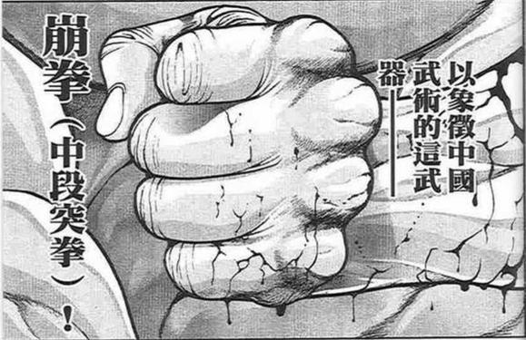

接下来讲讲观众们的作用吧（

摩多罗、勇仪：纯嘴臭调节气氛，烈：解说兼药酒

魔理沙：很重要。特意把魔理沙带来就是为了让她对于“华扇是鬼”这件事表现出无所谓的态度，即“你是鬼不影响我们接着做朋友”。这里其实是类似于皮克回中帝的任务，但由于是在战斗中完成，导致交互描写的略少，因此可能会有吧友觉得是特意带来迫害华扇的（笑）其实并不是，是为了展露灵梦的观点，即“友人间的信任与身份和过去无关”

萃香：这里玩了一个小小的零设梗：茨木童子是酒吞童子的副大将，曾经身为“人”的茨木童子被人所厌恶，而后进入山中成为了“鬼”，那时接纳她的应当就是酒吞（这段剧情我并不能很确信，因为我没找着很详细的考据，因此只是往这个方向靠了一下）。然后在华扇终于被灵梦喷破防的时候，萃香再把鬼臂拿出来问：“你现在要用吗？”，因为没人比她更合适这个角色了

然后98主体意识大成功了（悲）我本来打算是就这一回合暂时回去之后再分离的，结果直接彻底合一了

哎呦喂，这个5信任10关心99执着把巫女当工具人却又在意灵梦的华扇的故事可算是结束了

实际上大家可以发现，华扇的执着从始到终都没变（灵梦说的对她而言只是幼稚的暴言），5信任10关心也还是没变（还是把巫女当工具人），这次的着力点其实在于“在意灵梦”这个属性，这也是灵梦她自己最关心的属性（笑）

灵梦在前几个回合说了很多她从他人之处听来的看法：比如那个超级暴言“你根本不爱修仙吧”

但其实这也只是神子的一家之言，是神子对于天道的理解（并且神子的道行其实是不如华扇的）

但华扇的天道是什么呢？

真正的天道又是什么呢？

华扇的99执念究竟是对是错？

我不知道（笑）

我直到最后也没有让华扇自己提到这个问题的真正答案，因为在战斗基调定下来了之后，这对于灵梦而言就已经不重要了——对她来讲这只是对于一个很过分的朋友（5信任10关心）的修正，或者说心理治疗，仅此而已

哎呀，这次实在是不得已而为之啊……

一方面是戏份问题：幽香永琳或者皮三角起码之前都是出场不少，有蛮多铺垫的，但是华扇正儿八经出场的几次要么是打酱油要么是黄段子漫才，这真的好难啊啊啊啊

一方面是基调问题：zun笔下的幻想乡一直维持着一股子平静日常下暗流涌现的状态，虽说矛盾重重但又能运行自如，但这其中的很多问题是找不到所谓的“正确答案”的，也即阿求说过的“幻想乡的真相有无数个”

这两次更新的剧情简直就是在悬崖边上跳舞啊（悲）一不小心就会让贴子变成那种很糟糕的黑深残感，但那其实不是我想写的，我想这也不是大家想看的，同时也绝不是所谓“真正的幻想乡”

这两个一加起来简直就是以五花大绑的状态下面对五死囚围攻，得亏骰子监督放了我一条生路不然这次真的够呛能收回来（悲）

那么废话环节到此结束，谢谢大家（

~彩蛋~

~巫女巫女？？？~

说起来灵梦住院的这个月神社该怎么办啊【1d10:5】

1 巫女巫女萃香

2 早苗代班

3 巫女巫女魔理沙（为啥啊）

4 巫女巫女萃香

5 早苗代班

6 巫女巫女皮克（好可怕）

7 巫女巫女萃香

8 早苗代班

9 巫女巫女油咖喱（为啥啊）

10 大成功/大失败【1d2：1】

~博丽神社~

早苗：这里就交给我东风谷早苗吧！

萃香：好可靠的样子~

魔理沙：话说你家神社那边该怎么办啊？

早苗：我分些时间下来照顾灵梦这边不会有什么事情的~

一共也就一个月不到，神奈子大人和诹访子大人又不是小孩子了

话说守矢神社的日常家务是【1d3：1】

1 全都交给你了早苗

2 无敌的二神！

3 平摊

~守矢神社~

山上的神明们正看着堆积如山的碗碟与乱七八糟的房间发着愁

神奈子：怎么办啊，这个

早苗回来之后会发疯的吧？

诹访子：……我们先提前逃跑吧？

据说在灵梦出院的当天，守矢神社的周边出现了极为可怖的咆哮声

据山上的天狗所述，其声如雷霆，音似厉鬼

不久之后就可看到以极为矫健的身手飞奔而出的两位神明大人，与紧随其后的那位仿若鬼神一般的巫女

“想必这就是神战吧！”家里蹲记者如此说到

~茨之道~

~后户之国~

究极的秘神大人给她的老友倒了杯酒

摩多罗：好久没看到你这幅样子了

脸上的表情倒是与过去完全不同，好不习惯啊~

说起来摩多罗和华扇是老相识了

华扇知道她的过去吗？

摩多罗的守口如瓶【1d100:5】大失败（30以下知道）

草，大失败是啥啊【1d10:3】

1 其实以前被华扇救过

2 连黑历史都被对方了若指掌

3 其实华扇修仙是她的建议（为啥啊）

4 其实以前被华扇救过

5 连黑历史都被对方了若指掌

6 其实以前被华扇揍过（为啥啊）

7 其实以前被华扇救过

8 连黑历史都被对方了若指掌

9 其实我喜欢你哟（什么鬼啊）

10 大成功/大失败【1d2：2】

粉发有角的仙人接过了酒杯

华扇：装模作样地说些什么呢

明明就是你建议我去成为仙人的，隐岐奈

摩多罗：既不想在地狱待着，又无法信任退治你的人类

那么成为仙人，前往不同的新天地不是很好吗？

我当时可没想到你会变成如今这副样子

从这个角度来看，我的建议可真是失败透顶

华扇：我倒是早已料到你的变化了

毕竟你当时已经成为“摩多罗神”了

唉，被外道建议去修行天道，这什么诡异的经历啊……

摩多罗：你不是挺喜欢的吗~

虽然你所追求的与我的本意——所谓传统之道教——并不多么相同

但是这无所谓

毕竟——

华扇：纵使无人理解，就算步履艰难

这也是我的“茨之道”啊

仙人与秘神笑着碰了碰杯

摩多罗：那么，此后要怎么办呢？

你现在的形象与“仙人”可完全不同了

华扇的选择【1d10:3】

1 就这样堂堂正正地出门

2 在外人面前还是带个帽子遮掩一下

3 这是我新修炼的仙术（你会撒谎吗？）

4 就这样堂堂正正地出门

5 在外人面前还是带个帽子遮掩一下

6 我不出门了（你想啥呢）

7 就这样堂堂正正地出门

8 在外人面前还是带个帽子遮掩一下

9 这里就靠你的幻术（为啥啊）

10 大成功/大失败【1d2：2】

华扇：咳咳

“这是我新修炼的仙术”

这样说大家就都会信的吧！

摩多罗：华扇

博丽的巫女说的一点没错

你就是个笨蛋

华扇：搞什么啊连你都这样说？！

我可是很有信用的！

摩多罗：这是在说谎啊~

华扇：不好意思

我呢，既是鬼又是仙人

仙人是可以说谎的哦

那么，我先去神社了

头顶双角的仙人神色自如地站了起来

如今的她失去了那标志性的发型，又重拾了那丢失已久的手臂

但脸上的神情与过去相比，却没有一丝不同之处

秘神大人看着老友离去的背影，问出了最后一个问题

摩多罗：——天道和私情相比

究竟哪个，更为重要呢？

与和巫女战斗时不同

没有丝毫迷茫，茨木华扇斩钉截铁地给出了回应

华扇：当然是天道更为重要

我的道路绝没有一丝值得怀疑的地方

但是……

回想着巫女战斗时那愤怒的神情

回忆着她所听到的那些幼稚却包含情感的话语

茨木华扇给出了与原先所不同的回应

华扇：如果觉得追求天道就应当冷酷无情

如果为了追求天道就做出卑鄙之事

无关仙人或是鬼，这样的家伙——

就只是一个单纯的笨蛋而已啊

她离开了后户的神国，以原本的面貌走向了门外的世界

华扇的辩解【1d100：10】（30以上普通人信了，60以上连妖怪们都相信了）

非常遗憾的是，压根就没几个人相信这是茨华仙所修行的仙术成果

此后，拉着一脸质疑的人与妖怪慌忙解释的有角仙人，成为了幻想乡中一道全新的日常风景……

顺便一提，博丽的巫女小姐在此后悄悄做了点调查

灵梦：后来我去问了一圈发现，基本上和她接触多了的家伙都已经发现她不是人了

只有她自己才会觉得之前隐藏的很好吧？

（本日的彩蛋结束）

附上彩蛋的骰子

即使在彩蛋环节也依旧坚持要中梗选项，你俩真是绝了（悲）

由望远镜海皇。@望远镜300  制作的视频第二季第四集更新啦！

本期的内容是热情好客幻想乡，大家感兴趣的话就去看看吧！

~灵梦的回礼~

说起来灵梦的回礼是【1d10:7】

1 茶叶与仙贝

2 封魔针与灵符

3 红色的大蝴蝶结（为啥啊）

4 茶叶与仙贝

5 阿求的小说

6 钱（为啥啊）

7 茶叶与仙贝

8 带来好运的护身符

9 阴阳玉！（这啥啊）

10 大成功/大失败【1d2：2】

~博丽神社~

灵梦：没有钱！没有宝物！也没有不可思议的道具！

把神社翻了个底朝天都没发现什么好东西因此只能给你们送点茶叶和仙贝了！

茶与仙贝的味道【1d90：47+10=57】（一贫如洗的巫女保底10点）

皮克：嗷嗷嗷嗷嗷嗷啊

（我是不需要回礼）

嗷嗷嗷嗷嗷嗷嗷啊

（毕竟灵梦以前就经常和我玩的）

烈：我就不客气的收下了

之后给幽香试试吧

天邪鬼啃了口巫女赠送的茶点

正邪：嗯，就，还行吧，谢谢啦

你为啥给爷也送了一份？

灵梦：当时来帮我的就是你和烈海王啊~

说实话真是帮大忙了——

但是以后你如果要搞事我还会退治你的！

正邪：爷到底是多想不开才会来招惹你啊？！！

几分钟后，朋友们提着巫女的回礼离开了博丽神社

烈：话说回来

正邪，你那天怎么没去看战斗啊？

正邪：你说什么呢……

那是她们两人之间的事吧？

你们这种平常就很熟的姑且不论，爷这样的可还是别插手为好——

你笑什么？别突然露出一副温馨的表情看着本大爷啊！！

皮克：（天邪鬼莫非都是些别扭的家伙吗？）

原始人看着追打烈海王的正邪默默想到

（彩蛋环节结束）

嗯......不知道为什么大家突然讨论起安价了？明明下一次的更新是日常回啊（

不过既然都在聊就在这里统一回复一下，人物方面还是一如既往的只能提出【东方stg正作/格斗作】、【东方官方漫画/小说】中的人物，旧作人物和外界人物由于会破坏世界观/很难展开所以不行

至于地点方面......

【不“——”就不能出来的房间】这种肯定是不行的（笑）

【八云蓝的黑暗混沌实验室】这什么诡异的新设定啊，当然不行啊（笑）

【dio魔馆】连世界观都变了（笑）

【白 宫】这种超级 敏 感 的现实地名当然不行啊（笑）

有趣的地点当然欢迎，但是这种完全不合理的选项我可是会直接排除掉的哦

在把握好度的情况下提出有趣的选项，想不到的话就直接填普通的也当然没有问题，就是这么回事

——话虽如此下次更新是日常回啊为什么会突然聊起这个（笑）那么闲谈时间结束（

大概八点十五分左右更新(

~这件事发生在烈海王来到幻想乡的第【693+1d30:13=706】天~

与仙人的战斗已经结束，红白色的巫女也出院了

幻想乡的冬季进入了第二个月，天气变得更加寒冷

鹅毛般的大雪静静落下，而竹林的住户们也纷纷换上了冬装

这是这个平淡无奇的冬日之中的，某一天所发生的故事——

烈海王今天早上要做什么【1d10：6】

1 小妖怪武术班

2 去旧地狱玩玩吧

3 皮克似乎想要锻炼阿求的样子

4 小妖怪武术班

5 去红魔馆玩玩吧

6 去山上的神社拜访朋友吧！

7 小妖怪武术班

8 去太阳花田吧

9 古明地觉的侦探委托

10 大成功/大失败【1d2：1】

结束了早上的锻炼，做好了今日的料理，武术家思考着自己今天的日程

烈：说起来，上次遇到的那位诹访子女士对于格斗术的研习也相当深刻啊

比肩武圣，甚至超越武圣的合气吗

正好今日无事，便前去拜访一下吧！

烈海王前往守矢神社了

有人同行吗？【1d100：95】（50以上有）

哦哦，终于有了

同行者是【1d10:1】

1 铃仙前辈

2 皮克

3 去旧地狱找的勇仪（为啥啊）

4 铃仙前辈

5 帝

6 过来玩的正邪（为啥啊）

7 铃仙前辈

8 师匠

9 随机（谁啊）

10 大成功/大失败【1d2：2】

烈：（铃仙前辈今天似乎没有工作啊）

武术家看向了正悠哉地翻着漫画的月兔

烈：铃仙前辈

我今天打算去山上的神社（打架），要一起去吗？

铃仙：去神社（玩）？

说起来我也好久都没去过那里了

好啊！虽然不打算贡献信仰，但普通地去一趟也不错啊~

烈：哦哦，没想到前辈你的（战斗）兴致也这么高啊

那就出发吧！

地上的因幡看着他们远去的背影，向月之头脑提出了问题

帝：师匠哎

我怎么觉得他们理解的意图有点微妙的不同啊？

师匠：要不要提醒优昙华拿上她的装备呢~

皮克：嗷嗷嗷嗷嗷嗷嗷嗷嗷啊

（铃仙那些武器里面真正常用的也就那把喇叭枪吧）

嗷嗷嗷嗷嗷嗷嗷嗷嗷啊

（感觉她过一会大概会很失望？）

辉夜大小姐懒洋洋地趴在了暖桌上

辉夜：弹幕战和娱乐活动不都差不多吗，没区别的~

于是，烈与铃仙前往守矢神社了

具体的出行方式是【1d10：4】（1-6缆车，7-9普通地飞过去，10随机）

路上有事发生吗【1d100：57】（30以下坏事，70以上好事）

一路平安无事……

~人间之里~

在今年年初的时候，经过与山中天狗一族的长期谈判，守矢神社终于成功推进了她们的索道计划

自此之后，村落中的平民也可方便地前往山中参拜，而山上的神明们则理所应当地获得了更多的信仰来源

如今，武术家与月兔正站在索道的入口处

今日索道的人气是【1d80：61】（寒冷的冬天-20）

寒冷的天气似乎并未浇灭村民们上山参拜的热情

铃仙：人好多！

这么冷的天气还有人在这边摆摊啊？

灵梦：能赚钱干嘛不来啊~

两位要买护身符吗？

灵梦的推销【1d100：51】（75以上成功）

烈：不了谢谢，你知道我不信这个的

话说你那边的神社怎么办？

这样一来，信仰不就都被守矢神社抢走了吗？

灵梦：本来就没几个人会来博丽神社参拜，倒是妖怪过来的比人还要多

这索道开不开对我那边都没什么影响啊~

红白色的巫女放弃了杀熟，转而热情地向村民推销起护符了

【1d30：21】分钟后，老老实实排队的烈与铃仙终于坐上了索道

~索道缆车~

河童们引以为傲的技术，让索道在积雪天中也依旧能够正常运行

山中天狗们的护卫，让普通的乘客也能安心前往可怖的山中

但是，有一点却是主办方们无论如何都无法提供给乘客们的

那就是——

乘坐缆车之时的，聊天话题！

这个时候，烈与铃仙之间陷入了一阵无言的沉默

两位任劳任怨的社畜和并肩作战的老同事突然发现

尽管已经认识很久了，但他们好像几乎没有两人单独出来玩过！

铃仙：（啊糟了）

（酒桌上的话倒可以发发牢骚，工作的时候还不用考虑这些东西）

（但是出去玩的时候应该聊什么啊？）

（哇，烈先生的波长一点都不尴尬，不愧是谈过恋爱的人！）

烈：（说起来前辈用的那套战斗技巧叫什么来着）

（月兔格斗术？好像是师匠参与开发的技术）

（但在缆车上过招好像不太合适啊）

两人就这样苦思冥想着聊天的话题

最终，首先打破沉默的是【1d2：2】

1 烈

2 铃仙

是铃仙！铃仙前辈开口了！！

铃仙的情商【1d100：85】（50以上找到合适的话题）

铃仙：（想到了！在山上的话果然就要说这个呢~）

烈先生，你有看到那边突然出现的狂风吗？

烈的察觉【1d70：65+30=95】（50以上察觉正体）

武术家凝神看向了月兔所指的方向

一团怪异的旋风正突兀地回旋在空无一物的天空，引来了乘客们的阵阵惊呼

烈：我看看……

哦，那是天狗的恶作剧吧

隐藏在旋风内部的是我以前见过一面的白狼天狗，印象中是位尽职尽责的妖怪

月兔前辈笑着竖起了手指

铃仙：没错

那么，这是来自前辈的提问

为什么天狗要这样做呢？

烈的推理【1d70：5+30=35】（75以上成功）

你都推理了些什么啊【1d10:5】

1 天狗都是些恶趣味的家伙！

2 她准备袭击人类！

3 答案是工作（这个没错）

4 天狗都是些恶趣味的家伙！

5 她准备袭击人类！

6 是天狗中的极端分子（人家很老实的）

7 天狗都是些恶趣味的家伙！

8 她准备袭击人类！

9 为了制造大新闻！（为啥啊）

10 大成功/大失败【1d2：1】

烈：糟了！她一定是想要袭击村民！！

接招 flower ——

铃仙的阻止【1d100：59】（50以上成功）

铃仙一脸无奈地把武术家摁回了座位上

铃仙：冷静点，烈先生

如果天狗们真想这么做的话这个索道压根就没法运行哦

不如说山上的神明们会先和天狗大打出手的

烈：——说的也是

那么天狗们的真意是？

铃仙：答案是恐惧心与存在感

烈先生是知道的吧？人类的敬畏、相信与恐惧就是妖怪们存在的根基

通过可怕的天狗风让村民们进一步认识到天狗的存在，如此一来就可以提高天狗的存在感，换而言之就是增强天狗的力量

而感到恐惧的人类们也不会再盲目地闯入山林——这样守卫妖怪之山的压力也会大大减轻了

烈：在这个过程中没有任何人会受伤，但妖怪也达成了自己的目的

但这不就是吓人吗？

铃仙：对，就是单纯的吓人而已

其他的妖怪们也会或多或少地做些类似的事情哦

像是我去人里卖药的工作其实也含有“扩大影响力”的意图在里面

不过我总觉得师匠其实也不在乎这个

现在距离上缆车已经过去了【10+1d20：15=25】（20分钟以上结束话题）

永远亭的武术家耸了耸肩

烈：“大家都这样做，那我们也这样做吧”

这种感觉才是主体吧？

我已经在这里住了这般久了，却还是有很多东西不了解

但铃仙前辈对这些却是都清楚的

这种时候就会想，不愧是前辈啊

紫发的兔耳少女得意洋洋地笑了起来

铃仙：当然！

无论什么方面，我都是值得信赖的前辈哦！

月兔与武术家谈笑着度过了在索道上最后的5分钟

深山之中的神社已经展露在他们眼前

守矢神社到了

~守矢神社~

说起来今天守矢神社的情况是【1d10:2】

1 普普通通的日常

2 冬日祭典中！

3 格斗大赛！（为啥啊）

4 普普通通的日常

5 冬日祭典中！

6 早苗的家务培训班（什么鬼啊）

7 普普通通的日常

8 冬日祭典中！

9 有一柱神不在（为啥啊）

10 大成功/大失败【1d2：1】

绿发的巫女正举着喇叭向参拜者们宣传着今日的活动

早苗：欢迎~欢迎参加守矢神社的冬日祭典~

今年我们特意邀请了制造冰雪的专家

即使在幻想乡中也能体会到北海道一般的冬日光景哦！

冰雕！雪仗！弹幕游戏！还有最重要的参拜仪式！

还请大家积极参与吧！

烈：这怎么跟我想象的不太一样

铃仙前辈，我们——

铃仙：那边的冰雕区能看到好多熟人哎

今天就先从这里玩起吧！

烈的情商【1d100：37】（保底20，30以上先玩会吧）

武术家看着同伴一脸期待的表情，脑中回想起了某位情感大师在某次闲聊中对他的教导

魔理沙：和朋友出去玩的时候该怎么办？

“别一天到晚老想着干架”，对你来说只要记住这条就足以应付90%以上的状况了

烈：我本来是想先拜访一下朋友的……

不过现在这边这么热闹，她估计也没工夫吧

好，就在此展现我在寺中所学的雕刻技术！

铃仙：烈先生，我很早之前就想问了

你们白林寺到底都给学生教了些什么啊？？？

烈：这是我们那的必修课

想毕业就必须拥有一块自己的打岩才行，不然怎能配得上海王的称号呢！

铃仙：海王这个称号好沉重啊！

【1d20：5】分钟后

~风神之湖旁的冰雕展区~

以冰之妖精为首的小妖怪们正欢快地雕琢着自己的作品

而烈与铃仙则默默地望着面前巨大的坚冰

铃仙：烈先生你的所谓“雕刻技术”指的是精细度这种细节功夫吧

但是你雕过除了打岩以外的东西吗？

烈的雕刻技术【1d70：39+30=69】（烈海王+30）

烈：一些普普通通的小件倒也尝试过，不过这种大规模的倒确实是第一次

你呢，铃仙前辈？

铃仙的雕刻技术【1d100：4】大失败

噗，大失败是什么【1d10:4】

1 勇于尝试的月兔一拳打碎了冰块！

2 堪称精神污染的可怖艺术品但自己却极有自信

3 只会雕糟糕的东西（为啥啊）

4 勇于尝试的月兔一拳打碎了冰块！

5 堪称精神污染的可怖艺术品但自己却极有自信

6 过去由于雕刻而遭遇的仇人追来了！（这什么鬼发展啊）

7 勇于尝试的月兔一拳打碎了冰块！

8 堪称精神污染的可怖艺术品但自己却极有自信

9 铃仙的雕刻引发了纷争！（怎么做到的啊）

10 大成功/大失败【1d2：1】

铃仙：我以前没有尝试过哎

开个玩笑，说不定我意外的有这方面的天赋？

烈：尝试一下呗

这个其实并不难

要点在于集中精力，尽力让材料变为脑海中所想象的样子

想想看，你觉得它应该是什么样的……

听着后辈那并不怎么有条理的说明，月兔尝试着开始了自己的第一次雕刻

铃仙：集中精力……

让材料变为脑海中所想象的样子……

这块巨冰应该是什么样的……应该是……

这个瞬间

铃仙·优昙华院·因幡的脑中自然而然地浮现出了，她过去曾经历过的魔鬼训练

眼前是坚不可摧的巨大障碍，手中没有任何值得一提的武器

兔子们齐刷刷地站成了一排

而严肃的教官在一旁喋喋不休地重复着

“……遇到这种情况的时候，你们要怎么办？嗯？你们要怎么办？”

“喂！你，铃仙！你来说说，这个该死的东西应该是什么样子的？！”

铃仙：——应该是一堆碎屑啊！

月兔侧身，蓄力，挥拳击出！

在武术家那如同佛像般安宁的表情中，足有数人之高的巨大冰块被铃仙一拳打成了无数晶莹的冰屑！

月兔缓缓地回过头来

铃仙：我真不是故意的

烈：怎么说呢

别太丧气啊，铃仙前辈

大家总有自己不擅长的事，你看我就特别不擅长说话

烈与铃仙要做什么【1d10:5】

1 去看看其他人的冰雕吧

2 蹭别人的冰一块玩吧

3 铃仙：我要去打雪仗（为啥啊）

4 去看看其他人的冰雕吧

5 蹭别人的冰一块玩吧

6 烈：诹访子女士似乎有空的样子（现在开打吗）

7 去看看其他人的冰雕吧

8 蹭别人的冰一块玩吧

9 早苗愤怒了（为啥啊）

10 大成功/大失败【1d2：2】

具体来说是【1d10：7】

1 上山玩的小妖怪们和恋恋

2 来赏雪的红魔馆众

3 命莲寺众（为啥啦）

4 上山玩的小妖怪们和恋恋

5 来赏雪的辉针城三人组

6 山姥与妖精（为啥啊）

7 上山玩的小妖怪们和恋恋

8 来赏雪的皮克三人组

9 跑出来玩的地灵殿众（为啥啊）

10 大成功/大失败【1d2：2】

烈：再去要一块有点不太好，我看看附近有没有比较熟的一块雕刻吧……

你看，这不是莉格露海王她们吗！

在冰雕区域的另一头，几位武术班的学员们与某位眼熟的觉妖怪正在一块争论着什么

琪露诺：冬天可是老娘的主场！

这个时候的我是最强的！！

橙：是啦，琪露诺你每个季节都这么说

所以我们要雕个什么呢？

给因为天冷而不想出门的小鱼刻个冰雕吗？

恋恋：我要雕一个阿空带回去~

莉格露：你什么时候来的啊好可怕啊？！

算了，这冰很大压根用不完，大家可以自个雕自个喜欢的东西

哦哦，烈大哥也来啦！

小妖怪们的误解【1d100：37】

小妖怪们露出了恍然大悟的表情

琪露诺：什么啊，还以为辫子妖怪又在约会

原来是铃仙啊~

铃仙：哎？

我是不是被微妙的鄙视了？！

武术家叹了口气

烈：我在你们脑子里究竟是个什么形象啊？

我那边的冰出了点小问题，介意让我们一起玩吗？

莉格露：当然，我们无所谓！

烈与铃仙要雕刻什么？【1d10:10】

1 雕个皮克吧

2 纯狐

3 阿姆斯特朗式……（为啥啊？！）

4 梦堇子

5 捣年糕的兔子

6 《八意永琳在永远亭》（这啥啊）

7 克劳恩皮丝

8 稀神探女在说话

9 《蓬莱山辉夜在玩游戏》（这又是啥啊）

10 大成功/大失败【1d2：2】

你们怎么又大失败了啊

冰雕大失败是什么【1d10:8】

1 雕刻出了邪神召唤阵

2 把小妖怪们的作品也全搞砸了

3 早苗愤怒了（为啥啦）

4 雕刻出了在各种意义上都超级糟糕的东西

5 把小妖怪们的作品也全搞砸了

6 《八意永琳在永远亭》，不，八意永琳在你们身后（好可怕）

7 冰碎二度

8 把小妖怪们的作品也全搞砸了

9 恋恋愤怒了（为啥啦）

10 大成功/大失败【1d2：1】

铃仙：烈先生，交给你来自由发挥吧

我在旁边看看就好~

烈：好，让我回忆一下过去的感觉……

武术家缓缓抬起了双手

他回忆着自己练习雕刻时那最根本的初心，回忆着自己是为了什么才会有着如此娴熟的技巧

没错，那是为了——

烈：做出完美无缺的打岩！

霸！

但见烈海王双拳飞速击出，那巨大的冰块便以肉眼可见的速度变得光滑起来

小妖怪们雕刻到一半的作品被其无情地打的稀碎

最终，在旁观者们那宛如众佛涅槃般的神情之下，一块一人高的冰球被打磨完成了！

绿发的觉妖怪摸了摸那光滑的表面

恋恋：哇，是打冰耶~

拍张照片回去给姐姐她们看看吧~

烈：怎么样？

小妖怪们的怒气【1d50：45+50=95】（大失败+50）

橙：我做到一半的小鱼被活活腰斩了

琪露诺：老娘的冰雕啊！！！

莉格露：烈 大 哥

你 在 干 什 么 啊 ？

小妖怪们 愤怒了！

烈海王要做什么【1d10:3】

1 前辈！铃仙前辈！

2 转移话题！去打雪仗吧！

3 这里就用食物收买徒弟们（为啥啊）

4 前辈！铃仙前辈！

5 转移话题！去打雪仗吧！

6 这里就靠我烈海王的口才！（你认真的吗）

7 前辈！铃仙前辈！

8 转移话题！去打雪仗吧！

9 这里就靠我烈海王的武力（好屑啊）

10 大成功/大失败【1d2：2】

月兔拍了拍后辈的肩膀

铃仙：烈先生

果然搞艺术创作对我们而言，还是太难了吧

这里就老老实实道歉吧？

武术家面色沉重地低下了头

烈：我真不是故意的

作为补偿，请大家吃午饭可以吗？

琪露诺：你想用地摊食物收买我吗？！

这是对我的侮辱！！

烈：我借个摊子亲自做，大家想吃什么随便点

小妖怪们&amp;恋恋：好耶！！

【1d15：13】分钟后，收到申请的绿发巫女给众人分派了一个摊位

早苗：没想到你也会想来赚外快啊？

我还以为你今天是来玩的呢

武术家指了指身后的徒弟们和自然而然混进来的无意识妖怪

烈：本来是想来拜访诹访子女士的，结果不知为何就成这样了

正好借此机会问一句，她下午有空吗？

早苗：诹访子大人不像神奈子大人一样忙，现在应当也在悠哉地享受祭典吧~

不过呢——

把本人放在一边就想直接挑战真打，这可只能称之为“傲慢”啊，武术家先生？

烈的战意【1d60：1+40=41】（75以上接受挑衅）

战意这么低是什么【1d10:1】

1 早苗愤怒了！

2 本日Atk-15

3 烈：让铃仙前辈跟你打吧（为啥啦）

4 早苗愤怒了！

5 本日Atk-15

6 今天不想打了（为啥啊）

7 早苗愤怒了！

8 本日Atk-15

9 本日破解判定所需成功值-10（为啥啊）

10 大成功/大失败【1d2：2】

烈：呵

空手道、合气道、相扑

我承认它们作为“技术”的强度——

但是，它们是决计无法与中华武术相比的！

早苗：呵

口气很大嘛

看来必须要让你亲身体验一下，最古而又最新的格斗术了！

武术家气势汹汹地举起了大勺

烈：午饭之后便一决胜负！

你要吃什么？！

绿发的巫女以丝毫不逊色于对方的气势狠狠一拍桌子

早苗：大碗豚骨拉面，炸鸡块和土豆沙拉！

“哦哦！要开始了吗！我要吃鱿鱼炒饭！”

“上啊，烈大哥！我也来一份拉面！！”

“加油啊早苗！干掉辫子妖怪！！老娘要吃刨冰！”

小妖怪们兴高采烈地在一旁起哄了起来

恋恋：铃仙，为什么会变成这样啊？

月兔面色平常地穿上了围裙

铃仙：怎么说呢

就是所谓的习以为常吧？

我也来帮忙吧~

永远亭社畜二人组即使在节假日也依旧做起了自己的老本行……

烈与铃仙的厨艺【1d40：34+60=94】（双人协作+60）

【1d30：30】分钟后，酒饱饭足的食客们懒洋洋地趴在了桌上

琪露诺：真香

早苗：该说不愧是专业级的吗——

不，已经是可以在东京最繁华的区域单开一家餐馆的等级了吧？

铃仙：那是很厉害的意思？

我不太懂外界的事情呢

烈的情商【1d100：34】（保底20,30以上给铃仙前辈做点吃的，50以上做点好的）

烈：家常便饭罢了，可当不得这般称誉

铃仙前辈，你想吃什么？

正好我做点咱俩一块吃吧

铃仙的点菜【1d10:8】

1 普通的铁板炒饭

2 手抓饼吧

3 直接啃胡萝卜吧（为啥啊）

4 咖喱猪扒饭！

5 油焖笋配米饭

6 炸萝卜丝丸子（这做起来挺慢的）

7 窝蛋牛肉饭

8 地狱拉面！

9 萝卜糕（为啥啊）

10 大成功/大失败【1d2：1】

铃仙：那就——地狱拉面！

果然冬天就该吃这种热辣辣的料理！

摘下了围裙的月兔走到了桌前，等待着自己的料理

烈：那我多放点辣酱和辣油

稍等一下啊

烈的厨艺【1d45：12+55=67】

几分钟后，烈海王端着两碗普普通通的拉面走了过来

烈：尝尝味道怎么样？

兔耳少女“啪”的一声掰开了一次性筷子，而后试了试拉面的味道

铃仙：“普普通通的还算好吃”这样微妙的感觉

不像是烈先生的料理呢~

武术家神色尴尬地喝了口汤汁

烈：咳咳，做的有点辣了

这个不行啊，连幽幽子小姐的及格线都没达到

铃仙：那个人的标准也太高了吧？

我的话只要有【1d75：36】分的话就感觉不错了

烈的理解【1d100：58】（保底10，30以上理解）

武术家立刻理解了同事的想法

烈：我明白的

给大家做完饭之后再单独做自己那份，就会觉得“味道没什么所谓，能吃就行”

铃仙：就是这种感觉，所谓厨师的辛劳就是这样呢！

啊，麻烦帮我拿点小菜过来

烈：萝卜干和芥末章鱼是吧？稍等一下啊……

小妖怪们、大妖怪与巫女悄悄走到了一边

早苗：呜啊，这种扑面而来的成熟气息

这就是成年人的感觉吗......

橙：早苗小姐你也早就是成年人了吧？

早苗：我是JK啦！虽然和堇子那种现役的JK不一样但我也依然是JK啊！

【1d30：12】分钟后，解决完午饭的两人组与斗志昂扬的退役JK走向了守矢神社的正殿

~守矢神社正殿~

本场战斗中，烈要使用【1d2：2】

1 巨阙

2 百辟

【1d2：2】

1 花弹

2 崩拳

【1d2：2】

1 超人术 斗舞 天文密葬法

2 弹幕结界

BGM：少女曾见的日本原风景

如今是一天之中的正午

寻常的村民们在做完早上的参拜后便已经离去，享受祭典的游玩者们则徘徊在专门设立的摊位之间

因此，守矢神社的正殿反而比其他区域要来的更为清净些

正与好友高声谈笑的山神大人看到自家巫女那战意昂扬的样子，便起身轻轻拍了拍手

平整的大地突然开裂，岩石混杂着土块不断升起，仅仅数秒之后，外方内圆的土俵就在山神的能力之下凭空生成！

神奈子：神与人类之间的游戏，此即所谓祭典之真意

欢迎，来自竹林的挑战者哟

是要在这传统的场地之上战斗？

还是说，采用你们更为适应的形式？

武术家将围巾递给了同事，而后在徒弟们的加油声中跳上了场地

烈：无所谓

我在这里战斗就好！

换上了一身空手道服顺便扎起头发的巫女小姐飒爽地登上了土俵的另一侧

早苗：这里可是我的主场

可别大意了啊，烈海王

喝啊！

侍奉神明的巫女将其右腿抬起，而后以无可阻挡的气势重重踏下！

“咚！”

看那，东风谷早苗那震天撼地的四股！

其踏脚时所产生的重音，甚至令旁观者们都感到微微一震！

烈：驱邪的四股

这种仪式性的攻击放在实战当中，又能起到多少效果？

早苗：用你的身体亲身体验一番，如何？

两位格斗家各自站立在这方形场地的边缘，等待着宣告开始的声响

黄发的小小神明于看台上举起了右手

诹访子：中华武术 烈海王

守矢流综合格斗术 东风谷早苗

于神明见证下，在土俵之上——

堂堂正正 一决胜负！

早苗卡面不知怎么回事怎么都发不出来，稍等我努力一下

早苗的受伤【1d10：1】

1 小伤害X2

2 小伤害X2

3 中伤害X2

4 中伤害X2

5 大伤害X2

6 大伤害X2

7 特大伤害X2

8 特大伤害X2

9 战斗不能（才第一回合求求你不要啊啊）

10 大成功/大失败【1d2：2】

Hp：20-2=18

然而，他的对手不是当时那初出茅庐的傲慢青年

守矢神社的武者在最后的关头奋力一推

武术家的架势出现了些许偏移，他的拳头仅贴着少女的手臂擦过

早苗得以用最小的伤势承受住了这可怖的一击！

早苗：呼……

有一套啊，不愧是你

烈：单用相扑的话可伤不到我！

莉格露：才刚刚开始就已经有战斗中盘的感觉了！

（不知道为什么烈的卡也被吞了，一并补上）

T3

早苗：实现奇迹的准备仪式现在开始

符卡宣言 秘术【一脉单传之弹幕】！

她认认真真地在身前勾画出了一个赤色的五芒星

无数蓝色的星点从早苗的咒印中呼啸而出，向着武者扑来！

烈的破解【1d100：7】失败

烈：非常实用的符卡，这玩意确实没法在斗技场用

那也让你看看我的新招式吧

符卡宣言 异红符【百辟】！

Hp：22-1=21

早苗的防御【1d100：73】成功！

绿发的巫女随手召唤出一道神力护盾防下了武者的匕首

早苗：这种程度的弹幕可攻不破我的铁壁防守！

烈：当然，这本来就不是用于攻击的符卡

它的真正作用是，妨碍你的魔力运行！

破邪判定【1d100：20】

早苗本回合所有需要魔力发动的【技能/必杀技】所造成的伤害减半

赤色的飞刀爆散成了一团凝实的血雾

巫女所召唤的星弹在穿越其中之后便失去了大半的力道，而后被烈海王所轻易挡了下来

烈的受伤【2d4：8+1-2=7/2=3】

Hp：21-3=18

早苗：攻防一体的符卡，这个意外的有趣啊！

烈的攻击【279+3d40：73=352】

早苗的攻击【275+1d100：77=352】

巫女的脚刀与武术家的直拳以相同的力道撞在了一处

两位格斗家一时之间竟打成了平手！

琪露诺：怎么还能打平啊？

铃仙：这个时候就要看究竟是谁的技术更胜一筹了

烈的破解【1d100：8】

早苗的防御【1d100：89】

诹访子：你大意了，烈海王！

烈的受伤【1d10：10】（消力-1，早苗被动+1，相互抵消）

1 回避

2 小伤害

3 小伤害

4 中伤害

5 中伤害

6 大伤害

7 大伤害

8 特大伤害

9 特大伤害

10 大成功/大失败【1d2：2】

在前两回合的胜负中取得优势的武者下意识地有些看轻了自己的对手

但他却没有反应过来，自己所面对的敌人不仅仅是位侍奉神明的少女

而是同为神秘存在的现人神！

在烈海王发动追击之前，守矢神社的巫女小姐就早已调整好了自己的姿态——

她利用踢腿时的作用力顺势转身，瞬间拉近了与对手的距离

只见一道绿色的光影闪过，巫女的贯手结结实实的打向了武术家的心窝！

烈海王大失败！

烈的受伤【1d10:1】

1 小伤害X2

2 小伤害X2

3 中伤害X2

4 中伤害X2

5 大伤害X2

6 大伤害X2

7 特大伤害X2

8 特大伤害X2

9 战斗不能（才第三回合你也适可而止可以吗）

10 大成功/大失败【1d2：2】

Hp：18-1X2=16

Hp：16+2=18（天符效果）

出于本能一般的反应，烈海王在遭受重击前的刹那立刻用出了消力！

本应受到重创的武术家以最小的代价脱离了险境

而守矢的巫女则笑着摆出了架势

早苗：早就跟你说过了吧

不仅仅是相扑，我练的可是综合格斗啊！

烈海王：哈……空手道

真是令人怀念的技术

比起最终兵器，你的造诣又如何呢？

T4

天符效果结束

早苗：虽说超音速拳我用不出来

但除此以外的技巧，我自认可绝不比武神要来的差！

来吧，先让你看一个小小的奇迹

符卡宣言 奇迹【客星辉煌之夜】！

烈的破解【1d100：8】失败

耀眼的蓝光自巫女绘画的术印中升起

蕴含着魔力的光芒照向了土俵之上的武术家——

而后，被突然出现的红雾所挡了下来

闪耀判定：由于 异红符【百辟】的效果无效

烈：刚刚我就说过了吧？这是专门用来“妨碍魔力”的符卡

那么，东风谷早苗

这一招你能防住吗？

接招 魔崩拳！

早苗的防御【1d100：96】成功！

烈海王所打出的，中华武术的代表绝技

可突破一切防御的正面崩拳

硬靠肉体是绝对接不下来的

因此才要用出自己所研习的【技术】！

空手道不行，拳击不行，合气缺乏施展的空间

这个时候要用的果然是——

相扑啊！

略微移动身体的重心，以上臂与腋下固定住手腕

借助身体的回旋卸去力道，纵使不作出躲闪的动作——

早苗：我也照样可以将你的攻击，堂堂正正招架下来！！

烈的攻击【279-80+1d100：73=272】

早苗的攻击【275+1d100：4=279】

烈的受伤【1d10：6】

1 回避

2 小伤害+2

3 小伤害+2

4 中伤害+2

5 中伤害+2

6 大伤害+2

7 大伤害+2

8 特大伤害+2

9 特大伤害+2

10 大成功/大失败【1d2：2】

Hp：18-3-2=13

早苗：喝啊！

没有放过这难得的机会，巫女立刻将手肘压上，随即奋力一折！

伴随着所有观众都能听到的一声脆响，武者的右臂被扭成了一个怪异的角度

而后，烈海王被巫女所投向了场地的另一侧

恋恋：烈海王骨折了？

铃仙：不，刚刚你们听到的并不是骨折的声音

那是烈先生自己特意使用的技术

早苗：没有击中的实感……

你主动让胳膊脱臼了？

面色如常的武术家将手臂扶正后接了回去

烈：处于那个角度，可是连消力都难以用出的

好久没用这一招了

你的武艺，的确了得！

T5

（修正血量，T3破邪判定并未成功，目前Hp为9）

武术家扫了眼巫女的状态

烈：等待你的体力回复再继续——

看上去是不必如此了

虽说用了相扑，但却不是缺乏耐力的力士啊

那就让你看看武术的真意！

纯粹武道发动

得意洋洋的早苗小姐竖起了大拇指

早苗：我可是祭祀神明的巫女哦

连这点体力都没有的话还怎么举行大型仪式啊？

符卡宣言准备【Summon Takeminakata】！

烈的破解【1d100：8】失败

手持御币的巫女念诵着那与神明沟通的祝词，在空中呼唤了更多星形的咒印

原本那古老而又神秘的长歌在多代以来的改进下进行了大幅度简化

将复杂的步骤一一拆分，以星形的弹幕代替繁杂的仪式，最终所需的不过是数秒的简短咒文

赤蓝双色的五芒星化作了扭曲的弹幕射向了武者，而巫女也终于完成了仪式的最后一步！

早苗：——召请，建御名方神！

观台正中的神明大人微微颔首

神奈子：吾即在此处

烈的受伤：2+1-2=1

Hp：9-1=8

烈的攻击【279+70+1d100：95=444】

早苗的攻击【275+70+1d100：73=418】

得到神力加持的巫女以先前数倍的速度踢出了沉重的一击

然而，武者的预读比其更快一步！

早苗的受伤【1d10：3】

1 回避

2 小伤害-1+3

3 小伤害-1+3

4 中伤害-1+3

5 中伤害-1+3

6 大伤害-1+3

7 大伤害-1+3

8 特大伤害-1+3

9 特大伤害-1+3

10 大成功/大失败【1d2：1】

Hp：18-1+1-3=15

以左臂挡下巫女的足刀，右拳则向前轻轻一敲

烈海王就这样轻描淡写地化解了早苗的突袭

烈：没能控制好突然增大的力量，就会露出这样的破绽

要用技术控制蛮力，而非力量强行用出招式来

早苗：啧，受教了……

琪露诺（小声）：辫子妖怪职业病又犯了

