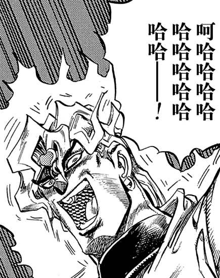

烈与吉吊的回答【1d10:7】

1 烈：当然是有的

2 吉吊：不可能有的

3 烈：你难道没有普通的朋友吗（好过分的家伙）

4 烈：当然是有的

5 吉吊：不可能有的

6 吉吊：想想办法的话总会有的（这什么鬼回答）

7 烈：当然是有的

8 吉吊：不可能有的

9 没有思路，下一个（你俩来搞笑的吗）

10 大成功/大失败【1d2：2】

烈：当然，这样的关系是存在的

黑帮老大把头侧到了一边

吉吊：呵

烈：吉吊小姐？

刚刚我是不是听到了嘲笑的声音？

吉吊：您误会了

并不是“嘲笑”，而是“鄙视”啊

烈：更过分了

吉吊：【1d100：40】的恶意，【1d100：60】的嘲讽，【1d100：32】的看轻，【1d100：11】的不屑一顾，以及剩下【1d100：4】的笑意

烈：合计147点已经超越100%了！

而且仔细听下来占了绝大多数的都是嘲讽和恶意，吉吊小姐你其实很讨厌我吗？！

鬼杰组的组长摆了摆手

吉吊：不，只是针对这个观点而已

人、妖怪、神明、死灵……

将这些存在维系在一起的从来都不是什么真挚的感情，而是极为单纯的欲望啊

想永远陪伴对方，换句话说就是独占对方的所有人生

心怀敬重与憧憬，换句话说就是对地位与实力抱有渴求

渴求纯净的友谊，换句话说就是只对他人的精神抱有欲望

纵使没有所谓的“肉体关系”，欲望的网络也依旧缠绕在不同存在的心灵之间

烈的情商【1d100：55】（保底20,50以上坚持自己的观点）

烈：话虽如此，这也只是“欲望论”而已

理想的关系是存在的，但纯净的友谊却并不存在，我是这样理解的

吉吊：即使多种多样的欲望混杂在一起，但只要在大体上维持了最为合适的距离，就可称之为实际意义上的“理想”了

您想说的是这个？

武术家严肃地点了点头

烈：就是这样

拿我一位异性友人来举例子的话

在单纯的友谊之外，还有着“对强者的喜爱”“与好敌手的比较欲”“自心而生的信赖感”以及一定程度上的“异性吸引力”

说是只有纯粹的友情是绝不可能的，但我们彼此都认为对方是极好的朋友

我想只要双方都有着这样的想法，便可称之为是理想的关系，至于其他琐事却是没有什么所谓的

黑帮老大在座位上翘起了二郎腿

吉吊：这样的只是自我满足感——我很想这么说，不过在这世界上只要能做到令自己满足，就已经在灵魂上超越了绝大多数的存在了

并不能认同您的看法，不过姑且也可以当做一个“行得通的结论”

武术家擦了把头上的汗

烈：那可真是太好了

说实话吉吊小姐你说话时真的很有魄力，和你对谈感觉压力好大

~突兀的neta解释环节~

本来应该补在最前面的但是我忘了（悲）

这次的原创活动和上次漫才安价回类似，包含了大量“帕露西的完美嫉妒访谈电台”这个mmd系列中的梗

其主要风格就是我在开头借帕露西之口说的那样，是我个人很喜欢的一个二次创作，感兴趣的大家可以去看一下哦

那么下一层继续更新（

烈：那么接下来是第二封，来自听众【1d10:1】的信

1 危险兔兔

2 赤龙

3 baki（为啥啊）

4 危险兔兔

5 The Wheel

6 星之卡比（为啥啦）

7 危险兔兔

8 黑白流星

9 恶人的救世主（你还听这个吗）

10 大成功/大失败【1d2：2】

危险兔兔：最近这段时间，对于自身的女子力感到有些绝望了

原本想着身边的大家都很残念我这样也没什么关系，实际上前些天出去玩的时候却发现上一份工作所留下的痕迹意外的沉重

时不时的就会触发过去的回忆然后干出糟糕的事情，眼睛刷得一下变得赤红整个人看上去充满了杀气，暴力行为已经变成了日常生活的一部分

虽说这么久过去大家都已经习惯了但这段时间却觉得还是好糟糕，这个果然是一种疾病吧？我该怎么办呢……

烈的察觉【1d70：33+30=63】（75以上察觉）

吉吊：过去生活中赖以生存的技巧在平和的日常中却成为了阻碍

在我们那边可不会有这种奢侈的烦恼

烈与吉吊的建议【1d10:2】

1 烈：无所谓

2 吉吊：凶暴性是必要的

3 烈：这时候就应该尝试一下武术（为啥啊）

4 烈：无所谓

5 吉吊：凶暴性是必要的

6 吉吊：去看些残忍而痛苦的场景吧（为啥啊）

7 烈：无所谓

8 吉吊：凶暴性是必要的

9 这里就靠我烈海王的直觉（为啥啦）

10 大成功/大失败【1d2：2】

烈：这回是有些沉重的话题

吉吊小姐对此有何看法？

吉吊：是呢

我想这位“危险兔兔”并不用去做什么刻意的改变

凶暴性是必要的，这就是我的想法

恋恋：哎？

为什么呢，这种不定时发作的狂暴会带来很多麻烦吧？

绿发的觉妖怪非常自然地搬了张凳子坐下并加入了两人的对话

吉吊：狼有着锋利的牙齿，鹰有着尖锐的利爪

水獭利用着它敏锐的五感，虫子则以身上的毒作为武器

如果要玩温馨而和平的过家家游戏，这些全都都是只会碍事的东西

但没有它们的话，却是决然无法在残酷而无情的竞争中生存下来的

烈：为了战斗而磨炼的本领是不应舍去的，是这个意思吧

可是，对方的困扰之处在于这在一定程度上妨碍了她现在的日常生活啊

吉吊：假如这位听众此后享受着永远的美好生活——无需战斗，无需竞争，远离弱肉强食，告别生死相斗——她也绝没有因此而特意做出改变的道理

因为那是她的过去

这份凶暴，这份本能，这份区别于其他懦弱者的力量正是其存在于此的证明

如果连“我身为我”的根本都能为了所谓的“方便”而抛弃，那么其人所存留的还剩下什么？

已经无法用舍本逐末来形容，这是对自己的一生所做出的最为彻底的否定

恋恋：否定了自身的人类就只是一副躯壳

否定了自身的妖怪或是灵魂，则会走向自我破灭的道路吧

烈的认同【1d50：11+50=61】（无所谓的观点+30，吉吊的说明+20）

烈：我并不觉得主动做出改变就会导致自我否决

不过仅限这个问题上，我的确认同你的观点

这位“危险兔兔”小姐是无需做出任何改变的

吉吊：您的理由是？

烈：因为这没什么所谓

从她的自述中可以听出，这种不定时狂暴已经持续了很长一段时间

但是她却仍然处于平和的日常之中，即使受到困扰也不过是“出门时遇到了些小麻烦”这种无关紧要的小事

那么恋小姐，我们从中可以得出什么结论呢？

恋恋的无意识【1d50：2+50=52】（60以上得出结论，不过75以上会跑掉）

草，无意识出目这么低是啥啊【1d10:2】

1 开眼10秒

2 1+恋恋：你……其实不是很喜欢他哎！

3 她把身边的人全部干掉了（为啥啦）

4 开眼10秒

5 4+恋恋：你……其实不是很喜欢他哎！

6 她其实已经控制住了（对了）

7 开眼10秒

8 7+恋恋：你……其实不是很喜欢他哎！

9 是铃仙（为啥啦）

10 大成功/大失败【1d2：2】

无意识的妖怪懒得动脑思考

她回忆着上次被阎魔说教时的心态，悄悄让“眼”睁开了一条缝隙

古明地恋扫了一眼身边的两人的内心——

恋恋：好奇怪

本来以为你们两个是关系不错的朋友

但刚刚用眼睛看了一下，你其实不怎么喜欢烈海王啊？

吉吊的话术【1d60：60+40=100】大成功（75以上蒙混过关，鬼杰组组长+40）

草，这里大成功是什么【1d10:6】

1 pua传说继续，被恋恋当做了单方面的朋友

2 烈：好厉害！是吉吊大师！

3 烈海王被初步洗了一下（好可怕）

4 pua传说继续，被恋恋当做了单方面的朋友

5 烈：好厉害！是吉吊大师！

6 和恋恋成为了真的朋友（为啥啦）

7 pua传说继续，被恋恋当做了单方面的朋友

8 烈：好厉害！是吉吊大师！

9 把恋恋拐跑了（这是大失败吧？）

10 大成功/大失败【1d2：2】

觉妖怪那一针见血的发言对于普通人而言可能会造成相当程度的混乱

但对于历经风浪的社会人士吉吊小姐而言，甚至连能力都无需使用就可以应付这种小问题了

吉吊：确实就像是您所说的那样

不过，倒也不能说是厌恶

头脑简单、思维混乱、语言表达能力低劣、堪比未成年人的天真、莫名其妙的自来熟、灾难性的衣着品味、只能讲出糟糕的冷笑话却对此毫无自觉的幽默感、以及对自身能力的过于自信——

差不多是这样的评价吧

烈：我怎么听都觉得这比单纯的厌恶要来的更过分啊！

吉吊：但是，对他人的喜恶与是否成为朋友，这两者之间其实并没有太多的相关性

在上一封回信的时候也讲过类似的话题吧？

人与人之间是通过欲望相连的，与他人的交往实际上是为了满足自己的欲望

在此基础上在一定范围内进行的相互利用，我们将这种事物称作友情

对这份相互利用的关系感到满意，彼此都认为在这个过程中得到了自己所需的报酬，这样的双方就是朋友了

恋恋：哎？是这样吗？

我觉得朋友是彼此志趣相投的，能和我一起玩得很开心的人吧？

吉吊：这并不矛盾

我们假设这里存在一只水獭

水獭认为，眼前的绿发少女看上去阴郁、不详、难以理解，且散发着危险的气息

它并不喜欢眼前突然出现的存在，但偶尔与这样的家伙说说话却也不会造成什么损失——于是水獭尝试着与这令人不安的妖怪进行了交流

作为结果，妖怪小姑娘得到了些许的愉悦，水獭虽然没能获得什么实质性的报酬，但却成功消去了对方的敌意

接下来水獭会怎么做呢？

恋恋：我想想……

水獭依然不太喜欢这个妖怪，但也不会特意去疏远她，那说不定会给它自己造成麻烦的

如果搞好关系了之后说不定它还能够利用妖怪做些事情，于是水獭和妖怪的交流在之后偶尔还会继续——啊，虽说关系称不上特别好，但她们也变成朋友了！

吉吊：就是这样

您刚刚所提出的问题已经由您自身得出了解答

无意识的妖怪开心地举起了手

恋恋：好厉害！

感觉你说话的样子和姐姐好像哎

呐呐，我们也来交朋友吧

我的名字是古明地恋！

鬼杰组组长的表情变的略微柔和了一些

吉吊：为什么不呢？

我很乐意与您构建友谊

不过，现在是录制节目的时间，【还请您先离开房间吧】

觉妖怪乖乖地走出了房间

武术家起身把门关上了

烈：真是令人印象深刻的友谊论

我挺好奇恋小姐是什么时候来的以及你们两位到底是怎么聊起来的，不过这些都无所谓了

我们刚刚说到哪了来着？

无意识的少女从窗边把头探进来了

恋恋：“危险兔兔”不需要做任何改变，其原因在于——

“她实际上已经控制住了自己的凶暴性”，你刚刚在心里是这样讲的~

吉吊：【也不要再插嘴了】，但还是谢谢您的补充

烈：没错，这就是我的看法

这位听众一直以来从没有因此而惹出过大麻烦，这并不能用简单的巧合来形容

这说明这份来自过去的苦痛，已经被其所承受住了

如今所留存下来的并不是疾病，而是名为“凶暴性”的个性

就像您所说的一样，若是将其轻易舍去，过去所留下的痕迹——那些难以忘怀的回忆——不就像是从未发生过了吗？然而，这却是不能用一句“无所谓”所略过的事情了

吉吊：因此，“只要保持这样就好”，这就是给这位听众的答案了

最后有什么想对“危险兔兔”说的吗？

烈的情商【1d100：15=20】（保底20）

烈：这里可是幻想乡，外表温文尔雅内心凶暴无比的家伙比比皆是

和某几位相比这种偶尔发作的凶暴性简直是人畜无害的等级，还请放心吧！

吉吊：真是有着您风格的总结性发言，“危险兔兔”听完之后大概不会感到多么欣慰吧

于是接下来是最后一封 来自听众【1d10:2】的信

1 Lord Flower

2 赤龙

3 baki（为啥啊）

4 补丁漫画家

5 The Wheel

6 星之卡比（为啥啦）

7 Silver Moon

8 黑白流星

9 恶人的救世主（你还听这个吗）

10 大成功/大失败【1d2：1】

赤龙：职场上的上司其实是人生的后辈，平日偶尔会因此而稍微调戏一下她

但最近【1d10：5】年间发现对方真的很可爱，于是逐渐往恋爱方面一点点接近着

在享受着这份恋爱喜剧般的日常的同时，也在犹豫要不要将关系进一步发展

告白的话大概会成功吧？

但戳破了窗户纸之后，现在这份有趣的氛围又会消失了

就是这样算不上苦恼的苦恼，请告诉我该怎么做吧

烈与吉吊的回复【1d10：7】

1 烈：无所谓

2 吉吊：这样就好

3 吉吊：拒绝恋爱话题，下一个（为啥啦）

4 烈：无所谓

5 吉吊：这样就好

6 烈：告白吧！（你是芙兰朵露吗）

7 烈：无所谓

8 吉吊：这样就好

9 无法回答，下一个（你俩搞啥啦）

10 大成功/大失败【1d2：1】

吉吊：我有一句话从刚刚就想说了，最近的部分听众是不是太过于清闲了？

友情关系、日常游玩、现在还出现了职场恋情

请大家首先严肃对待好自己的工作可以吗？

上班时间居然还想着谈恋爱，这样的员工在我手下是会被扔给马处理的

烈：毕竟不同的职场有不同的风格……

说回正题，我觉得这件事情没什么所谓

吉吊：您在每件事情上都是这样说的

烈：但这位听众的情况听起来就是这样

你看，吉吊小姐

为什么我们会认为“告白”是一件很重要的事情？

鬼杰组的组长露出了讥讽的笑容

吉吊：为什么您会问我这个问题？

您觉得我看上去像是谈过恋爱的人吗？？

您觉得天天要指挥一堆**和隔壁企业一堆更蠢的**竞争，时不时还要和马打架的我有功夫谈恋爱吗？？？

烈的情商【1d100：45】（保底20）

烈：我觉得挺像的，毕竟吉吊小姐看上去这么成熟而又富有经验——

黑帮老大面无表情地将十指交叉的双手摆在了自己面前，并以极有魄力的眼神看向了对面的武术家

烈：好的回到我们这次的话题中来

无论成功与否，“告白”都会让两人之间的关系进入到下一个阶段

而这件事的重要之处就在于，能否得到回应是未知的

会接受吗？会拒绝吗？还是暂且延后一段时间，在有了更多的心理准备之后再说？

抱着这样的心态鼓起勇气才能做到的事情，这样的才是“告白”啊

但是，这位听众所描述的情况——

吉吊：听起来不像是需要鼓起勇气才能做到的事情啊

烈：不如说完全已经是在以轻松愉快的步调谈恋爱了

那告不告白都没什么所谓了吧？看着心情来就好，这就是我的建议

吉吊：呵，真复杂

可惜啊，我没有谈过恋爱

武者顶着无形的压力将听众来信收好，而后看向了一旁的挂钟

烈：虽然很想继续读第四封信，不过差不多也该到结束的时间了

吉吊小姐对本次的节目感觉如何？

吉吊的评价【1d100：8】

吉吊：您要我说实话吗？

烈：不还是算了，光听到这熟悉的声音就已经能想到会是怎么样的评价了

吉吊：在我平生所见的娱乐节目中，其无聊程度仅次于天马的个人健美秀吧

烈：结果还是说了啊！

节目姑且还没有结束请你稍微嘴下留情些好吗？！

吉吊：听众们的来信都在絮絮叨叨地写些鸡毛蒜皮的小事

恶意犯规、下毒、暴力轰杀、处决叛徒、自尽，个人更希望听到类似这些的话题

烈：一般而言遇到这种情况的人会去报警而不是给电台投信

真是切实感受到了生活环境的不同，和吉吊小姐交流在各种意义上都是件对胃不好的差事

吉吊：真意外

我还以为您听到这么糟糕的评价之后会打算对我敬而远之呢

烈：就像你说的一样，对他人的评价高低并不影响日常的交际

比起说错一句话就可能被轰成渣的茶会，这种程度还算好吧

吉吊：那是什么好可怕

烈：好！就是这样，到了告别的时间了

本日是Strong Aquaman 烈海王与——

吉吊：Dragon tortoise 吉吊小姐为您播送

并不期待下回与您相会，再见

第一日的电台节目，到此结束

【1d15：8】分钟后

收拾好东西的武术家与动物灵从演播室中走了出来

烈：真是辛苦你了，吉吊小姐

说起来我原以为你是相当理性的人

结果录完节目发现你实际意外的感性化？

鬼杰组的组长顺手拿起了一旁恋恋的帽子，而后饶有兴致地逗起了觉妖怪

吉吊：您是这样想的吗？

我不否认这一点，强烈的感情与欲望正是我等生存的根基

以绝对理性的思维看待世界，恐怕只有没有灵魂的存在才能做到这点吧

不过呢——

电台访谈中的对话是需要一定的夸张成分以达成节目效果的

我自认在这点上做的还算不错

恋恋：咦？这么说刚刚你说的全是假话吗？

吉吊：谁知道呢？

您可以猜猜看，有多少是真的？

烈的推理【1d70：54+30=84】（75以上成功）

烈：据我观察……

大概有【1d70：51+30=81】%左右都是暧昧的真实观点，剩下19%则是用来应付的场面话吧

你意外地很认真啊

吉吊的震惊【1d100：15】

吉吊八千慧把帽子扣回了觉妖怪的头上

吉吊：用来应付的场面话是？

烈：关于友谊的部分

实际上，是否能够得到利益都不是你在交际中最关心的事物

你最看重的是实力

拥有实力的人就算在你那边的观感再差，也都会得到一分尊敬

吉吊：虽说平时聊天时已经有些察觉，实际见到之后还是不免有一丝惊讶

不愧是您

虽说是无关紧要的委托，不过也算是一份工作——

我可是相当敬业的人哦

她向着自己的“朋友”礼节性地做了道别

而后离开了平和的幻想乡，前往了现代的地狱之中

【1d3：2】小时后

~永远亭~

从地底归来的武术家看到了正坐在庭院中望着天空发呆的月兔

烈：下午好啊，铃仙前辈

铃仙：（为什么？！为什么这期被拿出来的偏偏是我的来信？！）

（明明期待着那位帕露西小姐小姐的回应结果听到的却是烈先生的声音到底是什么鬼啊！！！！！）

烈：？？？

怎么了，铃仙前辈？

看你好像很难受的样子？

铃仙的守口如瓶【1d100：27】（75以上成功，50以上部分透露信息）

铃仙：不不不！

什么都没有！！

我和危险兔兔没有关系！

也不会收听地底的奇怪电台的！！

烈：……

铃仙：……

烈的情商【1d100：35】（保底20）

烈：嗯，就

挺可爱的笔名哈

铃仙：呜呜呜呜呜呜呜啊啊啊啊啊啊啊啊！

迷途竹林中传来了野兽般的咆哮

正在屋内做客的仙灵好奇地看向了窗外

纯狐：铃仙怎么了？

师匠：谁知道呢？

在武术家【1d20：6】分钟的安慰与开导之后，月兔终于找回了正常的语言功能

烈：冷静点，前辈

我今天上午回信的时候还没发现那是你写的呢

因此那些回复都是我不带任何偏见来说的啊

铃仙：还以为你早就已经发现了结果是我自己说漏嘴的？！

这不是更残念了吗！

烈的话术【1d100：50】（50以上起效）

烈：没关系的，铃仙前辈

就跟我说的一样，这些事情完全没所谓

铃仙：有的吧……

我知道你和那位吉吊小姐说的有道理啦

实际上我也确实不会在重要的场合出岔子，也没有因此而让无关者受伤

但是这样的我一点都不正常啊……

武术家无可奈何地叹了口气

烈：我一到关键场合就容易胡言乱语，说话说到一半就打起拳，天天把无所谓挂在嘴边

你觉得我正常吗？

铃仙的情商【1d100：42】

铃仙：——怎么看都是超级奇怪的人吧

烈：但是我无所谓，因为我本来就是这样的人

我的朋友们不会因此而厌恶我，本就不喜欢我的人更不会因此而改变对我的看法

既然如此，我为何一定要做改变？

铃仙：因为……

不是理想中的自己？

第一天的活动结束，时间来到第二天

~第741天~

第二日的嘉宾是【1d10：4】

1 师匠

2 神子

3 摩多罗（为啥啊）

4 幽香

5 白莲

6 霖之助先生（为啥啊）

7 紫苑

8 赫卡提亚

9 探女（为啥啊）

10 大成功/大失败【1d2：1】

~演播室~

桌上奇怪的摆设被换成了永琳的可爱风人偶以及一朵在冬日盛开的向日葵

本日的嘉宾顺手带了些新的剪报过来，《女子力大赛冠军！星熊勇仪！！》的报道被贴在了墙壁的右上角

无意识的妖怪今天跑出去找新朋友玩了，某个带着火把的妖精悄悄在窗外探出了头

烈：试音，试音

好的我这边没问题，你呢？

幽香：随时都可以

要像桥姬一样以沉重的长篇大论开场吗？

我有点想看哦~

烈：帕露西小姐的风格我可实在是模仿不来

冗长且消极的开场白暂且略过

听众朋友们大家好，我是能用武力解决就尽量不开口的烈海王，想不到该怎么说话的时候就喊“霸”吧！

幽香：想不到该怎么说话的时候就乖乖闭嘴吧

烈：然后今天的嘉宾是这边这位

太阳花田的暴君，大妖怪中的大妖怪，即使在冬日也一如既往充满魄力的四季鲜花之主风见幽香小姐！

幽香：大家好~

说起来“幽香小姐”是什么新鲜的叫法？

烈：毕竟是在录节目嘛，像平常那样感觉不太合适

还是说要换成以前那样的“幽香女士”？

【1d2：2】

1 还是幽香小姐

2 幽香大人！

大妖怪坏笑着竖起了手指

幽香：毕竟是在录节目嘛

那么出于娱乐性的考虑，叫“幽香大人”吧~

烈的厚脸皮【1d100：60】（保底20,50以上叫）

武术家用手抹了把脸

烈：好，好

还请幽香大人对听众们的来信提供些建议吧

幽香：♪

面色愉悦的大妖怪哼起了歌

烈：那么首先是第一封，来自听众【1d10:4】的信

1 66面之人

2 小玉藻

3 baki（为啥啊）

4 补丁漫画家

5 The Wheel

6 星之卡比（为啥啦）

7 Silver Moon

8 黑白流星

9 恶人的救世主（你还听这个吗）

10 大成功/大失败【1d2：2】

想不到补丁漫画家要说什么因此骰一下【1d10:9】

1 姐妹关系

2 漫画剧情

3 钱，我需要钱（为啥啦）

4 姐妹关系

5 漫画剧情

6 被人追杀了（为啥啦）

7 姐妹关系

8 漫画剧情

9 赫卡提亚大人您在哪啊（为啥啦）

10 大成功/大失败【1d2：2】

补丁漫画家：去地狱旅游到一半的时候，唯一的领路人兼实力者说着“我去那边玩一下”就不知道跑到哪里去了

想着靠自己走回幻想乡，却误入了冲突最严重的地区

一番苦战后被地狱的鬼神与妖精们抓了起来，想着这下要完蛋了却被认出了身份

于是被瞬间变得彬彬有礼的地狱居民们供奉了起来，但代价是被关进了一天不画够8个小时就不能出门的屋子

这样不能摸鱼的日子已经持续了足足【1d30：5】天了，赫卡提亚大人您在哪里啊快来救救我吧！！！

尴尬的沉默持续了【1d15：4】秒

幽香：我们来看看下一封信吧

烈：幽香大人！

至少说两句评论啊！！

幽香：这样的来信连讨论的价值都没有

如果是要讨论漫画剧情或者漫画家与读者的关系等等，我们至少还能提供些自己的看法

但是这种被非官方编辑催稿一样的体验——

嗯，祝你工作愉快吧？

烈：说的也是，我觉得这信投去是非曲直厅的效果大概会更好些

克劳恩皮丝？

回头我请你吃点心，可以麻烦你去地狱救一下紫——补丁漫画家小姐吗？

窗外的地狱妖精比了个“一大盘”的手势，然后晃着火把飞走了

烈：刚刚的求援信暂且不算，看看真正意义上的第一封来信

来自听众【1d10：9】

1 66面之人

2 小玉藻

3 baki（为啥啊）

4 超人

5 The Wheel

6 星之卡比（为啥啦）

7 Silver Moon

8 黑白流星

9 恶人的救世主（你还听这个吗）

10 大成功/大失败【1d2：2】

嗯……说起来救世主先生最近的状况是【1d100：89】（越高越好，越低越糟糕）

恶人的救世主：花费了【10+1d10：7】年的光阴后利用【超越天堂】的力量改变了过去的悲剧，然后终于和命运的一族达成和解了！！永远别再见面了该死的海洋学家！！！

虽说这份力量用完之后就消失了但这没有关系，现在的我在实际上超越了命运，天堂已经不需要了！

带着这样的自豪感想要和许久不见的儿女们炫耀一下，却发现现在他们已经有了自己的生活

儿子那边还好说但是女儿不知为何对我有些过分的偏见，这到底该怎么办啊？

烈与幽香的建议是【1d10:6】

1 烈：总之先去见一面吧

2 幽香：反省一下自己的过失吧

3 幽香：先从寄信开始吧（为啥啦）

4 烈：总之先去见一面吧

5 幽香：反省一下自己的过失吧

6 烈：拜托儿子帮忙吧（为啥啦）

7 烈：总之先去见一面吧

8 幽香：反省一下自己的过失吧

9 没有思路，下一个（你俩搞啥啊）

10 大成功/大失败【1d2：1】

啊，顺便骰一下我们的情报强者对这位听众是【1d2：1】

1 知道

2 不知道

幽香：居然真的成功了，令人意外啊

我还以为他会被宿敌暴揍到粉身碎骨或者被沉到深海中的棺材一类的地方封印起来呢

烈：幽香大人？

可以问一下明明是常见的家庭矛盾类问题你却摆出了一副回忆过去的表情的原因吗？

大妖怪随手抱起了桌上的永琳玩偶

幽香：过去偶尔遇见的小事而已，不要在意~

回到这位听众的问题

和女儿闹别扭了，这当然是父亲要担负主要责任

归根到底，身为监护人一方的他连树立正确的形象都没能做好

在旁人看来有着这样的结局也只能说是无可奈何吧

烈：不过，这位听众也有着他为难的地方吧？

前面那两句槽点过多以至于不知如何下手的话大概就是让这种情况出现的主要原因

教育方面的议论姑且放到一边，我对这位恶人的救世主的建议是——

去拜托儿子帮忙吧

绿发少女揉搓着玩偶的脸

幽香：这可不像你的风格

“总之先见一面再说”，这种超直球发言才是我的烈海王哦

武术家轻车熟路地无视了恋人的调笑

烈：如果放在普通的假腿中，我确实会这样说

但这位听众的情况比较复杂——女儿在这期间已经成长为了相当有个性的人物，这种可能性也不能说没有吧？

这里毕竟是幻想乡，唐突见面很可能会导致一场激烈的冲突

因此就拜托儿子去探探口风，不管怎么说先把“我回来了”这个消息告知给久别的女儿

幽香：之后再看着对方的反应而随机应变……

还算稳妥的建议，不错嘛

是参考了过去的经验吧？

烈：没错，我以前认识一对关系非常复杂的父子

那种一见面就几乎要死战的氛围至今令我记忆犹新

据说最近关系变得很要好了，身为友人感到很是欣慰

修正一下，上一层把“家庭”打错成“假腿”了（悲）

大妖怪将玩偶放回了桌上

幽香：你可真是个体贴的大叔~

烈：是是是，多谢幽香大人的夸奖了

那么接下来是第二封，来自听众【1d10:8】的信

1 66面之人

2 小玉藻

3 baki（为啥啊）

4 超人

5 The Wheel

6 星之卡比（为啥啦）

7 Silver Moon

8 黑白流星

9 新免武藏守藤原玄信（你怎么写的啊）

10 大成功/大失败【1d2：1】

黑白流星：昨天在家整理相册的时候发现，有很多过去常常活跃的家伙都已经在不知不觉间消失不见了

虽说真要找的话大概还是能找到，但还是会感到有些寂寞

很久时间都不出门的妖怪们到底在想什么呢？

烈与幽香的回复【1d10:5】

1 烈：这里就靠我烈海王的直觉

2 幽香：因为没有必要

3 烈：只是在睡觉而已（说不定是正解）

4 烈：这里就靠我烈海王的直觉

5 幽香：因为没有必要

6 幽香：一直默默地注视着你们哦（好可怕）

7 烈：这里就靠我烈海王的直觉

8 幽香：因为没有必要

9 幽香：其实就在你身边哦（好可怕啊！）

10 大成功/大失败【1d2：2】

烈：这一回涉及到的是时间观念的问题

退隐、避世、幽居

如此种种，许多妖怪或者神明会在几十年甚至上百年的时间内淡出常人的视野

这个问题说实话我也不懂，幽香大人可否提供些解答呢？

幽香：这其实是很常见的情况

因为没有必要，仅此而已

烈的理解【1d100：32】（保底10）

烈：不好意思我还是没太听懂

幽香：代入一下它们的视角，就可以理解了

几十年不出门的人类会变成什么样？

烈：大概会变成丧失语言能力的野人吧？

幽香：然而对于非人者来说

几十年或者上百年只是一段短暂的时光

在黑白流星眼中，这些妖怪已经很久没有出现过了

但实际上，它们之中的大部分却只是抱着“这段时间不太想出门，就先自己待一会吧”的想法自顾自地隐居了而已

烈：那么这是今日最后的来信，来自听众【1d10：7】

1 66面之人

2 小玉藻

3 baki（为啥啊）

4 超人

5 The Wheel

6 星之卡比（为啥啦）

7 Silver Moon

8 UFO

9 新免武藏守藤原玄信（你怎么写的啊）

10 大成功/大失败【1d2：2】

Silver Moon：我最近发现了一件很奇怪的事情

我的男朋友在平时总能说出十分糟糕的低情商发言，跟浪漫扯不上一点关系，简直就是灾难级的气氛毁灭者

但是，他在外面却能和相当难缠的对手在口头交锋上平分秋色，和其他人交流的时候也能做出顺应气氛的恰当对应，和某人调情的时候甚至能爆发出令我也叹为观止的才能

我想请问一下，这到底是出于什么原因呢？

幽香：噗

绿色头发的大妖怪拼命忍住了自己的笑声

烈的察觉【1d70：28+30=58】（75以上察觉）

烈：哦，这次是恋爱相关的问题啊

虽然我说这个不太好，但这位男士听上去真是相当过分

——幽香大人你怎么笑起来了？

幽香：哈哈哈哈哈哈！

没事没事，还请让我听听你的意见吧

绿发少女终于畅快地笑出了声

烈与幽香的看法【1d10：6】

1 烈：我想这是一种信任的证明

2 幽香：不同的人之间有着不同的相处方式

3 烈：他可能只是单纯的脑袋不灵光（为啥啦）

4 烈：我想这是一种信任的证明

5 幽香：不同的人之间有着不同的相处方式

6 烈：他很可能出轨了（为啥啦）

7 烈：我想这是一种信任的证明

8 幽香：不同的人之间有着不同的相处方式

9 幽香：感觉很有趣还是说出来吧（为啥啦）

10 大成功/大失败【1d2：1】

武术家严肃地思考了一阵

烈：这位Silver Moon小姐需要小心了

我想您的男朋友很可能已经出轨了！

一旁的大妖怪笑的趴倒在了桌上

幽香：哈哈哈哈，能问一下，哈哈哈，为什么吗？

烈：从他的表现就可以看出来

明明有着这般的才能却只对女朋友说些糟糕的话

不仅如此，在其他的女性面前却表现的这般出色——简直就是在沾花惹草！

幽香：是渣男啊？

烈：凭借我丰富的社会经验，我现在就可以断定

这是百分之百的渣男！

风见幽香信服地鼓起了掌

幽香：对待这样的渣男应该怎么办呢？

烈：必须要下狠手

起码也要狠狠打上一顿，再考虑之后的事情！

四季鲜花之主端起杯子喝了口茶

幽香：原来如此~

顺便问一句

今天我们的演播室在地上，现在的时间是下午

为什么天会突然变黑啊？

烈的察觉【1d70：35+30=65】（第二次标准降低到50以上察觉）

武术家感受着天空中那熟悉的魔力

而后默默地擦了把头上的汗水

烈（唇语）：救 命 啊 幽 香 大 人

幽香的同情心【1d100：99】大成功（75以上救一把）

草，这里大成功是什么【1d10:2】

1 诱导出了烈的救场发言

2 1+叫一个月幽香大人

3 将电台节目强行持续下去了（为啥啦）

4 诱导出了烈的救场发言

5 4+叫一个月幽香大人

6 一般通过鬼王来救场了（为啥啦）

7 诱导出了烈的救场发言

8 7+叫一个月幽香大人

9 非常愉快地和永琳站在了一起（这怎么救啊？）

10 大成功/大失败【1d2：2】

幽香（唇语）：叫一个月的幽香大人~

烈（唇语）：我无所谓！

大妖怪坏笑着耸了耸肩

幽香：对待这种家伙当然，是要降下制裁的铁锤的

不过，我很好奇

这个恶劣至极的渣男，为什么要一遍遍地去找她说些不好听也不浪漫的话呢？

窗外魔力的涌动停息了一瞬

永远亭的武术家立刻抓住了这由对方所提供的机会

他深深吸了一口气，而后尽可能平静地说出了自己的回答

烈：要我说的话……可能是因为这对他而言就像呼吸一样

幽香：不去搭讪的话就会死？

这可真是渣到骨子里了

烈：不，这里指的并不是“必要性”

对于强者们而言，即使长时间屏息或者干脆抛弃呼吸也不是什么难题

但是他们却大多还是保持着如同常人一般的呼吸频率

因为这能让他们感受到“生活的实感”

大妖怪思考了片刻，便明白了对方言语中的真意

幽香：并非平日养成的习惯，而是已经刻进内心深处的行为

不这样做的话会感到恐慌，仿佛在虚假与真实之间存在着一条暧昧而不明的界限——在接触到它的时候，才能感受到自己切实是存在于此的

窗外的天空逐渐变回了原来的颜色

武术家抬手拿起了桌上的玩偶，并看向了她那可爱的面庞

烈：没错

这其实是一件很自私的事，站在另一方的视角来看只会感觉不知所谓和厌烦吧？

虽然作为主播来说这话不太合适，但我果然还是觉得这男人糟糕透顶了

幽香大人抬手指向了武术家

幽香：果然呢~

但是，这也只是两个怪人的推测而已

我们的思维方法可不能代表世间的常理

烈：幽香大人的意思是？

幽香：站在一般性的角度，用普通人的思维，最简洁明了的答案是？

烈：说白了只是想和喜欢的人多说说话

也就是，“爱”啊

怪异的黑色彻底从天空退去

冬日温暖的阳光照进了演播室中

烈：差不多也到了该结束的时间了

幽香大人对本次的节目评价如何？

幽香的评价【1d100：48=50】（烈的主持保底50）

幽香：不带私人感情的话48分，携带私人感情的话50分

及格标准是75分

烈：好严格的评判标准！

私人感情只占2分！

幽香：比起在大多数时候都能游刃有余的桥姬，你还是控制不住嘉宾的气场呢

今天我放水了因此才能勉强达成平局，昨天则是被吉吊小姐彻底压制住了

烈：真是感谢你手下留情……

那么，到了告别的时间了

本日是由 无所谓的武术家 烈海王与——

幽香：独断专行的女王 风见幽香 带来的节目

烈：那么大家，下回再见。再见！

【1d20：8】秒后，演播室外传来了敲门的声音

在恋人幸灾乐祸的眼神中，做好了心理准备的武术家拉开了房门

温婉的银发女子正在门外看着他

永琳：主持节目辛苦了~

“幽香大人”很难对付吧？

烈的情商【1d100：84】

烈：我过于口笨舌拙了

还请永琳大人多加指导

永琳的厚脸皮【1d100：82】（50以上正常）

月之头脑伸手弹了下弟子的脑门

永琳：没关系，反正我已经习惯了

“永琳大人”听起来很有趣啊

你接下来【1d30：6】天就这么叫吧~

幽香：恭喜，烈

一天之中多了两位压在你头顶上的大人物呢❤

烈：我无所谓

永琳大人，我觉得在永远亭里这么叫的话你会更尴尬哦

永琳：我无所谓

反正更尴尬的是你！

幽香：不，无论怎么想都觉得是与此无关的其他人会更受不了吧

幽香的玩心【1d100：98】大成功（50以上建议烈去红魔馆）

草，玩心大成功是什么【1d10:4】

1 大家一起去红魔馆看热闹吧

2 再读一封信吧

3 约……约会？（还约吗？）

4 大家一起去红魔馆看热闹吧

5 再读一封信吧

6 约魅魔出来玩吧（为啥啦）

7 大家一起去红魔馆看热闹吧

8 再读一封信吧

9 我也去旧地狱玩玩吧（为啥啦）

10 大成功/大失败【1d2：2】

绿发的少女伸了个懒腰

幽香：接下来

还有半天时间，去红魔馆看看吧

永琳：你和吸血鬼还有来往吗？

幽香：不是去拜访哦

大概，等一会那边会发生有趣的事

我想看看烈这两天的建议会导致什么样的结果呢~

烈：？？？

我这两天好像没拜访过红魔馆啊？

一头雾水的武术家与月之民，跟在心情愉悦的大妖怪身后前往红魔馆了

【1d120：65】分钟后

~雾之湖~

如今是一年之中气温最低的时候，本就寒冷的雾之湖自然变本加厉地展示着它的特点

弥漫的白雾中甚至出现了四处飞舞的冰块，时不时可以从中听见妖精们嬉戏的声音，以及某位冰之妖精标志性的笑声

而此时此刻，正有两位打扮古怪的男子站在湖畔，凝望着位于中心的洋馆

其中一位青年穿着意大利风格的浮夸服饰，其上衣胸口处有着心形的空洞，露出了他结实的胸肌。他有着令人形象相当深刻的发型——金色的头发在额头前方烫出三个大小相同的圆圈，又在后方扎起了一个小辫子——配合上那优雅的面庞，更显出一种独特的魅力

而另一位容貌妖异美丽的男人则穿着一身更加一言难尽的衣服——黑色的紧身衣与亮金色的外套与皮裤，浑身上下都有着绿色的爱心型装饰，配合那高高翘起的尖头皮鞋，与其坚毅的容貌形成了鲜明的反差

烈的震惊【1d100：19】

烈：好时髦

我是不是也可以考虑一下这种类型的衣服——

永琳&amp;幽香：绝对不要

这个时候，那位发型独特的青年转头看向了武术家，而后十分自然的搭起了话

？？？：你好，我的名字是乔鲁诺·布兰多

请问那边的城堡就是红魔馆吗？

烈：没错

你们二位是外界的来客？

？？？：很好，看来我还没有记错地方

出发了乔鲁诺，这次全靠你了！

——话说你不是那个狂暴到极点的妖怪吗？！

为什么会一脸自然地站在这里？！把你的阳伞放下，不要用那东西指着我迪奥·布兰多！！

永琳：你还认识这么奇怪的家伙？

幽香：这位迪奥·布兰多是过去发动吸血鬼异变的成员之一

那可真是个不错的异变，能让人提起兴致的对手到处都是呢~

迪奥：这不是你初次见面就发射魔炮的理由

如果没有【The World】的力量我就要灰飞烟灭了！

喂那边的男人，你似乎得到过咲夜的帮助啊

烈：确实，我这条假腿就是咲夜小姐帮忙做的

迪奥：看在女儿的份上，我迪奥大人好心提醒你一句

离这个狂暴的家伙远点！

烈：额，嗯，多谢提醒

我是她男朋友

金发的吸血鬼用手捂住了自己的脸

迪奥：这个世界疯了吗？

乔鲁诺：不好意思，我的父亲是个有些神经质的男人

不介意的话可以跟我讲讲过去的事吗？

具体来说就是他被打败之后说了些什么……

奇奇怪怪的五人谈笑着走向了红魔馆

【1d15：9】分钟后

~红魔馆~

说起来红海皇你听了回信之后的打算是【1d2：1】

1 告白吧！

2 继续维持现在的感觉

这个时候，十六夜咲夜正面临着她这段时间最大的——不，莫种意义上算是她此生最大的危机！

“咚！”

红发的门番将女仆长逼到了角落，用手在墙壁上砸出了一个小坑

咲夜：（居居居然是壁咚吗？！）

居居居然是壁咚吗？！

过于紧张的女仆长，直接将心声说出了口

红美铃：咲夜小姐

我有话想和你说一下

红发的门番将脸贴了过来

可以看到对方明亮的双眼

可以感受到彼此呼吸时的温度

咲夜：太近了！太近了啊啊啊！

红美铃：我——

“请问十六夜咲夜小姐在吗——”

就在这时！

年轻的黑帮老大恰好站在了红魔馆的门前

他礼节性的问候刚刚说到一半，就看到了一旁角落中进展正好的两人！

乔鲁诺的震惊【1d100：34】（50以上打断）

乔鲁诺：（远距离操纵型？本体增强型？还是说是某种特殊性质的能力？！）

（不，不对，没有丧失行动能力，也不是中毒，她应该可以第一时间使用能力逃脱才对！）

（这么说来这——难道是？！）

乔鲁诺瞬间意识到了这起事件的【真相】！

他默默回头，带着仿佛一无所知的表情离去了

红魔馆的门番在尴尬的沉默中挠了挠头

红美铃：额……继续还是下次再说？

【1d10：9】（1或10的话继续）

咲夜：之后的等到晚上再说我先处理一下家里的事情！

乔鲁诺你给我站住！！！

帅气的金发青年回过了头

乔鲁诺：要把幸福牢牢抓在手中才行啊，姐姐

咲夜：先给我说清楚你为什么会过来这里啊！！

【1d15：14】分钟后

乔鲁诺：——就是这样

父亲他终于与宿命的一族和解了

现在，他想要和你见上一面

咲夜的认同【1d100：64】（对dio的观感为36,64以上同意）

相当苦恼的女仆长，在弟弟那真诚的眼神中败下了阵来

咲夜：那个毫无责任感的男人……

算了，只是见一面的倒也没有问题

~湖畔的草丛中~

金发的吸血鬼做了几个大幅度的深呼吸

迪奥：——不好意思，医生

我呼吸有些不太顺畅，请问你有带相关的药物吗？

永琳：你是吸血鬼吧？

那只要不呼吸不就可以了？

武术家向着这位人到中年的老父亲竖起了大拇指

烈：加油啊，迪奥先生！

不管怎么说千万别打起来就好！

做好心理准备的迪奥·布兰多带着自信的表情站出了草丛

而后，就看到了他的女儿正面无表情地一步步走来

迪奥：吼

居然向我走过来了

你竟然不逃跑，还主动送上门来找我吗？

咲夜：要是不走进点，该怎么和你说话呢？

迪奥：吼吼

既然如此，那不妨再走进点

在仿佛西部枪手决斗的氛围中，父女二人步步走进了彼此！

凄厉的冷风带着冰块吹过

许久不见的父女二人陷入了短暂的沉默

最终，先开口的是【1d2：2】

1 迪奥

2 咲夜

银发的少女率先开口了

咲夜：我对现在的生活很满意

大小姐她们对我很好，我交到了很多朋友，现在也有在谈恋爱了……

总而言之，我过得很不错

迪奥的情商【1d100：48】

迪奥：是吗

看来将你托付给蕾米莉亚·斯卡雷特是我做出的正确决定

咲夜：说什么呢你这不负责任的混账！

把女儿往别人家里一丢就自己走了，这世界上有这样不负责任的父亲吗？

迪奥：哈哈哈！

就是我迪奥哒！

完美无缺的女仆长无奈地捂住了脸

咲夜：你真的没救了……

奇装异服的男人走向了红魔馆的方向

迪奥：在拜访完永远鲜红的幼月之后，我就会和乔鲁诺离开幻想乡了

这是我目前在外界的地址，有空的话就写封信过来吧！

但是，我是不会写信给你的！

十六夜咲夜带着一脸莫名其妙的神情收下了父亲丢来的纸片

咲夜：哈？

啊？

你本来也就不用写，我不会看那玩意的！

下一个瞬间，银发的少女便消失在了父亲的身前

迪奥·布兰多默默看向了草丛中的三人

迪奥：我，有表现得像个威严的父亲吗？

幽香：完全没有

永琳：神经质和癫狂可以看得出来，威严完全找不到啊

烈：迪奥先生，至少你尽力了

下一次先主动给女儿写封信吧？

迪奥：天哪

这可比和海洋学家战斗要困难多了……

红美铃：迪奥先生还是和过去一样，是个奇妙的男人呢~

混黑道的好青年向着红魔馆的门番行了一礼

乔鲁诺：我和父亲的工作地点都离这边太远了，平时基本抽不开身，是无法常来探望她的

姐姐她就拜托你照顾了

红美铃：还请安心交给我红美铃吧！

忍无可忍的女仆长向门番的头上扔了道飞刀

咲夜：你给我停下！我还没同意！我还没有同意呢！！！

告别了鸡飞狗跳的布兰多一家，三人走向了永远亭的方向

烈海王的两日电台主播工作，到此结束

