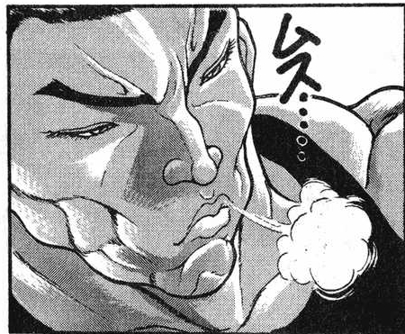
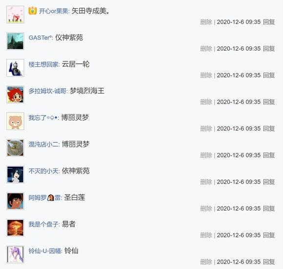
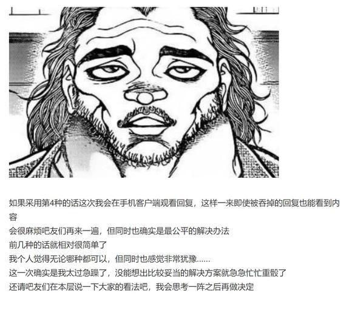
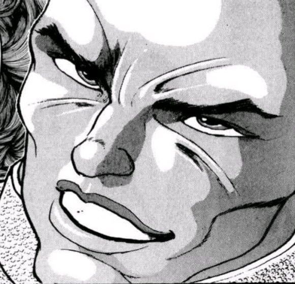
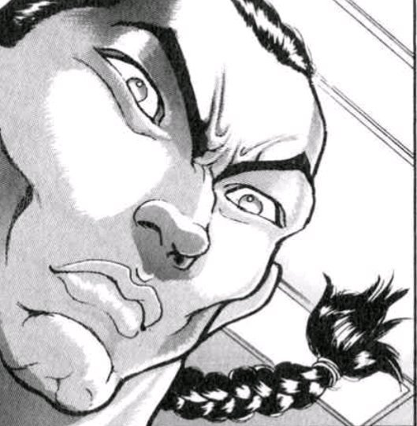

【1d3：2】天后

~第743天~

~勇仪的家~

烈的说明【1d100:64】（50以上理解）

酒桌上的武术家向好友聊着他前几日所经历的事情

烈：就这样，电台主播的工作总算是结束了

实际尝试过后才发现，听众是真的会认认真真考虑你的意见的，这意外的是份沉重的工作啊

勇仪：我觉得你做的其实还算不错啊

起码没有给出那种特别离谱的建议

——但那个“幽香大人”是真的腻到我了，你给我赔钱！

烈：我第一次听说打白工还要反贴钱的哦？！

金发独角的恶鬼勾了勾手指头

勇仪：来来来，叫个“勇仪大人”听听？

烈的厚脸皮【1d100：9=20】（保底20，75以上叫）

烈：你可拉倒吧啊

有一大群小弟天天“大人大人”的喊还挺不够吗？

怎么就没人管我叫烈大人呢？

勇仪的玩心【1d100：5】大失败（50以上叫一声）

大失败是什么【1d10:5】

1 说出了超级糟糕的段子

2 终于被反击了一次

3 勇仪 愤怒了（为啥啦）

4 说出了超级糟糕的段子

5 终于被反击了一次

6 喝多了（为啥啦）

7 说出了超级糟糕的段子

8 终于被反击了一次

9 玩过头了（这是大成功吧？）

10 大成功/大失败【1d2：1】

勇仪：呦，你也想当个老大？

行啊，那我叫一声给你听听

烈——

话才说到一半，恶鬼就停了下来

勇仪：不，还是算了

烈：哎？

说啊，勇仪，怎么不说了？

勇仪：这个真的好羞耻啊！

你居然真能说出来到底是怎么做到的啊？

烈：别转移话题啊

这刚说好的事怎么这就反悔了？

勇仪：不要，绝对不要！

这个太过分了！

武术家笑着与有些羞涩的朋友碰了碰杯

他终于在与酒友的谈笑中拿到了第一次胜利，真是可喜可贺

（本日的更新结束，下一次的更新在周三或周四，内容为安价回）

（以下是我的废话）

那么本次的原创活动结束了，不知各位感觉如何？

没看过这个mmd系列的朋友可能会感到有些迷惑，不过我自己写起来感觉非常开心（

虽然长篇大论的开场白远远赶不上原作者，离西尾老师的距离就更是遥不可及了，但自己亲手去写这样风格的话语还是会让我感觉非常的愉悦，好爽啊！

当然，这个超级负能量的开场白与之后角色们的很多超级离谱言论都只是配合剧情的演出而已，大家不要当真呦（笑）

写吉吊和烈的对话很愉快，不如说是我这次更新中写的最愉快的一部分

这种毒舌、吐槽、冷暴力但又不算真正厌恶的感觉说起来真是很适合前半场的基调，斯巴拉西！

恋恋那个开眼让我以为本来可能要一转战斗了没想到吉吊小姐的话术出了大成功，你好强啊！

那个梗选项的真朋友是一个双向的，也就是说吉吊小姐确实把恋恋当成她的真朋友了

即使如此还是会对真正的朋友在无关紧要的场合使用能力，我认为这就是她的风格呢（笑）

后半场完全就是搞笑剧情，从第一封信开始就谐疯了

dio骰出了个89的好结局索性就塑造成谐星了，毕竟本贴不是jojo贴嘛，只是彩蛋等级的小捏他而已（

魔理沙那块稍微严肃了一下，然后下一封师匠的信真的让我自己都笑起来了草草草草草

真的是太过恰到好处师匠你在窥屏吗（

至于超级自觉的烈我已经笑的肚子疼了草草草草草

那么本次的更新到此结束，下一次的更新是安价回，大概是周三或周四，骰子明天发

Dio和giogio都是彩蛋角色，理所当然是不会进安价选项中的，请大家不要妄想了哦（笑）

顺便一提，安价时间是明天早上9点30分

和上次一样，9:30分安价地点，9:35分安价角色

到时候我会发两个专门的安价层的，请大家放心

标准还是和以前一样哦（

（补上慧音安价回被吞的19257层的内容）

霖之助：正是

事实实际上从未发生过，人们所看到的永远只是纸面上的记载

因此凭空捏造的事实能够成为历史，反之客观发生的事件也能从历史中被抹去

妹红：这话不对吧？

虽说普通人类没有办法准确得知几百上千年前的事实，但对于我们而言那也不过是一段时间前发生的事件而已

我所亲身经历的过去，不就是最为准确的历史吗？

霖之助：这就是标准的谬误

你的所见所闻永远只是事实的一个侧面

因为事实是建立在信息之上的，脆弱而又不稳定的空中楼阁

就算处于同一时间同一地点，藤原妹红与上白泽慧音对于同一事件的看法也绝不会相同，把事件的旁观者换成我和烈海王当然也是一样的

烈：由于实力、种族以及立场的差异，我们每个人对于同一件事情的看法都不一样

换而言之，人们收集到的信息总会有着微妙的差异，因此我们没有办法确信自己得到了真正的事实……

您想说的是这个观点吗？

慧音：就是这样

而在幻想乡之中，历史的编篡比起外界又更为艰难

因为过去是在不断变化的

烈的疑惑【1d100：12】

武术家沉默的思考了一阵

烈：——是由于历史中的当事人们都还活着？

霖之助：没错，这就是最麻烦的地方

如果说外界的人们只需苦恼于对信息的解读，那么幻想乡的史官对于信息本身的真实性都要产生怀疑

作为当事者的妖怪们往往只会提供她们当时想要提供的情报，说出她们眼中的事件，因此信息的主观性占据了极大的比例——某些妖怪为了自身的喜好而扭曲了过去的事实，也绝不是什么新鲜的事情

作为事实之基础的信息本身都成了变化无常的东西，又谈何事实呢？

从这个角度来说，幻想乡没有像样的历史

慧音：这也是我所困扰的地方

稗田家编撰了成百上千年的庞大资料为我提供了相当大的帮助，我也相信她们客观求实的精神——但那毕竟是人所积累下的记载

我想若要记录下幻想乡的历史，那么妖怪的记载也是必不可少的

之前听魔理沙说过，霖之助君在尝试着以尽量客观的视角记录下他所看到的事件，因此我才会来求助于他

那么言归正传，请问您可否将日记借我一观呢？

安价楼（地点）

（人物楼在9:35分发）

这次安价回的地点是【什么地方】？

请大家自由发挥

请在此楼回复

安价楼（人物）

烈海王将与【什么人物】相遇？

请在此楼回复

再次重申一次，范围仅限于【东方stg正作】【东方格斗作】与【东方官方书籍】中登场的人物，新人物与已经出场过的人物都可以

地点【1d20：19】

1 玄武之泽的温泉

2 魔理沙的被窝里

3 月都

4 赛之河原

5 月面静海

6 月之都格斗大会

7 烈的枕边

8 三途河畔

9 地狱温泉

10 东京塔地下研究所

11 太阳花田

12 神灵庙

13 东深见高中

14 地月间拉格朗日点（引力平衡点）

15 梦境世界

16 发生事故的雾雨魔法店

17 白玉楼

18 永远亭

19 守矢神社的地下竞技场

20 太阳花田

人物【1d20：13】

1 梦境烈海王

2 键山雏

3 村纱水蜜

4 云居一轮

5 铃仙·优昙华院·因幡

6 依神紫苑

7 雾雨魔理沙

8 易者

9 八云蓝

10 矢田寺成美

11 依神紫苑

12 云居一轮

13 梦境烈海王

14 博丽灵梦

15 博丽灵梦

16 依神紫苑

17 圣白莲

18 易者

19 铃仙

20 依神紫苑

烈海王将在【守矢神社的地下竞技场】遇见【梦境烈海王】

地点选项方面意外的大多是正常的地名，感谢大家手下留情

——我很想这么说但是那几个梗选项真的好恐怖啊！

魔理沙的被窝和烈的枕边这种选项骰到之后怎么想都是相当惨烈的发展啊！

拉格朗日点该怎么去啊？！

怎么还有东京塔的地下研究所？武藏道堂堂复刻？！

温泉只有两个真是谢天谢地（悲）

最后中了最温柔但也是最草的地下竞技场梗选项，草草草草草

雾雨魔理沙并不是一个地点名因此被我踢出去了（笑）

让好感增加96的神奇药水店这种把本贴系统橄榄的选项也理所当然的不行啊（笑）

人物方面倒不算太出乎意料，几个熟面孔和少数没出场的几位都有出现

但是为啥有两个易者和两个梦烈？上次梦烈进了选项这次没理由踢出去了草草草草草

居然还真中了梦烈配合上这个地点倒也确实很合适哦？！

这个地点的话可以发展的方向蛮多的......裁判、解说员、主办方、队友、对手、乱入者......会变成什么样还真不好说（笑）到时候交给骰子决定吧

希望别变成上次大擂台赛一样的恐怖工作量（悲）

那么安价环节到此结束

~紧 急 调 整~

刚刚回顾的时候发现，在今早安价的环节中，人物安价层中有一位安价梅蒂欣的吧友的回复被吞了

如图所示，当被吞的回复放出来之后，前20的顺序发生了改变（悲）

这个真是完全的意料外情况，因为被吞的回复即使是我也看不到（悲）

为了公平性的考虑决定按照正确的顺序重骰一次，但是只重骰人物还是连着地点一起彻底重骰我目前正在思考......总之无论如何都得重骰了（悲）

考虑到之前是地点人物两个一块骰的

这次彻底重骰吧（悲）

地点【1d20：4】

1 玄武之泽的温泉

2 魔理沙的被窝里

3 月都

4 赛之河原

5 月面静海

6 月之都格斗大会

7 烈的枕边

8 三途河畔

9 地狱温泉

10 东京塔地下研究所

11 太阳花田

12 神灵庙

13 东深见高中

14 地月间拉格朗日点（引力平衡点）

15 梦境世界

16 发生事故的雾雨魔法店

17 白玉楼

18 永远亭

19 守矢神社的地下竞技场

20 太阳花田

人物【1d20：4】

1 梦境烈海王

2 键山雏

3 村纱水蜜

4 云居一轮

5 铃仙·优昙华院·因幡

6 梅蒂欣·梅兰可莉

7 依神紫苑

8 雾雨魔理沙

9 易者

10 八云蓝

11 矢田寺成美

12 依神紫苑

13 云居一轮

14 梦境烈海王

15 博丽灵梦

16 博丽灵梦

17 依神紫苑

18 圣白莲

19 易者

20 铃仙

于是本次安价回重骰之后的结果是

在【赛之河原】遇到【云居一轮】

~再 次 调 整~

好的，我作出决定了

不过在此之前，需要确认一个相关的规定（虽说以后估计没大有机会用上了）

本次是我第一次遇到这种情况而产生了相当混乱的处理，此后再有类似的情况会统一取当时的结果

换句话说，由于被吞等不可抗力出现的安价环节失误，此后就不再修正了

那么下一层公布这次特殊情况的处理

~最终调整~

烈海王将在【赛之河源】的【守矢竞技场】遇见【梦境烈海王】与【云居一轮】

~彩蛋~

~威严~

~红魔馆~

蕾米莉亚：许久不见了，迪奥·布兰多

你的天国计划，看样子大体成功了啊

迪奥：吼

看出来了啊，永远鲜红的幼月

蕾米莉亚：过去牢牢缠绕在你身上，让你苦痛挣扎却又永远无法逃离的线

如今已经消失殆尽

虽然没能将那份抵达天国的力量保存下来，但你终于——

迪奥：超越了【命运】！

这感觉真是太美妙了，我都想高歌一曲了！

哪怕是百年前实现长生不老的时候也从未有过像现在这样愉悦舒畅的感觉

我真是high到最高点了！！

蕾米莉亚：尽管如此，你在咲夜的面前依然表现的像个低能儿一样

为什么不和她说实话呢？

过去将她送来的真正原因是【1d10:1】

1 保护她的安全

2 四处奔逃无力抚养

3 真的就是不想负责任而已（你好渣啊）

4 保护她的安全

5 四处奔逃无力抚养

6 是我迪奥的直觉（什么鬼啊）

7 保护她的安全

8 四处奔逃无力抚养

9 蕾米莉亚的建议（为啥啦）

10 大成功/大失败【1d2：2】

蕾米莉亚：是为了保护她的安全吧

你的血脉、操纵时间程度的能力、以及命运的枷锁

同时具备这三点的咲夜，在外界是不可能平安无事的

金发的吸血鬼面无表情地端起了手

迪奥：你也在平和的日常中退化了吗，蕾米莉亚·斯卡雷特

比起这些胡言乱语，我更想听些有建设性的建议

——我，到底如何才能在她面前抱有威严呢？

永远鲜红的幼月轻笑着摊开了手

蕾米莉亚：在家人面前就别端着架子想什么威压了，没有任何意义哦

先把那奇奇怪怪的说话方式改过来，再主动和咲夜寄封信如何？

迪奥的认同【1d100：76】（75以上听从建议）

妖异而美丽的男人严肃地思考了一阵

迪奥：希望她不会把我的信撕掉……

此后，红魔馆的女仆小姐偶尔会收到从外界寄来的信件

虽然其大多数时候都只是再看完之后就收到一边

但偶尔心情不错的时候，也会提笔回上一言半语

~线上交友2~

~畜 生 界~

鬼杰组的组长正用通讯器与新认识的朋友聊着天

恋恋：——比起烧死我觉得还是吊死更有趣些！

吉吊：真巧，我也是这样想的

比起燃烧躯体时所带来的直观冲击，悬挂而死的躯体能提供更进一步的恐惧

就像是b级片与恐怖电影的差别一样呢

恋恋：就是说啊~

啊，稍等一下哦

姐姐说她想和吉吊小姐说两句

觉的推理【1d70：8+30=38】（50以上察觉身份，75以上察觉能力）

觉：初次见面，吉吊小姐

恋恋能交到新的朋友，作为姐姐的我很高兴

我在对话中大概能听出来，您的工作环境并不很平常？

吉吊：（用暧昧不明的话语试探，看样子她没能确定我的身份……）

彼此彼此

我这边的企业竞争相当严格

您那边的压力应当也不小吧？

觉：大家都在为了生活而努力啊~

旧地狱的环境可实在算不上好

在这样暗无天日的地下所盛开的蔷薇只有一朵，我可必须要保护好才行

黑帮老大随手转着钢笔，并微笑着做出了回应

吉吊：（但由于些许的危机感，还是立刻发起了警告吗……）

当然，我完全能理解您的意图

恋小姐是个可爱的孩子

我可不想在和她说些工作上的话题

那可太煞风景了，不是吗？

觉：很高兴我们达成了一致

那么我就先不打扰了

继续和朋友聊天吧，恋恋~

地灵殿的主人将通讯器还给了自己的妹妹

恋恋：刚刚在聊很严肃的话题吗？

吉吊：只是说点无关紧要的小事而已

您有个很好的姐姐呢，恋小姐

（本日的彩蛋结束）

~听众来信~

~演播室~

说起来帕露西本人对于这次代理电台的评价是【1d100：39】

帕露西：第一日的姑且可以打上及格分——

但是第二日的电台节目光是听着就已经让我的嫉妒槽max，不，甚至已经突破极限了！

这样的电台除了伤害听众还有什么意义！真是嫉妒啊！

紫：对于你来讲这种节目不是再好不过了吗~

帕露西：如果可以的话我希望能从不幸的悲伤的绝望的卑鄙的无耻的懦弱的邪恶的低劣的丑陋的恶心的恐惧的虚伪的无能的充满妒意的对象身上补充能力，而不是自己坐在一旁嫉妒的要死

紫：真是扭曲的守护神

顺便一问

这次提供信件的听众都是谁呢？

金发碧眼的妖怪捡起了桌上未开封的信

帕露西：已经念过信的那几人暂且不提

至于没有出场的几位嘛……

The Wheel是云居一轮，只是单纯把名字翻译成英文了而已

66面之人，有着这么多副面孔的也只有秦心小姐了

超人就是超人，圣白莲

UFO则是同为命莲寺所属的封兽鵺——话说她们家来信意外的多啊

星之卡比是那位粉色的贤者吧，上次漫才的梗

至于小玉藻，那不是你家的式神吗

紫：还有几封奇怪的信呢？

水桥帕露西面无表情地注视着桌对面的妖怪贤者

帕露西：紫小姐，那不是你偷偷混进来的外界读者来信吗

话说外界的居民居然能听到我的电台——算了光看你的表情就已经懒得问了

附上昨天忘记发的电台骰子（

这周事比较多，看情况估计是明晚或者后天晚上更新了(悲)

今晚七点半左右更新

一会得跑出去拿个东西因此更新推迟到7:45分(悲)

~这件事发生在烈海王来到幻想乡的第【741+1d30:19=760】天~

距离巫女与仙人的决斗，已经过去了将近3个月

幻想乡的冬天快要结束了，如今正是如月的末尾

尽管气温仍未回升到可以称之为温暖的程度，但居民们那炽热的心却让他们忽视了屋外的严寒，而投入到了令人兴致高昂的活动中去

最开始的事件是【1d10:7】

1 早苗去参观了武术班

2 前来下战书的一轮师傅

3 梦境居民们又跑出来了（为啥啦）

4 早苗去参观了武术班

5 前来下战书的一轮师傅

6 烈海王提出来的馊主意（为啥啦）

7 早苗去参观了武术班

8 前来下战书的一轮师傅

9 是梦境一轮！（为啥啦？！）

10 大成功/大失败【1d2：2】

~三途河边~

现在是小妖怪武术班的教学时间

某位冰之妖精理所当然的没来，今天来上课的只有两位熟面孔以及终于愿意出门的人鱼

而受到邀请前来的风祝，正在一旁观看着武术家的教学

烈：——那么今日的课程到此结束，之后大家自由练习

感觉如何啊，早苗小姐？

早苗的评价【1d70：17+30=47】（烈的教学+30）

山上的巫女摆出了一副相当微妙的表情

早苗：这……我不否认能学下来的话效果会很好

但这标准也太严格了吧？

也就是妖怪们能跟上你的练习，普通的人类怕是连一节课都撑不过去吧

烈：连这点训练量都跟不上还怎么学武术？

就算只想学护身术也不能忽视最根本的练习，这才是武者必须要有的素质！

若鹭姬：其实比之前已经好很多了~

有段时间烈老师上课的时候还特别喜欢喷人呢

武术家尴尬地摆了摆手

烈：大家一提意见我这不马上就改了吗

说起来早苗小姐怎么突然想起来我这参观了？

早苗：一方面是我个人的兴趣

而另一方面嘛——我其实是来做实地考察的！

烈的疑惑【1d100：14】

武术家看着少女脸上的神色，感到微妙的有些熟悉

烈：（上次看她露出这种神采飞扬的表情是在……）

你打算在这地方建分社？

东风谷早苗摇了摇头

早苗：在三途河边怎么可能收集到信仰呢？

我在考虑的是另一件事

你有没有觉得幻想乡少了点东西？

就是所有格斗家都需要的那个

烈：竞技场？

早苗：没错！

直接开打或是现场建场地很有幻想乡的风格，但作为一个观众果然还是在专门的场地观看决斗要来的更加爽快！

但我们守矢神社毕竟是正经的地方，可不能在祭祀神明的神圣之地兴建这种血腥的建筑——

烈：因此就把目光投向了这边吗

确实，三途河岸这边的空地很多

像东京巨蛋那样的规模是不太可能，但仅供少数人使用的一个比赛场地应当是没问题的

早苗：而且最重要的是，这片地区是无主的

死神小姐只会收取灵魂的过路费，无须征得任何人的同意就可以在此处举办活动了！

巫女小姐兴致勃勃的说明才进行到一半，一旁的虫妖怪就默默举起了手

莉格露：不，关于这点的话

其实是有的哦，河岸边的水子之灵

烈对水子之灵的了解【1d100：59】

烈：水子之灵……

指的是在更里侧的区域内堆石头的灵魂们？

把半个身子挂在虫妖身上的橙点了点头

橙：那块地区叫做赛之河原

嘛，其实三途河边的区域都可以算是赛之河原

不过她们平日活动的那一块离这里还是有一点距离的

那是些可怜巴巴的小孩子的灵魂呢~

巫女小姐有些困扰地挠了挠头

早苗：没想到还有原住民在

哎呀呀，多谢提醒

这就必须得去确认一下她们的意见了

希望反对的呼声不会太高……吧？

烈：（突然就跑到人家地盘上说要建竞技场，估计八成是够呛）

我也一块去看看吧

告别了身后正拼命甩脱猫妖纠缠的弟子与一旁看热闹的人鱼，武术家与巫女前往赛之河原了

【1d15：4】分钟后

~赛之河原~

说起来目前河原的情况是【1d10：4】

1 只有戎璎花

2 一轮师傅也在

3 梦烈也来了（为啥啦）

4 只有戎璎花

5 一轮师傅也在

6 梦烈和另外一位梦境居民（为啥啦）

7 只有戎璎花

8 一轮师傅也在

9 梦烈和一轮打起来了（为啥啦）

10 大成功/大失败【1d2：1】

广阔而荒凉的河滩旁布满着圆形石块，石缝中零零散散地插着红色与绿色的纸风车与塔型的竖长木片——也即卒塔婆

“第一个送给父亲”

“第二个送给母亲”

“第三个送给……”

嘴中叨念着莫名的话语，水子之灵们就在这诡异的氛围中欢快地堆砌着圆形的石块

其中一位看上去像是首领一般的长耳垂少女，正坐在一堆垒好的石块上

她有着一头奶白色的头发与深色的肌肤，穿着有淡红色泡泡图案的白色衣裙，其发型与袖子看上去如同水母一般

不请自来的俩人小心地绕过了河岸边的石碓，并走进了这位初次见面的少女

烈：你好，我的名字叫烈海王

请问你是这些灵魂的首领吗？

戎璎花的好感度【1d100：95】

白发黑肤的少女惊喜地看向了初次见面的武术家

她高兴地挥起了手，看上去似乎想要站起身来迎接

但随后又放弃了自己的动作，并维持着坐姿说起了话

戎璎花：呀，你好！

我的名字是戎璎花，是垒石大赛的组织者——从这个角度来说，也算是水子之灵的首领吧

我知道你！你是经常在那边上课的老师吧！

一旁堆石头的亡灵们闻言纷纷抬起了头，而后兴奋地将武术家团团围了起来

早苗：看不出你这么受欢迎啊？

你好，我是守矢神社的巫女东风谷早苗

戎璎花：我们这边平常可是很少有人来的哦

过去，只有那位死神小姐偶尔回来和我们聊天

但自从烈海王他们来了之后，就天天都能看到很厉害的战斗了

而且还有我们从来没见过的上课环节

虽然离得太远了听不见在说些什么，但光看着就让垒石头的工作变得更有趣了呢！

烈海王手忙脚乱地应付着热情的水子之灵们

烈：哦哦

那你们也大可来一起上课啊

我们这补习班不要学费的，只要感兴趣想学就都可以来，我无所谓！

水子之灵的表情暗淡了一瞬，而后立刻又摆出了那副开朗的笑容

戎璎花：谢谢你啦

但是我们无论如何都得堆石头才行……而且也有些不太方便的地方，在这里旁观的话就已经很满足了！

烈的察觉【1d70：58+30=88】（50以上察觉留念，75以上察觉身体状况）

大侦探先生在脑中回想着亡灵们不断重复的言词，以及眼前少女刚刚那略显怪异的动作

他立刻察觉到了这些细节背后的真相

烈：（啊……这可真是……）

这位早苗小姐想利用河边的空地建竞技场，就是一个决斗的正式场所

她们的经验很丰富，是绝不会干扰你们垒石的工作的——请问这样可以吗？

河原的偶像兴奋地笑了起来

戎璎花：可以近距离观看符卡战了吗？

那真是太好了，大家都会很开心的~

武术家谢过了少女，而后示意着有些迷惑的早苗与他一同走到了远处

早苗：怎么了，烈海王？

我还没和她商量具体细节呢

烈：早苗小姐，我不知道你看出来没有

这些孩子很可怜

而与我们交谈的戎璎花，大概是其中相当不幸的一位了

（注：由于原剧情中并未明说，以下对话中包含大量我个人的推测，请大家不要太当真哦）

绿发的巫女思索了片刻便得到了答案

早苗：你指的是它们垒石头的工作吗？

在民俗学中，这被视为夭折的孩子对于父母的供养

辛苦垒砌起的石塔会被鬼所破坏，此后又开始重复之前的工作，如此永无止境地进行着徒劳无功的苦劳

而这种行为实际上的原因是，对于尘世的留念吧

烈：没错

我过去聊天时听四季小姐说过，留念现世的灵魂是无法前往彼岸的

那位红发的死神时不时过来看一眼，可能就是想要进行开导好渡她们过河

早苗：身为亡灵的执念啊

向着错误的方向做着没有意义的努力，偏偏又只能等待它们自己醒悟过来

真令人心情不爽……

但是，戎璎花小姐看上去状态明明就比其他的灵魂都要好吧？

烈：是啊，她看上去很是乐观和坚强

是个相当活泼开朗的孩子

只不过，你不觉得有些奇怪吗？

早苗的疑惑【1d100：37】

早苗：要说奇怪的点

她从来没离开过座位，然后动作也有点古怪

她自称是有些不太方便的地方——不会吧？

烈：这只是我的推测

戎璎花很可能缺失了部分骨头

因此她根本就无法从那堆石头上站起身来

她应该也想像莉格露海王她们一样学习武术或者打格斗战吧

但这压根就是不可能的事情

绿发的风祝沉默了片刻

水子之灵们的留念是不会被他人所影响的

先天性的缺失更是无法挽回的事物

自己所前来的目的已经达成了

但是，有着这样的一群观众在——

早苗：竞技场就必须要建成露天的样子了！

还得给它们在观众席上留出足够的区域好拿来垒石头

不然的话，观众朋友们该怎么一起观看比赛呢？

武术家笑着点了点头

烈：真是个好主意

刚建好的竞技场可不能没有比赛看

人选由我来负责找，先来打个【1+1d3：1=2】场比赛吧！

告别了前去商讨细节的巫女，烈海王去寻找参赛者了

地点导入结束，现在骰一下一轮师傅与梦烈本次前来的理由

一轮【1d10:4】

1 烈：要来参赛吗？

2 正好遇到了前来挑战的一轮师傅

3 其实是解说（为啥啦）

4 烈：要来参赛吗？

5 正好遇到了前来挑战的一轮师傅

6 其实是乱入者（为啥啦）

7 烈：要来参赛吗？

8 正好遇到了前来挑战的一轮师傅

9 其实遇到了梦烈（为啥啦）

10 大成功/大失败【1d2：2】

~命莲寺~

【1d60:33】分钟后

蓝发的僧侣正和搭档一同处理着寺中的杂务

就在这时，某位眼熟的家伙跑到了她的跟前

云居一轮立刻条件反射般的摆出了战斗架势

一轮：烈海王？！

你又来干什么？！

烈的说明【1d100：10】（50以上理解）

急切想要说明自身意图的武术家下意识地打起了车轮拳！

烈：哦哦哦哦哦哦哦哦哦哦哦！

一轮的误解【1d100：89】

命莲寺的僧侣一脸懵逼地看着眼前这怪异的景象

一轮：你——难不成以为靠这种攻击就能打倒我！？

你在小看我云居一轮吗！！！

狂怒的入道使一拳轰了过去

烈：哦哦哦哦哦破！

但武术家立刻破解了对手的招式！！

【1d5：2】分钟后，看不下去的云山主动制止了这场毫无意义的战斗

云山：一轮冷静点

烈海王大概只是习惯性混乱了

你是来找圣大人的吗？

烈：不好意思刚刚有点着急了

事情是这样的……

【1d15：9】分钟后，头昏脑涨的入道使终于勉强理解了武术家的来意

一轮：新建竞技场的开幕仪式，同时也是给水子之灵们观看的表演赛啊

南无三，真是悲哀的亡灵……

放心交给我超人云居一轮吧

我会毫不留情地在观众们面前把你痛揍一顿的！

烈：一轮师傅看上去很有自信啊

但你的对手可不一定是我，这次参赛的可还有两人呢

接下来我打算找【1d10:9】

1 白莲师傅吧！

2 诹访子

3 神奈子（为啥啦）

4 白莲师傅吧！

5 诹访子

6 梦烈突击（怎么来的）

7 白莲师傅吧！

8 诹访子

9 梦烈把烈替换了！（怎么做到的）

10 大成功/大失败【1d2：1】

就在烈海王与一轮商量赛程的时候——

不可思议的事件，发生了！

事后，目击者云山（男 入道）如此说到

云山：那看上去好像就是在一瞬间内发生的事情

虽然这么说有点奇怪，但幻想乡的大家想必是都能理解的

不过，当时我愣了大概有个3~4秒钟才反应过来

烈海王被烈海王替换了

云山：没有任何征兆，第二个烈海王突然出现在了本体的身边

我们过去见过类似的现象

那是曾经在完全凭依异变时出现过的——

梦境中的自己啊

梦烈：这可真是难得的机会

你就去梦境世界玩几天吧！

烈：什么——

外貌与本体完全相同的梦境居民，就这样出现在了烈海王的身后

而根本没能反应过来的本体瞬间就被丢入了梦境世界中！

一轮的震惊【1d100：90】

一轮：哈啊？！

这啥啊？！

这又是什么鬼啊？！

梦境世界的武术家带着一脸极为傲慢的表情看向了眼前的蓝发少女

梦烈：呵，是云居一轮啊

没想到你现在连句人话都说不出来了，真可悲

入道使嫌弃地往后退了两步

一轮：这糟糕透顶的说话方式和惹人生厌的语气……

你是梦境中的烈海王？

你怎么过来的？

梦烈怎么过来的啊【1d10：3】

1 梦魔理沙的魔法实验

2 是凭依现象的高端应用！

3 某位妖怪贤者的恶作剧（为啥啦）

4 梦魔理沙的魔法实验

5 是梦早苗的奇迹！

6 某位秘神的恶作剧（为啥啦）

7 梦魔理沙的魔法实验

8 向梦堇子学习了技巧！

9 哆来咪的协助（为啥啦）

10 大成功/大失败【1d2：2】

梦烈：无法理解吗

动动你那可怜的大脑，能在梦与现实间穿梭自如的人还有几个？

今日凑巧遇见了八云紫，她又刚好心情不错——

于是我烈海王就过来了！

一轮：那个可恶的境界妖怪

梦境世界的这家伙不是比现实中还更糟糕吗？！

啊，烦死了，我不管了

明天的比赛要怎么办啊？你代替本体去？

梦烈：比赛？

什么比赛？

【1d15：14】分钟后，满脸不耐烦的梦境烈海王从入道使处听完了事件的来龙去脉

梦烈要做什么【1d10:9】

1 我无所谓

2 与我无关

3 去砸场子吧（你这屑人）

4 我无所谓

5 与我无关

6 解说员就是我梦烈哒！（为啥啦）

7 我无所谓

8 与我无关

9 现在就开打！（为啥啦）

10 大成功/大失败【1d2：2】

梦境烈海王头疼地揉着自己的太阳穴

梦烈：这都什么玩意

三途河边怎么还有这么一群可怜的孩子？

一轮：（第一反应居然是这个？！）

梦烈：行啊，那就去打比赛——

但我可没耐心慢吞吞地帮东风谷早苗找什么参赛选手

跑去赛之河原把你干掉，这事就算结束了！

一轮：你还挺自信啊？

行啊，现在就出发

我就让你看看圣大人所传授于我的，真正的绝技！

一脸不屑的武术家与怒气冲天的入道使走向了三途河

嗯……

接下来先进行【1d2：1】

1 梦烈一轮战

2 烈海王梦游仙境

【1d15：10】分钟后

~赛之河原~

刚刚与水子之灵的领袖商量好具体细节的巫女小姐惊讶地发现，刚走不久的武术家与命莲寺的僧侣急不可耐地飞了过来

早苗：？？？

这位是命莲寺的一轮小姐？

你们两位这是——

一轮：原本的烈海王被他替换了

这个性格更加恶劣的家伙是梦境世界的烈海王

梦烈：现在我就和云居一轮打一场，之后就与我无关了！

早苗的理解【1d100：70】

作为地下竞技场的资深老观众，早苗小姐瞬间理解了武术家的意图

早苗：我懂了

你难得来了一次现实世界就想着多打几场，但又不想违背已经定下的承诺——于是就想着速战速决后再去随心所欲地游荡嘛

可以理解，这是格斗家们的天性

大家把垒好的石头先拖到一边哦！

格斗赛要开始了！

梦境中的武术家看向了一旁坐在石头上的水子之灵

梦烈：你……平常没法去上课是吧？

那就在这场战斗中让你看看

我们中华武术优于其他技术的全面证明！

戎璎花：哦哦，好厉害！

这就是强者的自信吗？

一轮：别被骗了，小姑娘

这只是他那过度的骄傲自满而已

哈，梦境中的烈海王也是烈海王

就在此一战中，彻底击溃你！

在亡灵们期待的目光中，两位格斗家各自站到了临时场地的边缘处

充当裁判的巫女高高举起了右手——

早苗：中华武术 烈海王

入道拳法 云居一轮&amp;云山

堂堂正正 一决胜负！

