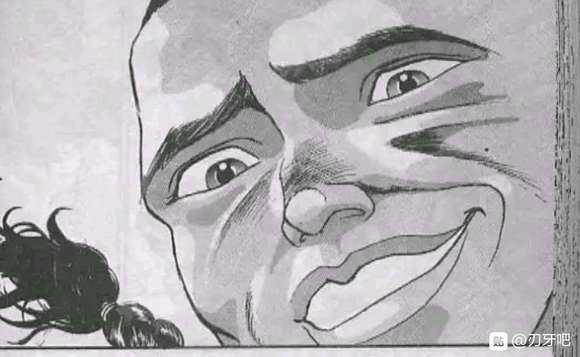
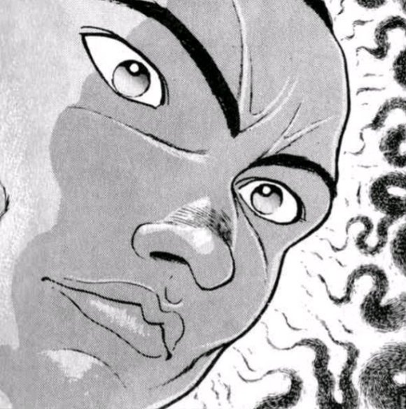
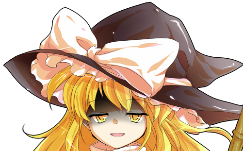
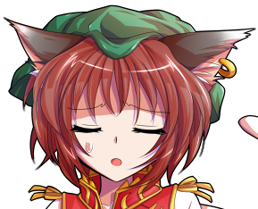

战斗！

BGM：守旧老爹与前卫少女

云居一轮&amp;云山

Atk 250 （80）

Hp 19

技能：

入道云山：在战斗中借助云山的力量，战斗力+170

就算屡战屡败也决不放弃：自身的Atk增长为80，Hp增长为19，对其必杀技与技能的破解判定所需成功值+10，符卡强度进一步增强

沉寂的怒气：习得超人术的一轮学会了将怒气转化为攻击力的技巧。战斗开始后累计受到4点伤害后，自身Atk+15/累计受到8点伤害后，自身回避概率X3/累计受到12点伤害后，自身攻击成功的场合可进行一次【1d100】的连击判定，50以上成功，成功时对手受到第二次伤害判定。一场战斗中仅限一次，一回合内受到大于等于6点伤害并导致败北的场合，可进行一次【1d100】的愤怒判定，高于30时Hp+1。

神拳【天海地狱冲】（CT3）：（近战系）云山对对手施加威力极强的重拳乱打。Atk+70，给予伤害+3

连打【帝王海妖来袭】（CT4）：（近战系）令云山从对手的侧面超快速挥拳，并同时放出大量弹幕，对对手造成3点伤害并进行6次【1d100】的连打判定，65以上成功，每次成功造成1 点伤害

必杀技

溃灭【天上天下连续勾拳】（CT5）：与云山一同使出威力无匹的勾拳连击，抛弃持续性，仅求一击必杀的决战符卡！Atk+110，给予伤害+4，本回合战斗成功的场合对对手进行一次【特殊攻击】重击：进行一次【1d100】的重击判定，20以上成功，成功后对手下回合无法进行回避/破解/防御。（对手具有特殊攻击耐性的场合，成功标准提升至50）

超人【韦驮天之拳】（CT6）：利用秘术挥动出超乎常人的重拳，Atk+675，给予伤害X4，其后2T自身回避概率X2

超人【怒云之铁锤】（CT7）：“反正我就是不会那些花里胡哨的技巧啦！！”令入道云山化为坚实的云铠，配合超人的力量做出最后的一击！无法回避/破解/防御，Atk+825，给予伤害X5，本回合结束的场合，失去云山的支援。

梦境烈海王

Atk：279（147）

Hp：22

技能

烈 海 王：超越海皇，仍为海王。AtkX1.9，Hp+1。不会陷入异常状态，不会受到驻足，束缚等判定影响，面对所有技能都可以进行【1d100】的破解判定，60以上成功

完全消力：普通攻击以及近战系、弹幕系技能所造成的的最终伤害/2（仅对Atk260以下的对手起效）自身所收到的普通攻击伤害-1，近战系、弹幕系技能伤害-2（仅对Atk261以上的对手起效）

时符【一瞬千击】（CT1）：（近战系）一场战斗中仅能使用一次，在静止的世界中利用血魔法与自身的武艺进行无情的连打。本回合战斗自动成功，自身Hp减少【1d3】，给予伤害+Hp减少出目X3。（对手拥有特殊攻击耐性的场合，需进行一次【1d100】的时停判定，30以上成功）

异红符【干将莫邪】（CT3）:（近战系）被现实中的烈海王所舍弃的符卡思路，以魔力凝结自身血液铸为吹毛断发的双剑。本回合Hp-2，自身攻击必中，Atk+70，给予伤害X2

异花符【曼珠沙华】（CT4）：（弹幕系）现实中的烈海王偶尔想过的魔改花弹，以自身的血液制造妖异的魔花。本回合Hp-2，对对手造成必中的【1+3d3】点伤害。

急救拳：一场战斗中只能使用一次，Hp归0后回复1点Hp

贫穷神的加护：并非本体，无法使用

必杀技

纯粹武道（CT5）：怀抱纯粹的武术，心存无色的执着。3T内Atk+70，对对手造成的伤害+3。3T内可对所有攻击进行【1d100】的破解判定，近战系、技巧系技能30以上成功，其余技能40以上成功，必杀技60以上成功

超人【烈海王】（CT6）：Atk+675，给予伤害X4，其后2T内Atk+25，回避概率翻倍

武符【梦幻斗舞】（CT7）：无法回避/破解/防御，本回合自身无敌，给予伤害X2，进行一次【1d100】的反击判定，30以上可对对手的攻击进行反击

秘术【天文密葬法】（CT8）：制造虚假的月亮，削弱妖怪的力量，3T内战斗环节中，妖怪对手的Atk变为与自身最终结算后相同，自身的战斗骰变为【2d100】但同时无法使用破解，无法回避/破解/防御，给予伤害X2/引导宇宙的力量，发出轨道诡异的大量弹幕轰击 无法回避/破解/防御 Atk+900，给予伤害X6

T1

入道使谨慎地摆出了迎战的姿势

一轮：来吧，烈海王

距离上次交手已经过了一年，就让你看看我修行的成果——

而梦境中的武术家，却在战斗刚开始的时候就用出了自己的底牌之一！

梦烈：想炫耀的话去找小妖怪们，我没兴趣

【The World】，时间停止吧！

瞬间

观众们兴奋的笑容

前来观战的弟子们奔跑的身影

裁判席上的巫女那疑惑的神情

以及，自己的对手脸上那不敢置信的表情

所有人都如同字面意思一般“停滞”了下来

在这静止的世界中，唯有武者一人独自前行

梦烈：一秒经过……

“底牌是要留在最后翻盘的”

“平时战斗的时候应当磨练自己”

“不应该依靠外物”

一派胡言，在最开始的时候干掉敌人就不需要担心这么多了！

Hp：22-【1d3：1】=21

梦境中的烈海王随手用血液制造了数道赤色的飞刀

梦烈：三秒经过……

云居一轮，这种程度用来对付你就已经绰绰有余了

符卡宣言 时符【一瞬千击】！

没有丝毫手下留情的意图

在短短的数秒之间，武术家对着无法动弹的入道使施加了狂风骤雨般的连打！

蓝发少女那娇小的身躯被无情地击向了飞刀阵的正中央——

本回合战斗自动成功

一轮的受伤【1d10:6】

1 回避

2 小伤害+1X3

3 小伤害+1X3

4 中伤害+1X3

5 中伤害+1X3

6 大伤害+1X3

7 大伤害+1X3

8 特大伤害+1X3

9 特大伤害+1X3

10 大成功/大失败【1d2：1】

梦烈：十秒经过

然后，时间开始流动

Hp：19-3-3=13

一轮：噗啊？！

云山！

入道使在最后一刻勉强让云山挡住了大部分的飞刀

而后，在第一秒就遭受突袭的她无力地摔落在了地上

梦烈：嚯，居然还没昏迷

有进步啊，云居一轮

蓝发少女挣扎着从地上爬了起来

一轮：开场就用时停突袭，你那还算是武术家啊？！

梦烈：哈！武术家就不能用时停吗？

这么说来血剑不能用，花弹不能用，天文密葬法岂不是更用不得了？

我才不管这一套，我无所谓！

T2

累计受到6点伤害

沉寂的怒气发动

一轮的Atk：250+15=265

入道使用手抹掉了嘴边的鲜血

一轮：你突袭还有理了啊？！

梦烈：连这样的突袭都接不下来，还有什么资格跟我战斗？

你似乎看着“我”平常的表现就产生了些误解啊

但“我”在外界可没这么温柔！

梦烈的攻击【279+1d100：5=284】

一轮的攻击【265+1d100：100=365】

或许是因为对手的气场与现实中的他有着相当大的区别

或许是因为那恶劣至极而又趾高气扬的笑容

又或许是因为那风格不同但却同样令人青筋暴跳的言语

总之，在战斗开始后的第二个回合——

云居一轮就已经进入了极其愤怒的状态！

一轮：少来这套！

吃我一拳，你这卑鄙无耻的家伙！

武者甚至还没来得及躲闪，入道使全力以赴的重拳就已经砸在了他的脸上！

梦烈的受伤【1d10：2】

1 回避

2 小伤害-1（无伤）

3 小伤害-1（无伤）

4 中伤害-1

5 中伤害-1

6 大伤害-1

7 大伤害-1

8 特大伤害-1

9 特大伤害-1

10 大成功/大失败【1d2：1】

戎璎花：起效了吗？！

早苗：不，这样的攻击即使出力再大也没用

因为他有消力！

入道使那足以击碎山石的全力一击没有起到任何效果——

武者只是在空中几个旋转，就消去了他所承受的所有攻击！

梦烈：虽然没能造成哪怕一点伤害，但居然能打到我

真是不错，我都想为你鼓掌了

多么巨大的进步啊，云居一轮！

蓝发的少女静静地做了一次深呼吸

一轮：我不想打了……

莉格露：别这么快就丧失斗志啊一轮师傅？！！！

橙：一轮师傅，还有希望的，不要放弃啊！！

T3

受到小妖怪们鼓励的入道使猛然抬起了头

一轮：至少我要战斗到最后一刻！

符卡宣言，神拳【天海地狱冲】！

若鹭姬：（才第三回合就已经做出毫无希望的发言了......）

梦烈的破解【1d100：51】失败

梦烈：又是连打，真是光看着都觉得腻味

这次就直接从正面突破给你看看！

符卡宣言 异红符【干将莫邪】！

Hp：21-2=19

梦境中的武者这次使出了与过去相似而又不同的符卡

赤色的鲜血化作了成对的短剑

手持雌雄双剑的武者就这样正面砍向了入道的攻击！

梦烈的攻击【279+70+1d100：33=382】

一轮的攻击【265+65+1d100：39=369】

一轮的受伤【1d10：8】

1 小伤害（攻击必中）

2 小伤害X2

3 小伤害X2

4 中伤害X2

5 中伤害X2

6 大伤害X2

7 大伤害X2

8 特大伤害X2

9 特大伤害X2

10 大成功/大失败【1d2：2】

Hp：13-4X2=5

其结果，没有任何意外

一轮的连打已经改进了无数次

如今，她与搭档的重拳可以轻易击退学员们的连击，就算对上真格的对手也有着一战之力——

但在烈海王面前，这本来就没有一丝一毫获胜的可能

赤色的双刀在空中划过了两道美丽的弧线，自背后击中了毫无防备的入道使

云居一轮无力地倒了下去

武者收回了在空中回旋的双刀，并无趣地将其散去

梦烈：差不多了

下一回合就该解决掉你了，云居一轮

累计受到15点伤害

沉寂的怒气发动

一轮的回避概率X3

一轮攻击成功的场合可进行一次【1d100】的连击判定，50以上成功，成功时对手受到第二次伤害判定

入道使又一次从地上爬了起来

一轮：你这人简直比起现实中的烈海王还要可恶

过去那种让人无言以对的“评价”和“夸奖”也就算了

但现在我可真是要气疯了

你，居然敢，瞧不起我？

一轮：给我听好了

我云居一轮可不是什么垫脚石啊！！

T4

梦烈：哦

你的想法跟我没有关系，我无所谓！

符卡宣言 异花符【曼珠沙华】！

Hp：19-2=17

习自大妖怪的花弹被梦境中的武者以荒谬的思路进行了改造

不加思考地叠加上鲜血的术式，以暗器的手法投掷而出

最终得到的，就是这只注重威力的彼岸花——曼珠沙华！

一轮的受伤【1+3d3:7=8】

Hp：5-8=0

本次受伤为8点，高于成功值6点，进行愤怒判定

愤怒判定【1d100:31】成功

Hp：0+1=1

自开始以来的第三次，蓝发的少女倒下了

戎璎花：哇啊啊啊

这样就算是分出胜负了吧？

早苗：不，还早得很呢

一轮小姐还没有失去斗志

这种时候，怎么可以宣布比赛结束呢！

于是，在武者淡漠的眼神中

云居一轮第三次站起

一轮：虽说我都快没什么战意了……

但区区几朵鲜花可打不倒我！

符卡宣言 连打【帝王海妖来袭】！

以粉色的弹幕干扰对手的视野，执着的入道使再次发动了攻击！

梦烈的破解【1d100：54】失败

连打判定【6X1d100：78 24 87 29 42 26】成功2次

梦烈的受伤【3+2-2=3】

Hp：17-3=14

一轮：呼……呼……

这回我可是击中了足足两次！

你还有什么话说？！

梦境中的武术家站在原地鼓起了掌

梦烈：可喜可贺！

多伟大的战果！

你简直可以以此为豪了！

莉格露：（哇咧……这可比原本的烈大哥还过分……）

一轮：你——

梦烈：然后——

去死吧，云居一轮！

面上维持着那令人不快的笑容

梦中的武者一击侧踢击向了入道使的心口！

梦烈的攻击【279+1d100：3】

一轮的攻击【265+1d100：100】

武术家那傲慢的表情僵在了脸上

没有成功

他自认必胜的一击没有起到丝毫效果

因为在早在其攻击奏效的前一刻

暴跳如雷的蓝发少女，就以超人般的速度闪到了他的身前！

云居一轮青筋暴跳地与身后的云山一起举起了右拳——

一轮：你把我惹毛了，烈海王！

梦烈的受伤【1d10：8】

1 回避

2 小伤害-1（无伤）

3 小伤害-1（无伤）

4 中伤害-1

5 中伤害-1

6 大伤害-1

7 大伤害-1

8 特大伤害-1

9 特大伤害-1

10 大成功/大失败【1d2：1】

Hp：14-4+1=11

连击判定【1d100：68】成功！

碍手碍脚的金环被丢在了一旁

云居一轮倾尽全力的铁拳狠狠轰入了对手的腹部！

梦中的烈海王被这势不可挡的一击打向了半空之中

但入道使狂暴的攻势还没有结束！

一轮：欧拉欧拉欧拉欧拉欧拉欧拉欧拉欧拉！

梦烈：什么？！

第二次受伤【1d10：7】

1 回避

2 小伤害-1（无伤）

3 小伤害-1（无伤）

4 中伤害-1

5 中伤害-1

6 大伤害-1

7 大伤害-1

8 特大伤害-1

9 特大伤害-1

10 大成功/大失败【1d2：1】

Hp：11-3+1=9

“咚！”

入道使以一记自上而下的锤击结束了她的无呼吸连打

梦境中的武者在地上砸出了一个巨大的坑洞！

这一次，就连一旁的戎璎花都看得出来

那份自开战以来的游刃有余，终于被打破了！

橙：她把烈老师击倒了？

怒火中烧的云居一轮用大拇指指向了自己

一轮：我已经不是以前只能靠云山战斗的家伙了！

现在的我是

超人 云居一轮！

T5

梦中的烈海王挣扎着爬了起来

梦烈：很好，云居一轮

就从你先开始血祭！

一轮：这句话原封不动地还给你！

我已经不是以前的我了

把你打倒之后就去干掉你的本体,之后再去挑战圣大人！

幻想乡最强就在我的手中！！！

早苗：你们两个从刚刚开始杂鱼度就快要溢出来了哎？！

说这种台词的话就算是琪露诺都能干掉你们吧？！

纯粹武道发动

烈：就凭你这种名不见传的小角色？

哈，可笑！

一轮：接招！就用我这倾尽了心血与汗水研发的一击把你击落到无底的深渊！

符卡宣言 溃灭【天上天下连续勾拳】

橙：好垃圾的反派发言！超糟糕的必败flag！

这已经不是比谁赢了而是在比谁更先输了吧？

梦烈的破解【1d100：66】（成功值60+10=70）失败！

与大多实力者们普遍偏爱在战斗的中途使用持续性作战的符卡

那是因为，她们拥有着足以逐渐扳倒战斗天平的雄厚实力

但是，云居一轮并不是底蕴强大的大妖怪

她没有能长期支援自己战斗的魔力——

于是索性将力量在中期就全部投入，把所有的胜机集中在这风险极大的赌博之上！

以往常的经验作战的梦境烈海王，理所当然的失败了！

梦烈的攻击【279+70+1d100：14=363】

一轮的攻击【265+110+1d100：8=383】

梦烈：不可能——

梦烈的受伤【1d10：9】

1 回避

2 小伤害-1+3

3 小伤害-1+3

4 中伤害-1+3

5 中伤害-1+3

6 大伤害-1+3

7 大伤害-1+3

8 特大伤害-1+3

9 特大伤害-1+3

10 大成功/大失败【1d2：2】

Hp：9-4-3+1=3

一轮：给我咬紧牙关吧，欧拉！

连击判定【1d100：69】成功！

第二次受伤【1d10：6】

1 回避

2 小伤害-1+3

3 小伤害-1+3

4 中伤害-1+3

5 中伤害-1+3

6 大伤害-1+3

7 大伤害-1+3

8 特大伤害-1+3

9 特大伤害-1+3

10 大成功/大失败【1d2：1】

Hp：3-3+1-3=0

重击判定【1d100：96】成功！

下回合梦烈无法使用破解！

“欧拉欧拉欧拉欧拉欧拉！”

重拳砸在肉体之上的声音不断响起

一轮与云山的双重勾拳一口气将武者打飞到了天空之上！

在众人那目瞪口呆的表情中，一脸不敢置信的武术家在空中划过了一道优美的抛物线，最后在三途川的河面激起了一道爆炸般的水花！

云居一轮志得意满地抹了把鼻子

一轮：仔细想想，从开始到现在你的招式破解就一次都没成功过

光看表面上的实力确实是相差不多嘛……

但只会横冲直撞的梦境烈海王

根本就是个杂鱼啊！！！

早苗：（全场就你最没资格说这句话啊！！！！）

梦烈使用了急救拳

Hp：0+1=1

动用了最后底牌的武者从冰寒刺骨的河水中跳了出来

梦烈：这怎么可能？！

简直荒谬至极！

我居然会被云居一轮打倒？！

旁观的小妖怪们默默捂住了脸

莉格露：（烈大哥……你快回来吧……

这个你说话真的好丢人啊……）

T6

超人入道使自信地指向了她的对手

一轮：你已经输了，烈海王！！

而在这个时候

已经翻车过一次的武术家，反而收起了那副惹人生厌的嘴脸

梦烈：哦

何出此言？

蓝发的少女竖起了一根手指

一轮：我的【重击】在刚刚成功了

它破坏了你的身体协调能力——你现在根本无法做出复杂的动作

你已经无法破解招式了！

梦境中的烈海王抱着手站在了原地

梦烈：嗯，然后呢？

一轮：刚刚用完了急救拳的你，已经没有体力使用异红符了

就算你拼着两败俱伤的觉悟强行用出刚才的双刀

最多最多，也不过是一个平局而已

你不可能胜利！

梦烈：是这样吗？

但我烈海王单凭武艺与超人术，就可将你击败

符卡宣言 超人【烈海王】！

命莲寺的僧侣充满自信地挥拳冲向了那击败她三次的对手

一轮：你做不到！

你一直都在学些乱七八糟的招式，用着那套不成体系的技巧

但我将所有的精力全部投入在了超人术上

拥有圣指点的我的绝不会输给你在这招上那粗浅的研习

一轮：因为我云居一轮才是真正的超人！

符卡宣言 超人【韦驮天之拳】！

同样运用着习自白莲的技巧

同样拥有了超凡脱俗的力量

两位格斗家以难以捕捉的极速冲向了彼此！

一轮：感觉身体好轻

已经没有什么好怕的了

因为我，已经不是过去那弱小的自己了！

这是怎么回事……

这一定是……

一定是……

梦

——————

一轮的受伤【1d10：7】（怒气效果回避概率X3，超人术回避概率X2，总计X6）

1 回避

2 回避

3 回避

4 回避

5 回避

6 回避

7 大伤害X4+3

8 特大伤害X4+3

9 特大伤害X4+3

10 大成功/大失败【1d2：2】

无法做出复杂的动作

那就用最为简单有效的技巧

对手的身法灵活，善于闪避

那就用她反应不过来的超高速一举击溃！

在入道使向前冲刺的同一瞬间

梦境中的武者打出了那最适合当下情况的招式——

超音速拳！

梦烈：霸！

旁观的观众们清晰地感受到了那扑面而来的冲击

在武者那精巧的操控之下，河岸上的石塔没有一个被这拳风所波及

他面无表情地看着眼前的少女缓缓倒下

云居一轮的脸上还带着尚未散去的笑意

似乎是在想象中看到了什么美好的东西

Hp：1-4X4-3=0

梦烈的好奇心【1d100:74】（50以上使用急救拳）

早苗：战斗结——

梦境中的武术家抬起了手

梦烈：分出胜负了，她输了

不过，战斗还没有结束

他一拳砸向了昏迷不醒的对手！

梦烈使用了急救拳

一轮的Hp：0+1=1

【1d30：23】秒后，头昏脑涨的一轮被云山拉了起来

她恍惚着看了看周边的情况，并拼命挖掘着昏迷之前的记忆——

而后，终于明白了自己现在的处境

一轮：是梦啊……

我，又没能赢啊

梦烈：很简单的理由，云居一轮

心态，战术，天赋，努力，毅力

和这些统统没有关系

你只是单纯的技量不足罢了

又是这样

又是这样

实力确实有所进步了

招式也做出了那么多的改进

获得了圣大人的悉心指导

得到了超脱常人的强大力量

但这一切都没有任何意义

最后的最后还是这样，这次她听到的居然还不是那自以为是的鼓励

而是这样冷漠无情的讥讽

入道使颤抖着低下了头

一轮：你就为了说这个把我特意再拉起来吗？

就为了在战斗之后再嘲笑我一通？

够了吧

就连真正的烈海王都干不出这么过分的事情

对你眼中的垫脚石冷嘲热讽，很有意思吗？！！

梦烈：你脑子有毛病啊？

谁把你当垫脚石了？

一轮：——哈啊？

她目瞪口呆地抬起了头，就看到了对方那一脸莫名其妙的表情

梦烈：云居一轮，好歹活动一下你那可怜巴巴的大脑

你觉得我过去向你提出的建议，做出的指点都是所谓的“嘲讽”？

我烈海王是这么无聊的人吗？

一轮：你不是吗？

梦境中武者一脸嫌弃地看向了他眼中的低智商少女

梦烈：我为什么要和垫脚石多费口舌？

我见过很多**

沉迷于所谓的“锻炼”而自我满足，实质毫无进步

被金钱与虚荣蒙蔽了双眼，丢失了武者的尊严

因为虚名和辈分而得意自满，成为了可笑的老人

梦烈：何止是垫脚石，简直就是石子——不，是垃圾！

这些垃圾一样的玩意被我烈海王统统干掉了

他们再也没有胆量出现在我面前！

你觉得自己是垫脚石？

恰恰相反，垫脚石比你要**多了！

观众们与裁判不约而同地的捂住了自己的脸

一轮：你会讲话吗？！

我求求你闭嘴吧！

梦烈：身为一个格斗家，一个武者

你只是单纯的技量不足，就这么简单

废话说完了吗？

那就让我看看你还没来得及用出来的底牌！

你要是不想打就走开，我无所谓！

简直像个**一样

居然和他较起真来了

早该想到的，无论梦境还是现实

他最大的愿望都是战斗

他只是想和自己眼中的【对手】一决高下

仅此而已

于是，云居一轮再次握紧了双拳

一轮：好啊，没问题，虽然我这次又输了——

但一拳把你干掉的机会，我才不会舍弃掉！！

T7

云居一轮是与云山一同战斗的入道使

她的主要战斗力在于身后的入道，而非自己相对孱弱的身躯

但在修行了超人术之后，少女自身的实力比起过去大大增强了

这时候，她的心中产生了新的想法

如何才能不单纯依靠云山

如何才能在真正意义上，与搭档一同并肩作战呢？

一轮：花里胡哨的技巧我不会

炫彩华美的弹幕我也想不出来

我能想到的果然，就只有这种简单粗暴的方法啊！

拜托了，云山！

将云状的身躯重重压缩，以铠甲的形式覆盖在搭档的身躯之上

以喷发的魔力让速度更进一步，用巨大的铁拳提供物理上的破坏力

而唯一能操作这副妖怪装甲的驾驶员——

就只有与其心意相通的云居一轮！

一轮：不考虑任何续航性，没有稀奇古怪的攻击手段

只是把所有的一切全部倾注于这一击之上！

接招吧，烈海王

符卡宣言 超人【怒云之铁锤】！

梦境中的武术家摆出了他的架势

梦烈：还算没有白等

不差

符卡宣言 武符【梦幻斗舞】！

一轮的攻击【265+825+1d100：54=1144】

就如入道使所言

这是最为简单粗暴的“必杀技”

就像外界的格斗家们所做的一样

将一切都倾注到拳中

拼尽全力地，将其挥出

没有一丝一毫的杂质

正因如此，才会强大

梦烈的反击【1d100：44】成功！

然而

对于这个男人而言，这种强大没有意义

因为他是冠以海王之名的武术家

因为他有着足以将“暴力”超越的——

巅峰造极的武艺！

梦烈：破！

用舞蹈般的动作与入道使的铁锤擦肩而过

以轻巧的一记抬手打破对手竭力维持的平衡

超人的攻势在此刻露出了一丝转瞬即逝的破绽

而武者绝不会放过这制胜的机会！

一轮的受伤【1d10：10】

1 小伤害（无法回避）

2 小伤害X2

3 小伤害X2

4 中伤害X2

5 中伤害X2

6 大伤害X2

7 大伤害X2

8 特大伤害X2

9 特大伤害X2

10 大成功/大失败【1d2：1】

一轮大成功！

武者的侧踢击向了入道使的心口

这场战斗——

还没有结束！！

云状铠甲的背后忽然出现了一个恰到好处的空洞

处于中心的入道使在最后的关头紧急脱出

烈海王的反击打空了！

一轮：刚刚就说过了吧

我可不会放弃把你干掉的机会啊！！！

是单纯的巧合，还是精密的计算？

在战斗开始时没多久就被主动丢弃的铁环，如今正好躺在她的手边！

借助超人术消退前最后的余力

云居一轮将她的金轮投掷向了眼前的敌人！

一轮的反击：本回合梦烈无敌

早苗：就差一点……

就差一点！

处于这奥妙的“平衡状态”之下，武者甚至可在亡灵公主的花海中来去自如

就算对手做出了他绝没料想到的行动

就算武者自身的主观意识根本没能反应过来

武术也依然会保护他

梦中的烈海王将金轮随手抛给了对手

梦烈：徒劳无功，白费力气

一轮：我可不觉得

烈海王，你刚刚所用的已经不是战胜敌人的技术——

已经不是克敌制胜的武术了！

梦境中的武者沉默了片刻

梦烈：我便承认吧

仅限刚刚的那一瞬间

你的确让我用出了，“护身术”

脱力的云山此时飘回了观众席上

能够战斗的，就只有云居一轮一个人了

这是不可能获胜的战斗——

但她依然一步步走向了自己的对手

一轮：来，继续啊

我已经输了

但战斗还没有结束呢！

T8

（修正，急救拳对他人使用时Hp+3，一轮Hp现在为3）

没有入道云山的帮助，就算修行了一段时间的超人术

云居一轮也只是个不算强的妖怪罢了

对烈海王来说，这样的弱者根本就构不成一星半点的威胁——

但他依然面色平常地摆出了，发动秘术的起手式

BGM：千年幻想乡　～ History of the Moon

【1d2：1】

1 弹幕轰击

2 虚假之月

梦烈：虚假的月光已经没有意义

那就用绝对的一击干掉你！

符卡宣言 秘术【天文密葬法】！

漆黑无光的夜幕瞬间降临

怪异的使魔筑成了这笼罩整片河原的密室

奥秘的宇宙之力化作了无数诡异的弹幕，轰向了飞奔而来的少女！

梦烈的攻击【279+900+1d100：19=1198】

一轮的攻击【80+1d100：65=145】

一轮的受伤【1d10：5】

1 小伤害X3（无法回避）

2 小伤害X3（无法回避）

3 小伤害X3（无法回避）

4 中伤害X3（无法回避）

5 中伤害X3（无法回避）

6 大伤害X3（无法回避）

7 大伤害X6

8 特大伤害X6

9 特大伤害X6

10 大成功/大失败【1d2：2】

Hp：3-2X3=0

暗无天日的密室消失了

弹幕的轰击已经结束

蓝发的少女倒在了这临时场地的正中央

她尝试着想要站起，但却发现自己已经没有一丝力气

于是只得无奈的躺下，看向了头顶上那湛蓝的天空

一轮：好不甘心

真不服气

这一次，我又没能赢

她的对手回头走向了场地之外

梦烈：东风谷早苗，你现在可以说了

战斗结束了

观众们沉默地将目光投向了裁判

绿发的巫女高高举起了右手

早苗：精彩的战斗！

胜负已分！

胜者 梦境烈海王！

轻轻地

河源的偶像鼓起了掌

随后

所有的观众都为此献上了自己的掌声

战斗结束

胜者 梦境烈海王！

还有一点篇幅，接下来的故事是【1d2：1】

1 烈海王梦游仙境

2 继续梦烈视角

那么姑且先把梦烈放到一边——

来看看烈海王在梦境世界遭遇了什么吧

时间回到几小时之前

~梦境世界~

烈海王的周围有人吗【1d2：2】

1 有

2 没有

恶作剧的主谋，隙间妖怪八云紫理所当然地不见了

一脸懵逼的武术家正看着周围这熟悉的环境

烈：刚刚那应该是梦境中的我

那这里莫非是梦境世界？

我被梦中的我替换了？？

烈海王要做什么【1d10:4】

1 这里就靠我烈海王的推理

2 总之先随便走走吧

3 这里就靠我烈海王的直觉！（别了吧）

4 这里就靠我烈海王的推理

5 总之先随便走走吧

6 梦魔理沙来啦（为啥啦）

7 这里就靠我烈海王的推理

8 总之先随便走走吧

9 哆来咪来了（好快？！）

10 大成功/大失败【1d2：2】

烈的推理【1d70：35+30=65】（75以上成功）

烈：（我应该没本事单靠自己从梦中跑出来

是有其他人参与了吗？还是说仅仅是个偶然的事故？）

有能力做到这点的人光我认识的就有八云女士，摩多罗女士，哆来咪小姐，师匠……

啧，毫无线索

可能性太多了，根本就什么都想不到啊

推理失败，烈海王要做什么【1d10：6】

1 有敌意的梦境居民来了！

2 总之先随便走走吧

3 这里就靠我烈海王的直觉！（别了吧）

4 有敌意的梦境居民来了！

5 总之先随便走走吧

6 梦魔理沙来啦（为啥啦）

7 有敌意的梦境居民来了！

8 总之先随便走走吧

9 哆来咪来了（好快？！）

10 大成功/大失败【1d2：2】

“你在这里干什么呢？又打输了？”

黑白色的魔法使骑着扫帚飞到了武者身前

烈：你是

梦境中的魔理沙？

梦魔理沙：哈？这什么怪异的说法——

哦，原来如此

你这家伙是现实中的烈海王啊！

梦魔理沙的战意【1d100:51】（75以上开战）

黑白色的魔法使坏笑着掏出了她的八卦炉

梦魔理沙：呵呵呵，无法逃离梦境吗？

那就永远留在这里吧！

武者斜着眼看向了他的好友

烈：装得一点都不像

你想打架的时候可不是这副表情

梦魔理沙：切，真无聊

换成梦中的你这时候肯定已经信以为真了

烈的震惊【1d100：59】

烈：梦中的我有这么好骗吗？

梦魔理沙：速趴烈海王嘛，是这样的

总是在奇奇怪怪的地方翻车，有时候打莫名其妙的架又能赢

总之先上扫把吧，咱们换个地方慢慢商量

金发小女孩拍了拍她的扫帚

烈：？？？

我自己飞就行了啊？？？

梦魔理沙：？？？

咱俩不一直是一块飞的吗？？？

烈的疑惑【1d100：2】大失败（50以上上扫把）

草，大失败是什么【1d10:9】

1 推理出了部分尴尬的细节

2 1+然后还是照做了

3 就在这时的梦境居民突袭！（为啥啦）

4 推理出了部分尴尬的细节

5 4+然后还是照做了

6 就在这时八云紫突袭！（为啥啦）

7 推理出了部分尴尬的细节

8 7+然后还是照做了

9 推理出了完全错误的事件（是啥啊？）

10 大成功/大失败【1d2：2】

烈：（一直都一块飞？听这口气似乎已经很久了？）

（等等，我和魔理沙……在梦里……）

（不会吧，难不成发展到了——）

金发小女孩露出了一副看**的表情

梦魔理沙：你整天都在想什么啊？

没有你想象的那种发展啦，别说“哔——”连牵手和kiss都没有过

说到底现实中就是朋友关系在梦境世界里当然也没可能是其他关系啊

如释重负的烈海王擦了把头上的汗水

烈：吓死我了——

顺便骰一下这是谁的主意【1d2：1】

1 梦烈

2 梦魔理沙

梦境中的魔理沙反手勾上了好友的肩膀

梦魔理沙：顺便一提

这主意是“你”提出来的

虽然嘴上说是这样飞起来方便，但实际上“你”只是想搂我的腰而已

烈：梦中的我到底都干了些什么啊？！！

梦魔理沙：嚯，这么放不开还真罕见

别在意别在意

要友情给你一个抱抱吗？

烈：真是多谢了这个就不用了！

话说你在梦里的角色是不是反了？！你现实中不是这样的吧？！

惊慌失措的现实烈海王与笑个不停的梦境魔理沙飞走了

【1d15：2】分钟后

~梦魔理沙的家~

烈海王出现的区域与梦魔理沙的居所并不遥远

一栋看上去与现实中的雾雨魔法店完全相同的建筑物突兀地出现在了飞行中的两人眼前

魔法使与武术家走进了梦中的小屋，而后找了个熟悉的位置坐下

梦魔理沙：你要喝什么？

茶？咖啡？酒？还是你最喜欢的蘑菇汁？

烈的震惊【1d100：54】

烈：我普通地来杯乌龙茶就好

（我在梦里真喜欢这玩意？蘑菇汁？）

梦魔理沙：是啊，这玩意连我都不敢随便喝

按你的说法是“每次的味道都不一样，饮用后的体验相当值得期待”

嗯，十次里面有个【1d10：8】次左右能平安无事吧

烈：足足五分之一的事故率好可怕啊？！

不是，等会，有点奇怪

——你居然会帮我倒茶？！

梦境中的魔法使把热茶摆在了桌上

梦魔理沙：有什么好奇怪的，咱俩一直都是这样吧？

烈海王要做什么【1d10:2】

1 现在最重要的还是先回现实世界

2 总之先问问梦中两人的关系吧

3 问问梦境中的自己与其他人的关系吧（为啥啦）

4 现在最重要的还是先回现实世界

5 总之先问问梦中两人的关系吧

6 梦灵梦来了！（为啥啦）

7 现在最重要的还是先回现实世界

8 总之先问问梦中两人的关系吧

9 乐子神来了！（为啥啦）

10 大成功/大失败【1d2：2】

武术家困扰地挠了挠头

比起回到现实世界，现在的他对于某件事更为好奇——

烈：魔理沙

虽然你说和现实世界一样都是朋友

但我和你在梦境世界里平常到底是什么关系啊？

金发小女孩喝了口茶

梦魔理沙：嗯，简单说来就是

“咱们今天去哪打架？”

“我明天有两场约会要赶我该怎么办啊啊啊啊”

“啊好疼我骨头断了！”

“谢谢你，魔理沙……”

大概是这样的感觉

烈：我在梦里居然废柴成这样了吗？！

梦魔理沙：顺便一提，你偶尔会提出一些明晃晃的揩油建议

比如打着一起行动的招牌过来搂腰啊，友情的拥抱啊，还有就是……

烈的厚脸皮【1d100：21】（75以上扛过去）

烈：别说了，魔理沙，求求你别说了

我快要丧失活下去的自信了

金发小女孩笑着戳了戳好友的脸

梦魔理沙：和现实中完全不同吧？

明明，真正的情况是我一直在找你帮忙呢

烈：确实如此——

等等，你记得现实中的事情？

骰一下梦境居民对于现实记忆是【1d3：3】

1 只记得部分

2 只是像看电影一样，感觉像是他人的人生

3 全 都 记 得

梦境中的魔法使清了清嗓子

梦魔理沙：咳咳

虽然是朋友，但是我喜欢你哦~

烈：别说了啊啊啊啊啊啊啊！

梦魔理沙：哈哈哈哈哈哈哈！

就是这样，现实中的事情我们梦境居民全都记得

不过，梦境中的事情你们却都不知道

很不公平吧~

（注：由于原作中的梦境世界描述较少，因此这段剧情基本上全都是我个人的解读，大家千万别当真哦）

烈：那性格为什么也变化这么大——

我明白了，就像梦中的我与现实中的我一样？

梦魔理沙：对对

“没有随心所欲”“刚刚做错了事情”“其实这样的话会比较爽快”

现实中或多或少都有这种想法吧？而梦中的我们就是这种念头的扩大化

现实中意志坚定的的武者到了梦里变成了骄傲自满、杂鱼、并且有点好色的反派角色

现实中自顾不暇的魔法使到了梦里变成了成熟可靠、八面玲珑、善于照顾人的“大姐姐”

不过，说到底也不过是“有些偏激的自己”，在重要的问题上还是会做出与自己一样的决定的

武术家安心地舒了口气

烈：因此原则性的问题上不会有什么差别，人际关系也基本和过去相同……

是这样啊

梦魔理沙的情商【1d100：55】（保底50）

梦魔理沙：安心安心，你在梦里既没有对不起你女朋友，也没有做什么伤天害理的事情

当然，我也一样

你除了跟我这种关系超级密切的朋友能好好交谈，跟其他人基本上一见面就会打起来

天天出门打架是梦境世界的日常啦，就别在意啦~

烈：那太好了——

梦魔理沙：真要说的话，偶尔会说荤段子这点确实和现实中的你有很大不同

比如说上次拿着连体泳装过来厚颜无耻地说“来你试试这套合不合身”

哇，你真的是一点都不知道掩饰自己的色心哦？

满身疮痍的武者无力地倒在了桌上

烈：再这样下去我就不敢做梦了

咱们换个话题吧魔理沙，求求你了

梦魔理沙：脸皮这么薄我好不习惯啊

我想想……你整天在梦境世界待着会变成上次堇子那种场面的

这样的话就【1d10：5】

1 闲着也是闲着，参加梦境大乱斗吧！

2 姗姗来迟的哆来咪小姐

3 紫：差不多玩够了

4 闲着也是闲着，参加梦境大乱斗吧！

5 姗姗来迟的哆来咪小姐

6 摩多罗：？怎么回事？

7 闲着也是闲着，参加梦境大乱斗吧！

8 姗姗来迟的哆来咪小姐

9 出去玩吧！（为啥啦）

10 大成功/大失败【1d2：2】

梦魔理沙：话说你过来也这么长时间了

那家伙应该已经有所察觉了吧？

“正是”

“现实的人类不慎掉入梦境世界的话，就会失去自我”

“因此，还请尽快回到现实之中吧”

头戴睡帽的貘妖怪无声无息地出现在了小屋之中

哆来咪：不过在此之前

还请告诉我，你为何会出现在此处？

烈的说明【1d100:40】（50以上理解）

因为梦境中的自己而感到相当震惊的烈海王手舞足蹈地向梦之支配者说明了情况

哆来咪：啊……还是一如既往的难以理解

似乎是梦境中的你把现实中的你替换了？

稍等我整理一下情况……

头昏脑涨的梦之支配者走出了门外

梦魔理沙：说起来我本来还想建议你去打混战的，看来你现在就要回现实世界了

有点可惜啊~

不过，这样一来“普通的你”就要回来了

烈：我觉得我还是赶紧回去比较好

梦境世界太可怕了，真的太可怕了

金发小女孩笑着伸出了双手

梦魔理沙：那么，要和“奇怪的你”说再见了

临走前抱一下吧？

烈的情商【1d100：91】（50以上抱一下）

梦中的魔法使脸上没有任何异样的神色

就像她说的一样，这只是一个普普通通的拥抱

于是武术家微微躬下身躯，抱住了他的朋友

烈：谢谢，魔理沙

你真的很可爱，也很漂亮

脾气非常好，人又体贴

梦境中的我是个很糟糕的家伙

谢谢你愿意和他交朋友！

梦魔理沙：是吧，我也这样觉得啊~

果然我就是世界上最棒的女孩子！

嘛，同样的话回赠给你

现实中的我是个很糟糕的家伙

谢谢你愿意和她交朋友！

短暂的拥抱结束了

烈海王笑着告别了他在梦境中的朋友

他走出了这与现实中一模一样的小屋

而后，离开了这诡异却又温馨的梦

说起来梦烈你现在是【1d10：7】（2-5一轮战中，6-9打完后挑战早苗1 10随机）

~赛之河原~

梦烈：哈哈哈哈哈！

本体的任务也完成了，这样一来我终于自由了！

梦中的武术家伸手指向了风祝

梦烈：东风谷早苗

就从你开始！

绿发的少女带着怪异的表情歪了歪头

早苗：明明前两天才打过一场的

我倒是无所谓啦

不过，在此之前

先看看你的身后吧？

面沉如水的梦之支配者带着现实中的武术家出现在了梦烈的身后

哆来咪：该回到梦中了，好勇斗狠的武者！

哆来咪的偷袭【1d100：62+50=112】（梦之支配者+30，偷袭+20）

梦烈的抵抗【1d100：6+30=36】（烈海王+30）

梦烈：哆来咪苏伊特，为什么？！

你不可能这么快就发现我！！！！

哆来咪：一个梦境居民跑出去这种事确实难以察觉

但一个现实中的存在跑来梦中对我来讲简直就像是在睡眠中有人疯狂砸房间的门一样，怎么可能听不见啊？

梦烈：啊!

我不该把现实中的我——

不，等等，等一下！

再让我在外界打几场！！

哆来咪：你回到梦境世界慢慢折腾吧，烈海王！

梦烈：等一下啊！！！！

我好不容易才出来的——

在众人面无表情的注视中，梦中的烈海王与梦境支配者消失了

令人尴尬的沉默持续了【1d30：12】秒

做好了心理准备的武者终于开口了

烈：梦境中的我这次又干了什么事？

水子之灵的领袖笑着回答了他

戎璎花：虽然过程有点奇怪

但他打了一场很厉害的比赛呢！

【1d15：2】分钟后，武者从徒弟们的口中得知了刚刚所发生的所有事情

烈：那啥，大家都知道我平时说话不这样的

就别把他的话当真好吧？

橙：烈老师

梦里的你说话真的很丢人耶

武术家神色尴尬地摆了摆手

烈：不提这个了啊，大家不提这个了

话说这次一轮师傅把我的急救拳都打出来了？

一轮：我不想听你的阴阳怪气——

烈：你进步飞速啊，一轮师傅

下一次有机会，我们再打过！

入道使即将破口而出的怒吼又被对手的一句话堵了回去

她想了半天愣是没找到什么合适的句子还击，最终只得做出了和过去一模一样的对应

一轮：唯独你这句话我一点都不想听啊！

下一次一定要赢过你！

云状的大叔有点不好意思地向大家点了点头，而后和搭档一同离去了

烈：哎呀，这可真是

原本是打算明天连打两场比赛做开场的

结果被意外事件把计划全部打乱了……

早苗：不也挺好的吗？

作为一个老牌观众，我这次可是相当心满意足

还有——

原本的目的，也超乎想象的完成了哦

武术家与风祝望向了略显冷清的河原

被好奇心所鼓动的水子之灵们，已经纷纷乘上了死神的渡船

红发的死神今日难得鼓起了干劲

已经在彼岸与现世来回数次的她，正将最后一位乘客拉到船上

烈海王走向了坐在石头上的少女

烈：戎璎花小姐

你不去吗？

河原的偶像看着终于解脱的同伴们摇了摇头

戎璎花：还有很多人想要留在这里继续垒石头呢

我是河原的偶像，可不能丢下大家一个人走啊

烈与早苗要做什么【1d10:4】

1 烈：想学飞刀吗？

2 早苗：想当主持人吗？

3 这里就靠我烈海王的口才（为啥啦）

4 烈：想学飞刀吗？

5 早苗：想当主持人吗？

6 拜托了徒弟们（为啥啦）

7 烈：想学飞刀吗？

8 早苗：想当主持人吗？

9 想当侦探吗（为啥啦）

10 大成功/大失败【1d2：2】

烈：这样啊

无所谓，我想你也总有到对岸的一天的

不过在此之前——

你对飞刀有兴趣吗？

戎璎花：飞刀？

武术家坐在了亡灵的旁边，随手向徒弟扔出了一把血飞刀——而后被虫妖怪用手指夹住了

烈：这是一种投掷暗器的武术，用幻想乡的话来说就是一种弹幕

它有很多优点，不过我觉得最方便的一点是

即使坐在地上，也能轻而易举地用出来

白发少女的眼神亮了起来

戎璎花：我，可以试着学一下吗？

烈海王笑着站了起来

烈：当然可以

我这个武术班本来就是为了你这样的相对来说的“弱者”所开设的

一边垒石头一边上课也没问题，感兴趣的话就来吧！

戎璎花：谢谢你，烈海王！

在水子之灵们垒石头的声音中，武术家、巫女与小妖怪们离开了赛之河源

等到下一次过来的时候，他们会将上课的区域稍微改变一下

这样一来，水子之灵们便也可以参与课堂教学了……

烈：怎么说呢……

该说是习惯呢，还是什么其他的缘故呢

总之我——

永琳的情商【1d100：96】大成功（50以上kiss）

大成功是什么【1d10:2】

1 吃……

2 1+拥抱

3 共通梦（好可怕啊）

4 吃……

5 4+拥抱

6 清醒梦（这个更可怕）

7 吃……

8 7+拥抱

9 之后一起去梦境世界玩吧（为啥啦）

10 大成功/大失败【1d2：1】

银发女子温柔地抱住了她的恋人

而后，用唇堵上了他磕磕巴巴的话语

片刻之后，她抬头看向了弟子的双眼

永琳：我还没有可怕到，要将你的梦也牢牢控制在手心里哦

烈：——我知道

气氛忽然变得有些古怪

以前似乎有过类似的感觉

明明彼此都已经交往这么久了

却还是有些略微的不好意思

烈&amp;永琳：我们……回房间里吧？

他们不约而同地的说出了同一句话，而后又有些尴尬的笑了笑

这平平无奇的一天快要结束了

但恋人们的夜晚，却还很长……

（本日的更新结束，下次的更新在周二或周三，内容为交流回）

开场那一层指的其实是这次更新只打了一场的事情，毕竟我看很多吧友在期待梦烈战或者二神战所以先打个预防针而已（

没想到大家反应这么大，真暴走的话我基本上是会在动态哀嚎而不是更新前说明的啦（笑）

那么稍后更新废话环节

（以下是我的废话）

那么本次安价回终于结束了！

一口气融了四个元素，写起来居然很顺畅哎！

赛之河原 格斗竞技场 一轮 梦烈 全都写到了，全都有戏份！

嗯，烈海王？

烈海王在梦境世界和梦魔理沙聊天呢（

不过最后的时候总算也有个三人同场了，这不就收回这次安价的目标了吗（

原计划的2V2被一个梗选项完全橄榄了

本来骰出2对2的时候我寻思着要不要把完全凭依异变时的凭依规则拿出来调整一下打两场凭依战

结果梦烈突然跑了出来突然就要开打让我的原计划全部变成了废纸（悲）

话说梦烈这场打的真是......

你俩可真是一点都没有愧对人设啊？！

前期超猛然后突然翻车的梦烈！然后翻车之后好好打居然靠谱起来了哦！

骰子出目超强达成大优势结果在最有希望的回合由于超大意被反杀的一轮！

你俩好好打可以吗这场真的是搞笑剧情吧？？？

梦烈的人设好歹救回来一点（笑）

一轮T7的大成功也真的是太猛了，完全可以感受到一轮透出屏幕的不甘心

可能有吧友会觉得T7T8安排这个再打一次的机会对一轮来说很惨烈......

不过，我总觉得让大家拼尽全力后再退场，比起不甘心的中途败退是要好些的

因此才出现了最后的硬拼天文密葬法——仔细想想果然很过分吧！但我觉得换成花山或者boy的话他们肯定会想看看对手最强的招式，因此还是让他用了（笑）

然后

好不容易救回来一点的梦烈在梦境剧情中迎来了至今为止最为盛大的风评被害

说实话我一边写都在一边笑了草草草草草

本来打算把第二场战斗安排在梦境的，结果这次是被金发小女孩给阻止了

不过写他们互动感觉好有趣，打不打也无所谓了！

那么本次的更新到此结束，最后还能一转大成功也实在是过草

下一次的更新是交流回，最近事情比较多，差不多要到下周二或周三了，骰子明天发

