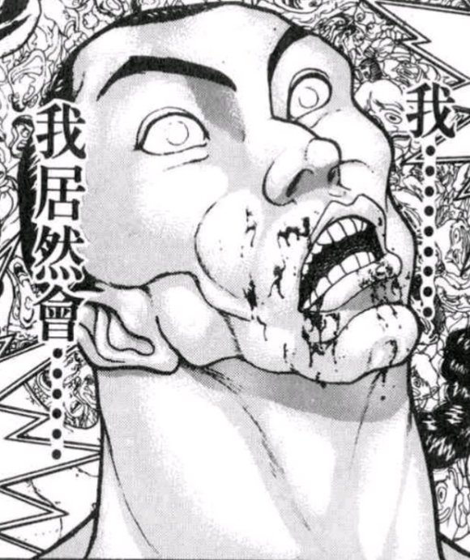
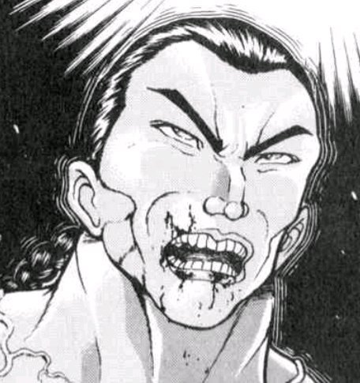
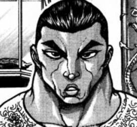
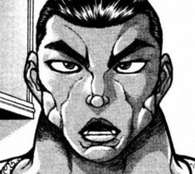

附上本次的骰子

其实一开始的时候还有个决定本次剧情视角的【1d3】骰子

但当时我更新的时候修了一下开头的场景描写，结果不小心把这两行删了（悲）

顺便一提，上次神灵庙之梦中登场的角色们和梦境世界的居民们不是一回事，那是个比较特殊的情况（

具体可以翻看一下赠送这个梦时的哆来咪的说明哦

至于真正的梦永琳梦幽香是什么样的——因为没有出场所以希腊奶（笑）

~彩蛋~

~再接再厉~

~命莲寺~

命莲寺的住持走向了在一旁沉思的僧侣

白莲：（一轮这次似乎又输了……

但我想，她在这场战斗中已经做得很好了）

一轮，你现在感觉怎么样？

一轮的斗志【1d100：99】大成功

噗，大成功是什么【1d10:1】

1 Atk+3

2 Hp+1

3 学会了进一步控制怒气（为啥啦）

4 Atk+3

5 Hp+1

6 获得了特殊攻击耐性（怎么做到的啊）

7 Atk+3

8 Hp+1

9 学会了新的必杀技！（为啥啦）

10 大成功/大失败【1d2：1】

现在的Atk：250+3=253

蓝发僧侣斗志昂扬地握紧了拳头

一轮：圣大人，我现在很好

居然敢说我技量不足

那就用磨练后的拳法堂堂正正击败他！

白莲：（看来确实是有所成长......太好了）

拥有积极进取的心是好事

但要量力而行，不要因为急于求成而伤到自己哦

一轮：多谢您的指导，圣大人！

只是，那个

我每次打架的时候总没办法在口头上占上风，气势上就天然弱一头

有没有什么帅气的台词能在战斗时说啊……

鵺：这个我很擅长！

比如这个

“区区烈海王，不过如此！”

秦心：落于下风的时候就说：“不过是幻觉而已”

攻击成功的话就说“干掉了吗？”

小伞：想要显得霸气一点的话就——“今天的我，连圣大人也不放在眼里！”

星：你可以在口袋里放一张合照，在战斗之前拿出来看一下

“命莲寺的大家，都在等着我呢”

这样一来就会感受到我们的支援哦！

热心的命莲寺弟子们纷纷提出了自己的建议

一轮：谢谢大家！

这样一来我就绝对不会输啦！

大魔法师默默把脸侧向了一边

白莲：（明明大家都是诚心实意地提出了自己的主意，为什么会变成这样呢……）

嗯，总之……加油吧？

~对比~

~梦境世界~

~梦魔理沙的家~

半死不活的梦境武者正趴在地板上

小屋的主人则一脸无奈地看着他

梦魔理沙：你这怎么刚从现实世界回来就又倒了？

梦烈：别提了

我被云居一轮把急救拳打出来了

梦魔理沙：喂喂，不是吧？

一轮？命莲寺的云居一轮？

你是怎么做到跟她打架都翻车的啊？？

梦烈：好歹这次赢了，不然这脸就丢大发了......

有蘑菇汁吗给我来一瓶，谢谢

今日的蘑菇汁【1d5：4】（1的话有毒）

金发小女孩从冰箱里拿出了一瓶五颜六色的诡异液体

她晃了晃玻璃瓶，认真地观察了一阵气泡的沉浮速度，最终得出了结论

魔理沙：这瓶看上去应该不会出事，应该吧

你尝尝味道怎么样？

梦烈接过了这瓶看上去就不是什么好东西的饮料，而后满怀期待地将其一饮而尽——

今日的味道【1d100：1】大失败！

草，大失败是什么【1d10:4】

1 把饮料喷到魔理沙脸上了

2 变吐真剂了

3 喷射战士（好惨啊）

4 把饮料喷到魔理沙脸上了

5 变吐真剂了

6 堂堂昏迷（为啥啦）

7 把饮料喷到魔理沙脸上了

8 变吐真剂了

9 失声半天（为啥啦）

10 大成功/大失败【1d2：1】

受到了过度刺激的武术家把嘴里的饮料全部喷了出去

梦烈：噗！

今天这瓶感觉像是腐烂的淤泥在地下埋了十几个月又被沼气炸开了一样！

我要吐了——

啊

被喷了一脸怪异液体的魔法使，此刻正面无表情地看着她的好友

梦魔理沙的怒气【1d50：42+50=92】（大失败+50）

金发小女孩随手摘下了湿透的帽子

她微笑着掏出了一样眼熟的工具

梦魔理沙：你看你看

这是什么啊？

梦烈：八，八卦炉？

梦魔理沙：没错

那么，你觉得这次是什么功率呢？

梦烈：我可是伤员哦

你不会对我用Master Spark的吧？

黑白色的魔法使摇了摇头

武术家的脸上露出了绝望的表情

梦烈：喂喂，魔理沙，冷静点

再怎么说Double Spark也太过分了

难不成，难不成是Final Spark？

八卦炉的核心部位发出了耀眼的光芒

梦魔理沙：真遗憾，猜错了

是Final Master Spark呦❤

“救命啊！！！！”

某人撕心裂肺的求救声被淹没在了魔炮的轰鸣之中

这一天，这片区域内所有的梦境居民都看到了一道耀眼的光芒

【1d30：10】分钟后

浑身散发着焦糊味的武术家躺在沙发上吐出了一团黑烟

换了身新衣服的魔法使则在旁边用毛巾擦着脸

梦烈：只用了Master Spark真是多谢你手下留情

但就算是小功率的魔炮也还是好过分……

梦魔理沙：随随便便就喷女孩子一脸还整天揩油的家伙有什么不被魔炮轰的理由吗？

梦烈：什，什么揩油，我听不懂——

梦境中的魔法使一屁股坐在了损友的肚子上

梦魔理沙：哦哦，不好意思我误解你了

（感觉如何啊？）

梦烈：就算你这么说也只能感受到裙子的触感！至少穿薄点再——

啊

梦魔理沙：哈哈哈哈哈哈！

就你这样的还想瞒过我？

你的掩饰比你的口才还差劲啊~

梦烈：你等着！等我伤好了第一个打的就是你！！

梦魔理沙：你会这么做吗，烈海王？

梦烈会吗【1d10:4】

1 象征性玩玩

2 不打

3 就算是你我也照打不误！（你好屑啊）

4 象征性玩玩

5 不打

6 方式是扑克牌（为啥啦）

7 象征性玩玩

8 不打

9 在奇怪的方向上分胜负（是什么啊）

10 大成功/大失败【1d2：2】

梦中的武术家把头扭到了一边

梦烈（小声）：象征性玩玩弹幕游戏也就算了

和你打真格的我才不干

梦魔理沙：呀这个人害羞了~

明明平常的时候那么大胆

为什么现在反而说话这么小声呢~

梦烈：不是，没有，我——

啊啊啊啊！我承认是在揩油了可以了吧！！

金发小女孩笑着把上半身靠在了沙发上

梦魔理沙：（你承不承认都无所谓啊

反正没我同意你什么也不敢干~）

梦烈：（那可以麻烦你下来了吗，我腹肌压力好大）

梦魔理沙：活该，当锻炼吧

谁让你喷我一脸的

~现实~

~雾雨魔法店~

魔理沙：听说你跑梦境世界玩了一趟？

好玩吗那地方？

烈的情商【1d100：23】（保底20）

武术家思考了片刻，然后问出了一个他十分好奇的问题

烈：魔理沙

如果，我是说如果

如果某天我说想搂你的腰的话，你会怎么做？

魔理沙的厚脸皮【1d100：89】

黑白色的魔法使坏笑着掏出了八卦炉

魔理沙：这玩意火力全开能烧掉一座山

有种就来啊你这变态？

我也好久没用Final Master Spark了，现在可是手痒着呢

烈海王安心地笑了起来

烈：不，听到你这么说真是太好了

顺便一问，你跟摩多罗女士学的怎么样？

魔理沙：乐子神说我再学个【1d15：10】年左右差不多就能成真正的魔法使了吧

怎么了？

烈：十年啊……

那你有没有想过十年后的自己是什么样子的？

魔理沙：你问这个？

我想想……

十年后的我肯定是那种实力强大，成熟自信，性格强势，身材特别好并且可以轻而易举地调戏人，但同时却既温柔又体贴的大姐姐啊！

武术家在脑中默默对比了一番魔理沙的未来想象与她在梦中的表现

烈：——我看你还是去做梦吧

魔理沙：好，不用等十年之后了我现在就干掉你！

梦境中的居民们与现实中的人们有着相同的本质和略微不同的性格

某些人在梦中放大了自己的弱点

某些人在梦中展露了自己的本性

某些人在梦中达成了自己的理想

某些人在梦中实现了自己的未来

也有些人，无论在梦境与现实中都维持着一副表里如一的面貌

那只是虚无的幻境？

还是说，是另一种意义上的现实呢？

就算在遥远的未来，这也依然是没有正解的问题

但是，人与妖怪也好，神明与亡灵也罢

这世上的存在无论如何——

都总是有梦的

（彩蛋环节结束）

~本部老师的车万小课堂~

那么大家许久不见，我是本部老师

在打扫完公园之后就全身心地投入到了古武术的研究中，直到今天才想起来似乎忘记了什么事情

说起来这个番外篇多久没更新了？

上次更新好像是在……慧音安价回结束的时候？

嘶——

想必大家在我不在的这段时间已经学会熟练使用thbwiki了（悲）

不过该做的事情还是要做，于是久违的番外篇开始了

今天来介绍一下最近戏份很多的某位老吧友，东风谷早苗吧

东风谷早苗

初登场于东方风神录，是五面道中boss、关底boss以及东方地灵殿的EX面道中boss

BGM：信仰是为了虚幻之人/少女曾见的日本原风景/ Last Remote

能力：引发奇迹程度的能力

种族：人类（现人神）

所属势力：守矢神社

东风谷早苗是代代单传的拥有秘术的人类，她从小时候开始就精通了仅由口授来传授的呼唤奇迹的秘术

早苗在守矢神社中的任务，就是到人类村庄中收集信仰

她的性格总是非常认真，而且对自己的力量保持着自信，但有时也会自信过头

她虽说是人类，但其实也是神明，像这样保持人类的样子成为了神明的人，就被称为现人神

早苗的这份特殊性来自于她的职业：风祝，即祭祀着风之神的人类

风祝可以借由风神大人的力量引发呼云唤雨的奇迹

但不知从何时开始，这被错认为是由人类所引发的奇迹了

正因如此，风祝以人类之身收集了信仰，享受了与神同等的待遇——由此而成为了所谓的现人神

引发奇迹的能力经常被混淆为幸运，但其实不然

奇迹指的是偶然的顶点，其结果是好是坏都有可能，与幸运与否毫无关系（在本贴中体现为无保底的1d100骰决定结果）

引发奇迹是需要准备工作的，依照奇迹的大小，准备时间的长短也随之变化

简单的奇迹只需要一句话就能引发，但如果是天崩地裂等级的奇迹，不花费上几天时间持续吟唱咒文几乎是不可能成功的

正如上文所言，这份秘术的力量来源很可能并非是早苗自己，而是其所祭祀的风神（神奈子）

其符卡：准备【呼唤神风的星之仪式】在高难度下会变为：准备【Summon Takeminakata】（召请建御名方神），即是其能力本质的侧面体现。

至于是所有的奇迹都需要借用风神的力量呢？还是只有部分强大的奇迹才需要呢？这就只有zun才知道了

人际关系

与八坂神奈子和洩矢诹访子共为守矢神社的三柱神

与其外表形成强烈反差的是，洩矢诹访子同时还是早苗的先祖

和宇佐见堇子一样是外界的来客，但两人之间并无太多交流

与博丽灵梦、雾雨魔理沙为好友，是博丽神社的常客之一，平日还会去打扫建筑在博丽神社内的守矢神社小分社

冷知识

常识毁灭者：在地灵殿EX的剧情中，早苗说出了名台词“在这个幻想乡不能被常识所束缚！”，并爽快地开始了与自机的弹幕战

好听吗？：接上条，此后自然是被自机们击败了（笑）地灵殿EX的道中曲Last Remote有着略微漫长的前奏，而早苗战时曲子则刚好进行到了最好听的高潮部分，因此也被部分爱好者笑称为“早苗挨揍曲”

吃一堑长一智：在刚刚进入幻想乡的时候，早苗相当轻视本地的人类。她认为只要去威胁唯一的博丽神社，幻想乡就能如己所愿了，于是就前去对灵梦进行了威胁——然后被打得很惨此后早苗发觉到了自身在幻想乡并非是太过特别的存在，便收起了这份略微傲慢的心态，并与灵梦等人成为了好友

钢之魂！：在非想天则的剧情中，早苗对于巨型机器人表现出了浓厚的兴趣，因此也有了“巨型机器人控”“特摄控”等等延伸二设

发芽了：在茨歌仙漫画中，早苗的头上有一个像小草一样的有趣发型，因此有了“草苗”的爱称

活发饰？：早苗的头上有着作为头饰的小蛇，从铃奈庵漫画的部分细节来看，其似乎有着可以活动的能力——也就是说，可能是活物（出自铃奈庵22话）

大概今晚七点半左右更新

有件事情我在第一季的贴子里提到过，不过可能有些朋友忘记了......

我很高兴大家愿意在本贴的基础上进行三次创作，但因为贴吧的排版很容易让其他吧友们看错，因此还请别在本贴内发与主贴内容相似的安科创作

谢谢大家的配合！

（顺便一提我刚刚想发个本部老师表情包却发现无法上传，试了几个烈的发现也不行，希望只是暂时的网络波动问题......不然的话今晚估计够呛了）

尝试了一下发现用其他的电脑可以发出图来，不知为何我自己的却不行(悲)

于是今晚我得用舍友电脑更新了，算上拷贝文件之类杂七杂八的事。。时间推迟到八点半(悲)

我刚刚发过更新时间推迟到八点半了啊，大家不要急啊(悲)

【3d40：2 16 31】

第一位 铃仙·优昙华院·因幡 92

第二位 西行寺幽幽子 69

第三位 依神紫苑 93

首先是第一位 铃仙·优昙华院·因幡

这件事情发生在烈海王来到幻想乡的第【760+1d30：11=771】天

具体的事件是【1d10:8】

1 师匠的跑腿任务

2 去月球送封信吧！

3 铃仙的女子力提升大作战！（还来吗？）

4 师匠的跑腿任务

5 去月球送封信吧！

6 铃仙·优昙华院·因幡想要成为大妖怪！（为啥啦）

7 师匠的跑腿任务

8 去月球送封信吧！

9 催眠大师铃仙酱（为啥啦）

10 大成功/大失败【1d2：2】

空中那银白色的飞雪被飘扬的花瓣所取代

幻想乡的冬天过去了

如今，正是樱花烂漫的季节

幽灵们看着冥界那盛开的樱花，不由得感叹“做幽灵真好”，半分幽幻的庭师也“做一半幽灵一半好”得赞同着这观点

兴奋异常的报春妖精在幻想乡的各地用弹幕宣告着春天的到来，而后像往年一样被热情的居民们回以各具特色的投掷道具

而对于永远亭中的武术家与月兔来说，春天所带来的不仅是这些美妙的景色

没错，说到初春的话当然就是——

~永远亭~

烈&amp;铃仙：扫雪啊！！！

永远亭的两位苦劳役如今正奋力清扫着门口的积雪

铃仙：用火焰喷射器“呼——”的轰一下不行吗？

烈：姑且不提引起火灾的风险，那样会让家门口变得一片泥泞吧

如果之后降温又突然结了层薄冰的话……

铃仙（小声）：已经能想象出辉夜大人那一脸嫌弃的表情了

刚起床一出门就踩到冰的话，以她的运动神经肯定会摔倒吧？

烈（小声）：我觉得会的

辉夜小姐虽说力气很大，但战斗技巧其实不大行

真出现的话会变成相当盛大的惨况……一定会的

原始人从背后靠近了正窃窃私语的两位社畜

皮克：嗷嗷嗷嗷嗷嗷啊

（你俩干嘛呢？）

烈与铃仙的惊吓【1d100:2】大失败

草，开局就大失败是什么【1d10:3】

1 辉夜：我听到了哦

2 脚下刚好有冰哎

3 脚下刚好有兔陷阱哎（为啥啦）

4 辉夜：我听到了哦

5 脚下刚好有冰哎

6 师匠愤怒了（为啥啦）

7 辉夜：我听到了哦

8 脚下刚好有冰哎

9 皮克误解了（为啥啦）

10 大成功/大失败【1d2：1】

烈：扫雪时顺便聊两句而已

怎么了皮克？

皮克：嗷嗷嗷嗷嗷嗷啊

（师匠说有新任务，让你俩一会去医务室找她一趟）

两位社畜立刻把扫把放到了一边

铃仙：哦哦，没问题——

烈：这一块基本上已经清理干净了，我们现在就去——

他们双双向前踏出了一步

然后就在原始人的注视下一同掉入了陷阱之中

皮克：你那还算是人？

（你们是怎么做到的？）

话说本次的陷阱是【1d10：10】（2-5普通的落穴，6-9加了**陷阱 1 10随机）

真绝了

随机是什么【1d10:3】

1 强效催眠瓦斯

2 旧地狱金曲合辑

3 对铃仙专用反射镜（为啥啦）

4 强效催眠瓦斯

5 旧地狱金曲合辑

6 是辣椒，我加了辣椒（好过分啊！！）

7 强效催眠瓦斯

8 旧地狱金曲合辑

9 诡异的粉红色气体（不要啊！！）

10 大成功/大失败【1d2：2】

铃仙：哎哎哎哎哎哎？！

烈：冷静点铃仙前辈，这下面连竹枪都没有，只是普通的落穴而已！

沉着冷静的武术家先一步落了地，并抬手接住了从天而降的同事

铃仙：帝，你这家伙！！

遭受突袭的月兔下意识地瞪大了她的双眼

铃仙·优昙华院·因幡的赤瞳中蕴含着地上兔子们几倍以上的狂气

据说，正视她的红眼会让人发疯

与其朝夕相处的地上兔对她的能力可谓是了如指掌

正因如此，因幡帝才会在此设计了仅针对铃仙一人的专用对策

带着眼罩的地上兔抱着一块特制的镜子跳了出来

因幡帝：呜撒，接招吧！

对铃仙专用反射镜陷阱！

于是，月兔在镜中清清楚楚地看到了自己的双瞳

嗯……反射镜的效果是【1d10：7】

1 暂时看不见了

2 把自己催眠了

3 超狂暴化（为啥啦）

4 暂时看不见了

5 把自己催眠了

6 变得特别懒（为啥啦）

7 暂时看不见了

8 把自己催眠了

9 烈中招了（为啥啦）

10 大成功/大失败【1d2：1】

铃仙：呜啊啊啊啊！！

帝，你又来这套！！！

月兔少女捂着眼睛高声惨叫了起来

一脸怀笑的因幡帝把脸凑了过去

帝：哈哈哈哈哈哈

我想看的就是这副表情，这副痛苦挣扎的表情！

啊好疼

武者伸手敲了下兔子的额头

烈：我说怎么好久没遇到兔陷阱了，结果在这等着呢

这得恢复多久啊？

帝：按往常经验的话大概半天左右吧~

紧闭双眼的月兔伸手摸索着她身边的事物

铃仙：没关系，我依然可以独自行动

这是——岩壁上凸起的石头！

烈：铃仙前辈，你抓的是我的头

唉，我先送你上去吧……

在帝幸灾乐祸的笑声中，武者抱着同事跳了出去

【1d15：3】分钟后

~医务室~

月之头脑看着眼前睁不开眼的徒弟叹了口气

师匠：优昙华，你是怎么做到的？

本来还想让你去送封信，现在这根本就没法出门啊

铃仙：还请放心交给我吧，师匠！

不过是半天的目盲而已，这点小事算不了什么！

师匠：我很想称赞你的责任感.

但你对着桌上的花瓶讲话的样子实在是令人难以信任啊……

月兔赶忙调整了一下自己的朝向

铃仙：这，这只是听声辨位出现了一点差错而已

这次没问题了吧？

烈：方向倒是没问题

但是铃仙前辈，你的脸都快贴到师匠身上了……

铃仙：呜啊啊啊啊啊啊师匠对不起！

师匠的信任【1d100：79】（51以上现在就送，50以下等半天之后再说）

师匠：（有烈帮忙的话应该也没事吧）

烈，正好这次你和优昙华一起去吧

照看好她哦，别在路上闹出太大的笑话来

烈：交给我吧，师匠

这次的工作是？

月之头脑从抽屉里拿出了一封信

师匠：去月之都给我的弟子们送一封信

是很简单的任务吧？

优昙华知道具体的地点，你只要负责帮她过去就好

具体的出行方式是【1d10:5】

1 一如既往的梦境通道

2 help me erinnn！

3 拜托了八云女士（为啥啦）

4 一如既往的梦境通道

5 help me erinnn！

6 月之羽衣（现在吗？）

7 一如既往的梦境通道

8 help me erinnn！

9 辉夜：锵锵！新型的飞行器！（为啥啦）

10 大成功/大失败【1d2：2】

铃仙：（呜啊，是给那两位送信吗......）

是我摸到的这个对吧？

烈：铃仙前辈，那是师匠的笔记本

信我已经放你兜里了

我们这次怎么过去？

铃仙：师匠不着急的！我们普通走梦境通道慢慢过去就行——

月之头脑打断了弟子的话语

师匠：就你这状态出门，那怕有烈陪着我看路上也得出事

不如说有烈在路上出事的概率就更大了

没办法，我直接送你们去吧

月之头脑直接发动了她的秘术

【1d15:11】秒后，武术家与月兔来到了月球里侧的都市

~新 月之都~

新 月之都的大体景象看上去与去年前来时并无太大的不同

月兔们如今已经彻底适应了新生活

她们看上去不像刚刚得到自由时一样兴奋了，但依旧维持着那副懒散而活泼的样子

另一方面，可能是由于地狱近期的混乱状况，街道中行走的鬼族数量看上去反而比之前要少些了

烈海王看向了身边正揉着眼睛的铃仙

烈：我们到了，铃仙前辈

接下来该往哪走啊？

铃仙：月之都的地图已经牢牢刻在我的脑子里了

就算闭着眼睛我也知道该往哪走

烈先生，我们现在在哪里？

烈：据我观察，这地方大概是温泉街

铃仙：别开玩笑了烈先生~

月球上哪会有这种地方啊~

烈：不，确实是有啊，我还进去泡过来着

就去年重建月之都的时候鬼族施工队建的

月兔的微笑僵在了脸上

铃仙：——完蛋了

我好像忘记更新地图了

于是，烈与铃仙在未知的都市之中陷入了短暂的迷茫

烈与铃仙要做什么【1d10:9】

1 总之先随便走走吧

2 这里就拜托路边的月兔！

3 出门摸鱼的探女来了（为啥啦）

4 总之先随便走走吧

5 这里就拜托路边的月兔！

6 出门摸鱼的丰姬来了（为啥啦）

7 总之先随便走走吧

8 这里就拜托路边的月兔！

9 去泡个温泉再说吧！（为啥啦）

10 大成功/大失败【1d2：2】

铃仙：师匠的任务也没有期限，大概今天之内搞定就行了

先去泡个温泉放松一下吧！

烈：逻辑呢？！前后文之间的逻辑在哪里？！

我上次听见这么离谱的话还是跟永琳去泡温泉的时候——

还真就是这个地方哦！！

铃仙：那么出发了~

温泉是这个很吵闹的方向吗？

烈：铃仙前辈，那是街边的团子店……

唉，我先带你过去吧

面色扭曲的武术家带着四处摸索的职场前辈走向了温泉

~月之都温泉~

如今是工作日的上午，几乎所有人都在忙于自己的工作

理所当然的，温泉中一个顾客都没有

在前台值班的月兔正打算偷懒玩会游戏，就发现两位奇怪的顾客走了进来

路人月兔：真难得啊，这个点居然有人会过来

两位是分开还是一起？

烈：这位想进去泡一阵，我就不用了

铃仙：哎？

烈先生你不一起来吗？

烈：这我肯定没法一起去啊！！！

铃仙：可我现在完全看不见

这样根本就没办法自己一个人去啊……

烈：前辈，你不用担心的

你可以拜托这边的女性工作人员帮忙，而不用非得找我

兔耳少女皱着眉头思考了一阵，随后向着武术家伸出了大拇指

铃仙：没关系的烈先生，我相信你哦！

烈：不不不所以说到底为什么——

烈的察觉【1d70：59+30=89】（50以上察觉不安，75以上陪同）

这个时候，武者发觉到了

紫发少女那开朗的笑容之下所隐藏的些许违和感

烈：（不对，这可不像是铃仙前辈的作风）

（一般而言，她是绝不会强求对方帮助的，即使自己暂时看不见也是一样）

（为什么会这样……求助……？拖延时间？她对这次的任务感到不安吗？）

没有得到回应的月兔收回了自己的话语

铃仙：——仔细想想果然还是太为难人了

我自己去就好了，烈先生在外面稍等我一下吧

烈：（……原来如此，是这么回事啊）

时间不会很长的，麻烦给我们包个场吧

路人月兔：上午场的话是【1d1000：140X10=1400】月币

用地上的货币则需要多付【1d4：1】倍，合计2800地上币

毕竟现在是淡季中的淡季，又是工作日的上午，因此价格不贵哦~

铃仙：好便宜？！便宜过头了吧？！

话说烈先生你——

烈：铃仙前辈刚刚说相信我

那我也只能不辜负这份信任了

好了看着路点往这边走，小心别撞墙了

【1d15：12】分钟后

（注：由于原作剧情并未明说，以下剧情中包含大量我自身的理解与推断，请大家务必不要当真）

~温泉池~

虽说是混浴温泉，双方也对彼此抱有充分的信任

但武术家还是谨慎地与月兔拉开了相当一段距离，并坐到了池子的另一头

烈的意志力【1d60:36+40=76】（50以下自己跑出去，75以上铃仙好感度增加【1d3】）

自两人相遇以来就从未起过邪念的烈海王，此刻依然维持着那静如止水的心态

他抬头看向了老老实实裹着浴巾的月兔

烈：铃仙前辈，你现在怎么样？

铃仙的害羞【1d100：27】

铃仙：感觉真好啊~

这个冬天我一次都没去过温泉呢，结果没想到会在这里补上

介意我坐过来吗？

武者看着对方一如寻常的表情点了点头

烈：我无所谓

紫发的月兔站起身来，而后摸索着坐到了武术家的身旁

铃仙：真意外

我还以为就算是烈先生，这个时候也是会害羞的

烈：我的意志力再坚定也总有个限度，平常的话我肯定会

但今天是例外

毕竟，现在的铃仙前辈状态不算好

其中一个原因——是现在看不见波长吧

铃仙的震惊【1d100：28】

紫发少女有点不好意思地挠了挠头

铃仙：我还以为自己掩饰的不错的

是哪里露馅了？

烈：是刚刚在温泉前台的时候

可以读取波长的你，能够在一定程度上把握对方的情绪

因此，日常生活中你极少说出令人为难的话语——在感受到对方的心情时，就会灵巧地转移话题了

铃仙：但当时烈先生明明很尴尬，我却抓着这个话题没有放手呢

因为平常已经习惯于这种能力了

突然丧失了“视野”的话，就难以把握对方的心情

所以在说了这么多句之后才终于发现，“糟了烈先生真的很尴尬——”这样

烈：铃仙前辈哎

说到底为啥你会觉得我会答应啊？

我好歹也是个正常的成年男性，再怎么说这样也不合适啊

铃仙的好感度上升了【1d3：3】点

现在的好感度：92+3=95点

紫发少女抬腿扑腾着水花

铃仙：因为，烈先生从来都没对我起过歪心思啊

之前战斗的时候也是，一起出去玩的时候也是，在我房间里的时候也是……

如果这样的人都不能信任的话，这世界上就没有值得相信的对象了吧？

烈：话是这么说，但我又不是圣人

虽然现在是很正常，但刚刚可是尴尬得要死

铃仙：不好意思啦，烈先生

其实刚刚说出口的时候就觉得“不妙，这个就算是烈先生也不会答应的”

本来已经打算自己泡一会就出来的，没想到你又改主意了

烈：我也做了很长一段时间侦探了

虽说没有特殊能力，但靠着一些细节还是能察觉到对方的心情

平常的铃仙前辈可不会对我提出这种建议，不如说工作还没开始就来泡温泉就已经很离谱了

月兔默默停下了玩水的动作

烈：顺着这个思路往下走，就能够发现

其实你并不是很想泡温泉

你只是想晚些再完成这份工作，因此一听到我们在温泉街就赶紧找了个理由跑来这边耗时间了

铃仙：我偶尔也会消极怠工的……

烈：但如果只是因为这个，你是没有必要拉着我一起来的

我继续思考了一阵，而后终于发现了最主要的理由

不知道是出于什么原因，现在的铃仙前辈很【不安】

她不想一个人待在这个地方

这样一来的话，我就只能陪她一块去了

铃仙：我——

烈：前辈，不要勉强自己

你想说的话我会听

你不想说的话，我也没什么所谓

就像过去你帮了我那么多次一样，我也会帮你的

铃仙的守口如瓶【1d100：42】（50以下说明）

兔耳少女沉默了一阵

她伸手戳了戳身旁的武术家

铃仙：烈先生

肩膀，能让我靠一下吗？

烈的厚脸皮【1d100：51】（保底20，50以上同意）

他转头看向了月兔的侧脸

与战斗搏杀时的狂气不同

与日常生活中的温和不同

与出门游玩时的雀跃不同

此时的她，看上去有些莫名的脆弱

武术家调整了一下自己的坐姿

烈：我无所谓

铃仙抬手将长发挽到了另一侧，而后慢慢将头依靠在了后辈的肩膀上

铃仙：烈先生，你有想过吗

为什么身为月兔的我，会在地上和大家一起生活呢？

烈的推理【1d70：61+30=91】（75以上成功）

烈：我的确有思考过过这件事

在你与四季小姐见面时，她曾经说过一句很奇怪的话

在我们去支援月球的时候，师匠提到过你来地上的时间

再加上你那偶尔发作的“老毛病”

相关的线索其实已经相当充裕了

由此，我得到了一个推断......

铃仙：就像你想的那样

很丢人吧？

我其实根本不算是什么战斗到最后一刻的士兵

我只是一只逃跑的兔子而已

武术家沉默地聆听着身旁少女的讲述

铃仙：我的名字，原本只称作Reisen

铃仙这个带有汉字的名字，是为了冒充地上人而特意取得

听起来很怪吧？

烈：不，我觉得还好

铃仙：在最开始的时候

Reisen是在师匠的弟子依姬大人和丰姬大人手下工作的

大部分的月兔都担负着管理农作物、捣药、扫除等任务

但我不同

我是在依姬大人手下与同伴们一同接受训练的，月兔之中的战斗部队

烈：她们很严厉吗？

月兔摇了摇头

铃仙：依姬大人的训练很严格，但她人并不坏

丰姬大人在平时也常常打着“一同训练”的名号来送些桃子，我们都很喜欢她

月之都的生活是很平静的——不如说，是一成不变的

不会变化的月之民们，似曾相识的每一天，永远充满着欢声笑语的城市

这就是我在过去的日常生活

烈：然后？

铃仙：然后，这份平稳的日常在某一天被突然打破了

地上的探测器到达了月球

同时到来的，还有地上的人们

这是地上人向月球发动的侵略战争

于是，我们的工作开始了

我参与的甚至连真正的战争都算不上，只是局部的冲突——只是一场前哨战而已

铃仙说话时的语气不再和平常一样柔和了

她的话语中逐渐带上了战斗时的狂气

以及，因回想往事而带来的痛苦

烈：我不觉得外界人们的科技水平能与月之都相比

我在此前也不曾听说过任何相关的传闻，哪怕只是都市传说一样的一言半语

战斗的结局已经注定了

但是，在这途中发生了什么？

具体的经过是【1d10:9】

1 目睹同伴死伤的铃仙在战斗结束后逃走了

2 在参与战斗之前，目睹了同伴死伤的铃仙就直接逃走了

3 因同伴死亡而彻底暴走了（为啥啊）

4 目睹同伴死伤的铃仙在战斗结束后逃走了

5 在参与战斗之前，目睹了同伴死伤的铃仙就直接逃走了

6 刚听到消息就直接逃走了（为啥啊）

7 目睹同伴死伤的铃仙在战斗结束后逃走了

8 在参与战斗之前，目睹了同伴死伤的铃仙就直接逃走了

9 唯一的幸存者（为啥啊）

10 大成功/大失败【1d2：2】

紫发的少女缓缓做了一个深呼吸

事情已经过去很久了

但在现在说起，却也依然会感到悲伤

她用颤抖的声音说出了，自己永远无法忘记的残酷场景

铃仙：地上人也好，我所在的小队也好

在那场战斗之中，除我以外的所有人

全都死了

烈的情商【1d100：91】

烈：（怎么可能？）

（我的确有推理出前辈是因为目睹同伴的死伤而受了刺激才会选择来到地上）

（但当时怎么会出现这样的发展？战斗意志的差距？被偷袭了？到底是——）

即将脱口而出的话语被他硬生生咽了回去

武者放弃了询问相关的细节

因为他感受到了，铃仙的身躯此刻正在微微地颤抖

少女的脸上是什么样的表情呢？

他觉得她大概是不想让人看到的

于是，武术家像月兔一样闭上了双眼

他回忆着挚友过去安慰自己时的动作，有些犹豫地将手搭在了她的肩膀上

烈：铃仙前辈

我在你身边呢

铃仙：——谢谢，烈先生

无言的沉默持续了【1d120：29】秒

平复了心情的月兔继续着她的讲述

铃仙：那场冲突结束的很快，我干掉了最后一个敌人

依姬大人和丰姬大人，还有其他参与训练的兔子们都在月之都等着我

我想和以前一样招呼着大家一起回去

但直到这时我才发现，除我以外的队友们都已经死了

铃仙：我已经做了我能做到的所有事情，但我依然眼睁睁地看着她们死掉了

阎魔大人说这是我的罪孽，我想的确是这样的

我应当带着她们回到月之都，和同伴们说明清楚状况，然后继续执行我的任务

但我已经不想再参与这样的战争了

但我已经不想再看着同伴们死去了

于是，我逃跑了

这能称之为逃避吗？

这是否应当算作罪孽？

武者无法得出准确的结论

归根到底，即使曾在你死我活的擂台之上挣扎过，他也依旧只是一个格斗家

地上的善恶观与月球上并不一样，而格斗家也不是士兵

格斗家的标准与士兵不同

格斗家是无法评判士兵的行动的

烈：然后，你来到了地上？

铃仙：是的

我来到了传闻之中的幻想乡，见到了师匠和辉夜大人

我为自己取了“铃仙”的名字，师匠帮我起了“优昙华院”的爱称，辉夜大人则像称呼其他兔子们一样，叫我“因幡”

月球上的Reisen就这样消失了

取而代之的，是地上的铃仙·优昙华院·因幡

月兔讲完了过去的故事

尽管身处在温热的泉水中，但她还是觉得有些莫名的寒冷

这时她想起来了，后辈的手就搭在她的肩头

身体的颤抖逐渐停止了

她抚摸着武者的手背，感到了一丝不可思议的安心

铃仙：对不起

这是很糟糕的故事吧

现在我的脸上，肯定很不好看吧？

烈：我从刚刚开始就一直闭着眼

因此我不知道

月兔愣了一下，而后微微笑了起来

她没有纠结于这个话题，而是继续着自己的讲述

铃仙：回到地上之后，我依旧能和月球上的同伴们保持联络

她们说这次战争很快就结束了，地上的人们只留下了破旧的残骸与一面旗子

但即使如此，我也不想回去

并不是顾虑可能到来的处分……

烈：而是由于你心中的【不安】吧

不知道现在的她们会如何看待自己

不知道自己的行为会得到什么样的评价

铃仙：我一直以来，都想要逃避自己的过去

阎魔大人认为这是罪过，那我也只能背负着这份罪孽继续活下去

但是，她们又会怎么看呢……

烈的口才【1d100：36】

烈：不知道

铃仙：哎？

烈：我又没见过师匠的这两位弟子

就连外貌特征我都不知道，更别说性格特点了

光凭这点信息根本无法推断出来啊

月兔用头撞了下后辈的肩膀

铃仙：烈先生，你没必要在这里用推理的

一口气说出来之后我已经好很多了

随便说两句安慰的话语就可以了哦！

烈：但是铃仙前辈你又不需要什么安慰的话语

铃仙：直到刚刚为止都很温柔的后辈突然说出了超过分的话？

烈：不是那个意思

这是相当痛苦的回忆

就算在现在说起，也还是会不可避免地陷入悲伤之中——

但我想，你已经得到自己的结论了

铃仙的确信【1d100：53】（50以上相信自己）

紫发少女把半张脸埋在水里吹着泡泡

铃仙：嘟噜噜噜噜噜噜噜噜

我自己都都不能完全确信啊……

烈：但我可以确信

因为你平时的笑容之下是没有阴霾的

尽管你总对无聊的工作发牢骚，但你的确是认真对待眼前的生活的

以及最重要的

在支援月球的行动时，你可是我们之中最为坚决的一个

铃仙：啊……

烈：忘记了吗？

初次见到纯狐女士的时候，我甚至对自己的存在意义产生了怀疑

那时威风堂堂地站在仙灵之前，用自己的行动将我烈海王唤醒的——

不正是铃仙·优昙华院·因幡吗

铃仙伸手揉了揉脸

铃仙：那时我有点上头了啦

烈：一时冲动也好，意志坚定也罢

尚若你无法走出自己的过去，那别说直面纯狐女士，就连前往月球都是不可能办到的

这样的铃仙前辈当然不需要什么安慰的话语

因为无论她们怎么看待现在的你，无论她们怎么裁决过去的罪过——

铃仙：——我的行动与思考都不会带有迷茫

对我而言，已经没所谓了

月兔抬头看向了天空

铃仙：烈先生，可以睁眼了哦

武者睁开双眼，看向了靠在自己肩膀上的前辈

烈：你看上去就和平常一模一样

就是我认识的那个铃仙前辈啊

离包场结束还有【1d30：23】分钟（15以上的话再聊会）

最后的话题是【1d10：5】

1 一如既往的女子力话题

2 烈的烦恼

3 月兔们的日常（为啥啦）

4 一如既往的女子力话题

5 烈的烦恼

6 你为什么这么熟练啊（为啥啦）

7 一如既往的女子力话题

8 烈的烦恼

9 那场战斗的细节（别纠结了好吗）

10 大成功/大失败【1d2：2】

紫发的少女深深吸了一口气

铃仙：好！重新找回了安心的感觉

我已经复活了！

烈：那真是太好了，那我可赶紧出去吧——

武术家的手刚从少女的肩头移开，就又被对方按了回去

铃仙：别着急啊

我已经麻烦烈先生好几次了

作为回报——如果有什么烦恼的话，也和前辈我说说吧？

虽然可能提不出什么好的建议，但我也会好好听着的

烈的烦恼【1d10：2】（2-5意志力薄弱，6-9情感问题，110随机）

烈：事先说好，别笑话我啊

我最近感觉自己的意志力变薄弱了

铃仙：我怎么想都觉得你的意志力已经坚强过头了吧

烈：前两天去梦境世界的时候发现梦里的我是个相当不正经的——干脆点说就是个猥琐好色的家伙，让我受到了很大的冲击

上次和勇仪喝酒的时候我也因为这个而闹出过很大的笑话

我觉得自己以前不是这样的，到底为什么会出现这种状况啊？

铃仙的建议【1d10:4】

1 是因为谈恋爱了

2 是对方的问题

3 你本来就很色！（为啥啦）

4 是因为谈恋爱了

5 是对方的问题

6 是环境的问题（为啥啦）

7 是因为谈恋爱了

8 是对方的问题

9 不知道（前辈哎……）

10 大成功/大失败【1d2：1】

月兔抬手指向了后辈的脸

铃仙：果然是因为烈先生你谈恋爱了！

烈：是这个原因吗？！

铃仙：原本没有感情经历的烈先生一天到头脑子里就只有“练武”“变强”“挑战”这些念头

但在谈恋爱了之后，尤其是S E X了之后！

烈：别直接把这词说出来啊前辈！！！

铃仙：你的视角改变了

“强大”不再是你眼中的唯一的事物，现在你看待异性时会不自觉地考虑对方的身材或者容貌

既然已经不是完全的武痴了，那当然也没办法重现过去的思考

武术家痛苦地捂住了脸

烈：那这不还是说明我——

铃仙：这说明你变正常了啊

月兔将脸朝向了身边的后辈

紧闭着双眼的她看不到对方的脸

但她非常了解这个男人

此时此刻，他一定露出了一副相当错愕的表情吧

烈的相信【1d100：17】

烈：怎么可能，铃仙前辈

正常人才不是这样的！

铃仙：会对异性抱有想法，会在意他人的看法，偶尔心中可能还有奇怪的念头

这都是很正常的事情啊

相比之下，过去对此通通用一句“无所谓！”来应付的你，才是最奇怪的吧？

烈：但若说这是变卑劣了，不也一样？

月兔坚决地摇了摇头

铃仙：不同的

因为，烈先生的本性依然没有改变啊

现在的我们能在这里说着这样的事情，不就是最好的证据了吗？

哇这个保底情商……

你说什么了【1d4：2】

1 刚刚那可怕的气氛

2 毕竟裹着浴巾

3 直球痛击女子力

4 我一直把你当姐姐看？（为啥啊？）（中了这个交流回之后直接定倾向了）

烈：铃仙前辈哎……

就像你说的那样我好歹也谈过恋爱了

老老实实裹着浴巾的话和其实和在游泳池里也没太大区别啊

铃仙：哎？

我还以为男孩子的话会想象浴巾下面是什么样子？

烈：很可惜我别说“男孩子”，连“青年”的边都够不上，现在已经是实打实的大叔了

虽然意志力没以前那么强了，但也绝不会在裹着浴巾的前辈面前失态的

别小看我啊！

铃仙：你才是在小看我吧！

我要生气了哦，现在就把浴巾脱掉！！

烈：在你行动之前我就会用【The World】跑出去！

铃仙：那就来试试看啊，到底是谁的动作更快！

剑拔弩张的对峙持续了【1d30：16】秒钟

随后，两位苦劳役不约而同地低下了头

烈：这是不是咱俩从认识到现在为止最蠢的一次对话？

铃仙：我觉得我以后也说不出来比这更蠢的了……

差不多到时间了，出去吧？

烈：就算没到时间也该走了

再泡下去可是会头晕的……

武术家与月兔站起身来

工作开始前的温泉放松，到此结束

【1d30：14】分钟后

~前台~

说起来前辈你的视力【1d2：1】

1 还得等一会

2 已经好了

视力依旧没有恢复的铃仙正向前台的月兔问着路

铃仙：你好~

我想问一下，依姬大人与丰姬大人现在住在哪里啊？

路人月兔的了解【1d70：21+30=51】（本地人+30,50以上知道）

前台的月兔回想了半天后终于想起了具体的位置

路人月兔：——大概就是这样走的

话说你怎么现在还在用“大人”的称呼？

烈：是她的个人习惯而已，不要在意

那么总算是要开始工作了

师匠的弟子们性格也是像稀神女士那样吗？

铃仙：不不，她们在各个方面比起探女大人都要好多了……

谈论着即将见面的两人，武者与月兔离去了

【1d30:3】分钟后，两人抵达了其实很近的绵月邸

过一个某***鱼骰【1d100：12】（50以上直接出来）

~绵月宅邸~

由于本就是贵重之人的居所，绵月姐妹所居住的宅邸在之前的战乱中并未受到太大波及

这座气派的中式建筑依旧维持着过去的样子

走过清雅的石板路，就到了威严而厚重的巨大城门

古老而气派的塔楼与庭院中结着果实的高大桃树，则在城墙之后展现着它们压倒性的存在感

身穿古式板甲的门卫看到了有访客到来，立刻竖起长枪封住了去路

门卫：这里是绵月大人的居所，两位——

你不是Reisen吗？

铃仙：没错，好久不见啦

我是来帮永琳师匠送信的

这位是烈海王，师匠的新弟子

门卫的信任【1d70：27+30=57】（熟人+50，逃兵-20,50以上通行）

门卫：（的确有听说过Reisen成了八意大人的弟子……）

还请稍等片刻，我去通报一声

门卫的联络不久之后就得到了回复

他带领着两人走进了高大的城门之内

月之使者的首领们，正在阁楼上等待着他们

绵月宅邸的情况是【1d10：3】（1-6两人都在，7-9只有丰姬和铃仙二号，10随机）

