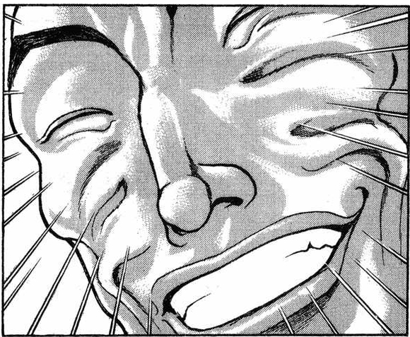
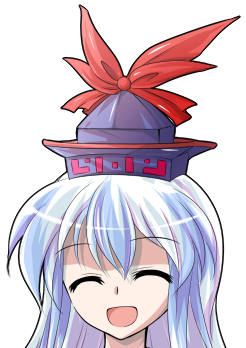

~会客室~

引路人将两人带到门前后，就先行告退了

武术家伸手敲了敲门，在得到回应之后带着月兔走进了房内

出现在他们面前的，是新 月之都的高位者，月之使者的两位首领，同时也是月之头脑的弟子

其中一位少女留着一头淡紫色的长发，用黄色的丝带扎成了马尾

她身穿白色的半袖衬衫与仅有右肩带有肩带的红色连衣服装，其上身的钮扣严密地扣在了正面的中缝，膝盖以下的裙装则是未系的4颗空扣，让裙子的部分显得像是开叉裙一样

少女的腰上斜扎着有剑形纹章的腰带，右手腕带着两个金色的手镯，整体看上去很是严肃

另一位看上去略微年长的少女则穿着与其几乎完全相同的服装——区别仅仅在于衬衣由半袖变为了长袖，裙装的颜色变为了蓝色，肩带的位置则放在了左肩

她有着齐腰的金色长发，头戴白色的环形礼帽，腰上则斜扎着有镜子形状纹章的腰带

少女手持着白色的折扇，向着来访的二人露出了温和的微笑

丰姬：好久不见了，Reisen——不，现在是铃仙了呢

这位还是初次见面吧？

依姬：他就是师匠的新弟子吗？

烈海王下意识地握紧了拳头

烈：（太强了，强到可怕）

（真要打起来的话绝对没有胜算……）

（已经是需要考虑能撑过几秒的等级了，不愧是师匠的弟子！）

铃仙前辈——

月兔有些畏缩地悄悄向后挪了一步

于是，武术家代替她进行了回答

烈：您好，我的名字是烈海王

您应当是丰姬小姐，而这位是依姬小姐吧？

我们今天是来帮师匠送信的

丰姬的好感度【1d100：87】（同为弟子保底40，由于思想开放地上人仅-10，总保底30）

依姬的好感度【1d100：93】（同上，总保底30）

金发的少女接过了月兔手中的信

她并不着急开封，而是笑着拍了拍手

丰姬：原来如此~

你是八意大人最欣赏的那种人呢~

依姬：信的事情稍后再说，先和我们说说她的近况吧

我真的很好奇，没想到那个八意大人居然会谈恋爱……

而且还是和新收的弟子！

烈的说明【1d100：27】

不知是由于过于紧张还是太想表现自己

简直可以称之为定番的悲剧重现了

烈海王在月之使者们面前打起了车轮拳

烈：哦哦哦哦哦哦哦哦哦！

绵月姐妹的笑点【1d100：34】

依姬：这是地上最近流行的笑话？

我无法理解笑点在哪里

光听声音就已经完全能想象出这灾难性场面的月兔拼命摇着头

铃仙：不是，不是这样的！

他只是单纯不会讲话而已！

烈先生你冷静点啊！

丰姬：为什么铃仙要闭着眼对着大门说话呢……

莫非是某种新潮的表演方式？

在两位月之民迷惑的眼神中，手忙脚乱的二人组开始了他们磕磕绊绊的讲述

【1d30：16】分钟后

终于冷静下来的武术家不好意思地坐回了凳子上

烈：实在是太过失礼了，我一紧张就容易说不出话来

师匠她最近交到了两位新朋友，分别是幻想乡的秘神以及地狱的女神

纯狐女士偶尔也会过来玩，现在的永远亭比起以前应当是热闹多了

依姬：我之前已经被八意大人的改变所深深震撼了

没想到她居然还会交朋友……

丰姬：恋爱方面呢？

我不会问具体细节的

只是很好奇，八意大人是单纯想做人类的情感实验

还是说，是真的在谈恋爱呢？

没有丝毫犹豫，武者立刻回答了这个问题

烈：师匠的很多想法我到现在都无法理解——

但仅有这点我可以确信

没有实验与研究的因素，也不是什么深谋远虑的计划

只是普普通通的恋爱而已

依姬的情商【1d100：26】（50以下谈论过去）

依姬：无须在意，这并不是对你的话语有所怀疑

我只是难以将现在的她与过去对应起来

八意大人是那样的高深莫测

她总是高高在上地做出最为理性的判断，在必要的时候也不顾虑使用粗暴的手段

在前往地上的时候，她就亲手杀掉了追来的月之使者——

金发的少女“啪”的一声打开了折扇，以此打断了妹妹的发言

丰姬：嘛，都是过去的事情了

上次见面的时候，八意大人就已经和以前大不相同了

果然，她也逐渐适应地上了吧？

烈的口才【1d100：11】

武术家紧紧皱着眉头

他本能地感觉有些不对劲，但又说不出到底在哪里

烈：不是这样的

我想不出合适的词汇，但确实和你们理解的有些区别……

铃仙前辈，能帮我一下吗？

铃仙的口才【1d100：83】

铃仙：交给我吧~

八意大人其实和过去相比没有太多的变化

只是，现在的她会照顾身边的“自己人”了

她会答应辉夜大人那些稀奇古怪的要求，会给我发送薪水，也会普通地在烈先生出门时提供帮助——

但她对与己无关的事情还是毫不关心，不如说在大多数人面前依然是那样冷酷无情

她在本质上，还是狂气的月之民啊

烈：对对，我就是想说这个

不愧是铃仙前辈！

绵月依姬笑着收起了这封长长的信

依姬：姐姐大人

姑且，之后也偶尔减少些工作吧？

丰姬：这可不像你说出来的话哦~

八意大人的信也送到了

铃仙，不过来坐坐吗？

月之使者的首领笑着向月兔做了个手势

她看到对方一直闭着眼，于是便收回了手，拍了拍身旁的坐垫

铃仙：我——

现在的她是永琳师匠的弟子，她们应当不会再追究自己了

但是，心中依然残存着些许恐惧

可以想象出对方脸上的微笑

但也可以想象出，她以这副姿态宣告惩罚的样子

武术家看着前辈沉默不语的背影

他很清楚，对方已经走出了过去的回忆

如今所困扰她的，仅是痛觉的残留罢了

但真正到了这个时候，却还是会感到不安吧？还是会觉得害怕吧？还是会有些犹豫不决吧？

站在她身后的自己，是否需要帮她一把？

武者向她的肩膀抬起了手——

铃仙的勇气【1d100：53】（50以上过去）

铃仙：那我就过去了！

武者悄悄把手收了回去

是的，她一直都是一个坚强的人

就算自己一个人面对这个状况

就算没有刚刚在温泉中的谈话

她也可以靠自己的力量独自前行

烈：（铃仙前辈可不需要我的帮助）

（对她而言，没有谁是不可或缺的存在）

（真是……令人崇拜的背影啊）

不需要任何人的鼓励

月兔迈着轻快的脚步前行，然后面色如常地坐了下去

烈：铃仙前辈，你坐在茶几上了……

铃仙：哎哎哎哎哎哎？！

非常抱歉丰姬大人我不是故意的！！！

就结论而言，目盲的月兔还是被后辈扶到了座位上

金发少女无奈地看着手足无措的前宠物

她像过去一样，用手轻柔地抚摸着月兔的头

丰姬：明明出任务的时候那么小心谨慎，为什么平常的时候却总是这样急急忙忙的呢

我前段时间收养了另外一只Reisen呦

就是上次帮八意大人送信的那只

铃仙：也叫Reisen吗？

依姬：新的Reisen资质一般般，在各个方面都比不上你

如果你没有逃走的话，也不会叫她这个名字了

月兔的耳朵耷拉了下来

铃仙：是啊……我逃走了

由我自己来问是很奇怪啦

绵月大人你们，是怎么看待当初的那件事的？

绵月姐妹的评价【1d70：41+30=71】（唯一的生存者+30，75以上无罪）

丰姬：在那场正式开战前的局部冲突中，只有你一个活下来了吧

那真的是相当可怜的遭遇……会感到害怕，也是理所当然的

依姬：但是，逃跑就是逃跑

你的行为本质上，与没有参加战斗就直接逃走的兔子们没有任何区别

丰姬：把你找出来并带回来也是我们的工作

本来以为你是在地上被人类抓住烧成火锅了

但现在既然好端端的在这里，对你逃亡地面的罪行，就必须要进行惩罚！

烈的推理【1d70:53+30=83】（75以上成功）

武术家仔细观察着姐妹二人脸上的表情

烈：（不对，她们真生气起来可绝不会是这种样子）

（这两位的脾气比起现在的师匠都要好多了……）

（不过……）

铃仙前辈，你自己是怎么想的？

现在可不是他插嘴的时候

但这个与“读空气”和“看气氛”完全绝缘的侦探，就这样直截了当地提出了自己的问题

铃仙的判断【1d2：1】

1 有罪

2 无罪

紫发少女在过去的上司面前，堂堂正正地说出了自己的想法

铃仙：我也是这样想的，果然我是有罪的

但是，我已经背负了这份痛苦

我已经做了我能做到的所有

在师匠的手下，我也竭尽全力完成了所有的工作

铃仙：因此——

现在的我，已经没有理由接受任何惩罚了！

绵月姐妹的惊讶【1d100：11】

姐妹二人一同笑了起来

依姬：是吗……

遗憾的是，束缚着月兔的嫦娥不在了

现在的我们，也没有立场对你施加惩罚了

丰姬：原本想说罚你在八意大人手下好好工作的

结果，也已经没必要了呢~

依姬：虽然已经知道答案了，但还是要问一句

铃仙，你要回到我们身边工作吗？

月兔微笑着摇了摇头

距离陷入陷阱已经过了半天有余

此时此刻，她的视力也终于恢复了

于是，铃仙·优昙华院·因幡睁开了双眼

铃仙：谢谢你，依姬大人

我不是月球上的Reisen了

现在的我是铃仙·优昙华院·因幡——

已经是地上的兔子了！

临走前的最后一件事【1d10:10】

1 丰姬：要吃桃子吗~

2 依姬：新的月之羽衣

3 直接回去啦（为啥啦）

4 丰姬：要吃桃子吗~

5 依姬：新的月之羽衣

6 果然还是想听八卦（你俩有完没完）

7 丰姬：要吃桃子吗~

8 依姬：新的月之羽衣

9 战斗训练！（为啥啦）

10 大成功/大失败【1d2：1】

草，这个时候大成功是什么【1d10:10】

1 桃子+羽衣

2 桃子+依姬的训练

3 学两招？（还学啊？！）

4 桃子+羽衣

5 桃子+依姬的训练

6 羽衣+丰姬的女子力讲座！（这啥啊）

7 桃子+羽衣

8 桃子+依姬的训练

9 以，以上所有？（别了吧啊）

10 大成功/大失败【1d2：1】

救命啊啊啊啊啊啊

双重大成功是什么啊【1d10：2】

1 铃仙大强化+桃子+羽衣

2 依姬的训练+桃子+羽衣

3 新技能学习+桃子+羽衣（别学啦！！）

4 铃仙大强化+桃子+羽衣

5 依姬的训练+新技能学习+羽衣

6 铃仙大强化+羽衣+女子力讲座（为啥啦）

7 铃仙大强化+桃子+羽衣

8 桃子+新技能学习+羽衣

9 绵月姐妹好感度提升【1d10】（别啊求你啦！！）

10 以，以上所有（求求你不要啊啊啊）

丰姬：地上的兔子自然也只能在地上生活了

帮我向八意大人问好哦~

烈：一定会的

那么我们先走一步——

武术家告别的话语还没说完，就看到马尾少女提着长刀站到了门口

铃仙：额，依姬大人？

您这是？

依姬：“任务已经完成了，你们可以离去了”

我很想这么说

但是，你们现在已经是八意大人的弟子了

光凭这样的实力，可配不大上这个名号啊

烈：哦

依姬小姐的意思是？

绵月依姬指向了身后的大门

依姬：你和铃仙一起上

有一个人能从这个房间里走出去，就算是你们完成了训练

如何，很简单吧？

来自地上的二人摆出了应战的姿势

铃仙：依姬大人，这个房间里可还有很多摆设呢

我们要不还是换个地方吧？

淡紫色头发的少女拔出了腰侧的长刀

依姬：比起旁边的花瓶

还是先担心你们自己吧！

【天津甕星】啊，让他们见识一下星辰本源之光辉吧！

烈：那可真是再好不过了

永远亭 烈海王 请指教！

金发的少女随手将盘中的桃子送到了嘴边

丰姬：依姬今天很高兴呢~

那么，你们能坚持多久呢？

这场实力悬殊的战斗持续了【1d60：60】分钟（30以上能出门）

不可思议

双方的实力差已经不能用“巨大”来形容，那简直就是难以逾越的鸿沟

即使需要照看屋中的摆设

即使不能使用太过强大的招式

仅凭接近战的技术，她也有足够的自信将这两人一同斩于剑下

然而——

原本以为在数分钟内就能分出胜负的测试，却被他们硬生生挺了过去

她略微增大了战斗时的出力

可令人意外的是，即使如此他们也依旧能在这份强压下维持着自己的节奏

于是，就在最后的一瞬，绵月依姬终于用出了自己真正的力量！

烈：糟！

没来得及做出任何动作

锋锐的刀锋就已经架在了武者的脖颈之上

依姬：胜负已分，你输了！

武者无奈的抬起了手

烈：果然，我在认真起来的您面前根本就没有还手之力

到了最后用的却还是这种计策，着实是我技量不足

铃仙：呼……呼……

依姬大人

这样也算是过关了吧？

绵月依姬回过头去

铃仙正无力地瘫坐在会客室的门外

在这一个小时的激战过后，她已经没有能支撑自己继续站立的力量了

八意永琳的弟子收起了她的武器

依姬：瞄准了我刚刚认真起来的那一瞬间吗……

干得不错

你俩满分啊！

烈&amp;铃仙：好耶！

~通过了绵月依姬的测试~

烈的常态破解判定成功值变为55

铃仙的常态疯狂判定成功值变为技能65，必杀技30

丰姬：辛苦了~

来吃个桃子吧~

武术家与月兔从师姐的手里接过了两个桃子

桃子的效果是【1d3：2】

1 Atk+2

2 Hp+1

3 提升厨艺（为啥啦）

烈与铃仙的Hp+1

烈的Hp现为23

铃仙的Hp现为21

烈：这桃真甜……

嗯？

铃仙：怎么感觉身体里充满了力量

丰姬大人，这个不是普通的桃子吧？！

丰姬：谁知道呢，我只是从盘子里随手拿了两个而已~

那么，这次真的要说再见了

我们之后也会去拜访八意大人的~

依姬：去装备部那边领一件新的羽衣吧

这是最近开发的新型号，比起你以前用的老旧款式可要快的多了

铃仙：哎哎？

不用了依姬大人，我走梦境通道就好——

过去的上司宠溺地揉了揉她的脑袋

丰姬：你就是总在这个时候不开窍，才会被大家笑话的哦

难得和后辈一起出门，就一块去看看太空中的景象吧

【1d120：72】分钟后

~太空~

漆黑而幽静的空间之中，漂浮着两个在天文尺度下可视为不存在的，渺小无比的黑点

他们的背后是荒凉无物的月球表面

他们的眼前是那颗水蓝色的美丽星球

脱离了大气层的护佑，可以传导声音的空气消失了

两人就这样一言不发地飞行着，接近着眼前那熟悉的大地

武术家想要说些什么，于是便打开了他的通讯器

烈的情商【1d100：64】

烈：——我这次真算是实现梦想了

铃仙：你指的是在太空中旅行吗？

烈：没错

我们那边几乎所有的孩童，在幼时都有过这样的梦想

想要成为航天员，探索未知的宇宙，在地球之外看看故乡的样子

铃仙：好意外

我还以为烈先生小时候也只会想着“我要当海王！”呢

武术家笑了起来

烈：我小时候就是这样想的

这也不矛盾吧？

孩童们的心中总是有着无限的梦想

虽然这些泡沫般的梦境几乎没有一个能够实现

但我们当时却是那样坚信着——仿佛只要伸出手去，就能抓住那遥不可及的梦

铃仙：上次支援月球的时候，干脆就是一路打到尾呢

从梦境出来就是探女大人的考验，然后就是糟糕透顶的妖精们，最后是纯狐……

过于激烈的战斗之下，完全没工夫去欣赏美景

烈：是啊

不过，如果只有我自己大概会感到非常孤寂……会想着快点回到地球吧

和铃仙前辈一起赶路，反倒不会顾虑这些事情

说起来你应该已经看过好多次这样的景象了，其实也没什么大不了的吧？

铃仙：我和烈先生一样哦

上次来的时候一直在战斗

再上次看到这样的景象，是在逃离月球的时候

心中只有悲伤与痛苦，满脑子只想着逃出去，却也想不到该如何是好

因此直到现在，直到这个时刻，我才第一次有了这样的感受

月兔用那赤红色的双瞳直视着后辈的双眼

紫色的发丝在无重力的环境中漂浮着，让她看上去比起平日更添了一份神秘与美丽

她抬手指向了前方那逐渐变大的水蓝色星球，指向了月人眼中那污秽的大地——

铃仙：烈先生，你看

地球真美啊

铃仙交流回的好感直接在这加了

铃仙的好感度上升了【1d3：1】点

现在的好感度95+1=96

好感倾向是【1d10:1】

1 铃仙姐！

2 友情以上……

3 妹妹？（为啥啊）

4 铃仙姐！

5 友情以上……

6 男闺蜜（已经是了吧）

7 铃仙姐！

8 友情以上……

9 恋慕？（为啥啊）

10 大成功/大失败【1d2：2】

铃仙：还有就是，那个……

感觉现在还叫“烈先生”有点怪怪的

以后私底下可以叫你阿烈吗？

烈：？

我倒是无所谓

铃仙：然后，作为交换

平常当然还是喊我前辈就好

私下的时候，就叫我“铃仙姐姐”吧？

烈的厚脸皮【1d100：55】（50以上叫铃仙姐，75以上叫姐姐）

烈：说实话我感觉是挺像的，但这么叫还是感觉好尴尬

“铃仙姐”这样，可以吗？

月兔笑着挽住了他的胳膊

铃仙：没问题啊，阿烈

那就和姐姐我一起回去了！

烈：——不仔细想想还是好尴尬！

果然还是叫铃仙前辈吧！！

铃仙：不行，说好了的事情绝对不能反悔！

阿烈要听我的话哦！

烈：好好好我会叫的所以别用这种语气啦！！

就在两人一如既往地笑闹之中

短暂的太空旅行，迎来了尾声

【1d3：1】个小时后

~永远亭~

今天的故事会开始了

烈的说明【1d100：78】

在月兔前辈的帮助下，武术家有条有理地说明了今日的行程

烈：——然后我和铃仙前辈就回来了

辉夜：停停停停停给我等一下

你们两个去泡温泉了？在月之都上？混浴？！

铃仙：对啊辉夜大人

月之都的温泉感觉很棒呢~

帝：喂喂，师匠？！这个？！

师匠的震惊【1d100：11】

月之头脑捧起杯子喝了口茶

师匠：优昙华被你的恶作剧整到目盲了

原本心中就有的不安感被这个意外突然放大，导致她当时一头乱麻，最后就想出了先泡会温泉再去送信的馊主意

当时她的心态非常糟糕，因此才会想让烈陪在身边的——我说的没错吧？

烈：一点都没错，不愧是师匠……

银发女子伸出扇子拍了拍弟子们的脑袋

师匠：我太了解你们了

真出什么问题的话烈会第一时间用假腿跑出去

而优昙华则压根就没有那方面的想法

把你们两个单独扔到什么地方都不会出事的哦~

皮克：嗷嗷嗷嗷嗷嗷嗷嗷嗷啊

（师匠的那两个弟子，很厉害吗？）

烈：强的离谱

我和铃仙前辈一块拼命了一个小时，结果在最后一秒才勉强让她认真起来

没出手的那位感觉比依姬小姐还要强……太可怕了

师匠：当然，那可是我的得意弟子

你们几个离她们可还差得远呢

对了，优昙华

你现在安心了吗？

铃仙：——啊啊，彻底放心了

谢谢你，师匠！

时间已经到了晚上

过去的心结终于彻底解开，今日的任务也已经完成

对于月上的人们来说，生在地上本身就是一种罪过

而地上的人们却从未有过这样的想法

背负罪过的月兔来到了这污秽的大地之上

时间过去了许久，她也变为了地上的兔子

对于地上之人而言，月人眼中的罪过——

自然就，不复存在了

~第771天结束~

与铃仙·优昙华院·因幡成为了姐弟关系

铃仙：重要的后辈，交心的朋友

还有就是，像亲人一样永远值得依靠的弟弟

阿烈对我而言，就是这样的存在吧

现在的我是姐姐了，以后可要加油了！

（本次的更新结束，下一次的更新在周六或周日，内容是剩下两人的交流回）

（以下是我的废话）

那么本次的铃仙交流回总算是结束了

上一次膨胀到这种地步的还是红海皇的交流回，不过那次基本上是写成原创活动了

但这次可的的确确是仙贝的交流回，毕竟从头到尾都在讲仙贝的事情——

但从开头开始就完全不对了啊！！！

开局大失败接梗就算了，到了月都之后立马又接梗是闹哪样啊？

我是真没想到这个凑数的温泉选项会中的啊！

原本是打算在与绵月姐妹见面完之后再提这事的，结果因为这个梗中了直接在前面就得讲前辈的黑历史了！！

黑历史居然还中了最糟糕的一个选项，铃仙前辈啊啊啊啊啊啊啊啊啊

虽说那场战争在一设里也有好几种说法因此我才设置了这个骰子但怎么想都觉得很离谱啊？！

话说回来你们俩是真的做到了在这种环境下都一点桃色氛围都没有我也是真的服气了

一个心如止水一个波澜不惊，你俩在这逛澡堂子哪？好兄弟一块去搓澡嗷？

这段的表现直接让我把亲情选项在最后提到三个了，这太合理了啊（悲）

那个刚开始的【1d3】好感一方面有暂时最后一次交流回的缘故，一方面也是我觉得真的很合理

这种情况下都意志坚定那加点加点吧，结果直接最大值也是很草

然后绵月姐妹无加成双双高好感我是真的傻了

你们月之民都喜欢这类型了吗？！为什么除了辉夜大小姐以外的所有月之民好感都巨高啊？！！

于是烈与铃仙喜提两位和蔼可亲的好师姐，设想中的冲突全部木大，哎呦喂（悲）

最后我直接把结尾的好感上升挪到回地球那段了，因为真的很合适——不如说太合适了

那个场景无论中了什么选项都会很好看呢，我是这样想的

于是本次的交流回到此结束，下次的更新是剩余两个交流回

这次会回到正常的篇幅，所以下次更新内容会比平常少些

那么就这样，骰子明天发

谢谢大家的祝福!谢谢！

附上本次的骰子

~本部老师的车万小课堂~

那么大家几天不见，我是本部老师

这次的番外篇并非是像之前一样的人物介绍，而有些像是初期进行的设定·世界观讲解

但是，在本次的番外篇中，我无法给出一个“确定”或是“正确”的解释，我只能给出我找到的与这个事件有关的设定，以及几个确信发生过的细节

因为这次要讲到的内容在原作剧情的不同阶段有着不一样的说明和解释——

因为这一块的设定，是有过更改的

那么废话不多说，来看看本次铃仙前辈个人回中提到过的，有关于她所参与（？）的那次战争吧

地月战争

首先我们要做出一个区分，此处说明的这个这场战争与八云紫在过去带领妖怪们所发起的月面战争并不是一回事

它是由地上人发起的战争——通俗易懂的讲，就是地上人的登月行为

这起事件的第一次描述，要追溯到东方永夜抄了

~永夜抄时期~

让我们来看看铃仙来到地上的理由

“她是月兔，在地上人开始向月球发动侵略战争的时候，从月球逃了出来”（铃仙设定文档）

“有一日，一只妖怪兔逃到了辉夜身边。那兔子

说自己是实际上是月兔，从传闻中听说了住着非人类生物的幻想乡，几经艰辛才闯进此地。

据那兔子所说，「月球因遭受到侵略已变得无法居住了，那伙人随便把自己的旗子插在月球上，

还声称月球是他们的东西」。

那兔子在月之民战斗时，舍弃了同伴死里逃生了。”（辉夜设定文档）

在永夜抄时期，这场战争的起因是“月球受到了地上人的侵略并变得无法居住，铃仙在战斗时舍弃了同伴死里逃生”，也即登月行动中的地上人们与月之民发生了冲突

而结局是什么呢？

“「**的地上人榨取月之魔力，并企图在月球建立基地的样子。我们月之民虽致力与人类进行协商，但看来已到极限了。

我们月之民，决定对地上人展开最后的全面战争。

眼下的战况，在火力上我方稍呈不利之势。敌人所使用的现代化兵器，其威力已超乎我们想象。

但这并不足为惧。我们月之民拥有数千年智慧和骄傲。不可能会输。

レイセン，月球马上就要成为战场了。

回来与高傲的我们并肩作战吧。

最后，告诉那些与你同住的地上人。

我们将于下次满月之夜前来接走レイセン。

不要再作无谓的抵抗了。」”（辉夜设定文本）

很明显，永夜抄时期的月之民在这场战争中处于劣势——甚至到了需要做所谓的“最终决战”的地步

它们所发起的这次通讯成为了令师匠与辉夜发动永夜异变的直接原因，但这并不是重点

重点在于，这个时期的月之都设定与后来是有着矛盾的

以现在的眼光来看，凭借当时的科技，地上人怎么可能与月之民们打成这番模样呢？

这是最初版本的地月战争，接下来让我们看看之后的剧情中是怎么描述的

~花映冢时期~

在东方花映冢的剧情中，阎魔四季映姬会四处寻人说教

其说教内容，是每个人所带有的罪孽

而她对于铃仙是这样说的

四季：“你身上背负着莫大的罪。

你舍弃了同胞，看着他们被杀。

而你只是一个人无忧无虑地活着。

是啊，你有点自私过头了。”

四季：“……为此，你就要在这里被审判！

和那些被你舍弃的同胞，和他们的恨一起！”

这段对话中补充了一个重要的细节

铃仙当初是在相当不妙的情况下舍弃了同胞，【她看着他们被杀了】

这个细节让地月战争的残酷被更进一步凸显，同时也让铃仙的逃兵行为再次落实了

如果仅仅看到这里的话，铃仙的过去就是这样的

“在战场上亲眼目睹了同胞的死亡，而后逃回了地上”

很残酷，但也可以理解

一般而言，故事到此处就可以结束了——

但随后，这起战争又一次发生了反转

因为新的设定来了

~儚月抄时期~

在东方儚月抄的剧情中，月之都终于第一次正是进入了大家的视野

在永夜抄时期还略显不成熟的设定在此时被更改了，绵月依姬与绵月丰姬的登场展现了这个势力的冰山一角

永夜抄时期人物们的行动与思考，在现在的月之都下得到了新的解释

而在这时，地月战争变了一副样子

1 地月战争是否存在？

“最近。月兔之间产生了流言。似乎是在插在表之月上的地上人之旗——就是我们说的阿波罗之旗失踪之后，流言才开始的。

流言和月之都的治全相关。比如「有地上人要攻上来了」或者「月之都有反叛者」之类，虽然都是些毫无来由的话，但单纯而喜欢流言的月兔们却相信了。”（儚月抄小说第三话）

地月战争仅仅是月兔们口中的流言，实则并不存在——事实当然不是这样，此处月兔们的流言是在地上人的旗帜消失后才出现的，她们所讲述的是地月战争之后的事情（这段剧情同时也是第二次月面战争计划中的一部分，感兴趣的朋友可以去看一下小说的全篇）

2 铃仙的过去

“月之使者这个工作在月兔的工作中相对纪律比较严格，而且是肉体劳动，很不轻松，所以出逃的兔子也不少。所谓Reisen，指的是上次战争开始前逃走的兔子。

Reisen的能力很强，能够轻易地隐藏身形，并能扰乱人心，只是。性格比较胆小随便。尽管我早就知道那样的性格在战斗中是致命的，但无法进行矫正。结果，由于协调性低，在实战前她就放弃任务逃到了地上。”（儚月抄小说第三话）

在绵月丰姬看来，铃仙在【上次战争开始前逃走】，【实战前就放弃任务逃到了地上】

如果按照这个说法，那么铃仙就不仅仅是个逃兵，她甚至根本就没有参与到战斗中去

绵月丰姬的说法与四季映姬的说法出现了区别，与永夜抄的设定文本更是相差甚远，铃仙的过去在这个时间点出现了分歧——也就是我所说的，无法给出正确的定论

这个话题还没有结束，来看看一个再次被得到确认的细节

3 月兔的死伤

（儚月抄漫画第八话）

在姐妹两人的对话之中，我们可以再次确认一个事实

在漫画中出现的月兔们并不是铃仙过去所有的同伴，而只是【幸存者】

因为地月战争中是有月兔死伤的

此处，却又与四季的言论中提到的细节相符合了

~绀珠传时期~

而在绀珠传时期，虽然没有再次提到铃仙本人的情况，但是关于地月战争又出现了一个有趣的小细节

纯狐：“我太小看人类了

明明之前的阿波罗11号的船员

都是遍体鳞伤的说”

纯狐很可能旁观了这场战争，因为她甚至看到了【遍体鳞伤的阿波罗11号船员】

由此，有关于地月战争的描写大抵结束了

可以确认的点是

1 地月战争的确存在

2 月兔部队在这场战争中出现了死伤

前后的分歧点则在于，铃仙究竟有没有参与战斗呢？

作为阎魔的四季映姬可以看到人们过去所经历的所有事情，即使是第一次见面，她也能一针见血地指出对方的罪孽所在何处，这样的她没有理由会说错事情

而作为月之民的绵月丰姬对地月战争本身应当是最为清楚的，她自然也不应当说错相关的细节

于是，我们大概可以得到以下四种可能

1 四季正确 丰姬错误

铃仙参战后逃跑

2 四季错误 丰姬正确

铃仙参战前逃跑

3 融合一下，双方说法都正确

铃仙并未参与“实战”，但也目睹了同伴的死亡——大抵是局部冲突或者意外遭遇——并在其后逃走

4 双方说的都不全对

具体细节未知，仅是两人一家之言，换句话说就是不知道（笑）

我个人相对偏向于第三种说法，但如果按照新设定覆盖旧设定的逻辑，则应当采用第二种说法

真相究竟如何呢？这就只有zun才知道了

我认为这个问题没有一个准确的答案，这也是本贴使用骰子决定铃仙过去的原因

顺便一提，关于这场战争的结果——

看到儚月抄和绀珠传等后续剧情的大家当然都明白了，是月球胜利了（笑）

但是从细节中也可以看出，东方世界观下的外界非神秘领域人类战斗力，其实并不差哦

那么这个加长版番外篇到此结束

我在此处仅提到了个人印象深刻的段落，但难免有错漏的地方，如果有说错的或是需要补充的，还请大家在楼中楼指正

哎呀呀，毕竟本部老师只是个格斗家嘛，又不是什么月球人（笑）

这个无限循环又是什么新操作。。

陷入无限循环的吧友们可以尝试一下取消收藏，点进贴子之后再重新收藏下试试

上次是这样解决的，不知道这次有没有用(悲)

~彩蛋~

~在那之后~

~铃仙的房间~

“阿烈让我靠一下可以吗~”

紫发少女舒舒服服地躺在了武者的腿上，并提出了如上的要求

烈：铃仙姐，一般而言我们会先征得同意再行动

先做了再询问根本就没有意义啊

铃仙：没关系啦，反正你无所谓的

这就是膝枕的感觉吗——

为什么一点都不舒服啊？阿烈你大腿好硬啊！

烈：你以为呢？

小说电视里都是骗人的，现实生活中这样做的结果只有尴尬和脖子酸痛而已

铃仙的察觉【1d100：80】（50以上成功）

铃仙：嗯嗯？

等一下，这个熟悉的语气

难不成你以前尝试过吗？

烈：突然在这个时候这么敏锐？！

紫发少女笑嘻嘻地戳了戳后辈的腹部

铃仙：说来听听嘛，是幽香小姐还是师匠？

烈：是摩多罗女士……

铃仙的震惊【1d100：82】

月兔一个鲤鱼打挺坐了起来——

铃仙：骗人的吧，真的假的？！是那个秘神吗？！

到底为什么会有这种经历啊好疼！

然后一脑袋磕在了武者的下巴上

烈的情商【1d100：62】（保底20,50以上转移话题）

武术家满脸无奈地看着抱头痛哭的月兔

他伸手揉了揉对方的头

烈：我哪知道摩多罗女士是怎么想的，可能就是她那天心血来潮很想这么做吧？

话说有件事我从以前就很好奇了

你这耳朵到底是不是真的啊？

看上去皱皱巴巴的，底部还有像纽扣一样的东西，怎么看都像是可拆卸的道具

紫发少女气愤地鼓起了脸

铃仙：当然是真的啊

月兔也是兔妖怪，有长长的耳朵也是理所当然的吧

不能因为耳朵长得奇怪就说是假货哦！

烈：（你自己也知道长得很奇怪啊）

原来如此

我有点好奇触感，能摸一下吗？如果不方便的话就算了

铃仙的害羞【1d100：39】（50以下可以）

紫发少女抖了抖她的耳朵

铃仙：没关系啊~

不要太用力就好

他轻轻地用手抚摸着月兔的耳朵

实际接触过后就会发现，这绝非是虚假的道具

纵使看上去再过怪异，这也是她肉体的一部分

外侧那雪白色的绒毛有着意料之中的柔和触感

而那粉红的里侧，则让人感到了些许特殊的温热

耳朵的触感【1d70：30+30=60】（兔耳朵+30）

烈：哦哦，好厉害的触感

月兔的耳朵也有着丰富的血管网络吗——

铃仙：……

烈：你脸怎么红了？

铃仙：因为这是耳朵啦……

比起普通的部位还是要敏感一些的，突然被这么摸的话有点不适应……

武术家闪电般收回了手

烈：不是，等会

你稍等一下啊

明明之前泡温泉的时候你都完全没事的

结果现在碰了一下耳朵突然就这样？？

铃仙：当然的吧！

这可是耳朵哎！

好了往那边点让我再躺一会

紫发少女又重新躺回了他的腿上

武者看着她面色如常的侧脸，回想着过去与月兔相处时的一点一滴，不由得发出了衷心的感叹

烈：铃仙姐

你真的好怪啊

铃仙：哪有？！我明明很正常好吧！

（彩蛋环节结束）

试了一下无限循环可以用跳页解决，似乎也有吧友用连续下划刷出来了(

大概明晚七点半左右更新

由望远镜海皇 @望远镜300  制作的视频第二季第五集更新啦！

本期的内容是神秘珠异变的收尾篇，大家感兴趣的话就去看看吧！

第二位 西行寺幽幽子

这件事发生在烈海王来到幻想乡的第【771+1d30：22=793】天

具体的事件是【1d10:7】

1 春季的冥界赏樱会

2 初春特别节目 冥界厨房！

3 幽幽子的侦探委托（为啥啦）

4 春季的冥界赏樱会

5 初春特别节目 冥界厨房！

6 只是普通的闲聊而已（为啥啊）

7 春季的冥界赏樱会

8 初春特别节目 冥界厨房！

9 幽幽子大小姐想要看樱花（为啥啊）

10 大成功/大失败【1d2：2】

~香霖堂~

幻想乡的春天依然有着白色

那不是尚未散去的积雪，而是满天飞舞的花瓣

冥界的樱花是粉色的，但香霖堂外的樱花却是纯白的

这只是品种的不同？还是说，与生长的区域有关呢？

花田的大妖怪大概会据此话题展开细致而严谨的讲解吧，不过武术家对此则没有什么兴趣

与风花雪月一概无关的他，只是和平常一样前来店中买些杂物罢了

“叮当叮当叮当”

武者推开了杂货店的门

烈：有人在店里吗

哦，今天人真多啊

银发的半妖、银发的半兽人与银发的半人半灵

有些莫名相似的三人，正在店里说着些什么

霖之助：欢迎光临

没有什么新进的商品，也没什么稀奇的东西

想调查案子的话我这也没什么可以提供的情报

烈：我只是凑巧路过进来看看而已

妖梦小姐也在啊？真是少见

妖梦：冥界的樱花已经盛开了

我是来邀请大家去参加赏花会的

你也一起来吧，烈海王？

烈：我倒是无所谓

霖之助先生也去吗？

霖之助想去吗【1d2：2】

1 想

2 不想

半妖店主很有些嗤之以鼻地推了推眼镜

霖之助：从香霖堂的窗户向外看去，就能看到很多的樱花

这样一来，呆在店里不就足够了吗？

与平日常见的人们一起吵闹着出门，那并不能称之为赏花会

一个人独自在店中静静看樱花，没有比这更为幽雅的赏花了

银发的半兽人把手放在了恋人的肩膀上

慧音：霖之助君是这样想的啊

果然，我也先出门去比较好吧？

霖之助的情商【1d100：86】（保底40）

霖之助：要点并不在于人数，而是氛围

在盛开的樱花下看着手中的书册，与身边的人偶尔说些有意或无意的话语

这是不如独自赏花那般幽静的吧

但我想，这样的赏花也很好啊

慧音：我也是这样想的

今天要读什么书呢~

武术家招呼着剑士悄悄出门了

妖梦：明明大小姐庭院里的樱花比这里要漂亮多了啊

但他每一次都不去呢

烈：个人有个人的喜好嘛

赏花会的时间是什么时候？

妖梦：今天什么时候去都行啊

樱花就在庭院中盛开着，只是不同的时间有不同的人在而已

烈要准备点东西吗【1d100：77】（50以上准备）

烈：（就这么空着手去也不太礼貌，还是准备点东西再去拜访吧）

我知道了，多谢告知

告别了白发的剑士，烈海王回永远亭了

烈要做的准备是【1d10:3】

1 果然还是一如既往的料理

2 普通的带点水果去

3 这里就靠我的雕刻技术！（为啥啦）

4 果然还是一如既往的料理

5 把小妖怪们带上吧

6 上次漫才的CD（为啥啦）

7 果然还是一如既往的料理

8 约个人一起去赏花吧（这是幽幽子的交流回哎）

9 这里就问问吉吊小姐吧（为啥啦）

10 大成功/大失败【1d2：2】

~永远亭~

烈：带着一大锅料理去赏花怎么想都觉得不大对劲

要送礼品的话……想到了，这里就靠我烈海王的雕刻技术！

皮克：嗷嗷嗷嗷嗷嗷嗷啊

（我觉得送块大圆石头还不如送肉呢）

烈：好歹有上次的经验了，不会再做成打岩了

这次一定要发挥出我的基本功来！

烈的雕刻【1d70：53+30=83】（烈海王+30）

片刻之后，一只栩栩如生的蝴蝶被武者雕刻了出来

帝：居然还挺像的？！

烈：感觉不错，这个应该能送的出手

那我去冥界看樱花了

有人同行吗【1d100：90】（50以上的话有）

哦哦，是谁啊【1d10:8】

1 师匠

2 铃仙

3 一般通过赫卡提亚（为啥啦）

4 幽香

5 帝

6 辉夜（为啥啦）

7 皮克

8 探女

9 随机角色

10 大成功/大失败【1d2：2】

前来拜访的天探女举起了手写板

探女（手写）：(｀･ω･)冥界应当是地上最为纯净的地方吧？

有点好奇那里的樱花是什么样的，我也去看看吧

